# Data Cloud Reference Architecture

**Version:** 1.0  
**Type:** Reference Architecture Document  
**Purpose:** Define the complete architectural vision, principles, design patterns, and implementation guidance for Data Cloud as a context-native operational data fabric. This document serves as the single source of truth for all development, integration, and operational decisions.

---

## 1. Executive Summary

Data Cloud is positioned as a **Context-Native Operational Data Fabric**: a single, security/privacy/provenance-first data layer for information retrieval, extraction, processing, visualization, governance, and automation across human and agent workflows.

Data Cloud provides a comprehensive foundation for operational data management:

- A deployable runtime with a broad REST API surface supporting all core data operations.
- Tenant-aware entity CRUD, event streaming, pipeline orchestration, workflow execution, memory management, governance, lineage, context/RAG, data products, capability registry, plugins, autonomy controls, alerts, analytics, and federated query capabilities.
- Multiple deployment profiles supporting local development, sovereign/air-gapped environments, and enterprise-grade distributed deployments.
- A modern web UI with simplified navigation centered around Intelligent Hub, Data, Pipelines, Query, Trust, Operations, and extensibility.
- Comprehensive operational tooling including documentation, API contracts, deployment assets, and audit capabilities.
- Clear architectural boundaries and separation of concerns between Data Cloud and agentic orchestration systems.

The target product should reduce human effort toward zero by default. The user should not have to manually stitch systems, validate every query, clean every source, wire every connector, tune every retention policy, or supervise every workflow. Data Cloud should do as much as it can credibly do automatically, show exactly what it did, and bring a human into the loop only for low-confidence, high-risk, governance-sensitive, destructive, ambiguous, or policy-required decisions. Even then, a human must be able to interrupt, override, take control, delegate again, and inspect the full evidence trail.

---

## 2. Product Identity

### 2.1 What Data Cloud Is

Data Cloud is the **application-facing operational data fabric** for multi-tenant, AI-native products. It owns the data context that applications, workflows, operators, and agents need to retrieve, process, reason, govern, visualize, and automate.

It acts as:

1. **Entity plane** — operational entity storage and retrieval.
2. **Event plane** — append-only change, activity, and system event persistence.
3. **Context plane** — semantic, lineage, provenance, freshness, knowledge, and RAG-ready context.
4. **Automation plane** — pipelines, job execution, autonomous suggestions, policy-gated actions, and human override.
5. **Governance plane** — tenant isolation, security, retention, privacy, compliance, audit, data sovereignty, and policy enforcement.
6. **Intelligence plane** — AI/ML substrate embedded into workflows, not marketed as a separate user-facing gimmick.
7. **Experience plane** — low-cognitive-load UI, SQL/NL/voice interfaces, dashboards, operations console, and generated SDKs.

### 2.2 What Data Cloud Is Not

Data Cloud should not position itself as:

- A generic warehouse replacement
- A lakehouse replacement
- A pure streaming middleware replacement
- A pure BI tool replacement
- A model orchestration product that competes directly with agentic systems

Instead, it should be the **trusted operational context layer** that may connect to these systems, govern them, retrieve from them, enrich them, automate across them, and expose a consistent application/agent-facing contract.

### 2.3 Strategic Positioning

The disruptive thesis:

> Data Cloud eliminates the "stitch five tools together" problem by unifying tenant-aware entities, events, context, policy, automation, and observability into one deployable operational fabric.

Where incumbents are fragmented:

| Market slice | Incumbent strength | Incumbent weakness | Data Cloud opportunity |
|---|---|---|---|
| Warehouse | Warehouse-first; context and streaming often bolted on | Operational context and governed entity/event plane |
| Lakehouse | Powerful but complex; ML-heavy; often not operator-simple | Low-cognitive-load application/agent data fabric |
| Streaming | Strong streams; not an entity/governance/context platform | Unified entity + event + context + workflow runtime |
| Governance/catalog | Metadata-first; enforcement may be separate | Policy-enforced governance inside runtime paths |
| AI context | Semantic/RAG tools usually detached from operational truth | Entity/event/lineage/provenance-native context layer |
| BI | Visualization-first; weak action automation | Outcome-first insights and autonomous remediation |

---

## 3. Architecture Context

This architecture document is based on comprehensive analysis of:

- Product requirements and market positioning for AI-native operational data fabrics
- Full system audit covering current capabilities, risks, gaps, and alignment with strategic goals
- REST API surface analysis including endpoint inventory, tenant model, and request/response patterns
- Runtime architecture including bootstrap sequence, service composition, and deployment profiles
- Data storage and processing infrastructure across multiple tiers and technologies
- User interface and experience design patterns
- Module boundaries and dependency management principles
- Technical stack decisions including observability, security, testing, and AI/ML integration

---

## 4. Capability Overview

### 4.1 Core Capabilities

| Capability | Status | Notes |
|---|---|---|
| Entity CRUD, batch, history, export, validation | Implemented | Query semantics require hardening for production use |
| Event append/query/tail/replay | Implemented | Durability varies by deployment profile |
| Event streaming (SSE/WebSocket) | Implemented | Production scale semantics need validation |
| Pipeline metadata and checkpoints | Implemented | CRUD operations available |
| Workflow execution | Partial | Basic routes exist; durable orchestration needs enhancement |
| Agent memory plane | Implemented | Endpoints available for agent context persistence |
| Learning/analytics services | Implemented | Optional services with graceful degradation |
| AI assistance | Partial | Multiple AI providers supported; needs unified action substrate |
| Voice interaction | Implemented | Voice intent processing available |
| Governance (retention, purge, redaction, PII) | Implemented | Core routes available; compliance needs strengthening |
| Lineage tracking | Implemented | Plugin-based lineage collection |
| Context and RAG | Implemented | Context management with semantic search |
| Data products | Implemented | Publish/list/subscribe endpoints available |
| Capability registry | Implemented | Exists but needs to become universal runtime truth source |
| Autonomy controls | Implemented | Level/domain/log endpoints available |
| Plugin system | Implemented | List/detail/enable/disable/upgrade lifecycle |
| Alert management | Implemented | Operator-facing alert lifecycle |
| Settings and configuration | Partial | General settings available; admin lifecycle incomplete |
| Deployment assets | Implemented | Container, orchestration, and operational assets available |
| SDK generation | Implemented | Generation path exists; needs validation |
| User interface | Implemented | Simplified navigation with capability gating needed |

### 4.2 Architectural Strengths

1. **Clear product vision** — The product direction is coherent: tenant-aware data + events + context + AI + governance in a deployable runtime.

2. **Comprehensive API surface** — API endpoints cover the core capabilities needed for an operational data fabric.

3. **Clear architectural boundaries** — Well-defined separation between Data Cloud and agentic orchestration systems through public contracts.

4. **Flexible deployment profiles** — Support for local development, sovereign/air-gapped environments, and distributed enterprise deployments.

5. **Graceful degradation** — Optional services such as AI, analytics, tracing, and advanced database features degrade gracefully when unavailable.

6. **User-centered design** — The UI is organized around task-centered workflows rather than technical surfaces.

7. **Operational discipline** — Comprehensive documentation, API contracts, deployment assets, and audit capabilities.

### 4.3 Risk Summary

| Risk | Severity | Why it matters |
|---|---|---|
| Query/filter/sort/pagination semantics incomplete | Critical | Users cannot trust tables, search, totals, and automation decisions |
| Temporal history/event sourcing not fully realized | Critical | Audit, replay, provenance, and agent grounding may be incomplete |
| Capability registry not universal truth source | High | UI may expose unavailable or partial features |
| Governance summaries may be optimistic | Critical | Compliance posture may be misrepresented |
| Policy/audit dependencies nullable | Critical | Enterprise security requires fail-closed behavior |
| Settings/API key lifecycle incomplete | High | Admin/security workflows not production-ready |
| AI/ML capabilities fragmented | High | AI not yet pervasive, implicit, and governed |
| Workflow execution not full orchestration plane | High | Pipelines cannot be promised as autonomous durable workflows |
| SDK/client contract drift risk | High | External developers may integrate against incorrect behavior |
| Build/test gates not passing | High | Product cannot be release-ready without reliable validation |

---

## 5. Target Architecture Principles

### 5.1 Principle 1 — Security, Privacy, Sovereignty, and Provenance First

Every data object, event, query result, generated insight, automation action, and exported artifact must carry tenant, source, lineage, classification, policy, freshness, and audit metadata.

**Why:** Enterprise multi-tenancy creates privacy, sovereignty, ownership, retention, legal hold, and cross-border transfer risks. Trust cannot be bolted on later.

**Where enforced:**

- API gateway/middleware
- Tenant context resolver
- Policy engine
- Entity/event stores
- Query broker
- Connector runtime
- AI action substrate
- UI capability and trust surfaces
- Audit/event log

### 5.2 Principle 2 — Automation by Default, Human Override Always

Every feature should be designed so manual involvement tends toward zero, while human control is always available.

**Automation levels:**

| Level | Meaning | Example |
|---|---|---|
| L0 Manual | Human executes everything | User writes full SQL manually |
| L1 Assist | System suggests | Data Cloud suggests query/filter/schema |
| L2 Draft | System prepares, human approves | Pipeline draft generated and reviewed |
| L3 Supervised automation | System runs low-risk work with audit | Auto-classify schema and create retention recommendation |
| L4 Conditional autonomy | System executes within policy/thresholds | Auto-index fields based on observed query usage |
| L5 Full autonomy | System self-optimizes safely | Auto-remediate non-destructive degraded connector retry policy |

**Human control requirements:**

- Interrupt active automation
- Pause/resume a workflow
- Reassign to manual mode
- Review full plan and evidence
- Approve/reject/edit proposed actions
- Roll back where possible
- Delegate again after manual intervention
- View audit trail and confidence/provenance

### 5.3 Principle 3 — Runtime Truth Over Static Claims

The system must never show a capability as live unless runtime probes and contract checks confirm it.

**Where enforced:**

- Capability registry endpoint
- Health and readiness endpoints
- UI navigation, global search, action enablement
- SDK feature flags
- Documentation and operational guides
- AI suggestions and workflow plans

### 5.4 Principle 4 — One Canonical Contract Per Concern

No duplicate source of truth.

| Concern | Canonical owner |
|---|---|
| REST API | OpenAPI specification + generated clients |
| Runtime capabilities | Capability registry endpoint |
| Entity query semantics | Query specification + OpenAPI schema |
| Event envelope | Event schema registry |
| Tenant resolution | Tenant context contract |
| UI route lifecycle | Runtime capability registry |
| Plugin lifecycle | Plugin registry |
| Automation governance | Autonomy policy + audit trail |
| AI action | AI action/provenance contract |

### 5.5 Principle 5 — Data Cloud Owns Context, Agentic Systems Own Orchestration

Data Cloud may embed ML/AI for ranking, anomaly detection, summarization, recommendations, classification, semantic retrieval, and workflow drafting. Agentic orchestration systems own broader multi-step agent planning and tool orchestration.

Data Cloud integrates with agentic systems through:

1. Public Data Cloud APIs
2. Event log streams
3. Tool/MCP registry
4. Context/RAG endpoints
5. Memory and execution persistence
6. Audit and provenance records

### 5.6 Principle 6 — AI/ML Is Infrastructure, Not a Feature Label

AI/ML should be pervasive and implicit. Users should see better outcomes, not extra cognitive load.

**Good AI:**

- Suggests schema from data
- Detects PII and policy risk
- Recommends query path and warns about freshness
- Generates workflow draft with evidence
- Detects anomalies and root cause
- Explains lineage and impact
- Summarizes trust posture
- Automates safe remediation

**Bad AI:**

- A separate "AI page" full of generic suggestions
- Confidence numbers without provenance
- Stubbed recommendations that look authoritative
- Unreviewable destructive actions
- Hidden data sent to external LLMs without policy

---

## 6. Target High-Level Architecture

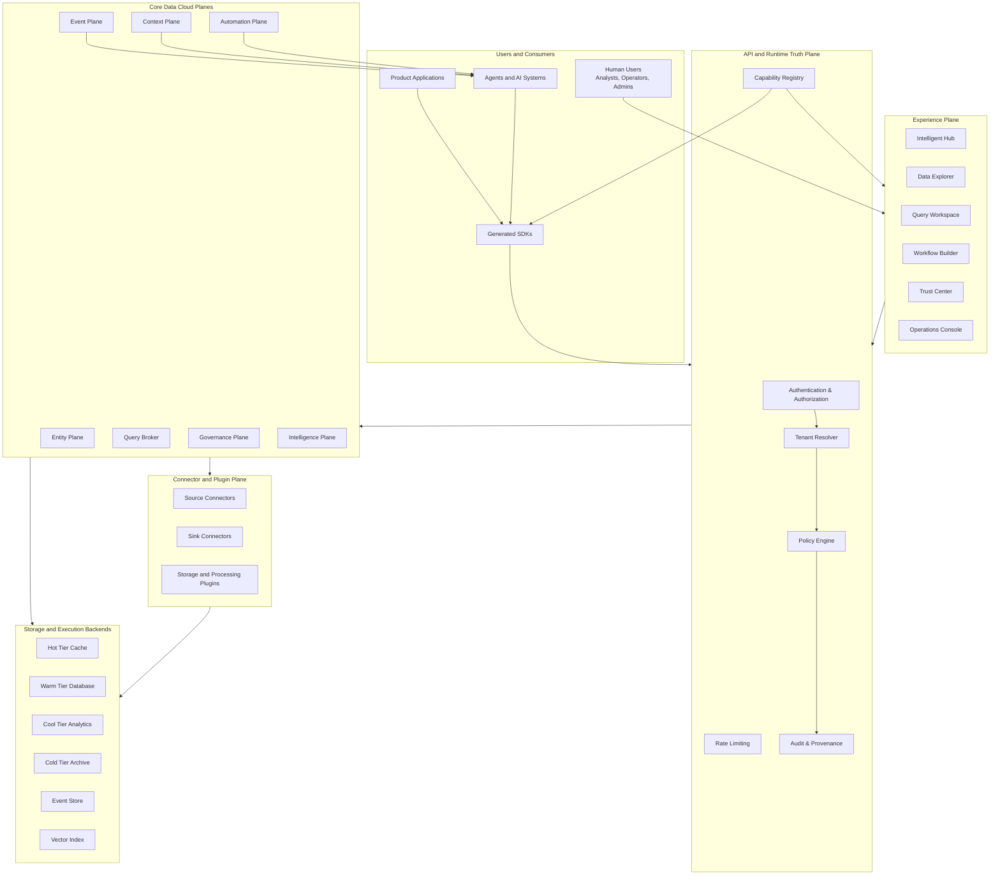

### 6.1 Architecture Layers

| Layer | What | Why |
|---|---|---|
| Experience Plane | UI surfaces for Data, Query, Workflows, Trust, Operations | Make complex data work simple and visible |
| API and Runtime Truth Plane | Auth, tenant, policy, capabilities, rate limiting, audit | Prevent false capability claims and cross-tenant leakage |
| Entity Plane | Entity CRUD, schema, validation, export, search | Application-facing operational data model |
| Event Plane | Append/query/tail/replay events | Provenance, audit, workflow, real-time context |
| Context Plane | Semantic context, snapshots, RAG, lineage | Ground agents and users in correct business context |
| Query Broker | SQL/NLQ/federated query, explain, cost | One query interface across tiers/sources |
| Workflow/Automation Plane | Pipelines, checkpoints, executions, logs | Reduce human labor with governed automation |
| Governance Plane | Retention, purge, redaction, compliance | Enterprise trust, privacy, sovereignty |
| Intelligence Plane | AI assist, anomaly, recommendation, model/feature registry | Embedded AI that solves work quietly |
| Connector/Plugin Plane | Sources/sinks/storage/processors | Avoid hard-coded integrations and vendor lock-in |
| Storage Backends | Hot/warm/cool/cold/event/vector stores | Optimize latency, cost, durability, search, analytics |

### 6.2 Why This Architecture

This architecture makes Data Cloud different because it treats context, governance, automation, and AI as runtime responsibilities of the data layer, not optional dashboard add-ons.

- **Context is built from operational truth**, not a stale semantic file
- **Governance is enforced in the execution path**, not a separate catalog report
- **Automation is policy-aware**, not a bot running around the system
- **AI is grounded in lineage, provenance, and freshness**, not generic RAG over unknown data
- **Human involvement is minimized but never removed where risk requires judgment**

### 6.3 Implementation Mapping

| Architectural Block | Implementation Notes |
|---|---|
| HTTP/SSE/WebSocket Gateway | REST API gateway with streaming support |
| Tenant/Auth | Authentication and authorization middleware with tenant resolution |
| Capability Registry | Runtime capability discovery and status endpoint |
| Entity Plane | Entity CRUD handlers with storage abstraction |
| Event Plane | Event log handlers with streaming support |
| Context Plane | Context management and RAG endpoints |
| Workflow Runtime | Pipeline and workflow execution handlers |
| Governance | Data lifecycle and policy enforcement handlers |
| AI Action Substrate | AI-assisted action handlers with provenance tracking |
| Storage Fabric | Multi-tier storage with profile-based provider selection |
| UI | Web application with capability-gated navigation |
| Agentic System Boundary | Public API and event integration contracts |

---

## 7. Component Architecture

### 7.1 Module Structure and Responsibilities

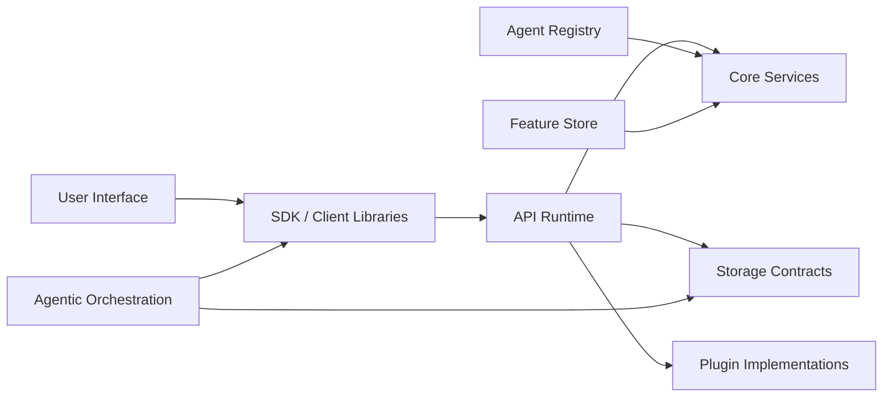

**Module responsibility rules:**

| Module | Should own | Should not own |
|---|---|---|
| User Interface | User/operator/admin experience, capability-gated navigation | Business logic, fallback mocks pretending to be live |
| SDK / Client Libraries | Generated typed clients, error models, streaming adapters | Hand-coded drift, placeholder success responses |
| API Runtime | HTTP runtime, route composition, middleware, deployment wiring | Domain storage internals beyond ports |
| Core Services | Data Cloud factory, profile discovery, default client | UI/API-specific behavior |
| Storage Contracts | Public provider contracts | Product-specific implementation details |
| Plugin Implementations | Plugin implementations | Core hard dependencies from domain |
| Agent Registry | Agent definitions and metadata | Agentic orchestration |
| Feature Store | Feature ingestion APIs/services | Model lifecycle UI |
| Agentic Orchestration | Multi-step agentic planning/orchestration | Data Cloud internal code dependency |

### 7.2 Runtime Bootstrap Sequence

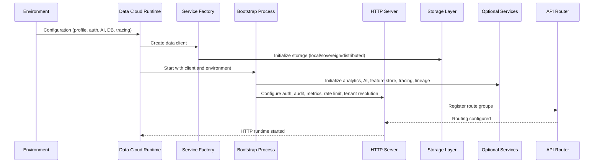

### 7.3 API Surface Groups

| API Group | What | Why | Target hardening |
|---|---|---|---|
| Health/info/metrics | Liveness, readiness, subsystem health | Operability | Split liveness vs readiness vs capability truth |
| Entities/search/export/validation | Main operational data API | App data plane | Add complete query contract, totals, filters, sort, schema |
| Events | Append/query/get event | Provenance and stream | Ensure all mutations emit rich canonical events |
| Pipelines/checkpoints/executions | Workflow metadata and execution | Automation | Durable first-party execution engine or strict capability gating |
| Alerts | Operator triage | Zero-manual ops direction | Add action audit, total counts, incident lifecycle |
| Memory/learning | Agent memory and intelligence | AI context | Govern confidence/provenance and retention |
| Analytics/reports/models/features | Query, reporting, AI/ML support | Embedded insight | Unified query broker and model governance |
| Governance/lineage/context/data products | Trust, context, productization | Enterprise fabric | Real compliance inventory and lineage graph |
| Capability/autonomy/plugin/agents | Runtime truth, automation control, extensibility | Progressive disclosure and safety | Make capability registry mandatory for UI/SDK |
| Federated/tier/cost | Cross-source/cross-tier operations | Data fabric economics | Source freshness, partial-result warnings, cost transparency |
| Voice/SSE/WebSocket/MCP | Multimodal and agent protocols | Modern interaction modes | Auth, tenancy, audit, throttling, replay semantics |

---

## 8. Target Capability Architecture

### 8.1 Capability Map

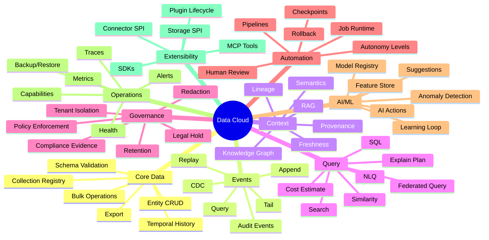

### 8.2 Capability Truth States

Every capability must declare a runtime state.

| State | Meaning | UI behavior |
|---|---|---|
| `live` | Fully available and validated | Show normally |
| `degraded` | Available with limitations | Show warning and limitations |
| `preview` | Available for experimentation | Operator-only or explicit preview badge |
| `unavailable` | Not configured or failed | Hide or disable with reason |
| `boundary` | UI/API shell exists, backend incomplete | Hide from primary workflows |
| `deprecated` | Exists for compatibility only | Redirect or warn |

**Required capability response fields:**

```json
{
  "id": "semantic_search",
  "name": "Semantic Search",
  "state": "degraded",
  "mode": "local-vector-plugin",
  "tenantScoped": true,
  "requiredDependencies": ["embedding_provider", "vector_index"],
  "availableDependencies": ["vector_index"],
  "missingDependencies": ["embedding_provider"],
  "lastProbeAt": "2026-04-25T12:00:00Z",
  "evidence": {
    "endpoint": "/api/v1/entities/:collection/similar",
    "handler": "SemanticSearchHandler",
    "tests": ["SemanticSearchIntegrationTest"]
  },
  "limitations": ["Uses local fallback embeddings when provider is absent"]
}
```

---

## 9. Detailed Logical Architecture

### 9.1 Request Lifecycle

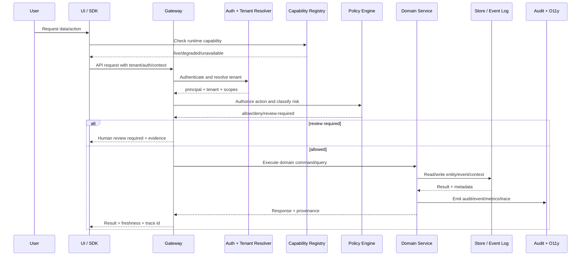

### 9.2 Data Lifecycle

```mermaid
flowchart LR
    Source["Source / Connector / API"] --> Ingest["Ingest"]
    Ingest --> Normalize["Normalize to Entity + Event"]
    Normalize --> Classify["Classify: schema, PII, retention, domain"]
    Classify --> Policy["Policy Decision"]
    Policy --> Store["Store in tier"]
    Store --> Index["Search / Vector / Analytics Index"]
    Index --> Context["Context + Lineage + Freshness"]
    Context --> Query["Query / RAG / Agent Context"]
    Query --> Action["Automation / Insight / Export"]
    Action --> Audit["Audit + Provenance + Feedback"]
    Audit --> Learn["Learning Loop"]
    Learn --> Classify
```

### 9.3 Automation Lifecycle

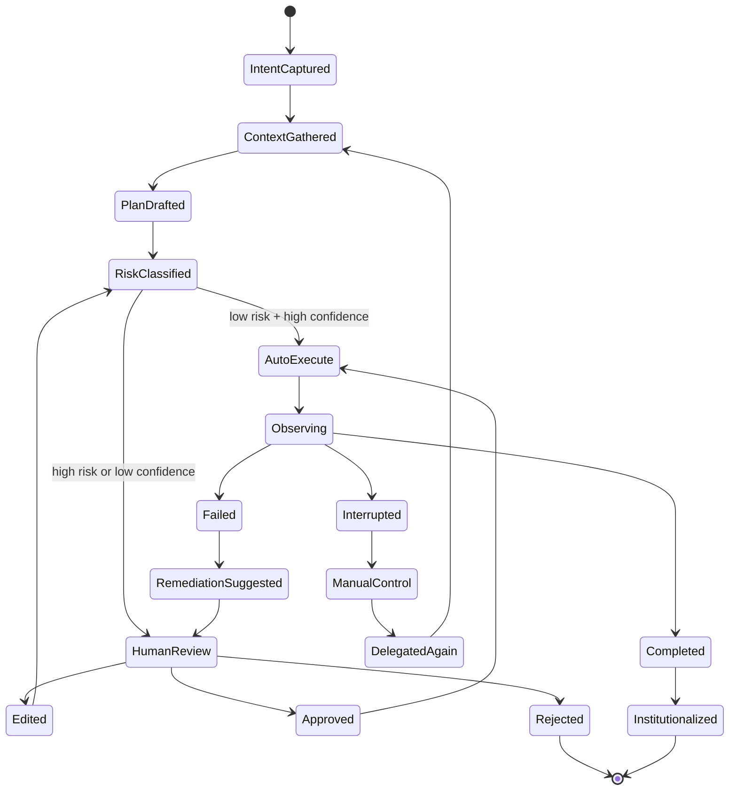

### 9.4 Human Takeover Contract

Every automation/action/workflow should expose:

| Field | Purpose |
|---|---|
| `executionId` | Unique execution handle |
| `tenantId` | Isolation boundary |
| `actor` | Human/system/agent identity |
| `automationLevel` | Current autonomy level |
| `status` | drafted/running/paused/interrupted/manual/completed/failed |
| `currentStep` | What is executing now |
| `plan` | Ordered actions and risk classification |
| `evidence` | Inputs, source data, policy checks, confidence |
| `interruptUrl` | Stop/pause immediately |
| `takeoverUrl` | Switch to manual |
| `delegateUrl` | Resume automation after edit |
| `rollbackUrl` | Roll back when supported |
| `auditTrail` | Immutable decision and action trail |

---

## 10. Multi-Tenancy, Privacy, Security, Sovereignty, and Provenance Architecture

### 10.1 Tenant Isolation Flow

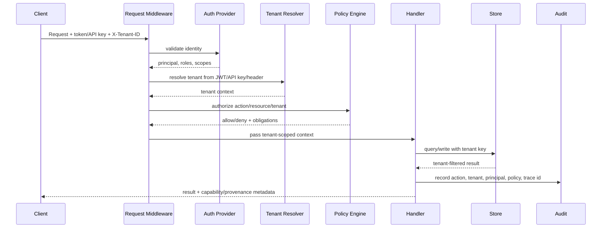

### 10.2 Required Tenant Guarantees

| Guarantee | Required behavior |
|---|---|
| Explicit tenant context | Production requests must not fall back to implicit/default tenant |
| Tenant-scoped storage | Every entity, event, context item, memory, policy, job, plugin state, and audit record includes tenant |
| Tenant-aware connectors | Source/sink credentials, schedules, quotas, and data residency policies are tenant-scoped |
| Tenant-safe analytics | Federated queries cannot cross tenant boundaries unless explicit shared-data contract exists |
| Tenant-specific sovereignty | Region, encryption key, retention, and legal-hold rules can vary by tenant |
| Tenant-level audit | Every access and mutation can be reconstructed by tenant |
| Tenant-level deletion/export | DSAR/export/delete workflows can target one tenant safely |
| Tenant quotas | Rate, storage, compute, jobs, AI tokens, connector load, and streaming subscriptions are enforceable |

### 10.3 Security/Privacy/Provenance Metadata Envelope

Every core data object should carry:

```json
{
  "tenantId": "tenant-123",
  "resourceId": "tickets/abc",
  "resourceType": "entity",
  "schemaVersion": "tickets.v3",
  "source": {
    "system": "salesforce",
    "connectorId": "sf-prod",
    "ingestedAt": "2026-04-25T10:12:30Z",
    "sourceRecordId": "500..."
  },
  "classification": {
    "sensitivity": "confidential",
    "pii": true,
    "phi": false,
    "financial": false,
    "retentionClass": "support-case-7y"
  },
  "sovereignty": {
    "region": "us-west",
    "residencyPolicy": "US_ONLY",
    "encryptionKeyRef": "kms://tenant-123/data"
  },
  "lineage": {
    "createdBy": "connector:sf-prod",
    "derivedFrom": ["event:offset-1234"],
    "transformIds": ["normalize-support-ticket-v2"]
  },
  "freshness": {
    "observedAt": "2026-04-25T10:12:30Z",
    "stalenessSeconds": 18
  },
  "audit": {
    "lastAccessedBy": "user:abc",
    "lastActionTraceId": "trace-xyz"
  }
}
```

### 10.4 Data Sovereignty Model

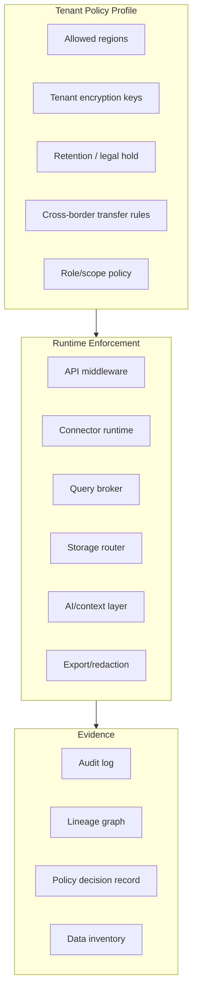

**Target behavior:** The system should know where tenant data is allowed to live, where it currently lives, who touched it, how it was transformed, whether it was exposed to an external AI provider, and what policy decision allowed each action.

### 10.5 Privacy and Data Sovereignty

Data Cloud should support sovereignty as a first-class deployment and policy dimension.

| Area | Required behavior |
|---|---|
| Data residency | Policy defines allowed regions/storage backends |
| AI provider routing | External LLM calls blocked unless policy allows data category/provider/region |
| Cross-border transfer | Query broker refuses or redacts data crossing policy boundary |
| Sovereign profile | No external LLM/service by default; local durable store; backup/restore evidence |
| Encryption | Tenant-aware key management; envelope encryption for sensitive tiers |
| PII handling | Detect, classify, redact, verify, and audit PII access/export |
| Legal hold | Override deletion/purge lifecycle safely |
| Provenance | Track data origin, transformations, and consumers |

### 10.6 Policy Enforcement Flow

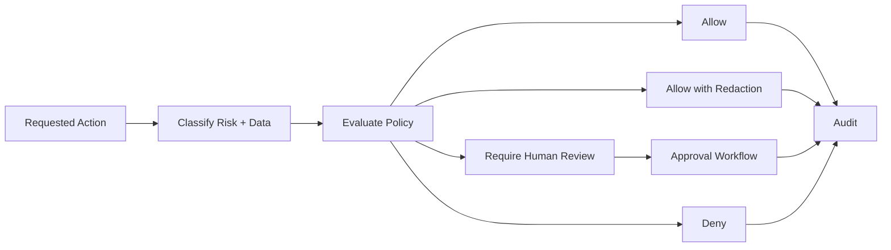

---

## 11. Data Plane Architecture

### 11.1 Entity Plane

**What:** Stores application-facing operational data in collections.

**Why:** Applications and agents need a reliable entity model, not just raw warehouse tables or event streams.

**Target hardening:**

- First-class collection registry with schema, owner, lifecycle, quality, retention, lineage, and status
- Complete query language: filters, search, sort, projection, pagination/cursor, total count, consistency level, freshness
- Versioned entity history with full CDC payloads or snapshots
- Schema validation and schema evolution
- Idempotency keys for writes
- Transactional or clearly per-item batch semantics
- Automatic semantic indexing and policy classification
- Entity-level provenance envelope

### 11.2 Event Plane

**What:** Append-only source of truth for changes, activities, automation actions, policies, and integration events.

**Why:** Event replay, audit, temporal query, workflow recovery, and agent context all require durable event history.

**Target event envelope:**

```json
{
  "eventId": "evt_...",
  "tenantId": "tenant-123",
  "type": "entity.saved",
  "version": "1.0",
  "occurredAt": "2026-04-25T10:12:30Z",
  "actor": {
    "type": "user|system|agent|connector",
    "id": "user-abc"
  },
  "resource": {
    "type": "entity",
    "collection": "tickets",
    "id": "ticket-123"
  },
  "operation": "create|update|delete|redact|purge|classify|execute",
  "before": {},
  "after": {},
  "patch": [],
  "policyDecision": {
    "decisionId": "pdp-...",
    "result": "allow",
    "obligations": ["redact.email"]
  },
  "traceId": "trace-...",
  "correlationId": "corr-...",
  "provenance": {
    "source": "api",
    "derivedFrom": []
  }
}
```

### 11.3 Query and Retrieval Plane

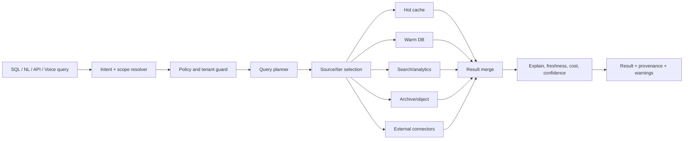

**Target behavior:** Users ask for what they need. Data Cloud decides the safest, freshest, cheapest credible path and explains the result.

### 11.4 Context and RAG Plane

**What:** Turns entities/events/lineage/semantic definitions into trusted agent/user context.

**Why:** AI agents fail without fresh, governed, semantically meaningful business context.

**Target hardening:**

- Context snapshot versioning
- Collection semantic models
- Entity embeddings with source/freshness/policy metadata
- Retrieval policies that respect tenant, PII, retention, and sovereignty
- RAG responses with citations/provenance and freshness
- Agent memory retention and deletion policies
- Feedback loop: user corrections update semantic/context confidence

---

## 12. Automation and Human Override Architecture

### 12.1 Automation Lifecycle

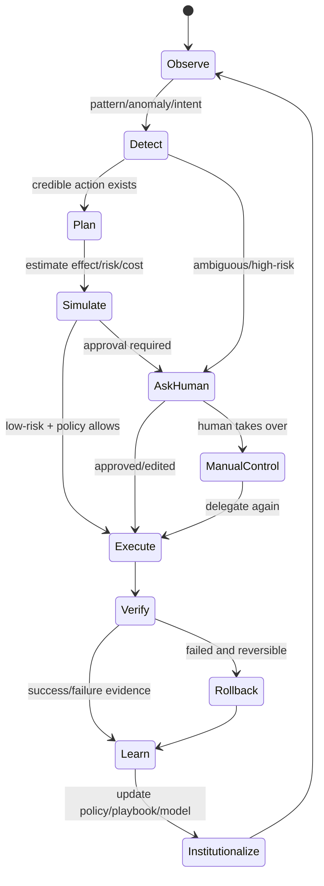

### 12.2 Autonomy Policy

| Domain | Example automations | Default target level | Human required when |
|---|---|---:|---|
| Query | suggest query, explain plan, choose source | L2-L3 | query touches sensitive data or low confidence |
| Data quality | detect anomalies, suggest fixes | L2-L3 | destructive mutation or uncertain mapping |
| Governance | classify retention/PII, suggest purge | L2 | purge/redaction/legal hold changes |
| Operations | group alerts, suggest remediation | L3 | high-impact remediation |
| Storage | recommend tier migration, compact tombstones | L3-L4 | migration changes sovereignty/cost SLA |
| Workflow | draft pipeline, validate DAG | L2-L3 | external side effects or low confidence |
| Connectors | infer schema, map fields, schedule sync | L2 | credential, PII, or cross-border risk |
| AI context | index, retrieve, summarize | L3 | external LLM exposure or regulated data |

### 12.3 Human Takeover Requirements

Every automation must expose:

- Current state
- Proposed plan
- Inputs used
- Confidence and risk band
- Policy decisions
- Expected impact
- Cost/latency/side-effect estimate
- Pause/stop/take-over controls
- Edit/approve/reject controls
- Rollback/compensation plan where possible
- Audit log and trace id

---

## 13. AI/ML-Native Architecture

### 13.1 Embedded AI as Substrate, Not Feature Noise

AI should be invisible unless needed. The UI should say:

- "I found 12 duplicate fields and merged the schema draft."
- "This query can run faster from the warm tier; I selected that path."
- "I cannot auto-purge because a legal hold may apply."
- "This answer is based on 3 fresh records and 2 stale records."

Not:

- "Click AI button."
- "Use AI assistant."
- "Generate magic."

### 13.2 AI Action Contract

Every AI-assisted action should produce a structured record:

```json
{
  "actionId": "ai_action_123",
  "tenantId": "tenant-123",
  "domain": "governance",
  "intent": "classify retention for tickets",
  "inputs": {
    "collections": ["tickets"],
    "sampleSize": 500,
    "contextSnapshot": "ctx_456"
  },
  "model": {
    "provider": "openai|ollama|rules|internal",
    "name": "gpt-4o|llama3|rules-v1",
    "version": "..."
  },
  "confidence": {
    "score": 0.82,
    "band": "medium",
    "reason": "schema implies email and customer_id but no policy exists"
  },
  "risk": {
    "level": "high",
    "reasons": ["privacy", "retention"]
  },
  "decision": {
    "mode": "requires_review",
    "recommendedAction": {},
    "alternatives": []
  },
  "provenance": {
    "traceId": "trace-...",
    "sources": []
  }
}
```

### 13.3 Where AI Should Be Pervasive

| Area | Embedded AI/ML role |
|---|---|
| Entity ingestion | schema inference, dedupe, type detection, PII detection |
| Query | NLQ, explain, optimization, source selection, cost warnings |
| Context | semantic embedding, retrieval ranking, stale-context detection |
| Governance | policy recommendation, data classification, redaction suggestion |
| Workflow | intent-to-plan, DAG validation, failure explanation |
| Operations | anomaly grouping, remediation recommendation, capacity forecasting |
| Connectors | field mapping, sync issue diagnosis, source reliability scoring |
| UI | next-best action, zero-cognitive-load progressive disclosure |
| Testing/quality | generated test cases, contract drift detection, evidence gap discovery |

---

## 14. UI/UX Target Architecture

### 14.1 Current IA

The current UI navigation includes:

- Home / Intelligent Hub
- Data
- Pipelines
- Query
- Trust
- Insights
- Alerts
- Operations
- Events
- Memory
- Entities
- Context
- Fabric
- Agents
- Settings
- Plugins
- Compatibility aliases

### 14.2 Target IA

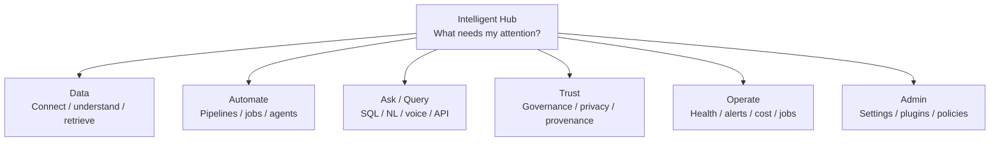

### 14.3 Primary UX Philosophy

Data Cloud UI should feel like a simple control room, not an admin maze.

The user sees:

1. **What matters now** — health, trust gaps, stale data, failing jobs, risky automations
2. **What Data Cloud already did** — automated classification, indexing, query planning, remediation
3. **What needs human judgment** — approvals, destructive actions, ambiguous mappings
4. **Where to go deeper** — lineage, raw events, query plans, policy evidence

### 14.4 UX Rules

1. **Dashboard-first:** show what changed, what is risky, what needs approval, and what was automated
2. **Progressive disclosure:** primary users see simple outcomes; operators/admins can drill down
3. **Runtime truth:** hide or mark unavailable features based on capability registry
4. **No fake controls:** filters, sort, totals, search, and actions must match backend behavior
5. **Explainable automation:** every suggestion/action has confidence, provenance, and control
6. **Human interruption:** every automation has stop/take-over/delegate-again path
7. **Trust always visible:** show tenant, freshness, policy, lineage, and audit where relevant
8. **No cognitive overload:** collapse raw technical surfaces into task-centered experiences

### 14.5 Simplification Recommendations

| Current surface | Recommendation |
|---|---|
| Data Explorer + Entities + Lineage + Quality | Keep unified under Data with tabs/views |
| Pipelines + Workflow Builder + Operations Jobs | Merge into Automate with create/run/review/history |
| Query + SQL + NL + Voice | Merge into Ask workspace with mode switch |
| Trust + Governance + Privacy | Keep Trust Center as policy/evidence cockpit |
| Insights + Operations + Alerts | Hub shows summary; Ops gives details |
| Fabric preview | Hide unless capability live or operator preview enabled |
| Agents/Memory/Context | Operator/developer surfaces; user sees outcomes in Data/Ask/Automate |
| Settings/Plugins | Admin-only; runtime capability-gated |

### 14.6 UI Must Be Capability-Gated

Before rendering any control, the UI should ask:

- Is the capability live?
- Is it tenant-authorized?
- Is it configured for this environment?
- Is it preview/degraded?
- Is there enough evidence to show this action safely?

If not, hide or disable with exact reason.

---

## 15. Customer-Facing Case Studies

These are written for real users (non-architects). Each shows:

- Situation (problem)
- What the user does (simple steps)
- What Data Cloud does automatically
- Final outcome (value)

### Case Study 1 — "I just want my app data to work reliably"

**Who:** SaaS product team (startup or enterprise)

**Situation:**
You are building a product. You need:

- database
- search
- events
- audit logs
- analytics

Right now, you're wiring multiple systems manually.

**What you do (user experience):**

1. Create a collection: `customers`
2. Start writing data via API/SDK
3. Open Data Cloud UI → Data page

**What Data Cloud does automatically:**

- Validates schema
- Tracks every change as an event
- Builds search + query indexes
- Tracks lineage and freshness
- Applies tenant isolation and policy

**Outcome:**

- No need to stitch multiple systems
- Everything is queryable, auditable, and consistent
- Your app becomes "data-complete" instantly

### Case Study 2 — "I want answers, not raw data"

**Who:** Analyst / business user

**Situation:**
You want to answer:

> "Which customers are at risk of churn and why?"

Normally you would:

- write SQL
- join multiple tables
- export to BI
- manually interpret

**What you do:**

1. Go to **Ask (Query)**
2. Type in plain English:
  - "Show customers likely to churn in last 30 days"

**What Data Cloud does automatically:**

- Converts intent → query plan
- Pulls data from correct sources
- Applies policy (no restricted data leakage)
- Uses AI to explain patterns
- Shows freshness + lineage + confidence

**Outcome:**

- You get a clear answer with explanation
- No SQL needed
- Fully auditable and trustworthy

### Case Study 3 — "Fix issues before I even notice them"

**Who:** Operations / SRE / platform team

**Situation:**
A search index is stale. Normally:

- users complain
- you debug logs
- manually fix pipelines

**What you do:**
Nothing.

**What Data Cloud does automatically:**

1. Detects anomaly (stale index)
2. Identifies root cause (connector lag)
3. Suggests fix OR auto-fixes (retry/rebuild)
4. If risky → asks for approval

**If needed, you can:**

- review the plan
- approve/reject
- take control

**Outcome:**

- Problems are fixed before impact
- You stay in control without doing everything manually

### Case Study 4 — "Make sure we are compliant (without guessing)"

**Who:** Security / compliance / legal team

**Situation:**
You need to answer:

- Where is PII stored?
- Is it encrypted?
- Who accessed it?

Today: spreadsheets, guesswork, audits.

**What you do:**

1. Go to **Trust Center**
2. View compliance summary
3. Drill into a collection

**What Data Cloud does automatically:**

- Detects PII fields
- Applies masking/redaction policies
- Tracks every access
- Enforces retention rules
- Generates audit evidence

**Outcome:**

- Real compliance (not documentation)
- Evidence-backed answers
- Faster audits

### Case Study 5 — "We need to run in our own environment (no data leakage)"

**Who:** Regulated enterprise (healthcare, finance, gov)

**Situation:**
You cannot send data to external AI or SaaS.

**What you do:**

1. Deploy Data Cloud in **sovereign mode**
2. Use local storage + optional local AI

**What Data Cloud does automatically:**

- Disables external AI by default
- Keeps all data local
- Applies strict policies
- Provides full audit logs

**Outcome:**

- Full control over data
- AI capabilities without compliance risk

### Case Study 6 — "Turn data into reusable products"

**Who:** Data/platform team

**Situation:**
Multiple teams need the same dataset (e.g., revenue metrics), but everyone recreates it.

**What you do:**

1. Publish a **data product**
2. Add description, SLA, ownership

**What Data Cloud does automatically:**

- Tracks lineage
- Monitors freshness
- Enforces access policy
- Notifies on SLA issues

**Outcome:**

- One trusted dataset
- Reuse across teams
- No duplication or inconsistency

### Case Study 7 — "Connect everything without writing glue code"

**Who:** Platform/data engineer

**Situation:**
Data is everywhere:

- DBs
- APIs
- files
- streams

**What you do:**

1. Configure a connector
2. Select source

**What Data Cloud does automatically:**

- Infers schema
- Normalizes data
- Adds lineage and metadata
- Makes it queryable instantly

**Outcome:**

- No custom pipelines
- Unified access layer
- Faster onboarding of new data sources

---

## 16. Technical Use Cases

### Use Case 1 — Unified Enterprise Retrieval Layer

**User problem:** Data is spread across SaaS apps, databases, files, events, warehouses, APIs, and logs. Users cannot retrieve the right information without manual glue.

**Data Cloud solution:** A single governed query/retrieval layer across entity store, event store, external connectors, semantic index, and analytics tiers.

**What happens:**

1. User asks a question in SQL, natural language, API, or voice.
2. Data Cloud resolves tenant, policy, intent, freshness, and source scope.
3. Query broker selects the safest/freshest sources.
4. Results return with provenance, confidence, freshness, and warnings.
5. If result is incomplete, system suggests next action.

**Needs done:**

- Canonical query broker
- Federated source freshness model
- Complete filter/sort/pagination/total semantics
- Strong RAG citations and policy-aware retrieval

### Use Case 2 — Security/Privacy/Provenance-First Data Layer

**User problem:** Multi-tenant data privacy, sovereignty, retention, legal hold, and audit are hard to enforce across fragmented systems.

**Data Cloud solution:** Every entity, event, query, export, automation, and AI action is policy-checked and provenance-tracked.

**What happens:**

1. Data is ingested with tenant/source/classification metadata.
2. Policy engine decides allowable access and obligations.
3. Query/export/redaction/purge flows enforce policy.
4. Audit log captures every action.
5. Trust Center shows evidence, not just summaries.

**Needs done:**

- Production fail-closed policy/audit
- Collection inventory reconciliation
- Legal hold enforcement
- True compliance evidence package

### Use Case 3 — Agent Context and Memory Backbone

**User problem:** AI agents operate with stale, scattered, unsafe context.

**Data Cloud solution:** Data Cloud becomes the context substrate for agentic systems.

**What happens:**

1. Agent asks for context using SDK/MCP/RAG.
2. Data Cloud retrieves tenant-safe, fresh, policy-compliant context.
3. Context includes lineage, event history, semantic definitions, memory, and confidence.
4. Agent writes results/checkpoints/memory back into Data Cloud.
5. Human can inspect and govern the agent's actions.

**Needs done:**

- Context snapshot versioning
- Agent memory retention and deletion
- Model/provider exposure policy
- Tool invocation audit

### Use Case 4 — Autonomous Workflow and Pipeline Operations

**User problem:** Data pipelines are manually designed, monitored, debugged, and repaired.

**Data Cloud solution:** Intent-to-pipeline automation with durable execution, logs, checkpoints, rollback, and human control.

**What happens:**

1. User states goal.
2. Data Cloud drafts DAG and estimates risk/cost.
3. Human approves if needed.
4. Workflow runs durably with event-backed checkpoints.
5. System detects failure and proposes remediation.
6. Operator can interrupt, modify, retry, or delegate again.

**Needs done:**

- Durable first-party workflow engine or hard capability gating
- Job center with retries/cancel/logs/progress
- Automation action contract
- Failure compensation model

### Use Case 5 — Data Product Publishing and Consumption

**User problem:** Teams need trustworthy reusable data assets with freshness, SLA, ownership, and governance.

**Data Cloud solution:** Publish collections/queries/streams as data products with contract, SLA, lineage, and subscription.

**What happens:**

1. Owner publishes a collection/query as a data product.
2. Data Cloud attaches schema, quality, freshness, lineage, retention, policy.
3. Consumers discover and subscribe.
4. Runtime monitors SLA and alerts on degradation.

**Needs done:**

- Data product lifecycle states
- SLA monitoring
- Consumer-specific access policy
- Contract compatibility checks

### Use Case 6 — Operator Trust and Autonomic Remediation

**User problem:** Operators drown in alerts and manual investigation.

**Data Cloud solution:** Alert grouping, root-cause context, suggested remediation, safe auto-actions, and audit.

**What happens:**

1. System detects health/capability/quality/latency anomaly.
2. Alerts are grouped and correlated with traces, events, jobs, and deployments.
3. Data Cloud proposes remediation with risk/confidence.
4. Low-risk actions can auto-run within autonomy policy.
5. High-risk actions require approval.

**Needs done:**

- Incident lifecycle
- Alert totals and SLA
- Model/rule provenance
- Remediation action registry and rollback

### Use Case 7 — Sovereign Single-Binary / Air-Gapped Data Fabric

**User problem:** Regulated environments need deployable data/AI infrastructure without SaaS dependency.

**Data Cloud solution:** Sovereign profile with embedded durable storage, no external LLMs by default, local policy/audit, exportable evidence.

**What happens:**

1. Operator runs Data Cloud in sovereign mode.
2. Entity/event storage persists locally.
3. External LLMs are disabled unless explicitly approved.
4. Audit, retention, and context operate inside boundary.
5. Evidence can be exported for compliance.

**Needs done:**

- Air-gapped connector catalog
- Local model registry/inference support
- Backup/restore and DR validation
- Sovereign policy pack

### Use Case 8 — Multimodal Data Interaction

**User problem:** Users should not need to know SQL, APIs, or platform internals.

**Data Cloud solution:** SQL, NL, voice, dashboard, API, and agent access all use the same governed query/context layer.

**What happens:**

1. User speaks/types intent.
2. Voice/NL classifier maps to query/workflow/trust/operation intent.
3. Data Cloud performs safe plan or asks clarifying question.
4. Result is visualized and actionable.

**Needs done:**

- Unified intent model
- Clarification workflow
- Shared query/action planner
- Accessibility and mobile validation

---

## 17. Module and Dependency Architecture

### 17.1 Current Module Boundaries

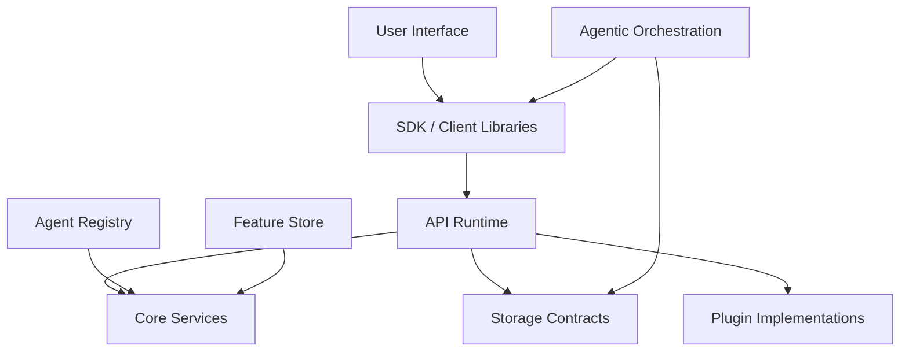

### 17.2 Boundary Rules

| Rule | Why |
|---|---|
| Data Cloud modules must not depend on agentic system internals | Prevent product circularity |
| Agentic systems integrate via public APIs/events/contracts | Keep Data Cloud as data backbone, not orchestration dependent |
| SDK must not import runtime internals | Keep client stable and transport-based |
| UI must consume generated contract clients | Prevent route drift |
| Storage providers must implement SPI | Preserve plugin-driven openness |
| Governance/security dependencies are platform-level concerns | Avoid per-feature inconsistent enforcement |

### 17.3 Recommended Target Module Additions

| Module | Purpose |
|---|---|
| `capability-registry-core` | Runtime truth model, dependency probes, state transitions |
| `query-broker` | Canonical query planning/execution/freshness/cost/source model |
| `policy-engine` | Tenant, privacy, residency, retention, export, AI policy enforcement |
| `ai-action-core` | Suggestion/action/provenance/confidence/review/rollback model |
| `connector-spi` | Source/sink connectors, schema inference, credential interface |
| `workflow-runtime` | First-party durable job engine and human takeover model |
| `evidence-packager` | Compliance/audit/export evidence generation |
| `sovereign-runtime-pack` | Air-gapped defaults, local model adapters, backup/restore policies |

---

## 18. Critical Data Contracts

### 18.1 Entity Envelope

```json
{
  "tenantId": "tenant-a",
  "collection": "tickets",
  "id": "ticket-123",
  "version": 7,
  "schemaVersion": "tickets.v3",
  "data": {},
  "metadata": {
    "createdAt": "2026-04-25T10:00:00Z",
    "updatedAt": "2026-04-25T10:05:00Z",
    "source": "zendesk-connector",
    "classification": ["internal", "pii-email"],
    "residency": "us-west",
    "freshnessAt": "2026-04-25T10:05:00Z",
    "lineageId": "lin-123",
    "policyIds": ["retention-7y", "pii-mask-email"],
    "traceId": "trace-abc"
  }
}
```

### 18.2 Event Envelope

```json
{
  "tenantId": "tenant-a",
  "eventId": "evt-123",
  "offset": "94421",
  "type": "entity.updated",
  "occurredAt": "2026-04-25T10:05:00Z",
  "actor": {
    "type": "user|system|agent",
    "id": "user-123"
  },
  "subject": {
    "collection": "tickets",
    "id": "ticket-123"
  },
  "before": {},
  "after": {},
  "patch": [],
  "policyDecision": {},
  "provenance": {},
  "traceId": "trace-abc"
}
```

### 18.3 Query Response Envelope

```json
{
  "queryId": "qry-123",
  "tenantId": "tenant-a",
  "status": "complete|partial|failed",
  "data": [],
  "page": {
    "cursor": "next-cursor",
    "limit": 50,
    "total": 1532,
    "hasMore": true
  },
  "sources": [
    {
      "id": "postgres-warm",
      "type": "entity-store",
      "freshnessAt": "2026-04-25T10:04:59Z",
      "policyFiltered": true
    }
  ],
  "warnings": [],
  "cost": {
    "estimatedUnits": 12.2,
    "tier": "warm"
  },
  "provenance": {},
  "traceId": "trace-abc"
}
```

### 18.4 AI Action Envelope

```json
{
  "actionId": "ai-act-123",
  "tenantId": "tenant-a",
  "domain": "governance|query|workflow|operations|data-quality",
  "type": "suggest|draft|execute|remediate|explain",
  "summary": "Recommend adding PII masking policy for email field",
  "confidence": {
    "score": 0.91,
    "band": "high",
    "calibrated": true
  },
  "risk": {
    "level": "low|medium|high|critical",
    "requiresHumanReview": true,
    "reasons": ["privacy-impact"]
  },
  "evidence": {
    "inputs": [],
    "policies": [],
    "lineage": [],
    "model": {
      "provider": "local-llm",
      "name": "policy-classifier-v2",
      "version": "2.3.1"
    }
  },
  "proposedChanges": [],
  "rollbackPlan": {},
  "status": "draft|approved|rejected|executed|rolled_back",
  "auditTrail": []
}
```

---

## 19. Current Done vs Needs-to-Be-Done Matrix

### 19.1 Product and Strategy

| Area | Already done | Needs to be done |
|---|---|---|
| Product thesis | Context-native operational data fabric described | Tighten claims to runtime truth; avoid overstating incomplete features |
| Market positioning | Competitor comparisons exist | Convert to crisp buyer narrative and evidence-backed capability matrix |
| Use cases | Many capability examples exist | Prioritize 4-6 flagship journeys with E2E proof |
| Documentation | README, REST docs, runbooks, route truth, audits | Keep all docs generated from same contract/runtime truth |

### 19.2 Backend/API

| Area | Already done | Needs to be done |
|---|---|---|
| HTTP server | Route groups in router | Contract-test every route against OpenAPI |
| Entities | CRUD/batch/export/history/search/similar routes | Complete query semantics, true history, schema lifecycle |
| Events | Append/query/get routes and event log | Rich event envelopes for all mutations; replay semantics |
| Pipelines | Metadata/checkpoint/execution routes | Durable job engine or strict plugin gating |
| Analytics | Query/aggregate/explain/report routes | Unified query broker with source/freshness/cost |
| Governance | Retention/redaction/purge routes | Legal hold, full compliance inventory, fail-closed policy/audit |
| Lineage/context/RAG | Route surfaces exist | True end-to-end lineage and cited RAG |
| AI/ML | AI assist, models, features, brain, learning | Unified AI action/provenance substrate |
| Capabilities | Capability registry endpoint exists | Make it universal gating authority |
| Settings | General/security endpoints | Persistent API key/profile/preferences/notification lifecycle |
| Plugins | Plugin route lifecycle | Real install/activate/migrate/rollback model |
| Autonomy | Level/domain/log endpoints | Domain-specific policy and action logs |

### 19.3 Data and Storage

| Area | Already done | Needs to be done |
|---|---|---|
| Local mode | In-memory entity/event store | Clearly banner as non-durable dev/test only |
| Sovereign mode | Embedded database-backed entity/event store | DR, compaction, backup, restore, air-gap validation |
| Non-local mode | Durable provider fail-fast via provider discovery | Production-grade providers and HA topology docs |
| Multi-tier storage | Architecture/docs/plugin pieces exist | Automatic tiering, policy-aware routing, cost model |
| Search/vector | Semantic routes exist | Durable vector index, reindex, freshness, privacy |
| Event durability | Multiple storage options described | Provider conformance suite and operational SLOs |

### 19.4 UI/UX

| Area | Already done | Needs to be done |
|---|---|---|
| Simplified route IA | Intelligent Hub/Data/Pipelines/Query/Trust/Insights/Ops | Collapse more technical surfaces behind roles/capabilities |
| Lazy loading/error boundaries | Implemented in route config | Ensure page-level error states use runtime truth |
| Role disclosure | Described in documentation | Enforce with auth and capability registry |
| Data Explorer | Unified direction | Backend query semantics must match UI controls |
| Trust Center | Governance routes wired | Evidence-first compliance and destructive-action approvals |
| Operations/Alerts | Live operator surfaces | Incident lifecycle, totals, audit, remediation provenance |
| Settings | UI route exists | Backend contract and persistence must match |
| Fabric | Preview route exists | Real metrics API and capability gating |

### 19.5 DevEx / Tests / Operations

| Area | Already done | Needs to be done |
|---|---|---|
| Runbooks/scripts | Backup, restore, smoke, drift, coverage scripts exist | Make CI gates non-optional and green |
| OpenAPI | Canonical contract path described | Generate UI/SDK clients and enforce drift |
| Tests | Many route-level tests exist | 100% meaningful coverage for critical flows; UI type-check green |
| Deployment assets | Container, orchestration, and operational assets present | Environment-validated production reference deployment |
| Observability | Metrics/tracing hooks exist | Required dependency truth, trace export status, dashboards |
| SDK | Generation path exists | Remote client must never return placeholder successes |

---

## 20. Target Roadmap

### P0 — Trust and Correctness Closure

These are required before claiming enterprise readiness.

1. **Runtime truth contract**
   - Make capability registry the single source for UI/SDK route gating
   - Include status, mode, dependency, probe, last checked time, degraded reason, and docs link

2. **Query semantics**
   - Implement end-to-end filter/search/sort/pagination/total/cursor semantics
   - Update OpenAPI, UI clients, SDKs, tests

3. **Temporal/event truth**
   - Store full CDC payloads or snapshots
   - Rebuild point-in-time history from event/snapshot truth

4. **Governance correctness**
   - Reconcile collection inventory with policy inventory
   - Stop compliance summaries from marking unknown data as compliant
   - Add legal hold and approval flow for destructive actions

5. **Fail-closed production security**
   - No production startup without auth, tenant enforcement, policy, and audit
   - No default tenant fallback in production

6. **OpenAPI/SDK truth**
   - Remove or mark unsupported placeholder clients
   - Generate clients from OpenAPI and run contract tests

7. **UI build/test gate**
   - Restore type-check and test green status
   - Hide unsupported controls until backed by API capability

### P1 — Data Fabric Foundation

1. First-class collection registry
2. Connector framework MVP: DB/file/API/stream
3. Query broker with explain/freshness/cost/source provenance
4. Data product lifecycle with SLA and subscription
5. Storage tier routing and cost reporting
6. Lineage graph from ingestion through transformation and consumption
7. RAG with citations, freshness, and policy filtering

### P2 — Automation and AI-Native Differentiation

1. Unified AI action/provenance contract
2. Intent-to-workflow builder with policy-gated execution
3. Autonomy controller per domain
4. Alert grouping/root-cause/remediation engine
5. Human takeover/interrupt/delegate-again workflow
6. Learning loop: accepted/rejected suggestions improve policies/playbooks/models
7. Local/sovereign AI model support

### P3 — Enterprise-Grade Scale and Ecosystem

1. HA durable providers and conformance suite
2. Multi-region/multi-sovereignty deployment
3. Plugin marketplace with install/activate/migrate/rollback
4. Advanced model/feature governance
5. Full compliance evidence packages
6. SaaS/on-prem/hybrid deployment reference architectures
7. Benchmarks against fragmented incumbent stacks

---

## 21. Reference Deployment Architecture

### 21.1 Local Developer

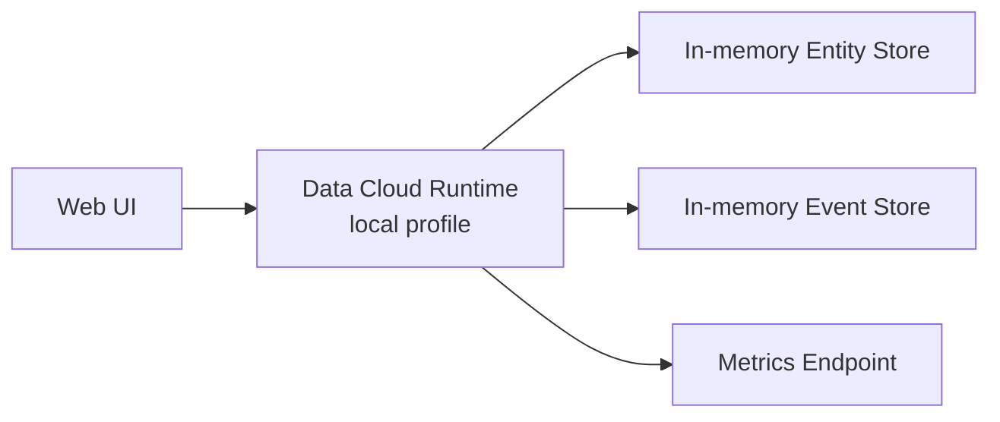

**Purpose:** fast iteration only  
**Must not claim:** durability, HA, production security, regulatory compliance

### 21.2 Sovereign / Air-Gapped

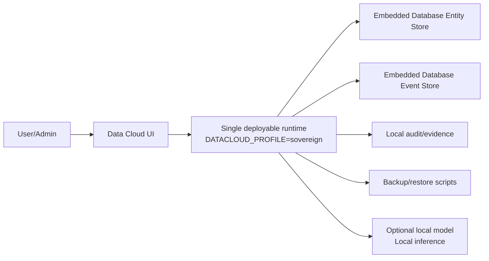

**Purpose:** regulated/single-binary/self-hosted/air-gapped environments  
**Needs:** validated DR, encryption key management, local AI policy, plugin pack

### 21.3 Standard Enterprise / Distributed

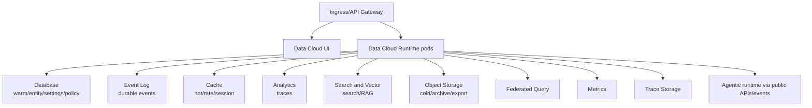

**Purpose:** production multi-tenant operational fabric  
**Required:** strict tenant, policy, audit, provider HA, backups, SLOs, capability truth, CI/CD gates

---

## 22. Architecture Decisions to Add or Update

| ADR | Decision needed |
|---|---|
| ADR-DC-002 Runtime capability truth | Capability registry is mandatory source for all UI/SDK feature gating |
| ADR-DC-003 Query contract | Canonical query/filter/sort/pagination/freshness/cost schema |
| ADR-DC-004 Event envelope | Required event fields for replay, audit, provenance, and context |
| ADR-DC-005 Governance fail-closed | Production policy/audit/tenant requirements |
| ADR-DC-006 Automation control | Autonomy levels, human takeover, rollback, audit |
| ADR-DC-007 AI action provenance | Required AI suggestion/action evidence model |
| ADR-DC-008 Connector SPI | Source/sink lifecycle, schema inference, credentials, health, tenancy |
| ADR-DC-009 Sovereign profile | Air-gap guarantees, disabled external services, backup/restore |
| ADR-DC-010 Data product lifecycle | Publish/discover/subscribe/SLA/deprecate |
| ADR-DC-011 SDK generation | OpenAPI-generated clients only; no placeholder success clients |

---

## 23. Acceptance Criteria for "Disruptive Enterprise-Ready Data Cloud"

Data Cloud can credibly claim the target position when:

1. A tenant can ingest/connect data, query it, govern it, and automate work without leaving Data Cloud
2. Every UI control is backed by a real route and a tested backend behavior
3. Every runtime capability has a live/degraded/unavailable truth state
4. Every entity mutation emits enough event/provenance data to reconstruct history
5. Every query result carries source, freshness, tenant, policy, and trace metadata
6. Every destructive action has approval, policy, audit, and verification
7. AI actions include confidence, provenance, model/provider, risk, and rollback status
8. Human users can interrupt or take over automation at any point
9. Non-local deployments fail closed without durable providers, auth, policy, and audit
10. OpenAPI, SDKs, UI clients, tests, and docs are generated or validated from the same contract
11. Production deployment has validated backup/restore, HA, SLOs, observability, and incident response
12. Product pages and docs never claim more than runtime evidence supports

---

## 24. Recommended Immediate Implementation Plan

### Week 1 — Truth and Contract Lockdown

- Freeze new capability surfaces
- Generate current route inventory from router configuration
- Diff OpenAPI, REST docs, UI clients, and route truth
- Mark every route as live/partial/preview/degraded/unavailable
- Build capability registry schema and UI gate
- Remove/hide unsupported UI actions

### Week 2 — Query/Entity Correctness

- Define canonical query schema
- Add server-side search/filter/sort/pagination/total
- Implement collection registry or formalize collections
- Add contract tests and UI tests
- Fix counts and pagination

### Week 3 — Event/History/Governance Truth

- Expand CDC event payloads
- Implement entity history from snapshots/events
- Rework compliance summary from real collection + policy inventory
- Add legal hold and destructive-action approval model
- Fail closed when audit/policy unavailable in production

### Week 4 — Automation and AI Action Substrate

- Define AI action contract
- Refactor AI assist, alert suggestions, workflow drafts into unified action records
- Add human approval/takeover model
- Add autonomy policy per domain
- Add audit and capability gates

### Week 5+ — Data Fabric and Connectors

- Connector SPI MVP
- Source registry, credentials, health
- Query broker with source selection
- Data product lifecycle
- Storage tier automation

---

## 25. C4 Architecture Model

This section converts the architecture into a C4-style model: System Context, Containers, Components, and deployment/runtime views.

### 25.1 C4 Level 1 — System Context

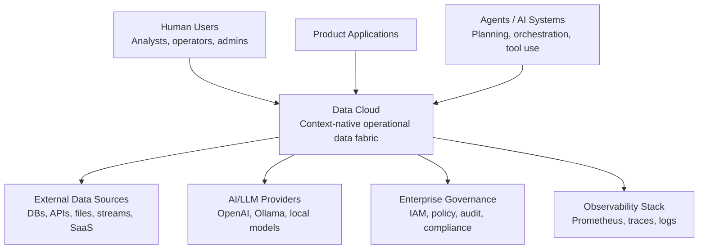

**Intent:** Data Cloud is the center of operational data truth for humans, applications, and agents. It should not be merely a storage service; it should be the governed context and automation substrate.

### 25.2 C4 Level 2 — Container View

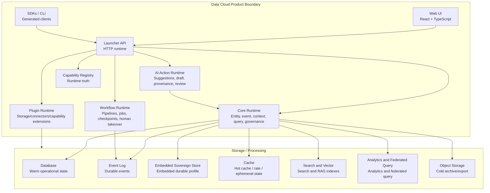

**Container mapping:**

| C4 container | Implementation focus | Target hardening |
|---|---|---|
| Web UI | User/operator/admin experience | Capability-gated IA, generated clients, type-check |
| Launcher API | Route composition and middleware | Route/OpenAPI drift enforcement, fail-closed security |
| Core Runtime | Domain logic | Complete query/event/governance semantics |
| Workflow Runtime | Pipeline/checkpoint/execution handlers | First-party durable runtime and takeover model |
| AI Action Runtime | AI assist, alerts, learning | Unified AI action/provenance contract |
| Plugin Runtime | Storage and processing plugins | Install/migrate/rollback/conformance lifecycle |
| Capability Registry | Capability discovery | Universal runtime truth source |

### 25.3 C4 Level 3 — Launcher/API Component View

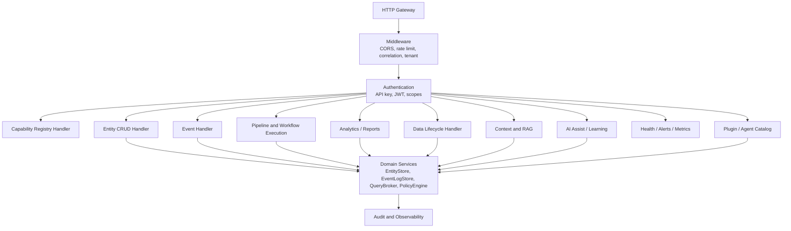

**Component rule:** all handlers must share the same tenant, policy, audit, query, event, and capability primitives. No handler should invent its own truth model.

### 25.4 C4 Level 3 — Core Domain Component View

```mermaid
flowchart LR
    Entity["Entity Service"]
    Event["Event Service"]
    Query["Query Broker"]
    Context["Context Service"]
    Policy["Policy Engine"]
    Lineage["Lineage Service"]
    AIAction["AI Action Service"]
    Workflow["Workflow Service"]
    DataProduct["Data Product Service"]
    Capability["Capability Service"]
    Audit["Audit Service"]

    Entity --> Event
    Entity --> Policy
    Entity --> Lineage
    Entity --> Context
    Query --> Policy
    Query --> Context
    Query --> Lineage
    AIAction --> Query
    AIAction --> Policy
    Workflow --> AIAction
    Workflow --> Event
    DataProduct --> Entity
    DataProduct --> Policy
    Capability --> Query
    Capability --> Workflow
    Capability --> AIAction
    Policy --> Audit
    Event --> Audit
    Workflow --> Audit
```

**Target design:** query, policy, context, and audit must be core services reused everywhere, not handler-specific utility logic.

### 25.5 C4 Level 4 — Critical Code Units to Introduce or Harden

| Unit | Type | Why it matters |
|---|---|---|
| `CapabilityRegistryService` | Core service | Single runtime truth for UI/API/SDK gating |
| `QueryBroker` | Core service | Canonical query, source, freshness, pagination, cost, warnings |
| `PolicyDecisionService` | Core service | Fail-closed policy enforcement for read/write/export/AI/action |
| `EventEnvelopeFactory` | Core utility/service | Complete replayable event/audit/provenance envelope |
| `AiActionService` | Core service | Unify suggestions, drafts, remediations, provenance, review |
| `WorkflowRuntimeService` | Core service | Durable execution, pause, interrupt, takeover, delegate-again |
| `ConnectorRuntime` | Plugin/service | Ingest/federate external sources consistently |
| `EvidencePackageService` | Governance service | Compliance/audit export with proof, not summary-only claims |
| `TenantSecurityContext` | Platform contract | Prevent tenant/auth drift across handlers |
| `GeneratedDataCloudClient` | SDK/client | Remove placeholder-success risk and contract drift |

---

## 26. Visual Architecture Diagram Pack

This section provides simplified diagrams optimized for export as rendered images.

### 26.1 Diagram A — Product Positioning

```mermaid
flowchart LR
    Fragmented["Current enterprise stack<br/>DB + Kafka + Search + Warehouse + Governance + AI glue"]
    Pain["Pain<br/>High integration cost<br/>Weak tenant/privacy guarantees<br/>Stale context<br/>Manual operations"]
    DC["Data Cloud<br/>Context-native operational data fabric"]
    Outcome["Outcome<br/>One governed runtime<br/>Entity + event + context<br/>Automation with human override"]

    Fragmented --> Pain --> DC --> Outcome
```

### 26.2 Diagram B — North-Star Capability Stack

```mermaid
flowchart TB
    Experience["Experience<br/>Hub, Data, Ask, Automate, Trust, Operate"]
    Access["Access<br/>REST, SSE, WebSocket, MCP, SDK"]
    Runtime["Runtime<br/>Entity, Event, Query, Context, Workflow"]
    Trust["Trust<br/>Tenant, Policy, Privacy, Provenance, Audit"]
    Intelligence["Intelligence<br/>AI actions, anomaly, recommendations, learning"]
    Fabric["Fabric<br/>Connectors, plugins, storage tiers, analytics"]

    Experience --> Access --> Runtime
    Runtime --> Trust
    Runtime --> Intelligence
    Runtime --> Fabric
```

### 26.3 Diagram C — Source to Governed Context

```mermaid
flowchart LR
    Source["Source"] --> Connect["Connect"]
    Connect --> Normalize["Normalize"]
    Normalize --> Govern["Govern"]
    Govern --> Store["Store"]
    Store --> Index["Index"]
    Index --> Context["Context"]
    Context --> Use["Query / RAG / Automate"]
    Use --> Learn["Observe + Learn"]
    Learn --> Govern
```

### 26.4 Diagram D — Runtime Truth Gating

```mermaid
flowchart TB
    UI["UI / SDK wants capability"] --> Cap["Capability Registry"]
    Cap --> Live{"Capability live?"}
    Live -->|Yes| Enable["Enable action"]
    Live -->|Degraded| Warn["Enable with warning"]
    Live -->|Preview| Preview["Operator preview only"]
    Live -->|No| Hide["Hide or disable with reason"]
    Enable --> Execute["Execute via API"]
    Warn --> Execute
    Preview --> Execute
```

### 26.5 Diagram E — Human Override Loop

```mermaid
flowchart LR
    Intent["Intent"] --> Plan["Plan"]
    Plan --> Risk["Risk + confidence"]
    Risk --> Auto["Auto execute"]
    Risk --> Review["Human review"]
    Auto --> Observe["Observe"]
    Observe --> Done["Done"]
    Observe --> Interrupt["Interrupt"]
    Interrupt --> Manual["Manual control"]
    Manual --> Delegate["Delegate again"]
    Delegate --> Plan
    Review --> Approve["Approve/Edit"] --> Auto
    Review --> Reject["Reject"]
```

### 26.6 Diagram F — Security and Sovereignty Control Plane

```mermaid
flowchart TB
    Request["Request"] --> Tenant["Tenant resolution"]
    Tenant --> Auth["Auth + scopes"]
    Auth --> Classify["Classify data/action"]
    Classify --> Policy["Policy evaluation"]
    Policy --> Decision{"Decision"}
    Decision -->|Allow| Execute["Execute"]
    Decision -->|Redact| Redact["Redact then execute"]
    Decision -->|Review| Review["Human approval"]
    Decision -->|Deny| Deny["Deny"]
    Execute --> Audit["Audit evidence"]
    Redact --> Audit
    Review --> Audit
    Deny --> Audit
```

### 26.7 Diagram G — Deployment Options

```mermaid
flowchart LR
    Dev["Local<br/>In-memory dev"]
    Sovereign["Sovereign<br/>Embedded durable, air-gapped"]
    Enterprise["Enterprise Distributed<br/>HA providers, policy, observability"]

    Dev --> Promote["Validate contracts"]
    Sovereign --> Promote
    Enterprise --> Promote
    Promote --> Product["Same API + capability truth"]
```

### 26.8 Diagram H — Data Cloud and Agentic System Boundary

```mermaid
flowchart LR
    DC["Data Cloud<br/>Data, events, context, memory, governance"]
    Contract["Public APIs / Events / MCP Tools"]
    AEP["Agentic System<br/>Agent planning and orchestration"]
    Result["Results, checkpoints, telemetry, learned memory"]

    DC --> Contract --> AEP --> Result --> DC
```

---

## 27. Diagram Export Guidance

To export diagrams as images for presentations and documentation:

1. Keep this Markdown document as the source-of-truth spec
2. Copy a Mermaid block into Mermaid Live Editor, GitHub preview, or VS Code Markdown Preview Mermaid
3. Export diagrams as SVG for docs and PNG for presentations
4. Store exported diagrams under documentation diagrams folder
5. Reference exported diagrams from architecture docs, decks, and README pages

Recommended file names:

| Diagram | Suggested file |
|---|---|
| Product positioning | `data-cloud-product-positioning.svg` |
| North-star capability stack | `data-cloud-capability-stack.svg` |
| Source to governed context | `data-cloud-source-to-context.svg` |
| Runtime truth gating | `data-cloud-runtime-truth-gating.svg` |
| Human override loop | `data-cloud-human-override-loop.svg` |
| Security and sovereignty | `data-cloud-security-sovereignty.svg` |
| Deployment options | `data-cloud-deployment-options.svg` |
| Data Cloud and agentic system boundary | `data-cloud-agentic-boundary.svg` |
| C4 system context | `data-cloud-c4-system-context.svg` |
| C4 container view | `data-cloud-c4-container-view.svg` |
| C4 launcher component view | `data-cloud-c4-launcher-components.svg` |
| C4 core domain component view | `data-cloud-c4-core-domain-components.svg` |

---

## 28. Final Architecture Summary

Data Cloud provides a strong foundation for operational data management. The next transformation is to make it **truthful, governed, durable, automated, and simple**.

The strongest position is:

> Data Cloud is the context-native operational data fabric that lets applications, humans, and agents retrieve, process, govern, visualize, and automate over enterprise data through one tenant-safe, policy-enforced, provenance-rich runtime.

The winning product will not be the one with the most endpoints. It will be the one where a user can say:

> "Find the right data, explain where it came from, govern it safely, automate the next step, and only interrupt me when my judgment is truly needed."

That is the north-star architecture for Data Cloud.

