# Data Cloud Architecture Review and Futuristic Target Architecture

**Repository reviewed:** `samujjwal/ghatana`  
**Product scope:** `products/data-cloud`  
**Date:** 2026-04-25  
**Review mode:** repository/document/code inspection through GitHub connector; no local build/test execution was performed in this pass.  
**Purpose:** synthesize current implementation, architecture, product vision, and recent positioning discussions into a detailed high-level architecture document with diagrams, use cases, current-state evidence, gaps, and roadmap.

---

## 1. Executive Summary

Data Cloud should be positioned as a **Context-Native Operational Data Fabric**: a single, security/privacy/provenance-first data layer for information retrieval, extraction, processing, visualization, governance, and automation across human and agent workflows.

The repository already contains a strong foundation:

- A Java 21 + ActiveJ deployable launcher with a broad REST surface.
- Tenant-aware entity CRUD, event append/query/tail, pipeline metadata, workflow execution hooks, memory, brain, learning, governance, lineage, context/RAG, data products, capability registry, plugins, autonomy, alerts, settings, analytics, models, features, federated query, tier migration, SSE, and WebSocket endpoints.
- A `DataCloud` factory and profile model with local in-memory, sovereign embedded H2, and non-local ServiceLoader durable provider discovery.
- A React/TypeScript UI with simplified IA around Intelligent Hub, Data, Pipelines, Query, Trust, Insights, Operations, Alerts, Events, Memory, Context, Fabric, Agents, Settings, and Plugins.
- Runbooks, REST documentation, route truth matrix, OpenAPI drift checks, coverage gates, Kubernetes/Helm assets, and full-stack audit documentation.
- An accepted module ownership ADR defining strict dependency boundaries and the intended separation between Data Cloud and AEP.

However, the current implementation still has a gap between the **strategic promise** and **enterprise-grade disruptive product readiness**. The most important work is not adding more surfaces. It is making every visible capability truthful, durable, policy-enforced, automation-first, tenant-safe, observable, and contract-consistent end to end.

The target product should reduce human effort toward zero by default. The user should not have to manually stitch systems, validate every query, clean every source, wire every connector, tune every retention policy, or supervise every workflow. Data Cloud should do as much as it can credibly do automatically, show exactly what it did, and bring a human into the loop only for low-confidence, high-risk, governance-sensitive, destructive, ambiguous, or policy-required decisions. Even then, a human must be able to interrupt, override, take control, delegate again, and inspect the full evidence trail.

---

## 2. Product Identity

### 2.1 What Data Cloud Is

Data Cloud is the **application-facing operational data fabric** for multi-tenant, AI-native products. It owns the data context that applications, workflows, operators, and agents need to retrieve, process, reason, govern, visualize, and automate.

It should act as:

1. **Entity plane** — operational entity storage and retrieval.
2. **Event plane** — append-only change, activity, and system event persistence.
3. **Context plane** — semantic, lineage, provenance, freshness, knowledge, and RAG-ready context.
4. **Automation plane** — pipelines, job execution, autonomous suggestions, policy-gated actions, and human override.
5. **Governance plane** — tenant isolation, security, retention, privacy, compliance, audit, data sovereignty, and policy enforcement.
6. **Intelligence plane** — AI/ML substrate embedded into workflows, not marketed as a separate user-facing gimmick.
7. **Experience plane** — low-cognitive-load UI, SQL/NL/voice interfaces, dashboards, operations console, and generated SDKs.

### 2.2 What Data Cloud Is Not

Data Cloud should not position itself as:

- A generic warehouse replacement for Snowflake.
- A lakehouse replacement for Databricks.
- A pure streaming middleware replacement for Confluent.
- A pure BI tool replacement for Tableau/Looker.
- A model orchestration product that competes directly with AEP.

Instead, it should be the **trusted operational context layer** that may connect to these systems, govern them, retrieve from them, enrich them, automate across them, and expose a consistent application/agent-facing contract.

### 2.3 Strategic Positioning

The disruptive thesis:

> Data Cloud eliminates the “stitch five tools together” problem by unifying tenant-aware entities, events, context, policy, automation, and observability into one deployable operational fabric.

Where incumbents are fragmented:

| Market slice | Incumbent strength | Incumbent weakness | Data Cloud opportunity |
|---|---|---|---|
| Warehouse | Snowflake | Warehouse-first; context and streaming often bolted on | Operational context and governed entity/event plane |
| Lakehouse | Databricks | Powerful but complex; ML-heavy; often not operator-simple | Low-cognitive-load application/agent data fabric |
| Streaming | Confluent | Strong streams; not an entity/governance/context platform | Unified entity + event + context + workflow runtime |
| Governance/catalog | Collibra/Unity Catalog style | Metadata-first; enforcement may be separate | Policy-enforced governance inside runtime paths |
| AI context | Semantic/RAG tools | Usually detached from operational truth | Entity/event/lineage/provenance-native context layer |
| BI | Tableau/Looker | Visualization-first; weak action automation | Outcome-first insights and autonomous remediation |

---

## 3. Review Evidence Summary

This document is based on the following repository surfaces.

| Evidence area | Path(s) reviewed | What it shows |
|---|---|---|
| Product current state | `products/data-cloud/README.md` | Capability table, deployment modes, validated journeys, route truth, key modules |
| Product vision and market positioning | `products/data-cloud/DATA_CLOUD_COMPREHENSIVE_OVERVIEW.md` | AI-native operational data fabric, context-native positioning, competitor framing, capabilities |
| Full-stack audit | `products/data-cloud/DATA_CLOUD_FULL_STACK_AUDIT_2026-04-25.md` | Current risks, gaps, drift, false readiness, UI/backend contract issues, governance issues |
| REST API | `products/data-cloud/REST_API_DOCUMENTATION.md` | Endpoint inventory, tenant model, request model, runtime surface |
| Route truth | `products/data-cloud/ROUTE_TRUTH_MATRIX_2026-04-17.md` | UI routes, lifecycle state, audience disclosure |
| HTTP routes | `products/data-cloud/launcher/src/main/java/com/ghatana/datacloud/launcher/http/DataCloudRouterBuilder.java` | Actual route groups and handlers wired into ActiveJ router |
| Runtime bootstrap | `products/data-cloud/launcher/src/main/java/com/ghatana/datacloud/launcher/bootstrap/DataCloudHttpLauncherBootstrap.java` | Profile resolution, auth, database, AI, LLM, tracing, metrics, Trino, lineage plugin, event/audit, server wiring |
| Data Cloud factory and storage discovery | `products/data-cloud/platform-launcher/src/main/java/com/ghatana/datacloud/DataCloud.java` | Local/sovereign/non-local profile behavior, EntityStore/EventLogStore discovery, in-memory defaults |
| UI route config | `products/data-cloud/ui/src/routes.tsx` | Simplified IA, lazy-loaded pages, compatibility aliases |
| Module ownership ADR | `products/data-cloud/docs-generated/07-architecture-decisions/adr-dc-001-module-ownership.md` | Module boundaries, ownership, forbidden dependency edges, AEP integration boundary |
| Technical overview | `products/data-cloud/docs-generated/04-technical-docs-stack-caveats-guidance/01-technical-overview.md` | Stack, infra, observability, security, testing, AI/ML, roadmap |

---

## 4. Current Implementation Snapshot

### 4.1 Implemented / Visible in Repository

| Capability | Current evidence | Current interpretation |
|---|---|---|
| Entity CRUD, batch, history, export, validation | README + router + REST docs | Implemented route surface; query semantics need hardening |
| Event append/query/get-by-offset | Router + REST docs + `DataCloud` client | Implemented event log operations with profile-dependent durability |
| Event streaming | SSE/WebSocket routes | Implemented transport surface; production scale semantics need validation |
| Pipeline metadata | Router + REST docs | Implemented CRUD/checkpoints |
| Workflow execution | Router + README | Route exists and snapshots/logs are represented; durable distributed orchestration remains limited |
| Memory plane | Router + REST docs | Agent memory endpoints exist |
| Brain/learning | Router + bootstrap | Brain/learning can initialize optionally and degrade gracefully |
| Analytics/reports | Router + bootstrap | Analytics services can initialize; optional backing services produce degraded behavior |
| AI assist | Router + bootstrap | OpenAI/Ollama or stub/no-op fallback; needs unified AI action/provenance substrate |
| Voice gateway | Router + REST docs | Voice intent routes exist |
| Governance | Router + REST docs + audit | Retention, purge, redaction, PII fields, compliance summary routes exist |
| Lineage | Router + bootstrap | Lineage plugin is created and started in launcher bootstrap |
| Context/RAG | Router + REST docs | Context get/put/delete/snapshot/RAG endpoints exist |
| Data products | Router + README | Publish/list/subscribe endpoints exist |
| Capability registry | Router + README | `/api/v1/capabilities` exists and should become universal runtime truth |
| Autonomy controls | Router | Autonomy level/domain/log endpoints exist |
| Plugins | Router + ADR | Plugin list/detail/enable/disable/upgrade routes exist |
| Alerts | Router + route truth | Operator-facing alert lifecycle routes exist |
| Settings | Router + audit | General/security settings routes exist, but persistent/admin contract is incomplete |
| Deployment | Dockerfile, k8s, Helm, runbooks | Assets exist; production validation still needs environment-specific proof |
| SDK generation | README + SDK module | Generation path exists; remote client correctness needs careful validation |
| UI | `ui/src/routes.tsx`, route truth | Broad simplified IA exists; type-check and contract drift called out by audit |

### 4.2 Existing Architectural Strengths

1. **Good product thesis**  
   The product direction is coherent: tenant-aware data + events + context + AI + governance in a deployable runtime.

2. **Broad API surface**  
   Route groups cover the core capabilities needed for an operational data fabric.

3. **Separation of Data Cloud and AEP**  
   ADR explicitly prevents Data Cloud from depending on AEP internals. Runtime integration should happen through public events/contracts.

4. **Profile-aware durability model**  
   Local mode is in-memory, sovereign mode uses embedded H2, and non-local profiles require durable providers through ServiceLoader.

5. **Runtime composition and graceful degradation**  
   Bootstrap wires optional services such as AI, analytics, tracing, Trino, and database features through environment-aware configuration.

6. **UI simplification direction**  
   The UI is moving toward a small set of task-centered pages instead of many raw technical surfaces.

7. **Evidence and audit culture**  
   Existing audit documents, route truth matrix, runbooks, generated docs, tests, and drift checks show the right engineering discipline.

### 4.3 Current Risk Summary

| Risk | Severity | Why it matters |
|---|---:|---|
| Query/filter/sort/pagination semantics are incomplete or dropped | Critical | Users cannot trust tables, search, totals, and automation decisions |
| Temporal history/event sourcing promise is not fully met | Critical | Audit, replay, provenance, and agent grounding can be false |
| Capability registry is not the universal truth source | High | UI can expose unavailable or partial features |
| Governance summaries can be optimistic | Critical | Trust Center can misrepresent compliance posture |
| Policy/audit dependencies can be nullable | Critical | Enterprise security requires fail-closed behavior |
| Settings/API key lifecycle incomplete | High | Admin/security workflows are not production-grade |
| AI/ML is fragmented by route family | High | AI is not yet pervasive, implicit, and governed |
| Workflow execution not yet full orchestration plane | High | Pipelines cannot be promised as autonomous durable workflows yet |
| SDK/client contract drift | High | External developers may integrate against wrong behavior |
| UI type-check/test gates need green evidence | High | Product cannot be release-ready without reliable build and tests |

---

## 5. Target Architecture Principles

### 5.1 Principle 1 — Security, Privacy, Sovereignty, and Provenance First

Every data object, event, query result, generated insight, automation action, and exported artifact must carry tenant, source, lineage, classification, policy, freshness, and audit metadata.

**Why:** Enterprise multi-tenancy creates privacy, sovereignty, ownership, retention, legal hold, and cross-border transfer risks. Trust cannot be bolted on later.

**Where enforced:**

- API gateway/middleware
- Tenant context resolver
- Policy engine
- Entity/event stores
- Query broker
- Connector runtime
- AI action substrate
- UI capability and trust surfaces
- Audit/event log

### 5.2 Principle 2 — Automation by Default, Human Override Always

Every feature should be designed so manual involvement tends toward zero, while human control is always available.

**Automation levels:**

| Level | Meaning | Example |
|---|---|---|
| L0 Manual | Human executes everything | User writes full SQL manually |
| L1 Assist | System suggests | Data Cloud suggests query/filter/schema |
| L2 Draft | System prepares, human approves | Pipeline draft generated and reviewed |
| L3 Supervised automation | System runs low-risk work with audit | Auto-classify schema and create retention recommendation |
| L4 Conditional autonomy | System executes within policy/thresholds | Auto-index fields based on observed query usage |
| L5 Full autonomy | System self-optimizes safely | Auto-remediate non-destructive degraded connector retry policy |

**Human control requirements:**

- Interrupt active automation.
- Pause/resume a workflow.
- Reassign to manual mode.
- Review full plan and evidence.
- Approve/reject/edit proposed actions.
- Roll back where possible.
- Delegate again after manual intervention.
- View audit trail and confidence/provenance.

### 5.3 Principle 3 — Runtime Truth Over Static Claims

The system must never show a capability as live unless runtime probes and contract checks confirm it.

**Where enforced:**

- `/api/v1/capabilities`
- `/ready`, `/health/detail`, `/live`
- UI navigation, global search, CTA enablement
- SDK feature flags
- Runbooks and generated docs
- AI suggestions and workflow plans

### 5.4 Principle 4 — One Canonical Contract Per Concern

No duplicate source of truth.

| Concern | Canonical owner |
|---|---|
| REST API | OpenAPI + generated clients |
| Runtime capabilities | `/api/v1/capabilities` |
| Entity query semantics | `EntityStore.QuerySpec` + OpenAPI schema |
| Event envelope | Event schema registry |
| Tenant resolution | Tenant context contract |
| UI route lifecycle | Runtime capability registry + route truth |
| Plugin lifecycle | Plugin registry |
| Automation governance | Autonomy policy + audit |
| AI action | AI action/provenance contract |

### 5.5 Principle 5 — Data Cloud Owns Context, AEP Owns Agentic Orchestration

Data Cloud may embed ML/AI for ranking, anomaly detection, summarization, recommendations, classification, semantic retrieval, and workflow drafting. AEP owns broader multi-step agent planning and tool orchestration.

Data Cloud integrates with AEP through:

1. Public Data Cloud APIs.
2. Event log streams.
3. MCP/tool registry.
4. Context/RAG endpoints.
5. Memory and execution persistence.
6. Audit and provenance records.

---

## 6. Target High-Level Architecture

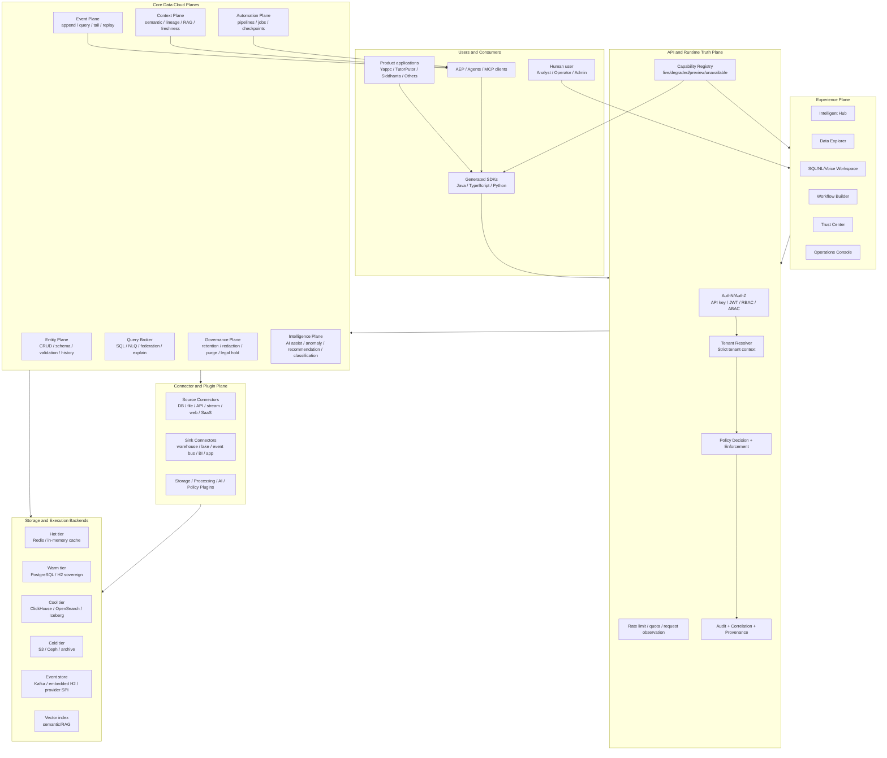

### 6.1 Architecture Layers

| Layer | What | Why | Where in current repo |
|---|---|---|---|
| Experience Plane | UI surfaces for Data, Query, Workflows, Trust, Ops | Make complex data work simple and visible | `products/data-cloud/ui/src/routes.tsx` |
| API and Runtime Truth Plane | Auth, tenant, policy, capabilities, rate limit, audit | Prevent false capability claims and cross-tenant leakage | Launcher middleware/bootstrap/router |
| Entity Plane | Entity CRUD, schema, validation, export, search | Application-facing operational data model | `EntityCrudHandler`, `DataCloudClient`, `EntityStore` |
| Event Plane | Append/query/tail/replay events | Provenance, audit, workflow, real-time context | `EventHandler`, `EventLogStore` |
| Context Plane | Semantic context, snapshots, RAG, lineage | Ground agents and users in correct business context | `ContextLayerHandler`, `SemanticSearchHandler`, `LineageHandler` |
| Query Broker | SQL/NLQ/federated query, explain, cost | One query interface across tiers/sources | `AnalyticsHandler`, `FederatedQueryHandler`, `StorageCostHandler` |
| Workflow/Automation Plane | Pipelines, checkpoints, executions, logs | Reduce human labor with governed automation | `PipelineCheckpointHandler`, `WorkflowExecutionHandler`, `AutonomyHandler` |
| Governance Plane | Retention, purge, redaction, compliance | Enterprise trust, privacy, sovereignty | `DataLifecycleHandler` |
| Intelligence Plane | AI assist, anomaly, recommendation, model/feature registry | Embedded AI that solves work quietly | `AiAssistHandler`, `AiModelHandler`, `BrainHandler`, `LearningHandler` |
| Connector/Plugin Plane | Sources/sinks/storage/processors | Avoid hard-coded integrations and vendor lock-in | `spi`, `platform-plugins`, plugin routes |
| Storage Backends | Hot/warm/cool/cold/event/vector stores | Optimize latency, cost, durability, search, analytics | ServiceLoader providers, H2 sovereign, optional external services |

---

## 7. Component Architecture

### 7.1 Current Module Structure and Target Responsibility

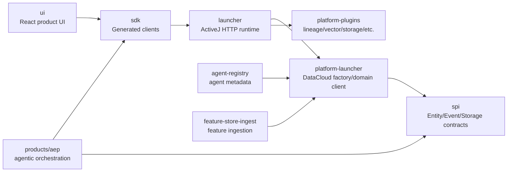

**Target module rules:**

| Module | Should own | Should not own |
|---|---|---|
| `ui` | User/operator/admin experience, capability-gated navigation | Business logic, fallback mocks pretending to be live |
| `sdk` | Generated typed clients, error models, streaming adapters | Hand-coded drift, placeholder success responses |
| `launcher` | HTTP runtime, route composition, middleware, deployment wiring | Domain storage internals beyond ports |
| `platform-launcher` | DataCloud factory, profile discovery, default client | UI/API-specific behavior |
| `spi` | Public provider contracts | Product-specific implementation details |
| `platform-plugins` | Plugin implementations | Core hard dependencies from domain |
| `agent-registry` | Agent definitions and metadata | AEP orchestration |
| `feature-store-ingest` | Feature ingestion APIs/services | Model lifecycle UI |
| `AEP` | Multi-step agentic planning/orchestration | Data Cloud internal code dependency |

### 7.2 Runtime Bootstrap Architecture

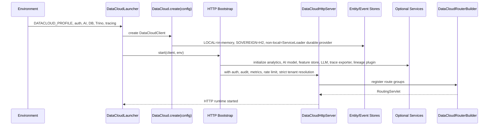

### 7.3 API Surface Groups

| Route group | What | Why | Target hardening |
|---|---|---|---|
| Health/info/metrics | Liveness, readiness, subsystem health | Operability | Split liveness vs readiness vs capability truth |
| Entities/search/export/validation | Main operational data API | App data plane | Add complete query contract, totals, filters, sort, schema |
| Events | Append/query/get event | Provenance and stream | Ensure all mutations emit rich canonical events |
| Pipelines/checkpoints/executions | Workflow metadata and execution | Automation | Durable first-party execution engine or strict capability gating |
| Alerts | Operator triage | Zero-manual ops direction | Add action audit, total counts, incident lifecycle |
| Memory/brain/learning | Agent memory and intelligence | AI context | Govern confidence/provenance and retention |
| Analytics/reports/models/features | Query, reporting, AI/ML support | Embedded insight | Unified query broker and model governance |
| Governance/lineage/context/data products | Trust, context, productization | Enterprise fabric | Real compliance inventory and lineage graph |
| Capability/autonomy/plugin/agents | Runtime truth, automation control, extensibility | Progressive disclosure and safety | Make capability registry mandatory for UI/SDK |
| Federated/tier/cost | Cross-source/cross-tier operations | Data fabric economics | Source freshness, partial-result warnings, cost transparency |
| Voice/SSE/WebSocket/MCP | Multimodal and agent protocols | Modern interaction modes | Auth, tenancy, audit, throttling, replay semantics |

---

## 8. Multi-Tenancy, Privacy, Security, Sovereignty, and Provenance Architecture

### 8.1 Tenant Isolation Flow

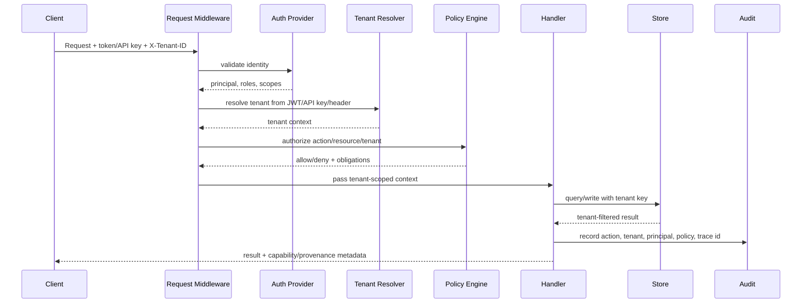

### 8.2 Required Tenant Guarantees

| Guarantee | Required behavior |
|---|---|
| Explicit tenant context | Production requests must not fall back to implicit/default tenant |
| Tenant-scoped storage | Every entity, event, context item, memory, policy, job, plugin state, and audit record includes tenant |
| Tenant-aware connectors | Source/sink credentials, schedules, quotas, and data residency policies are tenant-scoped |
| Tenant-safe analytics | Federated queries cannot cross tenant boundaries unless explicit shared-data contract exists |
| Tenant-specific sovereignty | Region, encryption key, retention, and legal-hold rules can vary by tenant |
| Tenant-level audit | Every access and mutation can be reconstructed by tenant |
| Tenant-level deletion/export | DSAR/export/delete workflows can target one tenant safely |
| Tenant quotas | Rate, storage, compute, jobs, AI tokens, connector load, and streaming subscriptions are enforceable |

### 8.3 Security/Privacy/Provenance Metadata Envelope

Every core data object should carry:

```json
{
  "tenantId": "tenant-123",
  "resourceId": "tickets/abc",
  "resourceType": "entity",
  "schemaVersion": "tickets.v3",
  "source": {
    "system": "salesforce",
    "connectorId": "sf-prod",
    "ingestedAt": "2026-04-25T10:12:30Z",
    "sourceRecordId": "500..."
  },
  "classification": {
    "sensitivity": "confidential",
    "pii": true,
    "phi": false,
    "financial": false,
    "retentionClass": "support-case-7y"
  },
  "sovereignty": {
    "region": "us-west",
    "residencyPolicy": "US_ONLY",
    "encryptionKeyRef": "kms://tenant-123/data"
  },
  "lineage": {
    "createdBy": "connector:sf-prod",
    "derivedFrom": ["event:offset-1234"],
    "transformIds": ["normalize-support-ticket-v2"]
  },
  "freshness": {
    "observedAt": "2026-04-25T10:12:30Z",
    "stalenessSeconds": 18
  },
  "audit": {
    "lastAccessedBy": "user:abc",
    "lastActionTraceId": "trace-xyz"
  }
}
```

### 8.4 Data Sovereignty Model

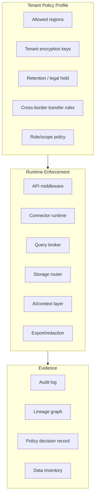

**Target behavior:** The system should know where tenant data is allowed to live, where it currently lives, who touched it, how it was transformed, whether it was exposed to an external AI provider, and what policy decision allowed each action.

---

## 9. Data Plane Architecture

### 9.1 Entity Plane

**What:** Stores application-facing operational data in collections.

**Why:** Applications and agents need a reliable entity model, not just raw warehouse tables or event streams.

**Where current:** `EntityCrudHandler`, `DataCloudClient`, `EntityStore`.

**Target hardening:**

- First-class collection registry with schema, owner, lifecycle, quality, retention, lineage, and status.
- Complete query language: filters, search, sort, projection, pagination/cursor, total count, consistency level, freshness.
- Versioned entity history with full CDC payloads or snapshots.
- Schema validation and schema evolution.
- Idempotency keys for writes.
- Transactional or clearly per-item batch semantics.
- Automatic semantic indexing and policy classification.
- Entity-level provenance envelope.

### 9.2 Event Plane

**What:** Append-only source of truth for changes, activities, automation actions, policies, and integration events.

**Why:** Event replay, audit, temporal query, workflow recovery, and agent context all require durable event history.

**Where current:** `EventHandler`, `EventLogStore`, `DataCloud` in-memory/H2/provider discovery.

**Target event envelope:**

```json
{
  "eventId": "evt_...",
  "tenantId": "tenant-123",
  "type": "entity.saved",
  "version": "1.0",
  "occurredAt": "2026-04-25T10:12:30Z",
  "actor": {
    "type": "user|system|agent|connector",
    "id": "user-abc"
  },
  "resource": {
    "type": "entity",
    "collection": "tickets",
    "id": "ticket-123"
  },
  "operation": "create|update|delete|redact|purge|classify|execute",
  "before": {},
  "after": {},
  "patch": {},
  "policyDecision": {
    "decisionId": "pdp-...",
    "result": "allow",
    "obligations": ["redact.email"]
  },
  "traceId": "trace-...",
  "correlationId": "corr-...",
  "provenance": {
    "source": "api",
    "derivedFrom": []
  }
}
```

### 9.3 Query and Retrieval Plane

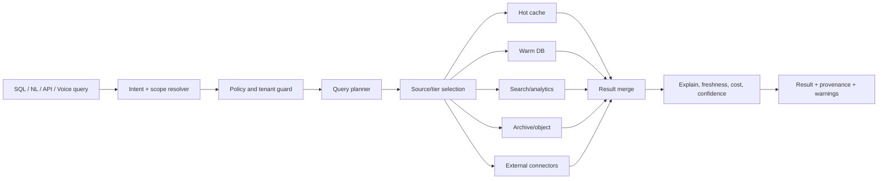

**Target behavior:** Users ask for what they need. Data Cloud decides the safest, freshest, cheapest credible path and explains the result.

### 9.4 Context and RAG Plane

**What:** Turns entities/events/lineage/semantic definitions into trusted agent/user context.

**Why:** AI agents fail without fresh, governed, semantically meaningful business context.

**Where current:** Context routes, semantic search routes, RAG endpoint, brain/memory APIs.

**Target hardening:**

- Context snapshot versioning.
- Collection semantic models.
- Entity embeddings with source/freshness/policy metadata.
- Retrieval policies that respect tenant, PII, retention, and sovereignty.
- RAG responses with citations/provenance and freshness.
- Agent memory retention and deletion policies.
- Feedback loop: user corrections update semantic/context confidence.

---

## 10. Automation and Human Override Architecture

### 10.1 Automation Lifecycle

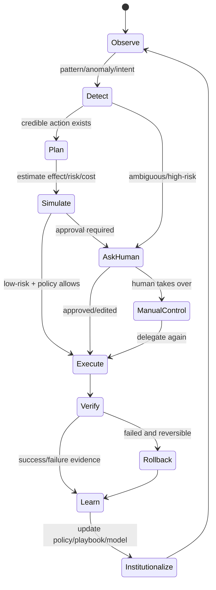

### 10.2 Autonomy Policy

| Domain | Example automations | Default target level | Human required when |
|---|---|---:|---|
| Query | suggest query, explain plan, choose source | L2-L3 | query touches sensitive data or low confidence |
| Data quality | detect anomalies, suggest fixes | L2-L3 | destructive mutation or uncertain mapping |
| Governance | classify retention/PII, suggest purge | L2 | purge/redaction/legal hold changes |
| Operations | group alerts, suggest remediation | L3 | high-impact remediation |
| Storage | recommend tier migration, compact tombstones | L3-L4 | migration changes sovereignty/cost SLA |
| Workflow | draft pipeline, validate DAG | L2-L3 | external side effects or low confidence |
| Connectors | infer schema, map fields, schedule sync | L2 | credential, PII, or cross-border risk |
| AI context | index, retrieve, summarize | L3 | external LLM exposure or regulated data |

### 10.3 Human Takeover Requirements

Every automation must expose:

- Current state.
- Proposed plan.
- Inputs used.
- Confidence and risk band.
- Policy decisions.
- Expected impact.
- Cost/latency/side-effect estimate.
- Pause/stop/take-over controls.
- Edit/approve/reject controls.
- Rollback/compensation plan where possible.
- Audit log and trace id.

---

## 11. AI/ML-Native Architecture

### 11.1 Embedded AI as Substrate, Not Feature Noise

AI should be invisible unless needed. The UI should say:

- “I found 12 duplicate fields and merged the schema draft.”
- “This query can run faster from the warm tier; I selected that path.”
- “I cannot auto-purge because a legal hold may apply.”
- “This answer is based on 3 fresh records and 2 stale records.”

Not:

- “Click AI button.”
- “Use AI assistant.”
- “Generate magic.”

### 11.2 AI Action Contract

Every AI-assisted action should produce a structured record:

```json
{
  "actionId": "ai_action_123",
  "tenantId": "tenant-123",
  "domain": "governance",
  "intent": "classify retention for tickets",
  "inputs": {
    "collections": ["tickets"],
    "sampleSize": 500,
    "contextSnapshot": "ctx_456"
  },
  "model": {
    "provider": "openai|ollama|rules|internal",
    "name": "gpt-4o|llama3|rules-v1",
    "version": "..."
  },
  "confidence": {
    "score": 0.82,
    "band": "medium",
    "reason": "schema implies email and customer_id but no policy exists"
  },
  "risk": {
    "level": "high",
    "reasons": ["privacy", "retention"]
  },
  "decision": {
    "mode": "requires_review",
    "recommendedAction": {},
    "alternatives": []
  },
  "provenance": {
    "traceId": "trace-...",
    "sources": []
  }
}
```

### 11.3 Where AI Should Be Pervasive

| Area | Embedded AI/ML role |
|---|---|
| Entity ingestion | schema inference, dedupe, type detection, PII detection |
| Query | NLQ, explain, optimization, source selection, cost warnings |
| Context | semantic embedding, retrieval ranking, stale-context detection |
| Governance | policy recommendation, data classification, redaction suggestion |
| Workflow | intent-to-plan, DAG validation, failure explanation |
| Operations | anomaly grouping, remediation recommendation, capacity forecasting |
| Connectors | field mapping, sync issue diagnosis, source reliability scoring |
| UI | next-best action, zero-cognitive-load progressive disclosure |
| Testing/quality | generated test cases, contract drift detection, evidence gap discovery |

---

## 12. UI/UX Target Architecture

### 12.1 Current IA

The current UI route config shows a simplified IA with:

- Home / Intelligent Hub
- Data
- Pipelines
- Query
- Trust
- Insights
- Alerts
- Operations
- Events
- Memory
- Entities
- Context
- Fabric
- Agents
- Settings
- Plugins
- Compatibility aliases

### 12.2 Target IA

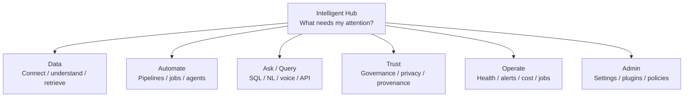

### 12.3 UX Rules

1. **Dashboard-first:** show what changed, what is risky, what needs approval, and what was automated.
2. **Progressive disclosure:** primary users see simple outcomes; operators/admins can drill down.
3. **Runtime truth:** hide or mark unavailable features based on capability registry.
4. **No fake controls:** filters, sort, totals, search, and actions must match backend behavior.
5. **Explainable automation:** every suggestion/action has confidence, provenance, and control.
6. **Human interruption:** every automation has stop/take-over/delegate-again path.
7. **Trust always visible:** show tenant, freshness, policy, lineage, and audit where relevant.
8. **No cognitive overload:** collapse raw technical surfaces into task-centered experiences.

---

## 13. Core Use Cases

### Use Case 1 — Unified Enterprise Retrieval Layer

**User problem:** Data is spread across SaaS apps, databases, files, events, warehouses, APIs, and logs. Users cannot retrieve the right information without manual glue.

**Data Cloud solution:** A single governed query/retrieval layer across entity store, event store, external connectors, semantic index, and analytics tiers.

**What happens:**

1. User asks a question in SQL, natural language, API, or voice.
2. Data Cloud resolves tenant, policy, intent, freshness, and source scope.
3. Query broker selects the safest/freshest sources.
4. Results return with provenance, confidence, freshness, and warnings.
5. If result is incomplete, system suggests next action.

**Needs done:**

- Canonical query broker.
- Federated source freshness model.
- Complete filter/sort/pagination/total semantics.
- Strong RAG citations and policy-aware retrieval.

### Use Case 2 — Security/Privacy/Provenance-First Data Layer

**User problem:** Multi-tenant data privacy, sovereignty, retention, legal hold, and audit are hard to enforce across fragmented systems.

**Data Cloud solution:** Every entity, event, query, export, automation, and AI action is policy-checked and provenance-tracked.

**What happens:**

1. Data is ingested with tenant/source/classification metadata.
2. Policy engine decides allowable access and obligations.
3. Query/export/redaction/purge flows enforce policy.
4. Audit log captures every action.
5. Trust Center shows evidence, not just summaries.

**Needs done:**

- Production fail-closed policy/audit.
- Collection inventory reconciliation.
- Legal hold enforcement.
- True compliance evidence package.

### Use Case 3 — Agent Context and Memory Backbone

**User problem:** AI agents operate with stale, scattered, unsafe context.

**Data Cloud solution:** Data Cloud becomes the context substrate for AEP and agents.

**What happens:**

1. Agent asks for context using SDK/MCP/RAG.
2. Data Cloud retrieves tenant-safe, fresh, policy-compliant context.
3. Context includes lineage, event history, semantic definitions, memory, and confidence.
4. Agent writes results/checkpoints/memory back into Data Cloud.
5. Human can inspect and govern the agent’s actions.

**Needs done:**

- Context snapshot versioning.
- Agent memory retention and deletion.
- Model/provider exposure policy.
- Tool invocation audit.

### Use Case 4 — Autonomous Workflow and Pipeline Operations

**User problem:** Data pipelines are manually designed, monitored, debugged, and repaired.

**Data Cloud solution:** Intent-to-pipeline automation with durable execution, logs, checkpoints, rollback, and human control.

**What happens:**

1. User states goal.
2. Data Cloud drafts DAG and estimates risk/cost.
3. Human approves if needed.
4. Workflow runs durably with event-backed checkpoints.
5. System detects failure and proposes remediation.
6. Operator can interrupt, modify, retry, or delegate again.

**Needs done:**

- Durable first-party workflow engine or hard capability gating.
- Job center with retries/cancel/logs/progress.
- Automation action contract.
- Failure compensation model.

### Use Case 5 — Data Product Publishing and Consumption

**User problem:** Teams need trustworthy reusable data assets with freshness, SLA, ownership, and governance.

**Data Cloud solution:** Publish collections/queries/streams as data products with contract, SLA, lineage, and subscription.

**What happens:**

1. Owner publishes a collection/query as a data product.
2. Data Cloud attaches schema, quality, freshness, lineage, retention, policy.
3. Consumers discover and subscribe.
4. Runtime monitors SLA and alerts on degradation.

**Needs done:**

- Data product lifecycle states.
- SLA monitoring.
- Consumer-specific access policy.
- Contract compatibility checks.

### Use Case 6 — Operator Trust and Autonomic Remediation

**User problem:** Operators drown in alerts and manual investigation.

**Data Cloud solution:** Alert grouping, root-cause context, suggested remediation, safe auto-actions, and audit.

**What happens:**

1. System detects health/capability/quality/latency anomaly.
2. Alerts are grouped and correlated with traces, events, jobs, and deployments.
3. Data Cloud proposes remediation with risk/confidence.
4. Low-risk actions can auto-run within autonomy policy.
5. High-risk actions require approval.

**Needs done:**

- Incident lifecycle.
- Alert totals and SLA.
- Model/rule provenance.
- Remediation action registry and rollback.

### Use Case 7 — Sovereign Single-Binary / Air-Gapped Data Fabric

**User problem:** Regulated environments need deployable data/AI infrastructure without SaaS dependency.

**Data Cloud solution:** Sovereign profile with embedded durable storage, no external LLMs by default, local policy/audit, exportable evidence.

**What happens:**

1. Operator runs Data Cloud in sovereign mode.
2. Entity/event storage persists locally.
3. External LLMs are disabled unless explicitly approved.
4. Audit, retention, and context operate inside boundary.
5. Evidence can be exported for compliance.

**Needs done:**

- Air-gapped connector catalog.
- Local model registry/inference support.
- Backup/restore and DR validation.
- Sovereign policy pack.

### Use Case 8 — Multimodal Data Interaction

**User problem:** Users should not need to know SQL, APIs, or platform internals.

**Data Cloud solution:** SQL, NL, voice, dashboard, API, and agent access all use the same governed query/context layer.

**What happens:**

1. User speaks/types intent.
2. Voice/NL classifier maps to query/workflow/trust/operation intent.
3. Data Cloud performs safe plan or asks clarifying question.
4. Result is visualized and actionable.

**Needs done:**

- Unified intent model.
- Clarification workflow.
- Shared query/action planner.
- Accessibility and mobile validation.

---

## 14. Current Done vs Needs-to-Be-Done Matrix

### 14.1 Product and Strategy

| Area | Already done | Needs to be done |
|---|---|---|
| Product thesis | Context-native operational data fabric described in docs | Tighten claims to runtime truth; avoid overstating incomplete features |
| Market positioning | Competitor comparisons exist | Convert to crisp buyer narrative and evidence-backed capability matrix |
| Use cases | Many capability examples exist | Prioritize 4-6 flagship journeys with E2E proof |
| Documentation | README, REST docs, runbooks, route truth, audits | Keep all docs generated from same contract/runtime truth |

### 14.2 Backend/API

| Area | Already done | Needs to be done |
|---|---|---|
| HTTP server | ActiveJ route groups in router | Contract-test every route against OpenAPI |
| Entities | CRUD/batch/export/history/search/similar routes | Complete query semantics, true history, schema lifecycle |
| Events | Append/query/get routes and EventLogStore | Rich event envelopes for all mutations; replay semantics |
| Pipelines | Metadata/checkpoint/execution routes | Durable job engine or strict plugin gating |
| Analytics | Query/aggregate/explain/report routes | Unified query broker with source/freshness/cost |
| Governance | Retention/redaction/purge routes | Legal hold, full compliance inventory, fail-closed policy/audit |
| Lineage/context/RAG | Route surfaces exist | True end-to-end lineage and cited RAG |
| AI/ML | AI assist, models, features, brain, learning | Unified AI action/provenance substrate |
| Capabilities | `/api/v1/capabilities` exists | Make it universal gating authority |
| Settings | General/security endpoints | Persistent API key/profile/preferences/notification lifecycle |
| Plugins | Plugin route lifecycle | Real install/activate/migrate/rollback model |
| Autonomy | Level/domain/log endpoints | Domain-specific policy and action logs |

### 14.3 Data and Storage

| Area | Already done | Needs to be done |
|---|---|---|
| Local mode | In-memory entity/event store | Clearly banner as non-durable dev/test only |
| Sovereign mode | H2-backed entity/event store | DR, compaction, backup, restore, air-gap validation |
| Non-local mode | Durable provider fail-fast via ServiceLoader | Production-grade providers and HA topology docs |
| Multi-tier storage | Architecture/docs/plugin pieces exist | Automatic tiering, policy-aware routing, cost model |
| Search/vector | Semantic routes exist | Durable vector index, reindex, freshness, privacy |
| Event durability | H2/Kafka/provider options described | Provider conformance suite and operational SLOs |

### 14.4 UI/UX

| Area | Already done | Needs to be done |
|---|---|---|
| Simplified route IA | Intelligent Hub/Data/Pipelines/Query/Trust/Insights/Ops | Collapse more technical surfaces behind roles/capabilities |
| Lazy loading/error boundaries | Implemented in route config | Ensure page-level error states use runtime truth |
| Role disclosure | Described in README/route truth | Enforce with auth and capability registry |
| Data Explorer | Unified direction | Backend query semantics must match UI controls |
| Trust Center | Governance routes wired | Evidence-first compliance and destructive-action approvals |
| Operations/Alerts | Live operator surfaces | Incident lifecycle, totals, audit, remediation provenance |
| Settings | UI route exists | Backend contract and persistence must match |
| Fabric | Preview route exists | Real metrics API and capability gating |

### 14.5 DevEx / Tests / Operations

| Area | Already done | Needs to be done |
|---|---|---|
| Runbooks/scripts | Backup, restore, smoke, drift, coverage scripts exist | Make CI gates non-optional and green |
| OpenAPI | Canonical contract path described | Generate UI/SDK clients and enforce drift |
| Tests | Many route-level tests exist | 100% meaningful coverage for critical flows; UI type-check green |
| Deployment assets | Docker/K8s/Helm present | Environment-validated production reference deployment |
| Observability | Metrics/tracing hooks exist | Required dependency truth, trace export status, dashboards |
| SDK | Generation path exists | Remote client must never return placeholder successes |

---

## 15. Target Roadmap

### P0 — Trust and Correctness Closure

These are required before claiming enterprise readiness.

1. **Runtime truth contract**
   - Make `/api/v1/capabilities` the single source for UI/SDK route gating.
   - Include status, mode, dependency, probe, last checked time, degraded reason, and docs link.

2. **Query semantics**
   - Implement end-to-end filter/search/sort/pagination/total/cursor semantics.
   - Update OpenAPI, UI clients, SDKs, tests.

3. **Temporal/event truth**
   - Store full CDC payloads or snapshots.
   - Rebuild point-in-time history from event/snapshot truth.

4. **Governance correctness**
   - Reconcile collection inventory with policy inventory.
   - Stop compliance summaries from marking unknown data as compliant.
   - Add legal hold and approval flow for destructive actions.

5. **Fail-closed production security**
   - No production startup without auth, tenant enforcement, policy, and audit.
   - No default tenant fallback in production.

6. **OpenAPI/SDK truth**
   - Remove or mark unsupported placeholder clients.
   - Generate clients from OpenAPI and run contract tests.

7. **UI build/test gate**
   - Restore type-check and test green status.
   - Hide unsupported controls until backed by API capability.

### P1 — Data Fabric Foundation

1. First-class collection registry.
2. Connector framework MVP: DB/file/API/stream.
3. Query broker with explain/freshness/cost/source provenance.
4. Data product lifecycle with SLA and subscription.
5. Storage tier routing and cost reporting.
6. Lineage graph from ingestion through transformation and consumption.
7. RAG with citations, freshness, and policy filtering.

### P2 — Automation and AI-Native Differentiation

1. Unified AI action/provenance contract.
2. Intent-to-workflow builder with policy-gated execution.
3. Autonomy controller per domain.
4. Alert grouping/root-cause/remediation engine.
5. Human takeover/interrupt/delegate-again workflow.
6. Learning loop: accepted/rejected suggestions improve policies/playbooks/models.
7. Local/sovereign AI model support.

### P3 — Enterprise-Grade Scale and Ecosystem

1. HA durable providers and conformance suite.
2. Multi-region/multi-sovereignty deployment.
3. Plugin marketplace with install/activate/migrate/rollback.
4. Advanced model/feature governance.
5. Full compliance evidence packages.
6. SaaS/on-prem/hybrid deployment reference architectures.
7. Benchmarks against fragmented incumbent stacks.

---

## 16. Reference Deployment Architecture

### 16.1 Local Developer

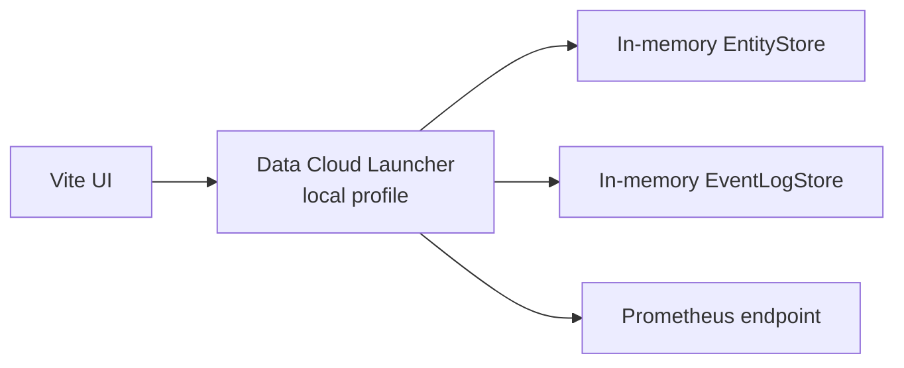

**Purpose:** fast iteration only.  
**Must not claim:** durability, HA, production security, regulatory compliance.

### 16.2 Sovereign / Air-Gapped

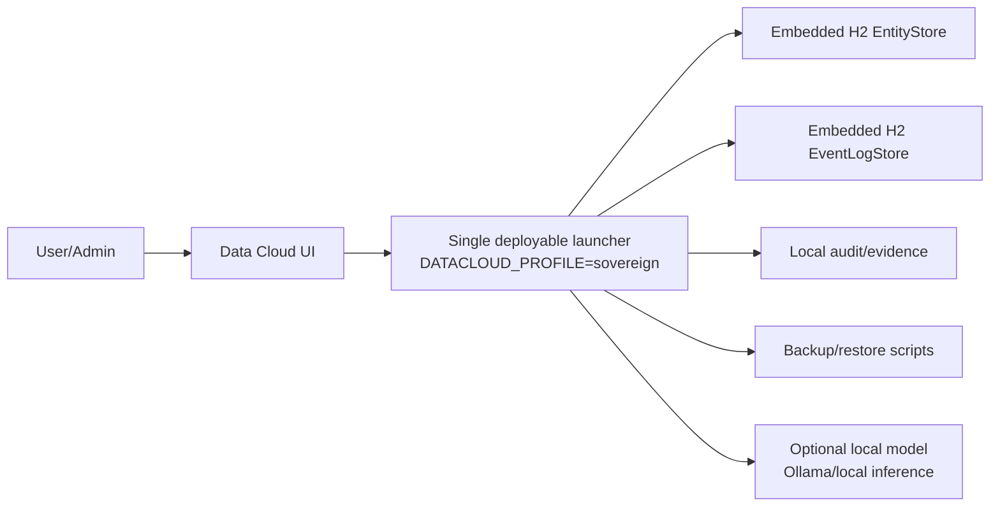

**Purpose:** regulated/single-binary/self-hosted/air-gapped environments.  
**Needs:** validated DR, encryption key management, local AI policy, plugin pack.

### 16.3 Standard Enterprise / Kubernetes

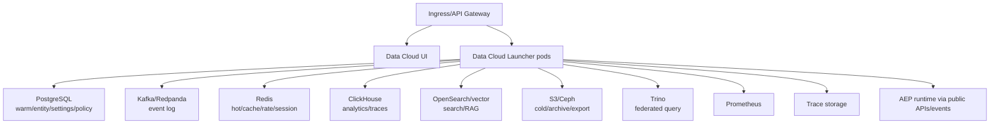

**Purpose:** production multi-tenant operational fabric.  
**Required:** strict tenant, policy, audit, provider HA, backups, SLOs, capability truth, CI/CD gates.

---

## 17. Architecture Decisions to Add or Update

| ADR | Decision needed |
|---|---|
| ADR-DC-002 Runtime capability truth | `/api/v1/capabilities` is mandatory source for all UI/SDK feature gating |
| ADR-DC-003 Query contract | Canonical query/filter/sort/pagination/freshness/cost schema |
| ADR-DC-004 Event envelope | Required event fields for replay, audit, provenance, and context |
| ADR-DC-005 Governance fail-closed | Production policy/audit/tenant requirements |
| ADR-DC-006 Automation control | Autonomy levels, human takeover, rollback, audit |
| ADR-DC-007 AI action provenance | Required AI suggestion/action evidence model |
| ADR-DC-008 Connector SPI | Source/sink lifecycle, schema inference, credentials, health, tenancy |
| ADR-DC-009 Sovereign profile | Air-gap guarantees, disabled external services, backup/restore |
| ADR-DC-010 Data product lifecycle | Publish/discover/subscribe/SLA/deprecate |
| ADR-DC-011 SDK generation | OpenAPI-generated clients only; no placeholder success clients |

---

## 18. Acceptance Criteria for “Disruptive Enterprise-Ready Data Cloud”

Data Cloud can credibly claim the target position when:

1. A tenant can ingest/connect data, query it, govern it, and automate work without leaving Data Cloud.
2. Every UI control is backed by a real route and a tested backend behavior.
3. Every runtime capability has a live/degraded/unavailable truth state.
4. Every entity mutation emits enough event/provenance data to reconstruct history.
5. Every query result carries source, freshness, tenant, policy, and trace metadata.
6. Every destructive action has approval, policy, audit, and verification.
7. AI actions include confidence, provenance, model/provider, risk, and rollback status.
8. Human users can interrupt or take over automation at any point.
9. Non-local deployments fail closed without durable providers, auth, policy, and audit.
10. OpenAPI, SDKs, UI clients, tests, and docs are generated or validated from the same contract.
11. Production deployment has validated backup/restore, HA, SLOs, observability, and incident response.
12. Product pages and docs never claim more than runtime evidence supports.

---

## 19. Recommended Immediate Implementation Plan

### Week 1 — Truth and Contract Lockdown

- Freeze new capability surfaces.
- Generate current route inventory from `DataCloudRouterBuilder`.
- Diff OpenAPI, REST docs, UI clients, and route truth.
- Mark every route as live/partial/preview/degraded/unavailable.
- Build capability registry schema and UI gate.
- Remove/hide unsupported UI actions.

### Week 2 — Query/Entity Correctness

- Define canonical query schema.
- Add server-side search/filter/sort/pagination/total.
- Implement collection registry or formalize `dc_collections`.
- Add contract tests and UI tests.
- Fix counts and `hasMore`.

### Week 3 — Event/History/Governance Truth

- Expand CDC event payloads.
- Implement entity history from snapshots/events.
- Rework compliance summary from real collection + policy inventory.
- Add legal hold and destructive-action approval model.
- Fail closed when audit/policy unavailable in production.

### Week 4 — Automation and AI Action Substrate

- Define AI action contract.
- Refactor AI assist, alert suggestions, workflow drafts into unified action records.
- Add human approval/takeover model.
- Add autonomy policy per domain.
- Add audit and capability gates.

### Week 5+ — Data Fabric and Connectors

- Connector SPI MVP.
- Source registry, credentials, health.
- Query broker with source selection.
- Data product lifecycle.
- Storage tier automation.

---

## 20. Final Architecture Summary

Data Cloud is already more than a placeholder: it has real route surfaces, runtime wiring, profile-aware stores, UI IA, docs, and audit artifacts. The next transformation is to make it **truthful, governed, durable, automated, and simple**.

The strongest position is:

> Data Cloud is the context-native operational data fabric that lets applications, humans, and agents retrieve, process, govern, visualize, and automate over enterprise data through one tenant-safe, policy-enforced, provenance-rich runtime.

The winning product will not be the one with the most endpoints. It will be the one where a user can say:

> “Find the right data, explain where it came from, govern it safely, automate the next step, and only interrupt me when my judgment is truly needed.”

That is the north-star architecture for Data Cloud.
