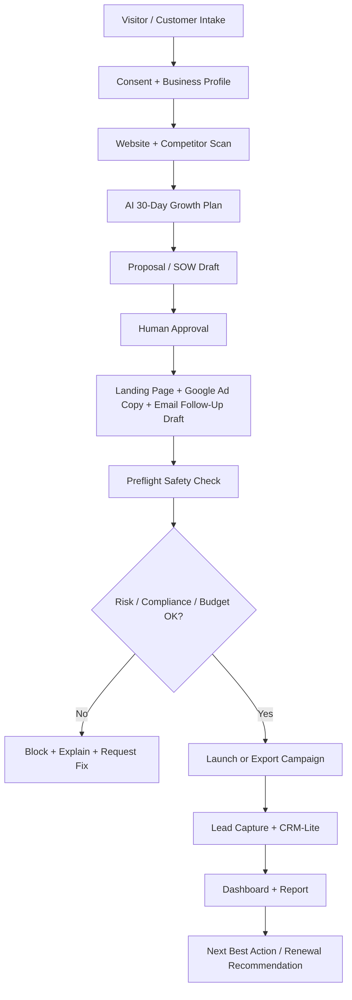
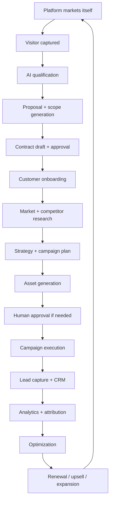
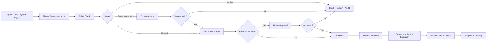
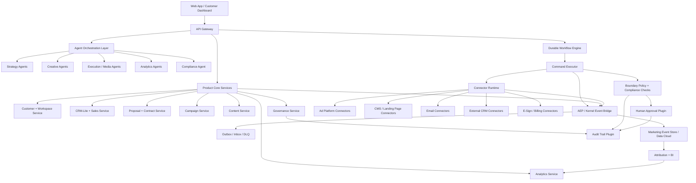

# Digital Marketing Operating System (DMOS) — Canonical Product Architecture

**Product:** Digital Marketing Operating System (DMOS)  
**Repository Location:** `products/digital-marketing/`  
**Canonical Product Code / Rule Prefix:** `DM-`  
**Target Platform:** Ghatana Platform Kernel + Platform Plugins + Kernel Bridge Adapters  
**Status:** Canonical strategic architecture and implementation contract  
**Last Updated:** 2026-05-01  
**Source Documents Consolidated:**  
- `digital-marketting.md`
- `digital-marketing-product-architecture.md`
- `digital-marketing-product-architecture-v2.md`
- `CAPABILITY_MATRIX.md`
- `KERNEL_PURITY_RULES.md`
- `PLUGIN_PURITY_RULES.md`
- `PRODUCT_DEVELOPMENT_GUIDE.md`

---

## Executive Summary

DMOS is an AI-native digital marketing operating system that converts marketing from fragmented tools, underutilized martech, manual agencies, weak attribution, and disconnected sales/contract processes into a governed, measurable, event-driven growth execution system.

The product should not be built as a collection of disconnected marketing agents. It must be built as a **governed, event-driven growth execution system** where:

1. Users express business outcomes, constraints, budget, brand rules, and risk tolerance.
2. Agents research, plan, draft, recommend, and optimize.
3. Policy and compliance engines decide what is allowed, requires consent, requires audit, or requires approval.
4. Durable workflows execute safely through commands, connectors, retries, rollbacks, and kill switches.
5. Humans approve only meaningful risk, judgment, budget, commercial, legal, or regulated-industry decisions.
6. Every action is measurable, explainable, reversible where possible, and auditable.
7. Every result feeds learning back into playbooks.

The strongest product position is:

> **From growth goal to signed contract to live campaign to measurable revenue—automated.**

The strategic product promise is:

> **AI growth manager in a box: the platform plans, sells, executes, measures, optimizes, and improves growth campaigns end to end while asking humans only for judgment, risk, governance, or commercial decisions.**

The immediate implementation stance is intentionally conservative: the MVP must be a narrow but complete loop for non-regulated local service and small B2B businesses. Regulated industries, SMS, external CRM complexity, multi-platform advertising, advanced attribution, agency mode, marketplace, and enterprise features are post-MVP capabilities.

---

## 1. Product Vision, Thesis, and Positioning

### 1.1 Vision Statement

An AI-native digital marketing operating system that plans, sells, executes, measures, and improves growth campaigns end to end—with human approval only where judgment, risk, or governance requires it.

### 1.2 Product Thesis

DMOS converts marketing from fragmented tools plus manual agency work into an autonomous, measurable, compliance-aware growth system. Unlike martech tools focused on isolated channels—email, CRM, SEO, ads, landing pages, social scheduling, or analytics—DMOS provides an integrated operating loop:

**Growth goal → market research → strategy → proposal/SOW → approved assets → campaign execution → lead capture → attribution → optimization → renewal/upsell → playbook learning.**

### 1.3 Core Differentiation

DMOS should not compete as another AI content generator. The market already has many AI copy, email automation, campaign, CRM, and analytics tools. DMOS differentiates through:

1. **Outcome-first automation** — the user provides a business outcome, not low-level campaign tasks.
2. **Contract-to-campaign-to-revenue loop** — proposal, SOW, execution, reporting, renewal, and upsell are connected.
3. **Self-marketing platform** — DMOS uses its own engine to acquire, qualify, convert, and retain customers.
4. **Compliance-native growth execution** — consent, claims, disclosures, audit, regional rules, and approval gates are built into the execution path.
5. **Agentic optimization with guardrails** — AI observes, learns, recommends, reallocates, and improves, but only through permissioned commands.
6. **Zero-cognitive-load dashboard** — the user sees growth health, results, risk, approvals, and next best actions instead of tool complexity.
7. **Full-funnel measurement** — spend, lead, opportunity, proposal, contract, revenue, retention, and renewal are connected.
8. **Human takeover/delegation model** — humans can interrupt automation, override decisions, delegate again, and all actions are audited.
9. **Reusable playbooks** — successful industry and channel patterns become versioned, governed, reusable assets.
10. **Governed platform architecture** — kernel, plugins, domain packs, bridge context, boundary policy, and compliance packs keep product logic out of shared infrastructure.

### 1.4 Positioning

**Primary positioning**

> From growth goal to signed contract to live campaign to measurable revenue—automated.

**Alternative positioning**

> An AI-native digital marketing operating system that acts as an autonomous growth operator for businesses that cannot afford full marketing teams.

**Internal product doctrine**

> DMOS is not “AI inside marketing software.” DMOS is a governed growth execution operating layer.

---

## 2. Market and Competitive Context

### 2.1 Market Timing

The timing is attractive because three forces are colliding:

1. Digital advertising spend continues to grow and is increasingly performance-driven.
2. Marketing teams face budget pressure and are expected to do more with less.
3. Martech stacks remain underutilized because tooling is fragmented, complex, and difficult to connect to revenue outcomes.
4. AI agents are becoming a major martech trend, but many offerings remain unreliable, insufficiently governed, or disconnected from production execution.

### 2.2 Competitive Landscape

| Competitor / Category | Strength | Limitation / Gap | DMOS Differentiation |
|---|---|---|---|
| HubSpot | CRM, marketing automation, AI assistant/customer agent, ecosystem | Still tool/workflow centered; not contract-to-campaign-to-revenue autonomous operator | Outcome-first growth execution with proposal/SOW, governed automation, and self-marketing loop |
| Klaviyo | B2C/e-commerce CRM, lifecycle messaging, strong data/AI positioning | More lifecycle/e-commerce focused than service-business growth operating system | Service-business MVP, proposal/contracts, local/service lead-gen playbooks |
| Mailchimp | Email/SMS, templates, automations, analytics, content tools | Campaign/channel tool, not governed operating system | Unified planning, execution, compliance, contracts, and attribution |
| Google Ads / Meta Ads / LinkedIn Ads | Deep channel execution | Single-channel systems with platform-specific policies and reporting | Cross-channel orchestration, business-goal planning, governance, CRM/revenue feedback |
| Agencies | Strategy, execution, judgment | Expensive, manual, reporting-heavy, inconsistent attribution | AI-native operator + optional human review/managed service |
| Point AI content tools | Fast asset generation | Often disconnected from approvals, compliance, measurement, and execution | Content as one step inside governed command/workflow system |

### 2.3 Product Opportunity

The opening is not “make marketing content cheaper.” The opening is:

**Make growth execution measurable, governed, repeatable, and largely autonomous for customers who lack a full marketing team or whose existing martech stack is underused.**

---

## 3. Target Segments, Personas, and Feature Tiers

### 3.1 MVP Beachhead

**MVP beachhead:** non-regulated local service and small B2B businesses.

Examples:
- Home services
- Consultants
- Coaches
- Small B2B services
- Local professional services without regulated claims
- Small SaaS only where the first use case remains simple lead generation

**MVP exclusions unless compliance packs are implemented:**
- Clinics and healthcare providers
- Finance, investment, lending, banking, insurance
- Legal services with legal claims
- Education where student/minor data is involved
- Any regulated product or sensitive claims domain

### 3.2 Post-MVP Segments

| Segment | Pain | Platform Promise |
|---|---|---|
| Local service businesses | No marketing staff, weak tracking, wasted ad spend | AI growth manager in a box |
| SaaS startups | Need pipeline, content, experiments, attribution | Automated demand generation engine |
| Agencies | Manual operations, reporting burden, multi-client chaos | Agency operating system |
| E-commerce | Constant creative testing, segmentation, abandoned carts, retention | Autonomous lifecycle marketing |
| Enterprises | Martech sprawl, governance, low utilization | Governed marketing automation layer |

### 3.3 Use Case Categories

#### Acquisition
- Lead generation through paid campaigns
- SEO content production and optimization
- Social media engagement and growth
- Local search and Google Business Profile optimization
- Referral and affiliate program management
- Paid channel experimentation

#### Lifecycle
- Email nurture sequences
- SMS nurture sequences after consent maturity
- Customer onboarding flows
- Abandoned cart recovery for e-commerce post-MVP
- Reactivation campaigns
- Renewal and upsell campaigns

#### Analytics
- Spend → lead → opportunity → contract → revenue tracking
- Campaign performance optimization
- Budget pacing and reallocation
- A/B testing and experiment management
- ROI, ROAS, CAC, LTV, payback, and retention analysis
- Playbook learning from outcomes

#### Governance
- Claim validation
- Disclosure management
- Consent management
- Privacy rights workflows
- Audit trail
- Brand safety
- Human approval gates
- Regional and industry compliance rule packs

### 3.4 Personas

| Persona | Primary UI | Key Responsibilities | Approval Authority |
|---|---|---|---|
| Business Owner | Growth health, spend, leads, revenue, approvals | Set goals, approve budgets/contracts, monitor outcomes | High-budget changes, contracts, strategy approval |
| Marketing Manager | Campaign plan, assets, approvals, experiments | Review creative, refine campaigns, manage execution | Campaign launches, creative approval, medium-risk changes |
| Sales User | Leads, follow-ups, opportunity status, proposals | Work qualified leads, track pipeline, give outcome feedback | Lead qualification, opportunity/proposal updates |
| Legal / Compliance Reviewer | Claims, disclosures, evidence, clauses, audit evidence | Approve sensitive claims/contracts/regulatory content | Claims, disclosures, contract clauses, regulated content |
| Agency Admin | Multi-client dashboard, white-label reports, permissions | Manage clients, assign work, standardize playbooks | Client-level approvals and delegation |
| Platform Operator | Connector health, incidents, kill switches, model quality | Operate platform, monitor failures, handle incidents | Emergency kill-switch, tenant/workspace operations |
| Customer Success | Performance summaries, renewals, expansion | Explain outcomes, propose next steps | Renewal/upsell recommendation review |

### 3.5 Feature Tiers

| Tier | Capabilities |
|---|---|
| Starter | Intake, free audit, 30-day plan, landing page draft, ad copy draft, email follow-up draft, CRM-lite, manual campaign export |
| Growth | Google Ads integration, landing page publishing, email sending, basic reporting, consent foundation, proposal/SOW draft |
| Pro | Multi-channel paid campaigns, experiments, recommendation engine, external CRM integrations, richer attribution |
| Agency | Multi-client mode, white-label reports, client approval portals, playbook customization, team delegation |
| Enterprise | SSO, data residency, custom policies, advanced audit, custom connectors, enterprise approval chains |

---

## 4. Scope Strategy

### 4.1 MVP: AI Growth Operator for Local Service Businesses

The MVP must be narrow but complete.

**One beachhead:** non-regulated local service and small B2B businesses.  
**One campaign type:** Google Search lead generation.  
**One asset loop:** generated landing page + Google ad copy + email follow-up.  
**One lead system:** internal CRM-lite.  
**One commercial loop:** proposal/SOW draft from approved templates.  
**One analytics level:** basic funnel and campaign metrics.  
**One governance baseline:** consent, unsubscribe/suppression, approval gates, audit trail, claim validation.

### 4.2 MVP End-to-End Loop



### 4.3 MVP Capabilities

| Area | MVP Capability | Notes |
|---|---|---|
| Self-marketing | Landing page, free audit funnel, AI chat qualification | DMOS markets itself using its own engine in isolated tenant |
| Intake | Business profile, website, geography, offer, audience, budget, constraints | Consent and purpose recorded |
| Audit | Website scan, basic SEO/content gaps, competitor scan | Should produce value before sale |
| Strategy | AI-generated 30-day marketing plan | Human-reviewed |
| Proposal/SOW | Scope, pricing, assumptions, terms draft | Template-based, not legal advice |
| Content | Landing page, Google ad copy, email follow-up | Brand and compliance checked |
| Execution | Google Ads launch/export; landing page publish | One paid channel only |
| CRM-lite | Lead capture, status tracking, source attribution | Internal first |
| Analytics | Leads, conversion rate, CPL/CAC estimate, campaign summary | Basic reporting |
| Governance | Approval gates, audit logs, unsubscribe/suppression, consent checks | Required from day one |
| Operations | Workflow state, retries, DLQ, rollback, kill switch | Required for safe execution |

### 4.4 MVP Exclusions

The following are post-MVP unless required by a specific paid pilot and implemented with proper governance:

- Meta, LinkedIn, TikTok, Reddit, Pinterest, YouTube, programmatic ads
- SMS campaigns and TCPA-sensitive workflows
- External CRM integrations beyond a limited pilot
- Full email automation platform integration
- Advanced multi-touch attribution
- Industry compliance packs for healthcare, finance, legal, insurance
- Agency/multi-client mode
- Marketplace
- Enterprise SSO/data residency
- Custom model training
- Video/audio generation at scale

### 4.5 MVP Success Criteria

| Metric | Target |
|---|---:|
| Time from signup to approved plan | < 24 hours |
| Time from signup to first live campaign | < 48 hours |
| Time to first measurable conversion | < 14 days where traffic is sufficient |
| Lead capture rate from landing page traffic | > 5% |
| Customer retention after 3 months | > 70% |
| NPS | > 40 |
| Consent coverage for tracked contacts | 100% where consent is required |
| Campaign preflight pass rate before launch | 100% required for launch |
| Critical audit coverage for campaign actions | 100% |

---

## 5. End-to-End Product Lifecycle

### 5.1 Complete Domain Loop



### 5.2 Stage 1: Self-Marketing Engine

DMOS must use its own growth engine to attract, qualify, convert, retain, and expand its customers. This creates proof, feedback, test data, reusable playbooks, and product credibility.

Capabilities:
- ICP discovery for target segments and buying triggers
- SEO content engine for pillar pages, landing pages, comparison pages, and industry pages
- Paid campaign engine for controlled tests
- Social content engine for scheduled posts, short videos, carousels, thought leadership
- Lead magnet engine for free audits, calculators, checklists, and benchmark reports
- Referral engine for referral offers and partner attribution
- Growth experiment engine for channels, messages, audiences, offers, and landing page variants
- Case study generation from DMOS-owned data

Required architecture rule: self-marketing must run in a separate internal tenant/workspace with strict isolation from customer tenants.

Outcome: awareness → free audit → consultation/demo → proposal → contract → onboarding.

### 5.3 Stage 2: Customer Acquisition and Qualification

Capabilities:
- AI website/chat agent for business-goal questions
- Consent and purpose capture
- Lead scoring based on fit, urgency, budget, industry, deal value, and readiness
- Business intake for offer, geography, audience, brand, constraints, competitors, capacity, and seasonality
- Pain-point diagnosis for weak funnel areas: traffic, conversion, retention, attribution, follow-up
- Auto-generated audit that provides standalone value
- CRM-lite record creation and optional later CRM sync

### 5.4 Stage 3: Contract and Proposal Engine

Capabilities:
- Scope builder: goals → deliverables, channels, timeline, assumptions, approval gates
- Pricing recommender: package, retainer, performance fee, hybrid model
- Proposal generator: branded proposal with strategy, deliverables, milestones, assumptions, risks
- SOW/MSA draft generator: approved templates only
- Risk flags: missing approvals, unsupported guarantees, unrealistic claims, privacy risk, compliance risk
- E-sign integration post-MVP
- Renewal engine: outcome-based renewal/upsell proposal generation

Mandatory rule: contract generation is template-based, auditable, human-approved, and explicitly not legal advice.

### 5.5 Stage 4: Market Research and Strategy Engine

Inputs:
- Business profile: industry, offer, geography, pricing, margin, capacity
- Customer profile: ICP, personas, pain points, buying triggers
- Competitors: websites, ads, keywords, social presence, reviews
- Constraints: budget, compliance, geography, brand, capacity, seasonality
- Goal: leads, bookings, revenue, retention, brand awareness

Outputs:
- Market map: segments, competitors, positioning, demand drivers
- Channel plan: Google Search for MVP; SEO, paid social, email, SMS, local, video later
- Message strategy: pain points, hooks, objections, proof points
- Campaign calendar: weekly/monthly execution plan
- Budget allocation: by campaign, ad group, channel, and experiment
- Measurement plan: KPIs, conversion events, attribution model, consent requirements

### 5.6 Stage 5: Campaign Planning Engine

Campaign types:
- Acquisition: Google Search, Meta, LinkedIn, TikTok, YouTube, programmatic
- Lifecycle: welcome, nurture, abandoned cart, reactivation, renewal
- Content: SEO articles, landing pages, comparison pages, lead magnets
- Local: Google Business Profile, reviews, local SEO, map-pack strategy
- Retargeting: website visitors, engaged users, abandoned forms
- Referral: customer referrals, partner campaigns, affiliates
- Reputation: review requests, testimonial collection, social proof

MVP campaign type: Google Search lead generation.

### 5.7 Stage 6: Creative and Content Engine

Capabilities:
- Brand system: voice, tone, design tokens, approved claims, forbidden claims
- Creative variants: headlines, ads, images, videos, landing page sections
- SEO content: topic clusters, internal linking, schema, search intent coverage
- Social content: LinkedIn, Instagram, TikTok, X, YouTube Shorts
- Email/SMS: lifecycle flows, newsletters, nurture, promotions
- Landing pages: generated pages with conversion-focused structure
- Proof assets: case studies, testimonials, comparison pages
- Compliance checks: endorsement, claim, disclosure, privacy, regulated-industry risk

All content that may be published must have:
- version ID
- source prompt/model/tool metadata if AI-generated
- evidence links for claims
- brand validation result
- compliance validation result
- approval status
- rollback/unpublish plan if applicable

### 5.8 Stage 7: Execution and Integration Layer

Integration categories:
- Ads: Google Ads, Meta, LinkedIn, TikTok, Reddit, Pinterest
- Analytics: GA4, Search Console, pixels, server-side events
- CRM: HubSpot, Salesforce, Pipedrive, Zoho
- Email/SMS: Mailchimp, Klaviyo, SendGrid, Twilio
- CMS: WordPress, Webflow, Shopify, headless CMS
- Social: LinkedIn, Instagram, Facebook, TikTok, YouTube
- Data: Postgres, BigQuery, Snowflake, Databricks
- Contracts: DocuSign, PandaDoc, Stripe, QuickBooks
- Support: Intercom, Zendesk, Freshdesk

MVP integration: Google Ads plus internal landing page publishing and CRM-lite. External connectors beyond that are post-MVP.

### 5.9 Stage 8: Analytics, Attribution, and Optimization

Analytics layers:
- Awareness: impressions, reach, share of voice, search visibility
- Engagement: CTR, scroll depth, video completion, social engagement
- Conversion: form fills, calls, bookings, purchases, trials
- Revenue: CAC, ROAS, LTV, payback period, pipeline, closed-won
- Retention: repeat purchase, churn, renewal, upsell
- Experimentation: variant winner, confidence, learning summary
- Operations: spend pacing, SLA, approval latency, campaign health
- Governance: consent coverage, claim rejection, approval time, violation count

Critical rule: analytics must not only report. It must trigger next actions, recommendations, and workflow events.

### 5.10 Stage 9: Governance, Compliance, Privacy, and Trust

Required controls:
- Consent management
- Data minimization
- Purpose limitation
- Audit log
- Human approval gates
- Brand safety
- Disclosure management
- Unsubscribe and opt-out handling
- Data deletion/export/correction/restriction
- Regional policy engine
- Product-specific compliance rule packs
- Platform-specific ad policy checks
- Preflight launch safety
- Emergency kill switch

---

## 6. UX Model: Dashboard-First and Low Cognitive Load

### 6.1 UX Principle

The interface should avoid asking users to build campaigns manually. It should ask for business outcomes, constraints, approvals, and decisions that matter.

The product experience must be:
- dashboard-first
- action-oriented
- low cognitive load
- transparent when needed
- automating by default
- interruptible by humans
- auditable by design

### 6.2 Primary Dashboard

Show only the highest-value information:

| Area | What User Sees |
|---|---|
| Growth health | Green/yellow/red score with why |
| Current goal | Example: “Generate 80 qualified leads/month” |
| Active campaigns | What is running now and campaign health |
| AI actions | What the system did automatically and why |
| Needs approval | Only decisions requiring user input |
| Results | Spend, leads, revenue, CPL/CAC/ROAS where available |
| Next best actions | Recommended changes with estimated impact |
| Risk/compliance | Blocked or risky items |
| Tracking health | Consent, tags, conversion events, data freshness |
| Budget safety | Pacing, cap usage, alerts |

### 6.3 User Journey

1. User connects or enters website, business profile, offer, geography, budget, and goal.
2. User grants required consent and configures privacy/marketing purpose.
3. AI audits business, market, competitors, tracking, and funnel.
4. AI proposes a plan.
5. User approves strategy, budget, and assumptions.
6. AI creates assets and campaigns.
7. System runs preflight checks.
8. User approves sensitive assets/actions.
9. AI launches, exports, or queues execution.
10. AI monitors performance and connector health.
11. AI reports outcomes and next actions.
12. AI optimizes continuously.
13. AI proposes renewal/expansion.

### 6.4 Approval UX

Approval queue:
- filter by risk, type, urgency, campaign, owner, due date
- one-click approve/reject where safe
- required rejection reason/comment
- bulk approval only for low-risk identical items
- escalation for overdue approvals
- role-based routing

Approval detail view:
- item being approved
- version snapshot
- generated rationale
- risk classification
- policy checks
- consent checks
- claim evidence
- disclosure requirements
- budget impact
- rollback plan
- prior decisions
- audit trail

### 6.5 Transparency and Explainability

For every automated or recommended action, expose:
- what happened
- who/what initiated it
- why it was proposed
- what evidence was used
- confidence level
- policy and compliance checks
- approval requirements
- expected impact
- observed result
- rollback status

### 6.6 Override and Delegation

Humans must be able to:
- pause automation
- override AI recommendations
- reject proposed commands
- approve one action
- delegate approval authority
- set delegation expiration
- resume automation
- revoke delegation
- require stricter approvals

Every override/delegation event must be audited and used as feedback for future recommendations.

---

## 7. Domain Model and Bounded Contexts

### 7.1 Bounded Contexts

| Context | Purpose |
|---|---|
| Customer | Organization, workspace, account, brand, product, offer, locations |
| Contact & Identity | PII-safe contact model, contact points, identity resolution |
| Market | Segments, personas, competitors, keywords, trends, channels |
| Strategy | Goals, KPIs, budgets, positioning, campaign plans |
| Campaign | Campaign definitions, channels, audiences, creatives, schedules |
| Content | Assets, landing pages, emails, templates, clauses, versions |
| Execution | Durable workflows, commands, approvals, jobs, rollback |
| Sales | Leads, opportunities, proposals, contracts, invoices |
| Analytics | Events, sessions, touchpoints, conversions, attribution, experiments |
| Governance | Consent, policies, claims, evidence, disclosures, audit logs, suppression |
| Learning | Playbooks, experiment results, recommendations, model feedback |
| Integration | External connections, connector accounts, external object mappings |
| Platform Binding | Boundary policy, compliance packs, plugin bindings, bridge adapters |

### 7.2 Customer Context

| Entity | Key Attributes | Notes |
|---|---|---|
| Organization | id, name, industry, size, tier | Top-level customer org |
| Workspace | id, organizationId, name, settings | Campaign and data boundary |
| Brand | id, workspaceId, name, voiceGuidelines, designTokens | Used by content/creative validation |
| Product | id, brandId, name, offer, pricing, margin | Marketed product/service |
| Offer | id, productId, valueProp, constraints, eligibility | Campaign-specific offer |
| Location | id, organizationId, geography, timezone, regulations | Used for targeting and compliance |
| Account | id, organizationId, name, industry, tier | Sales/account-level entity |

### 7.3 Contact and Identity Context

| Entity | Key Attributes | Notes |
|---|---|---|
| Contact | id, name fields, piiClassification, consentStatus | PII-safe contact root |
| ContactPoint | id, contactId, type, value, verified, optedOut | Email/phone/address/social |
| Identity | id, contactId, externalId, externalSystem, identityHash | External identity mapping |
| ContactPreference | id, contactId, channel, preference, effectiveAt | Contact communication preferences |
| ContactMergeRecord | id, sourceContactIds, targetContactId, reason, approvedBy | Required for identity resolution audit |

PII must not be embedded in generic `Lead.contactInfo` blobs. Lead records should reference contacts and contact points through controlled access paths.

### 7.4 Market Context

| Entity | Key Attributes | Notes |
|---|---|---|
| Segment | id, workspaceId, name, criteria, size | Targetable market segment |
| Persona | id, segmentId, name, painPoints, buyingTriggers | Messaging and targeting |
| Competitor | id, workspaceId, name, website, adsKeywords, socialPresence | Research input |
| Keyword | id, workspaceId, term, searchVolume, competition, intent | Search strategy |
| Trend | id, workspaceId, topic, trajectory, relevanceScore | Strategy input |
| MarketingChannelDefinition | id, workspaceId, type, config | Generic channel capability |

Use `MarketingChannelDefinition` for reusable channel setup and `CampaignChannelExecution` for campaign-specific channel execution. Do not overload one `Channel` entity for both concepts.

### 7.5 Strategy Context

| Entity | Key Attributes | Notes |
|---|---|---|
| Goal | id, workspaceId, type, target, timeframe | Leads/revenue/awareness/etc. |
| KPI | id, goalId, metric, target, current, trend | Measurement target |
| Budget | id, strategyId, total, allocatedByChannel, remaining, currency | Must use Money model |
| Positioning | id, strategyId, valueProp, differentiation, messaging | Guides content |
| CampaignPlan | id, strategyId, schedule, channels, milestones | Becomes campaigns |
| MeasurementPlan | id, strategyId, conversionEvents, attributionModel, reportingCadence | Required before execution |

### 7.6 Campaign Context

| Entity | Key Attributes | Notes |
|---|---|---|
| Campaign | id, planId, name, status, startDate, endDate | Campaign root |
| CampaignChannelExecution | id, campaignId, type, platform, config | Specific channel execution |
| Audience | id, campaignId, criteria, size, segments, consentRequirements | Must validate audience basis |
| Creative | id, campaignId, type, variant, currentVersionId | Points to content versions |
| Variant | id, creativeId, version, performanceScore, winner | Experiment support |
| Schedule | id, campaignId, timing, frequency, pacing | Controls execution |
| CampaignBudgetCap | id, campaignId, dailyCap, monthlyCap, approvedBy | Hard safety bound |

### 7.7 Content Context

| Entity | Key Attributes | Notes |
|---|---|---|
| Asset | id, workspaceId, type, url, metadata, complianceStatus | Media/content asset |
| AssetVersion | id, assetId, version, storageUrl, checksum, metadata | Immutable version |
| ContentVersion | id, contentId, version, body, promptRef, modelRef, status | Immutable content version |
| LandingPage | id, campaignId, url, structure, conversionRate | Generated/published page |
| Email | id, campaignId, subject, body, template, metrics | Email content |
| SMS | id, campaignId, message, template, complianceFlags | Post-MVP until consent maturity |
| SocialPost | id, campaignId, platform, content, schedule, metrics | Post-MVP |
| VideoBrief | id, campaignId, script, visualDirection, duration | Post-MVP |
| Template | id, type, name, version, owner, approvalStatus | Proposal/content/email templates |
| Clause | id, templateId, type, text, version, approvedBy | Contract/SOW support |

### 7.8 Execution Context

| Entity | Key Attributes | Notes |
|---|---|---|
| WorkflowDefinition | id, name, version, steps, retryPolicy, rollbackPlan | Versioned workflow |
| WorkflowExecution | id, definitionId, status, currentState, startedAt | Durable instance |
| WorkflowStepExecution | id, workflowExecutionId, stepId, status, attempts | Step state |
| Command | id, workflowId, type, payload, status, idempotencyKey | Typed execution request |
| CommandResult | id, commandId, success, externalIds, warnings, duration | Execution outcome |
| Task | id, campaignId, type, status, assignedTo, dueDate | Human/system task |
| Approval | id, taskId, approver, decision, timestamp, comments | Approval record |
| ApprovalSnapshot | id, commandId, approvedBy, approvedAt, contentSnapshot, policySnapshot | Immutable approval evidence |
| IntegrationJob | id, campaignId, platform, type, status, retryCount | Connector job |
| PublishEvent | id, integrationJobId, payload, response, timestamp | Published action result |
| RollbackPlan | id, commandId, steps, status, executedAt | Reversal plan |
| DeadLetterRecord | id, source, payload, failureReason, retryState | Failed work recovery |

### 7.9 Sales Context

| Entity | Key Attributes | Notes |
|---|---|---|
| Lead | id, campaignId, contactId, source, score, status | No raw PII blob |
| Opportunity | id, leadId, value, stage, probability, closeDate | Pipeline |
| Proposal | id, opportunityId, scope, pricing, terms, status | Commercial proposal |
| Contract | id, proposalId, documentUrl, signedDate, renewalDate | Service contract |
| Invoice | id, contractId, amount, dueDate, status, paidDate | Billing |
| RenewalRecommendation | id, contractId, resultSummary, nextScope, status | Expansion loop |

### 7.10 Analytics Context

| Entity | Key Attributes | Notes |
|---|---|---|
| Event | id, eventType, schemaVersion, timestamp, correlationId, causationId, idempotencyKey | Typed event |
| Session | id, contactId, startedAt, endedAt, device, utmParams | Session context |
| Touchpoint | id, sessionId, type, channelId, externalRefId | Attribution input |
| ConversionEvent | id, touchpointId, value, attributedTo, modelVersion | Conversion |
| Attribution | id, conversionId, touchpoints, weights, model, confidence | Attribution output |
| Experiment | id, campaignId, variants, hypothesis, duration, statisticalMethod | Test definition |
| ExperimentResult | id, experimentId, variant, metrics, statisticalSignificance | Test result |
| Insight | id, experimentId, finding, confidence, actionability | Analytics learning |

### 7.11 Governance Context

| Entity | Key Attributes | Notes |
|---|---|---|
| Consent | id, contactId, type, channel, lawfulBasis, source, proof, region, policyVersion, grantedAt, revokedAt, revocationReason | Consent lifecycle |
| ConsentBasis | id, consentId, basisType, sourceDocument, timestamp | Lawful basis evidence |
| SuppressionList | id, workspaceId, type, scope, reason, entries | Do-not-contact enforcement |
| SuppressionEntry | id, suppressionListId, contactPointHash, reason, expiresAt | PII-safe suppression |
| DoNotContactRule | id, workspaceId, criteria, scope, reason | Dynamic suppression rule |
| Policy | id, workspaceId, type, region, rules, version, active | Product policy |
| Claim | id, contentId, text, evidenceId, approvalStatus, riskLevel | Claim governance |
| Evidence | id, claimId, sourceUrl, sourceFile, reviewer, expiration | Claim support |
| Disclosure | id, contentId, type, required, addedBy | Required disclosure |
| AuditLog | id, action, actor, timestamp, changes, correlationId, policySnapshotId, consentSnapshotId | Traceability |
| PolicySnapshot | id, policyId, version, rulesHash, capturedAt | Immutable policy evidence |
| ConsentSnapshot | id, consentId, stateHash, capturedAt | Immutable consent evidence |

### 7.12 Learning Context

| Entity | Key Attributes | Notes |
|---|---|---|
| Playbook | id, workspaceId, industry, steps, successRate, versionId | Reusable pattern |
| PlaybookVersion | id, playbookId, version, changes, promotedBy | Versioned playbook |
| Recommendation | id, campaignId, type, priority, expectedImpact, agentId, status | Next best action |
| ModelFeedback | id, agentId, prediction, actual, timestamp | Agent evaluation |
| ExperimentLearning | id, experimentId, finding, confidence, actionability | Learning record |
| PromotionDecision | id, learningId, promotedToPlaybookId, promotedBy | Governance promotion |

### 7.13 Integration Context

| Entity | Key Attributes | Notes |
|---|---|---|
| ExternalConnection | id, workspaceId, platform, accountName, oauthScope, secretId, status, health | Connector connection |
| ExternalObjectMapping | id, connectionId, localType, localId, externalType, externalId, mappingType | External ID mapping |
| ConnectorAccount | id, workspaceId, platform, accountId, quota, rateLimit, lastSync | Platform account |
| ConnectorOperation | id, connectorAccountId, operation, status, attemptCount, lastError | Operation state |
| ConnectorHealthSnapshot | id, connectionId, healthStatus, checkedAt, details | Health observability |

### 7.14 Typed Event Schema

Events must be typed and versioned. Avoid raw ungoverned `Map<String,Object>` payloads except as an envelope payload with a declared schema.

Required fields:

```java
public record MarketingEvent<T>(
    String eventId,
    String eventType,
    String schemaVersion,
    String tenantId,
    String workspaceId,
    String actor,
    String actorType,
    String correlationId,
    String causationId,
    String idempotencyKey,
    Instant occurredAt,
    String sourceService,
    Map<String, String> externalRefs,
    String policySnapshotId,
    String consentSnapshotId,
    String piiClassification,
    String payloadSchema,
    T payload
) {}
```

Core event families:
- CampaignCreated, CampaignStarted, CampaignStopped
- CampaignPreflightPassed, CampaignPreflightFailed
- CreativeGenerated, CreativeApproved, CreativeRejected
- LeadCaptured, LeadQualified, LeadConverted
- ProposalGenerated, ContractDrafted, ContractApproved, ContractSigned, ContractRenewed
- BudgetAllocated, BudgetReallocated, BudgetExhausted
- ComplianceViolation, ApprovalRequired, ApprovalGranted, ApprovalRejected
- ConsentGranted, ConsentRevoked, SuppressionApplied
- ExperimentStarted, ExperimentConcluded, WinnerDeclared
- ConnectorHealthChanged, ConnectorSyncFailed
- WorkflowStarted, WorkflowPaused, WorkflowCompleted, WorkflowFailed, WorkflowRolledBack
- KillSwitchActivated, KillSwitchReleased

---

## 8. Event, Command, and Workflow Architecture

### 8.1 Architecture Principle

Agents do not directly mutate campaigns, budgets, contracts, or external platforms. Agents produce recommendations and plans. Policy engines and approval workflows decide whether the action may execute. Commands execute through durable workflows and connectors.

### 8.2 Execution Flow



### 8.3 Outbox / Inbox

Required patterns:
- Outbox for reliable event publication after state changes.
- Inbox for idempotent event consumption.
- Idempotency keys for retry-safe writes.
- Correlation and causation IDs across requests, commands, events, traces, and logs.
- Dead letter queue for failed events/commands requiring operator resolution.
- Schema versioning for backward compatibility.
- Replay support for analytics and workflow recovery.

### 8.4 Command Types

MVP command types:
- `GenerateAuditCommand`
- `GenerateStrategyCommand`
- `GenerateProposalCommand`
- `GenerateSowDraftCommand`
- `GenerateLandingPageCommand`
- `GenerateGoogleAdCopyCommand`
- `GenerateEmailFollowupCommand`
- `RunCampaignPreflightCommand`
- `PublishLandingPageCommand`
- `LaunchGoogleSearchCampaignCommand`
- `PauseCampaignCommand`
- `UpdateBudgetCommand`
- `CaptureLeadCommand`
- `SendEmailCommand`
- `GeneratePerformanceReportCommand`

Post-MVP:
- `SyncCrmLeadCommand`
- `LaunchMetaCampaignCommand`
- `LaunchLinkedInCampaignCommand`
- `SendSmsCommand`
- `CreateRetargetingAudienceCommand`
- `RunMultiTouchAttributionCommand`

### 8.5 Durable Workflow States

Workflow execution states:
- `PENDING`
- `RUNNING`
- `PAUSED`
- `WAITING_FOR_APPROVAL`
- `WAITING_FOR_CONNECTOR`
- `COMPLETED`
- `FAILED`
- `ROLLED_BACK`
- `CANCELLED`

Workflow requirements:
- Persist state after every step.
- Support restart after failure.
- Support bounded retry with exponential backoff.
- Support compensating actions.
- Support timeout and escalation.
- Support workflow versioning.
- Support deterministic replay for critical workflows.

### 8.6 Rollback and Compensating Actions

Rollback examples:
- Pause campaign.
- Revert budget.
- Unpublish landing page.
- Disable form.
- Suppress scheduled email.
- Revoke audience sync.
- Mark lead export as failed.
- Notify owner and operator.
- Emit rollback event and audit record.

Not all actions are fully reversible. Where irreversible, the system must record impact and provide mitigation steps.

### 8.7 Kill Switch

Kill-switch levels:
- Campaign level
- Workspace level
- Tenant level
- Connector level
- Global platform level

Triggers:
- manual operator action
- budget exhaustion
- compliance violation
- connector health failure
- rate limit exhaustion
- suspicious/fraudulent activity
- security incident
- repeated workflow failure
- consent/suppression enforcement failure

Kill-switch actions:
- pause campaign execution
- block new external writes
- disable connector operations
- pause email sends
- unpublish or freeze assets where possible
- notify owners/operators
- create incident record
- preserve audit trail

---

## 9. Agent Architecture and Permission Model

### 9.1 Agent Design Principle

Agents are operating-layer intelligence, not authority. Authority comes from policy, roles, consent, budget caps, approval rules, and explicit delegation.

### 9.2 Agent Taxonomy

| Agent | Responsibility | Type | Typical Output |
|---|---|---|---|
| Growth Strategist Agent | Strategy, positioning, budget plan | PLANNING | Strategy recommendation, channel plan |
| Market Research Agent | Competitor, keyword, trend, audience research | HYBRID | Research report, opportunity map |
| Brand Agent | Voice, style, claims, approved language | DETERMINISTIC | Brand validation, style corrections |
| Creative Agent | Ads, email, landing page, video, social variants | PROBABILISTIC | Draft content versions |
| Media Buyer Agent | Paid campaign planning and optimization | ADAPTIVE | Budget/bid/audience recommendations |
| SEO Agent | Topic clusters, technical SEO, content briefs | HYBRID | SEO plan and content briefs |
| Lifecycle Agent | Email/SMS/customer journey automation | DETERMINISTIC | Journey flow and lifecycle copy |
| Sales Agent | Lead qualification, proposals, follow-ups | PLANNING | Lead score, proposal draft |
| Contract Agent | SOW/MSA drafts from approved templates | DETERMINISTIC | Contract/SOW draft and risk flags |
| Compliance Agent | Consent, claims, disclosures, regional rules | DETERMINISTIC | Compliance result and required actions |
| Analytics Agent | Measurement and performance explanations | HYBRID | Performance report, causal hypotheses |
| Optimization Agent | Experiments, budget shifts, next best actions | ADAPTIVE | Optimization proposal |
| Customer Success Agent | Reports, renewal plans, upsells | PLANNING | Renewal recommendation |

### 9.3 Agent Contract

Every agent must declare:

| Contract Field | Requirement |
|---|---|
| Agent ID and version | Stable ID, semantic version |
| Capabilities | Operations it may propose |
| Permissions | Read/write scopes by tenant, workspace, channel, content, budget |
| Tool allowlist | External/internal tools it may call |
| Model/prompt version | Traceability for generated outputs |
| Evidence requirements | Required sources for recommendations and claims |
| Confidence model | Thresholds for auto-execute, notify, or escalate |
| Budget authority | Hard caps and percent change limits |
| Rollback support | Whether proposed commands have compensating actions |
| Memory policy | Allowed storage, retention, tenancy boundary |
| Evaluation suite | Offline/online quality tests and monitoring |
| Failure policy | Retry, fallback, escalation behavior |

### 9.4 Permission Scopes

Examples:
- `tenant:read`
- `tenant:write`
- `workspace:read`
- `workspace:write`
- `campaign:read`
- `campaign:write`
- `campaign:launch`
- `budget:read`
- `budget:write`
- `budget:approve`
- `content:read`
- `content:write`
- `content:approve`
- `connector:read`
- `connector:write`
- `compliance:read`
- `compliance:write`
- `audit:read`
- `lead:read`
- `lead:write`

### 9.5 Risk Classification and Human Involvement

| Risk Level | Examples | Default Action |
|---|---|---|
| Low | Routine analytics summaries, content variants within approved brand rules, minor non-spend recommendations | Auto-execute or auto-draft |
| Medium | Budget changes > configured threshold, new channel tests, audience changes, landing page publication | Notify + allow override or require marketing approval |
| High | Legal-sensitive claims, regulated industry content, contract terms, large budget increase, data export, consent-sensitive audience sync | Require human approval |
| Critical | Security incident, compliance violation, suspected data misuse, kill-switch trigger | Block, escalate, operator intervention |

### 9.6 Agent Implementation Pattern

Products may implement agents against the kernel's public agent orchestration interfaces if available. If exact `AgentOrchestrator.KernelAgent` interfaces differ in the current repo, DMOS must implement an adapter layer and never import kernel implementation classes directly.

Canonical behavior:

```java
/**
 * @doc.type class
 * @doc.purpose Generates growth strategy recommendations for marketing campaigns.
 * @doc.layer product
 * @doc.pattern Agent
 */
public final class GrowthStrategistAgent implements KernelAgent {

    @Override
    public String getAgentId() {
        return "dm-growth-strategist";
    }

    @Override
    public AgentResponse execute(AgentRequest request) {
        StrategyInput input = parseAndValidate(request);
        StrategyRecommendation recommendation = generateRecommendation(input);

        // Agent returns recommendation only.
        // It does not launch campaigns or mutate budgets directly.
        return AgentResponse.builder()
            .requestId(request.getRequestId())
            .success(true)
            .result(recommendation)
            .confidence(calculateConfidence(recommendation))
            .requiresPolicyCheck(true)
            .build();
    }
}
```

### 9.7 Agent Orchestration Responsibilities

The orchestration layer should provide:
- agent lifecycle management
- capability-based discovery
- tool authorization
- cross-agent communication through events
- approval gate integration
- audit trail for agent actions
- failure handling and fallback strategies
- observability for latency, errors, quality, and cost
- horizontal scaling for agent execution

---

## 10. Platform Architecture

### 10.1 Architecture Diagram



### 10.2 Technology Stack

| Layer | Recommended Technology | Notes |
|---|---|---|
| Frontend | React + React Router, TypeScript strict mode, `@ghatana/design-system` | Dashboard-first, low cognitive load |
| Backend | Java 21 + ActiveJ async patterns | Align with Ghatana platform preference |
| Workflow | Kernel workflow abstractions or adapter to durable workflow engine | Must support state, retries, rollback, DLQ |
| Events | AEP bridge / kernel event bridge | Use verified platform bridge ports |
| Data | PostgreSQL, event log, object storage, Data Cloud adapter | Use typed schemas and event store |
| AI orchestration | Kernel agent abstractions or DMOS adapter | Agents return recommendations/commands |
| Analytics | Postgres initially, Data Cloud/warehouse later | Columnar warehouse post-MVP |
| Observability | OpenTelemetry + Prometheus + platform observability plugin | Metrics, logs, traces |
| Integrations | Connector runtime with OAuth, rate limits, retries | Product-owned connector layer |
| Security | RBAC/ABAC, tenant isolation, secrets management | Through kernel public ports/plugins |
| Governance | platform plugins + DMOS rule packs | Pack-driven compliance/policy model |

### 10.3 Module Structure

Recommended product structure:

```text
products/digital-marketing/
├── README.md
├── docs/
│   ├── architecture/
│   ├── decisions/
│   ├── compliance/
│   └── runbooks/
├── domain-packs/
│   ├── dm-boundary-policy-pack/
│   └── dm-compliance-rule-pack/
├── libs/java/
│   ├── dm-domain/
│   ├── dm-events/
│   ├── dm-workflows/
│   ├── dm-agent-runtime/
│   ├── dm-campaign-service/
│   ├── dm-content-service/
│   ├── dm-governance-service/
│   ├── dm-analytics-service/
│   ├── dm-sales-service/
│   ├── dm-integration-runtime/
│   ├── dm-google-ads-connector/
│   ├── dm-proposal-contract-service/
│   └── dm-testing/
├── apps/
│   ├── dm-api-service/
│   └── dm-web-app/
├── contracts/
│   ├── proto/
│   └── openapi/
├── infra/
│   ├── docker/
│   ├── terraform/
│   └── local-dev/
└── settings.gradle.kts
```

### 10.4 Dependency Direction

Allowed:
- Product → kernel public interfaces
- Product → plugin SPI interfaces
- Product → bridge public ports
- Product → shared libraries
- Product → product-owned domain packs
- Product → product-owned connector adapters

Forbidden:
- Product imports kernel implementation classes directly
- Kernel imports product code
- Platform plugins hardcode product-domain logic
- Product bypasses kernel/bridge authorization and audit
- Product stores regulatory rules in generic plugins
- Product adds DMOS-specific terms into kernel source/resources/docs examples

### 10.5 Platform Alignment Matrix

The current capability matrix confirms these platform plugin modules and bridge adapters:

| Platform Capability | Canonical Module / SPI | Use in DMOS |
|---|---|---|
| Audit Trail | `platform-plugins/plugin-audit-trail` / `AuditTrailPlugin` | Log all critical actions, approvals, changes, connector operations |
| Compliance | `platform-plugins/plugin-compliance` / `CompliancePlugin` | Generic rule evaluation; DMOS supplies rule packs |
| Consent | `platform-plugins/plugin-consent` / `ConsentPlugin` | Generic consent lifecycle; DMOS supplies consent/compliance rules |
| Fraud Detection | `platform-plugins/plugin-fraud-detection` / `FraudDetectionPlugin` | Post-MVP suspicious traffic/lead quality |
| Human Approval | `platform-plugins/plugin-human-approval` / `HumanApprovalPlugin` | Approval gates and review workflows |
| Ledger | `platform-plugins/plugin-ledger` / `LedgerPlugin` | Billing/usage/financial records where appropriate |
| Risk Management | `platform-plugins/plugin-risk-management` / `RiskPlugin` | Risk scoring for campaigns, claims, budgets, connectors |
| Observability | `platform-plugins/core-observability` / `ObservabilityPlugin` | Metrics/traces/logs |
| AEP Bridge | `AepKernelAdapterImpl`, bridge ID `aep-kernel-bridge` | Event bridge |
| Data Cloud Bridge | `DataCloudKernelAdapterImpl`, bridge ID `data-cloud-kernel-bridge` | Data persistence/analytics bridge |

Architecture concepts such as `AgentOrchestrator`, `KernelEventBus`, and `AbstractKernelModule` must be mapped to the exact current repo symbols before implementation. If names differ, create a DMOS adapter and update this document with exact module paths.

---

## 11. Kernel, Plugin, Domain Pack, and Bridge Contract

### 11.1 Kernel Purity Rules

The platform kernel defines cross-cutting infrastructure such as boundary policy evaluation, plugin lifecycle, audit trail, observability, and bridge ports. Kernel purity means the kernel `src/main/java` and `src/main/resources` trees must contain **no product-domain identifiers**.

DMOS-specific identifiers, marketing regulatory acronyms, and marketing domain terms must not be added to kernel production code or kernel resource files.

Existing kernel banned examples include:
- PHR and clinical terms
- Finance terms
- SOX, HIPAA, GDPR, PCI-DSS
- product-specific dataset names

For DMOS, the same principle means:
- Do not put `DMOS`, `digital-marketing`, `CAN-SPAM`, `TCPA`, `CCPA`, ad-platform-specific marketing rules, or product-domain marketing identifiers into generic kernel code.
- Use generic language in kernel docs/examples.
- Put product-specific rules in DMOS product packs.

### 11.2 Plugin Purity Rules

Platform plugins are reusable, product-agnostic engines. Plugin purity means plugin production code must contain no product-domain identifiers.

Rules:
- `plugin-compliance` evaluates rules; it does not hardcode GDPR, CAN-SPAM, TCPA, healthcare, finance, or digital marketing logic.
- `plugin-consent` manages generic consent lifecycle; DMOS supplies marketing-specific consent rules.
- `plugin-human-approval` provides approval primitives; DMOS supplies approval policies.
- `plugin-risk-management` provides risk scoring SPI; DMOS supplies risk model providers and rule packs.
- Every plugin module must include a valid `plugin.json` manifest with config schema.
- Plugin tests must use domain-neutral fixture identifiers.

### 11.3 Domain Pack Model

DMOS must supply product-specific packs.

#### 11.3.1 Boundary Policy Store

`DigitalMarketingBoundaryPolicyStore` supplies boundary rules.

Rules:
- Rule IDs must be prefixed with `DM-`.
- Last rule must be default-deny covering `"**"` source and `digital-marketing.*` target scope.
- Read operations requiring consent must set `.requiresConsent(true)`.
- Operations requiring audit must set `.requiresAudit(true)`.
- Sensitive writes require approval.
- Export/sync operations require purpose and consent checks.

Example:

```java
/**
 * @doc.type class
 * @doc.purpose Supplies boundary policy rules for Digital Marketing.
 * @doc.layer product
 * @doc.pattern SPI
 */
public final class DigitalMarketingBoundaryPolicyStore implements BoundaryPolicyStore {

    private static final List<BoundaryPolicyRule> RULES = List.of(
        BoundaryPolicyRule.builder()
            .ruleId("DM-BP-001")
            .sourceScopePattern("digital-marketing.agents.*")
            .targetScopePattern("digital-marketing.contacts")
            .resourcePattern("contacts/**")
            .actions("read")
            .effect(Effect.ALLOW)
            .requiresConsent(true)
            .requiresAudit(true)
            .build(),

        BoundaryPolicyRule.builder()
            .ruleId("DM-BP-002")
            .sourceScopePattern("digital-marketing.agents.*")
            .targetScopePattern("digital-marketing.campaigns")
            .resourcePattern("campaigns/**")
            .actions("launch", "budget-increase", "audience-sync")
            .effect(Effect.REQUIRE_APPROVAL)
            .requiresAudit(true)
            .build(),

        BoundaryPolicyRule.builder()
            .ruleId("DM-BP-999")
            .sourceScopePattern("**")
            .targetScopePattern("digital-marketing.*")
            .resourcePattern("**")
            .actions("*")
            .effect(Effect.DENY)
            .build()
    );

    @Override
    public List<BoundaryPolicyRule> loadRules(BoundaryPolicyLoadContext context) {
        return RULES;
    }
}
```

#### 11.3.2 Compliance Rule Pack

`DigitalMarketingComplianceRulePack` supplies marketing-specific compliance rules.

Rule set examples:
- `DM_EMAIL_MARKETING_COMPLIANCE`
- `DM_CONSENT_LIFECYCLE`
- `DM_CLAIM_EVIDENCE`
- `DM_DISCLOSURE_REQUIRED`
- `DM_AUDIENCE_SYNC_PRIVACY`
- `DM_AD_PLATFORM_POLICY`
- `DM_CAMPAIGN_PREFLIGHT`
- `DM_REGULATED_INDUSTRY_BLOCKERS`

Example:

```java
public final class DigitalMarketingComplianceRulePack {

    public static final String DM_EMAIL_MARKETING_COMPLIANCE = "DM_EMAIL_MARKETING_COMPLIANCE";
    public static final String DM_CLAIM_EVIDENCE = "DM_CLAIM_EVIDENCE";

    private DigitalMarketingComplianceRulePack() {}

    public static List<CompliancePlugin.ComplianceRule> emailMarketingRules() {
        return List.of(
            new CompliancePlugin.ComplianceRule(
                "DM-EM-001",
                DM_EMAIL_MARKETING_COMPLIANCE,
                "Commercial emails must include a valid sender identity and opt-out mechanism",
                CompliancePlugin.Severity.HIGH,
                "$.senderIdentity != null && $.unsubscribeUrl != null"
            ),
            new CompliancePlugin.ComplianceRule(
                "DM-EM-002",
                DM_EMAIL_MARKETING_COMPLIANCE,
                "Suppressed contact points must not receive marketing messages",
                CompliancePlugin.Severity.CRITICAL,
                "$.suppressionStatus == 'NOT_SUPPRESSED'"
            )
        );
    }

    public static List<CompliancePlugin.ComplianceRule> claimEvidenceRules() {
        return List.of(
            new CompliancePlugin.ComplianceRule(
                "DM-CL-001",
                DM_CLAIM_EVIDENCE,
                "Marketing claims must have evidence or explicit approval",
                CompliancePlugin.Severity.HIGH,
                "$.claim.evidenceId != null || $.claim.approvalStatus == 'APPROVED'"
            )
        );
    }
}
```

### 11.4 Plugin Binding

Products provide SPI implementations for platform plugins.

Examples:
- `DigitalMarketingRiskModelProvider implements RiskPlugin.RiskModelProvider`
- `DigitalMarketingApprovalPolicyProvider implements HumanApprovalPlugin.PolicyProvider`
- `DigitalMarketingCompliancePackRegistrar`
- `DigitalMarketingConsentPolicyProvider`
- `DigitalMarketingAuditMetadataProvider`

Product code supplies domain logic; platform plugins remain generic.

### 11.5 Kernel Bridge Pattern

DMOS integrations must use the `AbstractKernelBridge` extension pattern.

Every bridge call must carry `BridgeContext`:

| Field | Purpose |
|---|---|
| `tenantId` | Required tenant isolation |
| `principalId` | Audit and authorization |
| `correlationId` | Distributed tracing |
| `idempotencyKey` | At-most-once writes; nullable for reads |

Bridge requirements:
- Extend `AbstractKernelBridge`.
- Use `BridgeAuthorizationService`.
- Use `BridgeAuditEmitter`.
- Use `BridgeHealthIndicator`.
- Call `requireStarted()` at the top of adapter methods.
- Call `checkAuthorized()` before sensitive operations.
- Use `executeWithRetry()` for transient failures.
- Use `redact()` before logging sensitive metadata.
- Emit audit events for denied, successful, failed, and retried operations.
- Report health status.

Example:

```java
public final class DigitalMarketingGoogleAdsBridge
        extends AbstractKernelBridge
        implements GoogleAdsConnectorPort {

    private final GoogleAdsClient client;

    public DigitalMarketingGoogleAdsBridge(
            GoogleAdsClient client,
            BridgeAuthorizationService auth,
            BridgeAuditEmitter auditor,
            BridgeHealthIndicator health) {
        super("dm-google-ads-kernel-bridge", auth, auditor, health);
        this.client = Objects.requireNonNull(client);
        markStarted();
    }

    @Override
    public Promise<CampaignLaunchResult> launchCampaign(
            BridgeContext ctx,
            LaunchGoogleSearchCampaignCommand command) {
        requireStarted();
        return checkAuthorized(ctx, "campaign:" + command.campaignId(), "launch")
            .then(allowed -> {
                if (!allowed) {
                    return Promise.ofException(new SecurityException("Not authorized"));
                }
                return executeWithRetry(
                    "launchCampaign",
                    ctx,
                    "campaign:" + command.campaignId(),
                    "launch",
                    () -> client.launchCampaign(command));
            });
    }
}
```

### 11.6 Product Pack Definition of Done

DMOS product pack DoD:
- `DigitalMarketingBoundaryPolicyStore` implemented.
- Last policy rule is default-deny.
- `DigitalMarketingComplianceRulePack` classes implemented with `DM-` rule IDs.
- Rule set IDs unique across platform.
- Pack registration happens at product startup, not kernel boot.
- Validation Gradle tasks added and wired to `check`.
- Pack contract tests pass.
- No product pack extends kernel implementation classes.
- Pack classes use only kernel public interfaces.
- CI gates include domain pack validation, policy pack validation, compliance rule validation, architecture tests, and pack contract tests.

---

## 12. Integration and Connector Runtime

### 12.1 Connector Responsibilities

All connectors must support:
- OAuth authentication and token refresh
- Secret storage and rotation
- Scope validation
- Rate limiting and adaptive throttling
- Idempotency
- Retry with exponential backoff
- Error categorization: transient, permanent, rate-limit, auth, policy, validation
- External object mapping
- Health monitoring
- Queueing and backpressure
- Dead letter queue
- Audit logging
- Redaction of sensitive data
- Sandbox/test mode where platform allows

### 12.2 Connector Interface

```java
/**
 * @doc.type interface
 * @doc.purpose Defines product-owned contract for external platform integrations.
 * @doc.layer product
 * @doc.pattern Adapter
 */
public interface PlatformConnector<T extends PlatformRequest, R extends PlatformResponse> {

    String getPlatformId();

    Promise<ConnectorHealth> checkHealth(BridgeContext context);

    Promise<R> execute(BridgeContext context, T request);

    Promise<Void> authenticate(BridgeContext context, AuthConfig config);

    ConnectorCapabilities getCapabilities();
}
```

### 12.3 Integration Priorities

#### Ads

| Platform | Priority | Capabilities | Compliance Notes |
|---|---:|---|---|
| Google Ads | P0 | Campaign create/update, bid/budget management, reporting | Consent Mode, enhanced conversions |
| Meta | P1 | Campaign create/update, audience targeting, reporting | Data processing agreement, pixel consent |
| LinkedIn | P1 | B2B campaigns, lead gen forms | Professional data handling |
| TikTok | P2 | Video ad campaigns, creative optimization | Age-gated and content policy checks |
| Reddit | P3 | Community-targeted ads | Platform-specific content policies |
| Pinterest | P3 | Visual discovery ads | Retail/e-commerce later |

#### Analytics

| Platform | Priority | Capabilities | Privacy Notes |
|---|---:|---|---|
| GA4 | P0 | Event tracking, conversion attribution | Consent Mode, data retention |
| Google Search Console | P0 | SEO performance and keyword data | First-party site data |
| Google Tag / GTM | P0 | Tag management and conversion events | Consent-gated firing |
| Meta Pixel | P1 | Conversion tracking, custom events | Cookie consent handling |
| LinkedIn Insight Tag | P1 | B2B conversion tracking | Professional data policies |

#### CRM

| Platform | Priority | Capabilities | Data Flow |
|---|---:|---|---|
| Internal CRM-lite | P0 | Lead capture, status, notes, source | Internal |
| HubSpot | P1 | Lead sync, deal tracking, contacts | Bidirectional |
| Salesforce | P1 | Lead/opportunity sync, campaign influence | Bidirectional |
| Pipedrive | P2 | Lead sync, activity tracking | Bidirectional |
| Zoho CRM | P3 | Contact/deal pipeline | Bidirectional |

#### Email/SMS

| Platform | Priority | Capabilities | Compliance |
|---|---:|---|---|
| Internal email/SendGrid | P0/P1 | Follow-up email, transactional/marketing split | CAN-SPAM, suppression |
| Mailchimp | P1 | Email campaigns, automation, lists | CAN-SPAM, unsubscribe |
| Klaviyo | P1 | Email/SMS, e-commerce flows | CAN-SPAM/TCPA |
| Twilio | P2 | SMS | TCPA; post-MVP only |

#### CMS and Landing Pages

| Platform | Priority | Capabilities | Notes |
|---|---:|---|---|
| Internal landing page renderer | P0 | Publish MVP landing pages | Preferred MVP |
| WordPress | P1 | Page publishing, SEO plugins | REST API |
| Webflow | P1 | Landing page publishing, CMS | API-first |
| Shopify | P2 | Product pages/e-commerce content | Product catalog sync |
| Headless CMS | P2 | API-driven content management | Generic adapter |

#### Contract/Billing

| Platform | Priority | Capabilities | Notes |
|---|---:|---|---|
| Internal proposal/SOW generator | P0 | Template-based drafts | Human approval |
| Stripe | P1 | Payments/subscriptions | PCI considerations |
| DocuSign | P1 | E-signature | Template-based |
| PandaDoc | P2 | Proposal/e-sign | CRM integration |
| QuickBooks | P2 | Invoicing/accounting | Accounting sync |

### 12.4 Google Ads Connector MVP

Capabilities:
- OAuth connection
- Account selection
- Campaign create/update
- Search campaign support
- Ad group create/update
- Keyword create/update
- Ad copy create/update
- Budget cap
- Bid strategy support
- Performance data sync
- Conversion tracking setup validation
- Error handling and retries
- External object mapping
- Preflight validation
- Pause campaign rollback

Required operations:
- `checkHealth`
- `validateAccountAccess`
- `createSearchCampaign`
- `createAdGroup`
- `createTextAssets`
- `setBudget`
- `pauseCampaign`
- `syncPerformance`
- `mapExternalObjects`

### 12.5 Data Synchronization

Freshness targets:
- Campaign actions: near-real-time with durable command state
- Lead capture: < 5 minutes for MVP, ideally immediate internally
- Analytics reporting: hourly/daily batch initially
- Connector health: periodic and on error
- External object mappings: immediately after successful external write

---

## 13. Consent-First Data Collection and Measurement

### 13.1 Principle

No campaign runs without measurement. No measurement runs outside consent and purpose rules.

### 13.2 Consent Mode Architecture

Required:
- Consent banner
- Consent categories: necessary, analytics, marketing
- Consent scope by workspace, domain, campaign, channel
- Consent expiration and renewal
- Consent revocation handling
- Tag governance based on consent state
- Server-side collection with privacy filters
- Consent proof storage
- Consent snapshot for every sensitive action

### 13.3 Consent Proof

Store:
- source form or URL
- timestamp
- consent text shown
- policy version
- consent method
- region
- IP/user agent where appropriate and lawful
- lawful basis
- purpose
- expiration
- revocation state

### 13.4 Enhanced Conversions

For Google Ads enhanced conversions:
- capture only consented first-party data
- normalize and hash data before sending
- validate purpose and consent before transmission
- record consent snapshot and policy snapshot
- ensure suppression rules are respected
- keep raw PII protected in Contact context
- store external transmission audit event

### 13.5 Suppression Enforcement

Suppression types:
- global suppression
- workspace suppression
- channel-specific suppression
- campaign-specific suppression
- temporary suppression
- regulatory suppression
- customer-requested opt-out

Enforce before:
- email sends
- SMS sends
- ad audience sync
- CRM export
- partner/referral export
- retargeting audience creation
- lifecycle campaign enrollment

### 13.6 Data Subject Request Workflows

Supported workflows:
- export
- delete
- correct
- restrict/limit
- opt out
- opt out of sale/sharing where applicable
- non-discrimination/equal treatment

Workflow steps:
1. Verify identity.
2. Locate contact identities and external mappings.
3. Identify applicable region/policy.
4. Collect/export or apply requested action.
5. Propagate to external systems where required.
6. Record audit trail.
7. Notify requester.

### 13.7 Purpose Limitation

Every audience export, contact sync, conversion upload, and campaign enrollment must include:
- purpose
- lawful basis
- consent validation result
- policy snapshot
- expiration or review date
- allowed processors/platforms

Purpose changes require policy review and possibly renewed consent.

---

## 14. Governance, Compliance, Privacy, and Trust

### 14.1 Governance Layers

| Layer | Responsibility |
|---|---|
| Platform-level | Kernel security, bridge ports, tenant isolation, audit, plugin lifecycle |
| Plugin-level | Generic engines for consent, compliance, audit, approval, risk, observability |
| Product-level | DMOS boundary policies, compliance rule packs, marketing workflow rules |
| Integration-level | Platform-specific policies and API terms |
| Workspace-level | Customer brand, consent, approval, budget, geography, role settings |
| Action-level | Command checks, preflight, approvals, audit snapshots |

### 14.2 Compliance Controls

#### Consent Management
- Record consent.
- Enforce consent before channel actions.
- Honor revocation immediately where required.
- Support data deletion/export/correction/restriction.
- Support regional rules.
- Use `plugin-consent` as generic engine.
- Put marketing-specific rules in `DigitalMarketingComplianceRulePack`.

#### Claim and Disclosure Management
- Every objective marketing claim requires evidence or approval.
- Testimonials, influencers, UGC, affiliates, review workflows need disclosure checks.
- AI-generated content should be labeled where required by policy or customer setting.
- Regulated industry claims require human review and appropriate product compliance pack.
- Hallucinated proof must be blocked.
- Unsupported guarantees must be blocked.

#### Audit Trail
- Log who/what did what, when, why, and based on which policy/consent/content version.
- Include correlation ID and causation ID.
- Store approval snapshots.
- Store connector command/result.
- Preserve tamper-evident audit records for critical actions.

#### Human Approval
Approval triggers:
- high-risk content
- budget changes above threshold
- contract/SOW terms
- regulated industry claims
- unsupported claims
- new external connector activation
- audience sync/export
- data deletion/export
- kill-switch release
- emergency override

### 14.3 Regional Compliance Baseline

MVP should support the configuration model for regional policies, but the initial active rules should be narrow and focused.

Baseline regions:
- US: commercial email, privacy/CCPA where applicable
- EU: GDPR/ePrivacy where applicable
- UK: UK GDPR/PECR where applicable
- Canada: CASL where applicable

Implementation note: regulatory acronyms and product-specific legal rules belong in DMOS compliance rule packs and docs, not in kernel or generic plugin source code.

### 14.4 Campaign Safety Preflight Checklist

Before campaign launch, validate:

| Gate | Checks |
|---|---|
| Tracking | Conversion event exists, UTM configured, click ID capture enabled, consent banner active, destination URL reachable |
| Budget | Daily/monthly cap, approved maximum, pacing guardrail, spend owner |
| Creative | Brand validation, claim evidence, forbidden claims, required disclosures |
| Audience | Geography, age restrictions, source consent, exclusion/suppression lists |
| Compliance | Channel policy, regional policy, industry policy, unsubscribe, privacy policy |
| Technical | Landing page loads, form works, CRM mapping works, email deliverability basics |
| Connector | OAuth valid, scopes sufficient, health OK, rate limits acceptable |
| Rollback | Pause/unpublish/suppress instructions exist |
| Approval | Required approvals captured and not expired |

Failed preflight must block launch unless an authorized manual override is allowed and audited. Critical compliance failures must not be overrideable except by explicitly defined break-glass policy.

### 14.5 Brand Governance

DMOS must maintain:
- brand voice and tone
- design tokens
- logo and asset library
- approved claims library
- forbidden claims list
- evidence library
- required disclaimers/disclosures
- industry terminology preferences
- multi-brand support for agencies
- versioned brand rules

---

## 15. Security, Tenancy, Secrets, and Retention

### 15.1 Security Model

Authentication:
- email/password for starter/growth
- MFA for sensitive operations
- SSO for enterprise

Authorization:
- RBAC for basic role control
- ABAC for context-sensitive checks
- boundary policy enforcement
- approval policy enforcement
- connector scope enforcement

Data classification:
- Public: approved marketing content, public pages
- Internal: strategy docs, playbooks, plans
- Confidential: customer data, contract terms, campaign performance
- Restricted: PII, financial data, secrets, OAuth tokens, sensitive claims/evidence

### 15.2 Tenancy Model

Rules:
- Every request carries tenant ID.
- Every bridge call carries `BridgeContext.tenantId`.
- Every event includes tenant and workspace.
- Self-marketing runs in isolated internal tenant.
- Agency mode uses explicit client/workspace boundaries.
- Cross-tenant access is denied by default.
- Analytics aggregation must use anonymization or explicit permission.

### 15.3 Secrets Management

Secrets:
- OAuth tokens
- API keys
- webhook secrets
- database credentials
- encryption keys
- ad platform refresh tokens
- email provider credentials

Requirements:
- encryption at rest
- access logging
- rotation support
- revocation support
- least privilege scopes
- redaction in logs and audit summaries
- no secrets in prompts
- no secrets in client-side code

### 15.4 Data Retention

Baseline defaults:
- Campaign operational data: configurable, default 2 years
- Audit logs: configurable but long retention for compliance, default 7 years where appropriate
- PII: per consent, purpose, region, and customer settings
- Analytics data: configurable per workspace
- Agent prompts/outputs: retain only what is necessary for audit, quality, and reproducibility
- Connector logs: retain summarized/redacted logs; avoid raw sensitive payloads

### 15.5 Privacy Rights / DSR SLA Targets

| Request | Target |
|---|---:|
| Export/access | 30 days |
| Delete | 30 days |
| Correct | 30 days |
| Restrict/limit | 30 days |
| Opt out / unsubscribe | As soon as feasible; email opt-out target <= 10 business days where applicable |
| Suppression enforcement | Immediate for internal sends after processing |

---

## 16. Analytics, Attribution, Experimentation, and Learning

### 16.1 MVP Analytics

MVP metrics:
- impressions
- clicks
- CTR
- landing page views
- form submissions
- leads captured
- conversion rate
- cost per lead
- budget spent
- spend pacing
- campaign status
- lead status
- basic CAC estimate if revenue/opportunity data is available
- tracking health
- consent coverage
- approval latency

### 16.2 Attribution

MVP:
- last-click attribution
- UTM capture
- click ID capture
- source/medium/campaign/ad group tracking
- lead source attribution

Post-MVP:
- first-click
- linear
- time-decay
- position-based
- data-driven attribution
- channel incrementality
- media mix modeling for larger customers

### 16.3 Experimentation

Every experiment must define:
- hypothesis
- variants
- primary metric
- guardrail metrics
- minimum sample size
- statistical method
- winner criteria
- duration
- stop conditions
- risk level
- learning record
- promotion decision

Experiment types:
- landing page headline
- ad copy
- keyword match type
- audience/segment
- offer
- budget allocation
- channel comparison
- email subject/body

### 16.4 Learning System

Learning loop:
1. Capture experiment result.
2. Generate insight.
3. Score confidence and actionability.
4. Recommend operational change.
5. Apply via command after policy/approval.
6. Promote successful pattern to playbook after review.
7. Version playbook.
8. Reuse in future strategy generation.

Playbooks must be versioned, approved, and tied to evidence.

---

## 17. Observability and Operations

### 17.1 Observability Stack

Metrics:
- API latency p50/p95/p99
- workflow duration and failure rate
- command success/failure
- connector error rate
- rate limit status
- campaign sync latency
- agent execution latency
- agent recommendation acceptance rate
- human override rate
- approval latency
- automation rate
- spend pacing
- lead capture health
- consent coverage
- preflight pass/fail rate

Logs:
- structured logs
- correlation ID
- tenant/workspace where safe
- redaction of secrets and PII
- connector operation summaries
- workflow state transitions

Traces:
- request → workflow → command → connector → event → analytics
- agent execution tracing
- approval workflow tracing
- bridge operation tracing

### 17.2 Health Monitoring

Service health:
- API
- database
- event bus/AEP bridge
- Data Cloud bridge
- connector runtime
- workflow engine
- audit plugin
- compliance plugin
- consent plugin
- approval plugin

Business health:
- active campaign health
- lead capture health
- conversion tracking health
- budget pacing health
- compliance violation count
- connector freshness lag
- failed workflow queue

Connector health states:
- `HEALTHY`
- `DEGRADED`
- `UNHEALTHY`
- `UNKNOWN`

### 17.3 Incident Response

Incident types:
- service outage
- connector failure
- rate limit exhaustion
- data breach or suspected data exposure
- compliance violation
- budget overrun
- campaign misconfiguration
- workflow backlog
- failed suppression enforcement
- incorrect claim publication

Process:
1. Detect.
2. Triage.
3. Activate kill switch if needed.
4. Contain.
5. Communicate.
6. Remediate.
7. Backfill/replay safely if needed.
8. Conduct postmortem.
9. Update policy/playbook/tests.

---

## 18. Delivery Roadmap

### 18.1 Phase 1: Foundation (Months 1–3)

Objective: build product shell, verified platform integration, core agents, and first end-to-end draft workflow.

Deliverables:
- Workspace, organization, users, roles
- Brand profile: voice, colors, offers, claims
- Business intake and growth goal capture
- Consent foundation
- Market research workflow
- Competitor and keyword research
- 30-day plan generator
- Landing page/ad/email asset generator
- Approval workflow
- Basic analytics dashboard
- Domain pack skeleton
- Boundary policy store
- Compliance rule pack
- Pack contract tests
- Kernel bridge usage verified

Technical milestones:
- Verified current Ghatana module names and paths
- Product pack validation tasks wired to `check`
- Basic web app with authentication
- First end-to-end flow: intake → plan → content → approval

### 18.2 Phase 2: Execution (Months 4–6)

Objective: complete MVP execution loop.

Deliverables:
- Durable workflows and command execution
- Outbox/inbox/DLQ
- Google Ads connector
- Landing page publishing
- Email follow-up sending or export
- CRM-lite lead tracking
- Proposal/SOW draft generator
- Audit trail integration
- Preflight campaign safety checklist
- Rollback support
- Kill switch
- Connector health monitoring
- Basic performance report

Technical milestones:
- Google Ads integration end to end
- First controlled live campaign
- Proposal-to-campaign workflow
- Full audit trail for campaign launch
- Workflow retry/rollback tested

### 18.3 Phase 3: Autonomous Optimization (Months 7–9)

Objective: enable safe AI-driven optimization.

Deliverables:
- Experiment engine
- A/B tests
- Creative variants
- Budget pacing and alerts
- Basic attribution expansion
- Recommendation engine
- Weekly/monthly narrative reports
- Playbook versioning
- Experiment learning and promotion workflow
- Agent evaluation suite

Technical milestones:
- Experiment framework
- Autonomous optimization proposals
- Budget changes through approval/policy
- Performance reporting automation

### 18.4 Phase 4: Platformization (Months 10–12)

Objective: expand segments, channels, and operating modes.

Deliverables:
- Meta and LinkedIn connectors
- External CRM integrations
- Email automation connectors
- Agency mode
- White-label reports
- Advanced governance
- Industry playbooks
- Marketplace foundation
- Enterprise SSO/data residency
- Partner/referral engine

### 18.5 Phase 5: Ecosystem Expansion (Months 13+)

Objective: build a scalable ecosystem.

Deliverables:
- Self-marketing at scale
- Public API
- Marketplace
- Advanced AI/custom model training
- Predictive analytics
- Voice/video content
- Community and shared playbooks
- Advanced attribution/media mix modeling

---

## 19. Success Metrics

### 19.1 Product Metrics

Acquisition:
- monthly unique signups
- signup-to-onboarding conversion
- free audit completion rate
- audit-to-proposal conversion
- customer acquisition cost

Engagement:
- DAU/MAU
- campaigns per customer
- campaign launch frequency
- approval completion rate
- recommendation acceptance rate
- feature adoption by module

Retention:
- customer churn
- revenue churn
- expansion revenue
- net revenue retention
- renewal rate

Outcomes:
- leads generated per customer
- lead-to-opportunity conversion
- cost per qualified lead
- revenue influenced
- customer-reported ROI
- time to first measurable conversion

### 19.2 Technical Metrics

Performance:
- API p50/p95/p99 latency
- agent execution latency
- workflow execution latency
- campaign sync latency
- dashboard load time

Reliability:
- uptime
- integration success rate
- error rate by service
- workflow failure rate
- DLQ backlog
- MTTR

Quality:
- bug escape rate
- test coverage by critical workflow
- test validity
- code review approval rate
- tech debt ratio
- architectural rule violations

### 19.3 Governance and Compliance Metrics

- consent coverage
- suppression enforcement success
- claim rejection rate
- disclosure insertion rate
- approval latency
- audit completeness
- policy violation count
- data subject request SLA
- preflight failure causes
- kill-switch activations
- human override rate
- automation rate

### 19.4 MVP Blocker Metrics

- 10 paying customers by end of Phase 2
- < 48 hours signup to first live campaign
- > 70% retention after 3 months
- > 5% landing page lead capture rate
- NPS > 40
- 100% preflight pass required before launch
- 100% audit logging for critical campaign actions

---

## 20. Test Strategy and Quality Gates

### 20.1 Coverage Standard

DMOS must use a stricter standard than generic 80% coverage:

**100% coverage for changed/touched critical code and workflows**, with meaningful assertions and coverage across success, error, edge, permission, compliance, retry, rollback, and observability paths.

### 20.2 Test Types

| Test Type | Scope |
|---|---|
| Unit tests | Domain logic, policy mapping, scoring, validation |
| Integration tests | Service boundaries, database, event/outbox/inbox |
| Connector contract tests | Google Ads and other connector behavior |
| API E2E tests | API workflows |
| UI E2E tests | Dashboard, approval, campaign setup, reporting |
| Workflow replay tests | Durable workflows, retries, rollback |
| Permission/security tests | RBAC/ABAC, boundary policy, bridge authorization |
| Compliance scenario tests | consent, claims, disclosures, suppression |
| Pack contract tests | BoundaryPolicyStore and ComplianceRulePack |
| Load/performance tests | workflow, connector queues, dashboards |
| Observability tests | metrics/logs/traces emitted correctly |

### 20.3 Pack Contract Tests

Required:
1. `DigitalMarketingBoundaryPolicyStore.loadRules()` returns non-empty, well-formed rules.
2. Last rule is default-deny.
3. Key rules have expected effects.
4. Sensitive reads require consent and audit.
5. Critical writes require approval and audit.
6. Compliance rule packs are non-empty.
7. Rule IDs are prefixed with `DM-`.
8. Rule set constants are unique.
9. Store does not extend kernel implementation classes.
10. Pack classes use only kernel public interfaces.

### 20.4 Bridge Integration Tests

Required:
- successful authorized operation
- denied unauthorized operation and audit event
- transient failure with bounded retry
- timeout path
- degraded health reporting
- unhealthy transition after repeated failures
- redaction of sensitive metadata
- idempotent write behavior with idempotency key

### 20.5 CI Gate Checklist

Every PR touching product/platform integration must pass:
- kernel purity if kernel code touched
- resource/docs purity if kernel resources/docs touched
- plugin purity if plugin code touched
- domain pack manifest validation
- policy pack validation
- compliance rule pack validation
- architecture tests
- pack contract tests
- connector contract tests where connectors touched
- UI/API/workflow E2E relevant to changed paths
- security/compliance scan
- no TypeScript `any` unless explicitly justified and approved
- strict TypeScript type checking
- lint/format checks
- no mocks/stubs in production paths
- feature flags for incomplete non-critical features

---

## 21. Risks and Mitigations

### 21.1 Technical Risks

| Risk | Likelihood | Impact | Mitigation |
|---|---:|---:|---|
| Platform architecture mismatch | High | High | Verify current repo symbols/modules before implementation; create adapters |
| API rate limits | High | Medium | Adaptive throttling, queueing, retries |
| Integration breaking changes | Medium | High | Versioned adapters, contract tests, sandbox checks |
| Agent hallucinations | Medium | High | Claim validation, evidence requirements, human approvals |
| Workflow complexity | Medium | High | Durable workflow engine, replay tests, DLQ |
| Data model overcomplexity | Medium | Medium | Start MVP schemas minimal but extensible |
| Analytics inconsistency | Medium | High | Typed events, event replay, data quality checks |
| Consent enforcement bug | Low/Medium | Critical | Policy gates, tests, suppression checks, preflight |

### 21.2 Business Risks

| Risk | Likelihood | Impact | Mitigation |
|---|---:|---:|---|
| Market adoption slower | Medium | High | Narrow beachhead, rapid feedback, service-assisted onboarding |
| Competition from incumbents | High | Medium | Emphasize end-to-end governed execution and contract/revenue loop |
| Customer churn due to complexity | Medium | High | Dashboard-first UX, progressive disclosure, automation-first |
| Pricing misalignment | Medium | Medium | Flexible packages, retainer/performance/hybrid |
| Results variability | High | High | Set expectations, guardrails, transparent reporting |
| Overpromising automation | Medium | High | Human approvals, clear non-goals, conservative MVP |

### 21.3 Operational Risks

| Risk | Likelihood | Impact | Mitigation |
|---|---:|---:|---|
| Data privacy violation | Low | Critical | Consent, minimization, audit, DSR workflows |
| Security breach | Low | Critical | MFA, secrets management, tenant isolation, incident response |
| Vendor lock-in | High | Medium | External object mapping, data portability, multi-platform roadmap |
| Customer support overload | Medium | Medium | Self-service docs, guided setup, AI support, health dashboards |
| Budget overrun | Medium | High | Hard caps, pacing, preflight, kill switch |

### 21.4 Compliance Risks

| Risk | Likelihood | Impact | Mitigation |
|---|---:|---:|---|
| Email compliance violation | Medium | High | Suppression, unsubscribe, sender identity, compliance rules |
| Privacy law violation | Medium | High | Consent-first measurement, DSR workflows, policy packs |
| Endorsement/disclosure issue | Medium | Medium/High | Disclosure checks, evidence, approval |
| Regulated industry claim risk | Medium | High | Exclude from MVP until industry packs exist |
| SMS/TCPA risk | Medium | High | SMS post-MVP only with mature consent model |
| Platform policy violation | Medium | Medium | Platform policy checks, connector preflight |

---

## 22. Epics, User Stories, and Acceptance Criteria

### E1: Customer Workspace and Brand Profile

Objective: enable customers to set up an isolated workspace and brand configuration.

User stories:
- As a new customer, I want to create a workspace so that I can manage my marketing activities.
- As a customer, I want to define brand voice and tone so AI-generated content matches my brand.
- As a customer, I want to upload brand assets so creatives are on-brand.
- As a customer, I want to define products/offers so campaigns promote the right services.
- As a customer, I want to set target geography so campaigns target the right locations and policies.

Acceptance criteria:
- Workspace creation with tenant isolation.
- Brand profile with voice guidelines and design tokens.
- Asset library with version control.
- Product catalog with offer definitions.
- Geographic targeting with regional policy selection.
- Audit event emitted for workspace/brand setup.

### E2: AI Intake and Free Audit

Objective: convert visitors into qualified prospects through AI-powered intake.

User stories:
- As a prospect, I want to answer business goal questions through chat.
- As a prospect, I want a free marketing audit.
- As a prospect, I want to see an improvement proposal.
- As the platform, I want to score leads automatically.
- As the platform, I want to create CRM-lite records for qualified leads.

Acceptance criteria:
- AI chat agent captures business profile and goals.
- Consent/purpose captured before tracking or storing marketing contact data.
- Audit generation covers website, basic SEO, funnel, competitors, and tracking gaps.
- Lead scoring model supports fit, urgency, budget, industry, readiness.
- Audit-to-proposal workflow exists.
- All generated findings include source/evidence where applicable.

### E3: Strategy Generator

Objective: create AI-generated marketing strategy based on goals.

User stories:
- As a customer, I want to input business goals.
- As a customer, I want competitor research.
- As a customer, I want a channel plan.
- As a customer, I want a budget allocation recommendation.
- As a customer, I want a 30/60/90-day calendar.

Acceptance criteria:
- Goal-to-strategy mapping.
- Competitor research integration.
- MVP strategy focuses on Google Search plus landing page/email follow-up.
- Budget allocation with rationale and caps.
- Execution calendar produced.
- Strategy approval captured before execution.

### E4: Proposal and SOW Generator

Objective: convert strategy into commercial proposal and contract/SOW draft.

User stories:
- As a customer/vendor, I want to generate a proposal from strategy.
- As a user, I want pricing recommendations.
- As a user, I want SOW draft from approved templates.
- As a reviewer, I want risk flags.
- As a user, I want e-sign integration post-MVP.

Acceptance criteria:
- Strategy-to-proposal conversion.
- Pricing calculator.
- Template-based SOW generation with versioned templates.
- Risk flags for missing approvals, unsupported guarantees, privacy risks.
- Human approval required.
- Output clearly states it is a draft, not legal advice.

### E5: Landing Page, Ad Copy, and Email Generator

Objective: create first executable campaign assets.

User stories:
- As a customer, I want landing pages.
- As a customer, I want Google ad copy.
- As a customer, I want email follow-up sequence.
- As a customer, I want brand consistency checks.
- As a customer, I want compliance checks.

Acceptance criteria:
- Landing page generation with conversion-focused structure.
- Google ad copy variants.
- Email follow-up draft.
- Brand validation.
- Claim/disclosure validation.
- Content versions stored immutably.
- Required approvals captured.

### E6: Approval Workflow

Objective: implement human approval gates.

User stories:
- As a marketer, I want to review AI-generated content.
- As a legal/compliance reviewer, I want to approve claims/disclosures.
- As an owner/executive, I want to approve budget changes.
- As a user, I want approval status/history.
- As a system, I want low-risk auto-approval.

Acceptance criteria:
- Approval queue with filtering.
- Role-based routing.
- Approval history and comments.
- Risk-based auto-approval.
- Overdue escalation.
- Approval snapshots attached to commands.

### E7: Lead Capture and CRM-Lite

Objective: track leads from campaigns through conversion.

User stories:
- As a customer, I want to capture leads from landing pages.
- As a customer, I want to track lead status.
- As a customer, I want lead source attribution.
- As a customer, I want external CRM sync later.
- As a customer, I want automated lead scoring.

Acceptance criteria:
- Lead capture forms.
- Contact identity model with PII separation.
- Lead status workflow.
- Last-click/source attribution for MVP.
- Suppression/consent enforcement before contact.
- Lead scoring model.
- CRM-lite dashboard.

### E8: Analytics Dashboard

Objective: provide visibility into performance and next actions.

User stories:
- As a customer, I want campaign performance.
- As a customer, I want ROI/ROAS where data exists.
- As a customer, I want attribution.
- As a customer, I want AI-recommended next actions.
- As a customer, I want scheduled performance reports.

Acceptance criteria:
- Campaign dashboard with drill-down.
- MVP funnel metrics.
- Last-click attribution.
- Recommendation queue.
- Report generation.
- Tracking health score.
- Consent coverage visibility.

### E9: Consent Foundation

Objective: implement consent-first data collection.

User stories:
- As a customer, I want consent categories.
- As a customer, I want consent proof.
- As a user, I want unsubscribe and opt-out handling.
- As a system, I want suppression enforcement.
- As a compliance reviewer, I want audit evidence.

Acceptance criteria:
- Consent banner/categories.
- Consent recorded with lawful basis/source/proof.
- Suppression lists.
- Consent enforced before email/ad audience sync.
- Consent snapshots attached to sensitive commands.
- DSR workflow skeleton.

### E10: Google Ads Integration

Objective: execute Google Search campaigns safely.

User stories:
- As a customer, I want to connect Google Ads.
- As a customer, I want campaigns created from approved plans.
- As a customer, I want performance data synced.
- As a customer, I want bid/budget optimization proposals.
- As a customer, I want graceful error handling.

Acceptance criteria:
- OAuth authentication.
- Account access validation.
- Search campaign creation.
- Budget and bid management.
- Performance sync.
- External ID mapping.
- Retry/DLQ.
- Rate limit handling.
- Pause campaign rollback.

### E11: Durable Workflow Execution

Objective: execute long-running marketing workflows reliably.

User stories:
- As a system, I want workflow state persistence.
- As an operator, I want failed workflows visible.
- As a system, I want retries and DLQ.
- As a user, I want campaign workflow status.
- As an operator, I want rollback/kill switch.

Acceptance criteria:
- Workflow definitions versioned.
- Workflow executions persisted.
- Command idempotency.
- Retry with exponential backoff.
- DLQ records.
- Rollback plan execution.
- Kill switch at campaign/workspace/tenant/global levels.

### E12: Preflight Campaign Safety

Objective: block unsafe or incomplete launches.

User stories:
- As a customer, I want launch checks before spend.
- As a marketer, I want to see failed checks.
- As compliance, I want blocking failures.
- As an operator, I want launch evidence.

Acceptance criteria:
- Tracking, budget, creative, audience, compliance, technical, rollback, approval checks.
- Results displayed.
- Blocking for failed checks.
- Override only where policy allows.
- Preflight result logged and auditable.

### E13: Self-Marketing Tenant Isolation

Objective: use DMOS to market itself without mixing customer data.

User stories:
- As the platform, I want to run SEO and paid campaigns for DMOS.
- As the platform, I want free audit funnel and lead capture.
- As the platform, I want analytics on its own acquisition.
- As a prospect, I want case studies from DMOS-owned data.
- As an operator, I want platform data isolated from customer data.

Acceptance criteria:
- Separate internal tenant/workspace.
- No customer data mixing.
- DMOS campaigns use same engine.
- Case study generation from internal data only.
- Performance transparency.

### E14: Multi-Agent Orchestration

Objective: coordinate agents safely.

Acceptance criteria:
- Agents communicate through event/workflow mechanisms.
- Lifecycle management.
- Failure handling.
- Agent action tracing.
- Horizontal scaling.
- Tool permissions enforced.
- Agents return recommendations, not direct mutations.

### E15: Industry Playbooks

Objective: create reusable playbooks for specific industries.

Acceptance criteria:
- Playbook library.
- Versioning.
- Customization.
- Performance tracking.
- Promotion workflow.
- Marketplace readiness.
- Regulated industry playbooks include appropriate compliance packs before use.

### E16: Agency Mode

Objective: support agencies managing multiple clients.

Acceptance criteria:
- Multi-client workspaces.
- Client-level access.
- White-label reports.
- Client approvals.
- Agency admin dashboard.
- Strict tenant/workspace boundaries.

### E17: Marketplace and Ecosystem

Objective: enable templates, playbooks, and connectors.

Acceptance criteria:
- Marketplace metadata.
- Review/approval flow.
- Versioning.
- Compatibility checks.
- Security/compliance review.
- Install/activate/rollback lifecycle.

---

## 23. Implementation Readiness Checklist

Before implementation begins:

- [ ] Verify exact Ghatana current repo modules and symbols.
- [ ] Map `AgentOrchestrator`, event bus, workflow, and module lifecycle abstractions to actual repo APIs.
- [ ] Confirm platform plugin module names and SPI packages.
- [ ] Create DMOS domain pack modules.
- [ ] Implement `DigitalMarketingBoundaryPolicyStore`.
- [ ] Implement `DigitalMarketingComplianceRulePack`.
- [ ] Add pack validation Gradle tasks.
- [ ] Add pack contract tests.
- [ ] Define canonical event schemas.
- [ ] Define command schemas.
- [ ] Define workflow definitions.
- [ ] Define connector runtime interfaces.
- [ ] Define Google Ads MVP connector operations.
- [ ] Define consent model and suppression model.
- [ ] Define approval policies.
- [ ] Define preflight checklist.
- [ ] Define rollback and kill-switch behavior.
- [ ] Define dashboard route map and UI wireframes.
- [ ] Define MVP non-goals and feature flags.
- [ ] Define observability metrics.
- [ ] Define incident runbooks.
- [ ] Define seed/demo data.
- [ ] Define acceptance tests for E1–E13.

---

## 24. Source Incorporation Notes

This canonical document intentionally preserves and consolidates the source material as follows:

- The original product direction is preserved in the vision, opportunity, modules, lifecycle, differentiators, UX, execution principles, first-build plan, and positioning sections.
- The original v1 product architecture is preserved in target customers, end-to-end lifecycle, agent taxonomy, platform architecture, data model, integration strategy, governance model, roadmap, metrics, risks, and epics.
- The v2 revised architecture is incorporated as the corrected implementation stance: strategic architecture, not naive implementation-ready; narrowed MVP; durable workflows; permissioned command model; corrected data model; consent-first measurement; preflight checks; module/repo alignment; test gates.
- The capability matrix is incorporated into the platform alignment, plugin module, bridge adapter, product pack, and CI gate sections.
- Kernel purity rules are incorporated into the kernel contract and dependency direction sections.
- Plugin purity rules are incorporated into the plugin contract and product pack sections.
- The product development guide is incorporated into the domain pack, plugin binding, kernel bridge, context propagation, testing, and definition-of-done sections.

---

## 25. External Reference Links

The following external references support the market, compliance, and measurement context used by the source documents and this canonical architecture:

1. IAB/PwC Internet Advertising Revenue Report: Full Year 2025 — https://www.iab.com/insights/internet-advertising-revenue-report-full-year-2025/
2. IAB news release on 2025 digital ad revenue — https://www.iab.com/news/digital-ad-revenue-climbs-to-nearly-300b-as-iab-celebrates-30-year-anniversary
3. Gartner 2025 CMO Spend Survey — https://www.gartner.com/en/newsroom/press-releases/2025-05-12-gartner-2025-cmo-spend-survey-reveals-marketing-budgets-have-flatlined-at-seven-percent-of-overall-company-revenue
4. FTC CAN-SPAM Act Compliance Guide — https://www.ftc.gov/business-guidance/resources/can-spam-act-compliance-guide-business
5. FTC Endorsements, Influencers, and Reviews — https://www.ftc.gov/business-guidance/advertising-marketing/endorsements-influencers-reviews
6. GDPR Consent overview — https://gdpr-info.eu/issues/consent/
7. California CCPA consumer rights — https://privacy.ca.gov/california-privacy-rights/rights-under-the-california-consumer-privacy-act/
8. Google Ads Enhanced Conversions overview — https://support.google.com/google-ads/answer/9888656
9. Google Ads API quotas and rate limits — https://developers.google.com/google-ads/api/docs/best-practices/quotas
10. HubSpot Marketing Hub — https://www.hubspot.com/products/marketing
11. Klaviyo platform overview — https://www.klaviyo.com/
12. Mailchimp features — https://mailchimp.com/features/
13. Mailchimp reports and analytics — https://mailchimp.com/features/reports-and-analytics/

---

## 26. Final Architecture Decision

DMOS must be implemented as:

> **A governed, event-driven, consent-first growth execution operating system where AI agents propose and optimize, product policies decide what is safe, durable workflows execute through permissioned commands, humans approve only meaningful risk, and every campaign action is measurable, reversible where possible, auditable, and reusable as learning.**

This is the canonical architecture direction for `products/digital-marketing/`.

