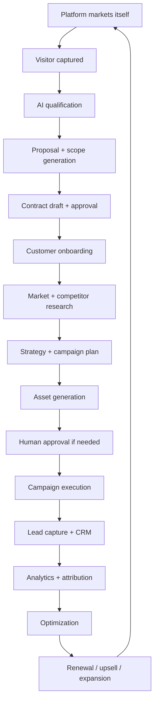
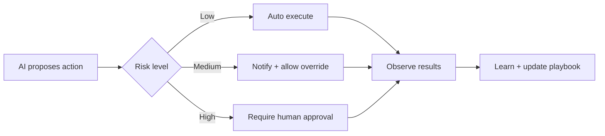
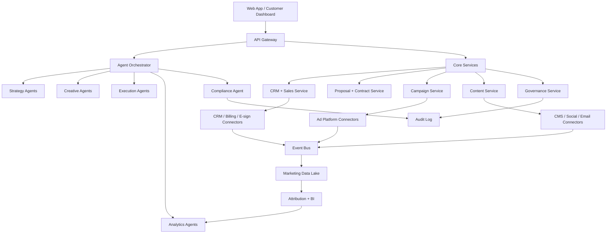

# Digital Marketing Operating System - Product Architecture Document

**Product**: Digital Marketing Operating System (DMOS)  
**Repository Location**: `products/digital-marketing/`  
**Framework**: Platform Kernel  
**Version**: 1.0.0  
**Status**: Architecture Review  
**Last Updated**: 2026-05-01

---

## 1. Vision and Product Thesis

### Vision Statement

An AI-native digital marketing operating system that plans, sells, executes, measures, and improves growth campaigns end to end—with human approval only where judgment, risk, or governance requires it.

### Product Thesis

The platform converts marketing from fragmented tools + manual agencies into an autonomous, measurable, compliance-aware growth system. Unlike existing martech tools that focus on single channels (email, CRM, SEO, ads), DMOS provides:

**End-to-end autonomous marketing execution with governance, contracts, compliance, measurement, and continuous learning.**

### Core Differentiation

The platform itself should run the same growth engine it sells, creating a live demo, proof of capability, internal feedback loop, and "dogfooding" advantage.

### Strategic Positioning

**Primary Positioning**: "From growth goal to signed contract to live campaign to measurable revenue—automated."

**Alternative Positioning**: "An AI-native digital marketing operating system that acts as an autonomous growth operator for businesses that cannot afford full marketing teams."

---

## 2. Target Customers and Use Cases

### Primary Beachhead (MVP)

**Target Segment**: Small and mid-sized service businesses, local businesses, SaaS startups, clinics, agencies, consultants, and e-commerce brands

**Pain Points**:
- No marketing staff or expertise
- Poor tracking and wasted ad spend
- Cannot afford full marketing agencies
- Fragmented tools with low utilization
- Need for measurable growth outcomes

**Platform Promise**: "AI growth manager in a box"

### Secondary Segments (Post-MVP)

| Segment | Pain | Platform Promise |
|---------|------|------------------|
| **SaaS Startups** | Need pipeline, content, experiments, attribution | "Automated demand-gen engine" |
| **Agencies** | Too much manual work, reporting burden, campaign ops overhead | "Agency operating system" |
| **E-commerce** | Constant creative testing, segmentation, abandoned carts, retention | "Autonomous lifecycle marketing" |
| **Enterprises** | Tool sprawl, low martech utilization, governance needs | "Governed marketing automation layer" |

### Use Case Categories

**Acquisition Use Cases**:
- Lead generation through paid campaigns
- SEO content production and optimization
- Social media engagement and growth
- Referral and affiliate program management

**Lifecycle Use Cases**:
- Email/SMS nurture sequences
- Abandoned cart recovery
- Customer onboarding flows
- Renewal and upsell campaigns

**Analytics Use Cases**:
- Full-funnel attribution (spend → lead → contract → revenue)
- Campaign performance optimization
- Budget reallocation based on ROI
- A/B testing and experiment management

**Governance Use Cases**:
- Compliance checks for claims and disclosures
- Consent management (GDPR/CCPA)
- Audit trail for all marketing actions
- Human approval gates for sensitive content

---

## 3. End-to-End Lifecycle

### Complete Domain Loop



### Lifecycle Stages

#### Stage 1: Self-Marketing Engine
- ICP discovery for target customer segments
- SEO content engine (pillar pages, landing pages, comparison pages)
- Paid campaign engine (Google/Meta/LinkedIn/TikTok tests)
- Social content engine (scheduled posts, short videos, thought leadership)
- Lead magnet engine (free audits, calculators, checklists, benchmark reports)
- Referral engine (referral offers and partner attribution)
- Growth experiment engine (continuous testing of channels, messages, audiences, offers)

**Outcome**: Awareness → Free audit → Consultation/demo → Proposal → Contract → Onboarding

#### Stage 2: Customer Acquisition + Qualification
- AI website/chat agent for business-goal questions
- Lead scoring (fit, urgency, budget, industry, deal value)
- Business intake (offer, geography, audience, brand, constraints, competitors)
- Pain-point diagnosis (weak funnel areas: traffic, conversion, retention, attribution)
- Auto-generated audit (valuable initial report for prospects)
- CRM sync (push qualified leads to internal or customer CRM)

#### Stage 3: Contract + Proposal Engine
- Scope builder (goals into deliverables, channels, timelines, approval gates)
- Pricing recommender (package, retainer, performance fee, or hybrid model)
- Proposal generator (branded proposal with strategy, deliverables, milestones, assumptions)
- Contract draft generator (SOW/MSA-style agreements from approved templates)
- Risk flags (missing approvals, unrealistic claims, unsupported guarantees, privacy risks)
- E-sign integration (send final approved contract for signing)
- Renewal engine (track outcomes and draft renewal/upsell proposals)

**Critical**: Contract generation must be template-based, auditable, and human-approved. Not legal advice, but drafts with risk identification.

#### Stage 4: Market Research + Strategy Engine
- Market map (segments, competitors, positioning, demand drivers)
- Channel plan (SEO, paid search, paid social, email, SMS, local, video)
- Message strategy (pain points, hooks, objections, proof points)
- Campaign calendar (weekly/monthly execution plan)
- Budget allocation (spend by channel and experiment)
- Measurement plan (KPIs, conversion events, attribution model)

#### Stage 5: Campaign Planning Engine
- Acquisition campaigns (Google Search, Meta, LinkedIn, TikTok, YouTube, programmatic)
- Lifecycle campaigns (welcome, nurture, abandoned cart, reactivation, renewal)
- Content campaigns (SEO articles, landing pages, comparison pages, lead magnets)
- Local campaigns (Google Business Profile, reviews, local SEO, map-pack strategy)
- Retargeting campaigns (website visitors, engaged users, abandoned forms)
- Referral campaigns (customer referrals, partner campaigns, affiliates)
- Reputation campaigns (review requests, testimonial collection, social proof)

#### Stage 6: Creative + Content Engine
- Brand system (voice, tone, design tokens, approved claims, forbidden claims)
- Creative variants (headlines, ads, images, videos, landing page sections)
- SEO content (topic clusters, internal linking, schema, search intent coverage)
- Social content (LinkedIn, Instagram, TikTok, X, YouTube Shorts)
- Email/SMS (lifecycle flows, newsletters, nurture, promotions)
- Landing pages (generated pages with conversion-focused structure)
- Proof assets (case studies, testimonials, comparison pages)
- Compliance check (endorsement, claim, disclosure, privacy, regulated-industry risk)

#### Stage 7: Execution + Integration Layer
- Ad platform connectors (Google Ads, Meta, LinkedIn, TikTok, Reddit, Pinterest)
- Analytics connectors (GA4, Search Console, pixels, server-side events)
- CRM connectors (HubSpot, Salesforce, Pipedrive, Zoho)
- Email/SMS connectors (Mailchimp, Klaviyo, SendGrid, Twilio)
- CMS connectors (WordPress, Webflow, Shopify, headless CMS)
- Social connectors (LinkedIn, Instagram, Facebook, TikTok, YouTube)
- Data connectors (Postgres, BigQuery, Snowflake, Databricks)
- Contract connectors (DocuSign, PandaDoc, Stripe, QuickBooks)
- Support connectors (Intercom, Zendesk, Freshdesk)

#### Stage 8: Analytics, Attribution, and Optimization
- Awareness metrics (impressions, reach, share of voice, search visibility)
- Engagement metrics (CTR, scroll, video completion, social engagement)
- Conversion metrics (form fills, calls, bookings, purchases, trials)
- Revenue metrics (CAC, ROAS, LTV, payback period, pipeline, closed-won)
- Retention metrics (repeat purchase, churn, renewal, upsell)
- Experimentation metrics (variant winner, confidence, learning summary)
- Operations metrics (spend pacing, SLA, approval latency, campaign health)

**Critical**: Analytics should not only report—it should trigger next actions.

#### Stage 9: Governance, Compliance, Privacy, and Trust
- Consent management (GDPR/CCPA/email/SMS compliance)
- Data minimization (avoid unnecessary customer data collection)
- Purpose limitation (use data only for approved campaign purposes)
- Audit log (who approved what, when, and why)
- Human approval gates (claims, budgets, legal-sensitive content, regulated industries)
- Brand safety (avoid unsafe placements, misleading claims, hallucinated proof)
- Disclosure management (influencers, endorsements, AI-generated content where required)
- Unsubscribe/opt-out (email/SMS legal requirement)
- Data deletion/export (privacy rights support)
- Regional policy engine (different rules by country/state/industry)

---

## 4. Agent Architecture

### Multi-Agent System Design

Build as a multi-agent system using the kernel's `AgentOrchestrator` abstractions, exposing capabilities through a simple dashboard.

### Agent Taxonomy

| Agent | Responsibility | Agent Type (Ghatana) |
|-------|---------------|---------------------|
| **Growth Strategist Agent** | Creates strategy, positioning, budget plan | PLANNING |
| **Market Research Agent** | Competitor, keyword, trend, audience research | HYBRID |
| **Brand Agent** | Maintains voice, style, claims, approved language | DETERMINISTIC |
| **Creative Agent** | Produces ad, email, video, landing page variants | PROBABILISTIC |
| **Media Buyer Agent** | Plans and optimizes paid campaigns | ADAPTIVE |
| **SEO Agent** | Topic clusters, technical SEO, content briefs | HYBRID |
| **Lifecycle Agent** | Email/SMS/customer journey automation | DETERMINISTIC |
| **Sales Agent** | Qualifies leads, drafts proposals, follows up | PLANNING |
| **Contract Agent** | Drafts SOW/MSA from approved templates | DETERMINISTIC |
| **Compliance Agent** | Checks consent, claims, disclosures, regional rules | DETERMINISTIC |
| **Analytics Agent** | Measures results and explains performance | HYBRID |
| **Optimization Agent** | Reallocates budget, proposes experiments | ADAPTIVE |
| **Customer Success Agent** | Generates reports, renewal plans, upsells | PLANNING |

### Agent Implementation Pattern

All agents must implement the kernel's `AgentOrchestrator.KernelAgent` interface:

```java
/**
 * @doc.type class
 * @doc.purpose Executes growth strategy planning for marketing campaigns
 * @doc.layer product
 * @doc.pattern Agent
 */
public class GrowthStrategistAgent implements AgentOrchestrator.KernelAgent {
    
    private final String agentId = "growth-strategist";
    private final AgentOrchestrator orchestrator;
    private final KernelContext kernelContext;
    
    @Override
    public String getAgentId() {
        return agentId;
    }
    
    @Override
    public String getName() {
        return "Growth Strategist Agent";
    }
    
    @Override
    public String getDescription() {
        return "Creates marketing strategy, positioning, and budget plans";
    }
    
    @Override
    public AgentResponse execute(AgentRequest request) {
        // Implementation using kernel abstractions
        StrategyInput input = parseInput(request.getPayload());
        
        // Execute strategy generation
        StrategyOutput strategy = generateStrategy(input);
        
        return AgentResponse.builder()
            .requestId(request.getRequestId())
            .success(true)
            .result(strategy)
            .confidence(calculateConfidence(strategy))
            .build();
    }
    
    @Override
    public AgentCapabilities getCapabilities() {
        return new AgentCapabilities() {
            @Override
            public List<String> getSupportedOperations() {
                return List.of("generate-strategy", "optimize-budget", "create-positioning");
            }
            
            @Override
            public Map<String, Object> getMetadata() {
                return Map.of(
                    "agentType", "PLANNING",
                    "version", "1.0.0",
                    "requiredCapabilities", List.of("market-research", "budget-optimization")
                );
            }
            
            @Override
            public boolean supportsOperation(String operation) {
                return getSupportedOperations().contains(operation);
            }
        };
    }
}
```

### Human Involvement Model



**Risk Classification**:
- **Low**: Routine optimizations, content variants within brand guidelines
- **Medium**: Budget reallocations >10%, new channel experiments
- **High**: Legal-sensitive content, regulated industry claims, contract terms

### Agent Orchestration

Use the kernel's `AgentOrchestrator` for:

- Agent lifecycle management (register/unregister agents)
- Capability-based agent discovery
- Cross-agent communication via KernelEventBus
- Approval gate integration
- Audit trail for agent actions

**Dependency Direction**: Products depend on kernel's `AgentOrchestrator` interface. Kernel may internally use platform modules for implementation, but products never bypass kernel to access platform agent modules directly.

---

## 5. Platform Architecture

### Architecture Diagram



### Technology Stack (Aligned with Ghatana)

| Layer | Technology | Rationale |
|-------|-----------|-----------|
| **Frontend** | React + React Router, TypeScript strict mode, @ghatana/design-system | Reuse platform TypeScript packages |
| **Backend** | Java 21, ActiveJ async framework | Ghatana standard async patterns |
| **Data** | PostgreSQL (platform:java:database), event log, object storage | Reuse platform database abstractions |
| **Workflow** | Kernel workflow engine (platform-kernel) | Leverage kernel framework |
| **Queue/Events** | KernelEventBus (platform-kernel) | Cross-module communication |
| **AI Orchestration** | Agent runtime (kernel AgentOrchestrator) | Kernel agent abstractions |
| **Analytics** | Postgres + columnar warehouse (Data Cloud adapter) | Reuse Data Cloud integration |
| **Observability** | OpenTelemetry + Prometheus (platform:java:observability) | Platform standard |
| **Integrations** | Connector framework with OAuth, retries, rate limits | Custom implementation |
| **Security** | RBAC/ABAC (platform:java:security), tenant isolation | Platform security modules |
| **Governance** | platform-plugins (compliance, audit-trail, consent) | Reuse shared plugins |

### Module Structure (Following Ghatana Patterns)

```
products/digital-marketing/
├── dm-agent-runtime/          # Agent implementations
│   ├── src/main/java/com/ghatana/dm/agent/
│   │   ├── GrowthStrategistAgent.java
│   │   ├── MarketResearchAgent.java
│   │   ├── CreativeAgent.java
│   │   └── ...
│   └── build.gradle.kts
├── dm-campaign-service/       # Campaign management
│   ├── src/main/java/com/ghatana/dm/campaign/
│   │   ├── CampaignService.java
│   │   ├── CampaignRepository.java
│   │   └── ...
│   └── build.gradle.kts
├── dm-content-service/        # Content generation and management
│   ├── src/main/java/com/ghatana/dm/content/
│   │   ├── ContentService.java
│   │   ├── BrandSystem.java
│   │   └── ...
│   └── build.gradle.kts
├── dm-governance-service/     # Compliance and audit
│   ├── src/main/java/com/ghatana/dm/governance/
│   │   ├── ComplianceService.java
│   │   ├── ApprovalGate.java
│   │   └── ...
│   └── build.gradle.kts
├── dm-analytics-service/      # Attribution and optimization
│   ├── src/main/java/com/ghatana/dm/analytics/
│   │   ├── AttributionService.java
│   │   ├── OptimizationEngine.java
│   │   └── ...
│   └── build.gradle.kts
├── dm-integration-layer/      # External system connectors
│   ├── src/main/java/com/ghatana/dm/integration/
│   │   ├── ad/ (Google Ads, Meta, etc.)
│   │   ├── crm/ (HubSpot, Salesforce, etc.)
│   │   └── ...
│   └── build.gradle.kts
├── dm-web-app/               # React frontend
│   ├── src/
│   │   ├── components/
│   │   ├── pages/
│   │   └── ...
│   ├── package.json
│   └── tsconfig.json
└── settings.gradle.kts
```

### Kernel Framework Integration

**Module Lifecycle**: All services extend `AbstractKernelModule` and register with kernel:

```java
/**
 * @doc.type class
 * @doc.purpose Campaign management service for digital marketing
 * @doc.layer product
 * @doc.pattern Service
 */
public class CampaignServiceModule extends AbstractKernelModule {
    
    @Override
    public Promise<Void> initialize(KernelContext context) {
        // Register capabilities
        registerCapability("campaign-management");
        registerCapability("campaign-execution");
        
        // Register services
        context.registerService(CampaignService.class, new CampaignService());
        
        return Promise.complete();
    }
}
```

**Plugin Usage**: Leverage platform-plugins for cross-cutting concerns:

```java
// Use StandardCompliancePlugin for marketing compliance
context.getPlugin(CompliancePlugin.class)
    .checkClaim(claimText, industry, region);

// Use StandardAuditTrailPlugin for audit logging
context.getPlugin(AuditTrailPlugin.class)
    .logAction("campaign-launched", campaignId, userId);

// Use StandardConsentPlugin for consent management
context.getPlugin(ConsentPlugin.class)
    .recordConsent(contactId, consentType, channel);
```

---

## 6. Data Model

### Core Domain Entities

#### Customer Domain
| Entity | Attributes | Relationships |
|--------|-----------|--------------|
| **Organization** | id, name, industry, size, tier | hasMany Workspaces, hasMany Brands |
| **Workspace** | id, organizationId, name, settings | belongsTo Organization, hasMany Campaigns |
| **Brand** | id, workspaceId, name, voiceGuidelines, designTokens | belongsTo Workspace, usedIn Campaigns |
| **Product** | id, brandId, name, offer, pricing, margin | belongsTo Brand, featuredIn Campaigns |
| **Offer** | id, productId, valueProp, constraints, eligibility | belongsTo Product, usedIn Campaigns |
| **Location** | id, organizationId, geography, timezone, regulations | belongsTo Organization, affects Compliance |

#### Market Domain
| Entity | Attributes | Relationships |
|--------|-----------|--------------|
| **Segment** | id, workspaceId, name, criteria, size | belongsTo Workspace, targetedBy Campaigns |
| **Persona** | id, segmentId, name, painPoints, buyingTriggers | belongsTo Segment, usedIn Targeting |
| **Competitor** | id, workspaceId, name, website, adsKeywords, socialPresence | belongsTo Workspace, analyzedIn Research |
| **Keyword** | id, workspaceId, term, searchVolume, competition, intent | belongsTo Workspace, usedIn SEO |
| **Trend** | id, workspaceId, topic, trajectory, relevanceScore | belongsTo Workspace, informs Strategy |
| **Channel** | id, workspaceId, type (paid/organic/social), config | belongsTo Workspace, usedIn Campaigns |

#### Strategy Domain
| Entity | Attributes | Relationships |
|--------|-----------|--------------|
| **Goal** | id, workspaceId, type (leads/revenue/awareness), target, timeframe | belongsTo Workspace, drives Strategy |
| **KPI** | id, goalId, metric, target, current, trend | belongsTo Goal, trackedIn Analytics |
| **Budget** | id, strategyId, total, allocatedByChannel, remaining | belongsTo Strategy, controls Spend |
| **Positioning** | id, strategyId, valueProp, differentiation, messaging | belongsTo Strategy, guides Content |
| **CampaignPlan** | id, strategyId, schedule, channels, milestones | belongsTo Strategy, executedAs Campaigns |

#### Campaign Domain
| Entity | Attributes | Relationships |
|--------|-----------|--------------|
| **Campaign** | id, planId, name, status, startDate, endDate | belongsTo CampaignPlan, hasMany Creatives |
| **Channel** | id, campaignId, type, platform, config | belongsTo Campaign, integratesWith Platform |
| **Audience** | id, campaignId, criteria, size, segments | belongsTo Campaign, targetedBy Ads |
| **Creative** | id, campaignId, type (ad/email/page), variant, content | belongsTo Campaign, approvedBy Review |
| **Variant** | id, creativeId, version, performanceScore, winner | belongsTo Creative, testedIn Experiment |
| **Schedule** | id, campaignId, timing, frequency, pacing | belongsTo Campaign, controls Execution |

#### Content Domain
| Entity | Attributes | Relationships |
|--------|-----------|--------------|
| **Asset** | id, workspaceId, type, url, metadata, complianceStatus | belongsTo Workspace, usedIn Creatives |
| **LandingPage** | id, campaignId, url, structure, conversionRate | belongsTo Campaign, generatedBy Agent |
| **Email** | id, campaignId, subject, body, template, metrics | belongsTo Campaign, sentTo Audience |
| **SMS** | id, campaignId, message, template, complianceFlags | belongsTo Campaign, sentTo Audience |
| **SocialPost** | id, campaignId, platform, content, schedule, metrics | belongsTo Campaign, publishedTo Social |
| **VideoBrief** | id, campaignId, script, visualDirection, duration | belongsTo Campaign, producedExternally |

#### Execution Domain
| Entity | Attributes | Relationships |
|--------|-----------|--------------|
| **Task** | id, campaignId, type, status, assignedTo, dueDate | belongsTo Campaign, trackedIn Workflow |
| **Approval** | id, taskId, approver, decision, timestamp, comments | belongsTo Task, gatesExecution |
| **IntegrationJob** | id, campaignId, platform, type, status, retryCount | belongsTo Campaign, connectsTo External |
| **PublishEvent** | id, integrationJobId, payload, response, timestamp | belongsTo IntegrationJob, loggedIn Audit |

#### Sales Domain
| Entity | Attributes | Relationships |
|--------|-----------|--------------|
| **Lead** | id, campaignId, source, contactInfo, score, status | belongsTo Campaign, nurturedIn CRM |
| **Opportunity** | id, leadId, value, stage, probability, closeDate | belongsTo Lead, trackedIn Pipeline |
| **Proposal** | id, opportunityId, scope, pricing, terms, status | belongsTo Opportunity, becomes Contract |
| **Contract** | id, proposalId, documentUrl, signedDate, renewalDate | belongsTo Proposal, governs Service |
| **Invoice** | id, contractId, amount, dueDate, status, paidDate | belongsTo Contract, processedIn Billing |

#### Analytics Domain
| Entity | Attributes | Relationships |
|--------|-----------|--------------|
| **Event** | id, type, timestamp, properties, correlationId | belongsTo Campaign, storedIn Lake |
| **Conversion** | id, eventId, value, attributedTo, modelVersion | belongsTo Event, calculatedIn Attribution |
| **Attribution** | id, conversionId, touchpoints, weights, model | belongsTo Conversion, explainsPerformance |
| **Experiment** | id, campaignId, variants, hypothesis, duration | belongsTo Campaign, produces Insights |
| **Insight** | id, experimentId, finding, confidence, actionability | belongsTo Experiment, drives Optimization |

#### Governance Domain
| Entity | Attributes | Relationships |
|--------|-----------|--------------|
| **Consent** | id, contactId, type, channel, grantedAt, revokedAt | belongsTo Contact, enforcedBy Policy |
| **Policy** | id, workspaceId, type, region, rules, active | belongsTo Workspace, checkedBy Compliance |
| **Claim** | id, contentId, text, evidence, approvalStatus, riskLevel | belongsTo Content, reviewedBy Human |
| **Disclosure** | id, contentId, type (endorsement/AI/sponsor), required | belongsTo Content, addedBy Agent |
| **AuditLog** | id, action, actor, timestamp, changes, correlationId | belongsTo System, queriedFor Compliance |

#### Learning Domain
| Entity | Attributes | Relationships |
|--------|-----------|--------------|
| **Playbook** | id, workspaceId, industry, steps, successRate | belongsTo Workspace, reusedIn Campaigns |
| **ExperimentResult** | id, experimentId, variant, metrics, statisticalSignificance | belongsTo Experiment, updates Playbook |
| **Recommendation** | id, campaignId, type, priority, expectedImpact, status | belongsTo Campaign, actionedBy Human |
| **ModelFeedback** | id, agentId, prediction, actual, timestamp | belongsTo Agent, improvesModel |

### Event-Driven Architecture

All campaign actions, approvals, conversions, contract events, and optimizations must be traceable through events:

**Event Types**:
- `CampaignCreated`, `CampaignStarted`, `CampaignStopped`
- `CreativeGenerated`, `CreativeApproved`, `CreativeRejected`
- `LeadCaptured`, `LeadQualified`, `LeadConverted`
- `ContractDrafted`, `ContractSigned`, `ContractRenewed`
- `BudgetAllocated`, `BudgetReallocated`, `BudgetExhausted`
- `ComplianceViolation`, `ApprovalRequired`, `ApprovalGranted`
- `ExperimentStarted`, `ExperimentConcluded`, `WinnerDeclared`

**Event Schema** (following Ghatana patterns):
```java
public record MarketingEvent(
    String eventId,
    String eventType,
    String correlationId,
    String tenantId,
    Instant timestamp,
    Map<String, Object> payload,
    String source
) {}
```

---

## 7. Integration Strategy

### Integration Categories

#### Ad Platform Integrations
| Platform | Priority | Capabilities | Compliance Notes |
|----------|----------|-------------|------------------|
| **Google Ads** | P0 | Campaign create/update, bid management, reporting | Consent Mode, enhanced conversions |
| **Meta (Facebook/Instagram)** | P0 | Campaign create/update, audience targeting, reporting | Data processing agreements |
| **LinkedIn** | P1 | B2B campaign management, lead gen forms | Professional data handling |
| **TikTok** | P2 | Video ad campaigns, creative optimization | Age-gated content compliance |
| **Reddit** | P3 | Community-targeted ads | Platform-specific content policies |

#### Analytics Integrations
| Platform | Priority | Capabilities | Privacy Notes |
|----------|----------|-------------|---------------|
| **Google Analytics 4** | P0 | Event tracking, conversion attribution | Consent Mode, data retention |
| **Google Search Console** | P0 | SEO performance, keyword data | First-party data only |
| **Meta Pixel** | P0 | Conversion tracking, custom events | Cookie consent handling |
| **LinkedIn Insight Tag** | P1 | B2B conversion tracking | Professional data policies |

#### CRM Integrations
| Platform | Priority | Capabilities | Data Flow |
|----------|----------|-------------|-----------|
| **HubSpot** | P0 | Lead sync, deal tracking, contact updates | Bidirectional |
| **Salesforce** | P1 | Lead/opportunity sync, campaign influence | Bidirectional |
| **Pipedrive** | P2 | Lead sync, activity tracking | Bidirectional |
| **Zoho CRM** | P3 | Contact management, deal pipeline | Bidirectional |

#### Email/SMS Integrations
| Platform | Priority | Capabilities | Compliance |
|----------|----------|-------------|------------|
| **Mailchimp** | P0 | Email campaigns, automation, lists | CAN-SPAM, unsubscribe |
| **Klaviyo** | P0 | Email/SMS, e-commerce flows | CAN-SPAM, TCPA |
| **SendGrid** | P1 | Transactional email, marketing emails | CAN-SPAM compliance |
| **Twilio** | P1 | SMS campaigns, two-factor auth | TCPA consent |

#### CMS Integrations
| Platform | Priority | Capabilities | Notes |
|----------|----------|-------------|-------|
| **WordPress** | P0 | Page publishing, SEO plugins | REST API |
| **Webflow** | P0 | Landing page publishing, CMS | API-first |
| **Shopify** | P1 | E-commerce content, product pages | Product catalog sync |
| **Headless CMS** | P2 | Content management, API delivery | Generic adapter |

#### Contract/Billing Integrations
| Platform | Priority | Capabilities | Notes |
|----------|----------|-------------|-------|
| **DocuSign** | P0 | E-signature, contract workflow | Template-based |
| **PandaDoc** | P1 | Proposal generation, e-signature | CRM integration |
| **Stripe** | P0 | Payment processing, subscriptions | PCI compliance |
| **QuickBooks** | P2 | Invoicing, expense tracking | Accounting sync |

### Integration Architecture Pattern

**Connector Interface** (following Ghatana patterns):
```java
/**
 * @doc.type interface
 * @doc.purpose Defines contract for external platform integrations
 * @doc.layer product
 * @doc.pattern Adapter
 */
public interface PlatformConnector<T extends PlatformRequest, R extends PlatformResponse> {
    
    String getPlatformId();
    
    Promise<ConnectorHealth> checkHealth();
    
    Promise<R> execute(T request, AgentContext context);
    
    Promise<Void> authenticate(AuthConfig config);
    
    ConnectorCapabilities getCapabilities();
}
```

**OAuth Management**: Use platform:java:security for OAuth token management and refresh.

**Rate Limiting**: Implement per-platform rate limiting with exponential backoff.

**Error Handling**: Categorize errors (transient, permanent, rate-limit) and apply appropriate retry strategies.

**Audit Trail**: All integration actions logged via platform-plugins/audit-trail.

### Data Synchronization Strategy

**Event-Driven Sync**:
- Campaign changes trigger sync events to ad platforms
- Lead capture events push to CRM via KernelEventBus
- Analytics data pulled on schedule, processed via Data Cloud adapter

**Idempotency**:
- All integration jobs idempotent (deduplication by correlation ID)
- Retry-safe with exactly-once semantics where possible

**Data Freshness**:
- Real-time for campaign actions (launch, pause, budget changes)
- Near real-time for lead capture (< 5 minutes)
- Batch for analytics reporting (hourly/daily)

---

## 8. Governance and Compliance Model

### Governance Framework

**Layered Governance Model**:
1. **Platform-Level**: Kernel security, tenant isolation, audit trail
2. **Product-Level**: Marketing-specific compliance, approval gates, brand safety
3. **Integration-Level**: Platform-specific policies (Meta, Google, etc.)

### Compliance Controls

#### Consent Management
- **GDPR/CCPA Compliance**: Record explicit consent for email/SMS, marketing cookies
- **Purpose Limitation**: Use data only for stated campaign purposes
- **Data Minimization**: Collect only necessary customer data
- **Consent Revocation**: Honor unsubscribe/opt-out requests immediately
- **Regional Policies**: Different consent rules by country/state

**Implementation**: Use `platform-plugins/plugin-consent` for consent recording and validation.

#### Claim and Disclosure Management
- **Claim Validation**: All marketing claims require evidence or approval
- **Endorsement Disclosures**: Influencer/UGC content requires clear disclosure
- **AI Content Labeling**: AI-generated content marked where required
- **Regulated Industry Rules**: Healthcare, finance, legal claims reviewed by human
- **Brand Safety**: Avoid misleading claims, hallucinated proof, unsafe placements

**Implementation**: Custom validation service with human approval gates.

#### Audit Trail
- **Action Logging**: Who approved what, when, and why
- **Change Tracking**: All campaign, content, and contract changes logged
- **Correlation IDs**: Trace actions across systems for debugging
- **Tamper Evidence**: Hash chain for critical audit records

**Implementation**: Use `platform-plugins/plugin-audit-trail` with marketing-specific event types.

#### Human Approval Gates
- **Risk-Based Triggers**: High-risk actions require human approval
- **Approval Workflows**: Configurable approval chains (marketer → legal → executive)
- **Timeout Handling**: Escalation for overdue approvals
- **Override Mechanism**: Emergency override with audit trail

**Risk Classification**:
| Risk Level | Triggers | Approval Required |
|------------|-----------|-------------------|
| **Low** | Routine optimizations, content within brand guidelines | Auto-approve |
| **Medium** | Budget changes >10%, new channels, A/B tests | Marketing manager |
| **High** | Legal claims, regulated industries, contract terms | Legal + executive |

### Regional Compliance Engine

**Policy Structure**:
```java
public record RegionalPolicy(
    String region,
    Set<ComplianceRule> rules,
    Set<RestrictedClaim> restrictedClaims,
    Set<RequiredDisclosure> requiredDisclosures,
    DataRetentionPolicy retentionPolicy
) {}
```

**Supported Regions** (MVP):
- US (CAN-SPAM, CCPA)
- EU (GDPR, ePrivacy)
- UK (GDPR, PECR)
- Canada (CASL)

### Privacy and Security

**Data Classification**:
- **Public**: Marketing content, campaign metrics
- **Internal**: Strategy documents, playbooks
- **Confidential**: Customer data, contract terms
- **Restricted**: PII, financial data

**Security Measures**:
- Tenant isolation at database level (via Data Cloud adapter)
- Encryption at rest and in transit
- RBAC/ABAC for access control (platform:java:security)
- Regular security audits and penetration testing

### Brand Governance

**Brand System Enforcement**:
- Voice and tone guidelines in content generation
- Approved claims library (with evidence)
- Forbidden claims blacklist
- Design token validation for visual assets
- Multi-brand support (agencies managing multiple clients)

---

## 9. MVP Scope

### MVP: "AI Growth Operator for Service Businesses"

**Target Customers**: Local service businesses, consultants, clinics, home services, small SaaS

### MVP Capabilities

| Area | MVP Feature | Notes |
|------|-------------|-------|
| **Self-Marketing** | Landing page, free audit funnel, AI chat qualification | Platform markets itself |
| **Onboarding** | Business intake, website scan, competitor scan | Automated setup |
| **Strategy** | AI-generated 30-day marketing plan | Human-reviewed |
| **Content** | Landing page + Google ad copy + email follow-up | Template-based |
| **Execution** | Publish landing page, export/push ads manually or via one integration | Google Ads only |
| **CRM** | Capture leads and track status | Internal CRM-lite |
| **Proposal** | Generate proposal and SOW draft | Template-based, human-reviewed |
| **Analytics** | Leads, conversion rate, CAC estimate, campaign summary | Basic reporting |
| **Governance** | Approval gates, audit log, unsubscribe/compliance checks | Core controls only |

### MVP Technical Scope

**Included**:
- Core agent runtime (GrowthStrategist, MarketResearch, Creative, Compliance)
- Campaign service (create, update, basic reporting)
- Content service (landing page generation, ad copy)
- Governance service (approval gates, audit logging)
- Google Ads integration (single platform)
- Internal CRM (lead capture, status tracking)
- Proposal/contract generator (template-based)
- Basic analytics dashboard
- React web app (dashboard-first UX)

**Excluded** (Post-MVP):
- Multi-platform ad integrations (Meta, LinkedIn, TikTok)
- External CRM integrations (HubSpot, Salesforce)
- Email/SMS automation platforms
- Advanced attribution modeling
- Industry playbooks
- Agency/multi-client mode
- Enterprise features (SSO, data residency)

### MVP Success Metric

> A customer can go from intake → approved plan → live campaign → captured lead → performance report → renewal recommendation without needing a marketing expert.

**Quantitative Success Criteria**:
- Time from signup to first live campaign: < 48 hours
- Lead capture rate: > 5% from landing page traffic
- Customer retention: > 70% after 3 months
- NPS: > 40

---

## 10. Roadmap

### Phase 1: Foundation (Months 1-3)

**Objective**: Build product shell and core agent capabilities

| Workstream | Deliverable | Dependencies |
|------------|-------------|--------------|
| **Product Shell** | Workspace, org, users, roles | Kernel framework |
| **Brand Profile** | Voice, colors, offers, claims | Content service |
| **Intake** | Business profile and growth goal capture | Web app |
| **Market Research** | Competitor and keyword research workflow | MarketResearch agent |
| **Plan Generator** | 30/60/90-day strategy | GrowthStrategist agent |
| **Asset Generator** | Landing page, ad copy, email sequence | Creative agent |
| **Approval Workflow** | Review, approve, reject, edit | Governance service |
| **Basic Analytics** | Campaign and lead dashboard | Analytics service |

**Technical Milestones**:
- Kernel module registration and lifecycle
- Agent framework integration
- Basic web app with authentication
- First end-to-end campaign flow

### Phase 2: Execution (Months 4-6)

**Objective**: Enable automated campaign execution

| Workstream | Deliverable | Dependencies |
|------------|-------------|--------------|
| **Ad Connectors** | Google Ads first, Meta second | Integration layer |
| **CMS Publishing** | Webflow/WordPress/headless landing pages | Content service |
| **Email Automation** | Mailchimp/Klaviyo/SendGrid connector | Integration layer |
| **CRM** | Leads, opportunities, follow-up tasks | Sales service |
| **Proposal Engine** | Scope, pricing, proposal PDF | Contract service |
| **Contract Drafts** | Template-based SOW generation | Contract service |
| **Audit Log** | Full trace of actions and approvals | Audit trail plugin |

**Technical Milestones**:
- Google Ads integration end-to-end
- First automated campaign launch
- Proposal to contract workflow
- Comprehensive audit trail

### Phase 3: Autonomous Optimization (Months 7-9)

**Objective**: Enable AI-driven optimization

| Workstream | Deliverable | Dependencies |
|------------|-------------|--------------|
| **Experiment Engine** | A/B tests, creative variants, budget shifts | Optimization agent |
| **Attribution** | Spend → lead → revenue reporting | Analytics service |
| **Recommendation Engine** | Next-best-action queue | Analytics agent |
| **Budget Pacing** | Alerts and autonomous adjustments | MediaBuyer agent |
| **Segment Optimization** | Audience and persona refinement | MarketResearch agent |
| **AI Performance Reviews** | Weekly/monthly narrative reports | Analytics agent |

**Technical Milestones**:
- A/B testing framework
- Attribution modeling
- Autonomous budget optimization
- Performance reporting automation

### Phase 4: Platformization (Months 10-12)

**Objective**: Scale to multiple segments and use cases

| Workstream | Deliverable | Dependencies |
|------------|-------------|--------------|
| **Industry Playbooks** | SaaS, healthcare, legal, home services, e-commerce | Learning framework |
| **Agency Mode** | Multi-client workspace, white-label reports | Multi-tenancy |
| **Marketplace** | Templates, playbooks, connectors | Plugin system |
| **Advanced Governance** | Regional compliance policy engine | Compliance plugin |
| **Enterprise Mode** | SSO, tenant isolation, data residency, approvals | Security enhancements |
| **Partner Engine** | Referral/affiliate/co-marketing workflows | Integration layer |

**Technical Milestones**:
- Playbook library and reuse
- Multi-tenant agency mode
- Enterprise security features
- Partner marketplace

### Phase 5: Ecosystem Expansion (Months 13+)

**Objective**: Build ecosystem and advanced capabilities

| Workstream | Deliverable |
|------------|-------------|
| **Self-Marketing Scale** | Platform uses its own engine at scale |
| **Advanced AI** | Custom model training per customer |
| **Predictive Analytics** | Forecasting and prescriptive recommendations |
| **Voice/Video AI** | AI-generated video and audio content |
| **Community** | User community, shared playbooks |
| **API Platform** | Public API for third-party integrations |

---

## 11. Success Metrics

### Product Metrics

**Acquisition Metrics**:
- Monthly unique signups
- Signup-to-onboarding conversion rate
- Time-to-first-campaign (TTFC)
- Customer acquisition cost (CAC)

**Engagement Metrics**:
- Daily active users (DAU) / Monthly active users (MAU)
- Average campaigns per customer
- Campaign launch frequency
- Feature adoption rate (by module)

**Retention Metrics**:
- Customer churn rate (monthly)
- Revenue churn rate
- Expansion revenue (upsell/cross-sell)
- Net revenue retention (NRR)

**Outcome Metrics**:
- Average leads generated per customer per month
- Average conversion rate (lead to opportunity)
- Average deal size influenced
- Customer-reported ROI

### Technical Metrics

**Performance Metrics**:
- Agent execution latency (p50, p95, p99)
- API response time (p50, p95, p99)
- Campaign sync latency (to ad platforms)
- Dashboard load time

**Reliability Metrics**:
- System uptime (SLA: 99.5%)
- Integration success rate (by platform)
- Error rate (by service)
- Mean time to recovery (MTTR)

**Quality Metrics**:
- Bug escape rate (production bugs per release)
- Test coverage (target: >80% for critical paths)
- Code review approval rate
- Technical debt ratio

### Business Metrics

**Revenue Metrics**:
- Monthly recurring revenue (MRR)
- Annual recurring revenue (ARR)
- Average revenue per user (ARPU)
- Customer lifetime value (LTV)

**Efficiency Metrics**:
- Gross margin (by segment)
- Customer support cost per user
- Infrastructure cost per user
- Sales cycle length

### MVP Success Criteria

**Must-Have** (Blockers):
- 10 paying customers by end of Phase 2
- < 48 hours from signup to first live campaign
- > 70% customer retention after 3 months
- > 5% lead capture rate from landing page traffic
- NPS > 40

**Should-Have** (Stretch):
- 50 paying customers by end of Phase 3
- < 24 hours from signup to first live campaign
- > 80% customer retention after 3 months
- > 10% lead capture rate
- NPS > 50

---

## 12. Risks and Mitigations

### Technical Risks

| Risk | Likelihood | Impact | Mitigation |
|------|------------|--------|------------|
| **Platform API rate limits** | High | Medium | Implement adaptive rate limiting, queue-based execution |
| **Integration breaking changes** | Medium | High | Version adapters, comprehensive integration tests |
| **Agent hallucinations in content** | Medium | High | Human approval gates, claim validation, brand safety filters |
| **Kernel framework immaturity** | Low | High | Early engagement with kernel team, fallback patterns |
| **Scalability bottlenecks** | Medium | Medium | Load testing, horizontal scaling design, async-first architecture |

### Business Risks

| Risk | Likelihood | Impact | Mitigation |
|------|------------|--------|------------|
| **Market adoption slower than expected** | Medium | High | Start with narrow beachhead, iterate based on feedback |
| **Competition from established players** | High | Medium | Focus on end-to-end automation and governance differentiation |
| **Customer churn due to complexity** | Medium | High | Dashboard-first UX, progressive disclosure, onboarding assistance |
| **Pricing misalignment** | Medium | Medium | Flexible pricing models (retainer, performance, hybrid) |
| **Regulatory changes** | Low | High | Compliance-first design, regional policy engine, legal review |

### Operational Risks

| Risk | Likelihood | Impact | Mitigation |
|------|------------|--------|------------|
| **Data privacy violations** | Low | Critical | Consent management, data minimization, regular audits |
| **Security breach** | Low | Critical | Security-first design, penetration testing, incident response plan |
| **Vendor lock-in (ad platforms)** | High | Medium | Multi-platform support, data portability, own attribution layer |
| **Talent acquisition challenges** | Medium | Medium | Leverage platform team expertise, clear documentation, hiring pipeline |
| **Customer support overload** | Medium | Medium | Self-service documentation, AI-powered support, tiered support model |

### Compliance Risks

| Risk | Likelihood | Impact | Mitigation |
|------|------------|--------|------------|
| **FTC/Regulatory enforcement** | Low | Critical | Legal review of compliance controls, regular compliance audits |
| **GDPR/CCPA violations** | Medium | High | Consent management plugin, data deletion/export, regional policies |
| **CAN-SPAM/TCPA violations** | Medium | High | Email/SMS compliance checks, unsubscribe handling, consent recording |
| **Platform-specific policy violations** | Medium | Medium | Platform policy monitoring, automated compliance checks |

### Mitigation Strategies

**Technical Mitigations**:
- Comprehensive testing (unit, integration, E2E)
- Observability-first design (metrics, traces, logs)
- Circuit breakers and fallback patterns
- Regular load testing and performance benchmarking
- Security audits and penetration testing

**Business Mitigations**:
- Customer advisory board for feedback
- Competitive monitoring and differentiation
- Flexible pricing and contract terms
- Strong onboarding and customer success
- Community building and knowledge sharing

**Operational Mitigations**:
- 24/7 monitoring and alerting
- Incident response playbooks
- Regular disaster recovery drills
- Backup and redundancy strategies
- Compliance training for all team members

---

## 13. Epics and User Stories

### Epic E1: Customer Workspace + Brand Profile

**Objective**: Enable customers to set up their workspace and brand configuration

**User Stories**:
- **US1.1**: As a new customer, I want to create a workspace so that I can manage my marketing activities
- **US1.2**: As a customer, I want to define my brand voice and tone so that AI-generated content matches my brand
- **US1.3**: As a customer, I want to upload my brand assets (logos, colors, fonts) so that creatives are on-brand
- **US1.4**: As a customer, I want to define my products and offers so that campaigns promote the right things
- **US1.5**: As a customer, I want to set up my target geography so that campaigns target the right locations

**Acceptance Criteria**:
- Workspace creation with tenant isolation
- Brand profile with voice guidelines and design tokens
- Asset library with version control
- Product catalog with offer definitions
- Geographic targeting with regional policy selection

### Epic E2: AI Intake + Free Audit

**Objective**: Convert website visitors into qualified prospects through AI-powered intake

**User Stories**:
- **US2.1**: As a prospect, I want to answer business goal questions through a chat interface so that I get a quick assessment
- **US2.2**: As a prospect, I want to receive a free marketing audit so that I understand my current performance
- **US2.3**: As a prospect, I want to see a proposal for improvement so that I can decide to engage
- **US2.4**: As the platform, I want to score leads automatically so that sales focuses on high-potential prospects
- **US2.5**: As the platform, I want to sync qualified leads to CRM so that sales can follow up

**Acceptance Criteria**:
- AI chat agent with business goal questionnaire
- Automated audit generation (SEO, ads, content gaps)
- Lead scoring model (fit, urgency, budget, industry)
- CRM integration (HubSpot, Salesforce, internal)
- Audit-to-proposal conversion workflow

### Epic E3: Strategy Generator

**Objective**: Create AI-generated marketing strategies based on business goals

**User Stories**:
- **US3.1**: As a customer, I want to input my business goals (leads, revenue, awareness) so that strategy aligns with objectives
- **US3.2**: As a customer, I want AI to research my competitors so that strategy differentiates my business
- **US3.3**: As a customer, I want a channel plan (SEO, paid, social, email) so that I know where to focus
- **US3.4**: As a customer, I want a budget allocation recommendation so that I spend efficiently
- **US3.5**: As a customer, I want a 30/60/90-day execution calendar so that I have a clear timeline

**Acceptance Criteria**:
- Goal-to-strategy mapping
- Competitor research integration
- Multi-channel strategy with rationale
- Budget allocation by channel with ROI projections
- Gantt-style execution calendar

### Epic E4: Proposal/SOW Generator

**Objective**: Convert strategy into commercial proposals and contracts

**User Stories**:
- **US4.1**: As a customer, I want to generate a proposal from my strategy so that I can present it to stakeholders
- **US4.2**: As a customer, I want to see pricing recommendations (retainer, performance, hybrid) so that I can choose a model
- **US4.3**: As a customer, I want to generate a SOW from approved templates so that I can send it for signature
- **US4.4**: As a customer, I want risk flags on contracts (missing approvals, unrealistic claims) so that I avoid legal issues
- **US4.5**: As a customer, I want e-signature integration so that I can get contracts signed quickly

**Acceptance Criteria**:
- Strategy-to-proposal conversion
- Pricing model calculator
- Template-based SOW generation
- Risk flagging system
- DocuSign/PandaDoc integration

### Epic E5: Landing Page + Email Generator

**Objective**: Create first campaign assets (landing pages, ad copy, email sequences)

**User Stories**:
- **US5.1**: As a customer, I want AI to generate landing pages so that I can capture leads
- **US5.2**: As a customer, I want AI to generate ad copy (Google, Meta) so that I can drive traffic
- **US5.3**: As a customer, I want AI to generate email sequences so that I can nurture leads
- **US5.4**: As a customer, I want brand consistency checks so that assets match my brand
- **US5.5**: As a customer, I want compliance checks (claims, disclosures) so that assets are safe

**Acceptance Criteria**:
- Landing page generation with conversion optimization
- Ad copy generation with A/B variants
- Email sequence generation with drip logic
- Brand system validation (voice, tone, design)
- Compliance validation (claims, disclosures, regional rules)

### Epic E6: Approval Workflow

**Objective**: Implement human approval gates for sensitive actions

**User Stories**:
- **US6.1**: As a marketer, I want to review AI-generated content before publication so that I maintain quality control
- **US6.2**: As a legal reviewer, I want to approve claims and disclosures so that we avoid regulatory issues
- **US6.3**: As an executive, I want to approve budget changes so that spend is controlled
- **US6.4**: As a user, I want to see approval status and history so that I understand workflow state
- **US6.5**: As a system, I want to auto-approve low-risk actions so that workflow is efficient

**Acceptance Criteria**:
- Approval queue with filtering and prioritization
- Role-based approval routing
- Approval history with comments
- Risk-based auto-approval rules
- Escalation for overdue approvals

### Epic E7: Lead Capture + CRM-Lite

**Objective**: Track leads from campaigns through to conversion

**User Stories**:
- **US7.1**: As a customer, I want to capture leads from landing pages so that I can follow up
- **US7.2**: As a customer, I want to track lead status (new, contacted, qualified, converted) so that I know pipeline health
- **US7.3**: As a customer, I want to see lead source attribution so that I know what's working
- **US7.4**: As a customer, I want to sync leads to external CRM so that I can use my existing tools
- **US7.5**: As a customer, I want automated lead scoring so that I prioritize high-potential leads

**Acceptance Criteria**:
- Lead capture from landing pages and forms
- Lead status workflow with stage transitions
- Multi-touch attribution (first, last, linear)
- CRM sync (HubSpot, Salesforce, Pipedrive)
- Lead scoring model (behavioral, demographic)

### Epic E8: Analytics Dashboard

**Objective**: Provide visibility into campaign performance and next actions

**User Stories**:
- **US8.1**: As a customer, I want to see campaign performance (impressions, clicks, conversions) so that I know what's working
- **US8.2**: As a customer, I want to see ROI and ROAS so that I can justify spend
- **US8.3**: As a customer, I want to see attribution (spend → lead → revenue) so that I understand full funnel
- **US8.4**: As a customer, I want AI-recommended next actions so that I can improve performance
- **US8.5**: As a customer, I want to schedule performance reports so that I stay informed

**Acceptance Criteria**:
- Campaign performance dashboard with drill-down
- ROI/ROAS calculation with trend analysis
- Full-funnel attribution modeling
- Recommendation engine with priority scoring
- Scheduled report generation (PDF, email)

### Epic E9: Self-Marketing Funnel

**Objective**: Use the platform to market itself (dogfooding)

**User Stories**:
- **US9.1**: As the platform, I want to run SEO content campaigns so that I attract organic traffic
- **US9.2**: As the platform, I want to run paid ad campaigns so that I acquire customers
- **US9.3**: As the platform, I want to capture leads through free audits so that I convert prospects
- **US9.4**: As the platform, I want to use my own analytics so that I improve continuously
- **US9.5**: As the platform, I want to showcase my own performance so that prospects trust the product

**Acceptance Criteria**:
- SEO content engine generating pillar pages
- Paid campaigns on Google/Meta/LinkedIn
- Free audit funnel with lead capture
- Internal analytics dashboard
- Case study generation from own data

### Epic E10: Compliance Guardrails

**Objective**: Implement core compliance controls for marketing activities

**User Stories**:
- **US10.1**: As a customer, I want consent management (GDPR/CCPA) so that I comply with privacy laws
- **US10.2**: As a customer, I want claim validation so that I avoid false advertising
- **US10.3**: As a customer, I want disclosure management (endorsements, AI content) so that I meet FTC requirements
- **US10.4**: As a customer, I want unsubscribe handling (email/SMS) so that I comply with CAN-SPAM/TCPA
- **US10.5**: As a customer, I want an audit trail so that I can prove compliance

**Acceptance Criteria**:
- Consent recording and validation (plugin-consent)
- Claim evidence tracking and approval
- Disclosure insertion for endorsements/AI content
- Unsubscribe processing with suppression lists
- Comprehensive audit trail (plugin-audit-trail)

### Epic E11: Google Ads Integration

**Objective**: Enable automated campaign execution on Google Ads

**User Stories**:
- **US11.1**: As a customer, I want to connect my Google Ads account so that I can launch campaigns
- **US11.2**: As a customer, I want to create campaigns from my strategy so that execution is automated
- **US11.3**: As a customer, I want to sync performance data so that I can see results
- **US11.4**: As a customer, I want to optimize bids automatically so that I maximize ROI
- **US11.5**: As a customer, I want to handle errors gracefully so that campaigns don't break

**Acceptance Criteria**:
- OAuth authentication with Google Ads API
- Campaign creation (search, display, video)
- Performance data sync (impressions, clicks, conversions)
- Bid optimization with budget pacing
- Error handling with retry logic

### Epic E12: Multi-Agent Orchestration

**Objective**: Implement agent coordination for complex workflows

**User Stories**:
- **US12.1**: As a system, I want agents to communicate via event bus so that workflows are coordinated
- **US12.2**: As a system, I want to manage agent lifecycles so that agents are reliable
- **US12.3**: As a system, I want to handle agent failures gracefully so that workflows complete
- **US12.4**: As a system, I want to trace agent actions so that debugging is possible
- **US12.5**: As a system, I want to scale agent execution so that performance is maintained

**Acceptance Criteria**:
- KernelEventBus integration for agent communication
- Agent lifecycle management (start, stop, health check)
- Failure handling with fallback strategies
- Comprehensive audit trail for agent actions
- Horizontal scaling for agent execution

### Epic E13: Industry Playbooks

**Objective**: Create reusable playbooks for specific industries

**User Stories**:
- **US13.1**: As a SaaS company, I want a SaaS growth playbook so that I can follow best practices
- **US13.2**: As a healthcare provider, I want a healthcare marketing playbook so that I stay compliant
- **US13.3**: As an e-commerce brand, I want an e-commerce playbook so that I drive sales
- **US13.4**: As a local business, I want a local marketing playbook so that I attract nearby customers
- **US13.5**: As an agency, I want to customize playbooks so that I can serve multiple clients

**Acceptance Criteria**:
- Playbook library with industry templates
- Playbook customization and versioning
- Playbook-to-strategy conversion
- Playbook performance tracking
- Playbook sharing and marketplace

---

## Appendix: Alignment with Ghatana Architecture

### Kernel Framework Adoption

**Why Kernel Framework?**
- Provides canonical module lifecycle and dependency resolution
- Enables capability-based composition for marketing modules
- Offers built-in governance (audit, compliance, security) through plugins
- Supports ActiveJ async patterns for high-performance marketing workflows
- Facilitates cross-product communication via KernelEventBus

**Kernel Components Used**:
- `KernelModule` - All DMOS services extend this for lifecycle
- `KernelRegistry` - Capability discovery and dependency resolution
- `KernelContext` - Runtime dependency injection
- `KernelEventBus` - Cross-module event propagation
- `AgentOrchestrator` - Agent lifecycle and coordination
- Plugin system - Reuse platform-plugins for cross-cutting concerns

### Platform Module Reuse

**Reuse Before Creating**:
- `kernel AgentOrchestrator` - Agent lifecycle and orchestration abstractions
- `platform:java:database` - Data persistence via Data Cloud adapter
- `platform:java:http` - API gateway and HTTP services
- `platform:java:observability` - Metrics, traces, logs
- `platform:java:security` - Authentication, authorization, tenant isolation
- `platform:java:testing` - Test utilities and harnesses

**Platform Plugins Used**:
- `plugin-compliance` - Marketing compliance (SOX, GDPR, FTC)
- `plugin-audit-trail` - Comprehensive audit logging
- `plugin-consent` - Consent management (GDPR/CCPA)
- `plugin-ledger` - Subscription and usage billing
- `plugin-human-approval` - Human-in-the-loop approval workflows

### TypeScript Platform Reuse

**Frontend Packages**:
- `@ghatana/design-system` - UI components (atoms, molecules, organisms)
- `@ghatana/platform-utils` - Shared utilities (cn(), formatters)
- `@ghatana/forms` - Form primitives and validation
- `@ghatana/data-grid` - Sortable/filterable data grids
- `@ghatana/charts` - Analytics visualization
- `@ghatana/api` - API client utilities

### Architecture Compliance

**Following Ghatana Patterns**:
- ✅ Module structure under `products/digital-marketing/`
- ✅ Java 21 with ActiveJ async patterns
- ✅ TypeScript strict mode with full typing
- ✅ Constructor injection over field injection
- ✅ Explicit boundaries between domain, transport, persistence
- ✅ Event-driven architecture with correlation IDs
- ✅ Comprehensive testing (unit, integration, E2E)
- ✅ Observability first (metrics, traces, structured logs)
- ✅ Security first (tenant isolation, RBAC, encryption)
- ✅ Documentation tags (@doc.*) on all public APIs

**Deviation from Generic Patterns**:
- None - follows Ghatana repo conventions throughout

---

## Conclusion

This product architecture document provides a comprehensive blueprint for building the Digital Marketing Operating System on the Ghatana kernel framework. The design:

1. **Aligns with Ghatana architecture** - Reuses platform modules, follows kernel patterns, adheres to coding standards
2. **Leverages kernel framework** - Uses kernel lifecycle, capabilities, plugins, and event bus
3. **Follows agent framework patterns** - Implements canonical agent types with proper orchestration
4. **Prioritizes governance and compliance** - Built-in consent, audit, approval, and regional compliance
5. **Enables incremental delivery** - Clear MVP scope with phased roadmap
6. **Defines measurable success** - Product, technical, and business metrics
7. **Identifies and mitigates risks** - Technical, business, operational, and compliance risks
8. **Provides actionable epics** - 13 epics with detailed user stories and acceptance criteria

The architecture is production-ready and can serve as the single source of truth for the Digital Marketing product development effort.

---

*Document Status: Architecture Review Complete - Ready for Implementation*
