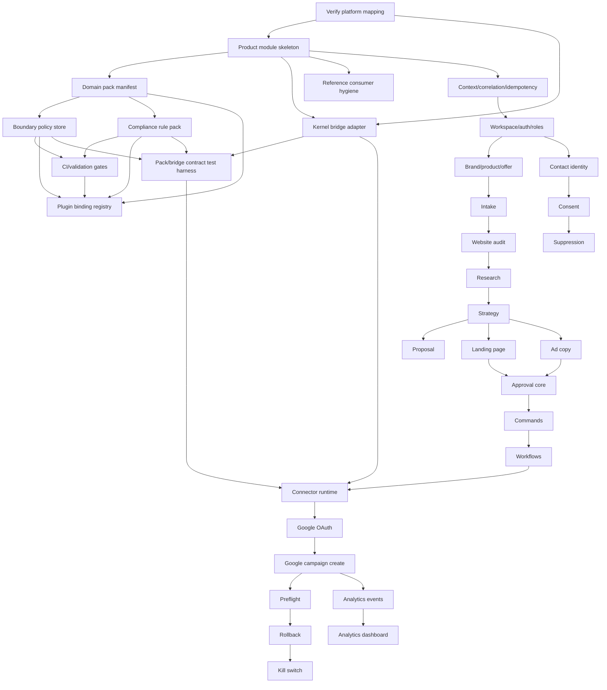

# Digital Marketing Operating System (DMOS) — Detailed Task-by-Task Implementation Plan

**Product:** Digital Marketing Operating System (DMOS)  
**Repository Target:** `products/digital-marketing/`  
**Canonical Rule Prefix:** `DM-`  
**Source of Truth:** `digital-marketing-product-architecture-canonical.md`  
**Status:** Implementation planning document  
**Last Updated:** 2026-05-13  

---

## 0. Purpose

This document converts the canonical DMOS product architecture into an execution-ready implementation plan. It is intentionally task-oriented and concrete. Each task describes:

- **What** must be built or changed.
- **Why** it matters to the product and architecture.
- **How** to implement it safely using the Ghatana kernel, platform plugins, domain packs, bridge pattern, durable workflows, command execution, and consent-first measurement model.
- **Acceptance criteria** for completion.
- **Test cases** required before the task is accepted.

The plan is designed to preserve the core architecture decision:

> DMOS must not be implemented as disconnected marketing agents. It must be a governed, event-driven growth execution system where agents propose and optimize, policies decide what is safe, workflows execute durably, humans approve meaningful risk, and every action is measurable, reversible where possible, and auditable.

---

## 1. Implementation Principles

### 1.1 Mandatory Product Principles

1. **Narrow but complete MVP:** implement one beachhead, one lead-generation campaign type, one CRM-lite loop, one proposal/SOW loop, and one analytics loop before expanding.
2. **Outcome-first UX:** users express growth goals, budget, constraints, and approvals; they should not manually assemble campaigns unless they choose to take over.
3. **AI as operating layer:** agents research, draft, recommend, score, and optimize, but direct state mutation must flow through policy, approval, command, workflow, and audit.
4. **Human involvement tends toward zero:** automate low-risk work, notify and allow override for medium-risk work, and require approval only for risk, budget, legal, commercial, or governance decisions.
5. **No unsafe launch:** no campaign can launch unless preflight checks pass or an explicitly allowed, audited override is approved.
6. **Consent-first measurement:** no tracking, contact, audience export, email send, or enhanced conversion path can bypass consent, purpose, and suppression checks.
7. **Every action is observable:** commands, events, workflow executions, approvals, connector calls, policy decisions, and agent recommendations must be traceable by correlation ID.
8. **Every critical action is reversible where possible:** launch, pause, budget update, publish, unpublish, email suppression, audience export, and connector operations need rollback or compensating actions.
9. **Kernel/plugin purity:** kernel and generic plugins remain product-agnostic; product-specific policies and regulatory logic live in DMOS domain packs and rule packs.
10. **No production mocks/stubs:** incomplete features must be hidden behind feature flags and must not pretend to work in production.

### 1.2 MVP Boundary

**MVP segment:** non-regulated local service and small B2B businesses.  
**MVP campaign:** Google Search lead generation + generated landing page + CRM-lite lead capture + email follow-up draft/send.  
**MVP commercial workflow:** proposal/SOW draft from approved templates, human-approved, explicitly not legal advice.  
**MVP analytics:** basic funnel metrics, last-click/source attribution, tracking health, consent coverage, campaign summary, and next-best-action recommendations.

**Explicit MVP exclusions:** regulated industries, SMS campaigns, Meta/LinkedIn/TikTok ads, external CRM sync, advanced attribution, agency mode, marketplace, custom model training, enterprise SSO/data residency.

---

## 2. Global Definition of Done

Every task marked complete must satisfy the following unless the task explicitly says otherwise:

- Code follows repository/module conventions and uses product-local packages under `products/digital-marketing/`.
- Kernel implementation classes are not directly imported by product code; only public interfaces/ports are used.
- Platform plugins remain product-agnostic; DMOS-specific compliance, consent, approval, risk, and regulatory rules are supplied through product-owned packs.
- All writes are tenant-scoped, workspace-scoped where applicable, idempotent where retried, and audited when sensitive.
- All sensitive reads/writes check boundary policy and authorization.
- All command-producing flows include correlation ID and, for writes, idempotency key.
- All critical state transitions emit typed, versioned events.
- All new APIs include success, validation failure, permission failure, conflict/idempotency, and internal error paths.
- All user-facing flows include empty, loading, success, error, permission-denied, and retry states.
- Critical paths have meaningful tests across success, error, edge, permission, compliance, retry, rollback, and observability paths.
- CI gates pass: lint, format, strict typing, unit/integration tests, pack validation, architecture tests, relevant E2E, security/compliance checks.

---

## 3. Work Breakdown Structure

| Track | Purpose |
|---|---|
| R0 — Readiness and Platform Contract | Verify kernel/plugin/bridge contracts and establish product module skeleton before feature work. |
| F1 — Foundation MVP | Build tenants/workspaces, domain packs, consent, intake, brand profile, strategy draft, content draft, approval foundations. |
| F2 — Execution MVP | Add durable workflows, commands, connector runtime, Google Ads MVP, landing page publishing, CRM-lite, proposal/SOW, preflight, rollback, kill switch. |
| F3 — Analytics and Safe Optimization | Add attribution expansion, recommendation queue, experimentation, budget pacing, learning/playbooks, agent evaluation. |
| F4 — Platformization | Add multi-channel, external CRM, agency mode, white-label reports, industry packs, enterprise controls. |
| F5 — Ecosystem Expansion | Add marketplace, public API, advanced AI, predictive analytics, media mix modeling, and community playbooks. |

---
## 4. R0 — Readiness and Platform Contract Tasks

These tasks must be completed before meaningful feature implementation. Their goal is to prevent building DMOS on assumed kernel or plugin APIs that do not exist or do not match the current repository.


### DMOS-R0-001: Verify Current Repository, Platform Modules, and Symbol Mapping

**Phase:** R0 — Readiness  
**Priority:** P0  
**Primary owner:** Architecture + Platform Engineering  
**Depends on:** None  

**What**

Audit the current Ghatana repository and produce an implementation mapping from architecture concepts to real module names, packages, classes, Gradle projects, and public interfaces.

**Why**

The canonical architecture references platform kernel, plugins, bridge adapters, AEP, Data Cloud, agent orchestration, events, and workflow concepts. Implementation must use verified APIs, not assumed names.

**How**

Create `products/digital-marketing/docs/platform-alignment.md`. Inspect `platform-kernel`, `platform-plugins`, AEP bridge, Data Cloud bridge, build scripts, package names, public ports, plugin SPIs, and test utilities. For every assumed architecture concept, record: verified symbol/path, status, implementation owner, adapter need, and gap resolution.

**Acceptance Criteria**

- Alignment document exists and maps every architecture concept to a verified repo symbol or marks it as a new required adapter/module.
- No product feature task may reference unverified kernel/plugin symbols.
- All gaps have one of: use existing interface, create product adapter, create platform ticket, or defer post-MVP.
- Architecture claims `AgentOrchestrator` (`com.ghatana.kernel.ai.AgentOrchestrator`) and `KernelEventBus` (`com.ghatana.kernel.communication.KernelEventBus`) are confirmed verified real symbols in the repo.
- All other architecture concept references are either mapped to verified symbols or explicitly flagged as new adapter requirements.
- Document is reviewed before feature branches are created.

**Required Test Cases**

- Static check confirms all referenced module paths exist in repo.
- Build script check confirms referenced Gradle project names resolve.
- Architecture test or script fails if an unverified symbol appears in DMOS implementation docs or code comments.
- Manual review checklist validates kernel/plugin purity implications.

---

### DMOS-R0-002: Create Product Module Skeleton

**Phase:** R0 — Readiness  
**Priority:** P0  
**Primary owner:** Product Engineering  
**Depends on:** DMOS-R0-001  

**What**

Create the initial `products/digital-marketing/` module tree, Gradle registration, package structure, documentation folder, and placeholder domain pack structure.

**Why**

The product needs a clean, maintainable module boundary that follows Ghatana conventions and prevents product logic leaking into kernel or plugins.

**How**

Create product modules for domain, application services, API, web app, domain packs, connector runtime, workflow runtime, analytics, and documentation. Start with minimal compilable modules and no production stubs that claim functionality.

**Concrete module layout and conventions:**

- Root Java package: `com.ghatana.digitalmarketing` (no product names in platform namespace).
- Every Java Gradle module uses `id("java-module")` from `build-logic/conventions/`; application entry-points use `id("java-application")`.
- Module dependencies use the version catalog (`gradle/libs.versions.toml`), e.g.:
  ```kotlin
  dependencies {
      implementation(project(":platform-kernel:kernel-core"))
      implementation(project(":platform-kernel:kernel-plugin"))
      implementation(project(":platform-plugins:plugin-compliance"))
      implementation(project(":platform-plugins:plugin-consent"))
      implementation(project(":platform-plugins:plugin-human-approval"))
      implementation(project(":platform-plugins:plugin-risk-management"))
      implementation(project(":platform-plugins:plugin-audit-trail"))
      testImplementation(libs.bundles.testing)
  }
  ```
- Register all new submodules in `products/digital-marketing/settings.gradle.kts` and include in repo root `settings.gradle.kts`.
- TypeScript packages use `@ghatana/design-system`, `@ghatana/forms`, `@ghatana/api`, `@ghatana/state` (canonical packages per Section 32 of copilot-instructions.md).

**Acceptance Criteria**

- `products/digital-marketing/` is present and included in repo build settings.
- All Java modules use `id("java-module")` or `id("java-application")` from `build-logic/conventions/`.
- Root Java package is `com.ghatana.digitalmarketing` in all product modules.
- Each module has a clear README describing purpose, public contracts, and dependencies.
- No module imports kernel implementation classes directly (only public bridge/SPI interfaces).
- No platform plugin module is modified with DMOS-specific logic.
- Build succeeds with empty or minimal modules.

**Required Test Cases**

- Gradle build passes for all new modules.
- Dependency rule test confirms product → public kernel/plugin interfaces only.
- Purity checks confirm no DMOS terms are introduced into kernel/plugin production code.
- Module README lint verifies required sections exist.

---

### DMOS-R0-003: Define Product Domain Pack Manifest

**Phase:** R0 — Readiness  
**Priority:** P0  
**Primary owner:** Product Engineering  
**Depends on:** DMOS-R0-002  

**What**

Create the DMOS domain pack manifest describing product code, rule prefix, boundary policy store, compliance rule packs, plugin bindings, and validation metadata.

**Why**

The product development guide requires every product to supply domain packs and validation tasks. This is the foundation for kernel/plugin purity and product-owned policy behavior.

**How**

Add `domain-pack.json` or equivalent manifest under the DMOS product pack module. Include product ID, canonical prefix `DM-`, boundary policy store class, compliance rule pack classes, plugin bindings, supported rule sets, and version.

**Acceptance Criteria**

- Manifest exists and is well-formed.
- Product code and rule prefix are `DM` / `DM-` consistently.
- Manifest references only product-owned pack classes and public plugin SPIs.
- Validation task is wired to product `check`.
- Manifest includes explicit MVP scope and post-MVP regulatory rule-pack boundaries.
- Manifest includes plugin binding declarations or references `DigitalMarketingPluginBindings`.
- Manifest explicitly states that PHR and Finance are reference consumers only and are not inherited defaults.
- Manifest validation fails for `PHR-` or `FIN-` rule prefixes in DMOS pack declarations.

**Required Test Cases**

- `validateDomainPackManifest` passes with valid manifest.
- Validation fails when product code/rule prefix is missing or inconsistent.
- Validation fails when referenced pack class does not exist.
- Validation fails when manifest references kernel implementation classes.
- Validation fails if manifest contains `PHR-` or `FIN-` rule prefixes in pack declarations.

---

### DMOS-R0-004: Implement DigitalMarketingBoundaryPolicyStore

**Phase:** R0 — Readiness  
**Priority:** P0  
**Primary owner:** Product Engineering + Security  
**Depends on:** DMOS-R0-003  

**What**

Implement a product-owned boundary policy store with explicit allow, approval, consent, audit, deny, and default-deny rules for DMOS MVP resources.

**Why**

DMOS must enforce tenant/workspace boundaries, consent requirements, audit requirements, approval requirements, and default-deny behavior from the beginning.

**How**

Create `DigitalMarketingBoundaryPolicyStore` using kernel public boundary policy interfaces. Define rules for workspace, brand, contact, campaign, content, budget, approval, connector, analytics, consent, and audit resources. Last rule must default-deny `**` source to `digital-marketing.*` target scope. Use the following initial rule table as the concrete starting point:

| Rule ID | Resource | Actions | Effect | Flags |
|---|---|---|---|---|
| `DM-BP-001` | `workspaces/**` | `read` | `ALLOW` | `requiresAudit=false` unless sensitive |
| `DM-BP-002` | `contacts/**` | `read` | `ALLOW` | `requiresConsent=true`, `requiresAudit=true` |
| `DM-BP-003` | `contacts/**` | `write`, `delete`, `export` | `REQUIRE_APPROVAL` or `DENY` per action | `requiresAudit=true` |
| `DM-BP-004` | `audiences/**` | `export`, `sync` | `REQUIRE_APPROVAL` | `requiresConsent=true`, `requiresAudit=true` |
| `DM-BP-005` | `campaigns/**` | `launch`, `pause`, `resume` | `REQUIRE_APPROVAL` | `requiresAudit=true` |
| `DM-BP-006` | `budgets/**` | `write`, `increase` | `REQUIRE_APPROVAL` | `requiresAudit=true` |
| `DM-BP-007` | `content/**` | `publish` | `REQUIRE_APPROVAL` | `requiresAudit=true` |
| `DM-BP-008` | `connectors/**` | `write`, `execute` | `REQUIRE_APPROVAL` | `requiresAudit=true` |
| `DM-BP-999` | `**` / `digital-marketing.*` | `*` | `DENY` | default-deny |

**Concrete kernel interface contract:**

`DigitalMarketingBoundaryPolicyStore` implements `com.ghatana.kernel.policy.BoundaryPolicyStore`:

```java
package com.ghatana.digitalmarketing.policy;

/**
 * @doc.type class
 * @doc.purpose DMOS product-owned boundary policy store providing DM-BP-* rules
 * @doc.layer product
 * @doc.pattern Repository
 */
public class DigitalMarketingBoundaryPolicyStore implements BoundaryPolicyStore {

    @Override
    public List<BoundaryPolicyRule> loadRules(BoundaryPolicyLoadContext context) {
        // returns ordered, immutable list of DM-BP-001 ... DM-BP-999 rules
    }
}
```

Each rule is built using `BoundaryPolicyRule.builder()` with:
- `.ruleId("DM-BP-NNN")` — required, must start with `DM-BP-`
- `.sourceScopePattern(...)` / `.targetScopePattern("digital-marketing.*")` — glob patterns
- `.resourcePattern(...)` — e.g. `"contacts/**"`
- `.actions(Set.of("read"))` — required non-empty
- `.requiresConsent(true)` / `.requiresAudit(true)` — where applicable
- `.effect(BoundaryPolicyRule.Effect.ALLOW)` / `.DENY` / `.REQUIRE_APPROVAL`

**Acceptance Criteria**

- Boundary policy store returns non-empty rules.
- All rule IDs start with `DM-BP-`.
- Sensitive contact/lead reads require `.requiresConsent(true)` and `.requiresAudit(true)`.
- Sensitive audience export/sync requires `.requiresConsent(true)` and `.requiresAudit(true)`.
- Critical writes such as campaign launch, budget update, connector write, approval override, content publish, and data export require approval and audit.
- Last rule is default-deny across `digital-marketing.*`.
- Unknown action on a known resource is denied by default.
- Rules are product-owned and not embedded in kernel/plugin code.

**Required Test Cases**

- Pack contract test: rule list non-empty and well-formed.
- Pack contract test: last rule is default-deny.
- Pack contract test: `.requiresConsent(true)` present on contact and audience read/export rules.
- Pack contract test: `.requiresAudit(true)` present on all sensitive read/write rules.
- Policy test: contact read without consent is denied or requires consent.
- Policy test: campaign launch requires approval + audit.
- Policy test: unknown resource/action is denied by default.
- Policy test: unknown action on a known resource (e.g., `contacts/**` with unsupported action) is denied.
- Architecture test: store superclass is `Object` and uses only public interfaces.

---

### DMOS-R0-005: Implement DigitalMarketingComplianceRulePack

**Phase:** R0 — Readiness  
**Priority:** P0  
**Primary owner:** Product Engineering + Compliance  
**Depends on:** DMOS-R0-003  

**What**

Implement initial DMOS compliance rule packs for marketing integrity, consent lifecycle, audit traceability, campaign preflight, claims/disclosures, and MVP email compliance.

**Why**

Generic compliance plugin must remain product-agnostic; DMOS-specific marketing and regulatory logic belongs in product-owned rule packs.

**How**

Create rule-pack classes with unique rule set constants and `DM-` rule IDs. Start with rules that can be evaluated against JSON-like command/content/event payloads: consent exists, unsubscribe link present, sender identity present, claims have evidence or approval, launch has preflight pass, critical commands have audit correlation. Use the following initial rule set constants:

- `DM_MARKETING_INTEGRITY`
- `DM_CONSENT_LIFECYCLE`
- `DM_AUDIT_TRACEABILITY`
- `DM_CAMPAIGN_PREFLIGHT`
- `DM_CLAIMS_DISCLOSURES`
- `DM_EMAIL_COMPLIANCE`
- `DM_CONNECTOR_EXECUTION_SAFETY`

**Acceptance Criteria**

- Compliance rule pack is non-empty.
- All rule IDs start with `DM-`.
- Rule set IDs match the canonical constants above and are unique across DMOS packs.
- Rules cover consent, unsubscribe/suppression, claims/evidence, disclosures, preflight, and audit traceability.
- Regulatory terms remain in DMOS product packs and never in generic plugin production code.
- Pack registration occurs at product startup, not kernel boot.

**Required Test Cases**

- Compliance rule validation passes for valid packs.
- Validation fails for duplicate rule IDs or non-`DM-` prefixes.
- Scenario test: marketing email without unsubscribe fails.
- Scenario test: claim without evidence/approval fails.
- Scenario test: launch command without preflight pass fails.
- Startup integration test: DMOS product startup registers `DM_MARKETING_INTEGRITY` and all DM rule sets with `CompliancePlugin`.
- Kernel-only boot test: no DMOS rule sets registered when DMOS product module is not started.
- Duplicate startup test: rule packs are registered exactly once.
- Missing plugin test: DMOS reports clearly when `CompliancePlugin` is unavailable and disables dependent features.
- Plugin purity test remains green.

---

### DMOS-R0-006: Wire Product Validation and CI Gates

**Phase:** R0 — Readiness  
**Priority:** P0  
**Primary owner:** Build Engineering + Product Engineering  
**Depends on:** DMOS-R0-003, DMOS-R0-004, DMOS-R0-005  

**What**

Add product Gradle validation tasks and CI wiring for domain pack manifest, policy pack, compliance rule pack, architecture tests, and pack contract tests.

**Why**

The product must fail fast if domain packs drift, rule IDs are invalid, default-deny is missing, or product code violates kernel/plugin purity boundaries.

**How**

Implement `validateDomainPackManifest`, `validatePolicyPack`, and `validateComplianceRulePack`. Wire them to `check`. Add architecture tests for package dependencies and purity constraints. Ensure PR gates include relevant product E2E categories as they appear.

**Acceptance Criteria**

- All validation tasks exist and run under product `check`.
- CI gate checklist is documented in `products/digital-marketing/README.md`.
- Failures are actionable with clear error messages.
- Pack contract tests run automatically.
- Architecture tests prevent product-to-kernel-implementation dependency leaks.
- Reference consumer hygiene scan runs in CI and fails on `PHR-` or `FIN-` identifiers in DMOS pack code.
- Plugin binding startup test is wired to the integration test suite and confirms DM rule set registration.
- Bridge contract integration tests run as part of the integration gate.
- No bridge adapter method call without a valid `BridgeContext` is enforced by architecture/static check.
- Product docs are verified to not instruct copying PHR/Finance packs.

**Required Test Cases**

- Intentional invalid manifest causes `validateDomainPackManifest` to fail.
- Missing default-deny causes `validatePolicyPack` to fail.
- Duplicate compliance rule IDs cause `validateComplianceRulePack` to fail.
- Forbidden dependency from product to kernel impl fails architecture test.
- Reference consumer hygiene scan fails when `PHR-` or `FIN-` appears in DMOS pack source.
- Plugin binding startup test verifies DM compliance rule sets are registered on product start.
- Bridge contract test asserts all bridge adapter method calls carry `BridgeContext` with required fields.
- Docs check confirms PHR/Finance examples are labeled as reference consumers only.
- CI dry run passes with valid configuration.

---

### DMOS-R0-007: Define Canonical IDs, Context, and Correlation Standards

**Phase:** R0 — Readiness  
**Priority:** P0  
**Primary owner:** Product Engineering + Platform Engineering  
**Depends on:** DMOS-R0-002  

**What**

Define shared product conventions for IDs, tenant/workspace scoping, actor identity, correlation ID, causation ID, idempotency key, event schema version, and command schema version.

**Why**

DMOS is event-driven and workflow-heavy. Without consistent context propagation, audit, replay, debugging, and idempotency will fail.

**How**

Create a product-local `dm-core-contracts` or equivalent module with value objects and conventions. Define `TenantId`, `WorkspaceId`, `ActorRef`, `CorrelationId`, `CausationId`, `IdempotencyKey`, `SchemaVersion`, and helpers that wrap public kernel bridge context where appropriate.

**Acceptance Criteria**

- All product APIs and commands require tenant ID and correlation ID.
- All write commands support idempotency key.
- All events include schema version, tenant ID, workspace ID when applicable, actor, correlation ID, causation ID, and source service.
- No flow relies on anonymous or missing context except explicitly allowed read-only diagnostics.
- Context conventions are documented.

**Required Test Cases**

- Unit tests validate ID formatting and non-empty constraints.
- API test rejects missing tenant ID for tenant-scoped operations.
- Command test rejects missing idempotency key for retryable writes.
- Event serialization test includes all required metadata.
- Trace propagation test confirms correlation ID flows API → service → command → event.
- Full-flow propagation test: `API request → security context → command → workflow execution → bridge adapter → audit event` preserves `tenantId`, `principalId`, `correlationId`, and `idempotencyKey` at every boundary.

---

### DMOS-R0-008: Create Configuration, Feature Flag, and Environment Baseline

**Phase:** R0 — Readiness  
**Priority:** P0  
**Primary owner:** Product Engineering + DevOps  
**Depends on:** DMOS-R0-002  

**What**

Create environment configuration, feature flags, secrets references, local dev profiles, test profiles, and disabled-by-default flags for incomplete or post-MVP capabilities.

**Why**

Incomplete features must not appear as working production paths. Config must support local development, CI, test isolation, and production hardening without hardcoded values.

**How**

Define config schema for product modules. Add feature flags for Google Ads connector, landing page publishing, email sending, self-marketing tenant, experiments, agency mode, SMS, external CRM, and regulated industry packs. Wire local/test/prod defaults.

**Acceptance Criteria**

- All sensitive values are referenced through secret IDs or environment variables, never hardcoded.
- Post-MVP features are disabled by default.
- Production cannot start with placeholder secrets for enabled connectors.
- Local and CI profiles can run without external paid APIs using approved test doubles only in test scope.
- Configuration schema is documented.

**Required Test Cases**

- Config validation rejects missing required production values for enabled features.
- Feature flag test confirms disabled features return clear unavailable response.
- Static scan confirms no hardcoded API keys/secrets.
- Test profile starts with safe local defaults.
- Production profile refuses mock/test connector implementations.

---

### DMOS-R0-009: Implement Product Plugin Binding Registry

**Phase:** R0 — Readiness  
**Priority:** P0  
**Primary owner:** Product Engineering + Platform Engineering  
**Depends on:** DMOS-R0-003, DMOS-R0-004, DMOS-R0-005, DMOS-R0-006  

**What**

Create a product-owned plugin binding registry that wires DMOS rule packs, policy providers, approval providers, consent providers, risk providers, and audit mappings to platform plugin SPIs at DMOS product startup.

**Why**

The Product Development Guide requires products to supply SPI implementations for platform plugins. Generic plugins must remain product-agnostic; DMOS-specific behavior must be registered from the product layer, not embedded in plugin or kernel modules.

**How**

Create `DigitalMarketingPluginBindings` or equivalent in the product module. At product startup, register:

- `DigitalMarketingComplianceRulePack` with `CompliancePlugin` (`com.ghatana.plugin.compliance.CompliancePlugin`) via `registerRuleSet(String ruleSetId, List<ComplianceRule> rules)`.
- DMOS consent policy/configuration provider with `ConsentPlugin` (`com.ghatana.plugin.consent.ConsentPlugin`) — use `DurableConsentPlugin` (`com.ghatana.plugin.consent.impl.DurableConsentPlugin`) for production.
- DMOS approval routing provider with `HumanApprovalPlugin` (`com.ghatana.plugin.approval.HumanApprovalPlugin`) — use `DurableHumanApprovalPlugin` for production.
- DMOS risk/budget provider with `RiskManagementPlugin` (`com.ghatana.plugin.risk.RiskManagementPlugin`) where used.
- DMOS audit event classification/mapping with `AuditTrailPlugin` (`com.ghatana.plugin.audit.AuditTrailPlugin`) — use `DurableAuditTrailPlugin` for production.

Registration must occur at product startup, never kernel boot. All regulatory and marketing-specific rule logic stays in product packs.

**Concrete class skeleton:**

```java
package com.ghatana.digitalmarketing.startup;

/**
 * @doc.type class
 * @doc.purpose Registers DMOS-specific rule packs and SPI providers with platform plugins at product startup
 * @doc.layer product
 * @doc.pattern Registry
 */
public final class DigitalMarketingPluginBindings {

    private final CompliancePlugin compliancePlugin;
    private final ConsentPlugin consentPlugin;
    private final HumanApprovalPlugin approvalPlugin;
    private final RiskManagementPlugin riskPlugin;
    private final AuditTrailPlugin auditPlugin;

    public void registerAll() {
        compliancePlugin.registerRuleSet(DM_MARKETING_INTEGRITY, dmMarketingIntegrityRules());
        compliancePlugin.registerRuleSet(DM_CONSENT_LIFECYCLE, dmConsentLifecycleRules());
        // ... all DM rule sets
    }
}
```

**Acceptance Criteria**

- Product startup registers DMOS compliance rule packs with `CompliancePlugin`.
- Product startup binds consent, approval, risk, and audit SPI implementations only when the corresponding plugin is enabled.
- Kernel boot does not register DMOS-specific packs.
- Plugin modules contain no DMOS-specific production logic.
- Registration is idempotent and does not duplicate rule packs on repeated startup.
- Missing optional plugins fail with a clear error or feature-disabled state, not silent partial behavior.

**Required Test Cases**

- Startup integration test: DMOS product startup registers `DM_MARKETING_INTEGRITY` and all DM rule sets.
- Kernel-only boot test: no DMOS rule sets are registered without the DMOS product module.
- Duplicate startup test: rule packs are registered exactly once.
- Disabled plugin test: DMOS reports missing plugin clearly and disables dependent features.
- Purity test: no `DMOS`, `DigitalMarketing`, `DM-`, or marketing-domain rule logic appears in platform plugin main sources.

---

### DMOS-R0-010: Implement DigitalMarketingKernelBridgeAdapter

**Phase:** R0 — Readiness  
**Priority:** P0  
**Primary owner:** Product Engineering + Platform Engineering  
**Depends on:** DMOS-R0-001, DMOS-R0-007  

**What**

Create a product-owned adapter layer for DMOS interactions with kernel/platform bridge capabilities using `AbstractKernelBridge` and public bridge ports.

**Why**

The Product Development Guide requires kernel-connected adapters to use the bridge pattern. DMOS needs bridge-backed access to AEP/Data Cloud/kernel capabilities but must not directly import kernel implementation classes. This adapter is distinct from external ad/CMS/email connectors; those call Google/WordPress/etc., while this adapter connects DMOS to platform capabilities.

**How**

Create `DigitalMarketingKernelAdapter` public contract and `DigitalMarketingKernelAdapterImpl extends AbstractKernelBridge` (`com.ghatana.kernel.bridge.AbstractKernelBridge`). Use:

- `com.ghatana.kernel.bridge.port.BridgeAuthorizationService` — `isAuthorized(BridgeContext, String resource, String action) → Promise<Boolean>`
- `com.ghatana.kernel.bridge.port.BridgeAuditEmitter` — `emit(BridgeAuditEvent)` (fire-and-forget); use `BridgeAuditEvent.allowed(...)` / `.denied(...)` / `.error(...)` factory methods
- `com.ghatana.kernel.bridge.port.BridgeHealthIndicator` — `reportHealthy(bridgeId)`, `reportDegraded(bridgeId, reason)`, `reportUnhealthy(bridgeId, reason)`
- `com.ghatana.kernel.bridge.port.BridgeContext` — constructed once per request via `BridgeContext.builder().tenantId(...).principalId(...).correlationId(...).idempotencyKey(...).build()`
- `requireStarted()` at the start of every adapter method
- `checkAuthorized(context, resource, action)` before sensitive operations
- `executeWithRetry(operationName, context, resource, action, supplier)` for transient operations (max retries: `MAX_RETRIES = 3`, base backoff: `BASE_BACKOFF = 100ms` doubling)
- `redact(String)` for sensitive metadata in logs — removes `password=`, `secret=`, `token=`, `apiKey=`, `api_key=`, `credential=` patterns

**Concrete class skeleton:**

```java
package com.ghatana.digitalmarketing.bridge;

/**
 * @doc.type class
 * @doc.purpose DMOS kernel bridge adapter connecting product workflows to platform capabilities
 * @doc.layer product
 * @doc.pattern Bridge
 */
public class DigitalMarketingKernelAdapterImpl
        extends AbstractKernelBridge
        implements DigitalMarketingKernelAdapter {

    public DigitalMarketingKernelAdapterImpl(
            BridgeAuthorizationService authService,
            BridgeAuditEmitter auditEmitter,
            BridgeHealthIndicator healthIndicator) {
        super("digital-marketing-bridge", authService, auditEmitter, healthIndicator);
    }

    @Override
    public Promise<CampaignExecutionResult> executeCampaignAction(
            BridgeContext context, CampaignActionCommand command) {
        requireStarted();
        return checkAuthorized(context, "campaigns/" + command.campaignId(), "launch")
            .then(allowed -> allowed
                ? executeWithRetry("executeCampaignAction", context,
                      "campaigns/" + command.campaignId(), "launch",
                      () -> internalExecute(context, command))
                : Promise.ofException(new SecurityException("Not authorized")));
    }
}
```

**Acceptance Criteria**

- Adapter uses only public kernel bridge interfaces and ports.
- Every adapter method accepts `BridgeContext`.
- Every adapter method calls `requireStarted()` before operation logic.
- Sensitive operations call `checkAuthorized()` before execution.
- Transient operations use bounded retry via `executeWithRetry()`.
- Logs redact sensitive metadata via `redact()`.
- Adapter emits audit and health signals through bridge ports.

**Required Test Cases**

- Success path: authorized bridge call returns healthy result and emits success audit event.
- Denied path: unauthorized call fails fast and emits denied audit event.
- Transient failure path: retry occurs within configured bound; health degrades appropriately.
- Timeout path: timeout is handled deterministically; health and audit reflect failure.
- Not-started path: adapter method call before `markStarted()` fails safely with clear error.
- Redaction test: secrets, tokens, and PII do not appear in logs.

---

### DMOS-R0-011: Enforce Reference Consumer Hygiene and Domain Neutrality

**Phase:** R0 — Readiness  
**Priority:** P0  
**Primary owner:** Architecture + Build Engineering  
**Depends on:** DMOS-R0-002  

**What**

Add a static hygiene check to ensure DMOS does not copy PHR/Finance reference consumer identifiers, rule prefixes, product-specific resource names, or domain terms into DMOS product packs or generic kernel/plugin code.

**Why**

PHR and Finance are reference consumers of the Product Development Guide's patterns, not platform defaults or templates. DMOS must follow the same patterns with its own `DM-` prefix and marketing-specific resources, not copy from other product examples.

**How**

Add a validation script, ArchUnit check, or grep-based CI gate that scans DMOS product pack source and product docs for:

- `PHR-`, `FIN-` rule ID prefixes
- `PhrBoundaryPolicyStore`, `FinanceBoundaryPolicyStore`
- `PHR_`, `FIN_` rule set constants
- `patient.records`, `trade.records` resource names
- healthcare/finance example rules outside explicitly labeled reference-only documentation sections

Also rename any ambiguous implementation-plan owner labels such as `Finance/Risk` to `Budget/Risk` or `Commercial Risk` where they refer to DMOS budget and commercial risk concerns.

**Acceptance Criteria**

- DMOS packs use only `DM-` rule IDs and `DM_` rule set constants.
- DMOS policy resources are marketing-domain resources, not copied from PHR/Finance examples.
- Product docs clearly state that PHR and Finance are reference consumers only.
- Generic plugins and kernel code contain no DMOS-specific terms.
- `Finance/Risk` owner wording in DMOS tasks has been replaced with `Budget/Risk` or `Commercial Risk`.

**Required Test Cases**

- Static scan fails if `PHR-` or `FIN-` appears in DMOS pack production code.
- Static scan fails if `PhrBoundaryPolicyStore` or `FinanceBoundaryPolicyStore` appears outside reference-only documentation.
- Static scan passes with `DM-BP-*` and `DM_*` constants.
- Docs check confirms DMOS documentation references PHR/Finance only as examples, not as dependencies or templates.

---

### DMOS-R0-012: Create Product Pack and Bridge Contract Test Harness

**Phase:** R0 — Readiness  
**Priority:** P0  
**Primary owner:** Test Engineering + Product Engineering  
**Depends on:** DMOS-R0-004, DMOS-R0-005, DMOS-R0-010  

**What**

Create a reusable test harness for product pack contract tests and bridge integration tests, providing the shared fixtures, assertions, and base classes needed before feature work begins.

**Why**

The Product Development Guide requires `*PackContractTest` for every product and bridge integration tests covering successful, denied, retry, and timeout paths. These must be in place before execution-phase features are accepted, since DMOS relies on policy, compliance, and bridge behavior from the start.

**How**

Create:

- `DigitalMarketingPackContractTest` — shared base or suite
- `DigitalMarketingBoundaryPolicyStoreContractTest` — verifies store rules, default-deny, consent/audit flags
- `DigitalMarketingComplianceRulePackContractTest` — verifies rule IDs, rule set constants, pack non-empty
- `DigitalMarketingKernelBridgeIntegrationTest` — exercises success, denied, retry, and timeout paths against the adapter
- Shared test fixtures for valid and invalid domain pack manifests
- Reusable assertion helpers for default-deny, rule ID prefix, rule set uniqueness, consent/audit flags, and `BridgeContext` propagation

**Acceptance Criteria**

- Pack contract tests run under product `check`.
- Bridge integration tests run in the appropriate integration test suite.
- Negative fixtures prove validation failures are caught by all three contract test classes.
- Tests assert no kernel implementation classes are extended directly by product packs.
- Tests assert all bridge adapter calls carry full `BridgeContext` with `tenantId`, `principalId`, `correlationId`, and `idempotencyKey` where required.

**Required Test Cases**

- Boundary policy store: rule list non-empty and well-formed.
- Boundary policy store: last rule is default-deny.
- Boundary policy store: sensitive contact read sets `.requiresConsent(true)` and `.requiresAudit(true)`.
- Boundary policy store: campaign launch sets approval and audit requirements.
- Compliance rule packs: non-empty and all rule IDs start with `DM-`.
- Compliance rule packs: rule set ID constants match the canonical set.
- Compliance rule packs: no duplicate rule IDs across all DMOS packs.
- Pack superclass assertion: store and pack classes extend `Object` and use only public interfaces.
- Bridge integration: success path with full `BridgeContext` works and emits success audit.
- Bridge integration: denied path emits denied audit event.
- Bridge integration: transient failure retries within bound and updates health indicator.
- Bridge integration: timeout path is deterministic and observable through health/audit.

---

## 5. F1 — Foundation MVP Tasks

Foundation tasks create the minimum product shell, domain contracts, consent, intake, strategy, content, approval, and dashboard needed before real campaign execution.


### DMOS-F1-001: Implement Tenant, Workspace, User, Role, and Persona Model

**Phase:** F1 — Foundation  
**Priority:** P0  
**Primary owner:** Product Engineering + Security  
**Depends on:** DMOS-R0-007  

**What**

Implement core tenant/workspace structures, user membership, roles, personas, and workspace-level authorization checks.

**Why**

Every DMOS object must be isolated by tenant and workspace. Persona-aware UX and approval routing depend on a clean access model.

**How**

Create entities and APIs for organization/account, workspace, workspace member, role assignment, persona profile, and permission scope. Start with MVP personas: business owner, marketing manager, sales user, compliance reviewer, platform operator.

**Acceptance Criteria**

- Tenant and workspace records can be created and queried only by authorized users.
- User roles map to permission scopes used by boundary policy checks.
- Workspace-level isolation is enforced in repository queries and APIs.
- Role changes are audited.
- Seed data supports local dev and E2E tests.

**Required Test Cases**

- Unit tests for permission mapping per persona.
- API E2E: user cannot access another tenant/workspace.
- API E2E: owner can invite user and assign role.
- Security test: unauthorized role assignment rejected.
- Audit test: membership/role changes emit audit events.

---

### DMOS-F1-002: Build Authentication and Security Context Integration

**Phase:** F1 — Foundation  
**Priority:** P0  
**Primary owner:** Product Engineering + Security  
**Depends on:** DMOS-F1-001  

**What**

Integrate product APIs and UI with the platform authentication mechanism and populate request security context for authorization, audit, and bridge calls.

**Why**

Boundary policy, bridge context, audit logs, approvals, and command execution all need an authenticated principal and actor identity.

**How**

Wire authentication middleware/interceptor to derive principal ID, tenant ID, workspace memberships, roles, and correlation ID. For frontend, add authenticated layout and route guards.

**Concrete kernel types to use:**

- `com.ghatana.kernel.security.SecurityContext` — carries the authenticated principal for the current request thread.
- `com.ghatana.kernel.security.TenantSecurityContext` — tenant-scoped security context wrapping the principal and tenant identifier.
- `com.ghatana.kernel.context.KernelContext` — provides access to `KernelTenantContext` (`com.ghatana.kernel.context.KernelTenantContext`) for tenant-scope resolution.
- `com.ghatana.platform.domain.auth.TenantId` — typed tenant identifier (from `platform-kernel:kernel-plugin`).
- `com.ghatana.kernel.core.observability.CorrelationIdContext` — used to propagate correlation IDs from inbound request headers into the bridge context.

Build the product middleware to extract principal + tenant from the inbound request and produce a populated `BridgeContext` for all downstream adapter calls:

```java
BridgeContext ctx = BridgeContext.builder()
    .tenantId(TenantSecurityContext.current().getTenantId())
    .principalId(SecurityContext.current().getPrincipalId())
    .correlationId(CorrelationIdContext.current())
    .build(); // idempotencyKey added by command layer
```

**Acceptance Criteria**

- Every protected API receives authenticated principal context.
- Anonymous access is limited to public self-marketing and intake entry points.
- Authenticated UI routes redirect or show permission-denied state when unauthorized.
- Security context can create BridgeContext for adapter calls.
- Audit logs include actor identity.

**Required Test Cases**

- API test: protected route rejects unauthenticated request.
- API test: public intake route works without login but limits stored data until consent.
- Security test: role-based denial returns correct error.
- UI E2E: unauthorized user sees access denied, not blank page.
- Audit test: actor fields populated for protected action.

---

### DMOS-F1-003: Implement Brand Profile and Product/Offer Catalog

**Phase:** F1 — Foundation  
**Priority:** P0  
**Primary owner:** Product Engineering + UX  
**Depends on:** DMOS-F1-001  

**What**

Create brand profile, brand voice, visual tokens, product/service catalog, offer definitions, approved/forbidden claims, and geographic targeting metadata.

**Why**

Strategy, content generation, claim validation, and campaign planning require structured business, brand, offer, and region data.

**How**

Implement `Brand`, `BrandGuideline`, `DesignTokenSet`, `Product`, `Offer`, `Location/ServiceArea`, `ApprovedClaim`, and `ForbiddenClaim` entities and UI forms. Version brand and claim changes.

**Acceptance Criteria**

- User can create/edit brand profile, voice, tone, colors, services, offers, and target geography.
- Claim library supports approved claims with evidence references and forbidden claims.
- Brand/profile changes are versioned and audited.
- Content generation can read brand profile through service API.
- UI handles missing/partial brand data with guided setup.

**Required Test Cases**

- Unit tests for brand validation rules.
- API E2E: create/update brand profile with audit event.
- API E2E: forbidden claim cannot be marked approved without evidence/approval.
- UI E2E: setup wizard saves brand/product/offer data.
- Repository test: workspace isolation for brand/product data.

---

### DMOS-F1-004: Implement Asset Library with Version Control

**Phase:** F1 — Foundation  
**Priority:** P1  
**Primary owner:** Product Engineering  
**Depends on:** DMOS-F1-003  

**What**

Create a workspace asset library for logos, images, documents, templates, screenshots, and generated assets with immutable versions and metadata.

**Why**

Content generation, approval, landing pages, proposals, and audit need stable asset references and version snapshots.

**How**

Implement asset upload/import, metadata, checksum, storage pointer, versioning, status, owner, usage references, and deletion/retention flags. Separate binary object storage from database metadata.

**Acceptance Criteria**

- Assets can be uploaded and associated with workspace/brand.
- Every update creates a new version rather than mutating approved content.
- Approved asset versions are immutable.
- Asset metadata includes PII/sensitivity classification where applicable.
- Asset usage can be traced to generated content and approvals.

**Required Test Cases**

- Unit tests for asset versioning rules.
- API E2E: upload asset, update metadata, create version.
- Permission test: cross-workspace asset access denied.
- Audit test: asset upload/version events emitted.
- Storage test: deleted metadata does not orphan objects without retention policy.

---

### DMOS-F1-005: Implement Contact and Identity Foundation

**Phase:** F1 — Foundation  
**Priority:** P0  
**Primary owner:** Product Engineering + Privacy  
**Depends on:** DMOS-R0-007, DMOS-F1-001  

**What**

Create privacy-aware Contact, ContactPoint, Identity, Account, Lead linkage, and PII classification foundation.

**Why**

The original architecture referenced contact/consent but lacked a complete contact model. Consent, suppression, CRM-lite, lead capture, and attribution depend on it.

**How**

Implement contact entities with PII separation. Store normalized email/phone where needed, hashed identity for matching, verified flags, opt-out status, workspace/tenant scope, and external identity mapping placeholders.

**Acceptance Criteria**

- Contacts are tenant/workspace scoped.
- PII fields are classified and access-controlled.
- ContactPoint supports email and phone with verification and opt-out state.
- Identity supports external system references and hashed identity matching.
- Sensitive reads require boundary policy checks.

**Required Test Cases**

- Unit tests for PII classification and normalization.
- Security test: unauthorized contact read denied.
- Consent test: contact read requiring consent enforces policy.
- Repository test: contact lookup cannot cross workspace.
- Audit test: sensitive contact read/write audit emitted.

---

### DMOS-F1-006: Implement Consent Foundation and Consent Proof Storage

**Phase:** F1 — Foundation  
**Priority:** P0  
**Primary owner:** Product Engineering + Privacy  
**Depends on:** DMOS-R0-005, DMOS-F1-005  

**What**

Implement consent categories, lawful basis, purpose, source/proof, policy version, grant/revoke lifecycle, and consent snapshots for sensitive actions.

**Why**

Consent-first measurement and marketing contact rules are mandatory. Campaigns, email follow-up, enhanced conversions, tracking, and audience exports must not bypass consent.

**How**

Use `ConsentPlugin` SPI (`com.ghatana.plugin.consent.ConsentPlugin`) through product binding. For production use `DurableConsentPlugin` (`com.ghatana.plugin.consent.impl.DurableConsentPlugin`, JDBC-backed). Store DMOS-specific consent records and proof metadata in product context. Support necessary, analytics, marketing, email, and future SMS categories. Add consent snapshot creation for commands.

**Concrete SPI methods used:**

- `recordConsent(subjectId, purpose, ConsentAction) → Promise<ConsentRecord>` — grant or update consent.
- `verifyConsent(subjectId, purpose) → Promise<Boolean>` — check consent before sensitive operation.
- `revokeConsent(consentId) → Promise<Void>` — revoke, triggers `ConsentRevocationEvent` (`com.ghatana.plugin.consent.event.ConsentRevocationEvent`).
- `getCurrentConsent(subjectId, purpose) → Promise<ConsentStatus>` — retrieve current status including expiry.
- `getConsentHistory(subjectId) → Promise<List<ConsentRecord>>` — audit trail.

**Acceptance Criteria**

- Consent can be granted, revoked, and queried by contact/purpose/channel.
- Consent proof includes source, timestamp, text shown, policy version, region, and method.
- Consent snapshots attach to sensitive commands/events.
- Revoked consent blocks future marketing contact where applicable.
- Consent lifecycle is audited.

**Required Test Cases**

- Unit tests for consent validity by purpose/channel/region.
- API E2E: grant and revoke consent.
- Policy test: email send command blocked without email marketing consent.
- Audit test: consent lifecycle events emitted.
- Snapshot test: command includes immutable consent snapshot reference.

---

### DMOS-F1-007: Implement Suppression Lists and Do-Not-Contact Rules

**Phase:** F1 — Foundation  
**Priority:** P0  
**Primary owner:** Product Engineering + Privacy  
**Depends on:** DMOS-F1-006  

**What**

Implement workspace/global/channel/campaign suppression lists and do-not-contact rules for email, future SMS, ad audience exports, and CRM exports.

**Why**

Consent alone is not enough. Unsubscribe, opt-out, suppression, and do-not-contact enforcement must happen before contact or audience activation.

**How**

Create `SuppressionList`, `SuppressionEntry`, `DoNotContactRule`, and enforcement service. Wire checks into email draft/send, lead contact, and future audience export command preconditions.

**Acceptance Criteria**

- Suppression entries can be created, imported, revoked/expired where policy allows, and queried.
- Suppression checks run before email send and contact export commands.
- Global suppression overrides campaign-specific eligibility.
- Suppression decisions are auditable and explainable.
- UI exposes opt-out/suppression state for authorized users.

**Required Test Cases**

- Unit tests for suppression precedence.
- API E2E: add suppression entry and verify email command blocked.
- Policy test: suppressed contact excluded from campaign audience.
- Audit test: suppression add/remove and enforcement decision logged.
- Edge test: duplicate suppression entry is idempotent.

---

### DMOS-F1-008: Build Public Self-Marketing Landing and Intake Entry Shell

**Phase:** F1 — Foundation  
**Priority:** P0  
**Primary owner:** UX + Product Engineering  
**Depends on:** DMOS-F1-002, DMOS-F1-006  

**What**

Create public DMOS landing page, free audit CTA, consent-aware intake entry, and routing into prospect qualification.

**Why**

The product must dogfood its own growth loop. The public funnel is also the first proof of the DMOS concept.

**How**

Build initial public routes for landing page, pricing/positioning placeholder, free audit CTA, and intake start. Apply consent banner and clear data-use language before collecting marketing contact data.

**Acceptance Criteria**

- Public landing page communicates positioning and MVP promise.
- Free audit CTA starts intake flow.
- Consent banner/categories are visible before non-essential tracking.
- Prospect contact data is not stored as marketing contact without consent.
- Self-marketing tenant/workspace separation is planned and feature-flagged if not fully active yet.

**Required Test Cases**

- UI E2E: visitor can open landing page and start audit.
- Consent E2E: analytics/marketing tracking disabled until consent.
- API test: intake contact data storage enforces consent/purpose.
- Accessibility test: landing/intake shell passes basic a11y checks.
- Security test: public route cannot access authenticated workspace data.

---

### DMOS-F1-009: Implement AI Intake Questionnaire and Business Profile Capture

**Phase:** F1 — Foundation  
**Priority:** P0  
**Primary owner:** Product Engineering + AI  
**Depends on:** DMOS-F1-003, DMOS-F1-006, DMOS-F1-008  

**What**

Create structured AI-assisted intake for business goals, offer, geography, audience, budget, capacity, competitors, constraints, brand notes, and risk tolerance.

**Why**

DMOS needs structured inputs before strategy, audit, proposal, content, and campaign planning can work reliably.

**How**

Implement conversational and form-backed intake. The AI may guide questions, but outputs must be stored in normalized fields. Include incomplete-state persistence and ability to edit answers before plan generation.

**Acceptance Criteria**

- Intake captures business profile, goals, budget, geography, target audience, offer, competitors, and constraints.
- User can review/edit structured intake before submission.
- Missing critical inputs produce clear prompts, not hallucinated defaults.
- Intake completion emits event and audit where applicable.
- AI-generated summaries include confidence and unknowns.

**Required Test Cases**

- Unit tests for intake validation and required-field logic.
- API E2E: save draft, resume, submit intake.
- AI output test: structured extraction handles missing/ambiguous answers safely.
- UI E2E: user completes intake and sees review screen.
- Audit/event test: submitted intake emits typed event.

---

### DMOS-F1-010: Implement Website, Tracking, and Basic SEO Audit

**Phase:** F1 — Foundation  
**Priority:** P0  
**Primary owner:** Product Engineering + AI  
**Depends on:** DMOS-F1-009  

**What**

Generate an initial audit of the prospect/customer website covering technical availability, conversion funnel basics, SEO basics, tracking gaps, landing page quality, and messaging gaps.

**Why**

The free audit is the lead magnet and the first diagnostic input for strategy generation. It must be useful and evidence-backed.

**How**

Implement website scanner with safe fetching, robots/rate-limit respect, page metadata extraction, speed/availability checks where feasible, title/meta/H1/schema basics, form/CTA detection, UTM/tracking detection, and source-linked findings.

**Acceptance Criteria**

- Audit findings include severity, evidence/source URL, rationale, and recommended action.
- Scanner handles unavailable sites, redirects, blocked pages, and timeouts gracefully.
- Audit does not claim unsupported facts.
- Tracking gaps are explicitly identified.
- Audit output can feed strategy and proposal workflows.

**Required Test Cases**

- Unit tests for audit scoring and finding generation.
- Integration test against controlled fixture websites.
- Error test: timeout/unavailable site produces graceful finding.
- AI validation test: generated recommendations cite collected evidence.
- UI E2E: audit report displays findings and next steps.

---

### DMOS-F1-011: Implement Competitor and Keyword Research Workflow

**Phase:** F1 — Foundation  
**Priority:** P0  
**Primary owner:** Product Engineering + AI  
**Depends on:** DMOS-F1-009, DMOS-F1-010  

**What**

Create MVP research workflow for competitor discovery, competitor page analysis, service-area keywords, intent classification, and opportunity summary.

**Why**

Strategy and ad copy need market context. For MVP, keep research focused on Google Search lead generation and local/service intent.

**How**

Support user-provided competitors plus basic discovery through search/data sources available to the product. Store competitors, keywords, intent, confidence, and evidence. Avoid unsupported claims or scraped data that violates source rules.

**Acceptance Criteria**

- Research workflow stores competitors and keywords with source/evidence.
- Keywords include intent, relevance, and suggested campaign use.
- Competitor findings distinguish observed facts from AI interpretation.
- Workflow handles sparse data gracefully.
- Research output feeds strategy generator.

**Required Test Cases**

- Unit tests for keyword intent classification.
- Workflow test: competitor research completes with user-provided competitors.
- Error test: unavailable competitor site does not fail whole workflow.
- Data provenance test: all research findings have source/evidence or are marked inferred.
- UI E2E: research summary visible from strategy workspace.

---

### DMOS-F1-012: Implement Lead Scoring for Prospects

**Phase:** F1 — Foundation  
**Priority:** P1  
**Primary owner:** Product Engineering + AI  
**Depends on:** DMOS-F1-009, DMOS-F1-010  

**What**

Create deterministic and AI-assisted lead scoring for platform prospects using fit, urgency, budget, industry, readiness, tracking gaps, and value potential.

**Why**

The self-marketing funnel needs to prioritize prospects and guide proposal effort without requiring sales manual triage.

**How**

Implement scoring model with explainable components. Store score, reasons, confidence, and recommended next action. Keep model configurable and auditable.

**Acceptance Criteria**

- Lead score includes numeric value, grade, reasons, and confidence.
- Score does not use protected/sensitive attributes.
- Scoring model is versioned.
- Low-confidence scores are flagged for human review.
- Score can trigger audit-to-proposal workflow.

**Required Test Cases**

- Unit tests for scoring rules and threshold behavior.
- Bias/safety test: prohibited fields do not influence score.
- API test: score generated after intake/audit.
- Regression test: scoring model version stored.
- UI test: lead score reasons visible.

---

### DMOS-F1-013: Implement 30-Day Strategy Generator

**Phase:** F1 — Foundation  
**Priority:** P0  
**Primary owner:** Product Engineering + AI  
**Depends on:** DMOS-F1-009, DMOS-F1-010, DMOS-F1-011  

**What**

Generate an MVP 30-day marketing strategy focused on Google Search, landing page conversion, email follow-up, basic tracking, and lead handling.

**Why**

The strategy is the bridge from business goal to executable campaign plan. MVP must avoid broad multi-channel promises.

**How**

Build strategy generation service that consumes intake, audit, competitor/keyword research, brand profile, offer catalog, budget, constraints, and risk tolerance. Output goals, rationale, channel plan, campaign plan, budget recommendation, content plan, measurement plan, and assumptions.

**Acceptance Criteria**

- Strategy is limited to MVP-supported execution paths unless explicitly marked post-MVP.
- Strategy includes goals, assumptions, budget caps, campaign plan, timeline, measurement plan, and approval requirements.
- Every major recommendation includes evidence or rationale.
- Strategy requires human approval before execution commands are created.
- Strategy versions are immutable after approval.

**Required Test Cases**

- Unit tests for strategy validation and MVP scope enforcement.
- AI evaluation tests for hallucination/unsupported channel recommendations.
- API E2E: generate strategy from completed intake/audit/research.
- Approval test: approved strategy snapshot cannot be mutated.
- UI E2E: strategy review/approve flow.

---

### DMOS-F1-014: Implement Budget Recommendation and Guardrail Model

**Phase:** F1 — Foundation  
**Priority:** P0  
**Primary owner:** Product Engineering + Budget/Risk  
**Depends on:** DMOS-F1-013  

**What**

Create budget recommendation, hard spend cap, daily/monthly pacing, risk thresholds, and approval requirements for budget-sensitive actions.

**Why**

Budget changes are high-risk commercial actions. The system must never spend beyond user-approved limits or allow silent runaway campaigns.

**How**

Model `Budget`, `BudgetAllocation`, `SpendCap`, `PacingRule`, and budget approval thresholds. Strategy generator proposes budget; owner approves. Campaign launch and update commands enforce hard caps.

**Acceptance Criteria**

- Budget recommendation includes rationale and cap.
- Budget cannot be activated without approval.
- Daily/monthly caps are enforced by command preconditions.
- Budget changes above threshold require approval.
- Budget exhaustion can trigger kill switch or pause workflow.

**Required Test Cases**

- Unit tests for pacing and cap calculations.
- Policy test: unapproved budget blocks launch.
- Workflow test: budget exhaustion pauses campaign.
- Approval test: >10% budget change routes to owner/manager as configured.
- API test: negative/invalid budgets rejected.

---

### DMOS-F1-015: Implement Proposal Template and Pricing Engine

**Phase:** F1 — Foundation  
**Priority:** P0  
**Primary owner:** Product Engineering + Business Ops  
**Depends on:** DMOS-F1-013, DMOS-F1-014  

**What**

Generate a proposal draft from the approved strategy using versioned templates, pricing options, assumptions, deliverables, timeline, and risk disclaimers.

**Why**

Proposal generation is a major differentiator. It connects strategy to commercial execution, but must be template-based and human-approved.

**How**

Create proposal template model, pricing model options, deliverable mapping, assumptions, terms placeholders, approval routing, PDF/markdown export. Keep legal language controlled by approved template versions.

**Acceptance Criteria**

- Proposal draft is generated from strategy and template version.
- Pricing recommendation includes assumptions and model type.
- Proposal includes deliverables, timeline, approvals, exclusions, assumptions, measurement plan, and disclaimers.
- Proposal draft requires human review before sending.
- Template version and generation inputs are auditable.

**Required Test Cases**

- Unit tests for strategy-to-deliverable mapping.
- Template test: generation uses approved template version.
- API E2E: generate proposal from approved strategy.
- Approval test: proposal cannot be sent/exported as final without approval.
- Snapshot test: proposal content snapshot stored.

---

### DMOS-F1-016: Implement SOW Draft Generator with Clause Library

**Phase:** F1 — Foundation  
**Priority:** P1  
**Primary owner:** Product Engineering + Legal Ops  
**Depends on:** DMOS-F1-015  

**What**

Generate SOW/MSA-style draft sections from approved clause templates, scope, assumptions, deliverables, approval gates, and exclusions.

**Why**

Contracts/SOWs must be generated from approved templates and clearly treated as drafts, not legal advice.

**How**

Create clause library, clause versioning, SOW template, risk flagging, and export. Add mandatory disclaimer and approval. Store clauses with owner/reviewer status and effective dates.

**Acceptance Criteria**

- SOW draft uses approved clause/template versions only.
- Output clearly states it is a draft and not legal advice.
- Risk flags appear for unsupported guarantees, missing approvals, privacy issues, or ambiguous deliverables.
- Human approval is required before final export/send.
- Clause/template versions are immutable after approval.

**Required Test Cases**

- Unit tests for clause selection logic.
- Risk test: unsupported guarantee is flagged.
- Approval test: final export blocked without approval.
- Snapshot test: clause versions stored with SOW.
- UI E2E: reviewer sees risk flags and approval actions.

---

### DMOS-F1-017: Implement Content Version Model

**Phase:** F1 — Foundation  
**Priority:** P0  
**Primary owner:** Product Engineering  
**Depends on:** DMOS-F1-003, DMOS-F1-004  

**What**

Create immutable content versioning for landing pages, ads, emails, claims, disclosures, and generated sections.

**Why**

Approvals, audits, rollbacks, claims, and campaign launches must reference exact content versions, not mutable drafts.

**How**

Implement `ContentItem`, `ContentVersion`, `ContentBlock`, `ClaimReference`, `DisclosureReference`, status, generator metadata, prompt/model version, source strategy, and approval snapshot linkage.

**Acceptance Criteria**

- Every generated asset is stored as a draft content version.
- Approved versions are immutable.
- New edits create new versions.
- Content version records include generator metadata and source context.
- Campaign launch references approved content versions only.

**Required Test Cases**

- Unit tests for immutability and version transitions.
- API E2E: create draft, edit creates version, approve version.
- Policy test: launch with unapproved content version blocked.
- Audit test: content version lifecycle events emitted.
- Regression test: old approved version remains readable after new draft.

---

### DMOS-F1-018: Implement Landing Page Draft Generator

**Phase:** F1 — Foundation  
**Priority:** P0  
**Primary owner:** Product Engineering + AI + UX  
**Depends on:** DMOS-F1-013, DMOS-F1-017  

**What**

Generate conversion-focused landing page drafts from approved strategy, brand profile, offer, proof points, service area, and compliance constraints.

**Why**

Landing page generation is part of the MVP executable campaign loop. It must be structured, reviewable, and safe before publishing.

**How**

Create landing page schema: hero, problem, offer, proof, CTA, form, FAQ, disclaimer, tracking hooks. Generate content sections and store as content versions. Include missing-proof warnings instead of hallucinated testimonials.

**Acceptance Criteria**

- Landing page draft includes required conversion sections.
- Claims requiring evidence are marked and routed to approval.
- No fake testimonials, guarantees, or proof are generated.
- Landing page draft references brand/style tokens.
- Draft can be previewed and approved.

**Required Test Cases**

- Unit tests for landing page schema validation.
- AI safety test: generator refuses to invent testimonials/proof.
- Compliance test: unsupported claim triggers approval/evidence requirement.
- UI E2E: preview landing page draft and approve/reject.
- Snapshot test: approved landing page version immutable.

---

### DMOS-F1-019: Implement Google Search Ad Copy Draft Generator

**Phase:** F1 — Foundation  
**Priority:** P0  
**Primary owner:** Product Engineering + AI  
**Depends on:** DMOS-F1-013, DMOS-F1-017  

**What**

Generate Google Search ad copy variants, headlines, descriptions, keyword themes, negative keyword suggestions, and compliance notes.

**Why**

The MVP campaign type is Google Search lead generation. Ad copy must fit platform constraints, brand guidelines, and claim rules.

**How**

Create generator for responsive search ad assets and keyword/ad group suggestions. Validate character limits, prohibited claims, landing page alignment, and call-to-action consistency.

**Acceptance Criteria**

- Generated ad copy respects Google Search text constraints.
- Variants are stored as content versions.
- Ad copy aligns with approved landing page/offer.
- Claims are validated against approved/evidence-backed claims.
- Ad variants require approval before connector command creation.

**Required Test Cases**

- Unit tests for character limits and field validation.
- Compliance test: forbidden claim blocked.
- AI evaluation test: ad copy aligns with offer and location.
- UI E2E: review ad variants and approve selected variants.
- Policy test: connector command rejects unapproved ad version.

---

### DMOS-F1-020: Implement Email Follow-Up Draft Generator

**Phase:** F1 — Foundation  
**Priority:** P0  
**Primary owner:** Product Engineering + Compliance  
**Depends on:** DMOS-F1-006, DMOS-F1-007, DMOS-F1-017  

**What**

Generate an MVP email follow-up sequence for captured leads, with consent/suppression awareness, unsubscribe requirements, and brand tone.

**Why**

Follow-up improves lead conversion, but email compliance and suppression enforcement are mandatory.

**How**

Create sequence model, email templates, subject/body generator, sender identity requirements, unsubscribe placeholder validation, and content version storage. Sending can initially be disabled or limited until execution phase.

**Acceptance Criteria**

- Email drafts include sender identity and unsubscribe placeholder/links as required.
- Sequence is tied to lead stage and campaign.
- Suppressed or unsubscribed contacts are excluded from send eligibility.
- Drafts are versioned and approval-gated.
- Email content includes no unsupported claims.

**Required Test Cases**

- Unit tests for required email fields and unsubscribe validation.
- Compliance test: email without unsubscribe fails rule pack.
- Suppression test: suppressed contact excluded.
- UI E2E: review and approve email sequence.
- Policy test: send command blocked without consent/suppression clearance.

---

### DMOS-F1-021: Implement Brand and Claim Validation Service

**Phase:** F1 — Foundation  
**Priority:** P0  
**Primary owner:** Product Engineering + Compliance  
**Depends on:** DMOS-F1-003, DMOS-F1-017, DMOS-R0-005  

**What**

Build validation service for brand voice, required/forbidden terms, approved claims, evidence references, disclosures, and content risk level.

**Why**

Generated assets cannot be trusted unless they are checked against brand and compliance rules before approval or launch.

**How**

Implement deterministic validators plus rule-pack calls. Generate validation results with severity, affected content block, reason, required action, and approver role.

**Acceptance Criteria**

- Content validation returns pass/warn/fail with reasons.
- Forbidden claims fail validation.
- Claims without evidence require approval or evidence attachment.
- Disclosure requirements are surfaced.
- Validation result is attached to approval request.

**Required Test Cases**

- Unit tests for forbidden/approved claim logic.
- Compliance rule test: claim without evidence fails or requires approval.
- API E2E: validate content version and persist result.
- UI test: validation warnings shown in approval detail.
- Audit test: validation result linked to approval snapshot.

---

### DMOS-F1-022: Implement Approval Workflow Core

**Phase:** F1 — Foundation  
**Priority:** P0  
**Primary owner:** Product Engineering + UX  
**Depends on:** DMOS-R0-004, DMOS-R0-005, DMOS-F1-001  

**What**

Implement approval requests, approval decisions, approval routing, risk classification, comments, escalation, and approval snapshots.

**Why**

Human involvement should be minimal but explicit. High-risk or policy-required actions must pause until approved, and the approval must capture exactly what was approved.

**How**

Use `HumanApprovalPlugin` SPI (`com.ghatana.plugin.approval.HumanApprovalPlugin`) through product binding — use `DurableHumanApprovalPlugin` (`com.ghatana.plugin.approval.impl.DurableHumanApprovalPlugin`, JDBC-backed) for production. Create product-level approval target types: strategy, proposal, SOW, content version, budget, campaign launch, connector write, override. Store snapshots of target, policy, consent, validation, and approver context.

**Concrete SPI methods used:**

- `requestApproval(ApprovalRequest) → Promise<ApprovalRecord>` — creates PENDING approval; idempotent on same `requestId`. `ApprovalRequest` from `com.ghatana.plugin.approval.ApprovalRequest`.
- `getApprovalStatus(requestId) → Promise<Optional<ApprovalRecord>>` — poll current state (`ApprovalRecord` from `com.ghatana.plugin.approval.ApprovalRecord`).
- `completeApproval(requestId, ApprovalDecision, reviewerId, notes) → Promise<ApprovalRecord>` — transitions PENDING → APPROVED or REJECTED. `ApprovalDecision` from `com.ghatana.plugin.approval.ApprovalDecision`.
- `listPendingForSubject(subjectId) → Promise<List<ApprovalRecord>>` — queue view.
- `cancelApproval(requestId, reason) → Promise<Void>` — cancel without decision.
- `ApprovalStatus` (`com.ghatana.plugin.approval.ApprovalStatus`) — PENDING, APPROVED, REJECTED, CANCELLED.

**Acceptance Criteria**

- Approval request can be created for supported target types.
- Approval routing uses role/persona and risk level.
- Approval decision captures approve/reject/comment/actor/timestamp.
- Approval snapshot is immutable and linkable from commands.
- Overdue approvals can escalate.

**Required Test Cases**

- Unit tests for routing by target/risk/persona.
- API E2E: create approval, approve, reject, escalate.
- Permission test: unauthorized user cannot approve.
- Snapshot test: approval target snapshot immutable after approval.
- Audit test: approval lifecycle emits audit events.

---

### DMOS-F1-023: Build Approval Queue and Detail UX

**Phase:** F1 — Foundation  
**Priority:** P0  
**Primary owner:** UX + Product Engineering  
**Depends on:** DMOS-F1-022, DMOS-F1-021  

**What**

Create approval dashboard with filters, priority/risk labels, evidence, content diff, policy result, comments, approve/reject actions, and escalation status.

**Why**

The user should only see decisions that matter, with enough context to decide quickly without cognitive overload.

**How**

Build UI route `/approvals`, approval detail page, content preview/diff, policy warnings, evidence sources, approval history, and guidance. Include empty/error/loading/permission states.

**Acceptance Criteria**

- Approval queue shows pending items by risk, type, urgency, due date, and workspace.
- Approval detail shows target snapshot, validation result, policy/consent status, and rollback implications.
- Approve/reject actions require comments where configured.
- Unauthorized users cannot see or act on restricted approvals.
- UX remains concise with progressive disclosure.

**Required Test Cases**

- UI E2E: reviewer filters queue and approves content.
- UI E2E: rejection with required comment works.
- Permission UI test: unauthorized reviewer cannot act.
- Accessibility test for approval workflow.
- API integration test: UI action updates backend and audit trail.

---

### DMOS-F1-024: Build Primary Dashboard Shell

**Phase:** F1 — Foundation  
**Priority:** P0  
**Primary owner:** UX + Frontend Engineering  
**Depends on:** DMOS-F1-001, DMOS-F1-022  

**What**

Create the dashboard-first UX shell showing growth health, current goal, active workflows/campaigns, AI actions, approvals needed, results, risks, and next best actions.

**Why**

DMOS must reduce cognitive load. The dashboard is the main operating surface, not a pile of tools.

**How**

Build React dashboard with summary cards, approval widget, workflow status widget, growth goal widget, risk/compliance widget, and placeholder-backed feature flags for not-yet-available metrics.

**Acceptance Criteria**

- Dashboard loads for authenticated workspace users.
- Dashboard shows current goal, approval needs, recent AI actions, risk/compliance status, and setup progress.
- Unavailable post-MVP features are hidden or clearly disabled, not mocked as real.
- Dashboard uses consistent design system components.
- All widgets have loading/empty/error states.

**Required Test Cases**

- UI E2E: dashboard loads and displays setup/progress state.
- UI test: empty workspace state guides next action.
- Permission test: data reflects current workspace only.
- Accessibility test for dashboard shell.
- Visual regression test for primary dashboard layout.

---

### DMOS-F1-025: Implement Transparency and AI Action Log

**Phase:** F1 — Foundation  
**Priority:** P1  
**Primary owner:** Product Engineering + UX  
**Depends on:** DMOS-F1-024, DMOS-R0-007  

**What**

Show what the AI/system did, why it did it, confidence, evidence, policy checks, approval state, and resulting commands/events.

**Why**

Users need trust without being forced to inspect every low-level action. Operators need traceability for debugging and governance.

**How**

Implement AI action log/entity model and UI component. Link recommendations, generated content, validation results, approvals, commands, and events by correlation ID.

**Acceptance Criteria**

- AI action log lists recommendations, generated drafts, validation results, and executed/blocked actions.
- Each action includes actor/agent, timestamp, confidence where applicable, evidence links, and status.
- Users can drill into details from dashboard and approval views.
- Sensitive details respect permissions and redaction.
- Action log links to audit/correlation trail.

**Required Test Cases**

- Unit tests for action log record creation.
- API E2E: generated strategy/content produces visible action log entries.
- Permission test: restricted action details redacted.
- UI E2E: user drills from dashboard action to detail.
- Trace test: action log joins by correlation ID.

---

## 6. F2 — Execution MVP Tasks

Execution tasks complete the MVP loop: durable workflows, commands, Google Ads, publishing, CRM-lite, reports, preflight, rollback, and kill switch.


### DMOS-F2-001: Implement Typed Event Schema and Event Registry

**Phase:** F2 — Execution MVP  
**Priority:** P0  
**Primary owner:** Product Engineering + Data  
**Depends on:** DMOS-R0-007  

**What**

Define typed, versioned DMOS events and an event registry for campaign, content, approval, consent, lead, proposal, workflow, command, connector, analytics, and audit-adjacent events.

**Why**

Event traceability is the backbone of audit, analytics, learning, replay, and workflow coordination.

**How**

Create event contracts with required metadata: eventId, eventType, schemaVersion, tenantId, workspaceId, actor, actorType, correlationId, causationId, idempotencyKey, occurredAt, sourceService, externalRefs, policySnapshotId, consentSnapshotId, piiClassification, payloadSchema, payload.

**Acceptance Criteria**

- Event registry includes all MVP event types.
- Events are typed/versioned; raw `Map<String,Object>` is not used as the primary contract.
- Every critical state transition emits an event.
- Events carry correlation and causation metadata.
- Event schema compatibility rules are documented.

**Required Test Cases**

- Serialization/deserialization tests for each event type.
- Schema compatibility test for versioned payloads.
- Metadata completeness test rejects missing required fields.
- PII classification test for contact-related events.
- Replay fixture test loads sample events.

---

### DMOS-F2-002: Implement Outbox, Inbox, and Dead Letter Queue

**Phase:** F2 — Execution MVP  
**Priority:** P0  
**Primary owner:** Product Engineering + Platform  
**Depends on:** DMOS-F2-001  

**What**

Implement reliable event publishing/consumption patterns using outbox for writes, inbox for idempotent consumption, and DLQ for failed messages.

**Why**

Marketing workflows interact with external systems and must be retry-safe. Lost or duplicate events can cause overspend, duplicate emails, or inconsistent analytics.

**How**

Add outbox table/store, dispatcher, retry policies, inbox dedupe by event/idempotency key, DLQ records with error, retry count, payload reference, and operator visibility.

**Acceptance Criteria**

- Transactional writes persist domain state and outbox event atomically where applicable.
- Consumers are idempotent through inbox records.
- Failed events move to DLQ after retry policy is exhausted.
- DLQ exposes enough context for operator repair/replay.
- Metrics emitted for outbox lag, retry count, DLQ depth.

**Required Test Cases**

- Integration test: domain write creates outbox event in same transaction.
- Integration test: duplicate event consumed once.
- Failure test: repeated consumer failure sends event to DLQ.
- Replay test: DLQ event can be retried after fix.
- Observability test: metrics emitted for lag/depth/retries.

---

### DMOS-F2-003: Implement Command Model and Command Store

**Phase:** F2 — Execution MVP  
**Priority:** P0  
**Primary owner:** Product Engineering  
**Depends on:** DMOS-F2-001, DMOS-F1-022  

**What**

Create typed command contracts and persistent command store for launch campaign, publish landing page, update budget, send email, create proposal, generate SOW, pause campaign, and rollback actions.

**Why**

Agents must not mutate external systems directly. Commands are the governed, auditable execution unit.

**How**

Define command metadata, payload schema, target, approval snapshot, policy snapshot, consent snapshot, idempotency key, status, result, rollback info, and error category. Implement create/read/update transitions with state machine rules.

**Acceptance Criteria**

- Commands are typed and versioned.
- Write commands require idempotency key.
- Sensitive commands require policy and approval checks before execution.
- Command state transitions are validated.
- Command results include external IDs, warnings, error category, and rollback info.

**Required Test Cases**

- Unit tests for command state machine.
- API test: duplicate idempotency key returns original command/result.
- Policy test: launch command cannot be created without approval snapshot.
- Serialization test for command payload versions.
- Audit/event test: command lifecycle emits events.

---

### DMOS-F2-004: Implement Durable Workflow Definition and Execution Engine

**Phase:** F2 — Execution MVP  
**Priority:** P0  
**Primary owner:** Product Engineering + Platform  
**Depends on:** DMOS-F2-002, DMOS-F2-003  

**What**

Implement durable workflows with persisted state for intake-to-plan, plan-to-approval, proposal generation, campaign launch, lead follow-up, and reporting.

**Why**

Campaign execution is long-running and failure-prone. Workflows must pause, resume, retry, rollback, and show status.

**How**

Create `WorkflowDefinition`, `WorkflowExecution`, `WorkflowStep`, `StepExecution`, retry policy, pause state, compensation hooks, and replay support. Use `CrossScopeWorkflowEngine` (`com.ghatana.kernel.workflow.CrossScopeWorkflowEngine`) from `platform-kernel:kernel-core` as the kernel workflow engine — there is no `WorkflowPlugin` in `platform-plugins`; workflow orchestration lives in the kernel. Product-owned workflow definitions are registered at startup via `CrossScopeWorkflowEngine.registerWorkflow(ScopeWorkflowDefinition)` and executed via `executeWorkflow(workflowId, ScopeWorkflowContext) → Promise<ScopeWorkflowResult>`. The product must not subclass `CrossScopeWorkflowEngine`; it registers definitions and passes contexts through the product's kernel adapter.

**Acceptance Criteria**

- Workflow definitions are versioned.
- Workflow executions persist current state, history, inputs, outputs, and errors.
- Workflows can pause for approval and resume after decision.
- Retries use bounded exponential backoff.
- Workflow status is visible in API/UI.

**Required Test Cases**

- Workflow replay tests for happy path and resumed approval path.
- Failure test: transient step retries and succeeds.
- Failure test: exhausted retries marks failed and creates DLQ/operator action.
- Pause/resume test for approval gate.
- Concurrency test: duplicate resume does not double-execute step.

---

### DMOS-F2-005: Implement Agent Recommendation-to-Command Gateway

**Phase:** F2 — Execution MVP  
**Priority:** P0  
**Primary owner:** Product Engineering + AI Platform  
**Depends on:** DMOS-F1-013, DMOS-F2-003, DMOS-F2-004  

**What**

Build the gateway that converts agent recommendations into policy-checked approval requests and executable commands.

**Why**

This enforces the key architecture rule: agents recommend; policies and workflows execute.

**How**

Define `AgentRecommendation` with confidence, evidence, required permissions, risk level, proposed command, and expected impact. Gateway runs boundary policy, compliance rules, risk classifier, approval rules, and command creation only when allowed.

**Concrete kernel AI types:**

- `com.ghatana.kernel.ai.AgentOrchestrator` — verified real symbol; the kernel-level AI orchestration interface for routing agent requests. The DMOS gateway calls it via `DigitalMarketingKernelAdapterImpl` (bridge-mediated); never calls `AgentOrchestrator` directly from product code.
- `com.ghatana.kernel.ai.AutonomyManager` — governs the autonomy level (human-supervised, semi-autonomous, etc.) of agent actions. The gateway must consult it to determine whether an agent recommendation is allowed to execute or must be gated.
- `com.ghatana.kernel.ai.AIEvaluationFramework` — used to evaluate agent outputs for quality, safety, and compliance prior to command production.
- `com.ghatana.kernel.communication.KernelEventBus` — verified real symbol; gateway publishes `recommendation-received`, `command-created`, and `recommendation-blocked` events to the event bus (`EventType.AUDIT_EVENT`, `EventType.SECURITY_EVENT`).

**Acceptance Criteria**

- Agents cannot directly call connector write APIs.
- Recommendations include evidence, confidence, risk level, and proposed command.
- Gateway blocks commands that fail policy/compliance.
- Gateway creates approval request when risk requires human decision.
- Approved recommendations produce commands with approval snapshots.

**Required Test Cases**

- Unit tests for risk classification and routing.
- Security test: direct connector call from agent package is forbidden by architecture rule.
- Workflow test: high-risk recommendation creates approval, not command execution.
- Policy test: non-authorized recommendation blocked.
- Audit test: recommendation-to-command trace preserved.

---

### DMOS-F2-006: Implement Connector Runtime Base

**Phase:** F2 — Execution MVP  
**Priority:** P0  
**Primary owner:** Product Engineering + Platform  
**Depends on:** DMOS-R0-008, DMOS-F2-003  

**What**

Create product connector runtime base with OAuth/token hooks, health, rate limiting, retry, idempotency, external object mapping, error categories, redaction, and audit hooks.

**Why**

External systems are unreliable, rate-limited, and security-sensitive. Connectors must be production-grade before Google Ads or publishing integrations are added.

**How**

Implement base connector interface, connector account model, external connection, external object mapping, connector health, error taxonomy, adaptive throttling interface, audit wrappers, and secret references. This is a **product-owned external connector runtime**, not a platform plugin. Connector operations must use context propagated from product workflows and must call platform bridge adapters only through `DigitalMarketingKernelBridgeAdapter` or verified public bridge ports. Product connector classes must not directly import kernel implementation classes.

**Acceptance Criteria**

- Connector operations require tenant/workspace/principal/correlation context.
- Connector secrets are referenced by secret ID, not stored in plaintext.
- Connector writes support idempotency where platform allows.
- Health reports include auth, rate limit, last sync, error rate, queue depth.
- Sensitive metadata is redacted in logs at both connector and bridge adapter levels.
- No connector write can execute without `tenantId`, `principalId`, `correlationId`, and `idempotencyKey` for write commands.
- Connector classes do not directly import kernel implementation classes.

**Required Test Cases**

- Unit tests for connector error categorization.
- Integration test: authorized connector call uses `BridgeContext` through `DigitalMarketingKernelBridgeAdapter`.
- Security test: secret and token values are redacted in both connector and bridge adapter logs.
- Retry test: transient failure uses bounded retry.
- Health test: repeated failures transition connector to degraded/unhealthy.
- Context test: write command without all required context fields (`tenantId`, `principalId`, `correlationId`, `idempotencyKey`) is rejected.

---

### DMOS-F2-007: Implement Google Ads OAuth and Account Connection

**Phase:** F2 — Execution MVP  
**Priority:** P0  
**Primary owner:** Product Engineering + Security  
**Depends on:** DMOS-F2-006  

**What**

Allow authorized workspace users to connect a Google Ads account, validate access, store secret references, and map external customer/account IDs.

**Why**

Google Ads is the MVP execution channel. Secure OAuth and account validation must precede campaign creation.

**How**

Implement OAuth initiation/callback, scope validation, token storage via secrets service, account selection, connection health check, and `ExternalConnection`/`ConnectorAccount` records.

**Acceptance Criteria**

- User can connect Google Ads account through OAuth.
- Connection stores only secret references and external account metadata.
- Required scopes are validated.
- Connection health can be checked and displayed.
- Disconnect/revoke removes or invalidates tokens and blocks future commands.

**Required Test Cases**

- API integration test with sandbox/mock OAuth in test scope.
- Security test: token value never returned to UI/API logs.
- Permission test: only authorized role can connect/disconnect account.
- Health test: expired token reports degraded/unhealthy.
- UI E2E: connect account happy path and error path.

---

### DMOS-F2-008: Implement Google Search Campaign Creation Connector

**Phase:** F2 — Execution MVP  
**Priority:** P0  
**Primary owner:** Product Engineering + Ads Integration  
**Depends on:** DMOS-F2-007, DMOS-F2-003, DMOS-F1-019  

**What**

Implement Google Search campaign, ad group, keyword, ad, budget, and conversion setup commands for approved MVP campaign plans.

**Why**

This completes the first real execution path from approved strategy/content to live paid campaign.

**How**

Map approved strategy/campaign plan/content versions to Google Ads external objects. Use command execution with idempotency, external object mapping, rate limit handling, dry-run/preview where possible, and rollback pause support.

**Acceptance Criteria**

- Approved campaign plan can create Google Search campaign in connected account.
- Only approved content versions are used.
- Daily/monthly budget caps are enforced.
- External object mappings are persisted for campaign/ad group/ad/keyword/budget.
- Connector supports preview/dry-run before live write where feasible.
- Pause campaign rollback command is available.

**Required Test Cases**

- Connector contract test for create campaign payload mapping.
- Policy test: unapproved strategy/content/budget blocks command.
- Idempotency test: duplicate launch command does not duplicate external campaign.
- Error test: partial failure records external IDs and rollback requirements.
- Workflow E2E: approved campaign launch executes connector command.

---

### DMOS-F2-009: Implement Google Ads Performance Sync

**Phase:** F2 — Execution MVP  
**Priority:** P0  
**Primary owner:** Product Engineering + Data  
**Depends on:** DMOS-F2-008, DMOS-F2-002  

**What**

Sync Google Ads performance data for campaigns, ad groups, ads, keywords, spend, impressions, clicks, conversions where available, and connector freshness.

**Why**

Analytics, pacing, recommendations, and reports require reliable external performance data.

**How**

Create scheduled/pull sync workflow with external object mapping, incremental sync cursor, rate limit control, normalization to analytics events/facts, and freshness metrics.

**Acceptance Criteria**

- Performance sync can run on demand and schedule.
- Synced metrics are associated with local campaign and external object mappings.
- Sync is idempotent and handles late-arriving data.
- Freshness and error status are visible.
- Sync emits analytics-ready events/facts.

**Required Test Cases**

- Connector contract test for metrics mapping.
- Integration test: repeated sync does not duplicate metrics.
- Error test: rate-limit response defers/retries safely.
- Data test: metrics linked to correct workspace/campaign.
- Observability test: sync freshness metric emitted.

---

### DMOS-F2-010: Implement Landing Page Publishing Runtime

**Phase:** F2 — Execution MVP  
**Priority:** P0  
**Primary owner:** Product Engineering + Frontend  
**Depends on:** DMOS-F1-018, DMOS-F2-006  

**What**

Publish approved landing page versions to the MVP publishing target and support unpublish/rollback.

**Why**

The MVP campaign requires a destination page that can be published, tracked, and rolled back.

**How**

Start with one publishing target: internal hosted pages or one CMS if already supported. Use approved landing page schema to render. Add published URL, status, version, tracking hooks, and rollback/unpublish command.

**Acceptance Criteria**

- Only approved landing page versions can be published.
- Published page has stable URL and references exact content version.
- Page includes consent-aware tracking hooks and lead form.
- Unpublish/rollback command exists.
- Publishing status is visible in workflow/dashboard.

**Required Test Cases**

- Unit tests for render schema and required sections.
- Workflow E2E: approved page publishes and returns URL.
- Policy test: unapproved page publish blocked.
- Rollback test: unpublish or revert published page works.
- UI/browser test: published page loads and form visible.

---

### DMOS-F2-011: Implement Lead Capture Forms and CRM-Lite

**Phase:** F2 — Execution MVP  
**Priority:** P0  
**Primary owner:** Product Engineering + UX  
**Depends on:** DMOS-F1-005, DMOS-F1-006, DMOS-F2-010  

**What**

Create landing page lead forms, contact/lead creation, lead status workflow, source attribution, activity timeline, and CRM-lite UI.

**Why**

The campaign loop is not complete until leads are captured, tracked, and connected to campaign/source.

**How**

Implement form submission API with validation, consent/purpose capture, spam controls, contact dedupe, lead creation, lead status transitions, source fields, UTM/click ID capture, and CRM-lite dashboard.

**Acceptance Criteria**

- Lead form creates or links Contact and Lead records safely.
- Consent/purpose is captured or respected during submission.
- Lead includes campaign, landing page, source, UTM/click ID where available.
- Lead status supports new, contacted, qualified, converted, lost.
- CRM-lite UI shows leads and activity timeline.

**Required Test Cases**

- API E2E: form submission creates contact + lead.
- Dedup test: same email/contact does not create duplicate contact incorrectly.
- Consent test: marketing follow-up eligibility reflects consent/suppression.
- UI E2E: user updates lead status.
- Security test: public form cannot write outside allowed workspace/campaign.

---

### DMOS-F2-012: Implement Email Follow-Up Execution or Safe Export

**Phase:** F2 — Execution MVP  
**Priority:** P1  
**Primary owner:** Product Engineering + Compliance  
**Depends on:** DMOS-F1-020, DMOS-F2-011, DMOS-F2-003  

**What**

Enable sending approved follow-up emails through an internal or configured provider, or provide a safe export path if sending is not ready.

**Why**

Lead follow-up is valuable but must not bypass consent, suppression, or compliance rules.

**How**

Implement `SendEmailCommand` if provider is ready; otherwise implement export-to-review with clear non-execution status. For sending, validate sender identity, unsubscribe, consent, suppression, approved content version, and audit.

**Acceptance Criteria**

- Email execution path is either fully functional or hidden/marked safe export only.
- Approved content version required.
- Consent and suppression checks required before send/export.
- Email sends produce delivery events or export events.
- Failures are visible and retry-safe.

**Required Test Cases**

- Compliance test: send without unsubscribe blocked.
- Consent/suppression test: ineligible contact skipped/blocked.
- Workflow test: approved sequence sends or exports safely.
- Idempotency test: duplicate send command does not duplicate email.
- UI E2E: user sees send/export status.

---

### DMOS-F2-013: Implement Preflight Campaign Safety Checklist

**Phase:** F2 — Execution MVP  
**Priority:** P0  
**Primary owner:** Product Engineering + QA  
**Depends on:** DMOS-F2-008, DMOS-F2-010, DMOS-F2-011, DMOS-F1-022  

**What**

Implement mandatory preflight checks before any campaign launch or spend activation.

**Why**

No campaign should run without tracking, budget, content approval, consent, compliance, technical, rollback, and human approval checks.

**How**

Create preflight service with checks: tracking/conversions, UTM/click IDs, landing page availability, form works, budget cap approved, creative approved, brand/claim validation, audience/region, consent/suppression, connector health, rollback plan, approval snapshots.

**Acceptance Criteria**

- Campaign launch command requires preflight pass.
- Preflight results show pass/warn/fail/blocking status and remediation.
- Blocking failures cannot be overridden unless policy explicitly allows.
- Preflight result is stored and linked to launch command.
- Preflight failures are visible in dashboard/workflow.

**Required Test Cases**

- Unit tests for each preflight check.
- Workflow E2E: campaign launch blocked on failed landing page form.
- Policy test: unapproved budget causes blocking failure.
- Override test: allowed warning override requires approval/audit.
- Audit test: preflight result linked to launch command.

---

### DMOS-F2-014: Implement Rollback and Compensating Actions

**Phase:** F2 — Execution MVP  
**Priority:** P0  
**Primary owner:** Product Engineering + Platform  
**Depends on:** DMOS-F2-003, DMOS-F2-004, DMOS-F2-008, DMOS-F2-010  

**What**

Implement rollback/compensating actions for campaign launch, budget update, landing page publish, email send/export, and workflow failure.

**Why**

External systems often cannot be truly rolled back, so DMOS needs compensating actions such as pause, revert, unpublish, suppress, and annotate.

**How**

Define rollback plan per command type. Implement pause campaign, revert budget where possible, unpublish page, cancel pending email, suppress future sends, and record rollback event with success/failure. Show rollback status to operators.

**Acceptance Criteria**

- Critical commands declare rollback/compensation behavior.
- Rollback can be invoked manually by authorized user/operator.
- Workflow can trigger rollback on configured failure conditions.
- Rollback actions are audited and evented.
- Partial rollback failures are visible and actionable.

**Required Test Cases**

- Unit tests for rollback plan resolution.
- Workflow test: launch failure triggers configured compensating action.
- Connector test: pause campaign rollback maps to Google Ads correctly.
- Permission test: unauthorized rollback denied.
- Audit/event test: rollback lifecycle emitted.

---

### DMOS-F2-015: Implement Kill Switch

**Phase:** F2 — Execution MVP  
**Priority:** P0  
**Primary owner:** Product Engineering + SRE/Security  
**Depends on:** DMOS-F2-014, DMOS-F2-008  

**What**

Create campaign/workspace/tenant/global kill switch controls for emergency pause or stop of campaign execution and outbound actions.

**Why**

Budget overruns, compliance incidents, connector failures, and security incidents require immediate containment.

**How**

Implement kill switch state, authorization, reason requirement, scope, affected commands/workflows/connectors, propagation, and UI/operator action. Wire to connector command preconditions and running workflow checks.

**Acceptance Criteria**

- Kill switch supports campaign, workspace, tenant, and global levels.
- Activation requires authorized role and reason.
- Activation blocks new commands and pauses/compensates active workflows where applicable.
- Deactivation requires authorized role and audit.
- Dashboard/operator UI shows active kill switches.

**Required Test Cases**

- Unit tests for scope precedence.
- Workflow test: active kill switch blocks launch/update commands.
- Connector test: active workspace kill switch prevents outbound write.
- Permission test: unauthorized user cannot activate/deactivate.
- Audit test: kill switch activation/deactivation logged.

---

### DMOS-F2-016: Implement MVP Analytics Event Collection

**Phase:** F2 — Execution MVP  
**Priority:** P0  
**Primary owner:** Product Engineering + Data  
**Depends on:** DMOS-F2-001, DMOS-F2-010, DMOS-F2-011  

**What**

Collect first-party campaign and funnel events: page view, form view, form submission, lead captured, lead status changed, email sent/exported, campaign launched, ad click/imported metric, and conversion.

**Why**

MVP reporting and optimization depend on consistent analytics events with consent and purpose attached.

**How**

Implement analytics event ingestion, UTM capture, click ID capture, session creation, contact/lead linkage where consent allows, and privacy filters. Store raw events and derived funnel facts separately where appropriate.

**Acceptance Criteria**

- MVP analytics events are typed and versioned.
- Events include consent/purpose context where required.
- Session and touchpoint records are created for landing page interactions.
- PII is minimized and classified.
- Events can be queried for dashboard funnel metrics.

**Required Test Cases**

- Unit tests for event validation and privacy filters.
- Browser E2E: landing page view and form submission events created.
- Consent test: tracking respects consent category.
- Data test: UTM/click IDs captured and normalized.
- Security test: analytics query restricted by workspace.

---

### DMOS-F2-017: Implement Last-Click/Source Attribution MVP

**Phase:** F2 — Execution MVP  
**Priority:** P0  
**Primary owner:** Product Engineering + Data  
**Depends on:** DMOS-F2-009, DMOS-F2-016  

**What**

Implement simple, defensible attribution that connects leads/conversions to last known source, campaign, ad, landing page, UTM, and click ID where available.

**Why**

Advanced attribution is post-MVP, but customers still need to know what generated leads and results.

**How**

Create attribution service for last-click/source attribution. Store attribution model version, confidence, touchpoint references, source fields, and unknown/unattributed reasons.

**Acceptance Criteria**

- Every lead has attribution status: attributed, partially attributed, or unattributed.
- Attribution links lead to campaign/source/landing page when data exists.
- Attribution model version is stored.
- Unknown attribution is explicit, not guessed.
- Dashboard can show source and CPL/lead counts.

**Required Test Cases**

- Unit tests for last-click attribution rules.
- Data test: UTM source maps to lead attribution.
- Edge test: missing UTM/click data marks unattributed with reason.
- Regression test: model version stored.
- Dashboard integration test: attribution metrics visible.

---

### DMOS-F2-018: Build MVP Analytics Dashboard

**Phase:** F2 — Execution MVP  
**Priority:** P0  
**Primary owner:** Data + Frontend Engineering  
**Depends on:** DMOS-F1-024, DMOS-F2-009, DMOS-F2-016, DMOS-F2-017  

**What**

Show campaign performance, funnel metrics, tracking health, consent coverage, lead counts, conversion rate, cost per lead, and next actions in the dashboard.

**Why**

Analytics must not only report; it must orient the user toward what needs attention and what action is next.

**How**

Build dashboard widgets and drill-downs for spend, impressions, clicks, landing page views, form submissions, leads, conversion rate, CPL, tracking health, consent coverage, and campaign status.

**Acceptance Criteria**

- Dashboard shows MVP funnel metrics with clear time range.
- Dashboard distinguishes unavailable, delayed, partial, and complete data.
- Tracking health and consent coverage are visible.
- User can drill into campaign and lead source details.
- Metrics respect workspace permissions.

**Required Test Cases**

- UI E2E: dashboard displays metrics after fixture campaign events.
- Data test: CPL calculation correct with spend/leads.
- Permission test: metrics scoped to workspace.
- Edge UI test: no data/partial data states are understandable.
- Visual regression test for dashboard widgets.

---

### DMOS-F2-019: Implement Basic Performance Report Generator

**Phase:** F2 — Execution MVP  
**Priority:** P1  
**Primary owner:** Product Engineering + AI + Data  
**Depends on:** DMOS-F2-018  

**What**

Generate weekly/monthly campaign performance reports with results, interpretation, risks, next actions, and renewal/optimization suggestions.

**Why**

Reports close the loop for business owners and support renewal/upsell workflows.

**How**

Create report model and generator using analytics metrics, lead outcomes, tracking health, AI interpretation, and recommendations. Export as markdown/PDF later if needed; MVP can be dashboard/report page.

**Acceptance Criteria**

- Report includes metric summary, trend, interpretation, risks, next actions, and open approvals.
- AI narrative distinguishes facts from recommendations.
- Report can be generated on demand.
- Report references data time range and completeness.
- Report generation is auditable.

**Required Test Cases**

- Unit tests for report data aggregation.
- AI evaluation test: narrative does not overclaim results.
- API E2E: generate report for campaign.
- UI E2E: report page displays sections.
- Edge test: report handles missing/partial metrics.

---

### DMOS-F2-020: Implement Self-Marketing Tenant Isolation

**Phase:** F2 — Execution MVP  
**Priority:** P0  
**Primary owner:** Product Engineering + Security  
**Depends on:** DMOS-F1-001, DMOS-F2-018  

**What**

Create and enforce a separate internal tenant/workspace for DMOS self-marketing campaigns, leads, analytics, and case studies.

**Why**

Dogfooding is central to the product, but platform marketing data must never mix with customer data.

**How**

Add internal tenant flag, strict tenant isolation checks, self-marketing workspace bootstrap, and case-study source constraints. Make internal performance view accessible only to platform operators/admins.

**Acceptance Criteria**

- Internal self-marketing tenant/workspace exists or can be provisioned.
- Customer tenants cannot access self-marketing data.
- Self-marketing campaigns use same DMOS workflows where feature-flagged.
- Case studies can only use internal tenant data or explicitly approved customer data later.
- Isolation is tested at repository/API/UI levels.

**Required Test Cases**

- Security test: customer user cannot query internal tenant data.
- Repository test: tenant filters applied to all self-marketing entities.
- UI E2E: platform operator can view internal dashboard; customer cannot.
- Audit test: internal tenant actions identified clearly.
- Case-study test: generation rejects customer data by default.

---

## 7. F3 — Analytics and Safe Optimization Tasks

These tasks add recommendation, experimentation, learning, and safer automation after the MVP execution loop works end to end.


### DMOS-F3-001: Implement Recommendation Engine

**Phase:** F3 — Optimization  
**Priority:** P1  
**Primary owner:** Product Engineering + AI/Data  
**Depends on:** DMOS-F2-018, DMOS-F2-005  

**What**

Generate prioritized next-best-action recommendations from performance, tracking health, consent coverage, lead quality, budget pacing, and campaign status.

**Why**

Analytics should trigger next actions, not just reporting. Recommendations are the bridge to safe automation.

**How**

Create recommendation model with type, priority, expected impact, evidence, confidence, risk level, proposed command/action, owner, due date, and status. Recommendations flow through recommendation-to-command gateway when actionable.

**Acceptance Criteria**

- Recommendations include evidence, confidence, risk level, and expected impact.
- Recommendations can be accepted, rejected, snoozed, or converted to approval/command.
- Rejected recommendations capture reason for learning.
- Dashboard shows top recommendations without cognitive overload.
- Recommendation history is auditable.

**Required Test Cases**

- Unit tests for prioritization logic.
- Data test: tracking gap produces tracking recommendation.
- Workflow test: accepted high-risk recommendation creates approval.
- UI E2E: user accepts/rejects recommendation.
- Learning test: rejection reason stored.

---

### DMOS-F3-002: Implement Budget Pacing and Alerting

**Phase:** F3 — Optimization  
**Priority:** P1  
**Primary owner:** Product Engineering + Data  
**Depends on:** DMOS-F1-014, DMOS-F2-009, DMOS-F3-001  

**What**

Track spend pacing against approved budget caps and generate alerts/recommendations for overspend, underspend, or ineffective spend.

**Why**

Budget control is a high-trust requirement. The platform must prevent silent overspend and guide users when campaigns are off pace.

**How**

Implement pacing calculations by campaign/day/month, thresholds, forecasted spend, alerts, dashboard indicators, and optional recommendations to adjust bids/budgets through approval workflow.

**Acceptance Criteria**

- Pacing status shows on dashboard and campaign detail.
- Overspend risk triggers alert and may pause if hard cap reached.
- Budget adjustment recommendations require policy/approval.
- Alerts include reason, affected campaign, and suggested action.
- Pacing metrics are audited when they trigger actions.

**Required Test Cases**

- Unit tests for pacing calculation and thresholds.
- Workflow test: hard cap reached triggers pause/kill-switch behavior as configured.
- Recommendation test: underspend creates recommendation.
- UI test: pacing alert visible with action.
- Edge test: missing spend data shows unknown/freshness state.

---

### DMOS-F3-003: Implement Experiment Model and A/B Test Framework

**Phase:** F3 — Optimization  
**Priority:** P1  
**Primary owner:** Product Engineering + Data Science  
**Depends on:** DMOS-F1-017, DMOS-F2-017  

**What**

Create experiment definitions, hypotheses, variants, assignment, winner criteria, minimum sample guidance, result tracking, and learning output.

**Why**

Safe optimization requires structured experiments, not random changes. Experiment results should feed playbooks.

**How**

Model experiment, hypothesis, variants, traffic split, metrics, duration, statistical method, winner criteria, status, result, and learning. MVP starts with creative/landing page/ad copy experiments where supported.

**Acceptance Criteria**

- Experiment includes hypothesis, variants, success metric, minimum data guidance, and winner criteria.
- Experiment can be started, paused, concluded, or invalidated.
- Results include confidence and limitations.
- Winner declaration requires sufficient data or explicit low-confidence flag.
- Experiment learning can be promoted to playbook candidate.

**Required Test Cases**

- Unit tests for experiment status transitions.
- Statistical method test for basic winner calculation.
- Edge test: insufficient sample blocks confident winner.
- Workflow test: experiment conclusion creates learning record.
- UI E2E: create and view experiment result.

---

### DMOS-F3-004: Implement Playbook Versioning and Promotion Workflow

**Phase:** F3 — Optimization  
**Priority:** P1  
**Primary owner:** Product Engineering + AI Governance  
**Depends on:** DMOS-F3-003, DMOS-F3-001  

**What**

Create versioned playbooks and a governance workflow to promote validated learnings into reusable playbook steps.

**Why**

DMOS must learn from outcomes, but playbooks must not mutate silently or encode unreviewed claims.

**How**

Implement playbook, playbook version, learning candidate, promotion decision, approver, change summary, applicability metadata, and rollback/deprecation status.

**Acceptance Criteria**

- Playbooks are versioned and immutable after publication.
- Experiment learnings can become promotion candidates.
- Promotion requires approval if it affects future automation.
- Playbook versions track source evidence and performance history.
- Deprecated playbooks are not used for new strategies.

**Required Test Cases**

- Unit tests for playbook version lifecycle.
- Workflow test: experiment learning → promotion candidate → approved playbook version.
- Approval test: high-impact promotion requires approver.
- Regression test: old campaigns retain original playbook version references.
- Policy test: regulated playbook cannot be used without matching compliance pack.

---

### DMOS-F3-005: Implement Agent Evaluation Suite

**Phase:** F3 — Optimization  
**Priority:** P1  
**Primary owner:** AI Engineering + QA  
**Depends on:** DMOS-F2-005, DMOS-F3-001  

**What**

Create offline and regression evaluation datasets for agents: intake summarizer, audit generator, strategy generator, content generator, compliance assistant, analytics narrator, and optimizer.

**Why**

Agent quality cannot be judged only by passing API tests. DMOS needs evaluations for correctness, groundedness, safety, scope control, and usefulness.

**How**

Build fixture cases with expected outputs, forbidden outputs, scoring rubrics, source-grounding checks, claim hallucination checks, risk-classification checks, and model/prompt version tracking.

**Acceptance Criteria**

- Each MVP agent/generator has evaluation fixtures.
- Evaluations check groundedness, unsupported claims, MVP scope drift, compliance, and actionability.
- Prompt/model version is recorded in generated outputs.
- Eval failures block release for critical agents.
- Evaluation summary is visible in CI artifacts or report.

**Required Test Cases**

- Eval test: strategy generator does not recommend post-MVP channels unless marked future.
- Eval test: content generator does not invent testimonials/proof.
- Eval test: audit narrator cites evidence.
- Regression eval: known tricky fixtures remain stable.
- CI test: critical eval threshold failure blocks merge.

---

### DMOS-F3-006: Implement Weekly/Monthly Narrative Performance Reviews

**Phase:** F3 — Optimization  
**Priority:** P2  
**Primary owner:** Product Engineering + AI/Data  
**Depends on:** DMOS-F2-019, DMOS-F3-001  

**What**

Generate scheduled narrative performance reviews summarizing results, what changed, why it likely changed, risks, and recommended next actions.

**Why**

Customers need simple, high-signal reports that explain performance without requiring marketing expertise.

**How**

Create report schedule, data completeness checks, narrative generator, recommendation summary, approval/risk summary, and delivery/export. Explicitly label uncertainty and data gaps.

**Acceptance Criteria**

- Scheduled reports can be generated for campaign/workspace.
- Narrative explains results, changes, data gaps, and next actions.
- Report does not overstate causality when attribution is weak.
- Reports include approval/risk/compliance status.
- Delivery/export path is feature-flagged if not production-ready.

**Required Test Cases**

- Unit tests for scheduled report selection.
- AI eval: report distinguishes correlation from causation.
- Data completeness test: missing data is disclosed.
- UI E2E: user views report and next actions.
- Permission test: report access scoped to workspace.

---

## 8. F4 — Platformization Tasks

These tasks expand DMOS after MVP validation. They should not be started until the core MVP loop is production-safe.


### DMOS-F4-001: Add Meta Ads Connector

**Phase:** F4 — Platformization  
**Priority:** P2  
**Primary owner:** Ads Integration Engineering  
**Depends on:** DMOS-F2-006, DMOS-F2-013  

**What**

Add Meta campaign/audience/creative/reporting connector using the same command, preflight, consent, and external mapping patterns as Google Ads.

**Why**

Multi-channel growth is post-MVP. The connector framework must prove reusable without special-casing Google Ads only.

**How**

Implement OAuth/account connection, campaign creation/update, creative mapping, performance sync, platform policy checks, rate limiting, and rollback/pause where supported.

**Acceptance Criteria**

- Meta connector uses common connector runtime.
- Commands require approved strategy/content/budget/preflight.
- External object mappings are persisted.
- Performance sync feeds analytics.
- Platform-specific policy failures are surfaced.

**Required Test Cases**

- Connector contract tests for Meta payload mapping.
- Policy test: platform-specific rule blocks invalid creative/audience.
- Idempotency test for campaign creation.
- Performance sync mapping test.
- Workflow E2E with sandbox/test connector.

---

### DMOS-F4-002: Add External CRM Integrations

**Phase:** F4 — Platformization  
**Priority:** P2  
**Primary owner:** Integration Engineering  
**Depends on:** DMOS-F2-011, DMOS-F2-006  

**What**

Integrate HubSpot/Salesforce/Pipedrive-style external CRMs for lead/contact/opportunity sync using consent, suppression, and external object mapping.

**Why**

Many customers already use CRM tools. DMOS should sync when needed while preserving CRM-lite for MVP simplicity.

**How**

Start with one CRM connector. Implement OAuth/API auth, field mapping, directionality config, conflict resolution, lead/opportunity sync, status mapping, and error handling.

**Acceptance Criteria**

- External CRM connection can be configured by authorized user.
- Lead/contact sync respects consent, suppression, and purpose.
- External mappings prevent duplicate sync.
- Conflict strategy is configurable and visible.
- Sync failures are visible and retryable.

**Required Test Cases**

- Connector contract tests for create/update lead.
- Consent test: suppressed contact not exported.
- Idempotency test: repeated sync does not duplicate lead.
- Conflict test: local/external update conflict handled.
- UI E2E: connect CRM and view sync status.

---

### DMOS-F4-003: Implement Agency Mode

**Phase:** F4 — Platformization  
**Priority:** P2  
**Primary owner:** Product Engineering + Security  
**Depends on:** DMOS-F1-001, DMOS-F2-020  

**What**

Support agencies managing multiple client workspaces, client approvals, white-label reporting, agency roles, and client-level isolation.

**Why**

Agencies are a major segment but should not complicate MVP tenant model until base isolation is proven.

**How**

Add agency tenant type, client workspace relation, client user roles, agency admin dashboard, white-label report settings, client approval portal, and cross-client summary with strict isolation.

**Acceptance Criteria**

- Agency can manage multiple client workspaces.
- Client users see only their workspace data.
- Agency admin sees permitted portfolio summary.
- Client approval flow supports client-side reviewers.
- White-label report branding is configurable per client.

**Required Test Cases**

- Security E2E: client A cannot access client B data.
- UI E2E: agency admin portfolio dashboard.
- Approval test: client reviewer approves campaign content.
- Report test: white-label branding applied per workspace.
- Repository test: cross-client queries require agency scope permission.

---

### DMOS-F4-004: Create Industry Playbook Packs

**Phase:** F4 — Platformization  
**Priority:** P2  
**Primary owner:** Product + Compliance + AI  
**Depends on:** DMOS-F3-004, DMOS-R0-005  

**What**

Create reusable playbooks for SaaS, home services, e-commerce, healthcare, legal, and other segments, with compliance-pack gating for regulated industries.

**Why**

Industry playbooks are a major differentiator, but regulated industries must not activate without appropriate product compliance packs and approval flows.

**How**

Define playbook metadata, industry applicability, required compliance pack, allowed claims, channel defaults, templates, KPIs, and validation rules. Regulated packs remain disabled unless compliance packs are complete.

**Acceptance Criteria**

- Non-regulated playbooks can be used after approval/publication.
- Regulated industry playbooks require matching compliance rule pack before activation.
- Playbooks are versioned and tested.
- Strategy generator can select a playbook based on segment.
- Playbook marketplace-readiness metadata exists.

**Required Test Cases**

- Policy test: healthcare/legal/finance playbook disabled without compliance pack.
- Playbook validation test for required fields/templates/KPIs.
- Strategy test: selected playbook informs strategy output.
- Regression test: published playbook immutable.
- Approval test: playbook publication requires authorized approval.

---

### DMOS-F4-005: Implement Enterprise Security Features

**Phase:** F4 — Platformization  
**Priority:** P2  
**Primary owner:** Security + Enterprise Engineering  
**Depends on:** DMOS-F1-002, DMOS-F1-001  

**What**

Add SSO, MFA policies, advanced audit export, data residency options, custom approval chains, and enterprise tenant controls.

**Why**

Enterprise mode requires stronger identity, access, audit, residency, and governance controls than MVP.

**How**

Integrate SSO provider support where platform supports it, policy-based MFA enforcement, exportable audit logs, tenant data residency metadata, custom roles, custom approval chain configuration, and admin APIs.

**Acceptance Criteria**

- Enterprise tenant can configure SSO/MFA where supported.
- Custom approval chain is enforced by approval workflow.
- Audit export is permission-protected and traceable.
- Data residency metadata influences storage/processing rules where implemented.
- Enterprise feature access is tier/feature-flag gated.

**Required Test Cases**

- Security tests for SSO/MFA enforcement.
- Approval test: custom chain routes correctly.
- Audit export permission test.
- Data residency policy test where supported.
- UI E2E: enterprise admin config screens.

---

## 9. F5 — Ecosystem Expansion Tasks

These tasks should follow after product-market validation and stable platformization.


### DMOS-F5-001: Implement Marketplace Foundation

**Phase:** F5 — Ecosystem  
**Priority:** P3  
**Primary owner:** Platform/Product Engineering  
**Depends on:** DMOS-F3-004, DMOS-F4-004  

**What**

Build marketplace metadata, review, approval, install, activate, version, compatibility, rollback, and deprecation lifecycle for playbooks, templates, and connectors.

**Why**

DMOS becomes more powerful as reusable assets and connectors become ecosystem artifacts, but unsafe marketplace content can break compliance and trust.

**How**

Create marketplace item model, publisher, version, compatibility constraints, security/compliance review status, install/activate records, rollback/deactivate flows, and review workflow.

**Acceptance Criteria**

- Marketplace items have metadata, version, owner, compatibility, and review status.
- Only approved items can be installed in production workspaces.
- Install/activate/deactivate/rollback lifecycle is audited.
- Compliance/security review gates are enforced.
- Installed items are workspace-scoped and removable.

**Required Test Cases**

- Unit tests for item lifecycle.
- Policy test: unapproved item cannot be installed.
- Compatibility test: incompatible item blocked.
- Rollback test: deactivation restores previous state where applicable.
- Audit test: install/activate events emitted.

---

### DMOS-F5-002: Create Public API Platform

**Phase:** F5 — Ecosystem  
**Priority:** P3  
**Primary owner:** API Platform Engineering  
**Depends on:** DMOS-F2-003, DMOS-F2-006  

**What**

Expose selected DMOS capabilities through stable public APIs with authentication, authorization, rate limits, idempotency, webhooks, and audit.

**Why**

Partners, agencies, and ecosystem integrations need programmable access, but public APIs must preserve governance and command model safety.

**How**

Define API resources for workspace, campaign, lead, content, approval, command, event/webhook, reports, and marketplace. Add API keys/OAuth, scopes, rate limits, versioning, and developer docs.

**Acceptance Criteria**

- Public APIs are versioned and documented.
- Write APIs use command model and idempotency.
- API scopes map to boundary policy permissions.
- Rate limits and audit apply to public API calls.
- Webhooks are signed and retry-safe.

**Required Test Cases**

- API contract tests for all public endpoints.
- Security test: scope-restricted API key cannot access unauthorized resource.
- Idempotency test for write APIs.
- Rate-limit test.
- Webhook delivery/retry/signature verification tests.

---

### DMOS-F5-003: Implement Advanced Attribution and Media Mix Modeling

**Phase:** F5 — Ecosystem  
**Priority:** P3  
**Primary owner:** Data Science + Analytics Engineering  
**Depends on:** DMOS-F2-017, DMOS-F3-003  

**What**

Expand attribution beyond last-click to first-click, linear, time-decay, position-based, data-driven, and optional media mix modeling where data volume supports it.

**Why**

Advanced customers need better measurement, but advanced attribution must disclose assumptions and uncertainty.

**How**

Create attribution model registry, model versioning, data sufficiency checks, model comparison, confidence/uncertainty, explainability, and report integration.

**Acceptance Criteria**

- Multiple attribution models can run side by side.
- Model outputs include confidence and assumptions.
- Insufficient data prevents overconfident reporting.
- Reports disclose attribution model used.
- Model version is stored with results.

**Required Test Cases**

- Unit tests for each attribution model.
- Data sufficiency test blocks unsupported model.
- Report test shows model/version/assumptions.
- Regression test against known attribution fixtures.
- Performance test for large touchpoint datasets.

---

### DMOS-F5-004: Implement Advanced AI and Custom Model Training Controls

**Phase:** F5 — Ecosystem  
**Priority:** P3  
**Primary owner:** AI Platform + Privacy + Security  
**Depends on:** DMOS-F3-005, DMOS-F3-004  

**What**

Support customer-specific model tuning or retrieval/playbook personalization with explicit data boundaries, opt-in, evaluation, rollback, and governance controls.

**Why**

Advanced AI can improve results, but customer data, consent, privacy, and model behavior must be governed tightly.

**How**

Implement opt-in configuration, data selection policies, training/evaluation workflow, model registry, model version, rollback, deployment approval, and monitoring. Prefer retrieval/playbook personalization before custom training where sufficient.

**Acceptance Criteria**

- Custom AI use is opt-in and tenant-scoped.
- Training/evaluation data respects consent and data-retention policy.
- Model/prompt versions are registered and rollback-capable.
- Deployment requires evaluation threshold and approval.
- Monitoring detects regressions and unsafe output.

**Required Test Cases**

- Privacy test: non-consented data excluded from training/eval set.
- Evaluation test: deployment blocked below threshold.
- Rollback test: previous model/prompt version restored.
- Security test: tenant data isolation maintained.
- Monitoring test: regression alert generated.

---

## 10. Cross-Cutting Implementation Tasks

These tasks apply across phases and should be continuously maintained.


### DMOS-X-001: Maintain Architecture Decision Records

**Phase:** Cross-Cutting  
**Priority:** P0  
**Primary owner:** Architecture  
**Depends on:** DMOS-R0-001  

**What**

Create and maintain ADRs for major decisions: module boundaries, workflow engine choice, connector runtime, command model, consent model, attribution model, AI evaluation, and marketplace governance.

**Why**

The architecture is broad and high-stakes. Decisions need durable rationale and consequences so future contributors do not reintroduce gaps or contradictions.

**How**

Create `products/digital-marketing/docs/adr/`. Use template with context, decision, alternatives, consequences, status, date, owners, and links to tasks/code.

**Acceptance Criteria**

- ADR directory and template exist.
- Every major architectural decision has an ADR before implementation is merged.
- ADRs are linked from implementation docs where relevant.
- Superseded ADRs are marked, not deleted.
- Reviewers enforce ADR requirement for major changes.

**Required Test Cases**

- Docs lint checks ADR template fields.
- PR checklist test/manual gate confirms ADR for architecture changes.
- Link validation for ADR references.
- Review sampling confirms ADRs match implementation.

---

### DMOS-X-002: Create Seed Data and Fixtures

**Phase:** Cross-Cutting  
**Priority:** P0  
**Primary owner:** Product Engineering + QA  
**Depends on:** DMOS-F1-001  

**What**

Create deterministic seed data and fixtures for local dev, tests, demo workspace, self-marketing tenant, sample service business, sample campaigns, approvals, leads, and analytics events.

**Why**

Reliable fixtures make tests meaningful and allow developers to work quickly without hardcoding mocks in production paths.

**How**

Add seed scripts under product test/dev scope. Include non-regulated service-business fixture, known brand/offer, approved claims, sample strategy, content, campaign, leads, and analytics events.

**Acceptance Criteria**

- Local dev can bootstrap a complete sample workspace.
- Test fixtures are deterministic and isolated.
- Fixtures do not contain real PII or real customer data.
- Seed data supports UI and API E2E tests.
- Production builds do not run dev/test seeding automatically.

**Required Test Cases**

- Seed script test creates expected records.
- E2E fixture test loads sample workspace and dashboard.
- Privacy scan confirms no real PII patterns in fixtures.
- Isolation test: seed data uses test tenant/workspace only.
- Build test: production profile excludes seed scripts.

---

### DMOS-X-003: Implement Observability Baseline

**Phase:** Cross-Cutting  
**Priority:** P0  
**Primary owner:** SRE + Product Engineering  
**Depends on:** DMOS-R0-007  

**What**

Add metrics, logs, traces, dashboards, and alerts for APIs, workflows, commands, connectors, agents, approvals, consent, preflight, analytics, and kill switch events.

**Why**

DMOS cannot safely automate marketing spend or compliance-sensitive flows without observability.

**How**

Instrument services with OpenTelemetry/Prometheus-compatible metrics where platform supports. Use structured logs with correlation IDs and redaction. Add product SLO dashboard definitions and alert rules.

**Acceptance Criteria**

- Every API/workflow/command/connector path emits metrics and traces.
- Structured logs include correlation ID, tenant/workspace where allowed, status, and error category.
- Sensitive data is redacted.
- Dashboards cover business health and technical health.
- Alerts exist for DLQ growth, connector failure, budget risk, compliance failure spike, and kill switch activation.

**Required Test Cases**

- Observability test: metrics emitted for representative API/workflow/connector command.
- Log redaction test for contact/email/token fields.
- Trace propagation test across API → workflow → command → connector.
- Alert rule unit/validation tests where supported.
- Dashboard definition lint/check.

---

### DMOS-X-004: Implement Security and Privacy Review Gates

**Phase:** Cross-Cutting  
**Priority:** P0  
**Primary owner:** Security + Privacy + DevOps  
**Depends on:** DMOS-R0-006, DMOS-F1-006  

**What**

Add mandatory security/privacy review checklist and automated scans for sensitive changes: contact data, consent, connectors, secrets, public APIs, campaign launch, email, and analytics tracking.

**Why**

The product handles PII, marketing consent, external account tokens, paid campaign execution, and audit-sensitive workflows.

**How**

Create PR checklist sections, static scans, secret scans, dependency checks, permission tests, privacy impact fields, and manual review gates for high-risk modules.

**Acceptance Criteria**

- Sensitive code areas are labeled and require security/privacy review.
- Secret scan runs in CI.
- Permission tests are required for authorization-related changes.
- Privacy checklist is required for new data collection/tracking fields.
- Review requirements are documented.

**Required Test Cases**

- CI fails on committed secret fixture.
- PR checklist validation requires privacy section for analytics/contact changes.
- Security test suite runs for sensitive modules.
- Dependency scan runs for new dependencies.
- Manual review sampling confirms gate effectiveness.

---

### DMOS-X-005: Create Product Documentation and Operator Runbooks

**Phase:** Cross-Cutting  
**Priority:** P1  
**Primary owner:** Product Engineering + SRE + Support  
**Depends on:** DMOS-F2-002, DMOS-F2-015, DMOS-X-003  

**What**

Create developer docs, API docs, runbooks, incident response, connector troubleshooting, DLQ repair, campaign pause, data export/delete, and customer-support guides.

**Why**

Production-grade systems need maintainable docs and operational instructions, especially when paid campaigns and privacy/compliance workflows are involved.

**How**

Add docs under `products/digital-marketing/docs/ops/`, `docs/dev/`, and `docs/user/`. Include runbooks for connector degradation, kill switch, budget overrun, compliance failure, DLQ backlog, OAuth expiry, and privacy request.

**Acceptance Criteria**

- Developer onboarding doc exists.
- Operator runbooks cover MVP incident types.
- Customer-facing setup/help docs cover intake, brand setup, approvals, campaign launch, leads, reports.
- Runbooks include detection, triage, mitigation, communication, recovery, and postmortem steps.
- Docs are linked from dashboards/operator views where relevant.

**Required Test Cases**

- Docs lint passes.
- Runbook tabletop test for budget overrun and connector outage.
- Support workflow test references correct UI/API steps.
- Link check validates internal docs links.
- Post-incident template exists and is usable.

---

## 11. Recommended Delivery Sequence

### Milestone M0 — Implementation-Ready Foundation

Complete before feature-heavy development:

1. `DMOS-R0-001` Verify current repository/platform module mapping.
2. `DMOS-R0-002` Product module skeleton.
3. `DMOS-R0-003` Domain pack manifest.
4. `DMOS-R0-004` Boundary policy store.
5. `DMOS-R0-005` Compliance rule pack.
6. `DMOS-R0-006` CI validation gates.
7. `DMOS-R0-007` Context/correlation/idempotency conventions.
8. `DMOS-R0-008` Configuration/feature flag baseline.
9. `DMOS-R0-009` Product plugin binding registry.
10. `DMOS-R0-010` Kernel bridge adapter (`DigitalMarketingKernelBridgeAdapter`).
11. `DMOS-R0-011` Reference consumer hygiene and domain neutrality check.
12. `DMOS-R0-012` Product pack and bridge contract test harness.

**Exit criteria:** product modules compile; pack contract tests and bridge contract tests pass; plugin binding is registered at product startup; platform alignment is verified; no kernel/plugin purity violations; reference consumer hygiene scan is green.

### Milestone M1 — Draft-to-Approval Loop

1. Workspace, auth, roles: `DMOS-F1-001`, `DMOS-F1-002`.
2. Brand/product/offer/contact/consent: `DMOS-F1-003` through `DMOS-F1-007`.
3. Public intake and audit: `DMOS-F1-008` through `DMOS-F1-012`.
4. Strategy/proposal/content generation: `DMOS-F1-013` through `DMOS-F1-021`.
5. Approval and dashboard: `DMOS-F1-022` through `DMOS-F1-025`.

**Exit criteria:** a user can complete intake, receive audit, generate strategy, create landing/ad/email/proposal drafts, and approve/reject items.

### Milestone M2 — Controlled Execution MVP

1. Events/outbox/commands/workflows: `DMOS-F2-001` through `DMOS-F2-005`.
2. Connector runtime and Google Ads: `DMOS-F2-006` through `DMOS-F2-009`.
3. Publishing, CRM-lite, email: `DMOS-F2-010` through `DMOS-F2-012`.
4. Preflight, rollback, kill switch: `DMOS-F2-013` through `DMOS-F2-015`.
5. Analytics/reporting/self-marketing isolation: `DMOS-F2-016` through `DMOS-F2-020`.

**Exit criteria:** controlled end-to-end path works: intake → approved plan → approved content → preflight → Google Search launch → lead capture → dashboard/report → next action.

### Milestone M3 — Safe Optimization

Complete `DMOS-F3-001` through `DMOS-F3-006`.

**Exit criteria:** system can generate safe recommendations, pace budgets, run structured experiments, capture learnings, and evaluate agents.

### Milestone M4 — Platformization

Complete selected F4 tasks based on validated demand: channels, CRM, agency, industry packs, enterprise.

### Milestone M5 — Ecosystem

Complete selected F5 tasks after platformization: marketplace, public API, advanced attribution, advanced AI.

---

## 12. Critical Path Dependencies



---

## 13. Required Test Matrix by Capability

| Capability | Unit | Integration | API E2E | UI E2E | Workflow Replay | Security/Permission | Compliance | Observability | Performance |
|---|:---:|:---:|:---:|:---:|:---:|:---:|:---:|:---:|:---:|
| Domain packs | Yes | Yes | No | No | No | Yes | Yes | No | No |
| Workspace/auth/roles | Yes | Yes | Yes | Yes | No | Yes | No | Yes | No |
| Brand/profile/catalog | Yes | Yes | Yes | Yes | No | Yes | Yes | Yes | No |
| Contact/consent/suppression | Yes | Yes | Yes | Yes | No | Yes | Yes | Yes | Yes |
| Intake/audit/research | Yes | Yes | Yes | Yes | Yes | Yes | Yes | Yes | Perf smoke |
| Strategy/content generation | Yes | Yes | Yes | Yes | Yes | Yes | Yes | Yes | Perf smoke |
| Approval workflow | Yes | Yes | Yes | Yes | Yes | Yes | Yes | Yes | Perf smoke |
| Commands/workflows | Yes | Yes | Yes | Optional | Yes | Yes | Yes | Yes | Yes |
| Connectors | Yes | Yes | Yes | Optional | Yes | Yes | Yes | Yes | Yes |
| Google Ads MVP | Yes | Yes | Yes | Yes | Yes | Yes | Yes | Yes | Yes |
| Landing publishing | Yes | Yes | Yes | Yes | Yes | Yes | Yes | Yes | Yes |
| CRM-lite/lead capture | Yes | Yes | Yes | Yes | No | Yes | Yes | Yes | Yes |
| Analytics/attribution | Yes | Yes | Yes | Yes | Replay/event tests | Yes | Yes | Yes | Yes |
| Preflight/rollback/kill switch | Yes | Yes | Yes | Yes | Yes | Yes | Yes | Yes | Yes |
| Recommendation/experiments | Yes | Yes | Yes | Yes | Yes | Yes | Yes | Yes | Yes |

---

## 14. MVP Launch Readiness Checklist

Before launching the MVP to paying customers:

- [ ] Platform module mapping verified and documented.
- [ ] Product module skeleton and build complete.
- [ ] Domain pack manifest validated (includes plugin binding declarations; no PHR-/FIN- identifiers).
- [ ] `DigitalMarketingBoundaryPolicyStore` implemented and pack contract tests pass.
- [ ] `DigitalMarketingComplianceRulePack` implemented and pack contract tests pass.
- [ ] Product plugin binding registry (`DMOS-R0-009`) implemented; DM rule sets register at product startup; kernel-only boot test green.
- [ ] `DigitalMarketingKernelBridgeAdapter` (`DMOS-R0-010`) implemented; bridge integration tests cover success, denied, retry, and timeout paths.
- [ ] Reference consumer hygiene scan (`DMOS-R0-011`) passing; no PHR-/FIN- identifiers in DMOS pack code.
- [ ] Product pack and bridge contract test harness (`DMOS-R0-012`) in place; all pack and bridge contract tests passing.
- [ ] Kernel/plugin purity checks passing.
- [ ] Workspace/auth/roles complete.
- [ ] Brand/product/offer/geography setup complete.
- [ ] Contact, consent, and suppression foundations complete.
- [ ] Intake, audit, research, strategy, proposal, and content generation complete.
- [ ] Approval workflow and approval snapshots complete.
- [ ] Typed events, outbox/inbox/DLQ complete.
- [ ] Commands and durable workflows complete.
- [ ] Google Ads OAuth, campaign creation, and performance sync complete.
- [ ] Landing page publishing complete.
- [ ] Lead capture and CRM-lite complete.
- [ ] Email follow-up send/export path is safe and policy-gated.
- [ ] Preflight launch checklist blocks unsafe launches.
- [ ] Rollback/compensating actions tested.
- [ ] Kill switch tested at campaign/workspace/tenant/global scopes.
- [ ] Analytics dashboard and report generation complete.
- [ ] Self-marketing tenant isolation tested.
- [ ] Observability dashboards and alerts available.
- [ ] Security/privacy review complete.
- [ ] No production mocks/stubs or fake-working UI paths.
- [ ] All critical workflows have 100% changed/touched-code coverage with meaningful assertions.
- [ ] E2E test passes for intake → strategy → content → approval → preflight → launch → lead → dashboard.

---

## 15. First End-to-End Scenario to Prove MVP

**Scenario:** Local home-services business wants 40 qualified leads/month from Google Search.

1. Visitor lands on DMOS public page and starts free audit.
2. Visitor grants appropriate consent and completes intake.
3. DMOS scans website, detects tracking/conversion gaps, captures competitors and keyword themes.
4. DMOS generates 30-day Google Search strategy with budget cap and measurement plan.
5. Business owner approves strategy and budget.
6. DMOS generates landing page, Google ad variants, and email follow-up draft.
7. Marketing manager approves content; compliance validator flags any unsupported claims.
8. DMOS connects Google Ads account through OAuth.
9. Preflight verifies landing page, form, budget, tracking, consent, approvals, connector health, and rollback plan.
10. DMOS creates Google Search campaign via command/workflow/connector path.
11. Landing page captures a lead with source attribution.
12. CRM-lite shows lead and follow-up state.
13. Analytics dashboard shows spend/clicks/leads/conversion/CPL/tracking health.
14. Recommendation engine proposes next action.
15. Performance report summarizes outcome, risk, and next step.

**Pass condition:** all steps are visible, auditable, tenant-scoped, policy-gated, and recoverable. No direct agent mutation, no unapproved spend, no unconsented contact, no untraceable command, no fake data.

---

## 16. Final Execution Guidance

Build in this order:

1. **Contracts before features:** platform mapping, domain packs, context propagation, event/command schemas.
2. **Safety before automation:** consent, suppression, boundary policy, approval, preflight, rollback, kill switch.
3. **Draft loop before live execution:** intake, audit, strategy, proposal, content, approval.
4. **One live channel before many:** Google Search only for MVP.
5. **One reporting loop before advanced analytics:** basic funnel + last-click/source attribution first.
6. **Recommendations before autonomous mutation:** recommendations must pass policy/approval/command gateway.
7. **Learning after evidence:** playbooks update only through versioned promotion workflow.

The implementation is successful when a non-marketing expert can safely move from business goal to approved plan to live measurable campaign while the system handles complexity, compliance, execution, observability, and learning behind the scenes.
