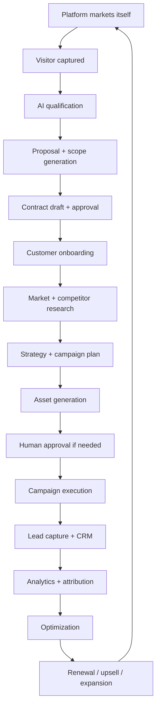
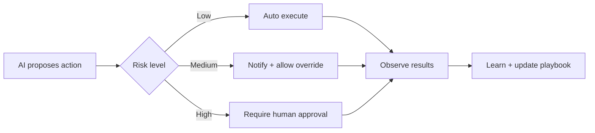
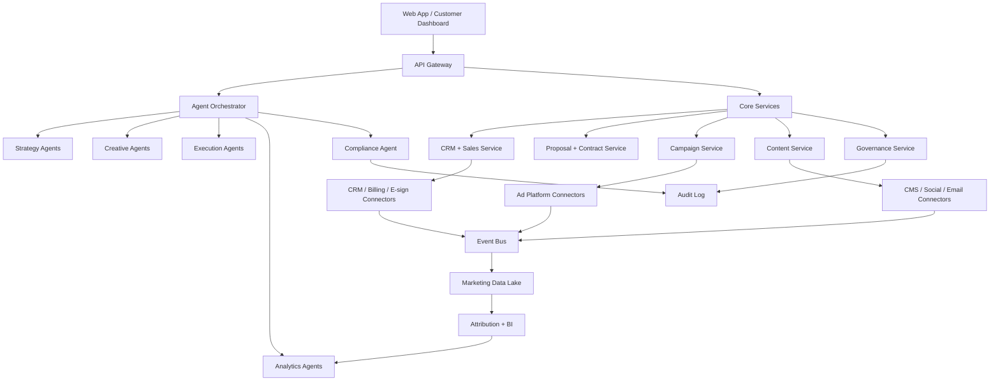

Below is a strong product direction: build a **Digital Marketing Operating System** that does not merely “help marketers,” but acts as an AI-native growth operator: it acquires customers for itself, qualifies them, drafts/negotiates service contracts, plans campaigns, executes campaigns, analyzes results, learns, and improves.

## 1. Why this is a strong opportunity now

The timing is good because digital marketing is becoming more automated, more data-driven, and more privacy-constrained at the same time. U.S. digital advertising revenue reached nearly **$300B in 2025**, up **13.9% year over year**, and IAB describes the market as moving toward performance-driven, AI-powered growth. ([IAB][1])

At the same time, marketing teams are under budget pressure. Gartner reports 2025 marketing budgets remained flat at **7.7% of company revenue**, while its martech research says average martech utilization dropped to **49%**. That means many companies already own tools, but they are not getting enough value from them. ([Gartner][2])

This creates the opening: **a platform that converts marketing from fragmented tools + manual agencies into an autonomous, measurable, compliance-aware growth system.**

## 2. Product thesis

Create a platform that behaves like this:

> “Tell us your business, budget, market, offer, constraints, and growth goal. We will research your market, create a marketing strategy, generate assets, launch campaigns, manage leads, negotiate the service relationship, measure results, optimize continuously, and only involve humans when approval, risk, brand judgment, or legal/commercial decision-making is needed.”

The differentiator should not be “AI content generation.” That is already common. The differentiator should be:

**End-to-end autonomous marketing execution with governance, contracts, compliance, measurement, and continuous learning.**

## 3. Core customer segments

Start with one beachhead, then expand.

**Best beachhead:** small and mid-sized service businesses, local businesses, SaaS startups, clinics, agencies, consultants, and e-commerce brands that need growth but cannot hire a full marketing team.

Later expand to:

| Segment                  | Pain                                                                | Platform promise                      |
| ------------------------ | ------------------------------------------------------------------- | ------------------------------------- |
| Local service businesses | No marketing staff, poor tracking, wasted ad spend                  | “AI growth manager in a box”          |
| SaaS startups            | Need pipeline, content, experiments, attribution                    | “Automated demand-gen engine”         |
| Agencies                 | Too much manual work, reporting burden, campaign ops overhead       | “Agency operating system”             |
| E-commerce               | Constant creative testing, segmentation, abandoned carts, retention | “Autonomous lifecycle marketing”      |
| Enterprises              | Tool sprawl, low martech utilization, governance needs              | “Governed marketing automation layer” |

## 4. Complete end-to-end lifecycle

The product should cover the entire domain loop:

The key is that **the platform itself should run the same growth engine it sells**. That gives you a live demo, proof of capability, internal feedback loop, and “dogfooding” advantage.

## 5. Major product modules

### A. Self-Marketing Engine

This markets the platform itself.

Capabilities:

| Capability               | What it does                                                            |
| ------------------------ | ----------------------------------------------------------------------- |
| ICP discovery            | Identifies target customer segments and buying triggers                 |
| SEO content engine       | Generates pillar pages, landing pages, comparison pages, industry pages |
| Paid campaign engine     | Launches Google/Meta/LinkedIn/TikTok tests                              |
| Social content engine    | Creates scheduled posts, short videos, carousels, thought leadership    |
| Lead magnet engine       | Creates free audits, calculators, checklists, benchmark reports         |
| Referral engine          | Creates referral offers and tracks partner attribution                  |
| Growth experiment engine | Continuously tests channels, messages, audiences, offers                |

This should produce its own funnel: awareness → free audit → consultation/demo → proposal → contract → onboarding.

### B. Customer Acquisition + Qualification

The platform should capture and qualify leads with minimal human effort.

Features:

| Feature               | Description                                                               |
| --------------------- | ------------------------------------------------------------------------- |
| AI website/chat agent | Asks business-goal questions and collects requirements                    |
| Lead scoring          | Scores fit, urgency, budget, industry, deal value                         |
| Business intake       | Captures offer, geography, audience, brand, constraints, competitors      |
| Pain-point diagnosis  | Identifies weak funnel areas: traffic, conversion, retention, attribution |
| Auto-generated audit  | Gives the prospect a valuable initial report                              |
| CRM sync              | Pushes qualified leads to internal CRM or customer’s CRM                  |

This is where the product begins to look like an AI marketing agency, not a static SaaS tool.

### C. Contract + Proposal Engine

This is a major differentiator. Most marketing tools stop before commercial execution.

Capabilities:

| Capability               | Description                                                                        |
| ------------------------ | ---------------------------------------------------------------------------------- |
| Scope builder            | Converts goals into deliverables, channels, timelines, approval gates              |
| Pricing recommender      | Suggests package, retainer, performance fee, or hybrid model                       |
| Proposal generator       | Creates branded proposal with strategy, deliverables, milestones, assumptions      |
| Contract draft generator | Drafts SOW/MSA-style agreements from approved templates                            |
| Risk flags               | Flags missing approvals, unrealistic claims, unsupported guarantees, privacy risks |
| E-sign integration       | Sends final approved contract for signing                                          |
| Renewal engine           | Tracks outcomes and drafts renewal/upsell proposals                                |

Important: contract generation should be **template-based, auditable, and human-approved**. It should not pretend to provide legal advice. It should produce drafts and identify risk areas.

### D. Market Research + Strategy Engine

This should turn scattered research into an executable plan.

Inputs:

| Input            | Examples                                              |
| ---------------- | ----------------------------------------------------- |
| Business profile | Industry, offer, geography, pricing, margin, capacity |
| Customer profile | ICP, personas, pain points, buying triggers           |
| Competitors      | Websites, ads, keywords, social presence, reviews     |
| Constraints      | Budget, compliance, geography, brand, seasonality     |
| Goal             | Leads, bookings, revenue, retention, brand awareness  |

Outputs:

| Output            | Examples                                                |
| ----------------- | ------------------------------------------------------- |
| Market map        | Segments, competitors, positioning, demand drivers      |
| Channel plan      | SEO, paid search, paid social, email, SMS, local, video |
| Message strategy  | Pain points, hooks, objections, proof points            |
| Campaign calendar | Weekly/monthly execution plan                           |
| Budget allocation | Spend by channel and experiment                         |
| Measurement plan  | KPIs, conversion events, attribution model              |

The platform should understand that channels are shifting. IAB’s 2025 digital video report says digital video ad spend grew **18% YoY in 2024 to $64B** and was projected to reach **$72B in 2025**, powered by GenAI, precision targeting, and performance KPIs. ([IAB][3])

### E. Campaign Planning Engine

This converts strategy into executable campaigns.

Campaign types:

| Campaign type | Examples                                                       |
| ------------- | -------------------------------------------------------------- |
| Acquisition   | Google Search, Meta, LinkedIn, TikTok, YouTube, programmatic   |
| Lifecycle     | Welcome, nurture, abandoned cart, reactivation, renewal        |
| Content       | SEO articles, landing pages, comparison pages, lead magnets    |
| Local         | Google Business Profile, reviews, local SEO, map-pack strategy |
| Retargeting   | Website visitors, engaged users, abandoned forms               |
| Referral      | Customer referrals, partner campaigns, affiliates              |
| Reputation    | Review requests, testimonial collection, social proof          |

Mailchimp’s own product positioning reflects what customers already expect from marketing automation platforms: email/SMS, automations, segmentation, analytics, content creation, social media, lead generation, templates, integrations, A/B testing, dynamic content, retargeting ads, transactional emails, reports, send-time optimization, recommendations, and AI copy tools. ([Mailchimp][4])

Your opportunity is to unify those jobs into one governed, outcome-driven operator.

### F. Creative + Content Engine

This must go beyond “generate a blog post.”

Capabilities:

| Area              | Capabilities                                                     |
| ----------------- | ---------------------------------------------------------------- |
| Brand system      | Voice, tone, design tokens, approved claims, forbidden claims    |
| Creative variants | Headlines, ads, images, videos, landing page sections            |
| SEO content       | Topic clusters, internal linking, schema, search intent coverage |
| Social content    | LinkedIn, Instagram, TikTok, X, YouTube Shorts                   |
| Email/SMS         | Lifecycle flows, newsletters, nurture, promotions                |
| Landing pages     | Generated pages with conversion-focused structure                |
| Proof assets      | Case studies, testimonials, comparison pages                     |
| Compliance check  | Endorsement, claim, disclosure, privacy, regulated-industry risk |

The FTC’s endorsement guidance emphasizes that endorsements must be honest and not misleading, and material connections between advertisers and endorsers need disclosure. That means influencer, testimonial, UGC, affiliate, and review workflows need compliance checks by design. ([Federal Trade Commission][5])

### G. Execution + Integration Layer

This is where the platform becomes real.

Integrations should include:

| Category  | Examples                                              |
| --------- | ----------------------------------------------------- |
| Ads       | Google Ads, Meta, LinkedIn, TikTok, Reddit, Pinterest |
| Analytics | GA4, Search Console, pixels, server-side events       |
| CRM       | HubSpot, Salesforce, Pipedrive, Zoho                  |
| Email/SMS | Mailchimp, Klaviyo, SendGrid, Twilio                  |
| CMS       | WordPress, Webflow, Shopify, headless CMS             |
| Social    | LinkedIn, Instagram, Facebook, TikTok, YouTube        |
| Data      | Postgres, BigQuery, Snowflake, Databricks             |
| Contracts | DocuSign, PandaDoc, Stripe, QuickBooks                |
| Support   | Intercom, Zendesk, Freshdesk                          |

Google’s own privacy guidance emphasizes first-party tagging, Consent Mode, enhanced conversions, and modeling for conversion measurement when cookie consent is not granted. That should be treated as a core design requirement, not a later analytics add-on. ([Google Business][6])

### H. Analytics, Attribution, and Optimization

The platform must answer: **what worked, why, what changed, and what should we do next?**

Core analytics:

| Layer           | Metrics                                               |
| --------------- | ----------------------------------------------------- |
| Awareness       | Impressions, reach, share of voice, search visibility |
| Engagement      | CTR, scroll, video completion, social engagement      |
| Conversion      | Form fills, calls, bookings, purchases, trials        |
| Revenue         | CAC, ROAS, LTV, payback period, pipeline, closed-won  |
| Retention       | Repeat purchase, churn, renewal, upsell               |
| Experimentation | Variant winner, confidence, learning summary          |
| Operations      | Spend pacing, SLA, approval latency, campaign health  |

Mailchimp describes marketing analytics as measuring campaign effectiveness and identifying what to change across channels, using customer behavior, campaign data, predictive analytics, and integrated data sources. ([Mailchimp][7])

Your platform should go further: analytics should not only report. It should trigger next actions.

### I. Governance, Compliance, Privacy, and Trust

This must be first-class because marketing touches personal data, claims, consent, and regulated channels.

Required controls:

| Control                | Why it matters                                                 |
| ---------------------- | -------------------------------------------------------------- |
| Consent management     | GDPR/CCPA/email/SMS compliance                                 |
| Data minimization      | Avoid unnecessary customer data collection                     |
| Purpose limitation     | Use data only for approved campaign purposes                   |
| Audit log              | Who approved what, when, and why                               |
| Human approval gates   | Claims, budgets, legal-sensitive content, regulated industries |
| Brand safety           | Avoid unsafe placements, misleading claims, hallucinated proof |
| Disclosure management  | Influencers, endorsements, AI-generated content where required |
| Unsubscribe/opt-out    | Email/SMS legal requirement                                    |
| Data deletion/export   | Privacy rights support                                         |
| Regional policy engine | Different rules by country/state/industry                      |

FTC’s CAN-SPAM guidance says commercial email must follow compliance rules and give recipients the right to stop receiving emails. California privacy guidance says consumers have rights including know, delete, opt out of sale/sharing, correct, limit, and non-discrimination. GDPR consent guidance requires consent to be freely given, specific, informed, and unambiguous. ([Federal Trade Commission][8])

## 6. AI agent architecture

Build this as a multi-agent system, but expose it as a simple dashboard.

| Agent                   | Responsibility                                      |
| ----------------------- | --------------------------------------------------- |
| Growth Strategist Agent | Creates strategy, positioning, budget plan          |
| Market Research Agent   | Competitor, keyword, trend, audience research       |
| Brand Agent             | Maintains voice, style, claims, approved language   |
| Creative Agent          | Produces ad, email, video, landing page variants    |
| Media Buyer Agent       | Plans and optimizes paid campaigns                  |
| SEO Agent               | Topic clusters, technical SEO, content briefs       |
| Lifecycle Agent         | Email/SMS/customer journey automation               |
| Sales Agent             | Qualifies leads, drafts proposals, follows up       |
| Contract Agent          | Drafts SOW/MSA from approved templates              |
| Compliance Agent        | Checks consent, claims, disclosures, regional rules |
| Analytics Agent         | Measures results and explains performance           |
| Optimization Agent      | Reallocates budget, proposes experiments            |
| Customer Success Agent  | Generates reports, renewal plans, upsells           |

Human involvement should be minimal but explicit:

## 7. Main user experience

The UX should be dashboard-first and low-cognitive-load.

### Primary dashboard

Show only:

| Area              | What user sees                               |
| ----------------- | -------------------------------------------- |
| Growth health     | Green/yellow/red score                       |
| Current goal      | Example: “Generate 80 qualified leads/month” |
| Active campaigns  | What is running now                          |
| AI actions        | What the system did automatically            |
| Needs approval    | Only decisions requiring user input          |
| Results           | Spend, leads, revenue, CAC, ROAS             |
| Next best actions | Recommended changes                          |
| Risk/compliance   | Any blocked or risky items                   |

### User journey

1. User connects website, CRM, ad accounts, analytics, email/SMS.
2. AI audits business and market.
3. AI proposes growth plan.
4. User approves strategy and budget.
5. AI creates assets and campaigns.
6. User approves sensitive assets.
7. AI launches and monitors.
8. AI reports outcomes.
9. AI optimizes continuously.
10. AI proposes renewal/expansion.

The interface should avoid asking users to “build campaigns” manually. It should ask for business outcomes and approvals.

## 8. Data model foundation

Core entities:

| Domain     | Entities                                                  |
| ---------- | --------------------------------------------------------- |
| Customer   | Organization, Workspace, Brand, Product, Offer, Location  |
| Market     | Segment, Persona, Competitor, Keyword, Trend, Channel     |
| Strategy   | Goal, KPI, Budget, Positioning, CampaignPlan              |
| Campaign   | Campaign, Channel, Audience, Creative, Variant, Schedule  |
| Content    | Asset, LandingPage, Email, SMS, SocialPost, VideoBrief    |
| Execution  | Task, Approval, IntegrationJob, PublishEvent              |
| Sales      | Lead, Opportunity, Proposal, Contract, Invoice            |
| Analytics  | Event, Conversion, Attribution, Experiment, Insight       |
| Governance | Consent, Policy, Claim, Disclosure, AuditLog              |
| Learning   | Playbook, ExperimentResult, Recommendation, ModelFeedback |

The architecture should be event-driven so every campaign action, approval, conversion, contract event, and optimization can be traced.

## 9. Platform architecture

Recommended stack aligned with your broader preferences:

| Layer            | Recommendation                                                 |
| ---------------- | -------------------------------------------------------------- |
| Frontend         | React + React Router, dashboard-first UX                       |
| Backend          | NestJS or FastAPI depending on existing ecosystem              |
| Data             | PostgreSQL + event log + object storage                        |
| Workflow         | Temporal-like workflow engine or custom agent workflow runtime |
| Queue/events     | Kafka/Redpanda/NATS depending scale                            |
| AI orchestration | Agent runtime with tool permissions and approval gates         |
| Analytics        | Postgres + columnar warehouse later                            |
| Observability    | OpenTelemetry + Prometheus                                     |
| Integrations     | Connector framework with OAuth, retries, rate limits           |
| Security         | RBAC/ABAC, tenant isolation, encryption, audit trails          |

## 10. Differentiators

Most competitors focus on a slice: email automation, CRM, SEO, ads, analytics, or content generation. This product should compete as a **growth execution layer**.

Strong differentiators:

1. **Outcome-first automation**: user gives goal; platform plans and executes.
2. **Self-marketing platform**: the product markets itself using its own engine.
3. **Contract-to-campaign loop**: proposal, SOW, execution, reporting, renewal are connected.
4. **Compliance-native marketing**: privacy, consent, claims, disclosures, and audit are built in.
5. **Agentic optimization**: AI does not just generate; it observes, learns, reallocates, and improves.
6. **Zero-cognitive-load dashboard**: user only reviews decisions that matter.
7. **Full-funnel attribution**: connects spend → lead → contract → revenue.
8. **Agency + SaaS hybrid**: can serve DIY customers, agencies, and managed-service teams.
9. **Reusable playbooks**: industry-specific growth systems become reusable assets.
10. **Human takeover/delegation model**: users can interrupt, override, or delegate again.

## 11. MVP scope

Do not start with every channel. Start with a narrow but complete loop.

### MVP: “AI Growth Operator for Service Businesses”

Target: local service businesses, consultants, clinics, home services, small SaaS.

MVP capabilities:

| Area           | MVP feature                                                           |
| -------------- | --------------------------------------------------------------------- |
| Self-marketing | Landing page, free audit funnel, AI chat qualification                |
| Onboarding     | Business intake, website scan, competitor scan                        |
| Strategy       | AI-generated 30-day marketing plan                                    |
| Content        | Landing page + Google ad copy + email follow-up                       |
| Execution      | Publish landing page, export/push ads manually or via one integration |
| CRM            | Capture leads and track status                                        |
| Proposal       | Generate proposal and SOW draft                                       |
| Analytics      | Leads, conversion rate, CAC estimate, campaign summary                |
| Governance     | Approval gates, audit log, unsubscribe/compliance checks              |

MVP success metric:

> A customer can go from intake → approved plan → live campaign → captured lead → performance report → renewal recommendation without needing a marketing expert.

## 12. V1, V2, V3 roadmap

### Phase 1: Foundation

Build:

| Workstream        | Deliverable                              |
| ----------------- | ---------------------------------------- |
| Product shell     | Workspace, org, users, roles             |
| Brand profile     | Voice, colors, offers, claims            |
| Intake            | Business profile and growth goal capture |
| Market research   | Competitor and keyword research workflow |
| Plan generator    | 30/60/90-day strategy                    |
| Asset generator   | Landing page, ad copy, email sequence    |
| Approval workflow | Review, approve, reject, edit            |
| Basic analytics   | Campaign and lead dashboard              |

### Phase 2: Execution

Build:

| Workstream       | Deliverable                              |
| ---------------- | ---------------------------------------- |
| Ad connectors    | Google Ads first, Meta second            |
| CMS publishing   | Webflow/WordPress/headless landing pages |
| Email automation | Mailchimp/Klaviyo/SendGrid connector     |
| CRM              | Leads, opportunities, follow-up tasks    |
| Proposal engine  | Scope, pricing, proposal PDF             |
| Contract drafts  | Template-based SOW generation            |
| Audit log        | Full trace of actions and approvals      |

### Phase 3: Autonomous Optimization

Build:

| Workstream             | Deliverable                                 |
| ---------------------- | ------------------------------------------- |
| Experiment engine      | A/B tests, creative variants, budget shifts |
| Attribution            | Spend → lead → revenue reporting            |
| Recommendation engine  | Next-best-action queue                      |
| Budget pacing          | Alerts and autonomous adjustments           |
| Segment optimization   | Audience and persona refinement             |
| AI performance reviews | Weekly/monthly narrative reports            |

### Phase 4: Platformization

Build:

| Workstream          | Deliverable                                        |
| ------------------- | -------------------------------------------------- |
| Industry playbooks  | SaaS, healthcare, legal, home services, e-commerce |
| Agency mode         | Multi-client workspace, white-label reports        |
| Marketplace         | Templates, playbooks, connectors                   |
| Advanced governance | Regional compliance policy engine                  |
| Enterprise mode     | SSO, tenant isolation, data residency, approvals   |
| Partner engine      | Referral/affiliate/co-marketing workflows          |

## 13. Execution principles

These should become product doctrine:

1. **Every feature should reduce manual work.**
2. **AI is not a visible gimmick; it is the operating layer.**
3. **Human approval appears only for risk, judgment, governance, or commercial decisions.**
4. **Every action must be observable and explainable.**
5. **No campaign runs without measurement.**
6. **No claim is published without evidence or approval.**
7. **No personal data is used without a valid purpose and consent basis.**
8. **Every customer outcome should feed learning back into playbooks.**
9. **The platform should use itself to acquire customers.**
10. **Contracts, execution, and results must be connected.**

## 14. Practical first build plan

Start with these epics:

| Epic                                   | Outcome                                         |
| -------------------------------------- | ----------------------------------------------- |
| E1: Customer workspace + brand profile | Store customer, offer, ICP, brand rules         |
| E2: AI intake + free audit             | Convert visitors into qualified prospects       |
| E3: Strategy generator                 | Create 30-day marketing plan                    |
| E4: Proposal/SOW generator             | Convert plan into commercial offer              |
| E5: Landing page + email generator     | Create first executable campaign assets         |
| E6: Approval workflow                  | Human review for brand/legal/budget             |
| E7: Lead capture + CRM-lite            | Track leads from campaign                       |
| E8: Analytics dashboard                | Show results and next actions                   |
| E9: Self-marketing funnel              | Use the platform to market itself               |
| E10: Compliance guardrails             | Consent, disclosures, unsubscribe, claims audit |

## 15. Recommended positioning

Use this positioning:

> **An AI-native digital marketing operating system that plans, sells, executes, measures, and improves growth campaigns end to end—with human approval only where judgment, risk, or governance requires it.**

Alternative sharper tagline:

> **From growth goal to signed contract to live campaign to measurable revenue—automated.**

## 16. Immediate next step

Create a canonical product architecture document with these sections:

1. Vision and product thesis
2. Target customers and use cases
3. End-to-end lifecycle
4. Agent architecture
5. Platform architecture
6. Data model
7. Integration strategy
8. Governance and compliance model
9. MVP scope
10. Roadmap
11. Success metrics
12. Risks and mitigations
13. Epics and user stories

This can become the single source of truth for the Digital Marketing project.

[1]: https://www.iab.com/insights/internet-advertising-revenue-report-full-year-2025/?utm_source=chatgpt.com "IAB | Internet Advertising Revenue Report: Full Year 2025"
[2]: https://www.gartner.com/en/newsroom/press-releases/2025-05-12-gartner-2025-cmo-spend-survey-reveals-marketing-budgets-have-flatlined-at-seven-percent-of-overall-company-revenue?utm_source=chatgpt.com "Gartner 2025 CMO Spend Survey Reveals Marketing ..."
[3]: https://www.iab.com/insights/video-ad-spend-report-2025/?utm_source=chatgpt.com "2025 Digital Video Ad Spend & Strategy Full Report"
[4]: https://mailchimp.com/features/?utm_source=chatgpt.com "Mailchimp Features: Powerful Marketing Tools for Business"
[5]: https://www.ftc.gov/business-guidance/advertising-marketing/endorsements-influencers-reviews?utm_source=chatgpt.com "Endorsements, Influencers, and Reviews"
[6]: https://ads.google.com/home/static/privacy-hub-tool-opt/pdf/ogt-como_en_us.pdf?gmbsrc=it-it-ha-se-akw-gmb-s-319-h~bk-kwd-44738442137-c-WLC-3EG-SEC-WLC-HPM-CTA-WLC-3EG-SEC-WLC-3EG-SEC-WLC-GLF-INL-ahpm-0000000179-0000000001-ahpm-0000000192-0000000000-ahpm-0000000179-0000000000&utm_campaign=gmb_website&utm_medium=ep&utm_source=chatgpt.com "1. Start with sitewide tagging"
[7]: https://mailchimp.com/features/reports-and-analytics/?utm_source=chatgpt.com "Marketing Analytics Platform: Get Insights for Marketing"
[8]: https://www.ftc.gov/business-guidance/resources/can-spam-act-compliance-guide-business?utm_source=chatgpt.com "CAN-SPAM Act: A Compliance Guide for Business"
