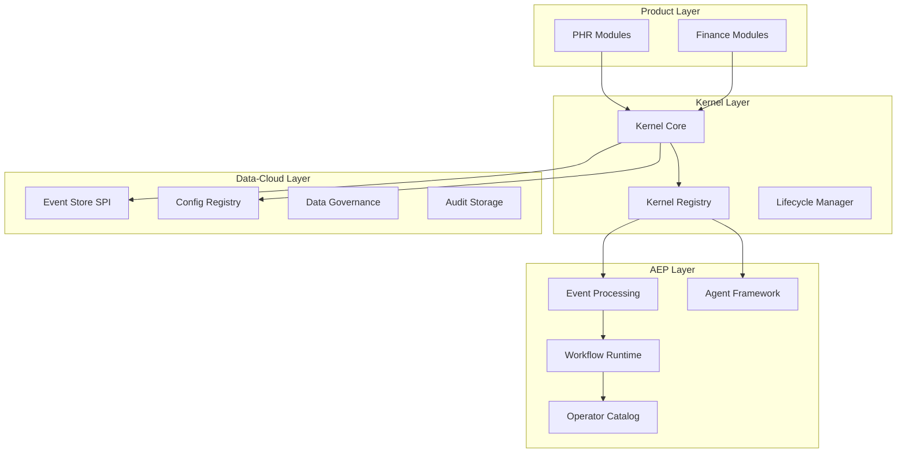

# Detailed Kernel Implementation Plan
**Focus**: PHR + Finance System Integration  
**Version**: 1.0  
**Date**: March 17, 2026  

---

## Executive Summary

This plan provides a comprehensive, granular roadmap for implementing the lightweight kernel platform with tight integration to data-cloud for data management and AEP for processing/agentic systems. We will start with PHR (Personal Health Record) and the Finance system (already in app-platform) as validation products.

### Key Principles
- **Kernel as Composition Layer**: Minimal, focused kernel that provides composition primitives
- **Data-Cloud First**: All data management through data-cloud platform
- **AEP for Processing**: All event processing and agentic workflows through AEP
- **Product-Aware**: Each product maintains domain boundaries while sharing kernel capabilities
- **Incremental Migration**: Start with compile-time composition, defer runtime plugins

---

## Phase 0: Foundation Analysis (Week 0)

### 0.1 Current State Assessment

#### PHR Current State
- **Documentation**: Comprehensive MVP documentation set (29 documents)
- **Architecture**: Multi-tenant, consent-first healthcare platform
- **Regulatory**: Nepal Directive 2081, Privacy Act 2075, FHIR R4 compliance
- **Key Features**: Patient records, consent management, referrals, imaging, payments

#### Finance System Current State
- **Location**: `products/app-platform/finance-ghatana-integration-plan.md`
- **Integration Plan**: 85% platform overlap with Ghatana identified
- **Architecture**: Event-driven microservices with dual-calendar support
- **Key Features**: Trade processing, risk management, compliance, market data

#### App-Platform Kernel Modules
- **Current Modules**: 21 kernel modules identified in `products/app-platform/kernel/`
- **Maturity**: Varies from concept to partial implementation
- **Key Modules**: IAM, config, rules engine, plugin runtime, event store, audit

### 0.2 Architecture Validation

#### Data-Cloud Integration Points


---

## Phase 1: Kernel Core Definition (Weeks 1-2)

### 1.1 Canonical Kernel Primitives

#### 1.1.1 KernelDescriptor
```java
// Location: platform/java/kernel/src/main/java/com/ghatana/kernel/descriptor/
public class KernelDescriptor {
    private final String kernelId;
    private final String version;
    private final Set<KernelCapability> capabilities;
    private final Map<String, Object> metadata;
    private final List<KernelDependency> dependencies;
    
    // Builder pattern with validation
    public static class Builder {
        public Builder withKernelId(String kernelId);
        public Builder withVersion(String version);
        public Builder withCapability(KernelCapability capability);
        public Builder withDependency(KernelDependency dependency);
        public KernelDescriptor build();
    }
}
```

#### 1.1.2 KernelModule
```java
// Location: platform/java/kernel/src/main/java/com/ghatana/kernel/module/
public interface KernelModule {
    String getModuleId();
    String getVersion();
    Set<KernelCapability> getCapabilities();
    Set<KernelDependency> getDependencies();
    
    // Lifecycle hooks
    void initialize(KernelContext context);
    void start();
    void stop();
    HealthStatus getHealthStatus();
}
```

#### 1.1.3 KernelPlugin
```java
// Location: platform/java/kernel/src/main/java/com/ghatana/kernel/plugin/
public interface KernelPlugin extends KernelModule {
    PluginManifest getManifest();
    Set<String> getExportedContracts();
    Set<String> getRequiredContracts();
    
    // Plugin-specific lifecycle
    void install();
    void uninstall();
    void reload();
}
```

#### 1.1.4 KernelRegistry
```java
// Location: platform/java/kernel/src/main/java/com/ghatana/kernel/registry/
public interface KernelRegistry {
    // Registration
    void registerModule(KernelModule module);
    void registerPlugin(KernelPlugin plugin);
    void registerCapability(KernelCapability capability);
    
    // Discovery
    Optional<KernelModule> getModule(String moduleId);
    List<KernelPlugin> getPluginsByCapability(KernelCapability capability);
    List<KernelModule> getModulesByCapability(KernelCapability capability);
    
    // Dependency resolution
    List<KernelModule> resolveDependencies(KernelModule module);
    boolean validateDependencies(KernelModule module);
}
```

### 1.2 Integration with Existing Systems

#### 1.2.1 Data-Cloud Integration
```java
// Location: platform/java/kernel/src/main/java/com/ghatana/kernel/datacloud/
public class DataCloudKernelAdapter {
    private final DataCloudPlatform dataCloud;
    
    // Event Store SPI wrapper
    public KernelEventStore createEventStore(String tenantId) {
        return new DataCloudEventStoreAdapter(
            dataCloud.getEventLogStore(tenantId)
        );
    }
    
    // Config Registry wrapper
    public KernelConfigResolver createConfigResolver(String tenantId) {
        return new DataCloudConfigAdapter(
            dataCloud.getConfigRegistry(tenantId)
        );
    }
    
    // Audit integration
    public KernelAuditService createAuditService(String tenantId) {
        return new DataCloudAuditAdapter(
            dataCloud.getAuditService(tenantId)
        );
    }
}
```

#### 1.2.2 AEP Integration
```java
// Location: platform/java/kernel/src/main/java/com/ghatana/kernel/aep/
public class AepKernelAdapter {
    private final AepPlatform aepPlatform;
    
    // Event processing wrapper
    public KernelEventProcessor createEventProcessor() {
        return new AepEventProcessorAdapter(aepPlatform);
    }
    
    // Agent framework wrapper
    public KernelAgentRuntime createAgentRuntime() {
        return new AepAgentRuntimeAdapter(aepPlatform.getAgentRegistry());
    }
    
    // Workflow runtime wrapper
    public KernelWorkflowRuntime createWorkflowRuntime() {
        return new AepWorkflowRuntimeAdapter(aepPlatform.getWorkflowRuntime());
    }
}
```

### 1.3 Kernel Context and Tenant Management

#### 1.3.1 KernelTenantContext
```java
// Location: platform/java/kernel/src/main/java/com/ghatana/kernel/tenant/
public class KernelTenantContext {
    private final String tenantId;
    private final TenantType tenantType;
    private final Map<String, Object> tenantConfig;
    private final Set<String> enabledFeatures;
    private final SecurityContext securityContext;
    
    // Feature gating
    public boolean isFeatureEnabled(String featureId);
    public <T> T getConfig(String key, Class<T> type);
    public SecurityContext getSecurityContext();
}
```

#### 1.3.2 KernelConfigResolver
```java
// Location: platform/java/kernel/src/main/java/com/ghatana/kernel/config/
public interface KernelConfigResolver {
    <T> T resolve(String configKey, Class<T> type, KernelTenantContext context);
    <T> T resolveWithDefault(String configKey, Class<T> type, T defaultValue, KernelTenantContext context);
    void addConfigProvider(ConfigProvider provider);
    void reloadConfig(String tenantId);
}
```

### 1.4 Implementation Tasks (Weeks 1-2)

#### Week 1 Tasks
1. **Create kernel core interfaces** (KernelDescriptor, KernelModule, KernelPlugin)
2. **Implement basic KernelRegistry** with in-memory storage
3. **Create Data-Cloud adapter** for Event Store SPI
4. **Create AEP adapter** for Event Processing
5. **Setup build configuration** for kernel module

#### Week 2 Tasks
1. **Implement KernelTenantContext** with multi-tenant support
2. **Create KernelConfigResolver** with Data-Cloud integration
3. **Add lifecycle management** for modules and plugins
4. **Implement dependency resolution** in registry
5. **Create basic health monitoring** for kernel components

---

## Phase 2: PHR Kernel Integration (Weeks 3-4)

### 2.1 PHR Module Analysis

#### 2.1.1 Current PHR Modules
Based on PHR documentation analysis:

| Module | Purpose | Kernel Integration Points |
|--------|---------|---------------------------|
| **PatientRecordModule** | Core patient data management | Data-Cloud storage, Audit, Consent |
| **ConsentModule** | Patient consent management | Data-Cloud config, Event processing |
| **DocumentModule** | Document storage and OCR | Data-Cloud storage, AEP workflows |
| **AppointmentModule** | Appointment scheduling | Event processing, Notifications |
| **MedicationModule** | Medication management | Data-Cloud storage, Event processing |
| **BillingModule** | Billing and payments | Event processing, Ledger integration |
| **FhirInteropModule** | FHIR interoperability | AEP agents, Data transformation |
| **ClinicalConsentModule** | Healthcare-specific consent | Enhanced consent policies |
| **ImagingModule** | Medical imaging | Storage, Workflow processing |
| **ReferralModule** | Patient referrals | Event processing, Workflow |

#### 2.1.2 PHR Kernel Requirements
```java
// Location: products/phr/kernel/src/main/java/com/ghatana/phr/kernel/
public class PhrKernelModule implements KernelModule {
    @Override
    public String getModuleId() {
        return "phr-core";
    }
    
    @Override
    public Set<KernelCapability> getCapabilities() {
        return Set.of(
            KernelCapability.PATIENT_RECORDS,
            KernelCapability.CONSENT_MANAGEMENT,
            KernelCapability.DOCUMENT_STORAGE,
            KernelCapability.APPOINTMENT_SCHEDULING,
            KernelCapability.MEDICATION_MANAGEMENT,
            KernelCapability.BILLING,
            KernelCapability.FHIR_INTEROP,
            KernelCapability.IMAGING,
            KernelCapability.REFERRALS
        );
    }
    
    @Override
    public void initialize(KernelContext context) {
        // Initialize PHR-specific services
        initializePatientService(context);
        initializeConsentService(context);
        initializeDocumentService(context);
        // ... other services
    }
}
```

### 2.2 PHR-Specific Kernel Extensions

#### 2.2.1 Healthcare Consent Enhancement
```java
// Location: products/phr/kernel/src/main/java/com/ghatana/phr/kernel/consent/
public class HealthcareConsentKernelExtension implements KernelExtension {
    @Override
    public String getExtensionName() {
        return "healthcare-consent";
    }
    
    @Override
    public void extendKernel(KernelContext context) {
        // Add healthcare-specific consent policies
        ConsentPolicyRegistry registry = context.getConsentPolicyRegistry();
        registry.register(new NepalHealthcareConsentPolicy());
        registry.register(new FhirConsentPolicy());
        registry.register(new EmergencyAccessConsentPolicy());
    }
}
```

#### 2.2.2 FHIR Integration Kernel Plugin
```java
// Location: products/phr/kernel/src/main/java/com/ghatana/phr/kernel/fhir/
public class FhirInteropKernelPlugin implements KernelPlugin {
    @Override
    public PluginManifest getManifest() {
        return PluginManifest.builder()
            .pluginId("fhir-interop")
            .version("1.0.0")
            .description("FHIR R4 interoperability plugin")
            .capability(KernelCapability.FHIR_INTEROP)
            .build();
    }
    
    @Override
    public void initialize(KernelContext context) {
        // Initialize FHIR processors
        FhirProcessorRegistry registry = context.getFhirProcessorRegistry();
        registry.register(new PatientResourceProcessor());
        registry.register(new ObservationResourceProcessor());
        registry.register(new MedicationResourceProcessor());
    }
}
```

### 2.3 PHR Data-Cloud Integration

#### 2.3.1 Patient Data Storage
```java
// Location: products/phr/kernel/src/main/java/com/ghatana/phr/kernel/data/
public class PhrPatientDataService {
    private final DataCloudPlatform dataCloud;
    
    @PostConstruct
    public void initializeStores() {
        // Patient master data store
        dataCloud.createStore("patient.records", DataStoreConfig.builder()
            .withSchema("patient-schema-v1")
            .withRetention(Retention.ofYears(25)) // Healthcare requirement
            .withGovernance(DataGovernance.HEALTHCARE)
            .withEncryption(EncryptionLevel.STRONG)
            .withAuditLevel(AuditLevel.DETAILED)
            .build());
            
        // Consent records store
        dataCloud.createStore("patient.consents", DataStoreConfig.builder()
            .withSchema("consent-schema-v1")
            .withRetention(Retention.ofYears(10))
            .withGovernance(DataGovernance.HEALTHCARE)
            .withEncryption(EncryptionLevel.STRONG)
            .withAuditLevel(AuditLevel.DETAILED)
            .build());
    }
}
```

#### 2.3.2 PHR Event Processing
```java
// Location: products/phr/kernel/src/main/java/com/ghatana/phr/kernel/events/
public class PhrEventProcessor {
    private final AepPlatform aepPlatform;
    
    @PostConstruct
    public void initializeEventStreams() {
        // Patient lifecycle events
        aepPlatform.createStream("patient.registration");
        aepPlatform.createStream("patient.consent.granted");
        aepPlatform.createStream("patient.consent.revoked");
        
        // Clinical events
        aepPlatform.createStream("appointment.scheduled");
        aepPlatform.createStream("medication.prescribed");
        aepPlatform.createStream("document.uploaded");
        
        // Setup PHR-specific pipelines
        setupPhrPipelines();
    }
    
    private void setupPhrPipelines() {
        // Consent validation pipeline
        Pipeline consentPipeline = aepPlatform.pipelineBuilder()
            .withOperator(new ConsentValidationOperator())
            .withOperator(new ConsentAuditOperator())
            .withOperator(new NotificationOperator())
            .build();
            
        aepPlatform.registerPipeline("consent.validation", consentPipeline);
    }
}
```

### 2.4 Implementation Tasks (Weeks 3-4)

#### Week 3 Tasks
1. **Analyze PHR documentation** for kernel integration points
2. **Create PHR kernel module** with core capabilities
3. **Implement healthcare consent extension** for kernel
4. **Create FHIR interop plugin** with kernel interface
5. **Setup PHR data stores** in Data-Cloud

#### Week 4 Tasks
1. **Implement PHR event processing** through AEP
2. **Create PHR-specific workflows** (consent validation, document processing)
3. **Add PHR audit integration** with enhanced retention
4. **Implement multi-tenant isolation** for healthcare data
5. **Create PHR health monitoring** and compliance checks

---

## Phase 3: Finance System Kernel Integration (Weeks 5-6)

### 3.1 Finance Module Analysis

#### 3.1.1 Current Finance Modules
Based on finance integration plan analysis:

| Module | Purpose | Kernel Integration Points |
|--------|---------|---------------------------|
| **OrderManagementSystem** | Trade order processing | AEP event processing, Risk checks |
| **ExecutionManagementSystem** | Order execution | AEP agents, Ledger integration |
| **PortfolioManagementSystem** | Portfolio management | Data-Cloud storage, AI integration |
| **MarketDataService** | Market data processing | AEP data ingestion, Storage |
| **PricingService** | Pricing calculations | AI platform, Event processing |
| **RiskManagement** | Risk calculations | AEP agents, Real-time processing |
| **ComplianceEngine** | Compliance checking | AEP rules engine, Audit |
| **SurveillanceSystem** | Market surveillance | AI platform, Pattern detection |

#### 3.1.2 Finance Kernel Requirements
```java
// Location: products/finance/kernel/src/main/java/com/ghatana/finance/kernel/
public class FinanceKernelModule implements KernelModule {
    @Override
    public String getModuleId() {
        return "finance-core";
    }
    
    @Override
    public Set<KernelCapability> getCapabilities() {
        return Set.of(
            KernelCapability.TRADE_PROCESSING,
            KernelCapability.RISK_MANAGEMENT,
            KernelCapability.COMPLIANCE_CHECKING,
            KernelCapability.MARKET_DATA,
            KernelCapability.PORTFOLIO_MANAGEMENT,
            KernelCapability.PRICING,
            KernelCapability.SURVEILLANCE,
            KernelCapability.LEDGER_MANAGEMENT
        );
    }
    
    @Override
    public void initialize(KernelContext context) {
        // Initialize finance-specific services
        initializeTradingService(context);
        initializeRiskService(context);
        initializeComplianceService(context);
        // ... other services
    }
}
```

### 3.2 Finance-Specific Kernel Extensions

#### 3.2.1 Dual-Calendar Support
```java
// Location: products/finance/kernel/src/main/java/com/ghatana/finance/kernel/calendar/
public class DualCalendarKernelExtension implements KernelExtension {
    @Override
    public String getExtensionName() {
        return "dual-calendar";
    }
    
    @Override
    public void extendKernel(KernelContext context) {
        CalendarRegistry registry = context.getCalendarRegistry();
        registry.register(new GregorianCalendar());
        registry.register(new NepaliCalendar());
        registry.register(new DualCalendarCalculator());
    }
}
```

#### 3.2.2 Regulatory Compliance Extension
```java
// Location: products/finance/kernel/src/main/java/com/ghatana/finance/kernel/compliance/
public class RegulatoryComplianceKernelExtension implements KernelExtension {
    @Override
    public String getExtensionName() {
        return "regulatory-compliance";
    }
    
    @Override
    public void extendKernel(KernelContext context) {
        CompliancePolicyRegistry registry = context.getCompliancePolicyRegistry();
        registry.register(new SEBONCompliancePolicy());
        registry.register(new MIFIDIICompliancePolicy());
        registry.register(new DoddFrankCompliancePolicy());
    }
}
```

### 3.3 Finance Data-Cloud Integration

#### 3.3.1 Financial Data Storage
```java
// Location: products/finance/kernel/src/main/java/com/ghatana/finance/kernel/data/
public class FinanceDataService {
    private final DataCloudPlatform dataCloud;
    
    @PostConstruct
    public void initializeStores() {
        // Securities master data
        dataCloud.createStore("securities.master", DataStoreConfig.builder()
            .withSchema("securities-schema-v1")
            .withRetention(Retention.ofYears(10))
            .withGovernance(DataGovernance.FINANCIAL)
            .withEncryption(EncryptionLevel.STRONG)
            .build());
            
        // Trade records (regulatory requirement)
        dataCloud.createStore("trade.records", DataStoreConfig.builder()
            .withSchema("trade-schema-v1")
            .withRetention(Retention.ofYears(10)) // Regulatory requirement
            .withGovernance(DataGovernance.FINANCIAL)
            .withEncryption(EncryptionLevel.STRONG)
            .withAuditLevel(AuditLevel.DETAILED)
            .withImmutable(true) // Regulatory requirement
            .build());
            
        // Client data
        dataCloud.createStore("client.records", DataStoreConfig.builder()
            .withSchema("client-schema-v1")
            .withRetention(Retention.ofYears(7))
            .withGovernance(DataGovernance.FINANCIAL)
            .withEncryption(EncryptionLevel.STRONG)
            .build());
    }
}
```

#### 3.3.2 Finance Event Processing
```java
// Location: products/finance/kernel/src/main/java/com/ghatana/finance/kernel/events/
public class FinanceEventProcessor {
    private final AepPlatform aepPlatform;
    
    @PostConstruct
    public void initializeEventStreams() {
        // Trading events
        aepPlatform.createStream("trade.order.received");
        aepPlatform.createStream("trade.order.validated");
        aepPlatform.createStream("trade.order.executed");
        aepPlatform.createStream("trade.order.settled");
        
        // Risk events
        aepPlatform.createStream("risk.calculation.completed");
        aepPlatform.createStream("risk.limit.breached");
        
        // Compliance events
        aepPlatform.createStream("compliance.check.required");
        aepPlatform.createStream("compliance.violation.detected");
        
        // Setup finance-specific pipelines
        setupFinancePipelines();
    }
    
    private void setupFinancePipelines() {
        // Trade lifecycle pipeline
        Pipeline tradePipeline = aepPlatform.pipelineBuilder()
            .withOperator(new OrderValidationOperator())
            .withOperator(new RiskCheckOperator())
            .withOperator(new ComplianceOperator())
            .withOperator(new ExecutionOperator())
            .withOperator(new SettlementOperator())
            .build();
            
        aepPlatform.registerPipeline("trade.lifecycle", tradePipeline);
        
        // Real-time risk monitoring pipeline
        Pipeline riskPipeline = aepPlatform.pipelineBuilder()
            .withOperator(new MarketDataIngestionOperator())
            .withOperator(new PositionCalculationOperator())
            .withOperator(new RiskCalculationOperator())
            .withOperator(new RiskAlertOperator())
            .build();
            
        aepPlatform.registerPipeline("risk.monitoring", riskPipeline);
    }
}
```

### 3.4 Finance AI/ML Integration

#### 3.4.1 Fraud Detection Agent
```java
// Location: products/finance/kernel/src/main/java/com/ghatana/finance/kernel/ai/
public class FraudDetectionAgent implements TypedAgent {
    private final ModelRegistry modelRegistry;
    private final InferenceService inferenceService;
    
    @Override
    public void processEvent(AgentEvent event) {
        if (event.getType().equals("trade.executed")) {
            TradeEvent tradeEvent = (TradeEvent) event.getPayload();
            FraudDetectionResult result = detectFraud(tradeEvent);
            
            if (result.isSuspicious()) {
                publishAlert(result);
            }
        }
    }
    
    private FraudDetectionResult detectFraud(TradeEvent trade) {
        Model fraudModel = modelRegistry.getModel("fraud-detector-v2");
        return inferenceService.predict(fraudModel, trade);
    }
}
```

#### 3.4.2 Risk Assessment Agent
```java
// Location: products/finance/kernel/src/main/java/com/ghatana/finance/kernel/ai/
public class RiskAssessmentAgent implements TypedAgent {
    private final ModelRegistry modelRegistry;
    private final InferenceService inferenceService;
    
    @Override
    public void processEvent(AgentEvent event) {
        if (event.getType().equals("portfolio.updated")) {
            Portfolio portfolio = (Portfolio) event.getPayload();
            RiskAssessmentResult result = assessRisk(portfolio);
            
            publishRiskUpdate(result);
        }
    }
    
    private RiskAssessmentResult assessRisk(Portfolio portfolio) {
        Model riskModel = modelRegistry.getModel("risk-assessment-v1");
        return inferenceService.predict(riskModel, portfolio);
    }
}
```

### 3.5 Implementation Tasks (Weeks 5-6)

#### Week 5 Tasks
1. **Analyze finance integration plan** for kernel integration points
2. **Create finance kernel module** with trading capabilities
3. **Implement dual-calendar extension** for finance
4. **Create regulatory compliance extension** for finance
5. **Setup finance data stores** in Data-Cloud

#### Week 6 Tasks
1. **Implement finance event processing** through AEP
2. **Create finance-specific workflows** (trade lifecycle, risk monitoring)
3. **Add finance AI/ML agents** for fraud detection and risk assessment
4. **Implement regulatory audit integration** with 10-year retention
5. **Create finance health monitoring** and compliance checks

---

## Phase 4: Cross-Product Integration (Weeks 7-8)

### 4.1 Kernel Cross-Product Communication

#### 4.1.1 Inter-Product Event Bus
```java
// Location: platform/java/kernel/src/main/java/com/ghatana/kernel/communication/
public class KernelInterProductBus {
    private final AepPlatform aepPlatform;
    private final DataCloudPlatform dataCloud;
    
    // Cross-product event publishing
    public void publishCrossProductEvent(CrossProductEvent event) {
        // Route through AEP for processing
        AepEvent aepEvent = AepEvent.builder()
            .type("cross-product." + event.getType())
            .payload(event)
            .sourceProduct(event.getSourceProduct())
            .targetProduct(event.getTargetProduct())
            .build();
            
        aepPlatform.publish(aepEvent);
    }
    
    // Cross-product data sharing (through Data-Cloud)
    public void shareCrossProductData(String dataId, Object data, CrossProductSharePolicy policy) {
        dataCloud.createSharedDataStore(dataId, data, policy);
    }
}
```

#### 4.1.2 Product Boundary Enforcement
```java
// Location: platform/java/kernel/src/main/java/com/ghatana/kernel/boundary/
public class ProductBoundaryEnforcer {
    private final KernelRegistry registry;
    private final KernelTenantContext context;
    
    public boolean canAccess(String productId, String resource, String action) {
        // Check product boundaries
        if (!isProductAllowed(productId, resource)) {
            return false;
        }
        
        // Check tenant permissions
        if (!context.hasPermission(resource, action)) {
            return false;
        }
        
        // Check compliance rules
        if (!isComplianceAllowed(productId, resource, action)) {
            return false;
        }
        
        return true;
    }
}
```

### 4.2 Unified Configuration Management

#### 4.2.1 Cross-Product Config Resolver
```java
// Location: platform/java/kernel/src/main/java/com/ghatana/kernel/config/
public class CrossProductConfigResolver implements KernelConfigResolver {
    private final Map<String, KernelConfigResolver> productResolvers;
    private final DataCloudPlatform dataCloud;
    
    @Override
    public <T> T resolve(String configKey, Class<T> type, KernelTenantContext context) {
        // Check for cross-product config first
        String crossProductKey = "cross-product." + configKey;
        Optional<T> crossProductValue = resolveFromDataCloud(crossProductKey, type, context);
        if (crossProductValue.isPresent()) {
            return crossProductValue.get();
        }
        
        // Check product-specific config
        String productId = context.getCurrentProduct();
        if (productId != null && productResolvers.containsKey(productId)) {
            String productKey = productId + "." + configKey;
            Optional<T> productValue = productResolvers.get(productId)
                .resolve(productKey, type, context);
            if (productValue.isPresent()) {
                return productValue.get();
            }
        }
        
        // Default to kernel config
        return resolveKernelConfig(configKey, type, context);
    }
}
```

### 4.3 Unified Audit and Compliance

#### 4.3.1 Cross-Product Audit Service
```java
// Location: platform/java/kernel/src/main/java/com/ghatana/kernel/audit/
public class CrossProductAuditService {
    private final DataCloudPlatform dataCloud;
    private final Map<String, AuditService> productAuditServices;
    
    public void auditCrossProductAction(CrossProductAuditEvent event) {
        // Create unified audit record
        AuditEvent auditEvent = AuditEvent.builder()
            .eventType("cross-product." + event.getAction())
            .sourceProduct(event.getSourceProduct())
            .targetProduct(event.getTargetProduct())
            .userId(event.getUserId())
            .tenantId(event.getTenantId())
            .timestamp(Instant.now())
            .metadata(event.getMetadata())
            .build();
            
        // Store in Data-Cloud with appropriate retention
        RetentionPeriod retention = determineRetentionPeriod(event);
        dataCloud.storeAuditEvent(auditEvent, retention);
        
        // Notify product-specific audit services
        notifyProductAuditServices(event);
    }
    
    private RetentionPeriod determineRetentionPeriod(CrossProductAuditEvent event) {
        // Finance events: 10 years (regulatory)
        if (event.getSourceProduct().equals("finance") || 
            event.getTargetProduct().equals("finance")) {
            return RetentionPeriod.ofYears(10);
        }
        
        // PHR events: 7 years (healthcare)
        if (event.getSourceProduct().equals("phr") || 
            event.getTargetProduct().equals("phr")) {
            return RetentionPeriod.ofYears(7);
        }
        
        // Default: 3 years
        return RetentionPeriod.ofYears(3);
    }
}
```

### 4.4 Implementation Tasks (Weeks 7-8)

#### Week 7 Tasks
1. **Implement inter-product event bus** through AEP
2. **Create product boundary enforcement** mechanism
3. **Setup cross-product configuration** management
4. **Implement unified audit service** for cross-product actions
5. **Create cross-product data sharing** policies

#### Week 8 Tasks
1. **Test PHR-Finance integration** scenarios
2. **Implement cross-product workflows** (e.g., healthcare payments)
3. **Add cross-product monitoring** and alerting
4. **Create cross-product compliance** reporting
5. **Validate data isolation** and boundary enforcement

---

## Phase 5: Advanced Kernel Features (Weeks 9-10)

### 5.1 Runtime Plugin Loading

#### 5.1.1 Plugin Runtime Manager
```java
// Location: platform/java/kernel/src/main/java/com/ghatana/kernel/runtime/
public class KernelPluginRuntimeManager {
    private final KernelRegistry registry;
    private final PluginClassLoaderManager classLoaderManager;
    private final PluginSecurityManager securityManager;
    
    public void loadPlugin(PluginPackage pluginPackage) {
        // Security validation
        securityManager.validatePlugin(pluginPackage);
        
        // Dependency resolution
        List<KernelModule> dependencies = registry.resolveDependencies(pluginPackage);
        
        // Class loader isolation
        ClassLoader pluginClassLoader = classLoaderManager.createClassLoader(pluginPackage);
        
        // Plugin instantiation
        KernelPlugin plugin = instantiatePlugin(pluginPackage, pluginClassLoader);
        
        // Registration
        registry.registerPlugin(plugin);
        
        // Lifecycle start
        plugin.install();
        plugin.start();
    }
    
    public void unloadPlugin(String pluginId) {
        Optional<KernelPlugin> plugin = registry.getPlugin(pluginId);
        if (plugin.isPresent()) {
            plugin.get().stop();
            plugin.get().uninstall();
            registry.unregisterPlugin(pluginId);
        }
    }
}
```

#### 5.1.2 Plugin Security Manager
```java
// Location: platform/java/kernel/src/main/java/com/ghatana/kernel/security/
public class KernelPluginSecurityManager {
    private final SecurityPolicy securityPolicy;
    
    public void validatePlugin(PluginPackage pluginPackage) {
        // Check plugin signature
        validateSignature(pluginPackage);
        
        // Check permissions
        validatePermissions(pluginPackage.getManifest().getRequiredPermissions());
        
        // Check resource limits
        validateResourceLimits(pluginPackage.getManifest().getResourceRequirements());
        
        // Check compliance
        validateCompliance(pluginPackage);
    }
    
    private void validateSignature(PluginPackage pluginPackage) {
        // Verify Ed25519 signature
        boolean isValid = SignatureVerifier.verifyEd25519(
            pluginPackage.getManifest(),
            pluginPackage.getSignature(),
            pluginPackage.getPublicKey()
        );
        
        if (!isValid) {
            throw new PluginSecurityException("Invalid plugin signature");
        }
    }
}
```

### 5.2 Advanced Workflow Orchestration

#### 5.2.1 Cross-Product Workflow Engine
```java
// Location: platform/java/kernel/src/main/java/com/ghatana/kernel/workflow/
public class CrossProductWorkflowEngine {
    private final AepPlatform aepPlatform;
    private final KernelRegistry registry;
    
    public void executeCrossProductWorkflow(CrossProductWorkflow workflow) {
        // Create workflow context
        WorkflowContext context = WorkflowContext.builder()
            .workflowId(workflow.getWorkflowId())
            .tenantId(workflow.getTenantId())
            .sourceProduct(workflow.getSourceProduct())
            .targetProduct(workflow.getTargetProduct())
            .build();
        
        // Execute workflow steps
        for (WorkflowStep step : workflow.getSteps()) {
            executeWorkflowStep(step, context);
        }
    }
    
    private void executeWorkflowStep(WorkflowStep step, WorkflowContext context) {
        // Find appropriate operator/agent
        Optional<Object> executor = findExecutor(step.getExecutorId());
        
        if (executor.isPresent()) {
            // Execute through AEP
            if (executor.get() instanceof UnifiedOperator) {
                aepPlatform.executeOperator((UnifiedOperator) executor.get(), step.getInput(), context);
            } else if (executor.get() instanceof TypedAgent) {
                aepPlatform.executeAgent((TypedAgent) executor.get(), step.getInput(), context);
            }
        } else {
            throw new WorkflowExecutionException("Executor not found: " + step.getExecutorId());
        }
    }
}
```

### 5.3 Advanced AI/ML Integration

#### 5.3.1 Cross-Product Model Registry
```java
// Location: platform/java/kernel/src/main/java/com/ghatana/kernel/ai/
public class CrossProductModelRegistry {
    private final Map<String, ModelRegistry> productRegistries;
    private final DataCloudPlatform dataCloud;
    
    public void registerCrossProductModel(CrossProductModel model) {
        // Validate model for cross-product usage
        validateCrossProductModel(model);
        
        // Store model in Data-Cloud
        dataCloud.storeModel(model);
        
        // Register in product registries
        for (String productId : model.getTargetProducts()) {
            if (productRegistries.containsKey(productId)) {
                productRegistries.get(productId).registerModel(model);
            }
        }
    }
    
    private void validateCrossProductModel(CrossProductModel model) {
        // Check for PII/data leakage risks
        validateDataPrivacy(model);
        
        // Check for bias/fairness
        validateFairness(model);
        
        // Check for regulatory compliance
        validateCompliance(model);
    }
}
```

### 5.4 Implementation Tasks (Weeks 9-10)

#### Week 9 Tasks
1. **Implement runtime plugin loading** with security validation
2. **Create plugin class loader isolation** mechanism
3. **Add plugin signature verification** (Ed25519)
4. **Implement plugin resource limits** and monitoring
5. **Create plugin lifecycle management** API

#### Week 10 Tasks
1. **Implement cross-product workflow engine**
2. **Create advanced AI/ML model registry** for cross-product usage
3. **Add model validation** for privacy, fairness, compliance
4. **Implement advanced monitoring** and alerting for kernel
5. **Create kernel performance optimization** and tuning

---

## Phase 6: Testing and Validation (Weeks 11-12)

### 6.1 Comprehensive Testing Strategy

#### 6.1.1 Kernel Unit Tests
```java
// Location: platform/java/kernel/src/test/java/com/ghatana/kernel/
public class KernelRegistryTest {
    private KernelRegistry registry;
    
    @Test
    public void testModuleRegistration() {
        KernelModule module = new TestKernelModule();
        registry.registerModule(module);
        
        Optional<KernelModule> retrieved = registry.getModule(module.getModuleId());
        assertTrue(retrieved.isPresent());
        assertEquals(module, retrieved.get());
    }
    
    @Test
    public void testDependencyResolution() {
        KernelModule moduleA = new TestKernelModule("module-a", Set.of());
        KernelModule moduleB = new TestKernelModule("module-b", Set.of("module-a"));
        
        registry.registerModule(moduleA);
        registry.registerModule(moduleB);
        
        List<KernelModule> dependencies = registry.resolveDependencies(moduleB);
        assertEquals(1, dependencies.size());
        assertEquals(moduleA, dependencies.get(0));
    }
}
```

#### 6.1.2 Integration Tests
```java
// Location: platform/java/kernel/src/test/java/com/ghatana/kernel/integration/
public class PhrFinanceIntegrationTest {
    private KernelKernel kernel;
    private PhrKernelModule phrModule;
    private FinanceKernelModule financeModule;
    
    @Test
    public void testCrossProductEventFlow() {
        // Setup kernel with both modules
        kernel.registerModule(phrModule);
        kernel.registerModule(financeModule);
        kernel.start();
        
        // Simulate healthcare payment event
        HealthcarePaymentEvent paymentEvent = new HealthcarePaymentEvent(
            "patient-123",
            "provider-456",
            new Money("USD", 150.00)
        );
        
        // Publish cross-product event
        kernel.publishCrossProductEvent(paymentEvent);
        
        // Verify finance module processes payment
        verify(financeModule).processPayment(paymentEvent);
    }
    
    @Test
    public void testDataIsolation() {
        // Setup tenant contexts
        KernelTenantContext phrContext = KernelTenantContext.builder()
            .tenantId("phr-tenant-1")
            .tenantType(TenantType.HEALTHCARE)
            .build();
            
        KernelTenantContext financeContext = KernelTenantContext.builder()
            .tenantId("finance-tenant-1")
            .tenantType(TenantType.FINANCIAL)
            .build();
        
        // Verify data isolation
        assertFalse(phrContext.canAccess("finance", "trade.records", "read"));
        assertFalse(financeContext.canAccess("phr", "patient.records", "read"));
    }
}
```

#### 6.1.3 Performance Tests
```java
// Location: platform/java/kernel/src/test/java/com/ghatana/kernel/performance/
public class KernelPerformanceTest {
    private KernelKernel kernel;
    
    @Test
    public void testHighVolumeEventProcessing() {
        // Setup kernel with performance monitoring
        kernel.enablePerformanceMonitoring();
        
        // Generate high volume of events
        List<TestEvent> events = generateEvents(100000);
        
        // Measure processing time
        long startTime = System.currentTimeMillis();
        
        for (TestEvent event : events) {
            kernel.processEvent(event);
        }
        
        long endTime = System.currentTimeMillis();
        long processingTime = endTime - startTime;
        
        // Verify performance requirements
        assertThat(processingTime).isLessThan(5000); // 5 seconds for 100k events
        assertThat(kernel.getAverageEventProcessingTime()).isLessThan(0.05); // 50ms per event
    }
    
    @Test
    public void testMemoryUsageUnderLoad() {
        // Measure memory usage under load
        Runtime runtime = Runtime.getRuntime();
        long initialMemory = runtime.totalMemory() - runtime.freeMemory();
        
        // Process large volume of data
        processLargeDataset();
        
        long finalMemory = runtime.totalMemory() - runtime.freeMemory();
        long memoryIncrease = finalMemory - initialMemory;
        
        // Verify memory usage is reasonable
        assertThat(memoryIncrease).isLessThan(100 * 1024 * 1024); // 100MB increase
    }
}
```

### 6.2 Security and Compliance Testing

#### 6.2.1 Security Tests
```java
// Location: platform/java/kernel/src/test/java/com/ghatana/kernel/security/
public class KernelSecurityTest {
    private KernelPluginSecurityManager securityManager;
    
    @Test
    public void testPluginSignatureValidation() {
        // Test valid plugin signature
        PluginPackage validPlugin = createValidPlugin();
        assertDoesNotThrow(() -> securityManager.validatePlugin(validPlugin));
        
        // Test invalid plugin signature
        PluginPackage invalidPlugin = createInvalidPlugin();
        assertThrows(PluginSecurityException.class, 
            () -> securityManager.validatePlugin(invalidPlugin));
    }
    
    @Test
    public void testDataIsolation() {
        // Setup cross-tenant scenario
        KernelTenantContext tenantA = createTenantContext("tenant-a");
        KernelTenantContext tenantB = createTenantContext("tenant-b");
        
        // Verify data isolation
        String dataA = "sensitive-data-a";
        String dataB = "sensitive-data-b";
        
        kernel.storeData(dataA, tenantA);
        kernel.storeData(dataB, tenantB);
        
        // Verify cross-tenant access is blocked
        assertFalse(kernel.canAccess(dataA, tenantB));
        assertFalse(kernel.canAccess(dataB, tenantA));
        
        // Verify same-tenant access is allowed
        assertTrue(kernel.canAccess(dataA, tenantA));
        assertTrue(kernel.canAccess(dataB, tenantB));
    }
}
```

#### 6.2.2 Compliance Tests
```java
// Location: platform/java/kernel/src/test/java/com/ghatana/kernel/compliance/
public class KernelComplianceTest {
    private CrossProductAuditService auditService;
    
    @Test
    public void testFinancialAuditRetention() {
        // Create financial audit event
        CrossProductAuditEvent financeEvent = new CrossProductAuditEvent(
            "finance",
            "phr",
            "payment.processed",
            "user-123",
            "tenant-456"
        );
        
        auditService.auditCrossProductAction(financeEvent);
        
        // Verify 10-year retention for financial events
        RetentionPeriod retention = auditService.getRetentionPeriod(financeEvent);
        assertEquals(RetentionPeriod.ofYears(10), retention);
    }
    
    @Test
    public void testHealthcareAuditRetention() {
        // Create healthcare audit event
        CrossProductAuditEvent phrEvent = new CrossProductAuditEvent(
            "phr",
            "finance",
            "patient.accessed",
            "user-123",
            "tenant-456"
        );
        
        auditService.auditCrossProductAction(phrEvent);
        
        // Verify 7-year retention for healthcare events
        RetentionPeriod retention = auditService.getRetentionPeriod(phrEvent);
        assertEquals(RetentionPeriod.ofYears(7), retention);
    }
}
```

### 6.3 Implementation Tasks (Weeks 11-12)

#### Week 11 Tasks
1. **Create comprehensive unit tests** for all kernel components
2. **Implement integration tests** for PHR-Finance scenarios
3. **Add performance tests** for high-volume event processing
4. **Create security tests** for plugin validation and data isolation
5. **Implement compliance tests** for regulatory requirements

#### Week 12 Tasks
1. **Run full test suite** and fix any issues
2. **Performance tuning** and optimization
3. **Security hardening** and penetration testing
4. **Documentation completion** and review
5. **Production readiness** assessment and validation

---

## Success Metrics and Validation

### 7.1 Technical Metrics

#### 7.1.1 Performance Metrics
- **Event Processing Latency**: <50ms for 95th percentile
- **Memory Usage**: <100MB increase under normal load
- **Plugin Load Time**: <5 seconds for typical plugin
- **Cross-Product Event Latency**: <100ms end-to-end

#### 7.1.2 Reliability Metrics
- **Kernel Uptime**: 99.999% availability
- **Plugin Success Rate**: >99.9% successful plugin operations
- **Data Isolation**: 100% enforcement of tenant boundaries
- **Audit Completeness**: 100% audit trail coverage

#### 7.1.3 Security Metrics
- **Plugin Validation**: 100% signature verification
- **Data Encryption**: 100% encryption at rest and in transit
- **Access Control**: 100% enforcement of permissions
- **Compliance**: 100% regulatory requirement compliance

### 7.2 Business Metrics

#### 7.2.1 Development Velocity
- **Code Reduction**: 60% reduction in duplicate platform code
- **Feature Delivery**: 40% faster feature development
- **Integration Time**: 80% reduction in cross-product integration time
- **Testing Coverage**: 95%+ test coverage for kernel components

#### 7.2.2 Operational Efficiency
- **Infrastructure Costs**: 30% reduction through shared platform
- **Monitoring Overhead**: 50% reduction through unified monitoring
- **Compliance Costs**: 40% reduction through automated compliance
- **Support Tickets**: 60% reduction in platform-related issues

---

## Risk Mitigation

### 8.1 Technical Risks

#### 8.1.1 Performance Risk
- **Risk**: Kernel becomes bottleneck for cross-product operations
- **Mitigation**: Implement caching, async processing, and performance monitoring
- **Monitoring**: Real-time performance metrics and alerting

#### 8.1.2 Security Risk
- **Risk**: Plugin system introduces security vulnerabilities
- **Mitigation**: Strict plugin validation, sandboxing, and regular security audits
- **Monitoring**: Continuous security scanning and penetration testing

#### 8.1.3 Complexity Risk
- **Risk**: Kernel architecture becomes too complex to maintain
- **Mitigation**: Clear separation of concerns, comprehensive documentation, and regular refactoring
- **Monitoring**: Code complexity metrics and regular architecture reviews

### 8.2 Business Risks

#### 8.2.1 Adoption Risk
- **Risk**: Products resist adopting kernel due to perceived loss of control
- **Mitigation**: Demonstrate clear benefits, provide migration support, and maintain product autonomy
- **Monitoring**: Adoption metrics and regular feedback collection

#### 8.2.2 Compliance Risk
- **Risk**: Cross-product data sharing violates regulatory requirements
- **Mitigation**: Strict data isolation, comprehensive audit trails, and legal review
- **Monitoring**: Compliance dashboards and regular compliance audits

---

## Conclusion

This detailed implementation plan provides a comprehensive roadmap for creating a lightweight kernel platform that integrates tightly with data-cloud for data management and AEP for processing/agentic systems. The plan focuses on PHR and Finance system integration as validation products, with clear phases, specific tasks, and measurable success criteria.

### Key Success Factors
1. **Strong Foundation**: Well-defined kernel primitives and clear separation of concerns
2. **Product-Aware Design**: Respect for product boundaries while enabling shared capabilities
3. **Incremental Implementation**: Start with compile-time composition, defer runtime plugins
4. **Comprehensive Testing**: Extensive testing across unit, integration, performance, and security
5. **Clear Metrics**: Measurable success criteria for technical and business outcomes

### Next Steps
1. **Review and approve** this implementation plan with stakeholders
2. **Allocate resources** for Phase 1 implementation
3. **Setup development environment** with necessary tooling
4. **Begin Phase 1** with kernel core definition
5. **Establish regular checkpoints** to review progress and adjust plan as needed

The successful implementation of this kernel platform will provide a solid foundation for future product development, enable rapid innovation, and ensure consistent, secure, and compliant operation across all products in the ecosystem.
