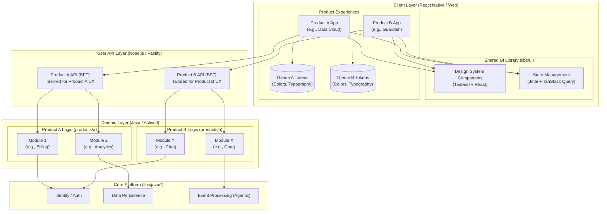

## Plan: Powerful Generic Kernel

Build app-platform into a true composition kernel by standardizing a small set of platform primitives and then adapting proven capabilities from shared libs, data-cloud, AEP, and the agent/runtime stack behind those primitives. The kernel should become the place where plugins, operators, workflows, tenant-scoped feature sets, shared event/state infrastructure, and inter-module contracts meet without collapsing product boundaries into a single giant platform monolith.

**Steps**
1. Define the kernel’s non-negotiable platform primitives.
The kernel should standardize these concepts first: `KernelDescriptor`, `KernelModule`, `KernelPlugin`, `KernelRegistry`, `KernelEventStore`, `KernelWorkflowRuntime`, `KernelInteractionBus`, `KernelTenantContext`, `KernelConfigResolver`, and `KernelLifecycle`. This step blocks the rest because it decides what gets reused directly versus adapted.
2. Make descriptor and lifecycle models universal across modules, plugins, operators, and agents.
Use the richness of `AgentDescriptor` plus the compatibility and dependency fields in `PluginManifest` to create one canonical component descriptor model. Distinguish identity/version/capability metadata from runtime lifecycle state and from tenant feature enablement.
3. Establish a unified registry layer.
Adopt the Promise-based registry shape proven by AEP operator catalogs and agent registries, but generalize it so the kernel can register and discover plugins, operators, agents, workflow contributions, and exported contracts consistently. Support by-ID lookup, capability lookup, dependency ordering, and lifecycle visibility.
4. Standardize plugin loading and inter-plugin communication.
Reuse the platform plugin stack for lifecycle, hot-reload path, classloader isolation, typed request/response contracts, and pub/sub communication. The kernel should own the plugin contract and interaction bus, while products contribute domain plugins instead of wiring direct service calls.
5. Promote event sourcing and shared state infrastructure into first-class kernel services.
Define a `KernelEventStore` SPI that can wrap app-platform aggregate stores, data-cloud EventLogStore patterns, and EventCloud append/tail semantics. Use it for auditability, replay, plugin interaction events, workflow state transitions, and module interoperability. Keep large binary data out of the event log and enforce tenant scoping at this layer.
6. Turn workflows into a generic contribution model.
Keep durable workflow execution in platform/runtime code and allow kernel modules or plugins to contribute step operators, triggers, policies, sub-workflows, and orchestration fragments through registration. Avoid hard-coding product step enums or product-specific orchestration assumptions inside the kernel.
7. Reuse the AEP operator model as the kernel’s executable extension model.
Bring in `UnifiedOperator`, operator composition patterns, and operator catalogs as the basis for plugin-contributed executable behavior. The kernel can then run feature logic, transformations, triggers, inference, or integration adapters through one operator abstraction instead of separate incompatible extension models.
8. Reuse the agent framework as a typed execution and capability layer, not as the whole kernel.
Use typed agents, agent registries, and lifecycle/metrics patterns where plugins need higher-order reasoning or stateful execution. Do not let agent abstractions swallow the entire kernel; keep them as one class of executable component registered in the common kernel registry.
9. Adopt tenant-scoped compiled config and feature governance.
Use the data-cloud ConfigRegistry pattern plus app-platform feature-rollout and license-gating patterns to resolve per-tenant module enablement, plugin configuration, policy overlays, and rollout state. Separate module installed, module ready, feature enabled, and tenant allowed so governance remains explicit.
10. Define shared-data and single-source-of-truth rules carefully.
Do not create one universal mutable shared schema. Instead, define single source of truth by domain-owned records plus shared canonical event and contract models. Use shared stores only for kernel concerns like event sourcing, registries, workflow state, and cross-module metadata. Domain data remains module-owned and accessed through exported contracts, events, or approved projections.
11. Add strong interoperability and boundary rules.
Allow inter-plugin communication through typed contracts, event topics, operator composition, and workflow handoffs. Forbid direct hidden coupling through arbitrary classpath calls or shared mutable state. Require every reusable component to declare capabilities, dependencies, tenant behavior, health model, and exported commands/queries/events.
12. Stage the migration.
Phase A: define kernel primitives and canonical descriptor/lifecycle/registry model.
Phase B: adapt plugin runtime, interaction bus, and tenant context to the new kernel primitives.
Phase C: adapt workflow runtime, operator model, and event store SPI.
Phase D: add agent runtime integration and tenant-scoped compiled config.
Phase E: migrate selected app-platform modules onto the kernel model and enable compile-time pluggability first.
Phase F: enable runtime-loaded plugins and hot-reload on top of the already-stable kernel contracts.

**How Products Build On The Kernel**

The kernel should not try to make FlashIt, Aura, and PHR look like the same product. It should provide a common composition surface so each product can assemble strong product-specific modules from shared platform capabilities.

The right product-building model is:
- the kernel owns lifecycle, registry, eventing, workflow runtime, plugin communication, tenant scoping, config resolution, audit hooks, and shared infrastructure contracts
- each product owns its domain model, domain workflows, product UX, domain APIs, and domain-specific policy logic
- shared services become reusable platform capabilities only when they solve the same operational problem across products, not merely because they exist in more than one codebase

That leads to three layers:
- **Kernel layer**: descriptors, plugin/module loading, registry, workflow runtime, event store, interaction bus, tenant context, executor governance, health/readiness, feature governance
- **Platform capability layer**: auth, consent pattern, notifications, document/object storage, vector search, async jobs, adapters, analytics/event streaming, compiled config, interoperability bridges
- **Product composition layer**: FlashIt moments/reflection, Aura recommendation and ontology systems, PHR clinical records and consent-first healthcare workflows

**Product-Building Model By Product**

### FlashIt on the Kernel

FlashIt is the best candidate for proving fast product composition because it already combines a gateway, an ActiveJ agent service, offline-first clients, media storage, semantic search, and reflective AI behavior.

FlashIt should be built from these kernel/platform capabilities:
- identity/session and billing capability set
- object storage and media-ingestion capability set
- async transcription and reflection job capability set
- vector search and embedding capability set
- event-driven notification capability set
- offline sync and background upload capability set
- plugin-contributed AI providers and enrichment operators

FlashIt-specific domain modules should remain product-owned:
- MomentModule
- SphereModule
- ReflectionModule
- CollaborationModule
- PersonalKnowledgeModule

The kernel should help FlashIt in these concrete ways:
1. model AI reflection, transcription, embedding, search enrichment, and pattern extraction as operator or agent plugins instead of hard-wired service calls
2. move media processing, semantic indexing, and notification scheduling onto kernel workflow/runtime infrastructure
3. use the interaction bus to let collaboration, reflection, and search modules communicate without direct classpath coupling
4. adopt the kernel event store for moment-created, media-uploaded, reflection-generated, and notification-delivered events
5. treat offline sync as a reusable capability package, but let FlashIt keep moment-specific merge policies in product code

Concrete FlashIt build sequence:
1. wrap the current Java agent features behind a kernel-compatible executable contract using `UnifiedOperator` or `TypedAgent` adapters
2. expose reflection, transcription, embeddings, and pattern detection as registered executable capabilities in the kernel registry
3. move gateway-triggered background operations to kernel workflows backed by the event store and executor registry
4. define FlashIt-specific product descriptors for moments, spheres, reflection, and collaboration as first-party compile-time modules
5. extract shared media/object storage, notifications, and background upload concerns into platform capability modules
6. keep sphere-sharing ACL and moment semantics in the product layer, even if they use shared consent/access primitives underneath

FlashIt feature packs on top of the kernel:
- `flashit-core-capture`
- `flashit-ai-reflection`
- `flashit-search-and-graph`
- `flashit-collaboration`
- `flashit-premium-billing`

FlashIt risks to plan for:
- do not force FlashIt’s personal knowledge graph semantics into a generic kernel graph model
- do not make LLM providers part of the kernel core; keep them as plugins/providers
- do not block FlashIt iteration speed on fully generalized runtime plugin loading; compile-time pluggability is enough first

### Aura on the Kernel

Aura is the strongest case for a powerful capability-driven kernel because it needs ingestion pipelines, ontologies, recommendation workflows, profile intelligence, explainable ranking, and long-horizon tasks. It will benefit the most from combining AEP operators, workflow runtime, agent framework, eventing, and tenant-scoped config.

Aura should be built from these kernel/platform capabilities:
- ingestion connector framework
- event streaming and catalog pipeline capability set
- recommendation execution and ranking operator capability set
- profile intelligence and agent-learning capability set
- vector search and similarity capability set
- knowledge graph and ontology adapter capability set
- experimentation and feature rollout capability set

Aura-specific product modules should remain product-owned:
- CatalogIngestionModule
- YouIndexModule
- RecommendationModule
- IngredientIntelligenceModule
- ShadeOntologyModule
- LongHorizonTaskModule

The kernel should help Aura in these concrete ways:
1. use AEP-style operators for source ingestion, normalization, enrichment, scoring, ranking, and explanation building
2. use durable workflows for long-running product ingestion, catalog reconciliation, and user-task execution
3. use typed agents for higher-order reasoning components such as profile intelligence, recommendation refinement, and learning loops
4. use tenant-scoped compiled config for recommendation policies, ranking strategies, data-source enablement, and experimentation flags
5. use the event store and interaction bus so product catalog changes, feedback loops, and ranking updates propagate asynchronously across modules

Concrete Aura build sequence:
1. define Aura executable capability classes: ingestion operator, ranking operator, ontology resolver, profile inference agent, learning/reflection agent
2. represent catalog import and recommendation pipelines as kernel-registered pipelines/workflows rather than custom internal orchestration code
3. use the kernel registry to discover ranking strategies, ingestion connectors, ontology packs, and model providers by capability and version
4. keep the “You Index” domain model product-owned, but make its builders and inference paths pluggable through kernel descriptors and workflows
5. move experimentation, rollout, and tenant-specific profile policy resolution onto the kernel feature-governance layer
6. add product-scoped event topics for catalog updates, recommendation feedback, ranking recalculation, and long-horizon task state changes

Aura feature packs on top of the kernel:
- `aura-catalog-and-ingestion`
- `aura-recommendation-engine`
- `aura-you-index`
- `aura-ontology-and-knowledge-graph`
- `aura-long-horizon-agent-runtime`

Aura risks to plan for:
- do not collapse ontology, product graph, and user profile into one shared kernel data model
- do not centralize recommendation logic inside the kernel; centralize only the execution/runtime abstractions
- do not make LLM or ML serving assumptions part of the kernel core; model them as provider-backed capabilities

### PHR on the Kernel

PHR is the strictest product and should be used to validate whether the kernel can support high-governance, consent-first, audit-heavy, multi-tenant regulated domains without weakening domain boundaries.

PHR should be built from these kernel/platform capabilities:
- strong identity, tenant, and facility isolation capability set
- consent and delegated access capability set
- audit/event-sourcing capability set
- document, OCR, ASR, and export workflow capability set
- notification and reminder capability set
- offline sync and conflict-resolution capability set
- interoperability adapter capability set for FHIR, insurance, payments, and messaging

PHR-specific domain modules should remain product-owned:
- PatientRecordModule
- EncounterModule
- ObservationModule
- MedicationModule
- AppointmentModule
- FhirInteropModule
- ClinicalConsentModule
- ImagingModule
- BillingModule

The kernel should help PHR in these concrete ways:
1. use kernel workflow/runtime for OCR review, ASR review, export jobs, reminder planning, referral progression, and payment status orchestration
2. use the kernel event store for auditable state transitions, integration events, and selected domain replay use cases without replacing clinical source-of-truth stores
3. use kernel tenant context and feature governance to isolate facilities, product rollout phases, FHIR resource activation levels, and regional policy variations
4. use kernel plugin/adapter contracts for openIMIS, payment gateways, SMS/email providers, OCR engines, ASR engines, and DICOM/viewer providers
5. use a shared offline-sync substrate only for the mechanics of queueing, replay, sync metadata, and conflict surfacing; keep healthcare merge and approval policies inside PHR modules

Concrete PHR build sequence:
1. define the PHR module boundary map around patient records, consent, document processing, imaging, billing, and interoperability
2. move all non-domain-specific job orchestration to kernel workflows backed by audit hooks and event publication
3. model external systems as kernel adapters with explicit contracts and tenant-scoped configuration
4. create a reusable platform consent/access layer only where FlashIt and Aura can meaningfully reuse patterns such as delegated access or attribute-based sharing, while keeping healthcare-specific legal semantics in PHR
5. build the offline sync substrate as a kernel facility with product-defined merge policies, starting with PHR because it has the hardest real requirements
6. keep FHIR translation and Nepal-specific policy enforcement entirely in the PHR product layer or tightly scoped platform adapters, not in the generic kernel core

PHR feature packs on top of the kernel:
- `phr-clinical-records`
- `phr-consent-and-delegation`
- `phr-documents-ocr-asr`
- `phr-referrals-imaging-billing`
- `phr-fhir-and-external-adapters`

PHR risks to plan for:
- do not mistake kernel event sourcing for the entire healthcare record of truth
- do not push FHIR semantics down into unrelated products
- do not generalize consent so much that healthcare-grade access semantics become impossible to enforce

**Shared Capability Map Across FlashIt, Aura, and PHR**

The kernel should expose reusable capability families. These should be independently installable, versioned, and tenant-configurable.

### 1. Identity, Access, and Tenant Capability Family
- auth/session lifecycle
- tenant context propagation
- feature rollout and licensing
- delegated access and scoped access primitives
- audit hooks on sensitive actions

Products using it:
- FlashIt: sessions, billing tiers, sharing roles
- Aura: tenant and experimentation governance, premium feature tiers
- PHR: facility isolation, patient/provider/caregiver roles, strict access checks

### 2. Workflow and Execution Capability Family
- durable workflow runtime
- step-operator registry
- operator composition and pipeline builder
- typed agent runtime
- retry, compensation, and timeout policies

Products using it:
- FlashIt: reflection generation, transcription, search enrichment, notifications
- Aura: ingestion, ranking, learning loops, long-horizon tasks
- PHR: export jobs, OCR/ASR review, reminders, referrals, payments

### 3. Data, Event, and Store Capability Family
- kernel event store SPI
- append/tail/scan infrastructure
- projection and registry metadata store
- object/document store contracts
- optional vector and graph adapters

Products using it:
- FlashIt: moment event stream, search projections, media workflows
- Aura: catalog and feedback events, ranking recalculation, similarity infrastructure
- PHR: audit-rich job state transitions, interoperability events, export and document state

### 4. Plugin and Interoperability Capability Family
- plugin lifecycle and registry
- typed plugin contracts
- interaction bus pub/sub + request/response
- provider adapters for external systems
- hot reload path for later maturity stages

Products using it:
- FlashIt: AI provider, transcription provider, collaboration or realtime adapters
- Aura: ingestion connectors, model providers, ontology providers, ranking strategies
- PHR: OCR/ASR providers, openIMIS, payment gateways, SMS/email, imaging viewers

### 5. Offline, Async, and Notification Capability Family
- queueing and async job scheduling
- sync metadata and replay substrate
- push/email/SMS notification orchestration
- conflict detection framework

Products using it:
- FlashIt: offline capture and upload, reminders, reflection readiness
- Aura: mostly async orchestration and notifications; offline is optional
- PHR: offline reads/writes, conflict surfacing, reminders, status notifications

**Concrete Delivery Plan For The Platform Itself**

The kernel plan needs a product-aware execution path, not only an abstract architecture sequence.

### Platform Wave 1: Core Kernel Skeleton
- implement canonical descriptors, lifecycle model, registry interfaces, tenant context contract, and executor governance
- adapt compile-time module loading first
- define plugin communication interfaces and event store SPI

Outcome:
- FlashIt can begin moving agent services and background jobs behind kernel contracts
- Aura can start with kernel-native descriptors and registry-driven capability discovery
- PHR can start from a strong governance and workflow substrate even before full implementation begins

### Platform Wave 2: Execution and Workflow Layer
- adapt durable workflow runtime, step operator registry, operator catalog, and agent registry into a common kernel execution surface
- add product-scoped namespaces and lifecycle governance
- provide audit/event hooks and per-tenant config resolution

Outcome:
- FlashIt reflection/transcription/search tasks run as kernel workflows
- Aura ingestion/ranking/learning systems run as kernel pipelines and workflows
- PHR OCR/export/reminder/referral/payment jobs run as governed product workflows

### Platform Wave 3: Shared Capability Modules
- extract notifications, object storage, async job orchestration, consent/access primitives, feature governance, and adapter contracts into shared platform capability modules
- formalize product-specific adapters and provider packs

Outcome:
- FlashIt reduces duplicated infrastructure code
- Aura launches on a richer capability base instead of inventing orchestration and provider abstractions from scratch
- PHR gets reusable but policy-safe platform services for jobs, notifications, adapters, and sync mechanics

### Platform Wave 4: Runtime Plugin Loading and Advanced Composition
- enable runtime plugin loading where operationally safe
- add version compatibility validation, hot-reload controls, dependency ordering, and health/degradation management
- support marketplace-like internal plugin distribution only after compile-time module composition is stable

Outcome:
- FlashIt can add experimental AI providers or search enrichers faster
- Aura can ship ranking strategies, ontology packs, or ingestion connectors as plugins
- PHR can add regional adapters, OCR/ASR providers, or imaging/payment providers without destabilizing core clinical modules

**Concrete Product Rollout Order**

Recommended order for proving the platform:
1. **FlashIt first** for fast feedback on modular AI workflows, storage, notifications, and background tasks
2. **Aura second** to validate high-composition execution, operators, ranking strategies, and agent-assisted long-horizon tasks
3. **PHR third** to harden governance, auditability, multi-tenancy, consent, interoperability, and offline conflict handling

Why this order:
- FlashIt gives the quickest learning cycle with lower regulatory friction
- Aura stress-tests the composition model and plugin/operator richness
- PHR validates whether the platform remains trustworthy under the highest governance burden

**Product-Specific Verification Additions**
7. Validate FlashIt end-to-end using a moment-capture to reflection to search to notification workflow implemented entirely on kernel primitives.
8. Validate Aura end-to-end using a catalog-ingestion to ontology enrichment to recommendation ranking to feedback-learning flow built from kernel operators, workflows, and agent components.
9. Validate PHR end-to-end using a document-upload to OCR-review to clinical-record update to consent-checked read to export job flow built on kernel workflow, audit, adapter, and tenant primitives.
10. Confirm that product feature packs can be independently enabled, versioned, and tested without forcing unrelated products to inherit their domain semantics.

**Consolidated UI/UX Model Across Modules and Products**

### Architectural Strategy: Product, Modules, and UI/UX

#### 1. Handling Different Products and Modules
* **Core Platform (`libs/java/*`)**: This is the lowest level. It provides product-agnostic capabilities like Authentication, Event Streaming, and Database access. 
* **Products and Modules (`products/*`)**: Products are built *on top* of the core platform using Java/ActiveJ. If a single product requires multiple functionalities (e.g., Billing vs. Chat), it is divided into **Modules**. These modules act as independent microservices or domain contexts but share the same underlying core platform services.

#### 2. Providing Consistent UI Development with Different Experiences
To achieve different UI/UX per product without writing everything from scratch, we use the **Design System + Design Tokens** approach combined with the **Backend-For-Frontend (BFF)** pattern.
* **The Design System (`libs/ui`)**: We create a single repository of pure, unopinionated UI components (Buttons, Cards, Navigations) using React/React Native and Tailwind CSS.
* **Design Tokens (Theming)**: Each product has a configuration file (Design Tokens) defining its brand colors, typography, spacing, and border radii. When Product A imports a button component, it injects Theme A; Product B injects Theme B. The code is shared, but the look is entirely different.
* **State Management Standardization**: All products use the same underlying engine for caching and state (`TanStack Query` for server data, `Jotai` for local app state). Developers only learn one way to handle data fetching, regardless of which product they work on.

#### 3. The Backend-For-Frontend (BFF) Bridge
Even if the UI looks different, the underlying Java ActiveJ Domain models are strict and generic. The adaptation happens in the **User API Layer** (Node.js + Fastify):
* **Custom Aggregation**: The Fastify layer acts as a Backend-For-Frontend (BFF). If Product A's dashboard needs to show User Details and Billing in one screen, the Fastify BFF makes two calls to the Java domain modules, stitches the data together, and sends a single, perfectly formatted JSON to the Product A frontend.
* **UX Decoupling**: Product B might require entirely different data shapes for its specific mobile-first UX. Its separate Fastify BFF handles this logic without forcing changes on the generic Java domain services.

The platform needs a first-class experience-composition model, not only a backend/kernel composition model. A powerful kernel is incomplete if each module or product still surfaces isolated screens with no coherent product or platform-level UX.

The right principle is:
- consolidate at the **experience boundary**, not at the raw domain boundary
- let each module own its domain and export UX contributions through stable contracts
- let the product shell and platform shell decide how those contributions resolve into one coherent interface
- avoid direct UI coupling between modules; compose through manifests, slots, and projection contracts

This gives four layers for UI/UX composition:

### 1. Design System Layer

The shared design system remains the visual foundation:
- layout primitives
- navigation primitives
- cards, tables, forms, panels, dialogs, toasts
- accessibility behavior
- responsive shells
- theme and token consistency

This layer standardizes visual language, but it does not solve product composition by itself.

### 2. Shell Layer

There should be two shell concepts:

- **ProductShell**
	Owns one product experience such as FlashIt, Aura, or PHR.
	Responsible for product-level navigation, dashboard layout, page slots, page context, and product-wide actions.

- **PlatformShell**
	Owns the cross-product experience for the whole platform.
	Responsible for product switching, unified navigation, universal search, notifications, recents, task inbox, and global context.

The shells should not contain domain logic. They orchestrate contributions from modules and products.

### 3. Contribution Layer

Each module or product should export a view contribution contract rather than directly mounting arbitrary UI into the shell.

Core contribution types should include:
- `RouteContribution`
- `NavContribution`
- `SlotContribution`
- `ActionContribution`
- `SearchContribution`
- `NotificationContribution`
- `DashboardContribution`
- `WorkspaceContribution`

Each contribution should declare:
- identity and version
- owner module/product
- visibility rules
- required permissions or scopes
- tenant and feature-gate requirements
- preferred placement or slot
- data contract or projection dependency
- fallback or degraded behavior

### 4. Projection Layer

A consolidated screen should usually be driven by a projection or BFF-style contract instead of many raw client-side calls.

That means:
- a patient dashboard should come from a patient-dashboard projection
- a FlashIt home should come from a FlashIt-home projection
- an Aura intelligence home should come from an Aura-home projection
- a global platform home should come from a platform-home projection

The client should not become the orchestrator of 8 to 15 module APIs just to render one page.

**Canonical UX Composition Contracts**

The plan should define explicit contracts for the consolidated UX surface.

### `ViewContributionManifest`

Each module or product should publish a manifest that describes what it contributes to the experience layer.

Recommended contents:
- `contributionId`
- `ownerId`
- `productId`
- `version`
- `kind`
- `targetShell` (`PRODUCT` or `PLATFORM`)
- `visibilityPolicy`
- `requiredCapabilities`
- `requiredScopes`
- `slotTargets`
- `projectionContractIds`
- `navigationMetadata`
- `actionMetadata`
- `searchMetadata`
- `notificationMetadata`

### `ProductShell`

Each product should resolve and compose its enabled module contributions.

Responsibilities:
- resolve enabled product modules for tenant/user/device
- resolve visible routes and nav groups
- resolve page layouts and slot fillings
- enforce product-wide UX consistency
- call projection APIs for consolidated pages
- degrade gracefully when one module is unavailable

### `PlatformShell`

The platform shell should resolve product-level contributions and normalize cross-product experience surfaces.

Responsibilities:
- product switcher and workspace selector
- unified home feed
- universal search surface
- notifications and tasks inbox
- recent activity across products
- global actions and recommendations

The platform shell should not directly expose raw domain internals from each product.

### `SlotContribution`

To avoid chaotic composition, shells should expose a fixed slot vocabulary.

Example slots:
- `top-nav`
- `left-nav`
- `dashboard-hero`
- `summary-card-grid`
- `activity-feed`
- `primary-actions`
- `secondary-panel`
- `detail-tabs`
- `global-inbox`
- `search-results-section`

Modules request placement into known slots instead of rendering anywhere they want.

### `ViewProjectionContract`

Every consolidated screen should have a projection contract.

This contract defines:
- screen identifier
- input context
- output view model
- allowed modules participating in composition
- degraded mode behavior
- freshness and caching metadata

Projection services should assemble a screen-safe view model from multiple modules.

**How Consolidation Works in a Single Product**

For a single product, the shell composes enabled module contributions into one coherent UX.

Example: **PHR patient dashboard**
- AppointmentModule contributes upcoming appointments widget
- MedicationModule contributes active medications and adherence widget
- DocumentModule contributes recent documents widget
- BillingModule contributes billing summary widget
- ConsentModule contributes alerts and access-status widget

The PHR ProductShell:
- resolves which widgets are allowed for patient, caregiver, provider, or admin
- loads the patient-dashboard projection
- places each allowed contribution into the dashboard slots
- handles missing modules with stable degraded states

The result is one coherent dashboard, not five disconnected module pages.

Example: **FlashIt home**
- MomentModule contributes recent captures
- ReflectionModule contributes insights
- SearchModule contributes resurfaced moments
- CollaborationModule contributes shared sphere activity

The FlashIt ProductShell resolves those contributions into one home surface.

Example: **Aura intelligence home**
- RecommendationModule contributes ranked suggestions
- YouIndexModule contributes profile insight cards
- TaskModule contributes active long-horizon tasks
- OntologyModule contributes explainability panels

The Aura ProductShell resolves those into one product home.

**How Consolidation Works Across Multiple Products**

For multiple products on one platform, do not try to create one shared cross-product domain model.

Instead, create normalized **experience models** at the platform boundary.

The PlatformShell should aggregate only cross-product experience primitives such as:
- `UnifiedNotification`
- `UnifiedTask`
- `UnifiedRecentItem`
- `UnifiedSearchHit`
- `UnifiedActionCard`
- `UnifiedWorkspaceContext`

Then each product maps its internal semantics into those normalized experience contracts.

That means:
- PHR maps reminders, tasks, and alerts into platform notifications/tasks without exposing raw clinical records
- FlashIt maps moments and reflections into recent items and search hits without exposing internal knowledge-graph structures
- Aura maps recommendations and long-horizon tasks into unified actions and task cards without exposing internal ontology or scoring internals

This preserves domain ownership while still enabling a coherent multi-product UX.

**Product-Specific UX Composition Paths**

### FlashIt UX Composition Path

FlashIt should use the platform to compose:
- capture feed
- reflections
- semantic resurfacing
- collaboration activity
- premium or billing prompts

FlashIt should export to the platform:
- recents
- reflection tasks
- notifications
- search providers
- cross-product action cards where relevant

FlashIt should keep product-owned:
- moment detail screens
- sphere-sharing UX
- reflection semantics
- personal graph semantics

### Aura UX Composition Path

Aura should use the platform to compose:
- recommendation dashboard
- explainability panels
- profile intelligence summaries
- long-horizon tasks
- experimentation-aware CTA surfaces

Aura should export to the platform:
- tasks
- recommendations as action cards where appropriate
- search providers
- notifications
- recent user intelligence states

Aura should keep product-owned:
- profile ontology exploration
- recommendation internals
- ingredient/shade intelligence UI
- personal intelligence workflows

### PHR UX Composition Path

PHR should use the platform to compose:
- patient dashboard
- provider summary screens
- caregiver summary screens
- billing/referral/imaging surfaces
- FCHV and assisted workflows

PHR should export to the platform only carefully normalized items:
- reminders
- tasks
- notifications
- recent actions
- safe search providers

PHR should keep product-owned:
- clinical detail views
- consent-sensitive surfaces
- healthcare record semantics
- FHIR-aware UX and regulated interactions

**Platform UI/UX Capability Families**

The kernel/platform should provide these shared UX capability families:

### 1. Navigation and Shell Capability Family
- product shell contract
- platform shell contract
- route contribution registry
- navigation contribution registry
- shell layout zones and slots
- context switching between products, tenants, or workspaces

### 2. Projection and Composition Capability Family
- projection service contract
- consolidated view-model builders
- degraded mode handling
- caching/freshness rules for screens
- pagination and feed aggregation rules

### 3. Search and Discovery Capability Family
- global search contribution contract
- result normalization
- ranking and grouping of search results by product and module
- deep-link routing back into product shells

### 4. Notification and Task Capability Family
- shared notification envelope
- task/inbox model
- source-module attribution
- action routing and handoff back to products

### 5. Feature Visibility and Personalization Capability Family
- role-aware visibility
- tenant-aware feature visibility
- rollout-aware contribution activation
- device-aware contribution selection
- saved layout or personalization rules where appropriate

**Concrete Platform Build Steps For Consolidated UX**

### UX Wave 1: Contribution Contracts and Product Shells
- define `ViewContributionManifest`, `ProductShell`, `PlatformShell`, `SlotContribution`, and `ViewProjectionContract`
- implement compile-time registration of route, nav, widget, action, and search contributions
- define a fixed initial slot vocabulary

Outcome:
- products can compose their modules consistently
- no module mounts arbitrary UI into the shell

### UX Wave 2: Product-Level Consolidated Views
- build product dashboard projections for FlashIt, Aura, and PHR
- connect module contributions to product shells
- add degraded-state handling when a module is unavailable

Outcome:
- each product gets a coherent consolidated experience across its own modules

### UX Wave 3: Cross-Product Platform Shell
- define normalized notification, task, recent item, and search-hit models
- add product-level exports into the platform shell
- build unified home, unified inbox, and universal search

Outcome:
- multiple products running on the platform feel like one ecosystem without losing domain boundaries

### UX Wave 4: Runtime Extensibility and Personalization
- allow runtime-loaded modules or plugins to contribute routes, widgets, and actions through the same manifest contracts
- add personalization and layout preference storage
- add rollout-aware UI contributions and experimental shells if needed

Outcome:
- the platform supports runtime extensible UX safely and predictably

**Verification Additions For UX Consolidation**
11. Validate that each module contributes UX through manifests and slots rather than direct hidden coupling into shell code.
12. Validate that each major consolidated screen is backed by a projection contract instead of ad hoc client orchestration.
13. Validate that the platform shell can render multiple products together using normalized experience models without forcing a shared domain schema.
14. Validate that tenant, role, and feature visibility rules apply consistently to routes, widgets, actions, search results, and notifications.
15. Validate that degraded states are coherent when one module or one product capability is unavailable.

**Relevant files**
- `/Users/samujjwal/Development/ghatana/products/app-platform/kernel/plugin-runtime/src/main/java/com/ghatana/appplatform/plugin/domain/PluginManifest.java` — current app-platform plugin metadata and dependency base
- `/Users/samujjwal/Development/ghatana/products/app-platform/kernel/workflow-orchestration/src/main/java/com/ghatana/appplatform/workflow/WorkflowDefinitionService.java` — current product-level orchestration façade with inner-port coupling
- `/Users/samujjwal/Development/ghatana/products/app-platform/kernel/workflow-orchestration/src/main/java/com/ghatana/appplatform/workflow/WorkflowExecutionRuntimeService.java` — current workflow execution façade; likely first migration target toward contribution-based runtime use
- `/Users/samujjwal/Development/ghatana/platform/java/plugin/src/main/java/com/ghatana/platform/plugin/Plugin.java` — plugin lifecycle contract to reuse/adapt
- `/Users/samujjwal/Development/ghatana/platform/java/plugin/src/main/java/com/ghatana/platform/plugin/PluginRegistry.java` — lifecycle-aware plugin registry foundation
- `/Users/samujjwal/Development/ghatana/platform/java/plugin/src/main/java/com/ghatana/platform/plugin/HotReloadPluginManager.java` — runtime-loading and hot-reload path for later phases
- `/Users/samujjwal/Development/ghatana/platform/java/plugin/src/main/java/com/ghatana/platform/plugin/PluginInteractionBus.java` — strongest existing inter-plugin communication model
- `/Users/samujjwal/Development/ghatana/platform/java/plugin/src/main/java/com/ghatana/platform/plugin/PluginContract.java` — typed request/response contract boundary for plugin interoperability
- `/Users/samujjwal/Development/ghatana/products/aep/platform/src/main/java/com/ghatana/core/operator/UnifiedOperator.java` — candidate unified execution abstraction for pluggable kernel behavior
- `/Users/samujjwal/Development/ghatana/products/aep/platform/src/main/java/com/ghatana/core/operator/catalog/OperatorCatalog.java` — registry/discovery pattern for executable components
- `/Users/samujjwal/Development/ghatana/products/aep/platform/src/main/java/com/ghatana/core/operator/OperatorComposer.java` — composition pattern for chaining/fanout/branching executable components
- `/Users/samujjwal/Development/ghatana/products/aep/platform/src/main/java/com/ghatana/core/pipeline/PipelineBuilder.java` — fluent pipeline/pipeline-definition pattern to inform feature set composition
- `/Users/samujjwal/Development/ghatana/platform/java/agent-framework/src/main/java/com/ghatana/agent/AgentDescriptor.java` — canonical rich descriptor starting point
- `/Users/samujjwal/Development/ghatana/platform/java/agent-framework/src/main/java/com/ghatana/agent/TypedAgent.java` — typed execution abstraction for agent-style components
- `/Users/samujjwal/Development/ghatana/platform/java/agent-framework/src/main/java/com/ghatana/agent/registry/AgentFrameworkRegistry.java` — in-process lifecycle registry pattern for reusable runtime-managed components
- `/Users/samujjwal/Development/ghatana/platform/java/workflow-runtime/src/main/java/com/ghatana/platform/workflow/runtime/DurableWorkflowRuntime.java` — generic durable orchestration engine worth preserving as the execution core
- `/Users/samujjwal/Development/ghatana/platform/java/workflow-runtime/src/main/java/com/ghatana/platform/workflow/runtime/StepOperatorRegistry.java` — important bridge between workflow runtime and executable operators
- `/Users/samujjwal/Development/ghatana/platform/java/event-cloud/src/main/java/com/ghatana/core/event/cloud/EventCloud.java` — append/tail/scan event backbone for decoupled interoperability
- `/Users/samujjwal/Development/ghatana/products/data-cloud/platform/src/main/java/com/ghatana/datacloud/config/ConfigRegistry.java` — tenant-scoped compiled-config and hot-reload pattern
- `/Users/samujjwal/Development/ghatana/platform/java/governance/security/TenantContext.java` — tenant propagation foundation that must be canonicalized across borrowed systems
- `/Users/samujjwal/Development/ghatana/platform/java/runtime/src/main/java/com/ghatana/core/runtime/ExecutorRegistry.java` — shared resource/executor governance pattern

**Verification**
1. Validate that each proposed kernel primitive has a concrete existing implementation or pattern in the repo to reuse or wrap rather than invent from zero.
2. Walk one end-to-end example feature set through the proposed kernel: descriptor registration, dependency resolution, tenant config resolution, plugin communication, workflow execution, event publication, and audit trail.
3. Confirm that the proposed single source of truth model does not collapse domain ownership into one global mutable schema.
4. Confirm that all reused runtime patterns stay compatible with ActiveJ Promise/Eventloop constraints and do not reintroduce incompatible async models.
5. Validate that tenant isolation remains enforceable at registry, config, event, workflow, plugin, and data boundaries.
6. Verify that runtime plugin loading remains an optional later phase, not a prerequisite for the compile-time pluggable kernel.

**Decisions**
- Desired end state: a kernel powerful enough to host varied plugin features, interoperability, inter-plugin communication, workflow execution, and shared kernel services.
- Recommended architectural stance: compose existing proven platform capabilities behind unified kernel primitives instead of importing whole subsystems wholesale into app-platform.
- Single source of truth means domain-owned data plus shared kernel event/state/contract infrastructure, not one universal cross-domain mutable store.
- Over-centralization risk is real; plugin context, event store, and registry surfaces must stay infrastructural and not become a grab-bag of business services.

**Further Considerations**
1. Reconcile the multiple existing tenant-context and event-store patterns early; those are the highest-risk duplication points.
2. Keep `UnifiedOperator`, `TypedAgent`, and `Plugin` as distinct component flavors under one kernel descriptor/registry model instead of forcing them into one leaky inheritance tree.
3. Introduce adapter layers first; only consolidate implementations after the abstractions prove stable in app-platform.
