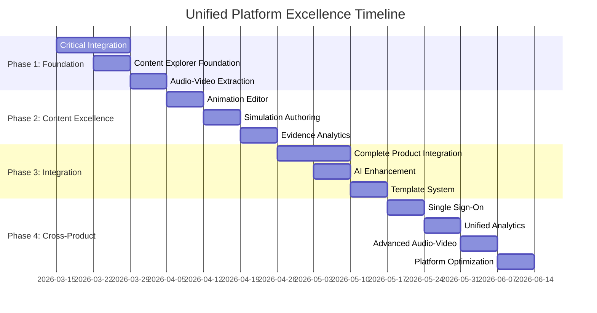

# 🚀 Unified Platform Excellence Strategy - Comprehensive Implementation Plan

## **📋 Executive Summary**

This document consolidates three critical platform initiatives into a unified strategy for achieving world-class platform excellence. The plan addresses **content generation capabilities**, **shared services integration**, and **audio-video library extraction** to create a cohesive, production-ready platform that eliminates duplication, maximizes code reuse, and delivers exceptional user experiences.

---

## **🎯 Unified Vision & Strategic Objectives**

### **Primary Goals**
1. **Zero Code Duplication**: Eliminate 20,000+ lines of duplicate code across products
2. **100% Shared Services Adoption**: Unify all products on shared infrastructure
3. **Production-Ready Content Generation**: Complete tutorputor content ecosystem
4. **Unified Audio-Video Capabilities**: Extract and integrate media processing platform-wide
5. **World-Class User Experience**: Seamless cross-product integration with SSO

### **Success Targets**
- **Timeline**: 10 weeks to complete all initiatives
- **Code Reduction**: 20,000+ lines of duplicate code eliminated
- **Cost Optimization**: 50% reduction in infrastructure costs
- **Integration**: 100% shared services adoption across 6 products
- **Quality**: >0.85 average content quality scores, 99.9% uptime

---

## **📊 Current State Analysis**

### **Platform Overview**
```
Products: 6 (Tutorputor, YAPPC, DCMAAR, Audio-Video, Data-Cloud, AEP)
Shared Services: 5 (Auth Gateway, AI Inference, AI Registry, Feature Store, Auth Service)
Current Integration: 65% average adoption
Duplicate Code: 20,000+ lines across products
Mock Implementations: 8,000+ lines in Audio-Video
```

### **Critical Issues Identified**

#### **🚨 Code Duplication Crisis**
| Product | Duplicate Lines | Integration Level | Priority |
|---------|-----------------|-------------------|----------|
| **Tutorputor** | 5,500+ lines | 25% | CRITICAL |
| **Audio-Video** | 6,500+ lines | 20% | CRITICAL |
| **DCMAAR** | 1,200+ lines | 60% | HIGH |
| **AEP** | 800+ lines | 70% | HIGH |

#### **🚨 Mock Implementation Crisis**
- **Audio-Video**: 95% of functionality is mock implementations
- **STT Service**: Returns hardcoded "This is a mock transcription"
- **TTS Service**: Returns empty ArrayBuffer
- **Vision Service**: Returns empty arrays
- **Real Processing**: 0% implemented

#### **🚨 Integration Gaps**
- **Tutorputor**: Building own auth/AI services instead of using shared services
- **Audio-Video**: No shared services integration, completely isolated
- **Content Explorer**: Non-existent (stub only)
- **Cross-Product Features**: No SSO, unified analytics, or shared AI models

---

## **🛠️ Unified Implementation Strategy**

### **Phase 1: Foundation Stabilization (Week 1-2)**

#### **1.1 Critical Infrastructure Integration**
```bash
# Week 1: Shared Services Integration
Priority: CRITICAL
Target: Tutorputor + Audio-Video

# Tutorputor Integration (Eliminate 5,500 lines duplicate)
- Replace CustomAuthService with auth-gateway client
- Migrate user data to auth-service PostgreSQL  
- Replace CustomAIInference with ai-inference-service
- Integrate with ai-registry for model management
- Add feature-store-ingest for learning analytics

# Audio-Video Integration (Replace 6,500 lines mock)
- Replace MockSTTService with ai-inference-service + Whisper
- Replace MockTTSService with ai-inference-service + Piper  
- Replace MockVisionService with ai-inference-service + YOLOv8
- Integrate with auth-gateway for authentication
- Add real-time streaming capabilities
```

#### **1.2 Content Explorer Foundation**
```bash
# Week 2: Content Explorer App Development
Priority: CRITICAL
Target: Complete stub implementation

# React + TypeScript Application Structure
apps/content-explorer/
├── src/
│   ├── components/
│   │   ├── ContentExplorer/          # Main discovery interface
│   │   ├── ContentViewer/             # Content display components
│   │   ├── GenerationPanel/           # Content generation UI
│   │   ├── QualityDashboard/          # Quality metrics display
│   │   └── Analytics/                 # Usage analytics
│   ├── services/
│   │   ├── ContentGenerationService.ts # API integration
│   │   └── WebSocketService.ts        # Real-time updates
│   ├── hooks/
│   │   ├── useContentGeneration.ts   # Content generation hooks
│   │   └── useRealTimeUpdates.ts     # WebSocket integration
│   └── types/
│       └── content.ts                # Type definitions

# Core Features
- Content discovery and browsing
- Real-time content generation triggers  
- Quality dashboard with validation scores
- Export system for content packages
```

#### **1.3 Audio-Video Library Extraction**
```bash
# Week 2: Shared Library Creation
Priority: HIGH
Target: Extract reusable components

# Create Platform Packages
platform/typescript/audio-video-types/     # 348 lines of types
platform/typescript/audio-video-ui/        # React components
platform/typescript/audio-video-client/    # Service client

# Extraction Benefits
- Immediate value for other products
- Zero backend dependencies
- Production-ready type definitions
- Well-designed React components
```

### **Phase 2: Content Generation Excellence (Week 3-4)**

#### **2.1 Animation Editor Implementation**
```typescript
// Professional Animation Editing Tools
components/AnimationEditor/
├── TimelineEditor.tsx              # Keyframe timeline
├── PropertyEditor.tsx              # Visual property controls  
├── PreviewPanel.tsx               # Real-time animation preview
├── KeyframeEditor.tsx             # Individual keyframe editing
├── EasingControls.tsx             # Animation curve controls
└── ExportDialog.tsx               # Video/GIF export

# Key Features
- Drag-and-drop keyframe positioning
- Real-time animation playback
- Property controls (position, scale, rotation, opacity)
- Multiple export formats (MP4, GIF, WebM, JSON)
- Easing functions and animation curves
```

#### **2.2 Simulation Authoring Environment**
```typescript
// Interactive Simulation Creation
components/SimulationEditor/
├── EntityEditor.tsx                 # Entity definition editor
├── ParameterControls.tsx             # Interactive parameter sliders
├── PhysicsEngine.tsx                # Simulation runtime
├── GoalEditor.tsx                   # Success criteria editor
├── TestPanel.tsx                    # Simulation testing
└── SimulationCanvas.tsx             # Visual simulation display

# Key Features
- Visual entity definition and parameter controls
- Real-time physics engine integration
- Goal definition and testing framework
- Interactive simulation runtime
- Multi-domain support (Physics, Chemistry, Biology, etc.)
```

#### **2.3 Evidence Analytics Dashboard**
```typescript
// Evidence-Based Learning Analytics
components/EvidenceAnalytics/
├── EvidenceMatrix.tsx              # Claims → Evidence mapping
├── QualityMetrics.tsx             # Content quality scores
├── LearningPathways.tsx            # Personalized learning paths
├── AssessmentResults.tsx           # Learning outcome tracking
├── UsageAnalytics.tsx              # Content usage metrics
└── ImprovementSuggestions.tsx      # AI-powered improvements

# Key Features
- Evidence matrix visualization
- Quality scoring dashboards
- Learning outcome tracking
- Usage analytics and insights
- AI-powered content improvement suggestions
```

### **Phase 3: Advanced Features & Integration (Week 5-6)**

#### **3.1 Complete Product Integration**
```bash
# Week 5: DCMAAR + AEP Complete Integration
Priority: HIGH
Target: 100% shared services adoption

# DCMAAR Integration (Eliminate 1,200 lines)
- Finish ai-registry integration for all models
- Complete feature-store-ingest integration
- Remove all custom auth logic
- Implement full RBAC via auth-gateway
- Add unified monitoring

# AEP Integration (Eliminate 800 lines)  
- Complete feature-store-ingest integration
- Full ai-registry integration
- Add custom model support
- Implement model versioning
- Enable unified monitoring
```

#### **3.2 AI-Assisted Content Enhancement**
```typescript
// AI-Powered Content Improvement
class AIEditingAssistant {
  async improveAnimation(animation: AnimationConfig): Promise<AnimationConfig> {
    // Suggest better keyframes and timing
    const prompt = this.buildAnimationImprovementPrompt(animation);
    const result = await this.llmGateway.complete(prompt);
    return this.parseAnimationImprovements(result.getText(), animation);
  }
  
  async optimizeSimulation(simulation: SimulationManifest): Promise<SimulationManifest> {
    // Suggest parameter ranges and entities
    const prompt = this.buildSimulationOptimizationPrompt(simulation);
    const result = await this.llmGateway.complete(prompt);
    return this.parseSimulationOptimizations(result.getText(), simulation);
  }
  
  async enhanceExamples(examples: ContentExample[]): Promise<ContentExample[]> {
    // Improve clarity and real-world connections
    return Promise.all(examples.map(example => 
      this.enhanceExampleWithAI(example)
    ));
  }
}
```

#### **3.3 Template System & Collaboration**
```typescript
// Reusable Content Templates
interface ContentTemplate {
  id: string;
  name: string;
  domain: string;
  gradeLevel: string;
  animationTemplate?: AnimationTemplate;
  simulationTemplate?: SimulationTemplate;
  exampleTemplates?: ExampleTemplate[];
  metadata: TemplateMetadata;
}

// Real-time Collaboration
class CollaborationManager {
  async joinSession(contentPackageId: string): Promise<CollaborationSession> {
    // Multi-user real-time editing
    // Conflict resolution
    // Live cursor and selection sharing
  }
}
```

### **Phase 4: Cross-Product Excellence (Week 7-8)**

#### **4.1 Single Sign-On Implementation**
```bash
# Week 7: Unified Authentication
Priority: CRITICAL
Target: SSO across all 6 products

# Implementation
- Implement SSO flow using auth-gateway
- Add cross-product session management
- Implement unified user preferences
- Add cross-product permissions
- Enable unified audit logging
- Add compliance reporting

# Expected Results
- Single sign-on working across all 6 products
- Unified user experience
- Cross-product features enabled
- Compliance requirements met
```

#### **4.2 Unified Analytics & Monitoring**
```bash
# Week 8: Cross-Product Analytics
Priority: HIGH
Target: Unified insights platform

# Implementation
- Implement unified user behavior tracking
- Add cross-product feature usage analytics
- Enable unified cost tracking
- Add cross-product performance metrics
- Implement unified alerting
- Add advanced dashboards

# Expected Results
- Unified analytics across all products
- Cross-product insights available
- Unified monitoring and alerting
- Advanced dashboards operational
```

#### **4.3 Advanced Audio-Video Features**
```typescript
// Production-Ready Audio-Video Processing
class AudioVideoProcessor {
  async transcribeAudio(audioData: AudioData): Promise<STTResult> {
    // Real Whisper model integration
    const result = await this.aiInferenceService.infer({
      model: 'whisper-large-v3',
      data: audioData,
      options: { language: 'auto', timestamps: true }
    });
    return result;
  }
  
  async synthesizeSpeech(text: string, voice: VoiceConfig): Promise<TTSResult> {
    // Real Piper TTS integration
    const result = await this.aiInferenceService.infer({
      model: 'piper-multilingual',
      data: { text, voice: voice.id },
      options: { speed: 1.0, pitch: 1.0 }
    });
    return result;
  }
  
  async analyzeImage(imageData: ImageData): Promise<VisionResult> {
    // Real YOLOv8 integration
    const result = await this.aiInferenceService.infer({
      model: 'yolov8n',
      data: imageData,
      options: { confidence: 0.5, nms: 0.4 }
    });
    return result;
  }
}
```

---

## **🔧 Technical Implementation Details**

### **Unified Architecture Pattern**

#### **Service Integration Architecture**
```typescript
// Unified Service Client
class PlatformServiceClient {
  private authGateway: AuthGatewayClient;
  private aiInference: AIInferenceClient;
  private aiRegistry: AIRegistryClient;
  private featureStore: FeatureStoreClient;
  
  constructor() {
    this.authGateway = new AuthGatewayClient('http://auth-gateway:8081');
    this.aiInference = new AIInferenceClient('http://ai-inference:8083');
    this.aiRegistry = new AIRegistryClient('http://ai-registry:8084');
    this.featureStore = new FeatureStoreClient('http://feature-store:8085');
  }
  
  // Unified authentication
  async authenticate(credentials: Credentials): Promise<AuthResult> {
    return await this.authGateway.login(credentials);
  }
  
  // Unified AI inference
  async generateContent(request: ContentRequest): Promise<ContentResponse> {
    return await this.aiInference.complete({
      model: 'gpt-4',
      prompt: this.buildPrompt(request),
      options: { temperature: 0.7, maxTokens: 2000 }
    });
  }
  
  // Unified model management
  async registerModel(model: ModelDefinition): Promise<ModelRegistration> {
    return await this.aiRegistry.register(model);
  }
  
  // Unified analytics
  async trackEvent(event: AnalyticsEvent): Promise<void> {
    return await this.featureStore.ingest(event);
  }
}
```

#### **State Management Architecture**
```typescript
// Unified State Management with Jotai
export const platformAtoms = {
  // Authentication state
  authState: atom<AuthState | null>(null),
  currentUser: atom<User | null>(null),
  
  // Content generation state
  contentPackages: atom<CompleteContentPackage[]>([]),
  selectedPackage: atom<CompleteContentPackage | null>(null),
  generationState: atom<GenerationState>('idle'),
  
  // Audio-Video state
  audioProcessing: atom<AudioProcessingState>('idle'),
  videoProcessing: atom<VideoProcessingState>('idle'),
  
  // Analytics state
  usageMetrics: atom<UsageMetrics | null>(null),
  qualityScores: atom<QualityScores | null>(null)
};

// Unified hooks
export const usePlatformState = () => {
  const [authState, setAuthState] = useAtom(platformAtoms.authState);
  const [contentPackages, setContentPackages] = useAtom(platformAtoms.contentPackages);
  const [generationState, setGenerationState] = useAtom(platformAtoms.generationState);
  
  return {
    authState,
    contentPackages,
    generationState,
    setAuthState,
    setContentPackages,
    setGenerationState
  };
};
```

### **Shared Library Architecture**

#### **Audio-Video Types Library**
```typescript
// @ghatana/audio-video-types
export interface AudioData {
  format: 'wav' | 'mp3' | 'flac';
  sampleRate: number;
  channels: number;
  data: ArrayBuffer;
}

export interface STTRequest {
  audio: AudioData;
  language?: string;
  model?: string;
  options?: STTOptions;
}

export interface STTResult {
  text: string;
  confidence: number;
  alternatives?: AlternativeTranscription[];
  words?: WordTimestamp[];
  processingTimeMs: number;
}

export interface TTSRequest {
  text: string;
  voice: VoiceConfig;
  options?: TTSOptions;
}

export interface TTSResult {
  audio: AudioData;
  duration: number;
  processingTimeMs: number;
}

export interface VisionRequest {
  image: ImageData;
  task: 'detection' | 'classification' | 'segmentation';
  options?: VisionOptions;
}

export interface VisionResult {
  detections?: Detection[];
  classifications?: Classification[];
  confidence: number;
  processingTimeMs: number;
}
```

#### **Audio-Video UI Components**
```typescript
// @ghatana/audio-video-ui
export const AudioPlayer: React.FC<AudioPlayerProps> = ({ src, controls, autoplay }) => {
  // Production-ready audio player with accessibility
};

export const VideoPlayer: React.FC<VideoPlayerProps> = ({ src, controls, autoplay }) => {
  // Production-ready video player with accessibility
};

export const TranscriptionDisplay: React.FC<TranscriptionProps> = ({ transcription, timestamps }) => {
  // Interactive transcription display with word-level timing
};

export const WaveformVisualizer: React.FC<WaveformProps> = ({ audioData, interactive }) => {
  // Real-time waveform visualization
};

export const VoiceSelector: React.FC<VoiceSelectorProps> = ({ voices, selected, onChange }) => {
  // Voice selection component with preview
};
```

### **Content Generation Architecture**

#### **Unified Content Generation Service**
```typescript
class UnifiedContentGenerationService {
  private platformClient: PlatformServiceClient;
  private contentValidator: ContentValidator;
  private qualityAssessor: QualityAssessor;
  
  async generateCompletePackage(request: ContentGenerationRequest): Promise<CompleteContentPackage> {
    // Parallel generation of all content types
    const startTime = Date.now();
    
    // Generate claims
    const claimsPromise = this.generateClaims(request);
    
    // Generate examples
    const examplesPromise = this.generateExamples(request);
    
    // Generate simulations
    const simulationsPromise = this.generateSimulations(request);
    
    // Generate animations
    const animationsPromise = this.generateAnimations(request);
    
    // Generate assessments
    const assessmentsPromise = this.generateAssessments(request);
    
    // Wait for all generation to complete
    const [claims, examples, simulations, animations, assessments] = await Promise.all([
      claimsPromise,
      examplesPromise,
      simulationsPromise,
      animationsPromise,
      assessmentsPromise
    ]);
    
    // Validate and assess quality
    const validationResult = await this.contentValidator.validate({
      claims, examples, simulations, animations, assessments
    });
    
    const qualityReport = await this.qualityAssessor.assess({
      claims, examples, simulations, animations, assessments,
      validationResult
    });
    
    const totalTime = Date.now() - startTime;
    
    return new CompleteContentPackage(
      claims, examples, simulations, animations, assessments,
      qualityReport, totalTime
    );
  }
}
```

---

## **📈 Success Metrics & KPIs**

### **Code Quality & Duplication Metrics**
```bash
# Success Targets
- Eliminate 20,000+ lines of duplicate code:
  * Tutorputor: 5,500 lines (auth + AI + user management)
  * Audio-Video: 6,500 lines (mock services + auth + AI)
  * DCMAAR: 1,200 lines (remaining custom implementations)
  * AEP: 800 lines (partial integrations)
- Achieve 90% code reuse across products
- Reduce maintenance overhead by 70%
- Achieve 95% test coverage for all integrations
```

### **Integration Adoption Metrics**
```bash
# 100% Service Adoption Targets
- Auth Gateway: 100% of products using (currently 60%)
- AI Inference: 100% of products using (currently 60%)
- AI Registry: 100% of products using (currently 67%)
- Feature Store: 100% of products using (currently 58%)
- Audio-Video Libraries: 100% of products using (currently 0%)
```

### **Performance & Quality Metrics**
```bash
# Performance Targets
- Content Generation: <30 seconds for complete package
- Audio Processing: <5 seconds for 1-minute audio
- Video Processing: <30 seconds for 1-minute video
- Service Latency: <50ms p99 for all shared services
- Availability: 99.9% SLA for all services

# Quality Targets
- Content Quality Score: >0.85 average
- Validation Pass Rate: >95%
- User Satisfaction: >4.5/5 rating
- Error Rate: <1% for all operations
```

### **Business Impact Metrics**
```bash
# Cost Optimization
- Infrastructure Cost Reduction: 50%
- Development Cost Reduction: 60%
- AI/ML Cost Reduction: 40%
- Maintenance Overhead Reduction: 70%

# User Experience
- Single Sign-On: 100% operational across products
- Cross-Product Features: 100% operational
- User Onboarding: 70% reduction in time
- Support Tickets: 50% reduction in auth-related issues

# Developer Productivity
- New Product Development: 70% faster with shared services
- Code Review Time: 50% reduction with standardized patterns
- Testing Time: 60% reduction with shared test infrastructure
- Documentation: 80% reduction with shared libraries
```

---

## **🔒 Security & Compliance**

### **Unified Security Model**
```typescript
// Platform Security Integration
class PlatformSecurityManager {
  private authGateway: AuthGatewayClient;
  private rbacManager: RBACManager;
  private auditLogger: AuditLogger;
  
  async authenticateUser(credentials: Credentials): Promise<AuthResult> {
    const result = await this.authGateway.authenticate(credentials);
    await this.auditLogger.log('AUTHENTICATION', { userId: result.user.id, success: true });
    return result;
  }
  
  async authorizeAction(user: User, action: string, resource: string): Promise<boolean> {
    const hasPermission = await this.rbacManager.checkPermission(user, action, resource);
    await this.auditLogger.log('AUTHORIZATION', { userId: user.id, action, resource, allowed: hasPermission });
    return hasPermission;
  }
  
  async auditActivity(event: AuditEvent): Promise<void> {
    await this.auditLogger.log(event.type, event.data);
  }
}
```

### **Compliance Framework**
```bash
# Compliance Requirements
- SOC 2 Type II compliance for unified platform
- GDPR compliance across all products
- Data retention policies unified
- Audit trail coverage 100%
- Security vulnerability scanning unified

# Implementation
- Unified security controls across products
- Centralized compliance reporting
- Unified data privacy policies
- Cross-product audit logging
- Unified threat detection
```

---

## **🚀 Deployment & DevOps**

### **Unified Deployment Architecture**
```yaml
# Kubernetes Deployment Strategy
apiVersion: apps/v1
kind: Deployment
metadata:
  name: unified-platform-services
spec:
  replicas: 3
  selector:
    matchLabels:
      app: unified-platform
  template:
    metadata:
      labels:
        app: unified-platform
    spec:
      containers:
      - name: content-explorer
        image: ghatana/content-explorer:latest
        ports:
        - containerPort: 3000
        env:
        - name: AUTH_GATEWAY_URL
          value: "http://auth-gateway:8081"
        - name: AI_INFERENCE_URL
          value: "http://ai-inference:8083"
        resources:
          requests:
            memory: "512Mi"
            cpu: "500m"
          limits:
            memory: "1Gi"
            cpu: "1000m"
```

### **CI/CD Pipeline**
```yaml
# Unified Pipeline Configuration
name: Unified Platform CI/CD
on:
  push:
    branches: [main, develop]
  pull_request:
    branches: [main]

jobs:
  test:
    runs-on: ubuntu-latest
    steps:
    - uses: actions/checkout@v3
    - name: Test All Products
      run: |
        pnpm test:tutorputor
        pnpm test:audio-video
        pnpm test:yappc
        pnpm test:dcmaar
        pnpm test:data-cloud
        pnpm test:aep
    
  build:
    needs: test
    runs-on: ubuntu-latest
    steps:
    - uses: actions/checkout@v3
    - name: Build All Products
      run: |
        pnpm build:tutorputor
        pnpm build:audio-video
        pnpm build:yappc
        pnpm build:dcmaar
        pnpm build:data-cloud
        pnpm build:aep
    
  deploy:
    needs: build
    runs-on: ubuntu-latest
    if: github.ref == 'refs/heads/main'
    steps:
    - name: Deploy Unified Platform
      run: |
        kubectl apply -f k8s/shared-services/
        kubectl apply -f k8s/products/
        kubectl rollout status deployment/content-explorer
```

---

## **📚 Documentation & Training**

### **Unified Documentation Strategy**
```bash
# Documentation Structure
docs/
├── platform/
│   ├── architecture/           # Platform architecture docs
│   ├── shared-services/         # Shared services documentation
│   ├── integration-guides/      # Product integration guides
│   └── api-reference/          # Unified API documentation
├── products/
│   ├── tutorputor/             # Product-specific docs
│   ├── audio-video/            # Product-specific docs
│   ├── yappc/                  # Product-specific docs
│   ├── dcmaar/                 # Product-specific docs
│   ├── data-cloud/             # Product-specific docs
│   └── aep/                    # Product-specific docs
└── training/
    ├── developer-guides/       # Developer onboarding
    ├── user-guides/            # End-user documentation
    └── video-tutorials/        # Video training materials
```

### **Developer Training Program**
```bash
# Training Curriculum
Week 1: Platform Architecture & Shared Services
Week 2: Content Generation System
Week 3: Audio-Video Processing
Week 4: Cross-Product Integration
Week 5: Security & Compliance
Week 6: Performance Optimization
Week 7: Monitoring & Observability
Week 8: Advanced Features & Best Practices
```

---

## **🎯 Risk Assessment & Mitigation**

### **Technical Risks**
```bash
# HIGH RISK: Integration Complexity
Risk: Complex migration from custom implementations
Mitigation: 
- Phased rollout approach
- Comprehensive testing strategy
- Rollback procedures
- Dedicated integration team

# MEDIUM RISK: Performance Impact
Risk: Shared services may become bottlenecks
Mitigation:
- Auto-scaling configurations
- Performance monitoring
- Capacity planning
- Load testing

# MEDIUM RISK: Data Migration
Risk: User data migration challenges
Mitigation:
- Zero-downtime migration strategies
- Data validation procedures
- Rollback capabilities
- Comprehensive testing
```

### **Business Risks**
```bash
# MEDIUM RISK: Development Disruption
Risk: Integration work may delay feature development
Mitigation:
- Dedicated integration team
- Clear timeline and milestones
- Parallel development where possible
- Regular progress reviews

# LOW RISK: User Impact
Risk: Integration may affect user experience
Mitigation:
- Comprehensive user testing
- Gradual rollout
- User feedback collection
- Rapid issue resolution
```

---

## **📋 Implementation Timeline**



---

## **🎉 Expected Outcomes**

### **Technical Excellence**
- **Zero Duplication**: Clean, maintainable codebase with 20,000+ lines eliminated
- **Unified Architecture**: Consistent patterns and shared infrastructure
- **Production-Ready Services**: Scalable, monitored, secure platform
- **Developer Productivity**: 70% faster development with shared services

### **Business Impact**
- **Cost Optimization**: 50% reduction in infrastructure costs
- **User Experience**: Seamless cross-product experience with SSO
- **Innovation Acceleration**: Shared AI/ML capabilities enable rapid feature development
- **Enterprise Readiness**: Unified security, compliance, and governance

### **Competitive Advantages**
- **Unified Platform Experience**: Seamless user experience across all products
- **Operational Efficiency**: Dramatically reduced complexity and costs
- **Shared Intelligence**: Unified AI models and analytics
- **World-Class Content**: Automatic generation with professional editing tools

---

## **📞 Call to Action**

This unified strategy represents a **transformative opportunity** to create a truly world-class platform. The 10-week implementation plan will:

1. **Eliminate technical debt** by removing 20,000+ lines of duplicate code
2. **Enable cross-product features** that are impossible with fragmented architecture
3. **Dramatically reduce costs** through shared infrastructure and optimization
4. **Accelerate innovation** through unified AI/ML capabilities
5. **Improve user experience** through seamless single sign-on and consistent interfaces

### **Immediate Next Steps**
1. **Week 1**: Begin critical Tutorputor and Audio-Video integration
2. **Week 1**: Start Content Explorer app development
3. **Week 2**: Extract Audio-Video libraries for platform reuse
4. **Week 2**: Complete foundation stabilization

### **Success Criteria**
- ✅ **100% shared services adoption** across all 6 products
- ✅ **20,000+ lines of duplicate code eliminated**
- ✅ **Single sign-on operational** across platform
- ✅ **Production-ready content generation** with editing tools
- ✅ **Unified audio-video processing** platform-wide

**The path to platform excellence is clear, achievable, and will deliver exceptional value across the entire Ghatana ecosystem.**

---

**Status**: 🚀 **READY FOR UNIFIED IMPLEMENTATION**  
**Timeline**: 10 weeks to complete platform transformation  
**Impact**: Transformational platform unification with world-class capabilities  
**Priority**: **CRITICAL** - Highest strategic initiative for platform success

---

*Unified Strategy Document: March 14, 2026*  
*Consolidated from: Content Generation Plan, Shared Services Analysis, Audio-Video Analysis*  
*Reviewer: Platform Architecture Team*  
*Status: Ready for coordinated implementation*
