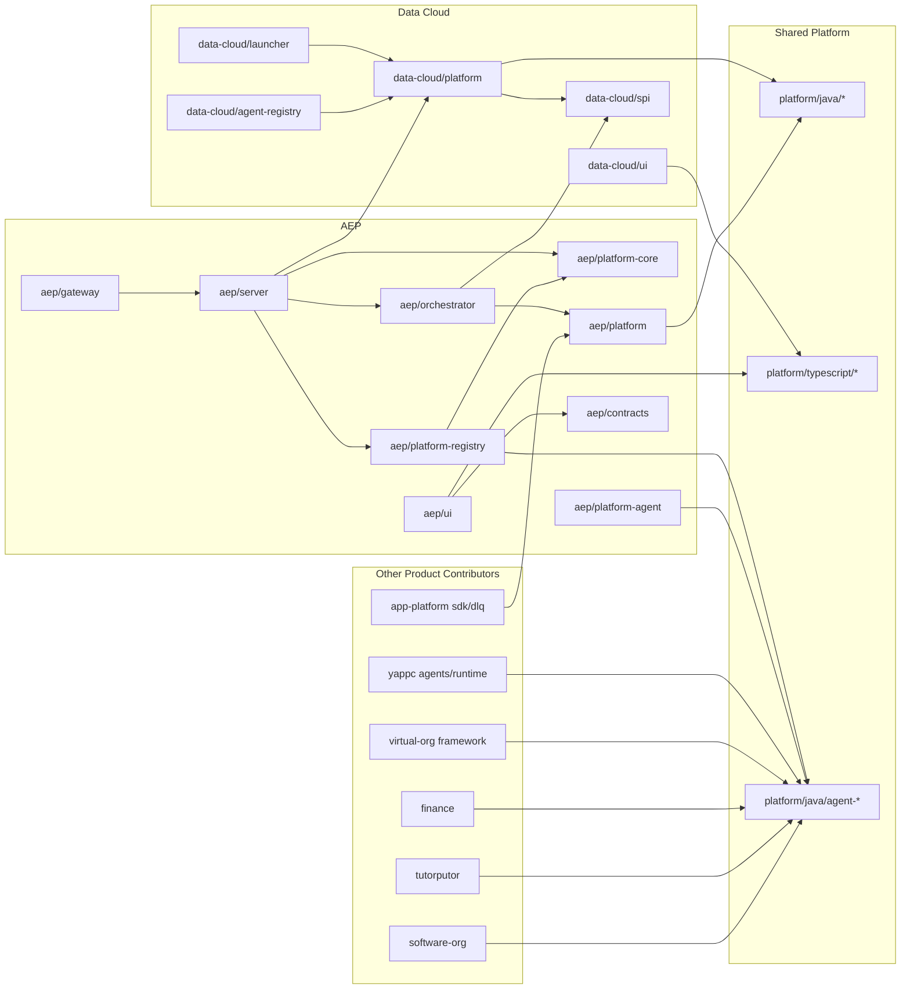

# V2 Consolidated Deep Audit and AEP Runtime Centralization Plan

Date: 2026-03-20  
Repository: `ghatana`  
Primary deep-audit scope: `products/data-cloud`, `products/aep`  
Program-planning extension: cross-product agent runtime centralization dependencies across YAPPC, Software Org, Virtual Org, App Platform, Finance, Tutorputor, and related shared `platform:java:agent-*` modules  
Method: static code inspection, topology reconstruction, targeted build/test execution, delivery verification, ownership analysis, and consolidation of the AEP runtime centralization execution plan

---

## Part 1 - Executive Assessment

### 1. Executive Verdict

The combined V2 release for `data-cloud` and `aep` is **No-Go**.

- `data-cloud` is materially closer to release than `aep`, but it still has a broken UI build path and a launcher analytics contract failure.
- `aep` is not release-ready because its targeted Java build graph is broken, pipeline create/update remain placeholders, and the SSE stream bypasses the stated auth model.
- The **AEP runtime centralization direction is Go**, but only as a controlled program with an immediate governance freeze, explicit migration waves, and no deferred structural debt.

### 2. Executive Risk Summary

| Risk | Severity | Scope | Why it matters |
| --- | --- | --- | --- |
| Public SSE stream bypasses auth and accepts tenant-controlled subscription | P0 | AEP | Cross-tenant event exposure risk |
| AEP backend cannot pass targeted compile/test build | P0 | AEP | Delivery pipeline is not trustworthy |
| Shared `platform:java:agent-*` modules still own runtime-bearing behavior | P0 | AEP program | Runtime ownership remains architecturally ambiguous |
| Product-local registry/catalog duplication persists across products | P1 | Cross-product | Centralization cannot succeed if local runtime ownership survives |
| Pipeline create/update endpoints are placeholders | P1 | AEP | Core UX flow is not backed by durable behavior |
| Data Cloud UI build depends on a missing script | P1 | Data Cloud | Frontend release artifact cannot be reproduced cleanly |
| Workspace `pnpm` commands are blocked by malformed JSON in another package | P1 | Shared delivery | Monorepo build/test workflows are brittle and misleading |
| Data Cloud launcher has a failing analytics contract test | P2 | Data Cloud | API/test contract drift already exists in shipped code |

### 3. Audit Scope and Boundaries

Deep audit, scoring, and file-level inspection were performed for:

- `products/data-cloud/{spi,platform,launcher,agent-registry,ui,docs,helm,terraform}`
- `products/aep/{contracts,platform,platform-core,platform-registry,platform-analytics,platform-security,platform-connectors,platform-agent,platform-api,platform-scaling,orchestrator,server,gateway,ui,docs,helm}`
- Shared libraries directly referenced by those products:
  - `platform/java/{core,domain,database,http,observability,security,testing,connectors,agent-*,workflow,plugin,ai-integration,*}`
  - `platform/typescript/{capabilities/design-system,capabilities/canvas-core,capabilities/canvas-core/flow-canvas,capabilities/realtime-engine,theme,foundation/platform-utils,tokens}`
- Root delivery configuration:
  - [settings.gradle.kts](/Users/samujjwal/Development/ghatana/settings.gradle.kts)
  - [build.gradle.kts](/Users/samujjwal/Development/ghatana/build.gradle.kts)
  - [pnpm-workspace.yaml](/Users/samujjwal/Development/ghatana/pnpm-workspace.yaml)
  - [turbo.json](/Users/samujjwal/Development/ghatana/turbo.json)
  - [.github/CODEOWNERS](/Users/samujjwal/Development/ghatana/.github/CODEOWNERS)

Program-level centralization planning additionally covered referenced agent-runtime surfaces in:

- `products/yappc/core/agents/runtime/*`
- `products/yappc/config/agents/*`
- `products/data-cloud/agent-registry/*`
- `products/virtual-org/modules/framework/*`
- `products/app-platform/kernel/platform-sdk/*`
- `products/app-platform/kernel/dlq-management/*`
- `platform/java/agent-framework/*`
- `platform/java/agent-dispatch/*`
- `platform/java/agent-memory/*`
- `platform/java/agent-learning/*`
- `platform/java/agent-registry/*`

Boundary note:

- `data-cloud` and `aep` received full product/subsystem/module/package/file-level scoring.
- Other products are included here at dependency, ownership, and migration-planning depth, not at the same full audit depth.

### 4. Product Mission and Responsibilities

| Product / Area | Intended mission | Actual responsibility observed |
| --- | --- | --- |
| Data Cloud | Multi-tenant event storage, metadata/entity storage, agent registry, memory plane, analytics, governance-facing data services | Central persistence and integration substrate for other products, especially AEP |
| AEP | Agentic event processing, operator/pipeline orchestration, agent memory access, HITL, monitoring, learning | Workflow/pipeline product with UI, server, orchestration, registry, analytics, security, connectors, and deep Data Cloud dependence |
| Shared `platform:java:agent-*` | Product-agnostic reusable agent abstractions | Still holds runtime-bearing behavior that should be owned by AEP |
| Other products | Product-local agent definitions and logic | Several products still own registry/catalog/runtime-adjacent behavior that conflicts with AEP centralization |

### 5. In-Scope Modules / Packages / Files

| Area | Unit count | Notes |
| --- | ---: | --- |
| `data-cloud/platform` | 586 main code files, 47 test files | Primary backend concentration point |
| `data-cloud/launcher` | 15 main code files, 9 test files | HTTP surface and bootstrap |
| `data-cloud/ui` | 231 main code files, 34 test files | Large UX surface, strong test volume, broken build script |
| `aep/platform-core` | 166 main code files, 46 test files | Core engine surface, test compile currently broken |
| `aep/platform-registry` | 58 main code files, 0 test files | Compile-broken registry layer |
| `aep/orchestrator` | 54 main code files, 15 test files | Separate orchestration layer, moderate test presence |
| `aep/server` | 29 main code files, 21 test files | HTTP/gRPC entry point, heavy responsibility concentration |
| `aep/ui` | 55 main code files, 8 test files | Cleaner than backend, locally healthy |
| `aep/gateway` | 1 main code file, 0 test files | Thin BFF/proxy, no verification coverage |

Critical audited files:

- [DataCloudHttpServer.java](/Users/samujjwal/Development/ghatana/products/data-cloud/launcher/src/main/java/com/ghatana/datacloud/launcher/http/DataCloudHttpServer.java)
- [EmbeddedDataCloudClient.java](/Users/samujjwal/Development/ghatana/products/data-cloud/platform/src/main/java/com/ghatana/datacloud/client/EmbeddedDataCloudClient.java)
- [ConfigRegistry.java](/Users/samujjwal/Development/ghatana/products/data-cloud/platform/src/main/java/com/ghatana/datacloud/config/ConfigRegistry.java)
- [AnalyticsHandler.java](/Users/samujjwal/Development/ghatana/products/data-cloud/launcher/src/main/java/com/ghatana/datacloud/launcher/http/handlers/AnalyticsHandler.java)
- [AepHttpServer.java](/Users/samujjwal/Development/ghatana/products/aep/server/src/main/java/com/ghatana/aep/server/http/AepHttpServer.java)
- [PipelineController.java](/Users/samujjwal/Development/ghatana/products/aep/server/src/main/java/com/ghatana/aep/server/http/controllers/PipelineController.java)
- [SseController.java](/Users/samujjwal/Development/ghatana/products/aep/server/src/main/java/com/ghatana/aep/server/http/controllers/SseController.java)
- [AepAuthFilter.java](/Users/samujjwal/Development/ghatana/products/aep/platform-security/src/main/java/com/ghatana/aep/security/AepAuthFilter.java)
- [AIAgentOrchestrationManagerImpl.java](/Users/samujjwal/Development/ghatana/products/aep/orchestrator/src/main/java/com/ghatana/orchestrator/ai/impl/AIAgentOrchestrationManagerImpl.java)
- [api-client.ts](/Users/samujjwal/Development/ghatana/products/aep/ui/src/lib/api-client.ts)
- [pipeline.api.ts](/Users/samujjwal/Development/ghatana/products/aep/ui/src/api/pipeline.api.ts)
- [YAPPCAgentRegistry.java](/Users/samujjwal/Development/ghatana/products/yappc/core/agents/runtime/src/main/java/com/ghatana/yappc/agent/YAPPCAgentRegistry.java)
- [YappcAgentCatalog.java](/Users/samujjwal/Development/ghatana/products/yappc/core/agents/runtime/src/main/java/com/ghatana/yappc/agent/catalog/YappcAgentCatalog.java)
- [YamlAgentCatalogLoader.java](/Users/samujjwal/Development/ghatana/platform/java/agent-registry/src/main/java/com/ghatana/agent/registry/YamlAgentCatalogLoader.java)
- [AgentRegistryHttpServer.java](/Users/samujjwal/Development/ghatana/products/aep/platform-agent/src/main/java/com/ghatana/agent/registry/AgentRegistryHttpServer.java)
- [AgenticDataProcessor.java](/Users/samujjwal/Development/ghatana/products/data-cloud/platform/src/main/java/com/ghatana/datacloud/processing/AgenticDataProcessor.java)

### 6. High-Level Readiness Assessment

| Scope | Build health | Test health | Security posture | Architecture posture | Readiness |
| --- | --- | --- | --- | --- | --- |
| Data Cloud | Mixed | Mixed-positive | Moderate | Powerful but overloaded | No-Go today, close to staging after focused fixes |
| AEP | Broken | Fragmented | Weak in one critical area | Target shape is good, implementation is incomplete | No-Go |
| AEP runtime centralization program | Directionally correct | Not yet enforceable | Neutral-positive | Necessary | Go only with phased execution and hard guardrails |

---

## Part 2 - Product & Dependency Topology

### 7. Product Topology Reconstruction



### 8. Internal Dependency Map

| Consumer | Dependency | Type | Evidence | Assessment |
| --- | --- | --- | --- | --- |
| `aep/orchestrator` | `products:data-cloud:spi` | Gradle API | [products/aep/orchestrator/build.gradle.kts](/Users/samujjwal/Development/ghatana/products/aep/orchestrator/build.gradle.kts) | Acceptable integration seam |
| `aep/server` | `products:data-cloud:platform` | Gradle implementation | [products/aep/server/build.gradle.kts](/Users/samujjwal/Development/ghatana/products/aep/server/build.gradle.kts) | Too deep; couples AEP to Data Cloud implementation instead of SPI |
| `aep/platform` | many `platform/java/*` modules + `data-cloud:spi` | Aggregator | [products/aep/platform/build.gradle.kts](/Users/samujjwal/Development/ghatana/products/aep/platform/build.gradle.kts) | Misleading module name; no source, only resources + re-export role |
| `aep/platform-registry` | shared runtime-heavy `platform:java:agent-*` | Gradle implementation | [products/aep/platform-registry/build.gradle.kts](/Users/samujjwal/Development/ghatana/products/aep/platform-registry/build.gradle.kts) | Confirms AEP runtime ownership is incomplete |
| `data-cloud/ui` | `@ghatana/design-system`, `@ghatana/flow-canvas`, `@ghatana/theme`, `@ghatana/realtime` | TS workspace deps | [products/data-cloud/ui/package.json](/Users/samujjwal/Development/ghatana/products/data-cloud/ui/package.json) | Good reuse intent, but build path is fragile |
| `aep/ui` | shared TS libs declared, barely used | TS workspace deps | [products/aep/ui/package.json](/Users/samujjwal/Development/ghatana/products/aep/ui/package.json) | Shared platform reuse is shallow/inconsistent |
| YAPPC runtime | product-local registry/catalog classes | direct code ownership | [YAPPCAgentRegistry.java](/Users/samujjwal/Development/ghatana/products/yappc/core/agents/runtime/src/main/java/com/ghatana/yappc/agent/YAPPCAgentRegistry.java), [YappcAgentCatalog.java](/Users/samujjwal/Development/ghatana/products/yappc/core/agents/runtime/src/main/java/com/ghatana/yappc/agent/catalog/YappcAgentCatalog.java) | Direct conflict with target ownership model |
| Data Cloud runtime integration | reflection-based AEP bridge | implementation detail | [AgenticDataProcessor.java](/Users/samujjwal/Development/ghatana/products/data-cloud/platform/src/main/java/com/ghatana/datacloud/processing/AgenticDataProcessor.java) | Ambiguous runtime contract |

### 9. Platform Integration Map

| Integration | Product / Program | Where | Purpose | Risk |
| --- | --- | --- | --- | --- |
| Data Cloud API / SPI | AEP | server, orchestrator, platform | pipelines, analytics, memory, event log | High coupling |
| Kafka / event streaming | Data Cloud, AEP | Data Cloud plugins, AEP orchestration | event sourcing / event transport | Operational complexity |
| PostgreSQL | Both | migrations, stores, Hikari/Flyway usage | durable storage | Moderate |
| ClickHouse | Data Cloud | analytics connectors | analytical queries | Moderate |
| OpenSearch | Data Cloud | search/query handlers | text/search endpoints | Moderate |
| SSE | AEP, Data Cloud | server HTTP layers | live event updates | High risk in AEP due auth gap |
| AEP runtime APIs | YAPPC, Data Cloud, Virtual Org, App Platform, others | planned central integration seam | central registry/runtime ownership | High change-management risk if not standardized |
| Helm / K8s / Terraform | Both | `helm`, `k8s`, `terraform` | deployment | Useful only if build graph is healthy |

### 10. Third-Party Dependency Map

| Category | Libraries | Product usage | Notes |
| --- | --- | --- | --- |
| Java async/runtime | ActiveJ | Both backends | Strong common runtime choice |
| Persistence | Hibernate, Flyway, Hikari, PostgreSQL, H2 | Both backends | Mature stack, but dependency declarations are incomplete in AEP modules |
| Streaming / messaging | Kafka client, RabbitMQ, AWS SQS | Data Cloud, AEP connectors | Broad integration surface |
| Analytics / search | ClickHouse, OpenSearch, Trino, LangChain4j | Data Cloud, AEP | Powerful but heavy |
| Frontend | React 19, React Router, TanStack Query, Jotai, xyflow | Both UIs | Good modern baseline |
| BFF / proxy | Fastify, `ws` | AEP gateway | Thin layer, no tests |
| Agent centralization | Java SPI, YAML manifests | cross-product runtime plan | Governance quality matters more than library count |

### 11. Ownership Model

| Path / Area | Declared owners | Audit view |
| --- | --- | --- |
| `/products/aep/` | `@ghatana/aep-team` | Too coarse for product size and module count |
| `/products/data-cloud/platform/` | `@ghatana/data-team` | Reasonable, but high concentration risk |
| `/products/data-cloud/ui/` | `@ghatana/data-team @ghatana/frontend-team` | Stronger shared ownership model |
| `/products/data-cloud/agent-registry/` | `@ghatana/data-team @ghatana/agent-team` | Good cross-functional ownership today, but target runtime ownership should move to AEP |
| `/platform/typescript/` | `@ghatana/frontend-team @ghatana/platform-team` | Correct for shared frontend platform |
| Shared `platform:java:agent-*` | platform ownership implied | Needs formal shrink-to-contract plan |
| Product-local registries/catalogs | product teams | Should become migration debt with explicit retirement owners |

### 12. Product vs Shared Responsibility Matrix

| Concern | Product-owned target | Shared-owned target | Current condition |
| --- | --- | --- | --- |
| Pipeline orchestration | AEP orchestrator/server | shared contracts only | Over-coupled |
| Event persistence | Data Cloud platform/launcher | `platform/java/{database,observability}` | Clearer ownership |
| Agent runtime | AEP only | shared API/SPI only | Still split across AEP, shared platform, and products |
| Agent registry/admin APIs | AEP server/platform-registry | none beyond SPI | Split across shared modules and product-local patterns |
| Agent definitions/assets | Each product | shared schema/tooling only | Inconsistent product layouts |
| Product logic providers | Each product | shared SPI only | Not standardized yet |
| UI primitives | Product UIs | design-system/theme/canvas/platform-utils | Data Cloud uses them more effectively than AEP |
| Contracts | AEP contracts, Data Cloud docs/openapi | generator tooling | AEP drift risk due duplicate runtime copy |

---

## Part 3 - Deep Quality Audit

### 13. Product Architecture Audit

Data Cloud:

- Strength: strong substrate role, broad backend capability set, clear shared-platform reuse.
- Weakness: `platform` has become a catch-all module with 586 main code files and multiple 800-1600 LOC classes, so bounded contexts are not actually bounded.
- Weakness: `launcher` is still carrying too much HTTP orchestration; [DataCloudHttpServer.java](/Users/samujjwal/Development/ghatana/products/data-cloud/launcher/src/main/java/com/ghatana/datacloud/launcher/http/DataCloudHttpServer.java) is 2033 LOC even after handler extraction.

AEP:

- Strength: the intended split into `platform-core`, `platform-registry`, `platform-analytics`, `platform-security`, `orchestrator`, and `server` is directionally correct.
- Weakness: the split is not operationally complete; build declarations do not support the code that the modules contain.
- Weakness: [products/aep/platform/build.gradle.kts](/Users/samujjwal/Development/ghatana/products/aep/platform/build.gradle.kts) describes a "platform" module, but the module has no Java sources and acts as a dependency/resource aggregator. That naming obscures the real architecture.

Centralization program:

- AEP is already the runtime owner in intent, but not yet in enforceable implementation.
- Shared `platform:java:agent-*` modules still carry execution, catalog, memory, learning, and registry behavior that should not remain steady-state shared runtime.
- Product-local registry/catalog ownership in YAPPC and hybrid integration patterns in Data Cloud and App Platform show the current runtime model is not singular.
- The correct consolidation rule is: contracts stay shared, runtime moves to AEP, products contribute definitions/assets/logic only.

### 14. Frontend Audit

Data Cloud UI:

- Broad, feature-rich surface with 231 main code files and 34 test files.
- Strong local type-check and test results, but `npm run build` fails because [products/data-cloud/ui/package.json:8](/Users/samujjwal/Development/ghatana/products/data-cloud/ui/package.json#L8) points to a missing script.
- Heavy use of mocks remains in production-facing code shape; [mock-data.ts](/Users/samujjwal/Development/ghatana/products/data-cloud/ui/src/lib/mock-data.ts) is 1062 LOC.

AEP UI:

- Cleaner and smaller than Data Cloud UI.
- Local `type-check`, `test`, and `build` passed.
- Build emits chunk-size warnings and a React Router version/export warning from shared design-system source during bundle generation.
- Contract/codegen path is broken: [products/aep/ui/package.json:17](/Users/samujjwal/Development/ghatana/products/aep/ui/package.json#L17) references `../../contracts/openapi.yaml`, but the real file is `../contracts/openapi.yaml`.

Runtime centralization impact:

- AEP UI should eventually talk to one canonical AEP runtime/admin API surface.
- Product UIs and admin tools should not target product-local registries after centralization.

### 15. Backend Audit

Data Cloud backend:

- `:products:data-cloud:platform:test` is healthy enough to pass in the targeted run.
- `:products:data-cloud:launcher:test` fails 1 of 170 tests due to an analytics response shape mismatch.
- Main risk is structural concentration, not basic buildability.

AEP backend:

- Targeted Gradle run failed before trustworthy testing because `:products:aep:platform-registry:compileJava` and `:products:aep:platform-core:compileTestJava` do not compile.
- [products/aep/platform-registry/build.gradle.kts:13](/Users/samujjwal/Development/ghatana/products/aep/platform-registry/build.gradle.kts#L13) does not declare `platform:java:security`, `platform:java:connectors`, Hikari, or Jedis even though module sources import `SessionManager`, `SessionFilter`, `ConnectorRegistry`, `FileConnector`, and `KafkaConnector`.
- [products/aep/platform-core/build.gradle.kts:37](/Users/samujjwal/Development/ghatana/products/aep/platform-core/build.gradle.kts#L37) does not declare AssertJ, Mockito JUnit, `platform:java:testing`, or JMH test dependencies even though tests import `EventloopTestBase`, AssertJ, and JMH types.
- Many backend modules have zero tests despite non-trivial logic.
- Core server route for pipeline create/update is a stub, not a finished service.

Runtime centralization impact:

- AEP cannot credibly become the sole runtime owner until its own compile/test graph is green.
- Shared agent-runtime implementation cannot be extracted safely until AEP runtime modules are build-stable.

### 16. Data / Contract Audit

| Product / Area | Contract state | Audit assessment |
| --- | --- | --- |
| Data Cloud | Single canonical OpenAPI under `products/data-cloud/docs/openapi.yaml` | Good contract-first posture |
| AEP | Canonical contract under `products/aep/contracts/openapi.yaml`, duplicated runtime copy under `products/aep/server/src/main/resources/openapi.yaml` | Drift risk; copy is only header-different now, but governance is manual |
| Agent centralization | No single canonical `agent-catalog.yaml` across products yet | Must be introduced before multi-product runtime centralization is trustworthy |

### 17. Event / Workflow Audit

- Data Cloud exposes event log, checkpoints, workflows, and memory surfaces coherently.
- AEP workflow runtime is conceptually rich, but registry/server boundaries are unfinished.
- The most visible gap is [PipelineController.java:117](/Users/samujjwal/Development/ghatana/products/aep/server/src/main/java/com/ghatana/aep/server/http/controllers/PipelineController.java#L117): create/update are not actually parsing, validating, or persisting pipeline definitions.
- AEP runtime flow should become: catalog load, validation, provider resolution, materialization, execution, lifecycle management, and results exposure through AEP only.

### 18. Shared Library Usage Audit

| Library | Data Cloud usage | AEP usage | Audit view |
| --- | --- | --- | --- |
| `@ghatana/design-system` | Used in app shell and common components | Minimal visible usage | Underused in AEP |
| `@ghatana/flow-canvas` | Core to topology/workflow UX | Not central | Good reuse by Data Cloud |
| `@ghatana/theme` | Active provider usage | Declared but limited | Inconsistent adoption |
| `platform:java:testing` | Used where declared | Missing where needed in AEP platform-core tests | Shared library is present; module wiring is not |
| `platform:java:connectors` | Used by Data Cloud and AEP platform | Missing declaration in AEP registry even though imports require it | Dependency hygiene issue |
| `platform:java:agent-*` | Used indirectly through registry/runtime surfaces | Used directly by runtime modules | Must be shrunk to API/SPI only |

### 19. Reuse vs Duplication Audit

| Duplicate / overlap | Locations | Impact |
| --- | --- | --- |
| OpenAPI spec copy | `products/aep/contracts/openapi.yaml`, `products/aep/server/src/main/resources/openapi.yaml` | Manual drift risk |
| AEP frontend API layer | `products/aep/ui/src/lib/api-client.ts`, `products/aep/ui/src/api/pipeline.api.ts`, `products/aep/ui/src/api/aep.api.ts` | Multiple base URL/auth behaviors |
| Connector registry concept | `platform/java/connectors/.../ConnectorRegistry.java`, `products/aep/platform-core/.../ConnectorRegistry.java` | Naming collision, conceptual duplication |
| `DataCloudPipelineStore` concept | `products/aep/server/.../DataCloudPipelineStore.java`, `products/aep/platform-registry/.../DataCloudPipelineStore.java` | Confusing ownership, one file is only a moved placeholder |
| Product-local registry/catalog ownership | YAPPC, Data Cloud, shared agent-registry utilities | Prevents single-runtime model |
| Runtime discovery patterns | YAML loaders, product-local bootstraps, reflection-based AEP discovery | Centralization blocked by hybrid loading paths |

### 20. Naming Audit

| Name | Problem | Evidence |
| --- | --- | --- |
| `products/aep/platform` | Sounds like core implementation but is actually resources + dependency aggregator | [products/aep/platform/build.gradle.kts](/Users/samujjwal/Development/ghatana/products/aep/platform/build.gradle.kts) and no Java sources under `src/main/java` |
| `products/data-cloud/platform` | Too generic for a module that contains entity, config, plugins, analytics, deployment, client, API, security-adjacent code | 586 main code files |
| `@aep/api` | Package name implies canonical API, but actual backend API is in Java server and UI usually talks to backend directly | [products/aep/gateway/package.json](/Users/samujjwal/Development/ghatana/products/aep/gateway/package.json) |
| `ConnectorRegistry` | Same name used for materially different abstractions | shared connectors vs runtime adapter |
| `agent-framework` / `agent-registry` in shared platform | Names imply stable shared capabilities, but runtime-bearing implementation is product-domain specific | centralization plan requires shrink-to-contract |

### 21. Module-Level Audit

| Module | Audit summary |
| --- | --- |
| `data-cloud/platform` | Functionally rich, structurally overloaded |
| `data-cloud/launcher` | Good test volume, but one contract regression and oversized server class |
| `data-cloud/ui` | Strong product breadth and tests, but delivery path is broken |
| `aep/platform-core` | Important core logic, but test compile is broken and class sizes are large |
| `aep/platform-registry` | Compile-broken and untested despite being a central boundary |
| `aep/platform-security` | Tiny module with no tests; auth logic contains a critical assumption failure |
| `aep/orchestrator` | Reasonable decomposition, but one 783 LOC hotspot and tight coupling to Data Cloud |
| `aep/server` | Centralizes too much behavior and exposes unfinished CRUD |
| `aep/gateway` | Thin but currently unverified and partially detached from UI behavior |
| `aep/ui` | Best-shaped AEP surface, but contract and integration consistency are weak |
| `platform:java:agent-*` | Too runtime-heavy for a shared layer |
| YAPPC runtime/catalog modules | Duplicative local runtime ownership; first migration target |

### 22. Package-Level Audit

| Package / library | Audit summary |
| --- | --- |
| `@data-cloud/ui` | Mature test surface, weak build reproducibility |
| `@aep/ui` | Locally healthy, but split API/client contract model |
| `@aep/api` | Operationally small, zero tests, mixed package-manager signals |
| `@ghatana/design-system` | Valuable shared package, but router compatibility surfaced during AEP build |
| `@ghatana/theme` | Stable shared foundation |
| `@ghatana/canvas` / `@ghatana/flow-canvas` | High-value reuse for Data Cloud |
| `@ghatana/realtime` | Used in Data Cloud UI but less directly governed in build aliases |
| `platform:java:agent-api` / `agent-spi` target split | Correct target package model; not yet realized |

### 23. File-Level Audit

| File | Responsibility | Naming | Complexity | Cohesion | Testability | Maintainability | Side effects | Security | Notes |
| --- | ---: | ---: | ---: | ---: | ---: | ---: | ---: | ---: | --- |
| `products/data-cloud/launcher/.../DataCloudHttpServer.java` | 4 | 6 | 1 | 3 | 4 | 2 | 3 | 6 | Too much routing, wiring, and optional-feature handling in one class |
| `products/data-cloud/platform/.../EmbeddedDataCloudClient.java` | 5 | 6 | 2 | 4 | 4 | 3 | 5 | 6 | Large facade with fallback logic and broad plugin concerns |
| `products/data-cloud/platform/.../ConfigRegistry.java` | 6 | 7 | 3 | 5 | 5 | 4 | 6 | 6 | Valuable service, but large and stateful |
| `products/data-cloud/launcher/.../AnalyticsHandler.java` | 6 | 7 | 5 | 6 | 7 | 6 | 6 | 7 | Good size, but current output shape breaks test contract |
| `products/data-cloud/ui/src/lib/mock-data.ts` | 3 | 5 | 2 | 3 | 7 | 2 | 9 | 8 | Huge mock-data corpus is carrying too much product behavior |
| `products/data-cloud/ui/src/pages/InsightsPage.tsx` | 5 | 6 | 3 | 4 | 5 | 4 | 7 | 7 | Big UX surface with mixed concerns |
| `products/aep/server/.../AepHttpServer.java` | 4 | 6 | 3 | 4 | 4 | 3 | 4 | 4 | Centralizes too many endpoints and optional dependencies |
| `products/aep/orchestrator/.../AIAgentOrchestrationManagerImpl.java` | 5 | 6 | 2 | 4 | 4 | 3 | 4 | 5 | Large stateful orchestrator hotspot |
| `products/aep/server/.../PipelineController.java` | 3 | 6 | 6 | 5 | 6 | 4 | 5 | 4 | CRUD surface is unfinished |
| `products/aep/platform-security/.../AepAuthFilter.java` | 6 | 7 | 5 | 6 | 6 | 6 | 5 | 1 | Public-path bypass claim does not match downstream enforcement |
| `products/aep/server/.../SseController.java` | 5 | 6 | 5 | 5 | 6 | 5 | 3 | 1 | No auth/tenant authorization in stream setup |
| `products/aep/ui/src/lib/api-client.ts` | 5 | 7 | 6 | 5 | 6 | 5 | 4 | 3 | Absolute-base generated client path diverges from axios client strategy |
| `products/yappc/core/agents/runtime/.../YAPPCAgentRegistry.java` | 4 | 6 | 4 | 4 | 5 | 4 | 5 | 6 | Duplicates runtime ownership that should move to AEP |
| `products/yappc/core/agents/runtime/.../YappcAgentCatalog.java` | 4 | 6 | 4 | 4 | 5 | 4 | 5 | 6 | Product-local catalog loading should be retired |
| `platform/java/agent-registry/.../YamlAgentCatalogLoader.java` | 6 | 7 | 5 | 6 | 6 | 6 | 5 | 7 | Useful seed, but too shared and too narrow for target topology |

### 24. Test Audit

| Area | Test signal | Audit assessment |
| --- | --- | --- |
| Data Cloud backend | `platform` tests pass; `launcher` has 169 passed / 1 failed | Good baseline, one regression visible |
| Data Cloud UI | 19 test files passed, 231 tests passed, 1 skipped | Strong surface, but noisy mocks and `act(...)` warnings reduce trust |
| AEP UI | 7 test files passed, 118 tests passed | Best-tested AEP surface |
| AEP backend | many modules untested, some compile-broken before tests | Not trustworthy |
| Cross-product runtime centralization | No unified conformance suite yet | High program risk until added |

Test gaps table:

| Gap | Area | Consequence |
| --- | --- | --- |
| No tests in `aep/platform-registry` | AEP backend | Central boundary changes are unsafe |
| No SSE authz isolation tests | AEP backend | Critical security behavior regresses silently |
| No central catalog conformance tests | Runtime centralization | Products can drift in layout and schema |
| No provider-resolution tests | Runtime centralization | `implementationRef` contract can rot |
| No gateway tests | AEP gateway | Thin proxy can drift unnoticed |

### 25. Security Audit

Findings:

1. [AepAuthFilter.java:47](/Users/samujjwal/Development/ghatana/products/aep/platform-security/src/main/java/com/ghatana/aep/security/AepAuthFilter.java#L47) explicitly exempts `/events/stream` from authentication and claims the SSE endpoint has its own validation.
2. [SseController.java:51](/Users/samujjwal/Development/ghatana/products/aep/server/src/main/java/com/ghatana/aep/server/http/controllers/SseController.java#L51) accepts any request, resolves tenant from request input, and subscribes the caller without validating identity or tenant membership.
3. [AepAuthFilter.java:80](/Users/samujjwal/Development/ghatana/products/aep/platform-security/src/main/java/com/ghatana/aep/security/AepAuthFilter.java#L80) disables auth entirely when `AEP_JWT_SECRET` is absent.
4. Product-local registries and hybrid runtime bootstraps increase attack surface because registry ownership, validation, and admin surfaces are not singular.

Data Cloud shows better defensive posture:

- request validation tests are extensive in launcher
- rate limiting and body-size controls are present in HTTP layer
- no comparably severe auth bypass was found in sampled Data Cloud surfaces

### 26. Observability Audit

Data Cloud:

- Metrics and observability are widely referenced in platform/launcher code.
- Build/test evidence suggests observability code is integrated into core paths.

AEP:

- Observability exists in naming and module structure, but compile/test health prevents confidence.
- Some modules mention tracing/metrics but have zero tests.

Runtime centralization:

- AEP central runtime should emit one catalog-load report, one provider-resolution report, and one runtime admin audit trail.
- Cross-product conformance reporting should be first-class, not spreadsheet-only.

### 27. Build & Delivery Audit

| Verification command | Result | Meaning |
| --- | --- | --- |
| `./gradlew :products:data-cloud:platform:test :products:data-cloud:launcher:test --continue` | Failed: 169 passed, 1 failed | Data Cloud backend is close, but not green |
| `./gradlew :products:data-cloud:platform:test :products:aep:platform-core:test :products:aep:orchestrator:test :products:aep:server:test --continue` | Failed during AEP compile | AEP backend graph is not releasable |
| `npm run type-check` in `products/data-cloud/ui` | Passed | Local TS health is okay |
| `npm run build` in `products/data-cloud/ui` | Failed | Missing `scripts/ensure-lib-built.js` blocks release build |
| `npm test -- --run` in `products/data-cloud/ui` | Passed with MSW and `act(...)` warnings | Test surface exists, but cleanliness is weak |
| `npm run type-check` in `products/aep/ui` | Passed | Local UI type safety is okay |
| `npm test -- --run` in `products/aep/ui` | Passed | Local UI quality is decent |
| `npm run build` in `products/aep/ui` | Passed with warnings | Bundle is shippable but dependency/version hygiene is weak |
| `npm run build` in `products/aep/gateway` | Passed | Thin gateway compiles locally |
| `pnpm --filter ...` from repo root | Failed | Workspace command path is blocked by malformed JSON outside the products |

Centralization delivery implication:

- Phase 0-2 guardrails must land before migration work scales.
- Phase 1 extraction should not begin as a broad code move before AEP compile health and guardrail scaffolding are in place.

### 28. DevEx Audit

- Root workspace ergonomics are currently broken by malformed JSON in [products/yappc/frontend/libs/component-traceability/package.json:26](/Users/samujjwal/Development/ghatana/products/yappc/frontend/libs/component-traceability/package.json#L26).
- Data Cloud UI build script references a missing helper script, which is a poor developer experience for any fresh checkout.
- AEP mixes root `pnpm` conventions with a nested `package-lock.json` in `products/aep/gateway`, which weakens determinism.
- Agent runtime ownership is hard to reason about because product-local, AEP, and shared agent modules all appear to be valid homes today.

### 29. Performance Audit

- AEP UI production build emits a 554.90 kB chunk and a 373.22 kB route chunk; chunking strategy needs work.
- Data Cloud UI has several 580-1060 LOC frontend files that are likely to create slow edit-test cycles and unnecessary rerenders.
- AEP benchmark tests exist but do not build because JMH dependencies are not declared in `platform-core` test configuration.
- Centralized runtime catalog loading will need startup and validation cost controls once multi-product manifests are enabled.

### 30. UX Flow Audit

Data Cloud:

- Broad admin/operations UX with many pages and test coverage.
- Still carries product behavior in mock layers and partially integrated pages.

AEP:

- UI flows for list/monitoring/HITL are in much better shape than backend delivery.
- Pipeline authoring flow is misleading today because the server-side create/update path is not implemented behind the UI.

Centralization implication:

- Runtime/admin UX should converge on one AEP-managed registry and execution surface.
- Product-specific agent UIs should become consumers of AEP runtime state, not alternate registry fronts.

---

## Part 4 - Scoring

### 31. Product Scorecard

| Dimension | Data Cloud | AEP | Runtime Centralization Program |
| --- | ---: | ---: | ---: |
| Architecture Quality | 6.5 | 4.5 | 6.0 |
| Code Quality | 6.5 | 5.0 | 5.0 |
| Dependency Hygiene | 6.0 | 3.5 | 3.5 |
| Naming Quality | 5.5 | 4.5 | 4.5 |
| Test Coverage | 7.0 | 4.0 | 2.5 |
| Security | 6.5 | 3.5 | 5.0 |
| Observability | 8.0 | 5.5 | 4.0 |
| Delivery Readiness | 5.5 | 3.0 | 4.5 |
| Maintainability | 5.5 | 4.0 | 5.0 |
| Scalability | 7.5 | 5.5 | 7.0 |
| UX Completeness | 7.0 | 6.0 | 4.0 |
| **Overall** | **6.4 / 10** | **4.4 / 10** | **4.8 / 10** |

### 32. Module Scores

| Module | Score | Rationale |
| --- | ---: | --- |
| `data-cloud/spi` | 7.5 | Lean and appropriately scoped |
| `data-cloud/platform` | 6.5 | Powerful but too concentrated |
| `data-cloud/launcher` | 5.5 | Good tests, one failing contract, oversized HTTP layer |
| `data-cloud/agent-registry` | 6.5 | Small and focused, but target runtime role should shrink |
| `data-cloud/ui` | 6.5 | Strong UX/test breadth, weak build reproducibility |
| `aep/contracts` | 6.5 | Good contract-first intent, but duplicated runtime copy |
| `aep/platform` | 4.0 | Misnamed aggregator/resource module |
| `aep/platform-core` | 4.5 | Important core logic, compile/test debt |
| `aep/platform-registry` | 3.0 | Compile-broken and untested |
| `aep/platform-analytics` | 4.5 | Meaningful logic, zero tests |
| `aep/platform-security` | 4.5 | Small, under-tested, contains critical flaw |
| `aep/platform-connectors` | 4.5 | Zero tests |
| `aep/platform-agent` | 5.0 | Small but unverified |
| `aep/platform-api` | 4.5 | Thin, zero tests |
| `aep/platform-scaling` | 4.5 | Thin, zero tests |
| `aep/orchestrator` | 5.0 | Good intent, large hotspot, moderate tests |
| `aep/server` | 4.5 | Too much responsibility, unfinished CRUD |
| `aep/gateway` | 5.5 | Small and builds, but no tests and unclear role |
| `aep/ui` | 7.0 | Best AEP module today |
| shared `platform:java:agent-*` | 4.5 | Useful abstractions, wrong steady-state ownership |
| YAPPC runtime/catalog modules | 3.5 | Clear migration target, not acceptable steady state |

### 33. Package Scores

| Package / shared library | Score | Notes |
| --- | ---: | --- |
| `@data-cloud/ui` | 6.5 | Feature-rich, build script broken |
| `@aep/ui` | 7.0 | Healthy local package, contract path bug |
| `@aep/api` | 5.5 | Thin proxy, no tests |
| `@ghatana/design-system` | 6.0 | Useful, but router/build warning surfaced in AEP build |
| `@ghatana/theme` | 7.5 | Stable foundation |
| `@ghatana/canvas` | 6.5 | Reused well by Data Cloud |
| `@ghatana/flow-canvas` | 7.0 | Valuable shared visualization layer |
| `@ghatana/realtime` | 6.0 | Reused, but build/ownership path is less explicit |
| `platform:java:testing` | 7.5 | Good shared utility, not consistently consumed |
| `platform:java:connectors` | 6.5 | Useful shared package, but AEP registry does not declare it where needed |
| target `platform:java:agent-api` / `agent-spi` | 7.0 | Right target shape, pending extraction |

### 34. File Hotspots

| File | LOC | Hotspot reason |
| --- | ---: | --- |
| `products/data-cloud/launcher/.../DataCloudHttpServer.java` | 2033 | God-class HTTP server |
| `products/data-cloud/platform/.../EmbeddedDataCloudClient.java` | 1655 | Large multi-mode facade |
| `products/data-cloud/platform/.../ConfigRegistry.java` | 1091 | Large stateful config service |
| `products/data-cloud/ui/src/lib/mock-data.ts` | 1062 | Oversized mock-data corpus |
| `products/data-cloud/ui/src/pages/InsightsPage.tsx` | 844 | Large page component |
| `products/aep/server/.../AepHttpServer.java` | 940 | Centralized server/router |
| `products/aep/orchestrator/.../AIAgentOrchestrationManagerImpl.java` | 783 | Stateful orchestrator hotspot |
| `products/aep/platform-core/.../CheckpointCoordinatorImpl.java` | 727 | Large core class |
| `products/aep/platform-core/.../DefaultPipeline.java` | 722 | Large execution primitive |
| `products/aep/ui/src/pages/AgentDetailPage.tsx` | 508 | Largest AEP UI page |

### 35. Delivery Readiness Score

| Scope | Score (/100) | Interpretation |
| --- | ---: | --- |
| Data Cloud | 64 | Fixable release debt; not ready today |
| AEP | 44 | Core release blockers unresolved |
| Combined release | 52 | No-Go |
| AEP runtime centralization program | 48 | Necessary and directionally sound, but preconditions are not yet fully satisfied |

### 36. Risk Hotspots

| Hotspot | Severity | Evidence / implication | Mitigation |
| --- | --- | --- | --- |
| Public SSE auth bypass | P0 | [AepAuthFilter.java:47](/Users/samujjwal/Development/ghatana/products/aep/platform-security/src/main/java/com/ghatana/aep/security/AepAuthFilter.java#L47), [SseController.java:51](/Users/samujjwal/Development/ghatana/products/aep/server/src/main/java/com/ghatana/aep/server/http/controllers/SseController.java#L51) | close the public-path hole, enforce tenant membership, add authz regression tests |
| AEP compile/test graph broken | P0 | targeted Gradle run failed in `platform-registry` and `platform-core` | repair dependency declarations before any large runtime extraction |
| Shared runtime-heavy agent modules | P0 | target ownership split is not yet physically realized | extract shared contract/API first, move runtime second |
| YAPPC local registry/catalog ownership | P1 | [YAPPCAgentRegistry.java](/Users/samujjwal/Development/ghatana/products/yappc/core/agents/runtime/src/main/java/com/ghatana/yappc/agent/YAPPCAgentRegistry.java), [YappcAgentCatalog.java](/Users/samujjwal/Development/ghatana/products/yappc/core/agents/runtime/src/main/java/com/ghatana/yappc/agent/catalog/YappcAgentCatalog.java) | migrate YAPPC first and use compatibility loaders only during transition |
| Pipeline CRUD placeholders | P1 | [PipelineController.java:117](/Users/samujjwal/Development/ghatana/products/aep/server/src/main/java/com/ghatana/aep/server/http/controllers/PipelineController.java#L117) | implement real parse/validate/persist behavior and add endpoint tests |
| Data Cloud UI build path broken | P1 | [products/data-cloud/ui/package.json:8](/Users/samujjwal/Development/ghatana/products/data-cloud/ui/package.json#L8), missing script | restore helper or remove prebuild coupling and gate package build in CI |
| Workspace package JSON malformed | P1 | [products/yappc/frontend/libs/component-traceability/package.json:26](/Users/samujjwal/Development/ghatana/products/yappc/frontend/libs/component-traceability/package.json#L26) | add root JSON validation and fix offending package immediately |
| Reflective AEP discovery in Data Cloud | P1 | ambiguous runtime contract in [AgenticDataProcessor.java](/Users/samujjwal/Development/ghatana/products/data-cloud/platform/src/main/java/com/ghatana/datacloud/processing/AgenticDataProcessor.java) | replace reflection fallback with explicit AEP integration contract |
| Cross-product hybrid states linger | P1 | centralization can stall in partial migration states | enforce no deferred structural debt rule and track each exception to a removal milestone |
| YAML schema and provider drift | P1 | multi-product manifests and providers can diverge silently | central validator, canonical schema, and provider-resolution conformance tests |
| Data Cloud analytics plan response drift | P2 | failing launcher test and [AnalyticsHandler.java:125](/Users/samujjwal/Development/ghatana/products/data-cloud/launcher/src/main/java/com/ghatana/datacloud/launcher/http/handlers/AnalyticsHandler.java#L125) | align response contract and add regression coverage |

### 37. Critical Defects

1. AEP SSE stream is effectively unauthenticated and tenant-selectable.
2. AEP Java backend does not clear a targeted compile/test build.
3. AEP pipeline create/update routes return placeholder responses instead of real persistence.
4. Shared `platform:java:agent-*` modules still carry runtime-bearing implementation, blocking clean ownership.
5. Product-local registry/catalog ownership still exists in YAPPC and adjacent products.
6. Data Cloud UI production build is blocked by a missing prebuild helper script.
7. Root workspace `pnpm` commands are blocked by malformed JSON in an unrelated package.
8. Data Cloud analytics plan endpoint currently disagrees with its test contract.

---

## Part 5 - Target State

### 38. Target Architecture

Target ownership:

- Shared platform keeps only:
  - `platform:java:agent-api`
  - `platform:java:agent-spi`
- AEP owns:
  - `products:aep:platform-core` for public embedded API and engine facade
  - `products:aep:platform-registry` for central registry model, merged catalog index, registry query/admin API, and definition validation
  - `products:aep:platform-agent` for provider resolution, agent factory, instance materialization, and asset resolution
  - `products:aep:orchestrator` for execution queue, dispatch, scheduling, retry, timeout, checkpoint, and recovery
  - `products:aep:server` as the only registry and runtime admin endpoint surface
- Products own only:
  - definitions
  - instances
  - prompts/templates/policies/schemas/eval assets
  - concrete logic classes
  - `AgentLogicProvider` registration

Architecture rules:

- No non-AEP product owns a registry handler, registry API, registry cache as source of truth, catalog bootstrapper, or filesystem scanner for agent definitions.
- No deferred structural debt rule: temporary compatibility is allowed only if it has an explicit owner, removal phase, validation gate, and deletion milestone.

### 39. Dependency Model

Target dependency rules:

- Product-to-product runtime integration prefers contracts/SPI over implementation modules.
- `aep/server` should depend on Data Cloud through interfaces/adapters, not directly on `data-cloud:platform`.
- Shared agent modules shrink toward API/SPI only; execution, discovery, registry endpoints, memory/runtime implementation, learning/runtime implementation, checkpointing, and product/runtime adapters move to AEP.
- Products such as Data Cloud, YAPPC, Virtual Org, App Platform, Finance, Tutorputor, and Software Org compile their logic against shared API/SPI and consume AEP runtime through approved AEP public API or embedded facade.

### 40. Library Usage Model

Frontend:

- One product UI uses one canonical API client stack.
- Shared TS libraries are consumed either from built artifacts or from source aliases consistently.

Backend and runtime:

- Shared Java test utilities must be declared anywhere tests import them.
- `implementationRef` resolves only through provider SPI, never through ad hoc product-local bootstrapping or reflection.
- If a physical split into `agent-api` and `agent-spi` is expensive initially, `platform:java:agent-framework` may survive temporarily but must be actively reduced toward that split.

### 41. Platform Integration Model

Runtime flow:

1. AEP starts.
2. AEP scans configured product catalog roots.
3. AEP validates all catalogs and builds one merged registry index.
4. AEP resolves `implementationRef` through `AgentLogicProvider`.
5. AEP materializes the concrete agent instance.
6. AEP executes and manages lifecycle centrally.
7. Products observe results through AEP APIs, events, or embedded client calls.

Cross-product remediation matrix:

| Product / Area | Current Issue Type | Current Issue | Required Fix |
| --- | --- | --- | --- |
| AEP | Structural | AEP runtime still depends on shared runtime-heavy `platform:java:agent-*` modules | shrink shared platform to API/SPI and move runtime-bearing implementation into AEP |
| AEP | Logical | placeholder or compatibility-only bridge classes remain | implement as real public runtime components or delete/archive |
| YAPPC | Structural | owns `YAPPCAgentRegistry` and `YappcAgentCatalog` | remove both and route through AEP registry and central catalog loading |
| YAPPC | Structural | still uses large `registry.yaml` and parallel catalog structures | converge on `agent-catalog.yaml` entrypoint plus split catalog model |
| YAPPC | Logical | local indexes remain a practical source of truth | convert to derived caches backed by AEP runtime |
| Data Cloud | Structural | owns `DataCloudAgentRegistry` implementation and separate `agent-catalog` conventions | keep only persistence SPI/backend role if needed; move runtime discovery/loading to AEP |
| Data Cloud | Logical | optional reflective AEP loading creates ambiguous runtime contract | replace reflection-based runtime discovery with explicit AEP integration mode |
| Virtual Org | Structural | depends on both shared agent modules and `products:aep:platform` for overlapping concerns | normalize to shared API/SPI plus AEP runtime API only |
| Virtual Org | Logical | TODO boundary for operator/pipeline types remains unresolved | close during migration, not later |
| App Platform | Structural | directly consumes `products:aep:platform` internals from SDK and DLQ modules | replace with approved public API/SPI |
| App Platform | Logical | AEP reuse is implementation reuse, not runtime contract reuse | convert to explicit AEP runtime capability consumption |
| Finance | Structural | directly subclasses shared runtime-oriented base classes | classify as provider-backed logic or keep as local library agents behind shared API only |
| Finance | Logical | product agents assume shared framework is the runtime | make runtime execution path explicit |
| Tutorputor | Structural | directly extends shared base runtime pattern | align with shared API/SPI plus provider registration |
| Tutorputor | Logical | no explicit separation between definitions, assets, and provider-backed logic | adopt canonical layout and provider wiring |
| Software Org | Structural | config-driven agents sit outside a unified layout and loading path | migrate configs into canonical catalog structure loaded by AEP |
| All products | Structural | multiple layouts for definitions and assets | standardize on one product catalog layout |
| All products | Logical | unclear distinction between definition ownership, logic ownership, and runtime ownership | definitions/assets stay in product, runtime stays in AEP, contracts stay shared |

### 42. Naming Model

Target naming rules:

- Rename aggregator/resource modules to what they actually are.
- Use `api`, `runtime`, `registry`, `contracts`, `resources`, `infra`, `ui` according to real responsibility.
- Eliminate duplicate class names for materially different abstractions where possible.
- Shared modules should not use names that imply a stable platform capability when they are temporarily carrying product-domain runtime implementation.

Canonical product layout:

```text
products/<product>/agents/
├── agent-catalog.yaml
├── definitions/
├── instances/
├── prompts/
├── templates/
├── policies/
├── event-schemas/
└── eval/
```

Compatibility adapters may temporarily support:

- `products/yappc/config/agents/`
- `products/data-cloud/agent-catalog/`
- `products/aep/agent-catalog/`

### 43. Test & Delivery Model

Canonical definition model:

- `id`
- `catalog`
- `product`
- `capabilities`
- `executionType`
- `inputSchemaRef`
- `outputSchemaRef`
- `implementationRef`
- `defaultInstanceRef`
- `assetRefs`
- `governance`
- `runtimePolicy`

Example:

```yaml
apiVersion: ghatana.agent/v1
kind: AgentDefinition
metadata:
  id: agent.yappc.java-expert
  product: yappc
spec:
  implementationRef: yappc-java:agent.yappc.java-expert
  runtimePolicy:
    timeout: PT5M
    retries: 2
  inputSchemaRef: event-schemas/engineering-events-v1.json#/javaExpertInput
  outputSchemaRef: event-schemas/engineering-events-v1.json#/javaExpertOutput
  assetRefs:
    - prompts/java-expert.md
    - templates/java-expert/
```

Target test and delivery rules:

- Every backend module with non-trivial code must compile and own at least smoke/unit coverage.
- Root workspace commands must be green before product-level green is considered meaningful.
- Build must fail on contract drift, missing scripts, malformed workspace metadata, missing providers, invalid manifests, and unauthorized product-local registry patterns.
- Product-specific migration acceptance rules:
  - AEP: no runtime-critical behavior remains stranded in shared implementation modules; AEP exposes the only registry/admin/runtime surface.
  - YAPPC: no local registry ownership remains; local indexes are derived views only.
  - Data Cloud: no reflective discovery is required; Data Cloud is either storage backend or AEP client, not parallel runtime owner.
  - Virtual Org: no unresolved hybrid dependence on overlapping AEP internals and shared runtime code remains.
  - App Platform: SDK and kernel modules consume only approved AEP public API/SPI.
  - Finance and Tutorputor: concrete logic compiles against shared API/SPI only; runtime execution path is explicit and documented.

---

## Part 6 - Execution Plan

### 44. Immediate Fixes

1. Remove `/events/stream` from the AEP public-path list or add real authn/authz and tenant membership checks in the SSE path.
2. Fix AEP `platform-registry` dependency declarations for security, connectors, Hikari, Jedis, and related imports.
3. Fix AEP `platform-core` test dependencies for AssertJ, Mockito JUnit, `platform:java:testing`, JMH, and any missing transitive test-runtime dependencies.
4. Replace placeholder create/update behavior in AEP `PipelineController` with real parse/validate/persist flow.
5. Restore or remove Data Cloud UI `prebuild` dependency on `scripts/ensure-lib-built.js`.
6. Fix malformed JSON in `products/yappc/frontend/libs/component-traceability/package.json`.
7. Announce a governance freeze on adding new product-local registries, registry handlers, and catalog bootstrappers.

### 45. Short-Term Plan

Short-term roadmap:

| Horizon | Phase / action | Outcome |
| --- | --- | --- |
| 1-2 days | Make AEP backend compile green | Build becomes trustworthy |
| 1-2 days | Fix Data Cloud analytics plan response shape or adjust contract | Launcher tests go green |
| 1-3 days | Add Phase 0 CI guardrails blocking new product-local registry/catalog duplication | Scope stops expanding |
| 1 week | Fix AEP UI codegen path and automate client generation | Reliable contract consumption |
| 1 week | Unify AEP frontend API clients and env handling | Cleaner UI integration surface |
| 1 week | Create class inventory for `platform:java:agent-*` and classify keep/move/delete | Phase 1 starts with evidence |
| 1-2 weeks | Extract minimal shared API/SPI contract surface | Centralization foundation exists |
| 1-2 weeks | Build central AEP multi-root catalog loader with validation report | One catalog path emerges |

Phase 0: Governance Freeze

- Block new non-AEP `*AgentRegistry`, `*RegistryHandler`, `*AgentCatalog`, `*CatalogLoader`, and direct filesystem scans for agent definitions outside the approved central loader.
- Record existing exceptions:
  - `products/yappc/core/agents/runtime/.../YAPPCAgentRegistry.java`
  - `products/yappc/core/agents/runtime/.../YappcAgentCatalog.java`
  - `products/data-cloud/agent-registry/...`
  - reflective or hybrid runtime bootstraps

Phase 1: Extract Minimal Shared Contract

- Inventory `platform/java/agent-framework`, `agent-dispatch`, `agent-memory`, `agent-learning`, `agent-registry`.
- Classify each class as keep in shared API, keep as shared SPI, move to AEP runtime, or delete/archive.
- Create target modules `platform:java:agent-api` and `platform:java:agent-spi`.
- Produce class-by-class move sheet, updated dependency graph, and product-by-product contract/runtime dependency map.

Phase 1 outputs and completion signals:

| Output | Completion signal |
| --- | --- |
| class-by-class move spreadsheet | every shared agent class is classified keep/move/delete |
| new shared module build files | `agent-api` and `agent-spi` compile |
| updated dependency graph | products compile against API/SPI where intended |
| contract/runtime dependency map | shared platform no longer owns execution, catalog discovery, or registry endpoint logic |

Phase 2: Build Central AEP Catalog Service

- Introduce `agent-catalog.yaml` as the entrypoint.
- Support temporary compatibility for `products/aep/agent-catalog`, `products/data-cloud/agent-catalog`, and `products/yappc/config/agents`.
- Implement merged index building with dedupe, ownership validation, asset/schema validation, and provider-resolution validation.

Phase 2 outputs and completion signals:

| Output | Completion signal |
| --- | --- |
| new AEP multi-root catalog loader | AEP builds one merged catalog from all enabled product roots |
| merged catalog index model | duplicate IDs and ownership conflicts are rejected centrally |
| validation report output | structural issues are surfaced across all products, not only AEP |
| compatibility adapters for legacy layouts | product-local catalog provider classes are no longer required |

### 46. Medium-Term Plan

Medium-term roadmap:

| Horizon | Phase / action | Outcome |
| --- | --- | --- |
| 2-4 weeks | Introduce `AgentLogicProvider` SPI and AEP materializer/factory | Products contribute logic without owning runtime |
| 3-5 weeks | Centralize registry/admin/runtime operations in AEP | One runtime source of truth |
| 4-6 weeks | Wave 1 migration: YAPPC | Largest duplication removed first |
| 4-8 weeks | Refactor `DataCloudHttpServer` and `AepHttpServer` toward transport-only composition | Better separations while migration proceeds |
| 5-10 weeks | Wave 2 migration: Data Cloud, Software Org, Virtual Org, App Platform, Finance, Tutorputor | Cross-product normalization |
| parallel | Add test coverage to currently untested AEP modules | Safer runtime extraction |

Phase 3: Introduce `AgentLogicProvider`

- Provider ID, supported `implementationRef`s or agent IDs, and a factory method.
- Register via Java SPI or explicit DI.
- Update definitions to use `implementationRef`.
- Build AEP factory/materializer to read YAML, resolve provider, load assets, and create concrete logic.

Phase 3 outputs and completion signals:

| Output | Completion signal |
| --- | --- |
| `AgentLogicProvider` interface | provider contract is stable and documented |
| AEP materializer/factory | YAML + provider is sufficient to instantiate a product agent |
| sample providers in YAPPC and one additional product | products no longer need registry bootstrap or private hooks |
| provider validation rules | every `implementationRef` resolves deterministically |

Phase 4: Centralize Registry APIs and Runtime Operations

- Implement registry read/write/query endpoints only in AEP server.
- Standardize lifecycle operations: register, materialize, initialize, health check, execute, shutdown.
- Ensure admin or discovery UIs call AEP, not product-local registries.

Phase 4 outputs and completion signals:

| Output | Completion signal |
| --- | --- |
| AEP registry API contract | one runtime admin surface exists |
| migration notes for consumers | downstream callers have explicit cutover guidance |
| retirement list for product-local endpoints | no product exposes registry APIs directly |

Phase 5: Product Migration Wave 1 - YAPPC

- Replace `registry.yaml`-centric loading with `agent-catalog.yaml` plus split catalogs.
- Remove or deprecate `YAPPCAgentRegistry`, `YappcAgentCatalog`, and any local catalog bootstrap logic.
- Convert logic classes to register through `AgentLogicProvider`.
- Convert local phase/step indexing into derived views over AEP-backed runtime state.

Phase 5 outputs and completion signals:

| Output | Completion signal |
| --- | --- |
| YAPPC provider module | YAPPC logic executes through AEP runtime |
| YAPPC catalog manifest compatible with central loader | YAPPC no longer bootstraps its own catalog |
| updated YAPPC runtime integration tests | one end-to-end YAPPC execution path succeeds through AEP |
| structural cleanup checklist and ownership model | YAPPC has zero product-local registry ownership and no conflicting source of truth |

Phase 6: Product Migration Wave 2

- Data Cloud: keep only persistence backend role if needed, move catalog loading to AEP, replace reflective AEP detection with explicit integration.
- Software Org: migrate config-only agents to canonical layout and provider model if executable.
- Virtual Org: remove hybrid ownership patterns and close operator/pipeline boundary TODOs during migration.
- App Platform: replace direct AEP-internal reuse in SDK and DLQ modules with approved public API/SPI.
- Finance: classify agents as provider-backed logic over shared API/SPI.
- Tutorputor: migrate logic to provider model and canonical asset/layout structure.

### 47. Long-Term Plan

- Phase 7: Remove legacy shared runtime modules after all migration waves are complete.
- Split `data-cloud/platform` into smaller bounded modules: storage/event, entity/config, memory/learning/brain, analytics/search, launcher/api.
- Replace implementation-level cross-product dependencies with stable contract adapters.
- Decide whether `aep/gateway` is required as a first-class product component; otherwise remove it.
- Establish architecture score gates and runtime conformance gates in CI.

### 48. Rename / Move / Delete Plan

| Action | Why |
| --- | --- |
| Rename `products/aep/platform` to `products/aep/resources` or `products/aep/platform-bundle` | Current name is misleading |
| Move runtime-served OpenAPI copy generation under build step | Avoid duplicate contract editing |
| Delete placeholder moved file `products/aep/platform-registry/.../DataCloudPipelineStore.java` after real migration | Remove confusion |
| Consolidate AEP UI API clients into one module | Remove duplicated integration logic |
| Retire `products/yappc/core/agents/runtime/.../YAPPCAgentRegistry.java` | Remove product-local registry ownership |
| Retire `products/yappc/core/agents/runtime/.../YappcAgentCatalog.java` | Remove product-local catalog bootstrap |
| Replace `products/aep/platform-agent/.../AgentRegistryHttpServer.java` with AEP server-owned admin/runtime endpoints | One runtime surface |
| Evolve `platform/java/agent-registry/.../YamlAgentCatalogLoader.java` into an AEP-owned multi-root loader or compatibility adapter | Centralize discovery |
| Remove reflection-based runtime discovery in `products/data-cloud/platform/.../AgenticDataProcessor.java` | Make runtime contract explicit |
| Audit and remove direct internal AEP reuse in App Platform SDK/DLQ modules where public API/SPI replacements exist | Enforce proper boundaries |

First files and modules to evolve:

- `products/aep/platform-registry/*`
- `products/aep/platform-agent/*`
- `products/aep/orchestrator/*`
- `products/yappc/config/agents/*`
- `products/data-cloud/agent-registry/*`
- `products/virtual-org/modules/framework/*`
- `products/app-platform/kernel/platform-sdk/*`
- `products/app-platform/kernel/dlq-management/*`

### 49. Test Improvement Plan

| Gap | Fix |
| --- | --- |
| AEP zero-test modules | Add smoke/unit coverage before feature work |
| AEP SSE auth path | Add authz and tenant-isolation tests |
| Data Cloud UI MSW warnings | Complete request handlers for exercised routes |
| Data Cloud UI `act(...)` warnings | Fix async test patterns |
| Data Cloud launcher analytics contract | Add regression around flattened vs nested plan payload |
| Central catalog loading | Add multi-root conformance tests for legacy and canonical layouts |
| Provider resolution | Add tests that every `implementationRef` resolves through `AgentLogicProvider` |
| Product migration acceptance | For each migrated product, verify AEP discovers catalog, validates assets, resolves providers, materializes sample agents, executes one end-to-end path, and requires no product-local registry/bootstrap |
| Final exit criteria | Validate one central registry runtime, one central catalog loading path, zero product-local registry handlers, zero product-local runtime sources of truth, and product contribution limited to definitions/assets/providers |

### 50. CI / Lint Enforcement Plan

- Add root JSON validation for all `package.json` files.
- Add a "no missing scripts" validation for referenced build helpers.
- Require targeted `./gradlew` product compile/test tasks to pass before merge for backend changes.
- Require local package `build` and `test` for touched UI packages.
- Add OpenAPI sync check for AEP runtime-served spec vs canonical contract.
- Add checks that fail if a non-AEP product introduces:
  - `*AgentRegistry`
  - `*RegistryHandler`
  - `*AgentCatalog`
  - `*CatalogLoader`
  - direct filesystem scans for agent definitions outside approved loaders
- Add dependency rules preventing new product code from depending on runtime-heavy shared modules once API/SPI replacements exist.
- Run a final cross-product conformance audit before declaring centralization complete.

Roadmap summary:

| Phase | Focus | Exit signal |
| --- | --- | --- |
| 0 | Governance freeze | no new duplication lands |
| 1 | Shared API/SPI extraction | shared layer no longer owns runtime behavior |
| 2 | AEP central catalog loader | one merged catalog builds across products |
| 3 | `AgentLogicProvider` | YAML + provider is enough to instantiate product logic |
| 4 | AEP runtime/admin centralization | AEP becomes the only registry/runtime surface |
| 5 | YAPPC migration | largest duplication removed |
| 6 | Wave 2 migrations | downstream products normalized |
| 7 | Legacy cleanup | shared runtime modules removed or archived |

---

## Part 7 - Final

### 51. Go / No-Go Recommendation

| Scope | Recommendation | Reason |
| --- | --- | --- |
| Combined `data-cloud` + `aep` release | No-Go | AEP has P0 build/security blockers and Data Cloud still has release-path defects |
| AEP runtime centralization program | Go with guardrails | The direction is correct and necessary, but it must start with freeze + contract extraction + AEP hardening |

### 52. Top 10 Fixes

1. Close the AEP SSE authz gap immediately.
2. Make AEP `platform-registry` and `platform-core` compile/test green.
3. Implement real pipeline create/update behavior in AEP server.
4. Land the governance freeze preventing new product-local registries/catalog bootstraps.
5. Fix Data Cloud UI build reproducibility by restoring or removing the missing prebuild script.
6. Fix malformed root-workspace package metadata blocking `pnpm --filter` workflows.
7. Extract the minimal shared `agent-api` / `agent-spi` contract surface.
8. Build the AEP-owned multi-root catalog loader and merged validation report.
9. Introduce `AgentLogicProvider` and remove reflective runtime discovery.
10. Migrate YAPPC first, then normalize Data Cloud and the remaining products behind the same model.

### 53. Final Conclusion

`data-cloud` and `aep` are not ready for a combined V2 release today. Data Cloud is close, but AEP still has hard release blockers in security, buildability, and workflow completion.

At the same time, the central architectural decision is clear: AEP should own agent runtime end to end, shared platform should shrink to contracts and SPI, and all products should converge on definitions/assets/providers only. The merged audit and plan therefore point to one practical path: fix the immediate AEP and Data Cloud release blockers, freeze new runtime duplication, then execute the AEP runtime centralization program in the defined phase order without allowing hybrid "temporary" end states to become permanent.
