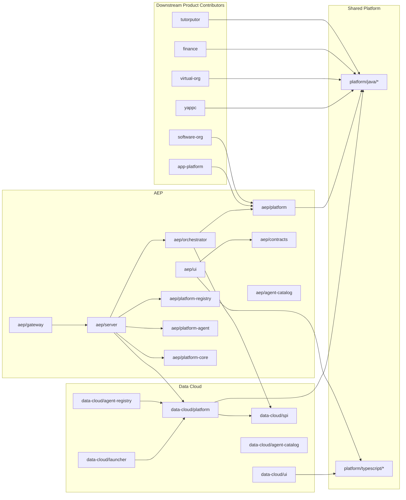

# V2 Data Cloud + AEP Consolidated Audit and AEP Agent Runtime Centralization Plan

Date: 2026-03-20  
Repository: `ghatana`  
Status: Proposed, consolidated working artifact  
Primary product owners: Data Team, AEP Team  
Primary program owner for runtime centralization: AEP Team  
Partner teams: YAPPC, Data Cloud, App Platform, Virtual Org, Finance, Tutorputor

Supersedes and consolidates:

- [V2_PRODUCT_DEEP_AUDIT_DATA_CLOUD_AEP_2026-03-20.md](/Users/samujjwal/Development/ghatana/docs/V2_PRODUCT_DEEP_AUDIT_DATA_CLOUD_AEP_2026-03-20.md)
- [AEP_AGENT_RUNTIME_CENTRALIZATION_EXECUTION_PLAN.md](/Users/samujjwal/Development/ghatana/docs/integration/AEP_AGENT_RUNTIME_CENTRALIZATION_EXECUTION_PLAN.md)

This document merges the current-state product audit for `data-cloud` and `aep` with the future-state AEP runtime-centralization program. It is intended to be the single reference for release readiness, structural remediation, target ownership, and execution sequencing.

---

## Part 1 - Executive Assessment

### 1. Executive Verdict

Two decisions are required, and they point in different directions:

- **V2 release decision:** **No-Go** for a combined `data-cloud` + `aep` release today.
- **Strategic architecture decision:** **Go** on the AEP agent runtime centralization program, because it resolves several of the structural issues exposed by the audit instead of layering more fixes onto the current hybrid ownership model.

Current-state summary:

- `data-cloud` is materially stronger than `aep` and is close to staging readiness, but it still has delivery and contract gaps.
- `aep` is not release-ready because the Java backend build graph is broken, the pipeline mutation path is unfinished, and the SSE security model is unsafe.

Future-state summary:

- AEP should become the only runtime owner for agent execution, orchestration, central registry APIs, catalog loading, lifecycle, and runtime administration.
- Shared platform should shrink to a minimal product-agnostic API/SPI surface.
- Products should contribute only definitions, assets, and provider-backed logic.

### 2. Executive Risk Summary

| Risk | Severity | Scope | Why it matters |
| --- | --- | --- | --- |
| Public SSE stream bypasses auth and accepts tenant-controlled subscription | P0 | AEP runtime/security | Cross-tenant event exposure risk |
| AEP backend cannot pass targeted compile/test build | P0 | AEP delivery | Delivery pipeline is not trustworthy |
| Pipeline create/update endpoints are placeholders | P1 | AEP core UX flow | UI flow is not backed by durable behavior |
| Data Cloud UI build depends on a missing script | P1 | Data Cloud delivery | Frontend release artifact cannot be reproduced cleanly |
| Root workspace `pnpm` commands fail because of malformed JSON in another package | P1 | Monorepo delivery | Workspace-level build/test workflows are brittle |
| Data Cloud launcher has a failing analytics contract test | P2 | Data Cloud backend | Contract drift already exists |
| Shared platform still holds runtime-heavy agent behavior | P1 | Cross-product architecture | Keeps ownership blurry and migration cost rising |
| Product-local registries and catalog bootstraps remain in downstream products | P1 | Cross-product runtime program | Prevents a clean centralized runtime model |
| Reflective or hybrid runtime integration remains in Data Cloud and other products | P1 | Cross-product integration | Produces ambiguous runtime ownership and hidden fallback behavior |

### 3. Audit Scope and Boundaries

Primary audit scope:

- `products/data-cloud/{spi,platform,launcher,agent-registry,ui,docs,helm,terraform}`
- `products/aep/{contracts,platform,platform-core,platform-registry,platform-analytics,platform-security,platform-connectors,platform-agent,platform-api,platform-scaling,orchestrator,server,gateway,ui,docs,helm}`
- Shared libraries directly used by those products:
  - `platform/java/{core,domain,database,http,observability,security,testing,connectors,agent-*,workflow,plugin,ai-integration,*}`
  - `platform/typescript/{capabilities/design-system,capabilities/canvas-core,capabilities/canvas-core/flow-canvas,capabilities/realtime-engine,theme,foundation/platform-utils,tokens}`
- Root delivery configuration:
  - [settings.gradle.kts](/Users/samujjwal/Development/ghatana/settings.gradle.kts)
  - [build.gradle.kts](/Users/samujjwal/Development/ghatana/build.gradle.kts)
  - [pnpm-workspace.yaml](/Users/samujjwal/Development/ghatana/pnpm-workspace.yaml)
  - [turbo.json](/Users/samujjwal/Development/ghatana/turbo.json)
  - [.github/CODEOWNERS](/Users/samujjwal/Development/ghatana/.github/CODEOWNERS)

Runtime-centralization program scope:

- Downstream products that currently duplicate runtime behavior, depend on AEP internals, or mix product-local and centralized agent patterns:
  - YAPPC
  - Data Cloud
  - Virtual Org
  - App Platform
  - Finance
  - Tutorputor
  - Software Org

Out of scope except where it blocked delivery or ownership clarity:

- Unrelated product quality outside the dependency or centralization path
- Live production infrastructure verification
- Full performance benchmarking beyond code/build/test evidence

### 4. Product Mission and Responsibilities

| Product / Program | Intended mission | Observed reality |
| --- | --- | --- |
| Data Cloud | Multi-tenant event storage, entity/metadata management, memory plane, analytics, registry-backed persistence | Central persistence and integration substrate for other products, especially AEP |
| AEP | Event-driven operator and agent pipeline runtime with orchestration, monitoring, learning, and HITL | Workflow/pipeline product with UI, server, orchestration, registry, analytics, connectors, and deep Data Cloud dependence |
| AEP runtime centralization program | Make AEP the only runtime owner while shared platform holds only contracts/SPI | Correct strategic response to the audit’s runtime ownership issues |

### 5. In-Scope Modules / Packages / Files

| Area | Unit count | Notes |
| --- | ---: | --- |
| `data-cloud/platform` | 586 main code files, 47 test files | Primary backend concentration point |
| `data-cloud/launcher` | 15 main code files, 9 test files | HTTP surface and bootstrap |
| `data-cloud/ui` | 231 main code files, 34 test files | Large UX surface, strong test volume, broken build script |
| `aep/platform-core` | 166 main code files, 46 test files | Core engine surface, test compile currently broken |
| `aep/platform-registry` | 58 main code files, 0 tests | Compile-broken registry layer |
| `aep/orchestrator` | 54 main code files, 15 test files | Separate orchestration layer |
| `aep/server` | 29 main code files, 21 test files | HTTP/gRPC entry point with heavy responsibility concentration |
| `aep/ui` | 55 main code files, 8 test files | Cleaner than backend and locally healthy |
| `aep/gateway` | 1 main code file, 0 tests | Thin BFF/proxy with no direct verification coverage |

Critical current-state files inspected:

- [DataCloudHttpServer.java](/Users/samujjwal/Development/ghatana/products/data-cloud/launcher/src/main/java/com/ghatana/datacloud/launcher/http/DataCloudHttpServer.java)
- [EmbeddedDataCloudClient.java](/Users/samujjwal/Development/ghatana/products/data-cloud/platform/src/main/java/com/ghatana/datacloud/client/EmbeddedDataCloudClient.java)
- [ConfigRegistry.java](/Users/samujjwal/Development/ghatana/products/data-cloud/platform/src/main/java/com/ghatana/datacloud/config/ConfigRegistry.java)
- [AnalyticsHandler.java](/Users/samujjwal/Development/ghatana/products/data-cloud/launcher/src/main/java/com/ghatana/datacloud/launcher/http/handlers/AnalyticsHandler.java)
- [AepHttpServer.java](/Users/samujjwal/Development/ghatana/products/aep/server/src/main/java/com/ghatana/aep/server/http/AepHttpServer.java)
- [PipelineController.java](/Users/samujjwal/Development/ghatana/products/aep/server/src/main/java/com/ghatana/aep/server/http/controllers/PipelineController.java)
- [SseController.java](/Users/samujjwal/Development/ghatana/products/aep/server/src/main/java/com/ghatana/aep/server/http/controllers/SseController.java)
- [AepAuthFilter.java](/Users/samujjwal/Development/ghatana/products/aep/platform-security/src/main/java/com/ghatana/aep/security/AepAuthFilter.java)
- [AIAgentOrchestrationManagerImpl.java](/Users/samujjwal/Development/ghatana/products/aep/orchestrator/src/main/java/com/ghatana/orchestrator/ai/impl/AIAgentOrchestrationManagerImpl.java)
- [api-client.ts](/Users/samujjwal/Development/ghatana/products/aep/ui/src/lib/api-client.ts)
- [pipeline.api.ts](/Users/samujjwal/Development/ghatana/products/aep/ui/src/api/pipeline.api.ts)

Critical centralization-plan files validated as existing:

- [YAPPCAgentRegistry.java](/Users/samujjwal/Development/ghatana/products/yappc/core/agents/runtime/src/main/java/com/ghatana/yappc/agent/YAPPCAgentRegistry.java)
- [YappcAgentCatalog.java](/Users/samujjwal/Development/ghatana/products/yappc/core/agents/runtime/src/main/java/com/ghatana/yappc/agent/catalog/YappcAgentCatalog.java)
- [YamlAgentCatalogLoader.java](/Users/samujjwal/Development/ghatana/platform/java/agent-registry/src/main/java/com/ghatana/agent/registry/YamlAgentCatalogLoader.java)
- [AgentRegistryHttpServer.java](/Users/samujjwal/Development/ghatana/products/aep/platform-agent/src/main/java/com/ghatana/agent/registry/AgentRegistryHttpServer.java)
- [AgenticDataProcessor.java](/Users/samujjwal/Development/ghatana/products/data-cloud/platform/src/main/java/com/ghatana/datacloud/plugins/agentic/AgenticDataProcessor.java)

### 6. High-Level Readiness Assessment

| Scope | Build health | Test health | Security posture | Readiness |
| --- | --- | --- | --- | --- |
| Data Cloud product | Mixed-positive | Mixed-positive | Moderate | No-Go today, but close to staging |
| AEP product | Broken | Fragmented | Weak in one critical area | No-Go |
| AEP runtime centralization program | Conceptually correct | Not yet started as a governed program | Strategic fix | Go |

---

## Part 2 - Product & Dependency Topology

### 7. Product Topology Reconstruction



### 8. Internal Dependency Map

| Consumer | Dependency | Type | Evidence | Assessment |
| --- | --- | --- | --- | --- |
| `aep/orchestrator` | `products:data-cloud:spi` | Gradle API | [products/aep/orchestrator/build.gradle.kts](/Users/samujjwal/Development/ghatana/products/aep/orchestrator/build.gradle.kts) | Acceptable integration seam |
| `aep/server` | `products:data-cloud:platform` | Gradle implementation | [products/aep/server/build.gradle.kts](/Users/samujjwal/Development/ghatana/products/aep/server/build.gradle.kts) | Too deep; couples AEP to implementation instead of SPI |
| `aep/platform` | many `platform/java/*` modules + `data-cloud:spi` | Aggregator | [products/aep/platform/build.gradle.kts](/Users/samujjwal/Development/ghatana/products/aep/platform/build.gradle.kts) | Misleading module role |
| `data-cloud/ui` | shared TS platform packages | workspace deps | [products/data-cloud/ui/package.json](/Users/samujjwal/Development/ghatana/products/data-cloud/ui/package.json) | Good reuse intent, fragile build path |
| `aep/ui` | shared TS platform packages | workspace deps | [products/aep/ui/package.json](/Users/samujjwal/Development/ghatana/products/aep/ui/package.json) | Reuse is shallower and inconsistent |
| downstream products | `platform:java:agent-*` and/or `products:aep:platform` | mixed | current centralization-plan inventory | Ownership is blurry and should be normalized |

### 9. Platform Integration Map

| Integration | Product / Program | Where | Purpose | Risk |
| --- | --- | --- | --- | --- |
| Data Cloud API / SPI | AEP | server, orchestrator, platform | pipelines, analytics, memory, event log | High coupling |
| Kafka / event streaming | Data Cloud, AEP | plugins, orchestration | event sourcing / transport | Operational complexity |
| PostgreSQL | Both | migrations, stores | durable state | Moderate |
| ClickHouse | Data Cloud | analytics connectors | analytics queries | Moderate |
| OpenSearch | Data Cloud | search/query handlers | search and stream query support | Moderate |
| SSE | AEP, Data Cloud | server HTTP layers | live event updates | High in AEP due auth gap |
| catalog loading | AEP + downstream products | product-local assets today | agent discovery | Currently fragmented |
| provider wiring | downstream products + shared framework | code-local classes today | agent logic instantiation | Not standardized yet |

### 10. Third-Party Dependency Map

| Category | Libraries | Product usage | Notes |
| --- | --- | --- | --- |
| Java async/runtime | ActiveJ | Both backends | Strong common runtime choice |
| Persistence | Hibernate, Flyway, Hikari, PostgreSQL, H2 | Both | Mature stack, but AEP module declarations are incomplete |
| Streaming / messaging | Kafka client, RabbitMQ, AWS SQS | Data Cloud, AEP connectors | Broad integration surface |
| Analytics / search | ClickHouse, OpenSearch, Trino, LangChain4j | Data Cloud, AEP | Powerful but heavy |
| Frontend | React 19, React Router, TanStack Query, Jotai, xyflow | Both UIs | Good baseline |
| BFF / proxy | Fastify, `ws` | AEP gateway | Thin layer, no test coverage |

### 11. Ownership Model

| Path / Program | Declared or expected owners | Audit view |
| --- | --- | --- |
| `/products/aep/` | `@ghatana/aep-team` | Correct top-level owner, too coarse for module sprawl |
| `/products/data-cloud/` | `@ghatana/data-team` | Strong ownership, but platform concentration risk |
| `/platform/typescript/` | `@ghatana/frontend-team @ghatana/platform-team` | Correct shared ownership |
| AEP runtime centralization | AEP Team + partner teams | Needs explicit program governance and migration tracker |

### 12. Product vs Shared Responsibility Matrix

| Concern | Current owner | Target owner | Assessment |
| --- | --- | --- | --- |
| Event persistence | Data Cloud + shared platform libs | Data Cloud | Clear enough already |
| Pipeline orchestration runtime | AEP + shared agent modules | AEP | Must be centralized |
| Agent execution lifecycle | AEP + shared agent modules + product-local helpers | AEP | Current duplication is unacceptable |
| Agent contracts and provider SPI | Shared platform + some product-specific patterns | Shared platform only | Needs shrink-to-minimum extraction |
| Catalog discovery | AEP, Data Cloud, YAPPC, shared loader | AEP | Must become single-path |
| Registry APIs | AEP and product-local patterns | AEP | Single source of truth required |
| Product-specific agent logic | Mixed | Product-owned providers | Good target model |

---

## Part 3 - Deep Quality Audit

### 13. Product Architecture Audit

**Data Cloud**

- Strength: strong substrate role with broad backend capabilities and good shared-platform reuse.
- Weakness: `platform` has become a catch-all backend module with 586 main code files and multiple 800-1600 LOC classes.
- Weakness: `launcher` still carries too much HTTP orchestration; [DataCloudHttpServer.java](/Users/samujjwal/Development/ghatana/products/data-cloud/launcher/src/main/java/com/ghatana/datacloud/launcher/http/DataCloudHttpServer.java) is 2033 LOC even after handler extraction.

**AEP**

- Strength: intended modular split into `platform-core`, `platform-registry`, `platform-analytics`, `platform-security`, `platform-connectors`, `platform-agent`, `orchestrator`, and `server` is directionally correct.
- Weakness: the split is not operationally complete; dependency declarations do not support the code that those modules contain.
- Weakness: [products/aep/platform/build.gradle.kts](/Users/samujjwal/Development/ghatana/products/aep/platform/build.gradle.kts) describes a "platform" module that has no Java sources and mostly acts as an aggregator/resources module.

**AEP runtime centralization**

- The plan’s architectural direction is correct: AEP is already treated as the runtime owner in intent, while shared platform still holds too much runtime-bearing agent behavior.
- Product-local registry duplication already exists in YAPPC and other areas, so a purely local cleanup in AEP would not be enough.

### 14. Frontend Audit

**Data Cloud UI**

- Broad, feature-rich surface with 231 main code files and 34 test files.
- Local type-check passed and local tests passed.
- `npm run build` fails because [products/data-cloud/ui/package.json:8](/Users/samujjwal/Development/ghatana/products/data-cloud/ui/package.json#L8) points to a missing helper script.
- Large mock-data and integration layers still carry too much product behavior for a supposedly production-first surface.

**AEP UI**

- Cleaner and smaller than Data Cloud UI.
- Local `type-check`, `test`, and `build` passed.
- Build emits chunk-size warnings and a React Router compatibility warning from shared design-system source during bundling.
- Codegen path is wrong: [products/aep/ui/package.json:17](/Users/samujjwal/Development/ghatana/products/aep/ui/package.json#L17) references `../../contracts/openapi.yaml`, but the actual path from `products/aep/ui` is `../contracts/openapi.yaml`.
- AEP frontend currently has multiple API-client patterns with inconsistent base URL and auth behavior.

### 15. Backend Audit

**Data Cloud backend**

- `:products:data-cloud:platform:test` is healthy enough to pass in the targeted run.
- `:products:data-cloud:launcher:test` failed 1 of 170 tests, which indicates narrow but real API/contract drift.
- Main problem is structural concentration, not basic buildability.

**AEP backend**

- Targeted Gradle verification failed before trustworthy testing because `:products:aep:platform-registry:compileJava` and `:products:aep:platform-core:compileTestJava` do not compile.
- [products/aep/platform-registry/build.gradle.kts:13-42](/Users/samujjwal/Development/ghatana/products/aep/platform-registry/build.gradle.kts#L13) does not declare the security/connectors/Hikari/Jedis dependencies that its sources import.
- [products/aep/platform-core/build.gradle.kts:37-46](/Users/samujjwal/Development/ghatana/products/aep/platform-core/build.gradle.kts#L37) does not declare AssertJ, Mockito JUnit, `platform:java:testing`, or JMH test dependencies even though tests import those types.
- Many backend modules have zero tests despite non-trivial logic.
- Core server route for pipeline create/update is a stub, not a finished service.

### 16. Data / Contract Audit

| Product | Contract state | Assessment |
| --- | --- | --- |
| Data Cloud | Single canonical OpenAPI under `products/data-cloud/docs/openapi.yaml` | Good contract-first posture |
| AEP | Canonical contract under `products/aep/contracts/openapi.yaml`, duplicated runtime copy under `products/aep/server/src/main/resources/openapi.yaml` | Manual drift risk |

### 17. Event / Workflow Audit

- Data Cloud exposes event log, checkpoints, workflows, and memory surfaces coherently.
- AEP workflow runtime is conceptually rich, but registry/server boundaries are unfinished.
- [PipelineController.java:117-146](/Users/samujjwal/Development/ghatana/products/aep/server/src/main/java/com/ghatana/aep/server/http/controllers/PipelineController.java#L117) shows create/update are not yet parsing, validating, or persisting real pipeline definitions.

### 18. Shared Library Usage Audit

| Library | Current use | Audit view |
| --- | --- | --- |
| `@ghatana/design-system` | Used actively in Data Cloud, lightly in AEP | Underused in AEP |
| `@ghatana/flow-canvas` | Core to Data Cloud topology/workflow UX | Good reuse by Data Cloud |
| `@ghatana/theme` | Active in Data Cloud, lighter in AEP | Inconsistent adoption |
| `platform:java:testing` | Available but not consistently declared where imported | Dependency hygiene failure, not missing shared capability |
| `platform:java:connectors` | Exists and is imported by AEP registry code | Missing declaration in AEP registry module |
| shared agent modules | currently hold too much runtime behavior | Must be reduced to minimal API/SPI only |

### 19. Reuse vs Duplication Audit

| Duplicate / overlap | Locations | Impact |
| --- | --- | --- |
| OpenAPI spec copy | `products/aep/contracts/openapi.yaml`, `products/aep/server/src/main/resources/openapi.yaml` | Manual drift risk |
| AEP frontend API layer | `products/aep/ui/src/lib/api-client.ts`, `products/aep/ui/src/api/pipeline.api.ts`, `products/aep/ui/src/api/aep.api.ts` | Multiple base URL/auth models |
| Connector registry concept | `platform/java/connectors/.../ConnectorRegistry.java`, `products/aep/platform-core/.../ConnectorRegistry.java` | Naming collision and conceptual overlap |
| DataCloud pipeline-store concept | `products/aep/server/.../DataCloudPipelineStore.java`, `products/aep/platform-registry/.../DataCloudPipelineStore.java` | Confusing ownership; one file is only a moved placeholder |
| Product-local agent registry/catalog ownership | YAPPC local registry, YAPPC catalog, Data Cloud reflection-based integration, product-local scans | Prevents clean runtime centralization |

### 20. Naming Audit

| Name | Problem | Evidence |
| --- | --- | --- |
| `products/aep/platform` | Sounds like core implementation but is actually resources/aggregator | no Java sources under `src/main/java` |
| `products/data-cloud/platform` | Too generic for a module containing entity, config, plugins, analytics, deployment, client, API, security-adjacent code | 586 main code files |
| `@aep/api` | Implies canonical API, but actual backend API is in Java server and UI often talks to backend directly | [products/aep/gateway/package.json](/Users/samujjwal/Development/ghatana/products/aep/gateway/package.json) |
| `ConnectorRegistry` | Same name used for materially different abstractions | shared connectors vs runtime adapter |

### 21. Module-Level Audit

| Module | Audit summary |
| --- | --- |
| `data-cloud/platform` | Functionally rich, structurally overloaded |
| `data-cloud/launcher` | Good tests, one failing contract, oversized HTTP layer |
| `data-cloud/ui` | Strong breadth and tests, weak build reproducibility |
| `aep/platform-core` | Important core logic, compile/test debt |
| `aep/platform-registry` | Compile-broken and untested |
| `aep/platform-security` | Tiny, under-tested, contains critical auth assumption gap |
| `aep/orchestrator` | Reasonable decomposition, large hotspot, moderate tests |
| `aep/server` | Too much responsibility, unfinished CRUD |
| `aep/gateway` | Small, builds, but no tests and unclear product role |
| `aep/ui` | Best-shaped AEP surface today |

### 22. Package-Level Audit

| Package / shared library | Summary |
| --- | --- |
| `@data-cloud/ui` | Mature test surface, broken build path |
| `@aep/ui` | Locally healthy package, contract path bug |
| `@aep/api` | Thin BFF, no tests, mixed package-manager signals |
| `@ghatana/design-system` | Valuable shared package, router compatibility warning surfaced in AEP build |
| `@ghatana/theme` | Stable foundation |
| `@ghatana/canvas` / `@ghatana/flow-canvas` | High-value shared visualization layers |
| future `platform:java:agent-api` / `agent-spi` | Needed outcome of centralization plan |

### 23. File-Level Audit

| File | Responsibility | Naming | Complexity | Cohesion | Testability | Maintainability | Side effects | Security | Notes |
| --- | ---: | ---: | ---: | ---: | ---: | ---: | ---: | ---: | --- |
| `products/data-cloud/launcher/.../DataCloudHttpServer.java` | 4 | 6 | 1 | 3 | 4 | 2 | 3 | 6 | Too much routing, wiring, and optional-feature handling |
| `products/data-cloud/platform/.../EmbeddedDataCloudClient.java` | 5 | 6 | 2 | 4 | 4 | 3 | 5 | 6 | Large facade with fallback logic and broad plugin concerns |
| `products/data-cloud/platform/.../ConfigRegistry.java` | 6 | 7 | 3 | 5 | 5 | 4 | 6 | 6 | Valuable service, but large and stateful |
| `products/data-cloud/launcher/.../AnalyticsHandler.java` | 6 | 7 | 5 | 6 | 7 | 6 | 6 | 7 | Current output shape breaks contract test |
| `products/data-cloud/ui/src/lib/mock-data.ts` | 3 | 5 | 2 | 3 | 7 | 2 | 9 | 8 | Mock corpus carries too much product behavior |
| `products/aep/server/.../AepHttpServer.java` | 4 | 6 | 3 | 4 | 4 | 3 | 4 | 4 | Centralizes too many endpoints and optional deps |
| `products/aep/orchestrator/.../AIAgentOrchestrationManagerImpl.java` | 5 | 6 | 2 | 4 | 4 | 3 | 4 | 5 | Large stateful orchestrator hotspot |
| `products/aep/server/.../PipelineController.java` | 3 | 6 | 6 | 5 | 6 | 4 | 5 | 4 | CRUD surface is unfinished |
| `products/aep/platform-security/.../AepAuthFilter.java` | 6 | 7 | 5 | 6 | 6 | 6 | 5 | 1 | Public-path bypass claim does not match enforcement |
| `products/aep/server/.../SseController.java` | 5 | 6 | 5 | 5 | 6 | 5 | 3 | 1 | No auth/tenant authorization in stream setup |
| `products/yappc/.../YAPPCAgentRegistry.java` | 4 | 6 | 4 | 4 | 5 | 4 | 6 | 6 | Deprecated but still concrete product-local registry ownership |
| `products/yappc/.../YappcAgentCatalog.java` | 5 | 6 | 4 | 5 | 5 | 4 | 6 | 6 | Product-local catalog bootstrap via ServiceLoader |

### 24. Test Audit

| Area | Test signal | Assessment |
| --- | --- | --- |
| Data Cloud backend | `platform` tests pass; `launcher` has 169 passed / 1 failed | Good baseline, one visible regression |
| Data Cloud UI | 19 test files passed, 231 tests passed, 1 skipped | Strong test surface, noisy mocks and `act(...)` warnings reduce trust |
| AEP UI | 7 test files passed, 118 tests passed | Best-tested AEP surface |
| AEP backend | many modules untested, some compile-broken before tests | Not trustworthy |
| runtime centralization program | no dedicated guardrails or conformance suite yet | Must be added before migration begins |

### 25. Security Audit

Critical findings:

1. [AepAuthFilter.java:47-54](/Users/samujjwal/Development/ghatana/products/aep/platform-security/src/main/java/com/ghatana/aep/security/AepAuthFilter.java#L47) explicitly exempts `/events/stream` from authentication and claims the SSE endpoint has its own validation.
2. [SseController.java:51-76](/Users/samujjwal/Development/ghatana/products/aep/server/src/main/java/com/ghatana/aep/server/http/controllers/SseController.java#L51) accepts any request, resolves tenant from request input, and subscribes the caller without validating identity or tenant membership.
3. [AepAuthFilter.java:80-84](/Users/samujjwal/Development/ghatana/products/aep/platform-security/src/main/java/com/ghatana/aep/security/AepAuthFilter.java#L80) disables auth entirely when `AEP_JWT_SECRET` is absent.

Data Cloud shows better sampled posture:

- request validation tests are extensive in launcher
- rate limiting and body-size controls are present in the HTTP layer
- no equally severe auth bypass was found in sampled Data Cloud surfaces

### 26. Observability Audit

**Data Cloud**

- Metrics and observability are widely referenced in platform and launcher code.
- Build/test evidence suggests observability is integrated into core runtime paths.

**AEP**

- Observability exists in naming and module structure, but compile/test health prevents confidence.
- Some modules mention tracing/metrics and have zero tests.

### 27. Build & Delivery Audit

| Verification command | Result | Meaning |
| --- | --- | --- |
| `./gradlew :products:data-cloud:platform:test :products:data-cloud:launcher:test --continue` | Failed: 169 passed, 1 failed | Data Cloud backend is close, but not green |
| `./gradlew :products:data-cloud:platform:test :products:aep:platform-core:test :products:aep:orchestrator:test :products:aep:server:test --continue` | Failed during AEP compile | AEP backend graph is not releasable |
| `npm run type-check` in `products/data-cloud/ui` | Passed | Local TS health is okay |
| `npm run build` in `products/data-cloud/ui` | Failed | Missing helper script blocks release build |
| `npm test -- --run` in `products/data-cloud/ui` | Passed with MSW and `act(...)` warnings | Test surface exists, but cleanliness is weak |
| `npm run type-check` in `products/aep/ui` | Passed | Local TS health is okay |
| `npm test -- --run` in `products/aep/ui` | Passed | Local UI quality is decent |
| `npm run build` in `products/aep/ui` | Passed with warnings | Bundle is shippable but dependency/version hygiene is weak |
| `npm run build` in `products/aep/gateway` | Passed | Thin gateway compiles locally |
| `pnpm --filter ...` from repo root | Failed | Workspace command path is blocked by malformed JSON elsewhere |

### 28. DevEx Audit

- Root workspace ergonomics are broken by malformed JSON in [products/yappc/frontend/libs/component-traceability/package.json:26](/Users/samujjwal/Development/ghatana/products/yappc/frontend/libs/component-traceability/package.json#L26).
- Data Cloud UI build script references a missing helper script, which is a poor experience for any fresh checkout.
- AEP mixes root `pnpm` conventions with a nested `package-lock.json` in `products/aep/gateway`, which weakens determinism.
- The centralization program currently lacks CI guardrails against new product-local registries, handlers, loaders, and reflective runtime shortcuts.

### 29. Performance Audit

- AEP UI production build emits a 554.90 kB chunk and a 373.22 kB route chunk.
- Data Cloud UI has several 580-1060 LOC frontend files that are likely to create slow edit-test cycles and unnecessary rerenders.
- AEP benchmark tests exist but do not build because JMH dependencies are not declared in `platform-core` test configuration.

### 30. UX Flow Audit

**Data Cloud**

- Broad admin/operations UX with many pages and strong test coverage.
- Still carries product behavior in mock layers and partially integrated pages.

**AEP**

- UI flows for list/monitoring/HITL are in much better shape than backend delivery.
- Pipeline authoring flow is misleading because the server-side create/update path is not implemented.

**centralization implication**

- Admin and discovery UIs should eventually call only AEP registry/runtime surfaces, not product-local registries.

---

## Part 4 - Scoring

### 31. Product Scorecard

| Dimension | Data Cloud | AEP |
| --- | ---: | ---: |
| Architecture Quality | 6.5 | 4.5 |
| Code Quality | 6.5 | 5.0 |
| Dependency Hygiene | 6.0 | 3.5 |
| Naming Quality | 5.5 | 4.5 |
| Test Coverage | 7.0 | 4.0 |
| Security | 6.5 | 3.5 |
| Observability | 8.0 | 5.5 |
| Delivery Readiness | 5.5 | 3.0 |
| Maintainability | 5.5 | 4.0 |
| Scalability | 7.5 | 5.5 |
| UX Completeness | 7.0 | 6.0 |
| **Overall** | **6.4 / 10** | **4.4 / 10** |

### 32. Module Scores

| Module | Score | Rationale |
| --- | ---: | --- |
| `data-cloud/spi` | 7.5 | Lean and appropriately scoped |
| `data-cloud/platform` | 6.5 | Powerful but too concentrated |
| `data-cloud/launcher` | 5.5 | Good tests, one failing contract, oversized HTTP layer |
| `data-cloud/agent-registry` | 6.5 | Small and focused, but target role must narrow under centralization |
| `data-cloud/ui` | 6.5 | Strong UX/test breadth, weak build reproducibility |
| `aep/contracts` | 6.5 | Good contract-first intent, duplicated runtime copy |
| `aep/platform` | 4.0 | Misnamed aggregator/resource module |
| `aep/platform-core` | 4.5 | Important core logic, compile/test debt |
| `aep/platform-registry` | 3.0 | Compile-broken and untested |
| `aep/platform-analytics` | 4.5 | Meaningful logic, zero tests |
| `aep/platform-security` | 4.5 | Small, under-tested, contains critical flaw |
| `aep/platform-connectors` | 4.5 | Zero tests |
| `aep/platform-agent` | 5.0 | Small but unverified |
| `aep/platform-api` | 4.5 | Thin, zero tests |
| `aep/platform-scaling` | 4.5 | Thin, zero tests |
| `aep/orchestrator` | 5.0 | Good intent, large hotspot, moderate tests |
| `aep/server` | 4.5 | Too much responsibility, unfinished CRUD |
| `aep/gateway` | 5.5 | Small and builds, but no tests and unclear role |
| `aep/ui` | 7.0 | Best AEP module today |

### 33. Package Scores

| Package / shared library | Score | Notes |
| --- | ---: | --- |
| `@data-cloud/ui` | 6.5 | Feature-rich, build script broken |
| `@aep/ui` | 7.0 | Healthy local package, contract path bug |
| `@aep/api` | 5.5 | Thin proxy, no tests |
| `@ghatana/design-system` | 6.0 | Useful, but router/build warning surfaced in AEP build |
| `@ghatana/theme` | 7.5 | Stable foundation |
| `@ghatana/canvas` | 6.5 | Reused well by Data Cloud |
| `@ghatana/flow-canvas` | 7.0 | Valuable shared visualization layer |
| `@ghatana/realtime` | 6.0 | Reused, but build/ownership path is less explicit |
| `platform:java:testing` | 7.5 | Good shared utility, not consistently consumed |
| future `platform:java:agent-api` | 8.0 target | Correct long-term ownership boundary |
| future `platform:java:agent-spi` | 8.0 target | Correct long-term provider boundary |

### 34. File Hotspots

| File | LOC | Hotspot reason |
| --- | ---: | --- |
| `products/data-cloud/launcher/.../DataCloudHttpServer.java` | 2033 | God-class HTTP server |
| `products/data-cloud/platform/.../EmbeddedDataCloudClient.java` | 1655 | Large multi-mode facade |
| `products/data-cloud/platform/.../ConfigRegistry.java` | 1091 | Large stateful config service |
| `products/data-cloud/ui/src/lib/mock-data.ts` | 1062 | Oversized mock-data corpus |
| `products/data-cloud/ui/src/pages/InsightsPage.tsx` | 844 | Large page component |
| `products/aep/server/.../AepHttpServer.java` | 940 | Centralized server/router |
| `products/aep/orchestrator/.../AIAgentOrchestrationManagerImpl.java` | 783 | Stateful orchestrator hotspot |
| `products/aep/platform-core/.../CheckpointCoordinatorImpl.java` | 727 | Large core class |
| `products/aep/platform-core/.../DefaultPipeline.java` | 722 | Large execution primitive |
| `products/yappc/.../YAPPCAgentRegistry.java` | 500+ | Product-local registry ownership that should be retired |

### 35. Delivery Readiness Score

| Scope | Score (/100) | Interpretation |
| --- | ---: | --- |
| Data Cloud | 64 | Fixable release debt; not ready today |
| AEP | 44 | Core release blockers unresolved |
| Combined V2 release | 52 | No-Go |
| AEP runtime centralization program readiness | 72 | Strategically sound, needs governance and staffing |

### 36. Risk Hotspots

| Hotspot | Severity | Evidence / rationale |
| --- | --- | --- |
| Public SSE auth bypass | P0 | [AepAuthFilter.java:47-54](/Users/samujjwal/Development/ghatana/products/aep/platform-security/src/main/java/com/ghatana/aep/security/AepAuthFilter.java#L47), [SseController.java:51-76](/Users/samujjwal/Development/ghatana/products/aep/server/src/main/java/com/ghatana/aep/server/http/controllers/SseController.java#L51) |
| AEP compile/test graph broken | P0 | targeted Gradle run failed in `platform-registry` and `platform-core` |
| Pipeline CRUD placeholders | P1 | [PipelineController.java:117-146](/Users/samujjwal/Development/ghatana/products/aep/server/src/main/java/com/ghatana/aep/server/http/controllers/PipelineController.java#L117) |
| Data Cloud UI build path broken | P1 | [products/data-cloud/ui/package.json:8](/Users/samujjwal/Development/ghatana/products/data-cloud/ui/package.json#L8) |
| malformed workspace package JSON | P1 | [component-traceability/package.json:26](/Users/samujjwal/Development/ghatana/products/yappc/frontend/libs/component-traceability/package.json#L26) |
| shared platform still owns runtime-heavy agent behavior | P1 | centralization plan current-state signals |
| product-local registries/catalogs persist | P1 | YAPPC/Data Cloud/downstream duplication |
| reflective AEP integration remains | P1 | [AgenticDataProcessor.java](/Users/samujjwal/Development/ghatana/products/data-cloud/platform/src/main/java/com/ghatana/datacloud/plugins/agentic/AgenticDataProcessor.java) |
| YAML schema/layout drift across products | P2 | multiple current catalog layouts |
| uneven migration leaving hybrid states | P2 | centralization program execution risk |

### 37. Critical Defects

1. AEP SSE stream is effectively unauthenticated and tenant-selectable.
2. AEP Java backend does not clear a targeted compile/test build.
3. AEP pipeline create/update routes return placeholder responses instead of real persistence.
4. Data Cloud UI production build is blocked by a missing prebuild helper script.
5. Root workspace `pnpm` commands are blocked by malformed JSON in an unrelated package.
6. Data Cloud analytics plan endpoint disagrees with its test contract.
7. Shared platform still owns agent runtime behavior that should live in AEP.
8. Product-local registry and catalog ownership still exists in downstream products.

---

## Part 5 - Target State

### 38. Target Architecture

Target architecture has two layers: immediate product stabilization and strategic runtime centralization.

**Shared platform should keep only minimal product-agnostic agent contracts and SPI:**

- `TypedAgent`
- `AgentContext`
- `AgentResult`
- `AgentConfig`
- `AgentDescriptor`
- `AgentType`
- `AgentRegistry` SPI only if multiple backends are still required
- new `AgentLogicProvider` SPI

Preferred target modules:

- `platform:java:agent-api`
- `platform:java:agent-spi`

**AEP should own all runtime-bearing capabilities:**

- agent dispatch
- execution queue and scheduling
- registry API and runtime administration
- catalog discovery and merged catalog index
- definition validation and materialization
- agent lifecycle bootstrap
- memory/runtime implementation details
- learning/runtime implementation details
- checkpointing and recovery
- orchestration policies
- product-to-runtime integration adapters

**No deferred structural debt rule**

This program is not complete if AEP owns more code but other products still retain known duplicate registry, loader, or hybrid-boundary logic. Temporary compatibility is allowed only if it has:

- an explicit owner
- a removal phase in this plan
- a validation gate
- a deletion target tied to a migration wave

### 39. Dependency Model

Target dependency rules:

- products compile their concrete agent logic only against shared API/SPI, not runtime-heavy shared implementation
- AEP provides the public runtime surface and is the only runtime owner
- Data Cloud integration with AEP should be explicit SPI/client integration, not reflection-based discovery
- downstream products should depend on approved AEP public API/SPI only, not AEP internals

Current-to-target dependency normalization:

| Current pattern | Target pattern |
| --- | --- |
| `aep/server -> data-cloud:platform` | `aep/server -> data-cloud SPI/client adapter boundary` |
| shared `platform:java:agent-*` runtime behavior | shared `agent-api` + `agent-spi` only |
| product-local registry ownership | AEP central registry only |
| hybrid dependence on AEP internals and shared runtime code | shared API/SPI + approved AEP runtime API only |

### 40. Library Usage Model

**Product contribution model**

Each product contributes only:

- YAML definitions
- YAML instances
- prompts, templates, eval assets, schemas, tools metadata, policies
- product-specific logic classes
- `AgentLogicProvider` registration

Each product must not contribute:

- product-local persistent registry
- registry handler
- registry HTTP or gRPC controller
- product-local catalog bootstrapper
- product-local filesystem scanner for agent definitions
- product-local registry cache as a source of truth

**Canonical definition model**

Each definition must declare:

- `id`
- `catalog`
- `product`
- `capabilities`
- `executionType`
- `inputSchemaRef`
- `outputSchemaRef`
- `implementationRef`
- `defaultInstanceRef`
- `assetRefs`
- `governance`
- `runtimePolicy`

Example:

```yaml
apiVersion: ghatana.agent/v1
kind: AgentDefinition
metadata:
  id: agent.yappc.java-expert
  product: yappc
spec:
  implementationRef: yappc-java:agent.yappc.java-expert
  runtimePolicy:
    timeout: PT5M
    retries: 2
  inputSchemaRef: event-schemas/engineering-events-v1.json#/javaExpertInput
  outputSchemaRef: event-schemas/engineering-events-v1.json#/javaExpertOutput
  assetRefs:
    - prompts/java-expert.md
    - templates/java-expert/
```

`implementationRef` must resolve through provider SPI, never by ad hoc product-local bootstrap logic.

### 41. Platform Integration Model

**Target module ownership**

| Layer | Target ownership |
| --- | --- |
| shared platform | `platform:java:agent-api`, `platform:java:agent-spi` |
| AEP | `platform-core` embedded API, `platform-registry`, `platform-agent`, `orchestrator`, `server` |
| products | `products/<product>/agents/` definitions/assets + provider-backed logic classes |

**Standard product layout**

Every product should converge on:

```text
products/<product>/agents/
├── agent-catalog.yaml
├── definitions/
├── instances/
├── prompts/
├── templates/
├── policies/
├── event-schemas/
└── eval/
```

Temporary compatibility may support:

- `products/yappc/config/agents/`
- `products/data-cloud/agent-catalog/`
- `products/aep/agent-catalog/`

**Runtime flow**

1. AEP starts.
2. AEP scans configured product catalog roots.
3. AEP validates all catalogs and builds one merged registry index.
4. AEP resolves `implementationRef` via `AgentLogicProvider`.
5. AEP materializes concrete agent instances.
6. AEP executes and manages lifecycle centrally.
7. Products observe results through AEP APIs, events, or embedded client calls.

**Cross-product remediation matrix**

| Product / Area | Current issue | Required fix |
| --- | --- | --- |
| AEP | runtime still depends on shared runtime-heavy `platform:java:agent-*` modules | shrink shared platform to API/SPI and move runtime-bearing implementation into AEP |
| AEP | placeholder or compatibility-only runtime bridge classes remain | implement as real public runtime components or delete/archive |
| YAPPC | owns `YAPPCAgentRegistry` and `YappcAgentCatalog` | remove both and route through AEP registry and central catalog loading |
| YAPPC | still uses `registry.yaml` and parallel catalog structures | converge on AEP-loaded manifest + split catalog model |
| Data Cloud | owns `DataCloudAgentRegistry` implementation and separate `agent-catalog` loading conventions | keep persistence/backend role only if needed; move runtime discovery/loading to AEP |
| Data Cloud | optional reflective AEP loading creates ambiguous runtime contract | replace reflection with explicit AEP integration mode |
| Virtual Org | depends on both shared agent modules and `products:aep:platform` for overlapping concerns | normalize to shared API/SPI + AEP runtime API only |
| Virtual Org | operator/pipeline TODO boundary remains unresolved | close during migration, not later |
| App Platform | directly consumes `products:aep:platform` internals from SDK and DLQ modules | replace with approved AEP public API/SPI |
| Finance | directly subclasses shared runtime-oriented base classes without clear ownership model | classify as provider-backed logic over shared API/SPI only |
| Tutorputor | directly extends shared base runtime pattern | align with shared API/SPI plus provider registration |
| Software Org | config-driven agents sit outside a unified product layout and runtime loading path | migrate configs into canonical AEP-loaded structure |
| All products | multiple layouts for definitions and assets | standardize on one product catalog layout |
| All products | unclear split of definition ownership, logic ownership, runtime ownership | definitions/assets stay in product, runtime stays in AEP, contracts stay shared |

### 42. Naming Model

Naming should communicate ownership truthfully:

- rename aggregator/resource modules to reflect what they actually do
- reserve `api`, `registry`, `runtime`, `contracts`, `resources`, `agent-api`, `agent-spi` for their real responsibilities
- remove duplicated class names for materially different abstractions where possible

### 43. Test & Delivery Model

**CI guardrails**

Fail CI if:

- a non-AEP product introduces `*AgentRegistry`
- a non-AEP product introduces `*RegistryHandler`
- a non-AEP product introduces `*AgentCatalog` loader classes
- a non-AEP product scans the filesystem directly for agent definitions
- root package metadata is invalid JSON
- referenced build helper scripts do not exist
- AEP canonical OpenAPI and runtime-served copy drift

**Runtime verification for each migrated product**

1. AEP discovers the product catalog.
2. AEP validates all definitions and assets.
3. AEP resolves all `implementationRef`s.
4. AEP materializes sample agents.
5. One end-to-end execution path succeeds.
6. No product-local registry or catalog bootstrap path is required.
7. Public API/SPI dependency boundaries are respected.
8. No reflective fallback remains unless explicitly approved as temporary compatibility.

**Exit criteria**

- one central registry runtime in AEP
- one central catalog loading path in AEP
- zero product-local registry handlers
- zero product-local registry sources of truth
- products contribute only definitions, assets, and logic providers
- all in-scope structural and logical issues in this plan are remediated

**Product-specific acceptance rules**

| Product | Completion rules |
| --- | --- |
| AEP | no runtime-critical behavior stranded in shared implementation modules; no placeholder runtime classes pretending to be stable integration points; AEP exposes the only registry/admin/runtime surface |
| YAPPC | no `YAPPCAgentRegistry` ownership remains; no product-local catalog provider remains; no `registry.yaml` bootstrap is runtime source of truth; indexes are derived views over AEP-backed state |
| Data Cloud | no reflective discovery is required to use AEP runtime; Data Cloud acts as storage backend behind SPI or as an AEP client, but not as a parallel runtime owner; agent definitions are loaded centrally by AEP |
| Virtual Org | no hybrid dependence on overlapping AEP internals and shared runtime code remains unresolved; operator/pipeline dependency direction is normalized |
| App Platform | SDK and kernel modules consume only approved AEP public API/SPI; no module depends on AEP internals solely to reuse implementation |
| Finance / Tutorputor | concrete agent logic compiles against shared API/SPI only; runtime execution path is explicit and documented; definitions/assets follow canonical layout |

---

## Part 6 - Execution Plan

### 44. Immediate Fixes

These are release blockers or prerequisite cleanup items:

1. Remove `/events/stream` from AEP public path exemptions or add real authz in `SseController`.
2. Fix AEP `platform-registry` dependency declarations for security, connectors, Hikari, and Jedis-backed usage.
3. Fix AEP `platform-core` test dependencies for AssertJ, Mockito JUnit, `platform:java:testing`, and JMH.
4. Replace placeholder create/update behavior in AEP `PipelineController`.
5. Restore or remove Data Cloud UI `prebuild` dependency on the missing `scripts/ensure-lib-built.js`.
6. Fix malformed JSON in `products/yappc/frontend/libs/component-traceability/package.json`.
7. Fix AEP UI codegen path to `../contracts/openapi.yaml`.
8. Fix Data Cloud analytics plan response shape or its test contract.
9. Approve the ownership split: shared API/SPI vs AEP runtime.
10. Add a governance freeze on new product-local registries, handlers, and catalog bootstrappers.

### 45. Short-Term Plan

Short-term = stabilize current release path and launch the program foundation.

**Phase 0: Governance Freeze**

Goal:

- stop new duplication while the migration is in progress

Steps:

1. Announce a freeze on adding new product-local registry classes, handlers, and catalog bootstrappers.
2. Add architecture rules that fail CI if non-AEP products add:
   - `*AgentRegistry`
   - `*RegistryHandler`
   - `*AgentCatalog`
   - `*CatalogLoader`
   - direct filesystem scans for product agent definitions outside the approved AEP loader
3. Add a dependency rule that new product code must not depend on runtime-heavy shared modules once replacements exist.
4. Record the current exceptions list:
   - [YAPPCAgentRegistry.java](/Users/samujjwal/Development/ghatana/products/yappc/core/agents/runtime/src/main/java/com/ghatana/yappc/agent/YAPPCAgentRegistry.java)
   - [YappcAgentCatalog.java](/Users/samujjwal/Development/ghatana/products/yappc/core/agents/runtime/src/main/java/com/ghatana/yappc/agent/catalog/YappcAgentCatalog.java)
   - `products/data-cloud/agent-registry/...`
   - product-local registry adapters or handler shells
   - reflective or hybrid runtime bootstraps

Done when:

- CI blocks new duplication
- existing violations are documented as migration backlog
- every known cross-product issue is mapped to an owner and migration wave

**Phase 1: Extract the Minimal Shared Contract**

Goal:

- shrink shared platform to API and SPI only

Steps:

1. Inventory classes in:
   - `platform/java/agent-framework`
   - `platform/java/agent-dispatch`
   - `platform/java/agent-memory`
   - `platform/java/agent-learning`
   - `platform/java/agent-registry`
2. Classify each class as:
   - keep in shared API
   - keep in shared SPI
   - move to AEP runtime
   - delete/archive
3. Create target modules:
   - `platform:java:agent-api`
   - `platform:java:agent-spi`
4. Move only contract classes first.
5. Replace product imports so products compile only against the API/SPI surface where possible.
6. Create a must-fix list for YAPPC, Data Cloud, Virtual Org, App Platform, Finance, and Tutorputor.

Concrete outputs:

- class-by-class move inventory
- new shared module build files
- updated dependency graph
- product-by-product contract/runtime dependency map

Done when:

- shared platform no longer contains execution, catalog discovery, or registry endpoint logic
- products can still compile their concrete agent logic

### 46. Medium-Term Plan

Medium-term = build the new runtime model and migrate the first major consumer.

**Phase 2: Build the Central AEP Catalog Service**

Goal:

- one AEP-owned way to discover and validate all product definitions

Steps:

1. Create a central catalog loader in AEP that scans multiple product roots.
2. Support temporary compatibility for:
   - `products/aep/agent-catalog`
   - `products/data-cloud/agent-catalog`
   - `products/yappc/config/agents`
3. Define one manifest contract: `agent-catalog.yaml` is the entry point.
4. Implement merged index building:
   - deduplicate by `agentId`
   - enforce product ownership
   - validate referenced definitions, instances, assets, and schemas
   - validate `implementationRef` ownership and provider resolution
   - validate catalog layout rules across all products
5. Move runtime catalog bootstrap out of product classes like `YappcAgentCatalog`.
6. Add canonical layout support plus temporary adapters for legacy layouts.
7. Make AEP server/runtime consume only the central loader.

Concrete outputs:

- multi-root AEP catalog loader
- merged catalog index model
- validation report output
- compatibility adapter for legacy layouts
- cross-product catalog conformance report

Done when:

- AEP can build one merged catalog from all enabled product roots
- product-local catalog provider classes are no longer needed
- catalog validation exposes structural issues across products, not only AEP

**Phase 3: Introduce `AgentLogicProvider`**

Goal:

- let products contribute logic without owning runtime

Steps:

1. Define a tiny SPI:
   - provider ID
   - supported `implementationRef`s or agent IDs
   - factory method that creates concrete agent logic
2. Register providers through Java SPI or explicit DI binding.
3. Update definitions to use `implementationRef`.
4. Build an AEP factory that:
   - reads the YAML definition
   - resolves the provider
   - loads related assets
   - creates the concrete agent instance
5. Remove product-local factory patterns that bypass central registry/catalog flow.
6. Add provider validation rules so products can ship logic without becoming runtime owners.

Concrete outputs:

- `AgentLogicProvider` interface
- AEP materializer/factory
- sample providers in YAPPC and one other product
- provider ownership and mapping validation

Done when:

- YAML + provider is sufficient to instantiate a product agent in AEP
- no product needs its own registry bootstrap to make logic executable
- no product needs reflection or private runtime hooks

**Phase 4: Centralize Registry APIs and Runtime Operations**

Goal:

- AEP becomes the only source of truth for registry and lifecycle operations

Steps:

1. Implement registry read/write/query endpoints only in AEP server.
2. Move or wrap existing registry behavior from shared modules into AEP-owned services.
3. Standardize runtime operations:
   - register
   - materialize
   - initialize
   - health check
   - execute
   - shutdown
4. Keep persistence pluggable behind SPI where needed.
5. Ensure all admin/discovery UIs call AEP, not product-local registries.
6. Remove product-local handler/controller/server ownership for registry concerns.

Concrete outputs:

- AEP registry API contract
- one runtime admin surface
- migration notes for consumers
- retirement list for product-local registry/controller endpoints

Done when:

- no product exposes registry APIs directly
- runtime admin tooling points only at AEP
- product-local registry handlers are deleted or under explicit short-lived compatibility toggles

### 47. Long-Term Plan

Long-term = migrate all downstream consumers and remove the legacy runtime topology.

**Phase 5: Product Migration Wave 1 - YAPPC**

Goal:

- migrate the largest current duplication first

Steps:

1. Replace `registry.yaml`-centric loading with `agent-catalog.yaml` entrypoint plus split catalogs.
2. Keep YAPPC definitions/assets in place short term, but load them through the central AEP loader.
3. Remove or deprecate:
   - [YAPPCAgentRegistry.java](/Users/samujjwal/Development/ghatana/products/yappc/core/agents/runtime/src/main/java/com/ghatana/yappc/agent/YAPPCAgentRegistry.java)
   - [YappcAgentCatalog.java](/Users/samujjwal/Development/ghatana/products/yappc/core/agents/runtime/src/main/java/com/ghatana/yappc/agent/catalog/YappcAgentCatalog.java)
   - any YAPPC-local catalog bootstrap logic
4. Convert YAPPC logic classes to `AgentLogicProvider`.
5. Rewire YAPPC runtime calls to AEP registry/runtime APIs.
6. Convert local phase/step indexing into derived views from AEP-backed state.
7. Normalize YAPPC layout so split catalogs, definitions, instances, prompts, schemas, and mappings are consumed by the central loader.
8. Remove any assumption that local config files are the runtime source of truth.

Done when:

- YAPPC runs with zero product-local registry ownership
- YAPPC contributes only definitions + logic providers
- YAPPC no longer has conflicting local and central sources of truth

**Phase 6: Product Migration Wave 2 - Data Cloud, Software Org, Virtual Org, App Platform, Finance, Tutorputor**

Goal:

- move all downstream consumers to the same model

Steps:

1. Data Cloud:
   - keep Data Cloud as persistence backend only if needed
   - move agent catalog loading to AEP
   - replace reflective AEP detection with explicit integration contract
   - decide and implement one role only: storage backend or runtime client
2. Software Org:
   - migrate config-only agents to the new product layout
   - add provider module if executable logic exists
   - remove assumptions that config files imply local runtime ownership
3. Virtual Org:
   - remove AEP/platform hybrid ownership patterns
   - keep only definitions and providers
   - close operator/pipeline boundary TODOs during migration
4. App Platform:
   - ensure reuse flows through AEP runtime APIs, not private AEP internals where avoidable
   - remove direct internal coupling from SDK and DLQ modules where public replacements exist
5. Finance:
   - classify agents as provider-backed logic over shared API/SPI
   - remove any hidden assumption that Finance needs a separate agent runtime
6. Tutorputor:
   - migrate agent logic to the provider model
   - align content-agent assets and definitions with canonical layout

Done when:

- every migrated product follows the same contribution model
- known structural and logical issues in all in-scope products are closed or explicitly rejected with owner approval
- no new product-local registry implementation remains

**Phase 7: Remove Legacy Shared Runtime Modules**

Goal:

- finish the ownership move and simplify topology

Steps:

1. Deprecate remaining runtime-heavy shared modules.
2. Move implementation classes to AEP-owned modules.
3. Delete or archive product-local registry helpers and stale adapters.
4. Update documentation and dependency graphs.
5. Run a final cross-product conformance audit.

Done when:

- shared platform contains contracts, not agent runtime
- AEP owns execution and registry end-to-end
- in-scope products no longer carry structural or logical contradictions around agent ownership

### 48. Rename / Move / Delete Plan

**First files to retire or replace**

- [YAPPCAgentRegistry.java](/Users/samujjwal/Development/ghatana/products/yappc/core/agents/runtime/src/main/java/com/ghatana/yappc/agent/YAPPCAgentRegistry.java)
- [YappcAgentCatalog.java](/Users/samujjwal/Development/ghatana/products/yappc/core/agents/runtime/src/main/java/com/ghatana/yappc/agent/catalog/YappcAgentCatalog.java)
- [AgentRegistryHttpServer.java](/Users/samujjwal/Development/ghatana/products/aep/platform-agent/src/main/java/com/ghatana/agent/registry/AgentRegistryHttpServer.java)
- reflection-based AEP integration in [AgenticDataProcessor.java](/Users/samujjwal/Development/ghatana/products/data-cloud/platform/src/main/java/com/ghatana/datacloud/plugins/agentic/AgenticDataProcessor.java)
- direct internal AEP reuse paths in App Platform modules where public contracts should exist

**First files / modules to evolve**

- [YamlAgentCatalogLoader.java](/Users/samujjwal/Development/ghatana/platform/java/agent-registry/src/main/java/com/ghatana/agent/registry/YamlAgentCatalogLoader.java)
- `products/aep/platform-registry/*`
- `products/aep/platform-agent/*`
- `products/aep/orchestrator/*`
- `products/yappc/config/agents/*`
- `products/data-cloud/agent-registry/*`
- `products/virtual-org/modules/framework/*`
- `products/app-platform/kernel/platform-sdk/*`
- `products/app-platform/kernel/dlq-management/*`

**Rename / structural cleanup items from the audit**

- rename `products/aep/platform` to something closer to `resources` or `platform-bundle`
- generate AEP runtime-served OpenAPI from canonical contract rather than hand-maintaining a duplicate copy
- consolidate AEP frontend API clients into a single module
- split `data-cloud/platform` by bounded context

**First products to migrate**

1. YAPPC
2. Data Cloud
3. Software Org
4. Virtual Org
5. App Platform

### 49. Test Improvement Plan

Current product test improvements:

- add AEP backend smoke/unit coverage for all currently untested modules
- add authz and tenant-isolation tests for AEP SSE path
- fix Data Cloud UI MSW unhandled-request warnings
- fix Data Cloud UI `act(...)` warnings
- add regression around Data Cloud analytics plan response shape

Runtime-centralization verification plan:

- class inventory and move-map review for shared `agent-*` modules
- cross-product catalog conformance report
- provider resolution validation
- per-product smoke flow proving AEP can discover, validate, materialize, and execute sample agents
- final cross-product conformance audit proving no parallel runtime paths remain

### 50. CI / Lint Enforcement Plan

Add or strengthen:

- root JSON validation for all `package.json` files
- missing-script validation for referenced build helpers
- targeted Gradle compile/test gates for touched backend modules
- local package `build` and `test` gates for touched UI packages
- OpenAPI sync check for AEP canonical vs runtime-served spec
- grep/arch rules blocking new product-local registries, handlers, loaders, and reflective runtime shortcuts
- dependency rules ensuring products migrate toward shared API/SPI and approved AEP runtime APIs

---

## Part 7 - Final

### 51. Go / No-Go Recommendation

| Decision | Recommendation |
| --- | --- |
| Combined V2 release for Data Cloud + AEP | **No-Go** |
| Data Cloud staging push after focused fixes | **Conditional Go** |
| AEP release as-is | **No-Go** |
| AEP runtime centralization program | **Go** |

### 52. Top 10 Fixes

1. Secure AEP SSE with real authz and tenant validation.
2. Fix AEP `platform-registry` compile dependencies.
3. Fix AEP `platform-core` test dependencies.
4. Implement real AEP pipeline create/update behavior.
5. Restore Data Cloud UI build reproducibility by fixing/removing the missing prebuild helper.
6. Repair malformed workspace `package.json` so root `pnpm` works again.
7. Fix AEP UI codegen path and automate client generation.
8. Consolidate AEP frontend API clients to one contract-aware stack.
9. Fix Data Cloud analytics plan response/test drift.
10. Launch the runtime-centralization governance freeze and class inventory immediately.

### 53. Final Conclusion

`data-cloud` has the stronger near-term release foundation and is within reach of a controlled staging push after a narrow stabilization sprint. `aep` is not ready for release because the backend is not currently trustworthy: the build graph is broken, the core pipeline mutation path is stubbed, and the SSE security model is unsafe.

The deeper conclusion is architectural, not only tactical. The audit and the centralization plan point to the same root problem: agent runtime ownership is still split across AEP, shared platform, and product-local patterns. The right response is not to patch around that hybrid model indefinitely. The right response is to stabilize the current release blockers and, in parallel, execute the AEP runtime-centralization program so that shared platform holds only contracts/SPI, AEP owns runtime end-to-end, and products contribute definitions, assets, and provider-backed logic through one canonical model.
