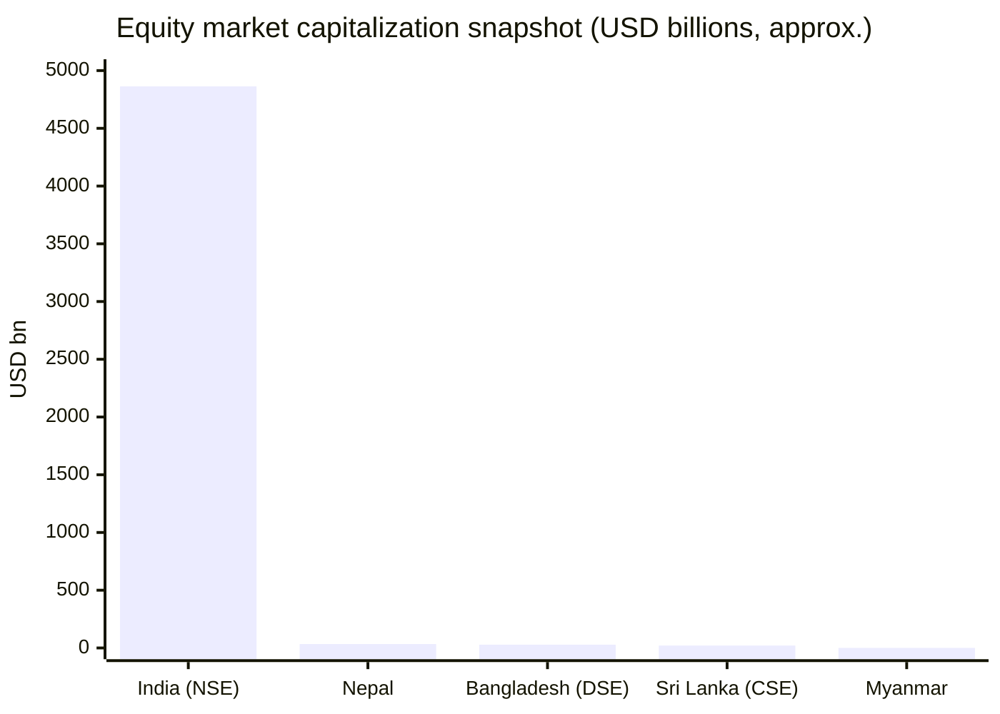

# Business and Technical Analysis for an All‑in‑One Capital Markets Platform in South Asia

## Executive summary

This report evaluates the business case and build-out requirements for an all‑in‑one Capital Markets Platform (the “Platform”), grounded in the provided MD specification (modular “operator packs,” plugin-based extensibility, shared core services). It focuses on South Asia—India, Nepal, Bangladesh, Sri Lanka, Myanmar—while benchmarking against global standards and vendor landscapes. The key conclusion is that **the strongest near‑term wedge is not “build everything at once,” but to commercialize a compliant, extensible core plus 2–3 operator packs that solve urgent regulatory + operational pain (shorter settlement, cybersecurity, cloud controls, digital onboarding, reconciliations, and reporting)**, then expand into market‑infrastructure-grade modes and a plugin marketplace.

A notable regional pattern is **regulatory-driven digitization**: India’s regulator has issued formal frameworks for **cloud adoption** and a broad **Cybersecurity and Cyber Resilience Framework** for regulated entities. citeturn16search0turn16search1turn16search12 India is also operationalizing **optional same‑day (T+0)** settlement expansion while retaining T+1—raising requirements for real-time processing, intraday risk, reconciliations, and operational controls. citeturn18news42turn19search25 In parallel, Bangladesh’s depository shows a large DP network and over 1.6M BO accounts, and Sri Lanka’s regulator explicitly promotes **end‑to‑end investor digital onboarding with eKYC**. citeturn7search5turn18search29 These are strong signals that **platform ROI will be driven by automation, control, and auditability**, not just trade execution.

From a standards perspective, any platform aspiring to exchange/CSD/CCP-grade deployment must be designed to align with: (a) **CPMI‑IOSCO PFMI** for financial market infrastructures, (b) **IOSCO Objectives & Principles** for securities regulation, and (c) **FATF risk‑based AML/CFT guidance for the securities sector**. citeturn13search0turn13search2turn13search1 These standards translate directly into required platform capabilities: robust governance, risk management, segregation of client assets, operational resilience, surveillance, data lineage, audit logs, and tested recovery processes. citeturn13search0turn13search2turn16search1

Commercially, the platform market is **crowded globally** (large suites such as Broadridge / FIS / ION / Murex, plus buy‑side leaders and specialist point solutions), so the differentiation must be anchored in (1) **South Asia compliance‑ready operator packs**, (2) **integration accelerators for local market infrastructure**, and (3) a **developer-friendly plugin contract** with conformance testing and certification gates (to build an ecosystem while controlling risk). For example, enterprise incumbents increasingly position around cloud/SaaS post‑trade: FIS markets a cloud-based SaaS post‑trade platform integrating middle office, accounting, settlement, corporate actions, collateral and more, including support for tokenized assets. citeturn19search2turn19search20

A prudent market entry strategy therefore is:

- **India**: position as **compliance + resilience + “T+0/T+1 readiness”** plus **API/algo governance** and “controls-by-default,” aligned to SEBI cloud and CSCRF requirements. citeturn16search0turn16search1turn18search4  
- **Nepal / Bangladesh / Sri Lanka**: lead with **brokerage + depository participant** packs emphasizing onboarding, client servicing, reconciliations, reporting, and operational controls, with connectors to local depository and IPO processes; Sri Lanka is already explicitly signaling digital onboarding and biometric/NIC verification as a regulatory direction. citeturn18search29turn18search22turn7search5  
- **Myanmar**: treat as a longer-horizon option or partnership-led opportunity due to significantly smaller market activity; market cap metrics are orders of magnitude smaller than peers. citeturn7search23

Implementation-wise, a realistic “platform + packs + connectors” build is typically **phased**. A credible MVP in 9–12 months is feasible if scope is limited to core + brokerage/DP pack + regulatory reporting + reconciliations, while exchange/CSD/CCP-grade modes are a 24–36 month path if pursued from scratch.

## Market landscape and sizing in South Asia

**Regional context.** Public market depth varies widely: India’s equity market is among the world’s largest; Nepal, Bangladesh, and Sri Lanka are materially smaller; Myanmar is minimal by the same metrics. For a capital markets platform, the practical “market size” is best proxied by (a) **investor account base**, (b) **market capitalization and turnover**, and (c) **counts of regulated intermediaries** (brokers/DPs/merchant bankers/investment managers), because these drive addressable software + integration spend.

**Market infrastructure scale indicators (selected).** The table below compiles publicly available, regulator/exchange/depository statistics.

| Country | Indicator | Latest public signal (selected) |
|---|---:|---|
| India | Demat accounts | 20,70,59,626 (~207.1M) demat accounts (end-Sep 2025). citeturn23view1 |
| India | Market cap | “All India” market cap ~₹452 lakh crore (Sep 2025). citeturn23view1 |
| India | Mutual fund AUM | ₹75,61,309 crore (Sep 2025). citeturn23view1 |
| India | Regulated intermediaries (examples) | Merchant bankers 235; depository participants: NSDL 299, CDSL 582 (Sep 2025 table). citeturn23view0 |
| Nepal | Market cap and listings | Stock market capitalization Rs. 4,656.99 bn mid‑July 2025; 272 listed companies mid‑July 2025. citeturn12search9 |
| Nepal | Depository adoption | Demat accounts 6,568,128 and Meroshare users 6,323,844 (CDSC live stats). citeturn7search3 |
| Nepal | Broker count signal | SEBON intermediary directory shows 90 stock brokers. citeturn24search0 |
| Bangladesh | Depository adoption | BO accounts (Operable in CDS) 1,649,821; DPs 559; ISO 27001 certified (CDBL “at a glance”). citeturn7search5 |
| Bangladesh | Broker base signal (exchange membership) | Dhaka-side TREC holders list indicates 250. citeturn25search11 |
| Sri Lanka | Digital onboarding | SEC promotes online CDS account creation and end‑to‑end digital onboarding with eKYC “in less than 5 minutes,” plus biometric authentication and NIC verification linkage. citeturn18search29 |
| Sri Lanka | Depository operations | CDS guideline supports online account opening using the CSE mobile application; acknowledgements are generated electronically. citeturn18search22 |
| Myanmar | Market scale | Stock market capitalization reported at ~USD 372.1M (CEIC, Jan 2026). citeturn7search23 |

image_group{"layout":"carousel","aspect_ratio":"16:9","query":["National Stock Exchange of India building","Dhaka Stock Exchange building","Colombo Stock Exchange building","Nepal Stock Exchange building Kathmandu","Yangon Stock Exchange building"],"num_per_query":1}

**Comparable market capitalization snapshot (cross-country).** The chart below normalizes the magnitude differences using public market cap series for the largest exchange in each market where available. India is represented by the National Stock Exchange. citeturn9search4turn0search7turn12search9turn7search23



Approximation notes: India figure is WFE “domestic market capitalisation” for the National Stock Exchange of India (USD millions). citeturn9search4 Nepal is converted from central bank-reported NPR market cap using NRB’s mid‑July USD exchange rate; this is presented as an indicative conversion, not an audited USD series. citeturn12search9 Bangladesh and Sri Lanka are WFE domestic market cap rows (USD millions). citeturn0search7 Myanmar is CEIC-reported market cap in USD. citeturn7search23

### Addressable market framing (TAM/SAM/SOM)

Because capital markets platform pricing is mostly enterprise-negotiated and public spend data is limited, a rigorous approach is to present **a range-based TAM/SAM/SOM** using transparent assumptions tied to the observable “buyer base” (counts of regulated entities) and the product scope.

- **TAM** (Total Addressable Market): all regulated institutions that could use front-to-back capital markets systems, including brokers/DPs/merchant bankers, buy-side managers, custodians, exchanges/CSDs/CCPs (where modernization is feasible).  
- **SAM** (Serviceable Addressable Market): institutions in the target countries that are realistically reachable with your deployment and compliance posture, excluding the largest global firms already locked into multi-decade vendor stacks.  
- **SOM** (Serviceable Obtainable Market, 3–5 years): near-term capture based on plausible win rates and implementation capacity.

India’s intermediary universe is very large: SEBI’s published “registered market intermediaries/institutions” table indicates hundreds to thousands of entities across segments (e.g., merchant bankers 235; investment advisors 949; research analysts 1,732; depository participants NSDL 299 and CDSL 582). citeturn23view0 Nepal’s broker base is small enough to penetrate via “category wins,” while Bangladesh shows a very large membership base (e.g., DSE-side TREC holders list of 250) and a large DP network (559 DPs) at its depository. citeturn24search0turn25search11turn7search5

**Penetration opportunities by country (high-level).**
- **India**: huge SAM but intense competition; the opportunity is strongest where regulations force system upgrades (cloud controls, cybersecurity, algo governance, T+0 readiness). citeturn16search0turn16search1turn18search4turn18news42  
- **Nepal**: strong digital participation at depository level (demat and Meroshare users in the millions) alongside a relatively small broker universe; opportunities favor packaged “operator packs” + connectors + operational reporting. citeturn7search3turn24search0  
- **Bangladesh**: scale exists in the intermediary base (TREC holders) and DP network; the penetration lever is modernization of digital brokerage operations and reconciliations, plus governance and AML/KYC digitization. citeturn25search11turn7search5turn15search1turn18search2  
- **Sri Lanka**: explicit regulator-led digitization agenda (digital onboarding, biometric auth, NIC verification) creates a straightforward product narrative linking compliance and UX automation. citeturn18search29turn18search22  
- **Myanmar**: low market cap and limited listings imply constrained near-term software spend and higher go-to-market risk. citeturn7search23turn7search18  

## Demand drivers and future requirements

This section translates global/regional trends into concrete platform requirements—what must be engineered and operationalized to be “general, standard, compliant,” and future-proof across South Asia.

### Shorter settlement cycles (T+1 → T+0) and real-time operations

A move toward T+1 and T+0 compresses operational windows and increases the need for **real-time processing, reconciliations, and intraday risk controls**—not just faster matching. Industry commentary on T+1 emphasizes the need to invest in common sources of reference data, corporate actions, and real-time global processing for finance/accounting, clearance/settlement, and stock record. citeturn19search25

India is a live case study: SEBI expanded optional **same‑day (T+0)** settlement toward the top 500 stocks (effective Jan 31, 2025) after an initial beta phase—forcing brokers and market infrastructure to handle parallel settlement cycles and operational complexity. citeturn18news42 This directly drives Platform features such as:
- event-driven processing (avoid overnight batch dependency),
- intraday ledger and position services,
- automated exception management and reconciliations,
- resilient pricing/valuation pipelines (to support margin and risk),
- cutover-safe “dual-run” capability during migration.

### ISO 20022 migration and message standardization

ISO 20022 adoption in securities messaging (corporate actions, settlement, reconciliation) is a long-term structural shift that improves interoperability but requires strong data models, mapping, and versioned integrations. SWIFT materials describe ISO 20022 as a standard messaging/data model that reduces miscommunication and manual errors in corporate actions processing. citeturn13search3 DTCC documentation and related specifications show ISO 20022 usage for corporate actions and the reality of extensions/spec variants. citeturn13search7

Platform implications:
- canonical event and instruction models (corporate actions, settlement instructions, entitlement calculations),
- message mapping/versioning tools (ISO15022 ↔ ISO20022),
- a “certification harness” for message conformance per counterparty/venue,
- reference data and identifier services (ISIN, LEI where applicable, local identifiers).

### Digital identity, eKYC, and onboarding automation

Digital onboarding is a major adoption driver in South Asia because it reduces cost-to-serve and unlocks new investors.

- India: entity["organization","Unique Identification Authority of India","uidai india id authority"] describes Aadhaar paperless offline e‑KYC, emphasizing privacy/security controls (digitally signed data, encryption, resident control). citeturn15search0turn15search4  
- Bangladesh: the entity["organization","Bangladesh Financial Intelligence Unit","bangladesh aml unit"] e‑KYC guidelines are explicitly based on national ID and biometrics, and are designed to enable digital customer onboarding and due diligence. citeturn15search1  
- Nepal: entity["organization","Department of National ID and Civil Registration","nepal national id agency"] operates national ID pre-enrollment and citizen portal systems that can underpin eKYC workflows at banks/brokers (subject to legal integration allowances). citeturn15search2turn15search10  
- Sri Lanka: entity["organization","Information and Communication Technology Agency of Sri Lanka","sri lanka ict authority"] runs the Sri Lanka Unique Digital Identity (SLUDI) project as part of the government’s digital transformation strategy. citeturn15search3

Platform requirements:
- flexible onboarding workflows per operator type (broker/DP/asset manager),
- KYC evidence vault with lifecycle controls,
- risk scoring (AML/CFT) aligned with FATF’s risk-based approach expectations for securities-sector FIs. citeturn13search1  
- secure consent and data minimization patterns (especially where national ID ecosystems are sensitive).

### Tokenization, digital asset custody, and programmable settlement

Tokenization is shifting from experimentation to structured policy discussions. entity["organization","Bank for International Settlements","global central bank forum"] / CPMI defines tokenisation as generating/recording a digital representation of traditional assets on a programmable platform. citeturn14search0 BIS has also articulated a “unified ledger” concept—bringing tokenized assets and settlement money together to harness programmability and settlement finality. citeturn14search4turn14search19

Regulatory posture remains uneven: entity["organization","Financial Stability Board","global financial watchdog"] published a global regulatory framework for crypto-asset activities (2023), emphasizing consistent regulation for stablecoins and other crypto activities (“same activity, same risk, same regulation”). citeturn14search2turn14search14 IOSCO has issued policy recommendations for crypto and digital asset markets (2023) and has continued monitoring implementation. citeturn14search13turn14search17

Platform requirements (if you decide to support tokenized instruments):
- digital-asset custody book of record (segregation, safekeeping controls),
- key management/HSM integration and transaction policy engines,
- on-chain/off-chain reconciliation and proof capture,
- “market integrity” controls aligned to IOSCO recommendations for digital asset markets. citeturn14search13  
Given the regulatory variability across the target countries, tokenization features are best delivered as **optional plugins** behind strict certification (see appendices), not core defaults.

### ESG/green bonds and Islamic finance productization

Sustainable finance is becoming operationally “real” in South Asia.

- India: SEBI has issued revised disclosure requirements for green debt securities, and also issued a framework for ESG debt securities beyond green debt. citeturn17search4turn17search12 SEBI also maintains an ESG debt securities statistics page listing issuers and issuance details. citeturn17search0  
- Sri Lanka: SEC publishes sustainability/green bond materials, noting green/blue bonds under “sustainable bonds,” and indicates the Colombo Stock Exchange’s work (under SEC guidance) toward a green index. citeturn17search2  
- Bangladesh: regulations include green bond definitions within debt securities frameworks, and the regulator has taken steps toward Islamic capital market governance (e.g., Shari’ah Advisory Council formation order). citeturn17search17turn17search3  

Platform requirements:
- use-of-proceeds tracking and allocation reporting for sustainable bonds,
- ESG taxonomy support and disclosure workflows,
- Shari’ah screening methodology tooling (where required) and governance workflows for Islamic finance products. citeturn17search3turn16search15  

### Open APIs and AI/ML for surveillance and fraud detection

Open APIs are simultaneously a growth engine and a risk surface.

India’s regulator is tightening the framework for retail participation in algorithmic trading and API-based ecosystems: SEBI issued a circular on safer participation of retail investors in algorithmic trading. citeturn18search4 SEBI also issued ease-of-doing-business measures for internet-based trading. citeturn18search1

On AI, IOSCO released a consultation report on AI in capital markets describing use cases and risks; the report notes observed use of AI by market participants (including broker-dealers) for surveillance and fraud detection. citeturn27search0 BIS summaries flag that AI can amplify vulnerabilities without appropriate controls and oversight. citeturn27search2

Platform implications:
- API gateway with strong identity + authorization + throttling + order tagging,
- audited “algo provider” onboarding/registration and strategy cataloging for API-based algo trading where required, citeturn18search4turn18news43  
- ML-assisted surveillance as an optional, controlled module with explainability, audit trails, and governance aligned to IOSCO AI risk discussions. citeturn27search0turn27search5

## Competitive landscape and positioning

### Competitive set overview

The market splits into five practical strata:

1) **Global “front-to-back” suites** (bank-grade, complex implementations).  
2) **Post-trade processing + back-office utilities** (STP, subledger, corporate actions, reconciliations).  
3) **Buy-side investment platforms** (IBOR/accounting/OMS/risk for asset managers).  
4) **Exchange/CSD/CCP technology stacks** (venue + post-trade infrastructure).  
5) **Local/regional brokerage stacks and fintechs** (often faster UX, weaker enterprise controls).

Key global vendor signals (public positioning):
- Broadridge markets multi-asset post-trade processing on a unified platform with consolidated sub-ledger and real-time settlement emphasis. citeturn19search1  
- FIS positions its post-trade platform as cloud-based SaaS integrating middle office, accounting, settlement, corporate actions, collateral management, and more, including tokenized assets. citeturn19search2turn19search20  
- ION positions XTP as a platform for post-trade derivatives processing, covering clearing, settlement, risk management, and reporting. citeturn20search0  
- entity["company","Nasdaq","us exchange operator"] integrates Calypso and AxiomSL under its FinTech offerings: Calypso emphasizes treasury/risk/operations integration, and AxiomSL is positioned as cloud/AI-enabled regulatory reporting and risk analysis. citeturn20search2turn20search3  
- Murex positions MX.3 as an integrated cross-asset platform bridging front office, risk, operations and finance, including collateral management modules. citeturn19search7turn19search11  
- entity["company","Tata Consultancy Services","india it services firm"] positions TCS BaNCS custody/corporate actions solutions as covering the capital markets value chain (trade processing through clearing/settlement, custody, accounting, corporate actions). citeturn21search3  

### Feature comparison matrix (publicly evidenced)

This matrix is intentionally “capability-level” (not a full functional checklist). “Strong/Moderate” reflects what vendors publicly claim and commonly sell into; actual implementations vary by client.

| Capability area | Broadridge | FIS | ION | Nasdaq (Calypso/AxiomSL) | Murex | TCS |
|---|---|---|---|---|---|---|
| Multi-asset post-trade processing + STP | Strong citeturn19search1 | Strong citeturn19search2 | Strong (derivatives focus) citeturn20search0 | Moderate–Strong (suite dependent) citeturn20search2turn20search3 | Strong (as part of integrated platform) citeturn19search7 | Strong (custody/corp actions orientation) citeturn21search3 |
| Sub-ledger / accounting integration | Strong citeturn19search1 | Strong citeturn19search2 | Moderate (varies by stack) citeturn20search0 | Moderate (varies) | Strong (front-to-back bridge) citeturn19search7 | Moderate–Strong citeturn21search3 |
| Collateral / margin management | Varies | Strong citeturn19search2 | Moderate | Strong citeturn20search21 | Strong citeturn19search11 | Varies |
| Regulatory reporting platform | Varies | Varies | Varies | Strong citeturn20search3 | Varies | Varies |
| Cloud / SaaS positioning (public) | Mixed | Strong citeturn19search2 | Mixed | Mixed | Mixed | Mixed |

**Pricing models (public signals).** Most enterprise vendors do not publish list pricing, but positioning indicates common models: cloud/SaaS subscription (explicit for FIS post-trade). citeturn19search2 Where pricing is opaque, your platform strategy should assume procurement will demand:
- modular pricing per operator pack and per environment,
- transparent implementation/service bundles,
- predictable “usage levers” (accounts, active users, trades, assets) tied to ROI.

### Positioning opportunity for a new entrant in South Asia

A new platform can compete if it avoids head-on “global suite replacement” and instead leads with:

1) **Compliance-first operator packs for South Asia**, mapped to local controls (cloud, cybersecurity, eKYC, audit logs, reconciliations, reporting). India provides the strongest example of explicit cloud and cybersecurity frameworks for regulated entities. citeturn16search0turn16search1  
2) **Migration-safe architecture** (dual-run ledgers, reconciliation tooling, data versioning), critical for regulated markets and shortened settlement pressures. citeturn19search25  
3) **Plugin ecosystem with certification** to localize efficiently without fragmenting the core.

## Buyer needs by sector

This section merges the “operator pack” concept from the provided MD specification with region-specific needs and control expectations.

### Brokerage and depository participant operators (retail + institutional)

Primary needs in South Asia:
- fast onboarding + eKYC,
- omnichannel trading (web/mobile) with permissioned internet trading,
- client communications (contract notes, statements),
- robust reconciliations (trades, positions, cash, margins, depository),
- operational resilience and cybersecurity governance.

India’s regulatory materials emphasize structured requirements around internet-based trading access and permissions for brokers. citeturn18search1turn18search0 Bangladesh’s regulator issued directives for digital brokerage account operations. citeturn18search2 Sri Lanka’s regulator explicitly positions digital onboarding and aggregated investor communication as a modernization goal. citeturn18search29

**Platform “minimum viable” brokerage/DP pack (controls-first):**
- client master + KYC evidence vault (with renewal triggers),
- OMS + risk checks + order tagging,
- settlement & depository integration adapters,
- client money + margin/collateral ledger,
- daily reconciliations and exception queues,
- regulatory reports (local templates),
- immutable audit logs + evidence store.

### Merchant banking / ECM / DCM operators

Needs:
- issuer workflows (IPO/RPO/rights), document management, approvals,
- bookbuilding/subscription integration where applicable,
- due diligence checklists, compliance evidence,
- post-issuance reporting and investor servicing.

Bangladesh’s regulator publishes extensive rules and draft updates for public offers, and maintains directories of regulated entities (merchant banks, asset managers). citeturn17search15turn26view0turn24search2 India’s primary market activity is large (IPO counts and amounts are published in SEBI bulletins), implying high operational loads and reporting expectations. citeturn23view1

Platform requirements:
- deal pipelines, permissions, maker-checker approvals,
- issuer “data room” plugin,
- disclosure template engine with versioning and e-sign,
- allotment/reconciliation integrations (where market infrastructure supports).

### Investment banking / M&A (advisory + execution support)

In these markets, many workflows remain document-driven. A platform can differentiate by:
- secure workflow orchestration,
- robust data/version control,
- client onboarding/eKYC reuse,
- compliance logging.

This is less “market infrastructure integration” and more **secure workflow + data governance**, aligned to regulator expectations about fair markets and investor protection. citeturn13search2

### Asset and wealth management operators

Needs:
- portfolio and order management,
- compliance rules,
- accounting/NAV/fees,
- client reporting portals.

Buy-side incumbents are strong: entity["company","BlackRock","global asset manager"] positions Aladdin as unifying investment management through a “common data language.” citeturn21search0 entity["company","SimCorp","investment management software firm"] positions SimCorp One as an integrated front-to-back platform with unified data architecture and IBOR. citeturn21search1 entity["company","Charles River Development","investment management software"] positions its OEMS as managing the journey from order construction through post-trade with compliance and audit trail. citeturn21search6turn21search10

Therefore, a new entrant should not attempt to out-feature these platforms immediately; instead, compete via:
- localized compliance packs,
- cost-effective deployment for mid-tier managers,
- integrations with local custody/depository.

### Exchange / CSD / clearing operators

If the platform is to support market infrastructure-grade deployments, the architecture must align with PFMI expectations (governance, credit/liquidity risk management, default management, settlement finality, operational risk, transparency). citeturn13search0turn13search8

Bangladesh offers instructive signals: the CCP utility exists as entity["company","Central Counterparty Bangladesh Limited","bangladesh clearing house"] (incorporated Jan 2019). citeturn25search2 This indicates the country is structurally moving toward CCP-based clearing, which increases requirements around margin, collateral, default management, and operational resilience—capabilities that must be built to a much higher bar than standard broker back offices.

## Deployment modes and platform architecture

The provided specification’s modular approach is directionally correct, but for correctness and completeness it helps to **treat Exchange/CSD/Clearing as deployment modes** (and thus as different “regulatory and operational perimeter” configurations), not just modules.

### Deployment modes and implications

```mermaid
flowchart LR
  A[Core Platform Services\nIdentity • Audit • Data • Workflow • Ledger] --> B1[Mode: Exchange-only\nTrading venue + surveillance + participant mgmt]
  A --> B2[Mode: CSD-only\nSecurities accounts • corporate actions • asset servicing]
  A --> B3[Mode: Clearing-only\nCCP margin • default mgmt • clearing member ops]
  A --> B4[Mode: Integrated Utility\nExchange + CSD + Clearing\n(single or tightly-coupled FMI)]
  B1 --> C[Operator Packs & Plugins\nBroker • DP • Custodian • Issuer • Asset Manager]
  B2 --> C
  B3 --> C
  B4 --> C
```

Standards alignment:
- **CSD / CCP / integrated utility** modes are most directly constrained by PFMI expectations. citeturn13search0turn13search8  
- Intermediary-facing packs must align to IOSCO principles (market integrity, client asset protection, conflicts, fair dealing). citeturn13search2  
- AML/CFT tooling must align to FATF risk-based guidance in securities markets. citeturn13search1  

### Architecture gaps to close (from a “controls and completeness” perspective)

To meet the user’s requested missing sections—**Reference Data / Pricing / Collateral / Client Money / GL / Versioning / Certification**—the Platform should explicitly model:

- **Reference Data & Security Master**: instruments, identifiers, corporate actions calendars, market conventions, participant reference sets (required for STP and reconciliations). Shorter settlement cycles increase sensitivity to reference data breaks. citeturn19search25  
- **Pricing & Valuation Services**: market data ingestion, pricing sources, valuation snapshots, and replayable valuation history (required for margin/collateral and client reporting).  
- **Collateral & Margin**: rules engine, eligibility, haircuts, concentration limits, intraday calls, collateral inventory, pledge/release, margin backtesting (especially if clearing mode is supported). citeturn13search0turn19search2turn19search11  
- **Client Money / Safeguarding**: client money segregation, bank account mapping, interest allocation, breach monitoring, daily client money reconciliations, audit evidence (IOSCO principles emphasize investor protection; PFMI covers custody and investment risks for FMIs). citeturn13search2turn13search0  
- **General Ledger integration (“subledger → GL”)**: chart of accounts mapping, posting rules, period close controls, valuation and FX revaluation, audit trails.  
- **Data Versioning & Lineage**: immutable event store, correction workflows, snapshot versioning per regulatory report run; critical for disputes, inspections, and surveillance. SEBI’s compliance posture increasingly emphasizes operational and cybersecurity controls across the regulated ecosystem. citeturn16search1turn18news41  
- **Certification**: conformance test harness for plugins and external interfaces (ISO 20022 adapters, exchange gateways, regulatory reports), plus a risk-based certification tiering.

### Plugin ecosystem opportunity map and monetization

A plugin marketplace is commercially compelling because each country has unique workflows and reporting. However, plugins create systemic risk unless certified and constrained.

**High-value plugin categories in South Asia**
- Regulatory reporting packs (local templates + validations)
- eKYC adapters (national ID / bank KYC rails) citeturn15search0turn15search1turn18search29  
- IPO and primary issuance workflow plugins (Bangladesh/India high activity) citeturn23view1turn26view0  
- ESG/green bond disclosure and tracking plugins citeturn17search4turn17search12turn17search2  
- Islamic finance screening and governance plugins (Bangladesh, Sri Lanka) citeturn17search3turn16search15  
- T+0/T+1 operational tooling (intraday ledger, predictive fails, cutover automation) citeturn18news42turn19search25  
- AI-assisted surveillance/fraud detection plugins, gated by strong governance and transparency (IOSCO AI report). citeturn27search0turn27search5  

**Monetization models (practical):**
- core subscription (platform) + per-pack subscription (operator pack),
- usage-based fees (accounts, active users, trades, AUM bands),
- integration fees for certified connectivity modules,
- plugin store revenue share (e.g., 70/30) plus certification fees,
- premium “regulatory assurance” tier (certification, audit artifacts, managed updates).

## Go‑to‑market strategy, partnerships, risks, and country SWOTs

### Country-specific partnerships and route-to-market

**India**
- **Primary partnerships**: system integrators and regtech/infosec partners for compliance-heavy deployments; cloud providers with audited control frameworks; broker/wealth platforms needing SEBI cloud and CSCRF compliance automation. citeturn16search0turn16search1  
- **Wedge offerings**: “CSCRF‑ready broker stack,” API/algo governance tooling (tagging, registration workflows), and T+0 readiness modules. citeturn18search4turn18news42  
- **Regulatory signals**: SEBI frameworks for cloud adoption and cybersecurity/cyber resilience are direct product requirements. citeturn16search0turn16search1  

**Nepal**
- **Primary partnerships**: broker associations, the depository utility, and local banks for payment rails; focus on packaged implementations for 90 brokers (SEBON directory). citeturn24search0  
- **Wedge offerings**: broker/DP operator pack with deep reconciliations; investor portal connectors aligned to existing depository participation (millions of demat/Meroshare users). citeturn7search3  
- **Regulatory signals**: central bank reports show market growth and sector composition (banks/insurance dominate market cap), implying risk/reporting features should support those instruments first. citeturn12search9  

**Bangladesh**
- **Primary partnerships**: depository and DP ecosystem (large DP network), broker community (TREC holders), and AML/KYC stakeholders aligned to e-KYC guidelines. citeturn7search5turn15search1turn25search11  
- **Wedge offerings**: DP/broker back office modernization with reconciliations, BO servicing, margin controls, reporting; optional Islamic finance governance plugin (Shari’ah advisory council formation indicates institutionalization). citeturn17search3turn18search2  
- **Market infrastructure**: CCP existence (CCBL) suggests future demand for clearing-grade margin/collateral workflows (potential later phase). citeturn25search2turn25search6  

**Sri Lanka**
- **Primary partnerships**: regulator-led digitization initiatives; brokerage distribution with mobile-first onboarding; sustainable finance initiatives. citeturn18search29turn17search2  
- **Wedge offerings**: digital onboarding + brokerage/DP operations; statement distribution and investor direct-link tooling; GSS/green bond disclosure plugin. citeturn18search22turn17search2  

**Myanmar**
- **Primary partnerships**: exchange and regulator partnerships are prerequisite; likely a limited buyer pool.  
- **Wedge offerings**: if pursued, a lightweight brokerage/back office stack with strong compliance defaults; however market size signals warrant caution. citeturn7search23  

### Regulatory and operational risks

- **Cloud and outsourcing constraints**: India explicitly regulates cloud adoption for SEBI-regulated entities; failure to meet control expectations will block procurement. citeturn16search0turn16search12  
- **Cybersecurity and resilience**: SEBI’s CSCRF and similar expectations globally require governance, asset inventory classification, incident reporting, and resilience practices; your platform must embed these as “defaults,” not add-ons. citeturn16search1turn16search12  
- **API/algo ecosystem risk**: retail algo governance in India is tightening; platform needs strategy registration, tagging, audit trails, and control points. citeturn18search4turn18news43  
- **AML/CFT**: FATF expects a risk-based approach in the securities sector, requiring systematic risk assessment, monitoring, and escalation. citeturn13search1  
- **Digital assets regulatory uncertainty**: global bodies call for consistent crypto regulation; fragmented rules can create compliance and reputational risk if tokenization features are offered without strong constraints. citeturn14search2turn14search13  
- **Integration lock-in to market infrastructure**: exchanges/CSDs/CCPs impose test/certification gates and idiosyncratic connectivity constraints—this must be planned as a product line (connectors + certification harness), not ad-hoc services.

### SWOT summaries (entry stance)

**India**
- Strengths: massive investor base and deep markets; strong regulatory clarity on cloud/cyber controls (helps define requirements). citeturn23view1turn16search0turn16search1  
- Weaknesses: intense incumbent competition; high compliance and integration costs.  
- Opportunities: T+0 expansion, retail algo governance, and cybersecurity frameworks drive upgrades. citeturn18news42turn18search4turn16search1  
- Threats: long vendor lock-ins; regulatory change pace; outages/compliance penalties.

**Nepal**
- Strengths: concentrated market with a manageable broker universe; strong depository adoption. citeturn24search0turn7search3  
- Weaknesses: smaller budgets; heavy reliance on a few infrastructure entities.  
- Opportunities: packaged broker/DP modernization, reconciliations, and client servicing automation. citeturn7search3  
- Threats: procurement constraints; integration risk with existing systems.

**Bangladesh**
- Strengths: sizable intermediary membership (TREC holders) and large DP network; depository publishes operational stats. citeturn25search11turn7search5  
- Weaknesses: market volatility and governance challenges can constrain tech budgets.  
- Opportunities: digital brokerage account directives and eKYC enable modernization programs. citeturn18search2turn15search1  
- Threats: policy swings; operational constraints around CCP adoption and clearing reforms. citeturn25search2  

**Sri Lanka**
- Strengths: regulator publicly pushing digital onboarding and NIC verification integration. citeturn18search29  
- Weaknesses: smaller market scale; macro constraints.  
- Opportunities: onboarding + client communications, sustainable finance productization. citeturn17search2turn18search22  
- Threats: currency and market cycles affecting project funding.

**Myanmar**
- Strengths: potential “greenfield” modernization in a small ecosystem.  
- Weaknesses: very small market scale; uncertain operating environment. citeturn7search23  
- Opportunities: partnership-led modernization if the market expands.  
- Threats: political/regulatory instability; low near-term ROI.

### Staffing, implementation cost ballparks, and timeline options (illustrative)

These are not “market prices” (public data is limited); they are **engineering-delivery ranges** for planning.

| Option | Scope | Timeline | Core team size (approx.) | Cost range (USD, indicative) |
|---|---|---:|---:|---:|
| MVP (commercial wedge) | Core platform + brokerage/DP pack + reconciliations + regulatory reports + 1–2 exchange/depository connectors | 9–12 months | 30–60 FTE | $3M–$12M |
| Standard growth | MVP + merchant banking workflows + richer data/pricing + onboarding automation + plugin marketplace v1 | 18–24 months | 60–110 FTE | $12M–$35M |
| Utility-grade | Standard + clearing/CSD modes, PFMI-grade resilience, multi-venue certification harness, advanced collateral | 24–36+ months | 120–200+ FTE | $35M–$120M |

## Appendices

**Appendix: Methodology (how the analysis was built).**  
The report uses (1) public regulator/depository/exchange statistics to characterize scale and adoption, (2) international standards (PFMI, IOSCO Principles, FATF guidance) to derive “compliance-grade” system requirements, and (3) vendor public documentation to establish competitive capability signals. citeturn23view0turn23view1turn13search0turn13search2turn13search1turn19search2turn20search0

**Appendix: Key data assumptions (for estimates).**  
- Market cap snapshots are used as *relative magnitude signals*, not revenue proxies. WFE domestic market capitalization is used for cross-country comparability where available. citeturn9search4turn0search7  
- Nepal USD conversion is based on NRB-reported market cap and exchange rate at mid‑July 2025. citeturn12search9  
- TAM/SAM/SOM and cost estimates are presented as transparent ranges because enterprise vendor pricing and institutional IT spend are rarely public.

**Appendix: Prioritized feature checklist mapped to regulatory controls.**  
The table below maps “must-have” features (from a compliance and operational risk standpoint) to the global control objectives that commonly show up in local regulations.

| Priority feature | Control objective | Reference standard(s) |
|---|---|---|
| Identity, role-based access, strong audit logs | Accountability, traceability, governance | PFMI governance/operational risk themes; IOSCO principles on fair, transparent markets citeturn13search0turn13search2 |
| Client asset & client money segregation | Investor protection, safekeeping, reduced systemic risk | IOSCO investor protection objectives; PFMI custody/investment risks (FMI context) citeturn13search2turn13search0 |
| Reconciliations (trades/positions/cash/margin) with exception mgmt | Operational integrity under compressed cycles | “T+1 and beyond” operational need for common reference data and real-time processing citeturn19search25 |
| Cloud control plane (data classification, vendor risk, exit plans) | Outsourcing and operational resilience | SEBI cloud adoption framework (India buyers) citeturn16search0 |
| Cyber resilience (asset inventory, incident response, monitoring) | Systemic resilience | SEBI CSCRF (India), plus PFMI operational risk expectations scaled to system criticality citeturn16search1turn13search0 |
| AML/CFT risk engine & monitoring workflows | Risk-based approach in securities sector | FATF RBA guidance for securities sector citeturn13search1 |
| ISO 20022-ready integration layer | Interoperability, reduced manual errors | SWIFT/DTCC ISO 20022 materials citeturn13search3turn13search7 |
| ESG/Green bond disclosure workflows | Integrity of sustainable finance claims | SEBI green/ESG debt frameworks; Sri Lanka green bond materials citeturn17search4turn17search12turn17search2 |
| AI governance + explainability for surveillance modules | Market integrity and consumer protection | IOSCO AI in capital markets report; BIS AI stability summary citeturn27search0turn27search2 |

**Appendix: Plugin contract JSON Schema (manifest-level).**  
Below is a practical plugin “manifest” schema intended to support: capability discovery, permissions, data contracts, compatibility, and certification tiering. (This is compatible with the intent of the provided MD spec and extends it to cover certification/versioning-oriented controls.)

```json
{
  "$schema": "https://json-schema.org/draft/2020-12/schema",
  "$id": "https://example.com/schemas/cmp-plugin-manifest.schema.json",
  "title": "Capital Markets Platform Plugin Manifest",
  "type": "object",
  "additionalProperties": false,
  "required": [
    "name",
    "version",
    "vendor",
    "description",
    "capabilities",
    "interfaces",
    "security",
    "compatibility",
    "certification"
  ],
  "properties": {
    "name": {
      "type": "string",
      "pattern": "^[a-z0-9][a-z0-9\\-\\.]{2,63}$",
      "description": "Stable plugin ID (dns-like slug)."
    },
    "version": {
      "type": "string",
      "pattern": "^(0|[1-9]\\d*)\\.(0|[1-9]\\d*)\\.(0|[1-9]\\d*)(-[0-9A-Za-z\\-.]+)?(\\+[0-9A-Za-z\\-.]+)?$",
      "description": "Semantic version."
    },
    "vendor": {
      "type": "object",
      "additionalProperties": false,
      "required": [
        "name",
        "website",
        "support_email"
      ],
      "properties": {
        "name": { "type": "string", "minLength": 2, "maxLength": 120 },
        "website": { "type": "string", "format": "uri" },
        "support_email": { "type": "string", "format": "email" }
      }
    },
    "description": { "type": "string", "minLength": 10, "maxLength": 2000 },
    "capabilities": {
      "type": "array",
      "minItems": 1,
      "items": {
        "type": "string",
        "enum": [
          "brokerage.oms",
          "brokerage.risk_checks",
          "dp.corporate_actions",
          "dp.statement_delivery",
          "posttrade.settlement_adapter",
          "posttrade.reconciliation_pack",
          "clearing.margin_engine",
          "collateral.eligibility_rules",
          "client_money.reconciliation",
          "issuer.ecm_workflow",
          "issuer.dcm_workflow",
          "esg.disclosures",
          "islamic.shariah_screening",
          "reg_reporting.templates",
          "market_data.pricing_adapter",
          "surveillance.alert_rules",
          "surveillance.ai_assist",
          "digital_assets.custody",
          "iso20022.mapper"
        ]
      }
    },
    "interfaces": {
      "type": "object",
      "additionalProperties": false,
      "required": [
        "api",
        "events",
        "data_contracts"
      ],
      "properties": {
        "api": {
          "type": "object",
          "additionalProperties": false,
          "required": ["openapi"],
          "properties": {
            "openapi": { "type": "string", "format": "uri" },
            "base_path": { "type": "string", "default": "/" }
          }
        },
        "events": {
          "type": "object",
          "additionalProperties": false,
          "properties": {
            "publishes": { "type": "array", "items": { "type": "string" } },
            "subscribes": { "type": "array", "items": { "type": "string" } }
          }
        },
        "data_contracts": {
          "type": "array",
          "minItems": 1,
          "items": {
            "type": "object",
            "additionalProperties": false,
            "required": ["name", "schema", "classification"],
            "properties": {
              "name": { "type": "string" },
              "schema": { "type": "string", "format": "uri" },
              "classification": {
                "type": "string",
                "enum": ["public", "internal", "confidential", "restricted"]
              }
            }
          }
        }
      }
    },
    "security": {
      "type": "object",
      "additionalProperties": false,
      "required": [
        "permissions",
        "secrets",
        "audit"
      ],
      "properties": {
        "permissions": {
          "type": "array",
          "items": {
            "type": "string",
            "enum": [
              "read.positions",
              "write.orders",
              "read.client_pii",
              "write.client_pii",
              "read.cash_ledger",
              "write.cash_ledger",
              "read.collateral",
              "write.collateral",
              "export.reg_reports",
              "admin.configure"
            ]
          }
        },
        "secrets": {
          "type": "array",
          "items": {
            "type": "object",
            "additionalProperties": false,
            "required": ["name", "type"],
            "properties": {
              "name": { "type": "string" },
              "type": { "type": "string", "enum": ["api_key", "oauth_client", "certificate", "hsm_key_ref"] }
            }
          }
        },
        "audit": {
          "type": "object",
          "additionalProperties": false,
          "required": ["log_level", "pii_redaction"],
          "properties": {
            "log_level": { "type": "string", "enum": ["minimal", "standard", "verbose"] },
            "pii_redaction": { "type": "boolean" }
          }
        }
      }
    },
    "compatibility": {
      "type": "object",
      "additionalProperties": false,
      "required": [
        "platform_min_version",
        "platform_max_tested_version"
      ],
      "properties": {
        "platform_min_version": { "type": "string" },
        "platform_max_tested_version": { "type": "string" }
      }
    },
    "certification": {
      "type": "object",
      "additionalProperties": false,
      "required": [
        "tier",
        "evidence"
      ],
      "properties": {
        "tier": {
          "type": "string",
          "enum": ["self_attested", "verified", "regulated_critical"]
        },
        "evidence": {
          "type": "array",
          "items": {
            "type": "object",
            "additionalProperties": false,
            "required": ["type", "uri"],
            "properties": {
              "type": {
                "type": "string",
                "enum": [
                  "pen_test_report",
                  "soc2_iso27001",
                  "bcdr_test_results",
                  "data_flow_diagram",
                  "threat_model",
                  "performance_benchmark",
                  "integration_conformance"
                ]
              },
              "uri": { "type": "string", "format": "uri" }
            }
          }
        }
      }
    }
  }
}
```

**Appendix: Conformance test checklist (minimum gates).**  
A platform-safe plugin ecosystem requires **repeatable tests** before install/upgrade. This checklist is intended to be automatable.

1) **Package integrity**
- Manifest validates against schema; semver valid.
- Signed artifact verification (supply chain controls).
- Dependency graph resolves; no forbidden licenses (if policy applies).

2) **Security**
- Declared permissions are minimal and match observed runtime calls (deny-by-default).
- Secrets integration uses approved mechanisms only; no plaintext secrets.
- PII handling: classification tags present; redaction verified in logs.
- Basic vulnerability scan passes (SCA + container scan).

3) **Operational controls**
- Health checks, timeouts, retries, idempotency for external calls.
- Backpressure behavior tested (queue limits, rate limiting).
- Audit logs emitted for all regulated actions (orders, allocations, client changes, ledger postings).

4) **Data correctness**
- Reconciliation hooks: can produce deterministic “as-of” snapshots.
- Reference data versioning: supports effective-dated changes and replay.
- If pricing/valuation is involved: reproducible valuation at timestamp with recorded inputs.

5) **Performance and resilience**
- Load test at declared capacity; no resource leaks.
- Failure-mode tests: downstream outage, partial fills, duplicate events, clock skew.
- Recovery test: restart/rollback retains consistent state.

6) **Interface conformance**
- If ISO 20022/venue adapter: message validation suite passes (schemas + agreed extensions).
- If regulatory report plugin: template + validation suite passes against known samples.

7) **Certification tier gates**
- **Self_attested**: passes automated suite + vendor attestation.
- **Verified**: includes independent security review evidence and BCDR test documents.
- **Regulated_critical**: includes regulator/market-infrastructure required conformance artifacts (integration certification, operational resilience evidence), aligned in spirit with PFMI expectations for critical FMIs. citeturn13search0turn13search8