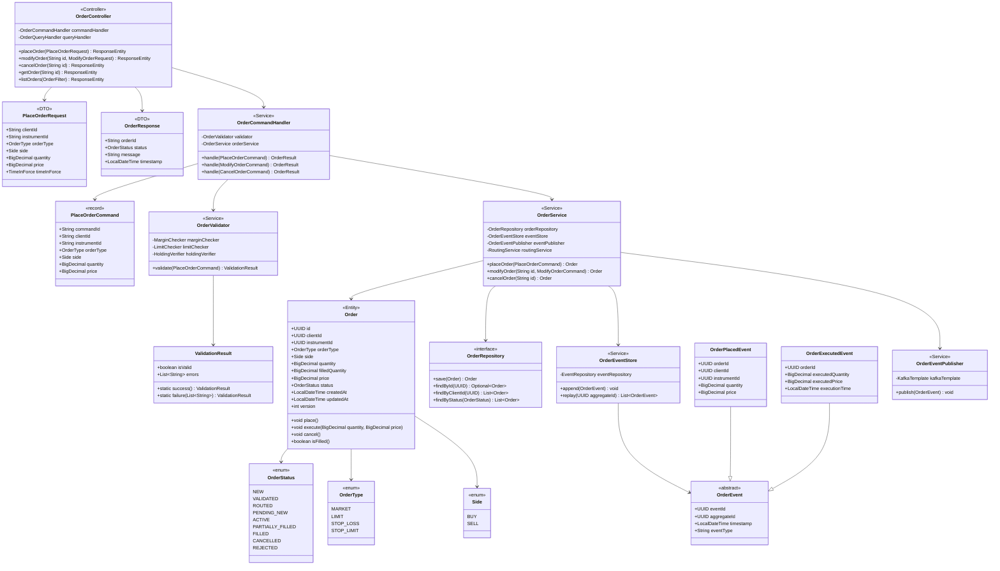
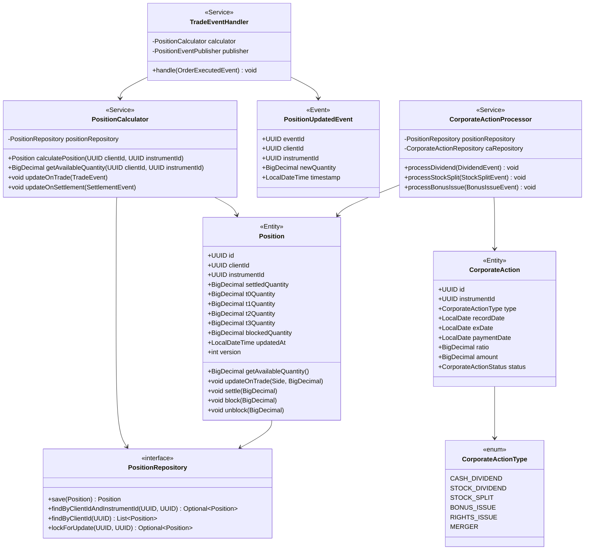

# C4 DIAGRAM PACK - C4 CODE LEVEL
## Project Siddhanta: All-In-One Capital Markets Platform

**Version:** 2.0  
**Date:** June 2025  
**Diagram Level:** C4 - Code/Class Architecture  
**Status:** Hardened Architecture Baseline

---

## 1. DIAGRAM LEGEND

### Class Types
- **🎯 Controller**: HTTP endpoint handler
- **📦 Entity**: JPA entity (database table)
- **🔧 Service**: Business logic service
- **📊 Repository**: Data access interface
- **📝 DTO**: Data Transfer Object
- **⚡ Event**: Domain event class
- **🛡️ Validator**: Validation logic
- **🔌 Adapter**: External integration

### Relationships
- **→ Uses**: Dependency relationship
- **⊃ Extends**: Inheritance
- **⊂ Implements**: Interface implementation
- **◇ Aggregates**: Composition

### Stereotypes
- **«interface»**: Java interface
- **«abstract»**: Abstract class
- **«enum»**: Enumeration
- **«record»**: Java record (immutable)

---

## 2. C4 CODE DIAGRAM - ORDER DOMAIN



---

## 3. CLASS DESCRIPTIONS - ORDER DOMAIN

### 3.1 Controller Layer

#### OrderController
**Package**: `com.siddhanta.oms.api.controller`  
**Responsibility**: REST API endpoint handler for order operations

**Annotations**:
```java
@RestController
@RequestMapping("/api/v1/orders")
@Validated
@Slf4j
```

**Key Methods**:
```java
@PostMapping
public ResponseEntity<OrderResponse> placeOrder(
    @Valid @RequestBody PlaceOrderRequest request,
    @AuthenticationPrincipal User user
) {
    PlaceOrderCommand command = mapper.toCommand(request, user);
    OrderResult result = commandHandler.handle(command);
    return ResponseEntity.ok(mapper.toResponse(result));
}

@PutMapping("/{id}")
public ResponseEntity<OrderResponse> modifyOrder(
    @PathVariable String id,
    @Valid @RequestBody ModifyOrderRequest request
) {
    // Implementation
}

@DeleteMapping("/{id}")
public ResponseEntity<Void> cancelOrder(@PathVariable String id) {
    // Implementation
}

@GetMapping("/{id}")
public ResponseEntity<OrderResponse> getOrder(@PathVariable String id) {
    // Implementation
}
```

**Error Handling**:
```java
@ExceptionHandler(ValidationException.class)
public ResponseEntity<ErrorResponse> handleValidation(ValidationException ex) {
    return ResponseEntity.badRequest().body(new ErrorResponse(ex.getMessage()));
}
```

---

### 3.2 DTO Layer

#### PlaceOrderRequest
**Package**: `com.siddhanta.oms.api.dto`  
**Responsibility**: Request DTO for order placement

```java
public record PlaceOrderRequest(
    @NotNull String clientId,
    @NotNull String instrumentId,
    @NotNull OrderType orderType,
    @NotNull Side side,
    @NotNull @Positive BigDecimal quantity,
    @Positive BigDecimal price,
    TimeInForce timeInForce
) {
    public PlaceOrderRequest {
        if (orderType == OrderType.LIMIT && price == null) {
            throw new IllegalArgumentException("Price required for limit orders");
        }
    }
}
```

**Validation**:
- Bean Validation annotations (`@NotNull`, `@Positive`)
- Custom validation in compact constructor

#### OrderResponse
**Package**: `com.siddhanta.oms.api.dto`  
**Responsibility**: Response DTO for order operations

```java
public record OrderResponse(
    String orderId,
    OrderStatus status,
    String message,
    LocalDateTime timestamp
) {
    public static OrderResponse success(String orderId, OrderStatus status) {
        return new OrderResponse(orderId, status, "Order processed successfully", LocalDateTime.now());
    }
    
    public static OrderResponse failure(String message) {
        return new OrderResponse(null, null, message, LocalDateTime.now());
    }
}
```

---

### 3.3 Command Layer

#### OrderCommandHandler
**Package**: `com.siddhanta.oms.application.command`  
**Responsibility**: Command handler (CQRS write side)

```java
@Service
@Slf4j
public class OrderCommandHandler {
    private final OrderValidator validator;
    private final OrderService orderService;
    
    @Transactional
    public OrderResult handle(PlaceOrderCommand command) {
        log.info("Handling PlaceOrderCommand: {}", command.commandId());
        
        ValidationResult validation = validator.validate(command);
        if (!validation.isValid()) {
            return OrderResult.failure(validation.errors());
        }
        
        Order order = orderService.placeOrder(command);
        return OrderResult.success(order);
    }
    
    @Transactional
    public OrderResult handle(ModifyOrderCommand command) {
        // Implementation
    }
    
    @Transactional
    public OrderResult handle(CancelOrderCommand command) {
        // Implementation
    }
}
```

**Transaction Management**: `@Transactional` ensures atomicity

#### PlaceOrderCommand
**Package**: `com.siddhanta.oms.application.command`  
**Responsibility**: Immutable command object

```java
public record PlaceOrderCommand(
    String commandId,
    String clientId,
    String instrumentId,
    OrderType orderType,
    Side side,
    BigDecimal quantity,
    BigDecimal price,
    TimeInForce timeInForce,
    LocalDateTime timestamp
) {
    public PlaceOrderCommand {
        Objects.requireNonNull(commandId, "commandId must not be null");
        Objects.requireNonNull(clientId, "clientId must not be null");
        // Additional validations
    }
}
```

**Immutability**: Java record (final fields, no setters)

---

### 3.4 Validation Layer

#### OrderValidator
**Package**: `com.siddhanta.oms.domain.validator`  
**Responsibility**: Business rule validation

```java
@Service
@Slf4j
public class OrderValidator {
    private final MarginChecker marginChecker;
    private final LimitChecker limitChecker;
    private final HoldingVerifier holdingVerifier;
    private final ReferenceDataService referenceDataService;
    
    public ValidationResult validate(PlaceOrderCommand command) {
        List<String> errors = new ArrayList<>();
        
        // Validate instrument
        if (!referenceDataService.isInstrumentTradable(command.instrumentId())) {
            errors.add("Instrument not tradable");
        }
        
        // Validate trading hours
        if (!isTradingHours()) {
            errors.add("Outside trading hours");
        }
        
        // Validate margin (for buy orders)
        if (command.side() == Side.BUY) {
            if (!marginChecker.hasRequiredMargin(command)) {
                errors.add("Insufficient margin");
            }
        }
        
        // Validate holdings (for sell orders)
        if (command.side() == Side.SELL) {
            if (!holdingVerifier.hasRequiredHoldings(command)) {
                errors.add("Insufficient holdings");
            }
        }
        
        // Validate limits
        if (!limitChecker.withinLimits(command)) {
            errors.add("Exceeds exposure limits");
        }
        
        return errors.isEmpty() 
            ? ValidationResult.success() 
            : ValidationResult.failure(errors);
    }
    
    private boolean isTradingHours() {
        // Implementation
    }
}
```

**Validation Rules**:
- Instrument tradability
- Trading hours
- Margin requirements
- Holdings verification
- Exposure limits

#### ValidationResult
**Package**: `com.siddhanta.oms.domain.validator`  
**Responsibility**: Validation result value object

```java
public class ValidationResult {
    private final boolean valid;
    private final List<String> errors;
    
    private ValidationResult(boolean valid, List<String> errors) {
        this.valid = valid;
        this.errors = List.copyOf(errors);
    }
    
    public static ValidationResult success() {
        return new ValidationResult(true, Collections.emptyList());
    }
    
    public static ValidationResult failure(List<String> errors) {
        return new ValidationResult(false, errors);
    }
    
    public boolean isValid() {
        return valid;
    }
    
    public List<String> errors() {
        return errors;
    }
}
```

---

### 3.5 Domain Layer

#### OrderService
**Package**: `com.siddhanta.oms.domain.service`  
**Responsibility**: Core order domain logic

```java
@Service
@Slf4j
public class OrderService {
    private final OrderRepository orderRepository;
    private final OrderEventStore eventStore;
    private final OrderEventPublisher eventPublisher;
    private final RoutingService routingService;
    
    @Transactional
    public Order placeOrder(PlaceOrderCommand command) {
        // Create order entity
        Order order = Order.builder()
            .id(UUID.randomUUID())
            .clientId(UUID.fromString(command.clientId()))
            .instrumentId(UUID.fromString(command.instrumentId()))
            .orderType(command.orderType())
            .side(command.side())
            .quantity(command.quantity())
            .price(command.price())
            .status(OrderStatus.NEW)
            .createdAt(LocalDateTime.now())
            .build();
        
        // Place order (state transition)
        order.place();
        
        // Persist order
        order = orderRepository.save(order);
        
        // Store event
        OrderPlacedEvent event = new OrderPlacedEvent(
            UUID.randomUUID(),
            order.getId(),
            LocalDateTime.now(),
            order.getClientId(),
            order.getInstrumentId(),
            order.getQuantity(),
            order.getPrice()
        );
        eventStore.append(event);
        
        // Publish event (async)
        eventPublisher.publish(event);
        
        // Route order to exchange
        routingService.route(order);
        
        log.info("Order placed: {}", order.getId());
        return order;
    }
    
    @Transactional
    public Order executeOrder(String orderId, BigDecimal quantity, BigDecimal price) {
        Order order = orderRepository.findById(UUID.fromString(orderId))
            .orElseThrow(() -> new OrderNotFoundException(orderId));
        
        order.execute(quantity, price);
        order = orderRepository.save(order);
        
        OrderExecutedEvent event = new OrderExecutedEvent(
            UUID.randomUUID(),
            order.getId(),
            LocalDateTime.now(),
            quantity,
            price,
            LocalDateTime.now()
        );
        eventStore.append(event);
        eventPublisher.publish(event);
        
        return order;
    }
}
```

**Transactional Outbox**: Events published within same transaction

#### Order (Entity)
**Package**: `com.siddhanta.oms.domain.model`  
**Responsibility**: Order aggregate root

```java
@Entity
@Table(name = "orders")
@Getter
@NoArgsConstructor
@AllArgsConstructor
@Builder
public class Order {
    @Id
    private UUID id;
    
    @Column(nullable = false)
    private UUID clientId;
    
    @Column(nullable = false)
    private UUID instrumentId;
    
    @Enumerated(EnumType.STRING)
    @Column(nullable = false)
    private OrderType orderType;
    
    @Enumerated(EnumType.STRING)
    @Column(nullable = false)
    private Side side;
    
    @Column(nullable = false, precision = 19, scale = 4)
    private BigDecimal quantity;
    
    @Column(precision = 19, scale = 4)
    private BigDecimal filledQuantity = BigDecimal.ZERO;
    
    @Column(precision = 19, scale = 4)
    private BigDecimal price;
    
    @Enumerated(EnumType.STRING)
    @Column(nullable = false)
    private OrderStatus status;
    
    @Column(nullable = false)
    private LocalDateTime createdAt;
    
    private LocalDateTime updatedAt;
    
    @Version
    private int version;
    
    public void place() {
        if (status != OrderStatus.NEW) {
            throw new IllegalStateException("Order already placed");
        }
        status = OrderStatus.VALIDATED;
        updatedAt = LocalDateTime.now();
    }
    
    public void execute(BigDecimal executedQuantity, BigDecimal executedPrice) {
        if (status != OrderStatus.ACTIVE && status != OrderStatus.PARTIALLY_FILLED) {
            throw new IllegalStateException("Order not active");
        }
        
        filledQuantity = filledQuantity.add(executedQuantity);
        
        if (filledQuantity.compareTo(quantity) >= 0) {
            status = OrderStatus.FILLED;
        } else {
            status = OrderStatus.PARTIALLY_FILLED;
        }
        
        updatedAt = LocalDateTime.now();
    }
    
    public void cancel() {
        if (status == OrderStatus.FILLED || status == OrderStatus.CANCELLED) {
            throw new IllegalStateException("Cannot cancel order in status: " + status);
        }
        status = OrderStatus.CANCELLED;
        updatedAt = LocalDateTime.now();
    }
    
    public boolean isFilled() {
        return status == OrderStatus.FILLED;
    }
    
    public BigDecimal getRemainingQuantity() {
        return quantity.subtract(filledQuantity);
    }
}
```

**Key Features**:
- **Optimistic Locking**: `@Version` field prevents concurrent updates
- **State Machine**: State transitions enforced in methods
- **Invariants**: Business rules enforced (e.g., cannot cancel filled order)
- **Precision**: `BigDecimal` for monetary values

---

### 3.6 Repository Layer

#### OrderRepository
**Package**: `com.siddhanta.oms.domain.repository`  
**Responsibility**: Order data access interface

```java
@Repository
public interface OrderRepository extends JpaRepository<Order, UUID> {
    
    List<Order> findByClientId(UUID clientId);
    
    List<Order> findByStatus(OrderStatus status);
    
    @Query("SELECT o FROM Order o WHERE o.clientId = :clientId " +
           "AND o.createdAt >= :fromDate AND o.createdAt <= :toDate")
    List<Order> findByClientIdAndDateRange(
        @Param("clientId") UUID clientId,
        @Param("fromDate") LocalDateTime fromDate,
        @Param("toDate") LocalDateTime toDate
    );
    
    @Query("SELECT o FROM Order o WHERE o.status IN :statuses " +
           "AND o.createdAt < :cutoffTime")
    List<Order> findStaleOrders(
        @Param("statuses") List<OrderStatus> statuses,
        @Param("cutoffTime") LocalDateTime cutoffTime
    );
    
    @Modifying
    @Query("UPDATE Order o SET o.status = :newStatus " +
           "WHERE o.id = :orderId AND o.version = :version")
    int updateStatus(
        @Param("orderId") UUID orderId,
        @Param("newStatus") OrderStatus newStatus,
        @Param("version") int version
    );
}
```

**Query Methods**:
- Derived queries (Spring Data JPA)
- Custom JPQL queries (`@Query`)
- Modifying queries (`@Modifying`)

---

### 3.7 Event Layer

#### OrderEvent (Abstract)
**Package**: `com.siddhanta.oms.domain.event`  
**Responsibility**: Base class for all order events

```java
@Getter
@AllArgsConstructor
public abstract class OrderEvent {
    private final UUID eventId;
    private final UUID aggregateId;
    private final LocalDateTime timestamp;
    
    public abstract String getEventType();
}
```

#### OrderPlacedEvent
**Package**: `com.siddhanta.oms.domain.event`  
**Responsibility**: Event emitted when order is placed

```java
@Getter
@EqualsAndHashCode(callSuper = true)
public class OrderPlacedEvent extends OrderEvent {
    private final UUID orderId;
    private final UUID clientId;
    private final UUID instrumentId;
    private final BigDecimal quantity;
    private final BigDecimal price;
    
    public OrderPlacedEvent(
        UUID eventId,
        UUID aggregateId,
        LocalDateTime timestamp,
        UUID clientId,
        UUID instrumentId,
        BigDecimal quantity,
        BigDecimal price
    ) {
        super(eventId, aggregateId, timestamp);
        this.orderId = aggregateId;
        this.clientId = clientId;
        this.instrumentId = instrumentId;
        this.quantity = quantity;
        this.price = price;
    }
    
    @Override
    public String getEventType() {
        return "OrderPlaced";
    }
}
```

#### OrderEventPublisher
**Package**: `com.siddhanta.oms.infrastructure.event`  
**Responsibility**: Publish events to Kafka

```java
@Service
@Slf4j
public class OrderEventPublisher {
    private final KafkaTemplate<String, OrderEvent> kafkaTemplate;
    private final ObjectMapper objectMapper;
    
    @Value("${kafka.topic.orders}")
    private String ordersTopic;
    
    public void publish(OrderEvent event) {
        try {
            String key = event.getAggregateId().toString();
            kafkaTemplate.send(ordersTopic, key, event)
                .addCallback(
                    result -> log.info("Event published: {}", event.getEventType()),
                    ex -> log.error("Failed to publish event", ex)
                );
        } catch (Exception e) {
            log.error("Error publishing event: {}", event, e);
            throw new EventPublishException("Failed to publish event", e);
        }
    }
}
```

**Kafka Configuration**:
- Partition by aggregate ID (order ID) for ordering
- Async publishing with callback
- Error handling and logging

---

## 4. C4 CODE DIAGRAM - POSITION DOMAIN



---

## 5. CLASS DESCRIPTIONS - POSITION DOMAIN

### 5.1 Position Entity

```java
@Entity
@Table(name = "positions", 
       uniqueConstraints = @UniqueConstraint(columnNames = {"client_id", "instrument_id"}))
@Getter
@NoArgsConstructor
@AllArgsConstructor
@Builder
public class Position {
    @Id
    private UUID id;
    
    @Column(name = "client_id", nullable = false)
    private UUID clientId;
    
    @Column(name = "instrument_id", nullable = false)
    private UUID instrumentId;
    
    @Column(name = "settled_quantity", nullable = false, precision = 19, scale = 4)
    private BigDecimal settledQuantity = BigDecimal.ZERO;
    
    @Column(name = "t0_quantity", precision = 19, scale = 4)
    private BigDecimal t0Quantity = BigDecimal.ZERO;
    
    @Column(name = "t1_quantity", precision = 19, scale = 4)
    private BigDecimal t1Quantity = BigDecimal.ZERO;
    
    @Column(name = "t2_quantity", precision = 19, scale = 4)
    private BigDecimal t2Quantity = BigDecimal.ZERO;
    
    @Column(name = "t3_quantity", precision = 19, scale = 4)
    private BigDecimal t3Quantity = BigDecimal.ZERO;
    
    @Column(name = "blocked_quantity", precision = 19, scale = 4)
    private BigDecimal blockedQuantity = BigDecimal.ZERO;
    
    @Column(name = "updated_at")
    private LocalDateTime updatedAt;
    
    @Version
    private int version;
    
    public BigDecimal getAvailableQuantity() {
        return settledQuantity.subtract(blockedQuantity);
    }
    
    public void updateOnTrade(Side side, BigDecimal quantity) {
        if (side == Side.BUY) {
            t0Quantity = t0Quantity.add(quantity);
        } else {
            t0Quantity = t0Quantity.subtract(quantity);
        }
        updatedAt = LocalDateTime.now();
    }
    
    public void settle(BigDecimal quantity) {
        settledQuantity = settledQuantity.add(quantity);
        t3Quantity = t3Quantity.subtract(quantity);
        updatedAt = LocalDateTime.now();
    }
    
    public void block(BigDecimal quantity) {
        if (getAvailableQuantity().compareTo(quantity) < 0) {
            throw new InsufficientHoldingsException("Insufficient available quantity");
        }
        blockedQuantity = blockedQuantity.add(quantity);
        updatedAt = LocalDateTime.now();
    }
    
    public void unblock(BigDecimal quantity) {
        blockedQuantity = blockedQuantity.subtract(quantity);
        if (blockedQuantity.compareTo(BigDecimal.ZERO) < 0) {
            blockedQuantity = BigDecimal.ZERO;
        }
        updatedAt = LocalDateTime.now();
    }
    
    public void applyCorporateAction(CorporateActionType type, BigDecimal ratio) {
        switch (type) {
            case STOCK_SPLIT:
                settledQuantity = settledQuantity.multiply(ratio);
                t0Quantity = t0Quantity.multiply(ratio);
                t1Quantity = t1Quantity.multiply(ratio);
                t2Quantity = t2Quantity.multiply(ratio);
                t3Quantity = t3Quantity.multiply(ratio);
                break;
            case BONUS_ISSUE:
                BigDecimal bonusQuantity = settledQuantity.multiply(ratio);
                settledQuantity = settledQuantity.add(bonusQuantity);
                break;
            // Other CA types
        }
        updatedAt = LocalDateTime.now();
    }
}
```

**Key Features**:
- Settlement cycle tracking (T+0 to T+3)
- Available quantity calculation
- Blocking mechanism for sell orders
- Corporate action adjustments
- Optimistic locking

---

## 6. ASSUMPTIONS

### 6.1 Code Design Assumptions
1. **Java 17+**: Modern Java features (records, pattern matching)
2. **Spring Boot 3.x**: Latest Spring framework
3. **JPA/Hibernate**: ORM for database access
4. **Lombok**: Reduce boilerplate code
5. **Bean Validation**: JSR-380 for validation

### 6.2 Data Precision Assumptions
1. **BigDecimal**: All monetary and quantity values use `BigDecimal`
2. **Scale**: Precision 19, scale 4 (supports up to 15 digits + 4 decimals)
3. **Rounding**: `RoundingMode.HALF_UP` for calculations
4. **No Floating Point**: Never use `float` or `double` for money

### 6.3 Concurrency Assumptions
1. **Optimistic Locking**: `@Version` field for concurrent updates
2. **Pessimistic Locking**: `lockForUpdate()` for critical sections
3. **Transaction Isolation**: `READ_COMMITTED` default
4. **Idempotency**: All operations idempotent (safe to retry)

### 6.4 Event Sourcing Assumptions
1. **Append-Only**: Events never updated or deleted
2. **Replay Capability**: Can rebuild state from events
3. **Event Versioning**: Events have version field for schema evolution
4. **Snapshot**: Periodic snapshots for performance

---

## 7. INVARIANTS

### 7.1 Entity Invariants
1. **ID Non-Null**: All entities have non-null UUID ID
2. **Audit Fields**: All entities have `createdAt`, `updatedAt` (Gregorian) **and** `createdAtBs`, `updatedAtBs` (Bikram Sambat) — populated via K-15 Dual-Calendar Service
3. **Tenant ID**: All entities carry a non-null `tenantId` UUID for multi-tenant RLS isolation
4. **Version Field**: All entities have `@Version` for optimistic locking
5. **No Null Money**: Monetary fields never null (default to ZERO)
6. **Content Pack Taxonomy**: Jurisdiction logic is never hard-coded — all rules loaded from T1 (Config), T2 (Rego), or T3 (Executable) Content Packs
7. **K-05 Event Envelope**: All domain events include `timestampBs`, `timestampGregorian`, `tenantId`, `traceId`, `causationId`, `correlationId`

### 7.2 Business Logic Invariants
1. **State Machine**: Order status transitions follow state machine
2. **Position Conservation**: Sum of all positions = depository holdings
3. **Cash Conservation**: Sum of all cash balances = bank balance
4. **No Negative Balances**: Positions and cash never negative
5. **Filled Quantity**: Filled quantity never exceeds order quantity

### 7.3 Data Integrity Invariants
1. **Foreign Keys**: All references enforced by database constraints
2. **Unique Constraints**: Client-instrument position unique
3. **Check Constraints**: Quantity > 0, price > 0
4. **Referential Integrity**: Cascade deletes where appropriate

---

## 8. WHAT BREAKS THIS?

### 8.1 Concurrency Issues

#### 8.1.1 Lost Update
**Scenario**: Two threads update same order concurrently  
**Impact**: One update lost, incorrect order state

**Example**:
```java
// Thread 1
Order order = repository.findById(id);
order.execute(100, 250.50);
repository.save(order); // version = 1

// Thread 2 (concurrent)
Order order = repository.findById(id);
order.cancel();
repository.save(order); // version = 1, overwrites Thread 1
```

**Mitigation**:
```java
@Version
private int version; // Hibernate throws OptimisticLockException if version mismatch
```

#### 8.1.2 Race Condition in Position Update
**Scenario**: Trade and settlement update position concurrently  
**Impact**: Incorrect position quantity

**Mitigation**:
```java
@Lock(LockModeType.PESSIMISTIC_WRITE)
@Query("SELECT p FROM Position p WHERE p.clientId = :clientId AND p.instrumentId = :instrumentId")
Optional<Position> lockForUpdate(@Param("clientId") UUID clientId, @Param("instrumentId") UUID instrumentId);
```

### 8.2 Data Integrity Issues

#### 8.2.1 BigDecimal Precision Loss
**Scenario**: Division operation loses precision  
**Impact**: Incorrect calculations, reconciliation breaks

**Example**:
```java
// WRONG
BigDecimal result = price.divide(quantity); // May throw ArithmeticException

// CORRECT
BigDecimal result = price.divide(quantity, 4, RoundingMode.HALF_UP);
```

#### 8.2.2 Null Pointer Exception
**Scenario**: Null check missing  
**Impact**: NPE at runtime

**Mitigation**:
```java
// Use Optional
Optional<Order> orderOpt = repository.findById(id);
Order order = orderOpt.orElseThrow(() -> new OrderNotFoundException(id));

// Use Objects.requireNonNull
Objects.requireNonNull(clientId, "clientId must not be null");

// Use @NonNull annotation
public void placeOrder(@NonNull PlaceOrderCommand command) { }
```

### 8.3 Transaction Issues

#### 8.3.1 Transaction Rollback
**Scenario**: Exception thrown, transaction rolled back  
**Impact**: Event published but state not saved (inconsistency)

**Mitigation**:
```java
@Transactional
public Order placeOrder(PlaceOrderCommand command) {
    Order order = orderRepository.save(order);
    eventStore.append(event); // Same transaction
    eventPublisher.publish(event); // Transactional outbox
    return order;
}
```

#### 8.3.2 N+1 Query Problem
**Scenario**: Lazy loading causes multiple queries  
**Impact**: Performance degradation

**Example**:
```java
// WRONG (N+1 queries)
List<Order> orders = repository.findAll();
orders.forEach(order -> {
    order.getClient().getName(); // Lazy load, 1 query per order
});

// CORRECT (1 query with join)
@Query("SELECT o FROM Order o JOIN FETCH o.client")
List<Order> findAllWithClient();
```

### 8.4 Event Handling Issues

#### 8.4.1 Event Duplication
**Scenario**: Kafka delivers event twice (at-least-once)  
**Impact**: Position updated twice

**Mitigation**:
```java
@Transactional
public void handle(OrderExecutedEvent event) {
    // Idempotency check
    if (eventRepository.existsByEventId(event.getEventId())) {
        log.warn("Duplicate event: {}", event.getEventId());
        return;
    }
    
    // Process event
    positionCalculator.updateOnTrade(event);
    
    // Record event ID
    eventRepository.save(new ProcessedEvent(event.getEventId()));
}
```

#### 8.4.2 Event Ordering Violation
**Scenario**: Events processed out of order  
**Impact**: Incorrect state (e.g., execution before order placement)

**Mitigation**:
```java
// Kafka partition by aggregate ID
ProducerRecord<String, OrderEvent> record = new ProducerRecord<>(
    topic,
    event.getAggregateId().toString(), // Partition key
    event
);
```

---

## 9. CODE QUALITY PRACTICES

### 9.1 SOLID Principles
1. **Single Responsibility**: Each class has one reason to change
2. **Open/Closed**: Open for extension, closed for modification
3. **Liskov Substitution**: Subtypes substitutable for base types
4. **Interface Segregation**: Clients not forced to depend on unused methods
5. **Dependency Inversion**: Depend on abstractions, not concretions

### 9.2 Design Patterns
1. **Repository Pattern**: Data access abstraction
2. **Command Pattern**: CQRS command handlers
3. **Event Sourcing**: State derived from events
4. **Factory Pattern**: Object creation
5. **Strategy Pattern**: Pluggable algorithms

### 9.3 Testing Strategy
1. **Unit Tests**: Test individual classes (JUnit 5, Mockito)
2. **Integration Tests**: Test with database (Testcontainers)
3. **Contract Tests**: Test API contracts (Spring Cloud Contract)
4. **Mutation Tests**: Test quality of tests (PIT)

---

## 10. CROSS-REFERENCES

### Related Documents
- **C1 Context Diagram**: `C4_C1_CONTEXT_SIDDHANTA.md`
- **C2 Container Diagram**: `C4_C2_CONTAINER_SIDDHANTA.md`
- **C3 Component Diagram**: `C4_C3_COMPONENT_SIDDHANTA.md`

---

## 11. REVISION HISTORY

| Version | Date | Author | Changes |
|---------|------|--------|---------|
| 1.0 | 2025-03-02 | Architecture Team | Initial C4 Code Diagram |
| 2.1 | 2026-03-09 | Architecture Team | v2.1 hardening: dual-calendar audit fields (createdAtBs/updatedAtBs), tenantId, T1/T2/T3 Content Pack taxonomy, K-05 event envelope invariants |

---

**END OF C4 CODE DIAGRAM**
