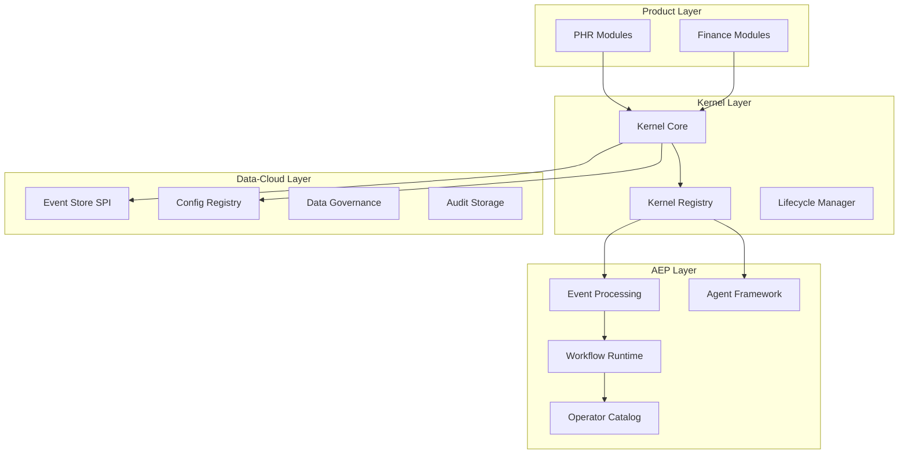

# Detailed Kernel Implementation Plan

**Focus**: PHR + Finance System Integration  
**Version**: 3.1  
**Status**: Living Document — updated to align with GRANULAR_PHASE_SPECIFICATIONS.md v3.1 and KERNEL_PLATFORM_BRAINSTORM.md v3.1

> **Companion Documents**:
>
> - [GRANULAR_PHASE_SPECIFICATIONS.md](GRANULAR_PHASE_SPECIFICATIONS.md) — Phase-by-phase code-level specification (canonical code reference)
> - [KERNEL_PLATFORM_BRAINSTORM.md](KERNEL_PLATFORM_BRAINSTORM.md) — Strategic vision and architecture rationale

---

## Executive Summary

This plan provides a comprehensive, granular roadmap for implementing the lightweight kernel platform with tight integration to data-cloud for data management and AEP for processing/agentic systems. We will start with PHR (Personal Health Record) and the Finance system (already in app-platform) as validation products, with FlashIt (personal AI) and Aura (recommendation engine) planned as follow-on integrations.

> **IMPORTANT — ActiveJ-Only Runtime**: All async code in this plan uses ActiveJ `Promise` and `Eventloop`. **CompletableFuture, Spring Reactor (Mono/Flux), and RxJava are BANNED.** Adapter boundaries (Data-Cloud SPI, AEP SPI) wrap external CompletableFuture returns using `Promise.ofFuture(cf)`. See the GRANULAR_PHASE_SPECIFICATIONS §1.1.1 for the canonical `KernelModule` interface.

### Key Principles

- **Kernel as Composition Layer**: Minimal, focused kernel that provides composition primitives
- **Data-Cloud First**: All data management through data-cloud platform
- **AEP for Processing**: All event processing and agentic workflows through AEP
- **Product-Aware**: Each product maintains domain boundaries while sharing kernel capabilities
- **Incremental Migration**: Start with compile-time composition, defer runtime plugins
- **ActiveJ-Only Async**: All concurrency through ActiveJ Promise/Eventloop — no CompletableFuture/Reactor
- **AI/ML-Native**: GAA (Generic Adaptive Agent) lifecycle built into every agent: PERCEIVE → REASON → ACT → CAPTURE → REFLECT
- **Opinionated Core, Flexible Products**: Core enforces conventions; products extend within guardrails
- **Observability-First**: Micrometer + OpenTelemetry baked in from Day 1; no bolt-on

---

## Phase 0: Foundation Analysis (Week 0)

### 0.1 Current State Assessment

#### PHR Current State

- **Documentation**: Comprehensive MVP documentation set (29 documents)
- **Architecture**: Multi-tenant, consent-first healthcare platform
- **Regulatory**: Nepal Directive 2081, Privacy Act 2075, FHIR R4 compliance
- **Key Features**: Patient records, consent management, referrals, imaging, payments

#### Finance System Current State

- **Location**: `products/app-platform/finance-ghatana-integration-plan.md`
- **Integration Plan**: 85% platform overlap with Ghatana identified
- **Architecture**: Event-driven microservices with dual-calendar support
- **Key Features**: Trade processing, risk management, compliance, market data

#### App-Platform Kernel Modules

- **Current Modules**: 25 kernel modules identified in `products/app-platform/kernel/`
- **Maturity**: Varies from concept to partial implementation
- **Key Modules**: IAM, config, rules engine, plugin runtime, event store, audit, inter-product bus, tenant context, plugin security, workflow engine

### 0.2 Architecture Validation

#### Data-Cloud Integration Points



---

## Phase 1: Kernel Core Definition (Weeks 1-2)

### 1.1 Canonical Kernel Primitives

#### 1.1.1 KernelDescriptor

```java
// Location: platform/java/kernel/src/main/java/com/ghatana/kernel/descriptor/
import io.activej.promise.Promise;

/**
 * Immutable value object describing a kernel component's identity, capabilities, and dependencies.
 *
 * @doc.type record
 * @doc.purpose Kernel component descriptor with identity, capabilities, and dependency metadata
 * @doc.layer core
 * @doc.pattern ValueObject
 */
public class KernelDescriptor {
    private final String kernelId;
    private final String version;
    private final Set<KernelCapability> capabilities;
    private final Map<String, Object> metadata;
    private final List<KernelDependency> dependencies;

    // Builder pattern with validation
    public static class Builder {
        public Builder withKernelId(String kernelId);
        public Builder withVersion(String version);
        public Builder withCapability(KernelCapability capability);
        public Builder withDependency(KernelDependency dependency);
        public KernelDescriptor build();
    }
}
```

#### 1.1.2 KernelModule

```java
// Location: platform/java/kernel/src/main/java/com/ghatana/kernel/module/
import io.activej.promise.Promise;

/**
 * Core interface every kernel module MUST implement.
 *
 * <p>IMPORTANT — ActiveJ mandate: {@code start()} and {@code stop()} return
 * {@link Promise}{@code <Void>}, NOT {@code CompletableFuture}.
 * CompletableFuture, Spring Reactor (Mono/Flux) and RxJava are BANNED
 * in kernel code. At adapter boundaries use {@code Promise.ofFuture(cf)}.</p>
 *
 * @doc.type interface
 * @doc.purpose Canonical contract for all kernel modules — lifecycle, capabilities, health
 * @doc.layer core
 * @doc.pattern Service
 */
public interface KernelModule {
    String getModuleId();
    String getVersion();
    Set<KernelCapability> getCapabilities();
    Set<KernelDependency> getDependencies();

    // Lifecycle hooks — all return ActiveJ Promise, NEVER CompletableFuture
    void initialize(KernelContext context);
    Promise<Void> start();
    Promise<Void> stop();
    HealthStatus getHealthStatus();
}
```

#### 1.1.2a KernelExtension

```java
// Location: platform/java/kernel/src/main/java/com/ghatana/kernel/extension/
import io.activej.promise.Promise;

/**
 * Extension point for product-specific enrichments that are NOT full modules.
 *
 * <p>Extensions contribute additional capabilities to existing kernel modules without
 * introducing new modules. Examples: DualCalendarKernelExtension, HealthcareConsentKernelExtension.</p>
 *
 * @doc.type interface
 * @doc.purpose Optional enrichment contract for product-specific kernel extensions
 * @doc.layer core
 * @doc.pattern Service
 */
public interface KernelExtension {
    /** Stable identifier (e.g. "dual-calendar", "healthcare-consent"). */
    String getExtensionId();

    /** Human-readable name. */
    String getName();

    /** Descriptor exposing version, capabilities, and metadata. */
    KernelDescriptor getDescriptor();

    /** Capabilities this extension contributes — merged into hosting module's set. */
    Set<KernelCapability> getContributedCapabilities();

    // Lifecycle callbacks — invoked by the hosting KernelModule
    void onModuleInitialized(KernelContext context);
    void onModuleStarted(KernelContext context);
    void onModuleStopped(KernelContext context);

    /** Check compatibility with the hosting module's version. */
    boolean isCompatible(KernelModule hostModule);
}
```

#### 1.1.2b KernelContext

```java
// Location: platform/java/kernel/src/main/java/com/ghatana/kernel/context/
import io.activej.eventloop.Eventloop;
import io.activej.promise.Promise;

/**
 * Runtime context passed to every module during initialization.
 *
 * <p>Provides dependency lookup, event-handler registration, tenant context,
 * and access to the ActiveJ {@link Eventloop}. All modules receive this
 * via {@link KernelModule#initialize(KernelContext)}.</p>
 *
 * @doc.type interface
 * @doc.purpose Runtime context for dependency lookup, event wiring, and tenant access
 * @doc.layer core
 * @doc.pattern Service
 */
public interface KernelContext {
    // ── Dependency Lookup ──
    <T> T getDependency(Class<T> type);
    <T> Optional<T> getOptionalDependency(Class<T> type);
    boolean hasDependency(Class<T> type);

    // ── Event System ──
    <E> void registerEventHandler(Class<E> eventType, EventHandler<E> handler);
    <E> void unregisterEventHandler(Class<E> eventType, EventHandler<E> handler);

    // ── Tenant & Runtime ──
    KernelTenantContext getTenantContext();
    Eventloop getEventloop();
    Set<KernelCapability> getAvailableCapabilities();
}
```

#### 1.1.3 KernelPlugin

```java
// Location: platform/java/kernel/src/main/java/com/ghatana/kernel/plugin/
import io.activej.promise.Promise;

/**
 * Dynamically loadable module with install/uninstall/reload semantics.
 *
 * @doc.type interface
 * @doc.purpose Runtime-loadable plugin extending KernelModule with hot-swap lifecycle
 * @doc.layer core
 * @doc.pattern Service
 */
public interface KernelPlugin extends KernelModule {
    PluginManifest getManifest();
    Set<String> getExportedContracts();
    Set<String> getRequiredContracts();

    // Plugin-specific lifecycle — all return Promise
    Promise<Void> install();
    Promise<Void> uninstall();
    Promise<Void> reload();
}
```

#### 1.1.4 KernelRegistry

```java
// Location: platform/java/kernel/src/main/java/com/ghatana/kernel/registry/
import io.activej.promise.Promise;

/**
 * Central registry for module/plugin discovery and dependency resolution.
 *
 * @doc.type interface
 * @doc.purpose Central registry for module/plugin/capability discovery and dependency resolution
 * @doc.layer core
 * @doc.pattern Service
 */
public interface KernelRegistry {
    // Registration
    void registerModule(KernelModule module);
    void registerPlugin(KernelPlugin plugin);
    void registerCapability(KernelCapability capability);

    // Discovery
    Optional<KernelModule> getModule(String moduleId);
    List<KernelPlugin> getPluginsByCapability(KernelCapability capability);
    List<KernelModule> getModulesByCapability(KernelCapability capability);

    // Dependency resolution
    List<KernelModule> resolveDependencies(KernelModule module);
    boolean validateDependencies(KernelModule module);
}
```

### 1.2 Integration with Existing Systems

#### 1.2.1 Data-Cloud Integration

```java
// Location: platform/java/kernel/src/main/java/com/ghatana/kernel/datacloud/
import io.activej.promise.Promise;

/**
 * Adapter bridging kernel SPI to Data-Cloud platform.
 *
 * <p>All Data-Cloud calls return {@code CompletableFuture} at their SPI boundary.
 * This adapter wraps them using {@code Promise.ofFuture(cf)} so the rest of the
 * kernel sees only ActiveJ {@link Promise}.</p>
 *
 * @doc.type class
 * @doc.purpose Bridge between kernel SPI and Data-Cloud platform with Promise wrapping
 * @doc.layer core
 * @doc.pattern Service
 */
public class DataCloudKernelAdapter {
    private final DataCloudPlatform dataCloud;

    // Event Store SPI wrapper
    public KernelEventStore createEventStore(String tenantId) {
        return new DataCloudEventStoreAdapter(
            dataCloud.getEventLogStore(tenantId)
        );
    }

    // Config Registry wrapper
    public KernelConfigResolver createConfigResolver(String tenantId) {
        return new DataCloudConfigAdapter(
            dataCloud.getConfigRegistry(tenantId)
        );
    }

    // Audit integration
    public KernelAuditService createAuditService(String tenantId) {
        return new DataCloudAuditAdapter(
            dataCloud.getAuditService(tenantId)
        );
    }
}
```

#### 1.2.2 AEP Integration

```java
// Location: platform/java/kernel/src/main/java/com/ghatana/kernel/aep/
import io.activej.promise.Promise;

/**
 * Adapter bridging kernel SPI to AEP (Agentic Event Processing) platform.
 *
 * <p>Same adapter-boundary rule: AEP returns CompletableFuture;
 * this adapter wraps with {@code Promise.ofFuture(cf)}.</p>
 *
 * @doc.type class
 * @doc.purpose Bridge between kernel SPI and AEP platform with Promise wrapping
 * @doc.layer core
 * @doc.pattern Service
 */
public class AepKernelAdapter {
    private final AepPlatform aepPlatform;

    // Event processing wrapper
    public KernelEventProcessor createEventProcessor() {
        return new AepEventProcessorAdapter(aepPlatform);
    }

    // Agent framework wrapper
    public KernelAgentRuntime createAgentRuntime() {
        return new AepAgentRuntimeAdapter(aepPlatform.getAgentRegistry());
    }

    // Workflow runtime wrapper
    public KernelWorkflowRuntime createWorkflowRuntime() {
        return new AepWorkflowRuntimeAdapter(aepPlatform.getWorkflowRuntime());
    }
}
```

### 1.3 Kernel Context and Tenant Management

#### 1.3.1 KernelTenantContext

```java
// Location: platform/java/kernel/src/main/java/com/ghatana/kernel/tenant/
import io.activej.promise.Promise;

/**
 * Per-request tenant context carrying tenant identity, feature flags, config, and security.
 *
 * @doc.type class
 * @doc.purpose Tenant-scoped runtime context for feature gating, config, and security
 * @doc.layer core
 * @doc.pattern ValueObject
 */
public class KernelTenantContext {
    private final String tenantId;
    private final TenantType tenantType;
    private final Map<String, Object> tenantConfig;
    private final Set<String> enabledFeatures;
    private final SecurityContext securityContext;

    // Feature gating
    public boolean isFeatureEnabled(String featureId);
    public <T> T getConfig(String key, Class<T> type);
    public SecurityContext getSecurityContext();

    // Async feature check — uses Promise, NEVER CompletableFuture
    public Promise<Boolean> isFeatureEnabledAsync(String featureId) {
        return Promise.ofBlocking(executor, () ->
            configRegistry.isFeatureEnabled(tenantId, featureId)
        );
    }

    // Async config reload
    public Promise<Void> reloadConfig() {
        return Promise.ofBlocking(executor, () -> {
            this.tenantConfig.clear();
            this.tenantConfig.putAll(configRegistry.loadConfig(tenantId));
            return null;
        });
    }
}
```

#### 1.3.2 KernelConfigResolver

```java
// Location: platform/java/kernel/src/main/java/com/ghatana/kernel/config/
import io.activej.promise.Promise;

/**
 * Hierarchical config resolution: cross-product → product-specific → kernel default.
 *
 * @doc.type interface
 * @doc.purpose Hierarchical config resolution across tenant, product, and kernel scopes
 * @doc.layer core
 * @doc.pattern Service
 */
public interface KernelConfigResolver {
    <T> T resolve(String configKey, Class<T> type, KernelTenantContext context);
    <T> T resolveWithDefault(String configKey, Class<T> type, T defaultValue, KernelTenantContext context);
    void addConfigProvider(ConfigProvider provider);

    // Async reload — uses Promise
    Promise<Void> reloadConfig(String tenantId);
}
```

### 1.4 Implementation Tasks (Weeks 1-2)

#### Week 1 Tasks

1. **Create kernel core interfaces** (KernelDescriptor, KernelModule, KernelPlugin)
2. **Implement basic KernelRegistry** with in-memory storage
3. **Create Data-Cloud adapter** for Event Store SPI
4. **Create AEP adapter** for Event Processing
5. **Setup build configuration** for kernel module

#### Week 2 Tasks

1. **Implement KernelTenantContext** with multi-tenant support
2. **Create KernelConfigResolver** with Data-Cloud integration
3. **Add lifecycle management** for modules and plugins
4. **Implement dependency resolution** in registry
5. **Create basic health monitoring** for kernel components

---

## Enhanced KernelCapability System

### KernelCapability Product Mapping

The enhanced `KernelCapability` system now properly ties kernel capabilities to product-specific requirements through the `getCapabilities()` methods. Each product module declares its specific capabilities while leveraging shared kernel capabilities.

#### Key Features:

1. **Product-Specific Capabilities**: Capabilities unique to each product domain
2. **Shared Capabilities**: Common capabilities used across multiple products
3. **Capability Validation**: Automatic validation of product-capability compatibility
4. **Flexible Metadata**: Rich metadata for capability configuration
5. **Type Safety**: Strong typing and validation throughout the system

#### Product Capability Examples:

```java
// PHR-specific capabilities
KernelCapability.Products.PATIENT_RECORDS     // Healthcare patient records
KernelCapability.Products.CONSENT_MANAGEMENT   // Healthcare consent management
KernelCapability.Products.FHIR_INTEROP        // FHIR interoperability

// FlashIt-specific capabilities
KernelCapability.Products.MOMENT_CAPTURE      // Multimedia moment capture
KernelCapability.Products.REFLECTION_ENGINE   // AI-powered reflection generation
KernelCapability.Products.CONTEXT_SEARCH      // Semantic search across moments

// Aura-specific capabilities
KernelCapability.Products.RECOMMENDATION_ENGINE // Personalized recommendations
KernelCapability.Products.ONTOLOGY_MANAGER    // Knowledge graph management
KernelCapability.Products.ANALYTICS_FRAMEWORK  // Comprehensive analytics

// Finance-specific capabilities
KernelCapability.Products.TRADE_PROCESSING    // High-frequency trade processing
KernelCapability.Products.RISK_MANAGEMENT     // Real-time risk assessment
KernelCapability.Products.COMPLIANCE_CHECKING // Financial compliance monitoring

// Shared capabilities (used by all products)
KernelCapability.Products.USER_AUTHENTICATION  // Multi-factor authentication
KernelCapability.Products.DATA_STORAGE        // Unified data storage
KernelCapability.Products.API_FRAMEWORK       // RESTful API framework
KernelCapability.Products.WORKFLOW_ENGINE     // Business workflow orchestration
```

#### Capability Mapping in getCapabilities():

Each product's `getCapabilities()` method now clearly separates:

- **Product-specific capabilities** (domain-specific functionality)
- **Shared capabilities** (common infrastructure capabilities)

This approach ensures:

- Clear product boundaries and ownership
- Efficient reuse of shared infrastructure
- Proper validation of capability dependencies
- Flexible composition of product functionality

---

## Phase 2: PHR Kernel Integration (Weeks 3-4)

### 2. Enhanced KernelCapability System

### 2.1 KernelCapability Class with Product Mapping

| **PatientRecordModule** | Core patient data management | Data-Cloud storage, Audit, Consent |
| **ConsentModule** | Patient consent management | Data-Cloud config, Event processing |
| **DocumentModule** | Document storage and OCR | Data-Cloud storage, AEP workflows |
| **AppointmentModule** | Appointment scheduling | Event processing, Notifications |
| **MedicationModule** | Medication management | Data-Cloud storage, Event processing |
| **BillingModule** | Billing and payments | Event processing, Ledger integration |
| **FhirInteropModule** | FHIR interoperability | AEP agents, Data transformation |
| **ClinicalConsentModule** | Healthcare-specific consent | Enhanced consent policies |
| **ImagingModule** | Medical imaging | Storage, Workflow processing |
| **ReferralModule** | Patient referrals | Event processing, Workflow |

#### 2.1.2 PHR Kernel Requirements

```java
// Location: products/phr/kernel/src/main/java/com/ghatana/phr/kernel/
import io.activej.promise.Promise;
import io.activej.promise.Promises;

/**
 * Top-level kernel module for PHR (Personal Health Record) product.
 *
 * <p>Composes 10 sub-modules (patient records, consent, document, appointment,
 * medication, billing, FHIR interop, clinical consent, imaging, referrals).</p>
 *
 * @doc.type class
 * @doc.purpose PHR product kernel module — healthcare-specific composition root
 * @doc.layer product
 * @doc.pattern Service
 */
public class PhrKernelModule implements KernelModule {
    private KernelContext context;

    @Override
    public String getModuleId() {
        return "phr-core";
    }

    @Override
    public Set<KernelCapability> getCapabilities() {
        return Set.of(
            // PHR-specific capabilities (healthcare domain)
            KernelCapability.Products.PATIENT_RECORDS,
            KernelCapability.Products.CONSENT_MANAGEMENT,
            KernelCapability.Products.FHIR_INTEROP,

            // Shared capabilities used by PHR
            KernelCapability.Products.USER_AUTHENTICATION,
            KernelCapability.Products.DATA_STORAGE,
            KernelCapability.Products.API_FRAMEWORK,
            KernelCapability.Products.WORKFLOW_ENGINE
        );
    }

    @Override
    public void initialize(KernelContext context) {
        this.context = context;
    }

    @Override
    public Promise<Void> start() {
        // Initialize all PHR-specific services — returns Promise, NEVER CompletableFuture
        return Promises.all(
            Stream.of(
                initializePatientService(context),
                initializeConsentService(context),
                initializeDocumentService(context),
                initializeAppointmentService(context),
                initializeMedicationService(context),
                initializeBillingService(context)
            )
        );
    }

    @Override
    public Promise<Void> stop() {
        return Promise.complete();
    }
}
```

### 2.2 PHR-Specific Kernel Extensions

#### 2.2.1 Healthcare Consent Enhancement

```java
// Location: products/phr/kernel/src/main/java/com/ghatana/phr/kernel/consent/

/**
 * Extends kernel with healthcare-specific consent policies (Nepal Directive 2081,
 * FHIR Consent, Emergency Access).
 *
 * @doc.type class
 * @doc.purpose Healthcare consent policy extension — Nepal regulations + FHIR + emergency access
 * @doc.layer product
 * @doc.pattern Service
 */
public class HealthcareConsentKernelExtension implements KernelExtension {
    @Override
    public String getExtensionId() {
        return "healthcare-consent";
    }

    @Override
    public String getName() {
        return "Healthcare Consent Extension";
    }

    @Override
    public Set<KernelCapability> getContributedCapabilities() {
        return Set.of(KernelCapability.CONSENT_MANAGEMENT);
    }

    @Override
    public void onModuleInitialized(KernelContext context) {
        // Add healthcare-specific consent policies
        ConsentPolicyRegistry registry = context.getDependency(ConsentPolicyRegistry.class);
        registry.register(new NepalHealthcareConsentPolicy());
        registry.register(new FhirConsentPolicy());
        registry.register(new EmergencyAccessConsentPolicy());
    }

    @Override
    public void onModuleStarted(KernelContext context) { /* no-op */ }

    @Override
    public void onModuleStopped(KernelContext context) { /* no-op */ }

    @Override
    public boolean isCompatible(KernelModule hostModule) {
        return hostModule.getCapabilities().contains(KernelCapability.CONSENT_MANAGEMENT);
    }
}
```

#### 2.2.2 FHIR Integration Kernel Plugin

```java
// Location: products/phr/kernel/src/main/java/com/ghatana/phr/kernel/fhir/
import io.activej.promise.Promise;

/**
 * Runtime-loadable plugin providing FHIR R4 interoperability.
 *
 * @doc.type class
 * @doc.purpose FHIR R4 interoperability plugin — patient/observation/medication resource processing
 * @doc.layer product
 * @doc.pattern Service
 */
public class FhirInteropKernelPlugin implements KernelPlugin {
    private KernelContext context;

    @Override
    public PluginManifest getManifest() {
        return PluginManifest.builder()
            .pluginId("fhir-interop")
            .version("1.0.0")
            .description("FHIR R4 interoperability plugin")
            .capability(KernelCapability.FHIR_INTEROP)
            .build();
    }

    @Override
    public void initialize(KernelContext context) {
        this.context = context;
    }

    @Override
    public Promise<Void> start() {
        // Initialize FHIR processors
        FhirProcessorRegistry registry = context.getDependency(FhirProcessorRegistry.class);
        registry.register(new PatientResourceProcessor());
        registry.register(new ObservationResourceProcessor());
        registry.register(new MedicationResourceProcessor());
        return Promise.complete();
    }

    @Override
    public Promise<Void> stop() {
        return Promise.complete();
    }

    @Override
    public Promise<Void> install() {
        return Promise.complete(); // schema migrations, etc.
    }

    @Override
    public Promise<Void> uninstall() {
        return Promise.complete();
    }

    @Override
    public Promise<Void> reload() {
        return stop().then(this::start);
    }
}
```

### 2.3 PHR Data-Cloud Integration

#### 2.3.1 Patient Data Storage

```java
// Location: products/phr/kernel/src/main/java/com/ghatana/phr/kernel/data/
import io.activej.promise.Promise;
import io.activej.promise.Promises;

/**
 * Initializes PHR data stores in Data-Cloud with healthcare governance.
 *
 * <p>All Data-Cloud calls return CompletableFuture; we wrap them with
 * {@code Promise.ofFuture(cf)} at the adapter boundary.</p>
 *
 * @doc.type class
 * @doc.purpose PHR data store initialization with healthcare retention/governance policies
 * @doc.layer product
 * @doc.pattern Service
 */
public class PhrPatientDataService {
    private final DataCloudPlatform dataCloud;

    public Promise<Void> initializeStores() {
        return Promises.all(
            Stream.of(
                initializePatientRecordsStore(),
                initializeConsentRecordsStore()
            )
        );
    }

    private Promise<Void> initializePatientRecordsStore() {
        // Patient master data store
        return Promise.ofFuture(
            dataCloud.createStore("patient.records", DataStoreConfig.builder()
                .withSchema("patient-schema-v1")
                .withRetention(Retention.ofYears(25)) // Healthcare requirement
                .withGovernance(DataGovernance.HEALTHCARE)
                .withEncryption(EncryptionLevel.STRONG)
                .withAuditLevel(AuditLevel.DETAILED)
                .build())
        );
    }

    private Promise<Void> initializeConsentRecordsStore() {
        // Consent records store
        return Promise.ofFuture(
            dataCloud.createStore("patient.consents", DataStoreConfig.builder()
                .withSchema("consent-schema-v1")
                .withRetention(Retention.ofYears(10))
                .withGovernance(DataGovernance.HEALTHCARE)
                .withEncryption(EncryptionLevel.STRONG)
                .withAuditLevel(AuditLevel.DETAILED)
                .build())
        );
    }
}
```

#### 2.3.2 PHR Event Processing

```java
// Location: products/phr/kernel/src/main/java/com/ghatana/phr/kernel/events/

/**
 * Initializes PHR event streams and pipelines in AEP.
 *
 * @doc.type class
 * @doc.purpose PHR event stream/pipeline setup — consent, clinical, document workflows
 * @doc.layer product
 * @doc.pattern Service
 */
public class PhrEventProcessor {
    private final AepPlatform aepPlatform;

    @PostConstruct
    public void initializeEventStreams() {
        // Patient lifecycle events
        aepPlatform.createStream("patient.registration");
        aepPlatform.createStream("patient.consent.granted");
        aepPlatform.createStream("patient.consent.revoked");

        // Clinical events
        aepPlatform.createStream("appointment.scheduled");
        aepPlatform.createStream("medication.prescribed");
        aepPlatform.createStream("document.uploaded");

        // Setup PHR-specific pipelines
        setupPhrPipelines();
    }

    private void setupPhrPipelines() {
        // Consent validation pipeline
        Pipeline consentPipeline = aepPlatform.pipelineBuilder()
            .withOperator(new ConsentValidationOperator())
            .withOperator(new ConsentAuditOperator())
            .withOperator(new NotificationOperator())
            .build();

        aepPlatform.registerPipeline("consent.validation", consentPipeline);
    }
}
```

### 2.4 Implementation Tasks (Weeks 3-4)

#### Week 3 Tasks

1. **Analyze PHR documentation** for kernel integration points
2. **Create PHR kernel module** with core capabilities
3. **Implement healthcare consent extension** for kernel
4. **Create FHIR interop plugin** with kernel interface
5. **Setup PHR data stores** in Data-Cloud

#### Week 4 Tasks

1. **Implement PHR event processing** through AEP
2. **Create PHR-specific workflows** (consent validation, document processing)
3. **Add PHR audit integration** with enhanced retention
4. **Implement multi-tenant isolation** for healthcare data
5. **Create PHR health monitoring** and compliance checks

#### Capability Validation and Discovery

The kernel automatically validates capability compatibility and provides discovery mechanisms:

```java
// Capability validation during module initialization
public class KernelModuleValidator {
    public void validateModuleCapabilities(KernelModule module, KernelContext context) {
        Set<KernelCapability> required = module.getCapabilities();
        Set<KernelCapability> available = context.getAvailableCapabilities();

        // Check for missing capabilities
        Set<KernelCapability> missing = new HashSet<>(required);
        missing.removeAll(available);

        if (!missing.isEmpty()) {
            throw new IllegalStateException(
                String.format("Module %s requires capabilities: %s",
                            module.getModuleId(), missing));
        }

        // Validate product-specific capability support
        String productId = extractProductId(module.getModuleId());
        for (KernelCapability capability : required) {
            if (capability.isProductSpecific(productId) &&
                !capability.supportsProduct(productId)) {
                throw new IllegalStateException(
                    String.format("Capability %s does not support product %s",
                                capability.getCapabilityId(), productId));
            }
        }
    }
}

// Capability discovery and querying
public class CapabilityDiscovery {
    private final CapabilityRegistry registry;

    // Get all capabilities for a product
    public Set<KernelCapability> getProductCapabilities(String productId) {
        Set<KernelCapability> productSpecific = registry.getProductSpecificCapabilities(productId);
        Set<KernelCapability> shared = registry.getSharedCapabilities();

        return Stream.concat(productSpecific.stream(), shared.stream())
                    .collect(Collectors.toSet());
    }

    // Find compatible capabilities for integration
    public Set<KernelCapability> findCompatibleCapabilities(KernelCapability reference) {
        return registry.findCompatibleCapabilities(reference);
    }

    // Check if a product can use a capability
    public boolean canUseCapability(String productId, String capabilityId) {
        return registry.isCapabilitySupported(capabilityId, productId);
    }
}
```

#### Runtime Capability Resolution

The kernel resolves capabilities at runtime and provides them to modules:

```java
// Runtime capability resolution
public class CapabilityResolver {
    private final CapabilityRegistry registry;
    private final Map<String, Object> capabilityInstances = new ConcurrentHashMap<>();

    public <T> T getCapabilityInstance(KernelCapability capability, Class<T> type) {
        String key = capability.getCapabilityId();

        return (T) capabilityInstances.computeIfAbsent(key, k -> {
            // Resolve capability implementation based on metadata
            return createCapabilityInstance(capability, type);
        });
    }

    private <T> T createCapabilityInstance(KernelCapability capability, Class<T> type) {
        // Create capability instance based on configuration
        Map<String, Object> metadata = capability.getMetadata();

        // Example: Create data storage capability
        if (capability == KernelCapability.Products.DATA_STORAGE) {
            String backend = (String) metadata.get("default_backend");
            return createDataStorageInstance(backend, type);
        }

        // Example: Create authentication capability
        if (capability == KernelCapability.Products.USER_AUTHENTICATION) {
            List<String> methods = (List<String>) metadata.get("methods");
            return createAuthenticationInstance(methods, type);
        }

        throw new IllegalArgumentException("Unsupported capability: " + capability.getCapabilityId());
    }
}
```

#### Product Capability Registry

Each product maintains its own capability registry for domain-specific capabilities:

```java
// Product-specific capability registry
public class ProductCapabilityRegistry {
    private final String productId;
    private final Map<String, KernelCapability> productCapabilities = new HashMap<>();

    public ProductCapabilityRegistry(String productId) {
        this.productId = productId;
        initializeProductCapabilities();
    }

    private void initializeProductCapabilities() {
        switch (productId) {
            case "flashit":
                registerFlashItCapabilities();
                break;
            case "aura":
                registerAuraCapabilities();
                break;
            case "phr":
                registerPHRCapabilities();
                break;
            case "finance":
                registerFinanceCapabilities();
                break;
        }
    }

    private void registerFlashItCapabilities() {
        // Register FlashIt-specific capabilities
        register(KernelCapability.Products.MOMENT_CAPTURE);
        register(KernelCapability.Products.REFLECTION_ENGINE);
        register(KernelCapability.Products.CONTEXT_SEARCH);
    }

    private void registerAuraCapabilities() {
        // Register Aura-specific capabilities
        register(KernelCapability.Products.RECOMMENDATION_ENGINE);
        register(KernelCapability.Products.ONTOLOGY_MANAGER);
        register(KernelCapability.Products.ANALYTICS_FRAMEWORK);
    }

    private void registerPHRCapabilities() {
        // Register PHR-specific capabilities
        register(KernelCapability.Products.PATIENT_RECORDS);
        register(KernelCapability.Products.CONSENT_MANAGEMENT);
        register(KernelCapability.Products.FHIR_INTEROP);
    }

    private void registerFinanceCapabilities() {
        // Register Finance-specific capabilities
        register(KernelCapability.Products.TRADE_PROCESSING);
        register(KernelCapability.Products.RISK_MANAGEMENT);
        register(KernelCapability.Products.COMPLIANCE_CHECKING);
    }

    public void register(KernelCapability capability) {
        if (capability.supportsProduct(productId)) {
            productCapabilities.put(capability.getCapabilityId(), capability);
        } else {
            throw new IllegalArgumentException(
                String.format("Capability %s does not support product %s",
                            capability.getCapabilityId(), productId));
        }
    }

    public Optional<KernelCapability> getCapability(String capabilityId) {
        return Optional.ofNullable(productCapabilities.get(capabilityId));
    }

    public Set<KernelCapability> getAllCapabilities() {
        return new HashSet<>(productCapabilities.values());
    }
}
```

This enhanced KernelCapability system provides:

1. **Clear Product Boundaries**: Each product declares its specific capabilities
2. **Shared Infrastructure**: Common capabilities are reused across products
3. **Runtime Validation**: Automatic validation of capability compatibility
4. **Flexible Discovery**: Rich discovery and querying mechanisms
5. **Type Safety**: Strong typing and validation throughout the system
6. **Metadata-Driven Configuration**: Flexible configuration through capability metadata

The `getCapabilities()` methods now properly tie kernel capabilities to product-specific requirements while maintaining clean separation between shared and product-specific functionality.

---

## Alternative: Decoupled Plugin-Based Capability System

### Problem with Current Approach

The current `KernelCapability.Products` approach has significant issues:

1. **Tight Coupling**: Products are hardcoded in the kernel
2. **Limited Extensibility**: Adding new products requires kernel changes
3. **Capability Bloat**: Kernel becomes aware of all product specifics
4. **Maintenance Overhead**: Every product change affects kernel code
5. **Violation of Kernel Purity**: Kernel should not know about products

### Solution: Plugin-Based Capability System

Instead of hardcoding products in the kernel, we use a **plugin-based approach** where:

1. **Products register capabilities dynamically** through plugins
2. **Kernel provides generic capability interfaces** without product knowledge
3. **Capabilities are discovered and composed at runtime**
4. **New products can be added without kernel modifications**

### 1. Generic KernelCapability (No Product Coupling)

```java
// Location: platform/java/kernel/src/main/java/com/ghatana/kernel/capability/

public class KernelCapability {
    private final String capabilityId;
    private final String name;
    private final String description;
    private final CapabilityType type;
    private final Map<String, Object> metadata;

    public enum CapabilityType {
        DATA_MANAGEMENT, EVENT_PROCESSING, SECURITY, COMPLIANCE,
        AI_ML, WORKFLOW, INTEGRATION, MONITORING,
        UI_UX_FRAMEWORK, API_FRAMEWORK, BUSINESS_LOGIC, OBSERVABILITY
    }

    // Generic constructor - NO product coupling
    public KernelCapability(String capabilityId, String name, String description,
                           CapabilityType type, Map<String, Object> metadata) {
        this.capabilityId = capabilityId;
        this.name = name;
        this.description = description;
        this.type = type;
        this.metadata = new HashMap<>(metadata);
    }

    // Generic capability factory methods - NO product knowledge
    public static final class Core {
        public static final KernelCapability DATA_STORAGE = new KernelCapability(
            "data.storage", "Data Storage", "Unified data storage abstraction",
            CapabilityType.DATA_MANAGEMENT, Map.of(
                "backends", "postgresql,redis,s3",
                "replication", "true",
                "encryption", "at_rest,in_transit"
            )
        );

        public static final KernelCapability USER_AUTHENTICATION = new KernelCapability(
            "user.authentication", "User Authentication", "Multi-factor authentication",
            CapabilityType.SECURITY, Map.of(
                "methods", "password,mfa,sso,oauth",
                "session_management", "true",
                "audit", "true"
            )
        );

        public static final KernelCapability API_FRAMEWORK = new KernelCapability(
            "api.framework", "API Framework", "RESTful API development",
            CapabilityType.API_FRAMEWORK, Map.of(
                "protocols", "rest,graphql,websocket",
                "validation", "json_schema",
                "documentation", "openapi"
            )
        );

        public static final KernelCapability WORKFLOW_ENGINE = new KernelCapability(
            "workflow.engine", "Workflow Engine", "Business workflow orchestration",
            CapabilityType.WORKFLOW, Map.of(
                "engine", "temporal,camunda",
                "persistence", "durable",
                "retries", "exponential_backoff"
            )
        );
    }
}
```

### 2. Product Plugin Interface (Decoupled from Kernel)

```java
// Location: platform/java/kernel/src/main/java/com/ghatana/kernel/plugin/

public interface ProductPlugin {
    String getProductId();
    String getProductVersion();
    String getProductDescription();

    // Product declares its capabilities
    Set<KernelCapability> getDeclaredCapabilities();

    // Product declares its requirements
    Set<KernelDependency> getRequiredDependencies();

    // Product lifecycle
    void initialize(PluginContext context);
    void start();
    void stop();
    void shutdown();
}

public interface PluginContext {
    KernelContext getKernelContext();
    CapabilityRegistry getCapabilityRegistry();

    // Access to kernel capabilities
    <T> T getCapability(KernelCapability capability, Class<T> type);

    // Service registration
    void registerService(String serviceId, Object service);
    void registerExtension(KernelExtension extension);
}
```

### 3. Product-Specific Plugin Implementations

```java
// FlashIt Plugin
public class FlashItProductPlugin implements ProductPlugin {
    @Override
    public String getProductId() { return "flashit"; }

    @Override
    public Set<KernelCapability> getDeclaredCapabilities() {
        return Set.of(
            // FlashIt-specific capabilities (no hardcoded kernel knowledge)
            new KernelCapability(
                "moment.capture", "Moment Capture", "Capture multimedia moments",
                CapabilityType.DATA_MANAGEMENT, Map.of(
                    "supported_formats", "text,image,audio,video",
                    "ai_classification", "true"
                )
            ),
            new KernelCapability(
                "reflection.engine", "Reflection Engine", "AI-powered reflection",
                CapabilityType.AI_ML, Map.of(
                    "ai_models", "gpt-4,claude",
                    "reflection_types", "daily,weekly,monthly"
                )
            )
        );
    }

    @Override
    public Set<KernelDependency> getRequiredDependencies() {
        return Set.of(
            // Depend on core kernel capabilities
            new KernelDependency("data.storage", "1.0.0", DependencyType.CAPABILITY, false),
            new KernelDependency("user.authentication", "1.0.0", DependencyType.CAPABILITY, false),
            new KernelDependency("ai.ml.framework", "1.0.0", DependencyType.CAPABILITY, false)
        );
    }
}

// PHR Plugin
public class PHRProductPlugin implements ProductPlugin {
    @Override
    public String getProductId() { return "phr"; }

    @Override
    public Set<KernelCapability> getDeclaredCapabilities() {
        return Set.of(
            new KernelCapability(
                "patient.records", "Patient Records", "Healthcare patient records",
                CapabilityType.DATA_MANAGEMENT, Map.of(
                    "standards", "fhir_r4,hl7",
                    "privacy", "hipaa_compliant"
                )
            ),
            new KernelCapability(
                "consent.management", "Consent Management", "Healthcare consent",
                CapabilityType.SECURITY, Map.of(
                    "standards", "hipaa,gdpr",
                    "granularity", "fine_grained"
                )
            )
        );
    }
}

// Finance Plugin
public class FinanceProductPlugin implements ProductPlugin {
    @Override
    public String getProductId() { return "finance"; }

    @Override
    public Set<KernelCapability> getDeclaredCapabilities() {
        return Set.of(
            new KernelCapability(
                "trade.processing", "Trade Processing", "High-frequency trading",
                CapabilityType.EVENT_PROCESSING, Map.of(
                    "throughput", "100k_tps",
                    "latency", "<1ms"
                )
            ),
            new KernelCapability(
                "risk.management", "Risk Management", "Real-time risk assessment",
                CapabilityType.AI_ML, Map.of(
                    "risk_types", "market,credit,operational",
                    "models", "var,stress_testing"
                )
            )
        );
    }
}
```

### 4. Plugin Registry and Dynamic Loading

```java
// Location: platform/java/kernel/src/main/java/com/ghatana/kernel/registry/

public class PluginRegistry {
    private final Map<String, ProductPlugin> plugins = new ConcurrentHashMap<>();
    private final CapabilityRegistry capabilityRegistry;

    // Register a product plugin dynamically
    public void registerPlugin(ProductPlugin plugin) {
        String productId = plugin.getProductId();

        if (plugins.containsKey(productId)) {
            throw new IllegalStateException("Plugin already registered: " + productId);
        }

        // Register plugin
        plugins.put(productId, plugin);

        // Register plugin capabilities with kernel
        for (KernelCapability capability : plugin.getDeclaredCapabilities()) {
            capabilityRegistry.registerCapability(capability);
        }

        // Initialize plugin
        PluginContext context = new PluginContextImpl(capabilityRegistry);
        plugin.initialize(context);
    }

    // Dynamic plugin loading
    public void loadPluginFromJar(Path pluginJar) {
        try (URLClassLoader classLoader = new URLClassLoader(
                new URL[]{pluginJar.toUri().toURL()},
                getClass().getClassLoader())) {

            // Load plugin class
            ServiceLoader<ProductPlugin> loader = ServiceLoader.load(ProductPlugin.class, classLoader);
            ProductPlugin plugin = loader.iterator().next();

            // Validate dependencies and register
            validatePluginDependencies(plugin);
            registerPlugin(plugin);

        } catch (Exception e) {
            throw new RuntimeException("Failed to load plugin: " + pluginJar, e);
        }
    }

    // Get all capabilities for a product
    public Set<KernelCapability> getPluginCapabilities(String productId) {
        return plugins.getOrDefault(productId, new EmptyProductPlugin())
                     .getDeclaredCapabilities();
    }

    // Find plugins by capability
    public Set<ProductPlugin> getPluginsByCapability(KernelCapability capability) {
        return plugins.values().stream()
            .filter(plugin -> plugin.getDeclaredCapabilities().contains(capability))
            .collect(Collectors.toSet());
    }
}
```

### 5. Benefits of Plugin-Based Approach

#### **1. Loose Coupling**

- **Kernel knows nothing about products**
- **Products know only about kernel interfaces**
- **Easy to add/remove products without kernel changes**

#### **2. Dynamic Extensibility**

- **Plugins can be loaded/unloaded at runtime**
- **New products can be added without redeployment**
- **Capability discovery happens dynamically**

#### **3. Clear Boundaries**

- **Product-specific logic stays in products**
- **Kernel provides generic capabilities**
- **Clean separation of concerns**

#### **4. Easy Testing**

- **Products can be tested independently**
- **Kernel can be tested with mock plugins**
- **Isolated development environments**

#### **5. Scalability**

- **Products can be deployed independently**
- **Resource allocation per product**
- **Independent scaling decisions**

### 6. Comparison of Approaches

| Aspect            | Current (Hardcoded)                | Plugin-Based (Recommended)            |
| ----------------- | ---------------------------------- | ------------------------------------- |
| **Coupling**      | Tight (kernel knows products)      | Loose (kernel knows interfaces)       |
| **Extensibility** | Requires kernel changes            | Dynamic plugin loading                |
| **Maintenance**   | High (kernel changes for products) | Low (independent product development) |
| **Testing**       | Complex (integrated)               | Simple (isolated)                     |
| **Deployment**    | Monolithic                         | Independent                           |
| **Scalability**   | Limited                            | Per-product scaling                   |

### 7. Migration Strategy

#### **Phase 1: Extract Core Capabilities**

- Remove product-specific capabilities from kernel
- Keep only generic core capabilities
- Create plugin interface definitions

#### **Phase 2: Create Product Plugins**

- Implement product plugins for existing products
- Migrate product-specific capabilities to plugins
- Test plugin loading and capability registration

#### **Phase 3: Dynamic Loading**

- Implement plugin registry and dynamic loading
- Add plugin lifecycle management
- Enable runtime plugin discovery

#### **Phase 4: Cleanup**

- Remove old hardcoded capability system
- Update documentation and examples
- Optimize plugin performance

This plugin-based approach eliminates the tight coupling issues while providing a flexible, extensible architecture that supports easy addition of new products and capabilities without kernel modifications.

---

---

### 3.1 Finance Module Analysis

#### 3.1.1 Current Finance Modules

Based on finance integration plan analysis:

| Module                        | Purpose                | Kernel Integration Points          |
| ----------------------------- | ---------------------- | ---------------------------------- |
| **OrderManagementSystem**     | Trade order processing | AEP event processing, Risk checks  |
| **ExecutionManagementSystem** | Order execution        | AEP agents, Ledger integration     |
| **PortfolioManagementSystem** | Portfolio management   | Data-Cloud storage, AI integration |
| **MarketDataService**         | Market data processing | AEP data ingestion, Storage        |
| **PricingService**            | Pricing calculations   | AI platform, Event processing      |
| **RiskManagement**            | Risk calculations      | AEP agents, Real-time processing   |
| **ComplianceEngine**          | Compliance checking    | AEP rules engine, Audit            |
| **SurveillanceSystem**        | Market surveillance    | AI platform, Pattern detection     |

#### 3.1.2 Finance Kernel Requirements

```java
// Location: products/finance/kernel/src/main/java/com/ghatana/finance/kernel/
import io.activej.promise.Promise;
import io.activej.promise.Promises;

/**
 * Top-level kernel module for Finance product (trading, risk, compliance).
 *
 * <p>Composes 8 sub-modules: OMS, EMS, portfolio, market data, pricing,
 * risk management, compliance engine, surveillance.</p>
 *
 * @doc.type class
 * @doc.purpose Finance product kernel module — trading/risk/compliance composition root
 * @doc.layer product
 * @doc.pattern Service
 */
public class FinanceKernelModule implements KernelModule {
    private KernelContext context;

    @Override
    public String getModuleId() {
        return "finance-core";
    }

    @Override
    public Set<KernelCapability> getCapabilities() {
        return Set.of(
            // Finance-specific capabilities (financial domain)
            KernelCapability.Products.TRADE_PROCESSING,
            KernelCapability.Products.RISK_MANAGEMENT,
            KernelCapability.Products.COMPLIANCE_CHECKING,

            // Shared capabilities used by Finance
            KernelCapability.Products.USER_AUTHENTICATION,
            KernelCapability.Products.DATA_STORAGE,
            KernelCapability.Products.API_FRAMEWORK,
            KernelCapability.Products.WORKFLOW_ENGINE
        );
    }

    @Override
    public void initialize(KernelContext context) {
        this.context = context;
    }

    @Override
    public Promise<Void> start() {
        return Promises.all(
            Stream.of(
                initializeTradingService(context),
                initializeRiskService(context),
                initializeComplianceService(context),
                initializeMarketDataService(context),
                initializePortfolioService(context)
            )
        );
    }

    @Override
    public Promise<Void> stop() {
        return Promise.complete();
    }
}
```

### 3.2 Finance-Specific Kernel Extensions

#### 3.2.1 Dual-Calendar Support

```java
// Location: products/finance/kernel/src/main/java/com/ghatana/finance/kernel/calendar/

/**
 * Extends kernel with Nepali Bikram Sambat + Gregorian dual-calendar support.
 *
 * @doc.type class
 * @doc.purpose Dual-calendar (Gregorian + Nepali BS) extension for financial date calculations
 * @doc.layer product
 * @doc.pattern Service
 */
public class DualCalendarKernelExtension implements KernelExtension {
    @Override
    public String getExtensionId() {
        return "dual-calendar";
    }

    @Override
    public String getName() {
        return "Dual Calendar Extension";
    }

    @Override
    public Set<KernelCapability> getContributedCapabilities() {
        return Set.of(KernelCapability.DUAL_CALENDAR);
    }

    @Override
    public void onModuleInitialized(KernelContext context) {
        CalendarRegistry registry = context.getDependency(CalendarRegistry.class);
        registry.register(new GregorianCalendar());
        registry.register(new NepaliCalendar());
        registry.register(new DualCalendarCalculator());
    }

    @Override
    public void onModuleStarted(KernelContext context) { /* no-op */ }

    @Override
    public void onModuleStopped(KernelContext context) { /* no-op */ }

    @Override
    public boolean isCompatible(KernelModule hostModule) {
        return true; // Compatible with any module needing date calculations
    }
}
```

#### 3.2.2 Regulatory Compliance Extension

```java
// Location: products/finance/kernel/src/main/java/com/ghatana/finance/kernel/compliance/

/**
 * Extends kernel with SEBON, MiFID-II, and Dodd-Frank compliance policies.
 *
 * @doc.type class
 * @doc.purpose Multi-jurisdiction regulatory compliance extension (SEBON / MiFID-II / Dodd-Frank)
 * @doc.layer product
 * @doc.pattern Service
 */
public class RegulatoryComplianceKernelExtension implements KernelExtension {
    @Override
    public String getExtensionId() {
        return "regulatory-compliance";
    }

    @Override
    public String getName() {
        return "Regulatory Compliance Extension";
    }

    @Override
    public Set<KernelCapability> getContributedCapabilities() {
        return Set.of(KernelCapability.COMPLIANCE_CHECKING);
    }

    @Override
    public void onModuleInitialized(KernelContext context) {
        CompliancePolicyRegistry registry = context.getDependency(CompliancePolicyRegistry.class);
        registry.register(new SEBONCompliancePolicy());
        registry.register(new MIFIDIICompliancePolicy());
        registry.register(new DoddFrankCompliancePolicy());
    }

    @Override
    public void onModuleStarted(KernelContext context) { /* no-op */ }

    @Override
    public void onModuleStopped(KernelContext context) { /* no-op */ }

    @Override
    public boolean isCompatible(KernelModule hostModule) {
        return hostModule.getCapabilities().contains(KernelCapability.COMPLIANCE_CHECKING);
    }
}
```

### 3.3 Finance Data-Cloud Integration

#### 3.3.1 Financial Data Storage

```java
// Location: products/finance/kernel/src/main/java/com/ghatana/finance/kernel/data/
import io.activej.promise.Promise;
import io.activej.promise.Promises;

/**
 * Initializes Finance data stores in Data-Cloud with financial governance.
 *
 * <p>All Data-Cloud calls return CompletableFuture; wrapped with
 * {@code Promise.ofFuture(cf)} at the adapter boundary.</p>
 *
 * @doc.type class
 * @doc.purpose Finance data store initialization with regulatory retention/governance policies
 * @doc.layer product
 * @doc.pattern Service
 */
public class FinanceDataService {
    private final DataCloudPlatform dataCloud;

    public Promise<Void> initializeStores() {
        return Promises.all(
            Stream.of(
                initializeSecuritiesMasterStore(),
                initializeTradeRecordsStore(),
                initializeClientRecordsStore()
            )
        );
    }

    private Promise<Void> initializeSecuritiesMasterStore() {
        return Promise.ofFuture(
            dataCloud.createStore("securities.master", DataStoreConfig.builder()
                .withSchema("securities-schema-v1")
                .withRetention(Retention.ofYears(10))
                .withGovernance(DataGovernance.FINANCIAL)
                .withEncryption(EncryptionLevel.STRONG)
                .build())
        );
    }

    private Promise<Void> initializeTradeRecordsStore() {
        return Promise.ofFuture(
            dataCloud.createStore("trade.records", DataStoreConfig.builder()
                .withSchema("trade-schema-v1")
                .withRetention(Retention.ofYears(10)) // Regulatory requirement
                .withGovernance(DataGovernance.FINANCIAL)
                .withEncryption(EncryptionLevel.STRONG)
                .withAuditLevel(AuditLevel.DETAILED)
                .withImmutable(true) // Regulatory requirement
                .build())
        );
    }

    private Promise<Void> initializeClientRecordsStore() {
        return Promise.ofFuture(
            dataCloud.createStore("client.records", DataStoreConfig.builder()
                .withSchema("client-schema-v1")
                .withRetention(Retention.ofYears(7))
                .withGovernance(DataGovernance.FINANCIAL)
                .withEncryption(EncryptionLevel.STRONG)
                .build())
        );
    }
}
```

#### 3.3.2 Finance Event Processing

```java
// Location: products/finance/kernel/src/main/java/com/ghatana/finance/kernel/events/

/**
 * Initializes Finance event streams and pipelines in AEP.
 *
 * @doc.type class
 * @doc.purpose Finance event stream/pipeline setup — trade lifecycle, risk monitoring, compliance
 * @doc.layer product
 * @doc.pattern Service
 */
public class FinanceEventProcessor {
    private final AepPlatform aepPlatform;

    @PostConstruct
    public void initializeEventStreams() {
        // Trading events
        aepPlatform.createStream("trade.order.received");
        aepPlatform.createStream("trade.order.validated");
        aepPlatform.createStream("trade.order.executed");
        aepPlatform.createStream("trade.order.settled");

        // Risk events
        aepPlatform.createStream("risk.calculation.completed");
        aepPlatform.createStream("risk.limit.breached");

        // Compliance events
        aepPlatform.createStream("compliance.check.required");
        aepPlatform.createStream("compliance.violation.detected");

        // Setup finance-specific pipelines
        setupFinancePipelines();
    }

    private void setupFinancePipelines() {
        // Trade lifecycle pipeline
        Pipeline tradePipeline = aepPlatform.pipelineBuilder()
            .withOperator(new OrderValidationOperator())
            .withOperator(new RiskCheckOperator())
            .withOperator(new ComplianceOperator())
            .withOperator(new ExecutionOperator())
            .withOperator(new SettlementOperator())
            .build();

        aepPlatform.registerPipeline("trade.lifecycle", tradePipeline);

        // Real-time risk monitoring pipeline
        Pipeline riskPipeline = aepPlatform.pipelineBuilder()
            .withOperator(new MarketDataIngestionOperator())
            .withOperator(new PositionCalculationOperator())
            .withOperator(new RiskCalculationOperator())
            .withOperator(new RiskAlertOperator())
            .build();

        aepPlatform.registerPipeline("risk.monitoring", riskPipeline);
    }
}
```

### 3.4 Finance AI/ML Integration

#### 3.4.1 Fraud Detection Agent

```java
// Location: products/finance/kernel/src/main/java/com/ghatana/finance/kernel/ai/
import io.activej.promise.Promise;

/**
 * GAA-powered fraud detection agent following the PERCEIVE → REASON → ACT → CAPTURE → REFLECT lifecycle.
 *
 * <p>Extends {@code BaseAgent} from {@code libs:agent-framework}. Runs on ActiveJ Eventloop.
 * Uses {@link Promise} for all async operations — CompletableFuture is BANNED.</p>
 *
 * @doc.type class
 * @doc.purpose GAA fraud detection agent — real-time trade fraud analysis with learning
 * @doc.layer product
 * @doc.pattern Service
 * @doc.gaa.lifecycle perceive|reason|act|capture|reflect
 */
public class FraudDetectionAgent extends BaseAgent {
    private final ModelRegistry modelRegistry;
    private final InferenceService inferenceService;

    // ── PERCEIVE: Ingest trade event, extract features ──
    @Override
    public Promise<PerceptionResult> perceive(AgentEvent event) {
        if (!event.getType().equals("trade.executed")) {
            return Promise.of(PerceptionResult.skip());
        }
        TradeEvent tradeEvent = (TradeEvent) event.getPayload();
        Map<String, Object> features = extractFeatures(tradeEvent);
        return Promise.of(PerceptionResult.of(features));
    }

    // ── REASON: Run ML inference, assess fraud probability ──
    @Override
    public Promise<ReasoningResult> reason(PerceptionResult perception) {
        return Promise.ofBlocking(executor, () -> {
            Model fraudModel = modelRegistry.getModel("fraud-detector-v2");
            FraudDetectionResult result = inferenceService.predict(fraudModel, perception.getFeatures());
            return ReasoningResult.of(result, result.getConfidence());
        });
    }

    // ── ACT: Publish alert if suspicious ──
    @Override
    public Promise<ActionResult> act(ReasoningResult reasoning) {
        FraudDetectionResult result = (FraudDetectionResult) reasoning.getPayload();
        if (result.isSuspicious()) {
            return publishAlert(result).map(v -> ActionResult.executed("alert_published"));
        }
        return Promise.of(ActionResult.noAction());
    }

    // ── CAPTURE: Record episode for learning ──
    @Override
    public Promise<Void> capture(AgentEvent event, ActionResult action) {
        return memoryStore.appendEpisode(Episode.builder()
            .agentId(getAgentId())
            .event(event)
            .action(action)
            .timestamp(Instant.now())
            .build()
        );
    }

    // ── REFLECT: Async, fire-and-forget — extract patterns from recent episodes ──
    @Override
    public Promise<Void> reflect() {
        return memoryStore.getRecentEpisodes(getAgentId(), 100)
            .then(episodes -> patternEngine.extractPatterns(episodes))
            .then(patterns -> policyStore.mergePatterns(patterns));
    }
}
```

#### 3.4.2 Risk Assessment Agent

```java
// Location: products/finance/kernel/src/main/java/com/ghatana/finance/kernel/ai/
import io.activej.promise.Promise;

/**
 * GAA-powered portfolio risk assessment agent following the full GAA lifecycle.
 *
 * @doc.type class
 * @doc.purpose GAA risk assessment agent — portfolio risk analysis with adaptive learning
 * @doc.layer product
 * @doc.pattern Service
 * @doc.gaa.lifecycle perceive|reason|act|capture|reflect
 */
public class RiskAssessmentAgent extends BaseAgent {
    private final ModelRegistry modelRegistry;
    private final InferenceService inferenceService;

    // ── PERCEIVE ──
    @Override
    public Promise<PerceptionResult> perceive(AgentEvent event) {
        if (!event.getType().equals("portfolio.updated")) {
            return Promise.of(PerceptionResult.skip());
        }
        Portfolio portfolio = (Portfolio) event.getPayload();
        Map<String, Object> features = extractPortfolioFeatures(portfolio);
        return Promise.of(PerceptionResult.of(features));
    }

    // ── REASON ──
    @Override
    public Promise<ReasoningResult> reason(PerceptionResult perception) {
        return Promise.ofBlocking(executor, () -> {
            Model riskModel = modelRegistry.getModel("risk-assessment-v1");
            RiskAssessmentResult result = inferenceService.predict(riskModel, perception.getFeatures());
            return ReasoningResult.of(result, result.getConfidence());
        });
    }

    // ── ACT ──
    @Override
    public Promise<ActionResult> act(ReasoningResult reasoning) {
        RiskAssessmentResult result = (RiskAssessmentResult) reasoning.getPayload();
        return publishRiskUpdate(result).map(v -> ActionResult.executed("risk_updated"));
    }

    // ── CAPTURE ──
    @Override
    public Promise<Void> capture(AgentEvent event, ActionResult action) {
        return memoryStore.appendEpisode(Episode.builder()
            .agentId(getAgentId())
            .event(event)
            .action(action)
            .timestamp(Instant.now())
            .build()
        );
    }

    // ── REFLECT ──
    @Override
    public Promise<Void> reflect() {
        return memoryStore.getRecentEpisodes(getAgentId(), 50)
            .then(episodes -> patternEngine.extractPatterns(episodes))
            .then(patterns -> policyStore.mergePatterns(patterns));
    }
}
```

### 3.5 Implementation Tasks (Weeks 5-6)

#### Week 5 Tasks

1. **Analyze finance integration plan** for kernel integration points
2. **Create finance kernel module** with trading capabilities
3. **Implement dual-calendar extension** for finance
4. **Create regulatory compliance extension** for finance
5. **Setup finance data stores** in Data-Cloud

#### Week 6 Tasks

1. **Implement finance event processing** through AEP
2. **Create finance-specific workflows** (trade lifecycle, risk monitoring)
3. **Add finance AI/ML agents** for fraud detection and risk assessment
4. **Implement regulatory audit integration** with 10-year retention
5. **Create finance health monitoring** and compliance checks

---

## Phase 4: Cross-Product Integration (Weeks 7-8)

### 4.1 Kernel Cross-Product Communication

#### 4.1.1 Inter-Product Event Bus

```java
// Location: platform/java/kernel/src/main/java/com/ghatana/kernel/communication/
import io.activej.promise.Promise;

/**
 * Cross-product event publishing and data sharing through AEP/Data-Cloud adapters.
 *
 * @doc.type class
 * @doc.purpose Cross-product event bus — routes events between products via AEP
 * @doc.layer core
 * @doc.pattern Service
 */
public class KernelInterProductBus {
    private final AepPlatform aepPlatform;
    private final DataCloudPlatform dataCloud;

    // Cross-product event publishing — returns Promise
    public Promise<Void> publishCrossProductEvent(CrossProductEvent event) {
        AepEvent aepEvent = AepEvent.builder()
            .type("cross-product." + event.getType())
            .payload(event)
            .sourceProduct(event.getSourceProduct())
            .targetProduct(event.getTargetProduct())
            .build();

        return Promise.ofFuture(aepPlatform.publish(aepEvent));
    }

    // Cross-product data sharing (through Data-Cloud) — returns Promise
    public Promise<Void> shareCrossProductData(String dataId, Object data, CrossProductSharePolicy policy) {
        return Promise.ofFuture(dataCloud.createSharedDataStore(dataId, data, policy));
    }
}
```

#### 4.1.2 Product Boundary Enforcement

```java
// Location: platform/java/kernel/src/main/java/com/ghatana/kernel/boundary/

/**
 * Enforces product-to-product access control: product boundary → tenant permission → compliance.
 *
 * @doc.type class
 * @doc.purpose Product boundary enforcement — prevents unauthorized cross-product access
 * @doc.layer core
 * @doc.pattern Service
 */
public class ProductBoundaryEnforcer {
    private final KernelRegistry registry;
    private final KernelTenantContext context;

    public boolean canAccess(String productId, String resource, String action) {
        // Check product boundaries
        if (!isProductAllowed(productId, resource)) {
            return false;
        }

        // Check tenant permissions
        if (!context.hasPermission(resource, action)) {
            return false;
        }

        // Check compliance rules
        if (!isComplianceAllowed(productId, resource, action)) {
            return false;
        }

        return true;
    }
}
```

### 4.2 Unified Configuration Management

#### 4.2.1 Cross-Product Config Resolver

```java
// Location: platform/java/kernel/src/main/java/com/ghatana/kernel/config/

/**
 * Hierarchical config resolution: cross-product → product-specific → kernel default.
 *
 * @doc.type class
 * @doc.purpose Cross-product config resolution with hierarchical fallback chain
 * @doc.layer core
 * @doc.pattern Service
 */
public class CrossProductConfigResolver implements KernelConfigResolver {
    private final Map<String, KernelConfigResolver> productResolvers;
    private final DataCloudPlatform dataCloud;

    @Override
    public <T> T resolve(String configKey, Class<T> type, KernelTenantContext context) {
        // Check for cross-product config first
        String crossProductKey = "cross-product." + configKey;
        Optional<T> crossProductValue = resolveFromDataCloud(crossProductKey, type, context);
        if (crossProductValue.isPresent()) {
            return crossProductValue.get();
        }

        // Check product-specific config
        String productId = context.getCurrentProduct();
        if (productId != null && productResolvers.containsKey(productId)) {
            String productKey = productId + "." + configKey;
            Optional<T> productValue = productResolvers.get(productId)
                .resolve(productKey, type, context);
            if (productValue.isPresent()) {
                return productValue.get();
            }
        }

        // Default to kernel config
        return resolveKernelConfig(configKey, type, context);
    }
}
```

### 4.3 Unified Audit and Compliance

#### 4.3.1 Cross-Product Audit Service

```java
// Location: platform/java/kernel/src/main/java/com/ghatana/kernel/audit/

/**
 * Unified audit service for cross-product actions with domain-specific retention.
 *
 * <p>Retention: Finance = 10 years (SEBON), PHR = 7 years (Nepal Directive 2081),
 * Default = 3 years.</p>
 *
 * @doc.type class
 * @doc.purpose Cross-product audit service with domain-aware retention policies
 * @doc.layer core
 * @doc.pattern Service
 */
public class CrossProductAuditService {
    private final DataCloudPlatform dataCloud;
    private final Map<String, AuditService> productAuditServices;

    public void auditCrossProductAction(CrossProductAuditEvent event) {
        // Create unified audit record
        AuditEvent auditEvent = AuditEvent.builder()
            .eventType("cross-product." + event.getAction())
            .sourceProduct(event.getSourceProduct())
            .targetProduct(event.getTargetProduct())
            .userId(event.getUserId())
            .tenantId(event.getTenantId())
            .timestamp(Instant.now())
            .metadata(event.getMetadata())
            .build();

        // Store in Data-Cloud with appropriate retention
        RetentionPeriod retention = determineRetentionPeriod(event);
        dataCloud.storeAuditEvent(auditEvent, retention);

        // Notify product-specific audit services
        notifyProductAuditServices(event);
    }

    private RetentionPeriod determineRetentionPeriod(CrossProductAuditEvent event) {
        // Finance events: 10 years (regulatory)
        if (event.getSourceProduct().equals("finance") ||
            event.getTargetProduct().equals("finance")) {
            return RetentionPeriod.ofYears(10);
        }

        // PHR events: 7 years (healthcare)
        if (event.getSourceProduct().equals("phr") ||
            event.getTargetProduct().equals("phr")) {
            return RetentionPeriod.ofYears(7);
        }

        // Default: 3 years
        return RetentionPeriod.ofYears(3);
    }
}
```

### 4.4 Implementation Tasks (Weeks 7-8)

#### Week 7 Tasks

1. **Implement inter-product event bus** through AEP
2. **Create product boundary enforcement** mechanism
3. **Setup cross-product configuration** management
4. **Implement unified audit service** for cross-product actions
5. **Create cross-product data sharing** policies

#### Week 8 Tasks

1. **Test PHR-Finance integration** scenarios
2. **Implement cross-product workflows** (e.g., healthcare payments)
3. **Add cross-product monitoring** and alerting
4. **Create cross-product compliance** reporting
5. **Validate data isolation** and boundary enforcement

---

## Phase 5: Advanced Kernel Features (Weeks 9-10)

### 5.1 Runtime Plugin Loading

#### 5.1.1 Plugin Runtime Manager

```java
// Location: platform/java/kernel/src/main/java/com/ghatana/kernel/runtime/
import io.activej.promise.Promise;

/**
 * Runtime plugin loading with class-loader isolation, security validation,
 * and lifecycle management.
 *
 * @doc.type class
 * @doc.purpose Runtime plugin loader — security validation, class-loader isolation, lifecycle
 * @doc.layer core
 * @doc.pattern Service
 */
public class KernelPluginRuntimeManager {
    private final KernelRegistry registry;
    private final PluginClassLoaderManager classLoaderManager;
    private final PluginSecurityManager securityManager;

    public Promise<Void> loadPlugin(PluginPackage pluginPackage) {
        return Promise.ofBlocking(executor, () -> {
            // Security validation
            securityManager.validatePlugin(pluginPackage);

            // Dependency resolution
            List<KernelModule> dependencies = registry.resolveDependencies(pluginPackage);

            // Class loader isolation
            ClassLoader pluginClassLoader = classLoaderManager.createClassLoader(pluginPackage);

            // Plugin instantiation
            KernelPlugin plugin = instantiatePlugin(pluginPackage, pluginClassLoader);

            // Registration
            registry.registerPlugin(plugin);
            return plugin;
        }).then(plugin -> {
            // Lifecycle start — async Promise chain
            return plugin.install().then(plugin::start);
        }).toVoid();
    }

    public Promise<Void> unloadPlugin(String pluginId) {
        Optional<KernelPlugin> plugin = registry.getPlugin(pluginId);
        if (plugin.isPresent()) {
            return plugin.get().stop()
                .then(() -> plugin.get().uninstall())
                .whenResult(() -> registry.unregisterPlugin(pluginId));
        }
        return Promise.complete();
    }
}
```

#### 5.1.2 Plugin Security Manager

```java
// Location: platform/java/kernel/src/main/java/com/ghatana/kernel/security/

/**
 * Validates plugin packages: signature, permissions, resource limits, compliance.
 *
 * @doc.type class
 * @doc.purpose Plugin package security validation — Ed25519 signature, permissions, sandboxing
 * @doc.layer core
 * @doc.pattern Service
 */
public class KernelPluginSecurityManager {
    private final SecurityPolicy securityPolicy;

    public void validatePlugin(PluginPackage pluginPackage) {
        // Check plugin signature
        validateSignature(pluginPackage);

        // Check permissions
        validatePermissions(pluginPackage.getManifest().getRequiredPermissions());

        // Check resource limits
        validateResourceLimits(pluginPackage.getManifest().getResourceRequirements());

        // Check compliance
        validateCompliance(pluginPackage);
    }

    private void validateSignature(PluginPackage pluginPackage) {
        // Verify Ed25519 signature
        boolean isValid = SignatureVerifier.verifyEd25519(
            pluginPackage.getManifest(),
            pluginPackage.getSignature(),
            pluginPackage.getPublicKey()
        );

        if (!isValid) {
            throw new PluginSecurityException("Invalid plugin signature");
        }
    }
}
```

### 5.2 Advanced Workflow Orchestration

#### 5.2.1 Cross-Product Workflow Engine

```java
// Location: platform/java/kernel/src/main/java/com/ghatana/kernel/workflow/
import io.activej.promise.Promise;

/**
 * Orchestrates cross-product workflows through AEP operators and agents.
 *
 * @doc.type class
 * @doc.purpose Cross-product workflow orchestration via AEP operators/agents
 * @doc.layer core
 * @doc.pattern Service
 */
public class CrossProductWorkflowEngine {
    private final AepPlatform aepPlatform;
    private final KernelRegistry registry;

    public void executeCrossProductWorkflow(CrossProductWorkflow workflow) {
        // Create workflow context
        WorkflowContext context = WorkflowContext.builder()
            .workflowId(workflow.getWorkflowId())
            .tenantId(workflow.getTenantId())
            .sourceProduct(workflow.getSourceProduct())
            .targetProduct(workflow.getTargetProduct())
            .build();

        // Execute workflow steps
        for (WorkflowStep step : workflow.getSteps()) {
            executeWorkflowStep(step, context);
        }
    }

    private void executeWorkflowStep(WorkflowStep step, WorkflowContext context) {
        // Find appropriate operator/agent
        Optional<Object> executor = findExecutor(step.getExecutorId());

        if (executor.isPresent()) {
            // Execute through AEP
            if (executor.get() instanceof UnifiedOperator) {
                aepPlatform.executeOperator((UnifiedOperator) executor.get(), step.getInput(), context);
            } else if (executor.get() instanceof TypedAgent) {
                aepPlatform.executeAgent((TypedAgent) executor.get(), step.getInput(), context);
            }
        } else {
            throw new WorkflowExecutionException("Executor not found: " + step.getExecutorId());
        }
    }
}
```

### 5.3 Advanced AI/ML Integration

#### 5.3.1 Cross-Product Model Registry

```java
// Location: platform/java/kernel/src/main/java/com/ghatana/kernel/ai/

/**
 * Cross-product model registry with PII/bias/compliance validation.
 *
 * @doc.type class
 * @doc.purpose Cross-product ML model registry with privacy, fairness, and compliance validation
 * @doc.layer core
 * @doc.pattern Service
 */
public class CrossProductModelRegistry {
    private final Map<String, ModelRegistry> productRegistries;
    private final DataCloudPlatform dataCloud;

    public void registerCrossProductModel(CrossProductModel model) {
        // Validate model for cross-product usage
        validateCrossProductModel(model);

        // Store model in Data-Cloud
        dataCloud.storeModel(model);

        // Register in product registries
        for (String productId : model.getTargetProducts()) {
            if (productRegistries.containsKey(productId)) {
                productRegistries.get(productId).registerModel(model);
            }
        }
    }

    private void validateCrossProductModel(CrossProductModel model) {
        // Check for PII/data leakage risks
        validateDataPrivacy(model);

        // Check for bias/fairness
        validateFairness(model);

        // Check for regulatory compliance
        validateCompliance(model);
    }
}
```

### 5.4 Implementation Tasks (Weeks 9-10)

#### Week 9 Tasks

1. **Implement runtime plugin loading** with security validation
2. **Create plugin class loader isolation** mechanism
3. **Add plugin signature verification** (Ed25519)
4. **Implement plugin resource limits** and monitoring
5. **Create plugin lifecycle management** API

#### Week 10 Tasks

1. **Implement cross-product workflow engine**
2. **Create advanced AI/ML model registry** for cross-product usage
3. **Add model validation** for privacy, fairness, compliance
4. **Implement advanced monitoring** and alerting for kernel
5. **Create kernel performance optimization** and tuning

---

## Phase 6: Testing and Validation (Weeks 11-12)

### 6.1 Comprehensive Testing Strategy

#### 6.1.1 Kernel Unit Tests

```java
// Location: platform/java/kernel/src/test/java/com/ghatana/kernel/
import io.activej.test.EventloopTestBase;

/**
 * Kernel registry unit tests — ALL async tests MUST extend EventloopTestBase.
 *
 * <p>CRITICAL: NEVER call {@code .getResult()} on a Promise (throws NPE).
 * Use {@code runPromise(() -> ...)} from EventloopTestBase instead.</p>
 */
@DisplayName("KernelRegistry Tests")
class KernelRegistryTest extends EventloopTestBase {
    private KernelRegistry registry;

    @Test
    void testModuleRegistration() {
        KernelModule module = new TestKernelModule();
        registry.registerModule(module);

        Optional<KernelModule> retrieved = registry.getModule(module.getModuleId());
        assertThat(retrieved).isPresent();
        assertThat(retrieved.get()).isEqualTo(module);
    }

    @Test
    void testDependencyResolution() {
        KernelModule moduleA = new TestKernelModule("module-a", Set.of());
        KernelModule moduleB = new TestKernelModule("module-b", Set.of("module-a"));

        registry.registerModule(moduleA);
        registry.registerModule(moduleB);

        List<KernelModule> dependencies = registry.resolveDependencies(moduleB);
        assertThat(dependencies).hasSize(1);
        assertThat(dependencies.get(0)).isEqualTo(moduleA);
    }

    @Test
    void testModuleLifecycle_async() {
        // GIVEN — tests that exercise Promise-based start()/stop() MUST use runPromise()
        TestKernelModule module = new TestKernelModule("lifecycle-test");
        registry.registerModule(module);

        // WHEN — runPromise blocks the Eventloop correctly
        runPromise(() -> module.start());

        // THEN
        assertThat(module.isStarted()).isTrue();

        // AND stop
        runPromise(() -> module.stop());
        assertThat(module.isStopped()).isTrue();
    }
}
```

#### 6.1.2 Integration Tests

```java
// Location: platform/java/kernel/src/test/java/com/ghatana/kernel/integration/
import io.activej.test.EventloopTestBase;

/**
 * Cross-product integration tests — PHR↔Finance scenarios.
 * ALL async tests MUST extend EventloopTestBase and use runPromise().
 */
@DisplayName("PHR ↔ Finance Integration Tests")
class PhrFinanceIntegrationTest extends EventloopTestBase {
    private KernelRegistry registry;
    private KernelInterProductBus bus;
    private PhrKernelModule phrModule;
    private FinanceKernelModule financeModule;

    @Test
    void testCrossProductEventFlow() {
        // GIVEN
        registry.registerModule(phrModule);
        registry.registerModule(financeModule);
        runPromise(() -> phrModule.start());
        runPromise(() -> financeModule.start());

        // WHEN — simulate healthcare payment event
        HealthcarePaymentEvent paymentEvent = new HealthcarePaymentEvent(
            "patient-123",
            "provider-456",
            new Money("NPR", 15000.00)
        );

        // Publish cross-product event — uses runPromise for async
        runPromise(() -> bus.publishCrossProductEvent(
            CrossProductEvent.builder()
                .type("payment.processed")
                .sourceProduct("phr")
                .targetProduct("finance")
                .payload(paymentEvent)
                .build()
        ));

        // THEN — verify finance module received and processed payment
        assertThat(financeModule.getProcessedPayments()).hasSize(1);
    }

    @Test
    void testDataIsolation() {
        // GIVEN — setup tenant contexts
        KernelTenantContext phrContext = KernelTenantContext.builder()
            .tenantId("phr-tenant-1")
            .tenantType(TenantType.HEALTHCARE)
            .build();

        KernelTenantContext financeContext = KernelTenantContext.builder()
            .tenantId("finance-tenant-1")
            .tenantType(TenantType.FINANCIAL)
            .build();

        // THEN — verify data isolation
        assertThat(phrContext.canAccess("finance", "trade.records", "read")).isFalse();
        assertThat(financeContext.canAccess("phr", "patient.records", "read")).isFalse();
    }
}
```

#### 6.1.3 Performance Tests

```java
// Location: platform/java/kernel/src/test/java/com/ghatana/kernel/performance/
import io.activej.test.EventloopTestBase;

/**
 * Performance tests using EventloopTestBase for async event processing.
 */
@DisplayName("Kernel Performance Tests")
class KernelPerformanceTest extends EventloopTestBase {
    private KernelRegistry registry;
    private KernelInterProductBus bus;

    @Test
    void testHighVolumeEventProcessing() {
        // GIVEN — generate high volume of events
        List<CrossProductEvent> events = generateEvents(100_000);

        // WHEN — measure processing time using runPromise for each async event
        long startNanos = System.nanoTime();

        runPromise(() -> Promises.all(
            events.stream().map(bus::publishCrossProductEvent)
        ));

        long elapsedMs = (System.nanoTime() - startNanos) / 1_000_000;

        // THEN — verify performance requirements
        assertThat(elapsedMs).isLessThan(5_000); // 5 seconds for 100k events
    }

    @Test
    void testMemoryUsageUnderLoad() {
        // GIVEN
        Runtime runtime = Runtime.getRuntime();
        System.gc();
        long initialMemory = runtime.totalMemory() - runtime.freeMemory();

        // WHEN — process large dataset
        runPromise(this::processLargeDataset);

        // THEN
        System.gc();
        long finalMemory = runtime.totalMemory() - runtime.freeMemory();
        long memoryIncrease = finalMemory - initialMemory;
        assertThat(memoryIncrease).isLessThan(100 * 1024 * 1024); // 100MB max
    }
}
```

### 6.2 Security and Compliance Testing

#### 6.2.1 Security Tests

```java
// Location: platform/java/kernel/src/test/java/com/ghatana/kernel/security/
import io.activej.test.EventloopTestBase;

/**
 * Security tests for plugin validation and data isolation.
 */
@DisplayName("Kernel Security Tests")
class KernelSecurityTest extends EventloopTestBase {
    private KernelPluginSecurityManager securityManager;
    private KernelRegistry registry;

    @Test
    void testPluginSignatureValidation() {
        // GIVEN — valid plugin
        PluginPackage validPlugin = createValidPlugin();
        assertThatCode(() -> securityManager.validatePlugin(validPlugin)).doesNotThrowAnyException();

        // GIVEN — tampered plugin
        PluginPackage invalidPlugin = createInvalidPlugin();
        assertThatThrownBy(() -> securityManager.validatePlugin(invalidPlugin))
            .isInstanceOf(PluginSecurityException.class);
    }

    @Test
    void testDataIsolation() {
        // GIVEN — cross-tenant scenario
        KernelTenantContext tenantA = createTenantContext("tenant-a");
        KernelTenantContext tenantB = createTenantContext("tenant-b");

        // WHEN
        String dataA = "sensitive-data-a";
        String dataB = "sensitive-data-b";

        runPromise(() -> kernel.storeData(dataA, tenantA));
        runPromise(() -> kernel.storeData(dataB, tenantB));

        // THEN — cross-tenant access blocked
        assertThat(kernel.canAccess(dataA, tenantB)).isFalse();
        assertThat(kernel.canAccess(dataB, tenantA)).isFalse();

        // BUT — same-tenant access allowed
        assertThat(kernel.canAccess(dataA, tenantA)).isTrue();
        assertThat(kernel.canAccess(dataB, tenantB)).isTrue();
    }
}
```

#### 6.2.2 Compliance Tests

```java
// Location: platform/java/kernel/src/test/java/com/ghatana/kernel/compliance/
import io.activej.test.EventloopTestBase;

/**
 * Compliance tests for regulatory retention requirements.
 */
@DisplayName("Kernel Compliance Tests")
class KernelComplianceTest extends EventloopTestBase {
    private CrossProductAuditService auditService;

    @Test
    void testFinancialAuditRetention() {
        // GIVEN
        CrossProductAuditEvent financeEvent = new CrossProductAuditEvent(
            "finance",
            "phr",
            "payment.processed",
            "user-123",
            "tenant-456"
        );

        // WHEN
        runPromise(() -> auditService.auditCrossProductAction(financeEvent));

        // THEN — 10-year retention for financial events (SEBON)
        RetentionPeriod retention = auditService.getRetentionPeriod(financeEvent);
        assertThat(retention).isEqualTo(RetentionPeriod.ofYears(10));
    }

    @Test
    void testHealthcareAuditRetention() {
        // GIVEN
        CrossProductAuditEvent phrEvent = new CrossProductAuditEvent(
            "phr",
            "finance",
            "patient.accessed",
            "user-123",
            "tenant-456"
        );

        // WHEN
        runPromise(() -> auditService.auditCrossProductAction(phrEvent));

        // THEN — 7-year retention for healthcare events (Nepal Directive 2081)
        RetentionPeriod retention = auditService.getRetentionPeriod(phrEvent);
        assertThat(retention).isEqualTo(RetentionPeriod.ofYears(7));
    }
}
```

### 6.3 Implementation Tasks (Weeks 11-12)

#### Week 11 Tasks

1. **Create comprehensive unit tests** for all kernel components
2. **Implement integration tests** for PHR-Finance scenarios
3. **Add performance tests** for high-volume event processing
4. **Create security tests** for plugin validation and data isolation
5. **Implement compliance tests** for regulatory requirements

#### Week 12 Tasks

1. **Run full test suite** and fix any issues
2. **Performance tuning** and optimization
3. **Security hardening** and penetration testing
4. **Documentation completion** and review
5. **Production readiness** assessment and validation

---

## Architectural Cross-Cutting Concerns

> The following sections detail cross-cutting architectural concerns that apply across ALL phases. They were implicit in v1.0 and are now made explicit to align with the GRANULAR and BRAINSTORM companion documents.

### A.1 App-Platform Separation Strategy

The existing `products/app-platform/kernel/` (25 modules) is the **migration source**. The kernel platform being specified here is the **migration target**. The two will coexist during migration.

#### Separation Rules

| Concern                                                | Stays in `app-platform` | Moves to `platform/java/kernel/` |
| ------------------------------------------------------ | ----------------------- | -------------------------------- |
| Product-specific business logic                        | ✅                      | ❌                               |
| Kernel primitives (Module, Plugin, Registry, Context)  | ❌                      | ✅                               |
| Shared infrastructure (IAM, Config, Audit, EventStore) | ❌                      | ✅                               |
| Product kernel modules (PHR, Finance)                  | ✅ (under `products/`)  | ❌                               |
| Cross-product bus, workflow engine                     | ❌                      | ✅                               |

#### Migration Path (per module)

1. **Extract Interface** → define in `platform/java/kernel/` with `@doc` tags
2. **Create Adapter** → Data-Cloud/AEP adapter wrapping `Promise.ofFuture(cf)` at boundaries
3. **Move Implementation** → relocate to `platform/java/kernel/` or `libs/java/` as appropriate
4. **Wire Product** → product modules depend on kernel interfaces via `libs:kernel-api`
5. **Delete Original** → remove from `app-platform` once all dependents migrated

### A.2 AI/ML-Native Strategy

All agents in the kernel platform follow the **GAA (Generic Adaptive Agent) Framework** lifecycle. This is NOT optional — every agent MUST implement the full pipeline.

#### GAA Agent Lifecycle Pipeline

```
PERCEIVE → REASON → ACT → CAPTURE → REFLECT
    │          │        │       │          │
    ▼          ▼        ▼       ▼          ▼
 Extract    ML/LLM   Execute  Event     Pattern
 Features  Inference  Action   Source    Extract
```

#### Agent Base Class

All agents MUST extend `BaseAgent` from `libs:agent-framework`. See §3.4.1 (FraudDetectionAgent) and §3.4.2 (RiskAssessmentAgent) for canonical examples.

#### Memory System (Event-Sourced)

- **Episodic Memory**: Raw event→action episodes, append-only (EventLogStore)
- **Semantic Memory**: Extracted facts/entities, queryable by embedding similarity
- **Procedural Memory**: Learned policies/procedures, versioned with confidence scores
- **Preference Memory**: User/tenant preferences, overridable per context

All memory writes MUST append events to the EventLog (`memoryStore.appendEpisode(...)`) — no direct state mutation.

#### Reflection Rules

- Reflection is **async, fire-and-forget** — NEVER blocks user response
- Batch recent episodes → extract patterns → synthesize policies
- Policies with confidence < 0.7 are flagged for human review
- Pattern engine provides fast "reflex layer" matching for hot paths

#### Model Governance

- All models registered in `CrossProductModelRegistry` (§5.3.1)
- PII/data-leakage validation BEFORE cross-product model sharing
- Bias/fairness auditing for regulated domains (Finance, Healthcare)
- Model versioning with A/B rollout support

### A.3 Observability Architecture

Observability is baked in from Day 1, not bolted on after the fact. Uses `libs:observability` (Micrometer + OpenTelemetry).

#### Three Pillars

| Pillar      | Technology                   | Kernel Integration                                                              |
| ----------- | ---------------------------- | ------------------------------------------------------------------------------- |
| **Metrics** | Micrometer → Prometheus      | `KernelModule.getHealthStatus()`, custom counters/gauges per module             |
| **Traces**  | OpenTelemetry → Jaeger/Tempo | Automatic span creation for `start()`/`stop()`, cross-product event propagation |
| **Logs**    | Structured JSON (Log4j2)     | Correlation IDs via `KernelTenantContext`, MDC propagation                      |

#### Mandatory Instrumentation (per module)

```java
// Every KernelModule implementation MUST expose these metrics:
// - kernel.module.{moduleId}.start.duration (Timer)
// - kernel.module.{moduleId}.stop.duration (Timer)
// - kernel.module.{moduleId}.health (Gauge: 0=DOWN, 1=UP)
// - kernel.module.{moduleId}.events.processed (Counter)
// - kernel.module.{moduleId}.errors (Counter, tagged by error type)
```

#### Cross-Product Trace Propagation

- W3C TraceContext headers propagated through `KernelInterProductBus`
- Tenant ID injected as span attribute for multi-tenant trace isolation
- Audit events automatically linked to trace spans

#### Health Aggregation

- `KernelRegistry` aggregates `HealthStatus` from all registered modules
- Liveness: kernel process alive → `/health/live`
- Readiness: all REQUIRED modules report UP → `/health/ready`
- Startup: initial lifecycle complete → `/health/startup`

### A.4 Security Architecture

#### Authentication & Authorization

- **Authentication**: Delegated to `libs:iam` (OAuth2/OIDC, JWT validation)
- **Authorization**: RBAC + ABAC hybrid, enforced by `ProductBoundaryEnforcer` (§4.1.2)
- **Multi-Tenancy**: Tenant isolation at ALL layers — data, config, events, plugins

#### Plugin Security (Defense in Depth)

1. **Signature Verification**: Ed25519 signatures on all plugin packages (§5.1.2)
2. **Permission Model**: Explicit capability grants — plugins request, kernel approves
3. **Class Loader Isolation**: Each plugin in isolated ClassLoader — no direct access to kernel internals
4. **Resource Limits**: CPU/memory/thread budgets per plugin, enforced by `KernelPluginRuntimeManager`
5. **Audit Trail**: All plugin install/uninstall/reload events logged to Data-Cloud audit store

#### Data Protection

- **Encryption at Rest**: AES-256-GCM for all Data-Cloud stores with healthcare/financial governance
- **Encryption in Transit**: TLS 1.3 mandatory for all inter-service communication
- **Data Masking**: PII/PHI fields masked in logs and debug output
- **Consent Enforcement**: Data access gated by patient consent (PHR) or regulatory approval (Finance)

#### Threat Model (Key Risks)

| Threat                            | Mitigation                                             | Risk ID |
| --------------------------------- | ------------------------------------------------------ | ------- |
| Malicious plugin injection        | Ed25519 signature + capability allow-list              | T-01    |
| Cross-tenant data leakage         | Tenant-scoped Data-Cloud stores + boundary enforcement | T-02    |
| Event replay/tampering            | Event-sourced immutable logs + HMAC integrity          | T-03    |
| Unauthorized cross-product access | `ProductBoundaryEnforcer` + RBAC                       | T-04    |

### A.5 Product Layer Contract

Every product integrating with the kernel MUST adhere to these contracts:

#### Contract 1: Module Registration

```java
// Products MUST register their KernelModule during application bootstrap.
// The module MUST declare all capabilities and dependencies upfront.
registry.registerModule(new PhrKernelModule());
```

#### Contract 2: Extension Points

```java
// Products MAY register KernelExtensions to enrich existing modules.
// Extensions MUST NOT introduce new modules — only enhance existing ones.
registry.registerExtension(new HealthcareConsentKernelExtension());
```

#### Contract 3: Data-Cloud Boundary

```java
// Products MUST use Data-Cloud adapters for ALL data persistence.
// Direct database access is FORBIDDEN. All calls wrapped with Promise.ofFuture(cf).
Promise<PatientRecord> patient = Promise.ofFuture(
    dataCloud.getStore("patient.records").get(patientId)
);
```

#### Contract 4: AEP Boundary

```java
// Products MUST use AEP adapters for ALL event processing and agent execution.
// Direct event bus access is FORBIDDEN.
Promise<Void> result = Promise.ofFuture(
    aepPlatform.publish(AepEvent.of("patient.registered", payload))
);
```

#### Contract 5: Testing Convention

```java
// ALL async tests MUST extend EventloopTestBase.
// NEVER call .getResult() on a Promise — use runPromise() instead.
class MyProductTest extends EventloopTestBase {
    @Test
    void testAsync() {
        var result = runPromise(() -> myService.doWork());
        assertThat(result).isNotNull();
    }
}
```

### A.6 Opinionated Core Enforcement

The kernel enforces conventions through build-time and runtime checks. Products cannot opt out of core conventions.

#### Build-Time Enforcement (Gradle Plugins)

| Check                 | Gradle Task                      | What It Enforces                                                        |
| --------------------- | -------------------------------- | ----------------------------------------------------------------------- |
| `@doc` tags           | `doc-tag-check.gradle`           | ALL public classes have 4 required `@doc.*` tags                        |
| CompletableFuture ban | `platform-boundary-check.gradle` | Zero CompletableFuture imports in kernel/product code (adapters exempt) |
| Duplicate code        | `duplicate-check.gradle`         | No duplicate implementations across `libs/java/*` and `products/*`      |
| Dependency flow       | `product-isolation.gradle`       | Products depend downward only: `products → libs → contracts`            |
| Code format           | `spotlessApply`                  | Consistent formatting enforced pre-commit                               |

#### Runtime Enforcement

- **`ProductBoundaryEnforcer`**: Blocks unauthorized cross-product access at runtime
- **`KernelRegistry` validation**: Rejects modules with unresolvable dependencies
- **`KernelPluginSecurityManager`**: Blocks unsigned or over-permissioned plugins
- **Health checks**: Modules that fail health checks are isolated, not crashed

### A.7 Risk Registry

Cross-referenced risk identifiers used throughout this plan and companion documents.

| Risk ID  | Category    | Description                               | Phase | Mitigation                                     |
| -------- | ----------- | ----------------------------------------- | ----- | ---------------------------------------------- |
| **T-01** | Security    | Malicious plugin injection                | 5     | Ed25519 signatures, capability allow-list      |
| **T-02** | Security    | Cross-tenant data leakage                 | 4     | Tenant-scoped stores, boundary enforcement     |
| **T-03** | Security    | Event replay/tampering                    | 1     | Immutable event logs, HMAC integrity           |
| **T-04** | Security    | Unauthorized cross-product access         | 4     | ProductBoundaryEnforcer + RBAC                 |
| **P-01** | Performance | Kernel bottleneck for cross-product ops   | 4     | Async Promise chains, caching, backpressure    |
| **P-02** | Performance | Plugin class-loading overhead             | 5     | Warm class-loader pool, lazy initialization    |
| **R-01** | Regulatory  | Finance audit retention gaps              | 3     | 10-year immutable retention (SEBON)            |
| **R-02** | Regulatory  | Healthcare consent violation              | 2     | Emergency-access policy, consent-before-access |
| **R-03** | Regulatory  | Cross-product data sharing violation      | 4     | Policy-gated sharing, audit trail              |
| **C-01** | Complexity  | Over-engineering kernel abstractions      | 1     | Minimal composition primitives, no Spring      |
| **C-02** | Complexity  | Migration disruption to existing products | 0-6   | Incremental migration, coexistence period      |

---

## Success Metrics and Validation

### 7.1 Technical Metrics

#### 7.1.1 Performance Metrics

- **Event Processing Latency**: <50ms for 95th percentile
- **Memory Usage**: <100MB increase under normal load
- **Plugin Load Time**: <5 seconds for typical plugin
- **Cross-Product Event Latency**: <100ms end-to-end

#### 7.1.2 Reliability Metrics

- **Kernel Uptime**: 99.999% availability
- **Plugin Success Rate**: >99.9% successful plugin operations
- **Data Isolation**: 100% enforcement of tenant boundaries
- **Audit Completeness**: 100% audit trail coverage

#### 7.1.3 Security Metrics

- **Plugin Validation**: 100% signature verification
- **Data Encryption**: 100% encryption at rest and in transit
- **Access Control**: 100% enforcement of permissions
- **Compliance**: 100% regulatory requirement compliance

### 7.2 Business Metrics

#### 7.2.1 Development Velocity

- **Code Reduction**: 60% reduction in duplicate platform code
- **Feature Delivery**: 40% faster feature development
- **Integration Time**: 80% reduction in cross-product integration time
- **Testing Coverage**: 95%+ test coverage for kernel components

#### 7.2.2 Operational Efficiency

- **Infrastructure Costs**: 30% reduction through shared platform
- **Monitoring Overhead**: 50% reduction through unified monitoring
- **Compliance Costs**: 40% reduction through automated compliance
- **Support Tickets**: 60% reduction in platform-related issues

---

## Risk Mitigation

> See **§A.7 Risk Registry** for the full cross-referenced risk table (T-01 through C-02).

### 8.1 Technical Risks

#### 8.1.1 Performance Risk (P-01, P-02)

- **Risk**: Kernel becomes bottleneck for cross-product operations
- **Mitigation**: Async Promise chains, caching, backpressure. Warm class-loader pool for plugins.
- **Monitoring**: Real-time performance metrics via `libs:observability` (Micrometer → Prometheus)
- **Acceptance**: Event processing latency <50ms p95; plugin load <5s

#### 8.1.2 Security Risk (T-01 through T-04)

- **Risk**: Plugin system introduces security vulnerabilities; cross-tenant data leakage
- **Mitigation**: Ed25519 plugin signatures, class-loader isolation, `ProductBoundaryEnforcer`, tenant-scoped Data-Cloud stores
- **Monitoring**: Continuous security scanning, audit trail in Data-Cloud

#### 8.1.3 Complexity Risk (C-01, C-02)

- **Risk**: Kernel architecture becomes too complex; migration disrupts existing products
- **Mitigation**: Minimal composition primitives (no Spring), incremental migration with coexistence period
- **Monitoring**: Code complexity metrics and fortnightly architecture reviews

### 8.2 Business Risks

#### 8.2.1 Adoption Risk

- **Risk**: Products resist adopting kernel due to perceived loss of control
- **Mitigation**: Demonstrate clear benefits via PHR + Finance pilots, maintain product autonomy within guardrails
- **Monitoring**: Adoption metrics and regular feedback collection

#### 8.2.2 Compliance Risk (R-01 through R-03)

- **Risk**: Cross-product data sharing violates regulatory requirements
- **Mitigation**: Policy-gated sharing, 10-year immutable retention (Finance/SEBON), consent-before-access (PHR), audit trails
- **Monitoring**: Compliance dashboards via `CrossProductAuditService`

---

## Conclusion

This detailed implementation plan provides a comprehensive roadmap for creating a lightweight kernel platform that integrates tightly with data-cloud for data management and AEP for processing/agentic systems. The plan focuses on PHR and Finance system integration as validation products, with FlashIt and Aura as follow-on integrations. All code follows the ActiveJ-only async mandate using `Promise` — CompletableFuture/Reactor is banned.

### Key Success Factors

1. **Strong Foundation**: Well-defined kernel primitives (`KernelModule`, `KernelExtension`, `KernelContext`, `KernelPlugin`) with Promise-based lifecycle
2. **Product-Aware Design**: Respect for product boundaries via `ProductBoundaryEnforcer` while enabling shared capabilities
3. **ActiveJ-Only Async**: Consistent concurrency model — no mixed frameworks
4. **AI/ML-Native**: GAA lifecycle (PERCEIVE → REASON → ACT → CAPTURE → REFLECT) baked into every agent
5. **Observability-First**: Micrometer + OpenTelemetry from Day 1 via `libs:observability`
6. **Opinionated Core**: Build-time + runtime enforcement of conventions (no opt-out)
7. **Comprehensive Testing**: EventloopTestBase + `runPromise()` for all async tests
8. **Clear Metrics**: Measurable success criteria for technical and business outcomes

### Next Steps

1. **Review and approve** this plan with stakeholders alongside GRANULAR and BRAINSTORM companion docs
2. **Allocate resources** for Phase 0 (Foundation Analysis) and Phase 1 (Kernel Core)
3. **Setup development environment** with Gradle enforcement plugins (doc-tag, boundary, duplicate checks)
4. **Begin Phase 0** with the 25-module assessment in `products/app-platform/kernel/`
5. **Establish fortnightly checkpoints** to review progress against Risk Registry items

The successful implementation of this kernel platform will provide a solid foundation for future product development, enable rapid innovation, and ensure consistent, secure, and compliant operation across all products in the ecosystem.

---

## Appendix A: Glossary of Key Terms

| Term                                  | Definition                                                                                                                                         |
| ------------------------------------- | -------------------------------------------------------------------------------------------------------------------------------------------------- |
| **ActiveJ**                           | High-performance async Java framework. Provides `Promise`, `Eventloop`, `Promises.all()`. The ONLY permitted concurrency framework in kernel code. |
| **AEP**                               | Agentic Event Processing — event processing and agentic workflow platform. Formerly `multi-agent-system`.                                          |
| **BaseAgent**                         | Abstract base class from `libs:agent-framework` that all GAA agents MUST extend. Provides the 5-stage lifecycle pipeline.                          |
| **CompletableFuture**                 | Java standard async primitive. **BANNED** in kernel and product code. Allowed ONLY at adapter boundaries, wrapped with `Promise.ofFuture(cf)`.     |
| **Data-Cloud**                        | Unified data management platform. Formerly `collection-entity-system`. All persistence goes through Data-Cloud adapters.                           |
| **EventloopTestBase**                 | Test base class from `libs:activej-test-utils`. ALL async tests MUST extend this and use `runPromise()`.                                           |
| **GAA**                               | Generic Adaptive Agent framework. Lifecycle: PERCEIVE → REASON → ACT → CAPTURE → REFLECT.                                                          |
| **KernelContext**                     | Runtime context passed to modules during `initialize()`. Provides dependency lookup, event registration, tenant context, and Eventloop access.     |
| **KernelDescriptor**                  | Immutable value object describing a kernel component's identity, capabilities, and dependencies.                                                   |
| **KernelExtension**                   | Optional enrichment interface for product-specific capabilities. Does NOT introduce new modules — enhances existing ones.                          |
| **KernelModule**                      | Core interface every kernel module implements. Declares capabilities, dependencies, and Promise-based lifecycle (`start()`/`stop()`).              |
| **KernelPlugin**                      | Dynamically loadable module extending KernelModule with `install()`/`uninstall()`/`reload()` lifecycle.                                            |
| **KernelRegistry**                    | Central registry for module/plugin/capability discovery and dependency resolution.                                                                 |
| **KernelTenantContext**               | Per-request tenant context carrying identity, feature flags, config, and security context.                                                         |
| **PHR**                               | Personal Health Record product. Nepal Directive 2081, Privacy Act 2075, FHIR R4 compliant.                                                         |
| **Finance**                           | Financial trading product. SEBON, MiFID-II, Dodd-Frank compliant. Dual-calendar (Gregorian + Nepali BS).                                           |
| **FlashIt**                           | Personal AI assistant product (planned for post-PHR/Finance integration).                                                                          |
| **Aura**                              | Recommendation engine product (planned for post-PHR/Finance integration).                                                                          |
| **Promise**                           | ActiveJ async primitive (`io.activej.promise.Promise`). All async kernel methods return `Promise<T>`.                                              |
| **Promise.ofFuture(cf)**              | Adapter-boundary pattern wrapping a `CompletableFuture` as an ActiveJ `Promise`.                                                                   |
| **Promise.ofBlocking(executor, ...)** | Wraps blocking I/O in a `Promise` executed on a separate thread pool.                                                                              |
| **Promises.all(stream)**              | Combines multiple `Promise<Void>` into a single `Promise<Void>` that completes when all resolve. Replaces `CompletableFuture.allOf()`.             |
| **@doc tags**                         | Required JavaDoc annotations: `@doc.type`, `@doc.purpose`, `@doc.layer`, `@doc.pattern`. All public classes MUST have these.                       |
| **UnifiedOperator**                   | Base class for all AEP pipeline operators. All operators MUST extend this.                                                                         |
