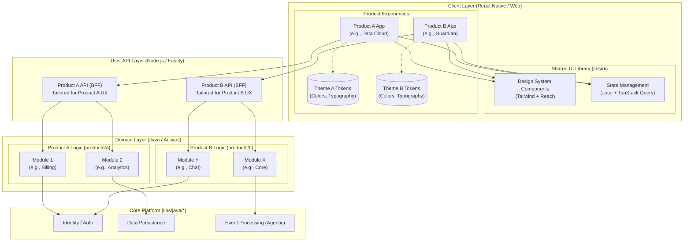

## Plan: Powerful Generic Kernel Platform

**Version**: 3.1  
**Date**: March 18, 2026  
**Status**: Strategic Vision — Living Document  
**Companion Documents**:

- [GRANULAR_PHASE_SPECIFICATIONS.md](GRANULAR_PHASE_SPECIFICATIONS.md) — Detailed Implementation Plan (Phases 0-6)
- [DETAILED_KERNEL_IMPLEMENTATION_PLAN.md](DETAILED_KERNEL_IMPLEMENTATION_PLAN.md) — PHR + Finance Integration Plan

### Executive Summary

This document defines the strategic vision for transforming the Ghatana app-platform into a **true composition kernel** that standardizes platform primitives while adapting proven capabilities from shared libraries, Data-Cloud, AEP, and the agent/runtime stack. The kernel becomes the central hub where plugins, operators, workflows, tenant-scoped feature sets, shared event/state infrastructure, and inter-module contracts converge without collapsing product boundaries into a monolithic platform.

The kernel is **AI/ML-native from day one** — intelligence is not an add-on but a foundational primitive woven into every layer: self-optimizing infrastructure, AI-assisted development, intelligent observability, and adaptive runtime behavior. Every component is aware of, and can leverage, the platform's AI capabilities implicitly.

The kernel is the **cornerstone of the entire application lifecycle** — from development and testing, through deployment and scaling, to monitoring, management, and continuous optimization. Products built on the kernel inherit this full lifecycle automatically: they declare intent; the kernel executes.

### What is the Kernel Platform?

The **Kernel Platform** is a sophisticated, AI-native abstraction layer that sits between core infrastructure services and product-specific applications. It provides:

- **Easy-to-Use Development Surface**: Simple, intuitive APIs and patterns for rapid application development
- **Powerful Composition Capabilities**: Rich set of building blocks for complex application assembly
- **Flexible Architecture**: Adaptable to different product needs and requirements
- **Customizable Framework**: Extensible in controlled, well-defined ways
- **Infrastructure Abstraction**: Hides complexity of underlying services, infrastructure, and processes
- **AI/ML-Native Intelligence**: Pervasive AI capabilities embedded in every kernel subsystem — not bolted on, but wired in
- **Full Lifecycle Ownership**: Development, deployment, monitoring, scaling, and management unified under one kernel surface

### Why the Kernel Platform Exists

1. **Simplify Development**: Provide easy-to-use patterns that accelerate product development — products declare business logic, the kernel handles everything else
2. **Abstract Complexity**: Hide infrastructure complexity while maintaining power and flexibility
3. **Enable Rapid Composition**: Assemble applications quickly from pre-built capabilities
4. **Controlled Extensibility**: Allow customization without compromising kernel integrity
5. **Ensure Product Focus**: Keep kernel generic while products maintain domain specificity
6. **AI-Native by Default**: Make intelligence implicit — every data pipeline has anomaly detection, every API has adaptive rate limiting, every deployment has predictive scaling
7. **Full Lifecycle Management**: Own the entire journey from code to production to continuous optimization, giving products complete visibility without operational burden
8. **Opinionated Core, Flexible Edges**: Enforce proven architectural patterns (ActiveJ, event sourcing, Data-Cloud, AEP) at the core while allowing controlled customization at product boundaries

### Core Kernel Philosophy

```
┌─────────────────────────────────────────────────────────────┐
│                    Product Applications                     │
│  ┌─────────────┐  ┌─────────────┐  ┌─────────────┐         │
│  │   FlashIt   │  │    Aura     │  │     PHR     │         │
│  │Personal AI  │  │Recommend   │  │Healthcare   │         │
│  └─────────────┘  └─────────────┘  └─────────────┘         │
│  ┌─────────────┐                                               │
│  │   Finance   │                                               │
│  │   Product   │                                               │
│  │   (Former   │                                               │
│  │ App-Platform│                                               │
│  │   Specific) │                                               │
│  └─────────────┘                                               │
└─────────────────────────────────────────────────────────────┘
                              │
                              ▼ Simple, Powerful APIs
┌─────────────────────────────────────────────────────────────┐
│                 Ghatana Kernel Platform                     │
│  ┌─────────────────────────────────────────────────────────┐ │
│  │           Minimum Viable Kernel Capabilities             │ │
│  │                                                         │ │
│  │  • UI/UX Development & Interaction Framework           │ │
│  │  • API & Business Logic Development Framework          │ │
│  │  • Core Product Requirements (Security, Resilience,    │ │
│  │    Scalability, Performance)                          │ │
│  │                                                         │ │
│  │  ┌─────────────┐  ┌─────────────┐  ┌─────────────┐     │ │
│  │  │   Kernel    │  │   Plugin    │  │  Workflow   │     │ │
│  │  │  Primitives │  │   Runtime   │  │   Runtime   │     │ │
│  │  └─────────────┘  └─────────────┘  └─────────────┘     │ │
│  │  ┌─────────────┐  ┌─────────────┐  ┌─────────────┐     │ │
│  │  │   Event     │  │   Config    │  │   Tenant    │     │ │
│  │  │   Store     │  │  Resolver   │  │  Context    │     │ │
│  │  └─────────────┘  └─────────────┘  └─────────────┘     │ │
│  └─────────────────────────────────────────────────────────┘ │
│                                                             │
│  • Controlled Extensibility (well-defined extension points) │
│  • Flexible Customization (within kernel boundaries)       │
│  • No Non-Generic Features (pure abstraction layer)        │
└─────────────────────────────────────────────────────────────┘
                              │
                              ▼ Complete Abstraction
┌─────────────────────────────────────────────────────────────┐
│                Core Infrastructure Services                   │
│  ┌─────────────┐  ┌─────────────┐  ┌─────────────┐         │
│  │ Data-Cloud  │  │     AEP     │  │ Shared Libs │         │
│  │   (Data)    │  │(Processing) │  │ (From App-  │         │
│  │             │  │             │  │ Platform)  │         │
│  │• Storage    │  │• Events     │  │• Auth       │         │
│  │• Config     │  │• Agents     │  │• Common    │         │
│  │• Governance │  │• Workflows  │  │  Utils     │         │
│  └─────────────┘  └─────────────┘  └─────────────┘         │
│                                                             │
│  • Infrastructure (Docker, K8s, Networks)                  │
│  • Processes (CI/CD, Monitoring, Logging)                   │
│  • External Systems (Databases, APIs, Services)             │
└─────────────────────────────────────────────────────────────┘
```

### Architecture Evolution: App-Platform Separation

#### What is App-Platform Separation?

The **App-Platform Separation** is a strategic architectural decision to split the existing app-platform into two distinct components:

1. **Finance Product Application**: Product-specific functionality that becomes a standalone product
2. **Shared Libraries**: Generic, reusable components moved to core infrastructure

#### Why App-Platform Separation Matters?

1. **Clear Product Boundaries**: Finance becomes a proper product with clear domain ownership
2. **Reusable Infrastructure**: Shared components become available to all products
3. **Reduced Complexity**: Cleaner separation of concerns and dependencies
4. **Better Scalability**: Independent scaling of products and shared infrastructure
5. **Improved Maintainability**: Easier to maintain and evolve shared components

#### App-Platform Separation Strategy

```
┌─────────────────────────────────────────────────────────────┐
│                Before Separation                            │
│                                                             │
│  ┌─────────────────────────────────────────────────────┐   │
│  │              App-Platform (Monolithic)               │   │
│  │                                                     │   │
│  │  • Finance Logic (Product-Specific)                 │   │
│  │  • Authentication (Shared)                          │   │
│  │  • Common Utilities (Shared)                        │   │
│  │  • Runtime Services (Shared)                        │   │
│  │  • Legacy Components (Mixed)                         │   │
│  └─────────────────────────────────────────────────────┘   │
└─────────────────────────────────────────────────────────────┘
                              │
                              ▼ Separation
┌─────────────────────────────────────────────────────────────┐
│                After Separation                             │
│                                                             │
│  ┌─────────────────┐      ┌─────────────────────────────┐   │
│  │  Finance Product│      │      Shared Libraries       │   │
│  │                 │      │                             │   │
│  │ • Trading Logic │      │ • Authentication Library     │   │
│  │ • Risk Mgmt     │      │ • Common Utilities           │   │
│  │ • Compliance    │      │ • Runtime Services            │   │
│  │ • Domain APIs   │      │ • Generic Components         │   │
│  └─────────────────┘      │ • Integration Frameworks      │   │
│                            │ • Legacy Refactors            │   │
│                            └─────────────────────────────┘   │
└─────────────────────────────────────────────────────────────┘
```

#### Migration Strategy

##### Phase 1: Analysis and Identification

- **Component Analysis**: Identify shared vs product-specific components
- **Dependency Mapping**: Map dependencies between components
- **Interface Definition**: Define clear interfaces for shared libraries
- **Migration Planning**: Create detailed migration roadmap

##### Phase 2: Shared Libraries Extraction

- **Library Creation**: Create shared libraries from generic components
- **Interface Implementation**: Implement defined interfaces
- **Testing**: Comprehensive testing of shared libraries
- **Documentation**: Complete documentation for shared libraries

##### Phase 3: Finance Product Separation

- **Product Extraction**: Extract finance-specific logic into standalone product
- **Dependency Refactoring**: Refactor dependencies to use shared libraries
- **API Definition**: Define finance product APIs
- **Integration**: Integrate with kernel platform

##### Phase 4: Migration and Validation

- **Gradual Migration**: Migrate existing functionality to new architecture
- **Validation**: Validate functionality and performance
- **Monitoring**: Monitor migration progress and issues
- **Optimization**: Optimize performance and usage

#### Shared Libraries Categories

##### 1. Authentication and Authorization

- **What It Is**: Generic authentication and authorization library
- **Why Shared**: All products need authentication capabilities
- **Components**: JWT handling, OAuth integration, RBAC framework
- **Migration Path**: Extract into shared library with kernel integration

##### 2. Common Utilities

- **What It Is**: Generic utility functions and helpers
- **Why Shared**: Reusable across all products
- **Components**: String utilities, date helpers, validation frameworks
- **Migration Path**: Package as shared library with versioning

##### 3. Runtime Services

- **What It Is**: Generic runtime and infrastructure services
- **Why Shared**: Common runtime requirements across products
- **Components**: Service discovery, configuration management, health checks
- **Migration Path**: Integrate with kernel runtime services

##### 4. Integration Frameworks

- **What It Is**: Generic integration and communication frameworks
- **Why Shared**: Standardized integration patterns
- **Components**: HTTP clients, message brokers, API gateways
- **Migration Path**: Enhance and move to core infrastructure

#### Benefits of Separation

##### 1. Product Clarity

- **Clear Ownership**: Finance product has clear domain ownership
- **Focused Development**: Product teams focus on product-specific features
- **Independent Roadmap**: Independent product roadmap and priorities

##### 2. Infrastructure Efficiency

- **Shared Resources**: Shared libraries reduce duplication
- **Consistent Patterns**: Standardized patterns across products
- **Easier Maintenance**: Single point of maintenance for shared components

##### 3. Scalability and Performance

- **Independent Scaling**: Products scale independently
- **Resource Optimization**: Optimized resource allocation
- **Performance Isolation**: Performance issues isolated to specific products

##### 4. Development Velocity

- **Parallel Development**: Teams can develop in parallel
- **Reduced Dependencies**: Fewer cross-team dependencies
- **Faster Iteration**: Faster iteration cycles for products

---

### Kernel Positioning Principles

#### 1. **Easy-to-Use Development Surface**

The kernel provides simple, intuitive interfaces that hide complexity while maintaining power:

```yaml
Development_Simplicity:
  UI_UX_Development:
    - Component Library: Pre-built UI components
    - Design System: Consistent design patterns
    - State Management: Simplified state handling
    - Form Handling: Easy form creation and validation

  API_Development:
    - REST/GraphQL: Simple API creation
    - Validation: Built-in request/response validation
    - Error Handling: Consistent error patterns
    - Documentation: Auto-generated API docs

  Business_Logic:
    - Domain Models: Easy domain modeling
    - Business Rules: Simple rule definition
    - Workflows: Visual workflow creation
    - Events: Easy event publishing/subscribing
```

#### 2. **Infrastructure Abstraction**

The kernel completely abstracts underlying complexity:

```yaml
Abstraction_Layers:
  Infrastructure_Abstraction:
    - Compute: Abstract container/runtime management
    - Storage: Unified storage interfaces
    - Network: Simplified networking patterns
    - Security: Centralized security management

  Process_Abstraction:
    - Deployment: One-click deployment
    - Scaling: Automatic scaling management
    - Monitoring: Built-in health checks
    - Logging: Structured logging out of the box

  Service_Abstraction:
    - Databases: Database-agnostic interfaces
    - Caching: Unified caching patterns
    - Messaging: Standardized message handling
    - External APIs: Consistent external service integration
```

#### 3. **Controlled Extensibility**

The kernel is extensible only through well-defined, controlled mechanisms:

```yaml
Extensibility_Model:
  Extension_Points:
    - Plugins: Hot-loadable capability modules
    - Operators: Custom processing components
    - Workflows: Business process extensions
    - UI Components: Custom UI elements

  Control_Mechanisms:
    - Interface Contracts: Strict interface definitions
    - Validation: Extension validation and security checks
    - Sandboxing: Isolated execution environments
    - Governance: Extension lifecycle management

  Forbidden_Extensions:
    - Core Kernel Modification: No direct kernel changes
    - Bypass Mechanisms: No circumvention of kernel controls
    - Direct Infrastructure Access: No direct infrastructure calls
    - Non-Generic Features: No product-specific features in kernel
```

#### 4. **Minimum Viable Kernel Capabilities**

The kernel starts with a focused set of essential capabilities:

```yaml
Minimum_Kernel_Capabilities:
  UI_UX_Framework:
    What_It_Is: "Complete UI/UX development and interaction framework"
    Why_It_Exists: "Every product needs user interface capabilities"
    Features:
      - Component Library (reusable UI components)
      - Design System (consistent design patterns)
      - State Management (application state handling)
      - Form Handling (form creation and validation)
      - Navigation (routing and navigation patterns)
      - Responsive Design (mobile-first design)

  API_Business_Logic_Framework:
    What_It_Is: "Complete API and business logic development framework"
    Why_It_Exists: "Every product needs API and business logic capabilities"
    Features:
      - API Generation (automatic REST/GraphQL APIs)
      - Validation Engine (request/response validation)
      - Business Rules (declarative rule definition)
      - Workflow Engine (business process automation)
      - Event System (publish/subscribe patterns)
      - Data Access (unified data access patterns)

  Core_Product_Requirements:
    What_It_Is: "Bedrock capabilities for secure, resilient, scalable systems"
    Why_It_Exists: "All products need these foundational capabilities"
    Features:
      - Security (authentication, authorization, encryption)
      - Resilience (fault tolerance, recovery)
      - Scalability (horizontal scaling, load balancing)
      - Performance (caching, optimization, monitoring)
      - Observability (logging, metrics, tracing)
      - Compliance (audit trails, data governance)
```

### Implementation Steps

The kernel implementation follows a systematic approach to ensure each component is properly designed and integrated:

#### Step 1: Define Kernel Platform Primitives

**What are Kernel Primitives?**
Kernel primitives are the foundational abstractions that define how all components interact with the kernel. These are the non-negotiable core concepts that every product, module, and plugin must understand.

**Why This Step First?**
This step blocks all subsequent work because it establishes the contract language that determines whether existing capabilities can be reused directly or need adaptation.

**Core Kernel Primitives:**

1. **`KernelDescriptor`**: Universal metadata model for all kernel components
   - **What It Is**: Canonical descriptor containing identity, capabilities, dependencies, and lifecycle information
   - **Why It Exists**: Provides consistent way to describe any component (module, plugin, operator, agent)
   - **Key Fields**: descriptorId, version, capabilities, dependencies, lifecyclePolicy, tenantSupport

2. **`KernelModule`**: Product-specific domain modules
   - **What It Is**: Self-contained domain functionality (e.g., PHR's PatientRecordModule)
   - **Why It Exists**: Enables product ownership while providing kernel integration
   - **Characteristics**: Domain-owned, kernel-registered, tenant-aware

3. **`KernelPlugin`**: Pluggable cross-cutting capabilities
   - **What It Is**: Reusable capabilities that can be added to any product (e.g., authentication, notifications)
   - **Why It Exists**: Enables capability sharing without product coupling
   - **Characteristics**: Kernel-owned, product-consumable, hot-reloadable

4. **`KernelRegistry`**: Universal discovery and registration
   - **What It Is**: Central registry for all kernel components
   - **Why It Exists**: Provides consistent discovery and dependency resolution
   - **Capabilities**: By-ID lookup, capability lookup, dependency ordering, lifecycle tracking

5. **`KernelEventStore`**: Immutable event storage
   - **What It Is**: Append-only event store for audit and event sourcing
   - **Why It Exists**: Provides reliable audit trails and event replay capabilities
   - **Characteristics**: Immutable, tenant-isolated, multi-backend support

6. **`KernelWorkflowRuntime`**: Durable workflow execution
   - **What It Is**: Workflow orchestration engine for complex processes
   - **Why It Exists**: Enables reliable, long-running business processes
   - **Capabilities**: Durable execution, compensation, state management, error handling

7. **`KernelInteractionBus`**: Inter-component communication
   - **What It Is**: Message bus for component communication
   - **Why It Exists**: Enables loose coupling between components
   - **Patterns**: Pub/sub, request/response, streaming

8. **`KernelTenantContext`**: Tenant isolation and context
   - **What It Is**: Tenant-specific context and isolation boundaries
   - **Why It Exists**: Enables multi-tenancy with proper isolation
   - **Capabilities**: Tenant propagation, resource isolation, feature gating

9. **`KernelConfigResolver`**: Dynamic configuration management
   - **What It Is**: Hierarchical configuration resolution system
   - **Why It Exists**: Enables dynamic configuration without code changes
   - **Characteristics**: Hierarchical, hot-reloadable, tenant-scoped

10. **`KernelLifecycle`**: Component lifecycle management
    - **What It Is**: Unified lifecycle management for all components
    - **Why It Exists**: Provides consistent startup, shutdown, and health management
    - **States**: Initializing, Ready, Degraded, Shutdown

#### Step 2: Universal Descriptor and Lifecycle Models

**What is Universal Descriptor Model?**
A single, canonical way to describe any component in the kernel ecosystem, combining the best aspects of existing descriptor patterns.

**Why Universal Models Matter?**
Eliminates descriptor fragmentation and ensures consistent component understanding across all products and modules.

**Implementation Approach:**

- **Base Model**: Start with `AgentDescriptor` richness (identity, capabilities, metadata)
- **Enhance With**: `PluginManifest` compatibility and dependency fields
- **Distinguish**: Three separate concerns:
  - **Identity Metadata**: Who am I? (descriptorId, version, owner)
  - **Runtime State**: What is my current state? (status, health, metrics)
  - **Tenant Features**: What am I enabled for? (tenants, features, policies)

#### Step 3: Unified Registry Layer

**What is Unified Registry?**
A Promise-based registry system that can handle any type of kernel component consistently.

**Why Promise-based?**

- **Async-First**: Fits with ActiveJ's Promise-based architecture
- **Performance**: Non-blocking lookups and registrations
- **Consistency**: Proven pattern in AEP operator catalogs and agent registries

**Registry Capabilities:**

- **By-ID Lookup**: Direct component access by unique identifier
- **Capability Lookup**: Find components by what they can do
- **Dependency Ordering**: Automatic dependency resolution and ordering
- **Lifecycle Visibility**: Track component states and health
- **Multi-Type Support**: Handle plugins, operators, agents, workflows uniformly

#### Step 4: Plugin Loading and Communication

**What is Plugin Standardization?**
Adapting the existing platform plugin stack to provide consistent plugin behavior across all products.

**Why Plugin Standardization?**

- **Reuse Existing Investment**: Leverage proven plugin infrastructure
- **Consistent Experience**: Same plugin behavior across all products
- **Operational Simplicity**: One way to deploy and manage plugins

**Key Plugin Capabilities:**

- **Lifecycle Management**: Consistent startup, shutdown, health monitoring
- **Hot-Reload Path**: Runtime plugin updates without system restart
- **Classloader Isolation**: Prevent plugin dependency conflicts
- **Typed Contracts**: Strongly typed request/response communication
- **Pub/Sub Communication**: Event-based plugin interaction

#### Step 5: Event Sourcing and Shared State

**What is Event Sourcing Infrastructure?**
First-class kernel services for immutable event storage and state management.

**Why Event Sourcing in Kernel?**

- **Audit Requirements**: Complete audit trails for compliance
- **Debugging**: Event replay for issue diagnosis
- **Integration**: Reliable event-based integration between components
- **State Reconstruction**: Rebuild state from event history

**KernelEventStore SPI Design:**

- **Multi-Backend Support**: Wrap existing stores (app-platform, Data-Cloud, EventCloud)
- **Append/Tail Semantics**: Consistent event storage and retrieval
- **Tenant Isolation**: Separate event streams per tenant
- **Binary Data Handling**: Keep large data out of event log, store references
- **Performance Optimization**: Efficient event storage and retrieval

#### Step 6: Generic Workflow Contribution Model

**What is Workflow Contribution Model?**
Making workflows a generic contribution mechanism where any module or plugin can contribute workflow capabilities.

**Why Generic Workflow Model?**

- **Extensibility**: Allow any component to contribute workflow steps
- **Reusability**: Share workflow patterns across products
- **Flexibility**: Avoid hard-coding product-specific workflows in kernel

**Contribution Types:**

- **Step Operators**: Individual workflow steps
- **Triggers**: Event-based workflow initiation
- **Policies**: Workflow execution rules and constraints
- **Sub-Workflows**: Reusable workflow fragments
- **Orchestration Fragments**: Complex workflow patterns

#### Step 7: AEP Operator Model as Extension Model

**What is Operator-Based Extension?**
Using AEP's `UnifiedOperator` model as the kernel's standard for executable extensions.

**Why Operator Model?**

- **Proven Pattern**: AEP operators are battle-tested
- **Unified Abstraction**: Single way to handle executable behavior
- **Composition Support**: Built-in operator composition patterns

**Operator Types:**

- **Feature Logic**: Business rule execution
- **Transformations**: Data format conversion
- **Triggers**: Event-based activation
- **Inference**: AI/ML model execution
- **Integration Adapters**: External system connectivity

#### Step 8: Agent Framework as Execution Layer

**What is Agent Integration?**
Using the agent framework as one type of executable component, not the entire kernel.

**Why Agent Integration?**

- **Higher-Order Reasoning**: Agents for complex decision making
- **Stateful Execution**: Agents maintain state across interactions
- **Typed Execution**: Strongly typed agent interfaces

**Agent Use Cases:**

- **Complex Decision Making**: Multi-step reasoning
- **Learning Loops**: Adaptive behavior based on feedback
- **Stateful Processing**: Maintain context across operations
- **Monitoring**: Intelligent system monitoring

#### Step 9: Tenant-Scoped Config and Feature Governance

**What is Tenant Governance?**
Per-tenant configuration and feature management with compiled config patterns.

**Why Tenant Governance?**

- **Multi-Tenancy**: Support multiple customers with different needs
- **Feature Rollouts**: Controlled feature deployment
- **License Management**: Feature-based licensing

**Governance Layers:**

- **Module Installed**: Available in tenant
- **Module Ready**: Configured and operational
- **Feature Enabled**: Active for users
- **Tenant Allowed**: Licensed and permitted

#### Step 10: Shared Data and Source of Truth Rules

**What is Data Architecture Principles?**
Clear rules for data ownership and sharing to prevent data chaos.

**Why Data Rules Matter?**

- **Prevent Data Silos**: Avoid creating universal shared schemas
- **Maintain Ownership**: Domain owners control their data
- **Enable Integration**: Provide controlled data sharing

**Data Principles:**

- **Domain Ownership**: Each domain owns its data
- **Shared Events**: Canonical event models for integration
- **Contract-Based Access**: Data access through defined contracts
- **Kernel Concerns Only**: Shared storage for kernel-specific needs

#### Step 11: Interoperability and Boundary Rules

**What are Boundary Rules?**
Strict rules for how components can interact to prevent architectural erosion.

**Why Boundary Rules?**

- **Prevent Coupling**: Stop direct hidden dependencies
- **Ensure Clarity**: Make all interactions explicit
- **Maintain Flexibility**: Enable component replacement

**Allowed Interactions:**

- **Typed Contracts**: Strongly typed service interfaces
- **Event Topics**: Pub/sub event communication
- **Operator Composition**: Data flow through operators
- **Workflow Handoffs**: Process-based interactions

**Forbidden Interactions:**

- **Arbitrary Classpath Calls**: Direct class access
- **Shared Mutable State**: Global state modification
- **Hidden Dependencies**: Undeclared coupling

#### Step 12: Staged Migration Strategy

**What is Migration Phasing?**
Gradual, staged approach to kernel adoption to minimize risk.

**Why Staged Migration?**

- **Risk Management**: Gradual reduces failure impact
- **Learning Curve**: Team adaptation time
- **Validation**: Each phase validates the next

**Migration Phases:**

- **Phase A**: Kernel primitives and descriptor model
- **Phase B**: Plugin runtime and interaction bus
- **Phase C**: Workflow runtime and event store
- **Phase D**: Agent runtime and tenant config
- **Phase E**: Module migration and compile-time pluggability
- **Phase F**: Runtime plugins and hot-reload

---

### Security and Observability Integration

#### Security Architecture

**What is Security Architecture in the Kernel?**

Security Architecture defines how the kernel provides comprehensive security capabilities across all products while maintaining product-specific security boundaries and compliance requirements.

**Why Security Architecture Matters**:

- **Unified Security Framework**: Consistent security posture across all products
- **Compliance Support**: Meet industry standards (HIPAA, GDPR, financial regulations)
- **Centralized Security Management**: Reduce security complexity through shared capabilities
- **Product-Specific Boundaries**: Respect product-specific security requirements
- **Incident Response**: Rapid security incident detection and response

**Security Capability Families:**

##### 1. Authentication and Identity Management

- **Multi-Factor Authentication**: MFA support across all products
- **Social Login Integration**: OAuth2/OpenID Connect providers
- **Enterprise SSO**: SAML, LDAP, Active Directory integration
- **Biometric Authentication**: Fingerprint, facial recognition
- **Token Management**: JWT, refresh tokens, session management

##### 2. Authorization and Access Control

- **Role-Based Access Control (RBAC)**: Role-based permissions
- **Attribute-Based Access Control (ABAC)**: Attribute-based permissions
- **Policy-Based Access**: Dynamic policy evaluation
- **Resource-Level Permissions**: Granular access control
- **Time-Bound Permissions**: Temporary access grants

##### 3. Data Protection

- **Encryption at Rest**: AES-256 for stored data
- **Encryption in Transit**: TLS 1.3 for network communication
- **Field-Level Encryption**: Sensitive field encryption
- **Key Management**: Centralized key rotation and management
- **Data Masking**: Sensitive data masking for non-production

##### 4. Audit and Compliance

- **Immutable Audit Logs**: Tamper-proof audit trails
- **Real-Time Monitoring**: Security event monitoring
- **Compliance Reporting**: Automated compliance report generation
- **Anomaly Detection**: Unusual activity detection
- **Forensic Analysis**: Security incident investigation tools

#### Observability Architecture

**What is Observability Architecture in the Kernel?**

Observability Architecture defines how the kernel provides comprehensive monitoring, logging, tracing, and alerting capabilities across all products, enabling operational excellence and rapid issue detection.

**Why Observability Architecture Matters**:

- **Unified Observability**: Consistent monitoring across all products
- **Proactive Issue Detection**: Identify problems before they impact users
- **Performance Optimization**: Support performance tuning and capacity planning
- **Debugging Support**: Facilitate rapid troubleshooting
- **SLO Management**: Ensure service level objectives are met

**Observability Capability Families:**

##### 1. Monitoring Framework

- **Metrics Collection**: Application and infrastructure metrics
- **Performance Monitoring**: Response times, throughput, error rates
- **Health Checks**: Service health and availability
- **Custom Metrics**: Business-specific metrics
- **Intelligent Alerting**: Context-aware alerting

##### 2. Logging Framework

- **Structured Logging**: JSON-formatted logs with consistent schema
- **Log Aggregation**: Centralized log collection and storage
- **Log Search and Analysis**: Powerful log search capabilities
- **Log Retention Policies**: Automated log lifecycle management
- **Real-Time Log Streaming**: Live log monitoring

##### 3. Tracing Framework

- **Distributed Tracing**: End-to-end request tracking
- **Span Collection**: Detailed operation timing
- **Trace Visualization**: Request flow visualization
- **Performance Analysis**: Bottleneck identification
- **Service Dependency Mapping**: Service interaction mapping

##### 4. Alerting Framework

- **Multi-Channel Alerting**: Email, SMS, Slack, PagerDuty, Teams, Discord
- **Alert Routing**: Intelligent alert routing based on severity, team, and expertise
- **Alert Aggregation**: Correlated alert grouping to reduce noise
- **Automated Response**: Automated incident response actions and playbooks
- **Alert Escalation**: Progressive alert escalation with SLA tracking
- **Alert Enrichment**: Contextual information added to alerts (logs, metrics, traces)

##### 5. Observability Data Lake

- **Unified Observability Storage**: Centralized storage for all observability data
- **Long-Term Retention**: Cost-effective long-term data retention policies
- **Data Correlation**: Cross-domain correlation (metrics logs traces)
- **Query Federation**: Unified query interface across all observability data
- **Data Governance**: Observability data access controls and compliance

##### 6. Synthetic Monitoring

- **Active Monitoring**: Proactive testing of user journeys and APIs
- **Transaction Monitoring**: End-to-end transaction flow monitoring
- **Geographic Monitoring**: Global performance monitoring from multiple regions
- **Dependency Monitoring**: External service and dependency health monitoring
- **Performance Baselines**: Automated baseline establishment and drift detection

##### 7. Anomaly Detection and AI Ops

- **Machine Learning Anomaly Detection**: Automated detection of unusual patterns
- **Predictive Alerting**: Alerts based on predicted issues before they occur
- **Root Cause Analysis**: Automated root cause identification using AI
- **Self-Healing**: Automated remediation of common issues
- **Capacity Planning**: Predictive capacity planning and resource optimization

##### 8. Business Intelligence and Analytics

- **Business Metrics**: KPI tracking and business outcome monitoring
- **User Behavior Analytics**: User journey analysis and optimization
- **Revenue Impact Analysis**: Technical issues impact on business metrics
- **Conversion Tracking**: End-to-end conversion funnel monitoring
- **A/B Testing Analytics**: Statistical analysis of feature experiments

##### 9. Compliance and Audit Observability

- **Compliance Monitoring**: Real-time compliance status monitoring
- **Audit Trail Observability**: Comprehensive audit trail tracking and analysis
- **Data Privacy Monitoring**: Personal data access and usage monitoring
- **Security Observability**: Security event monitoring and threat detection
- **Regulatory Reporting**: Automated generation of compliance reports

##### 10. Cost Observability

- **Cloud Cost Monitoring**: Real-time cloud spend tracking and optimization
- **Resource Cost Attribution**: Cost attribution by team, product, and feature
- **Cost Anomaly Detection**: Unusual spend patterns and optimization opportunities
- **Budget Monitoring**: Budget tracking and alerting
- **ROI Analysis**: Return on investment for infrastructure and services

### Additional Core Capabilities

#### 11. Performance Management and Optimization

**What is Performance Management?**
Comprehensive performance monitoring, analysis, and optimization system that ensures all products meet performance requirements and SLAs.

**Why Performance Management Matters**:

- **User Experience**: Ensure optimal user experience across all products
- **SLA Compliance**: Meet service level agreements and performance guarantees
- **Resource Optimization**: Optimize resource utilization and cost efficiency
- **Proactive Performance**: Identify and resolve performance issues before impact

**Performance Management Capabilities:**

##### 1. Application Performance Monitoring (APM)

- **Code-Level Instrumentation**: Detailed code performance profiling
- **Database Performance**: Query optimization and connection pooling
- **Cache Performance**: Cache hit rates and optimization
- **API Performance**: Endpoint performance and optimization
- **Frontend Performance**: Page load times and optimization

##### 2. Infrastructure Performance

- **CPU/Memory Monitoring**: Resource utilization tracking
- **Network Performance**: Latency, bandwidth, and throughput
- **Storage Performance**: I/O operations and disk performance
- **Container Performance**: Container resource monitoring
- **Cloud Performance**: Cloud service performance monitoring

##### 3. Performance Optimization

- **Auto-Tuning**: Automatic performance tuning
- **Resource Scaling**: Dynamic resource allocation
- **Load Balancing**: Intelligent load distribution
- **Caching Optimization**: Multi-level caching strategies
- **Database Optimization**: Query optimization and indexing

#### 12. Security Operations (SecOps)

**What is Security Operations?**
Comprehensive security monitoring, threat detection, and incident response system that protects all products and infrastructure.

**Why Security Operations Matters**:

- **Threat Detection**: Early detection of security threats
- **Incident Response**: Rapid response to security incidents
- **Compliance**: Meet security compliance requirements
- **Risk Management**: Proactive risk identification and mitigation

**Security Operations Capabilities:**

##### 1. Security Monitoring

- **Threat Detection**: AI-powered threat detection
- **Vulnerability Scanning**: Automated vulnerability assessment
- **Security Event Monitoring**: Real-time security event tracking
- **User Behavior Analytics**: Anomalous user behavior detection
- **Network Security**: Network traffic monitoring and analysis

##### 2. Incident Response

- **Security Incident Management**: Security incident lifecycle management
- **Automated Response**: Automated security response actions
- **Forensics**: Security incident investigation and forensics
- **Threat Intelligence**: Threat intelligence integration
- **Security Playbooks**: Automated security response playbooks

##### 3. Compliance Management

- **Security Compliance**: Automated compliance monitoring
- **Policy Management**: Security policy enforcement
- **Audit Management**: Security audit automation
- **Risk Assessment**: Security risk assessment and reporting
- **Security Reporting**: Automated security reports

#### 13. DevOps and CI/CD Integration

**What is DevOps Integration?**
Comprehensive DevOps and CI/CD integration that enables seamless development, testing, and deployment of all products.

**Why DevOps Integration Matters**:

- **Development Velocity**: Accelerate development cycles
- **Quality Assurance**: Automated testing and quality gates
- **Deployment Safety**: Safe and reliable deployments
- **Collaboration**: Enhanced developer and operations collaboration

**DevOps Integration Capabilities:**

##### 1. CI/CD Pipeline Management

- **Build Automation**: Automated build and compilation
- **Testing Automation**: Automated testing at all levels
- **Deployment Automation**: Automated deployment pipelines
- **Environment Management**: Multi-environment deployment
- **Release Management**: Release orchestration and management

##### 2. Code Quality and Security

- **Static Analysis**: Automated code quality analysis
- **Security Scanning**: Automated security scanning
- **Dependency Management**: Automated dependency updates
- **Code Coverage**: Automated code coverage reporting
- **Performance Testing**: Automated performance testing

##### 3. Infrastructure as Code (IaC)

- **Template Management**: Infrastructure template management
- **Environment Provisioning**: Automated environment provisioning
- **Configuration Management**: Infrastructure configuration management
- **Compliance Checking**: Infrastructure compliance validation
- **Cost Optimization**: Infrastructure cost optimization

#### 14. Data Management and Governance

**What is Data Management and Governance?**
Comprehensive data management, governance, and compliance system that ensures data quality, security, and regulatory compliance.

**Why Data Management Matters**:

- **Data Quality**: Ensure data accuracy and consistency
- **Data Security**: Protect sensitive data and ensure privacy
- **Regulatory Compliance**: Meet data protection regulations
- **Data Lifecycle**: Manage data throughout its lifecycle

**Data Management Capabilities:**

##### 1. Data Governance

- **Data Catalog**: Comprehensive data catalog and metadata
- **Data Lineage**: Data lineage tracking and visualization
- **Data Quality**: Data quality monitoring and improvement
- **Data Classification**: Automated data classification
- **Data Policies**: Data policy enforcement and management

##### 2. Data Security and Privacy

- **Data Encryption**: Data encryption at rest and in transit
- **Access Control**: Granular data access control
- **Data Masking**: Sensitive data masking and anonymization
- **Privacy Compliance**: GDPR, CCPA, and privacy compliance
- **Data Loss Prevention**: Data loss prevention and monitoring

##### 3. Data Lifecycle Management

- **Data Retention**: Automated data retention policies
- **Data Archival**: Long-term data archival
- **Data Disposal**: Secure data disposal and deletion
- **Data Migration**: Data migration and transformation
- **Data Backup**: Automated backup and recovery

#### 15. Integration and Ecosystem Management

**What is Integration Management?**
Comprehensive integration and ecosystem management that enables seamless connectivity with external systems and services.

**Why Integration Management Matters**:

- **Ecosystem Connectivity**: Connect with external systems and services
- **API Management**: Manage APIs and integrations
- **Data Exchange**: Enable secure data exchange
- **Partner Integration**: Integrate with partner systems

**Integration Management Capabilities:**

##### 1. API Management

- **API Gateway**: Centralized API management
- **API Security**: API authentication and authorization
- **API Monitoring**: API performance and usage monitoring
- **API Documentation**: Automated API documentation
- **API Versioning**: API version management and compatibility

##### 2. Integration Hub

- **Message Broker**: Enterprise message broker
- **Event Streaming**: Real-time event streaming
- **Data Integration**: Data integration and transformation
- **Partner Integration**: Partner system integration
- **Third-Party Integration**: Third-party service integration

##### 3. Ecosystem Management

- **Partner Portal**: Partner integration portal
- **Developer Portal**: API developer portal
- **Integration Marketplace**: Integration marketplace
- **Community Management**: Developer community management
- **Support and Documentation**: Integration support and documentation

---

The kernel should not try to make FlashIt, Aura, and PHR look like the same product. It should provide a common composition surface so each product can assemble strong product-specific modules from shared platform capabilities.

The right product-building model is:

- the kernel owns lifecycle, registry, eventing, workflow runtime, plugin communication, tenant scoping, config resolution, audit hooks, and shared infrastructure contracts
- each product owns its domain model, domain workflows, product UX, domain APIs, and domain-specific policy logic
- shared services become reusable platform capabilities only when they solve the same operational problem across products, not merely because they exist in more than one codebase

That leads to three layers:

- **Kernel layer**: descriptors, plugin/module loading, registry, workflow runtime, event store, interaction bus, tenant context, executor governance, health/readiness, feature governance
- **Platform capability layer**: auth, consent pattern, notifications, document/object storage, vector search, async jobs, adapters, analytics/event streaming, compiled config, interoperability bridges
- **Product composition layer**: FlashIt moments/reflection, Aura recommendation and ontology systems, PHR clinical records and consent-first healthcare workflows

**Product-Building Model By Product**

### FlashIt on the Kernel

FlashIt is the best candidate for proving fast product composition because it already combines a gateway, an ActiveJ agent service, offline-first clients, media storage, semantic search, and reflective AI behavior.

FlashIt should be built from these kernel/platform capabilities:

- identity/session and billing capability set
- object storage and media-ingestion capability set
- async transcription and reflection job capability set
- vector search and embedding capability set
- event-driven notification capability set
- offline sync and background upload capability set
- plugin-contributed AI providers and enrichment operators

FlashIt-specific domain modules should remain product-owned:

- MomentModule
- SphereModule
- ReflectionModule
- CollaborationModule
- PersonalKnowledgeModule

The kernel should help FlashIt in these concrete ways:

1. model AI reflection, transcription, embedding, search enrichment, and pattern extraction as operator or agent plugins instead of hard-wired service calls
2. move media processing, semantic indexing, and notification scheduling onto kernel workflow/runtime infrastructure
3. use the interaction bus to let collaboration, reflection, and search modules communicate without direct classpath coupling
4. adopt the kernel event store for moment-created, media-uploaded, reflection-generated, and notification-delivered events
5. treat offline sync as a reusable capability package, but let FlashIt keep moment-specific merge policies in product code

Concrete FlashIt build sequence:

1. wrap the current Java agent features behind a kernel-compatible executable contract using `UnifiedOperator` or `TypedAgent` adapters
2. expose reflection, transcription, embeddings, and pattern detection as registered executable capabilities in the kernel registry
3. move gateway-triggered background operations to kernel workflows backed by the event store and executor registry
4. define FlashIt-specific product descriptors for moments, spheres, reflection, and collaboration as first-party compile-time modules
5. extract shared media/object storage, notifications, and background upload concerns into platform capability modules
6. keep sphere-sharing ACL and moment semantics in the product layer, even if they use shared consent/access primitives underneath

FlashIt feature packs on top of the kernel:

- `flashit-core-capture`
- `flashit-ai-reflection`
- `flashit-search-and-graph`
- `flashit-collaboration`
- `flashit-premium-billing`

FlashIt risks to plan for:

- do not force FlashIt’s personal knowledge graph semantics into a generic kernel graph model
- do not make LLM providers part of the kernel core; keep them as plugins/providers
- do not block FlashIt iteration speed on fully generalized runtime plugin loading; compile-time pluggability is enough first

### Aura on the Kernel

Aura is the strongest case for a powerful capability-driven kernel because it needs ingestion pipelines, ontologies, recommendation workflows, profile intelligence, explainable ranking, and long-horizon tasks. It will benefit the most from combining AEP operators, workflow runtime, agent framework, eventing, and tenant-scoped config.

Aura should be built from these kernel/platform capabilities:

- ingestion connector framework
- event streaming and catalog pipeline capability set
- recommendation execution and ranking operator capability set
- profile intelligence and agent-learning capability set
- vector search and similarity capability set
- knowledge graph and ontology adapter capability set
- experimentation and feature rollout capability set

Aura-specific product modules should remain product-owned:

- CatalogIngestionModule
- YouIndexModule
- RecommendationModule
- IngredientIntelligenceModule
- ShadeOntologyModule
- LongHorizonTaskModule

The kernel should help Aura in these concrete ways:

1. use AEP-style operators for source ingestion, normalization, enrichment, scoring, ranking, and explanation building
2. use durable workflows for long-running product ingestion, catalog reconciliation, and user-task execution
3. use typed agents for higher-order reasoning components such as profile intelligence, recommendation refinement, and learning loops
4. use tenant-scoped compiled config for recommendation policies, ranking strategies, data-source enablement, and experimentation flags
5. use the event store and interaction bus so product catalog changes, feedback loops, and ranking updates propagate asynchronously across modules

Concrete Aura build sequence:

1. define Aura executable capability classes: ingestion operator, ranking operator, ontology resolver, profile inference agent, learning/reflection agent
2. represent catalog import and recommendation pipelines as kernel-registered pipelines/workflows rather than custom internal orchestration code
3. use the kernel registry to discover ranking strategies, ingestion connectors, ontology packs, and model providers by capability and version
4. keep the “You Index” domain model product-owned, but make its builders and inference paths pluggable through kernel descriptors and workflows
5. move experimentation, rollout, and tenant-specific profile policy resolution onto the kernel feature-governance layer
6. add product-scoped event topics for catalog updates, recommendation feedback, ranking recalculation, and long-horizon task state changes

Aura feature packs on top of the kernel:

- `aura-catalog-and-ingestion`
- `aura-recommendation-engine`
- `aura-you-index`
- `aura-ontology-and-knowledge-graph`
- `aura-long-horizon-agent-runtime`

Aura risks to plan for:

- do not collapse ontology, product graph, and user profile into one shared kernel data model
- do not centralize recommendation logic inside the kernel; centralize only the execution/runtime abstractions
- do not make LLM or ML serving assumptions part of the kernel core; model them as provider-backed capabilities

### PHR on the Kernel

PHR is the strictest product and should be used to validate whether the kernel can support high-governance, consent-first, audit-heavy, multi-tenant regulated domains without weakening domain boundaries.

PHR should be built from these kernel/platform capabilities:

- strong identity, tenant, and facility isolation capability set
- consent and delegated access capability set
- audit/event-sourcing capability set
- document, OCR, ASR, and export workflow capability set
- notification and reminder capability set
- offline sync and conflict-resolution capability set
- interoperability adapter capability set for FHIR, insurance, payments, and messaging

PHR-specific domain modules should remain product-owned:

- PatientRecordModule
- EncounterModule
- ObservationModule
- MedicationModule
- AppointmentModule
- FhirInteropModule
- ClinicalConsentModule
- ImagingModule
- BillingModule

The kernel should help PHR in these concrete ways:

1. use kernel workflow/runtime for OCR review, ASR review, export jobs, reminder planning, referral progression, and payment status orchestration
2. use the kernel event store for auditable state transitions, integration events, and selected domain replay use cases without replacing clinical source-of-truth stores
3. use kernel tenant context and feature governance to isolate facilities, product rollout phases, FHIR resource activation levels, and regional policy variations
4. use kernel plugin/adapter contracts for openIMIS, payment gateways, SMS/email providers, OCR engines, ASR engines, and DICOM/viewer providers
5. use a shared offline-sync substrate only for the mechanics of queueing, replay, sync metadata, and conflict surfacing; keep healthcare merge and approval policies inside PHR modules

Concrete PHR build sequence:

1. define the PHR module boundary map around patient records, consent, document processing, imaging, billing, and interoperability
2. move all non-domain-specific job orchestration to kernel workflows backed by audit hooks and event publication
3. model external systems as kernel adapters with explicit contracts and tenant-scoped configuration
4. create a reusable platform consent/access layer only where FlashIt and Aura can meaningfully reuse patterns such as delegated access or attribute-based sharing, while keeping healthcare-specific legal semantics in PHR
5. build the offline sync substrate as a kernel facility with product-defined merge policies, starting with PHR because it has the hardest real requirements
6. keep FHIR translation and Nepal-specific policy enforcement entirely in the PHR product layer or tightly scoped platform adapters, not in the generic kernel core

PHR feature packs on top of the kernel:

- `phr-clinical-records`
- `phr-consent-and-delegation`
- `phr-documents-ocr-asr`
- `phr-referrals-imaging-billing`
- `phr-fhir-and-external-adapters`

PHR risks to plan for:

- do not mistake kernel event sourcing for the entire healthcare record of truth
- do not push FHIR semantics down into unrelated products
- do not generalize consent so much that healthcare-grade access semantics become impossible to enforce

**Shared Capability Map Across FlashIt, Aura, and PHR**

The kernel should expose reusable capability families. These should be independently installable, versioned, and tenant-configurable.

### 1. Identity, Access, and Tenant Capability Family

- auth/session lifecycle
- tenant context propagation
- feature rollout and licensing
- delegated access and scoped access primitives
- audit hooks on sensitive actions

Products using it:

- FlashIt: sessions, billing tiers, sharing roles
- Aura: tenant and experimentation governance, premium feature tiers
- PHR: facility isolation, patient/provider/caregiver roles, strict access checks

### 2. Workflow and Execution Capability Family

- durable workflow runtime
- step-operator registry
- operator composition and pipeline builder
- typed agent runtime
- retry, compensation, and timeout policies

Products using it:

- FlashIt: reflection generation, transcription, search enrichment, notifications
- Aura: ingestion, ranking, learning loops, long-horizon tasks
- PHR: export jobs, OCR/ASR review, reminders, referrals, payments

### 3. Data, Event, and Store Capability Family

- kernel event store SPI
- append/tail/scan infrastructure
- projection and registry metadata store
- object/document store contracts
- optional vector and graph adapters

Products using it:

- FlashIt: moment event stream, search projections, media workflows
- Aura: catalog and feedback events, ranking recalculation, similarity infrastructure
- PHR: audit-rich job state transitions, interoperability events, export and document state

### 4. Plugin and Interoperability Capability Family

- plugin lifecycle and registry
- typed plugin contracts
- interaction bus pub/sub + request/response
- provider adapters for external systems
- hot reload path for later maturity stages

Products using it:

- FlashIt: AI provider, transcription provider, collaboration or realtime adapters
- Aura: ingestion connectors, model providers, ontology providers, ranking strategies
- PHR: OCR/ASR providers, openIMIS, payment gateways, SMS/email, imaging viewers

### 5. Offline, Async, and Notification Capability Family

- queueing and async job scheduling
- sync metadata and replay substrate
- push/email/SMS notification orchestration
- conflict detection framework

Products using it:

- FlashIt: offline capture and upload, reminders, reflection readiness
- Aura: mostly async orchestration and notifications; offline is optional
- PHR: offline reads/writes, conflict surfacing, reminders, status notifications

**Concrete Delivery Plan For The Platform Itself**

The kernel plan needs a product-aware execution path, not only an abstract architecture sequence.

### Platform Wave 1: Core Kernel Skeleton

- implement canonical descriptors, lifecycle model, registry interfaces, tenant context contract, and executor governance
- adapt compile-time module loading first
- define plugin communication interfaces and event store SPI

Outcome:

- FlashIt can begin moving agent services and background jobs behind kernel contracts
- Aura can start with kernel-native descriptors and registry-driven capability discovery
- PHR can start from a strong governance and workflow substrate even before full implementation begins

### Platform Wave 2: Execution and Workflow Layer

- adapt durable workflow runtime, step operator registry, operator catalog, and agent registry into a common kernel execution surface
- add product-scoped namespaces and lifecycle governance
- provide audit/event hooks and per-tenant config resolution

Outcome:

- FlashIt reflection/transcription/search tasks run as kernel workflows
- Aura ingestion/ranking/learning systems run as kernel pipelines and workflows
- PHR OCR/export/reminder/referral/payment jobs run as governed product workflows

### Platform Wave 3: Shared Capability Modules

- extract notifications, object storage, async job orchestration, consent/access primitives, feature governance, and adapter contracts into shared platform capability modules
- formalize product-specific adapters and provider packs

Outcome:

- FlashIt reduces duplicated infrastructure code
- Aura launches on a richer capability base instead of inventing orchestration and provider abstractions from scratch
- PHR gets reusable but policy-safe platform services for jobs, notifications, adapters, and sync mechanics

### Platform Wave 4: Runtime Plugin Loading and Advanced Composition

- enable runtime plugin loading where operationally safe
- add version compatibility validation, hot-reload controls, dependency ordering, and health/degradation management
- support marketplace-like internal plugin distribution only after compile-time module composition is stable

Outcome:

- FlashIt can add experimental AI providers or search enrichers faster
- Aura can ship ranking strategies, ontology packs, or ingestion connectors as plugins
- PHR can add regional adapters, OCR/ASR providers, or imaging/payment providers without destabilizing core clinical modules

**Concrete Product Rollout Order**

Recommended order for proving the platform:

1. **FlashIt first** for fast feedback on modular AI workflows, storage, notifications, and background tasks
2. **Aura second** to validate high-composition execution, operators, ranking strategies, and agent-assisted long-horizon tasks
3. **PHR third** to harden governance, auditability, multi-tenancy, consent, interoperability, and offline conflict handling

Why this order:

- FlashIt gives the quickest learning cycle with lower regulatory friction
- Aura stress-tests the composition model and plugin/operator richness
- PHR validates whether the platform remains trustworthy under the highest governance burden

**Product-Specific Verification Additions** 7. Validate FlashIt end-to-end using a moment-capture to reflection to search to notification workflow implemented entirely on kernel primitives. 8. Validate Aura end-to-end using a catalog-ingestion to ontology enrichment to recommendation ranking to feedback-learning flow built from kernel operators, workflows, and agent components. 9. Validate PHR end-to-end using a document-upload to OCR-review to clinical-record update to consent-checked read to export job flow built on kernel workflow, audit, adapter, and tenant primitives. 10. Confirm that product feature packs can be independently enabled, versioned, and tested without forcing unrelated products to inherit their domain semantics.

**Consolidated UI/UX Model Across Modules and Products**

### Architectural Strategy: Product, Modules, and UI/UX



#### 1. Handling Different Products and Modules

- **Core Platform (`libs/java/*`)**: This is the lowest level. It provides product-agnostic capabilities like Authentication, Event Streaming, and Database access.
- **Products and Modules (`products/*`)**: Products are built _on top_ of the core platform using Java/ActiveJ. If a single product requires multiple functionalities (e.g., Billing vs. Chat), it is divided into **Modules**. These modules act as independent microservices or domain contexts but share the same underlying core platform services.

#### 2. Providing Consistent UI Development with Different Experiences

To achieve different UI/UX per product without writing everything from scratch, we use the **Design System + Design Tokens** approach combined with the **Backend-For-Frontend (BFF)** pattern.

- **The Design System (`libs/ui`)**: We create a single repository of pure, unopinionated UI components (Buttons, Cards, Navigations) using React/React Native and Tailwind CSS.
- **Design Tokens (Theming)**: Each product has a configuration file (Design Tokens) defining its brand colors, typography, spacing, and border radii. When Product A imports a button component, it injects Theme A; Product B injects Theme B. The code is shared, but the look is entirely different.
- **State Management Standardization**: All products use the same underlying engine for caching and state (`TanStack Query` for server data, `Jotai` for local app state). Developers only learn one way to handle data fetching, regardless of which product they work on.

#### 3. The Backend-For-Frontend (BFF) Bridge

Even if the UI looks different, the underlying Java ActiveJ Domain models are strict and generic. The adaptation happens in the **User API Layer** (Node.js + Fastify):

- **Custom Aggregation**: The Fastify layer acts as a Backend-For-Frontend (BFF). If Product A's dashboard needs to show User Details and Billing in one screen, the Fastify BFF makes two calls to the Java domain modules, stitches the data together, and sends a single, perfectly formatted JSON to the Product A frontend.
- **UX Decoupling**: Product B might require entirely different data shapes for its specific mobile-first UX. Its separate Fastify BFF handles this logic without forcing changes on the generic Java domain services.

The platform needs a first-class experience-composition model, not only a backend/kernel composition model. A powerful kernel is incomplete if each module or product still surfaces isolated screens with no coherent product or platform-level UX.

The right principle is:

- consolidate at the **experience boundary**, not at the raw domain boundary
- let each module own its domain and export UX contributions through stable contracts
- let the product shell and platform shell decide how those contributions resolve into one coherent interface
- avoid direct UI coupling between modules; compose through manifests, slots, and projection contracts

This gives four layers for UI/UX composition:

### 1. Design System Layer

The shared design system remains the visual foundation:

- layout primitives
- navigation primitives
- cards, tables, forms, panels, dialogs, toasts
- accessibility behavior
- responsive shells
- theme and token consistency

This layer standardizes visual language, but it does not solve product composition by itself.

### 2. Shell Layer

There should be two shell concepts:

- **ProductShell**
  Owns one product experience such as FlashIt, Aura, or PHR.
  Responsible for product-level navigation, dashboard layout, page slots, page context, and product-wide actions.

- **PlatformShell**
  Owns the cross-product experience for the whole platform.
  Responsible for product switching, unified navigation, universal search, notifications, recents, task inbox, and global context.

The shells should not contain domain logic. They orchestrate contributions from modules and products.

### 3. Contribution Layer

Each module or product should export a view contribution contract rather than directly mounting arbitrary UI into the shell.

Core contribution types should include:

- `RouteContribution`
- `NavContribution`
- `SlotContribution`
- `ActionContribution`
- `SearchContribution`
- `NotificationContribution`
- `DashboardContribution`
- `WorkspaceContribution`

Each contribution should declare:

- identity and version
- owner module/product
- visibility rules
- required permissions or scopes
- tenant and feature-gate requirements
- preferred placement or slot
- data contract or projection dependency
- fallback or degraded behavior

### 4. Projection Layer

A consolidated screen should usually be driven by a projection or BFF-style contract instead of many raw client-side calls.

That means:

- a patient dashboard should come from a patient-dashboard projection
- a FlashIt home should come from a FlashIt-home projection
- an Aura intelligence home should come from an Aura-home projection
- a global platform home should come from a platform-home projection

The client should not become the orchestrator of 8 to 15 module APIs just to render one page.

**Canonical UX Composition Contracts**

The plan should define explicit contracts for the consolidated UX surface.

### `ViewContributionManifest`

Each module or product should publish a manifest that describes what it contributes to the experience layer.

Recommended contents:

- `contributionId`
- `ownerId`
- `productId`
- `version`
- `kind`
- `targetShell` (`PRODUCT` or `PLATFORM`)
- `visibilityPolicy`
- `requiredCapabilities`
- `requiredScopes`
- `slotTargets`
- `projectionContractIds`
- `navigationMetadata`
- `actionMetadata`
- `searchMetadata`
- `notificationMetadata`

### `ProductShell`

Each product should resolve and compose its enabled module contributions.

Responsibilities:

- resolve enabled product modules for tenant/user/device
- resolve visible routes and nav groups
- resolve page layouts and slot fillings
- enforce product-wide UX consistency
- call projection APIs for consolidated pages
- degrade gracefully when one module is unavailable

### `PlatformShell`

The platform shell should resolve product-level contributions and normalize cross-product experience surfaces.

Responsibilities:

- product switcher and workspace selector
- unified home feed
- universal search surface
- notifications and tasks inbox
- recent activity across products
- global actions and recommendations

The platform shell should not directly expose raw domain internals from each product.

### `SlotContribution`

To avoid chaotic composition, shells should expose a fixed slot vocabulary.

Example slots:

- `top-nav`
- `left-nav`
- `dashboard-hero`
- `summary-card-grid`
- `activity-feed`
- `primary-actions`
- `secondary-panel`
- `detail-tabs`
- `global-inbox`
- `search-results-section`

Modules request placement into known slots instead of rendering anywhere they want.

### `ViewProjectionContract`

Every consolidated screen should have a projection contract.

This contract defines:

- screen identifier
- input context
- output view model
- allowed modules participating in composition
- degraded mode behavior
- freshness and caching metadata

Projection services should assemble a screen-safe view model from multiple modules.

**How Consolidation Works in a Single Product**

For a single product, the shell composes enabled module contributions into one coherent UX.

Example: **PHR patient dashboard**

- AppointmentModule contributes upcoming appointments widget
- MedicationModule contributes active medications and adherence widget
- DocumentModule contributes recent documents widget
- BillingModule contributes billing summary widget
- ConsentModule contributes alerts and access-status widget

The PHR ProductShell:

- resolves which widgets are allowed for patient, caregiver, provider, or admin
- loads the patient-dashboard projection
- places each allowed contribution into the dashboard slots
- handles missing modules with stable degraded states

The result is one coherent dashboard, not five disconnected module pages.

Example: **FlashIt home**

- MomentModule contributes recent captures
- ReflectionModule contributes insights
- SearchModule contributes resurfaced moments
- CollaborationModule contributes shared sphere activity

The FlashIt ProductShell resolves those contributions into one home surface.

Example: **Aura intelligence home**

- RecommendationModule contributes ranked suggestions
- YouIndexModule contributes profile insight cards
- TaskModule contributes active long-horizon tasks
- OntologyModule contributes explainability panels

The Aura ProductShell resolves those into one product home.

**How Consolidation Works Across Multiple Products**

For multiple products on one platform, do not try to create one shared cross-product domain model.

Instead, create normalized **experience models** at the platform boundary.

The PlatformShell should aggregate only cross-product experience primitives such as:

- `UnifiedNotification`
- `UnifiedTask`
- `UnifiedRecentItem`
- `UnifiedSearchHit`
- `UnifiedActionCard`
- `UnifiedWorkspaceContext`

Then each product maps its internal semantics into those normalized experience contracts.

That means:

- PHR maps reminders, tasks, and alerts into platform notifications/tasks without exposing raw clinical records
- FlashIt maps moments and reflections into recent items and search hits without exposing internal knowledge-graph structures
- Aura maps recommendations and long-horizon tasks into unified actions and task cards without exposing internal ontology or scoring internals

This preserves domain ownership while still enabling a coherent multi-product UX.

**Product-Specific UX Composition Paths**

### FlashIt UX Composition Path

FlashIt should use the platform to compose:

- capture feed
- reflections
- semantic resurfacing
- collaboration activity
- premium or billing prompts

FlashIt should export to the platform:

- recents
- reflection tasks
- notifications
- search providers
- cross-product action cards where relevant

FlashIt should keep product-owned:

- moment detail screens
- sphere-sharing UX
- reflection semantics
- personal graph semantics

### Aura UX Composition Path

Aura should use the platform to compose:

- recommendation dashboard
- explainability panels
- profile intelligence summaries
- long-horizon tasks
- experimentation-aware CTA surfaces

Aura should export to the platform:

- tasks
- recommendations as action cards where appropriate
- search providers
- notifications
- recent user intelligence states

Aura should keep product-owned:

- profile ontology exploration
- recommendation internals
- ingredient/shade intelligence UI
- personal intelligence workflows

### PHR UX Composition Path

PHR should use the platform to compose:

- patient dashboard
- provider summary screens
- caregiver summary screens
- billing/referral/imaging surfaces
- FCHV and assisted workflows

PHR should export to the platform only carefully normalized items:

- reminders
- tasks
- notifications
- recent actions
- safe search providers

PHR should keep product-owned:

- clinical detail views
- consent-sensitive surfaces
- healthcare record semantics
- FHIR-aware UX and regulated interactions

**Platform UI/UX Capability Families**

The kernel/platform should provide these shared UX capability families:

### 1. Navigation and Shell Capability Family

- product shell contract
- platform shell contract
- route contribution registry
- navigation contribution registry
- shell layout zones and slots
- context switching between products, tenants, or workspaces

### 2. Projection and Composition Capability Family

- projection service contract
- consolidated view-model builders
- degraded mode handling
- caching/freshness rules for screens
- pagination and feed aggregation rules

### 3. Search and Discovery Capability Family

- global search contribution contract
- result normalization
- ranking and grouping of search results by product and module
- deep-link routing back into product shells

### 4. Notification and Task Capability Family

- shared notification envelope
- task/inbox model
- source-module attribution
- action routing and handoff back to products

### 5. Feature Visibility and Personalization Capability Family

- role-aware visibility
- tenant-aware feature visibility
- rollout-aware contribution activation
- device-aware contribution selection
- saved layout or personalization rules where appropriate

**Concrete Platform Build Steps For Consolidated UX**

### UX Wave 1: Contribution Contracts and Product Shells

- define `ViewContributionManifest`, `ProductShell`, `PlatformShell`, `SlotContribution`, and `ViewProjectionContract`
- implement compile-time registration of route, nav, widget, action, and search contributions
- define a fixed initial slot vocabulary

Outcome:

- products can compose their modules consistently
- no module mounts arbitrary UI into the shell

### UX Wave 2: Product-Level Consolidated Views

- build product dashboard projections for FlashIt, Aura, and PHR
- connect module contributions to product shells
- add degraded-state handling when a module is unavailable

Outcome:

- each product gets a coherent consolidated experience across its own modules

### UX Wave 3: Cross-Product Platform Shell

- define normalized notification, task, recent item, and search-hit models
- add product-level exports into the platform shell
- build unified home, unified inbox, and universal search

Outcome:

- multiple products running on the platform feel like one ecosystem without losing domain boundaries

### UX Wave 4: Runtime Extensibility and Personalization

- allow runtime-loaded modules or plugins to contribute routes, widgets, and actions through the same manifest contracts
- add personalization and layout preference storage
- add rollout-aware UI contributions and experimental shells if needed

Outcome:

- the platform supports runtime extensible UX safely and predictably

**Verification Additions For UX Consolidation** 11. Validate that each module contributes UX through manifests and slots rather than direct hidden coupling into shell code. 12. Validate that each major consolidated screen is backed by a projection contract instead of ad hoc client orchestration. 13. Validate that the platform shell can render multiple products together using normalized experience models without forcing a shared domain schema. 14. Validate that tenant, role, and feature visibility rules apply consistently to routes, widgets, actions, search results, and notifications. 15. Validate that degraded states are coherent when one module or one product capability is unavailable.

---

## AI/ML-Native Kernel Architecture

### What is AI/ML-Native?

**AI/ML-Native** means that intelligence is not an external service that products call — it is a foundational primitive embedded in every kernel subsystem. Every operation the kernel performs is either AI-enhanced or AI-enhanceable. Products do not "integrate with AI"; they inherit AI capabilities by building on the kernel.

### Why AI/ML-Native Matters

1. **Implicit Intelligence**: Products get anomaly detection, adaptive behavior, and predictive capabilities without writing AI code
2. **Reduced Boilerplate**: No per-product AI integration work — the kernel provides it as infrastructure
3. **Consistent AI Governance**: Model versioning, bias monitoring, cost tracking, and safety evaluation happen at the platform level
4. **Compounding Value**: Every product's data and interactions improve the platform's AI capabilities for all products
5. **Future-Proof Architecture**: As AI capabilities advance, all products benefit automatically through kernel upgrades

### AI/ML Pervasion Map

The following diagram shows where AI/ML capabilities are **implicit** (always-on, no product opt-in required) vs **explicit** (product declares intent, kernel provides execution):

```
┌─────────────────────────────────────────────────────────────┐
│                AI/ML Pervasion Across Kernel Layers          │
│                                                             │
│  IMPLICIT (Always-On, Zero Config)                         │
│  ┌─────────────────────────────────────────────────────┐   │
│  │  • Anomaly Detection on all metrics/events          │   │
│  │  • Adaptive Rate Limiting on all API endpoints      │   │
│  │  • Predictive Autoscaling for all services          │   │
│  │  • Intelligent Log Correlation and Root Cause       │   │
│  │  • Cost Optimization recommendations               │   │
│  │  • Security Threat Detection on all traffic         │   │
│  │  • Performance Regression Detection on all builds   │   │
│  │  • Smart Caching (predict hot data, pre-warm)       │   │
│  └─────────────────────────────────────────────────────┘   │
│                                                             │
│  EXPLICIT (Product Declares, Kernel Executes)              │
│  ┌─────────────────────────────────────────────────────┐   │
│  │  • LLM Gateway (prompt routing, caching, fallback)  │   │
│  │  • Model Registry (versioning, A/B testing, rollback)│   │
│  │  • Feature Store (online/offline feature serving)   │   │
│  │  • Online Inference (real-time model predictions)   │   │
│  │  • Training Pipeline (automated model retraining)   │   │
│  │  • Vector Search (semantic similarity, embeddings)   │   │
│  │  • Agent Runtime (GAA lifecycle, learning loops)    │   │
│  │  • Recommendation Engine (ranking, personalization)  │   │
│  └─────────────────────────────────────────────────────┘   │
│                                                             │
│  ADAPTIVE (Kernel Self-Improves Over Time)                 │
│  ┌─────────────────────────────────────────────────────┐   │
│  │  • Workflow Optimization (learn optimal retry/timeout)│   │
│  │  • Config Tuning (auto-optimize resource allocation)│   │
│  │  • Alert Calibration (reduce noise, learn patterns) │   │
│  │  • Query Optimization (learn access patterns)       │   │
│  │  • Capacity Planning (predict growth, pre-provision)│   │
│  └─────────────────────────────────────────────────────┘   │
└─────────────────────────────────────────────────────────────┘
```

### AI/ML Kernel Subsystems

#### 1. LLM Gateway — Kernel-Managed Intelligence

**What It Is**: A centralized, multi-provider LLM routing gateway that all products use through the kernel. Handles provider selection, prompt management, caching, rate limiting, cost tracking, and graceful fallback.

**Why It Exists**: Products should never directly integrate with OpenAI, Anthropic, Google, or any LLM provider. The kernel manages all LLM interactions, ensuring consistent governance, cost control, and security.

**Capabilities**:

- Multi-provider routing (OpenAI, Anthropic, Google, local models)
- Prompt template management with version control
- Semantic prompt caching (Redis-backed, reduces redundant calls by 40-60%)
- Per-tenant/per-product LLM budgets and rate limits
- Automatic fallback chains (primary → secondary → local model)
- Response quality monitoring and feedback loops
- PII detection and redaction in prompts/responses
- Cost attribution by product, tenant, and feature

**Existing Implementation**: `platform/java/ai-integration/gateway/LLMGatewayService.java`

#### 2. Feature Store — Shared ML Features

**What It Is**: Two-tier (Redis hot + PostgreSQL cold) feature storage for ML model inputs, shared across all products.

**Why It Exists**: Most ML features (user engagement patterns, content embeddings, behavioral signals) are useful across multiple products. Centralizing feature computation eliminates redundant work and ensures consistency.

**Capabilities**:

- Online serving (<5ms latency for real-time predictions)
- Offline serving (batch feature computation for training)
- Feature versioning and lineage tracking
- Cross-product feature sharing with access controls
- TTL-enforced caching with automatic refresh
- Feature drift detection and alerting

**Existing Implementation**: `platform/java/ai-integration/feature-store/FeatureStoreService.java`

#### 3. Agent Runtime — GAA Framework

**What It Is**: The Generic Adaptive Agent (GAA) runtime that enables products to deploy intelligent, learning agents with event-sourced memory, pattern recognition, and skill promotion.

**Why It Exists**: Modern applications need more than request-response APIs. They need autonomous agents that perceive, reason, act, capture outcomes, and reflect on experiences to improve over time. The kernel provides this lifecycle as infrastructure.

**Capabilities**:

- Full GAA lifecycle: PERCEIVE → REASON → ACT → CAPTURE → REFLECT
- Event-sourced memory (Episodic, Semantic, Procedural, Preference types)
- Pattern engine for fast reflex-layer matching
- LLM-powered reflection for policy synthesis
- Skill promotion workflow with safety evaluation gates
- Human review flagging for low-confidence policies (<0.7)
- Agent composition (composite agents from simple agents)

**Existing Implementations**:

- `platform/java/agent-framework/` — Core GAA lifecycle
- `platform/java/agent-memory/` — Event-sourced memory planes
- `platform/java/agent-learning/` — Consolidation, skill promotion, evaluation

#### 4. Intelligent Observability — AI-Powered Ops

**What It Is**: Observability that doesn't just collect data but actively analyzes it using AI to detect anomalies, predict failures, correlate root causes, and suggest remediation.

**Why It Exists**: Traditional monitoring generates alert fatigue. AI-powered observability reduces noise by 80%, detects issues before users are affected, and accelerates root cause analysis from hours to minutes.

**Capabilities**:

- ML-based anomaly detection on all metrics streams
- Predictive alerting (alert before thresholds breach)
- Automated root cause correlation (metrics ↔ logs ↔ traces)
- Self-healing playbooks triggered by detected patterns
- Performance regression detection on every deployment
- eBPF-based event loop stall detection for ActiveJ services
- Intelligent alert routing based on team expertise and on-call

**Existing Implementations**:

- `platform/java/observability/` — Trace storage, metrics
- `platform/java/observability-clickhouse/` — ClickHouse analytics backend
- `platform/java/observability/trace/EbpfEventloopStallTracer.java` — eBPF stall detection

### AI/ML Integration Architecture Across Products

```
┌─────────────────────────────────────────────────────────────┐
│          AI/ML Integration by Product                       │
│                                                             │
│  FlashIt AI Stack:                                         │
│  ┌─────────────────────────────────────────────────────┐   │
│  │  Product-Owned        │  Kernel-Provided             │   │
│  │  • Reflection logic   │  • LLM Gateway (GPT/Claude)  │   │
│  │  • Moment semantics   │  • Vector search (embeddings)│   │
│  │  • Knowledge graph    │  • Agent runtime (reflection  │   │
│  │    queries            │    agent, transcription agent)│   │
│  │  • Sphere sharing     │  • Feature store (user prefs) │   │
│  │    policies           │  • Training pipeline          │   │
│  └─────────────────────────────────────────────────────┘   │
│                                                             │
│  Aura AI Stack:                                            │
│  ┌─────────────────────────────────────────────────────┐   │
│  │  Product-Owned        │  Kernel-Provided             │   │
│  │  • Ranking algorithms │  • LLM Gateway (reasoning)   │   │
│  │  • Ontology models    │  • Model Registry (ranking    │   │
│  │  • You Index logic    │    models, A/B testing)       │   │
│  │  • Recommendation     │  • Feature Store (user        │   │
│  │    strategies         │    signals, item features)    │   │
│  │  • Profile inference  │  • Agent runtime (learning    │   │
│  │                       │    agents, long-horizon tasks)│   │
│  └─────────────────────────────────────────────────────┘   │
│                                                             │
│  PHR AI Stack:                                             │
│  ┌─────────────────────────────────────────────────────┐   │
│  │  Product-Owned        │  Kernel-Provided             │   │
│  │  • Clinical NLP rules │  • LLM Gateway (clinical     │   │
│  │  • FHIR mapping logic │    note summarization)       │   │
│  │  • Consent-aware AI   │  • OCR/ASR processing        │   │
│  │    access policies    │    (workflow + operators)     │   │
│  │  • Medical coding     │  • Agent runtime (doc review  │   │
│  │    validation         │    agent, reminder agent)     │   │
│  │                       │  • Audit trail (all AI calls) │   │
│  └─────────────────────────────────────────────────────┘   │
│                                                             │
│  Finance AI Stack:                                         │
│  ┌─────────────────────────────────────────────────────┐   │
│  │  Product-Owned        │  Kernel-Provided             │   │
│  │  • Risk models        │  • Model Registry (versioning,│   │
│  │  • Trading algorithms │    A/B, rollback)             │   │
│  │  • Compliance rules   │  • Online Inference (real-time│   │
│  │  • Market analysis    │    risk scoring)              │   │
│  │    logic              │  • Feature Store (market      │   │
│  │  • Surveillance       │    features, risk signals)    │   │
│  │    patterns           │  • Agent runtime (surveillance│   │
│  │                       │    agent, risk monitor agent) │   │
│  └─────────────────────────────────────────────────────┘   │
└─────────────────────────────────────────────────────────────┘
```

---

## Kernel as Full Lifecycle Cornerstone

### What is Full Lifecycle Ownership?

The kernel owns the complete application lifecycle — from the moment a developer writes code to the moment a user interacts with the running system, and everything in between. Products declare what they need; the kernel handles how it happens.

### Why Full Lifecycle Matters

1. **Zero Operational Burden on Products**: Product teams focus 100% on business logic, not on deployment scripts, monitoring dashboards, or scaling policies
2. **Complete Visibility**: A single pane of glass across all products — from code quality metrics to production health to business KPIs
3. **Consistency**: Every product is deployed, monitored, and managed the same way — no snowflake operations
4. **Speed**: New products go from code to production in minutes, not weeks
5. **Safety**: Every deployment has canary analysis, automated rollback, and compliance validation — built in, not bolted on

### Lifecycle Architecture

```
┌─────────────────────────────────────────────────────────────┐
│              Kernel Full Lifecycle Architecture              │
│                                                             │
│  ┌─────────────────────────────────────────────────────┐   │
│  │  1. DEVELOP                                         │   │
│  │  • Scaffold generator (kernel-aware project init)   │   │
│  │  • Type-safe API contracts (Protobuf + OpenAPI)     │   │
│  │  • AI-assisted code review (automated suggestions)  │   │
│  │  • Dependency governance (allowed/blocked deps)     │   │
│  │  • Local dev environment (docker-compose stack)     │   │
│  └─────────────────────────────────────────────────────┘   │
│                         │                                   │
│                         ▼                                   │
│  ┌─────────────────────────────────────────────────────┐   │
│  │  2. TEST                                            │   │
│  │  • EventloopTestBase for all async tests            │   │
│  │  • Testcontainers for integration tests             │   │
│  │  • Contract testing (Protobuf compatibility)        │   │
│  │  • Performance regression detection (AI-powered)    │   │
│  │  • Security scanning (SAST, DAST, dependency audit) │   │
│  └─────────────────────────────────────────────────────┘   │
│                         │                                   │
│                         ▼                                   │
│  ┌─────────────────────────────────────────────────────┐   │
│  │  3. BUILD & PACKAGE                                 │   │
│  │  • Multi-stage Docker builds (JDK 21 → JRE 21)     │   │
│  │  • Non-root container execution (security)          │   │
│  │  • SBOM generation (software bill of materials)     │   │
│  │  • Image vulnerability scanning                     │   │
│  │  • Artifact versioning and promotion                │   │
│  └─────────────────────────────────────────────────────┘   │
│                         │                                   │
│                         ▼                                   │
│  ┌─────────────────────────────────────────────────────┐   │
│  │  4. DEPLOY                                          │   │
│  │  • Kubernetes-native deployment (Helm + Kustomize)  │   │
│  │  • Canary deployments with automated analysis       │   │
│  │  • Blue-green for zero-downtime releases            │   │
│  │  • Feature-flagged progressive rollouts             │   │
│  │  • Automated rollback on anomaly detection          │   │
│  │  • Multi-environment promotion (dev→staging→prod)   │   │
│  └─────────────────────────────────────────────────────┘   │
│                         │                                   │
│                         ▼                                   │
│  ┌─────────────────────────────────────────────────────┐   │
│  │  5. MONITOR & OBSERVE                               │   │
│  │  • OpenTelemetry distributed tracing                │   │
│  │  • Micrometer/Prometheus metrics                    │   │
│  │  • ClickHouse analytics (10K+ spans/sec)            │   │
│  │  • eBPF event-loop stall detection                  │   │
│  │  • AI anomaly detection on all signals              │   │
│  │  • Cross-product correlation dashboards             │   │
│  └─────────────────────────────────────────────────────┘   │
│                         │                                   │
│                         ▼                                   │
│  ┌─────────────────────────────────────────────────────┐   │
│  │  6. MANAGE & OPTIMIZE                               │   │
│  │  • HPA autoscaling (CPU/memory/custom metrics)      │   │
│  │  • Predictive scaling (AI-forecasted demand)        │   │
│  │  • Cost attribution (per product/tenant/feature)    │   │
│  │  • PDB for availability guarantees                   │   │
│  │  • Network policies for isolation                    │   │
│  │  • Config hot-reload without restart                │   │
│  │  • Continuous optimization recommendations          │   │
│  └─────────────────────────────────────────────────────┘   │
└─────────────────────────────────────────────────────────────┘
```

### Deployment Model Details

| Component         | Technology                             | Purpose                |
| ----------------- | -------------------------------------- | ---------------------- |
| Container Runtime | Docker (multi-stage, JDK 21, non-root) | Secure, minimal images |
| Orchestration     | Kubernetes + Helm + Kustomize          | Declarative deployment |
| Scaling           | HPA + custom metrics                   | Demand-responsive      |
| Availability      | PDB + pod anti-affinity                | Fault tolerance        |
| Networking        | Network Policies                       | Service isolation      |
| Monitoring        | Prometheus ServiceMonitor              | Automated scraping     |
| Ingress           | Ingress controller                     | Traffic routing        |
| Config            | ConfigMaps + hot-reload                | Runtime configuration  |

### Visibility Architecture

```
┌─────────────────────────────────────────────────────────────┐
│                Complete Visibility Architecture              │
│                                                             │
│  ┌─────────────┐  ┌─────────────┐  ┌─────────────┐         │
│  │   Product    │  │  Platform   │  │Infrastructure│        │
│  │   Metrics    │  │  Metrics    │  │  Metrics    │         │
│  │  • Business  │  │  • Registry │  │  • CPU/Mem  │         │
│  │    KPIs     │  │    health   │  │  • Disk/Net │         │
│  │  • Features  │  │  • Workflow │  │  • K8s pod  │         │
│  │  • Funnels   │  │    latency │  │    status   │         │
│  └──────┬──────┘  └──────┬──────┘  └──────┬──────┘         │
│         └────────────────┼────────────────┘                 │
│                          ▼                                   │
│  ┌─────────────────────────────────────────────────────┐   │
│  │         Unified Observability Pipeline               │   │
│  │                                                     │   │
│  │  OpenTelemetry → Micrometer → Prometheus/ClickHouse │   │
│  │         ↓                         ↓                  │   │
│  │    AI Anomaly Engine      Grafana Dashboards        │   │
│  │         ↓                         ↓                  │   │
│  │  Predictive Alerts      Cross-Product Correlation   │   │
│  └─────────────────────────────────────────────────────┘   │
└─────────────────────────────────────────────────────────────┘
```

---

## Opinionated Core, Flexible Edges

### What is the Opinionated Core Model?

The kernel enforces specific, proven technology choices in its core — these are non-negotiable architectural decisions that ensure consistency, performance, and reliability. At product boundaries, the kernel provides controlled flexibility for domain-specific technology choices.

### Why Opinionated Core Matters

1. **Reduced Decision Fatigue**: Teams don't debate framework choices — the kernel has already made the right call
2. **Deep Optimization**: By committing to specific technologies, the kernel can optimize deeply rather than abstracting superficially
3. **Consistent Mental Model**: Every developer across every product uses the same patterns — reducing onboarding time and enabling team mobility
4. **Proven Stack**: Every opinionated choice is backed by production experience in the existing codebase

### Opinion Map: What is Fixed vs Flexible

```
┌─────────────────────────────────────────────────────────────┐
│           Opinionated Core vs Flexible Edges                │
│                                                             │
│  🔒 OPINIONATED CORE (Non-Negotiable)                      │
│  ┌─────────────────────────────────────────────────────┐   │
│  │                                                     │   │
│  │  Runtime & Concurrency:                             │   │
│  │    ✦ Java 21 with ActiveJ Eventloop + Promise       │   │
│  │    ✦ No Spring Reactor, no CompletableFuture mix    │   │
│  │    ✦ Promise.ofBlocking for IO operations           │   │
│  │                                                     │   │
│  │  Event & Data Infrastructure:                       │   │
│  │    ✦ Data-Cloud for all data storage/governance     │   │
│  │    ✦ AEP for all event processing/operators         │   │
│  │    ✦ EventLogStore (append-only, event-sourced)     │   │
│  │    ✦ Kafka for event streaming                      │   │
│  │    ✦ PostgreSQL as primary relational store          │   │
│  │                                                     │   │
│  │  Agent & AI Infrastructure:                         │   │
│  │    ✦ GAA lifecycle (PERCEIVE→REASON→ACT→CAPTURE→    │   │
│  │      REFLECT)                                       │   │
│  │    ✦ UnifiedOperator as execution abstraction       │   │
│  │    ✦ Event-sourced agent memory                     │   │
│  │    ✦ LLM Gateway for all LLM interactions           │   │
│  │                                                     │   │
│  │  Observability:                                     │   │
│  │    ✦ OpenTelemetry for tracing                      │   │
│  │    ✦ Micrometer for metrics                         │   │
│  │    ✦ Structured JSON logging (SLF4J + Log4j2)       │   │
│  │    ✦ ClickHouse for trace analytics                 │   │
│  │                                                     │   │
│  │  API & Contracts:                                   │   │
│  │    ✦ Protobuf for service-to-service contracts      │   │
│  │    ✦ gRPC for internal high-perf communication      │   │
│  │    ✦ REST/OpenAPI for external/user-facing APIs     │   │
│  │                                                     │   │
│  │  Frontend:                                          │   │
│  │    ✦ React + TypeScript                             │   │
│  │    ✦ Tailwind CSS for styling                       │   │
│  │    ✦ Jotai for app state, TanStack Query for server │   │
│  │                                                     │   │
│  │  Security:                                          │   │
│  │    ✦ JWT (Nimbus JOSE) for auth tokens              │   │
│  │    ✦ RBAC + ABAC for authorization                  │   │
│  │    ✦ TLS 1.3 for transit, AES-256 for rest          │   │
│  │                                                     │   │
│  │  Build & Quality:                                   │   │
│  │    ✦ Gradle (Kotlin DSL) with platform BOM          │   │
│  │    ✦ Spotless + Checkstyle + PMD + SpotBugs         │   │
│  │    ✦ EventloopTestBase for all async tests          │   │
│  │    ✦ Testcontainers for integration tests           │   │
│  └─────────────────────────────────────────────────────┘   │
│                                                             │
│  🔓 FLEXIBLE EDGES (Product Chooses, Kernel Provides SPI)   │
│  ┌─────────────────────────────────────────────────────┐   │
│  │                                                     │   │
│  │  AI/ML Providers:                                   │   │
│  │    ○ LLM provider behind LLM Gateway                │   │
│  │    ○ Embedding model (OpenAI, Cohere, custom)       │   │
│  │    ○ ML framework (PyTorch, TensorFlow, ONNX)       │   │
│  │    ○ Vector store backend (Milvus, Qdrant, pgvector)│   │
│  │                                                     │   │
│  │  External Integrations (via adapter contracts):     │   │
│  │    ○ Payment gateways (per product/region)          │   │
│  │    ○ SMS/Email providers (per tenant)               │   │
│  │    ○ OCR/ASR engines (Tesseract, Whisper, etc.)     │   │
│  │    ○ Healthcare standards (FHIR, openIMIS)          │   │
│  │    ○ Financial protocols (FIX, exchange APIs)        │   │
│  │                                                     │   │
│  │  Domain-Specific Technology:                        │   │
│  │    ○ Knowledge graph engine (per product)           │   │
│  │    ○ Recommendation algorithm (per product)         │   │
│  │    ○ Compliance rules engine (per jurisdiction)     │   │
│  │    ○ Offline sync conflict resolution (per domain)  │   │
│  │                                                     │   │
│  │  UX Customization:                                  │   │
│  │    ○ Design tokens (colors, typography per product) │   │
│  │    ○ Navigation structure (per product shell)       │   │
│  │    ○ Dashboard layout (per product)                 │   │
│  │    ○ Mobile vs web priority (per product)           │   │
│  └─────────────────────────────────────────────────────┘   │
│                                                             │
│  🚫 FORBIDDEN (Never Allowed)                               │
│  ┌─────────────────────────────────────────────────────┐   │
│  │  ✗ Spring Reactor / WebFlux in any kernel component │   │
│  │  ✗ CompletableFuture mixed with ActiveJ Promises    │   │
│  │  ✗ Direct database calls bypassing Data-Cloud       │   │
│  │  ✗ Direct LLM provider calls bypassing LLM Gateway  │   │
│  │  ✗ Custom monitoring bypassing OpenTelemetry        │   │
│  │  ✗ Product-specific code in kernel modules          │   │
│  │  ✗ Shared mutable state between products            │   │
│  │  ✗ Direct classpath coupling between products       │   │
│  └─────────────────────────────────────────────────────┘   │
└─────────────────────────────────────────────────────────────┘
```

### Technology Rationale

| Decision          | Technology                  | Why This Choice                                                         | Alternatives Rejected                                               |
| ----------------- | --------------------------- | ----------------------------------------------------------------------- | ------------------------------------------------------------------- |
| Async Runtime     | ActiveJ Eventloop + Promise | 10x throughput vs thread-per-request; proven in AEP at 1M events/sec    | Spring WebFlux (incompatible), Vert.x (less mature)                 |
| Event Store       | Data-Cloud EventLogStore    | Append-only, event-sourced, tenant-isolated, production-proven          | Custom Kafka consumers (lose audit), EventStore DB (extra infra)    |
| Event Processing  | AEP UnifiedOperator         | Battle-tested operator model with composition; catalog-driven discovery | Spring Cloud Stream (Spring dep), Flink (operational complexity)    |
| Agent Framework   | GAA (PERCEIVE→REFLECT)      | Event-sourced memory, skill promotion, safety gates; already built      | LangChain (Python only), custom (lose proven patterns)              |
| Trace Analytics   | ClickHouse                  | 10K+ spans/sec ingestion, sub-second OLAP queries                       | Elasticsearch (slower), Jaeger storage (limited analytics)          |
| Container Runtime | Java 21 + Eclipse Temurin   | LTS, virtual threads ready, predictable GC; Docker multi-stage          | GraalVM native (limited reflection), Java 17 (missing features)     |
| Contracts         | Protobuf + gRPC             | Strong typing, backward compat, codegen; 73 .proto files exist          | JSON Schema (weaker), Avro (less tooling), REST-only (no streaming) |

---

## Product Layer Contract: Pure Business Logic

### What is the Product Layer Contract?

The product layer contract defines exactly **what a product team is responsible for** and **what the kernel handles**. The fundamental principle: products declare intent through business logic, workflow definitions, process definitions, UI/UX design, and user journeys. The kernel executes everything else.

### Why the Product Layer Contract Matters

1. **Team Focus**: Product engineers spend 100% of their time on domain problems, not infrastructure
2. **Speed**: New features ship in days, not weeks
3. **Quality**: Platform capabilities tested once at enterprise grade, reused by all products
4. **Mobility**: Engineers move between products because platform patterns are identical

### Product Responsibility Matrix

```
┌─────────────────────────────────────────────────────────────┐
│         Product Layer vs Kernel Layer Responsibilities       │
│                                                             │
│  ✅  PRODUCT OWNS (Business Logic Only)                     │
│  ┌─────────────────────────────────────────────────────┐   │
│  │  Business Logic:                                    │   │
│  │    • Domain models, value objects, events, commands  │   │
│  │    • Business rules and domain validation           │   │
│  │    • Domain-specific APIs and endpoints              │   │
│  │                                                     │   │
│  │  Workflow Definitions:                              │   │
│  │    • Business process definitions (YAML/code)       │   │
│  │    • Step operator implementations                  │   │
│  │    • Trigger and compensation logic                 │   │
│  │                                                     │   │
│  │  Process Definitions:                               │   │
│  │    • Approval workflows, escalation, SLAs           │   │
│  │    • Regulatory compliance rules                    │   │
│  │                                                     │   │
│  │  UI/UX Design:                                      │   │
│  │    • Product shell config, design tokens, themes    │   │
│  │    • View contribution manifests, screen layouts    │   │
│  │                                                     │   │
│  │  User Flow / Journey:                               │   │
│  │    • Onboarding, discovery, conversion funnels      │   │
│  │    • Error recovery flows, notification preferences │   │
│  │                                                     │   │
│  │  Domain Configuration:                              │   │
│  │    • Product feature flags, agent definitions       │   │
│  │    • Domain operators, merge/conflict policies      │   │
│  └─────────────────────────────────────────────────────┘   │
│                                                             │
│  🔧 KERNEL PROVIDES (Products Inherit Automatically)       │
│  ┌─────────────────────────────────────────────────────┐   │
│  │  Development: Scaffolding, contracts, test infra,   │   │
│  │    static analysis, code quality gates              │   │
│  │  Runtime: HTTP, auth, tenant context, config, events,│   │
│  │    workflows, plugins, registry, discovery          │   │
│  │  Data: DB abstraction, event store, cache, object   │   │
│  │    storage, data governance and lineage             │   │
│  │  AI/ML: LLM Gateway, Model Registry, Feature Store, │   │
│  │    Agent runtime, Vector search, Training pipeline  │   │
│  │  Operations: Docker builds, K8s deploy, monitoring, │   │
│  │    alerting, autoscaling, canary, rollback, cost    │   │
│  │  Security: Encryption, audit logging, vulnerability │   │
│  │    scanning, network isolation, secret management   │   │
│  └─────────────────────────────────────────────────────┘   │
└─────────────────────────────────────────────────────────────┘
```

### Product Declaration Example

A product team's entire infrastructure declaration:

```yaml
# product-definition.yaml — This is ALL a product team writes for infra
product:
  name: "flashit"
  version: "1.0.0"
  owner: "flashit-team"

modules:
  - name: "moment-capture"
    type: KERNEL_MODULE
    capabilities: [DATA_MANAGEMENT, EVENT_PROCESSING]
    dependencies: [kernel:auth, kernel:event-store, kernel:object-storage]

  - name: "ai-reflection"
    type: KERNEL_MODULE
    capabilities: [AI_ML, WORKFLOW]
    dependencies: [kernel:llm-gateway, kernel:agent-runtime]

workflows:
  - name: "moment-processing"
    trigger: "moment-created"
    steps:
      [classify-content, extract-insights, generate-reflection, store-results]
    retry: { maxAttempts: 3, backoff: exponential }
    timeout: 30s

deployment:
  replicas: { min: 2, max: 10 }
  scaling: { metric: "request_rate", target: 1000 }
  canary: { enabled: true, analysis: "ai-powered" }
# Docker, K8s, monitoring, alerting, security — all generated by kernel
```

---

## Comprehensive Risk Registry

### What is the Risk Registry?

A structured catalog of all identified risks with impact assessment, probability, concrete mitigation strategies, and ownership.

### Why a Risk Registry Matters

1. **Proactive Management**: Risks identified early are managed cheaply
2. **Accountability**: Every risk has an owner and a mitigation plan
3. **Decision Support**: Prioritize work based on risk exposure
4. **Stakeholder Confidence**: Demonstrates thorough planning

### Risk Matrix

```
┌─────────────────────────────────────────────────────────────┐
│                    Full Risk Matrix                          │
│                                                             │
│  TECHNICAL RISKS                                           │
│  ID   │ Risk                       │ Impact │ Prob │ Score  │
│  T-01 │ Kernel perf bottleneck     │ HIGH   │ MED  │ 🔴     │
│  T-02 │ ActiveJ eventloop stall    │ HIGH   │ MED  │ 🔴     │
│  T-03 │ Cross-product data leak    │ HIGH   │ LOW  │ 🟡     │
│  T-04 │ Descriptor model bloat     │ MED    │ MED  │ 🟡     │
│  T-05 │ Event store throughput     │ HIGH   │ LOW  │ 🟡     │
│  T-06 │ Plugin classloader leak    │ MED    │ MED  │ 🟡     │
│  T-07 │ AI model cost overrun      │ MED    │ HIGH │ 🔴     │
│  T-08 │ Agent memory growth        │ MED    │ MED  │ 🟡     │
│  T-09 │ Tenant isolation failure   │ HIGH   │ LOW  │ 🟡     │
│  T-10 │ Technology lock-in         │ MED    │ MED  │ 🟡     │
│                                                             │
│  ARCHITECTURAL RISKS                                        │
│  A-01 │ Over-centralization        │ HIGH   │ MED  │ 🔴     │
│  A-02 │ Abstraction leakage        │ MED    │ MED  │ 🟡     │
│  A-03 │ Descriptor complexity      │ MED    │ MED  │ 🟡     │
│  A-04 │ Kernel-product coupling    │ HIGH   │ MED  │ 🔴     │
│                                                             │
│  ORGANIZATIONAL RISKS                                       │
│  O-01 │ Product team resistance    │ HIGH   │ MED  │ 🔴     │
│  O-02 │ Kernel team bottleneck     │ HIGH   │ MED  │ 🔴     │
│  O-03 │ Knowledge concentration    │ MED    │ HIGH │ 🔴     │
│                                                             │
│  COMPLIANCE RISKS                                           │
│  C-01 │ Cross-jurisdiction data    │ HIGH   │ LOW  │ 🟡     │
│  C-02 │ AI regulatory compliance   │ HIGH   │ MED  │ 🔴     │
│                                                             │
│  Legend: 🔴 Critical  🟡 Significant  🟢 Manageable        │
└─────────────────────────────────────────────────────────────┘
```

### Critical Risk Mitigations

#### T-01: Kernel Performance Bottleneck

**What**: Kernel abstraction introduces latency beyond product tolerance (finance: <10ms, healthcare: <100ms).
**Why It Matters**: If the kernel is slower than direct access, teams bypass it.
**Mitigation**: <1ms overhead budget per primitive; zero-allocation Promise chains; compile-time plugin resolution; eBPF stall detection; performance regression gates in CI.

#### T-02: ActiveJ Eventloop Stall

**What**: A blocking operation in a Promise chain stalls the entire eventloop.
**Why It Matters**: One bad operator can cascade latency across all requests.
**Mitigation**: Enforce `Promise.ofBlocking` for ALL IO; eBPF stall tracer on all services; <2ms eventloop health alerting; mandatory EventloopTestBase.

#### T-07: AI Model Cost Overrun

**What**: Uncontrolled LLM usage by autonomous agents generates unsustainable API costs.
**Why It Matters**: A single agent reflection loop could generate thousands of dollars in costs.
**Mitigation**: Per-tenant/product LLM budgets; semantic prompt caching (40-60% reduction); tiered model selection; cost attribution dashboards; circuit breaker on reflection cycles.

#### T-08: Agent Memory Growth

**What**: Event-sourced agent memory grows unbounded, degrading performance.
**Why It Matters**: Long-running agents accumulate memories indefinitely.
**Mitigation**: Memory retention policies; episodic→semantic consolidation; memory compaction scheduling; per-agent memory budgets; PII redaction before persistence.

#### A-01: Over-Centralization

**What**: Kernel becomes a grab-bag of business services instead of infrastructure abstraction.
**Why It Matters**: Creates bottleneck teams and blocks product iteration.
**Mitigation**: "If only one product needs it, it's not a kernel feature" rule; architecture review gate for all kernel additions; regular surface area audits.

#### A-04: Kernel-Product Coupling

**What**: Products become so dependent on kernel internals that kernel evolution breaks products.
**Why It Matters**: Tight coupling destroys the abstraction benefit.
**Mitigation**: SPI pattern for all integrations; contract tests for adapter behavior; ban implementation-specific types in kernel APIs; semantic versioning with deprecation cycles.

#### O-01: Product Team Resistance

**What**: Product teams resist adoption because kernel feels slower or more restrictive.
**Why It Matters**: Forced adoption without value creates resentment and workarounds.
**Mitigation**: FlashIt-first adoption for fast feedback; side-by-side velocity demos; product team involvement in kernel API design; escape hatches with review gates.

#### O-03: Knowledge Concentration

**What**: Only a few engineers understand the full kernel architecture.
**Why It Matters**: Bus-factor risk makes kernel unmaintainable.
**Mitigation**: Comprehensive documentation; cross-training rotations; architecture workshops; pair programming on kernel changes; automated architecture tests.

#### C-02: AI Regulatory Compliance

**What**: AI/ML in healthcare and finance faces increasing regulatory scrutiny.
**Why It Matters**: EU AI Act, FDA clinical AI guidance, and financial regulators require explainability.
**Mitigation**: Model versioning and lineage; A/B testing with significance gates; safety evaluation gates in agent promotion; human review for low-confidence decisions; full audit trail of AI inputs/outputs/rationale.

---

**Relevant files**

- `/home/samujjwal/Developments/ghatana/products/app-platform/kernel/plugin-runtime/src/main/java/com/ghatana/appplatform/plugin/domain/PluginManifest.java` — current app-platform plugin metadata and dependency base
- `/home/samujjwal/Developments/ghatana/products/app-platform/kernel/workflow-orchestration/src/main/java/com/ghatana/appplatform/workflow/WorkflowDefinitionService.java` — current product-level orchestration façade with inner-port coupling
- `/home/samujjwal/Developments/ghatana/products/app-platform/kernel/workflow-orchestration/src/main/java/com/ghatana/appplatform/workflow/WorkflowExecutionRuntimeService.java` — current workflow execution façade; likely first migration target toward contribution-based runtime use
- `/home/samujjwal/Developments/ghatana/platform/java/plugin/src/main/java/com/ghatana/platform/plugin/Plugin.java` — plugin lifecycle contract to reuse/adapt
- `/home/samujjwal/Developments/ghatana/platform/java/plugin/src/main/java/com/ghatana/platform/plugin/PluginRegistry.java` — lifecycle-aware plugin registry foundation
- `/home/samujjwal/Developments/ghatana/platform/java/plugin/src/main/java/com/ghatana/platform/plugin/HotReloadPluginManager.java` — runtime-loading and hot-reload path for later phases
- `/home/samujjwal/Developments/ghatana/platform/java/plugin/src/main/java/com/ghatana/platform/plugin/PluginInteractionBus.java` — strongest existing inter-plugin communication model
- `/home/samujjwal/Developments/ghatana/platform/java/plugin/src/main/java/com/ghatana/platform/plugin/PluginContract.java` — typed request/response contract boundary for plugin interoperability
- `/home/samujjwal/Developments/ghatana/products/aep/platform/src/main/java/com/ghatana/core/operator/UnifiedOperator.java` — candidate unified execution abstraction for pluggable kernel behavior
- `/home/samujjwal/Developments/ghatana/products/aep/platform/src/main/java/com/ghatana/core/operator/catalog/OperatorCatalog.java` — registry/discovery pattern for executable components
- `/home/samujjwal/Developments/ghatana/products/aep/platform/src/main/java/com/ghatana/core/operator/OperatorComposer.java` — composition pattern for chaining/fanout/branching executable components
- `/home/samujjwal/Developments/ghatana/products/aep/platform/src/main/java/com/ghatana/core/pipeline/PipelineBuilder.java` — fluent pipeline/pipeline-definition pattern to inform feature set composition
- `/home/samujjwal/Developments/ghatana/platform/java/agent-framework/src/main/java/com/ghatana/agent/AgentDescriptor.java` — canonical rich descriptor starting point
- `/home/samujjwal/Developments/ghatana/platform/java/agent-framework/src/main/java/com/ghatana/agent/TypedAgent.java` — typed execution abstraction for agent-style components
- `/home/samujjwal/Developments/ghatana/platform/java/agent-framework/src/main/java/com/ghatana/agent/registry/AgentFrameworkRegistry.java` — in-process lifecycle registry pattern for reusable runtime-managed components
- `/home/samujjwal/Developments/ghatana/platform/java/workflow-runtime/src/main/java/com/ghatana/platform/workflow/runtime/DurableWorkflowRuntime.java` — generic durable orchestration engine worth preserving as the execution core
- `/home/samujjwal/Developments/ghatana/platform/java/workflow-runtime/src/main/java/com/ghatana/platform/workflow/runtime/StepOperatorRegistry.java` — important bridge between workflow runtime and executable operators
- `/home/samujjwal/Developments/ghatana/platform/java/event-cloud/src/main/java/com/ghatana/core/event/cloud/EventCloud.java` — append/tail/scan event backbone for decoupled interoperability
- `/home/samujjwal/Developments/ghatana/products/data-cloud/platform/src/main/java/com/ghatana/datacloud/config/ConfigRegistry.java` — tenant-scoped compiled-config and hot-reload pattern
- `/home/samujjwal/Developments/ghatana/platform/java/governance/security/TenantContext.java` — tenant propagation foundation that must be canonicalized across borrowed systems
- `/home/samujjwal/Developments/ghatana/platform/java/runtime/src/main/java/com/ghatana/core/runtime/ExecutorRegistry.java` — shared resource/executor governance pattern

**Verification**

1. Validate that each proposed kernel primitive has a concrete existing implementation or pattern in the repo to reuse or wrap rather than invent from zero.
2. Walk one end-to-end example feature set through the proposed kernel: descriptor registration, dependency resolution, tenant config resolution, plugin communication, workflow execution, event publication, and audit trail.
3. Confirm that the proposed single source of truth model does not collapse domain ownership into one global mutable schema.
4. Confirm that all reused runtime patterns stay compatible with ActiveJ Promise/Eventloop constraints and do not reintroduce incompatible async models.
5. Validate that tenant isolation remains enforceable at registry, config, event, workflow, plugin, and data boundaries.
6. Verify that runtime plugin loading remains an optional later phase, not a prerequisite for the compile-time pluggable kernel.

**Decisions**

- Desired end state: a kernel powerful enough to host varied plugin features, interoperability, inter-plugin communication, workflow execution, and shared kernel services.
- Recommended architectural stance: compose existing proven platform capabilities behind unified kernel primitives instead of importing whole subsystems wholesale into app-platform.
- Single source of truth means domain-owned data plus shared kernel event/state/contract infrastructure, not one universal cross-domain mutable store.
- Over-centralization risk is real; plugin context, event store, and registry surfaces must stay infrastructural and not become a grab-bag of business services.

**Further Considerations**

1. Reconcile the multiple existing tenant-context and event-store patterns early; those are the highest-risk duplication points.
2. Keep `UnifiedOperator`, `TypedAgent`, and `Plugin` as distinct component flavors under one kernel descriptor/registry model instead of forcing them into one leaky inheritance tree.
3. Introduce adapter layers first; only consolidate implementations after the abstractions prove stable in app-platform.

---

## Appendix: Glossary of Key Terms

| Term                              | Definition                                                                                                  |
| --------------------------------- | ----------------------------------------------------------------------------------------------------------- |
| **ActiveJ**                       | Lightweight async Java framework — the kernel's mandatory async runtime (Promise / Eventloop).              |
| **AEP**                           | **Agentic Event Processor** — event-processing and operator-pipeline engine.                                |
| **Data-Cloud**                    | Platform data management layer (event stores, config, governance, audit).                                   |
| **GAA**                           | **Generic Adaptive Agent** — agent framework lifecycle: PERCEIVE → REASON → ACT → CAPTURE → REFLECT.        |
| **Kernel Primitive**              | A first-class abstraction surfaced by the kernel: Descriptor, Module, Plugin, Extension, Registry, Context. |
| **Opinionated Core**              | Non-negotiable stack: Java 21 + ActiveJ, Data-Cloud, AEP, GAA, Protobuf + gRPC, OTel, Micrometer.           |
| **PHR**                           | **Personal Health Record** — the healthcare product.                                                        |
| **Product Layer Contract**        | Agreement that products own only business logic, workflows, UI/UX — the kernel owns everything else.        |
| **SPI**                           | **Service Provider Interface** — Java mechanism for pluggable implementations; used by kernel adapters.     |
| **Capability Family**             | Grouping of related kernel capabilities (e.g., Data & State, Communication, AI & Intelligence).             |
| **Contribution Point**            | An extension slot in the kernel that products populate with product-specific behaviour.                     |
| **Feature Set**                   | A tenant-scoped, composable unit of functionality registered with the kernel.                               |
| **Shell/Contribution/Projection** | UX architecture layers: Shell (navigation), Contribution (module UI), Projection (micro-frontends).         |
