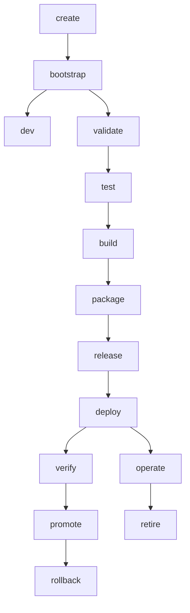

# Product Lifecycle Contract

**Version:** 1.0.0
**Status:** Implementation-Ready
**Last Updated:** 2026-05-12

## Purpose

This contract defines the canonical product lifecycle phases that Kernel orchestrates. Product developers declare lifecycle intent through their product manifest and lifecycle profile, and Kernel owns the orchestration of lifecycle phases through toolchain adapters.

## Design Principles

1. **Kernel owns lifecycle orchestration**: Kernel decides which commands to run, in which order, with which gates, and which artifacts are expected.
2. **Products own domain behavior**: Products own their business logic, domain workflows, domain UI content, and product-specific policies.
3. **Adapters own tool execution**: Toolchain adapters abstract Gradle, pnpm, Vite, Docker, Compose, Kubernetes, Helm, Terraform, Vitest, Playwright, etc.
4. **Fail closed**: Any missing required contract, artifact, environment binding, health check, or conformance result must fail closed.
5. **No silent fallbacks**: Product developers must be explicit about lifecycle intent; Kernel does not guess tool behavior.

## Lifecycle Phases

### create

**Purpose:** Initialize a new product in the registry and scaffolding.

**Inputs:**
- `productId`: string
- `lifecycleProfile`: string
- `surfaces`: ProductSurfaceDeclaration[]
- `sourceRef?`: string (e.g., git branch)

**Outputs:**
- Product registry entry
- Scaffolded product structure
- Initial product manifest

**Required Gates:**
- `registry-validation`
- `lifecycle-profile-validation`
- `scaffold-validation`

**Optional Gates:**
- `product-name-uniqueness`
- `namespace-availability`

**Artifact Expectations:**
- Product manifest (`products/<id>/domain-pack.json` or equivalent)
- Kernel product config (`products/<id>/kernel-product.yaml`)

**Environment Expectations:** None

**Failure Policy:** fail-closed

**Adapter Responsibilities:** None (scaffolder handles)

**Product Responsibilities:** Provide product ID, lifecycle profile, surface declarations

**Kernel Responsibilities:** Validate registry uniqueness, validate lifecycle profile exists, invoke scaffolder

---

### bootstrap

**Purpose:** Set up initial product infrastructure, dependencies, and configuration.

**Inputs:**
- `productId`: string
- `sourceRef?`: string

**Outputs:**
- Initialized dependency structures
- Initial configuration files
- Bootstrap completion report

**Required Gates:**
- `registry-validation`
- `manifest-validation`

**Optional Gates:**
- `dependency-policy`
- `license-policy`

**Artifact Expectations:**
- Dependency lockfiles (package-lock.json, gradle.lockfile, etc.)
- Configuration schemas

**Environment Expectations:** None

**Failure Policy:** fail-closed

**Adapter Responsibilities:** Initialize tool-specific dependency structures

**Product Responsibilities:** Provide dependency declarations

**Kernel Responsibilities:** Validate manifest, invoke adapter initialization

---

### dev

**Purpose:** Start development servers for selected product surfaces in watch mode.

**Inputs:**
- `productId`: string
- `surfaceSelector`: string[] (defaults from lifecycle profile)
- `sourceRef?`: string

**Outputs:**
- Running development servers
- Local URLs for each surface
- Dev health check status

**Required Gates:**
- `registry-validation`
- `manifest-validation`
- `surface-existence`

**Optional Gates:**
- `dependency-policy`
- `configuration-validation`

**Artifact Expectations:** None (runtime only)

**Environment Expectations:** `local` environment config

**Failure Policy:** fail-fast (surface failures do not block other surfaces in parallel mode)

**Adapter Responsibilities:** Start dev servers, collect health check status, emit logs

**Product Responsibilities:** Define dev commands per surface in kernel-product.yaml

**Kernel Responsibilities:** Resolve surfaces, invoke adapters in parallel/sequential mode, aggregate health status

---

### validate

**Purpose:** Validate product structure, contracts, and conformance without building.

**Inputs:**
- `productId`: string
- `surfaceSelector`: string[] (defaults from lifecycle profile)
- `sourceRef?`: string

**Outputs:**
- Validation report
- Conformance summary
- Lint/typecheck results

**Required Gates:**
- `registry-validation`
- `manifest-validation`
- `lifecycle-contract-validation`
- `typecheck`
- `lint`

**Optional Gates:**
- `security-preflight`
- `policy-action-resource-check`
- `plugin-binding-check`

**Artifact Expectations:** None (validation reports only)

**Environment Expectations:** None

**Failure Policy:** fail-closed

**Adapter Responsibilities:** Run typecheck, lint, schema validation, collect reports

**Product Responsibilities:** Define validation commands per surface

**Kernel Responsibilities:** Validate all contracts, invoke adapters, aggregate validation results

---

### test

**Purpose:** Execute unit and integration tests for selected surfaces.

**Inputs:**
- `productId`: string
- `surfaceSelector`: string[] (defaults from lifecycle profile)
- `sourceRef?`: string

**Outputs:**
- Test results
- Coverage reports
- Test execution logs

**Required Gates:**
- `registry-validation`
- `manifest-validation`
- `unit-test`

**Optional Gates:**
- `integration-test`
- `coverage-threshold`

**Artifact Expectations:**
- Test reports (JUnit, JSON, etc.)
- Coverage reports (LCOV, JSON, etc.)

**Environment Expectations:** None (unless integration tests require external deps)

**Failure Policy:** fail-closed

**Adapter Responsibilities:** Run test frameworks, collect test results and coverage

**Product Responsibilities:** Define test commands per surface

**Kernel Responsibilities:** Invoke adapters, aggregate test results, enforce coverage thresholds

---

### build

**Purpose:** Build all selected implemented product surfaces.

**Inputs:**
- `productId`: string
- `sourceRef`: string
- `surfaceSelector`: string[] (defaults from lifecycle profile)
- `environment?`: string

**Outputs:**
- Build artifacts (JARs, bundles, etc.)
- Build manifest
- Artifact manifest

**Required Gates:**
- `registry-validation`
- `lifecycle-profile-validation`
- `manifest-validation`
- `dependency-policy`
- `source-boundary-check`
- `product-build`
- `product-test`
- `product-conformance`

**Optional Gates:**
- `security-scan`
- `license-policy`
- `bundle-budget`

**Artifact Expectations:**
- Compiled/built artifacts per surface
- Build manifest
- Artifact manifest

**Environment Expectations:** Build environment (tool-specific)

**Failure Policy:** fail-closed

**Adapter Responsibilities:** Run build commands, collect build outputs, validate expected artifacts

**Product Responsibilities:** Define build commands per surface, declare expected artifact types

**Kernel Responsibilities:** Validate all gates, invoke adapters in dependency order, emit artifact manifest

---

### package

**Purpose:** Package build artifacts into deployable units (containers, distributions, etc.).

**Inputs:**
- `productId`: string
- `buildArtifactManifest`: string (path or reference)
- `surfaceSelector`: string[] (defaults from lifecycle profile)
- `environment?`: string

**Outputs:**
- Container images
- Distribution packages
- Package manifest

**Required Gates:**
- `artifact-validation`
- `build-artifact-existence`
- `package-conformance`

**Optional Gates:**
- `security-scan`
- `vulnerability-scan`
- `image-size-policy`

**Artifact Expectations:**
- Container images (Docker, OCI)
- Distribution packages (tar, zip)
- Package manifest

**Environment Expectations:** Build environment with container/image tools

**Failure Policy:** fail-closed

**Adapter Responsibilities:** Run packaging commands, build container images, collect package metadata

**Product Responsibilities:** Define packaging targets per surface

**Kernel Responsibilities:** Validate build artifacts, invoke packaging adapters, emit package manifest

---

### release

**Purpose:** Create a release candidate with versioning and release metadata.

**Inputs:**
- `productId`: string
- `packageArtifactManifest`: string (path or reference)
- `version`: string
- `releaseNotes?`: string

**Outputs:**
- Release manifest
- Versioned artifacts
- Release metadata

**Required Gates:**
- `package-validation`
- `version-policy`
- `release-conformance`

**Optional Gates:**
- `changelog-validation`
- `semantic-versioning`
- `approval-check` (for non-local environments)

**Artifact Expectations:**
- Release manifest
- Versioned artifact references
- Release notes

**Environment Expectations:** None

**Failure Policy:** fail-closed

**Adapter Responsibilities:** Tag artifacts, generate release metadata

**Product Responsibilities:** Define versioning strategy

**Kernel Responsibilities:** Validate package artifacts, enforce version policy, emit release manifest

---

### deploy

**Purpose:** Deploy packaged artifacts to a target environment.

**Inputs:**
- `productId`: string
- `releaseArtifactManifest`: string (path or reference)
- `environment`: string (local, dev, staging, prod)
- `deploymentTarget?`: string (defaults from environment config)

**Outputs:**
- Deployment manifest
- Health check results
- Deployment verification status

**Required Gates:**
- `artifact-validation`
- `environment-validation`
- `health-check`
- `observability-check`

**Optional Gates:**
- `security-scan`
- `privacy-check`
- `license-policy`
- `conformance`
- `e2e`
- `performance`
- `rollback-plan`
- `approval` (for staging/prod)

**Artifact Expectations:**
- Deployment manifest
- Health check reports
- Verification results

**Environment Expectations:** Target environment config (local, dev, staging, prod)

**Failure Policy:** fail-closed

**Adapter Responsibilities:** Execute deployment to target, run health checks, collect deployment status

**Product Responsibilities:** Define deployment targets per environment

**Kernel Responsibilities:** Validate environment, resolve deployment target, invoke deployment adapter, verify health

---

### verify

**Purpose:** Verify that a deployment is healthy and functioning correctly.

**Inputs:**
- `productId`: string
- `deploymentManifest`: string (path or reference)
- `environment`: string

**Outputs:**
- Verification report
- Health check results
- Smoke test results

**Required Gates:**
- `deployment-validation`
- `health-check`
- `smoke-test`

**Optional Gates:**
- `e2e`
- `performance`
- `observability-check`

**Artifact Expectations:**
- Verification report
- Health check results
- Smoke test results

**Environment Expectations:** Target environment

**Failure Policy:** fail-closed

**Adapter Responsibilities:** Run health checks, execute smoke tests, collect verification results

**Product Responsibilities:** Define health check endpoints and smoke tests

**Kernel Responsibilities:** Invoke verification adapters, aggregate results, determine deployment health

---

### promote

**Purpose:** Promote a release from one environment to another (e.g., staging → prod).

**Inputs:**
- `productId`: string
- `fromEnvironment`: string
- `toEnvironment`: string
- `releaseArtifactManifest`: string (path or reference)

**Outputs:**
- Promotion manifest
- Promotion plan
- Rollback plan

**Required Gates:**
- `artifact-validation`
- `environment-validation`
- `deployment-validation`
- `security`
- `privacy`
- `license-policy`
- `conformance`
- `e2e`
- `performance`
- `rollback-plan`
- `approval`

**Optional Gates:**
- `manual-approval`
- `change-management`

**Artifact Expectations:**
- Promotion manifest
- Rollback plan
- Approval records

**Environment Expectations:** Source and target environments

**Failure Policy:** fail-closed

**Adapter Responsibilities:** Validate promotion path, generate rollback plan, execute promotion

**Product Responsibilities:** Define promotion policies and approval requirements

**Kernel Responsibilities:** Validate promotion eligibility, enforce all gates, generate rollback plan, execute promotion

---

### rollback

**Purpose:** Roll back a deployment to a previous known-good state.

**Inputs:**
- `productId`: string
- `environment`: string
- `targetArtifact`: string (previous artifact to roll back to)
- `deploymentManifest`: string (current deployment to roll back)

**Outputs:**
- Rollback manifest
- Rollback execution report
- Post-rollback health status

**Required Gates:**
- `deployment-validation`
- `artifact-validation`
- `health-check`
- `rollback-plan-validation`

**Optional Gates:**
- `approval`
- `change-management`

**Artifact Expectations:**
- Rollback manifest
- Rollback execution report
- Post-rollback health check results

**Environment Expectations:** Target environment

**Failure Policy:** fail-closed

**Adapter Responsibilities:** Execute rollback, verify post-rollback health

**Product Responsibilities:** Define rollback strategy per environment

**Kernel Responsibilities:** Validate rollback plan, invoke rollback adapter, verify health after rollback

---

### operate

**Purpose:** Ongoing operational tasks for a deployed product (monitoring, maintenance, etc.).

**Inputs:**
- `productId`: string
- `environment`: string
- `operation`: string (specific operational task)

**Outputs:**
- Operation report
- Operational metrics
- Health status

**Required Gates:**
- `deployment-validation`
- `health-check`
- `observability-check`

**Optional Gates:**
- Operation-specific gates

**Artifact Expectations:** Operation-specific artifacts

**Environment Expectations:** Target environment

**Failure Policy:** fail-closed

**Adapter Responsibilities:** Execute operational task, collect metrics

**Product Responsibilities:** Define operational procedures

**Kernel Responsibilities:** Validate deployment, invoke operational adapter, collect results

---

### retire

**Purpose:** Decommission a product or specific version from an environment.

**Inputs:**
- `productId`: string
- `environment`: string
- `version?`: string (specific version to retire, or all)

**Outputs:**
- Retirement manifest
- Resource cleanup report
- Data archival report

**Required Gates:**
- `deployment-validation`
- `data-retention-policy`
- `compliance-check`

**Optional Gates:**
- `approval`
- `compliance-signoff`

**Artifact Expectations:**
- Retirement manifest
- Cleanup report
- Archival records

**Environment Expectations:** Target environment

**Failure Policy:** fail-closed

**Adapter Responsibilities:** Decommission resources, archive data, clean up artifacts

**Product Responsibilities:** Define data retention and archival requirements

**Kernel Responsibilities:** Validate retirement eligibility, enforce data retention policies, execute retirement

---

## Phase Dependencies



## Lifecycle Profile Integration

Lifecycle profiles define:
- Default surfaces per phase
- Required gates per phase
- Default adapters per surface/phase
- Phase execution mode (parallel vs sequential)

Example profile reference:
```yaml
lifecycleProfile: standard-web-api-product
```

See `config/product-lifecycle-profiles.json` for available profiles.

## Product Manifest Integration

Product manifests declare:
- `lifecycleProfile`: Which profile to use
- `surfaces`: Surface definitions with adapters
- `phases`: Phase-specific overrides

Example:
```yaml
productId: digital-marketing
lifecycleProfile: standard-web-api-product

surfaces:
  backend-api:
    adapter: gradle-java-service
    gradleModule: :products:digital-marketing:dm-api
  web:
    adapter: pnpm-vite-react
    packagePath: products/digital-marketing/ui/package.json

phases:
  dev:
    defaultSurfaces: [backend-api, web]
    mode: parallel
```

See `docs/kernel/PRODUCT_MANIFEST_SPEC.md` for full manifest schema.

## Toolchain Adapter Integration

Toolchain adapters implement:
- `plan()`: Generate execution steps for a phase
- `execute()`: Execute the steps and return results
- `validateOutputs()`: Validate expected artifacts were produced

Adapters are selected based on:
- Surface type (backend-api, web, worker, etc.)
- Phase (dev, validate, test, build, package, deploy, etc.)
- Product manifest declaration

See `docs/kernel/PRODUCT_TOOLCHAIN_ADAPTER_SPEC.md` for adapter contract.

## Gate Execution

Gates are executed in the order defined in the lifecycle profile. Gates can be:

- **Validation gates**: Schema validation, contract validation
- **Policy gates**: Security, privacy, license, dependency policies
- **Quality gates**: Test coverage, performance thresholds
- **Approval gates**: Manual approval, change management
- **Health gates**: Health checks, observability checks

Gate failures:
- Required gates always fail the phase (fail-closed)
- Optional gates may be configured to warn or fail based on policy

## Artifact Tracking

Each phase emits:
- `lifecycle-plan.json`: The execution plan before execution
- `lifecycle-result.json`: The execution result after execution
- Phase-specific artifacts (build artifacts, deployment manifests, etc.)

Artifacts are tracked in:
- `.kernel/out/products/<productId>/<phase>/<timestamp>/`

See `docs/kernel/PRODUCT_ARTIFACT_CONTRACT.md` for artifact schema.

## Environment Binding

Phases that require environment binding (deploy, verify, promote, rollback, operate, retire) must:
- Specify the environment explicitly
- Load environment config from `config/environments/<env>.json`
- Validate environment-specific gates
- Use environment-specific deployment targets

See `docs/kernel/PRODUCT_ENVIRONMENT_CONTRACT.md` for environment schema.

## Failure Handling

- **Fail-closed**: Missing required contracts, artifacts, or environment bindings fail the phase
- **Fail-fast**: In dev mode, surface failures do not block other surfaces in parallel execution
- **Partial failure**: In build/package/deploy phases, some surfaces may fail while others succeed; the overall phase fails if any required surface fails
- **Rollback**: For deploy/promote phases, rollback plans are generated before execution and can be triggered on failure

## Observability

All lifecycle phases emit:
- Structured logs with correlation IDs
- Metrics for phase duration, gate status, artifact sizes
- Traces for phase execution (when enabled)
- Lifecycle result JSON with full execution details

## Related Contracts

- [Product Toolchain Adapter Spec](PRODUCT_TOOLCHAIN_ADAPTER_SPEC.md)
- [Product Artifact Contract](PRODUCT_ARTIFACT_CONTRACT.md)
- [Product Environment Contract](PRODUCT_ENVIRONMENT_CONTRACT.md)
- [Product Deployment Contract](PRODUCT_DEPLOYMENT_CONTRACT.md)
- [Product Release Promotion Contract](PRODUCT_RELEASE_PROMOTION_CONTRACT.md)
- [Product Power User Extension Guide](PRODUCT_POWER_USER_EXTENSION_GUIDE.md)
