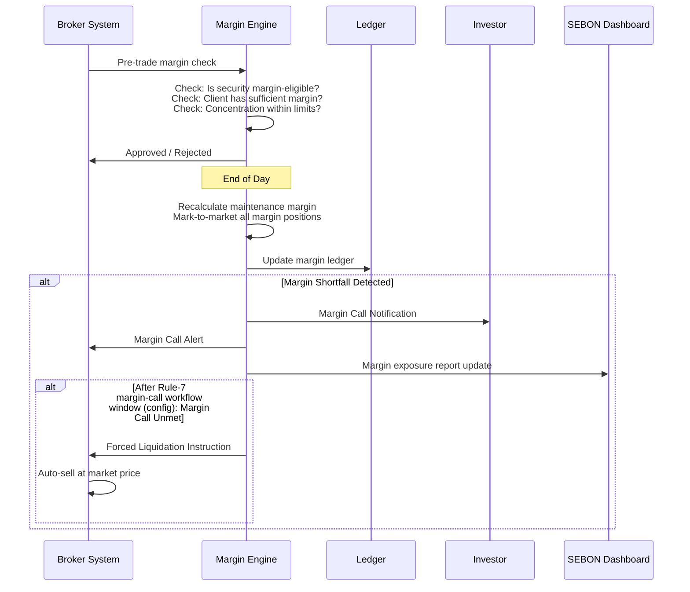
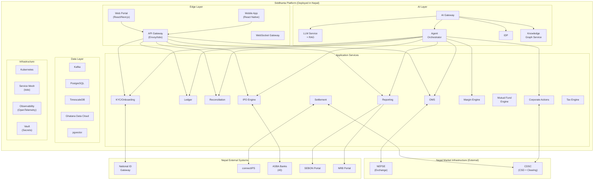
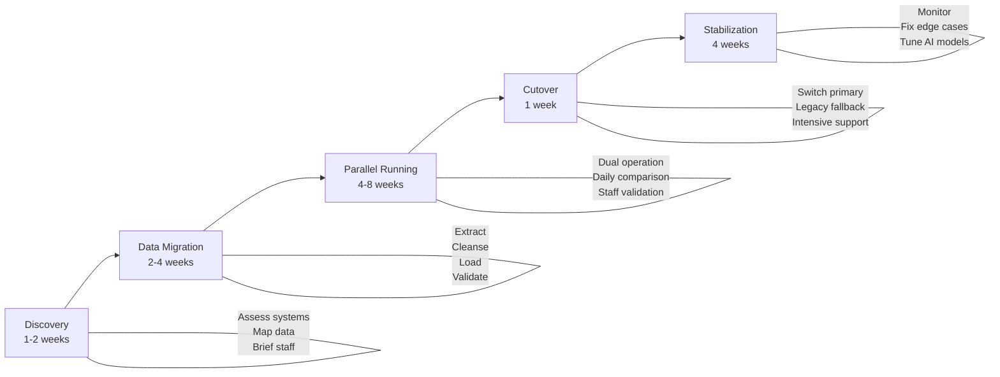
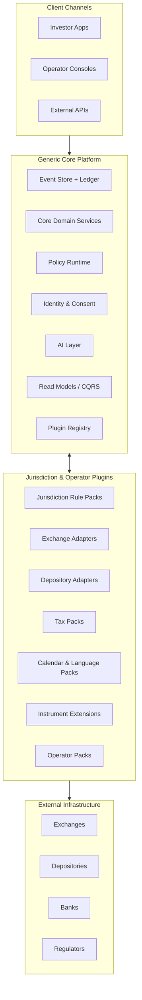

# PROJECT SIDDHANTA: AI-NATIVE CAPITAL MARKETS PLATFORM — NEPAL SPECIFICATION

## Comprehensive Architecture, Data Models, Workflows, Operator Packs, Plugin Framework & Control Model

Version: 1.0.1 | Status: Implementation-Oriented Specification | Date: March 10, 2026\
Jurisdiction: Nepal | Calendar: Bikram Sambat 2082 | Regulators: SEBON, NRB, Beema Samiti

Shared terminology and policy baseline: [Documentation_Glossary_and_Policy_Appendix.md](../archive/Documentation_Glossary_and_Policy_Appendix.md)
Shared authoritative source register: [Authoritative_Source_Register.md](Authoritative_Source_Register.md)
Reference style for time-sensitive external facts: `ASR-*` IDs from the shared source register.
Legal-claim traceability: [Legal_Claim_Citation_Appendix.md](Legal_Claim_Citation_Appendix.md)
Reference style for legal / regulatory claims: `LCA-*` IDs from the legal appendix.
Compact traceability matrix: [Claim_Traceability_Matrix.md](Claim_Traceability_Matrix.md)

> **Namespace note — two `LCA-*` identifier families exist and must not be conflated:**
>
> - **Numeric legal-claim IDs** such as `LCA-001` through `LCA-032` reference source-backed legal/regulatory claims maintained in `Legal_Claim_Citation_Appendix.md`. These are the IDs used throughout this document.
> - **Semantic epic/control IDs** such as `LCA-AUDIT-001` or `LCA-AMLKYC-001` are engineering control-registry codes maintained in `epics/COMPLIANCE_CODE_REGISTRY.md`. These are not used in this document.

> **Implementation stack authority:** For current technology choices, use [../adr/ADR-011_STACK_STANDARDIZATION_AND_GHATANA_PLATFORM_ALIGNMENT.md](../adr/ADR-011_STACK_STANDARDIZATION_AND_GHATANA_PLATFORM_ALIGNMENT.md). This specification contains logical models and Nepal-specific requirements; ADR-011 defines the active implementation baseline.

---

# 1. Executive Overview

This document is the **implementation-oriented specification** for Project Siddhanta—an AI-native, all-in-one capital markets platform tailored for Nepal. It translates the strategic vision (siddhanta.md) and global architecture (All_In_One_Capital_Markets_Platform_Specification.md) into Nepal-specific data models, event schemas, workflows, controls, and integration contracts.

**Scope:**

- Core Financial Operating System (FOS) localized for Nepal
- Nepal-specific data models and entity definitions
- End-to-end workflow specifications for all capital market operations
- 5 Operator Packs (Broker/DP, Merchant Banker, Fund Manager, Regulator, Issuer)
- Nepal Plugin Ecosystem with certified plugin framework
- Integration specifications for NEPSE, CDSC, Meroshare, National ID, connectIPS, ASBA banks
- AI-native capabilities embedded in every layer
- Compliance mapping to SEBON, NRB, Beema Samiti, FATF requirements

**Design principles:**

1. **AI as substrate**: every service exposes AI hooks, event streams, and action APIs
2. **Event-sourced, CQRS**: every state change is an immutable event; read models are projections
3. **Dual-calendar native**: Bikram Sambat and Gregorian at the data layer
4. **Nepali-first**: Devanagari as primary language for all investor-facing outputs
5. **National ID as root of trust**: Nepal National ID is the primary identity anchor
6. **Nepal data residency**: all data resides within Nepal per NRB/DoIT requirements
7. **Zero-trust security**: per NRB Cyber Resilience Guidelines 2023
8. **Mobile-first, offline-capable**: mobile-first client interfaces; offline data collection for rural field agents with sync-on-reconnect (per siddhanta.md §4.1)

This specification strictly follows the Generic Core + Jurisdiction Plugin + Operator Pack separation defined in siddhanta.md. No Nepal-specific rule, threshold, format, workflow, workflow step order, operator form schema, settlement constant, tax rate, lock-in rule, margin percentage, circuit breaker value, allowed option list, or regulatory timeline may be hardcoded into core services. All regulatory, exchange, tax, reporting, instrument, calendar, eligibility, process-template, and operator-choice logic must be implemented through versioned plugins or metadata catalogs governed by the lifecycle, contract, and certification model defined in Sections 14–18.

Runtime process definitions, human-task forms, and operator-facing value sets must be treated as controlled metadata assets: schema-validated, versioned, audit-trailed, and scoped through K-02 so jurisdiction or tenant variations can be introduced without rewriting core workflow or UI code.

# 8.8 Batch Processing Framework

---

# 2. Core Financial Operating System (FOS) — Nepal Localization

## 2.1 Identity & Relationship Graph

### Entity Model

| Entity type                     | Nepal-specific attributes                                                                                                                                        | Primary identifier      | Regulatory anchor                                                                                                                                                                                                   |
| :------------------------------ | :--------------------------------------------------------------------------------------------------------------------------------------------------------------- | :---------------------- | :------------------------------------------------------------------------------------------------------------------------------------------------------------------------------------------------------------------ |
| **Individual Investor**         | National ID number, PAN, DMAT account (CDSC), Meroshare user ID, citizenship number, BS date of birth, district/municipality, father's/grandfather's name        | National ID             | NRB KYC; SEBON investor protection                                                                                                                                                                                  |
| **Corporate Entity**            | Company Registration Office (CRO) number, PAN, registered office (municipality + ward), BS incorporation date, authorized/paid-up capital, sector classification | CRO number              | Companies Act 2063; SEBON issuer regulations                                                                                                                                                                        |
| **Beneficial Owner**            | National ID of UBO, ownership percentage, relationship graph edges, PEP status, source of funds                                                                  | National ID             | NRB AML/CFT; FATF Rec. 24/25                                                                                                                                                                                        |
| **Director / Signatory**        | National ID, board appointment date (BS), committee memberships, other directorships (cross-company graph)                                                       | National ID             | Companies Act; NRB Fit & Proper                                                                                                                                                                                     |
| **Stock Broker**                | SEBON license number, license expiry (BS), paid-up capital, NEPSE member code, settlement bank account                                                           | SEBON license #         | SEBON Securities Broker/Dealer Bylaws                                                                                                                                                                               |
| **Depository Participant (DP)** | CDSC DP code, DP agreement date, SEBON DP license, linked broker(s)                                                                                              | CDSC DP code            | CDSC Bylaws; SEBON DP regulations                                                                                                                                                                                   |
| **Merchant Banker**             | SEBON MB license number, category (A/B/C), underwriting capacity                                                                                                 | SEBON MB license #      | SEBON Merchant Banker Regulations                                                                                                                                                                                   |
| **Fund Manager**                | SEBON fund manager license, AUM, number of schemes, category                                                                                                     | SEBON FM license #      | SEBON Mutual Fund Regulations                                                                                                                                                                                       |
| **Issuer**                      | SEBON listing approval, NEPSE listing date (BS), sector classification, primary regulator (NRB/Beema Samiti/SEBON), promoter-public ratio                        | NEPSE scrip code + ISIN | Securities Enlistment Byelaws 2018 (`Ref: LCA-027`); Securities Listing and Trading Regulation 2018 (`Ref: LCA-028`); revalidate live NEPSE listing-process mechanics (`Ref: ASR-NEP-NEPSE-LISTING-OPS-ASSUMPTION`) |
| **ASBA Bank**                   | SEBON ASBA authorization, bank swift code, connectIPS merchant ID, settlement bank account                                                                       | ASBA authorization #    | SEBON ASBA Guidelines                                                                                                                                                                                               |
| **Credit Rating Agency**        | SEBON CRA license, rating methodologies registered, analyst count                                                                                                | SEBON CRA license #     | SEBON CRA Regulations                                                                                                                                                                                               |
| **Regulator**                   | Entity code (SEBON/NRB/Beema Samiti/NEPSE/CDSC), jurisdiction scope, contact officers                                                                            | Statutory               | Securities Act 2063; NRB Act 2058                                                                                                                                                                                   |

### KYC/KYB Lifecycle

```mermaid
statechart-v2
    [*] --> ApplicationReceived
    ApplicationReceived --> IDVerification: National ID Gateway
    IDVerification --> RiskScoring: AI Risk Model
    RiskScoring --> LowRisk: Score < 30
    RiskScoring --> MediumRisk: Score 30-70
    RiskScoring --> HighRisk: Score > 70
    LowRisk --> AutoApproved: AI auto-approve
    MediumRisk --> ManualReview: Human review
    HighRisk --> EnhancedDD: Enhanced due diligence
    AutoApproved --> Active
    ManualReview --> Active: Approved
    ManualReview --> Rejected: Rejected
    EnhancedDD --> Active: Approved
    EnhancedDD --> Rejected: Rejected
    Active --> RefreshTriggered: Event-driven refresh
    RefreshTriggered --> IDVerification
    Active --> Suspended: AML alert / regulator order
    Suspended --> Active: Cleared
    Suspended --> Closed: Permanently blocked
```

**Nepal-specific KYC fields (mandatory per NRB):**

- National ID number (primary)
- PAN number
- Citizenship certificate number
- Father's name / Grandfather's name
- Permanent address (District → Municipality → Ward → Tole)
- Current address
- Date of birth (Bikram Sambat)
- Photograph (passport-size)
- Specimen signature
- Source of income declaration
- Expected annual investment amount
- Client risk-disclosure acknowledgement and suitability inputs (Ref: `LCA-010`)

**AI capabilities:**

- IDP extracts data from National ID card image (Nepali Devanagari OCR)
- Auto-fill KYC form fields from National ID gateway response
- Real-time sanctions screening (Nepal government list + UN consolidated list)
- PEP screening using Nepal gazette and known PEP databases
- Entity resolution across multiple DMAT accounts (detect same individual with multiple accounts)

### Identity Relationship Graph Schema (Logical Graph Model)

```
(:Individual {national_id, name_np, name_en, pan, dmat_account_id})
  -[:OWNS {share_count, acquisition_date_bs, lock_in_end_bs, promoter_flag, sector_regulator}]->
  (:SecurityHolding {isin, issuer_code})

(:Individual)-[:DIRECTOR_OF {appointed_bs, committee}]->(:Corporate)
(:Individual)-[:BENEFICIAL_OWNER_OF {ownership_pct}]->(:Corporate)
(:Individual)-[:RELATED_TO {relationship_type}]->(:Individual)

(:Corporate {cro_number, name_np, name_en, sector, primary_regulator})
  -[:LISTED_ON {listing_date_bs, scrip_code}]->(:Exchange {name: "NEPSE"})
(:Corporate)-[:REGULATED_BY]->(:Regulator)
(:Corporate)-[:PROMOTER_GROUP]->(:PromoterGroup {lock_in_start_bs, lock_in_end_bs, rules_ref})

(:StockBroker {sebon_license, nepse_member_code})-[:DP_LINKED]->(:DepositoryParticipant)
(:MerchantBanker)-[:MANAGES_ISSUE]->(:Issue {type, status})
(:FundManager)-[:MANAGES_FUND]->(:MutualFund {scheme_name, type, nav})
```

### Consent & Disclosure Registry (Nepal)

| Consent type                | Legal basis                       | Capture method              | Retention                                            |
| :-------------------------- | :-------------------------------- | :-------------------------- | :--------------------------------------------------- |
| KYC data processing         | NRB KYC Directive                 | Digital signature / OTP     | Duration of account + 5 years                        |
| CDSC demat account linkage  | CDSC Bylaws                       | Meroshare authorization     | Until demat closure                                  |
| ASBA bank account blocking  | SEBON ASBA Guidelines             | Per-application consent     | Per IPO/rights application                           |
| EDIS authorization          | CDSC EDIS Rules                   | Per-transaction or standing | Per-sell / standing (renewable)                      |
| AI-assisted decision making | NRB AI Guidelines (December 2025) | Explicit opt-in             | Until withdrawal or policy-triggered consent refresh |
| Marketing communications    | Electronic Transaction Act 2063   | Opt-in                      | Until withdrawal                                     |

---

## 2.2 Reference Data & Master Data Management

### Instrument Master

| Field                   | Type            | Description                                                                                                                                                            | Nepal-specific notes                                                                                                                            |
| :---------------------- | :-------------- | :--------------------------------------------------------------------------------------------------------------------------------------------------------------------- | :---------------------------------------------------------------------------------------------------------------------------------------------- |
| `isin`                  | String(12)      | ISIN code (NP prefix)                                                                                                                                                  | Single ISIN with attribute-based promoter control                                                                                               |
| `nepse_scrip_code`      | String(10)      | NEPSE trading symbol                                                                                                                                                   | Primary trading identifier                                                                                                                      |
| `instrument_type`       | Enum            | EQUITY, DEBENTURE, MUTUAL_FUND, PREFERENCE_REDEEMABLE, PREFERENCE_IRREDEEMABLE, RIGHTS, PROMOTER_EQUITY                                                                | Promoter equity is logically separated via attributes, not ISIN. Preference shares split into redeemable/irredeemable per SEBON 2082 framework. |
| `issuer_code`           | FK → Issuer     | Issuer reference                                                                                                                                                       |                                                                                                                                                 |
| `sector`                | Enum            | COMMERCIAL_BANK, DEV_BANK, FINANCE, MICROFINANCE, INSURANCE_LIFE, INSURANCE_NONLIFE, HYDROPOWER, MANUFACTURING, HOTEL_TOURISM, TRADING, MUTUAL_FUND, DEBENTURE, OTHERS | NEPSE sector classification                                                                                                                     |
| `primary_regulator`     | Enum            | NRB, BEEMA_SAMITI, SEBON                                                                                                                                               | Determines lock-in and transfer rules                                                                                                           |
| `face_value`            | Decimal         | Par value in NPR                                                                                                                                                       | **Plugin-driven**: default value comes from `Tax/Instrument Pack` or `Jurisdiction Rule Pack`; do not hardcode “Rs 100”.                        |
| `lot_size`              | Integer         | Minimum trading lot                                                                                                                                                    | **Plugin-driven** via Exchange Rule Pack (e.g., “kitta” rules). Do not hardcode a universal `10`.                                               |
| `circuit_breaker_pct`   | Decimal         | Daily price band                                                                                                                                                       | **Plugin-driven** via Exchange Rule Pack; values vary by exchange and can change via notice.                                                    |
| `settlement_cycle`      | String          | T+n                                                                                                                                                                    | **Plugin-driven** via Depository/Settlement Pack; do not assume `T+2` globally.                                                                 |
| `paid_up_value`         | Decimal         | Paid-up value per share                                                                                                                                                | May differ from face value                                                                                                                      |
| `preference_attributes` | JSON (nullable) | `{dividend_rate, cumulative, participating, conversion_ratio, redemption_date_bs, callable}`                                                                           | Only for PREFERENCE\_\* types; supports SEBON’s irredeemable preference share framework                                                         |
| `listing_date_bs`       | BSDate          | Listing date in Bikram Sambat                                                                                                                                          |                                                                                                                                                 |
| `listing_date_greg`     | Date            | Listing date in Gregorian                                                                                                                                              | Auto-converted                                                                                                                                  |
| `is_margin_eligible`    | Boolean         | Per SEBON Margin Directive 2082                                                                                                                                        | Updated periodically by SEBON                                                                                                                   |
| `promoter_attributes`   | JSON            | `{lock_in_start_bs, lock_in_end_bs, transfer_approval_from, pledge_allowed, conversion_eligible_bs}`                                                                   | Rich attribute set replacing simple flag                                                                                                        |
| `status`                | Enum            | ACTIVE, SUSPENDED, DELISTED, PENDING_LISTING                                                                                                                           |                                                                                                                                                 |

### Issuer Master

| Field                      | Type          | Description                                |
| :------------------------- | :------------ | :----------------------------------------- |
| `issuer_id`                | UUID          | Internal identifier                        |
| `cro_number`               | String        | Company Registration Office number         |
| `name_np`                  | String(UTF-8) | Name in Nepali (Devanagari)                |
| `name_en`                  | String        | Name in English                            |
| `sector`                   | Enum          | As per NEPSE classification                |
| `primary_regulator`        | Enum          | NRB / BEEMA_SAMITI / SEBON                 |
| `authorized_capital`       | Decimal       | In NPR                                     |
| `paid_up_capital`          | Decimal       | In NPR                                     |
| `total_shares`             | BigInteger    | Total issued shares                        |
| `promoter_shares`          | BigInteger    | Promoter-held shares                       |
| `public_shares`            | BigInteger    | Public-held shares                         |
| `promoter_pct`             | Decimal       | Promoter ownership percentage              |
| `listing_date_bs`          | BSDate        |                                            |
| `fiscal_year_start_bs`     | BSDate        | Shrawan 1 typically                        |
| `agm_month_bs`             | Integer       | Typical AGM month (Kartik/Mangsir usually) |
| `registrar_transfer_agent` | FK            | RTA handling share registry                |

### Calendar Master

| Calendar type                          | Description                                                                                                                 | Data source                              |
| :------------------------------------- | :-------------------------------------------------------------------------------------------------------------------------- | :--------------------------------------- |
| **Trading Calendar (Exchange-scoped)** | Trading days and market sessions are **exchange-configured** (e.g., Sun–Thu for NEPSE) plus jurisdiction holiday exclusions | Exchange annual notice / calendar plugin |
| **Settlement Calendar**                | T+2 business days per NEPSE trading calendar                                                                                | Derived from trading calendar            |
| **BS Fiscal Calendar**                 | Quarters: Q1 (Shrawan–Ashwin), Q2 (Kartik–Poush), Q3 (Magh–Chaitra), Q4 (Baisakh–Ashadh)                                    | Nepal Government                         |
| **Corporate Actions Calendar**         | Record dates, book closure dates, AGM dates                                                                                 | Issuer announcements                     |
| **Regulatory Filing Calendar**         | SEBON quarterly/annual report due dates; NRB AML filing dates                                                               | SEBON/NRB circulars                      |
| **Nepal Public Holidays**              | Dashain, Tihar, Chhath, Holi, etc. (variable, announced annually)                                                           | Nepal Government                         |

**BS Date Service specification:**

- Input: BS date (YYYY-MM-DD BS format) → Output: Gregorian date
- Input: Gregorian date → Output: BS date
- Support for BS date arithmetic (add/subtract days, months)
- BS quarter/fiscal year determination
- Trading day calculator (next/previous trading day in BS)
- Holiday-aware date offset calculation

### Tax Rules Master (Nepal)

| Rule ID          | Tax type                               | Rate                                  | Condition                                                                               | Deducted by       | Filing                                   |
| :--------------- | :------------------------------------- | :------------------------------------ | :-------------------------------------------------------------------------------------- | :---------------- | :--------------------------------------- |
| CGT-LISTED-LONG  | Capital gains (listed)                 | 5% _(provisional; `Ref: LCA-029`)_    | Holding period > 365 days                                                               | Broker (TDS)      | Annual                                   |
| CGT-LISTED-SHORT | Capital gains (listed)                 | 7.5% _(provisional; `Ref: LCA-029`)_  | Holding period ≤ 365 days                                                               | Broker (TDS)      | Annual                                   |
| CGT-UNLISTED     | Capital gains (unlisted)               | 10% _(provisional; `Ref: LCA-030`)_   | Any holding period                                                                      | Transferor        | Annual                                   |
| CGT-PROMOTER     | Capital gains (promoter transfer)      | 10% _(provisional; `Ref: LCA-030`)_   | Promoter share transfer                                                                 | Transferor        | At transfer                              |
| TDS-DIVIDEND     | TDS on cash dividend                   | 5% _(provisional; `Ref: LCA-031`)_    | Resident individuals                                                                    | Issuer/RTA        | At distribution                          |
| TDS-INTEREST     | TDS on debenture interest              | 5–15% _(provisional; `Ref: LCA-032`)_ | Varies by instrument type                                                               | Issuer            | At payment                               |
| SEBON-FEE        | SEBON levy on brokerage service charge | 0.6%                                  | Applied to total brokerage service charge collected in the fiscal year (`Ref: LCA-023`) | Broker            | Within one month after fiscal-year close |
| MKT-TXN-FEE      | Securities-market transaction fee      | 0.015%                                | Per share-trade value (`Ref: LCA-023`)                                                  | Securities market | Per-trade / settlement cycle             |
| BROKER-COMM      | Broker commission                      | 0.27–0.40% (min Rs 10)                | Slab-based on trade value per current Schedule 14 (`Ref: LCA-023`)                      | Broker            | Per-trade                                |

**Commission slab structure (current Schedule 14 baseline, `Ref: LCA-023`):**

| Trade value slab (NPR)        | Commission rate |
| :---------------------------- | :-------------- |
| Up to Rs 50,000               | 0.40%           |
| Rs 50,001 – Rs 5,00,000       | 0.37%           |
| Rs 5,00,001 – Rs 20,00,000    | 0.34%           |
| Rs 20,00,001 – Rs 1,00,00,000 | 0.30%           |
| Above Rs 1,00,00,000          | 0.27%           |

### Margin & Haircut Rules Master (SEBON Directive 2082)

| Parameter                                       | Value                                                                                                                                          | Source                                                                          |
| :---------------------------------------------- | :--------------------------------------------------------------------------------------------------------------------------------------------- | :------------------------------------------------------------------------------ |
| **Margin-service provider eligibility**         | Broker must have at least Rs 20 crore paid-up capital to offer margin trading                                                                  | `Ref: LCA-011`                                                                  |
| **Initial margin (minimum)**                    | 30% of market value                                                                                                                            | `Ref: LCA-011`                                                                  |
| **Maintenance margin (minimum)**                | 20% of market value                                                                                                                            | `Ref: LCA-011`                                                                  |
| **Eligible securities**                         | SEBON-published list (updated periodically)                                                                                                    | `Ref: LCA-011`                                                                  |
| **Margin call trigger**                         | When margin falls below the minimum maintenance threshold                                                                                      | `Ref: LCA-011`                                                                  |
| **Sale after default**                          | Broker may liquidate after unmet margin-call procedures under Rule 7; do not hard-code a fixed T+3 here without a newer clause-specific source | `Ref: LCA-011`                                                                  |
| **Additional haircut / concentration controls** | Broker risk policy layered on top of the regulatory minimums                                                                                   | Platform policy (implement conservatively; not treated here as clause-verified) |

General broker and dealer licensing capital tiers are defined separately in Schedule 9 of the broker/dealer regulations. See `Ref: LCA-019`.

---

## 2.3 Ledger Architecture

### Ledger Layer Model

```mermaid
flowchart TB
    subgraph "Operational Sub-Ledgers"
        SL_SEC[Securities Position Ledger]
        SL_CASH[Cash Ledger]
        SL_MARGIN[Margin Ledger]
        SL_FEE[Fee & Commission Ledger]
        SL_CA[Corporate Actions Ledger]
        SL_TAX[Tax Ledger\nCGT + TDS]
        SL_SETTLE[Settlement Obligations Ledger]
    end

    subgraph "Accounting General Ledger"
        GL[General Ledger\nNepal Accounting Standards NAS]
        COA[Chart of Accounts\n(Board-aligned export mapping)]
        JP[Journal Posting Engine]
        TB[Trial Balance Export]
    end

    subgraph "Regulatory Ledgers"
        RL_SEG[Client Asset Segregation Ledger]
        RL_CAP[Capital Adequacy Ledger\n(Board quarterly return pack)]
        RL_MARGIN_REG[Margin Exposure Ledger\n(SEBON Directive 2082)]
        RL_AML[AML Transaction Register]
    end

    SL_SEC & SL_CASH & SL_MARGIN & SL_FEE & SL_CA & SL_TAX & SL_SETTLE --> JP
    JP --> GL
    GL --> TB
    SL_SEC --> RL_SEG
    SL_CASH --> RL_SEG
    SL_MARGIN --> RL_MARGIN_REG
    SL_CASH --> RL_CAP
    SL_CASH --> RL_AML
```

### Securities Position Ledger Schema

| Field                       | Type       | Description                                                      |
| :-------------------------- | :--------- | :--------------------------------------------------------------- |
| `account_id`                | UUID       | Investor/entity account                                          |
| `dmat_account`              | String     | CDSC demat account number                                        |
| `isin`                      | String(12) | Security ISIN                                                    |
| `scrip_code`                | String     | NEPSE trading symbol                                             |
| `position_type`             | Enum       | FREE, LOCKED_PROMOTER, LOCKED_IPO, PLEDGED, FROZEN, EDIS_PENDING |
| `quantity`                  | BigInteger | Number of units (kitta)                                          |
| `average_cost`              | Decimal    | Weighted average cost per unit (NPR)                             |
| `acquisition_date_bs`       | BSDate     | Earliest acquisition date (for CGT calculation)                  |
| `lock_in_end_bs`            | BSDate     | Null if not locked                                               |
| `lock_in_regulator`         | Enum       | NRB, BEEMA_SAMITI, SEBON, null                                   |
| `last_corporate_action`     | FK         | Last CA that affected this position                              |
| `last_reconciled_with_cdsc` | Timestamp  | Last successful CDSC recon                                       |
| `snapshot_date_bs`          | BSDate     | Position snapshot date                                           |

### Cash Ledger Schema

| Field                       | Type      | Description                                                              |
| :-------------------------- | :-------- | :----------------------------------------------------------------------- |
| `account_id`                | UUID      | Client account                                                           |
| `ledger_type`               | Enum      | CLIENT_SEGREGATED, BROKER_OWN, MARGIN_COLLATERAL, SETTLEMENT, COMMISSION |
| `currency`                  | String    | NPR (primary); USD (for foreign investors)                               |
| `balance`                   | Decimal   | Current balance                                                          |
| `available_balance`         | Decimal   | Balance minus blocked amounts (ASBA, pending settlements)                |
| `blocked_asba`              | Decimal   | Amount blocked for IPO/rights applications                               |
| `blocked_settlement`        | Decimal   | Amount blocked for pending T+2 pay-in                                    |
| `last_reconciled_with_bank` | Timestamp | Last bank statement reconciliation                                       |

### Immutability & Event Sourcing Requirements

All ledgers must be:

- **Immutable**: no direct updates. All changes via appended events.
- **Event-driven**: every balance change traces to a specific event (TradeBooked, DividendCredited, MarginCallDebited, etc.).
- **Replayable**: entire ledger state reconstructable from event stream.
- **Tamper-evident**: cryptographic hash chain per account.
- **Dual-dated**: every event carries both Gregorian timestamp (event_time) and BS date (business_date_bs).

---

## 2.4 Pricing & Valuation Engine

### Price Source Hierarchy (Nepal)

| Priority | Source               | Data                                    | Frequency                   | Fallback                        |
| :------- | :------------------- | :-------------------------------------- | :-------------------------- | :------------------------------ |
| 1        | NEPSE real-time feed | Last traded price, bid/ask, OHLC        | Real-time (trading hours)   | —                               |
| 2        | NEPSE closing price  | Official closing price per scrip        | End of day                  | Priority 1 last                 |
| 3        | NEPSE floorsheet     | All executed trades for the day         | End of day (published)      | —                               |
| 4        | NAV (mutual funds)   | Per-unit NAV published by fund managers | Daily (market open + 1 day) | Previous day NAV                |
| 5        | NRB exchange rate    | USD/NPR and other major pairs           | Daily                       | Previous day                    |
| 6        | Manual override      | Operator-entered price with approval    | Ad-hoc                      | Requires maker-checker + reason |

### Valuation Methods

| Instrument type             | Valuation method                                | AI enhancement                                         |
| :-------------------------- | :---------------------------------------------- | :----------------------------------------------------- |
| Listed equity               | Mark-to-market (NEPSE closing price)            | Anomaly detection on price feed                        |
| Mutual fund units           | NAV-based                                       | NAV calculation engine with verification               |
| Debentures                  | Amortized cost or fair value (NAS/NFRS)         | ML-based fair value estimation for illiquid debentures |
| Rights (during application) | Theoretical ex-rights price (TERP)              | Auto-calculation                                       |
| Unlisted/OTC                | Last known transaction or independent valuation | AI-assisted comparable analysis                        |

---

## 2.5 Margin, Collateral & Credit Engine

### Margin Workflow (SEBON Directive 2082)



### Margin Engine Data Model

| Field                         | Type                  | Description                                                                                                                       |
| :---------------------------- | :-------------------- | :-------------------------------------------------------------------------------------------------------------------------------- |
| `client_id`                   | UUID                  | Client account                                                                                                                    |
| `margin_account_id`           | UUID                  | Margin sub-account                                                                                                                |
| `total_margin_value`          | Decimal               | MtM value of margin portfolio                                                                                                     |
| `loan_amount`                 | Decimal               | Borrowed amount from broker                                                                                                       |
| `margin_ratio`                | Decimal               | (Total value - Loan) / Total value                                                                                                |
| `initial_margin_required`     | Decimal               | Per SEBON Rule 6: 30% minimum (`Ref: LCA-011`)                                                                                    |
| `maintenance_margin`          | Decimal               | Per SEBON Rule 6: 20% minimum (`Ref: LCA-011`)                                                                                    |
| `margin_call_amount`          | Decimal               | Amount to restore to initial margin                                                                                               |
| `margin_call_issued_at`       | Timestamp             | When margin call was triggered                                                                                                    |
| `forced_liquidation_deadline` | Timestamp             | Broker-configured liquidation eligibility point after unmet Rule 7 margin-call workflow; do not assume fixed T+3 (`Ref: LCA-011`) |
| `positions`                   | Array[MarginPosition] | Individual security positions with haircuts                                                                                       |

---

## 2.6 Client Money & Asset Segregation

### Nepal-Specific Segregation Requirements (SEBON)

| Requirement                  | Rule                                                                                                                                             | Platform implementation                                                               |
| :--------------------------- | :----------------------------------------------------------------------------------------------------------------------------------------------- | :------------------------------------------------------------------------------------ |
| **Segregated bank accounts** | Separate NEPSE-designated clearing bank account for securities-trading funds (`Ref: LCA-012`)                                                    | Ledger enforces dual-account model and designated cash-routing paths                  |
| **No commingling**           | Customer advances and trading funds cannot be reused for other customers or non-securities purposes (`Ref: LCA-012`)                             | Ledger constraints prevent cross-client reuse and unauthorized transfers              |
| **Daily reconciliation**     | Platform operating control that supports `Ref: LCA-012`; explicit broker-specific daily-reconciliation clause is still tracked in `Ref: LCA-022` | Automated recon agent runs at EOD; breaks escalated within 1 hour                     |
| **Withdrawal controls**      | Conservative platform control layered on top of settlement-state checks                                                                          | Automated hold on unsettled amounts; release only after settlement-state confirmation |
| **Interest allocation**      | Product-policy treatment for segregated-account interest where applicable                                                                        | Auto-allocation engine based on average daily balance                                 |
| **Audit report**             | Auditable records and trade/settlement documentation retained per `Ref: LCA-012`                                                                 | Temporal query on event-sourced ledger                                                |

---

## 2.7 Reconciliation Framework

### Reconciliation Types for Nepal

| Recon type                                | Source A                               | Source B                        | Frequency            | Auto-match target | Break escalation                       |
| :---------------------------------------- | :------------------------------------- | :------------------------------ | :------------------- | :---------------- | :------------------------------------- |
| **Broker ↔ NEPSE (Floorsheet)**           | Broker OMS trade log                   | NEPSE daily floorsheet          | Daily (EOD)          | >99%              | 1 hour to ops; 4 hours to compliance   |
| **Broker ↔ CDSC (Positions)**             | Broker securities position ledger      | CDSC demat position statement   | Daily (EOD)          | >98%              | 1 hour to ops; 4 hours to CDSC liaison |
| **Broker ↔ Bank (Cash)**                  | Broker cash ledger                     | Settlement bank statement       | Daily (EOD)          | >97%              | 1 hour to ops; same day to finance     |
| **Sub-ledger ↔ GL**                       | All sub-ledgers aggregated             | General ledger balances         | Daily (EOD)          | >99.9%            | Immediate to finance                   |
| **Client Asset ↔ Bank**                   | Per-client segregated fund balance     | Bank segregated account balance | Daily (EOD)          | >99%              | Immediate to compliance                |
| **Meroshare ↔ Broker**                    | Investor holdings from Meroshare       | Broker position ledger          | Daily / On-demand    | >95%              | 4 hours to ops                         |
| **ASBA Block ↔ Application**              | ASBA bank blocked amount confirmations | IPO application records         | Per-IPO cycle        | >99%              | During allotment process               |
| **Settlement Obligations ↔ Actual**       | CDSC settlement obligation report      | Actual pay-in/pay-out records   | T+2 (per settlement) | >99%              | Immediate on mismatch                  |
| **Corporate Action Entitlement ↔ Credit** | Calculated entitlements                | Actual CDSC credits to demat    | Per-event            | >99%              | 24 hours to issuer/CDSC                |
| **Tax TDS Calculated ↔ Deducted**         | Platform-calculated TDS amounts        | Actual deductions in ledger     | Per-event / Monthly  | >99.9%            | Immediate to tax officer               |

### Reconciliation Break Classification

| Break class    | Description                                               | SLA       | Auto-resolution                          |
| :------------- | :-------------------------------------------------------- | :-------- | :--------------------------------------- |
| **Timing**     | Record present in one source, expected in other (T+n lag) | 24 hours  | AI auto-resolves on next cycle match     |
| **Amount**     | Both records present, amounts differ within tolerance     | 4 hours   | Auto-resolve if within Rs 100 threshold  |
| **Missing**    | Record in one source, absent in other after 2 cycles      | 2 hours   | AI investigates; escalates if unresolved |
| **Duplicate**  | Same record appears multiple times                        | 1 hour    | AI deduplicates; logs for audit          |
| **Structural** | Schema mismatch, encoding issue, data corruption          | Immediate | AI quarantines; manual investigation     |

### Reconciliation Engine Features

- **Auto-matching**: exact match → fuzzy match (AI) → partial match (AI) → manual
- **Tolerance thresholds**: configurable per recon type (absolute NPR or percentage)
- **Break aging & escalation**: SLA-based escalation per break class
- **Resolution evidence**: every break resolution stores: root cause, action taken, approver, linked documents
- **Temporal reconciliation**: "as-of" recon for any historical date (essential for regulatory investigation)
- **AI-powered break investigation**: agent analyzes break patterns, suggests root cause, proposes resolution

---

## 2.8 Workflow & Case Management

### Workflow Orchestration Capabilities

| Capability                    | Description                                                                  | Nepal requirement                                                                                                                         |
| :---------------------------- | :--------------------------------------------------------------------------- | :---------------------------------------------------------------------------------------------------------------------------------------- |
| **BPM orchestration**         | BPMN-based workflow execution for multi-step processes                       | Platform governance baseline for regulated process control                                                                                |
| **SLA tracking**              | Per-step SLA with automated escalation                                       | Supports timely process handling and notice obligations such as `Ref: LCA-012` and `Ref: LCA-021`; exact process clocks vary by workflow  |
| **Exception queues**          | Prioritized exception handling with assignment                               | Operational-control baseline so regulated exceptions remain traceable to closure                                                          |
| **Maker-checker**             | Dual-approval for ledger mutations, overrides, and regulatory submissions    | Internal-control baseline for high-impact regulated changes; especially relevant where `Ref: LCA-015` raises human-oversight expectations |
| **Audit trail**               | Every workflow step logged with user, timestamp, action, outcome             | Supports the documentation, auditability, and record-keeping expectations in `Ref: LCA-002`, `Ref: LCA-004`, and `Ref: LCA-012`           |
| **Regulator inspection pack** | One-click export of all evidence for a regulatory inspection                 | Evidence-pack product capability built on the auditable records and filing artifacts described in `Ref: LCA-012`                          |
| **Incident management**       | Link workflow exceptions to incident tickets                                 | Supports regulator-aligned cyber-response workflows consistent with `Ref: LCA-004`                                                        |
| **BS date awareness**         | All SLAs and deadlines computed using BS calendar and NEPSE trading calendar | Nepal fiscal and trading calendar                                                                                                         |

---

# 3. Event Schema Catalog

All platform state changes are captured as immutable events. Below is the Nepal-specific event catalog.

## 3.1 Core Domain Events

### Trading Events

| Event                   | Key fields                                                                                                   | Publisher | Consumers                                 |
| :---------------------- | :----------------------------------------------------------------------------------------------------------- | :-------- | :---------------------------------------- |
| `OrderPlaced`           | order_id, client_id, scrip_code, side(BUY/SELL), qty, price, order_type, timestamp, tms_order_ref            | OMS       | Risk Engine, Ledger, Recon                |
| `OrderModified`         | order_id, modified_fields, timestamp                                                                         | OMS       | Risk Engine                               |
| `OrderCancelled`        | order_id, reason, timestamp                                                                                  | OMS       | Risk Engine, Ledger                       |
| `TradeExecuted`         | trade_id, order_id, scrip_code, qty, price, counterparty_broker, nepse_trade_ref, trade_time, floorsheet_ref | OMS       | Settlement, Ledger, Recon, Tax, Reporting |
| `ContractNoteGenerated` | contract_note_id, client_id, trades[], commission, sebon_fee, nepse_fee, net_amount, language(NP/EN)         | Reporting | Client Portal, Archive                    |

### Settlement Events

| Event                            | Key fields                                                                                   | Publisher        | Consumers                   |
| :------------------------------- | :------------------------------------------------------------------------------------------- | :--------------- | :-------------------------- |
| `SettlementObligationCalculated` | settlement_id, settlement_date_bs, client_id, net_securities_obligation, net_cash_obligation | Settlement       | Ledger, Recon, Bank         |
| `PayInInitiated`                 | settlement_id, amount, from_account, settlement_bank                                         | Settlement       | Bank Integration, Ledger    |
| `PayOutReceived`                 | settlement_id, amount, to_account, confirmation_ref                                          | Settlement       | Ledger, Client Notification |
| `SecuritiesDelivered`            | settlement_id, isin, qty, from_dmat, to_dmat, cdsc_ref                                       | Settlement       | Position Ledger, CDSC Recon |
| `SecuritiesReceived`             | settlement_id, isin, qty, to_dmat, cdsc_ref                                                  | Settlement       | Position Ledger, CDSC Recon |
| `SettlementCompleted`            | settlement_id, status, settlement_date_bs                                                    | Settlement       | All                         |
| `SettlementFailed`               | settlement_id, reason, failed_obligation, penalty                                            | Settlement       | Ops, Compliance, Client     |
| `EDISSubmitted`                  | edis_id, client_dmat, isin, qty, sell_trade_ref, meroshare_ref                               | EDIS Service     | Settlement, Recon           |
| `EDISConfirmed`                  | edis_id, cdsc_confirmation, timestamp                                                        | CDSC Integration | Settlement                  |
| `EDISFailed`                     | edis_id, reason                                                                              | CDSC Integration | Settlement, Ops, Client     |

### Corporate Actions Events

| Event                        | Key fields                                                                                               | Publisher | Consumers                          |
| :--------------------------- | :------------------------------------------------------------------------------------------------------- | :-------- | :--------------------------------- |
| `CorporateActionAnnounced`   | ca_id, issuer_code, ca_type(BONUS/RIGHTS/DIVIDEND/MERGER), details, record_date_bs, announcement_date_bs | CA Engine | All                                |
| `BookClosureDetermined`      | ca_id, book_closure_start_bs, book_closure_end_bs                                                        | CA Engine | Position Ledger                    |
| `EntitlementCalculated`      | ca_id, client_id, entitled_qty_or_amount, fractional_handling, tds_amount                                | CA Engine | Ledger, Tax, Client                |
| `BonusSharesCredited`        | ca_id, client_dmat, isin, credited_qty, cdsc_confirmation                                                | CA Engine | Position Ledger, Recon             |
| `DividendPaid`               | ca_id, client_id, gross_amount, tds_deducted, net_amount, payment_ref                                    | CA Engine | Cash Ledger, Tax                   |
| `RightsApplicationSubmitted` | ca_id, client_id, applied_qty, asba_bank, blocked_amount                                                 | CA Engine | ASBA Integration, Ledger           |
| `RightsAllotmentCompleted`   | ca_id, client_id, allotted_qty, refund_amount                                                            | CA Engine | Position Ledger, Cash Ledger       |
| `MergerSwapExecuted`         | ca_id, old_isin, new_isin, swap_ratio, client_id, old_qty, new_qty                                       | CA Engine | Position Ledger, Instrument Master |

### IPO/Primary Market Events

| Event                          | Key fields                                                                                                  | Publisher        | Consumers                             |
| :----------------------------- | :---------------------------------------------------------------------------------------------------------- | :--------------- | :------------------------------------ |
| `IPOOpened`                    | ipo_id, issuer_code, merchant_banker_id, open_date_bs, close_date_bs, price_per_share, min_units, max_units | IPO Engine       | Meroshare, ASBA Banks, Dashboard      |
| `IPOApplicationReceived`       | ipo_id, applicant_national_id, applicant_dmat, asba_bank_id, units_applied, amount                          | IPO Engine       | ASBA Integration, Duplicate Detection |
| `ASBABlockConfirmed`           | application_id, asba_bank_id, blocked_amount, bank_ref                                                      | ASBA Integration | IPO Engine, Recon                     |
| `DuplicateApplicationDetected` | ipo_id, applicant_national_id, application_ids[], detection_method(AI/RULE)                                 | Duplicate Agent  | IPO Engine, Compliance                |
| `AllotmentCompleted`           | ipo_id, allotment_list[], algorithm_used, total_applications, total_allotted                                | IPO Engine       | CDSC, ASBA Banks, Reporting           |
| `ASBAUnblockProcessed`         | application_id, refund_amount, asba_bank_id, unblock_ref                                                    | ASBA Integration | Cash Ledger, Recon                    |
| `IPOSharesCredited`            | ipo_id, client_dmat, credited_qty, cdsc_ref                                                                 | CDSC Integration | Position Ledger                       |

### KYC & Compliance Events

| Event                           | Key fields                                                                      | Publisher           | Consumers                       |
| :------------------------------ | :------------------------------------------------------------------------------ | :------------------ | :------------------------------ |
| `KYCApplicationSubmitted`       | kyc_id, national_id, applicant_type, channel                                    | KYC Service         | Identity Graph, AI Risk         |
| `NationalIDVerified`            | kyc_id, national_id, verification_result, confidence, data_extracted            | National ID Gateway | KYC Service                     |
| `KYCRiskScored`                 | kyc_id, risk_score, risk_factors[], model_version, explainability_ref           | AI Risk Model       | KYC Service                     |
| `KYCApproved`                   | kyc_id, approved_by(AI/HUMAN), approval_level                                   | KYC Service         | Account Opening, Identity Graph |
| `SanctionsScreeningCompleted`   | entity_id, lists_checked[], matches_found[], confidence_scores[], model_version | AML Agent           | Compliance, KYC                 |
| `SuspiciousTransactionDetected` | str_id, entity_id, transaction_refs[], suspicion_type, risk_score, ai_reasoning | AML Agent           | Compliance, NRB Reporting       |
| `STRFiled`                      | str_id, nrb_filing_ref, filed_date, filed_by                                    | Compliance          | Audit, NRB Reporting            |

### Margin Events

| Event                        | Key fields                                                               | Publisher     | Consumers                           |
| :--------------------------- | :----------------------------------------------------------------------- | :------------ | :---------------------------------- |
| `MarginTradeBooked`          | trade_id, client_id, loan_amount, collateral_value, margin_ratio         | Margin Engine | Ledger, Risk                        |
| `MarginCallIssued`           | margin_call_id, client_id, shortfall_amount, deadline, notification_sent | Margin Engine | Client, Broker Ops, SEBON Dashboard |
| `MarginCallMet`              | margin_call_id, amount_deposited, new_margin_ratio                       | Margin Engine | Ledger, Risk                        |
| `ForcedLiquidationTriggered` | margin_call_id, client_id, securities_to_liquidate[], estimated_recovery | Margin Engine | OMS, Compliance, SEBON              |

---

# 4. Operator Packs — Nepal Implementation Specification

## 4.0 Automation Maturity Levels

All Pack capabilities reference these 5 levels. Every capability starts at L2–L3 during pilot and advances as accuracy is proven and regulator comfort grows.

| Level  | Name        | Description                                                    | Human Role         | Nepal Example                                          |
| :----- | :---------- | :------------------------------------------------------------- | :----------------- | :----------------------------------------------------- |
| **L1** | Manual      | Human performs task via platform UI                            | Operator           | Manual data entry of floorsheet trades                 |
| **L2** | Rule-based  | Static rules automate decisions; human configures              | Configurator       | Circuit breaker price-band enforcement                 |
| **L3** | Intelligent | ML model recommends action; human approves                     | Reviewer           | AI suggests recon break resolution; human accepts      |
| **L4** | Agentic     | AI agent executes within guardrails; human monitors exceptions | Monitor            | Auto-matching 95%+ of recon breaks                     |
| **L5** | Autonomous  | AI manages end-to-end for routine operations                   | Auditor (post-hoc) | Promoter share transaction blocking — zero human delay |

---

## PACK A: Stock Broker + Depository Participant

**Target:** 90 Stock Brokers, 122 Depository Participants\
**Revenue priority:** Primary — first pack to build\
**SEBON regulatory reference:** Securities Broker/Dealer Bylaws, SEBON Margin Directive 2082

### Minimum Controls

| Control                        | Implementation                                                  | Automation level |
| :----------------------------- | :-------------------------------------------------------------- | :--------------- |
| Client money segregation       | Dual-account ledger model; automated daily recon; breach alerts | L4 (Agentic)     |
| Daily reconciliation (6 types) | Auto-matching engine; AI break investigation; SLA escalation    | L4 (Agentic)     |
| Margin monitoring              | Real-time MtM; automated margin call generation                 | L3 (Intelligent) |
| Trade confirmation dispatch    | Auto-generated contract notes (Nepali/English); sent within 24h | L4 (Agentic)     |
| Restricted list enforcement    | SEBON/NRB sanctioned list integration; pre-trade block          | L4 (Agentic)     |
| Promoter share blocking        | Knowledge graph + attribute-based control; zero tolerance       | L5 (Autonomous)  |
| Maker-checker                  | All ledger adjustments, overrides, and regulatory submissions   | L2 (Rule-based)  |
| Pre-trade risk check           | Margin, exposure, concentration, circuit breaker, lock-in       | L3 (Intelligent) |
| EDIS management                | Auto-initiate EDIS for sell orders; track confirmation          | L3 (Intelligent) |

### Mandatory Reconciliations

| #   | Recon                    | Source A                    | Source B                  | SLA           |
| :-- | :----------------------- | :-------------------------- | :------------------------ | :------------ |
| 1   | Exchange trades          | Broker OMS                  | NEPSE floorsheet          | EOD + 1 hour  |
| 2   | Depository positions     | Broker position ledger      | CDSC demat statement      | EOD + 1 hour  |
| 3   | Bank balances            | Broker cash ledger          | Settlement bank statement | EOD + 2 hours |
| 4   | Sub-ledger ↔ GL          | All sub-ledgers             | General ledger            | EOD + 3 hours |
| 5   | Client asset segregation | Per-client fund balance     | Segregated bank account   | EOD + 2 hours |
| 6   | Meroshare holdings       | Meroshare investor position | Broker position ledger    | Daily         |

### Required Reports

| Report                      | Frequency           | Format                                                                                           | Recipient               | BS-dated             |
| :-------------------------- | :------------------ | :----------------------------------------------------------------------------------------------- | :---------------------- | :------------------- |
| Daily trade register        | Daily               | PDF/Excel                                                                                        | Broker management       | Yes                  |
| Client holdings statement   | On-demand / Monthly | PDF (Nepali/English)                                                                             | Client                  | Yes                  |
| Contract note               | Per-trade / Daily   | PDF (Nepali/English)                                                                             | Client                  | Yes                  |
| Margin report               | Daily / On-demand   | PDF/Excel                                                                                        | Broker risk, SEBON      | Yes                  |
| Capital adequacy report     | Quarterly           | Included in Board-specified quarterly compliance pack (`Ref: LCA-024`)                           | SEBON                   | Yes (BS quarter)     |
| Capital gains tax report    | Annual / On-demand  | PDF                                                                                              | Client (for tax filing) | Yes (BS fiscal year) |
| Suspicious transaction log  | As-needed           | NRB FIU submission template; revalidate live format before filing                                | NRB FIU                 | Yes                  |
| Client money reconciliation | Daily               | PDF                                                                                              | Compliance              | Yes                  |
| SEBON quarterly return      | Quarterly           | Board-specified quarterly return template; file within 30 days of quarter close (`Ref: LCA-024`) | SEBON                   | Yes (BS quarter)     |
| Broker fee summary          | Monthly             | PDF/Excel                                                                                        | Finance                 | Yes                  |

### AI Capabilities (Pack A)

| AI feature                    | Description                                                                | Autonomy    |
| :---------------------------- | :------------------------------------------------------------------------- | :---------- |
| **Operations copilot**        | NL queries: "Show unsettled T+2 trades," "Which clients near margin call?" | Interactive |
| **Reconciliation agent**      | Auto-resolve timing breaks, flag amount mismatches                         | L4          |
| **Settlement prediction**     | Predict EDIS failures, fund shortfalls before T+2                          | L3          |
| **Contract note generator**   | Nepali language, personalized, ADA-compliant                               | L4          |
| **Tax calculator**            | Auto-compute CGT (5%/7.5%) based on FIFO/holding period                    | L4          |
| **Floorsheet reconciliation** | Auto-match broker trades to NEPSE floorsheet                               | L4          |
| **Anomaly detection**         | Unusual trading patterns, position movements                               | L3          |

---

## PACK B: Merchant Banker

**Target:** 32 Merchant Bankers\
**SEBON regulatory reference:** SEBON Merchant Banker Regulations; Securities Issuance & Allotment Directive 2082; Securities Registration and Issuance regulation (`Ref: LCA-025`, `Ref: LCA-026`)

### Minimum Controls

| Control                          | Implementation                                                                                                               |
| :------------------------------- | :--------------------------------------------------------------------------------------------------------------------------- |
| Conflict of interest registry    | Mandatory declaration of interests before each engagement                                                                    |
| Due diligence checklist          | Evidence pack aligned to the prospectus submission set and issuance/sales-manager due diligence certificate (`Ref: LCA-025`) |
| Prospectus validation            | AI-checked against the prescribed prospectus schedule structure and Board review comments (`Ref: LCA-025`)                   |
| Escrow reconciliation            | Real-time ASBA block/unblock tracking across 43 banks                                                                        |
| Allocation audit trail           | Immutable allotment event log with algorithm transparency                                                                    |
| Duplicate application prevention | AI-powered cross-bank duplicate detection                                                                                    |

### Mandatory Reconciliations

| #   | Recon                     | Source A                  | Source B                        |
| :-- | :------------------------ | :------------------------ | :------------------------------ |
| 1   | Application vs ASBA block | Applications received     | ASBA bank confirmations         |
| 2   | Allotment vs demat credit | Allotment list            | CDSC share credit confirmations |
| 3   | Refund vs ASBA unblock    | Non-allotted applications | ASBA bank unblock confirmations |
| 4   | Subscription vs escrow    | Total subscriptions       | Escrow account balance          |

### Required Reports

| Report                                     | Frequency         | Format                                                                                                                                                   | Recipient           |
| :----------------------------------------- | :---------------- | :------------------------------------------------------------------------------------------------------------------------------------------------------- | :------------------ |
| Due diligence certificate                  | Per-issue         | Submitted as part of the prospectus / offer-document filing pack (`Ref: LCA-025`)                                                                        | SEBON               |
| Allotment report / issue-close detail pack | Per-issue         | Inform the Board within 7 days of completion of sale / distribution / allotment; exact live template revalidated before filing (`Ref: LCA-026`)          | SEBON, Issuer       |
| Demand analysis                            | Per-issue (final) | PDF/Excel                                                                                                                                                | Issuer, internal    |
| Issue summary                              | Per-issue         | Filing support pack aligned to the Board / exchange submission set; furnish exchange copy of prospectus / offer document at filing time (`Ref: LCA-026`) | SEBON, NEPSE        |
| Application status report                  | Real-time         | Dashboard                                                                                                                                                | Merchant Banker ops |

### AI Capabilities (Pack B)

| AI feature               | Description                                                                                               | Autonomy    |
| :----------------------- | :-------------------------------------------------------------------------------------------------------- | :---------- |
| **Prospectus validator** | NLP checks against the prescribed disclosure structure and internal rulebook (`Ref: LCA-025`); flags gaps | L3          |
| **Demand forecaster**    | Predicts subscription multiples from historical patterns                                                  | L2          |
| **Duplicate detector**   | Cross-ASBA-bank PAN/National ID matching                                                                  | L4          |
| **Allotment optimizer**  | Transparent, auditable allotment algorithm                                                                | L3          |
| **MB copilot**           | "Show demand curve," "Flag compliance gaps," "Draft allotment report"                                     | Interactive |

---

## PACK C: Fund Manager

**Target:** 17 Fund Managers\
**SEBON regulatory reference:** SEBON Mutual Fund Regulations

### Minimum Controls

| Control                 | Implementation                                                                                                         |
| :---------------------- | :--------------------------------------------------------------------------------------------------------------------- |
| NAV accuracy            | Multi-source price verification; maker-checker on NAV publication                                                      |
| Investment limits       | Automated monitoring against a scheme-rule master configured from approved scheme documents and applicable SEBON rules |
| Concentration checks    | Per-security and per-sector concentration alerts                                                                       |
| Suitability             | Investor suitability matching at subscription                                                                          |
| Distribution compliance | TDS calculation; unit holder entitlement accuracy                                                                      |

### Mandatory Reconciliations

| #   | Recon                            | Source A                   | Source B                 |
| :-- | :------------------------------- | :------------------------- | :----------------------- |
| 1   | Portfolio valuation vs custodian | Fund portfolio (platform)  | Custodian/CDSC position  |
| 2   | NAV calculation vs independent   | Platform NAV               | Independent NAV verifier |
| 3   | Unit holder registry vs CDSC     | Platform unit registry     | CDSC unit records        |
| 4   | Fee billing vs ledger            | Calculated management fees | Deducted amounts         |

### Required Reports

| Report               | Frequency             | Recipient        |
| :------------------- | :-------------------- | :--------------- |
| Fund factsheet       | Monthly               | Investors, SEBON |
| NAV report           | Daily                 | SEBON, investors |
| SEBON fund report    | Quarterly / Annual    | SEBON            |
| Investor statement   | Quarterly / On-demand | Unit holders     |
| Portfolio disclosure | Half-yearly           | SEBON, public    |

### AI Capabilities (Pack C)

| AI feature               | Description                                         | Autonomy |
| :----------------------- | :-------------------------------------------------- | :------- |
| **NAV anomaly detector** | Flags unusual NAV movements or pricing anomalies    | L3       |
| **Factsheet generator**  | AI-written performance commentary in Nepali/English | L4       |
| **Portfolio optimizer**  | Rebalancing recommendations within SEBON limits     | L2       |
| **Suitability matcher**  | Match investor risk profile to scheme               | L3       |

---

## PACK D: Regulator Dashboard

**Target:** SEBON, NRB\
**Regulatory reference:** Securities Act 2063; NRB Act 2058

### Capabilities

| Module                         | Features                                                                                                 | Data sources                       |
| :----------------------------- | :------------------------------------------------------------------------------------------------------- | :--------------------------------- |
| **Market surveillance**        | Real-time trading pattern view; price manipulation alerts; unusual volume detection; wash trade patterns | All broker trade data (aggregated) |
| **Intermediary compliance**    | Capital adequacy dashboard; reporting completeness tracker; license status; margin exposure              | All broker/DP/MB data              |
| **Promoter share oversight**   | Real-time promoter registry; lock-in status; violation alerts; approval workflow queue                   | Knowledge graph, all position data |
| **AML/CFT oversight**          | Cross-market suspicious activity; entity relationship visualization; STR tracking                        | All transaction data, KYC data     |
| **IPO monitoring**             | Application flow dashboard; demand analysis; allotment fairness verification                             | IPO engine data                    |
| **Inspection support**         | On-demand data extraction; audit trail access; evidence packaging                                        | All platform data                  |
| **Regulatory reporting inbox** | Track filing completeness from all intermediaries; aging dashboard                                       | All report submissions             |

### AI Capabilities (Pack D)

| AI feature                     | Description                                                          | Autonomy                        |
| :----------------------------- | :------------------------------------------------------------------- | :------------------------------ |
| **Market anomaly detector**    | Pattern recognition across all broker activity                       | L3 (alerts, human investigates) |
| **Cross-entity risk analyzer** | Group exposure analysis via knowledge graph                          | L2                              |
| **Compliance gap predictor**   | Predicts which intermediaries likely to miss filing deadlines        | L3                              |
| **Investigation copilot**      | "Show all trades by entity X in the last 30 days across all brokers" | Interactive                     |

---

## PACK E: Issuer Tools

**Target:** 270+ Listed Companies\
**SEBON regulatory reference:** Securities Enlistment Byelaws 2018 (`Ref: LCA-027`); Securities Listing and Trading Regulation 2018 (`Ref: LCA-028`); revalidate live NEPSE listing-process mechanics (`Ref: ASR-NEP-NEPSE-LISTING-OPS-ASSUMPTION`)

### Capabilities

| Module                   | Features                                                                                                                                                                                                                                    |
| :----------------------- | :------------------------------------------------------------------------------------------------------------------------------------------------------------------------------------------------------------------------------------------ |
| **Corporate actions**    | Declare bonus/rights/dividend; set record date (BS); preview entitlements; submit to CDSC                                                                                                                                                   |
| **Shareholder registry** | Real-time composition view; promoter vs public breakdown; top 20 shareholders; geographic distribution                                                                                                                                      |
| **Regulatory filing**    | Board- and exchange-facing filing workflows for price-sensitive notices, book-closure / record-date notices, meeting packs, and periodic reports; exact live templates still revalidated before submission (`Ref: LCA-027`, `Ref: LCA-028`) |
| **Investor relations**   | Shareholder communications (Nepali/English); AGM e-voting readiness; query handling                                                                                                                                                         |

### Required Reports

| Report                                               | Frequency                                                        | Recipient                                         |
| :--------------------------------------------------- | :--------------------------------------------------------------- | :------------------------------------------------ |
| Shareholder register extract / ownership summary     | Within 1 month after AGM / governance cycle                      | SEBON, NEPSE, issuer records (`Ref: LCA-027`)     |
| Price-sensitive / material event disclosure          | Forthwith or within the applicable listing-agreement period      | SEBON, NEPSE (`Ref: LCA-027`, `Ref: LCA-028`)     |
| Annual report and AGM agenda pack                    | Before AGM / shareholder meeting                                 | SEBON, shareholders, NEPSE (`Ref: LCA-027`)       |
| AGM / board-decision notice                          | Before meeting or by the next business day for covered decisions | SEBON, shareholders, NEPSE (`Ref: LCA-027`)       |
| Corporate action / book-closure / record-date notice | Per-event; at least 7 days before book closure where applicable  | CDSC, SEBON, shareholders, NEPSE (`Ref: LCA-027`) |

---

# 5. Integration Specifications

## 5.1 External System Integration Map

| External system                  | Integration type              | Protocol                                                                     | Direction        | Data exchanged                                                                                                                                                                  | Frequency         |
| :------------------------------- | :---------------------------- | :--------------------------------------------------------------------------- | :--------------- | :------------------------------------------------------------------------------------------------------------------------------------------------------------------------------ | :---------------- |
| **NEPSE TMS**                    | Trading interface             | Exchange-certified interface (gateway / API / FIX-like where exposed)        | Bidirectional    | Orders, trades, market data                                                                                                                                                     | Real-time         |
| **NEPSE Floorsheet**             | Data feed                     | File / web export / API where exposed                                        | Inbound          | All daily executed trades                                                                                                                                                       | Daily EOD         |
| **NEPSE Index Feed**             | Data feed                     | Web / API feed where exposed                                                 | Inbound          | NEPSE index, sub-indices, OHLC                                                                                                                                                  | Real-time         |
| **CDSC Demat adapter**           | Position management           | API / file / authorized export                                               | Bidirectional    | Position queries, settlement instructions, CA processing                                                                                                                        | Real-time / Batch |
| **CDSC Settlement adapter**      | Settlement processing         | File / API / authorized exchange workflow                                    | Bidirectional    | Settlement obligations, pay-in/out instructions, confirmations                                                                                                                  | T+2 cycle         |
| **Meroshare services**           | Investor services adapter     | Web workflow / API / authorized export                                       | Bidirectional    | IPO applications, EDIS, holdings view                                                                                                                                           | Real-time         |
| **National ID / eKYC interface** | Identity verification adapter | Approval-dependent interface profile (confirmed during bilateral onboarding) | Request-Response | ID verification requests/responses                                                                                                                                              | Per-KYC           |
| **connectIPS**                   | Payment processing            | REST API                                                                     | Bidirectional    | Payment initiation, status, confirmation                                                                                                                                        | Per-transaction   |
| **ASBA Banks (43)**              | IPO fund blocking adapter     | API / SFTP / bank file exchange                                              | Bidirectional    | Block/unblock requests, confirmations                                                                                                                                           | Per-IPO cycle     |
| **SEBON Reporting Portal**       | Regulatory filing             | Web upload / API if available                                                | Outbound         | Quarterly returns (`Ref: LCA-024`), issue-close / allotment reporting packs (`Ref: LCA-026`), listed-issuer disclosure packs (`Ref: LCA-027`, `Ref: LCA-028`), CA notifications | Periodic          |
| **NRB Reporting Portal**         | AML/CFT filing                | Secure upload / API if available                                             | Outbound         | STRs, CTRs, AML reports                                                                                                                                                         | As-needed         |
| **NRB Exchange Rate**            | FX data                       | API / Licensed data feed / Web export (adapter)                              | Inbound          | Daily exchange rates                                                                                                                                                            | Daily             |

Protocol values above describe adapter patterns, not a claim that every external party exposes a uniform public API today. Final production integration requires bilateral access approval, legal permission, and interface certification.

## 5.2 Integration Error Handling

| Error type                 | Handling strategy                                        | Retry policy                  | Escalation                     |
| :------------------------- | :------------------------------------------------------- | :---------------------------- | :----------------------------- |
| **Timeout**                | Queue and retry with exponential backoff                 | 3 retries, max wait 5 min     | Alert ops after 3 failures     |
| **Authentication failure** | Re-authenticate; if persistent, alert security           | Immediate re-auth; 2 retries  | Alert security team            |
| **Data validation error**  | Quarantine message; log details; attempt auto-correction | No retry (fix data first)     | Alert data quality team        |
| **System unavailable**     | Queue all messages; process in order when available      | Continuous retry at intervals | Alert ops after 15 min         |
| **Partial success**        | Commit successful items; quarantine failed items         | Retry failed items only       | Alert ops with itemized report |

## 5.3 CDSC Integration Specification

### Position Query API

```
GET /api/v1/positions/{dmat_account_id}
Headers: Authorization: Bearer {cdsc_api_token}

Response:
{
  "dmat_account": "1301XXXXXXXX",
  "positions": [
    {
      "isin": "NPE1230000X",
      "scrip_code": "NABIL",
      "total_balance": 500,
      "free_balance": 400,
      "locked_balance": 100,
      "locked_type": "PROMOTER",
      "lock_in_end_bs": "2085-04-15"
    }
  ],
  "as_of_date_bs": "2082-11-14",
  "as_of_timestamp": "2026-02-27T10:30:00Z"
}
```

### Settlement Instruction API

```
POST /api/v1/settlement/instruction
Headers: Authorization: Bearer {cdsc_api_token}

Request:
{
  "settlement_id": "SET-2082-11-14-001",
  "settlement_date_bs": "2082-11-14",
  "instructions": [
    {
      "type": "DELIVER",
      "from_dmat": "1301XXXXXXXX",
      "to_dmat": "1302YYYYYYYY",
      "isin": "NPE1230000X",
      "quantity": 100,
      "trade_ref": "FL-20260227-12345"
    }
  ]
}

Response:
{
  "settlement_id": "SET-2082-11-14-001",
  "status": "ACCEPTED",
  "cdsc_ref": "CDSC-SET-20260227-001"
}
```

## 5.4 ASBA Integration Specification

### Block Amount API

```
POST /api/v1/asba/block
Headers: Authorization: Bearer {asba_bank_token}

Request:
{
  "application_id": "IPO-2082-APP-00001",
  "ipo_id": "IPO-2082-KHYD",
  "applicant_national_id": "NID-XXXXXX",
  "applicant_account": "BANK-ACC-XXXXXX",
  "amount": 10000,
  "units_applied": 100,
  "price_per_unit": 100
}

Response:
{
  "application_id": "IPO-2082-APP-00001",
  "block_status": "CONFIRMED",
  "block_ref": "ASBA-BLK-20260227-001",
  "blocked_amount": 10000,
  "block_timestamp": "2026-02-27T11:00:00Z"
}
```

### Unblock Amount API

```
POST /api/v1/asba/unblock
Headers: Authorization: Bearer {asba_bank_token}

Request:
{
  "application_id": "IPO-2082-APP-00001",
  "unblock_type": "PARTIAL_REFUND",
  "allotted_amount": 5000,
  "refund_amount": 5000,
  "allotment_ref": "ALLOT-2082-KHYD-001"
}

Response:
{
  "application_id": "IPO-2082-APP-00001",
  "unblock_status": "CONFIRMED",
  "refund_amount": 5000,
  "unblock_ref": "ASBA-UBK-20260227-001"
}
```

---

# 6. Plugin Framework — Nepal Specification

## 6.1 Plugin Contract JSON Schema (Nepal Extended)

```json
{
  "$schema": "http://json-schema.org/draft-07/schema#",
  "title": "SiddhantaPlugin",
  "type": "object",
  "properties": {
    "name": {
      "type": "string",
      "pattern": "^np\\.[a-z][a-z0-9-]*$",
      "description": "Plugin name with 'np.' prefix for Nepal plugins"
    },
    "version": {
      "type": "string",
      "pattern": "^\\d+\\.\\d+\\.\\d+$"
    },
    "vendor": {
      "type": "object",
      "properties": {
        "name": { "type": "string" },
        "website": { "type": "string", "format": "uri" },
        "support_email": { "type": "string", "format": "email" },
        "sebon_registration": {
          "type": "string",
          "description": "SEBON vendor registration number if applicable"
        }
      },
      "required": ["name", "support_email"]
    },
    "description": { "type": "string" },
    "capabilities": {
      "type": "array",
      "items": {
        "type": "string",
        "enum": [
          "issuer.promoter_share_mgmt",
          "issuer.corporate_actions",
          "issuer.shareholder_registry",
          "broker.oms",
          "broker.settlement",
          "broker.reconciliation",
          "broker.margin",
          "broker.client_ledger",
          "dp.position_mgmt",
          "dp.edis",
          "mb.issue_mgmt",
          "mb.allotment",
          "mb.due_diligence",
          "fm.nav_calculation",
          "fm.unit_operations",
          "fm.portfolio_mgmt",
          "reg_reporting.sebon",
          "reg_reporting.nrb",
          "reg_reporting.beema_samiti",
          "kyc.national_id",
          "kyc.aml_cft",
          "payment.connectips",
          "payment.asba",
          "calendar.bikram_sambat",
          "tax.nepal",
          "ai.agent",
          "ai.copilot",
          "ai.idp",
          "analytics.market",
          "nlp.nepali"
        ]
      }
    },
    "interfaces": {
      "type": "object",
      "properties": {
        "api": {
          "type": "object",
          "properties": {
            "openapi": {
              "type": "string",
              "description": "Path to OpenAPI spec"
            },
            "grpc": { "type": "string", "description": "Path to proto files" }
          }
        },
        "events": {
          "type": "object",
          "properties": {
            "publishes": { "type": "array", "items": { "type": "string" } },
            "subscribes": { "type": "array", "items": { "type": "string" } }
          }
        },
        "data_contracts": {
          "type": "array",
          "items": {
            "type": "object",
            "properties": {
              "name": { "type": "string" },
              "schema": { "type": "string" },
              "classification": {
                "type": "string",
                "enum": ["public", "internal", "confidential", "restricted"]
              },
              "pii_flag": { "type": "boolean" },
              "nepal_regulatory_class": {
                "type": "string",
                "enum": ["SEBON_CRITICAL", "NRB_REGULATED", "STANDARD"]
              }
            },
            "required": ["name", "schema", "classification"]
          }
        }
      }
    },
    "security": {
      "type": "object",
      "properties": {
        "permissions": { "type": "array", "items": { "type": "string" } },
        "secrets": {
          "type": "array",
          "items": {
            "type": "object",
            "properties": {
              "name": { "type": "string" },
              "type": {
                "type": "string",
                "enum": [
                  "api_key",
                  "certificate",
                  "oauth_secret",
                  "encryption_key"
                ]
              }
            }
          }
        },
        "audit": {
          "type": "object",
          "properties": {
            "log_level": {
              "type": "string",
              "enum": ["minimal", "standard", "verbose"]
            },
            "pii_redaction": { "type": "boolean" },
            "ai_decision_logging": { "type": "boolean" },
            "retention_days": { "type": "integer", "minimum": 365 }
          }
        },
        "nrb_cyber_compliance": {
          "type": "boolean",
          "description": "Declares compliance with NRB Cyber Resilience Guidelines 2023"
        }
      },
      "required": ["permissions", "audit"]
    },
    "ai_governance": {
      "type": "object",
      "properties": {
        "models_used": {
          "type": "array",
          "items": {
            "type": "object",
            "properties": {
              "name": { "type": "string" },
              "type": {
                "type": "string",
                "enum": [
                  "classification",
                  "regression",
                  "nlp",
                  "generative",
                  "recommendation",
                  "anomaly_detection"
                ]
              },
              "version": { "type": "string" },
              "purpose": { "type": "string" },
              "training_data_description": { "type": "string" },
              "explainability_method": {
                "type": "string",
                "enum": [
                  "rule_extraction",
                  "shap",
                  "lime",
                  "attention",
                  "counterfactual",
                  "none"
                ]
              },
              "nrb_ai_guideline_compliance": { "type": "boolean" }
            },
            "required": ["name", "purpose", "explainability_method"]
          }
        },
        "human_oversight": {
          "type": "string",
          "enum": [
            "deterministic_controls_only",
            "human_review_required",
            "human_in_the_loop",
            "human_on_the_loop"
          ]
        },
        "max_autonomous_impact": {
          "type": "object",
          "properties": {
            "financial_limit_npr": { "type": "number" },
            "affected_accounts_limit": { "type": "integer" },
            "description": { "type": "string" }
          }
        },
        "fallback_behavior": { "type": "string" }
      }
    },
    "nepal_compliance": {
      "type": "object",
      "properties": {
        "data_residency": {
          "type": "string",
          "enum": ["nepal_only", "nepal_preferred", "regional"],
          "description": "Data residency requirement"
        },
        "bs_calendar_support": { "type": "boolean" },
        "nepali_language_support": { "type": "boolean" },
        "sebon_sector_applicability": {
          "type": "array",
          "items": { "type": "string" },
          "description": "Which SEBON-regulated sectors this plugin applies to"
        }
      },
      "required": ["data_residency"]
    },
    "compatibility": {
      "type": "object",
      "properties": {
        "platform_min_version": { "type": "string" },
        "platform_max_tested_version": { "type": "string" },
        "required_ai_services": {
          "type": "array",
          "items": { "type": "string" }
        },
        "required_nepal_integrations": {
          "type": "array",
          "items": {
            "type": "string",
            "enum": [
              "cdsc_api",
              "nepse_api",
              "meroshare_api",
              "national_id_gateway",
              "connectips_api",
              "asba_api",
              "sebon_portal",
              "nrb_portal"
            ]
          }
        }
      }
    },
    "certification": {
      "type": "object",
      "properties": {
        "tier": {
          "type": "string",
          "enum": ["standard", "regulated", "regulated_critical"],
          "description": "standard: general plugins; regulated: touches regulated data; regulated_critical: directly affects compliance or trading"
        },
        "evidence": {
          "type": "array",
          "items": {
            "type": "object",
            "properties": {
              "type": {
                "type": "string",
                "enum": [
                  "pen_test_report",
                  "ai_model_card",
                  "ai_bias_audit",
                  "integration_conformance",
                  "sebon_approval",
                  "nrb_approval",
                  "performance_test",
                  "security_scan"
                ]
              },
              "uri": { "type": "string", "format": "uri" }
            }
          }
        }
      }
    }
  },
  "required": [
    "name",
    "version",
    "capabilities",
    "security",
    "nepal_compliance",
    "compatibility"
  ]
}
```

## 6.2 Plugin Conformance & Certification Checklist (Nepal)

### Technical Checks

| #   | Check                     | Description                                                                  | Required for tier                   |
| :-- | :------------------------ | :--------------------------------------------------------------------------- | :---------------------------------- |
| T1  | Contract validation       | Plugin manifest validates against JSON schema                                | All                                 |
| T2  | No direct ledger mutation | Plugin uses event API; no direct DB writes to core ledgers                   | All                                 |
| T3  | Idempotency               | All event handlers and API endpoints are idempotent                          | All                                 |
| T4  | Load testing              | Tested for burst traffic (peak NEPSE trading day volumes)                    | Regulated+                          |
| T5  | Security scan             | SAST + DAST + dependency vulnerability scan                                  | All                                 |
| T6  | BS calendar support       | Correct BS date handling verified (edge cases: month boundaries, leap years) | All if bs_calendar_support=true     |
| T7  | Nepali language           | Devanagari rendering, sorting, search verified                               | All if nepali_language_support=true |
| T8  | Offline resilience        | Graceful degradation when external integrations unavailable                  | Regulated+                          |
| T9  | Data residency            | No data egress outside Nepal boundary                                        | All                                 |
| T10 | API versioning            | Backward-compatible API versioning implemented                               | All                                 |

### Compliance Checks

| #   | Check               | Description                                                                                                                                                                    | Required for tier             |
| :-- | :------------------ | :----------------------------------------------------------------------------------------------------------------------------------------------------------------------------- | :---------------------------- |
| C1  | Audit logs emitted  | All actions logged with user, timestamp, outcome                                                                                                                               | All                           |
| C2  | PII classification  | All PII fields declared and redaction configured                                                                                                                               | All                           |
| C3  | Data retention      | Retention periods mapped by regulator, entity, and process; 5-year minimum is a conservative platform baseline rather than a universally clause-verified rule (`Ref: LCA-013`) | Regulated+                    |
| C4  | RBAC/ABAC validated | Role-based and attribute-based access enforced correctly                                                                                                                       | All                           |
| C5  | AI model card       | Model cards for all ML models (per NRB AI Guidelines (December 2025))                                                                                                          | All if ai_governance declared |
| C6  | AI bias audit       | Bias testing results documented                                                                                                                                                | Regulated_critical if AI used |
| C7  | AML/CFT check       | Plugin doesn't inadvertently bypass AML controls                                                                                                                               | Regulated+                    |
| C8  | Maker-checker       | All ledger-affecting actions have dual approval if required                                                                                                                    | Regulated_critical            |

### Operational Checks

| #   | Check                 | Description                                         | Required for tier |
| :-- | :-------------------- | :-------------------------------------------------- | :---------------- |
| O1  | Rollback tested       | Clean rollback without data loss                    | All               |
| O2  | Monitoring registered | Prometheus metrics, OpenTelemetry traces configured | All               |
| O3  | Error handling        | Graceful error handling; no unhandled exceptions    | All               |
| O4  | Documentation         | API docs, user guide, troubleshooting guide         | All               |
| O5  | Support SLA           | Vendor declares support response time               | Regulated+        |

### Certification Steps

1. **Plugin submission**: vendor submits plugin + manifest + evidence
2. **Automated checks**: T1, T2, T3, T5, T9, T10 run automatically
3. **Manual review**: T6, T7, T8 (if applicable), C1–C8
4. **Performance testing**: T4 (run on staging environment)
5. **Security review**: penetration testing for regulated_critical tier
6. **Compliance audit**: SEBON/NRB-relevant checks for regulated tiers
7. **Sandbox testing**: 7-day sandbox run with synthetic Nepal market data
8. **Production enablement**: final approval by platform governance committee

---

# 7. Nepal-Specific Plugin Catalog

| Plugin name                 | Capability                             | Target pack | Certification tier |
| :-------------------------- | :------------------------------------- | :---------- | :----------------- |
| `np.ekyc-national-id`       | kyc.national_id, ai.idp                | All         | Regulated_critical |
| `np.promoter-share-manager` | issuer.promoter_share_mgmt, ai.agent   | A, D, E     | Regulated_critical |
| `np.margin-trading`         | broker.margin                          | A           | Regulated          |
| `np.sebon-reporting`        | reg_reporting.sebon                    | A, B, C, E  | Regulated          |
| `np.nrb-aml-reporting`      | reg_reporting.nrb, kyc.aml_cft         | A, B        | Regulated_critical |
| `np.connectips-payment`     | payment.connectips                     | A, B        | Regulated          |
| `np.asba-integration`       | payment.asba                           | B           | Regulated          |
| `np.bs-calendar-tax`        | calendar.bikram_sambat, tax.nepal      | All         | Standard           |
| `np.nepse-analytics`        | analytics.market                       | A, C, D     | Standard           |
| `np.nepali-nlp`             | nlp.nepali, ai.idp                     | All         | Standard           |
| `np.corporate-actions`      | issuer.corporate_actions               | A, E        | Regulated          |
| `np.mutual-fund-engine`     | fm.nav_calculation, fm.unit_operations | C           | Regulated          |
| `np.cyber-resilience`       | (security)                             | All         | Regulated          |
| `np.edis-automation`        | dp.edis                                | A           | Regulated          |
| `np.floorsheet-recon`       | broker.reconciliation                  | A           | Standard           |

---

# 8. Deployment Architecture — Nepal

## 8.1 Infrastructure Requirements

| Component               | Specification                                                            | Nepal requirement                       |
| :---------------------- | :----------------------------------------------------------------------- | :-------------------------------------- |
| **Kubernetes cluster**  | 3+ master nodes, 10+ worker nodes (scaling per load)                     | Nepal-based data center (DoIT approved) |
| **Event store (Kafka)** | 3-broker cluster, 7-day retention (minimum), 30-day for regulated topics | Co-located with Kubernetes              |
| **PostgreSQL**          | Primary + 2 replicas; point-in-time recovery                             | Nepal data center                       |
| **TimescaleDB**         | For time-series data (price history, index history, metrics)             | Nepal data center                       |
| **Ghatana Data Cloud**  | Shared data abstractions, lineage, and relationship-oriented governance  | Nepal data center                       |
| **pgvector**            | Vector search for AI/RAG                                                 | Nepal data center                       |
| **Object storage**      | For documents, reports, archives                                         | Nepal data center                       |
| **CDN**                 | For static assets (optional, can use Nepal-adjacent CDN)                 | Edge caching                            |
| **HSM**                 | Hardware Security Module for key management                              | Nepal data center                       |
| **Backup storage**      | Geographically separated backup (within Nepal or NRB-approved)           | Disaster recovery                       |

## 8.2 Deployment Mode for Nepal

Nepal operates an **Integrated Utility** model where NEPSE (exchange) and CDSC (depository + clearing) are the sole infrastructure providers. The platform operates as a **participant-layer technology platform** connecting to these utilities.



## 8.3 High Availability & Disaster Recovery

| Parameter                                                 | Target                                                                                        | Approach                                                                                                                                     |
| :-------------------------------------------------------- | :-------------------------------------------------------------------------------------------- | :------------------------------------------------------------------------------------------------------------------------------------------- |
| **Availability**                                          | 99.9% (during NEPSE trading hours)                                                            | Active-passive Kubernetes clusters                                                                                                           |
| **RPO**                                                   | <15 minutes                                                                                   | Kafka replication + PostgreSQL streaming replication                                                                                         |
| **RTO**                                                   | <1 hour                                                                                       | Automated failover scripts; pre-configured standby                                                                                           |
| **Backup frequency**                                      | Continuous (event store), hourly (databases), daily (full)                                    | Automated backup pipeline                                                                                                                    |
| **DR location**                                           | Geographically separated within Nepal                                                         | Second data center or NRB-approved facility                                                                                                  |
| **Exchange operating window (revalidate before go-live)** | Validate against the latest NEPSE operating notice before hard-coding deployment restrictions | Deployment windows are session-plugin driven; CI/CD enforces “no-deploy” windows from exchange calendar plugin rather than hardcoded clocks. |

## 8.4 Performance Targets

| Operation                    | Target latency    | Target throughput              |
| :--------------------------- | :---------------- | :----------------------------- |
| Pre-trade risk check         | <50ms             | 1,000/sec (peak day)           |
| Order submission to NEPSE    | <200ms            | 500/sec                        |
| Trade capture & booking      | <100ms            | 1,000/sec                      |
| Reconciliation cycle (full)  | <30 minutes       | All 6 recon types per broker   |
| Contract note generation     | <5 seconds        | 10,000/day                     |
| KYC onboarding (AI-assisted) | <30 minutes (E2E) | 100/day per broker             |
| Regulatory report generation | <10 minutes       | Per-report                     |
| AI copilot response          | <3 seconds        | Concurrent users per broker    |
| Knowledge graph query        | <2 seconds        | Complex relationship traversal |
| ASBA block/unblock           | <10 seconds       | Per-application                |
| IPO allotment (full run)     | <1 hour           | 1M+ applications               |

---

# 8.5 Multi-Tenancy Specification

## Isolation Model

The platform serves 90 brokers, 122 DPs, 32 merchant bankers, and the current SEBON category of 17 "Fund Manager and Depository" entities as potential tenants. Data isolation is non-negotiable as a platform control aligned to regulated-client confidentiality expectations (`Ref: LCA-016`).

### Schema-Per-Tenant for Regulated Data

| Data category           | Isolation level                       | Implementation                                                                                    |
| :---------------------- | :------------------------------------ | :------------------------------------------------------------------------------------------------ |
| **Client PII / KYC**    | Schema-per-tenant                     | PostgreSQL schema per broker; encrypted at rest with tenant-specific keys                         |
| **Positions & ledgers** | Schema-per-tenant                     | Each broker's sub-ledgers in isolated schema; cross-schema access impossible                      |
| **Trade & order data**  | Schema-per-tenant                     | Per-broker trade logs; floorsheet reconciliation scoped to tenant                                 |
| **Margin accounts**     | Schema-per-tenant                     | Per-broker margin tracking; SEBON cannot see broker-level data except via aggregate regulator API |
| **Reference data**      | Shared (read-only)                    | Instrument master, issuer master, calendar master, tax rules — shared across tenants              |
| **Market data**         | Shared (read-only)                    | NEPSE price feeds, index data, floorsheet — broadcast to all tenants                              |
| **AI models**           | Shared serving, tenant-scoped context | LLM/agent serving is shared; RAG index and knowledge graph queries scoped to tenant               |

### Compute & Network Isolation

```
Per Tenant:
├── Kubernetes Namespace: ns-{tenant_id}
│   ├── Resource Quota: cpu={tier_limit}, memory={tier_limit}
│   ├── Network Policy: deny-all-ingress except API Gateway + internal mesh
│   ├── Service Account: sa-{tenant_id} (least-privilege RBAC)
│   └── Kafka Consumer Groups: cg-{tenant_id}-{domain}
│
Shared Infrastructure:
├── API Gateway (Envoy/Istio): routes requests to tenant namespace based on JWT tenant claim
├── Kafka Cluster: topic naming: {domain}.{event_type}.{tenant_id}
├── AI Gateway: tenant_id propagated in request context; RAG index partition = tenant_id
└── Observability: all metrics/logs/traces tagged with tenant_id label
```

### Tenant Provisioning API

```
POST /api/v1/admin/tenants
Request:
{
  "tenant_id": "broker-042",
  "display_name": "ABC Securities Pvt. Ltd.",
  "display_name_np": "एबीसी सेक्युरिटिज प्रा. लि.",
  "sebon_license": "SB-042",
  "type": "BROKER_DP",
  "tier": "STANDARD",
  "packs": ["PACK_A"],
  "plugins": ["np.bs-calendar-tax", "np.floorsheet-recon", "np.ekyc-national-id"],
  "integration_credentials": {
    "cdsc_api_key": "vault:secret/cdsc/broker-042",
    "nepse_member_code": "042",
    "settlement_bank": "NMB Bank, A/C: XXXXXXXX"
  }
}

Response:
{
  "tenant_id": "broker-042",
  "status": "PROVISIONING",
  "namespace": "ns-broker-042",
  "schema": "tn_broker_042",
  "kafka_topics_created": 12,
  "estimated_completion": "5 minutes"
}
```

---

# 8.6 API Gateway & Developer Portal

## API Gateway Specification

| Parameter                    | Value                                                                                                                             |
| :--------------------------- | :-------------------------------------------------------------------------------------------------------------------------------- |
| **Technology**               | Envoy / Istio ingress with K-11 gateway control plane                                                                             |
| **Authentication**           | OAuth2 + JWT (user-facing); mTLS + JWT (service-to-service)                                                                       |
| **Rate limiting**            | **Policy-driven per tenant tier** (configurable quotas by pack / environment); critical paths can be reserved and never throttled |
| **Priority queuing**         | Pre-trade checks: priority 1 (never throttled); reporting: priority 3 (throttleable)                                              |
| **Versioning**               | URL path: `/v1/`, `/v2/`; N-1 supported for 12 months                                                                             |
| **CORS**                     | Configurable per-tenant; default: same-origin                                                                                     |
| **Request/response logging** | All requests logged with correlation_id, tenant_id, user_id; PII redacted from logs                                               |
| **Circuit breaker**          | Per-upstream circuit breaker; 5 failures in 30s → open for 60s                                                                    |

## Webhook Specification

| Parameter        | Specification                                                                         |
| :--------------- | :------------------------------------------------------------------------------------ |
| **Subscription** | Register via API: `POST /api/v1/webhooks` with event type filter + target URL         |
| **Delivery**     | At-least-once; HMAC-SHA256 signed (`X-Siddhanta-Signature` header)                    |
| **Retry**        | 3 retries; exponential backoff (5s, 30s, 300s); dead-letter after exhaustion          |
| **Filtering**    | By event_type, scrip_code, client_id, severity; supports wildcard (`TradeExecuted.*`) |
| **Payload**      | JSON; same schema as internal events; tenant-scoped (never cross-tenant data)         |
| **Management**   | List/update/delete subscriptions; delivery status dashboard; replay failed deliveries |

## Developer Portal

| Feature                    | Description                                                                                                                 |
| :------------------------- | :-------------------------------------------------------------------------------------------------------------------------- |
| **API documentation**      | Auto-generated OpenAPI 3.1 docs; interactive "Try it" sandbox                                                               |
| **Sandbox environment**    | Synthetic Nepal market data: 10 years NEPSE history, BS calendar, sample issuers (all 11 sectors), test CDSC/ASBA endpoints |
| **SDKs**                   | Auto-generated from OpenAPI: TypeScript, Python, Java; published to npm/PyPI/Maven                                          |
| **Plugin development kit** | Scaffolding CLI; local emulator for event bus; mock external integrations                                                   |
| **API analytics**          | Per-tenant: usage metrics, error rates, latency P50/P95/P99, quota utilization                                              |
| **Changelog**              | Semantic-versioned API changelog; deprecation notices 6 months in advance                                                   |

## Standard Error Response Format

```json
{
  "error": {
    "code": "MARGIN_INSUFFICIENT",
    "message": "Client margin ratio 35% below maintenance threshold 40%",
    "message_np": "ग्राहकको मार्जिन अनुपात ३५% मर्मत सीमा ४०% भन्दा कम",
    "details": {
      "client_id": "CLT-XXXX",
      "current_ratio": 0.35,
      "required_ratio": 0.4,
      "shortfall_npr": 150000
    },
    "timestamp": "2026-02-28T11:30:00Z",
    "timestamp_bs": "2082-11-16",
    "correlation_id": "req-abc123",
    "documentation_url": "https://docs.siddhanta.com.np/errors/MARGIN_INSUFFICIENT"
  }
}
```

### Error Code Domains

| Domain prefix | Domain                       | Examples                                                           |
| :------------ | :--------------------------- | :----------------------------------------------------------------- |
| `AUTH_`       | Authentication/Authorization | AUTH_TOKEN_EXPIRED, AUTH_TENANT_MISMATCH                           |
| `KYC_`        | Identity & KYC               | KYC_NATIONAL_ID_INVALID, KYC_SANCTIONED_ENTITY                     |
| `TRD_`        | Trading                      | TRD_CIRCUIT_BREAKER, TRD_PROMOTER_LOCKED, TRD_INSUFFICIENT_BALANCE |
| `SET_`        | Settlement                   | SET_EDIS_MISSING, SET_FUND_SHORTFALL, SET_SHORT_DELIVERY           |
| `MGN_`        | Margin                       | MGN_INSUFFICIENT, MGN_CONCENTRATION_LIMIT, MGN_FORCED_LIQUIDATION  |
| `CA_`         | Corporate Actions            | CA_ENTITLEMENT_MISMATCH, CA_BOOK_CLOSURE_ACTIVE                    |
| `IPO_`        | IPO/Primary Market           | IPO_DUPLICATE_APPLICATION, IPO_ASBA_BLOCK_FAILED                   |
| `REC_`        | Reconciliation               | REC_BREAK_UNRESOLVED, REC_SOURCE_UNAVAILABLE                       |
| `INT_`        | Integration                  | INT_CDSC_TIMEOUT, INT_NEPSE_UNAVAILABLE, INT_ASBA_BANK_ERROR       |
| `PLG_`        | Plugin                       | PLG_CERTIFICATION_EXPIRED, PLG_RESOURCE_QUOTA_EXCEEDED             |

---

# 8.7 Notification Engine Specification

## Notification Channels

| Channel                      | Technology                            | Nepal considerations                                                        | Delivery SLA       |
| :--------------------------- | :------------------------------------ | :-------------------------------------------------------------------------- | :----------------- |
| **SMS**                      | Nepal Telecom / Ncell SMS gateway API | Nepali language (Devanagari) SMS; 160 char limit per segment                | <30 seconds        |
| **Email**                    | SMTP / SendGrid                       | Nepali + English dual-language templates; PDF attachment for contract notes | <5 minutes         |
| **Push notification**        | Firebase Cloud Messaging (FCM) / APNs | Mobile app (React Native) integration                                       | <10 seconds        |
| **In-app inbox**             | Platform service                      | Persistent; read/unread tracking; priority classification                   | Real-time          |
| **Meroshare relay**          | CDSC/Meroshare API (where supported)  | IPO results, EDIS status                                                    | Per CDSC SLA       |
| **Regulator secure channel** | Encrypted API / Secure SFTP           | SEBON/NRB breach notifications; STR submissions                             | Per regulatory SLA |

## Notification Event Mapping

| Trigger event                   | Channel(s)                       | Recipient                     | Template                 | Language               |
| :------------------------------ | :------------------------------- | :---------------------------- | :----------------------- | :--------------------- |
| `TradeExecuted`                 | Push, In-app                     | Investor                      | Trade confirmation       | NP/EN (per preference) |
| `ContractNoteGenerated`         | Email (PDF), In-app              | Investor                      | Contract note            | NP/EN                  |
| `MarginCallIssued`              | SMS, Push, Email, In-app         | Investor + Broker ops         | Margin call alert        | NP/EN                  |
| `ForcedLiquidationTriggered`    | SMS, Email, In-app               | Investor + Broker ops + SEBON | Liquidation notice       | NP/EN                  |
| `SettlementFailed`              | SMS, Push, Email                 | Investor + Broker ops         | Settlement failure alert | NP/EN                  |
| `EDISSubmitted` (pending)       | SMS, Push (T+1 morning reminder) | Investor                      | EDIS reminder            | NP/EN                  |
| `AllotmentCompleted`            | Push, Email, In-app              | Investor                      | IPO allotment result     | NP/EN                  |
| `KYCApproved`                   | SMS, Email                       | Investor                      | KYC approval             | NP/EN                  |
| `SuspiciousTransactionDetected` | Regulator channel                | Compliance officer            | STR draft                | EN                     |
| `CorporateActionAnnounced`      | Push, Email, In-app              | Investor (holding security)   | CA notification          | NP/EN                  |
| `ReconciliationBreakDetected`   | In-app, Email                    | Broker ops                    | Recon break alert        | EN                     |

## Notification Template Schema

```json
{
  "template_id": "margin-call-np",
  "language": "np",
  "channel": "sms",
  "subject": null,
  "body": "{{client_name_np}} जी, तपाईंको मार्जिन खातामा {{shortfall_npr}} रुपैयाँ कम भएको छ। कृपया {{deadline_bs}} भित्र पूर्ति गर्नुहोस्।",
  "variables": ["client_name_np", "shortfall_npr", "deadline_bs"],
  "bs_date_fields": ["deadline_bs"],
  "currency_format": "NPR_LAKHS"
}
```

---

## 8.8 Batch Processing Framework

### Batch Job Catalog (Session-Plugin Driven)

| Job ID  | Job name                                | Schedule (Plugin-Driven)                                       | Dependencies                        | SLA                                       | Failure handling                                   |
| :------ | :-------------------------------------- | :------------------------------------------------------------- | :---------------------------------- | :---------------------------------------- | :------------------------------------------------- |
| BAT-001 | Floorsheet ingestion                    | Daily (after market close; exchange-session plugin trigger)    | NEPSE floorsheet artifact available | Completed within 30 min of trigger        | Retry 3x; alert ops; manual upload fallback        |
| BAT-002 | Floorsheet reconciliation               | Daily (after BAT-001 completes)                                | BAT-001                             | Completed within 30 min of BAT-001        | AI investigates breaks; escalation per break class |
| BAT-003 | CDSC position reconciliation            | Daily (after CDSC EOD artifact available)                      | CDSC EOD file                       | Completed within 30 min of artifact       | Retry; escalate to CDSC liaison                    |
| BAT-004 | Bank statement reconciliation           | Daily (after bank statement availability window)               | Bank statement file/API             | Completed within 30 min of availability   | Retry; alert finance                               |
| BAT-005 | Sub-ledger ↔ GL reconciliation          | Daily (after BAT-002, BAT-003, BAT-004 complete)               | All reconciliations successful      | Completed within 30 min                   | Immediate escalation to finance                    |
| BAT-006 | Margin recalculation & call generation  | Daily (after trade-day cutover; session plugin)                | Market close prices available       | Completed within 15 min                   | Trigger margin notifications; log exceptions       |
| BAT-007 | Corporate action entitlement processing | Per corporate action record date (BS calendar plugin)          | CorporateActionAnnounced event      | Completed within 2 hours of trigger       | Alert CA ops; manual review queue                  |
| BAT-008 | NAV calculation (Fund Pack)             | Daily (after closing prices ingested; fund-pack configuration) | Price ingestion complete            | Published within regulatory window        | Maker-checker required before publish              |
| BAT-009 | Regulatory report preparation           | Per BS fiscal quarter / month (calendar plugin)                | Period-end close event              | Generated within regulatory filing window | Escalate to compliance                             |
| BAT-010 | Backup & archival snapshot              | Daily (platform-configured window; non-trading session)        | None                                | Completed before next trading session     | Retry; DR alert if failure                         |

## Batch Framework Architecture

| Requirement             | Implementation                                                                                 |
| :---------------------- | :--------------------------------------------------------------------------------------------- |
| **Scheduler**           | Cron-compatible with BS calendar plugin; no jobs on Nepal public holidays                      |
| **Dependency DAG**      | Job graph with predecessor/successor relationships; predecessor failure blocks dependents      |
| **Backfill**            | Any batch can be re-run for any historical BS date; essential for corporate action corrections |
| **Item-level tracking** | Each item (trade, position, account) tracked individually; partial success supported           |
| **Dead-letter queue**   | Failed items routed to DLQ; manual review + retry                                              |
| **Monitoring**          | Per-job: execution time, success rate, items processed; SLA compliance dashboard               |
| **Concurrency**         | Configurable parallelism per job; tenant-level concurrency limits                              |
| **Idempotency**         | All jobs idempotent; safe to re-run without side effects                                       |

---

# 8.9 Plugin Runtime Specification

Beyond the plugin contract (Section 6), the **runtime** governs how plugins execute, consume resources, and interact with the platform.

## Plugin Lifecycle

```
SUBMITTED → VALIDATING → CERTIFIED → INSTALLED → ENABLED → (DISABLED ↔ ENABLED) → UNINSTALLED → ARCHIVED
```

| State       | Description                                          | Actions available             |
| :---------- | :--------------------------------------------------- | :---------------------------- |
| SUBMITTED   | Vendor uploads plugin package + manifest             | Automated validation starts   |
| VALIDATING  | Automated checks (T1–T5, T9, T10) running            | Wait / cancel                 |
| CERTIFIED   | All checks passed; approved by governance committee  | Install to tenants            |
| INSTALLED   | Plugin deployed to tenant namespace; not yet active  | Enable / uninstall            |
| ENABLED     | Plugin actively processing events and serving APIs   | Disable / upgrade / uninstall |
| DISABLED    | Plugin stopped; data retained; no event processing   | Enable / uninstall            |
| UNINSTALLED | Plugin removed from tenant; data retained per policy | Archive / reinstall           |
| ARCHIVED    | Plugin data archived per retention policy            | Purge (after retention)       |

## Plugin Sandbox & Resource Quotas

| Resource                 | Default quota (per plugin per tenant)                  | Hard limit              |
| :----------------------- | :----------------------------------------------------- | :---------------------- |
| **CPU**                  | 500m                                                   | 2 cores                 |
| **Memory**               | 512Mi                                                  | 2Gi                     |
| **Disk**                 | 1Gi                                                    | 10Gi                    |
| **Network egress**       | Nepal-only (data residency enforced by network policy) | No international egress |
| **Kafka throughput**     | 100 msg/sec publish; 500 msg/sec consume               | 1000 msg/sec            |
| **API rate**             | 50 req/sec to platform APIs                            | 200 req/sec             |
| **Database connections** | 5 connections to plugin-scoped schema                  | 20 connections          |

## Plugin Health & Circuit Breaker

| Check                    | Frequency               | Failure action                                             |
| :----------------------- | :---------------------- | :--------------------------------------------------------- |
| **Liveness probe**       | Every 10 seconds        | Restart plugin container after 3 failures                  |
| **Readiness probe**      | Every 5 seconds         | Remove from load balancer; stop event delivery             |
| **Resource consumption** | Continuous              | Throttle at soft limit; kill at hard limit                 |
| **Error rate**           | Rolling 5-minute window | Circuit breaker opens at >50% error rate; resets after 60s |
| **Event processing lag** | Continuous              | Alert at 5-minute lag; disable at 30-minute lag            |

## Plugin-to-Plugin Communication

- **Direct API calls**: not permitted (prevents tight coupling).
- **Event-based**: plugins communicate via shared event bus; follow publish/subscribe contract.
- **Platform API mediation**: plugin A calls platform API → platform routes to plugin B if needed.

---

# 8.10 Migration & Onboarding Specification

## Data Migration from Legacy Systems

Most Nepal brokers currently operate on Excel spreadsheets, legacy NOTS-era software, or ad-hoc Access databases. A structured migration path is essential.

### Migration Template: Broker Legacy → Siddhanta

| Source data        | Source format(s)           | Target entity              | Transformation                                                             | Validation                                       |
| :----------------- | :------------------------- | :------------------------- | :------------------------------------------------------------------------- | :----------------------------------------------- |
| Client list        | Excel / CSV                | Identity & KYC             | Map to National ID; validate against National ID gateway; merge duplicates | KYC completeness check; National ID verification |
| Holdings           | Excel / CDSC statement PDF | Securities Position Ledger | Parse ISIN, qty, cost; reconcile against CDSC                              | Position match with CDSC (authoritative)         |
| Trade history      | Excel / TMS export         | Trading Events (backfill)  | Map to TradeExecuted events; assign floorsheet refs where available        | Floorsheet reconciliation                        |
| Cash balances      | Excel / Bank statement     | Cash Ledger                | Map to per-client balances; reconcile with bank                            | Bank statement reconciliation                    |
| Commission records | Excel                      | Fee Ledger                 | Apply current commission slabs; reconcile                                  | Total commission check                           |
| Tax records        | Excel                      | Tax Ledger                 | Validate CGT calculations per holding period                               | Cross-check with broker tax filings              |

### Onboarding Workflow (Per Broker)



### Migration Tooling

| Tool                        | Purpose                                                                                                                    |
| :-------------------------- | :------------------------------------------------------------------------------------------------------------------------- |
| **Data Importer CLI**       | Reads CSV/Excel/PDF; maps to platform schemas; uploads via API                                                             |
| **CDSC Reconciliation**     | Post-migration reconciliation: platform positions vs CDSC authoritative source                                             |
| **Parallel Run Comparator** | Compares platform outputs (contract notes, recon results, reports) against broker's legacy outputs; highlights differences |
| **Rollback Snapshot**       | Full platform state snapshot before cutover; enables rollback within 24 hours                                              |

---

# 8.11 Localization & Internationalization (i18n/l10n)

| Aspect                 | Specification                                                                                                                                                                                                  |
| :--------------------- | :------------------------------------------------------------------------------------------------------------------------------------------------------------------------------------------------------------- |
| **Primary language**   | Nepali (Devanagari script, Unicode UTF-8)                                                                                                                                                                      |
| **Secondary language** | English                                                                                                                                                                                                        |
| **Language selection** | Per-user preference; per-report override; system default: Nepali for investor-facing, English for operations                                                                                                   |
| **Number formatting**  | NPR amounts in lakhs/crores notation (e.g., Rs 1,23,45,678); decimal separator: period; thousands: comma (Nepali grouping: 2-2-3)                                                                              |
| **Date formatting**    | BS date: YYYY-MM-DD BS (e.g., 2082-11-16); display format configurable (Devanagari numerals option)                                                                                                            |
| **Devanagari text**    | Full UTF-8 Devanagari support; search, sort, and collation per Unicode CLDR Nepali locale                                                                                                                      |
| **Font**               | System fonts for web (Noto Sans Devanagari); PDF generation with embedded Devanagari fonts                                                                                                                     |
| **Message bundles**    | JSON-based; keyed by `{module}.{message_key}`; lazy-loaded per language                                                                                                                                        |
| **Transliteration**    | English ↔ Devanagari name transliteration for KYC forms (AI-assisted)                                                                                                                                          |
| **Regulatory output**  | Nepali-first for regulator-facing outputs as a platform localization default (`Ref: LCA-018`); support bilingual or template-specific exports where the operative form permits; internal audit logs in English |

---

# 9. Security Architecture — Nepal

## 9.1 Security Controls (NRB-Aligned Security Baseline)

| Security / governance anchor | Platform implementation                                                                                                                                                                                    |
| :--------------------------- | :--------------------------------------------------------------------------------------------------------------------------------------------------------------------------------------------------------- |
| **24/7 SOC**                 | AI-powered security monitoring via observability stack; automated alert escalation as part of the platform's NRB-aligned resilience posture                                                                |
| **Zero-trust model**         | Service mesh mTLS; pod-level network policies; no implicit trust                                                                                                                                           |
| **MFA**                      | TOTP/FIDO2 MFA for all user logins; service-to-service via mTLS + JWT                                                                                                                                      |
| **Encryption at rest**       | AES-256 for all data stores; HSM-backed key management                                                                                                                                                     |
| **Encryption in transit**    | TLS 1.3 for all external connections; mTLS for internal                                                                                                                                                    |
| **Vulnerability management** | Automated SAST/DAST in CI/CD; container image scanning; SBOM generation                                                                                                                                    |
| **Incident response**        | Automated incident detection and classification; follow regulator- and policy-defined breach notification workflows consistent with `Ref: LCA-004` rather than assuming a fixed sector-CERT deadline       |
| **Access control**           | RBAC + ABAC via Open Policy Agent; segregation-of-duties enforcement as an internal-control baseline                                                                                                       |
| **Audit logging**            | Every access, mutation, and AI decision logged; tamper-evident; supports `Ref: LCA-002`, `Ref: LCA-004`, and `Ref: LCA-012`; 5-year retention remains the conservative platform baseline in `Ref: LCA-013` |
| **Patch management**         | Automated patching for critical vulnerabilities; controlled rollout for others                                                                                                                             |
| **Backup & recovery**        | Automated backups; tested DR drills quarterly                                                                                                                                                              |
| **CISO oversight**           | Platform provides CISO dashboard with compliance status                                                                                                                                                    |

## 9.2 Data Classification (Nepal)

| Classification   | Definition                                 | Examples                                        | Controls                                                 |
| :--------------- | :----------------------------------------- | :---------------------------------------------- | :------------------------------------------------------- |
| **Restricted**   | National ID data, biometrics, passwords    | KYC documents, National ID photos               | Field-level encryption; access logged; minimal retention |
| **Confidential** | PII, financial positions, trading activity | Client portfolios, trade history, cash balances | Encrypted at rest; RBAC; audit on access                 |
| **Internal**     | Business data, operational metrics         | Reconciliation results, fee calculations        | Standard encryption; role-based access                   |
| **Public**       | Published market data, company information | NEPSE prices, listed company details            | No special controls                                      |

---

# 10. Governance & Control Layers

## 10.1 Five-Layer Control Model

| Layer                     | Function                                                                    | Nepal implementation                                                                                                                                                                               |
| :------------------------ | :-------------------------------------------------------------------------- | :------------------------------------------------------------------------------------------------------------------------------------------------------------------------------------------------- |
| **1. Command Validation** | Validate all inbound commands against business rules                        | Pre-trade checks, KYC validation, margin eligibility                                                                                                                                               |
| **2. Policy Enforcement** | Enforce regulatory policies before state changes                            | SEBON restrictions, NRB AML rules, promoter lock-in, circuit breakers                                                                                                                              |
| **3. Ledger Mutation**    | Core-only ledger writes via events                                          | No plugin can directly mutate ledgers; all via event bus                                                                                                                                           |
| **4. Audit & Evidence**   | Capture evidence for every action                                           | Immutable audit log; AI decision log; regulatory evidence packaging                                                                                                                                |
| **5. Regulatory Export**  | Export data in jurisdiction-specific regulator templates and evidence packs | Board quarterly returns (`Ref: LCA-024`), NRB STRs, inspection packs, issue-filing support packs (`Ref: LCA-025`, `Ref: LCA-026`), listed-issuer disclosure packs (`Ref: LCA-027`, `Ref: LCA-028`) |

## 10.2 AI Governance (Per NRB AI Guidelines (December 2025))

| Requirement           | Implementation                                                                                                                                          |
| :-------------------- | :------------------------------------------------------------------------------------------------------------------------------------------------------ |
| **Transparency**      | Model cards for all AI models; explainability reports on demand                                                                                         |
| **Fairness**          | Bias testing before deployment; ongoing monitoring; demographic parity checks                                                                           |
| **Accountability**    | AI decisions traceable to model version, input data, and output reasoning                                                                               |
| **Board oversight**   | AI risk dashboard for operator management; quarterly AI risk report                                                                                     |
| **Human oversight**   | Uses shared oversight taxonomy: deterministic controls only, human review required, human in the loop, or human on the loop depending on decision class |
| **Data governance**   | PII redacted from training data; data lineage for all model inputs                                                                                      |
| **Incident handling** | AI model failures trigger automated fallback + incident report                                                                                          |
| **Model lifecycle**   | Registry, versioning, shadow testing, approval workflow, retirement                                                                                     |

---

# 11. Versioning & Compatibility Strategy

| Component                  | Versioning                                               | Backward compatibility                            |
| :------------------------- | :------------------------------------------------------- | :------------------------------------------------ |
| **Platform Core**          | Semantic versioning (MAJOR.MINOR.PATCH)                  | Minor versions backward-compatible within major   |
| **Event schemas**          | Avro with Schema Registry; full/transitive compatibility | Forward + backward compatible within major        |
| **API endpoints**          | URL versioning (/v1/, /v2/)                              | v(N-1) supported for 12 months after v(N) release |
| **Plugin contracts**       | Plugin manifest declares compatibility range             | Platform validates at install                     |
| **Data models**            | Flyway/Liquibase migrations; version-tracked             | Roll-forward only; no destructive migrations      |
| **Nepal regulatory packs** | Independent versioning per SEBON/NRB directive           | Directive version mapped to pack version          |
| **BS calendar data**       | Annual update (Nepal Government holiday notification)    | Loaded before each BS fiscal year start           |

### Deprecation Policy

- Feature deprecation announced 6 months before removal
- Deprecated features emit warning events
- Plugin authors notified directly
- Migration guides provided
- Regulatory-required features never deprecated without replacement

---

# 12. Non-Functional Requirements Summary

| Requirement           | Target                                                                | Measurement                                                  |
| :-------------------- | :-------------------------------------------------------------------- | :----------------------------------------------------------- |
| **Availability**      | 99.9% during NEPSE trading hours                                      | Monthly uptime calculation                                   |
| **Latency (P99)**     | <500ms for API responses; <50ms for pre-trade checks                  | Continuous monitoring                                        |
| **Throughput**        | Support all 90 brokers simultaneously during peak                     | Load testing at 2x peak                                      |
| **Data durability**   | Zero data loss for events                                             | Kafka replication factor 3; PostgreSQL streaming replication |
| **Security**          | Zero critical vulnerabilities in production                           | Weekly vulnerability scans                                   |
| **Compliance**        | 100% regulatory report accuracy                                       | Automated validation + manual spot-check                     |
| **Scalability**       | Horizontal scaling to 3x current Nepal market volume                  | Kubernetes auto-scaling                                      |
| **Recovery**          | RPO <15 min; RTO <1 hour                                              | Quarterly DR drill                                           |
| **Observability**     | 100% distributed trace coverage                                       | OpenTelemetry instrumentation                                |
| **AI model accuracy** | Per-model SLAs (e.g., recon auto-match >95%, AML false positive <40%) | Continuous model monitoring                                  |
| **Language support**  | All investor-facing outputs in Nepali + English                       | Manual QA + automated tests                                  |
| **Calendar accuracy** | Zero BS↔Gregorian conversion errors                                   | Comprehensive test suite covering 100 years                  |

---

# 13. Appendix A: Glossary of Nepal-Specific Terms

| Term                   | Definition                                                                                                                            |
| :--------------------- | :------------------------------------------------------------------------------------------------------------------------------------ |
| **ASBA**               | Application Supported by Blocked Amount — IPO application method where funds are blocked (not transferred) in investor's bank account |
| **Beema Samiti**       | Insurance Board of Nepal — regulator for insurance companies                                                                          |
| **Bikram Sambat (BS)** | Nepali calendar system, ~57 years ahead of Gregorian                                                                                  |
| **CDSC**               | CDS and Clearing Limited — Nepal's sole depository and clearing institution                                                           |
| **connectIPS**         | National Instant Payment System operated by NCHL                                                                                      |
| **Demat**              | Dematerialized (electronic) form of securities held in CDSC                                                                           |
| **DMAT Account**       | Dematerialized securities account at CDSC                                                                                             |
| **DP**                 | Depository Participant — intermediary through which investors access CDSC                                                             |
| **EDIS**               | Electronic Delivery Instruction Slip — authorization for securities debit from demat account                                          |
| **Floorsheet**         | NEPSE's daily record of all executed trades                                                                                           |
| **Kitta**              | Unit of shares in Nepali market terminology                                                                                           |
| **Meroshare**          | CDSC's online investor portal for managing demat accounts, IPO applications, EDIS                                                     |
| **NCHL**               | Nepal Clearing House Limited — operates connectIPS                                                                                    |
| **NEA**                | Nepal Electricity Authority                                                                                                           |
| **NEPSE**              | Nepal Stock Exchange — sole stock exchange                                                                                            |
| **NRB**                | Nepal Rastra Bank — central bank                                                                                                      |
| **PAN**                | Permanent Account Number — tax identification                                                                                         |
| **SEBON**              | Securities Board of Nepal — primary securities regulator                                                                              |
| **TMS**                | Trading Management System — NEPSE's centrally provided trading interface for brokers                                                  |

---

# 14. Appendix B: Regulatory Reference Index

| Regulation                                                        | Authority  | Relevance                                                                                                                         | Platform section             |
| :---------------------------------------------------------------- | :--------- | :-------------------------------------------------------------------------------------------------------------------------------- | :--------------------------- |
| Securities Act 2063                                               | Parliament | Primary securities law                                                                                                            | All                          |
| Securities Board Act 2063                                         | Parliament | SEBON authority                                                                                                                   | All                          |
| NRB Act 2058                                                      | Parliament | Central bank authority                                                                                                            | KYC, AML, payments           |
| Companies Act 2063                                                | Parliament | Corporate governance, promoter rules                                                                                              | Issuer, corporate actions    |
| Electronic Transaction Act 2063                                   | Parliament | Digital signatures, data protection                                                                                               | Identity, consent            |
| SEBON Securities Broker/Dealer Bylaws                             | SEBON      | Broker regulation                                                                                                                 | Pack A                       |
| SEBON Securities Broker/Dealer (6th Amendment) Regulations 2082   | SEBON      | Broker classification, capital tiers, and permitted-function model                                                                | Pack A, Compliance           |
| SEBON Margin Trading Directive 2082                               | SEBON      | Margin trading rules                                                                                                              | Pack A, Margin Engine        |
| SEBON Securities Issuance & Allotment (9th Amend.) Directive 2082 | SEBON      | IPO/FPO/rights rules                                                                                                              | Pack B, IPO Engine           |
| SEBON Irredeemable Preference Share Framework                     | SEBON      | New instrument type issuance                                                                                                      | Instrument Master, Pack B    |
| SEBON Mutual Fund Regulations                                     | SEBON      | Fund management rules                                                                                                             | Pack C                       |
| SEBON Listing Bylaws                                              | SEBON      | Listing and disclosure                                                                                                            | Pack E, Instrument Master    |
| NRB KYC Directive                                                 | NRB        | Know Your Customer                                                                                                                | Identity, Pack A             |
| NRB AML/CFT Directive                                             | NRB        | Anti-money laundering                                                                                                             | AML Agent, Pack A, Pack D    |
| NRB AI Guidelines (December 2025)                                 | NRB        | AI governance in financial institutions                                                                                           | AI Governance (Section 10.2) |
| NRB Cyber Resilience Guidelines 2023                              | NRB        | Cybersecurity for FIs                                                                                                             | Security (Section 9)         |
| CDSC Bylaws                                                       | CDSC       | Depository operations                                                                                                             | Settlement, EDIS, Recon      |
| NEPSE listing-process circulars / operational notices             | NEPSE      | Exchange-specific listing workflow mechanics; revalidate live before production use (`Ref: ASR-NEP-NEPSE-LISTING-OPS-ASSUMPTION`) | Instrument Master, Pack E    |
| NEPSE Trading Rules                                               | NEPSE      | Trading operations                                                                                                                | OMS, Trading Events          |
| FATF Recommendations                                              | FATF       | AML/CFT international standards                                                                                                   | AML Agent, KYC               |

---

# 15. Conclusion

This specification provides the complete, implementation-ready technical blueprint for Project Siddhanta—Nepal's AI-native capital markets platform. It covers:

- **Every entity** in Nepal's capital market ecosystem (from retail investors to regulators)
- **Every workflow** (secondary trading, IPO/ASBA, corporate actions, EDIS, settlement, margin, mutual funds)
- **Every data model** (instruments incl. preference shares, issuers, positions, cash, margins, taxes, calendars)
- **Every integration** (NEPSE, CDSC, Meroshare, National ID, connectIPS, 43 ASBA banks, SEBON, NRB)
- **Every control** (segregation, reconciliation, maker-checker, audit, promoter lock-in)
- **Every report** (per operator pack, per regulator, per frequency)
- **Every AI capability** (9 agent types, copilot framework, IDP, knowledge graph, L1–L5 maturity levels)
- **Every compliance mapping** (SEBON directives incl. 6th Amendment 2082, NRB guidelines, FATF, Beema Samiti)
- **Multi-tenancy architecture** (schema-per-tenant isolation, compute quotas, provisioning API)
- **API gateway & developer portal** (rate limiting, webhooks, SDKs, sandbox, error code standards)
- **Notification engine** (6 channels, 11+ trigger event mappings, dual-language templates)
- **Batch processing framework** (12 scheduled jobs, DAG dependencies, BS calendar awareness)
- **Plugin runtime** (lifecycle management, sandbox quotas, health checks, circuit breakers)
- **Migration & onboarding** (legacy data migration templates, parallel running, rollback)
- **Localization** (Nepali-first i18n, Devanagari search/sort, lakhs/crores formatting)

The specification is designed for iterative implementation per the phased roadmap in siddhanta.md, with each phase delivering independently valuable functionality while building toward the complete platform vision.

Every system interaction, data flow, and regulatory requirement identified in the Nepal market landscape has a corresponding specification element in this document. The specification is designed as a **living document** — it will be updated as SEBON, NRB, and Beema Samiti issue new directives and as implementation learnings emerge from each phase.

---

# 14. Plugin Lifecycle & Versioning Model

This section formalizes how jurisdiction plugins, operator packs, exchange adapters, rule packs, tax engines, and reporting packs are installed, activated, migrated, versioned, and rolled back.

The Core must remain deployable, testable, and internally consistent with ZERO jurisdiction plugins loaded.

## 14.1 Plugin Classification

| Plugin Type            | Examples                  | Scope Boundary                                        |
| ---------------------- | ------------------------- | ----------------------------------------------------- |
| Jurisdiction Rule Pack | SEBON-RULES-NP, NRB-AI-NP | Regulatory thresholds, compliance logic, rule engines |
| Exchange Adapter       | NEPSE-ADAPTER-V1          | Market connectivity, tick size, circuit logic         |
| Depository Adapter     | CDSC-ADAPTER-V1           | Settlement sync, demat state reconciliation           |
| Tax Pack               | NP-TAX-2026               | CGT, TDS, withholding, filing formats                 |
| Operator Pack          | BROKER-NP, MB-NP, FM-NP   | Role workflows + UI modules                           |
| Instrument Extension   | PREF-IRREDEEMABLE-NP      | Instrument attribute extensions                       |
| Language Pack          | NP-LANG                   | Localization                                          |
| Calendar Pack          | BS-2082                   | Fiscal & trading calendar logic                       |

## 14.2 Lifecycle States

| State       | Description                               |
| ----------- | ----------------------------------------- |
| REGISTERED  | Metadata stored in registry               |
| INSTALLED   | Code artifact stored but inactive         |
| ACTIVATED   | Bound to tenant or jurisdiction namespace |
| MIGRATING   | Schema or projection migration running    |
| ACTIVE      | Fully operational                         |
| DEPRECATED  | Marked for retirement                     |
| ROLLED_BACK | Reverted to previous stable version       |
| REMOVED     | Fully uninstalled                         |

All state transitions must be recorded in the immutable audit ledger.

## 14.3 Lifecycle Operations

### Install

- Verify digital signature
- Validate SBOM presence
- Validate dependency graph
- Validate compatible core version
- Execute sandbox integration tests

### Activate

- Bind to jurisdiction namespace
- Validate configuration schema
- Execute replay test on historical sample events
- Generate regulator impact diff report

### Migrate

- Execute forward migration script
- Rebuild read models
- Run dual-projection comparison
- Produce migration audit artifact

### Rollback

- Restore previous artifact version
- Rebuild projections from event store
- Validate ledger invariants
- Log rollback justification + approval

Rollback must NEVER modify historical domain events.

## 14.4 Versioning Rules

Semantic Versioning required:

MAJOR.MINOR.PATCH

Rules:

1. MAJOR = Breaking regulatory or schema change
2. MINOR = Backward-compatible feature
3. PATCH = Bug fix
4. Core refuses activation if compatibility matrix fails
5. MAJOR upgrades require dual-run reconciliation window

---

# 15. Formal Plugin Contract Interface

Plugins are sandboxed execution units interacting with Core exclusively through declared interfaces.

Plugins are PROHIBITED from:

- Direct database writes to core ledgers
- Circumventing event store
- Disabling audit logs
- Escalating privileges dynamically

## 15.1 Mandatory Manifest Fields

```yaml
plugin_id: string
plugin_type: enum
version: semver
compatible_core_versions: [string]
jurisdiction_scope: string
requires_plugins: [string]
config_schema_ref: string
migration_scripts: [string]
signature_hash: string
certification_tier: enum
```

## 15.2 Core Interface Contracts

Rule Plugin:

interface RulePlugin {
validate(event: DomainEvent, context: JurisdictionContext): RuleResult;
explain(decisionId: string): ExplainabilityArtifact;
getConfigSchema(): JsonSchema;
}

Exchange Adapter:

interface ExchangeAdapter {
placeOrder(order: OrderRequest): ExchangeResponse;
cancelOrder(orderId: string): ExchangeResponse;
fetchTradeFeed(since: timestamp): Trade[];
}

Tax Plugin:

interface TaxPlugin {
compute(transaction: Transaction, context: TaxContext): TaxResult;
generateReport(period: FiscalPeriod): Report;
}

Reporting Plugin:

interface ReportingPlugin {
generate(templateId: string, data: object): ReportOutput;
validate(report: ReportOutput): ValidationResult;
}

## 15.3 Configuration Schema Enforcement

- All regulatory thresholds configurable
- No hardcoded constants
- Activation blocked if schema invalid
- Threshold values must log regulatory source reference ID

## 15.4 Runtime Isolation

- Container or WASM sandbox
- Resource quotas enforced
- No filesystem access
- No outbound network without declared permission
- Deterministic execution required for Rule Plugins

## 15.5 Replay & Explainability

- Every rule decision must emit explainability artifact
- Decisions must be replayable from event log
- Non-deterministic rule execution is prohibited

---

# 16. Architectural Consistency Declaration

The Siddhanta platform enforces:

- Generic Core dominance
- Plugin-based jurisdiction isolation
- No country constants in Core
- Event-sourced immutability
- Replayable compliance decisions
- Certified plugin governance

Violation of these constraints constitutes architectural non-compliance.

---

# 17. Plugin Security Certification Framework

All production plugins must pass security certification before activation.

## 17.1 Certification Levels

| Level | Name            | Production Allowed               |
| ----- | --------------- | -------------------------------- |
| L0    | Untrusted       | No                               |
| L1    | Verified        | Non-production only              |
| L2    | Certified       | Production                       |
| L3    | Regulator-Ready | Required for high-impact plugins |

High-impact = affects money movement, liquidation, reporting, KYC, tax, or regulator submissions.

## 17.2 Mandatory Controls (L2+)

- Signed artifact validation
- SBOM required
- SAST + dependency scanning
- Container image scanning
- Deterministic rule validation
- Secrets via vault only
- Permission declaration enforcement

## 17.3 Additional L3 Requirements

- Formal threat model
- Independent code review
- Performance stress testing
- Replay validation report
- Canary deployment plan
- Explicit rollback plan

## 17.4 Permission Model

Plugins must explicitly declare permissions:

READ_EVENT_STREAM
EMIT_POLICY_DECISIONS
GENERATE_REPORTS
INVOKE_ADAPTERS
READ_REFERENCE_DATA

Money movement permissions are NEVER granted to plugins.

---

# 18. Visual Architecture Diagram — Core vs Plugin Layering



Core NEVER embeds jurisdiction constants.
Plugins NEVER bypass core authorization, audit, or event immutability.
Adapters are replaceable without redesigning Core.
Multi-jurisdiction deployments isolate rule packs by namespace.

---
