# C4 DIAGRAM PACK - C1 CONTEXT LEVEL
## Project Siddhanta: All-In-One Capital Markets Platform

**Version:** 2.0  
**Date:** June 2025  
**Diagram Level:** C1 - System Context  
**Status:** Hardened Architecture Baseline

---

## 1. DIAGRAM LEGEND

### Actor Types
- **👤 Person/User**: Human actors interacting with the system
- **🏢 Organization**: Corporate entities and institutional actors
- **⚙️ External System**: Third-party systems and infrastructure
- **📊 Regulatory Body**: Oversight and compliance entities
- **🔷 Siddhanta Platform**: The system under consideration

### Relationship Types
- **→ Uses/Interacts**: Primary interaction flow
- **⟷ Bidirectional**: Two-way data exchange
- **⤴️ Reports To**: Regulatory reporting and compliance
- **🔒 Secure Channel**: Encrypted/authenticated communication
- **📡 Real-time Feed**: Live data streaming

### Trust Boundaries
- **Internet Zone**: Public-facing interactions
- **Partner Zone**: Trusted third-party integrations
- **Regulatory Zone**: Compliance and oversight connections
- **Core Platform**: Internal system boundary

---

## 2. C1 CONTEXT DIAGRAM

```mermaid
C4Context
    title System Context Diagram - Project Siddhanta Capital Markets Platform

    Person(retail_investor, "Retail Investor", "Individual trading securities, managing portfolio")
    Person(institutional_trader, "Institutional Trader", "Professional trader executing large orders")
    Person(broker_operator, "Broker Operator", "Manages brokerage operations, compliance")
    Person(merchant_banker, "Merchant Banker", "Handles IPOs, primary market issuance")
    Person(wealth_manager, "Wealth Manager", "Manages client portfolios, advisory")
    Person(compliance_officer, "Compliance Officer", "Monitors compliance, risk, AML")
    Person(regulator_user, "Regulator/Auditor", "Oversees market integrity, inspections")
    
    Enterprise_Boundary(b0, "Internet Zone") {
        System(siddhanta, "Siddhanta Platform", "All-in-one capital markets operating system supporting brokerage, merchant banking, asset management, and market infrastructure")
    }
    
    System_Ext(exchange, "Stock Exchange", "NEPSE or other exchanges - order routing, trade execution, market data")
    System_Ext(depository, "Central Depository", "CDS/CDSC - securities settlement, dematerialization")
    System_Ext(clearing, "Clearing House", "Trade clearing, netting, settlement guarantee")
    System_Ext(banking, "Banking System", "Client money accounts, payment rails, fund transfers")
    System_Ext(kyc_provider, "KYC/AML Provider", "Identity verification, sanctions screening, PEP checks")
    System_Ext(market_data, "Market Data Vendors", "Real-time prices, corporate actions, reference data")
    System_Ext(tax_authority, "Tax Authority", "TDS reporting, tax compliance")
    System_Ext(sebon, "SEBON (Regulator)", "Securities Board - licensing, surveillance, enforcement")
    System_Ext(credit_bureau, "Credit Bureau", "Credit scoring, risk assessment")
    System_Ext(custodian, "Global Custodian", "For cross-border securities, FX settlement")
    System_Ext(ai_services, "AI/ML Services", "Risk models, fraud detection, recommendation engines")
    System_Ext(notification, "Notification Services", "SMS, Email, Push notifications")
    System_Ext(payment_gateway, "Payment Gateway", "Online payments, wallet integration")
    
    Rel(retail_investor, siddhanta, "Trades securities, views portfolio", "HTTPS/Mobile App")
    Rel(institutional_trader, siddhanta, "Executes bulk orders, algorithmic trading", "FIX/API")
    Rel(broker_operator, siddhanta, "Manages operations, reconciliation, compliance", "Web Portal")
    Rel(merchant_banker, siddhanta, "Manages IPO bookbuilding, allocation", "Web Portal")
    Rel(wealth_manager, siddhanta, "Manages client portfolios, advisory", "Web Portal")
    Rel(compliance_officer, siddhanta, "Monitors risk, AML alerts, audit trails", "Web Portal")
    Rel(regulator_user, siddhanta, "Inspects records, downloads reports", "Secure Portal")
    
    Rel(siddhanta, exchange, "Routes orders, receives executions", "FIX/API 🔒")
    Rel(siddhanta, depository, "Settlement instructions, position reconciliation", "API 🔒")
    Rel(siddhanta, clearing, "Margin calls, settlement obligations", "API 🔒")
    Rel(siddhanta, banking, "Fund transfers, client money segregation", "SWIFT/API 🔒")
    Rel(siddhanta, kyc_provider, "Verify identity, screen sanctions", "API 🔒")
    Rel(siddhanta, market_data, "Subscribes to prices, corporate actions", "Real-time Feed 📡")
    Rel(siddhanta, tax_authority, "TDS reporting, tax filings", "Secure Upload ⤴️")
    Rel(siddhanta, sebon, "Regulatory reports, suspicious activity", "Secure Portal ⤴️")
    Rel(siddhanta, credit_bureau, "Credit checks for margin accounts", "API")
    Rel(siddhanta, custodian, "Cross-border settlement, FX", "SWIFT 🔒")
    Rel(siddhanta, ai_services, "Risk scoring, fraud detection", "API")
    Rel(siddhanta, notification, "Sends alerts, confirmations", "API")
    Rel(siddhanta, payment_gateway, "Online deposits, withdrawals", "API 🔒")
    
    UpdateLayoutConfig($c4ShapeInRow="4", $c4BoundaryInRow="1")
```

---

## 3. TEXTUAL CONTEXT DESCRIPTION

### 3.1 System Under Consideration

**Siddhanta Platform** is a comprehensive, regulator-grade capital markets operating system designed to support multiple operator models:

- **Brokerage + Depository Participant**: Full-service and discount brokers
- **Merchant Banking**: IPO management, primary market issuance
- **Investment Banking**: ECM/DCM, M&A advisory
- **Asset/Wealth Management**: Portfolio management, advisory services
- **Exchange/Clearing/CSD Utilities**: Market infrastructure operators
- **Fintech Retail**: Digital-first retail brokerage
- **Regulator-Backed Platforms**: Oversight and surveillance systems

The platform is architected as:
- **Core Financial Operating System (FOS)**: Identity, ledgers, pricing, margin, reconciliation
- **Product Engines**: Order management, execution, settlement, corporate actions
- **Operator Packs**: Pre-configured modules for each operator type
- **Plugin Framework**: Certified extensibility for custom workflows
- **Country/Sector Packs**: Localized compliance and market rules

---

### 3.2 Primary Actors

#### Human Actors
1. **Retail Investor**: Individual investors trading securities, viewing portfolios, receiving statements
2. **Institutional Trader**: Professional traders executing large orders, algorithmic strategies
3. **Broker Operator**: Back-office staff managing operations, reconciliations, compliance
4. **Merchant Banker**: Professionals managing IPOs, bookbuilding, allocation
5. **Wealth Manager**: Advisors managing client portfolios, suitability assessments
6. **Compliance Officer**: Risk and compliance professionals monitoring AML, suspicious activity
7. **Regulator/Auditor**: Oversight bodies conducting inspections, reviewing audit trails

#### Organizational Actors
- **Issuing Companies**: Corporations raising capital through primary markets
- **Institutional Investors**: Mutual funds, pension funds, insurance companies
- **Market Makers**: Liquidity providers in secondary markets

---

### 3.3 External Systems

#### Market Infrastructure
1. **Stock Exchange** (e.g., NEPSE)
   - Order routing and execution
   - Market data dissemination
   - Trade confirmations
   - Market surveillance feeds

2. **Central Depository** (e.g., CDS/CDSC)
   - Securities dematerialization
   - Settlement finality
   - Corporate actions master
   - Position reconciliation

3. **Clearing House**
   - Trade netting
   - Margin calculation
   - Settlement guarantee
   - Default management

#### Financial Infrastructure
4. **Banking System**
   - Client money segregated accounts
   - Payment rails (RTGS, NEFT, local equivalents)
   - Fund transfers
   - Bank reconciliation feeds

5. **Payment Gateway**
   - Online deposits/withdrawals
   - Wallet integration
   - UPI/digital payment methods

6. **Global Custodian**
   - Cross-border securities settlement
   - FX conversion
   - Overseas market access

#### Compliance & Risk
7. **KYC/AML Provider**
   - Identity verification (eKYC)
   - Sanctions screening (OFAC, UN, local lists)
   - PEP (Politically Exposed Person) checks
   - Ongoing monitoring

8. **Credit Bureau**
   - Credit scoring for margin accounts
   - Risk assessment
   - Default history

9. **Tax Authority**
   - TDS (Tax Deducted at Source) reporting
   - Capital gains tax filings
   - Compliance verification

10. **SEBON (Securities Board)**
    - Licensing and registration
    - Regulatory reporting (daily, monthly, annual)
    - Suspicious transaction reporting
    - Inspection and enforcement

#### Data & Intelligence
11. **Market Data Vendors**
    - Real-time price feeds
    - Corporate actions data
    - Reference data (ISIN, symbols)
    - Historical data

12. **AI/ML Services**
    - Fraud detection models
    - Risk scoring engines
    - Recommendation algorithms
    - Predictive analytics

13. **Notification Services**
    - SMS gateways
    - Email delivery
    - Push notifications (mobile)
    - WhatsApp business API

---

### 3.4 Key Interactions

#### Client-Facing Flows
- **Retail Investor → Siddhanta**: Web/mobile app for trading, portfolio viewing, statements
- **Institutional Trader → Siddhanta**: FIX protocol for algorithmic trading, bulk orders
- **Wealth Manager → Siddhanta**: Advisory portal for portfolio management, reporting

#### Market Infrastructure Flows
- **Siddhanta → Exchange**: Order routing (FIX), execution confirmations, market data subscription
- **Siddhanta → Depository**: Settlement instructions, position reconciliation, corporate actions
- **Siddhanta → Clearing**: Margin reporting, settlement obligations, collateral management
- **Siddhanta → Banking**: Fund transfers, client money segregation, reconciliation

#### Compliance & Regulatory Flows
- **Siddhanta → SEBON**: Daily trade reports, suspicious activity reports, regulatory filings
- **Siddhanta → Tax Authority**: TDS reporting, capital gains tax data
- **Siddhanta → KYC Provider**: Identity verification, sanctions screening, ongoing monitoring

#### Operational Flows
- **Siddhanta → Market Data Vendors**: Real-time price subscriptions, corporate actions feeds
- **Siddhanta → AI Services**: Risk scoring, fraud detection, recommendation requests
- **Siddhanta → Notification Services**: Trade confirmations, margin calls, alerts

---

## 4. ASSUMPTIONS

### 4.1 Deployment Assumptions
1. **Cloud-Native Architecture**: Platform deployed on cloud infrastructure (AWS/Azure/GCP) with multi-region capability
2. **High Availability**: 99.999% uptime SLA for core trading hours
3. **Scalability**: Horizontal scaling to support 100K+ concurrent users
4. **Geographic Distribution**: Primary deployment in Nepal, with DR site in neighboring region

### 4.2 Integration Assumptions
1. **Exchange Connectivity**: FIX 4.2+ or proprietary API provided by exchange
2. **Depository Integration**: Real-time API access for position queries and settlement
3. **Banking Integration**: SWIFT network access or local payment rail APIs
4. **Market Data**: Licensed feeds from exchange or authorized vendors
5. **KYC Provider**: API-based integration with local or international KYC utilities

### 4.3 Regulatory Assumptions
1. **SEBON Compliance**: Platform meets all current SEBON regulations for brokers, merchant bankers
2. **Data Residency**: Client data stored within Nepal or approved jurisdictions
3. **Audit Trail**: 10-year retention of all transaction records (configurable per jurisdiction via K-02)
4. **Reporting Format**: Compliance with SEBON's prescribed reporting formats (XML/CSV/API)

### 4.4 User Assumptions
1. **Digital Literacy**: Retail users have basic smartphone/web literacy
2. **Authentication**: Users have access to mobile phones for 2FA/OTP
3. **Internet Access**: Reliable internet connectivity (3G/4G/broadband)
4. **Language Support**: Primary language Nepali, secondary English

### 4.5 Operational Assumptions
1. **Support Hours**: 24/7 technical support during trading hours, business hours otherwise
2. **Maintenance Windows**: Scheduled downtime during non-trading hours (weekends/holidays)
3. **Disaster Recovery**: RPO < 15 minutes, RTO < 4 hours
4. **Data Backup**: Daily incremental, weekly full backups with offsite storage

### 4.6 Security Assumptions
1. **Encryption**: TLS 1.3 for all external communications
2. **Authentication**: Multi-factor authentication for all privileged users
3. **Network Security**: Firewall, IDS/IPS, DDoS protection
4. **Penetration Testing**: Annual third-party security audits
5. **Incident Response**: 24/7 SOC monitoring and incident response team

---

## 5. INVARIANTS

### 5.1 Data Integrity Invariants
1. **Ledger Immutability**: Once written, ledger entries cannot be modified (only reversed with audit trail)
2. **Position Conservation**: Sum of all client positions = total holdings at depository (daily reconciliation)
3. **Cash Conservation**: Sum of all client cash balances = segregated bank account balances
4. **Trade Matching**: Every trade execution must have corresponding exchange confirmation
5. **Settlement Finality**: Settled trades cannot be unwound without regulatory approval

### 5.2 Compliance Invariants
1. **Client Money Segregation**: Client funds never commingled with firm's operational funds
2. **KYC Completeness**: No trading allowed without completed KYC verification
3. **Margin Adequacy**: No order execution if margin requirements not met
4. **Regulatory Reporting**: All prescribed reports submitted by deadline (automated)
5. **Audit Trail Completeness**: Every state change logged with timestamp, user, reason

### 5.3 Security Invariants
1. **Authentication Required**: No system access without valid authentication
2. **Authorization Enforcement**: Users can only perform actions within their role permissions
3. **Encryption in Transit**: All external communications encrypted (TLS 1.3+)
4. **Encryption at Rest**: All PII and sensitive data encrypted in storage
5. **Session Management**: Automatic logout after inactivity, concurrent session limits

### 5.4 Operational Invariants
1. **Idempotency**: All API operations idempotent (retry-safe)
2. **Event Ordering**: Events processed in strict chronological order per entity
3. **Reconciliation Mandatory**: Daily reconciliation with all external systems (exchange, depository, bank)
4. **Backup Integrity**: All backups tested monthly for restore capability
5. **Version Compatibility**: Backward compatibility maintained within major versions

### 5.5 Business Invariants
1. **No Short Selling**: Unless explicitly enabled and margined (regulatory constraint)
2. **Settlement Cycle**: T+3 settlement (or as prescribed by regulator)
3. **Trading Hours**: Orders accepted only during exchange trading hours (except GTD/GTC)
4. **Price Limits**: Circuit breaker enforcement as per exchange rules
5. **Corporate Actions**: Mandatory processing of all corporate actions (dividends, splits, rights)

### 5.6 Performance Invariants
1. **Order Latency**: Order routing to exchange < 100ms (99th percentile)
2. **API Response Time**: REST API responses < 200ms (95th percentile)
3. **Report Generation**: Standard reports generated within 5 minutes
4. **Reconciliation Completion**: Daily reconciliation completed before market open
5. **Backup Window**: Full backup completed within 4-hour window

---

## 6. WHAT BREAKS THIS?

### 6.1 External System Failures

#### 6.1.1 Exchange Downtime
**Scenario**: Stock exchange system unavailable during trading hours  
**Impact**: 
- Orders cannot be routed or executed
- Market data feed interrupted
- Trade confirmations delayed
**Mitigation**:
- Queue orders locally with client acknowledgment
- Display last-known prices with staleness indicator
- Automated reconciliation when exchange recovers
- Client communication via SMS/email about exchange status

#### 6.1.2 Depository Unavailability
**Scenario**: Central depository API down or unresponsive  
**Impact**:
- Cannot verify client holdings for sell orders
- Settlement instructions cannot be submitted
- Position reconciliation fails
**Mitigation**:
- Cache last-known positions (with timestamp)
- Block sell orders exceeding cached positions
- Manual settlement instruction submission via depository portal
- Escalation to depository support team

#### 6.1.3 Banking System Failure
**Scenario**: Bank payment rails down, cannot process fund transfers  
**Impact**:
- Client deposits/withdrawals delayed
- Margin funding unavailable
- Settlement payment failures
**Mitigation**:
- Queue fund transfer requests
- Notify clients of delay with estimated resolution
- Alternative payment methods (if available)
- Manual bank transfers as fallback

#### 6.1.4 Market Data Feed Interruption
**Scenario**: Real-time price feed from vendor fails  
**Impact**:
- Stale prices displayed to clients
- NAV calculation delayed
- Risk exposure calculations inaccurate
**Mitigation**:
- Fallback to exchange's backup feed
- Display last-known price with timestamp
- Disable margin trading if prices stale > 5 minutes
- Alert operations team for manual intervention

### 6.2 Regulatory & Compliance Breaks

#### 6.2.1 KYC Provider Outage
**Scenario**: KYC verification service unavailable  
**Impact**:
- New account onboarding halted
- Periodic KYC refresh delayed
- Compliance risk for unverified accounts
**Mitigation**:
- Manual KYC verification process (slower)
- Queue verification requests
- Temporary trading limits for pending KYC
- Escalation to compliance officer

#### 6.2.2 Regulatory Reporting Failure
**Scenario**: Automated report submission to SEBON fails  
**Impact**:
- Regulatory non-compliance
- Potential penalties or license suspension
- Audit findings
**Mitigation**:
- Automated retry with exponential backoff
- Alert compliance team immediately
- Manual report submission via SEBON portal
- Incident documentation for audit trail

#### 6.2.3 Client Money Segregation Breach
**Scenario**: Accidental commingling of client and firm funds  
**Impact**:
- Severe regulatory violation
- License revocation risk
- Client asset protection compromised
**Mitigation**:
- **Prevention**: Dual control on all fund transfers
- **Detection**: Real-time reconciliation alerts
- **Response**: Immediate fund segregation, regulator notification
- **Audit**: Full forensic review of all transactions

### 6.3 Technical Failures

#### 6.3.1 Database Corruption
**Scenario**: Primary database corruption or data loss  
**Impact**:
- Loss of transaction history
- Incorrect client positions/balances
- Ledger integrity compromised
**Mitigation**:
- **Prevention**: RAID storage, database replication
- **Detection**: Checksum validation, integrity checks
- **Recovery**: Restore from last backup, replay event log
- **Validation**: Full reconciliation with external systems

#### 6.3.2 Network Partition
**Scenario**: Network split between application and database  
**Impact**:
- Inconsistent state across nodes
- Duplicate order submissions
- Race conditions in ledger updates
**Mitigation**:
- **Prevention**: Consensus protocols (Raft/Paxos)
- **Detection**: Health checks, partition detection
- **Response**: Fail-safe mode, read-only operations
- **Recovery**: Automated reconciliation when partition heals

#### 6.3.3 DDoS Attack
**Scenario**: Distributed denial-of-service attack on platform  
**Impact**:
- Platform unavailable to legitimate users
- Trading disrupted
- Reputational damage
**Mitigation**:
- **Prevention**: CDN, rate limiting, WAF
- **Detection**: Traffic anomaly detection
- **Response**: Activate DDoS mitigation service
- **Communication**: Client notification via alternative channels

#### 6.3.4 Ransomware/Cyberattack
**Scenario**: Malware encrypts critical systems  
**Impact**:
- Platform unavailable
- Data held hostage
- Potential data breach
**Mitigation**:
- **Prevention**: Endpoint protection, network segmentation, regular patching
- **Detection**: EDR, SIEM alerts
- **Response**: Isolate infected systems, restore from clean backups
- **Incident Response**: Activate cybersecurity incident response plan, notify regulator

### 6.4 Operational Failures

#### 6.4.1 Reconciliation Break
**Scenario**: Daily reconciliation identifies discrepancy (e.g., broker positions ≠ depository)  
**Impact**:
- Cannot certify client holdings
- Regulatory reporting inaccurate
- Potential client disputes
**Mitigation**:
- **Investigation**: Forensic analysis of all transactions
- **Containment**: Freeze affected accounts pending resolution
- **Resolution**: Manual correction with dual approval
- **Documentation**: Full audit trail of break and resolution

#### 6.4.2 Erroneous Corporate Action
**Scenario**: Incorrect dividend/split processing (wrong ratio, wrong clients)  
**Impact**:
- Client accounts incorrect
- Financial loss to firm or clients
- Regulatory scrutiny
**Mitigation**:
- **Prevention**: Dual verification of corporate action parameters
- **Detection**: Post-processing validation checks
- **Correction**: Reversal entries with audit trail
- **Communication**: Client notification and apology

#### 6.4.3 Margin Call Failure
**Scenario**: System fails to issue margin call for under-margined account  
**Impact**:
- Firm exposed to credit risk
- Potential loss if client defaults
- Regulatory violation
**Mitigation**:
- **Prevention**: Real-time margin monitoring with alerts
- **Backup**: Manual daily margin review by risk team
- **Response**: Immediate margin call, forced liquidation if needed
- **Escalation**: Risk committee review

### 6.5 Business Continuity Breaks

#### 6.5.1 Data Center Failure
**Scenario**: Primary data center suffers catastrophic failure (fire, flood, power)  
**Impact**:
- Platform completely unavailable
- Potential data loss
- Business interruption
**Mitigation**:
- **Prevention**: Multi-region deployment, hot standby
- **Detection**: Health monitoring, automated failover
- **Recovery**: Activate DR site, restore from backups
- **RTO/RPO**: < 4 hours RTO, < 15 minutes RPO

#### 6.5.2 Key Personnel Loss
**Scenario**: Critical team members unavailable (illness, resignation, accident)  
**Impact**:
- Knowledge loss
- Operational delays
- Incident response compromised
**Mitigation**:
- **Prevention**: Documentation, cross-training, succession planning
- **Response**: Activate backup personnel, engage external consultants
- **Knowledge Transfer**: Runbooks, architecture documentation

#### 6.5.3 Third-Party Vendor Bankruptcy
**Scenario**: Critical vendor (e.g., market data, KYC) goes out of business  
**Impact**:
- Service interruption
- Contract termination
- Need to migrate to alternative vendor
**Mitigation**:
- **Prevention**: Vendor financial health monitoring, multi-vendor strategy
- **Response**: Activate backup vendor, negotiate data migration
- **Contingency**: Maintain vendor-agnostic integration layer

### 6.6 Regulatory & Market Structure Changes

#### 6.6.1 Regulatory Rule Change
**Scenario**: SEBON introduces new regulation (e.g., T+1 settlement, new reporting format)  
**Impact**:
- Platform non-compliant
- Need urgent code changes
- Potential business disruption
**Mitigation**:
- **Monitoring**: Active engagement with regulator, industry associations
- **Preparation**: Configurable rules engine, feature flags
- **Implementation**: Agile development, rapid deployment
- **Testing**: Compliance validation before go-live

#### 6.6.2 Market Structure Change
**Scenario**: Exchange changes trading mechanism (e.g., new order types, auction model)  
**Impact**:
- Order routing incompatible
- Client confusion
- Competitive disadvantage
**Mitigation**:
- **Monitoring**: Exchange technical bulletins, beta testing programs
- **Adaptation**: Flexible order management system, plugin architecture
- **Training**: Client education, operator training
- **Rollout**: Phased deployment with fallback

#### 6.6.3 Economic Crisis
**Scenario**: Market crash, liquidity crisis, mass defaults  
**Impact**:
- Extreme volatility, circuit breakers
- Client margin calls, forced liquidations
- Counterparty risk
**Mitigation**:
- **Stress Testing**: Regular scenario analysis
- **Risk Limits**: Conservative margin requirements, concentration limits
- **Liquidity**: Maintain adequate capital buffers
- **Communication**: Transparent client communication, regulator coordination

---

## 7. CONTEXT BOUNDARIES & SCOPE

### 7.1 In Scope (What Siddhanta Does)
- **Client Lifecycle**: Onboarding, KYC, account management, termination
- **Order Management**: Order entry, validation, routing, execution, confirmation
- **Position Management**: Real-time positions, corporate actions, reconciliation
- **Cash Management**: Client money segregation, fund transfers, margin
- **Risk Management**: Margin monitoring, exposure limits, credit checks
- **Compliance**: AML monitoring, regulatory reporting, audit trails
- **Reporting**: Client statements, regulatory reports, management dashboards
- **Reconciliation**: Daily reconciliation with exchange, depository, bank
- **Operations**: Back-office workflows, exception handling, case management

### 7.2 Out of Scope (What Siddhanta Does NOT Do)
- **Trade Execution Engine**: Matching engine is owned by exchange, not Siddhanta
- **Securities Issuance**: Actual share issuance is done by depository/registrar
- **Payment Processing**: Fund transfers executed by banks, not Siddhanta
- **Market Surveillance**: Primary surveillance is exchange/regulator responsibility
- **Tax Calculation**: Tax computation done by tax authority systems (Siddhanta reports only)
- **Credit Underwriting**: Credit decisions made by credit bureau/banks (Siddhanta consumes scores)

### 7.3 Trust Boundaries
1. **Internet Boundary**: Public internet → Platform (TLS, WAF, DDoS protection)
2. **Partner Boundary**: Platform → Exchanges/Banks/Vendors (Mutual TLS, VPN, dedicated lines)
3. **Regulatory Boundary**: Platform → SEBON (Secure portal, encrypted file transfer)
4. **Internal Boundary**: Application tier → Database tier (Network segmentation, encryption)

### 7.4 Data Ownership
- **Siddhanta Owns**: Client relationship data, order history, internal ledgers, audit logs
- **Exchange Owns**: Trade execution data, market data, surveillance alerts
- **Depository Owns**: Securities register, settlement finality, corporate actions master
- **Bank Owns**: Account balances, transaction history, payment confirmations
- **Client Owns**: Personal data (GDPR/local privacy law), consent records

---

## 8. DEPLOYMENT CONTEXT

### 8.1 Geographic Distribution
- **Primary Region**: Nepal (Kathmandu) - main production environment
- **DR Region**: India or Singapore - disaster recovery hot standby
- **CDN**: Global CDN for static assets, API gateway

### 8.2 Network Topology
- **Client Access**: Internet → CDN → Load Balancer → Application Tier
- **Exchange Connectivity**: Dedicated line or VPN → Exchange FIX gateway
- **Depository Connectivity**: Dedicated line or VPN → Depository API
- **Banking Connectivity**: SWIFT network or dedicated banking VPN

### 8.3 Compliance Zones
- **Data Residency**: Client PII stored in Nepal or approved jurisdictions
- **Cross-Border Data**: Anonymized analytics data may be processed offshore
- **Audit Logs**: All audit logs retained in Nepal for 10 years (configurable per jurisdiction via K-02)

---

## 8.4 Cross-Cutting Architecture Primitives

#### Content Pack Taxonomy (T1 / T2 / T3)
All jurisdiction-specific behavior is externalized into **Content Packs** rather than hard-coded:
- **T1 — Configuration (data-only)**: Jurisdiction parameters, fee schedules, trading calendars, threshold values. Managed via K-02 Configuration Engine.
- **T2 — Rules (OPA/Rego policies)**: Compliance rules, circuit-breaker thresholds, order-validation logic. Managed via K-03 Rules Engine.
- **T3 — Executable (signed code plugins)**: Exchange adapters, depository connectors, regulatory report generators. Managed via K-04 Plugin Runtime.

This ensures **Siddhanta is a jurisdiction-neutral operating system** — Nepal (SEBON/NRB/NEPSE) is the first content instantiation, but India (SEBI/NSE), Bangladesh (BSEC/DSE), or any other market can be supported by deploying new T1/T2/T3 packs without kernel code changes.

#### Dual-Calendar Support (Bikram Sambat + Gregorian)
All timestamps, settlement dates, reporting periods, and audit trails carry **both Gregorian and Bikram Sambat (BS)** representations. This is managed by the K-15 Dual-Calendar Service. Every domain event in the K-05 Event Bus standard envelope contains `timestamp_bs` alongside `timestamp_gregorian`. Other calendar systems (Hijri, Thai Solar, etc.) are extensible via the same framework.

---

## 9. TECHNOLOGY CONTEXT

### 9.1 Integration Protocols
- **FIX Protocol**: 4.2+ for exchange order routing, execution
- **REST API**: JSON over HTTPS for most third-party integrations
- **SOAP/XML**: Legacy integrations (some banks, regulators)
- **SWIFT**: MT messages for banking, custodian communication
- **WebSocket**: Real-time market data, order updates to clients
- **Message Queue**: Kafka-based internal event streaming aligned to Ghatana Event Cloud / AEP

### 9.2 Data Formats
- **Market Data**: FIX, JSON, CSV
- **Regulatory Reports**: XML, CSV (SEBON-prescribed formats)
- **Client Statements**: PDF, CSV, Excel
- **Audit Logs**: JSON, structured logging

### 9.3 Authentication & Authorization
- **Client Authentication**: OAuth 2.0, OTP (SMS/email), biometric (mobile)
- **Operator Authentication**: SAML 2.0 (SSO), MFA (TOTP)
- **API Authentication**: API keys, JWT tokens, mutual TLS
- **Authorization**: RBAC (Role-Based Access Control), ABAC (Attribute-Based)

---

## 10. STAKEHOLDER PERSPECTIVES

### 10.1 Retail Investor Perspective
**Primary Needs**:
- Easy account opening (digital KYC)
- Intuitive trading interface (web/mobile)
- Real-time portfolio tracking
- Timely notifications (trade confirmations, margin calls)
- Transparent fee structure

**Key Concerns**:
- Security of funds and data
- Platform uptime during trading hours
- Fast order execution
- Accurate statements and tax reports

### 10.2 Broker Operator Perspective
**Primary Needs**:
- Efficient back-office operations
- Automated reconciliation
- Compliance monitoring and reporting
- Exception handling workflows
- Audit-ready documentation

**Key Concerns**:
- Regulatory compliance (avoid penalties)
- Operational efficiency (reduce manual work)
- Risk management (margin, credit)
- Scalability (handle growth)

### 10.3 Regulator Perspective
**Primary Needs**:
- Timely and accurate regulatory reports
- Audit trail for inspections
- Market surveillance data
- Investor protection mechanisms
- Systemic risk monitoring

**Key Concerns**:
- Compliance with regulations
- Data integrity and auditability
- Investor complaint resolution
- Market manipulation detection

### 10.4 Technology Team Perspective
**Primary Needs**:
- Maintainable codebase
- Comprehensive monitoring and alerting
- Automated testing and deployment
- Clear architecture documentation
- Incident response playbooks

**Key Concerns**:
- System reliability and uptime
- Performance and scalability
- Security vulnerabilities
- Technical debt management

---

## 11. QUALITY ATTRIBUTES (CONTEXT LEVEL)

### 11.1 Availability
- **Target**: 99.999% uptime during trading hours
- **Measurement**: Uptime monitoring, SLA tracking
- **Failure Mode**: Graceful degradation, read-only mode if write path fails

### 11.2 Performance
- **Order Latency**: ≤ 2ms internal / ≤ 12ms end-to-end (P99) from client to exchange
- **API Response**: < 200ms (95th percentile) for REST APIs
- **Page Load**: < 2 seconds for web portal
- **Report Generation**: < 5 minutes for standard reports

### 11.3 Security
- **Encryption**: TLS 1.3 in transit, AES-256 at rest
- **Authentication**: MFA for all privileged users
- **Penetration Testing**: Annual third-party audits
- **Incident Response**: 24/7 SOC monitoring

### 11.4 Scalability
- **Concurrent Users**: 100K+ simultaneous users
- **Order Throughput**: 50K orders/second sustained, 100K burst
- **Data Growth**: 10TB+ transaction data per year
- **Horizontal Scaling**: Auto-scaling based on load

### 11.5 Compliance
- **Regulatory Reporting**: 100% on-time submission
- **Audit Trail**: Complete, immutable, 10-year retention (configurable per jurisdiction via K-02)
- **Data Privacy**: GDPR-compliant (if applicable), local privacy laws
- **Certifications**: ISO 27001, SOC 2 Type II (target)

### 11.6 Usability
- **Client Onboarding**: < 10 minutes digital KYC
- **Trade Execution**: < 3 clicks from login to order placement
- **Mobile App**: iOS/Android native apps, responsive web
- **Accessibility**: WCAG 2.1 Level AA compliance

---

## 12. EVOLUTION & FUTURE CONTEXT

### 12.1 Planned Integrations (Next 12 Months)
- **Cryptocurrency Exchange**: Integration for crypto trading (pending regulatory approval)
- **Robo-Advisory**: AI-driven portfolio recommendations
- **Social Trading**: Copy trading, leaderboards
- **International Markets**: Cross-border trading (US, India stocks)

### 12.2 Regulatory Horizon
- **T+1 Settlement**: Potential move from T+3 to T+1 (SEBON proposal)
- **Digital Securities**: Tokenized securities, blockchain-based settlement
- **Open Banking**: API-based bank account aggregation
- **ESG Reporting**: Environmental, Social, Governance disclosures

### 12.3 Technology Evolution
- **AI/ML Expansion**: Fraud detection, risk scoring, personalization
- **Blockchain**: Exploration for settlement, audit trails
- **Cloud-Native**: Full migration to Kubernetes, serverless
- **API Economy**: Public APIs for third-party developers (fintech partners)

---

## 13. CROSS-REFERENCES

### Related Documents
- **C2 Container Diagram**: `C4_C2_CONTAINER_SIDDHANTA.md` (detailed container architecture)
- **C3 Component Diagram**: `C4_C3_COMPONENT_SIDDHANTA.md` (component-level design)
- **C4 Code Diagram**: `C4_C4_CODE_SIDDHANTA.md` (code-level details)
- **Platform Specification**: `docs/All_In_One_Capital_Markets_Platform_Specification.md`
- **Epic Set**: `epics/EPIC-D-*.md` (detailed feature specifications)

### External Standards
- **FIX Protocol**: https://www.fixtrading.org/
- **ISO 20022**: Financial messaging standard
- **SEBON Regulations**: https://www.sebon.gov.np/
- **C4 Model**: https://c4model.com/

---

## 14. REVISION HISTORY

| Version | Date | Author | Changes |
|---------|------|--------|---------|
| 1.0 | 2025-03-02 | Architecture Team | Initial C1 Context Diagram |
| 2.1 | 2026-03-09 | Architecture Team | v2.1 hardening: NFR alignment (99.999%, ≤2ms/≤12ms, 50K TPS), 10-year retention, T1/T2/T3 Content Pack taxonomy, dual-calendar (Bikram Sambat + Gregorian) |

---

## 15. APPROVAL

| Role | Name | Signature | Date |
|------|------|-----------|------|
| Chief Architect | [Pending] | | |
| Head of Compliance | [Pending] | | |
| CTO | [Pending] | | |
| CISO | [Pending] | | |

---

**END OF C1 CONTEXT DIAGRAM**
