# C4 DIAGRAM PACK - C2 CONTAINER LEVEL
## Project Siddhanta: All-In-One Capital Markets Platform

**Version:** 2.0  
**Date:** June 2025  
**Diagram Level:** C2 - Container Architecture  
**Status:** Hardened Architecture Baseline

> **Stack authority**: [ADR-011_STACK_STANDARDIZATION_AND_GHATANA_PLATFORM_ALIGNMENT.md](ADR-011_STACK_STANDARDIZATION_AND_GHATANA_PLATFORM_ALIGNMENT.md) defines the current Siddhanta stack. This diagram pack contains historical container examples; where a technology label conflicts with ADR-011, ADR-011 wins.

---

## 1. DIAGRAM LEGEND

### Container Types
- **🌐 Web Application**: Browser-based user interfaces
- **📱 Mobile Application**: Native iOS/Android apps
- **⚙️ API Gateway**: Entry point for external integrations
- **🔧 Microservice**: Independent business capability service
- **💾 Database**: Data persistence layer
- **📨 Message Broker**: Asynchronous event streaming
- **🔍 Search Engine**: Full-text search and analytics
- **📊 Analytics Store**: Time-series and reporting data
- **🗄️ Object Storage**: Document and file storage
- **🔐 Identity Provider**: Authentication and authorization

### Communication Patterns
- **→ Synchronous**: REST API, gRPC calls
- **⇢ Asynchronous**: Event-driven messaging
- **⟷ Bidirectional**: WebSocket, streaming
- **🔒 Encrypted**: TLS/mTLS secured
- **📡 Real-time**: Live data feeds

### Technology Stack Indicators
- **[React]**: Frontend framework
- **[Node.js]**: Backend runtime
- **[PostgreSQL]**: Relational database
- **[Kafka]**: Event streaming
- **[Redis]**: Caching layer

---

## 2. C2 CONTAINER DIAGRAM

```mermaid
C4Container
    title Container Diagram - Project Siddhanta Platform

    Person(client_user, "Client User", "Retail/Institutional investor")
    Person(operator_user, "Operator User", "Broker/Banker staff")
    Person(regulator_user, "Regulator", "SEBON/Auditor")
    
    System_Ext(exchange, "Exchange", "NEPSE")
    System_Ext(depository, "Depository", "CDS/CDSC")
    System_Ext(banking, "Banking", "Banks")
    System_Ext(kyc_provider, "KYC Provider", "eKYC")
    System_Ext(market_data, "Market Data", "Vendors")
    
    Boundary(b0, "Siddhanta Platform") {
        
        Boundary(b1, "Client-Facing Layer") {
            Container(web_app, "Web Portal", "React, TypeScript", "Client trading interface, portfolio management")
            Container(mobile_app, "Mobile App", "React Native", "iOS/Android trading app")
            Container(operator_portal, "Operator Portal", "React, TypeScript", "Back-office operations, compliance")
            Container(regulator_portal, "Regulator Portal", "React, TypeScript", "Inspection, audit trail access")
        }
        
        Boundary(b2, "API & Integration Layer") {
            Container(api_gateway, "API Gateway", "Envoy/Istio", "Rate limiting, auth, routing")
            Container(fix_gateway, "FIX Gateway", "QuickFIX", "Exchange connectivity")
            Container(integration_hub, "Integration Hub", "Node.js", "Third-party adapters")
        }
        
        Boundary(b3, "Core Services Layer") {
            Container(oms, "Order Management", "Java/ActiveJ", "Order lifecycle, routing, execution")
            Container(pms, "Position Management", "Java/ActiveJ", "Holdings, corporate actions")
            Container(cms, "Cash Management", "Java/ActiveJ", "Client money, fund transfers")
            Container(rms, "Risk Management", "Java/ActiveJ", "Margin, exposure, limits")
            Container(identity, "Identity Service", "Node.js/Fastify", "KYC, authentication, RBAC")
            Container(ledger, "Ledger Service", "Java/ActiveJ", "Immutable accounting ledger")
            Container(pricing, "Pricing Service", "Python", "Valuation, NAV, mark-to-market")
            Container(recon, "Reconciliation", "Java/ActiveJ", "Daily recon workflows")
            Container(compliance, "Compliance Engine", "Java/ActiveJ", "AML, surveillance, reporting")
            Container(workflow, "Workflow Engine", "Ghatana Workflow", "Workflow orchestration, case management")
        }
        
        Boundary(b4, "Data Layer") {
            ContainerDb(operational_db, "Operational DB", "PostgreSQL", "Transactional data")
            ContainerDb(ledger_db, "Ledger DB", "PostgreSQL", "Immutable ledger")
            ContainerDb(analytics_db, "Analytics DB", "TimescaleDB/pgvector", "Time-series, analytics, semantic retrieval")
            ContainerDb(cache, "Cache", "Redis", "Session, reference data")
            Container(object_store, "Object Storage", "S3/MinIO", "Documents, reports")
            Container(search, "Search Engine", "Elasticsearch", "Full-text search")
        }
        
        Boundary(b5, "Event & Messaging Layer") {
            Container(event_bus, "Event Bus", "Kafka", "Domain events, CQRS")
            Container(notification, "Notification Service", "Node.js", "SMS, email, push")
        }
        
        Boundary(b6, "Observability Layer") {
            Container(monitoring, "Monitoring", "Prometheus/Grafana", "Metrics, dashboards")
            Container(logging, "Logging", "ELK Stack", "Centralized logs")
            Container(tracing, "Tracing", "Jaeger", "Distributed tracing")
        }
    }
    
    Rel(client_user, web_app, "Uses", "HTTPS")
    Rel(client_user, mobile_app, "Uses", "HTTPS")
    Rel(operator_user, operator_portal, "Uses", "HTTPS")
    Rel(regulator_user, regulator_portal, "Uses", "HTTPS")
    
    Rel(web_app, api_gateway, "API calls", "REST/WebSocket 🔒")
    Rel(mobile_app, api_gateway, "API calls", "REST/WebSocket 🔒")
    Rel(operator_portal, api_gateway, "API calls", "REST 🔒")
    Rel(regulator_portal, api_gateway, "API calls", "REST 🔒")
    
    Rel(api_gateway, oms, "Routes requests", "REST")
    Rel(api_gateway, pms, "Routes requests", "REST")
    Rel(api_gateway, cms, "Routes requests", "REST")
    Rel(api_gateway, identity, "Auth checks", "REST")
    
    Rel(oms, fix_gateway, "Route orders", "FIX")
    Rel(fix_gateway, exchange, "Order flow", "FIX 🔒")
    
    Rel(integration_hub, depository, "Settlement", "API 🔒")
    Rel(integration_hub, banking, "Fund transfers", "API 🔒")
    Rel(integration_hub, kyc_provider, "Verification", "API 🔒")
    Rel(integration_hub, market_data, "Price feeds", "WebSocket 📡")
    
    Rel(oms, event_bus, "Publishes events", "Kafka ⇢")
    Rel(pms, event_bus, "Publishes events", "Kafka ⇢")
    Rel(cms, event_bus, "Publishes events", "Kafka ⇢")
    Rel(ledger, event_bus, "Consumes events", "Kafka ⇢")
    Rel(compliance, event_bus, "Consumes events", "Kafka ⇢")
    Rel(recon, event_bus, "Consumes events", "Kafka ⇢")
    
    Rel(oms, operational_db, "Reads/Writes", "SQL")
    Rel(pms, operational_db, "Reads/Writes", "SQL")
    Rel(cms, operational_db, "Reads/Writes", "SQL")
    Rel(ledger, ledger_db, "Append-only", "SQL")
    
    Rel(pricing, analytics_db, "Writes metrics", "SQL")
    Rel(compliance, analytics_db, "Writes reports", "SQL")
    
    Rel(oms, cache, "Caches data", "Redis")
    Rel(pricing, cache, "Caches prices", "Redis")
    
    Rel(notification, event_bus, "Consumes events", "Kafka ⇢")
    
    UpdateLayoutConfig($c4ShapeInRow="3", $c4BoundaryInRow="1")
```

---

## 3. CONTAINER DESCRIPTIONS

### 3.1 Client-Facing Layer

#### Web Portal [React, TypeScript]
**Purpose**: Primary web interface for client trading and portfolio management  
**Responsibilities**:
- Order entry and modification
- Portfolio viewing (positions, cash, P&L)
- Market data display (quotes, charts)
- Account management
- Statement downloads

**Technology**: React 18+, TypeScript, TailwindCSS, Jotai, TanStack Query  
**Deployment**: Static assets on CDN, served via NGINX  
**Scaling**: Horizontal (CDN edge locations)

#### Mobile App [React Native]
**Purpose**: Native iOS/Android trading application  
**Responsibilities**:
- Mobile-optimized trading interface
- Push notifications (trade confirmations, alerts)
- Biometric authentication
- Offline mode (view-only)

**Technology**: React Native, TypeScript, TanStack Query  
**Deployment**: App Store, Google Play  
**Scaling**: Client-side (no server scaling needed)

#### Operator Portal [React, TypeScript]
**Purpose**: Back-office operations and compliance interface  
**Responsibilities**:
- Trade reconciliation
- Exception handling
- Client onboarding approval
- Compliance monitoring
- Report generation

**Technology**: React 18+, TypeScript, Ant Design  
**Deployment**: Internal network, VPN access  
**Scaling**: Horizontal (load balanced)

#### Regulator Portal [React, TypeScript]
**Purpose**: Secure interface for regulatory inspections  
**Responsibilities**:
- Audit trail queries
- Regulatory report downloads
- Suspicious activity review
- Inspection evidence export

**Technology**: React 18+, TypeScript  
**Deployment**: Isolated environment, mutual TLS  
**Scaling**: Vertical (limited concurrent users)

---

### 3.2 API & Integration Layer

#### API Gateway [Envoy/Istio]
**Purpose**: Single entry point for all API traffic  
**Responsibilities**:
- Request routing
- Rate limiting (per client, per API)
- Authentication/authorization (JWT validation)
- Request/response transformation
- API versioning
- Circuit breaking

**Technology**: Envoy Proxy with Istio ingress  
**Deployment**: Kubernetes, auto-scaling  
**Scaling**: Horizontal (stateless)

**Key Policies**:
- Rate limit: 100 req/sec per client (trading), 10 req/sec (reporting)
- Timeout: 30s for sync APIs, 5s for real-time
- Retry: 3 attempts with exponential backoff

#### FIX Gateway [QuickFIX]
**Purpose**: FIX protocol connectivity to exchange  
**Responsibilities**:
- FIX session management
- Order message translation (internal → FIX)
- Execution report parsing (FIX → internal)
- Heartbeat monitoring
- Sequence number management

**Technology**: QuickFIX/J or custom FIX engine  
**Deployment**: Dedicated servers, active-passive HA  
**Scaling**: Vertical (single session per exchange)

**FIX Version**: 4.2 or 4.4 (exchange-dependent)

#### Integration Hub [Node.js]
**Purpose**: Adapter layer for third-party integrations  
**Responsibilities**:
- Protocol translation (REST, SOAP, SWIFT)
- Retry logic and error handling
- Response caching
- Webhook handling
- Adapter registry

**Technology**: Node.js, TypeScript, Bull (job queue)  
**Deployment**: Kubernetes, auto-scaling  
**Scaling**: Horizontal (stateless)

**Adapters**:
- Depository adapter (REST/SOAP)
- Banking adapter (SWIFT MT, API)
- KYC provider adapter (REST)
- Market data adapter (WebSocket, FIX)

---

### 3.3 Core Services Layer

#### Order Management Service (OMS) [Java/Spring]
**Purpose**: Complete order lifecycle management  
**Responsibilities**:
- Order validation (limits, margin, holdings)
- Order routing (exchange, internal matching)
- Execution management
- Order state machine
- Fill allocation
- Trade confirmation

**Technology**: Java 17, Spring Boot, Spring Data JPA  
**Deployment**: Kubernetes, 3+ replicas  
**Scaling**: Horizontal (stateless, event-sourced)

**Key Events**: OrderPlaced, OrderRouted, OrderExecuted, OrderCancelled, OrderRejected

#### Position Management Service (PMS) [Java/Spring]
**Purpose**: Real-time position tracking and corporate actions  
**Responsibilities**:
- Position calculation (T+0, T+1, T+2, T+3)
- Corporate actions processing (dividends, splits, rights)
- Position reconciliation (vs depository)
- Holding statements
- P&L calculation

**Technology**: Java 17, Spring Boot, Spring Data JPA  
**Deployment**: Kubernetes, 3+ replicas  
**Scaling**: Horizontal (partitioned by client)

**Key Events**: PositionUpdated, CorporateActionApplied, ReconciliationCompleted

#### Cash Management Service (CMS) [Java/Spring]
**Purpose**: Client money segregation and fund transfers  
**Responsibilities**:
- Cash ledger (per client, per currency)
- Deposit/withdrawal workflows
- Margin funding
- Fee deduction
- Bank reconciliation
- Client money segregation validation

**Technology**: Java 17, Spring Boot, Spring Data JPA  
**Deployment**: Kubernetes, 3+ replicas  
**Scaling**: Horizontal (partitioned by client)

**Key Events**: FundsDeposited, FundsWithdrawn, MarginCalled, FeesCharged

#### Risk Management Service (RMS) [Java/Spring]
**Purpose**: Real-time risk monitoring and margin calculation  
**Responsibilities**:
- Exposure calculation (client, group, instrument)
- Margin requirement calculation
- Concentration limit monitoring
- Credit limit enforcement
- Margin call generation
- Forced liquidation triggers

**Technology**: Java 17, Spring Boot, Drools (rules engine)  
**Deployment**: Kubernetes, 3+ replicas  
**Scaling**: Horizontal (stateless)

**Key Events**: MarginCallIssued, LimitBreached, ForcedLiquidation

#### Identity Service [Node.js]
**Purpose**: Authentication, authorization, and KYC  
**Responsibilities**:
- User authentication (OAuth 2.0, OTP)
- Session management
- RBAC/ABAC enforcement
- KYC workflow orchestration
- Consent management
- Beneficial ownership graph

**Technology**: Node.js, TypeScript, Passport.js, Keycloak  
**Deployment**: Kubernetes, 3+ replicas  
**Scaling**: Horizontal (stateless, JWT-based)

**Key Events**: UserAuthenticated, KYCCompleted, ConsentGranted

#### Ledger Service [Java/Spring]
**Purpose**: Immutable, event-sourced accounting ledger  
**Responsibilities**:
- Double-entry bookkeeping
- Journal entry posting
- Trial balance generation
- GL account management
- Audit trail (tamper-evident)
- Event replay capability

**Technology**: Java 17, Spring Boot, Event Sourcing  
**Deployment**: Kubernetes, 3+ replicas  
**Scaling**: Horizontal (append-only, partitioned by account)

**Key Events**: JournalEntryPosted, TrialBalanceGenerated

#### Pricing Service [Python]
**Purpose**: Valuation and mark-to-market  
**Responsibilities**:
- End-of-day pricing
- Intraday pricing
- NAV calculation (for funds)
- Corporate action adjustments
- Price source hierarchy
- Override workflow

**Technology**: Python 3.11+, FastAPI, Pandas, NumPy  
**Deployment**: Kubernetes, 2+ replicas  
**Scaling**: Horizontal (stateless)

**Key Events**: PriceUpdated, NAVCalculated

#### Reconciliation Service [Java/Spring]
**Purpose**: Daily reconciliation workflows  
**Responsibilities**:
- Trade reconciliation (broker vs exchange)
- Position reconciliation (broker vs depository)
- Cash reconciliation (ledger vs bank)
- Break detection and classification
- Break aging and escalation
- Resolution tracking

**Technology**: Java 17, Spring Boot, Spring Batch  
**Deployment**: Kubernetes, 2+ replicas  
**Scaling**: Vertical (batch processing)

**Key Events**: ReconciliationStarted, BreakDetected, BreakResolved

#### Compliance Engine [Java/Spring]
**Purpose**: AML monitoring and regulatory reporting  
**Responsibilities**:
- Transaction monitoring (suspicious patterns)
- Sanctions screening
- PEP checks
- Regulatory report generation (SEBON)
- Audit trail queries
- Incident case management

**Technology**: Java 17, Spring Boot, Drools (rules engine)  
**Deployment**: Kubernetes, 2+ replicas  
**Scaling**: Horizontal (stateless)

**Key Events**: SuspiciousActivityDetected, RegulatoryReportGenerated

#### Workflow Engine [Ghatana Workflow]
**Purpose**: Workflow orchestration and case management  
**Responsibilities**:
- Long-running workflows (KYC, onboarding)
- Exception handling queues
- SLA tracking
- Escalation rules
- Human task management
- Process versioning

**Technology**: Java 21, ActiveJ, Ghatana `platform/java/workflow`  
**Deployment**: Kubernetes, 2+ replicas  
**Scaling**: Horizontal (stateless)

---

### 3.4 Data Layer

#### Operational DB [PostgreSQL]
**Purpose**: Primary transactional database  
**Responsibilities**:
- Orders, trades, positions
- Client accounts, KYC data
- Reference data (instruments, issuers)
- Workflow state

**Technology**: PostgreSQL 15+, TimescaleDB extension  
**Deployment**: Primary-replica setup, auto-failover  
**Scaling**: Vertical (read replicas for reporting)

**Backup**: Continuous WAL archiving, daily snapshots, 10-year retention (configurable per jurisdiction via K-02)

#### Ledger DB [PostgreSQL]
**Purpose**: Immutable accounting ledger  
**Responsibilities**:
- Journal entries (append-only)
- Event store (event sourcing)
- Audit trail

**Technology**: PostgreSQL 15+, append-only tables  
**Deployment**: Primary-replica, WORM storage  
**Scaling**: Vertical (write-heavy, partitioned by time)

**Backup**: Continuous WAL archiving, immutable backups, 10-year retention (configurable per jurisdiction via K-02)

#### Analytics DB [ClickHouse]
**Purpose**: Time-series and reporting data  
**Responsibilities**:
- Trade analytics
- Performance metrics
- Regulatory reports
- Management dashboards

**Technology**: ClickHouse or TimescaleDB  
**Deployment**: Cluster (3+ nodes)  
**Scaling**: Horizontal (columnar, distributed)

**Retention**: 10 years (compressed, configurable per jurisdiction via K-02)

#### Cache [Redis]
**Purpose**: High-speed caching layer  
**Responsibilities**:
- Session storage
- Reference data cache (instruments, prices)
- Rate limiting counters
- Real-time quotes

**Technology**: Redis 7+, Redis Cluster  
**Deployment**: Cluster (3+ nodes), persistence enabled  
**Scaling**: Horizontal (sharded)

**Eviction**: LRU policy, TTL-based

#### Object Storage [S3/Ceph]
**Purpose**: Document and file storage  
**Responsibilities**:
- Client documents (ID proofs, signatures)
- Generated reports (PDF, Excel)
- Audit evidence
- Backup archives

**Technology**: S3-compatible API with Ceph (self-hosted) or cloud S3  
**Deployment**: Multi-region replication  
**Scaling**: Horizontal (object storage)

**Retention**: 10 years, lifecycle policies (configurable per jurisdiction via K-02)

#### Search [OpenSearch]
**Purpose**: Full-text search and log analytics  
**Responsibilities**:
- Audit trail search
- Client search (name, PAN, account)
- Document search
- Log aggregation

**Technology**: OpenSearch 8+  
**Deployment**: Cluster (3+ nodes)  
**Scaling**: Horizontal (sharded indices)

**Retention**: 90 days (hot), 10 years (cold)

---

### 3.5 Event & Messaging Layer

#### Event Bus [Kafka]
**Purpose**: Domain event streaming and CQRS  
**Responsibilities**:
- Event publishing (domain events)
- Event consumption (projections, read models)
- Event replay
- Dead letter queue

**Technology**: Apache Kafka 3.x, Kafka Streams  
**Deployment**: Cluster (3+ brokers), ZooKeeper/KRaft  
**Scaling**: Horizontal (partitioned topics)

**Topics**:
- `orders` (OrderPlaced, OrderExecuted, etc.)
- `positions` (PositionUpdated, CorporateActionApplied)
- `cash` (FundsDeposited, FundsWithdrawn)
- `compliance` (SuspiciousActivityDetected)
- `notifications` (NotificationRequested)

**Retention**: 30 days (event replay window)

#### Notification Service [Node.js]
**Purpose**: Multi-channel notification delivery  
**Responsibilities**:
- SMS sending (OTP, alerts)
- Email sending (statements, confirmations)
- Push notifications (mobile)
- WhatsApp messages (optional)
- Notification templates
- Delivery tracking

**Technology**: Node.js, TypeScript, Bull (job queue)  
**Deployment**: Kubernetes, 2+ replicas  
**Scaling**: Horizontal (stateless)

**Integrations**: Twilio (SMS), SendGrid (email), FCM (push)

---

### 3.6 Observability Layer

#### Monitoring [Prometheus/Grafana]
**Purpose**: Metrics collection and visualization  
**Responsibilities**:
- Service health metrics
- Business metrics (orders/sec, trades/sec)
- Infrastructure metrics (CPU, memory, disk)
- SLA dashboards
- Alerting (PagerDuty, Slack)

**Technology**: Prometheus, Grafana, Alertmanager  
**Deployment**: Dedicated monitoring cluster  
**Scaling**: Vertical (time-series database)

**Retention**: 30 days (high-res), 1 year (downsampled)

#### Logging [ELK Stack]
**Purpose**: Centralized log aggregation and analysis  
**Responsibilities**:
- Application logs
- Audit logs
- Access logs
- Error tracking
- Log search and visualization

**Technology**: Elasticsearch, Logstash, Kibana (ELK)  
**Deployment**: Cluster (3+ nodes)  
**Scaling**: Horizontal (sharded indices)

**Retention**: 90 days (hot), 10 years (cold/archived)

#### Tracing [Jaeger]
**Purpose**: Distributed request tracing  
**Responsibilities**:
- End-to-end request tracing
- Latency analysis
- Dependency mapping
- Performance bottleneck identification

**Technology**: Jaeger, OpenTelemetry  
**Deployment**: Kubernetes, 2+ replicas  
**Scaling**: Horizontal (stateless)

**Retention**: 7 days (sampled traces)

---

## 3.8 Cross-Cutting Architecture Primitives

### Content Pack Taxonomy (T1 / T2 / T3)
All jurisdiction-specific behavior is externalized into **Content Packs** consumed by kernel containers:
| Tier | Type | Example | Managed By |
|------|------|---------|------------|
| **T1** | Configuration (data-only) | Fee schedules, trading calendars, thresholds | K-02 Configuration Engine container |
| **T2** | Rules (OPA/Rego) | Compliance rules, circuit-breaker thresholds | K-03 Rules Engine container |
| **T3** | Executable (signed plugins) | Exchange adapters, depository connectors | K-04 Plugin Runtime container |

### Dual-Calendar Service (K-15)
A dedicated kernel container provides Bikram Sambat ↔ Gregorian conversion. All database timestamp columns carry `*_bs` companions. The K-05 Event Bus standard envelope includes both `timestamp_bs` and `timestamp_gregorian` fields.

---

## 4. ASSUMPTIONS

### 4.1 Technology Assumptions
1. **Kubernetes**: Platform deployed on managed Kubernetes (EKS, GKE, AKS)
2. **Polyglot Architecture**: Java for core services, Node.js for I/O-heavy, Python for analytics
3. **Event-Driven**: CQRS pattern with Kafka for event sourcing
4. **API-First**: All services expose REST APIs (OpenAPI 3.0 spec)
5. **Containerization**: All services containerized (Docker), immutable deployments

### 4.2 Data Assumptions
1. **PostgreSQL**: Primary database for ACID transactions
2. **Redis**: In-memory cache for sub-millisecond reads
3. **Kafka**: Event retention 30 days, replay capability
4. **Object Storage**: S3-compatible API for documents
5. **Elasticsearch**: Full-text search with 90-day hot retention

### 4.3 Integration Assumptions
1. **FIX Protocol**: Exchange supports FIX 4.2+ for order routing
2. **REST APIs**: Third-party systems provide REST APIs (JSON)
3. **WebSocket**: Real-time market data via WebSocket feeds
4. **SWIFT**: Banking integration via SWIFT MT messages
5. **Webhooks**: Async notifications via webhooks (retry logic)

### 4.4 Deployment Assumptions
1. **Cloud Provider**: AWS, Azure, or GCP (multi-region)
2. **CI/CD**: Gitea with ArgoCD-managed automated deployments
3. **Infrastructure as Code**: Terraform for infrastructure provisioning
4. **Service Mesh**: Istio or Linkerd for service-to-service communication
5. **Auto-Scaling**: HPA (Horizontal Pod Autoscaler) based on CPU/memory

### 4.5 Security Assumptions
1. **TLS**: All external communication over TLS 1.3
2. **mTLS**: Service-to-service communication via mutual TLS (service mesh)
3. **Secrets Management**: Vault or cloud KMS for secrets
4. **Network Policies**: Kubernetes network policies for segmentation
5. **WAF**: Web Application Firewall (Cloudflare, AWS WAF)

---

## 5. INVARIANTS

### 5.1 Data Consistency Invariants
1. **Event Ordering**: Events processed in strict order per aggregate (client, order, position)
2. **Idempotency**: All API operations idempotent (duplicate requests safe)
3. **Eventual Consistency**: Read models eventually consistent with write models (CQRS)
4. **Ledger Immutability**: Ledger entries append-only, never updated or deleted
5. **Referential Integrity**: Foreign key constraints enforced in operational DB

### 5.2 Service Communication Invariants
1. **Timeout Enforcement**: All synchronous calls have timeouts (default 30s)
2. **Circuit Breaker**: Circuit breakers on all external integrations (3 failures → open)
3. **Retry Logic**: Exponential backoff with jitter (max 3 retries)
4. **Dead Letter Queue**: Failed events moved to DLQ after max retries
5. **Correlation ID**: All requests tagged with correlation ID for tracing

### 5.3 Security Invariants
1. **Authentication Required**: No API access without valid JWT token
2. **Authorization Enforced**: RBAC checked on every API call
3. **Audit Logging**: All state-changing operations logged (who, what, when)
4. **Encryption in Transit**: TLS 1.3 for all external, mTLS for internal
5. **Secrets Rotation**: Secrets rotated every 90 days (automated)

### 5.4 Operational Invariants
1. **Health Checks**: All services expose `/health` and `/ready` endpoints
2. **Graceful Shutdown**: Services drain connections before shutdown (30s grace period)
3. **Resource Limits**: All containers have CPU/memory limits (prevent noisy neighbor)
4. **Log Structured**: All logs in JSON format (structured logging)
5. **Metrics Exposed**: All services expose Prometheus metrics at `/metrics`

### 5.5 Performance Invariants
1. **API Latency**: P95 < 200ms for REST APIs, P99 ≤ 12ms for order placement (internal)
2. **Order Latency**: Order placement ≤ 2ms internal / ≤ 12ms end-to-end (P99)
3. **Event Lag**: Kafka consumer lag < 1000 messages
4. **Cache Hit Rate**: Redis cache hit rate > 90% for reference data
5. **Database Connections**: Connection pool size = 2 * CPU cores
6. **Throughput**: 50K sustained / 100K burst orders per second

---

## 6. WHAT BREAKS THIS?

### 6.1 Container Failures

#### 6.1.1 API Gateway Failure
**Scenario**: API Gateway crashes or becomes unresponsive  
**Impact**:
- All client requests fail (web, mobile, operator portal)
- Platform appears completely down
- No access to any services

**Mitigation**:
- **HA Deployment**: 3+ replicas, load balanced
- **Health Checks**: Kubernetes liveness/readiness probes
- **Auto-Restart**: Kubernetes restarts failed pods
- **Monitoring**: Alert on gateway errors > 1%

#### 6.1.2 FIX Gateway Failure
**Scenario**: FIX Gateway loses connection to exchange  
**Impact**:
- Orders cannot be routed to exchange
- Execution reports not received
- Trading halted

**Mitigation**:
- **Active-Passive HA**: Standby FIX session ready
- **Heartbeat Monitoring**: Detect missed heartbeats within 30s
- **Auto-Failover**: Switch to standby session
- **Order Queuing**: Queue orders locally, route when connection restored

#### 6.1.3 Database Failure
**Scenario**: PostgreSQL primary crashes  
**Impact**:
- Write operations fail
- Service degradation (read-only mode)
- Data loss risk (if no replica)

**Mitigation**:
- **Primary-Replica**: Synchronous replication to standby
- **Auto-Failover**: Patroni or cloud-managed failover (< 30s)
- **Backup Restoration**: Restore from WAL backup if needed
- **Monitoring**: Alert on replication lag > 10s

#### 6.1.4 Kafka Broker Failure
**Scenario**: Kafka broker crashes  
**Impact**:
- Event publishing/consumption delayed
- Potential event loss (if replication factor = 1)
- Consumer lag increases

**Mitigation**:
- **Replication Factor**: 3 replicas per partition
- **ISR Monitoring**: Alert if in-sync replicas < min.insync.replicas
- **Auto-Recovery**: Kafka rebalances partitions
- **Consumer Lag**: Alert if lag > 1000 messages

### 6.2 Service Failures

#### 6.2.1 OMS Crash
**Scenario**: Order Management Service crashes  
**Impact**:
- New orders cannot be placed
- Existing orders stuck in pending state
- Trade confirmations delayed

**Mitigation**:
- **Stateless Design**: 3+ replicas, any replica can handle request
- **Event Sourcing**: Rebuild state from event log
- **Health Checks**: Kubernetes restarts unhealthy pods
- **Circuit Breaker**: Clients fail fast, retry with backoff

#### 6.2.2 Ledger Service Failure
**Scenario**: Ledger Service cannot write journal entries  
**Impact**:
- Accounting entries not posted
- Trial balance stale
- Regulatory reporting delayed

**Mitigation**:
- **Event Replay**: Replay events from Kafka to rebuild ledger
- **Idempotency**: Duplicate events deduplicated by event ID
- **Monitoring**: Alert on ledger lag > 5 minutes
- **Manual Intervention**: Accounting team reviews and posts manually

#### 6.2.3 Compliance Engine Failure
**Scenario**: Compliance Engine crashes during suspicious activity detection  
**Impact**:
- AML monitoring paused
- Suspicious transactions not flagged
- Regulatory violation risk

**Mitigation**:
- **Event Replay**: Reprocess events from Kafka after recovery
- **Backup Detection**: Daily batch job as backup (slower)
- **Manual Review**: Compliance team reviews high-risk transactions
- **Alerting**: Alert compliance officer on engine downtime

### 6.3 Integration Failures

#### 6.3.1 Exchange API Downtime
**Scenario**: Exchange API unavailable (maintenance, outage)  
**Impact**:
- Orders cannot be routed
- Market data stale
- Trade confirmations delayed

**Mitigation**:
- **Order Queuing**: Queue orders locally with client acknowledgment
- **Stale Data Indicator**: Display last-known prices with timestamp
- **Client Communication**: Notify clients via SMS/email
- **Reconciliation**: Auto-reconcile when exchange recovers

#### 6.3.2 Depository API Failure
**Scenario**: Depository API down or slow  
**Impact**:
- Cannot verify holdings for sell orders
- Settlement instructions delayed
- Position reconciliation fails

**Mitigation**:
- **Cached Positions**: Use last-known positions (with timestamp)
- **Conservative Limits**: Block sells exceeding cached positions
- **Manual Submission**: Submit settlement instructions via depository portal
- **Escalation**: Contact depository support

#### 6.3.3 Banking API Timeout
**Scenario**: Banking API slow or timing out  
**Impact**:
- Fund transfers delayed
- Client deposits/withdrawals stuck
- Reconciliation breaks

**Mitigation**:
- **Async Processing**: Move to async job queue (retry later)
- **Timeout Handling**: Fail fast (5s timeout), retry with backoff
- **Manual Transfers**: Initiate transfers via bank portal
- **Client Notification**: Inform clients of delay

### 6.4 Data Corruption

#### 6.4.1 Cache Poisoning
**Scenario**: Redis cache contains stale or incorrect data  
**Impact**:
- Clients see wrong prices
- Margin calculations incorrect
- Risk exposure miscalculated

**Mitigation**:
- **TTL Enforcement**: All cache entries have TTL (max 5 minutes)
- **Cache Invalidation**: Invalidate on source data change
- **Fallback to DB**: If cache miss, read from database
- **Monitoring**: Alert on cache hit rate drop

#### 6.4.2 Event Log Corruption
**Scenario**: Kafka event log corrupted or lost  
**Impact**:
- Cannot replay events
- State reconstruction fails
- Audit trail incomplete

**Mitigation**:
- **Replication**: 3 replicas per partition
- **Backup**: Daily Kafka topic backups to S3
- **Checksum Validation**: Kafka message checksums
- **Recovery**: Restore from backup, manual reconciliation

#### 6.4.3 Database Corruption
**Scenario**: PostgreSQL data corruption (disk failure, bug)  
**Impact**:
- Data integrity compromised
- Queries fail
- Potential data loss

**Mitigation**:
- **Checksums**: PostgreSQL data checksums enabled
- **RAID Storage**: RAID 10 for redundancy
- **Backup Restoration**: Restore from last good backup
- **Reconciliation**: Full reconciliation with external systems

### 6.5 Performance Degradation

#### 6.5.1 Database Slow Queries
**Scenario**: Slow queries causing database CPU spike  
**Impact**:
- API response times increase
- Timeouts, user frustration
- Cascading failures

**Mitigation**:
- **Query Optimization**: Index tuning, query rewrites
- **Connection Pooling**: Limit concurrent connections
- **Read Replicas**: Offload read queries to replicas
- **Circuit Breaker**: Fail fast if DB latency > 1s

#### 6.5.2 Kafka Consumer Lag
**Scenario**: Consumer cannot keep up with event rate  
**Impact**:
- Read models stale
- Compliance alerts delayed
- Reconciliation delayed

**Mitigation**:
- **Horizontal Scaling**: Add more consumer instances
- **Partition Increase**: Increase Kafka topic partitions
- **Batch Processing**: Process events in batches
- **Monitoring**: Alert on lag > 1000 messages

#### 6.5.3 Memory Leak
**Scenario**: Service has memory leak, OOM kill  
**Impact**:
- Service crashes periodically
- Degraded performance before crash
- Potential data loss (in-flight requests)

**Mitigation**:
- **Memory Limits**: Kubernetes memory limits (OOM kill)
- **Heap Dumps**: Capture heap dump on OOM
- **Monitoring**: Alert on memory usage > 80%
- **Restart**: Kubernetes restarts crashed pod

### 6.6 Security Breaches

#### 6.6.1 JWT Token Theft
**Scenario**: Attacker steals valid JWT token  
**Impact**:
- Unauthorized access to client account
- Fraudulent trades
- Data breach

**Mitigation**:
- **Short Expiry**: JWT expiry 15 minutes, refresh token rotation
- **IP Binding**: Bind token to client IP (optional)
- **Anomaly Detection**: Detect unusual activity (location, device)
- **Token Revocation**: Revoke compromised tokens

#### 6.6.2 SQL Injection
**Scenario**: Attacker exploits SQL injection vulnerability  
**Impact**:
- Data exfiltration
- Data manipulation
- Privilege escalation

**Mitigation**:
- **Parameterized Queries**: Use ORM (JPA, TypeORM), no raw SQL
- **Input Validation**: Strict input validation, sanitization
- **WAF**: Web Application Firewall blocks common attacks
- **Penetration Testing**: Annual security audits

#### 6.6.3 DDoS Attack
**Scenario**: Distributed denial-of-service attack  
**Impact**:
- Platform unavailable
- Legitimate users cannot access
- Revenue loss

**Mitigation**:
- **CDN**: Cloudflare or AWS CloudFront (DDoS protection)
- **Rate Limiting**: API Gateway rate limits
- **Auto-Scaling**: Scale up to handle traffic
- **Blacklisting**: Block malicious IPs

### 6.7 Operational Errors

#### 6.7.1 Accidental Deployment
**Scenario**: Buggy code deployed to production  
**Impact**:
- Service crashes
- Data corruption
- User-facing errors

**Mitigation**:
- **Blue-Green Deployment**: Deploy to staging, smoke test, then switch
- **Canary Deployment**: Gradual rollout (10% → 50% → 100%)
- **Automated Rollback**: Rollback on error rate spike
- **Feature Flags**: Disable features without redeployment

#### 6.7.2 Configuration Error
**Scenario**: Wrong configuration deployed (e.g., wrong DB connection string)  
**Impact**:
- Service cannot start
- Connects to wrong database
- Data corruption

**Mitigation**:
- **Config Validation**: Validate config on startup
- **Immutable Config**: ConfigMaps/Secrets versioned
- **Dry-Run**: Test config changes in staging
- **Monitoring**: Alert on service startup failures

#### 6.7.3 Certificate Expiry
**Scenario**: TLS certificate expires  
**Impact**:
- HTTPS connections fail
- Platform inaccessible
- Client trust loss

**Mitigation**:
- **Auto-Renewal**: Let's Encrypt or cert-manager (auto-renew)
- **Monitoring**: Alert 30 days before expiry
- **Backup Certs**: Keep backup certificates
- **Runbook**: Certificate renewal runbook

---

## 7. TECHNOLOGY STACK SUMMARY

### 7.1 Frontend
- **Web**: React 18+, TypeScript, TailwindCSS, Jotai, TanStack Query
- **Mobile**: React Native, TypeScript, TanStack Query
- **Build**: Vite, Webpack
- **Testing**: Jest, React Testing Library, Playwright

### 7.2 Backend
- **Core Services**: Java 21, ActiveJ
- **Integration**: Node.js LTS, TypeScript, Fastify
- **Analytics**: Python 3.11+, FastAPI, Pandas
- **Workflow**: Ghatana workflow runtime + AEP orchestration

### 7.3 Data
- **Relational**: PostgreSQL 15+, TimescaleDB
- **Cache**: Redis 7+, Redis Cluster
- **Search**: OpenSearch 8+
- **Object Storage**: S3-compatible API with Ceph for self-hosted or cloud S3
- **Vector Search**: pgvector
- **Shared Abstractions**: Ghatana Data Cloud

### 7.4 Messaging
- **Event Bus**: Apache Kafka 3.x, Kafka Streams
- **Job Queue**: Bull (Redis-backed)

### 7.5 Integration
- **API Gateway**: Envoy/Istio ingress
- **FIX**: QuickFIX/J
- **Protocols**: REST, gRPC, WebSocket, SWIFT

### 7.6 Observability
- **Monitoring**: Prometheus, Grafana
- **Logging**: OpenSearch Stack (OpenSearch, Logstash, OpenSearch Dashboards)
- **Tracing**: Jaeger, OpenTelemetry
- **APM**: New Relic or Datadog (optional)

### 7.7 Infrastructure
- **Orchestration**: Kubernetes (EKS, GKE, AKS)
- **Service Mesh**: Istio or Linkerd
- **CI/CD**: Gitea, ArgoCD
- **IaC**: Terraform, Helm

### 7.8 Security
- **Secrets**: HashiCorp Vault or cloud KMS
- **WAF**: Cloudflare, AWS WAF
- **Identity**: Keycloak (OAuth 2.0, OIDC)
- **Scanning**: Snyk, Trivy (container scanning)

---

## 8. DEPLOYMENT ARCHITECTURE

### 8.1 Environment Strategy
- **Development**: Local (Docker Compose), shared dev cluster
- **Staging**: Production-like, full integration testing
- **Production**: Multi-region, HA, auto-scaling
- **DR**: Hot standby in secondary region

### 8.2 Kubernetes Namespaces
- `client-facing`: Web, mobile, operator portals
- `api-gateway`: API Gateway, FIX Gateway
- `core-services`: OMS, PMS, CMS, RMS, etc.
- `data`: Databases, caches, object storage
- `messaging`: Kafka, notification service
- `observability`: Prometheus, Grafana, ELK, Jaeger
- `infrastructure`: Ingress, cert-manager, external-dns

### 8.3 Network Segmentation
- **Public Subnet**: Load balancers, CDN
- **Private Subnet**: Application tier, databases
- **Isolated Subnet**: Compliance, audit logs
- **Management Subnet**: Bastion hosts, VPN

### 8.4 Scaling Strategy
- **Horizontal**: Stateless services (API Gateway, OMS, PMS, etc.)
- **Vertical**: Databases, Kafka brokers
- **Auto-Scaling**: HPA based on CPU (70%), memory (80%), custom metrics (queue depth)

---

## 9. CROSS-REFERENCES

### Related Documents
- **C1 Context Diagram**: `C4_C1_CONTEXT_SIDDHANTA.md`
- **C3 Component Diagram**: `C4_C3_COMPONENT_SIDDHANTA.md`
- **C4 Code Diagram**: `C4_C4_CODE_SIDDHANTA.md`
- **Platform Specification**: `docs/All_In_One_Capital_Markets_Platform_Specification.md`

---

## 10. REVISION HISTORY

| Version | Date | Author | Changes |
|---------|------|--------|---------|
| 1.0 | 2025-03-02 | Architecture Team | Initial C2 Container Diagram |
| 2.1 | 2026-03-09 | Architecture Team | v2.1 hardening: NFR alignment (≤2ms/≤12ms, 50K TPS), 10-year retention (6 instances), T1/T2/T3 Content Pack taxonomy, dual-calendar, K-05 event envelope |

---

**END OF C2 CONTAINER DIAGRAM**
