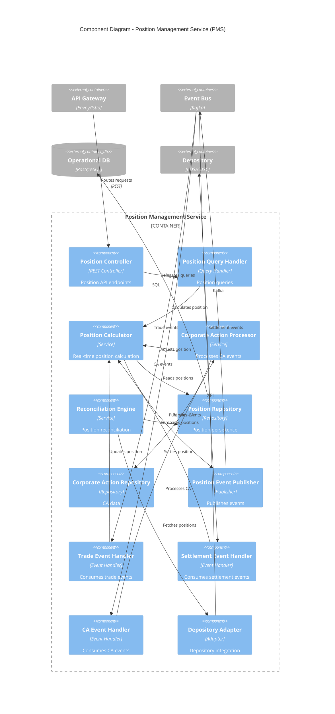
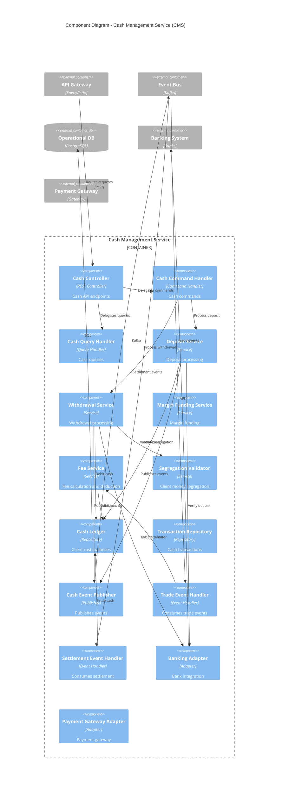

# C4 DIAGRAM PACK - C3 COMPONENT LEVEL
## Project Siddhanta: All-In-One Capital Markets Platform

**Version:** 2.0  
**Date:** June 2025  
**Diagram Level:** C3 - Component Architecture  
**Status:** Hardened Architecture Baseline

> **Stack authority**: [ADR-011_STACK_STANDARDIZATION_AND_GHATANA_PLATFORM_ALIGNMENT.md](ADR-011_STACK_STANDARDIZATION_AND_GHATANA_PLATFORM_ALIGNMENT.md) defines the current Siddhanta stack. The component patterns here remain useful, but ingress/gateway technology choices must follow ADR-011.

---

## 1. DIAGRAM LEGEND

### Component Types
- **📦 Domain Component**: Core business logic component
- **🔌 Adapter Component**: External integration adapter
- **🎯 Controller**: API endpoint handler
- **⚡ Event Handler**: Asynchronous event processor
- **📊 Repository**: Data access layer
- **🔧 Service**: Business logic service
- **🛡️ Validator**: Input validation and business rules
- **🔄 Mapper**: Data transformation and mapping

### Communication Patterns
- **→ Calls**: Synchronous method invocation
- **⇢ Publishes**: Event publishing
- **⇠ Subscribes**: Event consumption
- **↔ Reads/Writes**: Data persistence

### Architectural Patterns
- **CQRS**: Command Query Responsibility Segregation
- **Event Sourcing**: State derived from events
- **Hexagonal**: Ports and adapters architecture
- **DDD**: Domain-Driven Design

---

## 2. C3 COMPONENT DIAGRAM - ORDER MANAGEMENT SERVICE

```mermaid
C4Component
    title Component Diagram - Order Management Service (OMS)

    Container_Boundary(oms, "Order Management Service") {
        
        Component(order_controller, "Order Controller", "REST Controller", "Handles order API requests")
        Component(order_command_handler, "Order Command Handler", "Command Handler", "Processes order commands")
        Component(order_query_handler, "Order Query Handler", "Query Handler", "Handles order queries")
        
        Component(order_validator, "Order Validator", "Validator", "Validates order business rules")
        Component(margin_checker, "Margin Checker", "Service", "Verifies margin requirements")
        Component(limit_checker, "Limit Checker", "Service", "Checks exposure limits")
        Component(holding_verifier, "Holding Verifier", "Service", "Verifies sell order holdings")
        
        Component(order_service, "Order Service", "Domain Service", "Core order lifecycle logic")
        Component(routing_service, "Routing Service", "Service", "Order routing logic")
        Component(execution_service, "Execution Service", "Service", "Execution management")
        Component(fill_allocator, "Fill Allocator", "Service", "Allocates fills to orders")
        
        Component(order_repository, "Order Repository", "Repository", "Order persistence")
        Component(order_event_store, "Order Event Store", "Event Store", "Event sourcing store")
        
        Component(order_event_publisher, "Order Event Publisher", "Publisher", "Publishes domain events")
        Component(execution_event_handler, "Execution Event Handler", "Event Handler", "Handles execution reports")
        
        Component(fix_adapter, "FIX Adapter", "Adapter", "FIX protocol integration")
        Component(exchange_adapter, "Exchange Adapter", "Adapter", "Exchange API integration")
    }
    
    Container_Ext(api_gateway, "API Gateway", "Envoy/Istio")
    Container_Ext(fix_gateway, "FIX Gateway", "QuickFIX")
    Container_Ext(event_bus, "Event Bus", "Kafka")
    ContainerDb_Ext(operational_db, "Operational DB", "PostgreSQL")
    Container_Ext(rms, "Risk Management", "Service")
    Container_Ext(pms, "Position Management", "Service")
    
    Rel(api_gateway, order_controller, "Routes requests", "REST")
    Rel(order_controller, order_command_handler, "Delegates commands")
    Rel(order_controller, order_query_handler, "Delegates queries")
    
    Rel(order_command_handler, order_validator, "Validates")
    Rel(order_validator, margin_checker, "Checks margin")
    Rel(order_validator, limit_checker, "Checks limits")
    Rel(order_validator, holding_verifier, "Verifies holdings")
    
    Rel(margin_checker, rms, "Queries margin", "REST")
    Rel(holding_verifier, pms, "Queries positions", "REST")
    
    Rel(order_command_handler, order_service, "Executes command")
    Rel(order_service, routing_service, "Routes order")
    Rel(routing_service, fix_adapter, "Sends FIX message")
    Rel(fix_adapter, fix_gateway, "FIX protocol")
    
    Rel(order_service, order_repository, "Persists")
    Rel(order_repository, operational_db, "SQL")
    
    Rel(order_service, order_event_store, "Stores events")
    Rel(order_event_store, operational_db, "SQL")
    
    Rel(order_service, order_event_publisher, "Publishes events")
    Rel(order_event_publisher, event_bus, "Kafka")
    
    Rel(event_bus, execution_event_handler, "Execution reports")
    Rel(execution_event_handler, execution_service, "Processes execution")
    Rel(execution_service, fill_allocator, "Allocates fills")
    Rel(execution_service, order_repository, "Updates order")
    
    UpdateLayoutConfig($c4ShapeInRow="3", $c4BoundaryInRow="1")
```



---

## 3. COMPONENT DESCRIPTIONS - ORDER MANAGEMENT SERVICE

### 3.1 API Layer Components

#### Order Controller
**Responsibility**: HTTP endpoint handler for order operations  
**Endpoints**:
- `POST /api/v1/orders` - Place new order
- `PUT /api/v1/orders/{id}` - Modify order
- `DELETE /api/v1/orders/{id}` - Cancel order
- `GET /api/v1/orders/{id}` - Get order details
- `GET /api/v1/orders` - List orders (with filters)

**Key Operations**:
- Request validation (schema, auth)
- Command/query delegation
- Response mapping
- Error handling

**Technology**: Spring Boot REST Controller, OpenAPI annotations

---

### 3.2 Command Processing Components

#### Order Command Handler
**Responsibility**: Processes order commands (CQRS write side)  
**Commands**:
- `PlaceOrderCommand`
- `ModifyOrderCommand`
- `CancelOrderCommand`

**Flow**:
1. Receive command from controller
2. Validate command (schema, business rules)
3. Delegate to order service
4. Return command result

**Pattern**: Command Handler pattern, synchronous

#### Order Validator
**Responsibility**: Business rule validation  
**Validations**:
- Order type allowed for instrument
- Quantity within limits (min/max lot size)
- Price within circuit limits
- Trading hours check
- Client status (active, not suspended)
- Instrument tradability

**Dependencies**: Reference data service, calendar service

#### Margin Checker
**Responsibility**: Verify margin requirements  
**Logic**:
- Calculate required margin for order
- Query client available margin (from RMS)
- Reject if insufficient margin
- Reserve margin on order placement

**Integration**: Synchronous call to Risk Management Service

#### Limit Checker
**Responsibility**: Exposure limit enforcement  
**Checks**:
- Client exposure limit
- Group exposure limit
- Instrument concentration limit
- Sector concentration limit
- Single order size limit

**Integration**: Synchronous call to Risk Management Service

#### Holding Verifier
**Responsibility**: Verify holdings for sell orders  
**Logic**:
- Query client holdings (from PMS)
- Check available quantity (total - blocked)
- Reject if insufficient holdings
- Block holdings on sell order placement

**Integration**: Synchronous call to Position Management Service

---

### 3.3 Domain Service Components

#### Order Service
**Responsibility**: Core order lifecycle orchestration  
**Operations**:
- Place order (create, validate, route)
- Modify order (cancel-replace)
- Cancel order (send cancel request)
- Handle execution (update state, allocate fills)
- Handle rejection (update state, release margin/holdings)

**State Machine**:
```
NEW → VALIDATED → ROUTED → PENDING_NEW → ACTIVE
ACTIVE → PARTIALLY_FILLED → FILLED
ACTIVE → CANCELLED
ACTIVE → REJECTED
```

**Pattern**: Domain service, event-sourced

#### Routing Service
**Responsibility**: Determine order routing destination  
**Logic**:
- Primary exchange routing (NEPSE)
- Internal matching (if supported)
- Smart order routing (future: multi-exchange)
- Routing rules (instrument, order type)

**Output**: Routing decision (exchange ID, adapter type)

#### Execution Service
**Responsibility**: Process execution reports from exchange  
**Operations**:
- Parse execution report (FIX or API)
- Validate execution (order exists, quantity valid)
- Update order state
- Allocate fills (if partial)
- Publish execution events

**Pattern**: Event handler, idempotent

#### Fill Allocator
**Responsibility**: Allocate fills to orders  
**Logic**:
- For parent orders (iceberg, TWAP), allocate to child orders
- Calculate average price
- Update filled quantity
- Determine if order complete

**Algorithm**: FIFO allocation

---

### 3.4 Data Access Components

#### Order Repository
**Responsibility**: Order persistence (CRUD)  
**Operations**:
- Save order
- Update order
- Find order by ID
- Query orders (by client, status, date range)

**Technology**: Spring Data JPA, PostgreSQL

**Schema**:
```sql
orders (
  id UUID PRIMARY KEY,
  client_id UUID NOT NULL,
  instrument_id UUID NOT NULL,
  order_type VARCHAR(20),
  side VARCHAR(4),
  quantity DECIMAL,
  price DECIMAL,
  status VARCHAR(20),
  created_at TIMESTAMP,
  updated_at TIMESTAMP
)
```

#### Order Event Store
**Responsibility**: Event sourcing persistence  
**Operations**:
- Append event
- Replay events (for aggregate)
- Query events (by aggregate ID, event type)

**Technology**: PostgreSQL (append-only table)

**Schema**:
```sql
order_events (
  id BIGSERIAL PRIMARY KEY,
  aggregate_id UUID NOT NULL,
  event_type VARCHAR(100),
  event_data JSONB,
  event_version INT,
  created_at TIMESTAMP,
  created_by VARCHAR(100)
)
```

---

### 3.5 Event Components

#### Order Event Publisher
**Responsibility**: Publish domain events to Kafka  
**Events**:
- `OrderPlaced`
- `OrderRouted`
- `OrderExecuted`
- `OrderPartiallyFilled`
- `OrderFilled`
- `OrderCancelled`
- `OrderRejected`

**Technology**: Spring Kafka, transactional outbox pattern

**Event Schema** (example):
```json
{
  "eventId": "uuid",
  "eventType": "OrderPlaced",
  "aggregateId": "order-uuid",
  "timestamp": "2025-03-02T10:30:00Z",
  "data": {
    "orderId": "uuid",
    "clientId": "uuid",
    "instrumentId": "uuid",
    "side": "BUY",
    "quantity": 100,
    "price": 250.50
  }
}
```

#### Execution Event Handler
**Responsibility**: Consume execution reports from exchange  
**Sources**:
- FIX execution reports (via FIX Gateway)
- Exchange API webhooks
- Kafka topic (if exchange publishes to Kafka)

**Flow**:
1. Receive execution report
2. Validate and parse
3. Delegate to execution service
4. Acknowledge message

**Pattern**: Event-driven consumer, at-least-once delivery

---

### 3.6 Adapter Components

#### FIX Adapter
**Responsibility**: FIX protocol message translation  
**Operations**:
- Translate internal order → FIX NewOrderSingle (35=D)
- Translate FIX ExecutionReport (35=8) → internal execution
- Handle FIX session management (logon, heartbeat)
- Sequence number management

**Technology**: QuickFIX/J library

**FIX Messages**:
- NewOrderSingle (35=D)
- OrderCancelRequest (35=F)
- OrderCancelReplaceRequest (35=G)
- ExecutionReport (35=8)

#### Exchange Adapter
**Responsibility**: Exchange-specific API integration  
**Operations**:
- REST API calls (if exchange provides REST)
- WebSocket subscription (for execution updates)
- API authentication (API key, OAuth)
- Rate limiting compliance

**Technology**: Spring WebClient, WebSocket client

---

## 4. C3 COMPONENT DIAGRAM - POSITION MANAGEMENT SERVICE



---

## 5. COMPONENT DESCRIPTIONS - POSITION MANAGEMENT SERVICE

### 5.1 Position Calculation Components

#### Position Calculator
**Responsibility**: Real-time position calculation  
**Calculations**:
- T+0 position (today's trades, unsettled)
- T+1, T+2, T+3 positions (settlement cycle)
- Settled position (confirmed by depository)
- Available position (settled - blocked)
- Blocked position (pending sell orders)

**Formula**:
```
T+0 = Settled + Today's Buys - Today's Sells
T+1 = T+0 + T+1 Buys - T+1 Sells
Available = Settled - Blocked
```

**Technology**: In-memory calculation, cached in Redis

#### Corporate Action Processor
**Responsibility**: Process corporate action events  
**Corporate Actions**:
- Cash dividend (credit cash)
- Stock dividend (credit shares)
- Stock split (adjust quantity, price)
- Rights issue (credit rights, handle subscription)
- Bonus issue (credit bonus shares)
- Merger/acquisition (swap holdings)

**Flow**:
1. Receive CA event (from market data or depository)
2. Validate CA (record date, ex-date)
3. Calculate entitlement (quantity × ratio)
4. Update positions
5. Publish position update events

**Pattern**: Event-driven, idempotent

#### Reconciliation Engine
**Responsibility**: Daily position reconciliation  
**Process**:
1. Fetch positions from depository (EOD)
2. Compare with internal positions (settled)
3. Identify breaks (discrepancies)
4. Classify breaks (trade missing, CA missing, quantity mismatch)
5. Generate reconciliation report
6. Escalate unresolved breaks

**Schedule**: Daily at market close + 2 hours  
**Tolerance**: Zero tolerance (must match exactly)

---

### 5.2 Event Handlers

#### Trade Event Handler
**Responsibility**: Consume trade execution events  
**Events**:
- `OrderExecuted` (from OMS)
- `OrderFilled` (from OMS)

**Flow**:
1. Receive trade event
2. Extract trade details (client, instrument, quantity, side)
3. Update T+0 position
4. Publish `PositionUpdated` event

**Idempotency**: Deduplicate by trade ID

#### Settlement Event Handler
**Responsibility**: Consume settlement events  
**Events**:
- `TradeSettled` (from settlement service or depository)

**Flow**:
1. Receive settlement event
2. Move position from T+3 → Settled
3. Unblock holdings (if sell order)
4. Publish `PositionSettled` event

**Idempotency**: Deduplicate by settlement ID

#### CA Event Handler
**Responsibility**: Consume corporate action events  
**Events**:
- `DividendAnnounced`
- `StockSplitAnnounced`
- `RightsIssueAnnounced`

**Flow**:
1. Receive CA event
2. Delegate to corporate action processor
3. Acknowledge event

**Source**: Market data service, depository adapter

---

### 5.3 Data Access Components

#### Position Repository
**Responsibility**: Position persistence  
**Operations**:
- Save/update position
- Query position (by client, instrument, date)
- Query available position (for sell order validation)

**Schema**:
```sql
positions (
  id UUID PRIMARY KEY,
  client_id UUID NOT NULL,
  instrument_id UUID NOT NULL,
  settled_quantity DECIMAL,
  t0_quantity DECIMAL,
  t1_quantity DECIMAL,
  t2_quantity DECIMAL,
  t3_quantity DECIMAL,
  blocked_quantity DECIMAL,
  updated_at TIMESTAMP
)
```

#### Corporate Action Repository
**Responsibility**: Corporate action data persistence  
**Operations**:
- Save CA record
- Query CA (by instrument, record date)
- Query pending CAs

**Schema**:
```sql
corporate_actions (
  id UUID PRIMARY KEY,
  instrument_id UUID NOT NULL,
  ca_type VARCHAR(50),
  record_date DATE,
  ex_date DATE,
  payment_date DATE,
  ratio DECIMAL,
  amount DECIMAL,
  status VARCHAR(20),
  created_at TIMESTAMP
)
```

---

## 6. C3 COMPONENT DIAGRAM - CASH MANAGEMENT SERVICE



---

## 7. COMPONENT DESCRIPTIONS - CASH MANAGEMENT SERVICE

### 7.1 Cash Operation Components

#### Deposit Service
**Responsibility**: Process client deposits  
**Flow**:
1. Receive deposit request (client, amount, bank reference)
2. Verify deposit with bank (API or manual reconciliation)
3. Validate client account (active, not suspended)
4. Credit cash ledger
5. Publish `FundsDeposited` event

**Approval**: Auto-approve if bank-verified, manual approval otherwise

#### Withdrawal Service
**Responsibility**: Process client withdrawals  
**Flow**:
1. Receive withdrawal request (client, amount, bank account)
2. Validate available balance (cash - blocked)
3. Validate segregation (ensure client money not used for firm)
4. Initiate bank transfer (via banking adapter)
5. Debit cash ledger (pending confirmation)
6. Publish `FundsWithdrawn` event

**Approval**: Manual approval for large withdrawals (> threshold)

#### Margin Funding Service
**Responsibility**: Margin funding and calls  
**Operations**:
- Fund margin (transfer from cash to margin account)
- Margin call (notify client of shortfall)
- Forced liquidation (if margin call not met)

**Integration**: Triggered by Risk Management Service

#### Fee Service
**Responsibility**: Fee calculation and deduction  
**Fees**:
- Brokerage commission (% of trade value)
- Exchange fees
- Depository fees
- SEBON turnover fee
- Tax (capital gains, TDS)

**Flow**:
1. Receive trade event
2. Calculate fees (based on fee schedule)
3. Debit cash ledger
4. Publish `FeesCharged` event

**Fee Schedule**: Configurable per client, instrument, order type

#### Segregation Validator
**Responsibility**: Ensure client money segregation  
**Validation**:
- Client funds in segregated bank accounts
- No commingling with firm's operational funds
- Daily reconciliation (client ledger vs bank balance)

**Regulatory**: Mandatory per SEBON regulations

---

### 7.2 Data Access Components

#### Cash Ledger
**Responsibility**: Client cash balance tracking  
**Operations**:
- Credit/debit cash
- Query balance (available, blocked)
- Query transactions (by client, date range)

**Schema**:
```sql
cash_ledger (
  id UUID PRIMARY KEY,
  client_id UUID NOT NULL,
  currency VARCHAR(3) DEFAULT 'NPR',
  available_balance DECIMAL,
  blocked_balance DECIMAL,
  margin_balance DECIMAL,
  updated_at TIMESTAMP
)
```

#### Transaction Repository
**Responsibility**: Cash transaction history  
**Operations**:
- Record transaction
- Query transactions (audit trail)

**Schema**:
```sql
cash_transactions (
  id UUID PRIMARY KEY,
  client_id UUID NOT NULL,
  transaction_type VARCHAR(50),
  amount DECIMAL,
  balance_after DECIMAL,
  reference VARCHAR(100),
  created_at TIMESTAMP,
  created_by VARCHAR(100)
)
```

---

## 8. ASSUMPTIONS

### 8.1 Component Design Assumptions
1. **Hexagonal Architecture**: Each service follows ports and adapters pattern
2. **CQRS**: Separate read and write models for scalability
3. **Event Sourcing**: Order and ledger services use event sourcing
4. **Domain-Driven Design**: Components organized around domain concepts
5. **Single Responsibility**: Each component has one clear responsibility

### 8.2 Communication Assumptions
1. **Synchronous**: REST for queries, commands (with timeout)
2. **Asynchronous**: Kafka for events, eventual consistency
3. **Idempotency**: All event handlers idempotent (deduplicate by ID)
4. **Transactional Outbox**: Events published atomically with state changes
5. **At-Least-Once**: Event delivery guarantee (consumers handle duplicates)

### 8.3 Data Assumptions
1. **PostgreSQL**: Primary database for all services
2. **JPA/Hibernate**: ORM for data access
3. **Optimistic Locking**: Version field for concurrency control
4. **Database Per Service**: Each service owns its database schema
5. **Shared Reference Data**: Reference data replicated to each service

### 8.4 Technology Assumptions
1. **Spring Boot**: Java services use Spring Boot 3.x
2. **Spring Data JPA**: Data access layer
3. **Spring Kafka**: Event publishing/consumption
4. **Spring WebClient**: HTTP client for service-to-service calls
5. **Lombok**: Reduce boilerplate code

---

## 9. INVARIANTS

### 9.0 Cross-Cutting Architecture Primitives
- **Content Pack Taxonomy**: All jurisdiction-specific behavior is packaged as T1 (Config), T2 (Rules/Rego), or T3 (Executable plugins). No component hard-codes jurisdiction logic.
- **Dual-Calendar**: Every component that persists or publishes timestamps must include both Gregorian (`LocalDateTime`) and Bikram Sambat (`String timestampBs`) fields, obtained from the K-15 Dual-Calendar Service.
- **K-05 Event Envelope**: All domain events published by any component conform to the standard event envelope with `timestamp_bs`, `timestamp_gregorian`, `tenant_id`, `trace_id`, `causation_id`, and `correlation_id`.

### 9.1 Component Invariants
1. **Single Entry Point**: All external requests via controller layer
2. **No Direct DB Access**: Only repositories access database
3. **Event Publishing**: All state changes publish domain events
4. **Validation First**: All commands validated before execution
5. **Error Handling**: All components handle errors gracefully (no silent failures)

### 9.2 Data Invariants
1. **Referential Integrity**: Foreign keys enforced in database
2. **Optimistic Locking**: Concurrent updates detected and rejected
3. **Audit Trail**: All state changes logged (who, what, when)
4. **Idempotency Keys**: All commands have idempotency key
5. **Event Ordering**: Events processed in order per aggregate

### 9.3 Business Logic Invariants
1. **Margin Before Trade**: Margin checked before order placement
2. **Holdings Before Sell**: Holdings verified before sell order
3. **Segregation Always**: Client money always segregated
4. **Fee Calculation**: Fees calculated consistently per schedule
5. **Position Accuracy**: Positions reconciled daily with depository

---

## 10. WHAT BREAKS THIS?

### 10.1 Component Failures

#### 10.1.1 Order Validator Failure
**Scenario**: Order validator has bug, allows invalid order  
**Impact**:
- Invalid order routed to exchange
- Exchange rejects order
- Client frustration, reputational damage

**Mitigation**:
- **Unit Tests**: Comprehensive test coverage (>90%)
- **Integration Tests**: Test with real exchange (sandbox)
- **Canary Deployment**: Deploy to 10% traffic first
- **Monitoring**: Alert on high rejection rate

#### 10.1.2 Position Calculator Bug
**Scenario**: Position calculator has rounding error  
**Impact**:
- Incorrect available position
- Sell orders rejected (false negative) or allowed (false positive)
- Reconciliation breaks

**Mitigation**:
- **Decimal Precision**: Use BigDecimal, not float/double
- **Unit Tests**: Test edge cases (large quantities, small prices)
- **Daily Recon**: Detect discrepancies early
- **Manual Override**: Compliance can override position

#### 10.1.3 Fee Service Miscalculation
**Scenario**: Fee service calculates wrong fee  
**Impact**:
- Overcharge (client complaint, refund)
- Undercharge (revenue loss, regulatory issue)

**Mitigation**:
- **Fee Schedule Validation**: Validate fee config on startup
- **Audit Trail**: Log all fee calculations
- **Reconciliation**: Reconcile fees with exchange/depository
- **Manual Review**: Compliance reviews fee reports

### 10.2 Integration Failures

#### 10.2.1 FIX Adapter Message Loss
**Scenario**: FIX message lost (network issue, sequence gap)  
**Impact**:
- Order not routed to exchange
- Execution report not received
- Order stuck in pending state

**Mitigation**:
- **Sequence Number Tracking**: Detect gaps, request resend
- **Heartbeat Monitoring**: Detect connection loss within 30s
- **Manual Reconciliation**: Compare orders with exchange EOD
- **Timeout Handling**: Mark order as timeout if no response in 5 minutes

#### 10.2.2 Depository Adapter Timeout
**Scenario**: Depository API slow or timing out  
**Impact**:
- Position reconciliation delayed
- Sell order validation fails (cannot verify holdings)

**Mitigation**:
- **Cached Positions**: Use last-known positions (with timestamp)
- **Timeout**: Fail fast (5s timeout)
- **Retry**: Exponential backoff (max 3 retries)
- **Manual Recon**: Fallback to manual reconciliation

#### 10.2.3 Banking Adapter Failure
**Scenario**: Banking API down, cannot verify deposits  
**Impact**:
- Deposits not credited
- Client cannot trade
- Manual intervention required

**Mitigation**:
- **Manual Verification**: Operator verifies via bank portal
- **Async Processing**: Queue deposit requests, process later
- **Client Communication**: Notify client of delay

### 10.3 Data Consistency Issues

#### 10.3.1 Event Duplication
**Scenario**: Kafka delivers duplicate event (at-least-once)  
**Impact**:
- Position updated twice
- Cash credited twice
- Incorrect balances

**Mitigation**:
- **Idempotency**: Deduplicate by event ID
- **Database Unique Constraint**: Prevent duplicate inserts
- **Monitoring**: Alert on duplicate event detection

#### 10.3.2 Event Ordering Violation
**Scenario**: Events processed out of order  
**Impact**:
- Incorrect state (e.g., execution before order placement)
- State machine violation

**Mitigation**:
- **Partition Key**: Kafka partition by aggregate ID (order ID, client ID)
- **Sequence Number**: Events have sequence number, detect gaps
- **Reordering Buffer**: Buffer events, process in order

#### 10.3.3 Database Deadlock
**Scenario**: Two transactions deadlock (e.g., updating same client balance)  
**Impact**:
- Transaction rollback
- Retry storm
- Performance degradation

**Mitigation**:
- **Lock Ordering**: Always acquire locks in same order
- **Optimistic Locking**: Use version field, retry on conflict
- **Deadlock Detection**: Database detects and aborts one transaction
- **Monitoring**: Alert on high deadlock rate

### 10.4 Business Logic Errors

#### 10.4.1 Margin Calculation Bug
**Scenario**: Margin checker calculates wrong required margin  
**Impact**:
- Order allowed with insufficient margin (credit risk)
- Order rejected with sufficient margin (lost opportunity)

**Mitigation**:
- **Unit Tests**: Test all margin calculation scenarios
- **Reconciliation**: Compare margin with RMS daily
- **Manual Review**: Risk team reviews large orders
- **Audit Trail**: Log all margin calculations

#### 10.4.2 Corporate Action Processing Error
**Scenario**: Stock split processed with wrong ratio  
**Impact**:
- Incorrect position quantities
- Client disputes
- Reconciliation breaks

**Mitigation**:
- **Dual Verification**: Two operators verify CA parameters
- **Dry Run**: Test CA processing in staging
- **Reversal Capability**: Ability to reverse CA (with audit trail)
- **Client Communication**: Notify clients before CA processing

---

## 11. COMPONENT INTERACTION PATTERNS

### 11.1 Synchronous Request-Response
**Use Case**: Order placement  
**Flow**:
```
Client → API Gateway → Order Controller → Order Command Handler
  → Order Validator → Margin Checker → RMS (REST call)
  → Order Service → Order Repository → Database
```
**Timeout**: 30s end-to-end  
**Retry**: Client retries with idempotency key

### 11.2 Asynchronous Event-Driven
**Use Case**: Position update after trade  
**Flow**:
```
Order Service → Order Event Publisher → Kafka (OrderExecuted event)
  → Trade Event Handler (PMS) → Position Calculator → Position Repository
  → Position Event Publisher → Kafka (PositionUpdated event)
```
**Latency**: < 1 second (eventual consistency)  
**Guarantee**: At-least-once delivery

### 11.3 Saga Pattern
**Use Case**: Withdrawal (multi-step transaction)  
**Flow**:
```
1. Withdrawal Service → Debit cash ledger (pending)
2. Withdrawal Service → Banking Adapter → Bank transfer
3. Banking Adapter → Receive confirmation
4. Withdrawal Service → Confirm cash debit
```
**Compensation**: If bank transfer fails, reverse cash debit

### 11.4 CQRS Pattern
**Use Case**: Order query  
**Flow**:
```
Write Side: Order Command Handler → Order Service → Order Repository
Read Side: Order Query Handler → Order Read Model (denormalized)
```
**Sync**: Read model updated via events (eventual consistency)

---

## 12. COMPONENT TESTING STRATEGY

### 12.1 Unit Testing
**Scope**: Individual components (services, validators, calculators)  
**Framework**: JUnit 5, Mockito  
**Coverage**: >90% code coverage  
**Focus**:
- Business logic correctness
- Edge cases (null, zero, negative, large numbers)
- Error handling

### 12.2 Integration Testing
**Scope**: Component interactions (controller → service → repository)  
**Framework**: Spring Boot Test, Testcontainers  
**Focus**:
- Database interactions
- Event publishing/consumption
- External API calls (mocked)

### 12.3 Contract Testing
**Scope**: API contracts between services  
**Framework**: Spring Cloud Contract, Pact  
**Focus**:
- REST API contracts (request/response schemas)
- Event contracts (Kafka message schemas)

### 12.4 End-to-End Testing
**Scope**: Full user flows (place order → execution → settlement)  
**Framework**: Cucumber, REST Assured  
**Focus**:
- Happy path scenarios
- Error scenarios
- Performance (load testing)

---

## 13. CROSS-REFERENCES

### Related Documents
- **C1 Context Diagram**: `C4_C1_CONTEXT_SIDDHANTA.md`
- **C2 Container Diagram**: `C4_C2_CONTAINER_SIDDHANTA.md`
- **C4 Code Diagram**: `C4_C4_CODE_SIDDHANTA.md`
- **Epic - OMS**: `epics/EPIC-D-01-OMS.md`
- **Epic - PMS**: `epics/EPIC-D-03-PMS.md`

---

## 14. REVISION HISTORY

| Version | Date | Author | Changes |
|---------|------|--------|---------|
| 1.0 | 2025-03-02 | Architecture Team | Initial C3 Component Diagram |
| 2.1 | 2026-03-09 | Architecture Team | v2.1 hardening: T1/T2/T3 taxonomy, dual-calendar, NFR alignment |

---

**END OF C3 COMPONENT DIAGRAM**
