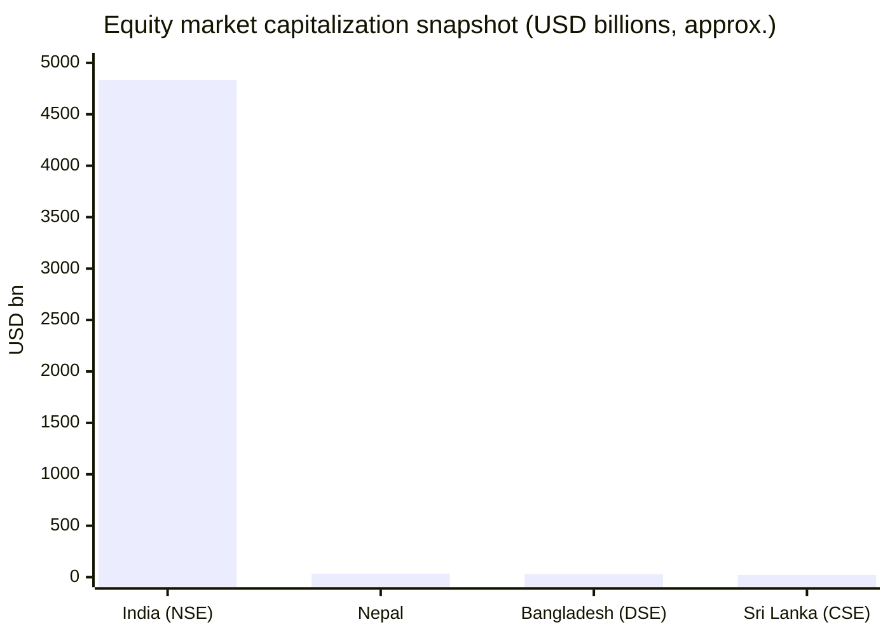
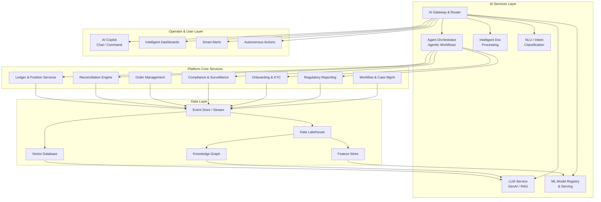
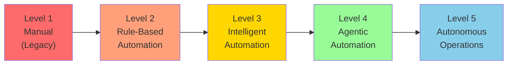
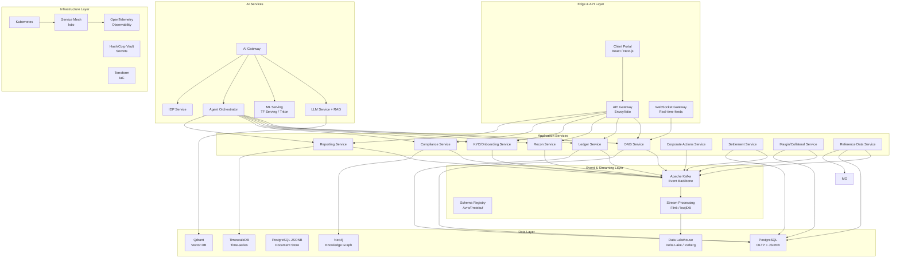
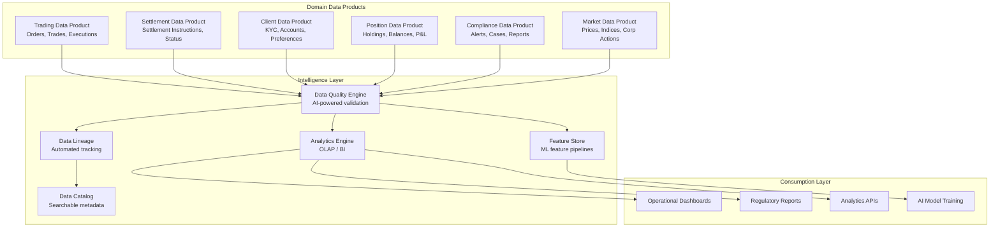
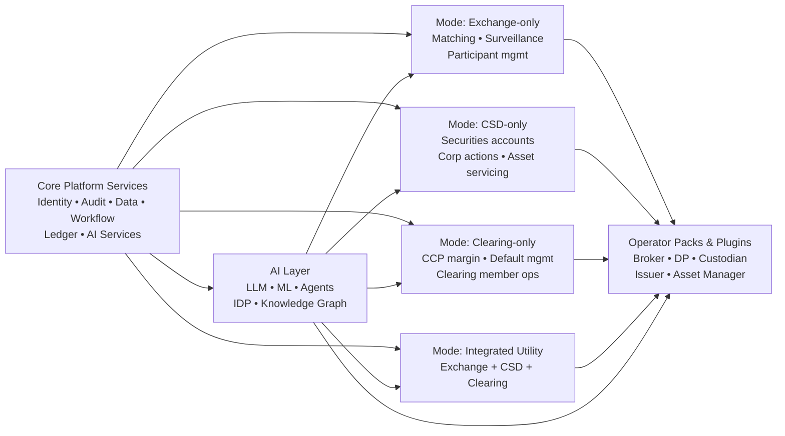
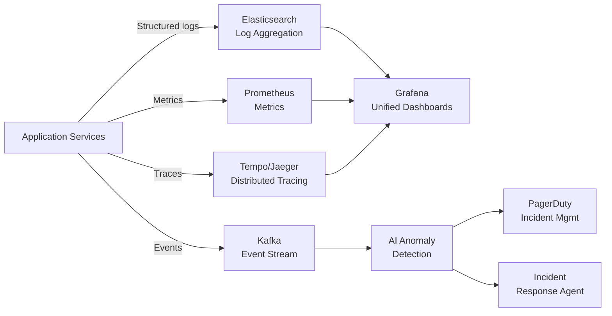
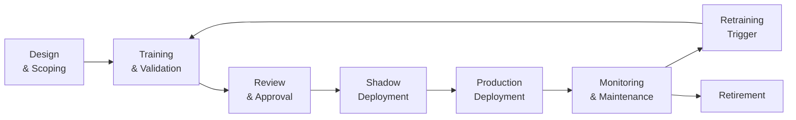

# Business and Technical Analysis for an AI‑Native, All‑in‑One Capital Markets Platform in South Asia

**Document Version:** 2.1  
**Date:** March 9, 2026  
**Status:** Current Research Analysis (Aligned with Siddhanta v2.1)

Shared terminology and policy baseline: [Documentation_Glossary_and_Policy_Appendix.md](../archive/Documentation_Glossary_and_Policy_Appendix.md)
Shared authoritative source register: [Authoritative_Source_Register.md](Authoritative_Source_Register.md)
Reference style for time-sensitive external facts: `ASR-*` IDs from the shared source register.

## Executive summary

This report evaluates the business case, architecture, and build-out requirements for an **AI‑native, automation‑first, All‑in‑One Capital Markets Platform** (the "Platform"), grounded in the provided MD specification (modular "operator packs," plugin-based extensibility, shared core services). It focuses on South Asia—India, Nepal, Bangladesh, Sri Lanka, Myanmar—while benchmarking against global standards and vendor landscapes.

The key conclusion is that **the strongest near‑term wedge is not "build everything at once," but to commercialize a compliant, AI‑native, extensible core plus 2–3 operator packs that solve urgent regulatory + operational pain (shorter settlement, cybersecurity, cloud controls, digital onboarding, reconciliations, and reporting)**, then expand into market‑infrastructure-grade modes and a plugin marketplace. **What differentiates this platform from incumbents is that AI is not bolted on—it is the architectural foundation**: every workflow, every reconciliation, every compliance check, and every operator interaction is designed to be AI‑augmented from day one, with deterministic controls first and bounded agentic automation where governance permits.

### Why AI‑native is non‑negotiable

The capital markets technology landscape is at an inflection point. Legacy platforms from Broadridge, FIS, ION, and Murex were architected in the pre-LLM era—they are adding AI features retroactively. A greenfield platform has the unique opportunity to be **AI‑native by design**: embedding foundation models, agentic workflows, intelligent document processing, predictive analytics, and tightly bounded automation into the platform core rather than treating them as optional add-ons.

IOSCO's 2024 consultation report on AI in capital markets documents the accelerating use of AI by market participants for surveillance, fraud detection, customer interaction, and trading—while flagging the need for governance, explainability, and oversight. BIS research confirms that central banks are adopting ML for statistics, payment oversight, and supervision. These regulatory signals confirm that AI adoption is expanding, but only under increasingly explicit governance, explainability, and human-oversight expectations.

### Regional demand signals

A notable regional pattern is **regulatory-driven digitization**: India's regulator (SEBI) has issued formal frameworks for **cloud adoption** and a broad **Cybersecurity and Cyber Resilience Framework (CSCRF)** for regulated entities. India is also operationalizing **optional same‑day (T+0)** settlement expansion while retaining T+1—raising requirements for real-time processing, intraday risk, reconciliations, and operational controls. In parallel, Bangladesh's depository shows a large DP network and over 1.6M BO accounts, and Sri Lanka's regulator explicitly promotes **end‑to‑end investor digital onboarding with eKYC**. These are strong signals that **platform ROI will be driven by intelligent automation, control, and auditability**, not just trade execution.

### Standards alignment

Any platform aspiring to exchange/CSD/CCP-grade deployment must be designed to align with: (a) **CPMI‑IOSCO PFMI** for financial market infrastructures, (b) **IOSCO Objectives & Principles** for securities regulation, (c) **FATF risk‑based AML/CFT guidance for the securities sector**, and (d) **emerging AI governance frameworks** (IOSCO AI recommendations, EU AI Act principles applied by analogy, NIST AI RMF). These standards translate directly into required platform capabilities: robust governance, risk management, segregation of client assets, operational resilience, surveillance, data lineage, audit logs, tested recovery processes, and—critically—**AI model governance with explainability and human oversight**.

### Commercial positioning

The platform market is **crowded globally** (large suites such as Broadridge / FIS / ION / Murex, plus buy‑side leaders and specialist point solutions), so differentiation must be anchored in:

1. **AI‑native architecture** with agentic workflows, intelligent automation, and embedded GenAI—capabilities that legacy vendors cannot easily retrofit.
2. **South Asia compliance‑ready operator packs**, mapped to local controls and regulatory frameworks.
3. **Integration accelerators for local market infrastructure** (exchange, depository, payment connectors).
4. **A developer-friendly plugin contract** with conformance testing and certification gates.
5. **Automation‑first operations** targeting >95% STP rates in standard flows and bounded automation for low-risk exception classes.

### Market entry strategy

- **India**: position as **compliance + resilience + "T+0/T+1 readiness"** plus **API/algo governance**, "controls-by-default," and **AI‑powered operational intelligence**, aligned to SEBI cloud and CSCRF requirements.
- **Nepal / Bangladesh / Sri Lanka**: lead with **brokerage + depository participant** packs emphasizing AI‑powered onboarding, intelligent reconciliations, automated reporting, and operational controls, with connectors to local depository and IPO processes.
- **Myanmar**: treat as a longer-horizon option or partnership-led opportunity due to significantly smaller market activity.

Implementation-wise, a realistic "AI‑native platform + packs + connectors" build is typically **phased**. A credible MVP in 9–12 months is feasible if scope is limited to core + AI layer + brokerage/DP pack + regulatory reporting + reconciliations, while exchange/CSD/CCP-grade modes are a 24–36 month path.

---

## Market landscape and sizing in South Asia

**Regional context.** Public market depth varies widely: India's equity market is among the world's largest; Nepal, Bangladesh, and Sri Lanka are materially smaller; Myanmar is minimal by the same metrics. For a capital markets platform, the practical "market size" is best proxied by (a) **investor account base**, (b) **market capitalization and turnover**, and (c) **counts of regulated intermediaries** (brokers/DPs/merchant bankers/investment managers), because these drive addressable software + integration spend.

### Market infrastructure scale indicators (selected)

The table below compiles publicly available, regulator/exchange/depository statistics.
Nepal rows are actively maintained against the shared source register; non-Nepal rows are comparative benchmarks and may lag current public filings.

| Country    | Indicator                           | Selected public signal (mixed dates; revalidate before transaction use)                                                                                                                          | Reference ID                                           |
| ---------- | ----------------------------------- | ------------------------------------------------------------------------------------------------------------------------------------------------------------------------------------------------ | ------------------------------------------------------ |
| India      | Demat accounts                      | 20,70,59,626 demat accounts (~207.1M)                                                                                                                                                            | `ASR-IND-SEBI-2025-09`                                 |
| India      | Market cap                          | All India market capitalisation ₹452 lakh crore                                                                                                                                                  | `ASR-IND-SEBI-2025-09`                                 |
| India      | Mutual fund AUM                     | Average AUM ₹75,61,309 crore                                                                                                                                                                     | `ASR-IND-SEBI-2025-09`                                 |
| India      | Regulated intermediaries (examples) | Merchant bankers 235; depository participants NSDL 299 and CDSL 582                                                                                                                              | `ASR-IND-SEBI-2025-09`                                 |
| Nepal      | Market cap and listings             | Mid‑2025 public references indicate stock market capitalization of about Rs. 4,656.99 bn; listed-company counts vary by source and should be revalidated against current SEBON/NEPSE disclosures | `ASR-NEP-MKT-ILL-2025`                                 |
| Nepal      | Depository adoption                 | Demat accounts 7,511,020 and registered Meroshare users 6,586,798                                                                                                                                | `ASR-NEP-CDSC-2026-03-01`                              |
| Nepal      | Intermediary footprint              | 90 stock brokers, 2 stock dealers, 32 merchant bankers, 122 DPs, 19 specialized investment fund managers, a separate category of 17 "Fund Manager and Depository" entities, and 46 RTA entries   | `ASR-NEP-SEBON-2026-03-01` / `ASR-NEP-CDSC-2026-03-01` |
| Bangladesh | Depository adoption                 | BO accounts (operable in CDS) 1,650,111; DPs 559; ISO 27001 certification stated                                                                                                                 | `ASR-BGD-CDBL-2026-02-26`                              |
| Bangladesh | Broker base (exchange membership)   | Comparative benchmark: 250 TREC holders (234 active in a 2025 exchange market-structure summary)                                                                                                 | `ASR-BGD-CSE-2025-Q1`                                  |
| Sri Lanka  | Digital onboarding                  | SEC materials describe eKYC onboarding with biometric and NIC verification; exact speed claims remain a benchmark, not a committed SLA                                                           | `ASR-LKA-SEC-2026`                                     |
| Sri Lanka  | Depository operations               | CSE states investors can create a CDS account in-app and receive account details within 24 hours                                                                                                 | `ASR-LKA-CSE-APP-2026`                                 |
| Myanmar    | Market scale                        | YSX daily market statistics report total market capitalisation of 794,378 million MMK (use local-currency benchmark unless FX-normalized separately)                                             | `ASR-MMR-YSX-2026-02-11`                               |

### Comparable market capitalization snapshot (cross-country)



_Approximation notes: the comparative market-cap chart remains an illustrative visualization. India, Bangladesh, and Sri Lanka benchmark bars map to WFE July 2025 exchange rows (`ASR-IND-WFE-2025-07`, `ASR-BGD-WFE-2025-07`, `ASR-LKA-WFE-2025-07`). Nepal remains an indicative mid-2025 conversion benchmark (`ASR-NEP-MKT-ILL-2025`). Myanmar is intentionally excluded from the USD chart until a fresh FX-normalized conversion is produced from `ASR-MMR-YSX-2026-02-11`._

### Addressable market framing (TAM/SAM/SOM)

Because capital markets platform pricing is mostly enterprise-negotiated and public spend data is limited, a rigorous approach is to present **a range-based TAM/SAM/SOM** using transparent assumptions tied to the observable "buyer base" (counts of regulated entities) and the product scope.

- **TAM** (Total Addressable Market): all regulated institutions that could use front-to-back capital markets systems, including brokers/DPs/merchant bankers, buy-side managers, custodians, exchanges/CSDs/CCPs (where modernization is feasible).
- **SAM** (Serviceable Addressable Market): institutions in the target countries that are realistically reachable with your deployment and compliance posture, excluding the largest global firms already locked into multi-decade vendor stacks.
- **SOM** (Serviceable Obtainable Market, 3–5 years): near-term capture based on plausible win rates and implementation capacity.

**Quantified TAM/SAM/SOM estimates (illustrative):**

| Segment                                                   | Entity count (approx.) | Avg. annual platform spend assumption | TAM estimate       |
| --------------------------------------------------------- | ---------------------- | ------------------------------------- | ------------------ |
| India brokers/DPs (~880)                                  | 880                    | $50K–$500K/yr (wide range by tier)    | $44M–$440M/yr      |
| India asset managers/MF houses (~50 AMCs + advisors ~949) | ~1,000                 | $100K–$1M/yr                          | $100M–$1B/yr       |
| India merchant banks/IBs (~235)                           | 235                    | $80K–$400K/yr                         | $19M–$94M/yr       |
| Nepal brokers (~90) + DPs                                 | ~100                   | $10K–$80K/yr                          | $1M–$8M/yr         |
| Bangladesh brokers (~250) + DPs (~559)                    | ~810                   | $15K–$100K/yr                         | $12M–$81M/yr       |
| Sri Lanka brokers + DPs                                   | ~100                   | $15K–$100K/yr                         | $1.5M–$10M/yr      |
| Market infrastructure (exchanges/CSDs/CCPs)               | ~15                    | $500K–$10M/yr                         | $7.5M–$150M/yr     |
| **Total South Asia TAM (annualized)**                     |                        |                                       | **$185M–$1.8B/yr** |
| **SAM (reachable, 40–60% of TAM)**                        |                        |                                       | **$75M–$1.1B/yr**  |
| **SOM (3–5 yr capture, 5–10% SAM)**                       |                        |                                       | **$4M–$110M/yr**   |

_Notes: These are order-of-magnitude planning estimates. Actual spend varies enormously by institution size, current technology maturity, and willingness to migrate. India dominates the addressable market. Enterprise deals for exchange/CSD/CCP-grade platforms skew the upper bounds significantly._

### Penetration opportunities by country

- **India**: huge SAM but intense competition; the opportunity is strongest where regulations force system upgrades (cloud controls, cybersecurity, algo governance, T+0 readiness) and where **AI‑native capabilities create switching incentives** from legacy stacks.
- **Nepal**: strong digital participation at depository level (demat and Meroshare users in the millions) alongside a relatively small broker universe; opportunities favor packaged "operator packs" + connectors + AI-powered operational reporting.
- **Bangladesh**: scale exists in the intermediary base (TREC holders) and DP network; the penetration lever is modernization of digital brokerage operations and reconciliations, plus governance and AML/KYC digitization.
- **Sri Lanka**: explicit regulator-led digitization agenda (digital onboarding, biometric auth, NIC verification) creates a straightforward product narrative linking compliance and UX automation.
- **Myanmar**: low market cap and limited listings imply constrained near-term software spend and higher go-to-market risk.

---

## Demand drivers and future requirements

This section translates global/regional trends into concrete platform requirements—what must be engineered and operationalized to be "general, standard, compliant," AI-native, and future-proof across South Asia.

### Shorter settlement cycles (T+1 → T+0) and real-time operations

A move toward T+1 and T+0 compresses operational windows and increases the need for **real-time processing, reconciliations, and intraday risk controls**—not just faster matching. Industry commentary on T+1 emphasizes the need to invest in common sources of reference data, corporate actions, and real-time global processing for finance/accounting, clearance/settlement, and stock record.

India is a live case study: SEBI expanded optional **same‑day (T+0)** settlement toward the top 500 stocks (effective Jan 31, 2025) after an initial beta phase—forcing brokers and market infrastructure to handle parallel settlement cycles and operational complexity. This directly drives Platform features such as:

- event-driven processing (avoid overnight batch dependency),
- intraday ledger and position services,
- **AI-predicted settlement fail detection** (ML models trained on trade characteristics, counterparty behavior, and market conditions to predict and prevent settlement failures before they occur),
- automated exception management and reconciliations,
- resilient pricing/valuation pipelines (to support margin and risk),
- cutover-safe "dual-run" capability during migration,
- **agentic reconciliation resolution** (AI agents that investigate, classify, and resolve standard reconciliation breaks within approved guardrails, with human escalation for ambiguous, high-value, or multi-entity exceptions).

### ISO 20022 migration and message standardization

ISO 20022 adoption in securities messaging (corporate actions, settlement, reconciliation) is a long-term structural shift that improves interoperability but requires strong data models, mapping, and versioned integrations.

Platform implications:

- canonical event and instruction models (corporate actions, settlement instructions, entitlement calculations),
- **AI-assisted message mapping** (LLM-powered tools that understand ISO 15022 and ISO 20022 semantics, automatically generate mapping configurations, and validate transformations),
- a "certification harness" for message conformance per counterparty/venue,
- reference data and identifier services (ISIN, LEI where applicable, local identifiers),
- **intelligent message repair** (GenAI that detects malformed or incomplete messages and proposes corrections with confidence scores).

### Digital identity, eKYC, and onboarding automation

Digital onboarding is a major adoption driver in South Asia because it reduces cost-to-serve and unlocks new investors.

- **India**: Aadhaar paperless offline e‑KYC, emphasizing privacy/security controls (digitally signed data, encryption, resident control). UIDAI provides the identity backbone.
- **Bangladesh**: Bangladesh Financial Intelligence Unit e‑KYC guidelines are explicitly based on national ID and biometrics, designed to enable digital customer onboarding and due diligence.
- **Nepal**: Department of National ID and Civil Registration operates national ID pre-enrollment and citizen portal systems that may underpin eKYC workflows at banks/brokers, but production use remains dependent on legal integration allowances, regulator approvals, and interface readiness.
- **Sri Lanka**: Information and Communication Technology Agency of Sri Lanka runs the Sri Lanka Unique Digital Identity (SLUDI) project as part of the government's digital transformation strategy.

**AI‑native onboarding platform requirements:**

- **Intelligent Document Processing (IDP)**: vision models + OCR + NLP for automated extraction and verification of identity documents, proof of address, financial statements, and corporate constitutive documents—across multiple languages (Hindi, Bengali, Nepali, Sinhala, Tamil, Burmese, English),
- **AI-powered risk scoring**: ML models for real-time AML/CFT risk assessment during onboarding, incorporating entity resolution, adverse media screening, PEP/sanctions matching, and network analysis,
- **Automated suitability assessment**: AI-driven investor profiling based on disclosed financial information, investment experience, and risk appetite—with explainable recommendations,
- flexible onboarding workflows per operator type (broker/DP/asset manager),
- KYC evidence vault with lifecycle controls and automated renewal triggers,
- secure consent and data minimization patterns (especially where national ID ecosystems are sensitive),
- **Continuous KYC (cKYC)**: event-driven re-assessment triggered by transaction patterns, adverse media alerts, or risk threshold breaches—not just periodic review cycles.

### Tokenization, digital asset custody, and programmable settlement

Tokenization is shifting from experimentation to structured policy discussions. BIS/CPMI defines tokenisation as generating/recording a digital representation of traditional assets on a programmable platform. BIS has also articulated a "unified ledger" concept—bringing tokenized assets and settlement money together to harness programmability and settlement finality.

The Financial Stability Board published a global regulatory framework for crypto-asset activities (2023), emphasizing consistent regulation for stablecoins ("same activity, same risk, same regulation"). IOSCO has issued policy recommendations for crypto and digital asset markets (2023) and continues monitoring implementation.

Platform requirements (if you decide to support tokenized instruments):

- digital-asset custody book of record (segregation, safekeeping controls),
- key management/HSM integration and transaction policy engines,
- on-chain/off-chain reconciliation and proof capture,
- "market integrity" controls aligned to IOSCO recommendations for digital asset markets,
- **smart contract audit and risk assessment** tooling with AI-assisted vulnerability detection.

Given the regulatory variability across the target countries, tokenization features are best delivered as **optional plugins** behind strict certification, not core defaults.

### ESG/green bonds and Islamic finance productization

Sustainable finance is becoming operationally "real" in South Asia.

- **India**: SEBI has issued revised disclosure requirements for green debt securities, and a framework for ESG debt securities beyond green debt. SEBI also maintains ESG debt securities statistics.
- **Sri Lanka**: SEC publishes sustainability/green bond materials, noting green/blue bonds under "sustainable bonds," and indicates the Colombo Stock Exchange's work toward a green index.
- **Bangladesh**: regulations include green bond definitions within debt securities frameworks; the regulator has taken steps toward Islamic capital market governance (e.g., Shari'ah Advisory Council formation order).

**AI-enhanced platform requirements:**

- **AI-powered use-of-proceeds tracking**: NLP analysis of issuer reports, bank statements, and project documentation to automatically verify and classify green/social bond fund utilization,
- ESG taxonomy support and disclosure workflows with automated completeness checks,
- **Automated Shari'ah screening**: ML-driven classification of securities against configurable Shari'ah compliance criteria (financial ratios, business activity screening) with audit trail,
- governance workflows for Islamic finance products with maker-checker and scholar approval tracking,
- **ESG data aggregation**: automated collection and normalization of ESG metrics from multiple data providers and issuer disclosures.

### Open APIs, algorithmic trading governance, and AI/ML integration

Open APIs are simultaneously a growth engine and a risk surface. India's regulator is tightening the framework for retail participation in algorithmic trading and API-based ecosystems: SEBI issued a circular on safer participation of retail investors in algorithmic trading. SEBI also issued ease-of-doing-business measures for internet-based trading.

On AI in capital markets, IOSCO's consultation report documents use cases and risks, noting observed use of AI by market participants (including broker-dealers) for surveillance and fraud detection. BIS summaries flag that AI can amplify vulnerabilities without appropriate controls and oversight.

**Platform implications:**

- API gateway with strong identity + authorization + throttling + order tagging,
- audited "algo provider" onboarding/registration and strategy cataloging for API-based algo trading where required,
- **AI-native surveillance engine** (not a bolted-on module): real-time pattern recognition across order flow, trade execution, and market data to detect manipulation, spoofing, layering, insider trading, and wash trading—with explainable alerts and confidence scoring,
- **Anomaly detection pipelines**: unsupervised ML models that continuously learn "normal" market behavior and flag deviations, reducing false positives by 60–80% compared to rule-only engines,
- **Natural language investigation copilot**: GenAI-powered tool for compliance officers to query surveillance alerts, reconstruct event timelines, and generate investigation reports in natural language,
- **Federated model deployment**: ability for each operator to deploy jurisdiction-specific ML models while maintaining platform-level model governance, versioning, and bias monitoring.

---

## AI‑native platform architecture

This section defines the AI-native architecture that differentiates this platform from legacy capital markets systems. "AI‑native" means AI is not a feature—it is the **substrate**: every core service exposes AI hooks, every data pipeline feeds ML models, and every user interaction can be augmented by intelligent agents.

### Design principles

1. **AI as a first-class citizen**: Every platform service (ledger, reconciliation, onboarding, surveillance, reporting) exposes structured data, event streams, and action APIs that AI models and agents can consume and act upon.
2. **Controls-first, agentic where appropriate**: Deterministic controls handle fixed regulatory logic first. AI agents can assist or automate repetitive, low-risk, and pattern-recognizable tasks within bounded guardrails. Humans handle judgment-intensive decisions, escalations, and policy.
3. **Explainable and auditable**: Every AI decision is logged with inputs, model version, confidence score, reasoning chain, and outcome. Regulators can inspect any AI-assisted action.
4. **Human-in-the-loop where required**: Configurable escalation thresholds ensure that high-risk or low-confidence AI decisions route to human reviewers. Operator packs define per-jurisdiction escalation policies.
5. **Continuously learning**: Models improve from production feedback loops (corrections, overrides, confirmed outcomes) while maintaining strict data governance and bias monitoring.
6. **Privacy-preserving**: AI models operate within data classification boundaries. PII is redacted or pseudonymized in training pipelines. Federated learning is used where cross-operator model improvement is beneficial but data sharing is restricted.

### AI integration layer architecture



### Core AI services

#### 1. Foundation model integration (LLM / GenAI service)

The platform embeds a **model-agnostic LLM gateway** that supports multiple foundation model providers (OpenAI, Anthropic, open-source models like Llama/Mistral, and on-premise deployments for data-sensitive operations).

**Key capabilities:**

- **Retrieval-Augmented Generation (RAG)**: regulatory documents, operating procedures, market rules, and historical case data are indexed in a vector database. The LLM answers questions grounded in authoritative context, reducing hallucination risk.
- **Structured output generation**: regulatory reports, client communications, investigation summaries, and disclosure documents generated from templates + data + LLM synthesis.
- **Multi-language support**: native understanding of English, Hindi, Bengali, Nepali, Sinhala, and Tamil for document processing and user interaction across South Asian markets.
- **Context-aware assistance**: the LLM has access to the user's role, current workflow state, and relevant data context—enabling precise, actionable responses.

#### 2. ML model registry and serving

A centralized model lifecycle management system:

- **Model registry**: version-controlled storage of all ML models with metadata (training data lineage, performance metrics, bias assessments, approval status).
- **A/B testing and shadow mode**: new models run in shadow alongside production models; outputs are compared before full promotion.
- **Feature store**: shared, versioned feature sets (e.g., counterparty risk features, trade pattern features, market volatility features) that feed multiple models consistently.
- **Model monitoring**: real-time drift detection, performance degradation alerts, and automated retraining triggers.
- **Explainability tooling**: SHAP/LIME integration for feature importance; attention visualization for sequence models; counterfactual explanations for decision review.

#### 3. Agent orchestrator (agentic AI engine)

The platform's **agentic layer** enables bounded multi-step workflows. Agents are specialized, constrained, and auditable:

| Agent type                        | Function                                                                                              | Autonomy level                                                                               | Escalation trigger                                                        |
| --------------------------------- | ----------------------------------------------------------------------------------------------------- | -------------------------------------------------------------------------------------------- | ------------------------------------------------------------------------- |
| **Reconciliation Agent**          | Investigates breaks, matches partial entries, proposes resolution with evidence                       | Medium-High (auto-resolve known low-risk patterns)                                           | Unknown pattern, high-value threshold, multi-entity impact                |
| **Compliance Monitoring Agent**   | Screens transactions against sanctions/PEP lists, monitors position limits, checks trade restrictions | Medium-High (deterministic holds/blocks for clear policy breaches; AI flags and prioritizes) | Ambiguous matches, near-threshold positions, novel entity patterns        |
| **KYC Refresh Agent**             | Monitors trigger events, pulls updated data, re-scores risk, generates review package                 | Medium (prepares package, human approves)                                                    | Risk score increase >threshold, adverse media hit, PEP status change      |
| **Regulatory Reporting Agent**    | Assembles data, validates completeness, generates draft reports, flags anomalies                      | Medium (generates draft, human signs off)                                                    | Data gaps, validation failures, material changes from prior period        |
| **Settlement Optimization Agent** | Predicts settlement failures, recommends netting optimization, pre-positions liquidity                | Medium-High (auto-optimize within approved parameters)                                       | Predicted failure rate >threshold, liquidity constraint, new counterparty |
| **Client Communication Agent**    | Generates personalized contract notes, statements, notifications in appropriate language              | High (auto-send for standard communications)                                                 | Exceptions, complaints, material disclosures                              |
| **Incident Response Agent**       | Detects anomalies in system behavior, triggers alerts, initiates runbook execution                    | Medium-High (auto-remediate known low-risk failure patterns only)                            | Unknown failure mode, security incident, data integrity concern           |

**Agent governance framework:**

- Each agent has a **capability manifest** declaring: permitted actions, data access scope, maximum autonomous financial impact, escalation rules, and audit requirements.
- All agent actions are logged to an **immutable agent audit trail** (distinct from the operational audit log) with: trigger event, reasoning chain, confidence score, action taken, and outcome.
- **Agent kill switches**: operators can disable any agent class instantly, with graceful fallback to human-managed workflows.
- **Simulation mode**: agents can run in "propose-only" mode where all actions are queued for human review before execution—enabling safe rollout in new markets or for new regulatory regimes.

#### 4. Intelligent Document Processing (IDP)

Capital markets operations are document-heavy (prospectuses, financial statements, KYC documents, regulatory filings, corporate action notices, legal agreements). The IDP subsystem provides:

- **Multi-modal extraction**: OCR + layout analysis + NLU to extract structured data from PDFs, scanned documents, and images—handling South Asian scripts and mixed-language documents.
- **Document classification**: automatic routing of incoming documents to the correct workflow (KYC update, corporate action notice, regulatory filing, etc.).
- **Semantic validation**: cross-referencing extracted data against master data (e.g., does this corporate action notice match the issuer's registered details? Do the financial ratios in this prospectus match the audited financials?).
- **Evidence linking**: extracted data is tagged with source document, page, and confidence—enabling full traceability for regulatory inspection.

#### 5. Knowledge graph and regulatory intelligence

A **financial knowledge graph** that models relationships between entities (issuers, investors, counterparties, regulators, instruments, markets, rules):

- **Entity resolution**: deduplication and linking across data sources (KYC records, trading records, public filings, sanctions lists) using ML-based entity matching.
- **Regulatory rule engine**: structured representation of regulatory requirements by jurisdiction, entity type, and instrument class—enabling automated compliance checking and impact analysis when rules change.
- **Relationship discovery**: automated detection of beneficial ownership chains, related-party transactions, and group exposures—critical for AML/CFT and concentration risk.
- **Regulatory change monitoring**: NLP-powered scanning of regulatory gazettes, circulars, and consultation papers across target jurisdictions—with automated impact assessment against current platform configuration and operator console workflows.

### AI copilot framework

Every operator pack includes an **AI copilot** interface—a conversational, context-aware assistant that understands the user's role, current task, and relevant data:

**Operations copilot:**

- "Show me all unresolved reconciliation breaks from today, sorted by age and value"
- "Why did trade #12345 fail settlement? What's the recommended resolution?"
- "Draft the regulatory capital report for Q3 and highlight any items that changed by >10% from Q2"

**Compliance copilot:**

- "Screen this investor against sanctions and PEP lists and generate a risk assessment"
- "What are the new SEBI requirements for API-based algo trading and how do they affect our current configuration?"
- "Generate an investigation report for surveillance alert #789 including the full event timeline"

**Management copilot:**

- "What is our current STP rate by asset class? Where are the biggest bottlenecks?"
- "Forecast our margin requirements for the next 5 trading days based on current positions and market conditions"
- "Compare our operational metrics against the platform benchmarks for similar-sized brokers"

---

## Automation‑first design and high-automation operations

This section defines the automation philosophy and target operating model. The goal is **>95% straight-through processing (STP)** for standard operations and bounded automation for low-risk exception classes, with human intervention retained for novel, material, or high-judgment situations.

### Automation maturity model



| Level                       | Description                                                                                                                 | Platform target                      |
| --------------------------- | --------------------------------------------------------------------------------------------------------------------------- | ------------------------------------ |
| **L1 – Manual**             | Human does everything; systems are record-keeping only                                                                      | Legacy baseline (what we replace)    |
| **L2 – Rule-based**         | Deterministic rules automate known, fixed processes                                                                         | Minimum for launch (Day 1)           |
| **L3 – Intelligent**        | ML models augment decisions; humans approve AI recommendations                                                              | Core platform capability (Month 3–6) |
| **L4 – Agentic**            | AI agents execute multi-step workflows within guardrails and explicit escalation thresholds                                 | Platform differentiator (Month 6–12) |
| **L5 – Bounded autonomous** | AI manages tightly bounded, low-impact routines; regulated or material decisions remain deterministic and/or human-approved | Long-term vision (Year 2+)           |

### Automation targets by operational domain

| Domain                         | Current industry benchmark (manual/semi-auto) | Platform target (AI-native)                                           | How                                                                            |
| ------------------------------ | --------------------------------------------- | --------------------------------------------------------------------- | ------------------------------------------------------------------------------ |
| **Trade capture → settlement** | 70–85% STP                                    | >98% STP                                                              | Pre-trade validation, auto-enrichment, AI-predicted fail prevention            |
| **Reconciliation**             | 60–75% auto-match                             | >95% auto-match + bounded auto-resolve for standard cases             | ML matching with fuzzy logic, agentic break investigation                      |
| **KYC onboarding**             | Days to weeks                                 | <30 minutes (low-risk, where approved eKYC rails exist)               | IDP + automated verification + risk scoring                                    |
| **KYC refresh**                | Manual periodic review                        | Continuous, event-driven                                              | cKYC agent + trigger monitoring                                                |
| **Regulatory reporting**       | Semi-automated (significant manual assembly)  | Auto-generated, human-reviewed                                        | RAG + structured data + validation rules                                       |
| **Corporate actions**          | 50–70% STP                                    | >90% STP for standard cases                                           | AI extraction from notices, auto-entitlement calculation with exception review |
| **Client communications**      | Template-based, manual                        | AI-generated, auto-dispatched                                         | GenAI + client preference engine                                               |
| **Surveillance**               | Rule-based (high false positive rates ~95%)   | AI-augmented (false positive reduction 60–80%)                        | ML pattern recognition + contextual scoring                                    |
| **Incident response**          | Manual runbooks                               | Auto-detection + bounded auto-remediation for known low-risk patterns | Observability + AI incident agent                                              |

### Self-healing and auto-remediation

The platform implements **self-healing capabilities** at multiple layers:

- **Infrastructure auto-scaling**: Kubernetes HPA/VPA with predictive scaling based on historical load patterns (not just reactive CPU/memory thresholds).
- **Circuit breaker patterns**: automatic detection and isolation of failing downstream services with graceful degradation (e.g., if exchange gateway is down, queue orders and notify; don't crash the OMS).
- **Data quality auto-repair**: ML models detect data anomalies (missing reference data, stale prices, duplicate records) and either auto-correct in pre-approved low-risk cases (with audit trail) or quarantine and alert.
- **Process retry with intelligence**: failed processes are retried with exponential backoff, but the AI layer analyzes the failure pattern and adjusts the retry strategy (e.g., route to alternate gateway, adjust message format, escalate to manual if structural issue detected).
- **Configuration drift detection**: continuous comparison of running configuration against approved baseline with automated rollback for unauthorized changes.

### Automated regulatory change management

One of the highest-value automation capabilities for South Asian markets where regulatory changes are frequent:

1. **Monitoring**: NLP agents scan SEBI circulars, NRB directives, BSEC notifications, SEC-SL guidelines, and central bank publications.
2. **Impact assessment**: the knowledge graph maps each regulatory change to affected platform modules, operator packs, workflows, and configurations.
3. **Change proposal generation**: the system generates a structured change proposal (affected systems, required configuration changes, testing requirements, timeline).
4. **Automated testing**: configuration changes are tested against regression suites in a sandbox environment.
5. **Deployment**: approved changes are deployed via the standard CI/CD pipeline with canary rollout.

---

## Modern technology architecture stack

### Architecture principles

1. **Event-sourced, CQRS by default**: every state change is captured as an immutable event. Read models are optimized projections. This enables full auditability, temporal queries ("show the position as of 3:15 PM on Jan 15"), and replay for debugging/reconciliation.
2. **Cloud-native, Kubernetes-first**: containerized microservices orchestrated by Kubernetes, with service mesh (Istio/Linkerd) for mTLS, observability, and traffic management.
3. **API-first**: every capability is exposed via versioned APIs (OpenAPI 3.x for REST, gRPC for internal high-throughput, GraphQL for flexible client queries). API contracts are the system of record.
4. **Polyglot persistence**: right database for the right workload—event store (Apache Kafka + ksqlDB or EventStoreDB), OLTP (PostgreSQL), time-series (TimescaleDB), document (PostgreSQL JSONB for flexible schemas), vector (Qdrant/Weaviate for AI), graph (Neo4j for knowledge graph).
5. **Zero-trust security**: every service-to-service call is authenticated and authorized. No implicit trust based on network location.
6. **Infrastructure as Code**: all infrastructure is declared in Terraform/Pulumi, versioned, reviewed, and deployed through CI/CD pipelines.
7. **Observability-first**: structured logging, distributed tracing (OpenTelemetry), metrics (Prometheus), and AI-powered anomaly detection across all services.

### Technology stack blueprint



### Event sourcing and CQRS implementation

For a capital markets platform, event sourcing is not optional—it is a **regulatory requirement** in practice (immutability, auditability, replayability). The architecture implements:

- **Event store**: Apache Kafka as the durable, partitioned, ordered event backbone. Each business entity (order, trade, position, account) has a dedicated topic with guaranteed ordering per partition key (entity ID).
- **Command handlers**: validate and process incoming commands (PlaceOrder, BookTrade, InitiateSettlement), emit events (OrderPlaced, TradeBooked, SettlementInitiated).
- **Projection builders**: consume events to build read-optimized query models (current positions, account balances, regulatory aggregations).
- **Snapshot strategy**: periodic state snapshots to avoid replaying entire event history for long-lived entities.
- **Temporal queries**: "as-of" queries at any past timestamp for regulatory investigation, dispute resolution, and compliance audits.
- **Event versioning**: schema evolution via Avro/Protobuf with backward/forward compatibility enforced by Schema Registry.

### Multi-tenancy architecture

The platform serves multiple operators (brokers, DPs, asset managers) on shared infrastructure while maintaining strict logical and data isolation:

- **Tenant isolation**: each operator is a tenant with dedicated schemas (PostgreSQL row-level security or schema-per-tenant) and dedicated Kafka topic prefixes.
- **Configuration isolation**: tenant-specific regulatory rules, workflow configurations, and AI model deployments.
- **Resource isolation**: Kubernetes namespace-per-tenant with resource quotas and network policies.
- **Shared services**: reference data, market data, and platform AI models are shared (with tenant-specific overlays where needed).
- **Billing metering**: per-tenant usage tracking (API calls, storage, compute, AI inference) for transparent billing.

### Zero-trust security architecture

Aligned to SEBI's CSCRF requirements and global best practices:

- **Identity**: OAuth 2.0 / OpenID Connect with MFA for all users. Service-to-service mTLS via service mesh.
- **Authorization**: policy-as-code (Open Policy Agent / Cedar) with fine-grained RBAC + ABAC. Policies version-controlled and audited.
- **Data protection**: encryption at rest (AES-256) and in transit (TLS 1.3). Field-level encryption for PII. HSM-backed key management.
- **Network**: micro-segmentation via Kubernetes network policies. No direct internet access from data-plane services.
- **Supply chain**: SBOM generation, container image signing (Sigstore/Cosign), vulnerability scanning in CI/CD.
- **Secrets management**: HashiCorp Vault or cloud-native secret managers. No secrets in code, config, or environment variables.
- **Audit**: every API call, data access, and configuration change logged with user identity, timestamp, source IP, and action detail.

---

## Data strategy and intelligence layer

### Data architecture overview

The platform implements a **data mesh** approach where each domain (trading, settlement, client, compliance) owns its data products, while a shared intelligence layer enables cross-domain analytics and AI.



### Data governance framework

- **Data classification**: all data elements classified (Public, Internal, Confidential, Restricted/PII) at the field level. Classification drives encryption, access control, retention, and AI training eligibility.
- **Data ownership**: each data product has a designated owner (domain team) responsible for quality, schema, and SLAs.
- **Data quality**: automated quality checks (completeness, consistency, timeliness, accuracy) at ingestion and at rest. AI-powered anomaly detection flags quality degradation.
- **Data lineage**: end-to-end automated lineage tracking from source system → event store → derived models → reports/dashboards/ML models. Lineage is queryable for regulatory inspection.
- **Data retention**: configurable per jurisdiction and data type. Automated archival and deletion with compliance evidence. India SEBI requires 8-year record retention for trading records; other jurisdictions vary.
- **Data sovereignty**: data residency controls ensuring that data for each jurisdiction remains within approved geographic boundaries, with in-country defaults for stricter regimes and only explicitly approved exceptions for cross-border disaster recovery or tooling.

### Analytics and business intelligence

- **Real-time operational dashboards**: live views of STP rates, reconciliation status, margin utilization, settlement pipeline, and system health—per operator, per market, aggregated.
- **Self-service analytics**: business users can query the analytics layer using natural language (via the AI copilot) or visual query builders without requiring SQL knowledge.
- **Regulatory analytics**: pre-built analytical views for regulatory inspection readiness (trading patterns, concentration analysis, AML risk distribution, operational risk metrics).
- **Benchmarking**: anonymized, aggregated operational metrics across platform tenants to enable operators to benchmark their performance (STP rates, break rates, onboarding times) against peer cohorts.

---

## Competitive landscape and positioning

### Competitive set overview

The market splits into six practical strata (updated to reflect AI landscape):

1. **Global "front-to-back" suites** (bank-grade, complex implementations): Broadridge, FIS, ION, Murex.
2. **Post-trade processing + back-office utilities** (STP, subledger, corporate actions, reconciliations).
3. **Buy-side investment platforms** (IBOR/accounting/OMS/risk for asset managers): Aladdin, SimCorp, Charles River.
4. **Exchange/CSD/CCP technology stacks** (venue + post-trade infrastructure): Nasdaq FinTech, LSEG Technology.
5. **Local/regional brokerage stacks and fintechs** (often faster UX, weaker enterprise controls).
6. **AI-native fintech challengers** (new category): platforms like Opensee (AI-powered data analytics), Behavox (AI surveillance), and various regtech startups.

### Feature comparison matrix (publicly evidenced)

| Capability area                 | Broadridge   | FIS          | ION             | Nasdaq (Calypso/AxiomSL) | Murex       | TCS                | **This Platform (target)** |
| ------------------------------- | ------------ | ------------ | --------------- | ------------------------ | ----------- | ------------------ | -------------------------- |
| Multi-asset post-trade + STP    | Strong       | Strong       | Strong (deriv.) | Moderate–Strong          | Strong      | Strong             | **Strong (AI-optimized)**  |
| Sub-ledger / accounting         | Strong       | Strong       | Moderate        | Moderate                 | Strong      | Moderate–Strong    | **Strong (event-sourced)** |
| Collateral / margin             | Varies       | Strong       | Moderate        | Strong                   | Strong      | Varies             | **Strong (ML-augmented)**  |
| Regulatory reporting            | Varies       | Varies       | Varies          | Strong                   | Varies      | Varies             | **Strong (AI-generated)**  |
| Cloud / SaaS                    | Mixed        | Strong       | Mixed           | Mixed                    | Mixed       | Mixed              | **Native (Kubernetes)**    |
| **AI-native architecture**      | **Bolt-on**  | **Bolt-on**  | **Bolt-on**     | **Bolt-on (AxiomSL)**    | **Bolt-on** | **Bolt-on**        | **Core**                   |
| **Agentic automation**          | **None**     | **None**     | **None**        | **None**                 | **None**    | **None**           | **Core**                   |
| **South Asia compliance packs** | **Partial**  | **Partial**  | **Minimal**     | **Minimal**              | **Minimal** | **Strong (India)** | **Comprehensive**          |
| **GenAI copilot**               | **Emerging** | **Emerging** | **None**        | **None**                 | **None**    | **None**           | **Core**                   |

### Positioning opportunity: AI-native differentiation

Legacy vendors are retrofitting AI onto 20–30 year-old architectures. Their fundamental limitations:

1. **Data architecture**: batch-oriented data models cannot easily feed real-time ML pipelines.
2. **Monolithic codebases**: AI features are siloed modules, not woven into every workflow.
3. **Event model**: lack of event sourcing means they cannot provide the rich, temporal training data that modern ML requires.
4. **Multi-tenancy**: legacy on-premise architectures make it expensive to deploy and maintain ML models per tenant.
5. **Integration**: adding AI requires expensive, fragile middleware rather than native API-first integration.

A new platform can leapfrog by:

1. **AI-native from the foundation**: event sourcing generates pristine training data; every service exposes AI hooks; the agent orchestrator enables high automation for bounded, governed workflows.
2. **Compliance-first operator packs for South Asia**, mapped to local controls—an area where global vendors are weakest.
3. **Migration-safe architecture** (dual-run ledgers, reconciliation tooling, data versioning) critical for regulated markets.
4. **Plugin ecosystem with certification** to localize efficiently without fragmenting the core.
5. **Usage-based + outcome-based pricing** (e.g., charge per reconciliation resolved, per report generated) that aligns vendor incentives with customer automation goals.

### Pricing models

Where pricing is opaque, platform strategy should assume procurement will demand:

- modular pricing per operator pack and per environment,
- transparent implementation/service bundles,
- predictable "usage levers" (accounts, active users, trades, assets) tied to ROI,
- **outcome-based pricing tiers** (e.g., premium for AI STP rate guarantees, discount for operator-managed ML training data contribution).

---

## Buyer needs by sector

This section merges the "operator pack" concept from the provided MD specification with region-specific needs, AI-native capabilities, and control expectations.

### Brokerage and depository participant operators (retail + institutional)

**Primary needs in South Asia:**

- fast onboarding + eKYC (target <30 minutes for low-risk cases where approved digital rails exist),
- omnichannel trading (web/mobile) with permissioned internet trading,
- intelligent client communications (AI-generated, multi-language),
- AI-powered reconciliations (auto-match + bounded auto-resolve for standard cases),
- operational resilience and cybersecurity governance,
- **algo governance toolkit** (strategy registration, tagging, monitoring, audit trail).

**Platform "minimum viable" brokerage/DP pack (AI-native, controls-first):**

- client master + KYC evidence vault (with AI-triggered renewal),
- OMS + risk checks + order tagging (with ML pre-trade risk),
- settlement & depository integration adapters,
- client money + margin/collateral ledger (with AI-predicted margin calls),
- AI-powered daily reconciliations and exception resolution,
- regulatory reports (AI-generated, human-reviewed, local templates),
- immutable audit logs + evidence store,
- **AI copilot** for operations, compliance, and management.

### Merchant banking / ECM / DCM operators

**Needs:**

- issuer workflows (IPO/RPO/rights), intelligent document management, approvals,
- BookBuilding/subscription integration where applicable,
- **AI-powered due diligence**: automated document review, red-flag detection, and completeness checking,
- post-issuance reporting and investor servicing.

**AI-enhanced platform requirements:**

- deal pipelines, permissions, maker-checker approvals,
- issuer "data room" plugin with **AI-powered document summarization and Q&A**,
- disclosure template engine with versioning and e-sign,
- **automated prospectus validation**: NLP analysis against jurisdiction-specific disclosure structures and rulebooks for completeness and compliance (for Nepal-facing workflows, align the current baseline to `Ref: LCA-025`),
- allotment/reconciliation integrations (where market infrastructure supports),
- **predictive demand analytics** for IPO pricing using historical subscription data and market conditions.

### Investment banking / M&A (advisory + execution support)

In these markets, many workflows remain document-driven. A platform can differentiate by:

- secure workflow orchestration with AI-powered task management,
- **intelligent document processing** for due diligence, financial modeling, and valuation documentation,
- client onboarding/eKYC reuse,
- compliance logging with automated wall-crossing detection,
- **AI-assisted valuation**: model selection assistance, sensitivity analysis, and comparable transaction identification powered by ML.

### Asset and wealth management operators

**Needs:**

- portfolio and order management,
- compliance rules with AI-powered pre-trade checking,
- accounting/NAV/fees with intelligent reconciliation,
- **AI-powered client reporting** (personalized narratives, not just numbers),
- **robo-advisory capabilities** as an operator pack extension.

Buy-side incumbents are strong (Aladdin, SimCorp One, Charles River OEMS). A new entrant should compete via:

- localized compliance packs,
- cost-effective deployment for mid-tier managers,
- integrations with local custody/depository,
- **AI-native capabilities that larger platforms are slow to retrofit** (personalized client communication, intelligent rebalancing, ESG scoring).

### Exchange / CSD / clearing operators

If the platform supports market infrastructure-grade deployments, the architecture must align with PFMI expectations (governance, credit/liquidity risk management, default management, settlement finality, operational risk, transparency).

**AI-enhanced capabilities for FMI operators:**

- **AI-powered market surveillance** at exchange level (pattern recognition, anomaly detection, cross-market correlation),
- **intelligent default management**: ML models predicting clearing member stress before default events,
- **smart margin optimization**: dynamic haircut calibration based on market conditions and historical loss distributions,
- **automated participant risk monitoring**: continuous assessment of participant creditworthiness and operational capacity.

---

## Deployment modes and platform architecture

### Deployment modes and implications



**Standards alignment:**

- **CSD / CCP / integrated utility** modes are most directly constrained by PFMI expectations.
- Intermediary-facing packs must align to IOSCO principles (market integrity, client asset protection, conflicts, fair dealing).
- AML/CFT tooling must align to FATF risk-based guidance in securities markets.
- **AI usage** must align to IOSCO AI risk framework, with jurisdiction-specific controls for model explainability and human oversight.

### Architecture gaps to close (from the original specification)

The Platform should explicitly model:

- **Reference Data & Security Master**: instruments, identifiers, corporate actions calendars, market conventions, participant reference sets. **AI enhancement**: automated corporate actions extraction from issuer notices, anomaly detection for reference data changes.
- **Pricing & Valuation Services**: market data ingestion, pricing sources, valuation snapshots, and replayable valuation history. **AI enhancement**: ML-based pricing for illiquid securities, anomaly detection for price feeds.
- **Collateral & Margin**: rules engine, eligibility, haircuts, concentration limits, intraday calls, collateral inventory, pledge/release, margin backtesting. **AI enhancement**: dynamic haircut calibration, predictive margin call generation.
- **Client Money / Safeguarding**: client money segregation, bank account mapping, interest allocation, breach monitoring, daily client money reconciliations. **AI enhancement**: predictive breach detection, automated reconciliation.
- **General Ledger integration ("subledger → GL")**: chart of accounts mapping, posting rules, period close controls, valuation and FX revaluation, audit trails. **AI enhancement**: anomaly detection in journal postings, automated period-close validation.
- **Data Versioning & Lineage**: immutable event store, correction workflows, snapshot versioning per regulatory report run. **AI enhancement**: automated lineage discovery, impact analysis for data changes.
- **Certification**: conformance test harness for plugins and external interfaces, plus risk-based certification tiering. **AI enhancement**: automated conformance testing, AI-assisted security review.

### Plugin ecosystem opportunity map and monetization

A plugin marketplace is commercially compelling because each country has unique workflows and reporting. Plugins create systemic risk unless certified and constrained.

**High-value plugin categories in South Asia:**

| Plugin category                       | Markets    | AI-native capability                                                                                                           |
| ------------------------------------- | ---------- | ------------------------------------------------------------------------------------------------------------------------------ |
| Regulatory reporting packs            | All        | AI-generated reports with validation                                                                                           |
| eKYC adapters                         | All        | Approval-dependent eKYC connectors using IDP + biometric verification + risk scoring where legally and operationally available |
| IPO/primary issuance workflows        | BD, IN     | AI-powered demand forecasting, automated allotment                                                                             |
| Specialized investment fund workflows | NP, IN, LK | Eligibility controls, mandate restrictions, institutional reporting                                                            |
| Registrar / RTA servicing             | NP, BD, LK | Registry maintenance, book-closure support, entitlement data servicing                                                         |
| ESG/green bond disclosure             | IN, LK, BD | NLP-based use-of-proceeds verification                                                                                         |
| Islamic finance screening             | BD, LK     | ML-driven Shari'ah compliance classification                                                                                   |
| T+0/T+1 operational tooling           | IN         | AI-predicted settlement fails, auto-optimization                                                                               |
| AI surveillance modules               | All        | Pattern recognition, anomaly detection                                                                                         |
| Algo governance toolkit               | IN         | Strategy cataloging, automated audit                                                                                           |
| Client communication engine           | All        | GenAI multi-language generation                                                                                                |
| Data quality & enrichment             | All        | AI-powered cleansing, entity resolution                                                                                        |

**Monetization models (practical):**

- core subscription (platform) + per-pack subscription (operator pack),
- usage-based fees (accounts, active users, trades, AUM bands),
- **AI compute metering** (LLM inference, ML model training, agent executions),
- integration fees for certified connectivity modules,
- plugin store revenue share (e.g., 70/30) plus certification fees,
- premium "regulatory assurance" tier (certification, audit artifacts, managed updates),
- **outcome-based pricing** (per reconciliation resolved, per report generated, per onboarding completed).

---

## Operational excellence and platform reliability

### SRE practices for financial platforms

The platform operates under an **SRE discipline** with financial-grade SLAs:

| Service tier                                          | Availability target         | Latency (p99)       | RPO                         | RTO     |
| ----------------------------------------------------- | --------------------------- | ------------------- | --------------------------- | ------- |
| **Critical path** (OMS, ledger, settlement, margin)   | 99.99% (52 min/yr downtime) | <100ms              | 0 (synchronous replication) | <5 min  |
| **Essential** (reconciliation, reporting, onboarding) | 99.95% (4.4 hrs/yr)         | <500ms              | <1 min                      | <15 min |
| **AI services** (copilot, surveillance, IDP)          | 99.9% (8.8 hrs/yr)          | <2s (LLM inference) | <5 min                      | <30 min |
| **Analytics** (dashboards, BI, ad-hoc queries)        | 99.5%                       | <5s                 | <1 hr                       | <1 hr   |

### Observability stack



**AI-powered observability:**

- **Anomaly detection**: ML models trained on historical system metrics detect abnormal patterns (CPU, memory, latency, error rates, queue depths) before they become incidents.
- **Root cause analysis**: when an incident occurs, the AI correlates signals across services, identifies the probable root cause, and recommends remediation steps.
- **Capacity planning**: predictive models forecast resource needs based on growth trends, seasonal patterns, and planned market events (IPO launches, settlement cycle changes).
- **SLA monitoring**: real-time tracking of SLA compliance with automated alerting and trend analysis.

### Deployment and release management

- **GitOps workflow**: all configuration and infrastructure changes flow through Git → review → CI/CD → staged rollout.
- **Canary deployments**: new releases deploy to 5% of traffic first, with automated rollback if error rates or latency exceed thresholds.
- **Feature flags**: new AI models and features are gated behind feature flags, enabling per-tenant, per-market rollout.
- **Regulatory change windows**: deployment schedules respect market hours and settlement windows. No deployments during trading hours for critical-path services unless emergency.
- **Chaos engineering**: regular fault injection tests (service failure, network partition, data corruption) to validate resilience—with automated test execution and reporting.

### Disaster recovery and business continuity

- **Multi-AZ active-active**: all critical services run across multiple availability zones with synchronous replication.
- **Cross-region DR**: asynchronous replication to a secondary region for catastrophic scenarios. Automated failover tested quarterly.
- **Immutable backups**: daily snapshots with point-in-time recovery. Backups are tested monthly via automated restoration and data integrity verification.
- **Operational playbooks**: AI-assisted runbooks that guide operators through recovery procedures, with automated execution where safe.

---

## Future-readiness: emerging technology integration

### Central Bank Digital Currencies (CBDCs)

Multiple South Asian central banks are exploring or piloting CBDCs:

- **India**: RBI's e-Rupee (e₹) wholesale and retail CBDC pilots are active, with the wholesale variant targeting interbank settlement and the retail variant targeting broader digital payments.
- **Nepal, Bangladesh, Sri Lanka**: research and exploration phases, with varying timelines.

**Platform readiness requirements:**

- **CBDC settlement rail integration**: ability to settle securities transactions using CBDC as the settlement asset (alongside traditional central bank money and commercial bank money).
- **Programmable settlement logic**: support for atomic DvP (delivery versus payment) with CBDC smart contracts—enabling guaranteed simultaneous exchange of securities and payment.
- **Multi-money settlement**: the ledger architecture must support settlement in multiple forms of money (CBDC, commercial bank money, stablecoin if regulated) with seamless reconciliation.
- **Privacy controls**: CBDC integration must respect the privacy architecture of the CBDC system (which varies by design—account-based vs. token-based).

### Quantum-safe cryptography (crypto agility)

Quantum computing threatens current public-key cryptography (RSA, ECC) within 10–15 years. Capital markets platforms processing high-value transactions must begin preparing now:

- **Crypto agility**: abstracted cryptographic layer that can swap algorithms without code changes. All TLS, digital signatures, and encryption are routed through a crypto abstraction service.
- **Post-quantum algorithm readiness**: support for NIST-selected post-quantum algorithms (CRYSTALS-Kyber for key encapsulation, CRYSTALS-Dilithium for digital signatures) as they mature.
- **Hybrid mode**: during transition, support hybrid classical+post-quantum schemes for backward compatibility.
- **HSM upgrade path**: ensure HSM vendors on the integration roadmap support post-quantum key storage and operations.

### Decentralized finance (DeFi) bridges

While DeFi remains regulatory uncertain in South Asia, the platform should be architecturally ready for:

- **Regulated DeFi interaction**: if regulators approve, the ability to interface with permissioned/regulated DeFi protocols for specific use cases (e.g., repo markets, collateral management).
- **Oracle integration**: providing verified market data to on-chain protocols (becoming a "trusted oracle" for price feeds and reference data).
- **Cross-ledger settlement**: atomic settlement across traditional and DLT-based systems.

### Embedded finance and Banking-as-a-Service (BaaS)

Capital markets capabilities will increasingly be embedded in non-financial applications:

- **API-first design** enables fintech partners to embed trading, portfolio management, and investment workflows into consumer applications.
- **White-label operator packs**: pre-configured, branded, compliant capital markets capabilities that fintechs can deploy under their own brand with the platform as infrastructure.
- **Micro-investment and fractional ownership**: platform support for fractional securities and micro-lot trading as regulators enable these features.

### Real-time cross-border settlement

As South Asian markets deepen integration:

- **FX settlement optimization**: integration with CLS (for supported currencies) or bilateral netting for cross-border settlement.
- **Correspondent banking integration**: automated nostro/vostro reconciliation with AI-powered exception resolution.
- **SWIFT gpi integration**: real-time payment tracking for cross-border settlement flows.
- **Bilateral/multilateral netting**: algorithmic optimization of cross-border obligations to minimize settlement risk and FX exposure.

---

## Go‑to‑market strategy, partnerships, risks, and country SWOTs

### Country-specific partnerships and route-to-market

**India**

- **Primary partnerships**: system integrators and regtech/infosec partners for compliance-heavy deployments; cloud providers with audited control frameworks (AWS, Azure, GCP with India regions); broker/wealth platforms needing SEBI cloud and CSCRF compliance automation.
- **Wedge offerings**: "CSCRF‑ready broker stack," API/algo governance tooling (tagging, registration workflows), T+0 readiness modules, and **AI-powered operational intelligence** (copilot, surveillance, reconciliation agents).
- **Regulatory signals**: SEBI frameworks for cloud adoption and cybersecurity/cyber resilience are direct product requirements. SEBI's algo trading circular creates immediate demand for governance tooling.
- **AI angle**: India's large, liquid markets generate massive training data volumes. Position the AI layer as a competitive advantage for brokers seeking operational efficiency and compliance automation.

**Nepal**

- **Primary partnerships**: broker associations, the depository utility (CDSC), and local banks for payment rails; focus on packaged implementations for 90 brokers.
- **Wedge offerings**: broker/DP operator pack with AI-powered reconciliations; investor portal connectors aligned to existing depository participation (millions of demat/Meroshare users).
- **Regulatory signals**: central bank reports show market growth and sector composition (banks/insurance dominate market cap), implying risk/reporting features should support those instruments first.
- **AI angle**: even with a small broker base, AI-powered automation dramatically reduces per-broker implementation cost and ongoing operational overhead—making small-market economics viable.

**Bangladesh**

- **Primary partnerships**: depository and DP ecosystem (large DP network), broker community (TREC holders), and AML/KYC stakeholders aligned to e-KYC guidelines.
- **Wedge offerings**: DP/broker back office modernization with AI-powered reconciliations, BO servicing, margin controls, reporting; optional Islamic finance governance plugin.
- **Market infrastructure**: CCP existence (Central Counterparty Bangladesh Limited, incorporated Jan 2019) suggests future demand for clearing-grade margin/collateral workflows.
- **AI angle**: the large DP network (559 DPs) creates data network effects—more operators on the platform means better ML models for reconciliation, risk, and fraud detection.

**Sri Lanka**

- **Primary partnerships**: regulator-led digitization initiatives; brokerage distribution with mobile-first onboarding; sustainable finance initiatives.
- **Wedge offerings**: AI-powered digital onboarding + brokerage/DP operations; intelligent statement distribution and investor direct-link tooling; GSS/green bond disclosure plugin.
- **AI angle**: SEC Sri Lanka's explicit push for digital onboarding creates a direct adoption pathway for AI-powered KYC and investor servicing.

**Myanmar**

- **Primary partnerships**: exchange and regulator partnerships are prerequisite; likely a limited buyer pool.
- **Wedge offerings**: if pursued, a lightweight brokerage/back office stack with strong compliance defaults and AI-powered operations to minimize manual overhead; however market size signals warrant caution.

### Regulatory and operational risks

| Risk                                                                                                          | Impact                                                               | Mitigation                                                                                                                                                                    |
| ------------------------------------------------------------------------------------------------------------- | -------------------------------------------------------------------- | ----------------------------------------------------------------------------------------------------------------------------------------------------------------------------- |
| **Cloud and outsourcing constraints** (India explicitly regulates cloud adoption for SEBI-regulated entities) | Blocks procurement if controls are insufficient                      | Pre-built SEBI cloud compliance controls; deployment on India-region cloud; on-premise/hybrid option                                                                          |
| **Cybersecurity and resilience** (SEBI CSCRF requirements)                                                    | Non-compliance = operational shutdown risk                           | CSCRF controls embedded as platform defaults; continuous compliance monitoring                                                                                                |
| **API/algo ecosystem risk** (India tightening retail algo governance)                                         | Feature delay or rework if regulations change                        | Modular algo governance module; configurable per regulatory regime                                                                                                            |
| **AML/CFT compliance** (FATF risk-based expectations)                                                         | Regulatory penalties; reputational damage                            | AI-powered risk scoring with explainability; FATF-aligned workflow templates                                                                                                  |
| **AI model risk** (regulatory uncertainty about AI in financial services)                                     | Model failures could cause financial loss or compliance breach       | Human-in-the-loop controls; model governance framework; explainability; shadow testing                                                                                        |
| **AI bias and fairness**                                                                                      | Discriminatory outcomes in KYC/onboarding/risk scoring               | Bias monitoring, fairness metrics, regular audits, diverse training data                                                                                                      |
| **Digital assets regulatory uncertainty**                                                                     | Compliance and reputational risk if tokenization offered prematurely | Optional plugin behind strict certification; jurisdiction-specific activation                                                                                                 |
| **Integration lock-in** to market infrastructure                                                              | High cost to maintain per-venue connectors                           | Connector certification harness as a product line; abstract integration layer                                                                                                 |
| **Data sovereignty and localization**                                                                         | Different countries have different data residency requirements       | Per-jurisdiction data residency controls in multi-tenant architecture, with in-country defaults where required and only approved exceptions for cross-border failover/tooling |
| **Vendor concentration risk** (dependence on single LLM provider)                                             | Service disruption or pricing changes                                | Multi-model gateway; support for open-source models; on-premise fallback                                                                                                      |

### SWOT summaries (entry stance)

**India**

- Strengths: massive investor base and deep markets; strong regulatory clarity on cloud/cyber controls; rich data for AI training.
- Weaknesses: intense incumbent competition; high compliance and integration costs; complex multi-regulator landscape.
- Opportunities: T+0 expansion, retail algo governance, cybersecurity frameworks drive upgrades; AI-native differentiation against legacy vendors.
- Threats: long vendor lock-ins; regulatory change pace; outages/compliance penalties; well-funded local fintechs.

**Nepal**

- Strengths: concentrated market with a manageable broker universe; strong depository adoption; high willingness to digitize.
- Weaknesses: smaller budgets; heavy reliance on a few infrastructure entities; limited local AI/ML talent.
- Opportunities: packaged broker/DP modernization; AI automation makes small-market economics viable; potential "lighthouse" for regional expansion.
- Threats: procurement constraints; integration risk with existing systems; political/economic instability.

**Bangladesh**

- Strengths: sizable intermediary membership and large DP network; depository ISO 27001 certified; growing digital adoption.
- Weaknesses: market volatility and governance challenges can constrain tech budgets; infrastructure capacity.
- Opportunities: digital brokerage account directives and eKYC enable modernization; CCP adoption creates clearing platform demand; Islamic finance growing.
- Threats: policy swings; operational constraints around CCP adoption; currency controls.

**Sri Lanka**

- Strengths: regulator publicly pushing digital onboarding and NIC verification; green finance agenda.
- Weaknesses: smaller market scale; macro constraints; post-crisis recovery mode.
- Opportunities: onboarding + client communications; sustainable finance productization; AI copilot for under-resourced brokers.
- Threats: currency and market cycles affecting project funding; limited institutional capacity for large platform deployments.

**Myanmar**

- Strengths: potential "greenfield" modernization in a small ecosystem.
- Weaknesses: very small market scale; uncertain operating environment; limited digital infrastructure.
- Opportunities: partnership-led modernization if the market expands.
- Threats: political/regulatory instability; sanctions risk; low near-term ROI.

### Staffing, implementation cost ballparks, and timeline options (revised for AI-native)

These are **engineering-delivery ranges** for planning. AI-native development requires specialized roles (ML engineers, data engineers, AI product managers) alongside traditional capital markets developers.

| Option                    | Scope                                                                                                                                                                    | Timeline      | Core team size (approx.)               | Cost range (USD) |
| ------------------------- | ------------------------------------------------------------------------------------------------------------------------------------------------------------------------ | ------------- | -------------------------------------- | ---------------- |
| **MVP (AI-native wedge)** | Core platform + AI layer (copilot, recon agent, basic ML) + brokerage/DP pack + reconciliations + regulatory reports + 1–2 exchange/depository connectors                | 9–12 months   | 40–70 FTE (incl. 8–12 AI/ML engineers) | $4M–$15M         |
| **Standard growth**       | MVP + merchant banking workflows + richer data/pricing + IDP + full agent suite + onboarding automation + plugin marketplace v1                                          | 18–24 months  | 70–130 FTE (incl. 15–25 AI/ML)         | $15M–$45M        |
| **Utility-grade**         | Standard + clearing/CSD modes, PFMI-grade resilience, multi-venue certification harness, advanced collateral, full knowledge graph, high automation for bounded routines | 24–36+ months | 140–220+ FTE (incl. 30–40 AI/ML)       | $45M–$150M       |

**Key AI/ML team composition (for MVP):**

| Role               | Count | Responsibility                                             |
| ------------------ | ----- | ---------------------------------------------------------- |
| ML Engineers       | 3–5   | Model development, training pipelines, feature engineering |
| AI/LLM Engineers   | 2–3   | Foundation model integration, RAG, agent framework         |
| Data Engineers     | 3–4   | Data pipelines, feature store, data quality                |
| AI Product Manager | 1     | AI roadmap, use case prioritization, governance            |
| MLOps Engineer     | 1–2   | Model deployment, monitoring, CI/CD for ML                 |

---

## Appendices

### Appendix A: Methodology

The report uses (1) public regulator/depository/exchange statistics to characterize scale and adoption, (2) international standards (PFMI, IOSCO Principles, FATF guidance, IOSCO AI recommendations) to derive "compliance-grade" system requirements, (3) vendor public documentation to establish competitive capability signals, and (4) modern AI/ML architecture patterns and industry case studies to define AI-native platform requirements.

### Appendix B: Key data assumptions

- Market cap snapshots are used as _relative magnitude signals_, not revenue proxies. WFE domestic market capitalization is used for cross-country comparability where available.
- Nepal USD conversion is based on NRB-reported market cap and exchange rate at mid-July 2025 (indicative).
- TAM/SAM/SOM estimates use entity count × estimated platform spend range. Actual spend varies by institution size and current technology maturity.
- Cost estimates assume blended team rates of $80K–$150K/yr per FTE (South Asia/hybrid delivery model).

### Appendix C: Prioritized feature checklist mapped to regulatory controls

| Priority feature                        | Control objective                                | Reference standard(s)                                           | AI/Automation capability                                                             |
| --------------------------------------- | ------------------------------------------------ | --------------------------------------------------------------- | ------------------------------------------------------------------------------------ |
| Identity, RBAC/ABAC, strong audit logs  | Accountability, traceability, governance         | PFMI governance/operational risk; IOSCO fair markets principles | AI-powered access anomaly detection                                                  |
| Client asset & client money segregation | Investor protection, safekeeping                 | IOSCO investor protection; PFMI custody/investment risks        | Automated reconciliation, predictive breach detection                                |
| Reconciliations with exception mgmt     | Operational integrity under compressed cycles    | T+1/T+0 operational requirements                                | Agentic auto-resolution, ML matching                                                 |
| Cloud control plane                     | Outsourcing and operational resilience           | SEBI cloud adoption framework                                   | Automated compliance monitoring, drift detection                                     |
| Cyber resilience                        | Systemic resilience                              | SEBI CSCRF; PFMI operational risk                               | AI-powered threat detection, auto-remediation                                        |
| AML/CFT risk engine                     | Risk-based approach in securities sector         | FATF RBA guidance                                               | ML risk scoring, entity resolution, network analysis                                 |
| ISO 20022 integration layer             | Interoperability, reduced manual errors          | SWIFT/DTCC ISO 20022                                            | AI-assisted message mapping and repair                                               |
| ESG/Green bond disclosure               | Integrity of sustainable finance claims          | SEBI green/ESG frameworks; Sri Lanka green bond materials       | NLP-based use-of-proceeds verification                                               |
| AI governance + explainability          | Market integrity and consumer protection         | IOSCO AI report; BIS AI stability bulletin                      | Model registry, bias monitoring, explainability tooling                              |
| **Agentic automation**                  | **Operational efficiency, error reduction**      | **IOSCO operational resilience; PFMI business continuity**      | **Multi-agent orchestration with guardrails and explicit human decision boundaries** |
| **Intelligent Document Processing**     | **Onboarding efficiency, data accuracy**         | **eKYC regulations (all jurisdictions)**                        | **Vision + NLP models for multi-language doc processing**                            |
| **AI copilot interface**                | **Operational productivity, compliance support** | **General operational efficiency**                              | **RAG-powered conversational assistant per operator role**                           |
| **Predictive analytics**                | **Risk management, proactive operations**        | **PFMI risk management; IOSCO surveillance**                    | **ML models for fail prediction, margin forecasting, anomaly detection**             |
| **Continuous KYC (cKYC)**               | **Ongoing customer due diligence**               | **FATF CDD requirements**                                       | **Event-driven risk reassessment, adverse media monitoring**                         |
| **Regulatory change management**        | **Compliance agility**                           | **All jurisdictions**                                           | **NLP scanning + knowledge graph impact analysis**                                   |

### Appendix D: Plugin contract JSON Schema (manifest-level)

Below is a practical plugin "manifest" schema supporting capability discovery, permissions, data contracts, compatibility, certification tiering, and **AI model governance**.

```json
{
  "$schema": "https://json-schema.org/draft/2020-12/schema",
  "$id": "https://example.com/schemas/cmp-plugin-manifest.schema.json",
  "title": "Capital Markets Platform Plugin Manifest",
  "type": "object",
  "additionalProperties": false,
  "required": [
    "name",
    "version",
    "vendor",
    "description",
    "capabilities",
    "interfaces",
    "security",
    "compatibility",
    "certification"
  ],
  "properties": {
    "name": {
      "type": "string",
      "pattern": "^[a-z0-9][a-z0-9\\-\\.]{2,63}$",
      "description": "Stable plugin ID (dns-like slug)."
    },
    "version": {
      "type": "string",
      "pattern": "^(0|[1-9]\\d*)\\.(0|[1-9]\\d*)\\.(0|[1-9]\\d*)(-[0-9A-Za-z\\-.]+)?(\\+[0-9A-Za-z\\-.]+)?$",
      "description": "Semantic version."
    },
    "vendor": {
      "type": "object",
      "additionalProperties": false,
      "required": ["name", "website", "support_email"],
      "properties": {
        "name": { "type": "string", "minLength": 2, "maxLength": 120 },
        "website": { "type": "string", "format": "uri" },
        "support_email": { "type": "string", "format": "email" }
      }
    },
    "description": { "type": "string", "minLength": 10, "maxLength": 2000 },
    "capabilities": {
      "type": "array",
      "minItems": 1,
      "items": {
        "type": "string",
        "enum": [
          "brokerage.oms",
          "brokerage.risk_checks",
          "dp.corporate_actions",
          "dp.statement_delivery",
          "posttrade.settlement_adapter",
          "posttrade.reconciliation_pack",
          "clearing.margin_engine",
          "collateral.eligibility_rules",
          "client_money.reconciliation",
          "issuer.ecm_workflow",
          "issuer.dcm_workflow",
          "esg.disclosures",
          "islamic.shariah_screening",
          "reg_reporting.templates",
          "market_data.pricing_adapter",
          "surveillance.alert_rules",
          "surveillance.ai_assist",
          "digital_assets.custody",
          "funds.sif_workflow",
          "registry.rta_services",
          "iso20022.mapper",
          "ai.agent",
          "ai.ml_model",
          "ai.idp_processor",
          "ai.nlp_analyzer",
          "ai.copilot_extension"
        ]
      }
    },
    "interfaces": {
      "type": "object",
      "additionalProperties": false,
      "required": ["api", "events", "data_contracts"],
      "properties": {
        "api": {
          "type": "object",
          "additionalProperties": false,
          "required": ["openapi"],
          "properties": {
            "openapi": { "type": "string", "format": "uri" },
            "base_path": { "type": "string", "default": "/" },
            "grpc_proto": {
              "type": "string",
              "format": "uri",
              "description": "Optional gRPC proto file URI for high-throughput interfaces"
            }
          }
        },
        "events": {
          "type": "object",
          "additionalProperties": false,
          "properties": {
            "publishes": { "type": "array", "items": { "type": "string" } },
            "subscribes": { "type": "array", "items": { "type": "string" } }
          }
        },
        "data_contracts": {
          "type": "array",
          "minItems": 1,
          "items": {
            "type": "object",
            "additionalProperties": false,
            "required": ["name", "schema", "classification"],
            "properties": {
              "name": { "type": "string" },
              "schema": { "type": "string", "format": "uri" },
              "classification": {
                "type": "string",
                "enum": ["public", "internal", "confidential", "restricted"]
              }
            }
          }
        }
      }
    },
    "security": {
      "type": "object",
      "additionalProperties": false,
      "required": ["permissions", "secrets", "audit"],
      "properties": {
        "permissions": {
          "type": "array",
          "items": {
            "type": "string",
            "enum": [
              "read.positions",
              "write.orders",
              "read.client_pii",
              "write.client_pii",
              "read.cash_ledger",
              "write.cash_ledger",
              "read.collateral",
              "write.collateral",
              "export.reg_reports",
              "admin.configure",
              "ai.invoke_model",
              "ai.train_model",
              "ai.deploy_agent",
              "ai.access_feature_store"
            ]
          }
        },
        "secrets": {
          "type": "array",
          "items": {
            "type": "object",
            "additionalProperties": false,
            "required": ["name", "type"],
            "properties": {
              "name": { "type": "string" },
              "type": {
                "type": "string",
                "enum": [
                  "api_key",
                  "oauth_client",
                  "certificate",
                  "hsm_key_ref",
                  "model_api_key"
                ]
              }
            }
          }
        },
        "audit": {
          "type": "object",
          "additionalProperties": false,
          "required": ["log_level", "pii_redaction"],
          "properties": {
            "log_level": {
              "type": "string",
              "enum": ["minimal", "standard", "verbose"]
            },
            "pii_redaction": { "type": "boolean" },
            "ai_decision_logging": {
              "type": "boolean",
              "default": true,
              "description": "Whether AI model decisions and confidence scores are logged"
            }
          }
        }
      }
    },
    "ai_governance": {
      "type": "object",
      "description": "Required for plugins with AI capabilities",
      "additionalProperties": false,
      "properties": {
        "models_used": {
          "type": "array",
          "items": {
            "type": "object",
            "required": ["name", "type", "version", "purpose"],
            "properties": {
              "name": { "type": "string" },
              "type": {
                "type": "string",
                "enum": [
                  "llm",
                  "classification",
                  "regression",
                  "clustering",
                  "anomaly_detection",
                  "nlp",
                  "vision",
                  "reinforcement_learning"
                ]
              },
              "version": { "type": "string" },
              "purpose": { "type": "string" },
              "training_data_description": { "type": "string" },
              "bias_assessment_uri": { "type": "string", "format": "uri" },
              "explainability_method": {
                "type": "string",
                "enum": [
                  "shap",
                  "lime",
                  "attention",
                  "counterfactual",
                  "rule_extraction",
                  "none"
                ]
              }
            }
          }
        },
        "human_oversight": {
          "type": "string",
          "enum": [
            "deterministic_controls_only",
            "human_review_required",
            "human_in_the_loop",
            "human_on_the_loop"
          ],
          "description": "Level of human oversight required for AI decisions; regulated decisions should default away from full autonomy"
        },
        "max_autonomous_impact": {
          "type": "object",
          "properties": {
            "financial_limit_usd": { "type": "number" },
            "affected_accounts_limit": { "type": "integer" },
            "description": { "type": "string" }
          }
        },
        "fallback_behavior": {
          "type": "string",
          "description": "What happens when the AI model is unavailable or returns low-confidence results"
        }
      }
    },
    "compatibility": {
      "type": "object",
      "additionalProperties": false,
      "required": ["platform_min_version", "platform_max_tested_version"],
      "properties": {
        "platform_min_version": { "type": "string" },
        "platform_max_tested_version": { "type": "string" },
        "required_ai_services": {
          "type": "array",
          "items": {
            "type": "string",
            "enum": [
              "llm_gateway",
              "ml_serving",
              "agent_orchestrator",
              "feature_store",
              "vector_db",
              "knowledge_graph"
            ]
          },
          "description": "AI platform services required by this plugin"
        }
      }
    },
    "certification": {
      "type": "object",
      "additionalProperties": false,
      "required": ["tier", "evidence"],
      "properties": {
        "tier": {
          "type": "string",
          "enum": ["self_attested", "verified", "regulated_critical"]
        },
        "evidence": {
          "type": "array",
          "items": {
            "type": "object",
            "additionalProperties": false,
            "required": ["type", "uri"],
            "properties": {
              "type": {
                "type": "string",
                "enum": [
                  "pen_test_report",
                  "soc2_iso27001",
                  "bcdr_test_results",
                  "data_flow_diagram",
                  "threat_model",
                  "performance_benchmark",
                  "integration_conformance",
                  "ai_model_card",
                  "ai_bias_audit",
                  "ai_explainability_report"
                ]
              },
              "uri": { "type": "string", "format": "uri" }
            }
          }
        }
      }
    }
  }
}
```

### Appendix E: Conformance test checklist (minimum gates)

A platform-safe plugin ecosystem requires **repeatable tests** before install/upgrade. This checklist is intended to be automatable.

**1) Package integrity**

- Manifest validates against schema; semver valid.
- Signed artifact verification (supply chain controls).
- Dependency graph resolves; no forbidden licenses (if policy applies).

**2) Security**

- Declared permissions are minimal and match observed runtime calls (deny-by-default).
- Secrets integration uses approved mechanisms only; no plaintext secrets.
- PII handling: classification tags present; redaction verified in logs.
- Basic vulnerability scan passes (SCA + container scan).

**3) Operational controls**

- Health checks, timeouts, retries, idempotency for external calls.
- Backpressure behavior tested (queue limits, rate limiting).
- Audit logs emitted for all regulated actions (orders, allocations, client changes, ledger postings).

**4) Data correctness**

- Reconciliation hooks: can produce deterministic "as-of" snapshots.
- Reference data versioning: supports effective-dated changes and replay.
- If pricing/valuation is involved: reproducible valuation at timestamp with recorded inputs.

**5) Performance and resilience**

- Load test at declared capacity; no resource leaks.
- Failure-mode tests: downstream outage, partial fills, duplicate events, clock skew.
- Recovery test: restart/rollback retains consistent state.

**6) Interface conformance**

- If ISO 20022/venue adapter: message validation suite passes (schemas + agreed extensions).
- If regulatory report plugin: template + validation suite passes against known samples.

**7) AI model governance gates** _(new)_

- If plugin uses AI/ML models:
  - Model card provided with documented purpose, training data, performance metrics, and known limitations.
  - Bias audit report for models that affect client outcomes (KYC decisions, risk scores, trading restrictions).
  - Explainability verification: model can produce feature importance or reasoning chain for any individual decision.
  - Drift detection: plugin includes mechanisms to detect model performance degradation in production.
  - Fallback behavior verified: plugin degrades gracefully when AI service is unavailable.
  - Human escalation paths verified: low-confidence or high-impact decisions are routed to human reviewers.
  - Training data lineage: documented provenance of training data with PII handling verification.

**8) Certification tier gates**

- **Self_attested**: passes automated suite + vendor attestation.
- **Verified**: includes independent security review evidence and BCDR test documents. For AI plugins: independent bias audit and explainability review.
- **Regulated_critical**: includes regulator/market-infrastructure required conformance artifacts (integration certification, operational resilience evidence), aligned with PFMI expectations for critical FMIs. For AI plugins: regulatory-grade model governance documentation and ongoing monitoring commitments.

### Appendix F: AI model governance framework

This appendix defines the governance framework for all AI/ML models operating within the platform.

**Model lifecycle stages:**



| Stage          | Requirements                                                                                         | Responsible                       |
| -------------- | ---------------------------------------------------------------------------------------------------- | --------------------------------- |
| **Design**     | Problem statement, success metrics, data requirements, ethical assessment, regulatory classification | AI Product Manager + Domain Owner |
| **Training**   | Documented data lineage, bias detection, performance benchmarks, reproducibility                     | ML Engineer                       |
| **Review**     | Independent review of model card, bias audit, explainability assessment                              | AI Governance Committee           |
| **Shadow**     | Run alongside production (existing process) for minimum 2 weeks; compare outputs                     | MLOps + Domain Owner              |
| **Production** | Canary rollout; monitoring dashboards active; human escalation paths verified                        | MLOps                             |
| **Monitoring** | Drift detection, performance tracking, fairness metrics, incident response                           | MLOps + AI Governance             |
| **Retraining** | Triggered by drift threshold, performance degradation, or data distribution change                   | ML Engineer + Approval            |
| **Retirement** | Graceful deprecation with fallback to prior version or rule-based system                             | AI Product Manager                |

**Regulatory classification for AI models:**

| Class                  | Example use cases                                                                               | Governance level                                                                          |
| ---------------------- | ----------------------------------------------------------------------------------------------- | ----------------------------------------------------------------------------------------- |
| **Advisory**           | Copilot suggestions, report drafting, data visualization                                        | Standard (logging + monitoring)                                                           |
| **Operational**        | Reconciliation matching, data enrichment, document classification                               | Enhanced (+ explainability + shadow testing)                                              |
| **Decision-support**   | Risk scoring, surveillance alerts, margin forecasting                                           | High (+ bias audit + human review threshold)                                              |
| **Bounded autonomous** | Auto-resolution of low-risk recon breaks, routine statement dispatch, low-risk enrichment tasks | Critical (+ full governance + explicit scope limits + regulatory approval where required) |
