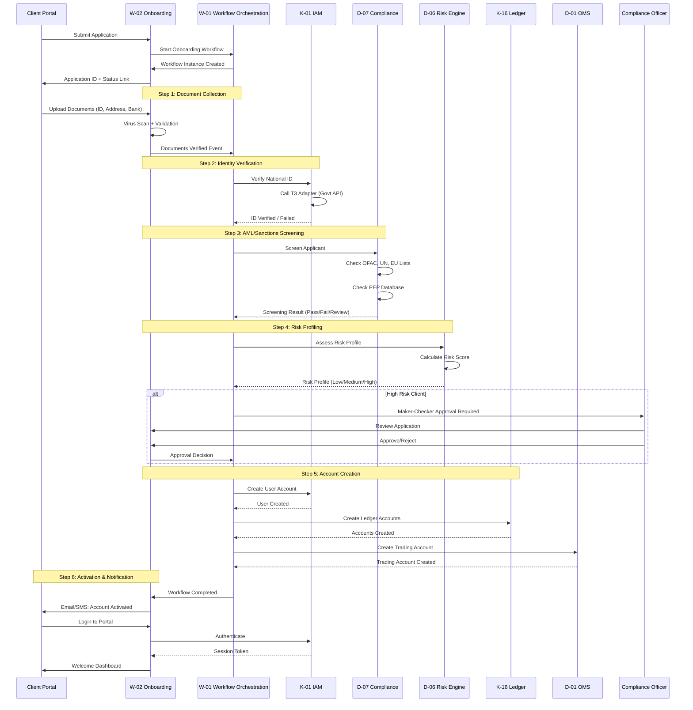

EPIC-ID: EPIC-W-02
EPIC NAME: Client Onboarding & KYC Workflow
LAYER: WORKFLOW
MODULE: W-02 Client Onboarding
VERSION: 1.0.1

---

#### Section 1 — Objective

Deliver the W-02 Client Onboarding & KYC Workflow module, providing an end-to-end orchestrated workflow for onboarding new clients to the platform. This epic addresses the P1 gap identified in the platform review by consolidating scattered client lifecycle logic (currently fragmented across K-01 IAM, D-07 Compliance, D-06 Risk) into a cohesive, auditable workflow. It implements a multi-step process (Application → Document Collection → KYC/AML Verification → Risk Assessment → Account Opening → Trading Activation) with maker-checker controls, regulatory compliance hooks, and client self-service portal integration.

---

#### Section 2 — Scope

- **In-Scope:**
  1. Multi-step onboarding workflow definition (Application → KYC → Risk → Account Opening).
  2. Document collection and verification (National ID, address proof, bank statements).
  3. Integration with National ID verification services (via K-01 extension points).
  4. AML/sanctions screening integration (via D-07 Compliance).
  5. Risk profiling and suitability assessment (via D-06 Risk Engine).
  6. Maker-checker approval gates for high-risk clients.
  7. Client self-service portal for application submission and status tracking.
  8. Account creation in K-16 Ledger and OMS (D-01).
- **Out-of-Scope:**
  1. The actual KYC verification logic (handled by K-01 National ID adapters and D-07 Compliance).
  2. Ongoing client lifecycle management (account maintenance, closure).
- **Dependencies:** EPIC-K-01 (IAM), EPIC-K-02 (Config Engine), EPIC-K-05 (Event Bus), EPIC-K-07 (Audit Framework), EPIC-K-15 (Dual-Calendar), EPIC-K-16 (Ledger Framework), EPIC-D-01 (OMS), EPIC-D-06 (Risk Engine), EPIC-D-07 (Compliance), EPIC-W-01 (Workflow Orchestration)
- **Kernel Readiness Gates:** K-01, K-02, K-05, K-07, K-15, K-16, W-01
- **Module Classification:** Domain Workflow

---

#### Section 3 — Functional Requirements (FR)

1. **FR1 Application Submission:** The module must provide a client-facing form (web/mobile) for submitting onboarding applications with personal details, contact information, and employment details.
2. **FR2 Document Upload:** The module must support secure document upload (National ID, address proof, bank statement, photo) with virus scanning and format validation.
3. **FR3 National ID Verification:** The module must invoke K-01 National ID verification adapters to validate identity documents against government databases (e.g., Nepal National ID system).
4. **FR4 AML/Sanctions Screening:** The module must invoke D-07 Compliance to screen applicants against sanctions lists (OFAC, UN, EU) and PEP databases.
5. **FR5 Risk Profiling:** The module must invoke D-06 Risk Engine to assess client risk profile (investment experience, financial capacity, risk tolerance) and determine account type eligibility.
6. **FR6 Maker-Checker Approval:** For high-risk clients (flagged by AML or risk assessment), the module must require dual approval from compliance and risk officers before proceeding.
7. **FR7 Account Creation:** Upon approval, the module must create user accounts in K-01 IAM, trading accounts in D-01 OMS, and ledger accounts in K-16.
8. **FR8 Client Notification:** The module must send notifications (email/SMS) at each workflow stage (application received, documents verified, account approved, account activated).
9. **FR9 Status Tracking:** The module must provide a client portal for tracking onboarding status in real-time.
10. **FR10 Dual-Calendar Support:** Application dates, approval dates, and account activation dates must use dual-calendar (Gregorian and BS).

---

#### Section 4 — Jurisdiction Isolation Requirements

1. **Generic Core:** The workflow orchestration, document management, and notification framework are jurisdiction-agnostic.
2. **Jurisdiction Plugin:** Specific KYC requirements (e.g., Nepal NRB KYC Directive, required documents, verification methods) are defined in Jurisdiction Config Packs (T1) and Rule Packs (T2).
3. **Resolution Flow:** Config Engine determines which KYC requirements and verification adapters apply based on applicant's jurisdiction.
4. **Hot Reload:** Changes to KYC requirements apply to new applications immediately; in-flight applications continue with original requirements.
5. **Backward Compatibility:** Workflow state schema must support version migration.
6. **Future Jurisdiction:** A new country's onboarding requirements are simply new workflow configuration and rule packs.

---

#### Section 5 — Data Model Impact

- **New Entities:**
  - `OnboardingApplication`: `{ application_id: UUID, applicant_name: String, email: String, phone: String, jurisdiction: String, status: Enum, submitted_at: DualDate, approved_at: DualDate }`
  - `DocumentSubmission`: `{ doc_id: UUID, application_id: UUID, doc_type: Enum, file_path: String, verification_status: Enum, verified_at: DualDate }`
  - `KycVerification`: `{ verification_id: UUID, application_id: UUID, national_id: String, verification_method: String, result: Enum, verified_by: String, verified_at: DualDate }`
  - `RiskAssessment`: `{ assessment_id: UUID, application_id: UUID, risk_score: Decimal, risk_tier: Enum, assessed_by: String, assessed_at: DualDate }`
- **Dual-Calendar Fields:** `submitted_at`, `approved_at`, `verified_at`, `assessed_at` use `DualDate`.
- **Event Schema Changes:** `OnboardingApplicationSubmitted`, `DocumentsVerified`, `KycCompleted`, `RiskAssessmentCompleted`, `AccountActivated`, `OnboardingRejected`.

---

#### Section 6 — Event Model Definition

| Field             | Description                                                                                                         |
| ----------------- | ------------------------------------------------------------------------------------------------------------------- |
| Event Name        | `OnboardingApplicationSubmitted`                                                                                    |
| Schema Version    | `v1.0.0`                                                                                                            |
| Trigger Condition | A prospective client submits an onboarding application.                                                             |
| Payload           | `{ "application_id": "...", "applicant_name": "...", "email": "...", "jurisdiction": "NP", "timestamp_bs": "..." }` |
| Consumers         | Workflow Orchestration (W-01), Compliance (D-07), Audit Framework, Notification Service                             |
| Idempotency Key   | `hash(application_id)`                                                                                              |
| Replay Behavior   | Updates the materialized view of pending applications.                                                              |
| Retention Policy  | Permanent.                                                                                                          |

---

#### Section 7 — Command Model Definition

| Field            | Description                                                                |
| ---------------- | -------------------------------------------------------------------------- |
| Command Name     | `SubmitApplicationCommand`                                                 |
| Schema Version   | `v1.0.0`                                                                   |
| Validation Rules | Application data complete, documents uploaded, requester identity verified |
| Handler          | `OnboardingCommandHandler` in W-02 Client Onboarding                       |
| Success Event    | `OnboardingApplicationSubmitted`                                           |
| Failure Event    | `ApplicationSubmissionFailed`                                              |
| Idempotency      | Command ID must be unique; duplicate commands return original result       |

| Field            | Description                                                          |
| ---------------- | -------------------------------------------------------------------- |
| Command Name     | `UploadDocumentCommand`                                              |
| Schema Version   | `v1.0.0`                                                             |
| Validation Rules | Application exists, document type valid, file scanned for viruses    |
| Handler          | `DocumentCommandHandler` in W-02 Client Onboarding                   |
| Success Event    | `DocumentUploaded`                                                   |
| Failure Event    | `DocumentUploadFailed`                                               |
| Idempotency      | Command ID must be unique; duplicate commands return original result |

| Field            | Description                                                                                 |
| ---------------- | ------------------------------------------------------------------------------------------- |
| Command Name     | `ApproveApplicationCommand`                                                                 |
| Schema Version   | `v1.0.0`                                                                                    |
| Validation Rules | Application complete, KYC passed, risk assessment complete, maker-checker approval obtained |
| Handler          | `ApprovalCommandHandler` in W-02 Client Onboarding                                          |
| Success Event    | `ApplicationApproved`                                                                       |
| Failure Event    | `ApplicationApprovalFailed`                                                                 |
| Idempotency      | Command ID must be unique; duplicate commands return original result                        |

---

#### Section 8 — AI Integration Requirements

- **AI Hook Type:** Document Verification / Fraud Detection
- **Workflow Steps Exposed:** Document authenticity verification, identity matching.
- **Model Registry Usage:** `doc-verification-v1`, `identity-fraud-detector-v1`
- **Explainability Requirement:** AI flags suspicious documents (e.g., tampered National ID, mismatched photo) with confidence score and reasoning. Human reviewer makes final decision.
- **Human Override Path:** Compliance officer can override AI rejection with justification (audited).
- **Drift Monitoring:** False positive/negative rates tracked against manual review outcomes.
- **Fallback Behavior:** Standard manual document review by compliance team.

---

#### Section 9 — NFRs

| NFR Category              | Required Targets                                                                                 |
| ------------------------- | ------------------------------------------------------------------------------------------------ |
| Latency / Throughput      | Application submission < 2 seconds; 1,000 concurrent applications                                |
| Scalability               | Horizontally scalable workflow workers                                                           |
| Availability              | 99.9% uptime (non-critical path)                                                                 |
| Consistency Model         | Strong consistency for application state transitions                                             |
| Security                  | PII encrypted at rest and in transit; document storage in secure vault                           |
| Data Residency            | Applicant data stored per jurisdiction config                                                    |
| Data Retention            | Approved applications retained 10 years; rejected applications 2 years                           |
| Auditability              | Every workflow step logged [LCA-AUDIT-001]                                                       |
| Observability             | Metrics: `onboarding.pending.count`, `onboarding.approval_time.p99`, `onboarding.rejection_rate` |
| Extensibility             | New KYC requirements via T1/T2 packs                                                             |
| Upgrade / Compatibility   | Workflow versioning supported                                                                    |
| On-Prem Constraints       | Fully functional locally                                                                         |
| Ledger Integrity          | Account creation posts to K-16                                                                   |
| Dual-Calendar Correctness | Application dates accurate                                                                       |

---

#### Section 10 — Acceptance Criteria

1. **Given** a prospective client, **When** they submit an onboarding application via the portal, **Then** the system validates the form, uploads documents securely, and emits `OnboardingApplicationSubmitted`.
2. **Given** an application with uploaded National ID, **When** the KYC step executes, **Then** the system invokes the Nepal National ID verification adapter and updates the application status based on the result.
3. **Given** an applicant flagged by AML screening, **When** the compliance review step is reached, **Then** the system creates a human task assigned to a compliance officer and pauses the workflow.
4. **Given** a high-risk applicant requiring dual approval, **When** the first approver completes their review, **Then** the system assigns the task to a second approver and prevents the same person from approving twice.
5. **Given** an approved application, **When** the account creation step executes, **Then** the system creates accounts in K-01 (user), D-01 (trading), and K-16 (ledger) atomically.
6. **Given** an activated account, **When** the workflow completes, **Then** the system sends a welcome email with login credentials and emits `AccountActivated`.
7. **Given** a rejected application, **When** the rejection step executes, **Then** the system notifies the applicant with rejection reason and stores the decision for audit.

---

#### Section 11 — Failure Modes & Resilience

- **National ID Verification Service Down:** Workflow pauses; retries with exponential backoff; if timeout exceeded, escalates to manual verification.
- **Document Upload Failure:** Client can retry upload; partial uploads are cleaned up automatically.
- **Account Creation Partial Failure:** Compensation logic rolls back created accounts; workflow marked as FAILED; manual intervention required.
- **Approval Task Abandoned:** Escalation policy triggers after 48 hours; if no escalation defined, application enters SUSPENDED state.

---

#### Section 12 — Observability & Audit

| Telemetry Type      | Required Details                                                                                    |
| ------------------- | --------------------------------------------------------------------------------------------------- |
| Metrics             | `onboarding.step.duration`, `onboarding.rejection.reasons`, dimensions: `jurisdiction`, `risk_tier` |
| Logs                | Structured: `application_id`, `step`, `status`, `actor`                                             |
| Traces              | Span `Onboarding.executeStep`                                                                       |
| Audit Events        | Action: `SubmitApplication`, `ApproveApplication`, `RejectApplication` [LCA-AUDIT-001]              |
| Regulatory Evidence | KYC verification records for regulatory audits [LCA-AMLKYC-001]                                     |

---

#### Section 13 — Compliance & Regulatory Traceability

- KYC/AML compliance [LCA-AMLKYC-001]
- Maker-checker for high-risk clients [LCA-SOD-001]
- Audit trails for onboarding decisions [LCA-AUDIT-001]
- Data retention for rejected applications [LCA-RET-001]

---

#### Section 14 — Extension Points & Contracts

- **SDK Contract:** `OnboardingClient.submitApplication(data)`, `OnboardingClient.uploadDocument(applicationId, docType, file)`, `OnboardingClient.getApplicationStatus(applicationId)`.
- **Workflow Definition:** Uses W-01 workflow DSL to define onboarding steps.
- **Jurisdiction Plugin Extension Points:** KYC requirements and verification adapters via T1 Config Packs and T3 Adapters.

---

#### Section 15 — Future-Safe Architecture Evaluation

| Question                                                              | Expected Answer                                                                                                       |
| --------------------------------------------------------------------- | --------------------------------------------------------------------------------------------------------------------- |
| Can this module support India/Bangladesh via plugin?                  | Yes, via jurisdiction-specific KYC config and adapters.                                                               |
| Can KYC requirements change without redeploy?                         | Yes, via T1 Config Pack updates.                                                                                      |
| Can this run in an air-gapped deployment?                             | Partially; National ID verification requires external connectivity.                                                   |
| Can the workflow handle multi-day processing?                         | Yes, designed for long-running processes with human tasks.                                                            |
| Can this module handle digital assets (tokenized securities, crypto)? | Yes. Wallet provisioning, token suitability assessment, and DeFi risk disclosure steps are pluggable workflow stages. |
| Is the design ready for CBDC integration or T+0 settlement?           | Yes. Instant account activation and real-time KYC verification flows support same-day onboarding for T+0 markets.     |

---

#### Section 16 — Workflow Sequence Diagram

**Workflow States:**

1. **APPLICATION_SUBMITTED** → Document collection pending
2. **DOCUMENTS_UPLOADED** → Identity verification in progress
3. **IDENTITY_VERIFIED** → AML screening in progress
4. **AML_SCREENING_COMPLETE** → Risk profiling in progress
5. **RISK_ASSESSED** → Approval pending (if high-risk) or account creation
6. **PENDING_APPROVAL** → Awaiting maker-checker approval
7. **APPROVED** → Account creation in progress
8. **ACCOUNTS_CREATED** → Activation in progress
9. **ACTIVATED** → Client can login and trade
10. **REJECTED** → Application denied (at any stage)

**Human Tasks:**

- **Maker-Checker Approval:** Required for high-risk clients (AML flags or high risk score)
- **Document Review:** Manual review if automated verification fails
- **Exception Handling:** Compliance officer intervention for edge cases

---

## Changelog

### Version 1.0.1 (2026-03-10)

**Type:** PATCH  
**Changes:**

- Standardized section numbering to the sequential 16-section format.
- Promoted the workflow sequence diagram into the standard numbered section layout.
- Added changelog metadata for future epic maintenance.
