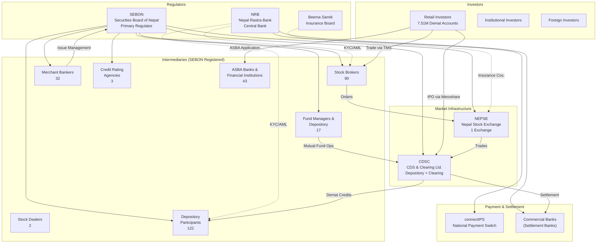
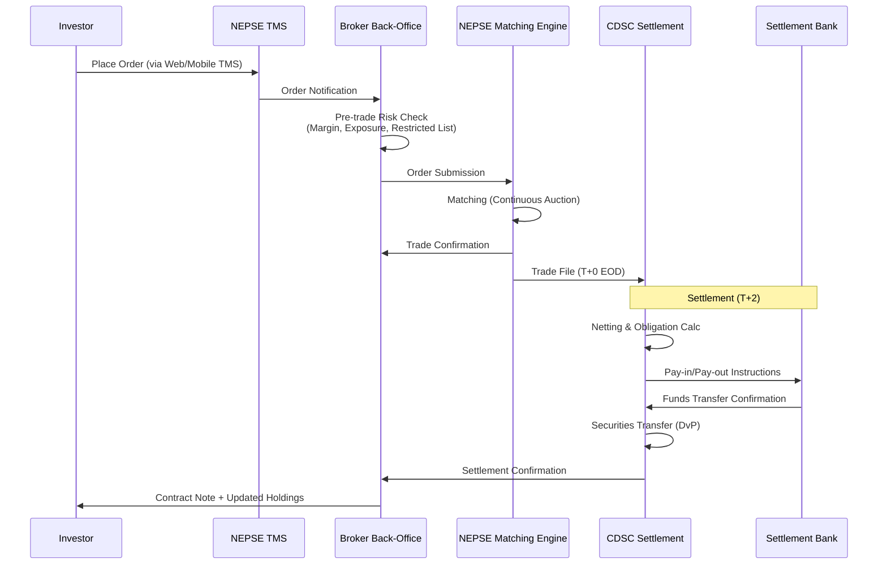
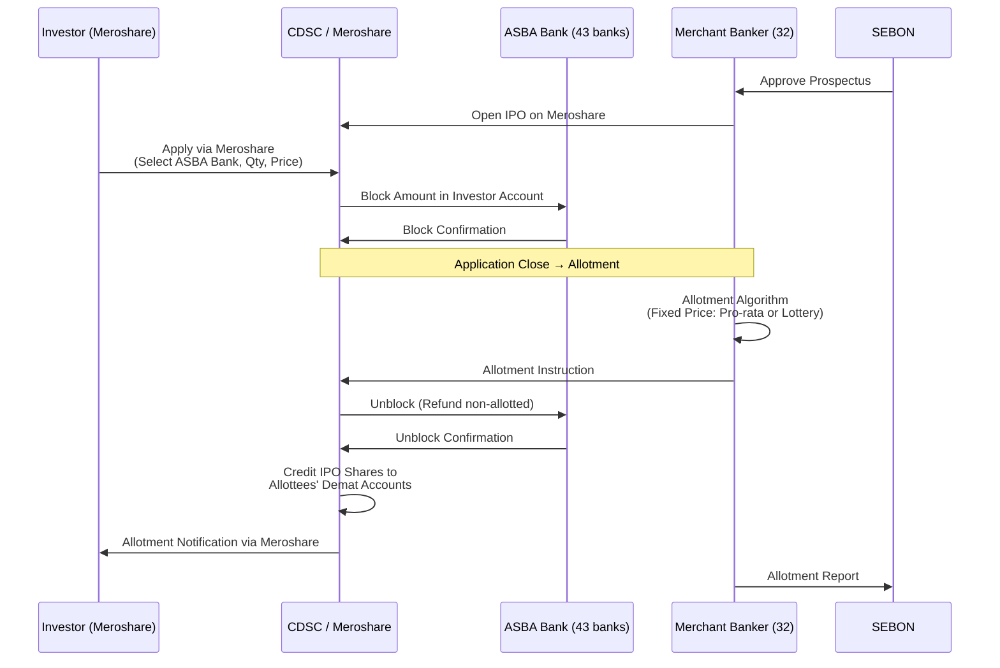

# **Project Siddhanta: An AI-Native Capital Markets Platform for Nepal**

**Strategic Vision, Tactical Blueprint & Technical Reference Document**

Version: 1.0.1 | Status: Strategic & Tactical Reference | Date: March 10, 2026

Shared terminology and policy baseline: [Documentation_Glossary_and_Policy_Appendix.md](../archive/Documentation_Glossary_and_Policy_Appendix.md)
Shared authoritative source register: [Authoritative_Source_Register.md](Authoritative_Source_Register.md)
Reference style for time-sensitive external facts: `ASR-*` IDs from the shared source register.
Legal-claim traceability: [Legal_Claim_Citation_Appendix.md](Legal_Claim_Citation_Appendix.md)
Reference style for legal / regulatory claims: `LCA-*` IDs from the legal appendix.

> **Namespace note — two `LCA-*` identifier families exist and must not be conflated:**
>
> - **Numeric legal-claim IDs** such as `LCA-001` through `LCA-032` reference source-backed legal/regulatory claims maintained in `Legal_Claim_Citation_Appendix.md`. These are the IDs used throughout this document.
> - **Semantic epic/control IDs** such as `LCA-AUDIT-001` or `LCA-AMLKYC-001` are engineering control-registry codes maintained in `epics/COMPLIANCE_CODE_REGISTRY.md`. These are not used in this document.

> **Validation policy (MUST READ):** This document mixes (a) **clause-verified** requirements, (b) **document-verified** baselines, and (c) **planning assumptions / illustrative estimates**.
>
> - Every **numeric** market fact and time-sensitive statement MUST be backed by a primary source and mapped to an `ASR-*` entry in **Authoritative_Source_Register.md**.
> - Every **legal / regulatory** claim MUST be mapped to an `LCA-*` entry in **Legal_Claim_Citation_Appendix.md**.
> - Where a primary source is not yet attached or clause extraction is pending, the claim MUST be tagged **[VERIFY]** and listed in **Appendix A: Source Validation Ledger** with the missing authority needed.
>
> **Implementation stack authority:** For current technology choices, use [../adr/ADR-011_STACK_STANDARDIZATION_AND_GHATANA_PLATFORM_ALIGNMENT.md](../adr/ADR-011_STACK_STANDARDIZATION_AND_GHATANA_PLATFORM_ALIGNMENT.md). This strategy document may discuss broader options, but ADR-011 defines the actual implementation baseline.

---

## **Executive Overview: The Nepalese Imperative**

This document outlines the strategy for **Project Siddhanta** (सिद्धान्त), an AI-native, all-in-one capital markets platform designed explicitly for Nepal. While building upon the global and South Asian analysis in the foundational report, this plan recognizes that Nepal is not a smaller version of India—it is a unique market with distinct regulatory fractures, infrastructure bottlenecks, and a digitally-savvy investor base constrained by legacy systems.

The core thesis is that Nepal's market is at a critical juncture. Recent promoter-share and issuer-structure disputes underline that the current system is struggling to scale. The opportunity is not to merely digitize existing broken processes, but to introduce an **AI-native platform that provides the "source of truth" and automated governance** that regulators and the market desperately need.

**The Strategic Wedge:** In Nepal, the entry point is not competing on trade execution speed, but on **regulatory clarity, automated compliance, and operational integrity.** The platform will position itself as the solution to the "Nepali paradox"—a market with 7,511,020 demat accounts (`Ref: ASR-NEP-CDSC-2026-03-01`), 122 depository participants, and growing adjacent operator categories, but still burdened by manual overrides, fragmented integrations, flagging code failures, and policy paralysis.

### **A Generic Core, Jurisdiction-Specific Plugins**

While this document is Nepal-focused, **Project Siddhanta is not a Nepal-only system**. The long-term vision is a **generic capital-markets core platform** with a plugin-driven specialization layer that adapts to location, regulator, and sector.

The architecture separates:

- **Generic Core (Global Layer)**
  - Event-sourced ledger
  - Order management abstraction
  - Corporate actions engine
  - Reconciliation engine
  - AI services layer (model governance, explainability, RAG, monitoring)
  - Multi-tenant isolation framework
  - Dual-calendar engine (extensible beyond BS/Gregorian)
  - Configurable fee, tax, and entitlement engines
  - Metadata-driven process and value model for runtime workflows, forms, and choice catalogs

- **Jurisdiction Plugins (Localization Layer)**
  - Regulator rule packs (e.g., SEBON, NRB, Beema Samiti)
  - Exchange adapters (e.g., NEPSE feed model)
  - Depository adapters (e.g., CDSC integration contract)
  - Instrument-type extensions (e.g., irredeemable preference shares)
  - Tax computation packs (e.g., Nepal CGT/TDS rules)
  - Language packs (Nepali-first, English secondary)
  - Calendar packs (Bikram Sambat support)

- **Operator Packs (Role-Specific Layer)**
  - Broker pack
  - Merchant banker / RTA pack
  - Fund manager pack
  - Depository participant pack
  - Issuer pack
  - Regulator supervisory pack

This separation ensures that:

1. No core logic is hardcoded to Nepal-specific rules.
2. Country-specific regulatory changes are implemented as plugin upgrades, not system rewrites.
3. Regional expansion (India, Bangladesh, Sri Lanka, Myanmar) becomes a matter of adding new regulator + exchange + tax packs.
4. Multi-country deployment can coexist in a single core platform without regulatory cross-contamination.

Nepal is the **first instantiation**, not the architectural boundary.

### **Core vs Plugin Responsibility Matrix**

The table below defines strict separation of concerns between the Generic Core and all Plugin layers. Engineering teams must treat this as a non-negotiable architectural boundary.

| Capability Domain            | Generic Core Responsibility                                                                       | Jurisdiction Plugin Responsibility                                                 | Operator Pack Responsibility                                          |
| :--------------------------- | :------------------------------------------------------------------------------------------------ | :--------------------------------------------------------------------------------- | :-------------------------------------------------------------------- |
| **Ledger & Accounting**      | Event-sourced double-entry ledger; immutable audit trail; DvP abstraction; multi-currency support | Settlement-cycle configuration (e.g., T+2 vs T+1); regulatory posting rules        | Broker-specific sub-ledger structure; chart-of-accounts customization |
| **Order Management**         | Order lifecycle state machine; risk-check framework; market-agnostic execution abstraction        | Exchange rule pack (tick size, circuit limits, allowed order types)                | Broker exposure limits; internal dealing-desk controls                |
| **Corporate Actions Engine** | Generic entitlement engine; record-date logic; fractional handling; tax hook framework            | Jurisdiction-specific CA rules (bonus %, rights mechanics, lock-in interpretation) | Issuer workflow configuration; approval routing; RTA process details  |
| **Compliance Framework**     | Policy engine; rule evaluation engine; explainability framework; audit logging                    | Regulator rule packs (SEBON, NRB, etc.); sector lock-in rules; reporting schemas   | Internal compliance dashboards; remediation workflow                  |
| **Tax Engine**               | Pluggable tax-calculation framework; transaction tagging; withholding hooks                       | Country-specific tax rates, CGT logic, TDS rules, reporting formats                | Entity-specific overrides where permitted                             |
| **Calendar & Time**          | Dual-calendar engine; timezone abstraction; fiscal-period framework                               | Local holiday calendar; BS ↔ Gregorian conversion rules                            | Reporting schedule configuration per operator                         |
| **Identity & KYC**           | Identity abstraction; document-verification framework; consent logging                            | National-ID integration adapters; regulator KYC schema                             | Operator onboarding workflow; internal risk scoring overlays          |
| **Integration Layer**        | Stable internal service contracts; adapter SDK; retry & idempotency framework                     | Exchange/depository/payment adapters (NEPSE, CDSC, ASBA, etc.)                     | Tenant credential management; integration enablement flags            |
| **AI Services Layer**        | Model registry; RAG framework; monitoring; explainability; bounded-autonomy controls              | Regulator-aligned AI governance thresholds; jurisdiction-specific AI restrictions  | Operator autonomy-level configuration; risk-acceptance thresholds     |
| **Reporting & Templates**    | Report-generation engine; templating system; export formats (PDF/CSV/XBRL)                        | Regulator-mandated report schemas and periodicity                                  | Branding; internal MIS customization                                  |
| **Multi-Tenancy**            | Tenant isolation model; namespace segregation; data boundary enforcement                          | Jurisdiction-level namespace scoping                                               | Per-operator configuration; resource-tier selection                   |

**Engineering enforcement rules:**

1. Core services must not import jurisdiction-specific constants directly.
2. All regulator thresholds (e.g., margin %, capital requirements, disclosure timelines) must be defined in rule-pack configuration.
3. Exchange-specific behavior must be implemented only inside adapters or exchange-rule packs.
4. Unit tests for core modules must pass without loading any Nepal-specific plugin.
5. A new-country rollout must be achievable by adding new rule packs + adapters without modifying core domain logic.
6. Runtime process steps, human-task form schemas, and operator-facing option lists must be sourced from versioned metadata catalogs, not embedded in frontend or orchestration code.

Any violation of these rules is an architectural regression.

### **Why AI-Native is Essential for Nepal**

Nepal's capital market infrastructure is wrestling with challenges that are perfectly suited for an AI-first approach. The failure of the "flagging code" system to prevent illegal trading of locked shares is a foundational problem that rule-based systems cannot solve.

- **From Flagging to Intelligence:** Instead of a static flag, an AI-native ledger can enforce policy-driven lock-in controls. The system does not just mark a share; it models the legal and temporal rules governing it. Clear rule breaches can be blocked by deterministic controls, while ambiguous cases are routed to human review with a tamper-evident audit trail for regulators like SEBON and CDSC.
- **The "Dual ISIN" Dilemma:** The current debate—whether to use one ISIN or two—is a symptom of a deeper data integrity issue. An AI-native platform with a robust knowledge graph can manage this complexity dynamically. It can support a single ISIN with rich attributes or a dual-ISIN model if regulators require it, reducing operational friction without pre-judging the final policy outcome.
- **Automated Regulatory Reporting:** With SEBON and NRB issuing new directives on margin trading and KYC, the reporting burden on 90 brokers, 122 DPs, and 32 merchant bankers will increase materially. An AI copilot can pre-populate, validate, and reconcile draft reports from the platform's source data, while final submissions remain subject to human approval.
- **Corporate Actions Automation:** Bonus shares, rights issues, and dividend distributions are among the highest-volume but most error-prone operations in Nepal. AI-native processing can automate straight-through entitlement calculation and reconciliation for standard cases, while routing exceptions and edge cases for operational review.
- **IPO Allotment Intelligence:** With 43 ASBA-service banks and millions of applications per IPO, the allotment process is a recurring bottleneck. AI can optimize allotment algorithms, detect duplicate applications, and automate the ASBA unblocking process across the banking network.

### **The National AI Conversation Has Begun**

A reported January 29, 2026 `Capital Market in AI Era` interaction involving NEPSE leadership remains a policy-signal assumption pending primary-source confirmation (`Ref: ASR-NEP-NEPSE-AI-2026-01-29-ASSUMPTION`). Separately, NRB published **AI Guidelines (December 2025)** for banks and financial institutions, providing a governance baseline Siddhanta can align to while still requiring conservative rollout of high-impact AI use cases (`Ref: ASR-NEP-NRB-AI-2025-12`; `Ref: LCA-001`; `Ref: LCA-002`).

---

## **1. The Nepalese Market Landscape: A Complete Picture**

### **1.1. Market Ecosystem Map**

Nepal's capital market ecosystem is compact but interconnected. Understanding the full picture is essential for platform design.



### **1.2. Market Infrastructure Scale (Current Snapshot; Revalidate Before Go-Live)**

| Indicator                                | Value                                                                                               | Reference ID                   |
| :--------------------------------------- | :-------------------------------------------------------------------------------------------------- | :----------------------------- |
| **Demat Accounts**                       | 7,511,020                                                                                           | `ASR-NEP-CDSC-2026-03-01`      |
| **Registered Meroshare Users**           | 6,586,798                                                                                           | `ASR-NEP-CDSC-2026-03-01`      |
| **Listed Companies**                     | 270+                                                                                                | `ASR-NEP-MKT-ILL-2025`         |
| **Stock Brokers**                        | 90                                                                                                  | `ASR-NEP-SEBON-2026-03-01`     |
| **Stock Dealers**                        | 2                                                                                                   | `ASR-NEP-SEBON-2026-03-01`     |
| **Merchant Bankers**                     | 32                                                                                                  | `ASR-NEP-SEBON-2026-03-01`     |
| **Fund Manager and Depository**          | 17 (category label; not 17 standalone fund managers)                                                | `ASR-NEP-SEBON-2026-03-01`     |
| **Depository Participants**              | 122                                                                                                 | `ASR-NEP-SEBON-2026-03-01`     |
| **Credit Rating Agencies**               | 3                                                                                                   | `ASR-NEP-SEBON-2026-03-01`     |
| **ASBA Service Banks & FIs**             | 43                                                                                                  | `ASR-NEP-SEBON-2026-03-01`     |
| **Mutual Funds**                         | 24                                                                                                  | `ASR-NEP-SEBON-2026-03-01`     |
| **Specialized Investment Fund Managers** | 19                                                                                                  | `ASR-NEP-SEBON-2026-03-01`     |
| **RTA Entries**                          | 46                                                                                                  | `ASR-NEP-CDSC-2026-03-01`      |
| **Market Capitalization**                | ~Rs 4,657 billion (~$34 bn USD)                                                                     | `ASR-NEP-MKT-ILL-2025`         |
| **Monthly Turnover (Jan 2026)**          | 346 million shares                                                                                  | `ASR-NEP-TURNOVER-ILL-2026-01` |
| **Daily Turnover (Peak)**                | Rs 16.35 billion (Jan 26, 2026)                                                                     | `ASR-NEP-TURNOVER-ILL-2026-01` |
| **Settlement Cycle**                     | Current operating convention: T+2; parameterize for future rule changes                             | `ASR-NEP-NEPSE-OPS-ASSUMPTION` |
| **Trading Hours**                        | Representative live-market window only; confirm the latest NEPSE operating notice before go-live    | `ASR-NEP-NEPSE-OPS-ASSUMPTION` |
| **Circuit Breaker**                      | Representative price-band and halt controls; verify the latest NEPSE circular before implementation | `ASR-NEP-NEPSE-OPS-ASSUMPTION` |
| **Fiscal Year**                          | Shrawan–Ashadh (Bikram Sambat)                                                                      | `ASR-NEP-FY-STATUTORY`         |

#### Primary-source anchors (verified)

- **CDSC platform counters (Demat accounts, Meroshare users, DPs, C‑ASBA, RTA entries)**: CDSC official homepage counters (Primary: https://cdsc.com.np/). Mapped in `Authoritative_Source_Register.md` as `ASR-NEP-CDSC-2026-03-01`.
- **SEBON intermediary counts (brokers, dealers, merchant bankers, fund manager & depository category, DPs, credit rating agencies, ASBA institutions, mutual funds, specialized investment fund managers)**: SEBON official intermediaries listing (Primary: https://www.sebon.gov.np/intermediaries). Mapped as `ASR-NEP-SEBON-2026-03-01`.

> Note: Rows that cite `ASR-NEP-MKT-ILL-2025` or `ASR-NEP-TURNOVER-ILL-2026-01` are **illustrative benchmarks** and must not be marketed as live metrics without a current NEPSE primary publication.

### **1.3. NEPSE Trading Rules & Market Microstructure**

The parameters below are representative design assumptions and should be revalidated against the latest NEPSE circulars and operating notices before implementation.

| Parameter              | Detail                                                                                                                                                                                                                                                 |
| :--------------------- | :----------------------------------------------------------------------------------------------------------------------------------------------------------------------------------------------------------------------------------------------------- |
| **Trading days**       | Sunday–Thursday (Nepal's work week)                                                                                                                                                                                                                    |
| **Pre-open session**   | Representative call-auction window; confirm the latest NEPSE notice before implementation                                                                                                                                                              |
| **Continuous trading** | Representative main session; confirm the latest NEPSE notice before implementation                                                                                                                                                                     |
| **Order types**        | Market order, Limit order                                                                                                                                                                                                                              |
| **Lot size**           | Minimum 10 units (kitta)                                                                                                                                                                                                                               |
| **Block trades**       | Separate block trading window for large transactions                                                                                                                                                                                                   |
| **Circuit breaker**    | ±10% daily price band (automatic); ±5% triggers trading halt for review                                                                                                                                                                                |
| **Tick size**          | Re 1 (NPR)                                                                                                                                                                                                                                             |
| **Settlement**         | T+2 rolling settlement with DvP (Delivery vs. Payment)                                                                                                                                                                                                 |
| **Short selling**      | Not permitted currently                                                                                                                                                                                                                                |
| **Sub-indices**        | NEPSE Index (composite), Sensitive Index, Float Index, Sensitive Float Index, plus sector sub-indices (Banking, Hotels, Hydropower, Development Banks, Finance, Insurance, Manufacturing, Microfinance, Mutual Funds, Life Insurance, Others, Trading) |
| **Floorsheet**         | Published daily by NEPSE—official record of all executed trades                                                                                                                                                                                        |

### **1.4. Market Sector Composition**

Nepal's listed companies span sectors with distinct regulatory oversight.
This table is a planning-level sector map, not a clause-mapped legal matrix; use operator-pack-specific legal anchors where available and revalidate sector rules before externalizing any requirement claim.

| Sector                | Sub-sector examples    | Listings (approx.) | Sector Regulator  | Platform implications                                          |
| :-------------------- | :--------------------- | :----------------- | :---------------- | :------------------------------------------------------------- |
| **Commercial Banks**  | A-class banks          | ~25                | NRB               | NRB capital adequacy, directed sector lending, promoter limits |
| **Development Banks** | B-class banks          | ~15                | NRB               | NRB prudential norms                                           |
| **Finance Companies** | C-class FIs            | ~15                | NRB               | NRB deposit/lending limits                                     |
| **Microfinance**      | D-class institutions   | ~50+               | NRB               | NRB microfinance directives                                    |
| **Insurance**         | Life + Non-life        | ~35                | Beema Samiti      | Solvency margin, investment limits                             |
| **Hydropower**        | Generation companies   | ~40+               | NEA/DoED          | PPA status, tariff risk, seasonal production                   |
| **Manufacturing**     | Cement, steel, food    | ~15                | Industry Ministry | Standard corporate rules                                       |
| **Hotels & Tourism**  | Hotels, airlines       | ~5                 | Tourism Ministry  | Sector-specific incentives                                     |
| **Mutual Funds**      | Open-end + closed-end  | ~30 schemes        | SEBON             | NAV, redemption, distribution rules                            |
| **Debentures**        | Subordinated, plain    | Various            | SEBON/NRB         | Interest rate, maturity, conversion terms                      |
| **Others**            | Trading, telecom, etc. | ~20                | Various           | Standard rules                                                 |

### **1.5. The Market Fracture: Opportunity in Disruption**

The ongoing regulatory dispute over dual ISINs is one of the most important near-term market signals for a new platform.

**The Problem:**

- The current system's inability to prevent trading of locked promoter shares has eroded trust. Retail investor groups report "illegal trading" and market manipulation due to the failure of the electronic flagging code.
- This has led to a radical proposal from CDSC to enforce dual ISINs for all sectors, which has, in turn, frozen the listing of new companies and locked up billions in promoter capital.
- The freezing directly affects an active primary-market pipeline, with multiple prospectus-stage issuances visible in recent SEBON disclosures and market reporting. Revalidate any named issuer list before using it externally.

**The Platform Solution:**
Project Siddhanta can offer an alternative: a **"Regulatory Clarity Layer."** By providing an immutable, event-sourced ledger of share ownership with built-in compliance rules and regulator-visible auditability, the platform can give SEBON and CDSC better real-time visibility. The objective is not to force a single-ISIN outcome, but to support either a single-ISIN-with-attributes or dual-ISIN regime with minimal redesign and clearer controls.

### **1.6. Current Technology Landscape (What Siddhanta Replaces)**

Understanding the current state highlights the value gap:

| System                                    | Current state                                                                                                             | Pain points                                                                                    |
| :---------------------------------------- | :------------------------------------------------------------------------------------------------------------------------ | :--------------------------------------------------------------------------------------------- |
| **NEPSE TMS (Trading Management System)** | Centrally provided by NEPSE to all brokers. Web-based trading interface.                                                  | Limited customization, periodic outages during high-volume days, no broker-level analytics     |
| **CDSC CDS (Central Depository System)**  | Core depository and settlement engine                                                                                     | Flagging code failures, dual-ISIN deadlock, limited API access for brokers                     |
| **Meroshare**                             | Investor portal for IPO applications, portfolio view, EDIS                                                                | Operates as standalone—poor integration with broker back-offices, manual reconciliation needed |
| **Broker Back-Office**                    | Mix of manual Excel spreadsheets, legacy NOTS-era software, and ad-hoc solutions                                          | No STP, manual reconciliation against CDSC/NEPSE, error-prone reporting                        |
| **ASBA Processing**                       | Bank-side block/unblock of funds during IPO/rights                                                                        | Manual processing at many banks, delays in unblocking, reconciliation gaps                     |
| **Regulatory Reporting**                  | Manual assembly of Board-facing quarterly/annual reports by brokers and issuers, often using evolving regulator templates | Time-consuming, error-prone, no real-time visibility for SEBON                                 |

### **1.7. Addressable Market for Nepal (Illustrative TAM/SAM/SOM)**

| Segment                             | Entity count | Avg. platform spend assumption (NPR/yr) | TAM estimate (NPR/yr)                      |
| :---------------------------------- | :----------- | :-------------------------------------- | :----------------------------------------- |
| Stock Brokers                       | 90           | Rs 10–50 lakhs                          | Rs 9–45 crore                              |
| Depository Participants             | 122          | Rs 5–25 lakhs                           | Rs 6.1–30.5 crore                          |
| Merchant Bankers                    | 32           | Rs 8–40 lakhs                           | Rs 2.6–12.8 crore                          |
| Fund Managers                       | 17           | Rs 10–50 lakhs                          | Rs 1.7–8.5 crore                           |
| ASBA Banks & FIs                    | 43           | Rs 3–15 lakhs                           | Rs 1.3–6.5 crore                           |
| Credit Rating Agencies              | 3            | Rs 5–20 lakhs                           | Rs 0.15–0.6 crore                          |
| Market Infrastructure (NEPSE, CDSC) | 2            | Rs 1–10 crore                           | Rs 2–20 crore                              |
| Listed Companies (issuer tools)     | 270+         | Rs 1–5 lakhs                            | Rs 2.7–13.5 crore                          |
| **Total TAM**                       | **~580**     |                                         | **Rs 25.5–137.4 crore** (~$1.9M–$10.3M/yr) |
| **SAM (reachable, ~60%)**           |              |                                         | **Rs 15–82 crore** (~$1.1M–$6.2M/yr)       |
| **SOM (3-yr capture, ~20% SAM)**    |              |                                         | **Rs 3–16 crore** (~$225K–$1.2M/yr)        |

_Note: These are directional planning estimates, not a validated operating forecast. They exclude adjacent product opportunities such as specialized investment fund managers and registrar/RTA functions, both of which should be included in later commercialization models. Nepal's direct revenue potential is modest, but it remains a viable lighthouse market for regional expansion._

---

## **2. Regulatory Architecture for Nepal**

The regulatory landscape in Nepal is rapidly evolving. A platform must be built to adapt to these changes natively.

### **2.1. Primary Regulators & Mandates**

| Regulator                             | Jurisdiction                 | Capital market scope                                                                                  | Key recent actions                                                                                                                                                                                                                       |
| :------------------------------------ | :--------------------------- | :---------------------------------------------------------------------------------------------------- | :--------------------------------------------------------------------------------------------------------------------------------------------------------------------------------------------------------------------------------------- |
| **SEBON** (Securities Board of Nepal) | Primary securities regulator | Broker licensing, issuer regulation, market conduct, investor protection                              | Margin Trading Directive 2082; Securities Issuance & Allotment (9th Amendment) Directive 2082; Securities Broker/Dealer (6th Amendment) Regulations 2082; Irredeemable Preference Share issuance framework; Dual ISIN resolution process |
| **NRB** (Nepal Rastra Bank)           | Central bank                 | KYC/AML/CFT rules for FIs; bank capital adequacy; promoter share rules for banks/FIs; payment systems | AI Guidelines (December 2025); Centralized KYC / eKYC coordination with National ID authorities; Cyber Resilience Guidelines 2023; evolving cybersecurity roadmap work in 2026                                                           |
| **Beema Samiti** (Insurance Board)    | Insurance sector             | Investment limits for insurance companies; solvency margins; promoter share rules for insurers        | Separate promoter lock-in and transfer rules                                                                                                                                                                                             |
| **CDSC**                              | Depository & clearing        | Demat account management, settlement, corporate actions processing, participant management            | Pushing dual ISIN proposal; API development; Meroshare enhancements                                                                                                                                                                      |
| **NEPSE**                             | Stock exchange               | Trading rules, listing rules, circuit breakers, market surveillance, member (broker) regulation       | Policy-signal confirmation pending for reported Jan 29, 2026 AI interaction (`Ref: ASR-NEP-NEPSE-AI-2026-01-29-ASSUMPTION`); TMS management; floorsheet publication                                                                      |

### **2.2. Nepal's Multi-Regulator Promoter Share Problem**

This is the **defining regulatory challenge** that Siddhanta must solve. Unlike simpler markets, Nepal's promoter share lock-in rules vary by **sector regulator**.
The table below is an implementation-shaping baseline, not a clause-verified legal digest; exact transfer and conversion rules must be revalidated per issuer category before production use:

| Sector                    | Regulator       | Lock-in period (typical)                            | Transfer rules                                  | Conversion rules                   |
| :------------------------ | :-------------- | :-------------------------------------------------- | :---------------------------------------------- | :--------------------------------- |
| Commercial Banks          | NRB             | 3 years from listing + ongoing holding requirements | NRB approval required for any promoter transfer | Board retention requirements apply |
| Development Banks/Finance | NRB             | 3 years; pledging restricted                        | NRB clearance mandatory                         | Similar to commercial banks        |
| Insurance Companies       | Beema Samiti    | Company Articles + Board rules                      | Beema Samiti approval may be required           | Sector-specific                    |
| Hydropower & Others       | SEBON (general) | Per Companies Act + SEBON directives                | SEBON/CDSC approval via flagging system         | Standard conversion after lock-in  |

**Why this matters for the platform:** A simple "flagged/unflagged" boolean is insufficient. The platform must maintain a rich attribute set per share batch: `{issuer_sector, regulator, lock_in_start_date, lock_in_end_date, transfer_approval_required_from, pledge_allowed, conversion_eligible_date, sector_specific_rules_ref}`. This is a **knowledge graph problem**, not a simple database column problem.

### **2.3. Key Regulatory Signals & Platform Implications**

| Regulatory signal                                                              | Implication for platform                                                                                                                                                                                                                                                                                             | AI-native capability                                                                                                                                                                                                                                                                              |
| :----------------------------------------------------------------------------- | :------------------------------------------------------------------------------------------------------------------------------------------------------------------------------------------------------------------------------------------------------------------------------------------------------------------- | :------------------------------------------------------------------------------------------------------------------------------------------------------------------------------------------------------------------------------------------------------------------------------------------------ |
| **NRB's Centralized KYC / eKYC with National ID**                              | The platform should treat National ID integration as a strategic identity anchor, but rollout depends on regulatory approvals, access rights, and production interface readiness.                                                                                                                                    | **AI-assisted onboarding:** IDP can extract and verify document data, pre-fill KYC flows, and reduce manual effort once approved eKYC rails are available.                                                                                                                                        |
| **NRB AI Guidelines (December 2025)**                                          | Requires transparency, fairness, governance, and board oversight for AI in regulated financial workflows. Primary: https://www.nrb.org.np/contents/uploads/2025/12/AI-Guidelines.pdf                                                                                                                                 | **Model governance & explainability:** Full model registry, bias monitoring, bounded autonomy, and explainability reports for every AI-assisted decision.                                                                                                                                         |
| **NRB Cyber Resilience Guidelines (2023) & Cybersecurity roadmap work (2026)** | Requires strong cybersecurity controls, resilience, MFA, encryption, and disciplined incident handling.                                                                                                                                                                                                              | **Zero-trust, resilient infrastructure:** Kubernetes + service mesh can support zero-trust controls. AI-assisted observability can support detection and triage, but remediation and incident response and notification should follow approved operational playbooks and regulator/CERT guidance. |
| **SEBON Margin Trading Directive 2082**                                        | Margin-service providers must meet the Rule 4 eligibility threshold; Rule 6 sets a 30% minimum initial margin and 20% minimum maintenance margin; Rule 7 permits margin calls and sale after default (`Ref: LCA-011`). Primary: https://www.sebon.gov.np/uploads/shares/yb8vXWjXg3rmDIiW2nwQ5fpxrQx2dkueLT4M2zTL.pdf | **AI-powered risk & margin engine:** Automates margin calls, dynamically calculates eligibility based on the operative SEBON rules, and provides regulators with a real-time view of margin exposures.                                                                                            |
| **Securities Issuance & Allotment (9th Amendment) Directive 2082**             | Updated rules for IPO/FPO/rights issuance and allotment processes.                                                                                                                                                                                                                                                   | **Intelligent issuance workflow:** End-to-end digitized issuance pipeline with AI-validated prospectus checking against the operative filing pack baseline and post-issue close reporting aligned to the current 7-day Board-notification clock (`Ref: LCA-025`, `Ref: LCA-026`).                 |
| **Dual ISIN / Single ISIN Debate**                                             | Platform data model must be flexible enough to support either outcome with bounded redesign.                                                                                                                                                                                                                         | **Attribute-based control (ABC):** Rules enforced using rich attribute sets per security, not only ISIN-based flags. This reduces rework, but a final regulator-mandated model may still require reference-data and integration changes.                                                          |
| **FATF Mutual Evaluation & AML/CFT**                                           | Nepal is under FATF monitoring; AML/CFT compliance is critical for all intermediaries.                                                                                                                                                                                                                               | **AI-powered AML/CFT:** Real-time transaction monitoring, entity resolution across demat accounts, sanctions screening against Nepal government and UN consolidated lists.                                                                                                                        |
| **Securities Broker/Dealer (6th Amendment) Regulations 2082**                  | Defines broker categories, capital tiers, and the permitted-function model for standard vs full-service brokers; full-service brokers may add investment-management and advisory functions with Board approval (`Ref: LCA-019`, `Ref: LCA-020`).                                                                     | **Broker Operations Copilot:** Check broker configuration against the active license class and permitted-function model; generate compliance gap reports; track remediation timelines.                                                                                                            |
| **Irredeemable Preference Share Framework**                                    | SEBON has approved irredeemable preference share issuance — a new instrument type requiring distinct handling.                                                                                                                                                                                                       | **Instrument Master extensibility:** Platform data model must accommodate new instrument types (preference shares, convertible debentures, structured products) via configurable instrument attributes, not code changes.                                                                         |

### **2.4. Bikram Sambat Calendar and Fiscal Year**

Nepal operates on the **Bikram Sambat (BS) calendar** (currently BS 2082). This has pervasive implications:

- **Fiscal year**: Shrawan 1 to Ashadh end (mid-July to mid-July in Gregorian).
- **All regulatory reporting periods** (quarterly, half-yearly, annual) follow BS quarters.
- **NEPSE trading calendar** follows Nepal government holidays (Dashain, Tihar, Chhath, etc.), not international holiday calendars.
- **Interest calculations, dividend record dates, lock-in periods** may be expressed in BS dates.

**Platform requirement:** The platform must natively support dual-calendar operations (BS and Gregorian), with all regulatory reporting in BS dates, while maintaining Gregorian timestamps for international interoperability and event sourcing. A reliable BS↔Gregorian conversion service is a **core infrastructure dependency**, not a nice-to-have.

---

## **3. Nepal Capital Market Operations: End-to-End Workflows**

This section details the operational workflows that Siddhanta must support—the actual day-to-day operations that brokers, DPs, issuers, and investors perform.

### **3.1. Secondary Market Trading Workflow (NEPSE)**



**Key platform touchpoints:**

- **Pre-trade risk checks**: margin availability, exposure limits, promoter lock-in verification, circuit breaker awareness.
- **Trade capture**: real-time capture from TMS/NEPSE feed; automated reconciliation against NEPSE floorsheet.
- **Settlement processing**: T+2 obligation calculation, pay-in/pay-out instructions, securities debit/credit, exception handling for short deliveries.
- **Client servicing**: contract note generation (Nepali + English), holding statements, portfolio valuation.

### **3.2. IPO/FPO Application & Allotment Workflow**

Nepal's IPO system is unique: it runs through **Meroshare + ASBA** (Application Supported by Blocked Amount).



**Key platform capabilities needed:**

- **IPO workflow orchestration**: manage the entire lifecycle from prospectus / offer-document filing through approval to listing, including post-issue close reporting within the current 7-day Board-notification window (`Ref: LCA-025`, `Ref: LCA-026`).
- **ASBA integration**: support multiple bank integration modes (API where available, secure file/batch where not), with a target of covering all 43 C-ASBA institutions.
- **Duplicate detection**: AI-powered detection of multiple applications from same PAN/National ID across different ASBA banks.
- **Allotment optimization**: transparent, auditable allotment algorithm execution.
- **Merchant banker dashboard**: real-time view of application pipeline, demand analysis, and allotment status.

### **3.3. Corporate Actions Processing**

Corporate actions are among the highest-volume operations in Nepal. Key types:

| Corporate action        | Frequency                                               | Current process                                                                            | AI-native improvement                                                                                                           |
| :---------------------- | :------------------------------------------------------ | :----------------------------------------------------------------------------------------- | :------------------------------------------------------------------------------------------------------------------------------ |
| **Bonus shares**        | Very common (banks, FIs issue annual bonuses of 5–30%+) | Issuer announces → CDSC processes book closure → manual entitlement calc → credit to demat | AI calculates entitlements and reconciles straight-through cases; exceptions go to an approval queue before posting             |
| **Rights shares**       | Common                                                  | Issuer announces → shareholders apply via Meroshare/ASBA → allotment → listing             | End-to-end digitized rights workflow with ASBA integration and automated allotment                                              |
| **Cash dividends**      | Every AGM season (bank dividends are large)             | Board declares → record date → TDS deduction → payment via bank account                    | Automated TDS calculation and payment preparation for standard cases, with exception controls and approval steps for edge cases |
| **Stock dividends**     | Often combined with bonus                               | Combined with bonus processing                                                             | Unified entitlement engine handles bonus + stock dividend together                                                              |
| **Auction shares**      | Periodic (unclaimed fractions, unsubscribed rights)     | NEPSE conducts auction                                                                     | Auction workflow with minimum price rules and automated allocation                                                              |
| **Mergers & demergers** | Increasing (including NRB-driven bank consolidation)    | Complex share swap ratios, new ISIN assignment                                             | AI-assisted swap ratio application, automated portfolio rebalancing, new instrument master creation                             |

### **3.4. EDIS (Electronic Delivery Instruction Slip) Workflow**

For selling securities, investors must authorize the transfer from their demat account. Nepal uses EDIS:

1. Investor places sell order via broker TMS.
2. Investor (or broker, if authorized) submits EDIS via Meroshare—authorizing the securities transfer.
3. On settlement date, CDSC debits securities from investor's demat account based on EDIS.
4. If EDIS is missing, the sell trade fails on settlement → short delivery → penalty.

**Platform requirement:** EDIS initiation, reminder, and status orchestration should be integrated with the OMS. When a sell order is placed, the system should auto-initiate the EDIS workflow where permitted, while final investor authorization continues to follow CDSC/Meroshare control requirements.

### **3.5. Mutual Fund Operations**

With the current SEBON category of 17 "Fund Manager and Depository" entities, 24 mutual fund schemes, and 19 specialized investment fund managers:

| Operation                    | Description                                                                        | Platform capability                                                             |
| :--------------------------- | :--------------------------------------------------------------------------------- | :------------------------------------------------------------------------------ |
| **NAV calculation**          | Daily NAV for open-end funds; periodic for closed-end                              | Automated NAV engine with pricing feed from NEPSE, multi-source price hierarchy |
| **Unit purchase/redemption** | Via distributors or direct                                                         | Digital subscription/redemption workflow, ASBA integration for purchase         |
| **SIP/SWP**                  | Systematic investment/withdrawal plans                                             | Automated recurring instruction engine                                          |
| **Distribution**             | Dividend distribution to unit holders                                              | Automated entitlement calculation, TDS deduction, payment processing            |
| **Reporting**                | Board-facing fund reports and factsheets; live templates revalidated before filing | AI-generated fund factsheets and regulatory reports                             |

### **3.6. Tax Framework**

| Tax type                                           | Rate                                                                    | Applicability                                                   | Platform handling                                                                                                              |
| :------------------------------------------------- | :---------------------------------------------------------------------- | :-------------------------------------------------------------- | :----------------------------------------------------------------------------------------------------------------------------- |
| **Capital gains tax (listed securities)**          | 5% (held >1 year) / 7.5% (held <1 year) _(provisional; `Ref: LCA-029`)_ | On realized gains from secondary market sales                   | Auto-calculated at trade level; broker deducts TDS; reports for annual filing                                                  |
| **Capital gains tax (unlisted/promoter transfer)** | 10% _(provisional; `Ref: LCA-030`)_                                     | On transfer of unlisted shares                                  | Different rate engine for OTC/promoter transfers                                                                               |
| **TDS on cash dividends**                          | 5% _(provisional; `Ref: LCA-031`)_                                      | Deducted by issuer/RTA at distribution                          | Auto-calculated during corporate actions processing                                                                            |
| **TDS on interest (debentures)**                   | 5–15% (varies) _(provisional; `Ref: LCA-032`)_                          | Deducted by issuer                                              | Bond interest payment workflow includes TDS                                                                                    |
| **Broker commission**                              | 0.27–0.40% (varies by slab; minimum Rs 10)                              | Charged by broker as a brokerage service charge on trade value  | Commission engine uses the current Schedule 14 slab logic; keep it configurable and revalidate before go-live (`Ref: LCA-023`) |
| **SEBON regulatory levy**                          | 0.6% of total brokerage service charge collected                        | Broker remits the levy to SEBON after fiscal-year close         | Accrual and year-end remittance support (`Ref: LCA-023`)                                                                       |
| **Securities market transaction fee**              | 0.015% of share-trade value                                             | Charged on each share transaction and routed through settlement | Auto-calculated in settlement and fee ledgers (`Ref: LCA-023`)                                                                 |

---

## **4. An AI-Native Platform for Nepal: Technical Blueprint**

This section adapts the global architecture to Nepal's specific constraints and opportunities.

### **4.1. Core Architectural Principles for Nepal**

0. **Generic-first, localization-second:** The core domain model must remain regulator-agnostic. Nepal-specific requirements (margin %, lock-in logic, reporting formats, contract-note timing, fee slabs, BS calendar handling) must be implemented as configuration, rule packs, or plugins — never as hardcoded conditionals in core services.

1. **Mobile-first, offline-capable:** With high mobile-wallet and mobile-banking adoption across Nepal, the platform's client interfaces must be mobile-first. Given internet reliability constraints outside Kathmandu valley, the architecture should support offline capabilities for field agents (e.g., for collecting physical KYC in rural areas) that sync upon reconnection.

2. **National ID as the root of trust:** The identity layer should be designed to anchor to Nepal's National ID where approved and technically available, while supporting fallback KYC evidence paths where the national-ID rail is not yet production-ready (`Ref: LCA-003`).

3. **Dual-calendar native:** BS (Bikram Sambat) and Gregorian date systems must be supported at the data layer, not as a presentation-layer conversion. Regulatory reports, fiscal periods, lock-in durations, and trading calendars operate in BS.

4. **Nepali language first:** Investor-facing interfaces, regulator-facing reports, contract notes, and communications should support Nepali (Devanagari script) as the product default, with English as a supported secondary language (`Ref: LCA-018`).

5. **Polyglot persistence with governed relationship models:** Relationship-heavy workflows remain central, but their implementation should align to Ghatana Data Cloud abstractions over the canonical Siddhanta stores rather than assuming a standalone Neo4j baseline.

6. **Nepal data residency by default:** All regulated data should reside within Nepal unless an explicit regulator-approved exception is obtained. The Kubernetes-based architecture enables deployment on local data centers and in-country recovery patterns.

### **4.2. Nepal-Specific AI Agents**

| Agent                                     | Function                                                                     | Data sources                                                                                                       | Actions                                                                                                                                                                       | Autonomy level                                                                              |
| :---------------------------------------- | :--------------------------------------------------------------------------- | :----------------------------------------------------------------------------------------------------------------- | :---------------------------------------------------------------------------------------------------------------------------------------------------------------------------- | :------------------------------------------------------------------------------------------ |
| **Meroshare Reconciliation Agent**        | Reconcile investor holdings in Meroshare with broker ledger and CDSC records | Meroshare integration (API or authorized data export, depending on available access), CDSC data, broker sub-ledger | Flag discrepancies, propose resolutions, auto-resolve known patterns                                                                                                          | Medium-High (auto-resolve for exact matches, escalate for discrepancies)                    |
| **Promoter Share Compliance Agent**       | Monitor all transactions involving promoter-tagged shares                    | Share registry, CDSC transaction feed, lock-in attribute store                                                     | Trigger deterministic policy checks, place transactions on hold or block clear rule breaches where permitted, generate SEBON/CDSC reports, route approvals to human reviewers | Medium (deterministic controls may act automatically; AI recommendations remain reviewable) |
| **Hydropower Sector Risk Agent**          | Model portfolio risk for hydropower-heavy investors and banks                | Monsoon forecasts, NEA tariff data, reservoir levels, NEPSE price feeds, bank exposure data                        | Daily risk briefing, stress test alerts, concentration warnings                                                                                                               | Medium (advisory, human reviews recommendations)                                            |
| **IPO Demand Intelligence Agent**         | Analyze IPO subscription patterns and predict demand                         | Historical IPO data, Meroshare application flow, sector sentiment, investor demographic data                       | Demand forecasting for merchant bankers, duplicate application detection, optimal pricing recommendations                                                                     | Medium (advisory for pricing, high autonomy for duplicate detection)                        |
| **Corporate Actions Agent**               | Process bonus/rights/dividend entitlements automatically                     | CDSC corporate actions feed, issuer announcements (NLP extraction from notices), shareholder registry              | Prepare entitlement calculations, generate workflow actions for rights, reconcile post-credit, and auto-post only in pre-approved straight-through scenarios                  | Medium-High (auto-process standard actions, escalate exceptions)                            |
| **NEPSE Floorsheet Reconciliation Agent** | Daily reconciliation of broker trades against NEPSE-published floorsheet     | NEPSE floorsheet (daily publication), broker order book, execution records                                         | Auto-match trades, flag breaks, generate exception reports                                                                                                                    | High                                                                                        |
| **Settlement Fail Prediction Agent**      | Predict and prevent T+2 settlement failures                                  | EDIS status, fund availability signals, historical fail patterns, investor behavior                                | Pre-settlement alerts, EDIS reminder to investors, liquidity warnings to brokers                                                                                              | High (auto-alert, medium for preemptive actions)                                            |
| **AML/CFT Monitoring Agent**              | Monitor transactions against FATF/Nepal sanctions lists                      | Trade data, transfer data, UN consolidated list, Nepal government sanction list, investor KYC data                 | Real-time screening, suspicious transaction reporting (STR) generation, risk score updates                                                                                    | Medium (generate alerts and draft STRs, human approves filing)                              |
| **Regulatory Change Agent**               | Monitor SEBON/NRB/Beema Samiti circulars for rule changes                    | SEBON website, NRB publications, Nepal Gazette, regulatory email feeds (NLP)                                       | Impact assessment, configuration change proposals, compliance gap alerts                                                                                                      | Low (advisory, human approves all changes)                                                  |

### **4.3. Integration Architecture for Nepal**

```mermaid
flowchart TB
    subgraph "Platform Core"
        LED[Ledger Service]
        OMS[Order Management]
        REC[Recon Engine]
        KYC[KYC/Onboarding]
        RPT[Reporting Engine]
        CA[Corporate Actions]
        MF[Mutual Fund Engine]
        AI[AI Services Layer]
    end

    subgraph "External Integrations (Nepal)"
        NEPSE_I["NEPSE Feeds / Adapters\n(Trading + Floorsheet)"]
        CDSC_I["CDSC Integration Adapter\n(Demat + Settlement)"]
        MERO["Meroshare Integration Adapter\n(IPO + EDIS + Holdings)"]
        NID["National ID / eKYC Connector\n(Subject to approval)"]
        CIP_I["connectIPS\n(Payment Settlement)"]
        ASBA_I["ASBA Bank Adapters\n(API / SFTP / batch)"]
        SEBON_I["SEBON Submission Adapter\n(Regulatory Submissions)"]
        NRB_I["NRB Reporting Adapter\n(AML/CFT Reports)"]
    end

    subgraph "Data Feeds"
        FLS["NEPSE Floorsheet\n(Daily)"]
        IDX["NEPSE Index Feed\n(Real-time)"]
        ANN["Issuer Announcements\n(Corporate Actions)"]
        NPA["NRB Exchange Rates\n(Daily)"]
    end

    OMS <--> NEPSE_I
    LED <--> CDSC_I
    CA <--> MERO
    KYC <--> NID
    LED <--> CIP_I
    RPT --> SEBON_I
    RPT --> NRB_I
    CA <--> ASBA_I
    REC --> FLS
    OMS --> IDX
    CA --> ANN
    LED --> NPA
    AI --> LED & OMS & REC & KYC & RPT & CA & MF
```



> **Design note:** All integration adapters shown above (NEPSE, CDSC, Meroshare, ASBA, SEBON, NRB) are implemented as pluggable connectors conforming to a stable internal contract. Replacing NEPSE with NSE (India), DSE (Bangladesh), or CSE (Sri Lanka) should require only adapter substitution and regulator-rule-pack changes — not core-ledger redesign.

### **4.4. Multi-Tenancy & Tenant Isolation**

With 90 brokers, 122 DPs, 32 merchant bankers, the current SEBON category of 17 "Fund Manager and Depository" entities, and adjacent future operator types (including specialized investment fund managers) potentially sharing a single platform deployment, multi-tenancy is a **core architectural concern**, not an afterthought.

**Isolation model:** Schema-per-tenant for regulated data (positions, ledgers, client PII), shared services for reference data (instrument master, calendar, tax rules) and platform infrastructure (AI services, event bus, observability).

| Isolation dimension         | Approach                                                                                                                                | Rationale                                                                                                                                                                   |
| :-------------------------- | :-------------------------------------------------------------------------------------------------------------------------------------- | :-------------------------------------------------------------------------------------------------------------------------------------------------------------------------- |
| **Data isolation**          | Schema-per-tenant (PostgreSQL schemas) with row-level security as defense-in-depth                                                      | SEBON requires per-broker data segregation; NRB mandates client data confidentiality. Schema isolation prevents cross-tenant data leakage even in case of application bugs. |
| **Compute isolation**       | Kubernetes namespaces per tenant tier; dedicated pods for large brokers; shared pods for small brokers within resource quotas           | Ensures one broker's peak trading load doesn't starve others                                                                                                                |
| **Network isolation**       | Service mesh (Istio) network policies; per-tenant egress rules for external integrations (each broker has own CDSC/bank credentials)    | Zero-trust between tenants                                                                                                                                                  |
| **Event isolation**         | Kafka topic-per-tenant for regulated events; shared topics for broadcast events (market data, reference data updates)                   | Event sourcing requires tenant-scoped event streams for replay/audit                                                                                                        |
| **AI isolation**            | Shared model serving; tenant-scoped RAG indices (vector DB partitioned by tenant); tenant-specific fine-tuned models where applicable   | AI context must not leak across tenants                                                                                                                                     |
| **Configuration isolation** | Per-tenant configuration store (operator pack selection, plugin enablement, AI agent autonomy levels, report templates, fee structures) | Each broker operates under different risk appetite and capability maturity                                                                                                  |

**Tenant lifecycle management:**

1. **Provisioning**: automated tenant creation (schema, namespace, Kafka topics, config, credentials) via self-service admin portal or API.
2. **Scaling**: auto-scaling per tenant based on trading volume; burst capacity during IPO seasons.
3. **Offboarding**: data export, retention per clause-backed trade-record rules where they apply and the platform retention baseline elsewhere (`Ref: LCA-012`, `Ref: LCA-013`), schema archival, credential revocation.

**Cross-jurisdiction isolation:** In future multi-country deployments, jurisdiction will be treated as a first-class isolation boundary (similar to tenant). Regulatory rule packs, reporting templates, tax engines, and compliance thresholds must be namespace-scoped by jurisdiction to prevent accidental cross-application of rules between markets.

### **4.5. API-First Architecture & Developer Experience**

For a truly pluggable architecture, the platform must be **API-first**: every capability is exposed as a versioned, documented API before any UI is built.

**API Gateway:**

- **Technology**: Envoy/Istio ingress with the K-11 gateway control plane.
- **Rate limiting**: per-tenant, per-API rate limits (tunable per broker tier). Default: 100 req/sec for standard, 500 req/sec for premium.
- **Authentication**: OAuth2 + mTLS for service-to-service; JWT + TOTP/FIDO2 for user-facing APIs.
- **API versioning**: URL path versioning (`/v1/`, `/v2/`); N-1 backward compatibility for 12 months.
- **Throttling & backpressure**: during peak trading hours (11:00–15:00), priority-based request queuing; pre-trade checks get highest priority.

**Developer Portal (for plugin developers & integrators):**

- OpenAPI 3.1 documentation for all public APIs (auto-generated, always up-to-date).
- Sandbox environment with synthetic Nepal market data (10 years of synthetic NEPSE history, BS calendar, sample issuers across all 11 sectors).
- SDK generation (TypeScript, Python, Java) from OpenAPI specs.
- Webhook management: register HTTP endpoints for event callbacks; configurable retry policies; delivery status tracking.
- API analytics dashboard: usage metrics, error rates, latency percentiles per API per tenant.

**Webhook specification:**

- Every domain event in the event catalog (§3, Specification) can be subscribed to via webhooks.
- Delivery: at-least-once; HMAC-SHA256 signed payloads; configurable retry (3 retries, exponential backoff).
- Filtering: subscribe to specific event types, specific instruments, specific clients, or all events in a domain.
- Use cases: broker building custom dashboards; third-party analytics consuming trade events; regulatory monitoring.

### **4.6. Notification & Communication Engine**

Every platform action that requires stakeholder awareness must be routed through a centralized notification engine — not ad-hoc per module.

**Notification channels:**

| Channel                    | Use cases                                                                  | Nepal considerations                                                       |
| :------------------------- | :------------------------------------------------------------------------- | :------------------------------------------------------------------------- |
| **SMS**                    | Margin calls, settlement alerts, OTP, EDIS reminders                       | Nepal Telecom / Ncell SMS gateway integration; Nepali language SMS support |
| **Email**                  | Contract notes, holding statements, regulatory reports, KYC status         | Required by SEBON for contract note delivery                               |
| **Push notification**      | Trade execution, IPO allotment result, corporate action alerts             | Mobile app integration (React Native)                                      |
| **In-app inbox**           | All notifications persisted; read/unread tracking; priority classification | Persistent record for audit                                                |
| **Meroshare notification** | IPO status, EDIS status, demat credit                                      | Via CDSC/Meroshare integration (where API permits)                         |
| **Regulator alert**        | Threshold breaches, suspicious transactions, system incidents              | Dedicated secure channel to SEBON/NRB                                      |

**Notification templates:** All templates support dual-language (Nepali/English), BS date formatting, and NPR currency formatting (lakhs/crores notation).

**Notification SLAs:**

- Trade execution alert: <30 seconds after trade confirmation.
- Margin call: <5 minutes after threshold breach.
- Contract note: by the day following the transaction (`Ref: LCA-021`).
- Settlement failure alert: immediately on detection.
- EDIS reminder: T+1 morning if sell trade EDIS is pending.
- IPO allotment result: within 1 hour of allotment completion.

### **4.7. Data Governance & Quality Framework**

For an AI-native platform, data quality is **foundational**. Poor data quality kills AI model accuracy, reconciliation accuracy, and regulatory trust.

**Data governance pillars:**

1. **Data Catalog**: automated discovery and cataloging of all data assets (every table, event topic, API response) with business metadata, ownership, and classification (Restricted/Confidential/Internal/Public per NRB Cyber Resilience Guidelines).

2. **Data Lineage**: end-to-end lineage from source (NEPSE floorsheet, CDSC position, connectIPS payment) through transformation to consumption (reports, AI models, dashboards). Essential for regulatory explainability — "Where did this number come from?"

3. **Data Quality Rules**: automated quality gates at every integration point:
   - **Completeness**: mandatory fields populated (e.g., National ID on every KYC record).
   - **Validity**: values within expected ranges (e.g., trade price within circuit breaker bounds).
   - **Consistency**: cross-system agreement (e.g., CDSC position = broker ledger position after recon).
   - **Timeliness**: data freshness SLAs (e.g., NEPSE floorsheet ingested within 30 minutes of publication).
   - **Uniqueness**: no duplicate records (e.g., single KYC per National ID).

4. **Data Stewardship**: assigned data owners per domain (trading data → OMS team; client data → KYC team; financial data → ledger team). Stewards responsible for quality metrics and issue resolution.

5. **AI Training Data Governance**: PII sanitization pipeline for model training; data versioning for reproducibility; bias detection in training datasets.

### **4.8. Observability, SRE & Operational Excellence**

**Observability stack:**

- **Metrics**: Prometheus + Grafana; per-tenant dashboards; business KPIs (STP rate, recon auto-match rate, AI model accuracy) alongside system metrics.
- **Logs**: OpenTelemetry → centralized log aggregation; structured JSON logging with correlation IDs, tenant IDs, and BS dates; NRB-aligned audit-log integrity (tamper-evident) with a conservative 5-year platform retention baseline (`Ref: LCA-013`).
- **Traces**: distributed tracing across all services; critical path analysis for latency optimization.
- **Alerts**: PagerDuty/Opsgenie integration; tiered alerting (P1: trading hours impact → immediate; P2: degraded capability → 30 min; P3: non-critical → next business day).

**SRE practices:**

- **SLOs**: per-capability SLOs (e.g., pre-trade check P99 <50ms; reconciliation completion by EOD+3h). Error budgets tracked weekly.
- **Incident management**: defined severity levels; automated runbooks for common incidents; post-incident reviews; timely SEBON/NRB/CERT notifications per applicable policy and approved incident playbooks.
- **Chaos engineering**: scheduled failure injection during non-trading hours to validate resilience.
- **Deployment discipline**: zero-downtime deployments; no production changes during NEPSE trading hours (10:30–15:00); canary deployments for AI model updates.

### **4.9. Batch Processing & Scheduled Operations**

Many critical operations are batch-oriented, not real-time. The platform must have a first-class batch processing framework.

| Batch job                                    | Schedule                                           | Dependencies                         | SLA                                  |
| :------------------------------------------- | :------------------------------------------------- | :----------------------------------- | :----------------------------------- |
| **EOD floorsheet reconciliation**            | Daily, after NEPSE floorsheet publication (~15:30) | Floorsheet file ingestion            | Completed by 16:30                   |
| **EOD CDSC position reconciliation**         | Daily, after CDSC EOD report                       | CDSC position file                   | Completed by 17:00                   |
| **EOD bank reconciliation**                  | Daily, after bank statement                        | Bank statement file/API              | Completed by 17:30                   |
| **Settlement obligation calculation**        | Daily, T+0 after trades confirmed                  | All T+0 trades booked                | Completed by 16:00                   |
| **Corporate action entitlement calculation** | Per-event, after book closure                      | Position snapshot at record date     | Completed within 24h of book closure |
| **NAV calculation**                          | Daily, after NEPSE close                           | All closing prices ingested          | Published by 17:00                   |
| **Regulatory report generation**             | Monthly/Quarterly per SEBON/NRB schedule           | All source data for reporting period | 3 days before filing deadline        |
| **Capital gains tax batch**                  | End of BS fiscal year (Ashadh end)                 | All trades for fiscal year           | Before Shrawan 15                    |
| **AI model retraining**                      | Weekly/Monthly                                     | Latest production data               | Completed during weekend             |
| **Data archival**                            | Monthly                                            | Configurable retention               | Within archival window               |

**Batch framework requirements:**

- Job scheduling with BS calendar awareness (no batch runs on Nepal public holidays).
- Dependency DAG: jobs run in correct order; predecessor failure blocks dependents.
- Retry with dead-letter queue for failed items.
- Monitoring: per-job execution time, success/failure rate, item-level tracking.
- Backfill capability: re-run batch for any historical date (critical for corporate actions corrections).

### **4.10. Adoption, Change Management & Migration Strategy**

Convincing 90 brokers accustomed to Excel and legacy NOTS-era software requires more than superior technology — it requires a deliberate adoption strategy.

**Migration approach (per broker onboarding):**

| Phase                | Duration  | Activities                                                                                                    |
| :------------------- | :-------- | :------------------------------------------------------------------------------------------------------------ |
| **Discovery**        | 1–2 weeks | Assess current systems; map data formats; identify integration points; brief broker staff                     |
| **Data migration**   | 2–4 weeks | Extract historical data from Excel/legacy; cleanse and transform; load into platform; validate against source |
| **Parallel running** | 4–8 weeks | Platform runs alongside existing process; daily comparison of outputs; broker staff validates                 |
| **Cutover**          | 1 week    | Switch to platform as primary; legacy as fallback; intensive support                                          |
| **Stabilization**    | 4 weeks   | Monitor; resolve edge cases; fine-tune AI models to broker-specific patterns                                  |

**Adoption accelerators:**

- **Low-disruption migration target**: platform integrates with NEPSE TMS (not replace it); broker trading workflows change as little as practical during rollout.
- **Free tier**: basic reconciliation and reporting tools at no cost; premium AI capabilities paid. Reduces adoption barrier.
- **Broker champion program**: identify 5–10 forward-thinking brokers as early adopters; their success stories drive market adoption.
- **SEBON endorsement**: if SEBON mandates platform-compatible reporting formats, adoption follows naturally.
- **Training program**: Nepali-language training materials; on-site training for broker staff; certification program for "Siddhanta Platform Administrator."

---

## **5. Operator Packs for Nepal**

Each operator pack maps to a specific SEBON-registered intermediary category and embeds Nepal-specific controls, reconciliations, reports, and AI capabilities.

### **5.0. Automation Maturity Levels (Referenced Across All Packs)**

All operator pack capabilities reference a **5-level automation maturity model** that guides the platform's AI-native progression:

| Level  | Name        | Description                                                                                        | Human role         | Example (Nepal)                                                         |
| :----- | :---------- | :------------------------------------------------------------------------------------------------- | :----------------- | :---------------------------------------------------------------------- |
| **L1** | Manual      | Human performs task using platform UI                                                              | Operator           | Manual data entry of floorsheet trades                                  |
| **L2** | Rule-based  | Static rules automate decision; human configures rules                                             | Configurator       | Circuit breaker price band enforcement                                  |
| **L3** | Intelligent | ML model recommends action; human approves                                                         | Reviewer           | AI suggests reconciliation break resolution; human clicks "Accept"      |
| **L4** | Agentic     | AI agent executes autonomously within guardrails; human monitors exceptions                        | Monitor            | Auto-matching 95%+ of recon breaks; escalating the rest                 |
| **L5** | Autonomous  | AI manages end-to-end with no human involvement for tightly bounded, low-impact routine operations | Auditor (post-hoc) | Automatic delivery of routine statements after deterministic validation |

**Progression principle**: every capability starts at L2–L3 during pilot phase and advances only as accuracy is proven and regulator comfort increases. Regression to lower levels is always possible (graceful degradation). High-impact regulatory decisions (for example, changing lock status, approving transfers, filing regulated submissions) should remain deterministic and/or human-approved rather than defaulting to L5 AI autonomy.

### **5.1. Pack A: Stock Broker + Depository Participant (90 Brokers, 122 DPs)**

This is the **primary revenue driver** and the first pack to build.

**Functional scope:**

| Module                     | Capabilities                                                                                                                                                                              |
| :------------------------- | :---------------------------------------------------------------------------------------------------------------------------------------------------------------------------------------- |
| **Client onboarding**      | National ID verification, KYC form auto-fill (Nepali + English), CDSC demat account linkage, risk profiling questionnaire, consent management                                             |
| **Order management (OMS)** | Integration with NEPSE TMS; pre-trade risk checks (margin, exposure, promoter lock-in); order routing; order modification/cancellation; advanced order workflows where venue rules permit |
| **Trade processing**       | Real-time trade capture from NEPSE; contract note generation (Nepali template); commission calculation per SEBON slabs; trade confirmation dispatch                                       |
| **Settlement**             | T+2 obligation calculation; EDIS management (auto-initiation for sell trades); pay-in/pay-out tracking; short delivery management; CDSC reconciliation                                    |
| **Position & ledger**      | Securities position ledger; cash ledger (client-wise); margin ledger; fee ledger; client money segregation; daily position snapshot                                                       |
| **Corporate actions**      | Bonus/rights/dividend entitlement processing; IPO/FPO allotment reconciliation; corporate action calendar management                                                                      |
| **Reconciliation**         | Broker vs NEPSE (floorsheet); Broker vs CDSC (positions); Broker vs Bank (cash); Sub-ledger vs GL; Client asset vs bank balance; Meroshare holdings matching                              |
| **Client servicing**       | Portfolio valuation; holding statements; contract notes; capital gains report (for tax filing); SIP management                                                                            |
| **Margin trading**         | Margin eligibility checking (per SEBON 2082 directive); margin call automation; collateral valuation; forced liquidation workflow                                                         |
| **Risk management**        | Client exposure monitoring; concentration limits; circuit-breaker-aware risk checks; intraday P&L                                                                                         |
| **Regulatory reporting**   | Board-specified quarterly returns (`Ref: LCA-024`); NRB AML/CFT reports; securities-market transaction-fee reports; capital adequacy schedules; suspicious transaction reports            |

**Mandatory controls:**

- Client money segregation and restricted-use cash handling (`Ref: LCA-012`)
- Daily reconciliation (6 types minimum) as a platform operating control; explicit broker-specific daily clause still pending (`Ref: LCA-022`)
- Margin monitoring and automated call generation
- Trade-completion information dispatch immediately on execution (`Ref: LCA-012`); contract note by the following day (`Ref: LCA-021`)
- Restricted list enforcement (SEBON sanctioned list)
- Promoter share transaction blocking
- Maker-checker for all ledger adjustments

**AI capabilities embedded:**

- AI copilot for broker operations ("Show me all unsettled trades for T+2 today," "Which clients are approaching margin call?")
- Automated reconciliation with auto-resolution for known patterns
- Predictive settlement fail alerts
- Smart contract note generation (Nepali language, personalized)
- Tax calculation automation (capital gains, TDS)

### **5.2. Pack B: Merchant Banker (32 Merchant Bankers)**

**Functional scope:**

| Module                     | Capabilities                                                                                                                                                                                                                                                                             |
| :------------------------- | :--------------------------------------------------------------------------------------------------------------------------------------------------------------------------------------------------------------------------------------------------------------------------------------- |
| **Issue management**       | IPO/FPO/rights issue lifecycle management; prospectus preparation support; Board-facing filing workflow aligned to the active prospectus / due-diligence submission pack and current post-issue close reporting baseline (`Ref: LCA-025`, `Ref: LCA-026`)                                |
| **Underwriting**           | Underwriting commitment tracking; syndicate management (where applicable); commitment vs subscription tracking                                                                                                                                                                           |
| **Application management** | Integration with Meroshare for application collection; ASBA bank integration (43 banks); application monitoring dashboard                                                                                                                                                                |
| **Allotment**              | Configurable allotment algorithm (lottery, pro-rata, hybrid); duplicate detection (PAN/National ID across ASBA banks); board-facing allotment and issue-close detail generation within the current 7-day reporting clock, with live template revalidation before filing (`Ref: LCA-026`) |
| **Escrow management**      | Escrow account reconciliation; refund processing; ASBA unblock coordination                                                                                                                                                                                                              |
| **Due diligence**          | Due diligence checklist management; document vault; compliance evidence trail                                                                                                                                                                                                            |
| **Post-issuance**          | Listing application to NEPSE; post-listing monitoring; investor servicing                                                                                                                                                                                                                |
| **Reporting**              | Board-facing allotment and issue-close reports due within the current 7-day post-completion window (`Ref: LCA-026`); due diligence certificate (`Ref: LCA-025`); issue summary report; demand analysis report                                                                            |

**AI capabilities:**

- AI-powered prospectus validation against prescribed disclosure structure and internal rulebook (`Ref: LCA-025`)
- Demand forecasting based on historical IPO data and market conditions
- Automated duplicate application detection
- AI copilot for merchant bankers ("Show demand curve for current IPO," "Flag any compliance gaps in this prospectus")

### **5.3. Pack C: Fund Manager (17 Fund Managers)**

**Functional scope:**

| Module                   | Capabilities                                                                                                            |
| :----------------------- | :---------------------------------------------------------------------------------------------------------------------- |
| **Portfolio management** | Multi-fund portfolio tracking; asset allocation monitoring; rebalancing recommendations                                 |
| **NAV calculation**      | Automated daily NAV using NEPSE closing prices; multi-source price hierarchy; NAV verification and publication workflow |
| **Unit operations**      | Purchase/redemption processing; SIP/SWP management; unit holder registry                                                |
| **Distribution**         | Dividend distribution to unit holders; TDS calculation; payment routing                                                 |
| **Compliance**           | Investment limit monitoring (per SEBON mutual fund regulations); concentration checks; sector exposure limits           |
| **Reporting**            | Board-facing fund reports; investor statements; fund factsheets; portfolio disclosure                                   |

**AI capabilities:**

- AI-generated fund factsheets with performance commentary
- Anomaly detection in NAV calculations
- Portfolio optimization recommendations
- Investor suitability matching

### **5.4. Pack D: Regulator Dashboard (SEBON, NRB)**

**Functional scope:**

| Module                       | Capabilities                                                                                                    |
| :--------------------------- | :-------------------------------------------------------------------------------------------------------------- |
| **Market surveillance**      | Real-time view of trading patterns; unusual activity detection; price manipulation alerts                       |
| **Intermediary monitoring**  | Capital adequacy monitoring across all brokers; compliance status dashboard; reporting completeness tracking    |
| **Promoter share oversight** | Real-time promoter share registry visibility; lock-in status across all companies and sectors; violation alerts |
| **AML/CFT oversight**        | Cross-market suspicious activity monitoring; entity relationship visualization; investigation case management   |
| **Inspection support**       | On-demand data extraction for inspections; audit trail access; evidence packaging                               |

### **5.5. Pack E: Issuer Tools (270+ Listed Companies)**

**Functional scope:**

| Module                           | Capabilities                                                                                                                                                                  |
| :------------------------------- | :---------------------------------------------------------------------------------------------------------------------------------------------------------------------------- |
| **Corporate actions management** | Bonus/rights/dividend declaration workflow; record date management; entitlement calculation preview                                                                           |
| **Shareholder registry**         | Real-time view of shareholder composition; promoter vs public breakdown; top shareholder analysis                                                                             |
| **Regulatory filing**            | Board- and exchange-facing filing workflow for price-sensitive notices, meeting packs, book-closure notices, and periodic issuer disclosures (`Ref: LCA-027`, `Ref: LCA-028`) |
| **Investor relations**           | Shareholder communication distribution; AGM management; query handling                                                                                                        |

---

## **6. Plugin Ecosystem: Nepal-Specific Plugins**

Beyond the core operator packs, plugins enable rapid localization and ecosystem growth.

### **6.1. High-Value Plugin Categories**

| Plugin                                    | Target users                               | Core functionality                                                                                                                                                                                          | Revenue model                 |
| :---------------------------------------- | :----------------------------------------- | :---------------------------------------------------------------------------------------------------------------------------------------------------------------------------------------------------------- | :---------------------------- |
| **eKYC & National ID Pack**               | All intermediaries                         | Approval-dependent eKYC connector for NRB-approved National ID workflows, subject to access approval and interface availability; assisted onboarding; biometric verification hooks where legally available  | Per-verification fee          |
| **Promoter Share Management Pack**        | Issuers, CDSC, brokers                     | Manages entire lifecycle of promoter shares: lock-in periods, conversion requests, regulatory approval workflows; SEBON/NRB/Beema Samiti multi-regulator approval routing                                   | Subscription + per-issuer fee |
| **Margin Trading & Risk Pack**            | Brokers                                    | Implements SEBON's Margin Trading Directive 2082; automated margin calls, eligibility checking, portfolio stress-testing                                                                                    | Subscription per broker       |
| **Regulatory Reporting Pack**             | All intermediaries                         | Auto-generates all SEBON/NRB periodic reports; AI-validated data; PDF/Excel/XML output                                                                                                                      | Subscription                  |
| **Cyber Resilience & CERT Workflow Pack** | All intermediaries                         | Monitors environment for threats; orchestrates approved remediation workflows; formats audit evidence for regulator or sector-CERT submission workflows if and when a formal operating process is published | Subscription                  |
| **connectIPS Payment Pack**               | Brokers, banks                             | Direct payment integration for settlement, dividend payments, IPO fund transfers                                                                                                                            | Transaction fee               |
| **BS Calendar & Tax Pack**                | All operators                              | Bikram Sambat fiscal year engine; capital gains calculator; TDS automation; tax filing report generation                                                                                                    | Subscription                  |
| **NEPSE Analytics Pack**                  | Brokers, fund managers                     | Real-time index tracking; sector analytics; technical indicators; AI-powered market sentiment analysis from Nepali financial news                                                                           | Subscription                  |
| **Nepali Language NLP Pack**              | All                                        | Devanagari text processing for document extraction, regulatory circular parsing, investor communication in Nepali                                                                                           | Platform bundled              |
| **Specialized Investment Fund Pack**      | SIF managers, institutional operators      | Fund setup, mandate controls, investor eligibility, reporting, and compliance workflows tailored to SEBON SIF structures                                                                                    | Subscription + implementation |
| **RTA / Registrar Pack**                  | RTAs, issuers, depository-linked operators | Shareholder registry operations, transfer workflows, book-closure snapshots, entitlement data servicing                                                                                                     | Subscription + per-issuer fee |

### **6.2. Plugin Manifest Example (Nepal)**

This manifest is illustrative only. It shows interface and governance shape, not proof of existing certifications, domains, or production approvals.

```json
{
  "name": "np.promoter-share-manager",
  "version": "1.0.0",
  "vendor": {
    "name": "Siddhanta Capital Technologies",
    "website": "https://siddhanta.com.np",
    "support_email": "compliance@siddhanta.com.np"
  },
  "description": "Manages the full lifecycle of promoter shares across all sectors, supporting multi-regulator approval workflows (SEBON, NRB, Beema Samiti) with immutable audit trails.",
  "capabilities": [
    "issuer.promoter_share_mgmt",
    "reg_reporting.sebon",
    "ai.agent"
  ],
  "interfaces": {
    "api": { "openapi": "./promoter-api.yaml" },
    "events": {
      "publishes": [
        "PromoterLockExpired",
        "PromoterTransferRequested",
        "LockViolationDetected"
      ],
      "subscribes": [
        "TradeExecuted",
        "SettlementInitiated",
        "ShareTransferRequested"
      ]
    },
    "data_contracts": [
      {
        "name": "Promoter Record",
        "schema": "./schemas/promoter.avsc",
        "classification": "restricted"
      },
      {
        "name": "Lock-in Schedule",
        "schema": "./schemas/lockin-schedule.avsc",
        "classification": "confidential"
      }
    ]
  },
  "security": {
    "permissions": [
      "read.positions",
      "read.client_pii",
      "write.lock_status",
      "export.reg_reports"
    ],
    "secrets": [
      { "name": "cdsc_api_key", "type": "api_key" },
      { "name": "sebon_report_cert", "type": "certificate" }
    ],
    "audit": {
      "log_level": "verbose",
      "pii_redaction": true,
      "ai_decision_logging": true
    }
  },
  "ai_governance": {
    "models_used": [
      {
        "name": "lock-violation-detector",
        "type": "classification",
        "version": "1.0.0",
        "purpose": "Detect attempted trading of locked promoter shares by comparing transaction attributes against lock-in rules",
        "training_data_description": "Historical trade data and lock-in schedules from CDSC (anonymized)",
        "explainability_method": "rule_extraction"
      }
    ],
    "human_oversight": "human_in_the_loop",
    "max_autonomous_impact": {
      "financial_limit_usd": 0,
      "affected_accounts_limit": 1,
      "description": "AI can recommend hold/block actions; deterministic lock rules enforce approved controls; lock-in schedules cannot be modified without human approval"
    },
    "fallback_behavior": "Fall back to strict rule-based blocking using lock_in_end_date attribute; all transactions involving promoter-tagged shares queued for manual review"
  },
  "compatibility": {
    "platform_min_version": "2.0.0",
    "platform_max_tested_version": "2.1.0",
    "required_ai_services": ["agent_orchestrator", "knowledge_graph"],
    "required_nepal_integrations": ["cdsc_api", "national_id_gateway"]
  },
  "certification": {
    "tier": "regulated_critical",
    "evidence": [
      {
        "type": "pen_test_report",
        "uri": "https://certs.siddhanta.com.np/ptest-2026-q1.pdf"
      },
      {
        "type": "ai_model_card",
        "uri": "https://certs.siddhanta.com.np/lock-detector-card.pdf"
      },
      {
        "type": "ai_bias_audit",
        "uri": "https://certs.siddhanta.com.np/lock-detector-bias.pdf"
      },
      {
        "type": "integration_conformance",
        "uri": "https://certs.siddhanta.com.np/cdsc-conformance.pdf"
      }
    ]
  }
}
```

---

## **7. Implementation Roadmap for Nepal**

Given the immediate market crisis and regulatory openings, the timeline is accelerated. Each phase is designed to deliver standalone commercial value while building toward the full platform vision.

### **Phase 0: Foundation & Regulatory Engagement (0–3 Months)**

**Goal:** Establish relationships, secure data access, and build the core platform skeleton.

**Deliverables:**

1. Formal engagement with SEBON and CDSC to present the promoter share solution concept.
2. MOU with CDSC for API access (demat data, settlement feed, Meroshare integration).
3. Core platform infrastructure: Kubernetes cluster, event store, identity service, audit service.
4. Bi-directional BS↔Gregorian calendar service with NEPSE holiday calendar.
5. National ID integration proof-of-concept.

**Team:** 10–15 FTEs (architects, platform engineers, regulatory liaison).
**Cost:** $0.5M–$1.5M.

### **Phase 1: The "Regulatory Clarity" MVP (3–12 Months)**

**Goal:** Solve the immediate ISIN/promoter share crisis and prove the platform's value.

**Deliverables:**

1. Core event-sourced ledger with attribute-based share classification.
2. **Promoter Share Management Pack**: standalone module for managing locked shares with immutable auditability, multi-regulator approval workflows (SEBON/NRB/Beema Samiti routing).
3. **Promoter Share Compliance Agent**: policy-engine backed monitoring, with deterministic handling of clear rule breaches where legally permitted and human-reviewed exception queues.
4. **Regulator Dashboard v1**: real-time view of promoter shareholdings, lock-in status, and violation alerts for a pilot group of companies.
5. Knowledge graph loaded with company-promoter-sector-regulator relationships.
6. Basic NEPSE floorsheet reconciliation engine.

**Key metrics:**

- Validation recall target >=99% on labeled promoter-share test scenarios, with all detected exceptions routed to reviewed queues during pilot.
- Regulator dashboard response time <2 seconds for standard queries on pilot-sized datasets.
- Successful pilot with 5–10 listed companies (across bank, insurance, and hydropower sectors).

**Team:** 20–35 FTEs (including 5–7 AI/ML engineers).
**Cost:** $2M–$6M.

### **Phase 2: Broker & DP Modernization (12–21 Months)**

**Goal:** Onboard the first tier of brokers and DPs onto the full platform.

**Deliverables:**

1. **Brokerage/DP Operator Pack** (Pack A): OMS integration with NEPSE TMS, client ledger, settlement processing, EDIS automation, contract note generation.
2. **AI-powered reconciliation suite**: auto-matching with CDSC, Meroshare, NEPSE floorsheet, and bank statements.
3. **eKYC & Onboarding Pack**: National ID integration, AI-powered document processing for Nepali documents.
4. **Corporate Actions Engine**: automated bonus/rights/dividend processing with CDSC integration.
5. **Margin Trading Module**: SEBON Directive 2082 implementation with automated margin calls.
6. **Tax Engine**: capital gains tax calculation, TDS automation, BS fiscal year reporting.
7. **Plugin Marketplace v1**: hosting the above packs.

**Key metrics:**

- Target STP rate for broker operations >95% in clearly defined straight-through workflows.
- Target reconciliation break resolution time <2 hours (vs. current 1–2 days) for standard exception classes.
- Target onboarding time 15-30 minutes for low-risk retail investors with complete digital documentation and approved eKYC rails.
- 10–15 brokers onboarded.

**Team:** 40–65 FTEs (including 10–12 AI/ML engineers).
**Cost:** $6M–$18M.

### **Phase 3: Market-Wide Utility & Primary Market (21–36 Months)**

**Goal:** Become the default operating system for Nepal's capital markets.

**Deliverables:**

1. **Merchant Banker Pack** (Pack B): full IPO/FPO lifecycle, ASBA integration with 43 banks, allotment automation.
2. **Fund Manager Pack** (Pack C): NAV calculation, unit operations, SIP management.
3. **Full AI Agent Suite**: Hydropower Risk Agent, Settlement Prediction Agent, AML/CFT Agent, Regulatory Change Agent.
4. **NEPSE and CDSC deep integration**: direct settlement connectors, real-time position sync.
5. **Operational automation at scale**: target >80% straight-through handling in low-risk, well-structured exception classes, with human review retained for material exceptions.
6. **Issuer Tools** (Pack E): corporate actions management, shareholder registry, regulatory filing.
7. Prepare regulator or sector-CERT cyber reporting adapters if and when a formal operating process is published.

**Key metrics:**

- 50+ brokers and 80+ DPs onboarded.
- All 32 merchant bankers using the IPO workflow.
- STP rate >98%.
- SEBON and NRB receiving real-time regulatory feeds.

**Team:** 60–100+ FTEs (including 15–20 AI/ML engineers).
**Cost:** $18M–$40M.

### **Phase 4: Regional Expansion & Advanced Capabilities (36+ Months)**

**Goal:** Leverage Nepal success for regional expansion; add advanced capabilities.

**Deliverables:**

1. **Bangladesh country pack** adaptation (leverage platform for DSE/CSE market).
2. **Sri Lanka country pack** adaptation.
3. **Commodity exchange support** (SEBON also regulates commodity exchanges).
4. **OTC/unlisted securities module** (growing market in Nepal).
5. **Advanced analytics & investor intelligence** platform for institutional use.
6. **CBDC readiness** if NRB proceeds with digital currency pilots.

---

## **8. Risk Assessment & Mitigation (Nepal-Specific)**

| Risk                                                                                                      | Probability | Impact | Mitigation strategy                                                                                                                                                                                                                                                                                                                           |
| :-------------------------------------------------------------------------------------------------------- | :---------- | :----- | :-------------------------------------------------------------------------------------------------------------------------------------------------------------------------------------------------------------------------------------------------------------------------------------------------------------------------------------------- |
| **Regulatory policy reversal** (e.g., SEBON mandates dual ISINs against our single-source-of-truth model) | Medium      | High   | **Architectural abstraction:** Core ledger is attribute-based, not ISIN-based. Adapting to dual-ISIN should be a bounded data-model and integration change rather than a full platform rewrite. Work _with_ CDSC, not against them.                                                                                                           |
| **Political instability & policy paralysis** (as seen in the ISIN deadlock)                               | High        | Medium | **Focus on private sector:** Initial focus on private brokers, DPs, and issuers who are directly feeling the pain. Government sales follow once market traction is proven.                                                                                                                                                                    |
| **CDSC/NEPSE resistance** (perceived competitive threat to their technology role)                         | Medium      | High   | **Complementary positioning:** Position as a value-add layer _on top of_ CDSC/NEPSE infrastructure, not a replacement. Offer to white-label or co-develop. Build connectors, not competitors.                                                                                                                                                 |
| **Talent scarcity** (AI/ML and capital markets domain expertise)                                          | High        | Medium | **Hybrid team model:** Build core Nepali team for domain expertise, regulatory navigation, and support. Augment with experienced international AI/ML and platform architects for 18–24 months with formal knowledge transfer.                                                                                                                 |
| **Data sovereignty & localization** (NRB cloud feasibility study, Data Center Directive)                  | Medium      | High   | **Cloud-native, in-country by default:** Kubernetes architecture is portable. Primary data and backups should remain in Nepal unless an explicit regulator-approved exception is obtained for narrowly scoped disaster recovery or tooling.                                                                                                   |
| **Internet reliability** (outside Kathmandu valley, connectivity is inconsistent)                         | High        | Medium | **Offline-capable design:** Mobile apps support offline data collection that syncs on reconnection. Critical path operations (settlement, regulatory reporting) use server-to-server connections that are more reliable than consumer internet.                                                                                               |
| **Low payment willingness** (brokers accustomed to low-cost/free legacy systems)                          | High        | Medium | **Freemium + outcome-based pricing:** Basic reconciliation and reporting tools free or very low cost. Charge for AI capabilities, premium analytics, and compliance automation on outcome-based pricing (per-reconciliation resolved, per-report generated).                                                                                  |
| **NEPSE TMS lock-in** (brokers cannot easily change their trading interface)                              | Medium      | Medium | **Complement, don't replace:** Position as back-office automation that works _alongside_ NEPSE TMS, not as a replacement trading interface. Integrate via TMS API/feed consumption.                                                                                                                                                           |
| **AI model risk** (incorrect AI decisions in regulated processes)                                         | Medium      | High   | **Human approval and deterministic controls by default:** High-impact AI-assisted decisions (blocking trades, approvals, regulated submissions) should use deterministic rule engines and/or human confirmation in early phases. Autonomy increases only for low-risk bounded workflows after evidence and regulator comfort are established. |
| **Market downturn** (reduced trading volumes compress broker margins and tech budgets)                    | Medium      | Medium | **Demonstrate ROI during downturns:** Platform value proposition (reduced operational cost, fewer errors, compliance automation) is actually _stronger_ during downturns when margins are thin.                                                                                                                                               |

---

## **9. Competitive Positioning in Nepal**

### **9.1. Current Competitive Landscape**

| Category                    | Players                                | Strengths                                    | Weaknesses                                                                |
| :-------------------------- | :------------------------------------- | :------------------------------------------- | :------------------------------------------------------------------------ |
| **NEPSE TMS**               | NEPSE (centrally provided)             | Universal adoption; integrated with exchange | No broker customization; limited analytics; periodic reliability issues   |
| **Legacy broker software**  | Various local vendors                  | Familiarity; low cost                        | Manual processes; no AI; poor integration; no regulatory automation       |
| **Excel/manual processes**  | Many brokers (especially smaller ones) | Zero cost; flexible                          | Error-prone; no audit trail; massive manual effort; compliance risk       |
| **CDSC/Meroshare**          | CDSC                                   | Dominant depository platform; investor trust | Poor integration with broker systems; flagging code failures; limited API |
| **International platforms** | None present currently                 | N/A                                          | N/A (not a competitive threat today, but validates market need)           |

### **9.2. Siddhanta's Differentiation**

| Dimension                      | Current state                       | Siddhanta                                                                                                             |
| :----------------------------- | :---------------------------------- | :-------------------------------------------------------------------------------------------------------------------- |
| **Reconciliation**             | Manual (1–2 days, error-prone)      | AI-assisted and rules-driven, with minutes-level handling for standard breaks and human review for complex exceptions |
| **Regulatory reporting**       | Manual assembly (days per report)   | AI-assisted draft generation and validation, with approval workflow before submission                                 |
| **Promoter share compliance**  | Broken flagging code                | Deterministic attribute-based control with AI-assisted monitoring and exception handling                              |
| **KYC onboarding**             | Manual form filling (days)          | AI-assisted onboarding; target 15-30 minutes for low-risk digital cases once approved eKYC rails are available        |
| **Corporate actions**          | Semi-manual with CDSC               | Straight-through automation for standard cases, with AI-assisted entitlement calculation and exception review         |
| **Settlement management**      | Reactive (discover fails after T+2) | Predictive (AI predicts fails before T+2)                                                                             |
| **Multi-regulator compliance** | Manual tracking per regulator       | Automated routing and compliance checking                                                                             |
| **Language**                   | English-centric                     | Nepali-first with English support                                                                                     |
| **Tax compliance**             | Manual calculation                  | Automated capital gains + TDS with BS fiscal year                                                                     |

---

## **10. Financial Model & Unit Economics**

### **10.1. Revenue Model**

| Revenue stream            | Description                                   | Illustrative pricing                             |
| :------------------------ | :-------------------------------------------- | :----------------------------------------------- |
| **Platform subscription** | Core platform access per operator             | Rs 50K–3L/month per broker (tiered by size)      |
| **Pack subscription**     | Per operator pack                             | Rs 10K–50K/month per pack                        |
| **Transaction fees**      | Per-trade, per-settlement, per-reconciliation | Rs 1–5 per transaction (volume discounts)        |
| **AI compute metering**   | LLM inference, agent executions               | Rs 500–5K/month per operator (usage-based)       |
| **Integration fees**      | CDSC, NEPSE, ASBA connectors                  | Rs 1L–5L one-time + Rs 10K–30K/month maintenance |
| **Plugin marketplace**    | Revenue share on third-party plugins          | 70/30 split                                      |
| **Premium support**       | Dedicated support + managed services          | Rs 25K–1L/month                                  |
| **Regulator license**     | SEBON/NRB dashboard access                    | Custom enterprise pricing                        |

### **10.2. Target Unit Economics (Per Broker, at Scale)**

| Metric                         | Target                             |
| :----------------------------- | :--------------------------------- |
| **Monthly revenue per broker** | Rs 75K–2L ($560–$1,500)            |
| **Customer acquisition cost**  | Rs 2–5L ($1,500–$3,750)            |
| **Payback period**             | 3–6 months                         |
| **Gross margin**               | 75–85% (SaaS model)                |
| **Net revenue retention**      | >120% (upsell packs + AI features) |

---

## **11. Conclusion: The Siddhanta Mandate**

The chaos of the current market is the clearest signal of opportunity. The dual-ISIN dispute is not just a technical argument; it is a cry for a new kind of infrastructure—one that is transparent, intelligent, and trustworthy by design.

**Project Siddhanta** is not just building software for Nepal. It is offering a path out of the current regulatory and operational maze. By embedding the rules into the architecture, automating compliance, and providing an immutable source of truth, we can help Nepal leapfrog the growing pains of other markets and build a capital markets ecosystem that is truly fit for the 21st century.

**What makes this specification implementation-oriented:**

- **Multi-tenancy** (§4.4): 90 brokers can share infrastructure with ironclad data isolation.
- **API-first pluggable architecture** (§4.5): every capability exposed as a versioned API; developer portal enables a plugin ecosystem.
- **Real-world operational readiness** (§4.6–4.9): notifications, batch processing, observability, and SRE practices address day-to-day operational reality.
- **Adoption strategy** (§4.10): migration path from Excel-era systems acknowledges the human side of platform adoption.
- **Automation maturity model** (§5.0): L1–L5 levels provide a clear, measurable path from manual operations to autonomous AI.

**The Siddhanta sequence:**

1. Solve the promoter share crisis (prove value to regulators).
2. Modernize broker operations (prove value to intermediaries).
3. Digitize primary markets (prove value to issuers and investors).
4. Become the operating system for Nepal's capital markets.
5. Expand regionally as the proven AI-native platform for emerging South Asian markets.

The first step is not a grand launch, but a targeted intervention to solve the promoter share crisis, proving that technology can do what flagging codes and policy debates cannot.

---

## Appendix A: Source Validation Ledger (Primary-Source Coverage)

This appendix is the operational checklist for making the document **audit-ready**. Every entry here must have a primary source attached before go-live.

### A.1 Market facts & counts (ASR)

| Claim / Field                                    | Value in this doc | Primary source (URL)                                                       | Evidence date | Status      | Notes                                                                                          |
| ------------------------------------------------ | ----------------: | -------------------------------------------------------------------------- | ------------- | ----------- | ---------------------------------------------------------------------------------------------- |
| Demat accounts                                   |         7,511,020 | https://cdsc.com.np/                                                       | 2026-03-01    | ✅ Verified | CDSC homepage counter (ASR-NEP-CDSC-2026-03-01). Snapshot/hash recommended.                    |
| Registered Meroshare users                       |         6,586,798 | https://cdsc.com.np/                                                       | 2026-03-01    | ✅ Verified | CDSC homepage counter (ASR-NEP-CDSC-2026-03-01).                                               |
| Licensed Depository Participants (CDSC counters) |               122 | https://cdsc.com.np/                                                       | 2026-03-01    | ✅ Verified | CDSC counters (ASR-NEP-CDSC-2026-03-01).                                                       |
| Registered C-ASBA banks                          |                43 | https://cdsc.com.np/                                                       | 2026-03-01    | ✅ Verified | CDSC counters (ASR-NEP-CDSC-2026-03-01).                                                       |
| RTA entries                                      |                46 | https://cdsc.com.np/                                                       | 2026-03-01    | ✅ Verified | CDSC counters (ASR-NEP-CDSC-2026-03-01).                                                       |
| Stock brokers                                    |                90 | https://www.sebon.gov.np/intermediaries                                    | 2026-03-01    | ✅ Verified | SEBON intermediaries listing (ASR-NEP-SEBON-2026-03-01).                                       |
| Stock dealers                                    |                 2 | https://www.sebon.gov.np/intermediaries                                    | 2026-03-01    | ✅ Verified | SEBON intermediaries listing (ASR-NEP-SEBON-2026-03-01).                                       |
| Merchant bankers                                 |                32 | https://www.sebon.gov.np/intermediaries                                    | 2026-03-01    | ✅ Verified | SEBON intermediaries listing (ASR-NEP-SEBON-2026-03-01).                                       |
| Fund Manager and Depository (category count)     |                17 | https://www.sebon.gov.np/intermediaries                                    | 2026-03-01    | ✅ Verified | Category label only; do not restate as 17 standalone fund managers (ASR-NEP-SEBON-2026-03-01). |
| Credit rating agencies                           |                 3 | https://www.sebon.gov.np/intermediaries                                    | 2026-03-01    | ✅ Verified | SEBON intermediaries listing (ASR-NEP-SEBON-2026-03-01).                                       |
| Mutual funds                                     |                24 | https://www.sebon.gov.np/intermediaries                                    | 2026-03-01    | ✅ Verified | SEBON intermediaries listing (ASR-NEP-SEBON-2026-03-01).                                       |
| Specialized investment fund managers             |                19 | https://www.sebon.gov.np/intermediaries                                    | 2026-03-01    | ✅ Verified | SEBON intermediaries listing (ASR-NEP-SEBON-2026-03-01).                                       |
| Listed companies                                 |              270+ | [VERIFY — add NEPSE official publication URL/PDF for listed-company count] | —             | ⛔ Missing  | Current value is an illustrative benchmark (ASR-NEP-MKT-ILL-2025).                             |
| Market capitalization                            |        ~Rs 4,657B | [VERIFY — add NEPSE official monthly/annual stats URL/PDF]                 | —             | ⛔ Missing  | Current value is an illustrative benchmark (ASR-NEP-MKT-ILL-2025).                             |
| Monthly turnover (Jan 2026)                      |       346M shares | [VERIFY — add NEPSE official monthly stats URL/PDF]                        | —             | ⛔ Missing  | Current value is an illustrative benchmark (ASR-NEP-TURNOVER-ILL-2026-01).                     |
| Daily peak turnover (Jan 26, 2026)               |         Rs 16.35B | [VERIFY — add NEPSE official daily report/notice]                          | —             | ⛔ Missing  | Current value is an illustrative benchmark (ASR-NEP-TURNOVER-ILL-2026-01).                     |

### A.2 Regulatory / directive sources (LCA)

| Topic                                          | What is claimed in this doc                                              | Primary source (URL)                                                                     | Evidence date | Status      | Notes                                                                |
| ---------------------------------------------- | ------------------------------------------------------------------------ | ---------------------------------------------------------------------------------------- | ------------- | ----------- | -------------------------------------------------------------------- |
| NRB AI Guidelines                              | Governance baseline + consent / opt-out, oversight, auditability         | https://www.nrb.org.np/contents/uploads/2025/12/AI-Guidelines.pdf                        | 2025-12       | ✅ Verified | Clause-backed via LCA-001, LCA-002.                                  |
| NRB eKYC readiness                             | eKYC described as approval/readiness dependent                           | https://www.nrb.org.np/contents/uploads/2025/01/Payment-Oversight-Report-2023-24.pdf     | 2025-01       | ✅ Verified | Document-verified via LCA-003.                                       |
| NRB Cyber Resilience Guidelines                | Cyber resilience expectations; do not assume fixed CERT deadline         | https://www.nrb.org.np/contents/uploads/2023/08/Cyber-Resilience-Guidelines-2023.pdf     | 2023-08       | ✅ Verified | Document-verified via LCA-004.                                       |
| SEBON Margin Trading Guideline 2082            | Eligibility + 30% initial / 20% maintenance + margin call & sale rights  | https://www.sebon.gov.np/uploads/shares/yb8vXWjXg3rmDIiW2nwQ5fpxrQx2dkueLT4M2zTL.pdf     | —             | ✅ Verified | Clause-backed via LCA-011.                                           |
| Contract note timing                           | Provide contract note the day following the transaction                  | https://www.sebon.gov.np/acts                                                            | —             | ✅ Verified | Clause-backed via LCA-021 (Securities Act §77(2)).                   |
| Brokerage slabs + Board levy + transaction fee | Schedule 14/15 items for share trades                                    | https://www.sebon.gov.np/uploads/2022/09/13/UxvD7NtfU7rxZnXxU4po9z8cXUVdhg67gIkMwRO9.pdf | 2022-09-13    | ✅ Verified | Clause-backed via LCA-023. Keep configurable for future amendments.  |
| `ASR-NEP-NEPSE-AI-2026-01-29-ASSUMPTION`       | Policy-signal claim referencing reported NEPSE leadership AI interaction | NEPSE official notice / publication / equivalent primary-source artifact                 | —             | Pending     | Keep as assumption only until primary-source confirmation is pinned. |

### A.3 Operational parameters (assumptions to confirm)

| Parameter                | Current text in this doc                                         | Required primary source                          | Status     | Notes                                   |
| ------------------------ | ---------------------------------------------------------------- | ------------------------------------------------ | ---------- | --------------------------------------- |
| Trading hours / sessions | Representative windows; also references 10:30–15:00 in ops notes | NEPSE operating notice/circular for current year | ⛔ Missing | Keep parameterized; do not hardcode.    |
| Circuit breaker rules    | ±10% band; ±5% halt trigger                                      | NEPSE circular (latest)                          | ⛔ Missing | Confirm exact bands + halt policy.      |
| Settlement cycle         | “Current convention: T+2”                                        | NEPSE/CDSC settlement rule doc                   | ⛔ Missing | Confirm separately per instrument type. |

### A.4 Tax legal anchors (must be primary)

| Item                            | Rate shown in §3.6 | Primary legal anchor required                              | Status                    | Notes                                                             |
| ------------------------------- | ------------------ | ---------------------------------------------------------- | ------------------------- | ----------------------------------------------------------------- |
| Listed securities capital gains | `Ref: LCA-029`     | Income Tax Act / IRD circular (exact schedule + mechanism) | Pending clause extraction | Keep configurable and avoid clause-verified wording until pinned. |
| Unlisted/promoter transfer CGT  | `Ref: LCA-030`     | Income Tax Act schedule                                    | Pending clause extraction | Confirm entity-specific variations if any.                        |
| Dividend withholding (TDS)      | `Ref: LCA-031`     | Income Tax Act schedule                                    | Pending clause extraction | Confirm resident/non-resident handling.                           |
| Debenture interest TDS          | `Ref: LCA-032`     | Income Tax Act schedule + instrument rules                 | Pending clause extraction | Must be instrument-type specific.                                 |
