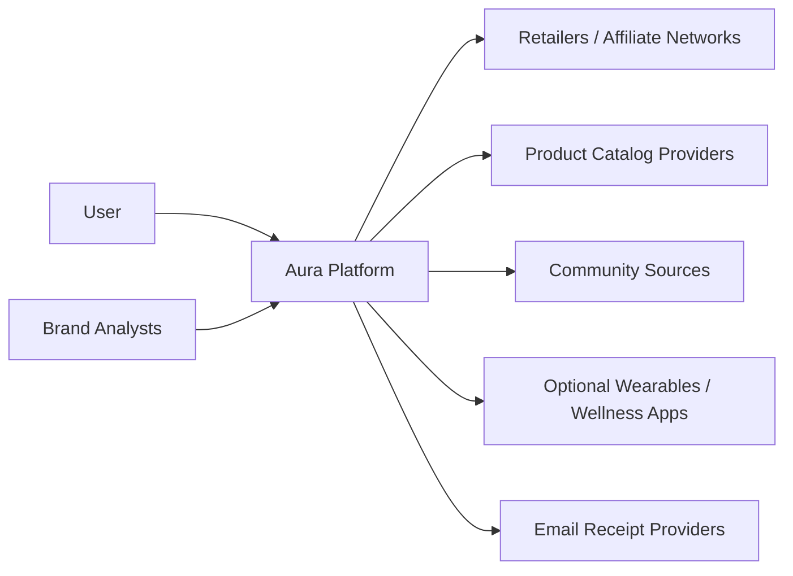
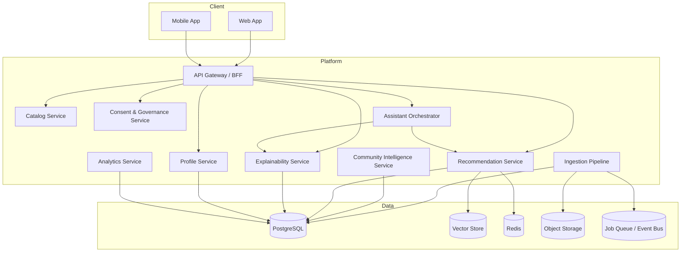
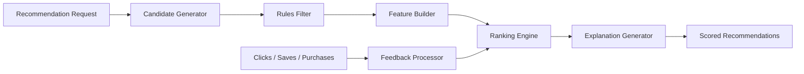
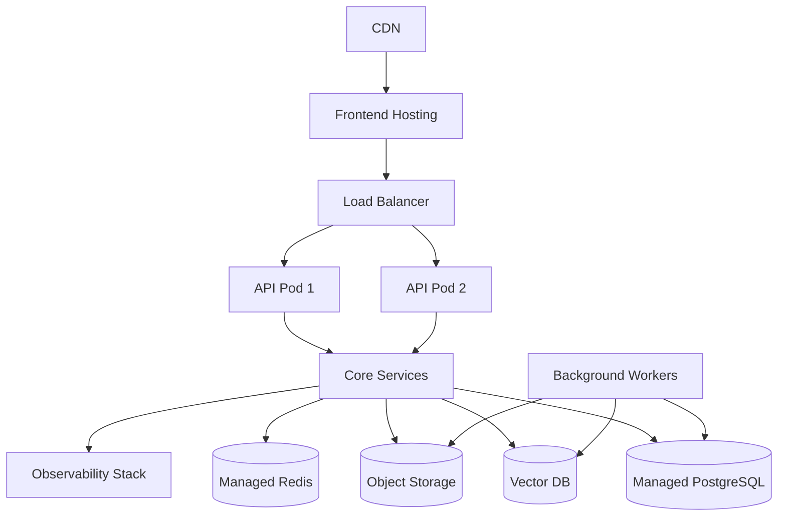

# Aura Full C4 Architecture Diagrams

## 1. System Context Diagram

### Actors

- User: consumes recommendations, manages profile, asks Aura assistant.
- Brand Analysts: access anonymized analytics in later phases.
- External Systems: catalogs, affiliate networks, community sources, optional wearable and receipt integrations.

## 2. Container Diagram

## 3. Component Diagram — Recommendation Service

### Components

- Candidate Generator: narrows product universe.
- Rules Filter: hard exclusions such as allergen conflicts, price bounds, ethical filters.
- Feature Builder: derives compatibility, sentiment, popularity, price-fit, similarity features.
- Ranking Engine: scores candidates.
- Explanation Generator: emits reason codes and user-facing explanations.
- Feedback Processor: learns from outcomes.

## 4. Deployment Diagram

## Architectural Notes

- **Starting approach:** Begin with a modular monolith if team size is small. The modular monolith
  maps cleanly to the hybrid backend pattern: Node.js + Fastify (User API / BFF) and Java 21 +
  ActiveJ (Core Domain — ingestion, ranking, recommendation workers).
- **Layer alignment:** The services shown in the Container Diagram map onto the canonical 7-layer
  platform model defined in `Aura_System_Architecture.md`:
  1. Source & Ingestion Layer → Ingestion Pipeline
  2. Canonical Knowledge Layer → Catalog Service
  3. Personal Intelligence Layer → Profile Service
  4. Decision & Recommendation Layer → Recommendation Service
  5. Agent Orchestration Layer → Assistant Orchestrator
  6. Experience Delivery Layer → API Gateway, Web App, Mobile App
  7. Observability, Governance & Learning Layer → Analytics Service, Consent Service
- **Scaling path:** Move ingestion, recommendation, and community analysis into separate services
  when throughput warrants. Keep explainability and consent as first-class services from the start.
- **Vector retrieval:** pgvector (embedded in PostgreSQL) serves as the initial Vector Store. Migrate
  to a dedicated vector database (Pinecone, Weaviate) when embedding volume exceeds ~10 M records.
