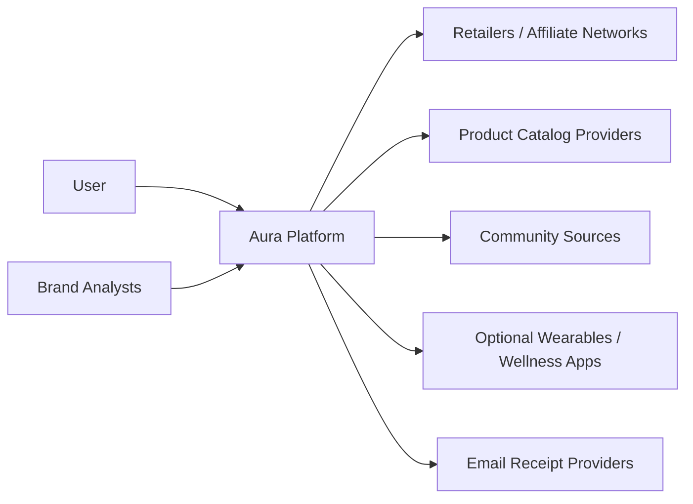
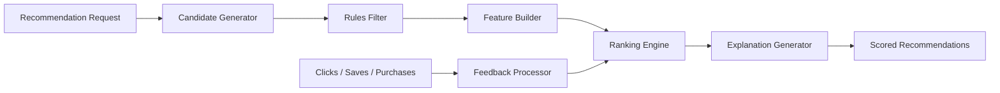
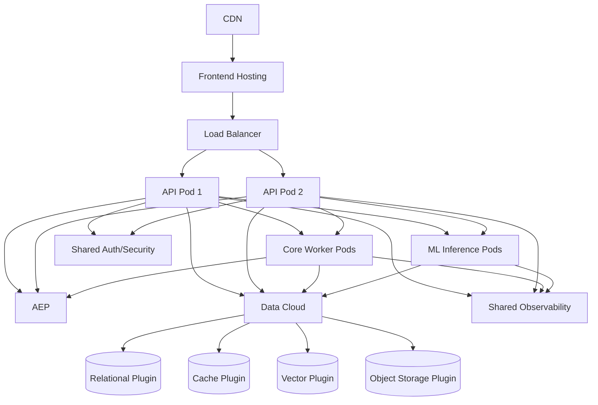

# Aura Full C4 Architecture Diagrams

## 1. System Context Diagram



### Actors

- User: consumes recommendations, manages profile, asks Aura assistant.
- Brand Analysts: access anonymized analytics in later phases.
- External Systems: catalogs, affiliate networks, community sources, optional wearable and receipt integrations.

## 2. Container Diagram

```mermaid
flowchart TB
  subgraph Client
    Web[Web App]
    Mobile[Mobile App]
  end

  subgraph Platform
    API[API / BFF (Node.js + Fastify)]
    Core[Core Worker Host (Java + ActiveJ)]
    ML[ML Inference (Python + FastAPI)]
    Assistant[Assistant Orchestrator]
  end

  subgraph Modules["Internal Domain Modules (inside API / Core Worker)"]
    Profile[Profile Module]
    Catalog[Catalog Module]
    Reco[Recommendation Module]
    Explain[Explainability Module]
    Community[Community Module]
    Consent[Governance Module]
    Analytics[Analytics & Learning Module]
  end

  subgraph Shared["Shared Platform Capabilities"]
    AEP[AEP]
    DC[Data Cloud]
    AUTH[Shared Auth / Security]
    O11Y[Shared Observability]
  end

  subgraph Data["Data Cloud Managed Implementations"]
    PG[(Relational Plugin)]
    VDB[(Vector Plugin)]
    Cache[(Cache Plugin)]
    Blob[(Object Storage Plugin)]
  end

  Web --> API
  Mobile --> API
  API --> AUTH
  API --> Profile
  API --> Catalog
  API --> Reco
  API --> Explain
  API --> Assistant
  API --> Consent
  API --> Analytics
  Core --> Catalog
  Core --> Reco
  Core --> Community
  Core --> Analytics
  Community --> PG
  Reco --> PG
  Reco --> VDB
  Reco --> Cache
  Explain --> PG
  Profile --> PG
  Assistant --> Reco
  Assistant --> Explain
  Analytics --> PG
  Consent --> PG
  Reco --> ML
  API --> AEP
  Core --> AEP
  Assistant --> AEP
  API --> DC
  Core --> DC
  ML --> DC
  API --> O11Y
  Core --> O11Y
  ML --> O11Y
  DC --> PG
  DC --> VDB
  DC --> Cache
  DC --> Blob
```

## 3. Component Diagram — Recommendation Module



### Components

- Candidate Generator: narrows product universe.
- Rules Filter: hard exclusions such as allergen conflicts, price bounds, ethical filters.
- Feature Builder: derives compatibility, sentiment, popularity, price-fit, similarity features.
- Ranking Engine: scores candidates.
- Explanation Generator: emits reason codes and user-facing explanations.
- Feedback Processor: learns from outcomes.

## 4. Deployment Diagram



## Architectural Notes

- **Starting approach:** Begin with a modular monolith split across a Node.js API/BFF and a Java
  core worker host. Keep Python ML inference as its own runtime boundary because the toolchain is
  meaningfully different, not because every model deserves its own deployable.
- **Layer alignment:** The deployables and internal modules shown in the Container Diagram map onto the canonical 7-layer
  platform model defined in `Aura_System_Architecture.md`:
  1. Source & Ingestion Layer → Core Worker ingestion modules
  2. Canonical Knowledge Layer → Catalog Module
  3. Personal Intelligence Layer → Profile Module
  4. Decision & Recommendation Layer → Recommendation Module
  5. Agent Orchestration Layer → Assistant Orchestrator
  6. Experience Delivery Layer → API / BFF, Web App, Mobile App
  7. Observability, Governance & Learning Layer → Analytics & Learning Module, Governance Module
- **Scaling path:** Split ingestion, recommendation, or community analysis into separate services only
  when throughput, latency isolation, compliance boundaries, or team ownership warrant it. Keep
  explainability and consent as first-class modules from the start, but not mandatory deployables.
- **Shared platform boundary:** Aura communicates asynchronously through AEP and uses Data Cloud-managed plugins for relational, vector, cache, and object-storage needs. Shared auth/security and shared observability remain outside Aura-local infrastructure.
- **Vector retrieval:** pgvector can serve as the initial vector implementation underneath Data Cloud. Migrate
  to a dedicated vector plugin when embedding volume exceeds ~10 M records.
