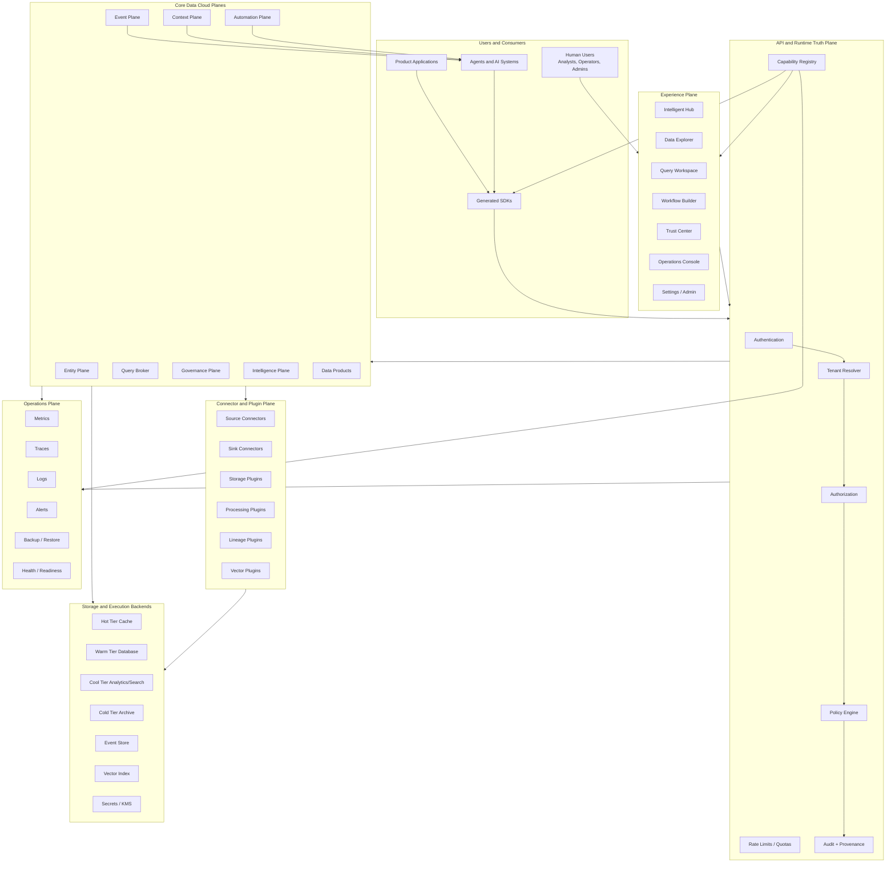
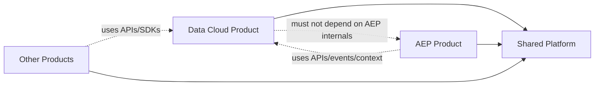
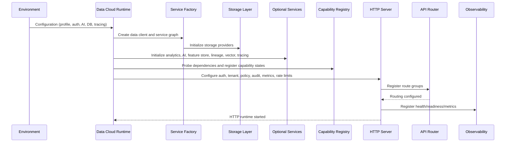
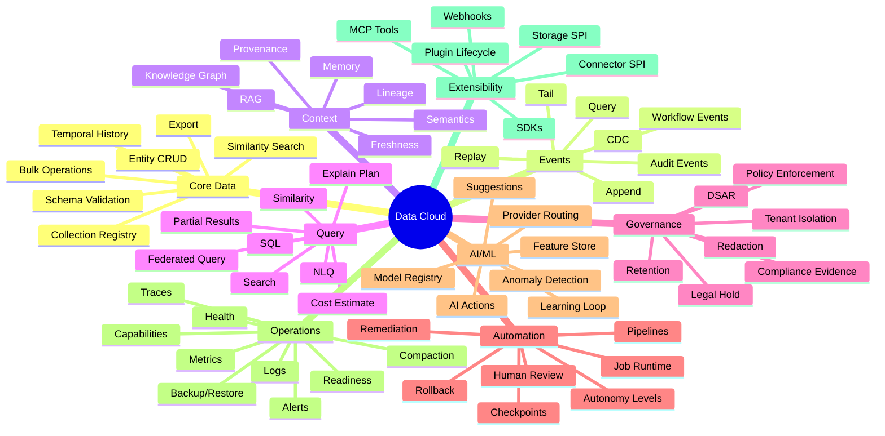
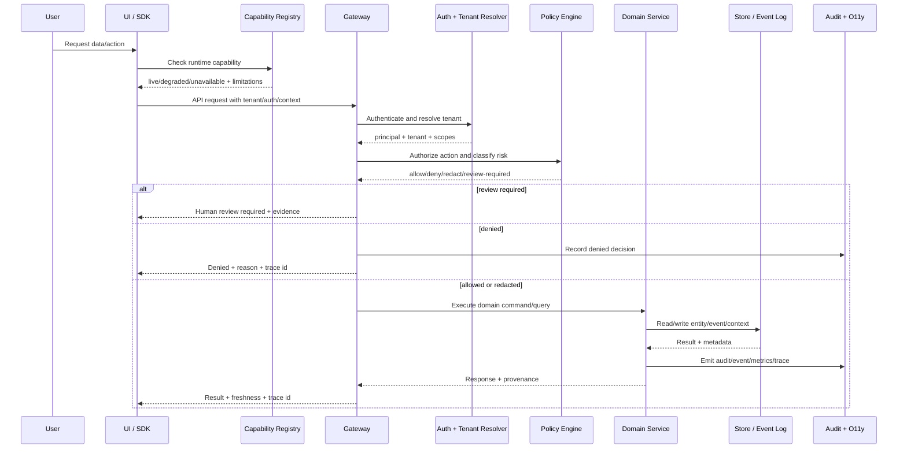
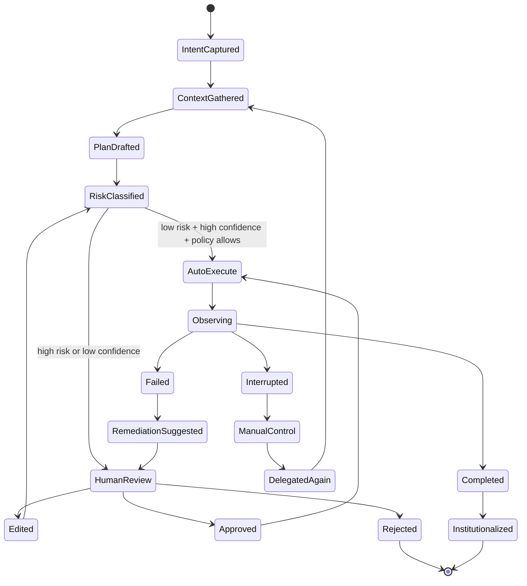
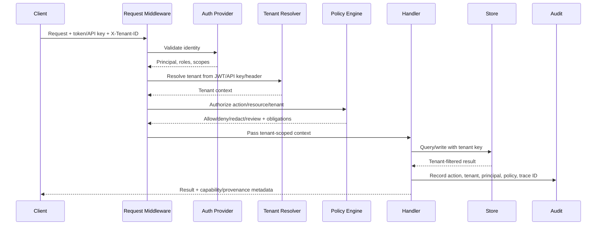
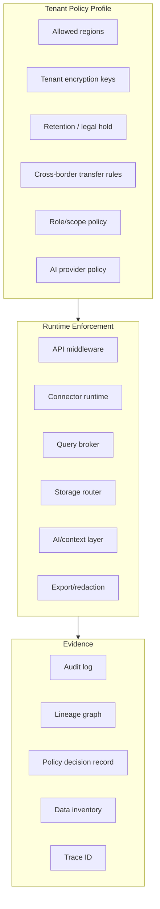
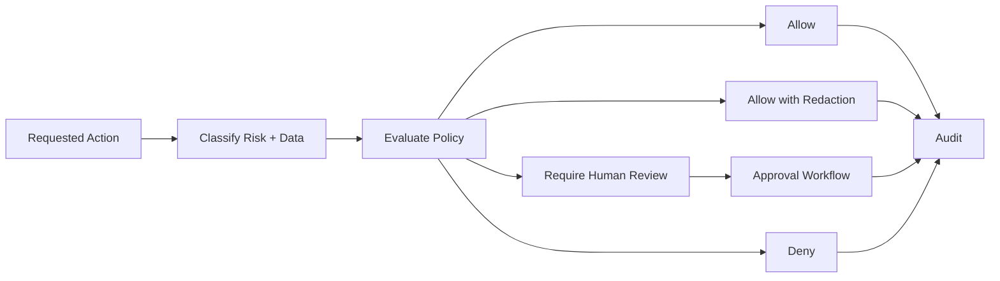

# Data Cloud Canonical Product Architecture Specification

**Document Status:** Canonical  
**Document Type:** Single Source of Truth / Product Architecture Specification  
**Product:** Data Cloud  
**Repository Context:** `samujjwal/ghatana`  
**Recommended Canonical Path:** `data-cloud-architecture-reference.md`  
**Version:** 2.0-canonical  
**Last Updated:** 2026-04-29  
**Audience:** Product leadership, architecture reviewers, engineering leads, backend engineers, frontend engineers, platform engineers, SREs, security reviewers, privacy reviewers, compliance reviewers, data engineers, AI/ML engineers, QA, and future contributors.

---

## 0. Canonical Mandate

This document is the authoritative, self-contained specification for Data Cloud.

It defines the product identity, architecture, implementation boundaries, runtime guarantees, capability model, current state, target state, security/privacy/provenance requirements, UI/UX rules, API/SDK rules, operational behavior, quality gates, roadmap, and architecture governance model for Data Cloud.

Data Cloud must not ship, document, expose, or advertise any behavior that contradicts this specification.

Every implementation change must answer:

1. Which canonical Data Cloud capability does this implement or modify?
2. Which architecture principle does it support?
3. Which tenant, security, privacy, sovereignty, provenance, retention, audit, and policy requirements apply?
4. Which runtime capability state must expose it?
5. Which API, UI, SDK, event, audit, observability, and documentation contracts are affected?
6. Which tests prove correctness, security, isolation, durability, performance, and regression safety?
7. Does this reduce manual human work while preserving human override, interruption, review, and delegation?
8. Does this introduce duplicate truth, duplicate code, duplicate APIs, duplicate UI behavior, duplicate storage semantics, or duplicate governance logic?
9. Does this preserve the Data Cloud / AEP / shared platform boundary?
10. Which supporting docs, OpenAPI definitions, generated clients, runbooks, and tests must be updated?

A feature is not complete until the implementation, runtime capability registry, OpenAPI contract, UI behavior, SDK behavior, tests, observability, audit trail, operational guidance, and supporting documentation all align with this document.

---

## 1. Canonical Authority and Source-of-Truth Rules

This document owns the canonical truth for:

- Product identity and strategic positioning.
- What Data Cloud is and is not.
- Capability taxonomy and capability lifecycle states.
- Current state, evidence level, target state, and roadmap.
- Architecture principles and invariants.
- Data Cloud / AEP / shared platform ownership boundaries.
- Entity, event, context, query, automation, governance, intelligence, experience, connector, plugin, and operations planes.
- Canonical contracts for entities, events, query, policy decisions, capability registry, automation execution, AI actions, plugins, connectors, audit, lineage, freshness, and provenance.
- Multi-tenancy, security, privacy, data sovereignty, retention, legal hold, redaction, DSAR, compliance, and audit expectations.
- Runtime truth requirements.
- UI/UX architecture principles and progressive disclosure model.
- API/SDK design rules.
- Deployment profile expectations.
- Non-functional requirements, SLOs, high availability, disaster recovery, backup, restore, and degradation semantics.
- Testing, validation, release, and architecture compliance gates.

Supporting files may contain implementation detail, generated contracts, operational commands, or local setup details, but they must not redefine product intent, architectural boundaries, capability semantics, or quality expectations.

### 1.1 Conflict Resolution

When conflict exists:

1. **This document wins for product intent, architecture, boundaries, semantics, quality expectations, and roadmap.**
2. **Runtime capability registry wins for current deployed availability.** A feature may be architecturally required but runtime-unavailable until implementation and validation are complete.
3. **OpenAPI wins for exact machine-readable REST shape only when it is aligned with this document.** If OpenAPI contradicts this document, OpenAPI must be corrected or the architecture document must be explicitly amended through architecture review.
4. **Generated SDKs must be projections of OpenAPI and runtime behavior.** SDKs must not define independent behavior.
5. **README, UI architecture docs, manuals, generated docs, runbooks, ADRs, and implementation plans must defer to this document.**
6. **ADRs record decision history.** They do not override the current canonical architecture unless this document incorporates that decision.
7. **Code must be corrected if it contradicts this document.** If code intentionally changes architecture, this document must be updated in the same change set.
8. **Tests must verify this document, not merely current accidental implementation behavior.**

### 1.2 Documentation Hierarchy

| Layer | Document or Source | Authority |
|---|---|---|
| Canonical product architecture | `data-cloud-architecture-reference.md` | Owns Data Cloud product, architecture, boundaries, capability semantics, quality gates, and target behavior |
| Runtime truth | `GET /api/v1/capabilities` | Owns current runtime availability, degradation, preview, and dependency evidence |
| REST API machine contract | `products/data-cloud/api/openapi.yaml` | Owns generated REST shape when aligned to this architecture |
| Product landing page | `products/data-cloud/README.md` | Summarizes current state and local entry points; must defer to this document |
| Human-readable API companion | `products/data-cloud/REST_API_DOCUMENTATION.md` | Explains API usage; must not redefine API semantics |
| Frontend implementation architecture | `products/data-cloud/ui/ARCHITECTURE.md` | Owns frontend module structure only; must defer to this document for product and UX architecture |
| Operations | `products/data-cloud/RUNBOOK.md` | Owns operational commands and procedures |
| Testing | `products/data-cloud/TEST_MANUAL.md` | Owns test commands and execution workflow |
| Development | `products/data-cloud/DEVELOPER_MANUAL.md` | Owns local development workflow |
| ADRs | `products/data-cloud/docs-generated/07-architecture-decisions/*` | Own decision history and rationale |
| Generated docs | `products/data-cloud/docs-generated/*` | Supporting generated artifacts only |
| Shared platform docs | `docs/*`, `platform/*` docs | Shared platform architecture and governance, not Data Cloud product truth |

### 1.3 Required Repo Enforcement

The repository must enforce this document as canonical through:

- Boundary drift script that includes this file in the canonical Data Cloud documentation set.
- Documentation lint that rejects conflicting claims such as “single source of truth” in subordinate docs unless scoped.
- Architecture rule tests that enforce Data Cloud / AEP / platform boundaries.
- OpenAPI diff checks that require this document to be updated when REST semantics change.
- UI route/capability checks that ensure UI surfaces are gated by runtime capability truth.
- CI checks that fail on mock/stub/demo-only surfaces exposed as live product behavior.
- CODEOWNERS and review rules that require architecture review for changes to this document or any canonical contract.

Recommended update to boundary script:

```bash
REPO_ROOT="$(cd "${PRODUCT_DIR}/../.." && pwd)"

CANONICAL_DOCS=(
  "${REPO_ROOT}/data-cloud-architecture-reference.md"
  "${PRODUCT_DIR}/README.md"
  "${PRODUCT_DIR}/OWNER.md"
  "${PRODUCT_DIR}/REST_API_DOCUMENTATION.md"
  "${PRODUCT_DIR}/api/openapi.yaml"
  "${PRODUCT_DIR}/feature-store-ingest/README.md"
  "${PRODUCT_DIR}/docs-generated/07-architecture-decisions/adr-dc-001-module-ownership.md"
)
```

---

## 2. Executive Summary

Data Cloud is the canonical data foundation product for Ghatana. It is a **Context-Native Operational Data Fabric**: a single, security-first, privacy-first, sovereignty-aware, provenance-rich data layer for information retrieval, extraction, processing, visualization, governance, and automation across human workflows, application workflows, and agent workflows.

Data Cloud exists to solve a practical and urgent problem: organizations should not need to stitch together five or more disconnected tools to build secure, tenant-aware, AI-native, operationally reliable data products. Instead of separately wiring a database, event stream, warehouse, governance catalog, RAG system, workflow runtime, observability layer, data product catalog, and UI, Data Cloud provides one coherent operational fabric.

Data Cloud provides:

- Tenant-aware entity storage and retrieval.
- Durable event persistence and streaming.
- Context, lineage, freshness, provenance, and RAG-ready retrieval.
- Query, search, analytics, SQL, natural-language query, and federated query patterns.
- Pipeline metadata, checkpointing, workflow execution visibility, and governed automation.
- Data lifecycle management, retention, purge, redaction, legal hold, audit, and compliance evidence.
- Runtime capability registry and progressive UI disclosure.
- Plugin-backed extensibility for storage, processing, connectors, lineage, vector search, analytics, and integrations.
- AI/ML substrate embedded into the product as infrastructure, not as a separate gimmick.
- Generated SDKs and public contracts for application and agent consumers.
- Multiple deployment profiles, including local development, standard standalone, Kubernetes/Helm, sovereign/air-gapped, and future distributed enterprise profiles.
- UI surfaces centered around Intelligent Hub, Data, Pipelines, Query, Trust, Operations, and extensibility.

The product direction is automation by default and human override always. Users should not manually stitch systems, validate every query, clean every source, wire every connector, tune every retention policy, or supervise every workflow. Data Cloud should do as much as it can credibly and safely do automatically, show exactly what it did, and bring humans into the loop only for low-confidence, high-risk, destructive, ambiguous, governance-sensitive, regulated, or policy-required decisions.

Even then, humans must be able to interrupt, pause, inspect, edit, approve, reject, override, take control, roll back where possible, delegate again, and inspect the full evidence trail.

---

## 3. Product Identity

### 3.1 What Data Cloud Is

Data Cloud is the **application-facing operational data fabric** for multi-tenant, AI-native products.

It owns the data context that applications, workflows, operators, and agents need to retrieve, process, reason, govern, visualize, and automate.

Data Cloud acts as:

1. **Entity Plane** — operational entity storage, collection registry, schema, validation, history, export, similarity, and entity lifecycle.
2. **Event Plane** — append-only change, activity, workflow, audit, and system event persistence with query, tail, replay, and streaming.
3. **Context Plane** — semantic context, snapshots, lineage, provenance, freshness, knowledge, memory, RAG, and agent grounding.
4. **Query Plane** — direct query, search, SQL, natural-language query, explain, federated query, source freshness, and cost transparency.
5. **Automation Plane** — pipelines, checkpoints, job execution, workflow snapshots, recommendations, governed actions, and human takeover.
6. **Governance Plane** — tenant isolation, security, authorization, policy, retention, purge, redaction, legal hold, privacy, sovereignty, audit, and compliance evidence.
7. **Intelligence Plane** — AI/ML substrate for schema inference, PII detection, anomaly detection, recommendation, classification, query assistance, root cause, summarization, feature store, model registry, and learning loops.
8. **Experience Plane** — low-cognitive-load UI, role-aware navigation, dashboard-first review, SQL/NL/voice interaction, Trust Center, operations console, generated SDKs, and developer/operator experience.
9. **Connector and Plugin Plane** — source connectors, sink connectors, storage plugins, processing plugins, lineage plugins, vector plugins, analytics plugins, and extension lifecycle.
10. **Operations Plane** — health, readiness, metrics, traces, logs, audit, alert lifecycle, backup, restore, compaction, durability checks, capability probes, and deployment profile validation.

### 3.2 What Data Cloud Is Not

Data Cloud is not:

- A generic database replacement for every workload.
- A generic warehouse replacement.
- A generic lakehouse replacement.
- A pure streaming middleware replacement.
- A pure BI tool replacement.
- A pure governance catalog.
- A pure RAG/vector database.
- A model orchestration product that competes directly with agentic orchestration platforms.
- A hidden black-box automation system.
- A system where AI/ML is marketed as a separate page rather than embedded into outcomes.
- A system that relies on mocks, stubs, demo metrics, or hardcoded behavior while claiming production readiness.

Data Cloud is the trusted operational context layer that may connect to warehouses, lakehouses, stream processors, BI systems, data catalogs, vector databases, LLMs, agent systems, and operational applications. It governs, retrieves, enriches, automates, observes, and exposes a consistent application/agent-facing contract over them.

### 3.3 Strategic Positioning

The disruptive thesis:

> Data Cloud eliminates the “stitch five tools together” problem by unifying tenant-aware entities, events, context, policy, automation, observability, and AI-native data operations into one deployable operational fabric.

Where incumbents are fragmented:

| Market slice | Incumbent strength | Incumbent weakness | Data Cloud opportunity |
|---|---|---|---|
| Warehouse | Warehouse-first structured analytics | Operational context, event streaming, and governed entity plane often bolted on | Operational entity + event + context layer |
| Lakehouse | Powerful data/ML processing | Complex, ML-heavy, often not operator-simple | Low-cognitive-load application/agent data fabric |
| Streaming | Strong event transport | Not an entity, governance, context, or workflow platform | Unified entity + event + context + workflow runtime |
| Governance/catalog | Metadata inventory | Enforcement often separate from execution path | Policy-enforced governance inside runtime paths |
| RAG/vector tools | Semantic retrieval | Detached from operational truth, governance, and freshness | Entity/event/lineage/provenance-native context layer |
| BI | Visualization and dashboards | Weak action automation and limited runtime governance | Outcome-first insights with governed remediation |
| Workflow tools | Task execution | Weak native data provenance, policy, and tenant-aware context | Data-grounded automation with audit and human takeover |

### 3.4 Ideal Customer Profile

Data Cloud is for:

- Engineering-led SaaS organizations.
- Multi-tenant application teams.
- Regulated organizations needing self-hosted or sovereign data infrastructure.
- Teams building AI-native workflows that require governed, fresh, contextual data.
- Product teams tired of stitching databases, streams, RAG, governance, workflow automation, and UI separately.
- Enterprises needing application-facing data products with tenant isolation, policy enforcement, and traceability.
- Operators who need visibility and automation without high cognitive load.

### 3.5 Core Pain Points Solved

Data Cloud solves:

- Fragmented data-serving stacks.
- Multi-tenant isolation complexity.
- Disconnected entity and event models.
- Context/RAG systems detached from authoritative operational data.
- Governance that reports but does not enforce.
- AI/ML features that increase cognitive load instead of reducing work.
- Manual connector wiring and fragile glue code.
- Inconsistent query, freshness, and provenance semantics.
- Hidden automation without human override.
- Runtime capability claims that do not match deployed reality.
- API/SDK drift from implementation.
- UI surfaces exposing unavailable or demo-only behavior.
- Lack of deployment choice for sovereign, air-gapped, or regulated environments.

---

## 4. Architecture Context

This specification consolidates and supersedes fragmented Data Cloud architecture descriptions. It is based on:

- Existing Data Cloud reference architecture content.
- Current Data Cloud README current-state evidence.
- Data Cloud ownership clarification.
- Data Cloud UI architecture rules.
- Boundary enforcement requirements between Data Cloud and AEP.
- Product strategy around context-native operational data fabric.
- Multi-tenancy, privacy, sovereignty, ownership, and provenance concerns.
- Automation-by-default and human-override-always principle.
- Runtime capability truth model.
- Current implementation notes for local, sovereign, standalone, and optional-service profiles.
- Current known risks around query semantics, temporal history, governance, policy/audit fail-closed behavior, workflow orchestration, SDK drift, and validation gates.

This document intentionally includes what would otherwise be spread across README, architecture docs, ownership docs, UI docs, runbooks, test manuals, and implementation plans. Supporting docs remain useful for execution, but this document contains enough architectural truth to understand Data Cloud without reading any other file.

---

## 5. Architecture Principles

### 5.1 Security, Privacy, Sovereignty, and Provenance First

Every data object, event, query result, generated insight, automation action, and exported artifact must carry tenant, source, lineage, classification, policy, freshness, and audit metadata.

Trust cannot be bolted on later.

Required enforcement points:

- API gateway and request middleware.
- Authentication and authorization.
- Tenant context resolver.
- Policy engine.
- Entity store.
- Event store.
- Query broker.
- Connector runtime.
- Storage router.
- AI action substrate.
- Export/redaction workflow.
- UI capability and trust surfaces.
- Audit log and event log.
- Observability pipeline.
- SDK request/response metadata.
- Plugin lifecycle.

### 5.2 Automation by Default, Human Override Always

Every feature should be designed so manual involvement tends toward zero while human control remains always available.

Automation levels:

| Level | Meaning | Example |
|---|---|---|
| L0 Manual | Human executes everything | User writes full SQL manually |
| L1 Assist | System suggests | Data Cloud suggests query/filter/schema |
| L2 Draft | System prepares, human approves | Pipeline draft generated and reviewed |
| L3 Supervised automation | System runs low-risk work with audit | Auto-classify schema and create retention recommendation |
| L4 Conditional autonomy | System executes within explicit policy and thresholds | Auto-index fields based on observed query usage |
| L5 Full autonomy | System self-optimizes within safe, reversible, audited guardrails | Auto-remediate non-destructive degraded connector retry policy |

Human control requirements:

- Interrupt active automation.
- Pause/resume workflow.
- Reassign to manual mode.
- Review full plan and evidence.
- Approve/reject/edit proposed action.
- Roll back where possible.
- Delegate again after manual intervention.
- View confidence, provenance, risk, policy decision, and audit trail.
- Stop AI/provider usage for a tenant or data class.
- Force a safer execution path.

### 5.3 Runtime Truth Over Static Claims

The system must never show a capability as live unless runtime probes, dependency checks, contract checks, and policy checks confirm it.

Runtime truth is enforced through:

- Capability registry endpoint.
- Health and readiness endpoints.
- UI navigation.
- Global search.
- Action enablement/disablement.
- SDK feature flags.
- Documentation badges.
- AI suggestions and workflow plans.
- Operator diagnostics.
- Test evidence.
- Deployment profile validation.

### 5.4 One Canonical Contract Per Concern

No duplicate source of truth.

| Concern | Canonical owner |
|---|---|
| Product and architecture truth | This document |
| REST API shape | OpenAPI generated/validated against this document |
| Runtime capability availability | Capability registry endpoint |
| Entity query semantics | Canonical query specification in this document + OpenAPI schemas |
| Event envelope | Canonical event schema in this document + event schema registry |
| Tenant resolution | Tenant context contract in this document |
| UI route lifecycle | Runtime capability registry + UI architecture rules |
| Plugin lifecycle | Plugin registry and plugin lifecycle contract |
| Automation governance | Autonomy policy + audit trail |
| AI action | AI action/provenance contract |
| Deployment guarantees | Deployment profile contract |
| Tests | Test manual execution, but expected behavior comes from this document |

### 5.5 Data Cloud Owns Context, Agentic Systems Own Orchestration

Data Cloud may embed ML/AI for ranking, anomaly detection, summarization, recommendations, classification, semantic retrieval, query assistance, workflow drafting, and governed data actions.

Agentic orchestration systems own broader multi-step agent planning, tool orchestration, agent runtime execution, cross-product task decomposition, and agent strategy.

Data Cloud integrates with agentic systems through:

1. Public Data Cloud APIs.
2. Event log streams.
3. Tool/MCP registry.
4. Context/RAG endpoints.
5. Memory and execution persistence.
6. Audit and provenance records.
7. Data product contracts.
8. Capability registry.
9. Policy-controlled AI action substrate.

Data Cloud must not accidentally become an AEP runtime. Any agent-like feature inside Data Cloud must be scoped to Data Cloud-owned data/context/governance/automation responsibilities.

### 5.6 AI/ML Is Infrastructure, Not a Feature Label

AI/ML should be pervasive, implicit, governed, observable, and outcome-oriented. Users should see better outcomes, not extra cognitive load.

Good AI:

- Suggests schema from data.
- Detects PII and policy risk.
- Recommends query path and warns about freshness.
- Generates workflow drafts with evidence.
- Detects anomalies and root causes.
- Explains lineage and impact.
- Summarizes trust posture.
- Automates safe remediation.
- Improves search and ranking.
- Learns from operator feedback.
- Reduces manual work without hiding risk.

Bad AI:

- A separate “AI page” full of generic suggestions.
- Confidence numbers without provenance.
- Stubbed recommendations that look authoritative.
- Unreviewable destructive actions.
- Hidden data sent to external LLMs without policy.
- AI outputs without tenant, source, freshness, policy, and audit metadata.
- Prompt/response retention that bypasses tenant policy.
- Undocumented fallback behavior.
- Hallucinated capability claims.

### 5.7 Fail Closed for Trust-Critical Paths

The following must fail closed in production-grade profiles:

- Missing tenant context.
- Unauthenticated protected action.
- Unauthorized tenant/resource/scope.
- Missing policy engine for governed action.
- Missing audit dependency for mutating sensitive action.
- Missing durable event store for profiles that advertise durability.
- Missing redaction policy for sensitive export.
- Unavailable AI provider when action requires AI and no safe fallback exists.
- Missing capability probe for capability advertised as live.
- Incomplete data residency decision for cross-region storage/query/export.
- Plugin dependency failure for required runtime behavior.

Graceful degradation is allowed only when the system explicitly downgrades capability state and communicates limitations.

### 5.8 Evidence Over Optimistic Summary

No UI, API, README, report, Trust Center card, compliance dashboard, AI summary, or generated document may claim readiness, compliance, durability, or availability without evidence.

Evidence must include:

- Runtime capability status.
- Dependency probe results.
- Test references.
- Audit records.
- Policy decision records.
- Trace IDs.
- Source freshness.
- Lineage.
- Known limitations.
- Deployment profile.
- Last verified time.

### 5.9 Reuse First, No Sprawl

Data Cloud must avoid duplicate libraries, duplicate models, duplicate handlers, duplicate clients, duplicate query semantics, duplicate UI state, duplicate test fixtures, and duplicate policy logic.

Shared concerns must be abstracted into shared platform modules or Data Cloud shared modules with clear ownership.

### 5.10 Production-Grade by Default

Production-grade means:

- Real implementation, not mocks/stubs/hardcoded data.
- Correct behavior verified against requirements.
- Complete tests across unit, integration, API E2E, UI E2E, contract, performance, security, privacy, migration, and failure modes.
- Observability and audit built in.
- Secure-by-default configuration.
- Upgrade/rollback paths.
- Operational runbooks.
- SLOs and degradation semantics.
- Tenant-safe behavior.
- Documented limitations where target state is not complete.

---

## 6. Current State, Target State, and Evidence Matrix

This section defines current implementation reality and target expectations. It must be updated whenever implementation state changes.

| Capability | Current State | Evidence Level | Notes | Target State | Release Criticality |
|---|---|---|---|---|---|
| Entity CRUD, batch, history, export, validation | Implemented | Deployment-validated | Active in launcher HTTP surface; query semantics still need hardening | Durable, schema-governed, tenant-isolated entity plane with complete query contract | Critical |
| Event append/query | Implemented | Deployment-validated | Offset lookup and streaming support exist | Durable event plane with replay, canonical envelope, audit integration, and temporal reconstruction | Critical |
| Event streaming via SSE/WebSocket | Implemented | Needs scale validation | Streaming exists in launcher/runtime | Authenticated, tenant-safe, throttled, replay-aware, resumable streaming | High |
| Pipeline metadata and checkpoints | Implemented | Integration-verified | CRUD and checkpoint storage active | Fully governed pipeline metadata and checkpoint model | High |
| Workflow execution and logs | Implemented, limited orchestration | Integration-verified | Execution snapshots/logs persist when storage is durable | Durable, resumable, distributed-capable orchestration or explicit capability gating | Critical for enterprise automation |
| Durable orchestration | Limited | Not deployment-validated | Current launcher is not a distributed scheduler/multi-worker orchestration plane | Multi-worker durable orchestration or clear out-of-scope boundary | High |
| Agent memory persistence | Implemented | Verified locally | TTL-aware memory APIs are live | Tenant-scoped, retention-governed, provenance-aware memory plane | High |
| Context layer | Implemented | Integration-verified | Snapshot support and RAG endpoint exist | Context graph with lineage/freshness/policy and RAG grounding | Critical |
| Semantic similarity and RAG | Implemented | Integration-verified | Auto-index on writes, `/similar`, `/rag` routes | Policy-aware semantic retrieval with explainable provenance and source trust | High |
| Lineage API | Implemented | Integration-verified | Collection lineage and impact endpoints live | Complete lineage graph across ingestion, transformation, query, export, AI, and automation | Critical |
| Data products API | Implemented | Integration-verified | Publish/discover/subscribe available | Governed data product lifecycle with SLA, ownership, freshness, contract, and subscribers | High |
| Analytics/reports | Implemented with degradation | Verified locally | Some routes degrade when backing services absent | Unified query broker with explain/cost/freshness/partial result semantics | High |
| Federated query | Partial/optional | Capability-dependent | Depends on external services such as Trino | Source-aware, policy-aware federated query with partial failure semantics | High |
| AI assist | Implemented, fragmented | Verified locally | Optional services depend on runtime capability registration | Unified AI action substrate with policy/provenance/confidence/human review | Critical |
| Voice interaction | Implemented | Verified locally | Voice intent processing exists | Tenant-safe, audited, policy-aware multimodal query/action interface | Medium |
| Learning services | Implemented optional | Verified locally | Optional service quality depends on capability registry | Governed feedback and learning loop | Medium |
| Governance: retention, purge, redaction, PII | Implemented/partial | Integration evidence for selected actions | Core routes exist; compliance posture needs strengthening | Evidence-backed governance with fail-closed enforcement | Critical |
| Trust Center | Partial but action-backed | UI/runtime integrated | Retention classification, purge preview, redaction, compliance refresh, audit visibility wired | Complete policy lifecycle and evidence-backed compliance dashboard | Critical |
| Capability registry | Implemented | Runtime truth surface exists | Must become universal truth source | Mandatory for UI, SDK, docs, AI, and operations | Critical |
| Autonomy controls | Implemented | Verified locally | Level/domain/log endpoints available | Policy-gated autonomy across all automation surfaces | Critical |
| Plugin system | Implemented | Verified locally | Lifecycle routes exist | Full plugin lifecycle with compatibility, sandboxing, tenant scoping, rollout, rollback | High |
| Alert management | Implemented | Operator-facing | Alert lifecycle, grouping, rules, suggestions, SSE live | Full incident lifecycle and automated safe remediation | High |
| Data fabric topology visualization | Preview/demo | UI demo only | Hardcoded demo metrics | Real topology metrics API, no hardcoded production claims | Medium |
| Settings and configuration | Partial | Local verification | General settings available; admin lifecycle incomplete | Secure settings/API key lifecycle with audit, rotation, RBAC | High |
| SDK generation | Implemented | Verified locally | Java, TypeScript, Python generated from OpenAPI | Contract-validated SDKs with streaming/error/capability support | High |
| UI | Implemented | Product UI exists | Simplified navigation with progressive disclosure | Runtime-capability-gated, low-cognitive-load, role-aware UX | High |
| Local profile | Implemented | Verified locally | Zero-dependency dev path | Dev-only, clearly non-durable | Medium |
| Sovereign durable profile | Implemented | Integration-verified | File-backed H2 entity/event storage survives restart | Air-gapped, no external AI by default, backup/restore evidence | Critical for regulated/self-hosted |
| Standard standalone | Implemented | Verified locally | HTTP server plus optional services/plugins | Production-safe with durable providers and fail-closed dependencies | High |
| Kubernetes/Helm | Documented | Documentation-backed | Deployment assets exist | Validated deployment artifacts with HA/DR/SLO evidence | High |
| Auto-compaction | Implemented | Integration-verified | Tombstone-based compaction schedule configurable | Governed compaction with audit and autonomy controls | Medium |

---

## 7. Risk Register

| Risk | Severity | Why It Matters | Required Mitigation |
|---|---|---|---|
| Query/filter/sort/pagination semantics incomplete | Critical | Users cannot trust tables, search, totals, automations, exports, or AI grounding | Define canonical query contract and test all operators, sorting, pagination, totals, and consistency |
| Temporal history/event sourcing not fully realized | Critical | Audit, replay, provenance, debugging, and agent grounding may be incomplete | Define canonical event envelope, temporal state reconstruction, replay guarantees, and mutation-event rules |
| Capability registry not universal truth source | High | UI/SDK/docs may expose unavailable or partial features | Make runtime capability registry mandatory across UI, SDK, AI, docs, and operations |
| Governance summaries may be optimistic | Critical | Compliance posture may be misrepresented | Require evidence-backed governance cards, policy decision records, and audit proof |
| Policy/audit dependencies nullable | Critical | Enterprise trust requires fail-closed behavior | Production profiles must fail closed for missing policy/audit dependencies |
| Settings/API key lifecycle incomplete | High | Admin/security workflows are not production-ready | Implement secure API key lifecycle, rotation, audit, RBAC, tenant scoping |
| AI/ML capabilities fragmented | High | AI cannot be pervasive, implicit, governed, and trustworthy | Implement unified AI action/provenance substrate |
| Workflow execution not full orchestration plane | High | Product may overpromise autonomous durable workflows | Either implement durable orchestration or strictly capability-gate and document limits |
| SDK/client contract drift | High | External integrations may break or rely on wrong behavior | Generate clients from OpenAPI and contract-test against runtime |
| Build/test gates not passing or incomplete | High | Product cannot be release-ready | Enforce full validation matrix |
| Data fabric UI demo metrics exposed as live | High | Operators may trust fake topology/metrics | Capability-gate preview/demo surfaces and remove hardcoded production claims |
| Cross-product boundary drift into AEP | High | Duplicate effort, confused ownership, agent runtime overlap | Enforce boundary checks and architecture review |
| Tenant isolation gaps | Critical | Cross-tenant leakage is catastrophic | Tenant-scoped storage, policy, tests, query filters, export controls |
| External AI data leakage | Critical | Sensitive data may leave tenant/region unlawfully | Provider policy routing, redaction-before-send, local fallback, audit |
| Plugin sandboxing gaps | High | Plugins may leak data or destabilize runtime | Plugin manifest, permissions, tenant scoping, resource limits, compatibility checks |
| Operational guarantee ambiguity | High | Customers cannot reason about durability/HA/DR | Define profile-specific SLO, RPO/RTO, durability, backup/restore |

---

## 8. High-Level Architecture



### 8.1 Architecture Layers

| Layer | What | Why |
|---|---|---|
| Experience Plane | UI surfaces for Data, Query, Workflows, Trust, Operations, Settings | Make complex data work simple and visible |
| API and Runtime Truth Plane | Auth, tenant, authorization, policy, capabilities, rate limits, audit | Prevent false claims and cross-tenant leakage |
| Entity Plane | Entity CRUD, schema, validation, export, search, similarity | Application-facing operational data model |
| Event Plane | Append/query/tail/replay events | Provenance, audit, workflow, real-time context |
| Context Plane | Semantic context, snapshots, RAG, lineage, freshness | Ground agents and humans in correct business context |
| Query Broker | SQL, NLQ, federated query, explain, cost, freshness | One query interface across tiers/sources |
| Automation Plane | Pipelines, checkpoints, executions, logs, autonomy | Reduce human labor with governed automation |
| Governance Plane | Retention, purge, redaction, policy, compliance | Enterprise trust, privacy, sovereignty |
| Intelligence Plane | AI assist, anomaly, recommendation, model/feature support | Embedded intelligence that solves work quietly |
| Connector/Plugin Plane | Sources, sinks, storage, processors, vector, lineage | Avoid hard-coded integrations and vendor lock-in |
| Storage Backends | Hot/warm/cool/cold/event/vector/secrets stores | Optimize latency, cost, durability, search, analytics |
| Operations Plane | Health, readiness, metrics, traces, logs, alerts, backup | Run the product safely and visibly |

### 8.2 Why This Architecture

This architecture makes Data Cloud different because it treats context, governance, automation, and AI as runtime responsibilities of the data layer, not optional dashboard add-ons.

- Context is built from operational truth, not stale semantic files.
- Governance is enforced in the execution path, not reported in a separate catalog only.
- Automation is policy-aware, not an uncontrolled bot.
- AI is grounded in lineage, provenance, and freshness.
- Human involvement is minimized but never removed where risk requires judgment.
- Runtime truth prevents UI/docs/SDKs from lying.
- Self-hosted and sovereign profiles allow regulated deployments.
- Plugin architecture preserves extensibility without vendor lock-in.

---

## 9. Component and Module Architecture

### 9.1 Canonical Modules

| Module | Purpose | Ownership |
|---|---|---|
| `products/data-cloud/spi/` | Stable client and plugin contracts | Data Cloud |
| `products/data-cloud/platform-entity/` | Entity domain types and storage contracts | Data Cloud |
| `products/data-cloud/platform-event/` | Event-log primitives | Data Cloud |
| `products/data-cloud/platform-analytics/` | Query and reporting services | Data Cloud |
| `products/data-cloud/platform-plugins/` | Plugin implementations including lineage/vector/search | Data Cloud |
| `products/data-cloud/platform-launcher/` | Runtime composition and embedded services | Data Cloud |
| `products/data-cloud/launcher/` | ActiveJ HTTP server and transport handlers | Data Cloud |
| `products/data-cloud/sdk/` | Generated Java, TypeScript, Python clients | Data Cloud |
| `products/data-cloud/ui/` | Product UI application | Data Cloud |
| `products/data-cloud/libs/ui-components/` | Data Cloud reusable UI component library | Data Cloud |
| `products/data-cloud/agent-registry/` | Data Cloud agent metadata/registry pattern, not agent runtime orchestration | Data Cloud |
| `products/data-cloud/agent-catalog/` | Data Cloud-owned agent catalog definitions | Data Cloud |
| `products/data-cloud/integration-tests/` | Data Cloud integration tests | Data Cloud |
| `platform/java/core` | Shared core primitives | Platform |
| `platform/java/database` | Shared database helpers | Platform |
| `platform/java/http` | Shared HTTP helpers | Platform |
| `platform/java/observability` | Shared metrics/tracing/logging | Platform |
| `platform/java/security` | Shared security abstractions | Platform |
| `platform/java/testing` | Shared testing utilities | Platform |
| `platform/java/agent-core` | Shared agent interfaces only | Platform |
| `platform/java/ai-integration` | Shared AI integration interfaces | Platform |
| `platform/typescript/*` | Shared TypeScript utilities | Platform |
| `platform/contracts` | Shared contract primitives | Platform |
| `products/aep/*` | Agent Execution Platform and broader agentic orchestration | AEP |

### 9.2 Dependency Rules



Rules:

- Data Cloud may depend on shared platform modules.
- AEP may consume Data Cloud APIs, event streams, memory/context contracts, and data product contracts.
- Data Cloud must not depend on AEP internals.
- Data Cloud must not own broader agent execution routes or multi-agent orchestration runtime.
- Shared platform must not contain Data Cloud product-specific business logic.
- UI component libraries must not import application-specific stores, routes, or services.
- SDKs must be generated from canonical API contracts, not hand-authored drift.
- API runtime must depend on ports/contracts, not concrete storage internals except through configured providers.
- Plugins must depend on SPI contracts, not hidden internal implementation classes.

### 9.3 Runtime Bootstrap Sequence



Bootstrap requirements:

- No production profile may start with missing mandatory trust dependencies.
- Capability registry must be initialized before UI/SDK feature enablement.
- Optional services must degrade explicitly.
- Durable profiles must validate durable storage providers.
- Sovereign profile must block external services by default unless explicitly configured.
- Startup must emit clear capability evidence and limitations.
- Health and readiness must be separated.

---

## 10. Data Cloud / AEP / Platform Ownership and Boundary

### 10.1 Data Cloud Owns

Data Cloud owns:

- Operational entity storage and retrieval.
- Event persistence, event streams, replay, and event-backed integration.
- Analytics/reporting/query APIs used by Data Cloud consumers.
- Governance, lineage, policy enforcement, retention, purge, redaction, and compliance evidence.
- Agent memory persistence as data/context storage, not agent planning runtime.
- Context/RAG endpoints and semantic retrieval.
- Data product publishing/discovery/subscription.
- Capability registry and runtime truth.
- Plugin-backed pipeline execution where explicitly registered.
- Data Cloud UI.
- Data Cloud-generated SDKs.
- Data Cloud-specific AI services and AI action substrate.
- Data Cloud product roadmap and requirements.

### 10.2 AEP Owns

AEP owns:

- Multi-agent planning.
- Agent runtime execution beyond Data Cloud-owned data workflows.
- Cross-tool agent orchestration.
- Agent strategy and task decomposition.
- AEP-specific agent catalog entries.
- AEP workflow templates.
- AEP product roadmap and requirements.

### 10.3 Shared Platform Owns

Shared platform owns:

- Cross-product core primitives.
- HTTP abstractions.
- Database abstractions.
- Observability primitives.
- Security primitives.
- Testing utilities.
- Generic agent-core interfaces.
- Generic AI integration interfaces.
- Shared TypeScript utilities.
- Shared contracts.

### 10.4 Forbidden Boundary Drift

Canonical Data Cloud docs and code must not define Data Cloud-owned agent runtime routes such as:

- `/api/v1/agents/execute`
- `/api/v1/agents/stream`
- `/api/v1/agents/runtime`
- `/api/v1/agents/invoke`
- `/api/v1/agents/register`

unless architecture governance explicitly redefines the Data Cloud/AEP boundary.

Forbidden:

- Data Cloud internal code depending on AEP product internals.
- AEP redefining Data Cloud entity/event/context contracts.
- UI exposing agent orchestration as Data Cloud-native behavior.
- Documentation implying Data Cloud is the broader agent runtime.
- Plugin interfaces bypassing Data Cloud tenant/policy/audit requirements.
- AI action substrate invoking tools without Data Cloud policy and provenance.

### 10.5 Shared Components with Clear Boundaries

| Shared Area | Data Cloud Responsibility | AEP Responsibility | Platform Responsibility |
|---|---|---|---|
| Agent catalog | Data Cloud catalog schema and Data Cloud-specific catalog entries | AEP-specific catalog entries | Generic agent-core interfaces |
| Agent registry | Data Cloud registry for Data Cloud metadata/use cases | AEP-specific registry implementation | Registry contracts/interfaces |
| AI integration | Data Cloud-specific AI services and policy-bound actions | AEP-specific AI services | Generic AI provider interfaces |
| Memory | Tenant-scoped Data Cloud memory persistence | Agent use of memory via contracts | Shared abstractions if needed |
| Events | Data Cloud event contracts and streams | Consume events for orchestration | Shared event primitives if needed |
| Context | Context/RAG/freshness/lineage | Consume Data Cloud context | Shared contracts if needed |

---

## 11. Capability Architecture

### 11.1 Capability Map



### 11.2 Capability Truth States

Every capability must declare one runtime state.

| State | Meaning | UI Behavior | SDK Behavior | Documentation Behavior |
|---|---|---|---|---|
| `live` | Fully available and validated | Show normally | Enable method normally | Document as available |
| `degraded` | Available with limitations | Show warning and limitation | Enable with warning metadata | Document limitations |
| `preview` | Experimental | Operator/admin only or explicit preview badge | Optional/preview client surface | Mark preview |
| `unavailable` | Not configured or failed | Hide or disable with reason | Return typed unavailable error | Mark dependency required |
| `boundary` | UI/API shell exists but backend incomplete | Hide from primary workflows | Not generated as stable surface | Mark not product-ready |
| `deprecated` | Exists for compatibility only | Redirect/warn | Mark deprecated | Document replacement |

### 11.3 Required Capability Registry Contract

Every capability response must include:

```json
{
  "id": "semantic_search",
  "name": "Semantic Search",
  "state": "degraded",
  "mode": "local-vector-plugin",
  "tenantScoped": true,
  "profile": "local",
  "requiredDependencies": ["embedding_provider", "vector_index"],
  "availableDependencies": ["vector_index"],
  "missingDependencies": ["embedding_provider"],
  "lastProbeAt": "2026-04-25T12:00:00Z",
  "evidence": {
    "endpoint": "/api/v1/entities/:collection/similar",
    "handler": "SemanticSearchHandler",
    "tests": ["SemanticSearchIntegrationTest"],
    "docs": ["data-cloud-architecture-reference.md"]
  },
  "limitations": [
    "Uses local fallback embeddings when provider is absent"
  ],
  "riskLevel": "medium",
  "owner": "Data Cloud",
  "auditRequired": true
}
```

Capability registry invariants:

- No UI action may be enabled without checking capability state.
- No SDK helper may pretend a feature is available when registry marks it unavailable.
- AI suggestions must not propose unavailable actions unless clearly labeled as setup recommendations.
- Docs must state whether a capability is live, degraded, preview, boundary, or target.
- Capability probes must be tenant-aware where relevant.
- Capability state must include dependency evidence and limitation text.
- Runtime capability truth must be observable by operators.

---

## 12. Detailed Logical Architecture

### 12.1 Request Lifecycle



### 12.2 Data Lifecycle

```mermaid
flowchart LR
    Source["Source / Connector / API"] --> Ingest["Ingest"]
    Ingest --> Normalize["Normalize to Entity + Event"]
    Normalize --> Classify["Classify: schema, PII, retention, domain"]
    Classify --> Policy["Policy Decision"]
    Policy --> Store["Store in tier"]
    Store --> Index["Search / Vector / Analytics Index"]
    Index --> Context["Context + Lineage + Freshness"]
    Context --> Query["Query / RAG / Agent Context"]
    Query --> Action["Automation / Insight / Export"]
    Action --> Audit["Audit + Provenance + Feedback"]
    Audit --> Learn["Learning Loop"]
    Learn --> Classify
```



### 12.3 Automation Lifecycle



### 12.4 Human Takeover Contract

Every automation/action/workflow must expose:

| Field | Purpose |
|---|---|
| `executionId` | Unique execution handle |
| `tenantId` | Isolation boundary |
| `actor` | Human/system/agent identity |
| `automationLevel` | Current autonomy level |
| `status` | drafted/running/paused/interrupted/manual/completed/failed |
| `currentStep` | What is executing now |
| `plan` | Ordered actions and risk classification |
| `evidence` | Inputs, source data, policy checks, confidence |
| `interruptUrl` | Stop/pause immediately |
| `takeoverUrl` | Switch to manual |
| `delegateUrl` | Resume automation after edit |
| `rollbackUrl` | Roll back when supported |
| `auditTrail` | Immutable decision and action trail |
| `createdAt` | Creation timestamp |
| `updatedAt` | Last update timestamp |
| `expiresAt` | Expiration if relevant |
| `budget` | Time/token/cost/resource limits |
| `capabilitiesUsed` | Runtime capabilities required |
| `policyDecisionIds` | Policy decisions involved |
| `traceId` | Observability correlation |

---

## 13. Data Plane Architecture

### 13.1 Entity Plane

**What:** Stores application-facing operational data in collections.

**Why:** Applications and agents need reliable operational entities, not just raw warehouse tables or event streams.

Entity plane responsibilities:

- Collection registry.
- Entity create/read/update/delete.
- Batch operations.
- Entity history.
- Entity export.
- Entity validation.
- Entity schema.
- Entity lifecycle.
- Similarity indexing.
- Tenant-scoped storage.
- Entity-to-event mapping.
- Entity lineage and freshness metadata.
- Search and filtering.
- Query pagination and totals.
- Policy enforcement before read/write/export.
- Audit on mutation and sensitive access.

Target hardening:

- First-class collection registry with schema, owner, lifecycle, quality, retention, lineage, and status.
- Complete query language: filters, sort, pagination, totals, consistency, null semantics, type coercion, nested fields.
- Temporal entity reconstruction from event history where supported.
- Tenant-safe indexing and search.
- Durable storage provider validation.
- Export policy with redaction and DSAR support.
- Validation errors with machine-readable details and remediation hints.
- Entity write emits canonical event.
- Entity delete distinguishes soft delete, tombstone, purge, legal hold, and compaction.

Canonical entity envelope:

```json
{
  "tenantId": "tenant-123",
  "collection": "tickets",
  "entityId": "ticket-abc",
  "schemaVersion": "tickets.v3",
  "version": 42,
  "data": {
    "title": "login failure",
    "summary": "password reset token expired",
    "status": "open"
  },
  "metadata": {
    "createdAt": "2026-04-25T10:12:30Z",
    "updatedAt": "2026-04-25T10:20:30Z",
    "createdBy": "connector:sf-prod",
    "updatedBy": "user:abc",
    "source": {
      "system": "salesforce",
      "connectorId": "sf-prod",
      "sourceRecordId": "500..."
    },
    "classification": {
      "sensitivity": "confidential",
      "pii": true,
      "phi": false,
      "financial": false,
      "retentionClass": "support-case-7y"
    },
    "sovereignty": {
      "region": "us-west",
      "residencyPolicy": "US_ONLY",
      "encryptionKeyRef": "kms://tenant-123/data"
    },
    "lineage": {
      "createdBy": "connector:sf-prod",
      "derivedFrom": ["event:offset-1234"],
      "transformIds": ["normalize-support-ticket-v2"]
    },
    "freshness": {
      "observedAt": "2026-04-25T10:12:30Z",
      "stalenessSeconds": 18
    },
    "audit": {
      "lastAccessedBy": "user:abc",
      "lastActionTraceId": "trace-xyz"
    }
  }
}
```

### 13.2 Event Plane

**What:** Persists append-only events that describe changes, activity, workflow state, audit evidence, and system behavior.

**Why:** Event history enables provenance, replay, streaming, audit, debugging, automation, and agent grounding.

Event plane responsibilities:

- Event append.
- Event query.
- Event lookup by offset/id.
- Event tailing.
- Event streaming via SSE/WebSocket.
- Event replay.
- Mutation-to-event mapping.
- Audit events.
- Workflow execution events.
- CDC integration.
- Tenant-scoped event storage.
- Durability profile validation.
- Event retention and compaction.
- Consumer integration.

Canonical event envelope:

```json
{
  "eventId": "evt-01HT...",
  "tenantId": "tenant-123",
  "eventType": "entity.updated",
  "eventVersion": "1.0",
  "occurredAt": "2026-04-25T10:12:30Z",
  "observedAt": "2026-04-25T10:12:31Z",
  "producer": {
    "type": "api",
    "id": "launcher",
    "version": "2.0"
  },
  "actor": {
    "type": "user",
    "id": "user-abc",
    "scopes": ["entity:write"]
  },
  "resource": {
    "type": "entity",
    "collection": "tickets",
    "id": "ticket-abc"
  },
  "payload": {
    "before": {"status": "open"},
    "after": {"status": "resolved"}
  },
  "classification": {
    "sensitivity": "confidential",
    "pii": true
  },
  "policy": {
    "decisionId": "poldec-123",
    "result": "allow"
  },
  "lineage": {
    "correlationId": "corr-123",
    "causationId": "evt-previous",
    "derivedFrom": ["event:offset-1234"]
  },
  "trace": {
    "traceId": "trace-xyz",
    "spanId": "span-abc"
  }
}
```

Event invariants:

- Events are immutable after append.
- All mutations must emit canonical events.
- Event append must be tenant-scoped.
- Replay must preserve order semantics defined by the provider.
- Event retention must honor legal hold.
- Event deletion/purge must be auditable and policy-controlled.
- Production durable profiles must not silently use non-durable event storage.
- Event streams must be authenticated, tenant-scoped, throttled, and observable.

### 13.3 Context Plane

**What:** Provides semantic, lineage, provenance, freshness, snapshot, memory, and RAG-ready context.

**Why:** Humans and agents need grounded context from operational truth, not detached semantic files.

Context responsibilities:

- Context snapshots.
- RAG retrieval.
- Semantic search.
- Freshness metadata.
- Lineage graph.
- Provenance graph.
- Agent memory persistence.
- Knowledge graph.
- Context summarization.
- Context confidence.
- Source trust.
- Query history and feedback learning.
- Context policy enforcement.

Canonical context item:

```json
{
  "contextId": "ctx-123",
  "tenantId": "tenant-123",
  "type": "entity-summary",
  "sourceRefs": [
    {"type": "entity", "collection": "tickets", "id": "ticket-abc"},
    {"type": "event", "id": "evt-123"}
  ],
  "content": "Support ticket summary...",
  "embeddingRef": "vector://tenant-123/context/ctx-123",
  "freshness": {
    "observedAt": "2026-04-25T10:12:30Z",
    "stalenessSeconds": 18
  },
  "classification": {
    "sensitivity": "confidential",
    "pii": true
  },
  "policy": {
    "allowedUses": ["search", "support-assist"],
    "blockedUses": ["external-llm"]
  },
  "lineage": {
    "derivedFrom": ["tickets/ticket-abc", "event/evt-123"],
    "transformIds": ["summarize-ticket-v1"]
  }
}
```

### 13.4 Query Plane

**What:** Provides direct query, search, SQL, natural-language query, semantic retrieval, federated query, explain plans, and cost/freshness visibility.

**Why:** Users, applications, and agents need one consistent query experience across operational data, analytics stores, context stores, and external sources.

Query plane responsibilities:

- Entity filtering.
- Search.
- Similarity query.
- SQL query execution.
- Natural-language query suggestions.
- Query explain.
- Federated query.
- Partial result handling.
- Freshness and source provenance.
- Cost estimation.
- Query audit.
- Query safety and policy enforcement.

Canonical query semantics:

| Concern | Required Behavior |
|---|---|
| Filtering | Define supported operators, nested field handling, null handling, type coercion, invalid operator behavior |
| Sorting | Support deterministic multi-field sort; define default sort and null ordering |
| Pagination | Prefer cursor pagination for changing datasets; define max page size and continuation semantics |
| Totals | Declare exact, estimated, unavailable, or async totals |
| Consistency | Define snapshot time and read-after-write behavior |
| Federation | Surface source freshness, partial failures, timeouts, and per-source provenance |
| Security | Apply policy before result materialization |
| Redaction | Redact according to policy before returning results |
| Explainability | Return explain plan, index usage, cost, and degraded-mode reasons where supported |
| Errors | Use canonical validation errors with remediation hints |
| Audit | Record query, actor, tenant, data classes accessed, result count, redaction, and trace ID |

Canonical query response:

```json
{
  "tenantId": "tenant-123",
  "queryId": "qry-123",
  "status": "completed",
  "data": [],
  "page": {
    "cursor": "next-cursor",
    "hasMore": true,
    "limit": 50
  },
  "totals": {
    "mode": "estimated",
    "count": 12345
  },
  "freshness": {
    "snapshotAt": "2026-04-25T10:12:30Z",
    "sources": [
      {"source": "postgres", "stalenessSeconds": 2},
      {"source": "clickhouse", "stalenessSeconds": 45}
    ]
  },
  "policy": {
    "decisionId": "poldec-123",
    "result": "allow_with_redaction",
    "redactedFields": ["email", "phone"]
  },
  "explain": {
    "planAvailable": true,
    "costEstimate": "medium",
    "indexesUsed": ["tickets_status_idx"]
  },
  "warnings": [
    "Federated source crm-api timed out; partial results returned"
  ],
  "traceId": "trace-xyz"
}
```

### 13.5 Data Products Plane

**What:** Publishes governed, discoverable, subscribable data products.

Data product responsibilities:

- Publish collection/query/result as data product.
- Define owner, SLA, freshness, completeness, quality, schema, contract, retention, and access policy.
- Discover data products.
- Subscribe to data products.
- Track consumers.
- Track lineage and impact.
- Track data product versioning.

Canonical data product:

```json
{
  "dataProductId": "dp-support-tickets",
  "tenantId": "tenant-123",
  "name": "Support Tickets",
  "description": "Ticket search and support analytics",
  "owner": "team:support-platform",
  "source": {
    "type": "collection",
    "collection": "tickets"
  },
  "contract": {
    "schemaVersion": "tickets.v3",
    "compatibility": "backward"
  },
  "sla": {
    "freshnessSeconds": 600,
    "completenessTarget": 0.95,
    "availabilityTarget": 0.999
  },
  "governance": {
    "classification": "confidential",
    "allowedTenants": ["tenant-123"],
    "retentionClass": "support-case-7y"
  },
  "status": "live"
}
```

---

## 14. Governance, Security, Privacy, Sovereignty, and Provenance

### 14.1 Tenant Isolation Flow



### 14.2 Required Tenant Guarantees

| Guarantee | Required Behavior |
|---|---|
| Explicit tenant context | Production requests must not fall back to implicit/default tenant |
| Tenant-scoped storage | Every entity, event, context item, memory, policy, job, plugin state, and audit record includes tenant |
| Tenant-aware connectors | Source/sink credentials, schedules, quotas, and residency policies are tenant-scoped |
| Tenant-safe analytics | Federated queries cannot cross tenant boundaries unless an explicit shared-data contract exists |
| Tenant-specific sovereignty | Region, encryption key, retention, and legal-hold rules vary by tenant |
| Tenant-level audit | Every access and mutation can be reconstructed by tenant |
| Tenant-level deletion/export | DSAR/export/delete workflows target one tenant safely |
| Tenant quotas | Rate, storage, compute, jobs, AI tokens, connector load, and streaming subscriptions are enforceable |
| Tenant-safe AI | Provider routing and data minimization are tenant-policy-controlled |
| Tenant-safe plugins | Plugins cannot access data outside granted tenant/resource scopes |

### 14.3 Security/Privacy/Provenance Metadata Envelope

Every core data object must carry:

```json
{
  "tenantId": "tenant-123",
  "resourceId": "tickets/abc",
  "resourceType": "entity",
  "schemaVersion": "tickets.v3",
  "source": {
    "system": "salesforce",
    "connectorId": "sf-prod",
    "ingestedAt": "2026-04-25T10:12:30Z",
    "sourceRecordId": "500..."
  },
  "classification": {
    "sensitivity": "confidential",
    "pii": true,
    "phi": false,
    "financial": false,
    "retentionClass": "support-case-7y"
  },
  "sovereignty": {
    "region": "us-west",
    "residencyPolicy": "US_ONLY",
    "encryptionKeyRef": "kms://tenant-123/data"
  },
  "lineage": {
    "createdBy": "connector:sf-prod",
    "derivedFrom": ["event:offset-1234"],
    "transformIds": ["normalize-support-ticket-v2"]
  },
  "freshness": {
    "observedAt": "2026-04-25T10:12:30Z",
    "stalenessSeconds": 18
  },
  "audit": {
    "lastAccessedBy": "user:abc",
    "lastActionTraceId": "trace-xyz"
  }
}
```

### 14.4 Data Sovereignty Model



Target behavior:

The system must know where tenant data is allowed to live, where it currently lives, who touched it, how it was transformed, whether it was exposed to an external AI provider, and what policy decision allowed each action.

### 14.5 Policy Enforcement Flow



Canonical policy decision:

```json
{
  "decisionId": "poldec-123",
  "tenantId": "tenant-123",
  "actor": {
    "type": "user",
    "id": "user-abc",
    "roles": ["analyst"],
    "scopes": ["entity:read"]
  },
  "action": "entity.export",
  "resource": {
    "type": "collection",
    "id": "tickets"
  },
  "classification": {
    "sensitivity": "confidential",
    "pii": true
  },
  "decision": "allow_with_redaction",
  "obligations": [
    {"type": "redact", "fields": ["email", "phone"]},
    {"type": "audit", "level": "sensitive_access"}
  ],
  "reason": "Role allows export but PII must be redacted",
  "evaluatedAt": "2026-04-25T10:12:30Z",
  "policyVersion": "tenant-123.policy.v5",
  "traceId": "trace-xyz"
}
```

### 14.6 Privacy and Data Sovereignty Requirements

| Area | Required Behavior |
|---|---|
| Data residency | Policy defines allowed regions/storage backends |
| Cross-border transfer | Query/export/AI must refuse, redact, or route according to policy |
| AI provider routing | External LLM calls blocked unless policy allows data category/provider/region |
| Sovereign profile | No external LLM/service by default; local durable store; backup/restore evidence |
| Encryption | Tenant-aware key management and envelope encryption for sensitive tiers |
| Secrets | Tenant-scoped secrets with rotation and least privilege |
| PII handling | Detect, classify, redact, verify, and audit PII access/export |
| PHI/financial handling | Treat regulated data classes as high risk by default |
| Legal hold | Override deletion/purge lifecycle safely |
| DSAR | Tenant-scoped export/delete workflows with evidence |
| Provenance | Track origin, transformations, consumers, policy decisions, and AI exposure |
| Retention | Apply per-tenant retention class across storage tiers |
| Purge | Purge must be previewable, policy-checked, auditable, and legal-hold-aware |
| Redaction | Redaction must occur before export, AI calls, broad query display, and logs where required |

### 14.7 Threat Model

| Threat | Example | Required Control |
|---|---|---|
| Cross-tenant data access | Tenant A guesses Tenant B entity ID | Tenant-scoped storage keys, policy checks, negative tests |
| Capability spoofing | UI exposes unavailable governance action | Runtime capability probes and UI gating |
| Policy bypass | Export endpoint skips redaction | Mandatory policy middleware and fail-closed exports |
| AI data leakage | Sensitive payload sent to external LLM | Provider routing, redaction-before-send, audit |
| Replay tampering | Event history altered after append | Append-only event store, checksums, immutable audit |
| Connector credential leak | Tenant token exposed globally | Tenant-scoped secrets, KMS, rotation |
| Poisoned context | Malicious source pollutes RAG answer | Source trust, provenance scoring, quarantine |
| Workflow runaway | Automation loops or performs destructive action | Autonomy limits, budgets, interrupt, rollback |
| Plugin escape | Plugin reads unauthorized tenant data | Plugin sandbox, permissions, tenant scopes |
| Demo-data trust failure | UI hardcoded metrics shown as live | Capability state `preview`/`boundary`, no live claims |
| Audit gap | Sensitive action not recorded | Mutating/sensitive paths fail closed without audit |
| Query inference | Aggregates reveal restricted data | Policy-aware aggregation thresholds and redaction |
| Prompt injection | External text causes unsafe AI action | Tool-use policy, context isolation, human review |
| Supply-chain risk | Plugin or dependency compromised | Signed plugins, dependency scanning, SBOM |

---

## 15. Automation Architecture

### 15.1 Automation Runtime Semantics

Every automation execution must support:

| Concern | Requirement |
|---|---|
| Idempotency | Retried steps must not duplicate side effects |
| Checkpointing | Long-running workflows persist step state and evidence |
| Concurrency | Locks or optimistic concurrency prevent conflicting writes |
| Compensation | Reversible actions define rollback or compensating action |
| Interruptibility | Human/operator can pause, stop, or take over active work |
| Policy gates | Risk classification determines L0-L5 autonomy behavior |
| Budgeting | Runtime enforces time, token, cost, API, and connector limits |
| Audit | Every plan, decision, approval, action, failure, retry, and rollback is immutable |
| Traceability | Every step links to trace ID and policy decision |
| Capability truth | Workflow cannot use unavailable capabilities without explicit fallback |
| Degradation | If dependency degrades, workflow pauses/replans/escalates based on risk |
| Human review | High-risk or low-confidence actions require review |
| Delegation | Human can delegate again after editing/approving |

### 15.2 Automation Risk Classification

| Risk Level | Examples | Default Autonomy |
|---|---|---|
| Low | Non-destructive retry, local summarization, safe recommendation | L3-L5 allowed by policy |
| Medium | Schema suggestion, index recommendation, workflow draft | L2-L4 depending confidence |
| High | Purge, redaction, cross-region transfer, external AI call with sensitive data | Human review required unless explicit policy |
| Critical | Legal hold override, tenant-wide deletion, destructive migration | Manual approval and multi-party control |

### 15.3 Automation Completion Criteria

An automation is complete only when:

- Final state is persisted.
- Execution log is persisted.
- Audit trail is immutable.
- Policy decisions are linked.
- Entity/event/context mutations are linked.
- Human approvals/rejections are recorded.
- Rollback/compensation status is recorded.
- Metrics/traces/logs emitted.
- UI/SDK can retrieve status.
- Failures are visible and actionable.

---

## 16. Intelligence and AI/ML Architecture

### 16.1 Role of AI/ML

AI/ML is embedded infrastructure. It should reduce human work, improve outcomes, and preserve trust.

AI/ML may support:

- Schema inference.
- PII/PHI/financial data detection.
- Retention classification.
- Query suggestion.
- Natural-language-to-query assistance.
- Query explain summarization.
- Anomaly detection.
- Root-cause analysis.
- Workflow draft generation.
- Pipeline optimization.
- Connector mapping.
- Data quality recommendation.
- Lineage summarization.
- Trust posture summarization.
- Semantic search.
- RAG.
- Feature store.
- Model registry.
- Prediction serving.
- Operator recommendations.
- Safe remediation suggestions.

### 16.2 AI/ML Governance Controls

| Control | Requirement |
|---|---|
| Provider routing | Tenant policy decides local, sovereign, external, or no AI provider |
| Data minimization | Only minimum necessary context may be sent to model |
| Redaction | Sensitive data redacted or blocked before external model calls unless allowed |
| Provenance | Generated answer/action cites source entities, events, lineage, freshness, policy |
| Confidence | Low-confidence outputs become drafts or review requests |
| Evaluation | AI actions require regression evals, adversarial tests, golden datasets |
| Retention | Prompts, responses, embeddings, and tool traces follow tenant retention |
| Human control | Destructive, ambiguous, regulated, irreversible actions require review |
| Audit | Every AI call/action records actor, tenant, provider, model, data classes, policy |
| Capability truth | AI must not claim unavailable capabilities as executable |
| Sovereignty | Sovereign profile defaults to no external AI service |

Canonical AI action:

```json
{
  "aiActionId": "aiact-123",
  "tenantId": "tenant-123",
  "actionType": "workflow.draft",
  "provider": {
    "type": "local",
    "name": "ollama",
    "model": "llama"
  },
  "inputRefs": [
    {"type": "entity", "collection": "tickets", "id": "ticket-abc"}
  ],
  "output": {
    "type": "pipeline-draft",
    "summary": "Drafted retention classification pipeline"
  },
  "confidence": {
    "score": 0.78,
    "level": "medium",
    "reason": "Schema coverage incomplete"
  },
  "policy": {
    "decisionId": "poldec-123",
    "result": "allow"
  },
  "provenance": {
    "sources": ["tickets/ticket-abc", "lineage/lin-123"],
    "freshness": "2026-04-25T10:12:30Z"
  },
  "humanReview": {
    "required": true,
    "reason": "Medium confidence and governance-sensitive action"
  },
  "traceId": "trace-xyz"
}
```

---

## 17. Connector and Plugin Architecture

### 17.1 Universal Connector Architecture

Data Cloud connectors integrate heterogeneous sources and sinks through consistent contracts.

Supported connector categories:

- Databases: PostgreSQL, MySQL, MongoDB, ClickHouse, Oracle, SQL Server, Cassandra.
- Files: CSV, JSON, Parquet, Avro, Excel, XML, flat files.
- APIs: REST, GraphQL, gRPC, SOAP.
- Streaming: Kafka, RabbitMQ, Kinesis, Pulsar.
- Object storage: S3, Azure Blob, Google Cloud Storage, MinIO, Ceph.
- Queues: SQS, Azure Service Bus, Google Pub/Sub.
- Search/knowledge: web search APIs, knowledge graphs.
- LLM/model services: OpenAI, Anthropic, Hugging Face, Ollama, custom endpoints.
- Custom: Any source/sink implementing Data Cloud connector SPI.

Connector responsibilities:

- Discovery.
- Connection validation.
- Credential management.
- Health checks.
- Schema inference.
- Mapping to entity/event model.
- Incremental sync.
- Batch ingestion.
- Streaming ingestion.
- Error handling.
- Retry/backoff.
- Rate limiting.
- Tenant isolation.
- Data classification.
- Lineage capture.
- Audit capture.

### 17.2 Plugin Lifecycle

Plugin lifecycle states:

| State | Meaning |
|---|---|
| `discovered` | Plugin found but not installed |
| `installed` | Plugin installed but inactive |
| `enabled` | Plugin enabled for runtime use |
| `degraded` | Plugin active with limited dependencies |
| `disabled` | Plugin disabled intentionally |
| `failed` | Plugin failed validation/runtime check |
| `upgrading` | Plugin upgrade in progress |
| `rollback_required` | Plugin upgrade failed and rollback needed |
| `deprecated` | Plugin supported only for compatibility |

Canonical plugin manifest:

```json
{
  "pluginId": "vector-local",
  "name": "Local Vector Search",
  "version": "1.2.0",
  "type": "vector-index",
  "owner": "Data Cloud",
  "capabilities": ["semantic_search", "rag"],
  "permissions": {
    "tenantScoped": true,
    "dataClasses": ["public", "internal", "confidential"],
    "networkAccess": false,
    "filesystemAccess": "scoped"
  },
  "dependencies": [
    {"id": "embedding_provider", "required": false},
    {"id": "local_storage", "required": true}
  ],
  "compatibility": {
    "dataCloudMinVersion": "2.0.0",
    "spiVersion": "1.0"
  },
  "healthCheck": {
    "endpoint": "/internal/plugins/vector-local/health",
    "intervalSeconds": 30
  }
}
```

Plugin requirements:

- Must declare required capabilities and permissions.
- Must be tenant-aware.
- Must be capability-registered.
- Must expose health/dependency probes.
- Must support safe enable/disable.
- Must support compatibility checks.
- Must not bypass policy/audit.
- Must not use global credentials for tenant data.
- Must be observable.
- Must have tests.
- Must have upgrade/rollback story.
- Must document limitations.

---

## 18. Storage and Deployment Architecture

### 18.1 Four-Tier Storage Model

| Tier | Typical Backends | Purpose |
|---|---|---|
| Hot | Redis/in-memory cache | Ultra-low latency frequently accessed data |
| Warm | PostgreSQL/H2/file-backed embedded | Operational durable data |
| Cool | ClickHouse/OpenSearch | Analytics/search workloads |
| Cold | S3/Ceph/object storage | Archive, retention, low-cost storage |
| Event | In-memory/H2/Kafka/provider | Append-only event persistence |
| Vector | Local vector index/OpenSearch/plugin | Semantic retrieval and RAG |

Storage requirements:

- Tenant isolation at every tier.
- Policy-aware tier routing.
- Retention-aware lifecycle movement.
- Legal-hold override.
- Encryption at rest for sensitive tiers.
- Backup/restore per deployment profile.
- Durability declaration per profile.
- No production profile silently using in-memory-only stores.
- All storage providers must expose health and capability evidence.

### 18.2 Deployment Profiles

| Profile | State | Fit | Durability | Availability |
|---|---|---|---|---|
| `local` | Implemented | Developer/test only | None across restart | Single process |
| `sovereign` | Implemented | Air-gapped/single-binary regulated deployment | File-backed H2 entity/event storage survives restart if data dir persistent | Single-node, not multi-node HA |
| Standard standalone | Implemented | Self-hosted with optional external services/plugins | Depends on registered durable provider | Depends on provider topology |
| Kubernetes/Helm | Documented | Cloud-native/orchestrated deployment | Depends on configured providers | Requires validated HA topology |
| Distributed enterprise | Target | Multi-node production enterprise | Provider-backed durability | HA/SLO-driven topology |
| Embedded application | Target | Product-embedded Data Cloud runtime | Profile-dependent | Application-dependent |
| Managed/cloud | Future option | Convenience deployment | Provider-managed | Provider-managed |

### 18.3 EventLogStore Durability

| Backend | Deployment Fit | Durability Guarantee | Availability Posture |
|---|---|---|---|
| In-memory (`local`) | Developer/test embedded runs | None across process restart | Single process only; not production-safe |
| Sovereign embedded H2 | Air-gapped/single-binary | Append-only event persistence survives restart when data dir is persistent | Single-node durability, not multi-node HA |
| ServiceLoader durable provider | Standard/orchestrated deployments | Depends on provider contract | Availability matches provider topology |
| Kafka EventLogStore plugin | Distributed event storage | Topic-backed durability subject to Kafka replication/retention | HA only with Kafka replication and quorum |

Operational guarantees:

- Durable run history requires sovereign or registered durable event provider.
- `local` is explicitly non-durable and not a production SLA.
- Multi-node HA is a deployment property of selected providers and topology.
- AEP and embedded consumers must validate Data Cloud durability profile at startup.
- Production mode must fail closed if advertised durability cannot be satisfied.

### 18.4 Configuration Highlights

| Variable | Purpose |
|---|---|
| `DATACLOUD_PROFILE` | Runtime profile |
| `DATACLOUD_SOVEREIGN_DATA_DIR` | Base directory for sovereign embedded H2 data files |
| `DATACLOUD_COMPACTION_INTERVAL_SECONDS` | Sovereign storage compaction interval |
| `DATACLOUD_COMPACTION_TOMBSTONE_THRESHOLD` | Tombstone count that triggers sovereign compaction |
| `DATACLOUD_HTTP_ENABLED` | Enables HTTP server |
| `DATACLOUD_CORS_ALLOWED_ORIGINS` | Overrides CORS origin |
| `DATACLOUD_RATE_LIMIT_REQUESTS` | Per-window request cap |
| `DATACLOUD_RATE_LIMIT_WINDOW_SECONDS` | Rate-limit window |
| `OPENAI_API_KEY` | Optional external AI assist provider |
| `OLLAMA_HOST` | Optional local AI assist provider |
| `TRINO_URL` | Optional federated query endpoint |

Configuration requirements:

- No secrets hardcoded.
- Tenant credentials stored in tenant-scoped secret store.
- External AI disabled by default in sovereign profile.
- CORS explicit in production.
- Rate limits enabled in production.
- Audit and policy dependencies mandatory in production.
- Runtime profile declared in health/capability outputs.

---

## 19. Operations Architecture

### 19.1 Health, Readiness, and Capability Truth

| Signal | Meaning |
|---|---|
| Liveness | Process is running |
| Readiness | Required dependencies for configured profile are ready |
| Capability truth | Which product capabilities are live/degraded/preview/unavailable |
| Dependency health | Storage, event store, vector, AI, query, connector, plugin, audit, policy health |
| Operational health | Metrics/traces/logs/alerts functioning |

Rules:

- Liveness must not imply readiness.
- Readiness must not imply every optional capability is live.
- Capability registry must explain degraded/unavailable states.
- UI/SDK/docs must consume capability truth.
- Operators must see limitations and missing dependencies.

### 19.2 Observability

Every request/action/workflow/plugin/connector/AI call must emit:

- Trace ID.
- Tenant ID.
- Actor ID/type.
- Resource type/id.
- Capability used.
- Policy decision ID.
- Data classification.
- Latency.
- Result status.
- Error code.
- Dependency state.
- Degradation state.
- Audit event reference.

Metrics categories:

- API latency, error rate, throughput.
- Query latency and result count.
- Event append latency and stream lag.
- Connector success/failure/lag.
- Workflow execution counts, duration, failure rate.
- AI provider latency, token/cost, error rate, policy denials.
- Governance actions and redaction counts.
- Tenant quotas and rate limits.
- Storage tier usage.
- Capability state changes.
- Alert lifecycle counts.

### 19.3 Alert Lifecycle

Alert states:

- `open`
- `acknowledged`
- `investigating`
- `resolved`
- `suppressed`
- `reopened`

Alert requirements:

- Tenant-aware where applicable.
- Severity.
- Source.
- Related capability.
- Related trace/audit/event.
- Suggested remediation.
- Human/automation actions.
- Acknowledgement and resolution audit.
- SSE/WebSocket streaming only when authorized.
- Operator-facing by default.

### 19.4 Backup, Restore, DR, and Compaction

Backup/restore requirements:

- Profile-specific backup mechanism.
- Tenant-scoped restore where supported.
- Full restore procedure.
- Restore validation.
- Audit of backup/restore.
- Legal hold and retention-aware backup policy.
- Encryption and key recovery.
- RPO/RTO declared per profile.

Compaction requirements:

- Tombstone-aware.
- Legal-hold-aware.
- Policy-gated.
- Audited.
- Configurable schedule.
- Safe interruption/retry.
- Capability-visible.

### 19.5 Non-Functional Requirements

| Area | Requirement |
|---|---|
| Availability | Production profile target must be declared per deployment topology |
| Durability | Durable profiles survive process restart according to provider contract |
| Latency | p50/p95/p99 targets defined for entity, event, query, stream, workflow paths |
| Isolation | Cross-tenant access fails closed and is tested |
| Consistency | Entity writes define read-after-write and event ordering semantics |
| Recovery | RPO/RTO defined per profile |
| Observability | Every critical action emits trace, metric, log, and audit |
| Privacy | Sensitive data class policies enforced before query/export/AI |
| Scalability | Query, streaming, connector, and workflow limits tested |
| Performance | Regression budgets enforced |
| Reliability | Retry/backoff/circuit breaker behavior defined |
| Upgradeability | Backward compatibility and migration path required |
| Accessibility | UI meets accessibility target standards |
| Internationalization | Locale/timezone/currency/date handling must be dynamic/config-driven where relevant |

---

## 20. Experience and UI/UX Architecture

### 20.1 UX Principle

The UI must be extremely simple, modern, low-cognitive-load, and outcome-first.

Users should primarily:

1. Review what Data Cloud found or did.
2. Understand trust, freshness, and risk.
3. Interact only when necessary.
4. Approve/reject/edit when automation requires review.
5. Drill deeper when they choose.
6. Interrupt or take over automation at any time.

The UI must not expose complexity merely because backend APIs exist.

### 20.2 Primary Surfaces

| Surface | Purpose | Current Truth |
|---|---|---|
| Intelligent Hub | Outcome-first entry for query, workflow, trust, operator journeys | Live primary launcher |
| Data Explorer | Collections/entities/data exploration | Live |
| Query Workspace | SQL/NLQ/federated query/explain | Live with optional federated capability |
| Smart Workflow Builder | Intent-to-draft workflow generation and review | Live with governed review |
| Workflows | Pipeline CRUD, execution history, optimization hints | Live for CRUD/execution visibility; distributed orchestration limited |
| Trust Center | Retention, purge, redaction, compliance, audit, lifecycle truth | Partial but action-backed |
| Events | Event visibility and streaming | Operator-revealed |
| Alerts | Operator triage, acknowledge/resolve/rules/SSE | Live operator surface |
| Data Fabric | Topology visualization | Preview/demo until real metrics API |
| Settings | Admin/configuration | Partial |
| Insights/Ops | Runtime diagnostics and capability truth | Operator/admin |

### 20.3 Progressive Disclosure

| Shell Role | Default Emphasis | Revealed Surfaces |
|---|---|---|
| Primary user | Query, data exploration, workflow launchers | Home, Data, Pipelines, Query |
| Operator | Runtime investigation and trust workflows | Adds Insights, Trust, Events, Alerts |
| Admin | Full shell for operations/configuration | Adds Settings and admin controls |

This mode controls shell density and launcher emphasis only. It does not replace backend authorization.

### 20.4 Frontend Module Architecture

Data Cloud frontend has two co-located modules with a hard boundary.

| Module | Package | Location | Role |
|---|---|---|---|
| Application | `@data-cloud/ui` | `products/data-cloud/ui/` | Pages, routing, stores, feature-level components |
| Component library | `@data-cloud/ui-components` | `products/data-cloud/libs/ui-components/` | Reusable presentational primitives with no app-level dependencies |

`@data-cloud/ui` responsibilities:

- Renders pages, forms, tables, and flows.
- Wires API calls through typed service hooks.
- Displays validation and constraint feedback.
- Manages application-level state.
- Owns routing and page layouts.
- May import from UI components and shared design system.
- Must not contain backend-specific business logic.

`@data-cloud/ui-components` responsibilities:

- Provides reusable presentational primitives.
- Has no dependency on routing, stores, services, Jotai, or TanStack Query.
- Exports tree-shakeable subpaths.
- May import shared design system/theme/platform utilities.
- Must not import from application UI.

Component inventory:

| Component | Purpose |
|---|---|
| `AppErrorBoundary` | Global error boundary |
| `Button` | Styled button variants/loading |
| `Container` | Responsive layout |
| `EmptyState` | No-data state with action |
| `KeyboardShortcuts` | Shortcut overlay |
| `LoadingState` | Loading indicator |
| `StatusBadge` | Semantic status badge |
| `TabWorkspace` | Tabbed workspace layout |
| `Timeline` | Event timeline |
| `ToastProvider` / `toast` | Toast notifications |
| `BaseCard` | Generic card container |
| `KPICard` | KPI card with trend/sparkline |

### 20.5 UI Hard Rules

- UI must be capability-gated.
- Demo/preview data must never look live.
- Deprecated route mocks are compatibility boundaries only.
- New work must bind to canonical launcher-backed adapters.
- UI must show policy/freshness/provenance when relevant.
- UI must avoid cognitive overload through progressive disclosure.
- UI must surface errors, degraded modes, and missing dependencies clearly.
- UI must never hide destructive action risk.
- UI must provide human takeover for automation.
- UI must be accessible and keyboard-friendly.
- UI tests must validate behavior, not snapshots only.

---

## 21. API and SDK Architecture

### 21.1 API Surface Groups

| API Group | What | Hardening Requirement |
|---|---|---|
| Health/info/metrics | Liveness, readiness, metrics, subsystem health | Split liveness/readiness/capability truth |
| Capabilities | Runtime feature truth | Mandatory UI/SDK/doc source |
| Entities/search/export/validation | Main operational data API | Complete query contract, totals, filters, sort, schema |
| Events | Append/query/get/tail/replay | Rich canonical events for all mutations |
| Pipelines/checkpoints/executions | Workflow metadata/execution | Durable execution or strict capability gating |
| Alerts | Operator triage | Action audit, total counts, incident lifecycle |
| Memory/learning | Agent memory/intelligence | Confidence/provenance/retention governance |
| Analytics/reports/models/features | Query/reporting/AI support | Unified query broker and model governance |
| Governance/lineage/context/data products | Trust/context/productization | Real compliance inventory and lineage graph |
| Autonomy/plugin/agents metadata | Runtime truth, automation, extensibility | Boundary-safe and capability-registered |
| Federated/tier/cost | Cross-source operations | Source freshness, partial warnings, cost transparency |
| Voice/SSE/WebSocket/MCP | Multimodal/agent protocols | Auth, tenancy, audit, throttling, replay semantics |
| Settings/admin | Configuration/API keys | Secure lifecycle, RBAC, audit, rotation |

### 21.2 API Design Rules

- Tenant context required for tenant-scoped operations.
- Mutations produce canonical events.
- Sensitive reads/writes produce audit records.
- Errors are typed and machine-readable.
- Degraded behavior is explicit.
- Pagination is deterministic.
- Query semantics are documented and tested.
- Capability availability is not inferred from route existence.
- Destructive actions support preview where possible.
- Policy denials include safe reason/remediation.
- External AI or connector operations include provenance and policy evidence.
- Streaming endpoints are authenticated, tenant-scoped, throttled, and observable.

### 21.3 SDK Rules

- SDKs generated from OpenAPI.
- SDKs expose typed errors.
- SDKs expose capability checks.
- SDKs expose streaming adapters.
- SDKs do not include placeholder success responses.
- SDKs do not hide policy denials or degraded states.
- SDKs include trace ID access.
- SDKs align with Java, TypeScript, Python targets.
- SDK build must be part of CI release gate.

---

## 22. Validated Product Journeys

### 22.1 Working Journeys

- Create and manage collections through launcher-backed entity APIs.
- Run direct analytics queries from SQL Workspace.
- Receive live NLQ suggestion templates.
- Execute federated queries when capability registry reports configured backend active.
- Create, inspect, and execute pipelines with persisted execution snapshots and optimization hints.
- Review retention classification.
- Preview purge behavior.
- Perform PII redaction actions.
- Refresh compliance posture.
- View lifecycle truth and audit activity in Trust Center.
- Query similar entities after writes.
- Publish a collection as a data product.

### 22.2 Partial Journeys

- Smart Workflow Builder generates launcher-backed pipeline drafts with confidence and fallback metadata, then persists accepted drafts through canonical pipelines API.
- SQL natural-language assistance infers likely scope, recommends execution path, and exposes explain-plan guardrails, but low-confidence clarification prompts remain limited.
- Home launcher routes intent into query, workflow, trust, and operator flows.
- Progressive disclosure is enforced across sidebar, header mode switcher, and global search.
- Broader policy CRUD lifecycle is incomplete.
- Data Fabric topology uses demo metrics until real metrics API exists.

### 22.3 Operator-Only Journeys

- Capability truth.
- Runtime diagnostics.
- Degraded optional dependency visibility.
- AI fallback/confidence telemetry.
- Alerts lifecycle.
- Events and runtime investigation.
- Operational trust workflows.

### 22.4 Roadmap Journeys

- Real fabric metrics API for Data Fabric.
- Browser-level evidence hardening for workflow-draft and alerts journeys.
- Complete policy CRUD lifecycle.
- Durable distributed orchestration if Data Cloud claims orchestration beyond single-process runtime.
- Full query semantics and consistency contract.
- Full governance/compliance evidence inventory.
- Plugin sandboxing and compatibility lifecycle.
- Complete API key/settings lifecycle.
- Sovereign profile backup/restore evidence.
- Full OpenAPI/SDK contract validation against runtime.

---

## 23. Quick Start and Local Validation

Local profile is the honest zero-dependency development entry point. It is suitable for development and manual API validation only. It is not production-durable.

Prerequisites:

- Java 21.
- `pnpm` for TypeScript SDK/UI validation where needed.

Run server:

```bash
DATACLOUD_PROFILE=local \
DATACLOUD_HTTP_ENABLED=true \
./gradlew :products:data-cloud:launcher:runLauncher
```

Run backend and UI together:

```bash
bash products/data-cloud/scripts/run-local-stack.sh
```

Default HTTP port: `8082`.

Create an entity:

```bash
curl -sS -X POST http://localhost:8082/api/v1/entities/tickets \
  -H 'Content-Type: application/json' \
  -H 'X-Tenant-ID: local-dev' \
  -d '{"title":"login failure","summary":"password reset token expired"}'
```

Query similar entities:

```bash
curl -sS 'http://localhost:8082/api/v1/entities/tickets/similar?id=<entity-id>&k=5' \
  -H 'X-Tenant-ID: local-dev'
```

Publish a data product:

```bash
curl -sS -X POST http://localhost:8082/api/v1/data-products \
  -H 'Content-Type: application/json' \
  -H 'X-Tenant-ID: local-dev' \
  -d '{
    "name": "Support Tickets",
    "collection": "tickets",
    "description": "Ticket search and support analytics",
    "sla": {
      "freshnessSeconds": 600,
      "completenessTarget": 0.95
    }
  }'
```

Validation commands:

```bash
./gradlew :products:data-cloud:launcher:test
./gradlew :products:data-cloud:sdk:build
./gradlew :products:data-cloud:build
```

---

## 24. Testing, Validation, and Release Gates

### 24.1 Test Tiers

| Tier | Purpose | Required Coverage |
|---|---|---|
| Unit | Isolated logic correctness | All touched code paths |
| Component | UI component behavior | Component variants, states, accessibility |
| Integration | Module/provider integration | Storage, event, query, governance, plugins |
| API E2E | API behavior against runtime | Success/error/edge/security cases |
| UI E2E | Critical user journeys | Query, data, workflow, trust, alerts |
| Contract | OpenAPI/SDK/runtime compatibility | Generated clients match runtime |
| Security | Auth, authz, tenant isolation, policy | Negative and abuse cases |
| Privacy | PII/redaction/export/AI routing | Sensitive data workflows |
| Performance | Latency/throughput/regression | p50/p95/p99 budgets |
| Scalability | Large data/tenant/stream workflows | Query/stream/connector load |
| Durability | Restart/replay/backup/restore | Durable profiles |
| Chaos/failure | Dependency failures/degradation | Graceful degrade/fail closed |
| Migration | Schema/provider/version upgrades | Backward compatibility |
| Accessibility | UI keyboard/screen reader | Critical workflows |

### 24.2 Release Gates

A Data Cloud release cannot be considered production-ready unless:

- Build passes.
- Unit/integration/API/UI/contract tests pass.
- OpenAPI and SDK generation pass.
- Runtime capability registry reflects implementation truth.
- No preview/demo surface is exposed as live.
- Tenant isolation tests pass.
- Policy/audit fail-closed tests pass.
- Query semantics tests pass.
- Event durability/replay tests pass for durable profiles.
- Governance actions have evidence tests.
- AI action substrate has policy/provenance tests.
- Plugin lifecycle tests pass.
- UI progressive disclosure and capability gating tests pass.
- Security scan passes.
- Dependency/license checks pass.
- Performance regression budgets pass.
- Runbook validation passes for intended deployment profile.
- Documentation is updated in this canonical document and supporting files.

### 24.3 Test Correctness Rules

Tests must verify expected behavior from this document, not merely current implementation behavior.

Invalid tests include:

- Dummy assertions.
- Snapshot-only tests for meaningful behavior.
- Tests that assert mocks instead of real contracts.
- Tests that ignore tenant isolation.
- Tests that skip negative/security/error cases.
- Tests that hardcode demo data as production truth.
- Tests that rely on ordering without deterministic sort.
- Tests that validate UI availability without runtime capability state.
- Tests that do not fail when policy/audit is missing in production path.

---

## 25. Architecture Compliance Checklist

Every feature must satisfy:

### Product and Capability

- [ ] Maps to a canonical capability.
- [ ] Declares current state and target state.
- [ ] Registers runtime capability state.
- [ ] Documents limitations.
- [ ] Avoids duplicate source of truth.

### Tenant and Security

- [ ] Requires tenant context where applicable.
- [ ] Enforces authentication.
- [ ] Enforces authorization.
- [ ] Applies policy before action.
- [ ] Fails closed for trust-critical missing dependencies.
- [ ] Has negative tenant isolation tests.

### Privacy and Governance

- [ ] Classifies sensitive data.
- [ ] Applies retention policy.
- [ ] Supports redaction where needed.
- [ ] Respects legal hold.
- [ ] Supports DSAR/export/delete where relevant.
- [ ] Records policy decision.

### Provenance and Audit

- [ ] Emits audit record.
- [ ] Emits canonical event for mutation.
- [ ] Includes trace ID.
- [ ] Links lineage/freshness.
- [ ] Shows evidence in UI/response where relevant.

### Automation and AI

- [ ] Uses autonomy level.
- [ ] Supports human review when needed.
- [ ] Supports interrupt/takeover/delegate where applicable.
- [ ] Includes confidence/provenance.
- [ ] Applies provider routing and data minimization.
- [ ] Avoids hidden external AI calls.

### API/SDK/UI

- [ ] OpenAPI updated.
- [ ] SDK generated and tested.
- [ ] UI is capability-gated.
- [ ] UI handles loading/empty/error/degraded states.
- [ ] UI avoids cognitive overload.
- [ ] Docs updated.

### Operations

- [ ] Metrics/traces/logs emitted.
- [ ] Alerts defined where needed.
- [ ] Health/readiness/capability truth updated.
- [ ] Runbook updated if operational behavior changes.
- [ ] Backup/restore impact considered.
- [ ] Performance budgets tested.

---

## 26. Roadmap

### Phase 0 — Canonical Alignment

- Promote this document as canonical.
- Update README/UI/docs to defer to it.
- Add this file to boundary script canonical doc list.
- Add doc drift checks.
- Add architecture compliance checklist to PR template.
- Ensure OpenAPI and capability registry trace back to this document.

### Phase 1 — Trust and Runtime Truth Hardening

- Make capability registry universal truth source.
- Ensure UI/SDK consume capability registry.
- Remove or gate demo-only Data Fabric metrics.
- Define and test exact query semantics.
- Fail closed on missing policy/audit in production profiles.
- Strengthen tenant isolation tests.
- Add evidence-backed Trust Center cards.

### Phase 2 — Data and Event Correctness

- Complete entity query contract.
- Complete event envelope and mutation-event mapping.
- Strengthen replay and temporal history.
- Add lineage graph completeness.
- Add freshness and partial-result semantics.
- Validate durable event store profiles.

### Phase 3 — Governance and Privacy

- Complete policy CRUD lifecycle.
- Complete retention/purge/redaction/legal hold/DSAR flows.
- Add compliance evidence inventory.
- Add tenant data map.
- Add AI provider routing policy.
- Add export redaction tests.

### Phase 4 — Automation and Intelligence

- Implement unified AI action substrate.
- Add confidence/provenance/human review contract.
- Harden Smart Workflow Builder.
- Add durable orchestration or capability-gate limits.
- Implement automation budgets, rollback/compensation, and interrupt/takeover.
- Add learning feedback loop with governance.

### Phase 5 — Extensibility and Operations

- Harden plugin lifecycle.
- Add plugin compatibility/sandboxing/permissions.
- Harden connector framework.
- Add real Data Fabric metrics API.
- Validate Kubernetes/Helm deployments.
- Add backup/restore evidence.
- Define SLO/RPO/RTO per production profile.

### Phase 6 — Enterprise/Sovereign Readiness

- Harden sovereign profile.
- Ensure no external AI/service defaults.
- Add tenant-aware encryption/KMS.
- Add compliance packages.
- Add HA distributed profile.
- Add disaster recovery runbooks.
- Add scale/performance benchmarks.

---

## 27. Open Architecture Decisions

| Decision | Status | Notes |
|---|---|---|
| Should Data Cloud own distributed durable orchestration? | Open | If yes, implement multi-worker scheduler. If no, capability-gate and delegate orchestration to AEP. |
| Canonical query language grammar | Open | Must define operators, nested fields, sort, pagination, totals, consistency. |
| Event sourcing depth | Open | Decide whether event log is complete source of truth or audit/change history for selected operations. |
| Plugin sandbox mechanism | Open | Need permissions, isolation, signing, resource budgets. |
| AI provider policy model | Open | Must define external/local/provider routing and prompt retention. |
| Compliance target packages | Open | Decide SOC2/HIPAA/GDPR/etc. evidence packs. |
| Distributed HA profile | Open | Need reference topology, RPO/RTO/SLO. |
| Data Fabric real metrics API | Open | Replace hardcoded demo metrics. |
| API key lifecycle | Open | Rotation, expiration, revocation, scoped keys, audit. |
| Legal hold semantics | Open | Need precise interaction with purge/compaction/archive. |
| Tenant encryption key model | Open | KMS provider abstraction and key rotation semantics. |

---

## 28. Glossary

| Term | Meaning |
|---|---|
| AEP | Agent Execution Platform; owns broader multi-agent orchestration |
| Capability Registry | Runtime source of truth for feature availability and degradation |
| Context-Native Operational Data Fabric | Data platform where entity/event/context/governance/automation are unified in runtime |
| Data Product | Governed, discoverable, subscribable data contract with owner and SLA |
| DSAR | Data Subject Access Request, including export/delete workflows |
| Entity Plane | Operational data storage and retrieval plane |
| Event Plane | Append-only event persistence and streaming plane |
| Governance Plane | Policy, retention, redaction, legal hold, privacy, compliance, audit |
| Human Takeover | Ability for human to interrupt automation and assume control |
| Intelligence Plane | Embedded AI/ML substrate used to improve outcomes |
| RAG | Retrieval-augmented generation grounded in Data Cloud context |
| Runtime Truth | Actual deployed capability state based on probes and dependencies |
| Sovereign Profile | Air-gapped/self-hosted profile with no external services by default |
| Tenant | Isolation boundary for customer/org/business unit |
| Trust Center | UI surface for governance, policy, audit, retention, redaction, compliance |
| UI Progressive Disclosure | Showing only relevant surfaces based on role/capability/risk |
| Workflow Execution | Pipeline/action execution with checkpoints, logs, policy, audit |

---

## 29. Replacement Instructions

To make this document the actual single source of truth in the repository:

1. Replace `data-cloud-architecture-reference.md` with this document.
2. Update `products/data-cloud/README.md` to become a short landing/current-state page that defers to this document.
3. Update `products/data-cloud/ui/ARCHITECTURE.md` so it is canonical only for frontend module structure and defers to this document for product architecture.
4. Update `products/data-cloud/scripts/check-doc-boundaries.sh` to include this document in `CANONICAL_DOCS`.
5. Add a doc drift check that rejects subordinate docs claiming global canonical authority.
6. Add PR checklist items requiring updates to this document when product behavior, architecture, capability semantics, deployment guarantees, or quality gates change.
7. Ensure `products/data-cloud/api/openapi.yaml` is validated against the canonical API and query semantics defined here.
8. Ensure `GET /api/v1/capabilities` exposes runtime truth consistent with this document.
9. Ensure generated SDKs are regenerated and tested from OpenAPI.
10. Ensure UI routes and actions are capability-gated and no demo/preview surface is exposed as live.

---

## 30. Final Canonical Statement

Data Cloud is the trusted, tenant-aware, context-native operational data fabric for Ghatana.

Its purpose is to unify operational entities, events, context, query, governance, automation, observability, and embedded intelligence into one deployable fabric that reduces manual human work while preserving transparency, control, evidence, and safety.

The architecture is successful only when:

- Data is tenant-isolated.
- Governance is enforced in the runtime path.
- Context is grounded in operational truth.
- AI is implicit, governed, and evidence-backed.
- Automation is interruptible and reviewable.
- Capabilities reflect runtime truth.
- UI is simple and low-cognitive-load.
- APIs and SDKs do not drift.
- Tests validate intended behavior.
- Operations are observable and recoverable.
- Supporting docs defer to this canonical specification.
