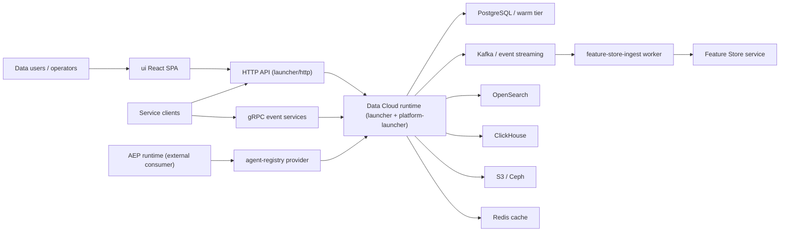
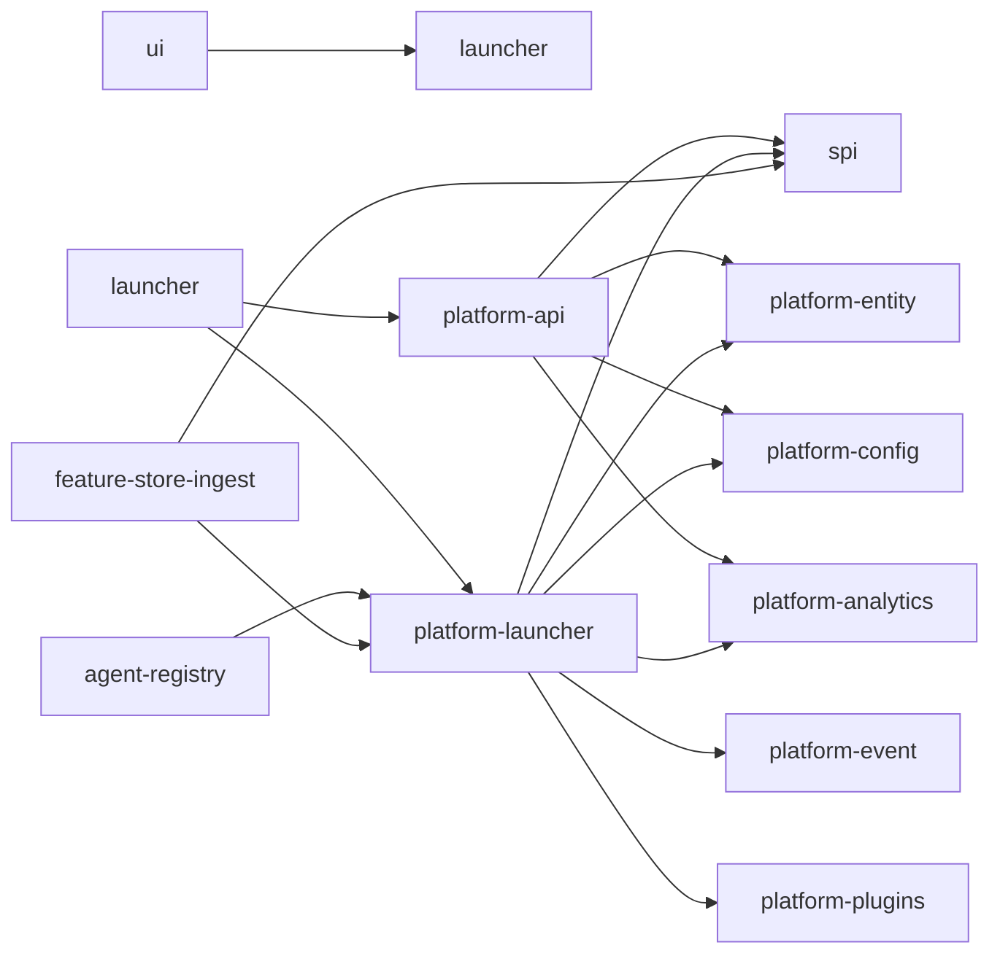
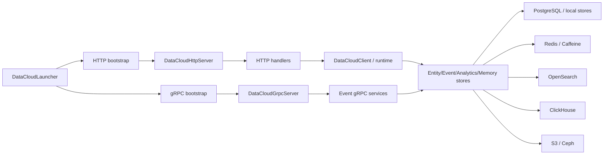
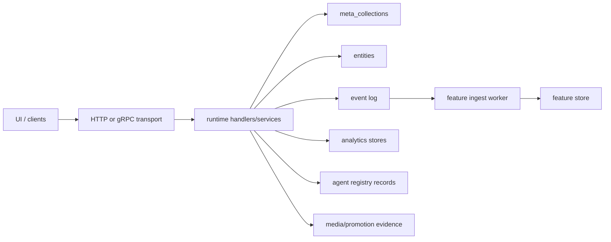

# Data Cloud Product Vision Document

**Document ID:** DC-VISION-001  
**Version:** 2.1  
**Date:** 2026-04-13  
**Evidence Base:** Architecture Documentation Suite + Code Inspection

---

## Executive Summary

**Data Cloud** is an independent, AI/ML-native data management platform serving as the foundational data infrastructure for the Ghatana ecosystem. It provides unified entity storage, event streaming, analytics, governance, and AI/ML capabilities through a plugin-driven, hexagonal architecture.

### Key Architectural Strengths

- **Hexagonal Architecture**: Clean ports-and-adapters pattern with SPI abstraction layer
- **Tenant-Aware by Design**: Tenant isolation is central to the architecture, though current docs still need one reconciled statement on database-level enforcement
- **Event-Driven Core**: Immutable append-only event log with Kafka-backed streaming
- **Plugin Extensibility**: ServiceLoader-based plugin framework for storage/streaming/search
- **Operational Deployment Assets**: Docker, Kubernetes, Helm, and Terraform support are documented

### System Context

### Key Evidence-Based Findings:

- **Strong Modular Architecture**: Clean hexagonal architecture with proper SPI abstraction layer
- **Operational Infrastructure Coverage**: Containerization, deployment, and monitoring assets are documented
- **Comprehensive Storage Layer**: 9 storage connectors including PostgreSQL, ClickHouse, Redis, Kafka, S3, Ceph, OpenSearch
- **AI/ML-Native Design**: Embedded intelligence throughout workflows rather than isolated features
- **Mature Frontend**: React 19 + TypeScript with 38 pages, comprehensive state management, and E2E testing

---

## Product Identity

### Product Name

**Data Cloud** - stylized as "Data-Cloud" in historical documentation

### Problem Statement

Organizations struggle with fragmented data infrastructure where:

- Entity storage, event streaming, analytics, and AI/ML capabilities live in separate silos
- Data governance and lifecycle management are afterthoughts rather than foundational
- AI/ML features are bolted on rather than natively embedded
- Multi-tenant isolation and security are inconsistent across systems
- Real-time data synchronization requires complex custom integration

### Opportunity

Data-Cloud presents a unified, AI/ML-native data platform that:

- Consolidates entity storage, event streaming, analytics, and AI/ML in one coherent system
- Embeds intelligence naturally into data workflows
- Targets strong tenant-aware isolation as a core property, with final readiness wording dependent on validation and documentation reconciliation
- Offers plugin-driven extensibility without architectural compromise
- Enables real-time data synchronization through event sourcing

### Vision Statement

> **Data-Cloud is the intelligent data foundation that makes AI/ML-native data management effortless, secure, and extensible for modern organizations.**

---

## Strategic Goals

### Primary Goals

1. **Unified Data Management**: Provide single, coherent platform for entity storage, event streaming, analytics, and governance
2. **AI/ML-Native Experience**: Embed intelligence naturally into all data workflows rather than treating AI as an add-on
3. **Operational Reliability**: Ensure reliability, security, and observability can be validated and communicated credibly
4. **Developer Experience**: Offer intuitive APIs, comprehensive SDKs, and clear documentation for rapid adoption
5. **Ecosystem Integration**: Serve as foundational data platform for Ghatana ecosystem while maintaining independence

### Secondary Goals

1. **Operational Excellence**: Minimize operational overhead through automated deployment, monitoring, and self-healing
2. **Performance at Scale**: Maintain high performance across data volumes from prototype to production
3. **Compliance by Design**: Build data privacy, governance, and compliance into core architecture
4. **Plugin Ecosystem**: Foster third-party extensibility through well-defined plugin interfaces

---

## Target Users & Personas

### Primary Personas

**Data Platform Engineers**

- Responsibilities: Infrastructure, data architecture, reliability
- Needs: Scalable storage, real-time streaming, observability, multi-tenant security
- Pain Points: Fragmented systems, operational complexity, inconsistent security

**Data Scientists & ML Engineers**

- Responsibilities: Model development, feature engineering, analytics
- Needs: Feature store, model registry, experiment tracking, data access
- Pain Points: Data silos, manual feature engineering, model deployment complexity

**Product Managers & Analysts**

- Responsibilities: Data-driven decisions, reporting, insights
- Needs: Self-service analytics, real-time dashboards, data exploration
- Pain Points: IT bottlenecks, stale data, limited query capabilities

**Application Developers**

- Responsibilities: Building data-driven applications
- Needs: APIs, SDKs, real-time data, authentication
- Pain Points: Complex integrations, inconsistent APIs, rate limiting

### Secondary Personas

**Compliance Officers**

- Responsibilities: Data privacy, audit trails, regulatory compliance
- Needs: Data governance, audit logs, access controls
- Pain Points: Manual compliance processes, audit preparation

**DevOps Engineers**

- Responsibilities: Deployment, monitoring, scaling
- Needs: Containerization, health checks, metrics, automation
- Pain Points: Manual deployment processes, monitoring gaps

---

## Value Proposition

### For Data Platform Engineers

- **Unified Infrastructure**: Single system replacing multiple specialized tools
- **Operational Simplicity**: Containerized deployment with comprehensive monitoring
- **Security by Design**: Multi-tenant isolation built into core architecture
- **Scalability**: Horizontal scaling with proven storage backends

### For Data Scientists & ML Engineers

- **Native AI/ML**: Feature store and model registry integrated, not bolted on
- **Real-time Features**: Streaming feature ingestion for online ML
- **Experiment Tracking**: Built-in metadata and version management
- **Self-Service Access**: Direct API access to data and features

### For Product Managers & Analysts

- **Self-Service Analytics**: Natural language queries and interactive dashboards
- **Real-time Insights**: Live data streaming and change notifications
- **Data Exploration**: Unified interface across all data types
- **Collaboration**: Shared workspaces and curated datasets

### For Application Developers

- **Comprehensive APIs**: REST, GraphQL, WebSocket, and gRPC support
- **Multiple SDKs**: Java, TypeScript, Python client libraries
- **Real-time Updates**: WebSocket and Server-Sent Events
- **Clear Documentation**: OpenAPI specs and usage examples

---

## Architecture Overview

### Module Structure

### Runtime Topology

### Data Flow Architecture

---

## Scope Definition

### In Scope

**Core Capabilities**

- Entity storage with multi-tenant isolation (`platform-entity`, `spi.EntityStore`)
- Event streaming and sourcing (`platform-event`, `spi.EventLogStore`)
- Analytics and reporting engine (`platform-analytics`)
- AI/ML feature store and model registry (`feature-store-ingest`)
- Data governance and lifecycle management
- Plugin-driven extensibility (`platform-plugins`)
- Real-time notifications via WebSocket/SSE
- Multi-modal query (SQL, natural language, visual)

**Storage Backends**

- PostgreSQL (JSONB entities)
- ClickHouse (time-series analytics)
- Redis (hot-tier caching)
- Kafka (event streaming)
- S3/Glacier (cold archival)
- Ceph (object storage)
- OpenSearch (full-text search)
- RocksDB (embedded local store)

**Deployment Modes**

- Standalone product deployment
- Integrated platform deployment
- Environment-specific deployment
- Multi-cloud support

### Out of Scope

**Agentic Orchestration**

- Belongs to AEP (Agentic Event Processor)
- Data-Cloud provides data and execution metadata persistence
- AEP consumes Data-Cloud through public contracts

**Business Intelligence**

- Focus on data infrastructure, not BI tools
- Provide data access for external BI systems
- Basic reporting and analytics included

**Real-time Stream Processing**

- Event streaming and storage provided
- Complex stream processing belongs to specialized systems
- Basic event filtering and routing included

---

## Non-Goals

1. **Replace All Data Tools**: Complement, not replace, specialized tools when appropriate
2. **Universal Data Model**: Support multiple schemas, not enforce single model
3. **Real-time Complex Event Processing**: Focus on data storage and basic event processing
4. **Embedded BI Tool**: Provide data access, not compete with BI platforms
5. **Monolithic Architecture**: Maintain modular, plugin-driven design

---

## Maturity Assessment

### Architecture Readiness: **HIGH** ✅

**Evidence:**

- Clear system architecture and module boundaries
- ADR-backed runtime, storage, and extensibility decisions
- Well-documented API and deployment topology

### Capability Breadth: **HIGH** ✅

**Evidence:**

- Broad documented coverage across storage, events, analytics, governance, and ML-support workflows
- Large requirements and API surface documented in companion artifacts

### Validation Readiness: **MEDIUM** ⚠️

**Evidence:**

- Test inventory and risk docs are present
- Performance, security, and tenant-isolation validation remain incomplete or inconsistently described
- Advanced feature areas are not uniformly validated

### Documentation Quality: **GOOD, BUT STRATEGICALLY INCOMPLETE** ⚠️

**Evidence:**

- Strong implementation-facing documentation
- New companion strategy documents define ICP, positioning, packaging, and metrics
- Market proof, validation evidence, and some top-level readiness claims still need reconciliation

## Companion Strategy Documents

- `04-icp-and-jtbd.md`
- `05-competitive-positioning.md`
- `06-packaging-and-pricing.md`
- `07-success-metrics.md`

---

## Strategic Risks

### High Risk

**Architecture Complexity**

- **Evidence**: Multiple storage backends and plugin system
- **Impact**: Operational overhead and debugging complexity
- **Mitigation**: Comprehensive observability and clear documentation

**Performance at Scale**

- **Evidence**: Multiple abstraction layers and storage systems
- **Impact**: Latency and throughput issues under load
- **Mitigation**: Performance testing and optimization sprints

### Medium Risk

**Ecosystem Dependency**

- **Evidence**: Integration with AEP and other Ghatana products
- **Impact**: Coordination overhead and version compatibility
- **Mitigation**: Stable public contracts and versioning strategy

**Plugin Ecosystem Growth**

- **Evidence**: Plugin-driven extensibility requires adoption
- **Impact**: Limited extensibility if ecosystem doesn't develop
- **Mitigation**: Core plugins and developer experience investment

### Low Risk

**Technology Stack Evolution**

- **Evidence**: ActiveJ, React 19, Java 21 are modern but evolving
- **Impact**: Future migration requirements
- **Mitigation**: Regular technology assessment and migration planning

---

## Known Unknowns

### Market Position

- Competitive differentiation vs. established data platforms
- Pricing strategy and market positioning
- Customer acquisition cost and lifetime value

### Adoption Patterns

- Primary use cases in production environments
- Typical deployment sizes and configurations
- Integration patterns with existing systems

### Performance Characteristics

- Real-world performance under production load
- Scaling limits and bottlenecks
- Resource requirements and cost optimization

---

## Evidence Basis

This vision document is based on comprehensive analysis of:

**Code Evidence**

- 345 Java files in platform-launcher module
- 38 React UI pages with TypeScript
- 9 storage backend implementations
- Complete API surface with OpenAPI spec

**Infrastructure Evidence**

- Docker containerization with health checks
- Kubernetes deployment manifests
- Helm charts for production deployment
- Terraform infrastructure as code

**Testing Evidence**

- Integration tests with Testcontainers
- E2E tests with Playwright
- Architecture fitness functions with ArchUnit
- Contract tests and API validation

**Documentation Evidence**

- Comprehensive README and API docs
- Architecture Decision Records
- Implementation plans and audit reports
- Deployment guides and operational runbooks

---

## Next Steps

### Immediate Actions (1-2 weeks)

1. Validate performance characteristics under load
2. Complete missing test coverage for critical paths
3. Finalize deployment and monitoring setup

### Short-term Actions (1-3 months)

1. Gather production feedback and usage patterns
2. Develop plugin ecosystem and developer experience
3. Optimize performance based on real-world usage

### Long-term Actions (3-12 months)

1. Expand AI/ML capabilities based on user needs
2. Enhance real-time processing and streaming
3. Strengthen ecosystem integration and partnerships

---

_This document represents the evidence-based understanding of Data-Cloud's product vision as of April 3, 2026. It should be updated as new evidence becomes available through production usage and market feedback._
