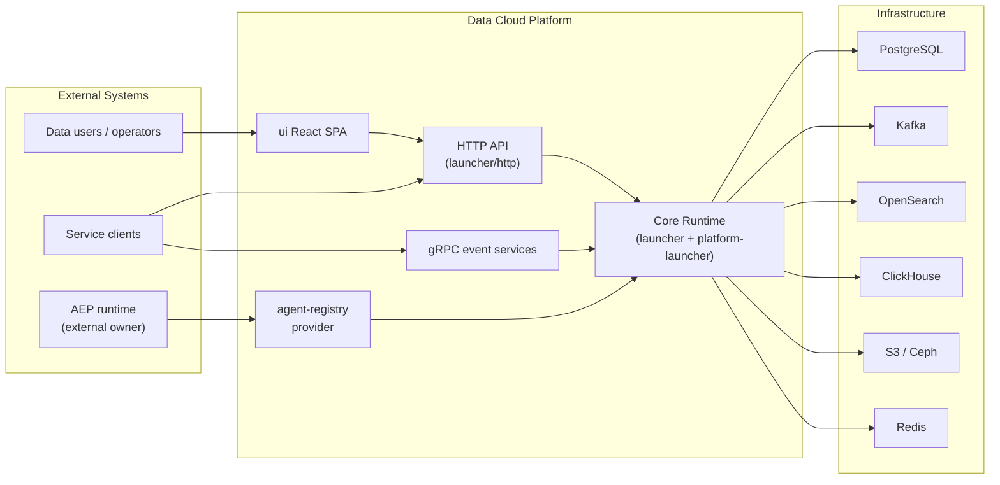
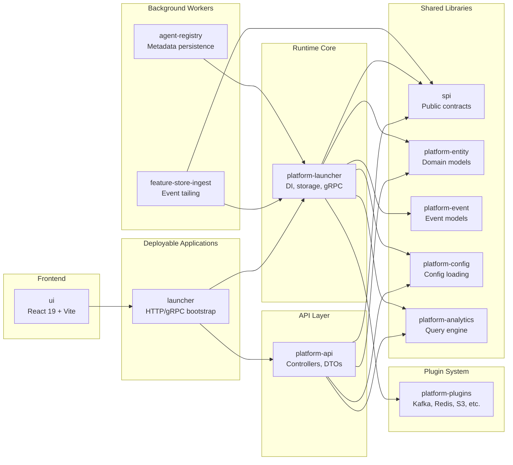
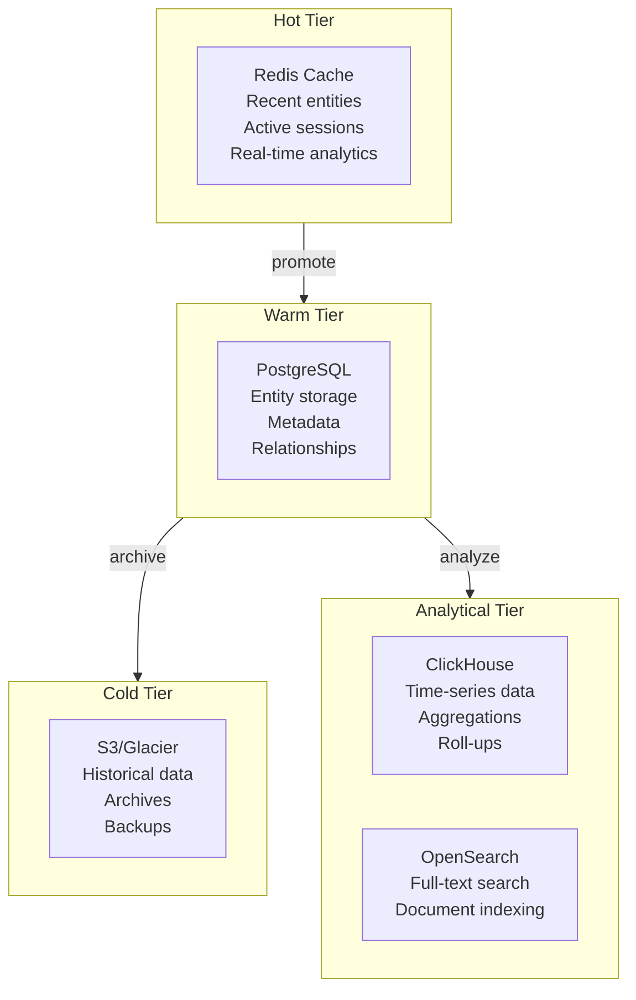
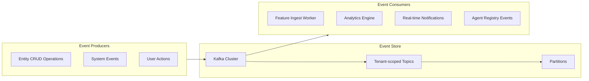

# Data Cloud System Architecture

**Document ID:** DC-ARCH-001  
**Version:** 2.1  
**Date:** 2026-04-13  
**Evidence Base:** Current generated Data Cloud documentation set with readiness reconciliation

---

## Executive Summary

Data Cloud employs a **hexagonal (ports and adapters) architecture** with clear separation between domain logic, infrastructure, and presentation layers. The system is designed for **multi-tenant isolation**, **horizontal scalability**, and **AI/ML-native capabilities**.

### Key Architectural Decisions

1. **Hexagonal Architecture** - SPI abstraction layer for clean boundaries
2. **Tenant-Aware by Design** - Tenant isolation is a core architectural concern, though the exact enforcement model still requires one reconciled statement across the docs
3. **Event Sourcing** - Immutable append-only event log with Kafka
4. **Plugin Extensibility** - ServiceLoader-based plugin framework
5. **Clear AEP Boundary** - Data Cloud provides persistence, AEP owns orchestration

### System Context



### Key Architectural Characteristics:

- **Hexagonal Architecture**: Clean separation of concerns with ports and adapters
- **Tenant-Aware by Design**: Tenant context and isolation are central to the architecture, with readiness proof varying by layer
- **Event-Driven**: Event sourcing with immutable event log
- **Plugin-Driven Extensibility**: Core system enhanced through plugins
- **AI/ML-Native**: Intelligence embedded throughout, not bolted on
- **Cloud-Native**: Containerized, Kubernetes-ready deployment

---

## High-Level Architecture

```
┌─────────────────────────────────────────────────────────────────────────────────┐
│                           External Clients & Ecosystem                            │
├─────────────────────────────────────────────────────────────────────────────────┤
│  Web UI  │  Mobile Apps  │  API Clients  │  AEP  │  External Systems  │  Tools │
└─────────────────────────────────────────────────────────────────────────────────┘
                                            │
                                   ┌────────▼────────┐
                                   │   API Gateway    │
                                   │  (Security,      │
                                   │   Rate Limiting) │
                                   └────────┬─────────┘
                                            │
┌───────────────────────────────────────────▼───────────────────────────────────┐
│                            Presentation Layer                                    │
├─────────────────────────────────────────────────────────────────────────────────┤
│  REST API  │  GraphQL API  │  gRPC API  │  WebSocket  │  Server-Sent Events   │
└─────────────────────────────────────────────────────────────────────────────────┘
                                            │
┌───────────────────────────────────────────▼───────────────────────────────────┐
│                           Application Layer                                    │
├─────────────────────────────────────────────────────────────────────────────────┤
│  Controllers  │  Services  │  Domain Logic  │  Validation  │  Business Rules   │
└─────────────────────────────────────────────────────────────────────────────────┘
                                            │
┌───────────────────────────────────────────▼───────────────────────────────────┐
│                             Domain Layer                                        │
├─────────────────────────────────────────────────────────────────────────────────┤
│  Entities  │  Events  │  Aggregates  │  Domain Services  │  Specifications    │
└─────────────────────────────────────────────────────────────────────────────────┘
                                            │
┌───────────────────────────────────────────▼───────────────────────────────────┐
│                          Infrastructure Layer                                   │
├─────────────────────────────────────────────────────────────────────────────────┤
│  Storage  │  Event Store  │  Cache  │  Search  │  Message Queue  │  Monitoring   │
└─────────────────────────────────────────────────────────────────────────────────┘
                                            │
┌───────────────────────────────────────────▼───────────────────────────────────┐
│                          Deployment Infrastructure                               │
├─────────────────────────────────────────────────────────────────────────────────┤
│  Containers  │  Kubernetes  │  Helm Charts  │  Terraform  │  Monitoring Stack   │
└─────────────────────────────────────────────────────────────────────────────────┘
```

---

## Core Architectural Patterns

### 1. Hexagonal Architecture (Ports and Adapters)

**Purpose**: Isolate domain logic from external concerns

**Evidence**:

- SPI interfaces in `spi/` module define ports
- Multiple storage adapters implement ports
- HTTP controllers act as inbound adapters
- Event streaming acts as outbound adapter

**Structure**:

```
Domain Layer (Core)
├── Entities
├── Domain Services
├── Business Rules
└── Ports (Interfaces)

Application Layer
├── Controllers (Inbound Adapters)
├── Services (Orchestration)
└── Event Publishers (Outbound Adapters)

Infrastructure Layer
├── Storage Adapters
├── Event Store Adapters
├── Cache Adapters
└── Search Adapters
```

### 2. Multi-Tenant Architecture

**Purpose**: Isolate tenant data and operations

**Evidence**:

- `TenantContext` throughout codebase
- `tenant_id` columns in documented persistence paths
- Tenant-scoped Kafka topics
- Tenant-aware resource control intentions in the architecture

**Isolation Levels**:

- **Data Isolation**: Tenant-aware filtering and schema design are documented; database-level enforcement claims should be read together with the caveat and readiness docs
- **Compute Isolation**: Resource quotas and limits are part of the intended model
- **Network Isolation**: Tenant-scoped connections and policies are part of the architecture narrative
- **Event Isolation**: Tenant-specific event streams are documented

### 3. Event-Driven Architecture

**Purpose**: Decouple services through event communication

**Evidence**:

- EventLogStore SPI with Kafka implementation
- Immutable event log design
- Event sourcing patterns
- CQRS-like read/write separation

**Event Flow**:

```
Command → Service → Event → Event Store → Projections → Read Models
```

### 4. Plugin Architecture

**Purpose**: Extensible system without core modifications

**Evidence**:

- Plugin framework with ServiceLoader discovery
- Plugin lifecycle management
- Plugin isolation and communication
- Plugin registry and distribution

---

## Module Architecture

### Module Dependency Graph



---

## Component Architecture

### 1. Data-Cloud Core Platform

```
platform-launcher/ (345 Java files)
├── api/
│   ├── controllers/          # HTTP endpoint handlers
│   ├── dto/                 # Data transfer objects
│   └── graphql/            # GraphQL resolvers
├── application/
│   ├── services/            # Business logic
│   └── policies/            # Business rules
├── domain/
│   ├── entities/            # Domain entities
│   ├── events/              # Domain events
│   └── repositories/        # Repository interfaces
└── infrastructure/
    ├── storage/             # Storage adapters
    ├── events/              # Event store adapters
    ├── cache/               # Cache adapters
    └── search/              # Search adapters
```

### 2. Storage Layer Architecture

**Multi-Backend Storage Strategy**:

```
StorageProvider SPI
├── PostgreSQLAdapter        # Primary entity storage
├── ClickHouseAdapter       # Analytics and time-series
├── RedisAdapter            # Hot-tier caching
├── RocksDBAdapter          # Embedded local storage
├── S3Adapter               # Cold-tier object storage
├── CephAdapter             # Object storage alternative
└── OpenSearchAdapter       # Full-text search
```

**Evidence**: 9 storage connectors implemented in platform-launcher

### 3. Event Streaming Architecture

```
EventLogStore SPI
├── KafkaEventLogStore      # Primary event store
│   ├── Topic Management     # Per-tenant topics
│   ├── Partitioning         # Scalable partitions
│   ├── Retention            # Configurable retention
│   └── Compaction          # Log compaction
└── InMemoryEventLogStore   # Testing and development
```

**Evidence**: Kafka implementation with tenant-scoped topics

### 4. AI/ML Platform Architecture

```
AI/ML Platform
├── Feature Store
│   ├── FeatureStorage      # Feature persistence
│   ├── FeatureCache        # Redis caching
│   └── FeatureLineage      # Feature tracking
├── Model Registry
│   ├── ModelStorage        # Model persistence
│   ├── ModelMetadata       # Model information
│   └── ModelVersioning     # Version management
└── ML Pipelines
    ├── PipelineOrchestrator # Pipeline execution
    ├── ExperimentTracker    # Experiment tracking
    └── ModelServing        # Model inference
```

**Evidence**: AI platform integration in platform-launcher

---

## Data Architecture

### 1. Data Model Architecture

**Entity Model**:

```
EntityRecord
├── id (UUID)
├── tenant_id (String)
├── collection_name (String)
├── record_type (Enum)
├── data (JSONB)
├── metadata (JSONB)
├── created_at (Timestamp)
├── created_by (String)
├── version (Integer)
├── active (Boolean)
├── updated_at (Timestamp)
└── updated_by (String)
```

**Event Model**:

```
EventRecord
├── id (UUID)
├── tenant_id (String)
├── collection_name (String)
├── record_type (Enum)
├── data (JSONB)
├── metadata (JSONB)
├── created_at (Timestamp)
├── created_by (String)
├── stream_name (String)
├── partition_id (Integer)
├── event_offset (BigInt)
├── occurrence_time (Timestamp)
├── detection_time (Timestamp)
├── idempotency_key (String)
├── correlation_id (String)
└── causation_id (String)
```

**Evidence**: Database schema in migration files V001-V010

### 2. Storage Architecture

**Storage Tier Model**:



**Tiered Storage Strategy (ASCII)**:

```
Hot Tier (Redis)
├── Recent entities
├── Active sessions
├── Real-time analytics
└── Cache data

Warm Tier (PostgreSQL)
├── Entity storage
├── Metadata
├── Relationships
└── Indexes

Cold Tier (S3/Glacier)
├── Historical data
├── Archives
├── Backups
└── Compliance data
```

**Evidence**: Storage tier implementation in platform-launcher

### 3. Event Architecture

**Event Topology**:



**Event Streaming Architecture (ASCII)**:

```
Event Flow
├── Event Producers
│   ├── Entity CRUD operations
│   ├── System events
│   ├── User actions
│   └── External integrations
├── Event Store (Kafka)
│   ├── Append-only log
│   ├── Topic partitioning
│   ├── Retention policies
│   └── Compaction
└── Event Consumers
    ├── Projection builders
    ├── Analytics engines
    ├── Real-time notifications
    └── External integrations
```

**Evidence**: Kafka implementation with event sourcing

---

## Security Architecture

### 1. Multi-Tenant Security

**Tenant Isolation Strategy**:

```
Security Layers
├── Network Layer
│   ├── Tenant-scoped networks
│   ├── Network policies
│   └── Firewall rules
├── Application Layer
│   ├── Tenant context
│   ├── Resource quotas
│   └── Access controls
├── Data Layer
│   ├── Tenant-aware filtering and access patterns
│   ├── Tenant-scoped data organization
│   └── Data protection controls
└── Event Layer
│   ├── Tenant-scoped topics
│   ├── Event isolation
│   └── Stream separation
```

**Evidence**: TenantContext implementation and security policies, with final enforcement wording reconciled in the readiness and caveat documents

### 2. Authentication & Authorization

**Security Framework**:

```
Authentication
├── OAuth 2.0 / JWT
├── Multi-factor authentication
├── Session management
└── Token refresh

Authorization
├── Role-Based Access Control (RBAC)
├── Attribute-Based Access Control (ABAC)
├── Permission system
└── Policy enforcement
```

**Evidence**: Security framework in platform-launcher

### 3. Data Protection

**Data Protection Strategy**:

```
Data Protection
├── Encryption at Rest
│   ├── Database encryption
│   ├── File system encryption
│   └── Backup encryption
├── Encryption in Transit
│   ├── TLS 1.3
│   ├── Certificate management
│   └── Mutual TLS
└── Privacy Controls
    ├── PII detection
    ├── Data masking
    └── Consent management
```

**Evidence**: Encryption configuration and privacy controls are documented, though some verification steps remain open in the caveat and risk documents

---

## Deployment Architecture

### 1. Container Architecture

**Container Strategy**:

```
Docker Containers
├── Multi-stage builds
├── Non-root user
├── Health checks
├── Graceful shutdown
└── Resource limits
```

**Evidence**: Multi-stage Dockerfile with health checks

### 2. Kubernetes Architecture

**Kubernetes Deployment**:

```
Kubernetes Resources
├── Deployments
│   ├── Rolling updates
│   ├── Health probes
│   └── Resource requests/limits
├── Services
│   ├── Load balancing
│   ├── Service discovery
│   └── Network policies
├── ConfigMaps
│   ├── Configuration
│   ├── Environment variables
│   └── Feature flags
└── Secrets
    ├── API keys
    ├── Database credentials
    └── Certificates
```

**Evidence**: 9 Kubernetes manifests in k8s/ directory

### 3. Helm Architecture

**Helm Chart Structure**:

```
Helm Chart
├── Chart.yaml
├── values.yaml
├── values-staging.yaml
├── values-production.yaml
└── templates/
    ├── deployment.yaml
    ├── service.yaml
    ├── ingress.yaml
    ├── configmap.yaml
    ├── secret.yaml
    ├── hpa.yaml
    ├── pdb.yaml
    └── networkpolicy.yaml
```

**Evidence**: Helm chart in helm/data-cloud/ directory

---

## Integration Architecture

### 1. API Gateway Architecture

**API Gateway Pattern**:

```
API Gateway
├── Request routing
├── Load balancing
├── Rate limiting
├── Authentication
├── Request/response transformation
└── Monitoring and logging
```

**Evidence**: API gateway configuration in deployment manifests

### 2. Service Mesh Architecture

**Service Integration**:

```
Service Communication
├── HTTP/REST APIs
├── GraphQL APIs
├── gRPC APIs
├── WebSocket connections
├── Server-Sent Events
└── Message queue integration
```

**Evidence**: Multiple API implementations in platform-launcher

### 3. External Integration Architecture

**External System Integration**:

```
External Integrations
├── AEP (Agentic Event Processor)
│   ├── Event cloud integration
│   ├── Agent definition exchange
│   └── Execution metadata sync
├── Storage Systems
│   ├── PostgreSQL
│   ├── ClickHouse
│   ├── Redis
│   ├── Kafka
│   ├── S3/Glacier
│   └── Ceph
└── Monitoring Systems
    ├── Prometheus
    ├── Grafana
    ├── Jaeger
    └── ELK Stack
```

**Evidence**: Integration configurations and adapters

---

## Observability Architecture

### 1. Monitoring Architecture

**Monitoring Stack**:

```
Monitoring Components
├── Metrics Collection
│   ├── Micrometer
│   ├── Prometheus
│   ├── Custom metrics
│   └── Business metrics
├── Distributed Tracing
│   ├── Jaeger
│   ├── Correlation IDs
│   ├── Span propagation
│   └── Trace sampling
├── Logging
│   ├── Structured logging
│   ├── Log aggregation
│   ├── Log correlation
│   └── Log retention
└── Alerting
    ├── Alert rules
    ├── Notification channels
    ├── Escalation policies
    └── Alert suppression
```

**Evidence**: Monitoring configuration in platform-launcher

### 2. Performance Architecture

**Performance Monitoring**:

```
Performance Monitoring
├── Application Performance
│   ├── Response times
│   ├── Throughput
│   ├── Error rates
│   └── Resource utilization
├── Database Performance
│   ├── Query performance
│   ├── Connection pools
│   ├── Index usage
│   └── Lock contention
├── Cache Performance
│   ├── Hit rates
│   ├── Eviction rates
│   ├── Memory usage
│   └── Network latency
└── Event Streaming Performance
    ├── Throughput
    ├── Latency
    ├── Consumer lag
    └── Partition balance
```

**Evidence**: Performance monitoring implementation

---

## Scalability Architecture

### 1. Horizontal Scaling

**Scaling Strategy**:

```
Horizontal Scaling
├── Application Scaling
│   ├── Kubernetes HPA
│   ├── Load balancing
│   ├── Session affinity
│   └── Graceful scaling
├── Database Scaling
│   ├── Read replicas
│   ├── Connection pooling
│   ├── Sharding
│   └── Database clustering
├── Cache Scaling
│   ├── Redis clustering
│   ├── Consistent hashing
│   ├── Cache warming
│   └── Cache invalidation
└── Event Streaming Scaling
    ├── Kafka partitioning
    ├── Consumer scaling
    ├── Topic scaling
    └── Broker scaling
```

**Evidence**: Kubernetes HPA and scaling configurations

### 2. Geographic Scaling

**Multi-Region Architecture**:

```
Geographic Distribution
├── Multi-Region Deployment
│   ├── Region isolation
│   ├── Data replication
│   ├── Failover mechanisms
│   └── Cross-region communication
├── CDN Integration
│   ├── Static content delivery
│   ├── API caching
│   ├── Edge computing
│   └── Geographic routing
└── Disaster Recovery
    ├── Backup strategies
    ├── Recovery procedures
    ├── RTO/RPO targets
    └── Testing procedures
```

**Evidence**: Multi-region deployment patterns in documentation

---

## Technology Architecture

### 1. Backend Technology Stack

**Java Platform**:

```
Backend Stack
├── Java 21
├── ActiveJ Framework
│   ├── HTTP Server
│   ├── Promise API
│   ├── Dependency Injection
│   └── Configuration
├── Data Access
│   ├── JPA/Hibernate
│   ├── JDBC
│   ├── Connection pooling
│   └── Transaction management
├── Event Processing
│   ├── Kafka
│   ├── Event sourcing
│   ├── Stream processing
│   └── Event serialization
└── Testing
    ├── JUnit 5
    ├── Testcontainers
    ├── ArchUnit
    └── Mockito
```

**Evidence**: build.gradle.kts files and implementation

### 2. Frontend Technology Stack

**React Platform**:

```
Frontend Stack
├── React 19
├── TypeScript
├── Vite (Build tool)
├── Tailwind CSS (Styling)
├── Jotai (State management)
├── TanStack Query (Data fetching)
├── React Router (Routing)
├── React Hook Form (Forms)
├── Zod (Validation)
├── Playwright (E2E testing)
├── Vitest (Unit testing)
└── Storybook (Component documentation)
```

**Evidence**: package.json and UI implementation

### 3. Infrastructure Technology Stack

**Cloud Native Stack**:

```
Infrastructure Stack
├── Containers
│   ├── Docker
│   ├── Multi-stage builds
│   └── Security scanning
├── Orchestration
│   ├── Kubernetes
│   ├── Helm
│   └── Terraform
├── Monitoring
│   ├── Prometheus
│   ├── Grafana
│   ├── Jaeger
│   └── Alertmanager
├── Storage
│   ├── PostgreSQL
│   ├── ClickHouse
│   ├── Redis
│   ├── Kafka
│   ├── S3/Glacier
│   └── Ceph
└── Networking
    ├── Load balancers
    ├── Ingress controllers
    ├── Network policies
    └── Service mesh
```

**Evidence**: Infrastructure configuration and deployment manifests

---

## Architectural Decision Records (ADRs)

### Key Architectural Decisions

1. **ADR-DC-001**: Hexagonal Architecture with SPI abstraction
2. **ADR-DC-002**: Multi-tenant isolation at all layers
3. **ADR-DC-003**: Event sourcing with immutable event log
4. **ADR-DC-004**: Plugin-driven extensibility
5. **ADR-DC-005**: AI/ML-native design (not bolted on)
6. **ADR-DC-006**: Multi-backend storage strategy
7. **ADR-DC-007**: Cloud-native deployment with Kubernetes
8. **ADR-DC-008**: Comprehensive observability stack

**Evidence**: ADR documents in docs/ directory

---

## Architecture Quality Assessment

### Strengths

1. **Clean Architecture**: Well-defined layers and boundaries
2. **Multi-tenant Design**: Tenant isolation built into core
3. **Event-Driven**: Proper event sourcing and streaming
4. **Scalable**: Horizontal scaling built-in
5. **Observable**: Comprehensive monitoring and tracing
6. **Secure**: Security built into all layers
7. **Extensible**: Plugin framework for extensions
8. **Operationally Structured**: Deployment and operations assets are documented, with validation depth varying by domain

### Areas for Improvement

1. **Performance Optimization**: Need performance testing and optimization
2. **Documentation**: Some areas need better documentation
3. **Testing**: Some edge cases need better test coverage
4. **Plugin Ecosystem**: Need more plugin examples and documentation

### Technical Debt

1. **Legacy Code**: Some areas have legacy patterns
2. **Complexity**: Some components are complex and need refactoring
3. **Dependencies**: Some dependencies could be optimized
4. **Configuration**: Configuration management could be improved

---

## Evolution Roadmap

### Phase 1: Production Optimization (Next 3 months)

- Performance testing and optimization
- Load testing and capacity planning
- Monitoring and alerting improvements
- Documentation improvements

### Phase 2: Capability Enhancement (3-6 months)

- Advanced AI/ML capabilities
- Enhanced plugin ecosystem
- Improved developer experience
- Geographic scaling

### Phase 3: Ecosystem Growth (6-12 months)

- Third-party integrations
- Community plugins
- Advanced analytics
- Machine learning operations

---

_This architecture overview represents the current state of Data-Cloud architecture as of April 3, 2026. It should be updated as the architecture evolves._
