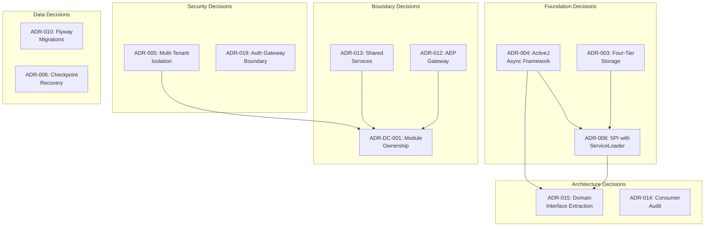
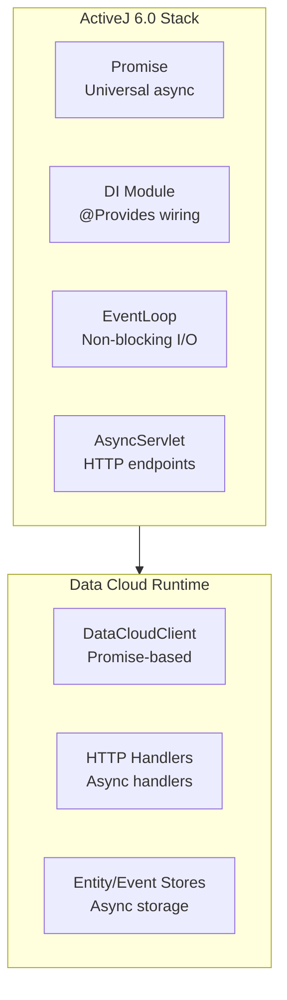
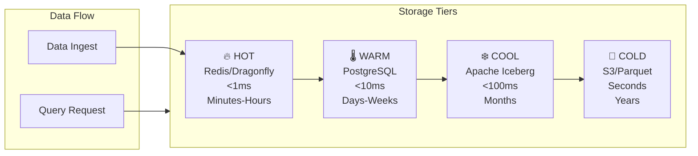
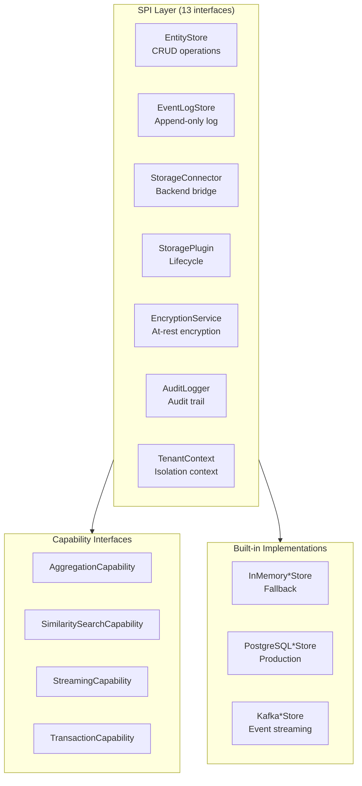
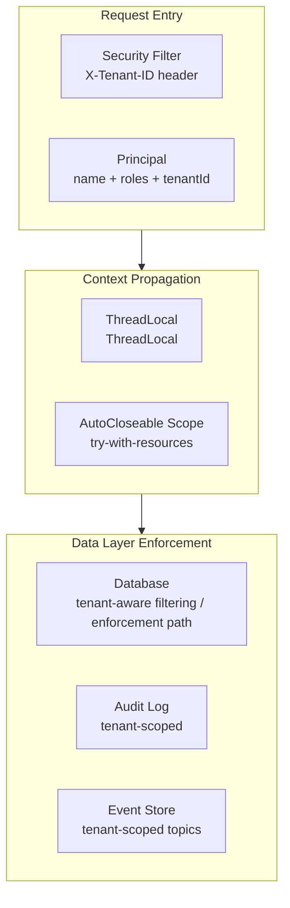
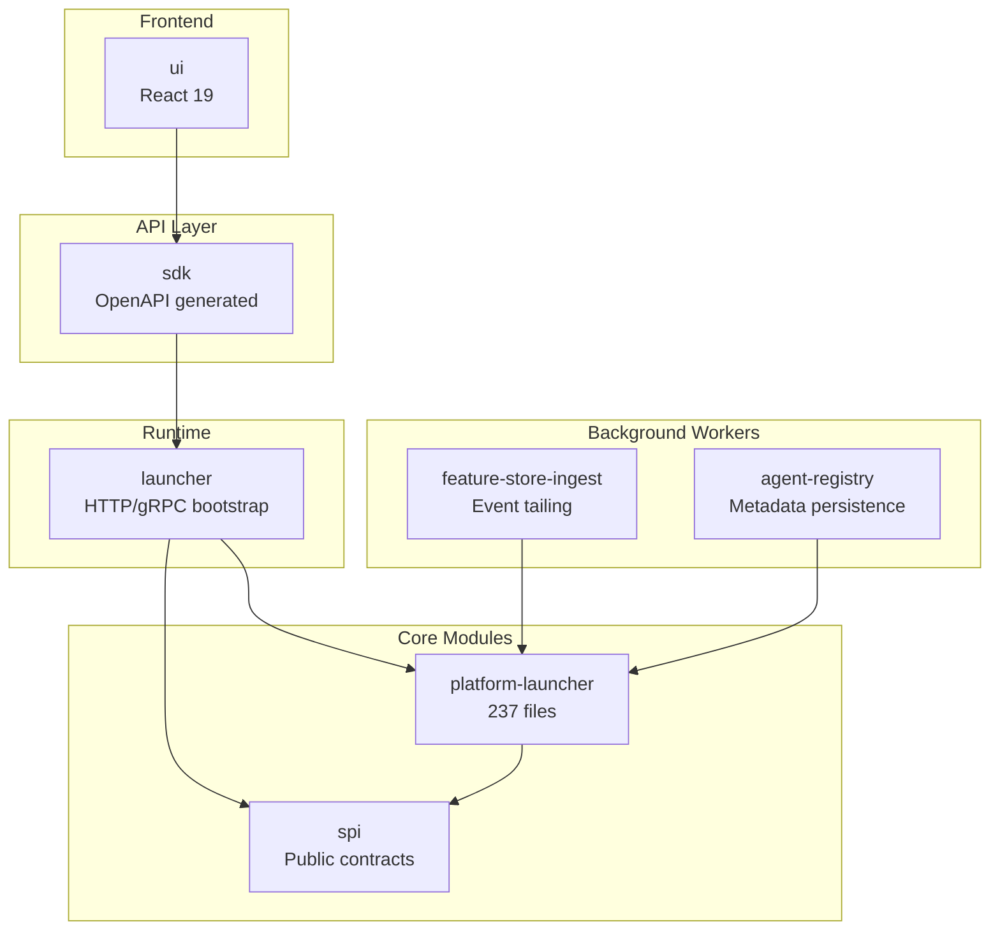
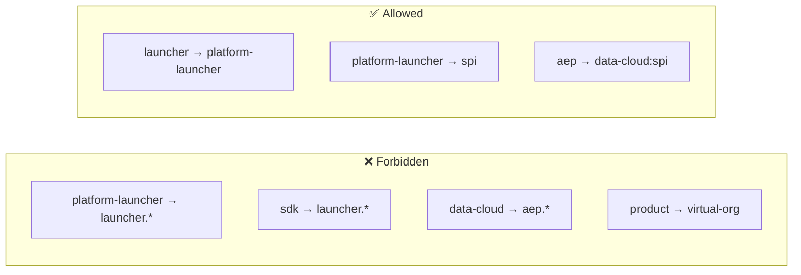
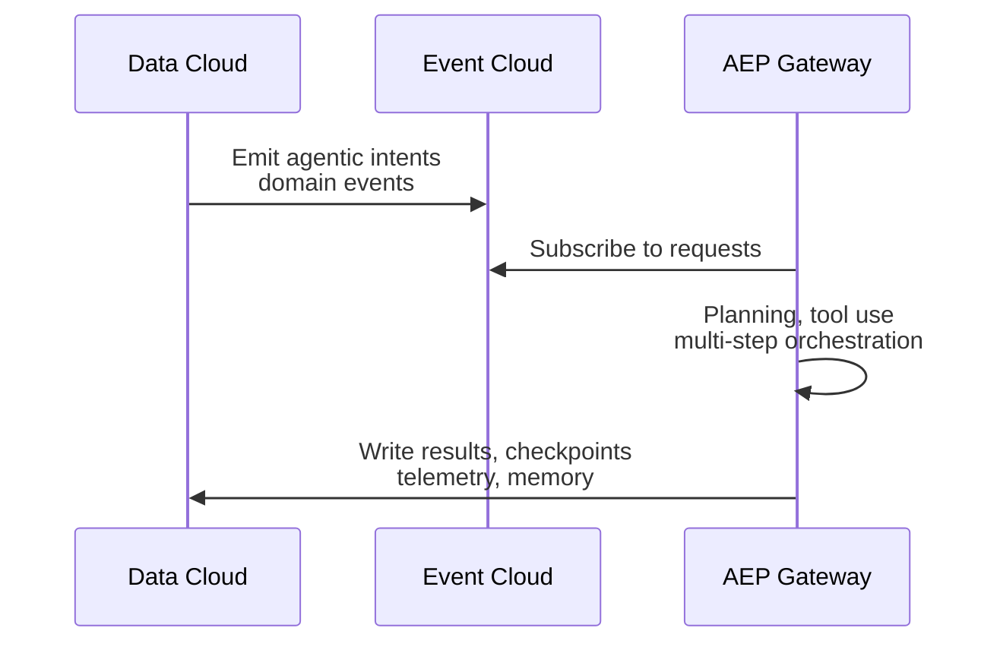
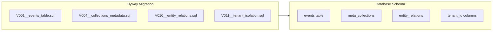
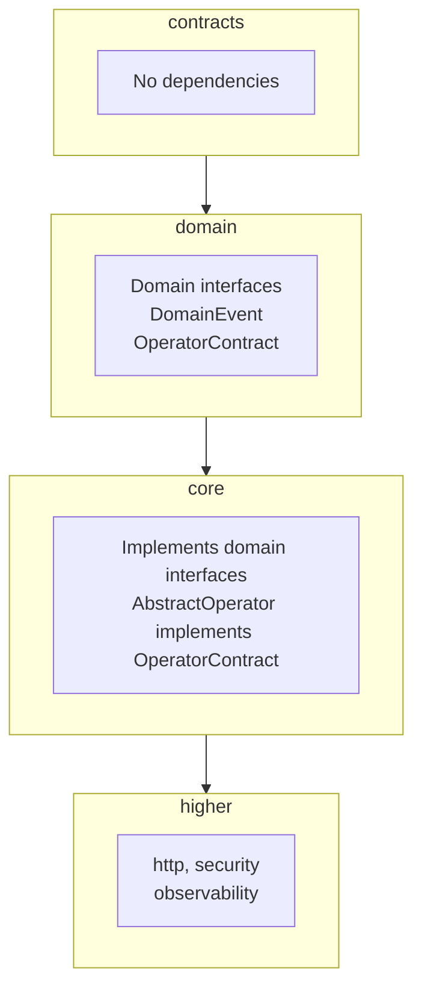

# Data Cloud Comprehensive Architecture Decisions

**Document ID:** DC-ARCH-DEC-001-ENHANCED  
**Version:** 2.0  
**Date:** 2026-04-12  
**Evidence Base:** 12 ADRs + Architecture Documentation Suite

---

## Executive Summary

Data Cloud's architecture is governed by **12 Architecture Decision Records (ADRs)** that define its runtime foundation, storage model, security posture, plugin extensibility, and module boundaries. This document consolidates all architectural decisions with visual diagrams, dependency graphs, and implementation guidance.

### Decision Overview



---

## 1. Runtime Foundation (ADR-004)

### Decision: ActiveJ as Core Async and DI Framework

**Status**: Accepted  
**Date**: 2026-01-10  
**Scope**: All Data Cloud async operations

### Architecture



### Key Patterns

```java
// Promise composition pattern
public Promise<Entity> saveEntity(Entity entity) {
    return validate(entity)
        .map(this::enrichWithMetadata)
        .then(e -> store.save(e))
        .whenComplete((result, error) -> {
            if (error != null) {
                auditLog.recordFailure(error);
            }
        });
}

// Testing pattern
@Test
void shouldSaveEntity() {
    Promise<Entity> promise = client.saveEntity(testEntity);
    Entity result = promise.getResult(); // Blocks for test
    assertThat(result).isNotNull();
}
```

### Consequences

| Aspect       | Impact                                                                            |
| ------------ | --------------------------------------------------------------------------------- |
| **Positive** | Single async primitive, lightweight DI, high performance                          |
| **Negative** | Team must learn Promise patterns, thread-local context requires explicit transfer |
| **Risk**     | `Promise.ofException(e).getResult()` returns null (testing pitfall)               |

---

## 2. Storage Architecture (ADR-003)

### Decision: Four-Tier Event-Cloud Storage with Automatic Lifecycle

**Status**: Accepted  
**Date**: 2026-01-18  
**Scope**: All Data Cloud persistence

### Storage Tier Model



### Tier Configuration

| Tier     | Backend         | Latency | Retention     | Use Case                           |
| -------- | --------------- | ------- | ------------- | ---------------------------------- |
| **HOT**  | Redis/Dragonfly | <1ms    | Minutes-Hours | Real-time queries, active sessions |
| **WARM** | PostgreSQL      | <10ms   | Days-Weeks    | Entity CRUD, recent events         |
| **COOL** | Apache Iceberg  | <100ms  | Months        | Analytics, historical analysis     |
| **COLD** | S3/Parquet      | Seconds | Years         | Archive, compliance                |

### Implementation

```java
// Storage tier enum (enforced by Flyway)
public enum StorageTier {
    HOT, WARM, COOL, COLD
}

// Unified client API
public interface DataCloudClient {
    Promise<Entity> getEntity(String tenantId, String collection, String id);
    // Backend transparently queries appropriate tier
}
```

---

## 3. Plugin Extensibility (ADR-008)

### Decision: Data-Cloud SPI with ServiceLoader Discovery

**Status**: Accepted  
**Date**: 2026-01-18  
**Scope**: Storage backends, plugins

### SPI Architecture



### Discovery Pattern

```java
// ServiceLoader discovery
public static DataCloudClient create() {
    ServiceLoader<EntityStore> loader = ServiceLoader.load(EntityStore.class);
    EntityStore store = loader.findFirst()
        .orElse(new InMemoryEntityStore()); // Always available fallback

    return new DataCloudClient(store);
}

// Testing entry point
DataCloudClient client = DataCloud.forTesting(); // In-memory, no external deps
```

### Capability Detection

```java
// Feature detection via capability interfaces
if (store instanceof TransactionCapability tx) {
    tx.beginTransaction();
    try {
        tx.save(entity);
        tx.commit();
    } catch (Exception e) {
        tx.rollback();
        throw e;
    }
}
```

---

## 4. Multi-Tenant Isolation (ADR-005)

### Decision: Thread-Local TenantContext with Principal Value Object

**Status**: Accepted  
**Date**: 2026-01-25  
**Scope**: All multi-tenant operations

### Isolation Architecture



### Implementation Pattern

```java
// Request entry point
public Promise<Response> handle(HttpRequest request) {
    Principal principal = extractPrincipal(request);

    try (AutoCloseable scope = TenantContext.scope(principal)) {
        // All downstream code implicitly knows the tenant
        String tenantId = TenantContext.getCurrentTenantId();
        return processRequest(request);
    }
    // Context automatically restored on scope exit
}

// Data access layer
public class EntityRepository {
    public List<Entity> findByCollection(String collection) {
        String tenantId = TenantContext.getCurrentTenantId();
        return jdbc.query(
            "SELECT * FROM entities WHERE tenant_id = ? AND collection = ?",
            tenantId, collection
        );
    }
}
```

### Constraints

| Constraint               | Handling                                                    |
| ------------------------ | ----------------------------------------------------------- |
| Thread pool context loss | Explicit capture and re-scope required                      |
| Default tenant           | `"default-tenant"` for development/single-tenant            |
| Cross-thread transfer    | `TenantContext.capture()` → `TenantContext.scope(captured)` |

---

## 5. Module Ownership (ADR-DC-001)

### Decision: Clear Ownership Matrix with Strict Downward Dependencies

**Status**: Accepted  
**Date**: 2026-01-19  
**Scope**: All Data Cloud modules

### Module Dependency Graph



### Ownership Matrix

| Module                 | Domain                      | Owner               | Public Contract                            |
| ---------------------- | --------------------------- | ------------------- | ------------------------------------------ |
| `platform-launcher`    | Runtime services, DI wiring | Data Cloud Platform | `EmbeddedDataCloudClient`, `EventLogStore` |
| `spi`                  | Storage provider SPI        | Data Cloud Platform | `StorageProvider`, `IndexProvider`         |
| `launcher`             | Deployable bootstrap        | Data Cloud Runtime  | `DataCloudLauncher`                        |
| `agent-registry`       | Agent metadata persistence  | Data Cloud AI       | `AgentRegistry`, `AgentDefinition`         |
| `feature-store-ingest` | ML feature ingestion        | Data Cloud AI       | `FeatureIngestService`                     |
| `sdk`                  | External client SDK         | Data Cloud SDK      | `DataCloudClient`                          |
| `ui`                   | React UI components         | Data Cloud Frontend | npm package                                |

### Forbidden Dependencies



---

## 6. AEP Boundary (ADR-012)

### Decision: Preserve AEP Gateway for Agentic Processing

**Status**: Accepted  
**Date**: 2026-02-15  
**Scope**: Data Cloud ↔ AEP integration

### Integration Pattern



### Responsibility Split

| Concern                | Data Cloud                   | AEP                              |
| ---------------------- | ---------------------------- | -------------------------------- |
| **Persistence**        | ✅ Entity/event storage      | ✅ Checkpoint, memory, telemetry |
| **Event streaming**    | ✅ Event cloud               | ✅ Consumes events               |
| **Agentic processing** | ❌ Not in scope              | ✅ Planning, orchestration       |
| **AI/ML features**     | ✅ Embedded ranking, anomaly | ✅ Agent reasoning               |

---

## 7. Schema Management (ADR-010)

### Decision: Flyway for Database Migrations

**Status**: Accepted  
**Date**: 2026-01-20  
**Scope**: All database schema changes

### Migration Architecture



### Key Migrations

| Version | Description          | Impact                   |
| ------- | -------------------- | ------------------------ |
| V001    | Events table         | Core event storage       |
| V004    | Collections metadata | Schema management        |
| V010    | Entity relations     | Graph relationships      |
| V011    | Tenant isolation     | Multi-tenant enforcement |

---

## 8. Domain Interface Extraction (ADR-015)

### Decision: Extract Domain Interfaces to Break Circular Dependencies

**Status**: Accepted  
**Date**: 2026-03-25  
**Scope**: platform/java/core ↔ platform/java/domain

### Clean Architecture Flow



### Migration Phases

| Phase | Action                       | Files                |
| ----- | ---------------------------- | -------------------- |
| 1     | Introduce interfaces         | 3 new interfaces     |
| 2     | Migrate callsites            | 463+ files           |
| 3     | Remove bidirectional imports | Enforce via ArchUnit |
| 4     | Flip build dependency        | Breaking change      |

---

## 9. Decision Cross-Reference Matrix

| Decision                   | Affects               | Related Decisions                                    |
| -------------------------- | --------------------- | ---------------------------------------------------- |
| ADR-004 (ActiveJ)          | All async code        | ADR-008 (SPI uses Promise), ADR-015 (async patterns) |
| ADR-003 (Four-Tier)        | Storage backends      | ADR-008 (SPI implementations)                        |
| ADR-008 (SPI)              | Plugin architecture   | ADR-003 (tier implementations), ADR-004 (Promise)    |
| ADR-005 (Multi-Tenant)     | Security, data access | ADR-DC-001 (handler allocation), ADR-019 (auth)      |
| ADR-DC-001 (Ownership)     | Module structure      | ADR-013 (shared services), ADR-012 (AEP boundary)    |
| ADR-013 (Shared Services)  | feature-store-ingest  | ADR-DC-001 (module placement)                        |
| ADR-012 (AEP Gateway)      | Integration pattern   | ADR-DC-001 (agent-registry)                          |
| ADR-010 (Flyway)           | Schema evolution      | All data storage                                     |
| ADR-015 (Domain Interface) | Clean architecture    | ADR-004 (async patterns)                             |
| ADR-019 (Auth Gateway)     | Security boundary     | ADR-005 (tenant isolation)                           |

---

## 10. Implementation Checklist

### For New Features

- [ ] Does it respect the module ownership matrix?
- [ ] Does it use Promise for async operations?
- [ ] Does it properly handle TenantContext?
- [ ] Does it use the SPI for extensibility?
- [ ] Does it include Flyway migrations if needed?
- [ ] Does it update the OpenAPI spec?

### For Code Review

- [ ] No forbidden dependencies introduced
- [ ] No circular dependencies created
- [ ] ADR patterns followed consistently
- [ ] Tests use `DataCloud.forTesting()` where appropriate

---

## 11. References

### ADR Documents

- [ADR-DC-001: Module Ownership](./adr-dc-001-module-ownership.md)
- [ADR-Index: All ADRs](./00-adr-index.md)

### Related Documentation

- [System Architecture](./01-system-architecture.md)
- [Technical Overview](../04-technical-docs-stack-caveats-guidance/01-technical-overview.md)
- [Engineering Caveats](../04-technical-docs-stack-caveats-guidance/03-engineering-caveats.md)

### Source ADRs (Platform Level)

- `/docs/adr/ADR-003-four-tier-event-cloud.md`
- `/docs/adr/ADR-004-activej-framework.md`
- `/docs/adr/ADR-005-multi-tenant-isolation.md`
- `/docs/adr/ADR-008-datacloud-spi.md`
- `/docs/adr/ADR-012-keep-aep-gateway.md`
- `/docs/adr/ADR-013-shared-services-ownership.md`
- `/docs/adr/ADR-015-domain-interface-extraction.md`
- `/docs/adr/ADR-019-auth-gateway-security-gateway-boundary.md`

---

_This comprehensive architecture decisions document consolidates all ADRs with visual diagrams and implementation guidance. Last updated: April 12, 2026._
