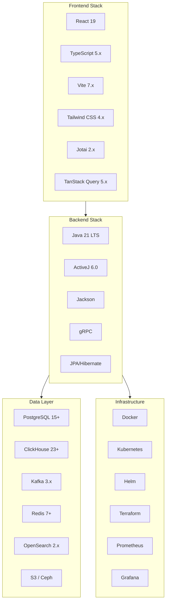

# Data Cloud Technical Overview

**Document ID:** DC-TECH-001  
**Version:** 2.1  
**Date:** 2026-04-29  
**Evidence Base:** Architecture Documentation + Build Configuration Analysis

> **Verification Status Key** (DC-A11)
>
> | Label | Meaning |
> |-------|---------|
> | ✅ **verified-locally** | Exercised by unit or integration tests running against H2 / Testcontainers in CI. |
> | 🔵 **integration-validated** | Exercised by end-to-end or cross-service tests against real infrastructure (e.g., live PostgreSQL, Redis). |
> | 🟡 **deployment-validated** | Verified in a deployed staging or production environment. |
> | ⚪ **architecture-only** | Described in design docs; no automated verification exists yet. |
>
> Individual capability claims below are tagged accordingly.

---

## Executive Summary

Data Cloud is built on a **modern, cloud-native technology stack** with **Java 21 + ActiveJ** for the backend and **React 19 + TypeScript** for the frontend. This enhanced technical overview provides comprehensive stack diagrams, dependency maps, and architecture context.

### Technology Stack at a Glance



### Key Technology Characteristics:
- **Backend**: Java 21 + ActiveJ 6.0 with async Promise-based programming
- **Frontend**: React 19 + TypeScript with modern tooling (Vite, Tailwind)
- **Database**: Multi-backend strategy (PostgreSQL, ClickHouse, Redis, Kafka)
- **Infrastructure**: Docker + Kubernetes + Helm + Terraform
- **Observability**: Prometheus + Grafana + Jaeger + ELK stack
- **Testing**: JUnit 5 + Testcontainers + Playwright + Vitest

---

## Backend Technology Stack

### 1. Core Platform

#### Java Platform
```
Java Environment:
├── Java 21 (LTS)
│   ├── Virtual threads
│   ├── Pattern matching
│   ├── Record types
│   └── Sealed classes
├── ActiveJ Framework 6.0
│   ├── HTTP Server
│   ├── Promise API (async)
│   ├── Dependency Injection
│   ├── Event Loop
│   └── Configuration
└── Build System
    ├── Gradle 8.x
    ├── Kotlin DSL
    └── Multi-module builds
```

**Evidence**: `build.gradle.kts` files, Java 21 toolchain configuration

#### Core Libraries
```
Backend Libraries:
├── HTTP & Networking
│   ├── ActiveJ HTTP
│   ├── gRPC (Netty shaded)
│   └── Jackson (JSON processing)
├── Data Access
│   ├── JPA/Hibernate
│   ├── HikariCP (connection pooling)
│   ├── Flyway (migrations)
│   └── JDBC drivers
├── Event Processing
│   ├── Kafka clients
│   ├── Event sourcing
│   └── Stream processing
├── Caching
│   ├── Redis (Jedis)
│   ├── Caffeine (local cache)
│   └── LMAX Disruptor (ring buffer)
├── Testing
│   ├── JUnit 5
│   ├── Testcontainers
│   ├── Mockito
│   ├── ArchUnit
│   └── ActiveJ test utilities
└── Utilities
    ├── Lombok (boilerplate reduction)
    ├── SLF4J + Log4j (logging)
    ├── Micrometer (metrics)
    └── Jackson (JSON)
```

**Evidence**: Dependency declarations in `build.gradle.kts` files

### 2. Storage & Data Layer

#### Database Technologies
```
Storage Backends:
├── Relational
│   ├── PostgreSQL 15+
│   │   ├── JSONB support
│   │   ├── Full-text search
│   │   └── Partitioning
│   └── H2 (testing)
├── Analytics
│   ├── ClickHouse 23+
│   │   ├── Time-series optimization
│   │   ├── Columnar storage
│   │   └── Real-time analytics
│   └── OpenSearch 2.x
│       ├── Full-text search
│       ├── Document storage
│       └── Aggregation
├── Caching
│   ├── Redis 7+
│   │   ├── Data structures
│   │   ├── Pub/Sub
│   │   └── Clustering
│   └── RocksDB
│       ├── Embedded storage
│       ├── Key-value store
│       └── Local persistence
├── Object Storage
│   ├── S3/Glacier
│   │   ├── Tiered storage
│   │   ├── Lifecycle policies
│   │   └── Glacier archival
│   └── Ceph
│       ├── S3-compatible API
│       ├── Distributed storage
│       └── Self-hosted option
└── Event Streaming
    ├── Kafka 3.x
    │   ├── Event sourcing
    │   ├── Partitioning
    │   ├── Compaction
    │   └── Exactly-once semantics
    └── Redpanda (Kafka compatible)
```

**Evidence**: Storage connector implementations in platform-launcher

#### Data Access Patterns
```
Data Access Architecture:
├── Repository Pattern
│   ├── EntityStore SPI
│   ├── EventLogStore SPI
│   └── StorageProvider SPI
├── ORM Integration
│   ├── JPA entities
│   ├── Hibernate mappings
│   ├── Query optimization
│   └── Connection pooling
├── Migration Management
│   ├── Flyway migrations
│   ├── Version control
│   ├── Rollback support
│   └── Schema evolution
└── Query Optimization
    ├── Indexing strategy
    ├── Query caching
    ├── Connection pooling
    └── Performance monitoring
```

**Evidence**: Repository interfaces, migration files, query optimization

### 3. Event Streaming Architecture

#### Kafka Integration
```
Event Streaming Stack:
├── Kafka Cluster
│   ├── Topic management
│   ├── Partitioning strategy
│   ├── Replication
│   └── Retention policies
├── Producer Configuration
│   ├── Exactly-once semantics
│   ├── Transactional writes
│   ├── Compression
│   └── Batch optimization
├── Consumer Configuration
│   ├── Consumer groups
│   ├── Offset management
│   ├── Rebalancing
│   └── Fault tolerance
└── Stream Processing
    ├── Event filtering
    ├── Event transformation
    ├── Event aggregation
    └── Event routing
```

**Evidence**: Kafka configuration, event streaming implementation

---

## Frontend Technology Stack

### 1. Core Framework

#### React Platform
```
React Environment:
├── React 19
│   ├── Concurrent features
│   ├── Server components
│   ├── Suspense
│   └── Automatic batching
├── TypeScript 5.x
│   ├── Strict typing
│   ├── Type inference
│   ├── Interface definitions
│   └── Type safety
├── Vite 7.x
│   ├── Fast development server
│   ├── Hot module replacement
│   ├── Optimized builds
│   └── Plugin ecosystem
└── Modern JavaScript
    ├── ES2022 features
    ├── Dynamic imports
    ├── Async/await
    └── Module system
```

**Evidence**: `package.json`, `tsconfig.json`, Vite configuration

#### State Management
```
State Management Architecture:
├── Jotai 2.x
│   ├── Atomic state
│   ├── React hooks
│   ├── TypeScript support
│   └── Devtools
├── TanStack Query 5.x
│   ├── Server state
│   ├── Caching
│   ├── Background updates
│   └── Optimistic updates
├── React Hook Form 7.x
│   ├── Form state
│   ├── Validation
│   ├── Performance
│   └── TypeScript support
└── Local State
    ├── useState
    ├── useReducer
    ├── useContext
    └── Custom hooks
```

**Evidence**: Store implementations, state management patterns

### 2. UI Framework & Styling

#### Component Architecture
```
UI Component Stack:
├── Component Library
│   ├── @ghatana/design-system
│   ├── @ghatana/theme
│   ├── @ghatana/platform-utils
│   └── Custom components
├── Styling Solution
│   ├── Tailwind CSS 4.x
│   ├── PostCSS
│   ├── Responsive design
│   └── Dark mode support
├── Icon System
│   ├── Lucide React
│   ├── Custom icons
│   ├── SVG optimization
│   └── Icon consistency
└── Component Patterns
    ├── Compound components
    ├── Render props
    ├── Custom hooks
    └── Higher-order components
```

**Evidence**: Component implementations, styling configuration

#### Accessibility & UX
```
Accessibility Stack:
├── WCAG 2.1 AA Compliance
│   ├── Semantic HTML
│   ├── ARIA labels
│   ├── Keyboard navigation
│   └── Screen reader support
├── Testing Tools
│   ├── @axe-core/react
│   ├── Playwright accessibility
│   ├── Manual testing
│   └── Automated checks
├── User Experience
│   ├── Responsive design
│   ├── Mobile optimization
│   ├── Performance optimization
│   └── Error handling
└── Internationalization
    ├── i18n support
    ├── Localization
    ├── RTL support
    └── Accessibility
```

**Evidence**: Accessibility implementation, testing configuration

### 3. Data Fetching & API Integration

#### API Client Architecture
```
API Integration Stack:
├── HTTP Client
│   ├── Fetch API
│   ├── Request interceptors
│   ├── Response handling
│   └── Error handling
├── Data Fetching
│   ├── TanStack Query
│   ├── Request caching
│   ├── Background refetching
│   └── Optimistic updates
├── Real-time Communication
│   ├── WebSocket client
│   ├── Server-Sent Events
│   ├── Reconnection logic
│   └── Event handling
└── Type Safety
    ├── Zod schemas
    ├── Type generation
    ├── Runtime validation
    └── API contracts
```

**Evidence**: API client implementation, data fetching patterns

---

## Infrastructure & DevOps Stack

### 1. Containerization & Orchestration

#### Docker Implementation
```
Container Strategy:
├── Multi-stage Dockerfile
│   ├── Build stage
│   ├── Runtime stage
│   ├── Security hardening
│   └── Size optimization
├── Security Features
│   ├── Non-root user
│   ├── Minimal base image
│   ├── Security scanning
│   └── Vulnerability patching
├── Health Checks
│   ├── Application health
│   ├── Database connectivity
│   ├── Dependency health
│   └── Graceful shutdown
└── Performance Tuning
    ├── ZGC garbage collector
    ├── Memory optimization
    ├── CPU tuning
    └── Network optimization
```

**Evidence**: Dockerfile, container configuration, security settings

#### Kubernetes Deployment
```
Kubernetes Stack:
├── Workload Resources
│   ├── Deployments
│   ├── ReplicaSets
│   ├── DaemonSets
│   └── Jobs/CronJobs
├── Service Resources
│   ├── Services
│   ├── Ingress
│   ├── Network policies
│   └── Service discovery
├── Configuration
│   ├── ConfigMaps
│   ├── Secrets
│   ├── Environment variables
│   └── Feature flags
├── Scaling & HA
│   ├── Horizontal Pod Autoscaler
│   ├── Pod Disruption Budgets
│   ├── Resource limits
│   └── Affinity rules
└── Storage
    ├── PersistentVolumes
    ├── StorageClasses
    ├── Volume claims
    └── Backup strategies
```

**Evidence**: Kubernetes manifests, deployment configurations

### 2. Package Management & Deployment

#### Helm Charts
```
Helm Chart Structure:
├── Chart Configuration
│   ├── Chart.yaml
│   ├── Values files
│   ├── Templates
│   └── Dependencies
├── Environment Support
│   ├── Development
│   ├── Staging
│   ├── Production
│   └── Custom environments
├── Deployment Features
│   ├── Rolling updates
│   ├── Rollback support
│   ├── Health checks
│   └── Graceful shutdown
└── Configuration Management
    ├── Value overrides
    ├── Secret management
    ├── Config injection
    └── Feature toggles
```

**Evidence**: Helm chart structure, value files, templates

#### Infrastructure as Code
```
Terraform Stack:
├── AWS Resources
│   ├── VPC configuration
│   ├── Subnet design
│   ├── Security groups
│   └── IAM roles
├── Kubernetes Infrastructure
│   ├── EKS cluster
│   ├── Node groups
│   ├── Add-ons
│   └── Monitoring
├── Storage Infrastructure
│   ├── RDS instances
│   ├── S3 buckets
│   ├── EFS volumes
│   └── Backup
└── Networking
    ├── Load balancers
    ├── DNS records
    ├── SSL certificates
    └── CDN configuration
```

**Evidence**: Terraform configurations, infrastructure definitions

---

## Observability & Monitoring Stack

### 1. Metrics & Monitoring

#### Prometheus Integration
```
Monitoring Stack:
├── Metrics Collection
│   ├── Micrometer
│   ├── Custom metrics
│   ├── JVM metrics
│   └── Business metrics
├── Prometheus Server
│   ├── Metrics storage
│   ├── Querying
│   ├── Alerting
│   └── Federation
├── Grafana Dashboards
│   ├── System metrics
│   ├── Application metrics
│   ├── Business metrics
│   └── Custom dashboards
└── Alerting
    ├── Alert rules
    ├── Alertmanager
    ├── Notification channels
    └── Escalation policies
```

**Evidence**: Metrics configuration, dashboard definitions, alert rules

#### Distributed Tracing
```
Tracing Stack:
├── Jaeger Integration
│   ├── Distributed tracing
│   ├── Span propagation
│   ├── Sampling strategies
│   └── Trace storage
├── Correlation IDs
│   ├── Request tracing
│   ├── Event correlation
│   ├── Log correlation
│   └── Debugging support
├── Performance Analysis
│   ├── Latency analysis
│   ├── Dependency analysis
│   ├── Bottleneck identification
│   └── Optimization insights
└── Observability
    ├── Request flows
    ├── Service dependencies
    ├── Error tracking
    └── Performance trends
```

**Evidence**: Tracing configuration, correlation ID implementation

### 2. Logging & Audit

#### Logging Architecture
```
Logging Stack:
├── Structured Logging
│   ├── SLF4J + Log4j2
│   ├── JSON format
│   ├── Correlation IDs
│   └── Context propagation
├── Log Aggregation
│   ├── ELK Stack
│   ├── Log collection
│   ├── Indexing
│   └── Search capabilities
├── Audit Logging
│   ├── Security events
│   ├── Data access
│   ├── System changes
│   └── Compliance reporting
└── Log Management
    ├── Retention policies
    ├── Rotation strategies
    ├── Compression
    └── Archive management
```

**Evidence**: Logging configuration, audit implementation, log management

---

## Security Technology Stack

### 1. Authentication & Authorization

#### Security Framework
```
Security Stack:
├── Authentication
│   ├── OAuth 2.0
│   ├── JWT tokens
│   ├── Multi-factor auth
│   └── Session management
├── Authorization
│   ├── RBAC implementation
│   ├── ABAC support
│   ├── Permission system
│   └── Policy enforcement
├── Data Protection
│   ├── Encryption at rest
│   ├── Encryption in transit
│   ├── Key management
│   └── Data masking
└── Security Monitoring
    ├── Threat detection
    ├── Anomaly detection
    ├── Security alerts
    └── Compliance monitoring
```

**Evidence**: Security implementation, authentication/authorization code

### 2. Network & Infrastructure Security

#### Security Controls
```
Infrastructure Security:
├── Network Security
│   ├── Firewalls
│   ├── Network policies
│   ├── TLS encryption
│   └── mTLS (service mesh)
├── Container Security
│   ├── Image scanning
│   ├── Runtime security
│   ├── Vulnerability management
│   └── Secure defaults
├── Cloud Security
│   ├── IAM policies
│   ├── Network isolation
│   ├── Data encryption
│   └── Compliance controls
└── Application Security
    ├── Input validation
    ├── Output encoding
    ├── CSRF protection
    └── Security headers
```

**Evidence**: Security configurations, network policies, encryption settings

---

## Development & Testing Stack

### 1. Development Tools

#### Development Environment
```
Development Stack:
├── IDE Support
│   ├── IntelliJ IDEA
│   ├── VS Code
│   ├── Language servers
│   └── Debugging support
├── Build Tools
│   ├── Gradle 8.x
│   ├── Kotlin DSL
│   ├── Build caching
│   └── Parallel execution
├── Code Quality
│   ├── Spotless (formatting)
│   ├── Checkstyle
│   ├── PMD
│   └── SonarQube
└── Developer Experience
    ├── Hot reload
    ├── Debugging tools
    ├── Performance profiling
    └── Documentation generation
```

**Evidence**: Build configuration, quality tools, development setup

### 2. Testing Framework

#### Testing Architecture
```
Testing Stack:
├── Backend Testing
│   ├── JUnit 5
│   ├── Mockito
│   ├── Testcontainers
│   ├── ArchUnit
│   └── Performance testing
├── Frontend Testing
│   ├── Vitest
│   ├── Playwright
│   ├── React Testing Library
│   ├── MSW
│   └── Accessibility testing
├── Integration Testing
│   ├── Docker Compose
│   ├── Testcontainers
│   ├── Real services
│   └── End-to-end testing
└── Quality Assurance
    ├── Code coverage
    ├── Mutation testing
    ├── Contract testing
    └── Performance testing
```

**Evidence**: Test configurations, testing frameworks, CI/CD integration

---

## AI/ML Technology Stack

### 1. Machine Learning Platform

#### ML Infrastructure
```
ML/AI Stack:
├── Model Management
│   ├── Model registry
│   ├── Version control
│   ├── Metadata tracking
│   └── Model serving
├── Feature Engineering
│   ├── Feature store
│   ├── Feature pipelines
│   ├── Feature monitoring
│   └── Feature lineage
├── Experiment Tracking
│   ├── Experiment logging
│   ├── Parameter tracking
│   ├── Metric tracking
│   └── Result comparison
└── Model Operations
    ├── Model deployment
    ├── Model monitoring
    ├── A/B testing
    └── Model retraining
```

**Evidence**: ML platform implementation, feature store, model registry

### 2. AI Integration

#### AI Capabilities
```
AI Integration Stack:
├── Natural Language Processing
│   ├── Query understanding
│   ├── Intent classification
│   ├── Entity recognition
│   └── Response generation
├── Recommendation Engine
│   ├── Collaborative filtering
│   ├── Content-based filtering
│   ├── Hybrid approaches
│   └── Real-time recommendations
├── Anomaly Detection
│   ├── Statistical methods
│   ├── Machine learning
│   ├── Real-time detection
│   └── Alerting
└── Predictive Analytics
    ├── Time series forecasting
    ├── Trend analysis
    ├── Pattern recognition
    └── Insights generation
```

**Evidence**: AI service implementations, recommendation engine, analytics

---

## Performance & Optimization Stack

### 1. Performance Monitoring

#### Performance Tools
```
Performance Stack:
├── Application Performance
│   ├── Response time monitoring
│   ├── Throughput tracking
│   ├── Error rate monitoring
│   └── Resource utilization
├── Database Performance
│   ├── Query performance
│   ├── Connection pooling
│   ├── Index optimization
│   └── Query caching
├── Cache Performance
│   ├── Hit rate monitoring
│   ├── Cache optimization
│   ├── Memory usage
│   └── Eviction strategies
└── Network Performance
    ├── Latency monitoring
    ├── Bandwidth usage
    ├── Connection pooling
    └── Network optimization
```

**Evidence**: Performance monitoring implementation, optimization strategies

### 2. Optimization Techniques

#### Performance Optimization
```
Optimization Stack:
├── Application Optimization
│   ├── Async programming
│   ├── Connection pooling
│   ├── Caching strategies
│   └── Resource management
├── Database Optimization
│   ├── Query optimization
│   ├── Index strategy
│   ├── Partitioning
│   └── Materialized views
├── Cache Optimization
│   ├── Multi-level caching
│   ├── Cache warming
│   ├── Cache invalidation
│   └── Cache distribution
└── Network Optimization
    ├── Connection reuse
    ├── Compression
    ├── CDN usage
    └── Load balancing
```

**Evidence**: Optimization implementations, performance tuning

---

## Technology Evolution Roadmap

### Phase 1: Technology Optimization (Next 3 months)
- Performance optimization and tuning
- Security hardening and compliance
- Monitoring and observability enhancement
- Developer experience improvements

### Phase 2: Technology Enhancement (3-6 months)
- Advanced AI/ML capabilities
- Enhanced security features
- Improved scalability
- Better developer tools

### Phase 3: Technology Innovation (6-12 months)
- Cutting-edge AI/ML integration
- Advanced security features
- Innovative performance optimizations
- Next-generation developer experience

---

## Technology Risk Assessment

### High-Risk Technologies

| Technology | Risk | Impact | Mitigation |
|------------|------|--------|------------|
| **ActiveJ Framework** | Niche framework, limited community | Vendor lock-in, talent availability | Document patterns, consider migration path |
| **Java 21** | Latest LTS, limited production experience | Compatibility issues, bugs | Thorough testing, gradual adoption |
| **React 19** | Latest version, potential instability | UI bugs, breaking changes | Careful adoption, version pinning |

### Medium-Risk Technologies

| Technology | Risk | Impact | Mitigation |
|------------|------|--------|------------|
| **ClickHouse** | Specialized database, limited expertise | Performance issues, support | Expert training, vendor support |
| **Kafka** | Complex operational requirements | Operational overhead | Managed services, expertise building |
| **Kubernetes** | Complex infrastructure management | Deployment complexity | Managed services, automation |

### Low-Risk Technologies

| Technology | Risk | Impact | Mitigation |
|------------|------|--------|------------|
| **PostgreSQL** | Well-established, stable | Low | Standard practices |
| **Redis** | Mature technology | Low | Standard practices |
| **Docker** | Industry standard | Low | Standard practices |

---

## Technology Recommendations

### Immediate Actions (1-2 weeks)
1. **Performance Testing**: Comprehensive performance testing of all components
2. **Security Hardening**: Complete security audit and hardening
3. **Monitoring Enhancement**: Improve monitoring and alerting coverage

### Short-term Actions (1-3 months)
1. **Technology Training**: Team training on specialized technologies
2. **Documentation**: Comprehensive technology documentation
3. **Tooling**: Improve development and operational tooling

### Long-term Actions (3-12 months)
1. **Technology Evaluation**: Regular technology assessment and evolution
2. **Innovation**: Explore emerging technologies and patterns
3. **Optimization**: Continuous performance and security optimization

---

*This technical overview represents the current state of Data-Cloud technology as of April 3, 2026. It should be updated as the technology stack evolves.*
