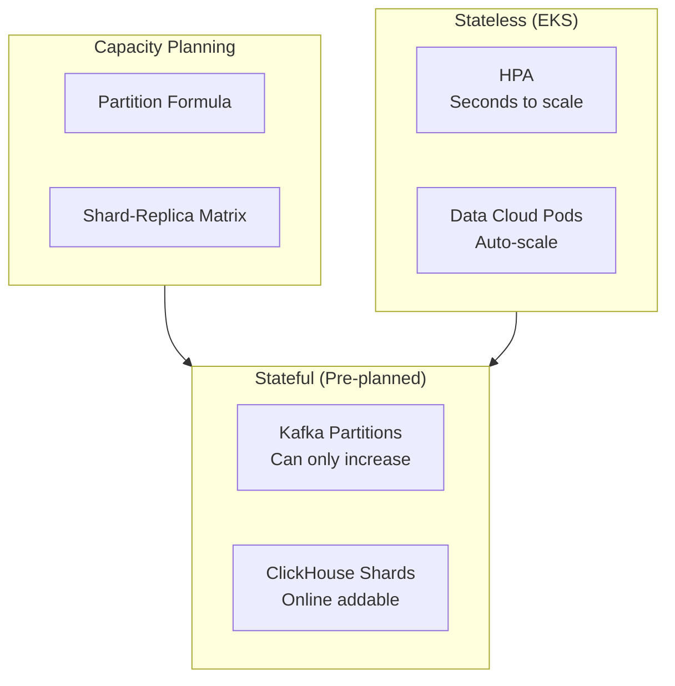
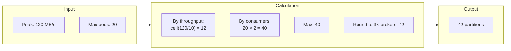
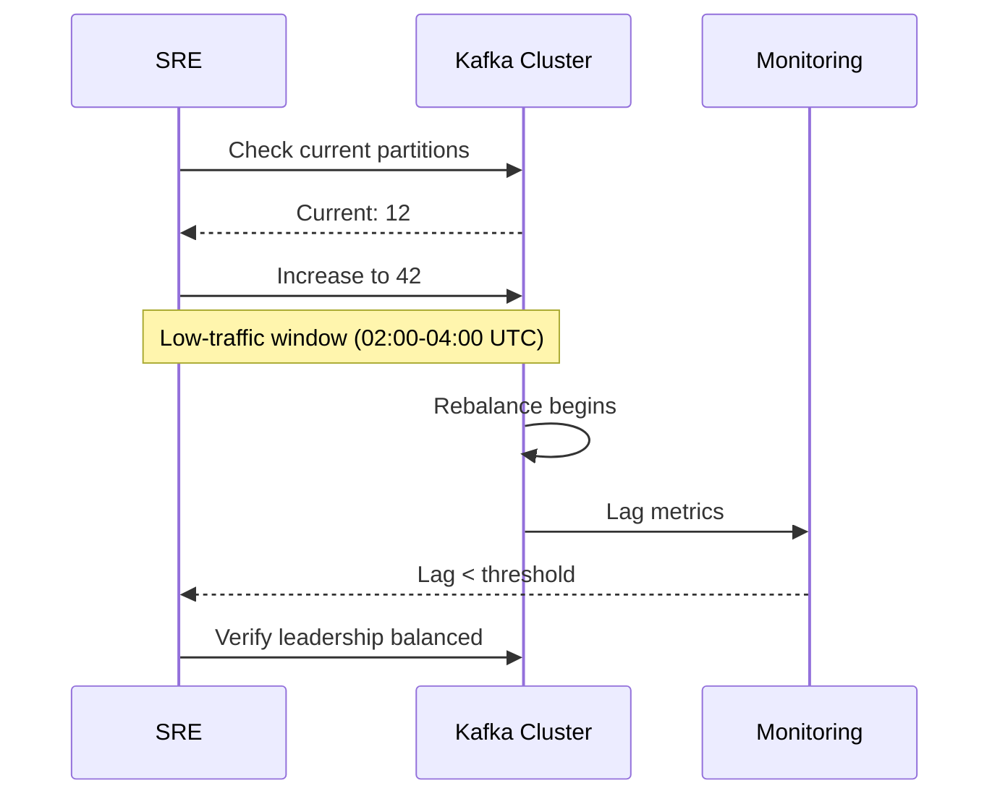
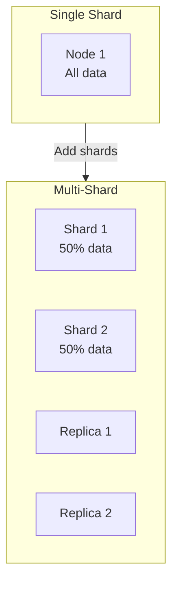
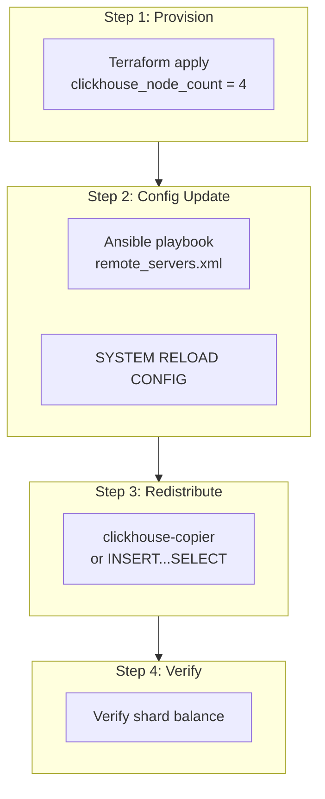
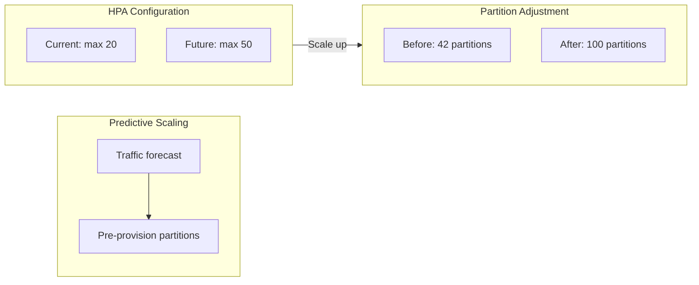
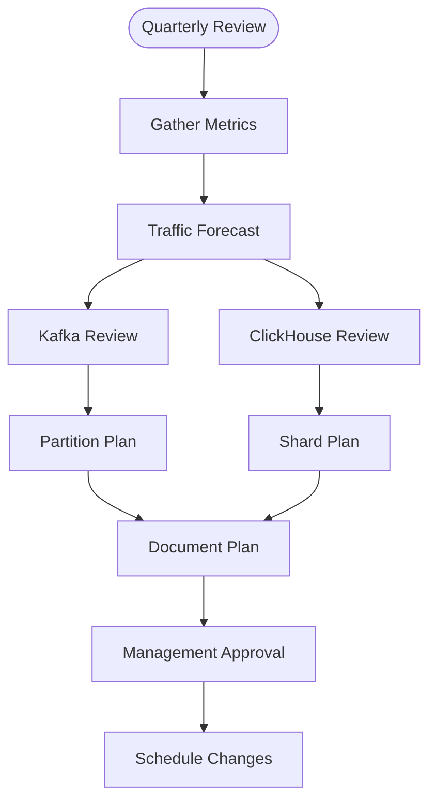
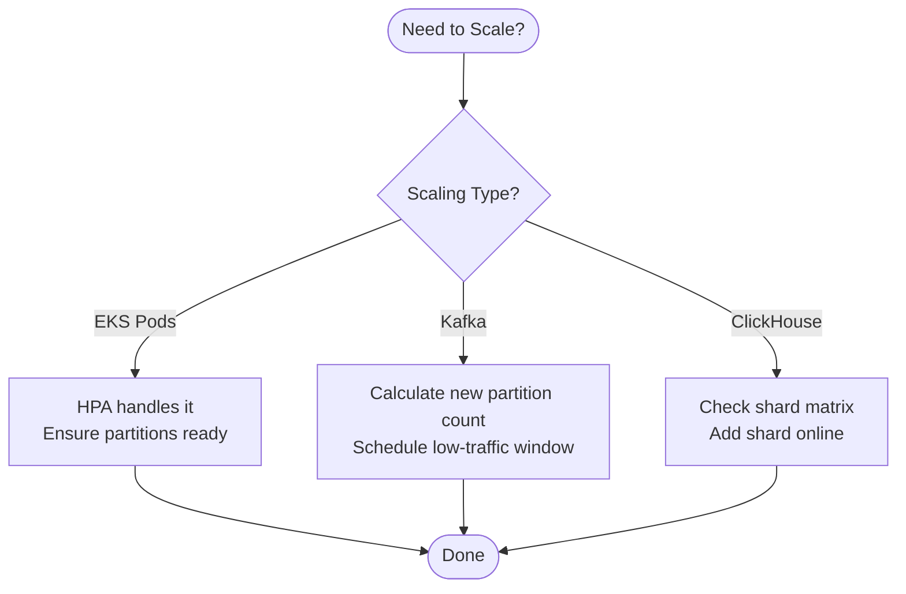

# Data Cloud Stateful Scaling Guide

**Document ID:** DC-SCALING-001-ENHANCED  
**Version:** 1.0  
**Date:** 2026-04-12  
**Audience:** Platform engineers, SREs  
**Scope:** Kafka partition sizing and ClickHouse shard topology

---

## Executive Summary

Data Cloud's stateful tiers (Kafka, ClickHouse) require explicit capacity planning before scaling stateless EKS workloads. This guide provides formulas, recommendations, and runbooks for scaling the platform's data infrastructure.

### Scaling Architecture



---

## 1. Why Stateful Scaling Requires Planning

### Scaling Characteristics

| Resource | Parallelism Unit | Online Scalable | Planning Required |
|----------|-----------------|-----------------|-------------------|
| **EKS Pod** | Replica | ✅ Instant | No |
| **Kafka Topic** | Partition | ⚠️ Increase only | Yes |
| **ClickHouse** | Shard | ✅ Add online | Yes |

### Key Principle

> **Provision stateful tiers ahead of peak replica count, not reactively.**

Over-provisioning partitions is cheap; rebalancing under load is expensive.

---

## 2. Kafka (MSK) Partition Sizing

### Partition Count Formula

```
partitions_per_topic = max(
    ceil(peak_throughput_mb_per_sec / target_partition_throughput_mb_per_sec),
    max_consumer_replicas * consumer_parallelism_factor
)
```

### Default Constants

| Constant | Value | Rationale |
|----------|-------|-----------|
| `target_partition_throughput_mb_per_sec` | **10 MB/s** | Conservative for `kafka.m5.large` |
| `consumer_parallelism_factor` | **2** | Headroom for spikes |
| `min_partitions_per_topic` | **6** | Allows 3× growth without re-partitioning |

### Calculation Example



### Per-Topic Recommendations

| Topic | Current | Recommended (20 max pods) | Notes |
|-------|---------|---------------------------|-------|
| `datacloud.events` | 12 | 42 | High-volume ingest |
| `datacloud.commands` | 6 | 12 | Low-volume, latency-sensitive |
| `datacloud.dlq` | 6 | 6 | Bounded by error rate |
| `datacloud.notifications` | 6 | 12 | Push fanout |
| `datacloud.audit` | 3 | 6 | Compliance log |

### Partition Rebalance Runbook



#### Commands

```bash
# 1. Check current partition counts
kafka-topics.sh \
    --bootstrap-server "$MSK_BOOTSTRAP" \
    --describe \
    --topic datacloud.events | grep PartitionCount

# 2. Increase partition count (irreversible!)
kafka-topics.sh \
    --bootstrap-server "$MSK_BOOTSTRAP" \
    --alter \
    --topic datacloud.events \
    --partitions 42

# 3. Preferred replica election
kafka-leader-election.sh \
    --bootstrap-server "$MSK_BOOTSTRAP" \
    --election-type PREFERRED \
    --all-topic-partitions

# 4. Monitor consumer lag
kafka-consumer-groups.sh \
    --bootstrap-server "$MSK_BOOTSTRAP" \
    --describe \
    --group data-cloud-event-consumer
```

#### Constraints

- ⚠️ Partition count **can only increase**, never decrease
- ⚠️ Repartitioning causes consumer group rebalance (brief pause)
- ✅ Always rebalance during low-traffic windows (02:00-04:00 UTC)
- ✅ Coordinate with on-call to monitor lag

---

## 3. ClickHouse Shard Topology

### Scaling Model



### Shard-Replica Matrix

| EKS Peak Replicas | CH Nodes | Shards | Replicas/Shard | Config Key |
|-------------------|----------|--------|----------------|------------|
| 1–5 | 1 | 1 | 1 | `single` |
| 6–15 | 2 | 2 | 1 | `two-shard` |
| 16–40 | 4 | 2 | 2 | `two-shard-ha` |
| 41–100 | 6 | 3 | 2 | `three-shard-ha` |
| 100+ | 8 | 4 | 2 | `four-shard-ha` |

> **Production target**: `two-shard-ha` tier (4 nodes)
> **Staging/DR**: `single` for cold-standby

### Adding a Shard Online (Zero-Downtime)



#### Commands

```bash
# Step 1: Provision new node
terraform -chdir=products/data-cloud/terraform apply \
    -var-file=environments/production/terraform.tfvars \
    -target=module.clickhouse

# Step 2: Update config on all nodes
ansible-playbook \
    -i inventory/production.ini \
    playbooks/clickhouse-reload-config.yml \
    -e "ssm_param=/${NAME_PREFIX}/clickhouse/remote-servers-config"

# Step 3: Redistribute data (small tables)
clickhouse-client --query "
    INSERT INTO distributed_events
    SELECT * FROM shard_events WHERE _shard_num < numShards();
"

# Step 3b: For large tables, use clickhouse-copier
clickhouse-copier \
    --config-file copier-config.xml \
    --task-path /clickhouse/copier/tasks/rebalance-events \
    --base-dir /var/lib/clickhouse-copier

# Step 4: Verify distribution
clickhouse-client --query "
    SELECT shard_num, count() AS rows
    FROM cluster('data_cloud_global', default, shard_events)
    GROUP BY shard_num
    ORDER BY shard_num;
"
```

### remote_servers.xml Config

Stored in SSM Parameter Store:
```
/${name_prefix}/clickhouse/remote-servers-config
```

```xml
<remote_servers>
    <!-- Primary region shards -->
    <data_cloud_primary>
        <shard>
            <replica>
                <host>clickhouse-0.data-cloud.svc</host>
                <port>9000</port>
            </replica>
            <replica>
                <host>clickhouse-1.data-cloud.svc</host>
                <port>9000</port>
            </replica>
        </shard>
        <shard>
            <replica>
                <host>clickhouse-2.data-cloud.svc</host>
                <port>9000</port>
            </replica>
            <replica>
                <host>clickhouse-3.data-cloud.svc</host>
                <port>9000</port>
            </replica>
        </shard>
    </data_cloud_primary>
</remote_servers>
```

---

## 4. HPA ↔ Stateful Tier Alignment

### Alignment Strategy



### Rules

1. **Set `max_partitions = max_consumer_replicas × 2`**
2. **Pre-create at that count before HPA scale-up**
3. **Monitor consumer lag during scale events**

### Example Configuration

```yaml
# HPA configuration
apiVersion: autoscaling/v2
kind: HorizontalPodAutoscaler
metadata:
  name: data-cloud
spec:
  scaleTargetRef:
    apiVersion: apps/v1
    kind: Deployment
    name: data-cloud
  minReplicas: 3
  maxReplicas: 50  # Ensure Kafka has 100 partitions!
  metrics:
    - type: Resource
      resource:
        name: cpu
        target:
          type: Utilization
          averageUtilization: 70
```

---

## 5. Prometheus Alerts for Scaling Headroom

### Alert Rules

```yaml
# alert-rules.yml
groups:
  - name: data_cloud_scaling
    rules:
      # Kafka partition headroom
      - alert: KafkaPartitionHeadroomLow
        expr: |
          (
            kafka_consumer_group_replicas{group="data-cloud-event-consumer"} 
            / 
            kafka_topic_partition_count{topic="datacloud.events"}
          ) > 0.8
        for: 15m
        labels:
          severity: warning
        annotations:
          summary: "Kafka partition headroom low"
          description: "Consumer replicas approaching partition count. Scale partitions."
      
      # ClickHouse shard utilization
      - alert: ClickHouseShardUtilizationHigh
        expr: |
          clickhouse_table_parts_count / 
          clickhouse_max_parts_count > 0.8
        for: 10m
        labels:
          severity: warning
        annotations:
          summary: "ClickHouse shard nearing capacity"
          description: "Consider adding shard."
```

---

## 6. Quarterly Capacity Review Checklist



### Review Template

| Metric | Current | 3-Month Forecast | 6-Month Forecast | Action Required |
|--------|---------|------------------|------------------|-----------------|
| Peak events/sec | 10K | 15K | 25K | Increase partitions to 50 |
| ClickHouse storage | 500GB | 800GB | 1.5TB | Add shard at 1TB |
| EKS max replicas | 20 | 30 | 40 | Pre-provision partitions |

---

## 7. Scaling Decision Tree



---

## 8. Emergency Scaling Procedures

### Kafka Emergency Partition Increase

```bash
# If consumer lag is critical and partitions exhausted:

# 1. Identify the bottleneck topic
kafka-consumer-groups.sh --describe --group data-cloud-event-consumer

# 2. Emergency partition increase (no downtime)
kafka-topics.sh --alter --topic datacloud.events --partitions 100

# 3. Monitor rebalance
watch -n 5 'kafka-consumer-groups.sh --describe --group data-cloud-event-consumer'
```

### ClickHouse Emergency Shard Add

```bash
# If query performance degraded:

# 1. Check current distribution
clickhouse-client --query "
    SELECT hostName() as host, count() as rows
    FROM distributed_events
    GROUP BY host
"

# 2. Emergency shard add (requires brief config reload)
# Follow §3.2 procedure but expedite
```

---

## References

- [Disaster Recovery Runbook](../05-usage-manuals-and-api-docs/01-disaster-recovery-runbook.md)
- [System Architecture](../02-architecture-decisions-design/01-system-architecture.md)
- [Engineering Caveats](./03-engineering-caveats.md)

---

*This enhanced scaling guide includes visual diagrams, formulas, and runbooks. Last updated: April 12, 2026.*
