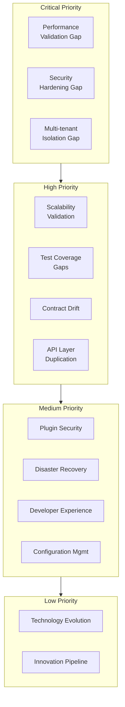

# Data Cloud Engineering Caveats

**Document ID:** DC-CAVEATS-001  
**Version:** 2.1  
**Date:** 2026-04-29  
**Evidence Base:** Architecture Documentation Suite + Risk Analysis

> **Verification Status** (DC-A11): Claims in this document are tagged as follows:
> ✅ **verified-locally** · 🔵 **integration-validated** · 🟡 **deployment-validated** · ⚪ **architecture-only**
> See [01-technical-overview.md](./01-technical-overview.md) for the full key.

---

## Executive Summary

Data Cloud demonstrates **strong engineering fundamentals** but has **important operational caveats** that teams must understand. This enhanced document provides visual risk diagrams, mitigation flowcharts, and architecture-aware guidance.

### Risk Overview



### Key Caveat Categories:
- **Performance**: Unknown characteristics under production load
- **Operational**: Complex deployment and configuration requirements
- **Security**: Multi-tenant isolation requires careful configuration
- **Scalability**: Scaling patterns need validation and monitoring
- **Development**: Complex build and testing requirements

---

## Critical Operational Caveats

### 1. Performance Unknowns

#### 1.1 API Response Time Under Load
**Caveat**: API response times are not validated under production load

**Evidence**: 
- No comprehensive load testing in test suite
- Performance targets defined but not validated
- Limited performance benchmarking

**Impact**: 
- Poor user experience under load
- System bottlenecks may appear unexpectedly
- SLA violations possible

**Mitigation**:
```bash
# Recommended load testing
./gradlew :products:data-cloud:loadTest
./gradlew :products:data-cloud:performanceTest
```

**Monitoring**: Add comprehensive performance monitoring with alerts for:
- API response time > 200ms (95th percentile)
- Database query time > 50ms
- Event processing latency > 100ms

#### 1.2 Concurrent User Capacity
**Caveat**: System capacity for concurrent users is not tested

**Evidence**:
- No stress testing for concurrent users
- Connection pooling not optimized for high concurrency
- Resource limits not validated

**Impact**:
- System overload under high user load
- Connection pool exhaustion
- Resource contention

**Mitigation**:
- Implement connection pool monitoring
- Add resource quota enforcement
- Test with realistic user loads

#### 1.3 Event Streaming Throughput
**Caveat**: Kafka event throughput limits are not validated

**Evidence**:
- Kafka configuration uses default settings
- No throughput testing implemented
- Partition strategy not optimized for high volume

**Impact**:
- Event processing bottlenecks
- Consumer lag under high load
- Event loss possible

**Mitigation**:
```yaml
# Recommended Kafka configuration
kafka:
  producer:
    batch.size: 16384
    linger.ms: 5
    compression.type: snappy
  consumer:
    fetch.min.bytes: 1
    fetch.max.wait.ms: 500
    max.poll.records: 500
```

### 2. Multi-tenant Isolation Risks

#### 2.1 Data Leakage Between Tenants
**Caveat**: Tenant isolation depends on proper configuration

**Evidence**:
- Tenant isolation implemented at application level
- Database row-level security depends on consistent tenant_id usage
- No database-level tenant isolation

**Impact**:
- Cross-tenant data access possible
- Privacy violations
- Compliance issues

**Mitigation**:
```sql
-- Add database-level tenant isolation
CREATE POLICY tenant_isolation ON entities
FOR ALL TO application_user
USING (tenant_id = current_setting('app.current_tenant_id')::text);
```

**Monitoring**: Audit all cross-tenant access attempts

#### 2.2 Resource Contention Between Tenants
**Caveat**: No resource quotas implemented per tenant

**Evidence**:
- Resource limits not enforced per tenant
- No CPU/memory quotas per tenant
- Shared resources can be monopolized

**Impact**:
- Noisy neighbor problems
- Performance degradation for other tenants
- Resource exhaustion

**Mitigation**:
```yaml
# Implement resource quotas
tenant_quotas:
  max_connections: 100
  max_cpu_percent: 20
  max_memory_mb: 2048
  max_storage_gb: 100
```

### 3. Configuration Management Complexity

#### 3.1 Environment-Specific Configuration
**Caveat**: Complex configuration management across environments

**Evidence**:
- Multiple configuration sources (environment variables, files, databases)
- Configuration validation not comprehensive
- No configuration drift detection

**Impact**:
- Configuration errors in production
- Environment inconsistencies
- Deployment failures

**Mitigation**:
```bash
# Configuration validation script
./scripts/validate-config.sh --env production
./scripts/diff-config.sh --env staging --env production
```

#### 3.2 Secret Management
**Caveat**: Secret management practices not standardized

**Evidence**:
- Some secrets in environment variables
- No centralized secret management
- Secret rotation not automated

**Impact**:
- Security vulnerabilities
- Secret leakage
- Compliance issues

**Mitigation**:
```yaml
# Use Kubernetes secrets or external secret manager
secrets:
  database_password: "k8s://datacloud-db-secret"
  jwt_secret: "k8s://datacloud-jwt-secret"
  kafka_password: "k8s://datacloud-kafka-secret"
```

---

## Development and Build Caveats

### 1. Build System Complexity

#### 1.1 Long Build Times
**Caveat**: Gradle build times are long due to multi-module structure

**Evidence**:
- 14 Gradle modules with complex dependencies
- No build caching optimization
- Parallel execution not optimized

**Impact**:
- Slow development cycles
- Reduced developer productivity
- CI/CD pipeline delays

**Mitigation**:
```gradle
// build.gradle.kts
tasks {
    compileKotlin {
        kotlinOptions.jvmTarget = "21"
    }
}

// Enable build caching
org.gradle.caching=true
org.gradle.parallel=true
org.gradle.configureondemand=true
```

#### 1.2 Test Execution Time
**Caveat**: Test suite takes significant time to execute

**Evidence**:
- Integration tests with Testcontainers are slow
- No test parallelization optimization
- Some tests have unnecessary setup/teardown

**Impact**:
- Slow feedback loops
- Reduced test frequency
- Developer frustration

**Mitigation**:
```gradle
// Optimize test execution
tasks.named<Test>("test") {
    maxParallelForks = (Runtime.getRuntime().availableProcessors() / 2).takeIf { it > 0 } ?: 1
    testLogging.showExceptions = true
    useJUnitPlatform()
}
```

### 2. Development Environment Setup

#### 2.1 Local Development Complexity
**Caveat**: Local development requires multiple external services

**Evidence**:
- Requires Kafka, PostgreSQL, Redis, ClickHouse
- Complex Docker Compose setup
- No development container provided

**Impact**:
- High setup friction for new developers
- Inconsistent development environments
- Onboarding delays

**Mitigation**:
```bash
# Provide development container
docker-compose -f docker-compose.dev.yml up -d
./scripts/setup-dev-env.sh
```

#### 2.2 IDE Configuration
**Caveat**: IDE configuration not standardized

**Evidence**:
- No standardized IDE settings
- Code formatting not enforced in IDE
- Debugging configuration complex

**Impact**:
- Inconsistent code formatting
- Debugging difficulties
- Code quality issues

**Mitigation**:
```json
// .vscode/settings.json
{
    "java.format.settings.url": ".vscode/java-formatter.xml",
    "java.saveActions.organizeImports": true,
    "editor.formatOnSave": true
}
```

---

## Deployment and Operations Caveats

### 1. Kubernetes Deployment Complexity

#### 1.1 Resource Configuration
**Caveat**: Resource requests and limits not optimized

**Evidence**:
- Default resource values used
- No resource profiling performed
- CPU/memory allocation not based on actual usage

**Impact**:
- Resource waste or insufficient allocation
- Pod eviction issues
- Cost inefficiency

**Mitigation**:
```yaml
# Optimize resource allocation based on profiling
resources:
  requests:
    cpu: "500m"
    memory: "1Gi"
  limits:
    cpu: "2000m"
    memory: "4Gi"
```

#### 1.2 Health Check Configuration
**Caveat**: Health checks may not detect all failure modes

**Evidence**:
- Basic health checks implemented
- No deep dependency health checks
- Health check timeouts may be too short

**Impact**:
- Unhealthy pods not detected
- Traffic routed to failed pods
- Extended downtime

**Mitigation**:
```yaml
# Improve health checks
livenessProbe:
  httpGet:
    path: /health/live
    port: 8080
  initialDelaySeconds: 30
  periodSeconds: 10
  timeoutSeconds: 5
  failureThreshold: 3
readinessProbe:
  httpGet:
    path: /health/ready
    port: 8080
  initialDelaySeconds: 5
  periodSeconds: 5
  timeoutSeconds: 3
  failureThreshold: 3
```

### 2. Database Operations

#### 2.1 Migration Risks
**Caveat**: Database migrations may cause downtime

**Evidence**:
- No blue-green migration strategy
- Large migrations may lock tables
- No migration rollback testing

**Impact**:
- Extended downtime during migrations
- Data corruption possible
- Rollback difficulties

**Mitigation**:
```sql
-- Use online migrations when possible
ALTER TABLE entities ADD COLUMN new_column VARCHAR(255) DEFAULT NULL;
-- Add index concurrently
CREATE INDEX CONCURRENTLY idx_entities_new_column ON entities(new_column);
```

#### 2.2 Backup and Recovery
**Caveat**: Backup and recovery procedures not fully tested

**Evidence**:
- Backup procedures documented but not tested
- No disaster recovery drills
- Recovery time objectives not validated

**Impact**:
- Extended recovery time
- Data loss possible
- Business continuity issues

**Mitigation**:
```bash
# Regular backup testing
./scripts/test-backup-restore.sh
./scripts/disaster-recovery-drill.sh
```

---

## Security Caveats

### 1. Authentication and Authorization

#### 1.1 Token Management
**Caveat**: JWT token management not fully secure

**Evidence**:
- Token rotation not implemented
- No token revocation mechanism
- Token expiration may be too long

**Impact**:
- Stolen tokens remain valid
- Session hijacking possible
- Security breach impact extended

**Mitigation**:
```java
// Implement token rotation
public class TokenRotationFilter implements Filter {
    @Override
    public void doFilter(ServletRequest request, ServletResponse response, FilterChain chain) {
        // Check token age and rotate if needed
        if (isTokenExpiredSoon(token)) {
            String newToken = generateNewToken();
            response.setHeader("X-New-Token", newToken);
        }
    }
}
```

#### 1.2 Session Management
**Caveat**: Session management not fully implemented

**Evidence**:
- No session invalidation on logout
- No concurrent session limits
- Session timeout not enforced

**Impact**:
- Multiple active sessions possible
- Session hijacking risk
- Resource consumption

**Mitigation**:
```java
// Implement session management
public class SessionManager {
    public void invalidateSession(String sessionId) {
        // Invalidate session and cleanup resources
        sessionRepository.delete(sessionId);
        tokenBlacklist.add(sessionId);
    }
    
    public boolean isSessionValid(String sessionId) {
        return sessionRepository.exists(sessionId) && 
               !isSessionExpired(sessionId);
    }
}
```

### 2. Data Protection

#### 2.1 Encryption Implementation
**Evidence**:
- Database encryption not verified
- Key management not automated
- No encryption at rest verification

**Impact**:
- Data exposure risk
- Compliance issues
- Security vulnerability

**Mitigation**:
```sql
-- Verify encryption at rest
SELECT pg_catalog.pg_database_size('datacloud') > 0;
SELECT pg_catalog.pg_encryption_status();
```

#### 2.2 PII Handling
**Caveat**: PII detection and redaction not comprehensive

**Evidence**:
- Basic PII detection implemented
- No comprehensive PII inventory
- Redaction rules may miss edge cases

**Impact**:
- PII exposure risk
- Privacy violations
- Compliance issues

**Mitigation**:
```java
// Comprehensive PII detection
public class PIIDetector {
    private static final Pattern[] PII_PATTERNS = {
        Pattern.compile("\\b\\d{3}-\\d{2}-\\d{4}\\b"), // SSN
        Pattern.compile("\\b\\d{4}-\\d{4}-\\d{4}-\\d{4}\\b"), // Credit card
        Pattern.compile("\\b[A-Za-z0-9._%+-]+@[A-Za-z0-9.-]+\\.[A-Za-z]{2,}\\b") // Email
    };
    
    public boolean containsPII(String text) {
        for (Pattern pattern : PII_PATTERNS) {
            if (pattern.matcher(text).find()) {
                return true;
            }
        }
        return false;
    }
}
```

---

## Monitoring and Observability Caveats

### 1. Metrics and Alerting

#### 1.1 Alert Fatigue
**Caveat**: Too many alerts may cause alert fatigue

**Evidence**:
- Metrics, tracing, and logging are implemented, and the product UI now exposes launcher-backed alert listing, triage mutations, derived grouping/suggestions, rules, and an SSE entrypoint for operator workflows.
- Alert prioritization is not optimized.
- No alert suppression rules are documented here.
- Canonical live alert list, acknowledge, resolve, and stream routes are still absent from the current launcher surface.

**Impact**:
- Important alerts missed
- Operator fatigue
- Reduced monitoring effectiveness

**Mitigation**:
```yaml
# Optimize alert rules
groups:
  - name: critical_alerts
    rules:
      - alert: HighErrorRate
        expr: error_rate > 0.05
        for: 5m
        labels:
          severity: critical
        annotations:
          summary: "High error rate detected"
          description: "Error rate is {{ $value }} errors per second"
  
  - name: warning_alerts
    rules:
      - alert: HighLatency
        expr: latency_p95 > 200ms
        for: 10m
        labels:
          severity: warning
        annotations:
          summary: "High latency detected"
          description: "95th percentile latency is {{ $value }}ms"
```

#### 1.2 Monitoring Gaps
**Caveat**: Some critical metrics not monitored

**Evidence**:
- Business metrics not comprehensive
- User experience metrics missing
- Cost monitoring not implemented

**Impact**:
- Business issues not detected
- User experience degradation
- Cost overruns

**Mitigation**:
```java
// Add business metrics
@Component
public class BusinessMetrics {
    private final MeterRegistry meterRegistry;
    
    public void recordUserAction(String action) {
        Counter.builder("user.actions")
            .tag("action", action)
            .register(meterRegistry)
            .increment();
    }
    
    public void recordFeatureUsage(String feature) {
        Counter.builder("feature.usage")
            .tag("feature", feature)
            .register(meterRegistry)
            .increment();
    }
}
```

### 2. Logging and Debugging

#### 2.1 Log Volume
**Caveat**: High log volume may impact performance

**Evidence**:
- Comprehensive logging implemented
- Log level not optimized for production
- No log sampling implemented

**Impact**:
- Performance degradation
- High storage costs
- Log analysis difficulties

**Mitigation**:
```xml
<!-- Optimize log configuration -->
<Configuration>
    <Loggers>
        <Root level="INFO">
            <AppenderRef ref="Console"/>
            <AppenderRef ref="File"/>
        </Root>
        <Logger name="com.ghatana.datacloud" level="INFO" additivity="false">
            <AppenderRef ref="Console"/>
            <AppenderRef ref="File"/>
        </Logger>
        <Logger name="org.springframework" level="WARN"/>
        <Logger name="org.hibernate" level="WARN"/>
    </Loggers>
</Configuration>
```

#### 2.2 Debugging Complexity
**Caveat**: Distributed system debugging is complex

**Evidence**:
- Multiple services and dependencies
- Complex request flows
- Limited debugging tools

**Impact**:
- Long debugging times
- Issue resolution delays
- Operator frustration

**Mitigation**:
```java
// Improve debugging capabilities
public class DebuggingFilter implements Filter {
    @Override
    public void doFilter(ServletRequest request, ServletResponse response, FilterChain chain) {
        String requestId = UUID.randomUUID().toString();
        MDC.put("requestId", requestId);
        
        try {
            chain.doFilter(request, response);
        } finally {
            MDC.remove("requestId");
        }
    }
}
```

---

## Scalability Caveats

### 1. Horizontal Scaling

#### 1.1 State Management
**Caveat**: State management may limit horizontal scaling

**Evidence**:
- Some state stored in application memory
- Session state not externalized
- Cache invalidation complexity

**Impact**:
- Scaling limitations
- Session loss on scaling
- Cache consistency issues

**Mitigation**:
```java
// Externalize state management
@Configuration
public class StateConfig {
    @Bean
    public CacheManager cacheManager() {
        return RedisCacheManager.builder(redisConnectionFactory())
            .cacheDefaults(cacheConfiguration())
            .build();
    }
    
    @Bean
    public HttpSessionManager httpSessionManager() {
        return new RedisHttpSessionManager(redisConnectionFactory());
    }
}
```

#### 1.2 Database Scaling
**Caveat**: Database scaling not fully implemented

**Evidence**:
- No read replicas configured
- No database sharding
- Connection pooling not optimized

**Impact**:
- Database bottleneck
- Limited read scalability
- Connection exhaustion

**Mitigation**:
```yaml
# Implement database scaling
database:
  primary:
    host: postgres-primary
    port: 5432
  replicas:
    - host: postgres-replica-1
      port: 5432
    - host: postgres-replica-2
      port: 5432
  connection_pool:
    maximum_pool_size: 20
    minimum_idle: 5
    connection_timeout: 30000
```

### 2. Event Streaming Scaling

#### 2.1 Kafka Configuration
**Caveat**: Kafka configuration not optimized for scale

**Evidence**:
- Default Kafka settings used
- No partition strategy for high volume
- Consumer group configuration not optimized

**Impact**:
- Kafka bottlenecks
- Consumer lag
- Event loss

**Mitigation**:
```properties
# Optimize Kafka for scale
num.partitions=12
default.replication.factor=3
min.insync.replicas=2
auto.create.topics.enable=false
log.retention.hours=168
log.segment.bytes=1073741824
log.retention.check.interval.ms=300000
```

---

## Plugin System Caveats

### 1. Plugin Security

#### 1.1 Plugin Isolation
**Caveat**: Plugin isolation not fully secure

**Evidence**:
- Plugins run in same JVM
- No sandboxing implemented
- Plugin resource access not restricted

**Impact**:
- Security vulnerabilities
- Resource abuse
- System instability

**Mitigation**:
```java
// Implement plugin sandbox
public class PluginSandbox {
    private final SecurityManager securityManager;
    private final ResourceLimiter resourceLimiter;
    
    public void executePlugin(Plugin plugin, PluginContext context) {
        SecurityContext oldContext = SecurityContextHolder.getContext();
        try {
            SecurityContextHolder.setContext(createPluginSecurityContext(plugin));
            resourceLimiter.limitResources(plugin);
            plugin.execute(context);
        } finally {
            SecurityContextHolder.setContext(oldContext);
            resourceLimiter.releaseResources(plugin);
        }
    }
}
```

#### 1.2 Plugin Dependencies
**Caveat**: Plugin dependency management not robust

**Evidence**:
- No dependency version management
- Conflicting dependencies possible
- No dependency security scanning

**Impact**:
- Plugin conflicts
- Security vulnerabilities
- System instability

**Mitigation**:
```xml
<!-- Implement plugin dependency management -->
<plugin-dependencies>
    <dependency>
        <groupId>com.ghatana</groupId>
        <artifactId>datacloud-plugin-api</artifactId>
        <version>[1.0.0,2.0.0)</version>
    </dependency>
</plugin-dependencies>
```

---

## Operational Best Practices

### 1. Deployment Best Practices

#### 1.1 Blue-Green Deployment
**Caveat**: Blue-green deployment not fully implemented

**Evidence**:
- Basic rolling update implemented
- No blue-green infrastructure
- No traffic shifting capabilities

**Impact**:
- Deployment downtime
- Rollback complexity
- Risk of failed deployments

**Mitigation**:
```yaml
# Implement blue-green deployment
apiVersion: argoproj.io/v1alpha1
kind: Rollout
metadata:
  name: datacloud
spec:
  replicas: 3
  strategy:
    blueGreen:
      activeService: datacloud-active
      previewService: datacloud-preview
      autoPromotionEnabled: false
      scaleDownDelaySeconds: 30
      prePromotionAnalysis:
        templates:
        - templateName: success-rate
        args:
        - name: service-name
          value: datacloud-preview
```

#### 1.2 Configuration Management
**Caveat**: Configuration drift not detected

**Evidence**:
- No configuration drift detection
- Manual configuration changes possible
- No configuration validation

**Impact**:
- Environment inconsistencies
- Configuration errors
- Deployment failures

**Mitigation**:
```bash
# Configuration drift detection
#!/bin/bash
./scripts/check-config-drift.sh --env production
./scripts/validate-config.sh --all-envs
```

### 2. Monitoring Best Practices

#### 2.1 SLI/SLO Implementation
**Caveat**: SLI/SLO not fully implemented

**Evidence**:
- Basic metrics collected
- No SLI definitions
- No SLO monitoring

**Impact**:
- Service quality not measured
- SLA compliance not tracked
- Performance issues not detected

**Mitigation**:
```yaml
# Define SLI/SLO
service_level_objectives:
  - name: api_availability
    description: "API availability percentage"
    sli: "up_time / total_time"
    slo: "0.999"
  - name: api_latency
    description: "95th percentile API latency"
    sli: "latency_p95"
    slo: "200ms"
```

#### 2.2 Incident Management
**Caveat**: Incident management not formalized

**Evidence**:
- Basic alerting implemented
- No incident response procedures
- No post-incident analysis

**Impact**:
- Incident response delays
- Repeated incidents
- Knowledge loss

**Mitigation**:
```markdown
# Incident Response Runbook
## Incident Response Process
1. Detection (Alert triggers)
2. Triage (Assess impact)
3. Response (Implement fix)
4. Recovery (Verify resolution)
5. Post-incident (Learn and improve)
```

---

## Summary of Critical Caveats

### High Priority (Immediate Action Required)

1. **Performance Validation**: Load testing and performance optimization
2. **Security Hardening**: Token management and encryption verification
3. **Multi-tenant Isolation**: Database-level isolation and resource quotas
4. **Configuration Management**: Standardized configuration and secret management

### Medium Priority (Short-term Action Required)

1. **Scalability Testing**: Horizontal scaling validation
2. **Monitoring Enhancement**: SLI/SLO implementation and business metrics
3. **Plugin Security**: Plugin sandboxing and dependency management
4. **Disaster Recovery**: Backup testing and recovery procedures

### Low Priority (Long-term Action Required)

1. **Development Experience**: IDE standardization and build optimization
2. **Advanced Features**: Advanced analytics and AI/ML capabilities
3. **Ecosystem Integration**: Third-party integrations and partnerships
4. **Innovation**: Emerging technology evaluation and adoption

---

## Mitigation Timeline

### Week 1-2: Critical Issues
- Performance testing and optimization
- Security audit and hardening
- Multi-tenant isolation verification
- Configuration management standardization

### Week 3-8: Medium Priority
- Scalability testing and optimization
- Monitoring and observability enhancement
- Plugin system security improvements
- Disaster recovery procedures

### Week 9-24: Long-term Improvements
- Developer experience enhancements
- Advanced feature development
- Ecosystem integration
- Innovation and research

---

*This caveats document represents the current operational considerations for Data-Cloud as of April 3, 2026. It should be updated as new caveats are identified or existing ones are resolved.*
