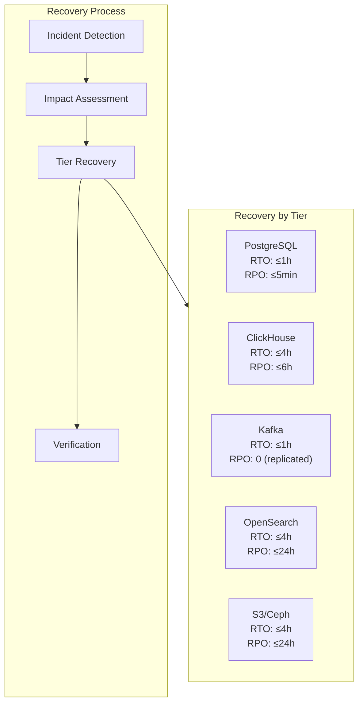
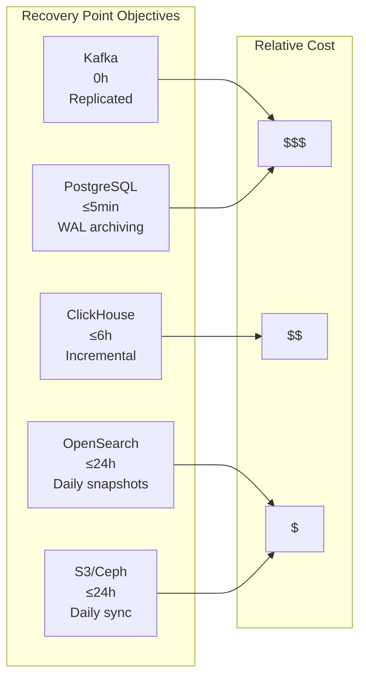
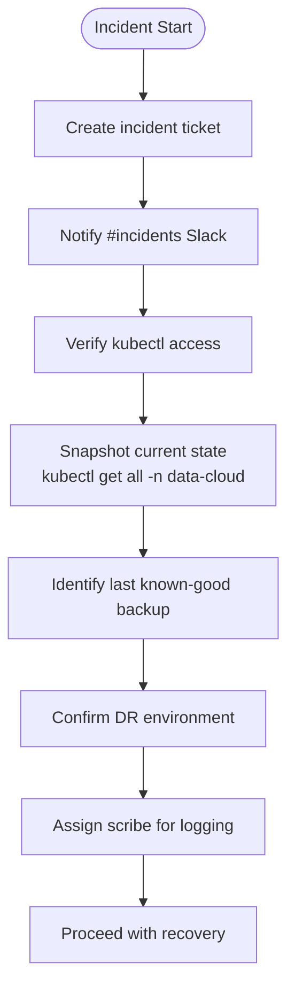
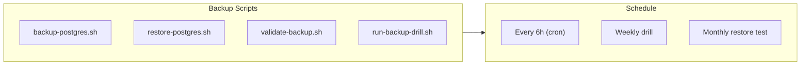
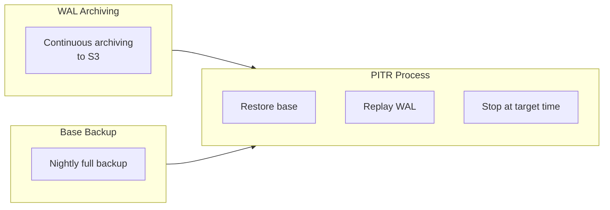
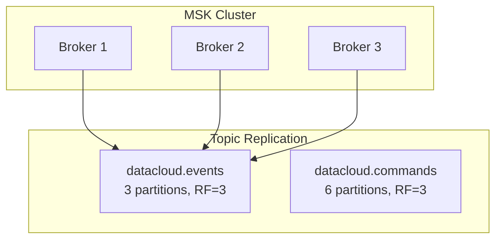
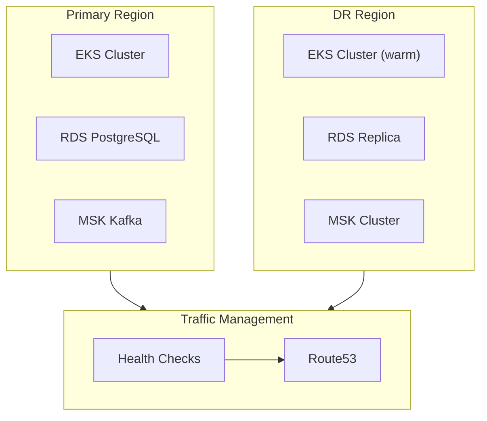
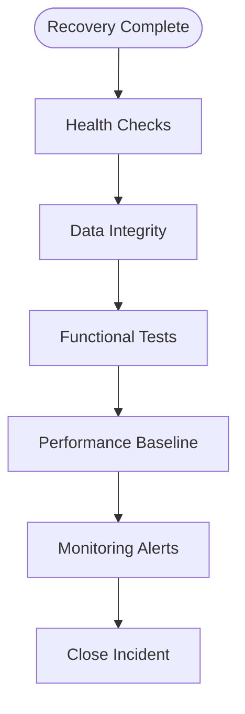

# Data Cloud Disaster Recovery Runbook

**Document ID:** DC-DR-001-ENHANCED  
**Version:** 1.1  
**Date:** 2026-04-12  
**Owner:** Data Cloud Platform Team  
**Audience:** On-call engineers, SREs, platform leads

---

## Executive Summary

This runbook provides comprehensive procedures for recovering Data Cloud from disasters across all storage tiers: PostgreSQL, ClickHouse, Kafka, OpenSearch, and blob storage. Recovery Time Objectives (RTO) and Recovery Point Objectives (RPO) are defined per tier.

### DR Architecture Overview



---

## 1. Incident Severity & SLOs

### Severity Matrix

| Severity | Definition | Response Target | Resolution Target |
|----------|------------|-----------------|-------------------|
| **P0 — Critical** | Complete service outage; data loss occurring | < 5 min page | RTO ≤ 1 h |
| **P1 — High** | Single tier degraded; partial data unavailable | < 15 min page | RTO ≤ 4 h |
| **P2 — Medium** | Non-critical feature degraded; no data loss | < 30 min notify | RTO ≤ 24 h |
| **P3 — Low** | Performance degradation only | Next business day | Best effort |

### RPO Targets by Tier



---

## 2. On-Call Escalation

### Escalation Path

```
Level 1 — On-call engineer (page immediately)
    ↓ (T+30 min if unresolved)
Level 2 — Data-Cloud tech lead (escalate)
    ↓ (T+60 min for P0)
Level 3 — VP Engineering / CTO (escalate)
```

### Contact Information

| Role | Channel | PagerDuty |
|------|---------|-----------|
| On-call Engineer | #data-cloud-oncall | data-cloud-oncall |
| Tech Lead | @data-cloud-lead | data-cloud-lead |
| Platform Lead | @platform-lead | platform-lead |

---

## 3. Pre-Recovery Checklist

Before executing any recovery procedure:



### Pre-Recovery Commands

```bash
# 1. Create incident ticket with impact statement
gh issue create --label "incident" --title "P0: Data Cloud outage" \
    --body "Impact: [describe scope]"

# 2. Notify Slack
slack-cli post --channel "#incidents" \
    --message "P0 incident: Data Cloud [severity] - @[on-call engineer] responding"

# 3. Verify kubectl access
kubectl auth can-i get pods -n data-cloud
kubectl auth can-i delete pods -n data-cloud

# 4. Snapshot current state
kubectl get all -n data-cloud > /tmp/state-$(date +%s).txt
kubectl describe pods -n data-cloud > /tmp/pods-$(date +%s).txt

# 5. Identify last known-good backup
aws s3 ls s3://ghatana-pg-backups/ --recursive | sort | tail -5
```

---

## 4. Automated Backup Infrastructure

### Backup Scripts Location

All backup scripts are in `products/data-cloud/scripts/`:



### 4.1 PostgreSQL Backup

```bash
# Create base backup
POSTGRES_HOST="pg-primary.data-cloud.svc" \
POSTGRES_DB="datacloud" \
POSTGRES_USER="backup_svc" \
S3_BUCKET="ghatana-pg-backups" \
bash products/data-cloud/scripts/backup-postgres.sh

# Dry-run validation
bash products/data-cloud/scripts/backup-postgres.sh --dry-run
```

**Key behaviors:**
- Compressed pg_dump (custom format, gzip/zstd)
- S3 upload with retention tags
- Auto-prune archives >14 days
- Webhook notifications

### 4.2 PostgreSQL Restore

```bash
# List available backups
bash products/data-cloud/scripts/restore-postgres.sh --list

# Restore latest backup to DR instance
POSTGRES_HOST="pg-dr.data-cloud.svc" \
bash products/data-cloud/scripts/restore-postgres.sh

# Point-in-time recovery
TARGET_TIME="2026-04-12 11:55:00 UTC" \
bash products/data-cloud/scripts/restore-postgres.sh
```

**⚠️ SAFETY**: This drops and recreates the database. Only run against DR/staging.

### 4.3 Backup Validation

```bash
# Validate latest backup
bash products/data-cloud/scripts/validate-backup.sh

# JSON output for CI
bash products/data-cloud/scripts/validate-backup.sh --json

# Non-blocking mode
bash products/data-cloud/scripts/validate-backup.sh --warn-only
```

**Validation checks:**
1. Freshness (<24h PASS, 24-48h WARN, >48h FAIL)
2. S3 download succeeds
3. TOC inspection confirms TABLE DATA
4. Restore to isolated DB succeeds
5. Expected tables present and non-empty

---

## 5. ClickHouse Backup Restore

### 5.1 Backup Inventory

```bash
# List remote backups
kubectl exec -n data-cloud deploy/data-cloud \
    -- clickhouse-backup list remote

# Sample output:
# 2026-04-12T02:00:00Z   full   data-cloud/2026-04-12T02-00-00Z.tar
# 2026-04-12T06:00:00Z   diff   data-cloud/2026-04-12T06-00-00Z.tar
```

### 5.2 Full Restore Procedure

```bash
# Step 1: Stop writes
curl -X POST http://data-cloud:8082/admin/maintenance \
    -H "X-Admin-Token: $ADMIN_TOKEN" \
    -d '{"mode": "read-only"}'

# Step 2: Download and restore
kubectl exec -n data-cloud deploy/data-cloud -- \
    clickhouse-backup download remote "2026-04-12T02-00-00Z"

kubectl exec -n data-cloud deploy/data-cloud -- \
    clickhouse-backup restore "2026-04-12T02-00-00Z"

# Step 3: Resume writes
curl -X POST http://data-cloud:8082/admin/maintenance \
    -H "X-Admin-Token: $ADMIN_TOKEN" \
    -d '{"mode": "read-write"}'
```

### 5.3 Incremental Restore

```bash
# Restore full backup first
clickhouse-backup restore "2026-04-12T02-00-00Z"

# Apply incremental diffs in order
for diff in "2026-04-12T06-00-00Z" "2026-04-12T12-00-00Z"; do
    clickhouse-backup restore --diff "$diff"
done
```

---

## 6. PostgreSQL Point-in-Time Recovery

### 6.1 PITR Architecture



### 6.2 PITR Procedure

```bash
# 1. Stop Data Cloud application
kubectl scale deployment data-cloud --replicas=0 -n data-cloud

# 2. Restore base backup
bash products/data-cloud/scripts/restore-postgres.sh \
    --target-time "2026-04-12 11:55:00 UTC"

# 3. Configure WAL replay
kubectl exec -it pg-primary-0 -n data-cloud -- bash -c "
    cat > /var/lib/postgresql/data/postgresql.conf << 'EOF'
restore_command = 'aws s3 cp s3://ghatana-pg-wal/%f %p'
recovery_target_time = '2026-04-12 11:55:00 UTC'
recovery_target_action = 'pause'
EOF
    touch /var/lib/postgresql/data/recovery.signal
"

# 4. Start PostgreSQL (will replay WAL)
kubectl delete pod pg-primary-0 -n data-cloud

# 5. Monitor replay
kubectl logs pg-primary-0 -n data-cloud -f | grep "recovery"

# 6. Promote when target reached
kubectl exec -it pg-primary-0 -n data-cloud -- \
    psql -c "SELECT pg_wal_replay_resume();"

# 7. Restart Data Cloud
kubectl scale deployment data-cloud --replicas=3 -n data-cloud
```

---

## 7. Kafka Recovery

### 7.1 Kafka Architecture



### 7.2 Consumer Group Recovery

```bash
# Check consumer group status
kafka-consumer-groups.sh \
    --bootstrap-server "$MSK_BOOTSTRAP" \
    --describe \
    --group data-cloud-event-consumer

# Reset offset to last hour (emergency only)
kafka-consumer-groups.sh \
    --bootstrap-server "$MSK_BOOTSTRAP" \
    --group data-cloud-event-consumer \
    --topic datacloud.events \
    --reset-offsets \
    --to-datetime 2026-04-12T11:00:00.000 \
    --execute
```

### 7.3 Topic Recovery

```bash
# Re-create topic with same config
kafka-topics.sh \
    --bootstrap-server "$MSK_BOOTSTRAP" \
    --create \
    --topic datacloud.events \
    --partitions 42 \
    --replication-factor 3 \
    --config retention.ms=604800000
```

---

## 8. OpenSearch Index Restore

### 8.1 Snapshot Repository

```bash
# Register snapshot repository
curl -X PUT "http://opensearch:9200/_snapshot/s3_repository" \
    -H "Content-Type: application/json" \
    -d '{
        "type": "s3",
        "settings": {
            "bucket": "ghatana-opensearch-snapshots",
            "region": "us-east-1"
        }
    }'

# List snapshots
curl "http://opensearch:9200/_snapshot/s3_repository/_all"
```

### 8.2 Index Restore

```bash
# Close existing index (if corrupted)
curl -X POST "http://opensearch:9200/entities/_close"

# Restore from snapshot
curl -X POST "http://opensearch:9200/_snapshot/s3_repository/snapshot_2026_04_12/_restore" \
    -H "Content-Type: application/json" \
    -d '{
        "indices": "entities,events",
        "ignore_unavailable": true,
        "include_global_state": false
    }'

# Monitor restore progress
curl "http://opensearch:9200/_recovery"
```

---

## 9. Full-Cluster Failover

### 9.1 Failover Architecture



### 9.2 Failover Procedure

```bash
# 1. Verify DR cluster health
kubectl --context dr-cluster get nodes
kubectl --context dr-cluster -n data-cloud get pods

# 2. Promote DR PostgreSQL to primary
aws rds promote-read-replica \
    --db-instance-identifier datacloud-dr \
    --region us-west-2

# 3. Update Data Cloud config for DR region
kubectl --context dr-cluster -n data-cloud set env deployment/data-cloud \
    DATACLOUD_DB_URL="jdbc:postgresql://datacloud-dr.xyz.us-west-2.rds.amazonaws.com:5432/datacloud" \
    DATACLOUD_KAFKA_BOOTSTRAP="msk-dr.xyz.c4.kafka.us-west-2.amazonaws.com:9092"

# 4. Scale up DR Data Cloud
kubectl --context dr-cluster -n data-cloud scale deployment/data-cloud --replicas=3

# 5. Update Route53 to point to DR
aws route53 change-resource-record-sets \
    --hosted-zone-id Z123456789 \
    --change-batch '{
        "Changes": [{
            "Action": "UPSERT",
            "ResourceRecordSet": {
                "Name": "api.data-cloud.internal",
                "Type": "A",
                "AliasTarget": {
                    "HostedZoneId": "Z123456789",
                    "DNSName": "dr-alb.xyz.us-west-2.elb.amazonaws.com",
                    "EvaluateTargetHealth": true
                }
            }
        }]
    }'
```

---

## 10. Post-Recovery Verification

### 10.1 Verification Checklist



### 10.2 Verification Commands

```bash
# 1. Health endpoint verification
curl -f http://data-cloud:8082/health || echo "❌ Health check failed"
curl -f http://data-cloud:8082/ready || echo "❌ Readiness check failed"

# 2. Entity count verification
psql -h pg-primary -U datacloud -c "SELECT COUNT(*) FROM entities;"
# Compare to expected count

# 3. Recent event verification
psql -h pg-primary -U datacloud -c "
    SELECT COUNT(*) FROM events 
    WHERE occurrence_time > NOW() - INTERVAL '1 hour';
"

# 4. End-to-end smoke test
bash products/data-cloud/scripts/run-smoke-e2e.sh

# 5. Performance baseline
curl -w "@curl-format.txt" -o /dev/null -s \
    http://data-cloud:8082/api/v1/entities/test-collection

# 6. Alert silence lift
# Remove silence in Alertmanager for data-cloud alerts
```

---

## 11. Runbook Maintenance

### Update Schedule

| Trigger | Action | Owner |
|---------|--------|-------|
| Infrastructure change | Update recovery procedures | SRE Team |
| Quarterly | Review and test all procedures | Platform Team |
| Post-incident | Update based on lessons learned | On-call Engineer |
| New storage tier | Add recovery section | Data Team |

### Testing Schedule

| Test | Frequency | Last Run | Next Run |
|------|-----------|----------|----------|
| PostgreSQL restore | Monthly | 2026-04-01 | 2026-05-01 |
| ClickHouse restore | Monthly | 2026-04-01 | 2026-05-01 |
| Full DR failover | Quarterly | 2026-03-15 | 2026-06-15 |
| Backup validation | Continuous | Automated | Automated |

---

## 12. Emergency Contacts

| Service | Provider | Escalation |
|---------|----------|------------|
| AWS RDS | AWS Support | P1 for data loss |
| MSK | AWS Support | P1 for Kafka down |
| EKS | AWS Support | P1 for control plane |
| Data Cloud | Internal | #data-cloud-oncall |

---

*This enhanced DR runbook includes visual diagrams, architecture context, and comprehensive procedures. Last updated: April 12, 2026.*
