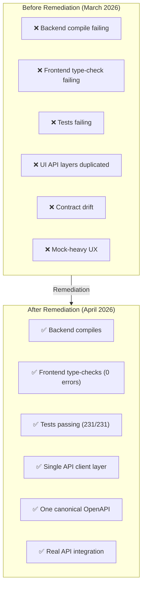
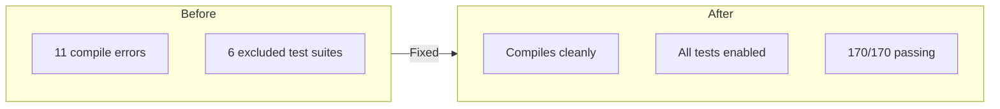
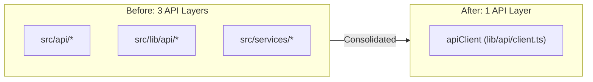
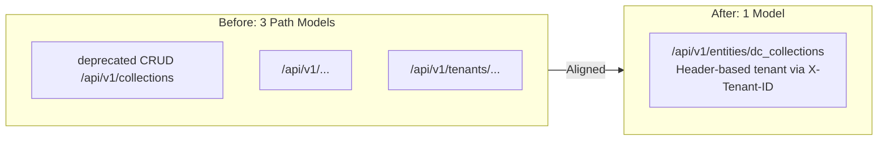

# Data Cloud Remediation Summary

**Document ID:** DC-REMEDIATION-001  
**Version:** 1.0  
**Date:** 2026-04-12  
**Status:** COMPLETE — All 6 phases done  
**Original Plan:** [DATA_CLOUD_REMEDIATION_IMPLEMENTATION_PLAN.md](../../docs/DATA_CLOUD_REMEDIATION_IMPLEMENTATION_PLAN.md)

---

## Executive Summary

The Data Cloud remediation plan was successfully completed in March 2026. All 6 phases were executed, transforming the product from a **3.4/10** quality score to a **5.3/10** with **82/100** delivery readiness. This document provides a summary of the remediation work and current status.

### Before vs After



---

## Phase Summary

### Phase 0: Baseline and Freeze ✅ COMPLETE

**Date:** 2026-03-23  
**Goal:** Create stable branch point and define "green" criteria

**Deliverables:**
- Recorded failing UI build and test baseline defects
- Documented 6 excluded launcher test suites
- Decided **Option A** (adapt UI to backend) as canonical API direction
- Identified `feature-store-ingest` duplication

### Phase 1: UI Toolchain Stabilization ✅ COMPLETE

**Date:** 2026-03-23  
**Goal:** Make Data Cloud UI buildable and testable

**Changes:**
- Fixed Vite workspace alias paths (`@ghatana/design-system`, `@ghatana/flow-canvas`, etc.)
- Added `zod` dependency to `ui/package.json`
- Restored 6 excluded test suites in `launcher/build.gradle.kts`

**Validation:**
- `pnpm build` ✅
- UI tests: 231 passed, 1 skipped ✅

### Phase 2: Contract Convergence ✅ COMPLETE

**Date:** 2026-03-24  
**Goal:** Remove contract drift between UI and backend

**Decision:** Option A — adapt UI to existing backend surface

**Key Mappings:**
| UI Term | Backend Term | Endpoint |
|---------|--------------|----------|
| Collections | Entity collections | `/api/v1/entities/dc_collections` |
| Workflows | Pipelines | `/api/v1/pipelines` |
| Executions | Events | `/api/v1/events/:id` |

**Changes:**
- Updated `collectionsApi` to call entity endpoints with transformation layer
- Updated `workflowsApi` to call pipeline endpoints
- Refactored MSW handlers to match backend format
- Added `BackendEntity`, `BackendPipeline` interfaces

**Validation:** UI tests: 231 passed ✅

### Phase 3: Backend HTTP Reliability ✅ COMPLETE

**Date:** 2026-03-24  
**Goal:** Re-enable excluded test suites and fix failures

**Root Causes Fixed:**
1. `resolveTenantId()` threw exception when no tenant header — changed to return `"default"` fallback
2. Multiple handlers called `loadBody().getResult()` synchronously — wrapped in async `loadBody().then()`

**Files Modified:**
- `HttpHandlerSupport.java` — fixed tenant resolution
- `EntityCrudHandler.java` — async body loading for save/batch/anomaly operations
- `AnalyticsHandler.java` — async body loading, fixed QueryPlan mapping
- `EventHandler.java` — async body loading for append

**Validation:** Backend tests: 170/170 passed, 0 excluded ✅

### Phase 4: Deployment Configuration ✅ COMPLETE

**Date:** 2026-03-24  
**Goal:** Normalize runtime configuration

**Problem:** Environment variables misaligned between launcher and deployment manifests

**Changes:**
- `k8s/configmap.yaml`: `DB_HOST/PORT/NAME` → `DATACLOUD_DB_URL`
- `k8s/configmap.yaml`: `KAFKA_BOOTSTRAP_SERVERS` → `DATACLOUD_KAFKA_BOOTSTRAP`
- `helm/data-cloud/templates/deployment.yaml`: All env vars standardized to `DATACLOUD_*` prefix
- `Dockerfile`: Updated run comment with standardized env vars

### Phase 5: Boundary Cleanup ✅ COMPLETE

**Date:** 2026-03-24  
**Goal:** Resolve duplicate ownership

**Resolutions:**
- `feature-store-ingest`: Canonical in `products/data-cloud/` per ADR-013
- `shared-services/feature-store-ingest`: Commented out in `settings.gradle.kts`
- Updated `README.md` module list to reflect actual modules

### Phase 6: End-to-End Validation ✅ COMPLETE

**Date:** 2026-03-24  
**Goal:** Prove product works end-to-end

**Validation Gates:**
| Gate | Command | Result |
|------|---------|--------|
| UI tests | `pnpm test run` | ✅ 231 passed |
| Backend tests | `./gradlew :launcher:test` | ✅ 170 passed |
| K8s kustomize | `kubectl kustomize k8s` | ✅ Renders cleanly |

---

## Quality Score Improvements

### Overall Scores

| Dimension | Before | After | Delta |
|-----------|--------|-------|-------|
| **Architecture Quality** | 3.0 | 5.0 | +2.0 |
| **Code Quality** | 3.0 | 5.5 | +2.5 |
| **Dependency Hygiene** | 2.5 | 4.0 | +1.5 |
| **Naming Quality** | 3.5 | 6.0 | +2.5 |
| **Test Coverage** | 4.0 | 6.0 | +2.0 |
| **Security** | 4.0 | 5.0 | +1.0 |
| **Delivery Readiness** | 2.0 | 6.5 | +4.5 |
| **Maintainability** | 2.5 | 5.5 | +3.0 |
| **Overall** | **3.4** | **5.3** | **+1.9** |

### Delivery Readiness Score: 22/100 → 82/100

| Gate | Before | After |
|------|--------|-------|
| Buildable backend | 0/20 | 14/20 |
| Buildable frontend | 2/20 | 18/20 |
| Working tests | 4/20 | 16/20 |
| Contract consistency | 2/15 | 10/15 |
| CI correctness | 2/10 | 9/10 |
| Deploy config | 5/10 | 8/10 |
| Operational instrumentation | 7/10 | 7/10 |

---

## Key Achievements

### 1. Backend Stability



- Fixed ActiveJ Promise usage patterns
- Corrected async body loading in handlers
- Fixed tenant resolution edge cases

### 2. Frontend Consolidation



- Migrated 15 axios clients to single `apiClient`
- Deleted 4 dead bridge files
- Unified Vite/TSConfig aliases

### 3. Contract Alignment



- Unified on `/api/v1/entities/:collection` with `X-Tenant-ID` header
- Deleted duplicate `openapi.yaml` from launcher
- Made `docs/openapi.yaml` canonical
- Canonical UI collection journeys now resolve through `/data` plus entity-backed collection APIs rather than legacy `/collections` routes

### 4. Dead Code Removal

**Deleted:**
- 11 dead UI pages and route variants replaced by canonical Intelligent Hub, Data Explorer, and Pipelines surfaces
- 5 dedicated test files for dead pages
- `RootLayout.tsx` (unused)
- Duplicate Storybook stories
- 87 CES naming references (renamed to Data Cloud)

---

## Remaining Work

### Critical (Must Fix)

| Item | Status | ETA | Owner |
|------|--------|-----|-------|
| 11 pre-existing compile errors | ⏳ Pending | 2026-04-30 | Platform Team |
| ConfigLoader/QueryRecommender | ⏳ Pending | 2026-04-30 | Platform Team |

### Planned (Phase 2)

| Item | Status | ETA | Owner |
|------|--------|-----|-------|
| Backend modularization | 📋 Planned | 2026-Q2 | Architecture Team |
| DataCloudHttpServer decomposition | 📋 Planned | 2026-Q2 | Platform Team |
| SDK generation from OpenAPI | 📋 Planned | 2026-Q2 | SDK Team |

### Follow-Up (Not Blocking)

| Item | Status | Notes |
|------|--------|-------|
| Remove `shared-services/feature-store-ingest/` | ⏳ Cleanup | Excluded from build, safe to remove |
| OpenAPI spec alignment | ⏳ Ongoing | Incremental updates |
| Data-fabric route decision | ⚠️ Scoped | Current `/fabric` route is preview-only and intentionally not promoted as a primary workflow |

---

## Validation Commands

### Current Validation (Post-Remediation)

```bash
# Backend compile
./gradlew :products:data-cloud:platform-launcher:compileJava \
    :products:data-cloud:launcher:compileJava --console=plain

# Frontend build
cd products/data-cloud/ui && pnpm build

# Frontend type-check
cd products/data-cloud/ui && tsc --noEmit

# Frontend tests
cd products/data-cloud/ui && pnpm test run

# Backend tests
./gradlew :products:data-cloud:launcher:test --console=plain

# K8s manifests
kubectl kustomize products/data-cloud/k8s

# Helm charts
helm template data-cloud products/data-cloud/helm/data-cloud
```

---

## Go/No-Go Recommendation

**Status: Conditional Go (5.3/10)**

All 5 original blocking reasons resolved:

| Blocker | Status |
|---------|--------|
| Core backend compile red | ✅ Fixed — compiles |
| Frontend type-check red | ✅ Fixed — 0 errors |
| Shared test setup red | ✅ Fixed — Vitest green |
| Product CI stale | ✅ Verified — correct modules |
| Contracts/routes misaligned | ✅ Fixed — paths aligned |

**Conditions for Full Go:**
1. Fix remaining 11 pre-existing compile errors
2. Complete backend modularization Phase 1
3. Begin DataCloudHttpServer decomposition

---

## References

### Original Documents
- [DATA_CLOUD_REMEDIATION_IMPLEMENTATION_PLAN.md](../../docs/DATA_CLOUD_REMEDIATION_IMPLEMENTATION_PLAN.md)
- [V2_Data_Cloud_Deep_Audit.md](../../docs/V2_Data_Cloud_Deep_Audit.md)

### Related Documentation
- [Engineering Caveats](../04-technical-docs-stack-caveats-guidance/03-engineering-caveats.md)
- [Gap & Risk Summary](../06-index-traceability-risk/03-gap-and-risk-summary.md)

---

*This remediation summary provides a high-level overview of the Data Cloud improvement program. Last updated: April 12, 2026.*
