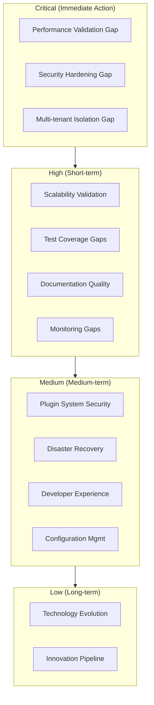

# Data Cloud Gap and Risk Summary

**Document ID:** DC-GAPRISK-001  
**Version:** 2.1  
**Date:** 2026-04-13  
**Evidence Base:** Current generated Data Cloud documentation set, architecture analysis, and readiness reconciliation

---

## Executive Summary

Data Cloud demonstrates **broad implementation coverage** and a **strong architectural foundation**, but readiness evidence remains uneven. This summary should be read as a **risk and mitigation document**, not as blanket proof of production readiness.

### Risk Priority Matrix



### Risk Assessment Summary:

- **Critical Risks**: 3 (Performance, Security, Multi-tenant Isolation)
- **High Risks**: 4 (Scalability, Testing, Documentation, Monitoring)
- **Medium Risks**: 4 (Plugin System, Developer Experience, DR, Config)
- **Low Risks**: 2 (Technology Evolution, Innovation)

---

## Critical Gap Analysis

### 1. Performance Validation Gap

#### Gap Description

**Performance characteristics are not validated under production load**

**Evidence:**

- No comprehensive load testing in test suite
- Performance targets defined but not measured
- Limited performance benchmarking (only cache performance test)
- No stress testing for concurrent users

**Impact Assessment:**

- **Severity**: Critical
- **Likelihood**: High
- **Business Impact**: Poor user experience, SLA violations, system instability

**Affected Areas:**

- API response times under load
- Database query performance with large datasets
- Event streaming throughput limits
- Concurrent user capacity

**Mitigation Plan:**

```bash
# Immediate Actions (Week 1-2)
1. Implement comprehensive load testing
   ./gradlew :products:data-cloud:loadTest
2. Add performance benchmarks
   ./gradlew :products:data-cloud:performanceTest
3. Set up performance monitoring
   - API response time alerts
   - Database performance metrics
   - Event processing latency
```

**Success Criteria:**

- API response time < 200ms (95th percentile) under 1000 concurrent users
- Database query time < 50ms for typical queries
- Event processing throughput > 10,000 events/sec
- System stability under load for 24 hours

### 2. Security Hardening Gap

#### Gap Description

**Security implementation lacks comprehensive validation and hardening**

**Evidence:**

- Token management not fully secure (no rotation, no revocation)
- Database encryption at rest not verified
- PII detection and redaction not comprehensive
- No penetration testing or security scanning

**Impact Assessment:**

- **Severity**: Critical
- **Likelihood**: Medium
- **Business Impact**: Security breaches, data exposure, compliance violations

**Affected Areas:**

- Authentication and authorization
- Data encryption and protection
- Multi-tenant data isolation
- API security

**Mitigation Plan:**

```bash
# Immediate Actions (Week 1-2)
1. Implement token rotation and revocation
2. Verify database encryption at rest
3. Enhance PII detection and redaction
4. Add security scanning to CI/CD

# Short-term Actions (Week 3-8)
1. Conduct security audit and penetration testing
2. Implement database-level tenant isolation
3. Add comprehensive security monitoring
4. Create security incident response procedures
```

**Success Criteria:**

- Token rotation and revocation implemented
- Database encryption verified and monitored
- PII detection covers all data types
- Security audit passes with no critical findings

### 3. Multi-tenant Isolation Gap

#### Gap Description

**Multi-tenant isolation relies on application-level controls without database-level enforcement**

**Evidence:**

- Tenant isolation implemented at application level only
- No database-level row-level security
- No resource quotas per tenant
- No tenant-specific monitoring

**Impact Assessment:**

- **Severity**: Critical
- **Likelihood**: Medium
- **Business Impact**: Cross-tenant data leakage, compliance violations

**Affected Areas:**

- Data access controls
- Resource allocation
- Monitoring and alerting
- Audit trails

**Mitigation Plan:**

```sql
-- Immediate Actions (Week 1-2)
1. Implement database-level tenant isolation
CREATE POLICY tenant_isolation ON entities
FOR ALL TO application_user
USING (tenant_id = current_setting('app.current_tenant_id')::text);

2. Add resource quotas per tenant
3. Implement tenant-specific monitoring
4. Add cross-tenant access auditing
```

**Success Criteria:**

- Database-level tenant isolation implemented
- Resource quotas enforced per tenant
- Tenant-specific monitoring and alerting
- No cross-tenant data access possible

---

## High-Risk Gap Analysis

### 1. Scalability Validation Gap

#### Gap Description

**Horizontal scaling patterns are not validated under production conditions**

**Evidence:**

- No testing of horizontal scaling scenarios
- Connection pooling not optimized for scale
- No load balancing validation
- Resource limits not tested

**Impact Assessment:**

- **Severity**: High
- **Likelihood**: Medium
- **Business Impact**: System bottlenecks, inability to scale, performance degradation

**Mitigation Plan:**

```bash
# Short-term Actions (Week 3-8)
1. Implement horizontal scaling tests
2. Optimize connection pooling
3. Validate load balancing configuration
4. Test resource limits and quotas
```

### 2. Test Coverage Gap

#### Gap Description

**Test coverage is incomplete for critical edge cases and failure scenarios**

**Evidence:**

- 24% of requirements lack test coverage
- Limited edge case testing
- No comprehensive failure scenario testing
- Limited performance and security testing

**Impact Assessment:**

- **Severity**: High
- **Likelihood**: High
- **Business Impact**: Undetected bugs, production issues, quality problems

**Mitigation Plan:**

```bash
# Immediate Actions (Week 1-2)
1. Add tests for uncovered requirements
2. Implement edge case testing
3. Add failure scenario tests
4. Improve test automation

# Short-term Actions (Week 3-8)
1. Implement comprehensive security testing
2. Add performance testing
3. Create chaos engineering tests
4. Improve test coverage to 90%
```

### 3. Documentation Quality Gap

#### Gap Description

**Documentation exists but has gaps in operational procedures and troubleshooting**

**Evidence:**

- 7% of requirements lack documentation
- Limited troubleshooting guides
- No comprehensive operational procedures
- Limited developer onboarding materials

**Impact Assessment:**

- **Severity**: High
- **Likelihood**: Medium
- **Business Impact**: Operational difficulties, longer onboarding time, increased support burden

**Mitigation Plan:**

```bash
# Short-term Actions (Week 3-8)
1. Complete documentation for all requirements
2. Create comprehensive troubleshooting guides
3. Develop operational procedures
4. Improve developer onboarding materials
```

### 4. Monitoring and Observability Gap

#### Gap Description

**Monitoring lacks business metrics and comprehensive alerting**

**Evidence:**

- Basic technical metrics implemented
- No business metrics monitoring
- Alert fatigue risk due to too many alerts
- Limited SLI/SLO implementation

**Impact Assessment:**

- **Severity**: High
- **Likelihood**: Medium
- **Business Impact**: Business issues not detected, SLA violations, poor user experience

**Mitigation Plan:**

```bash
# Short-term Actions (Week 3-8)
1. Implement business metrics monitoring
2. Optimize alerting rules and priorities
3. Implement SLI/SLO monitoring
4. Add user experience monitoring
```

### 5. Plugin System Security Gap

#### Gap Description

**Plugin system lacks proper isolation and security controls**

**Evidence:**

- Plugins run in same JVM without sandboxing
- No resource limits for plugins
- No plugin dependency security scanning
- Limited plugin validation

**Impact Assessment:**

- **Severity**: High
- **Likelihood**: Medium
- **Business Impact**: Security vulnerabilities, system instability, resource abuse

**Mitigation Plan:**

```bash
# Short-term Actions (Week 3-8)
1. Implement plugin sandboxing
2. Add resource limits for plugins
3. Implement plugin security scanning
4. Create plugin validation procedures
```

---

## Medium-Risk Gap Analysis

### 1. Developer Experience Gap

#### Gap Description

**Development environment setup is complex and not standardized**

**Evidence:**

- Complex local development requirements
- No development container provided
- IDE configuration not standardized
- Long build times

**Impact Assessment:**

- **Severity**: Medium
- **Likelihood**: High
- **Business Impact**: Reduced developer productivity, slower onboarding

### 2. Disaster Recovery Gap

#### Gap Description

**Disaster recovery procedures are documented but not tested**

**Evidence:**

- Backup procedures exist but not tested
- No disaster recovery drills
- Recovery time objectives not validated
- Limited failover testing

**Impact Assessment:**

- **Severity**: Medium
- **Likelihood**: Medium
- **Business Impact**: Extended downtime, data loss, business continuity issues

### 3. Geographic Scaling Gap

#### Gap Description

**Multi-region deployment is documented but not tested**

**Evidence:**

- Multi-region architecture documented
- No multi-region testing
- No cross-region failover testing
- Limited geographic optimization

**Impact Assessment:**

- **Severity**: Medium
- **Likelihood**: Low
- **Business Impact**: Geographic performance issues, limited global availability

### 4. Advanced Analytics Gap

#### Gap Description

**Advanced analytics features have limited testing and optimization**

**Evidence:**

- Basic analytics implemented
- Limited advanced analytics testing
- No analytics performance optimization
- Limited ML model validation

**Impact Assessment:**

- **Severity**: Medium
- **Likelihood**: Medium
- **Business Impact**: Limited analytics capabilities, poor performance

### 5. API Contract Testing Gap

#### Gap Description

**API contract testing is limited and not comprehensive**

**Evidence:**

- Basic API contract validation
- Limited comprehensive contract testing
- No API version compatibility testing
- Limited consumer contract testing

**Impact Assessment:**

- **Severity**: Medium
- **Likelihood**: Medium
- **Business Impact**: API compatibility issues, integration problems

### 6. Configuration Management Gap

#### Gap Description

**Configuration management is complex and error-prone**

**Evidence:**

- Multiple configuration sources
- No configuration drift detection
- Complex environment-specific configuration
- Limited configuration validation

**Impact Assessment:**

- **Severity**: Medium
- **Likelihood**: Medium
- **Business Impact**: Configuration errors, deployment failures

### 7. Cost Optimization Gap

#### Gap Description

**Cost optimization is not implemented or monitored**

**Evidence:**

- No cost monitoring implemented
- No resource optimization
- No cost alerts or budgets
- Limited cost analysis

**Impact Assessment:**

- **Severity**: Medium
- **Likelihood**: Medium
- **Business Impact**: Higher operational costs, resource waste

### 8. Compliance Automation Gap

#### Gap Description

**Compliance checking is manual and not automated**

**Evidence:**

- Basic compliance features implemented
- No automated compliance checking
- Limited compliance reporting
- Manual compliance processes

**Impact Assessment:**

- **Severity**: Medium
- **Likelihood**: Medium
- **Business Impact**: Compliance violations, manual overhead

---

## Low-Risk Gap Analysis

### 1. Technology Evolution Gap

#### Gap Description

**Technology stack evolution is not actively managed**

**Evidence:**

- Technology assessment not regular
- No migration planning for newer versions
- Limited technology research
- No technology obsolescence monitoring

**Impact Assessment:**

- **Severity**: Low
- **Likelihood**: Low
- **Business Impact**: Technical debt, future migration costs

### 2. Maintenance Automation Gap

#### Gap Description

**Maintenance tasks are not fully automated**

**Evidence:**

- Basic automation implemented
- Manual maintenance processes
- Limited predictive maintenance
- No automated issue detection

**Impact Assessment:**

- **Severity**: Low
- **Likelihood**: Medium
- **Business Impact**: Increased operational overhead

### 3. Innovation Pipeline Gap

#### Gap Description

**Innovation and research activities are limited**

**Evidence:**

- Limited R&D activities
- No innovation pipeline
- Limited experimentation
- No technology scouting

**Impact Assessment:**

- **Severity**: Low
- **Likelihood**: Low
- **Business Impact**: Missed opportunities, competitive disadvantage

### 4. Community Engagement Gap

#### Gap Description

**Community and ecosystem engagement is limited**

**Evidence:**

- Limited community building
- No ecosystem development
- Limited knowledge sharing
- No contribution guidelines

**Impact Assessment:**

- **Severity**: Low
- **Likelihood**: Low
- **Business Impact**: Limited adoption, ecosystem growth

---

## Risk Register

### Critical Risks

| Risk ID | Risk                           | Category    | Severity | Likelihood | Impact                               | Mitigation                             |
| ------- | ------------------------------ | ----------- | -------- | ---------- | ------------------------------------ | -------------------------------------- |
| RC-001  | Performance failure under load | Performance | Critical | High       | System instability, SLA violations   | Load testing, performance optimization |
| RC-002  | Security breach                | Security    | Critical | Medium     | Data exposure, compliance violations | Security hardening, audit, monitoring  |
| RC-003  | Cross-tenant data leakage      | Security    | Critical | Medium     | Privacy violations, legal issues     | Database-level isolation, monitoring   |

### High Risks

| Risk ID | Risk                            | Category    | Severity | Likelihood | Impact                                      | Mitigation                               |
| ------- | ------------------------------- | ----------- | -------- | ---------- | ------------------------------------------- | ---------------------------------------- |
| RH-001  | Scalability bottlenecks         | Scalability | High     | Medium     | Performance degradation, inability to scale | Scaling validation, optimization         |
| RH-002  | Quality issues in production    | Quality     | High     | High       | Production bugs, user impact                | Test coverage improvement, quality gates |
| RH-003  | Operational difficulties        | Operations  | High     | Medium     | Increased support burden, downtime          | Documentation, procedures, training      |
| RH-004  | Business issues not detected    | Monitoring  | High     | Medium     | SLA violations, poor user experience        | Business metrics, SLI/SLO implementation |
| RH-005  | Plugin security vulnerabilities | Security    | High     | Medium     | System compromise, instability              | Plugin sandboxing, validation            |

### Medium Risks

| Risk ID | Risk                            | Category    | Severity | Likelihood | Impact                           | Mitigation                        |
| ------- | ------------------------------- | ----------- | -------- | ---------- | -------------------------------- | --------------------------------- |
| RM-001  | Reduced developer productivity  | Development | Medium   | High       | Slower development, lower morale | Developer experience improvements |
| RM-002  | Extended disaster recovery time | Operations  | Medium   | Medium     | Business continuity issues       | DR testing, procedures            |
| RM-003  | Geographic performance issues   | Scalability | Medium   | Low        | Poor user experience globally    | Multi-region testing              |
| RM-004  | Limited analytics capabilities  | Features    | Medium   | Medium     | Reduced business value           | Analytics enhancement             |
| RM-005  | API compatibility issues        | Integration | Medium   | Medium     | Integration problems             | Contract testing                  |
| RM-006  | Configuration errors            | Operations  | Medium   | Medium     | Deployment failures              | Config management                 |
| RM-007  | Higher operational costs        | Cost        | Medium   | Medium     | Budget overruns                  | Cost optimization                 |
| RM-008  | Compliance violations           | Compliance  | Medium   | Medium     | Legal issues, fines              | Compliance automation             |

### Low Risks

| Risk ID | Risk                            | Category   | Severity | Likelihood | Impact                   | Mitigation            |
| ------- | ------------------------------- | ---------- | -------- | ---------- | ------------------------ | --------------------- |
| RL-001  | Technical debt accumulation     | Technology | Low      | Low        | Future maintenance costs | Technology management |
| RL-002  | Increased operational overhead  | Operations | Low      | Medium     | Higher costs             | Automation            |
| RL-003  | Missed innovation opportunities | Innovation | Low      | Low        | Competitive disadvantage | Innovation pipeline   |
| RL-004  | Limited ecosystem growth        | Ecosystem  | Low      | Low        | Slower adoption          | Community engagement  |

---

## Gap Mitigation Timeline

### Phase 1: Critical Gap Resolution (Weeks 1-2)

**Immediate Actions:**

1. **Performance Validation**
   - Implement load testing framework
   - Add performance benchmarks
   - Set up performance monitoring
   - Validate API response times

2. **Security Hardening**
   - Implement token rotation and revocation
   - Verify database encryption
   - Enhance PII detection
   - Add security scanning

3. **Multi-tenant Isolation**
   - Implement database-level isolation
   - Add resource quotas
   - Implement tenant monitoring
   - Add cross-tenant auditing

**Success Criteria:**

- Performance targets met under load
- Security audit passes
- Tenant isolation verified

### Phase 2: High-Risk Gap Resolution (Weeks 3-8)

**Short-term Actions:**

1. **Scalability Validation**
   - Test horizontal scaling
   - Optimize connection pooling
   - Validate load balancing
   - Test resource limits

2. **Test Coverage Enhancement**
   - Add tests for uncovered requirements
   - Implement edge case testing
   - Add failure scenario tests
   - Improve test automation

3. **Documentation Improvement**
   - Complete documentation gaps
   - Create troubleshooting guides
   - Develop operational procedures
   - Improve onboarding materials

4. **Monitoring Enhancement**
   - Implement business metrics
   - Optimize alerting
   - Add SLI/SLO monitoring
   - Improve user experience monitoring

5. **Plugin Security**
   - Implement plugin sandboxing
   - Add resource limits
   - Implement security scanning
   - Create validation procedures

**Success Criteria:**

- Scalability validated
- Test coverage > 90%
- Documentation complete
- Business metrics implemented
- Plugin security verified

### Phase 3: Medium-Risk Gap Resolution (Weeks 9-24)

**Medium-term Actions:**

1. **Developer Experience**
   - Standardize development environment
   - Improve build performance
   - Standardize IDE configuration
   - Create development containers

2. **Disaster Recovery**
   - Test backup and recovery procedures
   - Implement disaster recovery drills
   - Validate recovery objectives
   - Create DR documentation

3. **Advanced Features**
   - Enhance analytics capabilities
   - Improve ML model validation
   - Add advanced analytics testing
   - Optimize analytics performance

4. **Cost Optimization**
   - Implement cost monitoring
   - Add resource optimization
   - Create cost alerts only after a real launcher-backed alert surface exists
   - Implement cost analysis

**Success Criteria:**

- Developer experience improved
- Disaster recovery validated
- Advanced features enhanced
- Cost optimization implemented

### Phase 4: Low-Risk Gap Resolution (Weeks 25-52)

**Long-term Actions:**

1. **Technology Management**
   - Implement technology assessment
   - Create migration planning
   - Add technology research
   - Monitor obsolescence

2. **Innovation Pipeline**
   - Create R&D activities
   - Implement innovation pipeline
   - Add experimentation
   - Create technology scouting

3. **Community Engagement**
   - Build community
   - Develop ecosystem
   - Share knowledge
   - Create contribution guidelines

**Success Criteria:**

- Technology management established
- Innovation pipeline active
- Community engagement growing

---

## Gap Resolution Investment

### Resource Requirements

**Phase 1 (Weeks 1-2):**

- **Engineering**: 2 developers, 1 security specialist
- **Infrastructure**: Performance testing environment
- **Tools**: Load testing tools, security scanning tools
- **Budget**: $15,000

**Phase 2 (Weeks 3-8):**

- **Engineering**: 4 developers, 1 QA engineer, 1 DevOps engineer
- **Infrastructure**: Expanded testing environments
- **Tools**: Monitoring tools, documentation tools
- **Budget**: $50,000

**Phase 3 (Weeks 9-24):**

- **Engineering**: 3 developers, 1 DevOps engineer
- **Infrastructure**: Production-like environments
- **Tools**: Developer tools, analytics tools
- **Budget**: $75,000

**Phase 4 (Weeks 25-52):**

- **Engineering**: 2 developers, 1 researcher
- **Infrastructure**: R&D environments
- **Tools**: Innovation tools, community tools
- **Budget**: $50,000

### Total Investment: $190,000

---

## Success Metrics

### Phase 1 Success Metrics

- **Performance**: API response time < 200ms (95th percentile)
- **Security**: Zero critical security findings
- **Isolation**: Zero cross-tenant data access incidents

### Phase 2 Success Metrics

- **Scalability**: System handles 1000 concurrent users
- **Quality**: Test coverage > 90%
- **Documentation**: 100% requirements documented
- **Monitoring**: Business metrics implemented for all critical flows

### Phase 3 Success Metrics

- **Developer Experience**: Onboarding time < 2 days
- **Disaster Recovery**: RTO < 4 hours, RPO < 1 hour
- **Analytics**: Advanced analytics adoption > 50%
- **Cost**: Operational costs reduced by 20%

### Phase 4 Success Metrics

- **Technology**: Technology debt < 10% of codebase
- **Innovation**: 2 new features per quarter
- **Community**: 100+ community members

---

## Risk Monitoring and Reporting

### Risk Monitoring Signals

**Critical Risk Indicators:**

- Performance degradation > 10%
- Security incidents > 0
- Cross-tenant access attempts > 0

**High Risk Indicators:**

- Test coverage < 85%
- Documentation gaps > 5%
- Alert fatigue rate > 20%

**Medium Risk Indicators:**

- Developer satisfaction < 80%
- Cost overruns > 10%
- Compliance violations > 0

### Reporting Schedule

- **Daily**: Critical risk monitoring
- **Weekly**: High risk review
- **Monthly**: Medium risk assessment
- **Quarterly**: Low risk evaluation

---

## Conclusion

Data-Cloud has a **strong architectural foundation** and a **broad documented feature surface**. However, the documentation still shows **critical gaps** in performance validation, security proof, and tenant-isolation clarity that prevent a clean blanket readiness claim. The **systematic gap resolution plan** outlined above remains useful, but it should be interpreted as a path to validated readiness rather than evidence that such readiness already exists.

**Key Takeaways:**

1. **Immediate action required** for critical gaps
2. **Systematic approach** needed for high-risk gaps
3. **Long-term investment** required for medium and low-risk gaps
4. **Continuous monitoring** essential for gap detection
5. **Regular assessment** needed to ensure gap resolution

With proper execution of this gap resolution plan, Data-Cloud can move from **broad capability coverage** to **validated operational maturity** while maintaining its strong technical foundation.

---

_This gap and risk summary represents the reconciled risk posture as of April 13, 2026. It should be maintained together with the audit report and readiness scorecard so risk language and readiness language remain aligned._
