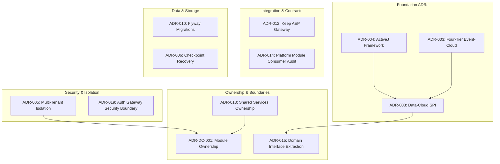
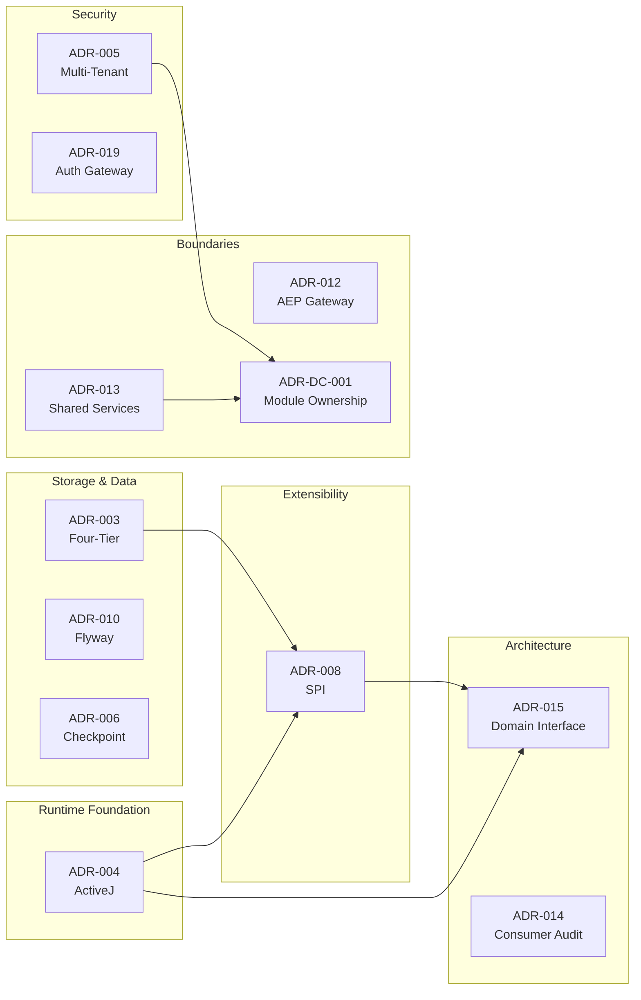

# Data Cloud Architecture Decision Records (ADRs)

**Document ID:** DC-ADR-INDEX-001  
**Version:** 1.1  
**Date:** 2026-04-29  
**Owner:** Data Cloud Platform Team

---

## Verification Status Convention (DC-A11)

Claims and capabilities described in these ADRs carry a verification label:

| Label | Meaning |
|-------|---------|
| ✅ **verified-locally** | Covered by unit/integration tests in CI (H2/Testcontainers). |
| 🔵 **integration-validated** | Covered by cross-service or live-infrastructure tests. |
| 🟡 **deployment-validated** | Confirmed in a deployed staging or production environment. |
| ⚪ **architecture-only** | Design intent; no automated verification exists yet. |

Where a section makes a capability claim without a label it must be treated as **⚪ architecture-only** until evidence is added.

---

## Overview

This folder contains the complete Architecture Decision Records (ADRs) for the Data Cloud product. ADRs capture important architectural decisions, their context, consequences, and the rationale behind them.

### ADR Organization

---

## ADR Registry

### Data Cloud Specific ADRs

| ID | Title | Status | Date | Owner | Impact |
|----|-------|--------|------|-------|--------|
| **ADR-DC-001** | [Module Ownership & Domain Boundaries](./adr-dc-001-module-ownership.md) | Accepted | 2026-01-19 | Data Cloud Team | HIGH - Defines all module boundaries |
| **ADR-DC-002** | [Runtime Capability Truth](./adr-dc-002-runtime-capability-truth.md) | Accepted | 2026-04-26 | Data Cloud Team | HIGH - Universal feature gating |
| **ADR-DC-003** | [Canonical Query Contract](./adr-dc-003-canonical-query-contract.md) | Accepted | 2026-04-26 | Data Cloud Team | HIGH - Query specification standard |
| **ADR-DC-004** | [Event Envelope for Replay & Audit](./adr-dc-004-event-envelope.md) | Accepted | 2026-04-26 | Data Cloud Team | HIGH - Provenance & temporal truth |
| **ADR-DC-005** | [Governance Fail-Closed](./adr-dc-005-governance-fail-closed.md) | Accepted | 2026-04-26 | Data Cloud Team | HIGH - Production security requirements |
| **ADR-DC-008** | [Connector SPI](./adr-dc-008-connector-spi.md) | Accepted | 2026-04-26 | Data Cloud Team | HIGH - Source/sink lifecycle, schema inference, credentials, health, tenancy |
| **ADR-DC-011** | [OpenAPI-Generated SDK Clients Only](./adr-dc-011-openapi-sdk-contract.md) | Accepted | 2026-04-26 | Data Cloud Team | HIGH - Contract truth |

### Platform ADRs Affecting Data Cloud

| ID | Title | Status | Date | Owner | Impact |
|----|-------|--------|------|-------|--------|
| **ADR-003** | [Four-Tier Event-Cloud Storage](./adr-003-four-tier-event-cloud.md) | Accepted | 2026-01-18 | Platform Team | HIGH - Storage architecture |
| **ADR-004** | [ActiveJ as Core Async Framework](./adr-004-activej-framework.md) | Accepted | 2026-01-10 | Platform Team | HIGH - Runtime foundation |
| **ADR-005** | [Multi-Tenant Isolation](./adr-005-multi-tenant-isolation.md) | Accepted | 2026-01-25 | Platform Team | HIGH - Security model |
| **ADR-006** | [Checkpoint Recovery](./adr-006-checkpoint-recovery.md) | Accepted | 2026-01-15 | Platform Team | MEDIUM - Resilience |
| **ADR-008** | [Data-Cloud SPI with ServiceLoader](./adr-008-datacloud-spi.md) | Accepted | 2026-01-18 | Platform Team | HIGH - Plugin architecture |
| **ADR-010** | [Flyway Migrations](./adr-010-flyway-migrations.md) | Accepted | 2026-01-20 | Platform Team | MEDIUM - Schema management |
| **ADR-012** | [Keep AEP Gateway](./adr-012-keep-aep-gateway.md) | Accepted | 2026-02-15 | Platform Team | HIGH - AEP boundary |
| **ADR-013** | [Shared Services Ownership](./adr-013-shared-services-ownership.md) | Accepted | 2026-03-21 | Platform Team | HIGH - Module placement |
| **ADR-014** | [Platform Module Consumer Audit](./adr-014-platform-module-consumer-audit.md) | Accepted | 2026-03-22 | Platform Team | MEDIUM - Dependencies |
| **ADR-015** | [Domain Interface Extraction](./adr-015-domain-interface-extraction.md) | Accepted | 2026-03-25 | Platform Team | HIGH - Clean architecture |
| **ADR-019** | [Auth Gateway Security Boundary](./adr-019-auth-gateway-security-gateway-boundary.md) | Accepted | 2026-02-28 | Security Team | HIGH - Security architecture |

---

## ADR Dependency Graph

---

## Key Decision Themes

### 1. Runtime & Async Model (ADR-004)
- **Decision**: Use ActiveJ 6.0 with Promise-based async
- **Impact**: All Data Cloud async operations use `Promise<T>`
- **Consequence**: Team must understand Promise composition patterns

### 2. Storage Architecture (ADR-003)
- **Decision**: Four-tier storage (Hot→Warm→Cool→Cold)
- **Impact**: Automatic data lifecycle across Redis, PostgreSQL, Iceberg, S3
- **Consequence**: Cross-tier queries not supported in v1

### 3. Plugin Extensibility (ADR-008)
- **Decision**: ServiceLoader-based SPI with capability interfaces
- **Impact**: 13 core SPI interfaces, pluggable storage backends
- **Consequence**: Plugin JARs need META-INF/services/ files

### 4. Multi-Tenant Isolation (ADR-005)
- **Decision**: Thread-local TenantContext with Principal value object
- **Impact**: Transparent tenant propagation, DB-level filtering
- **Consequence**: Async operations must explicitly transfer context

### 5. Module Boundaries (ADR-DC-001)
- **Decision**: Clear ownership matrix with strict downward dependencies
- **Impact**: 7 modules with defined contracts and forbidden edges
- **Consequence**: New handlers require ADR update

---

## ADR Status Definitions

| Status | Meaning |
|--------|---------|
| **Proposed** | Under discussion, not yet decided |
| **Accepted** | Decision made and being implemented |
| **Deprecated** | Decision superseded by newer ADR |
| **Superseded** | Replaced by another ADR (link provided) |

---

## How to Use This Index

### For New Team Members
Start with:
1. [ADR-004: ActiveJ Framework](./adr-004-activej-framework.md) - Understand the async model
2. [ADR-003: Four-Tier Event-Cloud](./adr-003-four-tier-event-cloud.md) - Understand storage architecture
3. [ADR-DC-001: Module Ownership](./adr-dc-001-module-ownership.md) - Understand module boundaries

### For Architects
Review:
1. [ADR-015: Domain Interface Extraction](./adr-015-domain-interface-extraction.md) - Clean architecture
2. [ADR-008: Data-Cloud SPI](./adr-008-datacloud-spi.md) - Plugin architecture
3. [ADR-013: Shared Services Ownership](./adr-013-shared-services-ownership.md) - Cross-product boundaries

### For Developers
Focus on:
1. [ADR-005: Multi-Tenant Isolation](./adr-005-multi-tenant-isolation.md) - Security context
2. [ADR-010: Flyway Migrations](./adr-010-flyway-migrations.md) - Schema changes
3. [ADR-DC-001: Module Ownership](./adr-dc-001-module-ownership.md) - Dependency rules

---

## Related Documentation

- [System Architecture](../02-architecture-decisions-design/01-system-architecture.md)
- [Engineering Caveats](../04-technical-docs-stack-caveats-guidance/03-engineering-caveats.md)
- [Gap and Risk Summary](../06-index-traceability-risk/03-gap-and-risk-summary.md)

---

*Last updated: April 27, 2026*
