# Data Cloud Schema ERD (V001–V019)

> **Authoritative source**: [platform-launcher/src/main/resources/db/migration/](../platform-launcher/src/main/resources/db/migration/)
>
> This ERD is generated from the versioned Flyway migration baseline V001–V019.
> The migration files are the canonical source of truth for all table shapes, constraints,
> indexes, and RLS policies. This document provides a human-readable reference for
> architecture reviews and production readiness audits (P1-06).
>
> Last updated: 2026-04-30
> Migration tests: `DatabaseMigrationContractTest` (10 assertions, all green)

## Entity Relationship Diagram

```mermaid
erDiagram
    events {
        UUID        id              PK
        VARCHAR     tenant_id       "NOT NULL — tenant isolation"
        VARCHAR     collection_name "NOT NULL"
        VARCHAR     record_type     "NOT NULL — CHECK IN (ENTITY,EVENT,TIMESERIES,DOCUMENT,GRAPH)"
        JSONB       data
        JSONB       metadata
        TIMESTAMPTZ created_at
        VARCHAR     created_by
        VARCHAR     stream_name     "NOT NULL"
        INT         partition_id    "NOT NULL DEFAULT 0"
        BIGINT      event_offset    "NOT NULL"
        TIMESTAMPTZ occurrence_time "NOT NULL"
        TIMESTAMPTZ detection_time  "NOT NULL"
        VARCHAR     idempotency_key "UNIQUE per tenant"
        VARCHAR     correlation_id
        VARCHAR     causation_id
    }

    entities {
        UUID        id              PK
        VARCHAR     tenant_id       "NOT NULL — tenant isolation"
        VARCHAR     collection_name "NOT NULL"
        VARCHAR     record_type     "NOT NULL"
        JSONB       data
        JSONB       metadata
        TIMESTAMPTZ created_at
        VARCHAR     created_by
        INT         version         "DEFAULT 1 — optimistic lock"
        BOOLEAN     active          "DEFAULT TRUE — soft delete"
        TIMESTAMPTZ updated_at
        VARCHAR     updated_by
    }

    event_log {
        BIGINT      offset_value    PK "GENERATED ALWAYS AS IDENTITY"
        VARCHAR     tenant_id       "NOT NULL — tenant isolation"
        UUID        event_id        "NOT NULL — UNIQUE per tenant"
        VARCHAR     event_type      "NOT NULL"
        VARCHAR     event_version   "NOT NULL DEFAULT 1.0.0"
        BYTEA       payload         "NOT NULL"
        VARCHAR     content_type    "DEFAULT application/json"
        JSONB       headers         "NOT NULL DEFAULT {}"
        VARCHAR     idempotency_key "UNIQUE per tenant when set"
        TIMESTAMPTZ created_at      "NOT NULL DEFAULT NOW()"
    }

    entity_relations {
        UUID        id              PK
        VARCHAR     tenant_id       "NOT NULL — tenant isolation"
        UUID        source_id       "FK → entities.id CASCADE DELETE"
        UUID        target_id       "FK → entities.id CASCADE DELETE"
        VARCHAR     relation_type   "NOT NULL"
        JSONB       properties
        TIMESTAMPTZ created_at      "NOT NULL"
        VARCHAR     created_by
    }

    agent_releases {
        UUID        id              PK
        TEXT        tenant_id       "NOT NULL — tenant isolation"
        TEXT        agent_release_id "NOT NULL — UNIQUE per tenant"
        TEXT        agent_id        "NOT NULL"
        TEXT        spec_version    "NOT NULL DEFAULT 1.0.0"
        TEXT        release_version "NOT NULL"
        TEXT        state           "DEFAULT DRAFT"
        JSONB       compatible_runtime_versions "NOT NULL DEFAULT []"
        JSONB       data_classes_handled "NOT NULL DEFAULT []"
        JSONB       data            "NOT NULL DEFAULT {}"
        TIMESTAMPTZ created_at      "NOT NULL DEFAULT NOW()"
        TIMESTAMPTZ updated_at      "NOT NULL DEFAULT NOW()"
        BOOLEAN     active          "NOT NULL DEFAULT TRUE"
        INT         version         "NOT NULL DEFAULT 1"
    }

    agent_rollouts {
        UUID        id              PK
        TEXT        tenant_id       "NOT NULL — tenant isolation"
        TEXT        rollout_id      "NOT NULL — UNIQUE per tenant"
        TEXT        agent_id        "NOT NULL"
        TEXT        release_id      "NOT NULL — FK → agent_releases.agent_release_id"
        TEXT        rollout_strategy "NOT NULL"
        TEXT        target_population "NOT NULL"
        TEXT        status          "NOT NULL DEFAULT PENDING"
        JSONB       data            "NOT NULL DEFAULT {}"
        TIMESTAMPTZ created_at      "NOT NULL DEFAULT NOW()"
        TIMESTAMPTZ updated_at      "NOT NULL DEFAULT NOW()"
    }

    evaluation_results {
        UUID        id              PK
        TEXT        tenant_id       "NOT NULL — tenant isolation"
        TEXT        evaluation_id   "NOT NULL — UNIQUE per tenant"
        TEXT        agent_id        "NOT NULL"
        TEXT        release_id      "NOT NULL"
        TEXT        evaluator_type  "NOT NULL"
        TEXT        result_status   "NOT NULL"
        JSONB       scores          "NOT NULL DEFAULT {}"
        JSONB       data            "NOT NULL DEFAULT {}"
        TIMESTAMPTZ evaluated_at    "NOT NULL DEFAULT NOW()"
    }

    memory_namespaces {
        BIGSERIAL   id              PK
        VARCHAR     namespace_id    "NOT NULL — UNIQUE per tenant+agent"
        VARCHAR     tenant_id       "NOT NULL — tenant isolation"
        VARCHAR     agent_id        "NOT NULL"
        VARCHAR     scope           "NOT NULL — CHECK IN (EPISODIC,SEMANTIC,PROCEDURAL,PREFERENCE)"
        VARCHAR     label           "NOT NULL"
        TEXT        description
        INT         retention_days
        BOOLEAN     promotion_enabled "NOT NULL DEFAULT FALSE"
        INT         max_entries
        TIMESTAMPTZ created_at      "NOT NULL"
        TIMESTAMPTZ updated_at      "NOT NULL"
        JSONB       data            "NOT NULL DEFAULT {}"
    }

    promotion_evidence {
        UUID        id              PK
        TEXT        tenant_id       "NOT NULL — tenant isolation"
        TEXT        evidence_id     "NOT NULL — UNIQUE per tenant"
        TEXT        agent_id        "NOT NULL"
        TEXT        release_id      "NOT NULL"
        TEXT        promotion_gate  "NOT NULL"
        TEXT        outcome         "NOT NULL"
        JSONB       evidence_data   "NOT NULL DEFAULT {}"
        TIMESTAMPTZ recorded_at     "NOT NULL DEFAULT NOW()"
    }

    media_artifacts {
        UUID        id              PK
        TEXT        tenant_id       "NOT NULL — tenant isolation"
        TEXT        artifact_id     "NOT NULL — UNIQUE per tenant"
        TEXT        artifact_type   "NOT NULL"
        TEXT        agent_id
        TEXT        storage_uri     "NOT NULL"
        TEXT        content_type
        BIGINT      size_bytes
        TEXT        checksum
        JSONB       metadata        "NOT NULL DEFAULT {}"
        TIMESTAMPTZ created_at      "NOT NULL DEFAULT NOW()"
        BOOLEAN     active          "NOT NULL DEFAULT TRUE"
    }

    entities ||--o{ entity_relations : "source_id / target_id"
    agent_releases ||--o{ agent_rollouts : "agent_release_id (logical FK)"
    agent_releases ||--o{ evaluation_results : "release_id (logical FK)"
    agent_releases ||--o{ promotion_evidence : "release_id (logical FK)"
    agent_releases ||--o{ media_artifacts : "agent_id (logical FK)"
    memory_namespaces ||--o{ promotion_evidence : "agent_id (logical FK)"
```



## Table Inventory

| Version | Table | Tenant-scoped | RLS policy | Purpose |
|---|---|---|---|---|
| V001 | `events` | ✅ `tenant_id NOT NULL` | ✅ V011 | Immutable event sourcing store; partition-based ordering |
| V002 | `entities` | ✅ `tenant_id NOT NULL` | ✅ V011 | Mutable entity store; optimistic lock + soft delete |
| V003 | `timeseries` | ✅ `tenant_id NOT NULL` | ❌ (local store only) | Time-series data (system table) |
| V004 | `collections_metadata` | ✅ `tenant_id NOT NULL` | ❌ (local store only) | Collection schema registry |
| V005 | `event_log` | ✅ `tenant_id NOT NULL` | ✅ V019 | Warm-tier append-only audit event log |
| V010 | `entity_relations` | ✅ `tenant_id NOT NULL` | ✅ V019 | Typed FK-constrained relationships between entities |
| V011 | *(functions)* | N/A | ✅ installs RLS on events+entities | Tenant isolation functions and RLS policy installation |
| V013 | `agent_releases` | ✅ `tenant_id NOT NULL` | ✅ V019 | Agent lifecycle release records |
| V014 | `agent_rollouts` | ✅ `tenant_id NOT NULL` | ✅ V019 | Agent rollout execution tracking |
| V015 | `evaluation_results` | ✅ `tenant_id NOT NULL` | ✅ V019 | Agent quality evaluation outcomes |
| V016 | `memory_namespaces` | ✅ `tenant_id NOT NULL` | ✅ V019 | Agent memory namespace registry |
| V017 | `promotion_evidence` | ✅ `tenant_id NOT NULL` | ✅ V019 | Agent promotion gate evidence records |
| V018 | `media_artifacts` | ✅ `tenant_id NOT NULL` | ✅ V019 | Media and artifact storage metadata |

## Row-Level Security (RLS) Coverage

V011 installs RLS for the core domain tables (`events`, `entities`). V019 extends RLS to all remaining tenant-scoped tables introduced in V010 and V013–V018. All policies use `tenant_security.get_current_tenant()` which must match the `tenant_id` column to permit row access.

```sql
-- Example RLS policy pattern (from V019)
ALTER TABLE event_log ENABLE ROW LEVEL SECURITY;
CREATE POLICY tenant_isolation_event_log
    ON event_log
    USING (tenant_id = tenant_security.get_current_tenant());
```

## Key Constraints Summary

| Table | Uniqueness | Cross-tenant isolation |
|---|---|---|
| `events` | `(tenant_id, stream_name, partition_id, event_offset)` | UNIQUE + RLS |
| `entities` | `(id)` PK; index `(tenant_id, collection_name)` | RLS |
| `event_log` | `(tenant_id, event_id)`, `(tenant_id, idempotency_key)` | UNIQUE + RLS |
| `entity_relations` | `(tenant_id, source_id, target_id, relation_type)` | UNIQUE + RLS |
| `agent_releases` | `(tenant_id, agent_release_id)` | UNIQUE + RLS |
| `agent_rollouts` | `(tenant_id, rollout_id)` | UNIQUE + RLS |
| `evaluation_results` | `(tenant_id, evaluation_id)` | UNIQUE + RLS |
| `memory_namespaces` | `(tenant_id, namespace_id)` | UNIQUE + RLS |
| `promotion_evidence` | `(tenant_id, evidence_id)` | UNIQUE + RLS |
| `media_artifacts` | `(tenant_id, artifact_id)` | UNIQUE + RLS |

## Migration CI Validation

Migration contract tests run in CI via:

```bash
./gradlew :products:data-cloud:delivery:runtime-composition:test \
  --tests "com.ghatana.datacloud.migration.DatabaseMigrationContractTest" \
  --no-daemon
```

Coverage: version contiguity (no gaps), `tenant_id NOT NULL` across all domain tables, no `DEFAULT NULL` loopholes, tenant-scoped unique/primary-key anchors on every domain table, workload-path lookup indexes, RLS extension for new V013–V018 tables.
