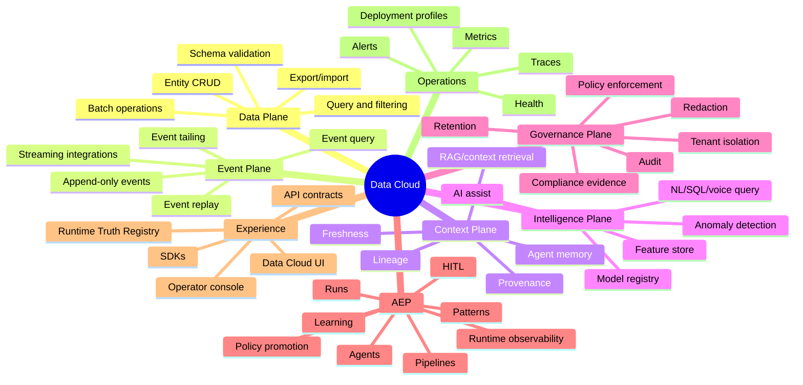
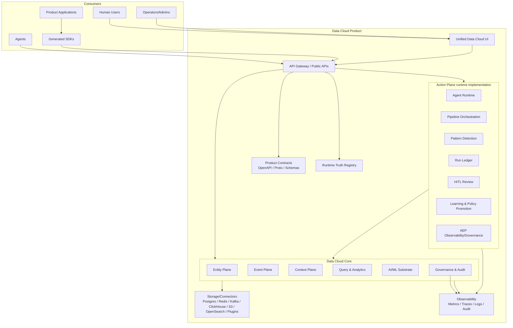
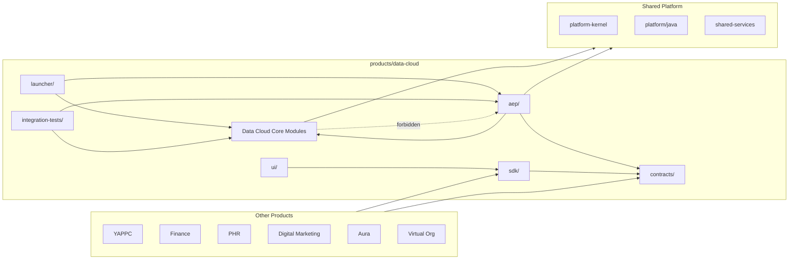
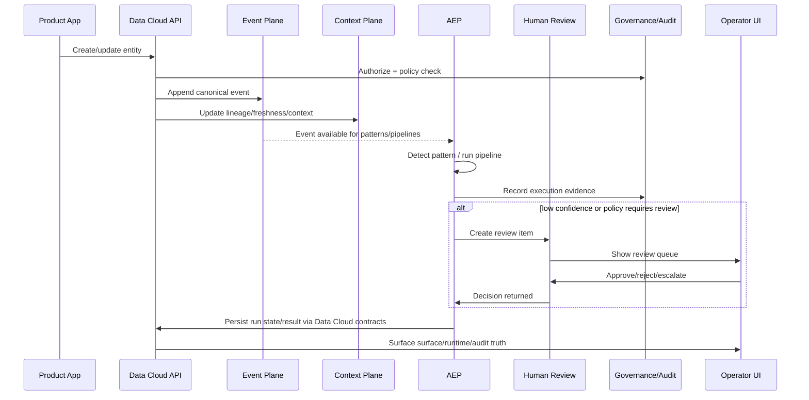

# Data Cloud Unified Product Vision, Market Strategy, Competitor Landscape, Positioning, and High-Level Architecture

**Product:** Data Cloud  
**Action Plane runtime:** AEP under `products/data-cloud/planes/action`  
**Public contracts:** `products/data-cloud/contracts`  
**Purpose:** Define the unified product vision, market thesis, competitor landscape, positioning, plane model, and very high-level architecture after merging Data Cloud and AEP into one product boundary.

---

## 1. Executive Thesis

Data Cloud should be the single customer-facing product. AEP should no longer be positioned as an independent top-level product. It is the runtime implementation behind Data Cloud's Action Plane.

```text
Data Cloud = AI-native operational data fabric
Action Plane = governed automation, pipelines, patterns, agents, reviews, runs, and learning
AEP = Action Plane runtime implementation
```

The unified product promise:

```text
Data Cloud unifies operational entities, durable events, trusted context, governance, intelligence, and governed action into one deployable product.
```

The customer outcome is not “run Data Cloud and AEP.” The customer outcome is:

```text
Store trusted data.
Capture event history.
Ground AI and agents in fresh context.
Detect patterns.
Run governed automation.
Route uncertain actions to humans.
Learn from outcomes.
Audit everything.
```

---

## 2. New Product Boundary

### 2.1 Repository boundary

```text
products/data-cloud/
```

is the single top-level product folder.

### 2.2 Action Plane boundary

```text
products/data-cloud/planes/action/
```

contains the current Action Plane runtime implementation.

The Action Plane includes:

```text
- event-driven agent orchestration
- event intake and routing
- pipeline definitions and execution
- pattern definitions and detection
- operator catalog
- agent execution surfaces
- run ledger and execution evidence
- HITL review
- learning loops
- policy promotion
- runtime analytics and forecasting
- governance/compliance surfaces
- action-specific observability
```

### 2.3 Contract boundary

```text
products/data-cloud/contracts/
```

owns public product contracts:

```text
- Data Cloud OpenAPI
- Action Plane OpenAPI
- unified product OpenAPI where needed
- public proto contracts
- public schemas for events, entities, pipelines, agents, surfaces, audit, and governance
```

Action Plane internal extension contracts remain in:

```text
products/data-cloud/planes/action/operator-contracts/
```

### 2.4 Dependency boundary

```text
Allowed:
  Action Plane runtime -> Data Cloud public contracts/SPI/event/context/governance APIs
  Launcher/distribution -> Data Cloud planes + Action Plane runtime
  Integration tests -> Data Cloud planes + Action Plane runtime

Forbidden:
  Data, Event, Context, Governance, and Intelligence planes -> Action Plane implementation internals
```

---

## 3. Vision

### 3.1 Vision statement

Data Cloud is the trusted operational context layer for AI-native, multi-tenant organizations.

It gives product teams one product to:

```text
- manage tenant-safe operational entities
- persist durable event history
- query trusted data
- expose fresh context to humans and agents
- govern data, retention, redaction, and automation
- execute agentic workflows through AEP
- learn from human feedback
- observe, explain, and audit everything
```

### 3.2 Long-term aspiration

Data Cloud should become the default foundation for organizations that need:

```text
- multi-tenant application data infrastructure
- real-time event processing
- governed AI context
- agentic workflow orchestration
- human-in-the-loop safety
- self-hosted or sovereign deployment
- observable, auditable automation
```

### 3.3 Product promise

```text
Build intelligent, multi-tenant applications without stitching together separate databases, event streams, workflow engines, governance catalogs, RAG systems, vector stores, model registries, audit systems, and operator consoles.
```

### 3.4 Product non-goals

Data Cloud is not:

```text
- a generic replacement for every database workload
- a generic lakehouse or warehouse replacement
- a pure BI tool
- a pure metadata catalog
- a pure vector database
- a generic agent framework detached from data governance
- a hidden black-box automation system
- a place for product-specific business logic
```

AEP is not:

```text
- a separate customer-facing product after the merge
- a long-term data store
- the owner of Data Cloud entity/event truth
- an implementation home for product-specific agents
- a replacement for product domain logic
```

---

## 4. Market Problem

Organizations building AI-native systems often assemble:

```text
Application DB
+ event stream
+ workflow engine
+ vector database
+ semantic layer
+ model registry
+ governance catalog
+ audit trail
+ reporting layer
+ observability stack
+ agent orchestration runtime
+ custom glue code
```

This creates:

```text
- duplicate data truth
- stale AI context
- inconsistent tenant isolation
- weak lineage across data and automation
- governance outside execution paths
- fragmented audit evidence
- poor visibility into agent actions
- hard-to-debug event pipelines
- high operations burden
- vendor and tool sprawl
```

Data Cloud’s opportunity is to collapse these fragments into one coherent operational fabric.

---

## 5. Ideal Customer Profile

### 5.1 Primary customers

```text
- engineering-led SaaS companies
- multi-tenant product teams
- regulated enterprises needing self-hosted or sovereign deployment
- organizations building AI-native operational workflows
- platform teams standardizing data, events, governance, and agentic execution
```

### 5.2 Buyer personas

| Persona | Needs |
|---|---|
| CTO / VP Engineering | Fewer tools, faster delivery, lower platform sprawl |
| Platform Engineering Lead | Standard contracts, tenant-safe runtime, event backbone, observability |
| Data/AI Platform Lead | Fresh context, lineage, feature/model support, RAG, governed AI actions |
| Security / Compliance Lead | Policy enforcement, audit evidence, retention, redaction, consent |
| Product Engineering Teams | APIs and SDKs that avoid rebuilding data/event/governance infrastructure |
| Operators | One console for data health, pipelines, agent runs, HITL, trust, and incidents |

### 5.3 User personas

| User | Primary tasks |
|---|---|
| Primary user | Query data, explore entities, start workflows, review outcomes |
| Operator | Monitor runtime, investigate degraded surfaces, handle alerts |
| Admin | Manage tenants, policies, connectors, deployment settings, keys |
| Agent/operator developer | Build AEP operators, patterns, pipelines, product-specific agents |
| Compliance reviewer | Inspect audit, review queues, retention, redaction, compliance posture |

---

## 6. Market Opportunity

### 6.1 Strategic opportunity

The opportunity is not merely another data platform or agent runtime. It is:

```text
A governed operational data fabric that is agent-ready from the beginning.
```

Most platforms start from a narrow category:

```text
warehouse-first
lakehouse-first
stream-first
workflow-first
RAG-first
agent-framework-first
catalog-first
```

Data Cloud’s category opportunity:

```text
context-first + event-first + governance-first + agent-ready
```

### 6.2 Underserved wedge

Strongest wedge:

```text
Self-hostable, tenant-aware, governed, AI-native operational data fabric for regulated and engineering-led organizations.
```

This is valuable for:

```text
healthcare
finance
government
defense
regional/sovereign cloud markets
internal enterprise platforms
organizations with data residency controls
```

### 6.3 Why AEP strengthens the product

Without AEP, Data Cloud is a data/event/context platform.

With AEP inside Data Cloud, the product becomes:

```text
trusted data + trusted context + trusted event processing + trusted agentic action
```

AEP adds:

```text
- event-driven automation
- pattern detection
- agent pipeline execution
- human review workflows
- learning loops
- policy promotion
- run-level observability
```

---

## 7. Competitor Landscape

The competitor landscape should be refreshed with live market research before external publication. This document focuses on durable strategic positioning.

### 7.1 Competitor categories

```text
Data warehouse:
  Snowflake, BigQuery, Redshift

Lakehouse / data intelligence:
  Databricks, Microsoft Fabric

Streaming / event backbone:
  Confluent, Kafka ecosystem, Redpanda, Flink

Workflow / orchestration:
  Temporal, Airflow, Dagster, Prefect

Agent orchestration / agent runtimes:
  LangGraph/LangChain ecosystem, CrewAI, AutoGen-style frameworks, custom enterprise runtimes

Governance / catalog:
  Collibra, Alation, Unity Catalog, Atlan

Vector/RAG/context:
  Pinecone, Weaviate, Milvus, pgvector, semantic-layer/context startups

Observability:
  Datadog, Grafana stack, OpenTelemetry ecosystem

Enterprise application platforms:
  ServiceNow, Salesforce Platform, Microsoft Power Platform
```

### 7.2 Competitive comparison

| Category | Incumbent strength | Incumbent weakness | Data Cloud position |
|---|---|---|---|
| Warehouse | Strong analytics and SQL | Weak operational entity/event workflow; often SaaS-first | Operational data + event + context fabric |
| Lakehouse | Strong data engineering/ML | Complex, batch-heavy, not operator-simple | Application-facing data/context/governance layer |
| Streaming | Strong event transport | Not entity/context/governance/action platform | Event backbone plus entities, governance, and governed action |
| Workflow | Durable task orchestration | Detached from data lineage/tenant context | Data-grounded workflows with audit and context |
| Agent frameworks | Flexible agent composition | Weak enterprise governance/durability/lineage | Action Plane execution grounded in Data Cloud truth |
| Governance catalog | Metadata inventory | Enforcement often outside runtime | Policy and audit embedded into execution paths |
| Vector/RAG | Semantic retrieval | Detached from operational truth/freshness | Context-native retrieval from entity/event/lineage |
| BI | Dashboards | Weak action and governance | Insight-to-action through governed review and audit |
| Enterprise platforms | Workflow ecosystem | Platform-specific lock-in | Open data + agentic execution substrate |

### 7.3 Differentiators

Data Cloud should win on:

```text
1. Unified product boundary
2. Tenant-aware by design
3. Entity + event + context together
4. Context-native AI
5. Governed action through the Action Plane
6. Governance in runtime path
7. Self-hostable deployment
8. Open extension model
9. Operator visibility
10. Human-control-first autonomy
```

---

## 8. Positioning

### 8.1 Short positioning

```text
Data Cloud is an AI-native operational data fabric with built-in governed action.
```

### 8.2 Full positioning

```text
Data Cloud helps engineering-led organizations build secure, multi-tenant, AI-native applications by unifying operational entities, durable events, governed context, intelligence, and action-plane workflows into one deployable platform.
```

### 8.3 Category positioning

Primary category:

```text
AI-native operational data fabric
```

Secondary categories:

```text
tenant-aware application data platform
event-driven context platform
governed agentic execution platform
self-hostable AI data infrastructure
```

### 8.4 Tagline options

```text
Trusted data. Real-time context. Governed agentic action.
The operational data fabric for AI-native products.
Where entity truth, event history, and agentic execution meet.
One fabric for data, context, governance, and intelligent action.
```

---

## 9. Unified Plane Model



---

## 10. High-Level Architecture



### 10.1 Product boundary diagram



### 10.2 Data-to-action flow



---

## 11. Packaging and Deployment

### 11.1 Deployment profiles

| Profile | Purpose |
|---|---|
| local | Developer-first, embedded, non-durable unless configured |
| sovereign | Self-contained, file-backed durable profile, external AI disabled by default |
| standalone | Single deployable product with optional external services |
| enterprise | Durable providers, auth required, policy/audit fail-closed |
| cloud/platform | Orchestrated profile with SLOs and multi-service scaling |

### 11.2 Customer-facing packaging

```text
Data Cloud Core
Data Cloud
Data Cloud Sovereign
Data Cloud Enterprise
Data Cloud SDK
```

The Action Plane should appear as:

```text
Data Cloud Action Plane
Data Cloud Agentic Automation
Data Cloud Governed Actions
```

not as a competing SKU.

---

## 12. Roadmap

### 12.1 Product merge

```text
- Move Action Plane runtime under products/data-cloud/planes/action
- Move public Action Plane contracts to products/data-cloud/contracts
- Update docs/CI/tests/references
- Add boundary checks
- Keep Java packages stable
- Keep launchers stable
```

### 12.2 Platform consolidation

```text
- Add DataCloudPlatformLauncher
- Unify Runtime Truth Registry
- Unify SDK surface
- Merge Action Plane UI surfaces into Data Cloud UI
- Add product-level route and surface governance
```

### 12.3 Product hardening

```text
- Production validation for Data Cloud planes and Action Plane runtime
- Performance/load tests
- Fail-closed governance profile
- Durable run history guarantees
- Contract drift prevention
- UI runtime truth enforcement
```

---

## 13. Critical Risks and Mitigations

| Risk | Impact | Mitigation |
|---|---|---|
| Data Cloud core imports Action Plane internals | God product and circular coupling | ArchUnit and Gradle boundary checks |
| AEP remains documented as a separate product | Market/product confusion | Rewrite docs to Action Plane wording |
| Public contracts split across folders | SDK/API drift | Centralize under `products/data-cloud/contracts` |
| Action Plane silently creates non-durable production state | Data loss/compliance risk | Production fail-closed |
| UI exposes unavailable Action Plane | False runtime claims | Runtime Truth Registry gating |
| Merge breaks consumers | Build failures | Update references and provide stable SDK/contracts |
| Market claims become stale | External messaging risk | Maintain dated market update process |

---

## 14. Final Product Narrative

```text
Data Cloud is the product.
The Action Plane is where Data Cloud turns trusted data and events into governed automation, pattern detection, pipelines, human review, learning, and auditable outcomes.
AEP is the current runtime implementation behind that plane.

Every operational entity has history.
Every event has context.
Every agent action has evidence.
Every automation has governance.
Every user has visibility.
Every deployment can be controlled.
```
