# Data Cloud Unified Detailed Architecture

**Product:** Data Cloud  
**Action Plane runtime:** AEP under `products/data-cloud/planes/action`  
**Public contracts:** `products/data-cloud/contracts`  
**Purpose:** Define detailed architecture, module boundaries, runtime planes, contracts, deployment topology, data/event/agent flows, governance, observability, and architecture rules for the unified Data Cloud product.

---

## 1. Architecture Goals

The unified architecture must satisfy these goals:

```text
1. One top-level product boundary: products/data-cloud.
2. Data Cloud is organized by planes, not surface areas.
3. AEP is the runtime implementation behind the Action Plane, not a separate product.
4. Data, Event, Context, Governance, and Intelligence planes remain independent of Action Plane implementation internals.
5. The Action Plane consumes Data Cloud public contracts/SPI/event/context/governance APIs.
6. Public contracts are centralized at products/data-cloud/contracts.
7. Product consumers use SDK/API/contracts instead of internal modules.
8. Runtime truth is exposed through a Runtime Truth Registry.
9. Production profiles fail closed for missing security, policy, audit, durability, and required runtime dependencies.
10. UI, SDK, docs, and tests are aligned with runtime truth.
11. Architecture remains modular enough to avoid a god product.
```

---

## 2. Target Repository Architecture

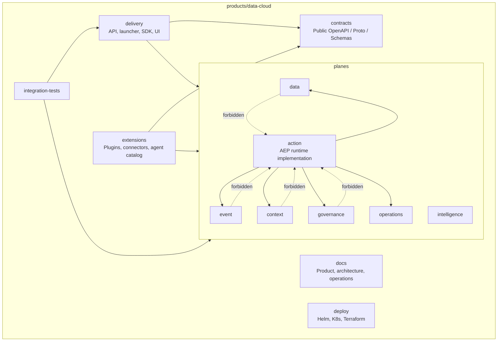

---

## 3. Architecture Planes

### 3.1 Plane model

```mermaid
flowchart TB
    subgraph Experience["Experience Plane"]
        UI["Unified UI"]
        SDK["SDKs"]
        CLI["CLI / Scripts"]
        Docs["Docs"]
    end

    subgraph Contract["Contract Plane"]
        OpenAPI["OpenAPI"]
        Proto["Proto"]
        Schemas["JSON/Event Schemas"]
        RuntimeTruthSchema["Runtime Truth Schema"]
    end

    subgraph RuntimeTruth["Runtime Truth Plane"]
        RuntimeTruthRegistry["Runtime Truth Registry"]
        Health["Health/Readiness"]
        DependencyProbes["Dependency Probes"]
        Degradation["Degradation State"]
    end

    subgraph DataPlane["Data Plane"]
        Entities["Entities"]
        Events["Events"]
        EventStore["Event Store"]
        Query["Query"]
        Analytics["Analytics"]
    end

    subgraph ContextPlane["Context Plane"]
        Lineage["Lineage"]
        Freshness["Freshness"]
        Provenance["Provenance"]
        Memory["Agent Memory"]
        RAG["RAG/Context Retrieval"]
    end

    subgraph ActionPlane["Action Plane"]
        Patterns["Patterns"]
        Pipelines["Pipelines"]
        Agents["Agents"]
        Runs["Runs"]
        HITL["HITL"]
        Learning["Learning"]
    end

    subgraph GovernancePlane["Governance Plane"]
        Tenant["Tenant Isolation"]
        Authz["Authorization"]
        Policy["Policy"]
        Audit["Audit"]
        Retention["Retention/Redaction"]
    end

    subgraph OpsPlane["Operations Plane"]
        Metrics["Metrics"]
        Traces["Traces"]
        Logs["Logs"]
        Alerts["Alerts"]
        Backups["Backup/Restore"]
    end

    Experience --> Contract
    Experience --> RuntimeTruth
    Contract --> DataPlane
    Contract --> ActionPlane
    RuntimeTruth --> Experience
    DataPlane --> ContextPlane
    DataPlane --> GovernancePlane
    ActionPlane --> DataPlane
    ActionPlane --> GovernancePlane
    DataPlane --> OpsPlane
    ActionPlane --> OpsPlane
    GovernancePlane --> OpsPlane
```

### 3.2 Plane ownership

| Plane | Owner | Responsibilities |
|---|---|---|
| Experience | Data Cloud UI/SDK | Unified console, generated clients, operator surfaces |
| Contract | Data Cloud contracts | Public OpenAPI/proto/schema truth |
| Runtime Truth | Data Cloud planes + Action Plane probes | Plane state, surface state, dependency state, degraded behavior |
| Data Plane | Data Cloud core | Entity/event/query/analytics persistence |
| Context Plane | Data Cloud core | Lineage, freshness, provenance, memory, RAG |
| Action Plane | AEP runtime implementation | Pipelines, agents, patterns, runs, HITL, learning |
| Governance Plane | Data Cloud core + Action Plane evidence emitters | Tenant isolation, policy, audit, compliance evidence |
| Operations | Shared platform + product runtime | Metrics, traces, logs, alerts, backup/restore |

---

## 4. Module Architecture

The canonical module map lives in `docs/architecture/PLANE_ARCHITECTURE.md`. This section summarizes the target organization.

### 4.1 Plane modules

| Target Path | Plane | Purpose |
|---|---|---|
| `planes/shared-spi/` | Contract | Stable plane SPI and plugin contracts |
| `planes/data/entity/` | Data | Entity model, schema, and storage contracts |
| `planes/event/core/` | Event | Event primitives and event log contracts |
| `planes/event/store/` | Event | Event store providers |
| `planes/context/` | Context | Lineage, freshness, provenance, memory, and RAG |
| `planes/intelligence/analytics/` | Intelligence | Query, reports, recommendations, and analytics |
| `planes/governance/core/` | Governance | Policy, privacy, retention, redaction, and audit support |
| `planes/action/*` | Action | Pipelines, patterns, agents, reviews, runs, learning, and AEP runtime implementation |
| `planes/operations/*` | Operations | Configuration, health, runtime truth, alerts, and diagnostics |

### 4.2 Delivery and extension modules

| Target Path | Purpose |
|---|---|
| `delivery/api/` | API handlers and route adapters |
| `delivery/launcher/` | Process entry point and transport handlers |
| `delivery/runtime-composition/` | Runtime composition across planes |
| `delivery/sdk/` | Generated clients from contracts |
| `delivery/ui/` | Product UI |
| `extensions/plugins/` | Plugin implementations |
| `extensions/connectors/` | Source/sink connector implementations |
| `extensions/agent-catalog/` | Agent metadata and read-only catalog surfaces |
| `extensions/kernel-bridge/` | Kernel integration bridge |
| `kernel-bridge` | Kernel integration | Platform kernel |

---

## 5. Dependency Architecture

### 5.1 Allowed dependency graph

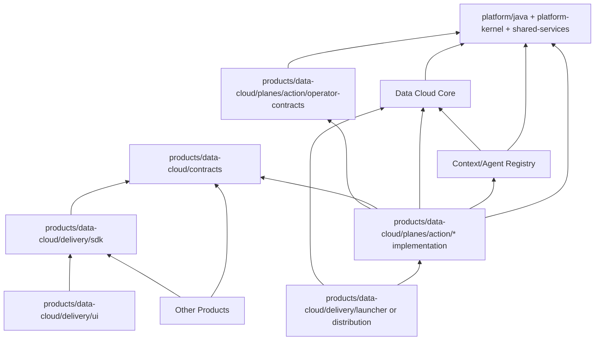

### 5.2 Compile-time rules

```text
Rule DC-ARCH-001:
  No Data Cloud core module may depend on :products:data-cloud:planes:action:* implementation modules.

Rule DC-ARCH-002:
  AEP engine must not depend on AEP server, launcher, UI, or gateway.

Rule DC-ARCH-003:
  AEP may depend on Data Cloud SPI/contracts/event APIs.

Rule DC-ARCH-004:
  Public consumers must depend on SDK/contracts, not AEP server/engine internals.

Rule DC-ARCH-005:
  Product-level contracts must not depend on implementation modules.

Rule DC-ARCH-006:
  Only launcher/distribution/integration-test modules may compose Data Cloud core and AEP implementation modules.
```

---

## 6. Contract Architecture

### 6.1 Contract source-of-truth

```text
products/data-cloud/contracts/openapi/data-cloud.yaml
  Core Data Cloud REST contract

products/data-cloud/contracts/openapi/action-plane.yaml
  Action Plane REST contract

products/data-cloud/contracts/openapi/data-cloud-platform.yaml
  Unified product REST contract, generated/assembled from core + AEP where possible

products/data-cloud/contracts/proto/data-cloud/
  Core gRPC/proto contracts

products/data-cloud/contracts/proto/aep/
  Action Plane gRPC/proto contracts

products/data-cloud/contracts/schemas/
  Event, entity, pipeline, agent, surface, audit, and governance schemas
```

### 6.2 Contract synchronization

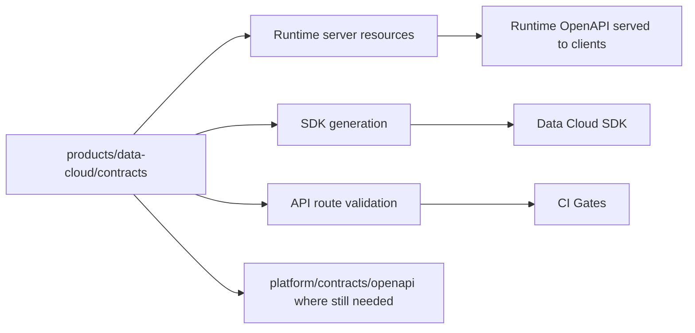

### 6.3 Drift prevention

Required checks:

```text
- OpenAPI validates.
- Runtime route inventory matches OpenAPI.
- AEP server resource spec matches product-level AEP spec.
- SDK generation uses product-level specs.
- No stale `products/data-cloud/planes/action/contracts` path remains.
```

---

## 7. Runtime Architecture

### 7.1 Unified runtime topology

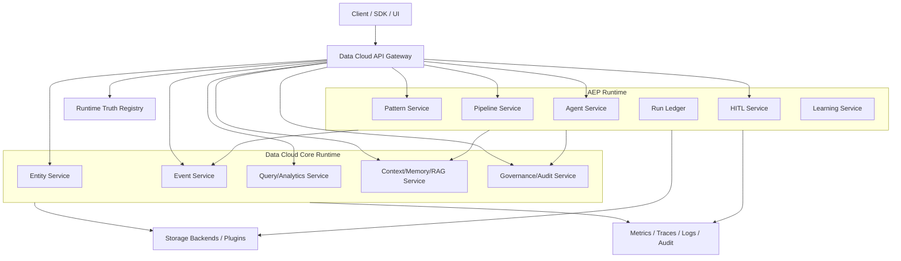

### 7.2 Runtime modes

| Mode | Data Cloud | AEP | Intended use |
|---|---|---|---|
| Local | Embedded/in-memory | Embedded allowed | Developer workflow |
| Sovereign | Embedded durable/file-backed | Embedded or local sidecar | Air-gapped/single-binary |
| Standalone | Single Data Cloud server | AEP same deployment or separate process | Small production / validation |
| Enterprise | Durable providers + auth/policy/audit | Separate scalable AEP service | Production |
| Test | Deterministic fixtures | Deterministic fixtures | CI/integration tests |

### 7.3 AEP production dependency rule

```text
If AEP_PROFILE=production:
  require durable Data Cloud connection/event store
  require policy/audit dependencies when governance endpoints are active
  fail closed if required dependencies are absent
```

---

## 8. Data Architecture

### 8.1 Entity/event model

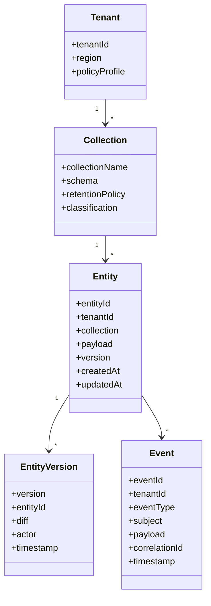

### 8.2 Required event envelope

```text
eventId
tenantId
eventType
subjectType
subjectId
source
payload
schemaVersion
correlationId
causationId
actor
classification
policyContext
timestamp
provenance
traceContext
```

### 8.3 AEP run model

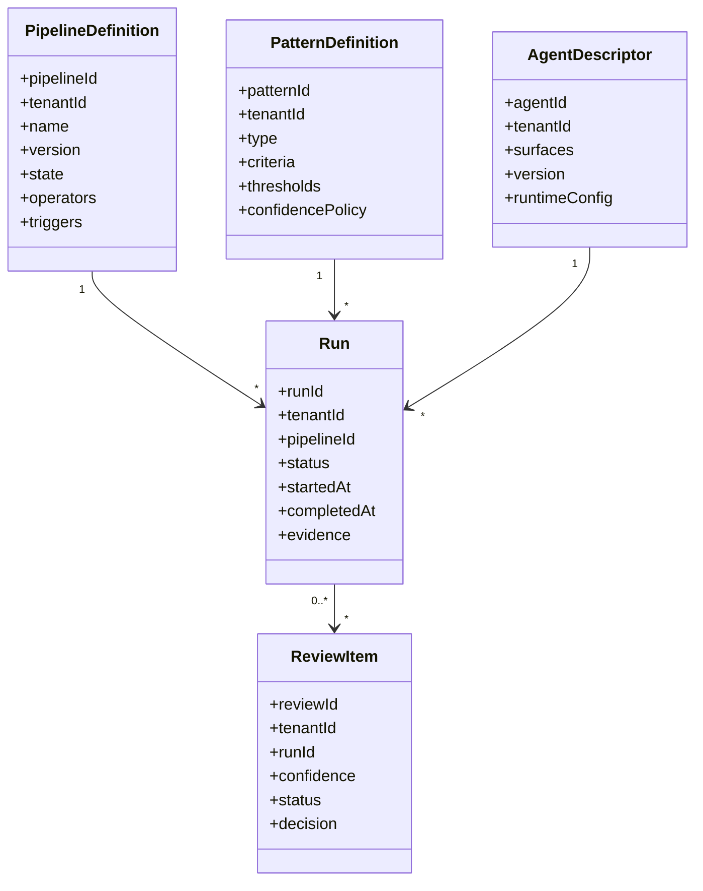

---

## 9. Event-to-AEP Flow

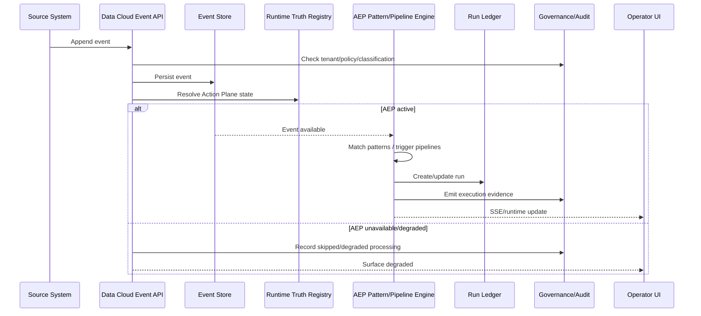

---

## 10. HITL and Learning Architecture

### 10.1 HITL flow

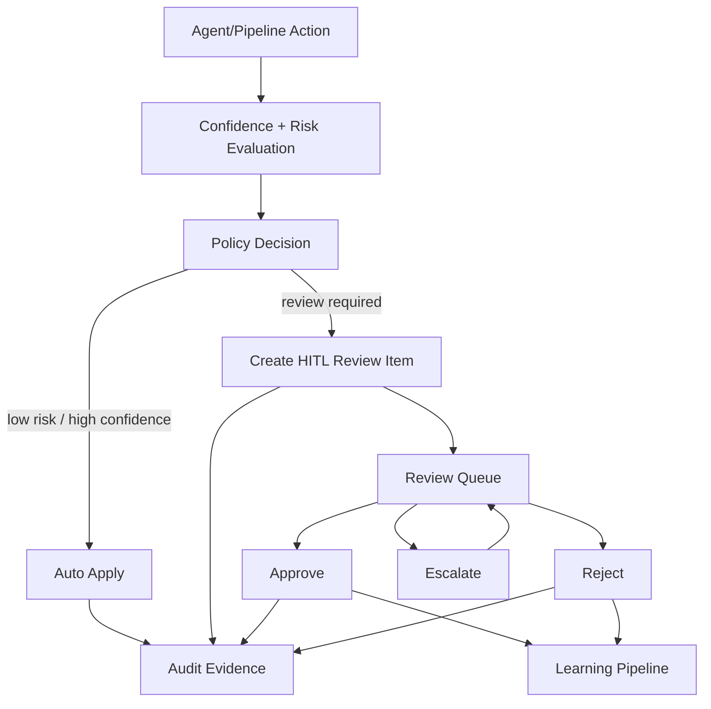

### 10.2 Learning loop

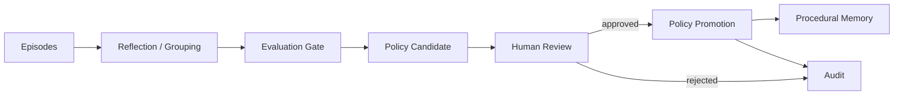

---

## 11. Governance Architecture

### 11.1 Required metadata

Every meaningful operation should carry:

```text
tenant
actor
source
classification
policy decision
provenance
audit event
trace id
Surface state
freshness
```

### 11.2 Policy enforcement path

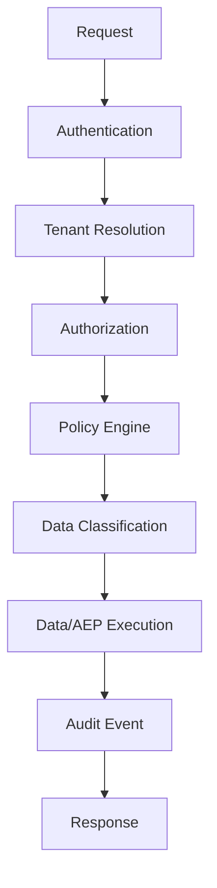

### 11.3 Fail-closed paths

Production must fail closed for:

```text
- missing tenant context
- missing authentication for protected routes
- missing authorization
- missing policy engine for governed action
- missing audit writer for sensitive mutation
- missing durable event store when durability is advertised
- missing redaction policy for sensitive export
- unavailable AEP dependency when AEP is required
- surface advertised as live without passing probes
```

---

## 12. Runtime Truth Registry Architecture

### 12.1 Surface states

```text
LIVE
DEGRADED
DISABLED
PREVIEW
UNAVAILABLE
MISCONFIGURED
```

### 12.2 Surface record

```json
{
  "surface": "aep.hitl.review",
  "state": "LIVE",
  "owner": "data-cloud/aep",
  "dependencies": ["event-store", "audit", "policy-engine"],
  "lastCheckedAt": "2026-05-05T00:00:00Z",
  "evidence": {
    "healthProbe": "passed",
    "contract": "products/data-cloud/contracts/openapi/action-plane.yaml",
    "tests": ["AepHttpServerHitlTest"]
  },
  "limitations": []
}
```

### 12.3 Consumers

```text
- UI navigation
- action enablement
- SDK feature flags
- docs badges
- automation planning
- support diagnostics
- deployment validation
```

---

## 13. Observability Architecture

### 13.1 Telemetry taxonomy

```text
Data Cloud telemetry:
  entity.created
  entity.updated
  event.appended
  query.executed
  governance.policy.evaluated
  audit.recorded
  surface.state.changed

AEP telemetry:
  aep.event.received
  aep.pattern.detected
  aep.pipeline.started
  aep.pipeline.completed
  aep.pipeline.failed
  aep.hitl.created
  aep.hitl.approved
  aep.hitl.rejected
  aep.learning.consolidated
  aep.policy.promoted
```

### 13.2 Trace flow

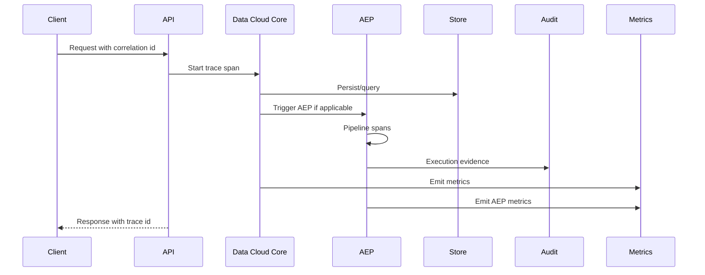

---

## 14. Deployment Architecture

### 14.1 Local profile

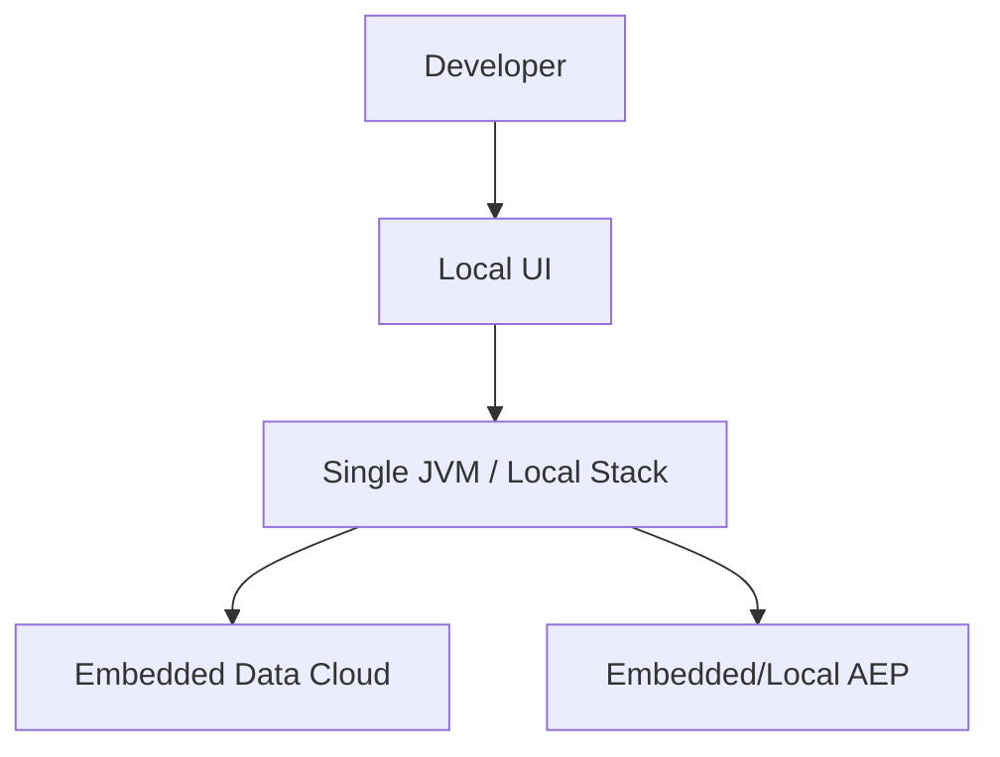

### 14.2 Enterprise profile

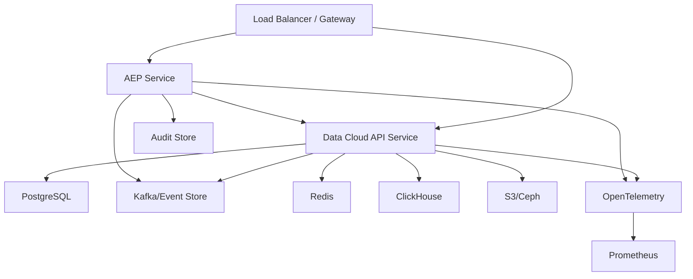

---

## 15. Validation Matrix

| Area | Validation |
|---|---|
| Gradle modules | No `:products:data-cloud:planes:action:*` after merge |
| Paths | No active `products/data-cloud/planes/action` after merge |
| Contracts | Product-level OpenAPI validates |
| Route sync | Runtime routes match OpenAPI |
| Data Cloud core boundary | No dependency on AEP impl |
| AEP engine boundary | No dependency on server/launcher/UI |
| Production profile | Fail closed for missing durable/policy/audit deps |
| Runtime Truth Registry | UI/SDK/docs read runtime truth |
| SDK | Generates from product-level contracts |
| UI | AEP pages runtime-truth-gated |
| Integration | Event -> AEP -> audit -> UI flow passes |

---

## 16. Architecture Acceptance Criteria

```text
- Data Cloud remains the only top-level product folder.
- AEP lives under products/data-cloud/planes/action.
- Public contracts live under products/data-cloud/contracts.
- Data Cloud core has no AEP implementation dependency.
- AEP consumes Data Cloud contracts/SPI/event APIs.
- Launcher/distribution composes core + AEP.
- Runtime Truth Registry controls runtime truth.
- All critical paths emit audit and telemetry.
- Production profiles fail closed for trust-critical dependencies.
- SDK, UI, docs, and tests match product-level contracts.
```
