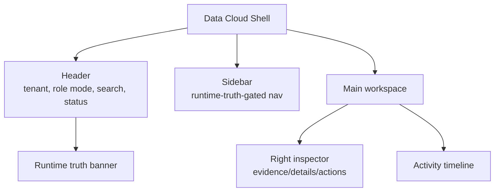
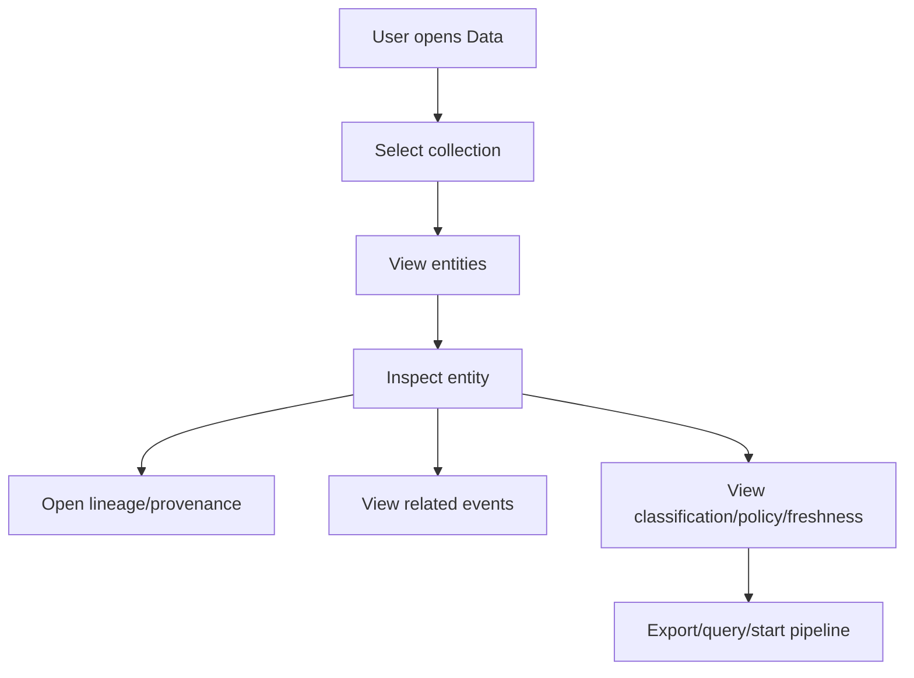
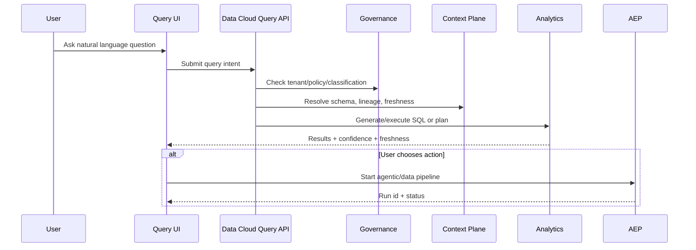
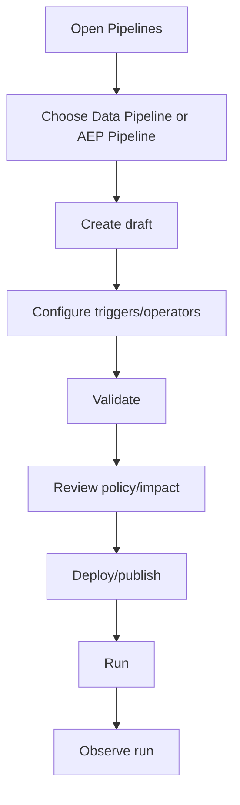
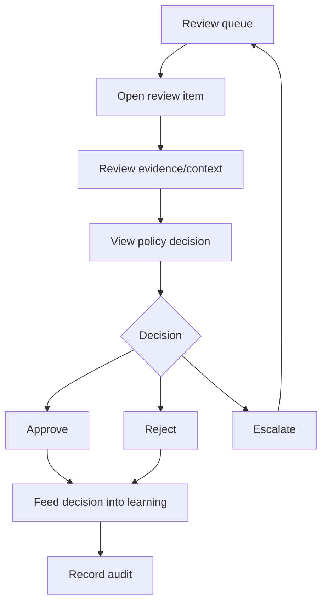
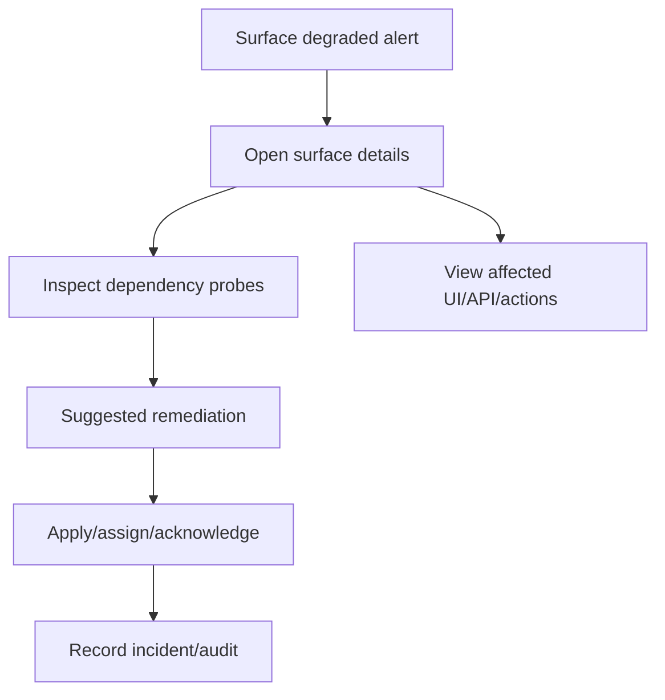
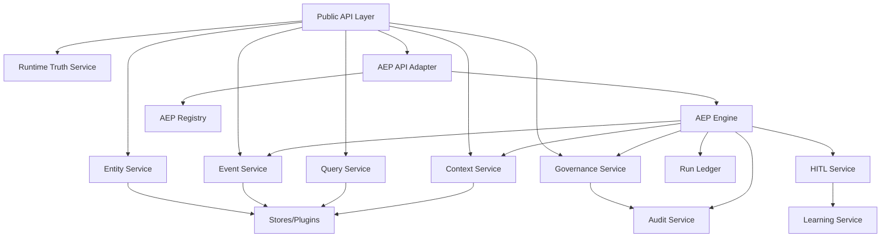
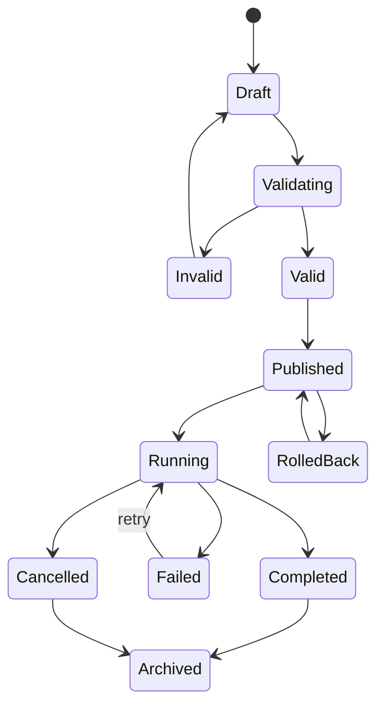
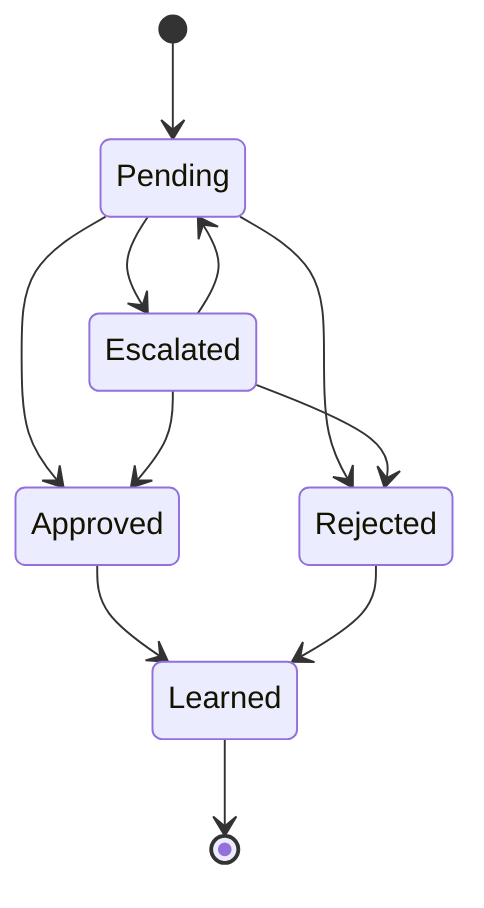
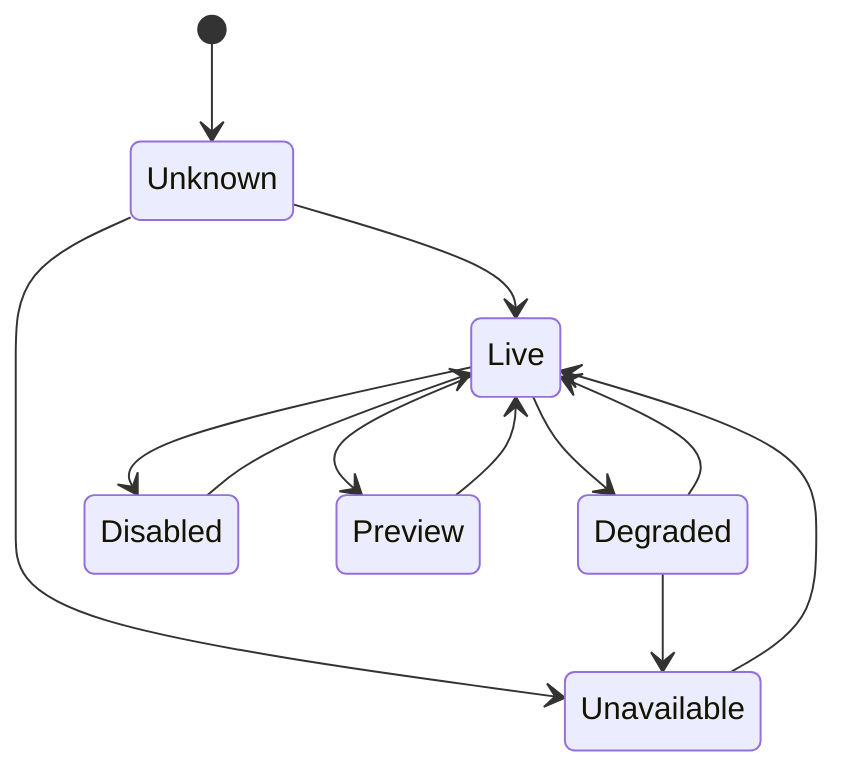

# Data Cloud Unified High-Level Design

**Product:** Data Cloud  
**Action Plane runtime:** AEP under `products/data-cloud/planes/action`  
**Purpose:** Provide high-level design for product experience, workflows, APIs, domain flows, screens, backend components, migration, and testing under the new product boundary.

---

## 1. Design Goals

The unified product design must:

```text
1. Present one coherent product experience: Data Cloud.
2. Make Action Plane surfaces feel native to Data Cloud, not bolted on.
3. Preserve clear ownership between planes: Data, Event, Context, Governance, Intelligence, Action, and Operations.
4. Use runtime truth to avoid showing unavailable surfaces.
5. Keep UI simple, low-cognitive-load, and role-aware.
6. Support powerful advanced workflows without overwhelming primary users.
7. Expose evidence, audit, confidence, policy, and lineage whenever automation acts.
8. Support API-first and SDK-first consumption by other products.
9. Avoid mocks/stubs/demo-only data in production-visible surfaces.
10. Keep all actions tenant-safe and policy-aware.
```

---

## 2. Design Principles

### 2.1 One product, progressive disclosure

The user should see:

```text
Data Cloud
```

not:

```text
Data Cloud + separate Action Plane product (Action Plane is integrated within Data Cloud)
```

Action Plane surfaces appear through Data Cloud navigation:

```text
Agents
Pipelines
Patterns
Runs
Reviews
Learning
Operations
```

but only when runtime truth says the surface is live or intentionally available in preview.

### 2.2 Outcome-first navigation

Users should not need to know whether a function is backed by Data Cloud core or AEP.

They should navigate by outcome:

```text
Explore trusted data
Inspect events
Ask questions
Create or run pipelines
Review agent decisions
Monitor operations
Govern risk
```

### 2.3 Runtime truth over static UI

Every surface must ask:

```text
Is this surface live?
Is it degraded?
Is it disabled?
What dependency is missing?
What can the user do next?
```

### 2.4 Evidence-first automation

Every AI/agentic action should expose:

```text
what happened
why it happened
which data was used
confidence/risk
policy decision
human review state
rollback/override options
audit/trace id
```

---

## 3. Information Architecture

### 3.1 Unified navigation

```text
Home
Data
Events
Query
Pipelines
Trust
Operations
```

Contextual and role-disclosed surfaces:

```text
Context
Insights
Reviews
Patterns
Agents
Learning
Connectors
Plugins
Settings
Contracts
```

### 3.2 Role-aware disclosure

| Role mode | Default surfaces | Additional surfaces |
|---|---|---|
| Primary user | Home, Data, Query, Pipelines | Context, Events if relevant |
| Operator | Home, Events, Pipelines, Runs, Reviews, Trust, Operations | Patterns, Learning |
| Admin | All operator surfaces | Settings, Contracts, Runtime Truth Registry, Connectors |
| Developer | Contracts, SDK, Operators, Pipelines, Events | Diagnostics, test fixtures |
| Compliance | Trust, Audit, Reviews, Policy, Runs | Data classification, redaction, retention |

### 3.3 Product shell



---

## 4. Main User Journeys

### 4.1 Journey 1: Explore data and understand trust



Design requirements:

```text
- Collection list shows freshness, classification, row count, event activity.
- Entity detail shows payload, versions, related events, provenance, policy decisions.
- Export/action buttons are disabled if policy/surface blocks them.
- Audit trace is visible for sensitive actions.
```

### 4.2 Journey 2: Ask a question and act on answer



Design requirements:

```text
- Show interpreted query before execution when confidence is low.
- Show data freshness and source scope.
- Explain partial/degraded results.
- Allow follow-up actions only when Runtime Truth Registry permits.
```

### 4.3 Journey 3: Create agentic pipeline



Design requirements:

```text
- Distinguish data-local pipeline vs AEP agentic pipeline.
- Use shared visual builder components where possible.
- Show validation errors inline.
- Show policy impact before deployment.
- Version, publish, rollback, and run history must be visible.
```

### 4.4 Journey 4: Review HITL item



Design requirements:

```text
- Review item must show source event, agent/pipeline, confidence, rationale, affected data, and policy.
- Approve/reject/escalate must require optional/required reason based on policy.
- Decision must emit audit and learning event.
- Queue must support threshold/overdue/escalation filters.
```

### 4.5 Journey 5: Investigate degraded surface



Design requirements:

```text
- No surface should silently degrade.
- UI should explain exact dependency missing.
- Affected actions should be disabled or marked degraded.
- Operators get remediation suggestions, not fake success states.
```

---

## 5. Screen Design

### 5.1 Home / Intelligent Hub

Purpose:

```text
Provide a low-cognitive-load command center for data health, agentic execution, trust posture, and next actions.
```

Core sections:

```text
- Runtime truth banner
- Data trust summary
- Event activity summary
- AEP run summary
- HITL review queue summary
- Recent audit/activity
- Quick actions
- Recommended next steps
```

Wireframe:

```text
┌────────────────────────────────────────────────────────────────────┐
│ Data Cloud                    Tenant ▾  Role ▾  Search...  Status │
├───────────────┬────────────────────────────────────────────────────┤
│ Home          │  Surface Banner: AEP degraded / Live / Preview  │
│ Data          │                                                    │
│ Events        │  ┌──────────────┐ ┌──────────────┐ ┌────────────┐ │
│ Query         │  │ Data Trust   │ │ Event Flow   │ │ AEP Runs   │ │
│ Pipelines     │  └──────────────┘ └──────────────┘ └────────────┘ │
│ Agents        │                                                    │
│ Reviews       │  ┌──────────────────────────┐ ┌────────────────┐ │
│ Trust         │  │ Recent Activity          │ │ Review Queue   │ │
│ Operations    │  └──────────────────────────┘ └────────────────┘ │
│ Settings      │                                                    │
└───────────────┴────────────────────────────────────────────────────┘
```

### 5.2 Data Explorer

Core content:

```text
- Collections table
- Entity list
- Entity inspector
- Lineage graph
- Related events
- Trust metadata
```

Actions:

```text
- create/update entity
- bulk import
- export
- query
- view event history
- start pipeline from selection
```

### 5.3 Events

Core content:

```text
- event stream
- filters by tenant/type/source/time/correlation
- event details
- replay/tail controls
- related AEP runs/patterns
```

### 5.4 Pipelines

Design decision:

```text
Use explicit pipeline type.
```

Types:

```text
DATA_LOCAL
AEP_AGENTIC
```

Table columns:

```text
name
type
state
version
last run
success rate
owner
Surface state
actions
```

### 5.5 Agents

Core content:

```text
- agent registry
- surfaces
- memory/context access
- execution history
- test execution
- governance/policy constraints
```

### 5.6 Patterns

Core content:

```text
- pattern definitions
- pattern type: sequence / threshold / anomaly / correlation / custom
- match statistics
- detection history
- linked pipelines
```

### 5.7 Reviews

Core content:

```text
- pending review queue
- overdue filters
- confidence/risk
- approval/rejection/escalation actions
- evidence panel
- learning impact
```

### 5.8 Trust

Core content:

```text
- policy status
- audit logs
- retention
- redaction
- classification
- compliance summary
- AEP execution evidence
```

### 5.9 Operations

Core content:

```text
- Runtime Truth Registry
- health/deep health
- metrics
- traces
- logs
- alerts
- deployment profile
- dependency probes
```

---

## 6. API Design

### 6.1 Public contract layout

```text
products/data-cloud/contracts/openapi/data-cloud.yaml
products/data-cloud/contracts/openapi/action-plane.yaml

```

### 6.2 API namespaces

Core Data Cloud:

```text
/api/v1/entities
/api/v1/events
/api/v1/context
/api/v1/query
/api/v1/analytics
/api/v1/data-products
/api/v1/governance
/api/v1/audit
/api/v1/surfaces
```

Action Plane:

```text
/api/v1/action/agents
/api/v1/action/pipelines
/api/v1/action/patterns
/api/v1/action/runs
/api/v1/action/reviews
/api/v1/action/learning
/api/v1/action/deployments
/api/v1/action/reports
```

Compatibility note:

```text
Existing AEP-backed endpoints may remain temporarily at `/api/v1/agents`, `/api/v1/pipelines`, etc.,
but the unified product contract should introduce `/api/v1/action/*` to avoid implementation naming in product routes.
```

### 6.3 Runtime Truth API

```http
GET /api/v1/surfaces
```

Response shape:

```json
{
  "surfaces": [
    {
      "id": "action.pipelines.execute",
      "state": "LIVE",
      "owner": "data-cloud/action",
      "dependencies": ["event-store", "audit", "policy-engine"],
      "lastCheckedAt": "2026-05-05T00:00:00Z",
      "evidence": {
        "health": "passed",
        "contract": "products/data-cloud/contracts/openapi/action-plane.yaml"
      }
    }
  ]
}
```

### 6.4 API error model

All APIs should share a consistent error envelope:

```json
{
  "error": {
    "code": "SURFACE_UNAVAILABLE",
    "message": "Pipeline execution is unavailable because event-store is degraded.",
    "correlationId": "corr-123",
    "tenantId": "tenant-1",
    "surface": "action.pipelines.execute",
    "retryable": false,
    "details": {}
  }
}
```

---

## 7. Backend Component Design



### 7.1 Service responsibilities

| Service | Responsibility |
|---|---|
| Runtime Truth Service | Runtime truth, health/dependency state, UI/SDK gating |
| Entity Service | Entity CRUD, schema, versions, import/export |
| Event Service | Append/query/tail/replay events |
| Query Service | SQL/NL query, reports, analytics |
| Context Service | Lineage, freshness, provenance, memory, RAG |
| Governance Service | Policy, classification, retention, redaction, audit |
| AEP API Adapter | Public Action Plane API |
| AEP Engine | Pattern/pipeline execution |
| AEP Registry | Agents, operators, pipelines, versions |
| Run Ledger | Run state, evidence, history |
| HITL Service | Review queue, approvals, escalation |
| Learning Service | Episodic learning, consolidation, policy promotion |

---

## 8. Domain State Machines

### 8.1 Pipeline lifecycle



### 8.2 Review lifecycle



### 8.3 Surface lifecycle



---

## 9. Migration Design

### 9.1 Code movement

```text
products/data-cloud/planes/action/*
→ products/data-cloud/planes/action/*
```

Public contracts:

```text
products/data-cloud/contracts/openapi/action-plane.yaml
→ products/data-cloud/contracts/openapi/action-plane.yaml
```

### 9.2 No package rename first pass

Keep Java packages:

```text
com.ghatana.aep.*
```

### 9.3 No Data Cloud module rename first pass

Keep existing Data Cloud modules where they are.

### 9.4 Reference update

Update all references:

```text
products/data-cloud/planes/action
:products:data-cloud:planes:action:
./gradlew :products:data-cloud:planes:action:
```

### 9.5 Stale path enforcement

Add script:

```bash
products/data-cloud/scripts/check-merged-product-paths.sh
```

Pseudo-logic:

```bash
grep -R "products/data-cloud/planes/action" . \
  --exclude-dir=.git \
  --exclude="products/data-cloud/docs/migration/*"

grep -R ":products:data-cloud:planes:action:" . \
  --exclude-dir=.git \
  --exclude="products/data-cloud/docs/migration/*"
```

Fail if found outside allowed docs.

---

## 10. Testing Design

### 10.1 Test layers

```text
Unit tests:
  module-level domain/service correctness

Integration tests:
Data Cloud plane contracts and Action Plane runtime integration

API tests:
  OpenAPI route sync, request/response semantics, error envelopes

UI tests:
  runtime truth gating, core journeys, no fake live data

Architecture tests:
  dependency boundaries and no stale paths

Deployment tests:
  profile validation, fail-closed production checks

Performance tests:
  event throughput, pipeline runs, query latency, HITL queue load
```

### 10.2 Required migrated test commands

```bash
./gradlew :products:data-cloud:contracts:build
./gradlew :products:data-cloud:planes:action:engine:test
./gradlew :products:data-cloud:planes:action:registry:test
./gradlew :products:data-cloud:planes:action:server:test
./gradlew :products:data-cloud:delivery:launcher:test
./gradlew :products:data-cloud:delivery:api-contract-tests:test
./gradlew :products:data-cloud:delivery:sdk:build
./gradlew :products:data-cloud:integration-tests:test
```

### 10.3 New tests

```text
MergedProductBoundaryTest:
  Ensures Data Cloud core does not import AEP implementation modules.

MergedPathReferenceTest or script:
  Ensures no active legacy products/aep or old AEP product-boundary paths after merge.

SurfaceRegistryCompositionTest:
  Ensures Data Cloud and Action Plane surfaces appear in unified Runtime Truth Registry.

AepProductionDependencyTest:
  Ensures AEP production fails closed without durable Data Cloud dependency.

UnifiedContractGenerationTest:
  Ensures SDK uses product-level contracts.

UnifiedUiSurfaceGatingTest:
  Ensures AEP UI pages hide/degrade correctly.
```

---

## 11. Acceptance Criteria

```text
- Data Cloud has one product shell.
- Action Plane surfaces appear as native Data Cloud surfaces.
- Data Cloud core has no compile-time AEP implementation dependency.
- Public contracts live at products/data-cloud/contracts.
- Action Plane operator contracts remain internal under `planes/action/operator-contracts`.
- Runtime Runtime Truth Registry gates UI and SDK.
- Production profiles fail closed for missing trust-critical dependencies.
- AEP tests pass under new Gradle paths.
- Data Cloud tests continue to pass.
- No stale products/data-cloud/planes/action active references remain.
```

---

## 12. Final Design Summary

```text
One product:
  Data Cloud

One product folder:
  products/data-cloud

One public contract area:
  products/data-cloud/contracts

One Action Plane runtime implementation:
  products/data-cloud/planes/action

One UI shell:
  products/data-cloud/delivery/ui

One SDK surface:
  products/data-cloud/delivery/sdk

One runtime truth surface:
  /api/v1/surfaces

One rule:
  Data Cloud core does not import AEP implementation internals.
```
