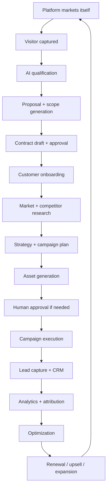

# DMOS Vision

## Purpose

Digital Marketing Operating System (DMOS) is the Ghatana product for running digital marketing as an accountable, governed, AI-native operating system instead of a collection of disconnected campaign tools. It helps teams research markets, plan campaigns, generate and review content, manage approvals, launch channel actions, monitor performance, explain AI recommendations, and improve results through a closed learning loop.

This document is the self-contained product vision and scope baseline for DMOS. It should be read before implementation, architecture, API, UX, testing, operations, market, feature, design, or data-model documents.

## Product Thesis

Digital marketing teams need speed, consistency, measurable outcomes, and governance at the same time. Existing tools usually optimize one narrow area: ad buying, analytics, email, content generation, CRM, or reporting. DMOS aims to become the operating layer that coordinates these activities end to end while keeping humans in control of risk, budget, brand, compliance, and customer trust.

DMOS combines:

- AI-assisted strategy, content, budget, and next-best-action workflows.
- Human approval and policy enforcement for sensitive actions.
- Multi-tenant workspace isolation for agencies, internal marketing teams, and product-led growth teams.
- Campaign, connector, analytics, audit, observability, and reporting flows in one coherent system.
- Transparent AI action logs and model provenance so users can see what was generated, why, by which model or rule, and what changed afterward.
- Kernel/plugin reuse for authorization, audit, feature flags, approvals, telemetry, notification, compliance, and platform integration without turning Kernel into a product-specific marketing engine.

## Target Customers

| Customer | Problem | DMOS Value |
|---|---|---|
| Small and mid-market businesses | Need guided marketing execution without a large team | Convert goals into approved campaigns, content, budget, launch, and reporting |
| Digital agencies | Manage many clients with repeatable workflows and proof of value | Multi-client workspaces, approvals, white-label reports, governance |
| Product-led SaaS teams | Need acquisition, activation, retention, onboarding, and self-marketing | Funnel orchestration, campaign analytics, AI recommendations |
| Regulated internal marketing teams | Need speed with brand, legal, privacy, and compliance control | Policy checks, human approvals, auditability, tenant isolation |

## Personas

| Persona | Primary Need | DMOS Responsibility |
|---|---|---|
| Founder / Owner | Convert a business goal into a campaign and measurable outcomes | Guided planning, budget suggestions, launch readiness, outcome reporting |
| Marketing Operator | Execute campaigns safely and quickly | Campaign lifecycle, content generation, task queue, connector execution |
| Marketing Strategist | Define audience, message, channel mix, and objectives | Market research, persona generation, strategy docs, funnel planning |
| Creative Reviewer | Ensure content quality and brand fit | Content review, validation, versioning, approval workflow |
| Finance / Budget Owner | Control spend and prove ROI/ROAS | Budget recommendations, approval gates, spend controls, ROI dashboards |
| Compliance / Brand Reviewer | Prevent policy, legal, privacy, or brand violations | Policy checks, risk scoring, approval gates, audit trail |
| Agency Manager | Manage multiple clients and report outcomes | Client workspaces, permissions, approvals, reports |
| Admin / Platform Owner | Configure access, connectors, flags, retention, and security | Workspace setup, roles, capabilities, integrations, operations |

## Core Product Outcomes

DMOS is successful when users can:

1. Start from a business objective and create a campaign plan with target audience, channel mix, budget, content, risks, approvals, and success metrics.
2. Generate marketing assets with transparent AI assistance while keeping humans responsible for approval and publication.
3. Connect to external marketing platforms through governed adapters instead of ad hoc scripts.
4. Track campaign performance from launch through optimization and report outcomes in business terms.
5. Understand every AI recommendation, approval decision, connector action, and user action through audit and observability trails.
6. Operate across tenants, workspaces, clients, roles, and permissions without leaking data or granting accidental access.
7. Improve the platform through reusable Kernel services while keeping product-specific marketing logic inside DMOS modules.

## Scope

### In scope

- Workspace-scoped digital marketing command center.
- Campaign planning, lifecycle, launch, pause, complete, archive, and rollback flows.
- Strategy generation and review.
- Budget recommendation, approval, and tracking workflows.
- Approval queues and approval detail pages.
- AI action log and AI/model provenance.
- Ad copy, landing-page, email follow-up, content validation, and website audit services.
- Google Ads connector foundation for OAuth, campaign creation, and performance retrieval.
- Funnel analytics, attribution, ROI/ROAS, self-marketing, market research, localization, advanced channels, and agency operations as feature-gated boundary capabilities until backed by real data and production services.
- Security, privacy, observability, auditability, and operational readiness as first-class requirements.

### Out of scope for the first production-ready pass

- Fully autonomous campaign execution without human approval.
- Product-specific marketing logic inside Kernel/platform plugins.
- Unbounded connector expansion before Google Ads lifecycle, outbox, retry, kill switch, and rollback behavior are proven.
- Fake analytics, canned charts, hardcoded demo users, or production code that only works with seed data.
- Backward-compatibility preservation for incomplete or incorrect scaffolding. DMOS should fix forward.

## Product Principles

1. **Outcome-first:** Every feature must map to a measurable marketing or operational outcome.
2. **AI everywhere, but transparent:** AI can assist every step, but recommendations and generated outputs must be explainable.
3. **Human-controlled risk:** Budget movement, public publishing, connector execution, regulated claims, and high-risk content require approval gates.
4. **Governance by default:** Authorization, audit, policy, privacy, retention, and feature flags are mandatory.
5. **No fake production paths:** Production must use real adapters or fail closed with clear unavailable states.
6. **Low cognitive load:** Dashboards and workflows should show the next useful decision, not every possible control.
7. **Composable architecture:** Product modules own marketing logic; Kernel supplies reusable platform capabilities through stable contracts.
8. **Evidence-based readiness:** Features are not ready until UI, API, backend, data, tests, audit, and telemetry agree.

## Capability Map

| Capability | Description | Production Expectation |
|---|---|---|
| Workspace command center | Unified view of campaigns, approvals, risk, budget, AI actions, and operations | Real data only; no static metrics |
| Campaign management | Create, review, launch, pause, complete, archive, and rollback campaigns | Durable persistence, tenant isolation, audit, tests |
| Strategy planning | Generate and review marketing strategy | AI provenance, approval path, deterministic validations |
| Budget planning | Recommend and approve spend allocation | Traceable assumptions, approval gates, auditability |
| Content generation | Generate ad copy, landing pages, email follow-up, and related assets | Policy validation, brand safety, versioning, approvals |
| Connector execution | Execute channel actions through governed adapters | Outbox, retries, idempotency, kill switch, rollback |
| Analytics and reporting | Report funnel, attribution, ROI/ROAS, and outcomes | Real source data, known freshness, confidence labels |
| AI action transparency | Show what AI did, suggested, changed, or failed to do | Persistent log, redaction, model provenance |
| Governance and approvals | Require role/capability-aware review for sensitive actions | Default-deny, auditable decisions, immutable history |
| Agency and client operations | Multi-client workspaces, white-label reports, client approvals | Strict tenant/client boundaries |

## Success Metrics

### Customer outcomes

- Time from objective to approved campaign plan.
- Percent of campaigns launched with complete strategy, budget, content, approval, and tracking metadata.
- Campaign ROI/ROAS, conversion rate, cost per acquisition, and funnel progression.
- Reduction in manual coordination steps across strategy, content, budget, approvals, and launch.
- Client or stakeholder approval turnaround time.

### Product quality outcomes

- Zero production use of mocks, stubs, hardcoded demo behavior, or fake analytics.
- 100% critical-flow test coverage across UI, API, service, persistence, and E2E flows.
- Every mutating workflow emits audit, metrics, traces, and correlation IDs.
- Every AI-generated or AI-recommended output has provenance and explanation.
- Zero tenant, workspace, client, or role-based data leakage.

## Canonical Documentation Set

| File | Purpose |
|---|---|
| `00-VISION.md` | Product vision, outcomes, scope, personas, principles |
| `01-ARCHITECTURE.md` | System architecture, modules, boundaries, flows, deployment model |
| `02-API_CONTRACTS.md` | API design, endpoint families, headers, errors, versioning, contract governance |
| `03-UX_WORKFLOWS.md` | User journeys, route behavior, states, navigation, approval flows |
| `04-TESTING.md` | Test strategy, coverage model, acceptance gates, anti-test-theater rules |
| `05-OPERATIONS.md` | Runtime operations, release, monitoring, incidents, connector operations |
| `06-IMPLEMENTATION_PLAN.md` | Phased delivery plan, priorities, acceptance criteria, sequencing |
| `07-MARKET_AND_POSITIONING.md` | Market problem, ICP, competitors, differentiation, packaging, GTM |
| `08-PRODUCT_REQUIREMENTS.md` | Functional and non-functional requirements by domain |
| `09-FEATURE_CATALOG.md` | Feature inventory, status, lifecycle, dependencies, tests |
| `10-DESIGN.md` | Product, UI, service, connector, AI, and governance design details |
| `11-DATA_MODEL.md` | Domain entities, persistence, relationships, invariants, privacy, retention |

## Readiness Definition

DMOS is production-ready only when each core capability has:

- A documented user outcome and acceptance criteria.
- UI routes and components that render real backend data.
- API contracts generated or validated against backend implementation.
- Backend services with real persistence and no production stubs.
- Tenant, workspace, principal, role, and capability checks.
- Audit, metrics, traces, correlation IDs, and safe error behavior.
- Meaningful unit, integration, API, UI, E2E, accessibility, security, and regression tests.
- Clear operational runbooks and rollback behavior.

## Historical Canonical Architecture Recovery

This document also incorporates the substantive content recovered from the deleted/root-level canonical DMOS references that existed at commit `7432d84601747ed3e095555c11a5f9471f0f8595`:

- `digital-marketting.md`
- `digital-marketing-product-architecture.md`
- `digital-marketing-product-architecture-v2.md`
- `digital-marketing-product-architecture-canonical.md`

Those historical documents established the stronger DMOS doctrine: DMOS is not merely a campaign app, content generator, or analytics dashboard. It is a governed growth execution operating system.

## Strategic Promise

The historical canonical positioning remains central:

> From growth goal to signed contract to live campaign to measurable revenue—automated.

The product promise is:

> AI growth manager in a box: the platform plans, sells, executes, measures, optimizes, and improves growth campaigns end to end while asking humans only for judgment, risk, governance, or commercial decisions.

## Full Growth Lifecycle

DMOS covers the full lifecycle:



## Conservative MVP Doctrine

The first production pass must be intentionally narrow but complete.

### MVP beachhead

- Non-regulated local service businesses.
- Consultants and coaches.
- Small B2B service businesses.
- Home services and professional services where regulated claims are not required.

### MVP exclusions until compliance packs mature

- Clinics and healthcare providers.
- Finance, investment, lending, banking, insurance.
- Legal services with legal claims.
- Education workflows involving student/minor data.
- Any regulated product or claim-sensitive domain.

### MVP loop

```text
Intake
  -> free audit
  -> 30-day growth plan
  -> proposal/SOW draft
  -> human approval
  -> landing page + Google ad copy + email follow-up
  -> preflight safety check
  -> Google Search launch/export
  -> lead capture + CRM-lite
  -> dashboard/report
  -> next-best action
  -> renewal/upsell recommendation
```

### MVP scope constraints

- One paid channel first: Google Search lead generation.
- One asset loop first: landing page + Google ad copy + email follow-up.
- One lead system first: internal CRM-lite.
- One commercial loop first: proposal/SOW draft from approved templates.
- One reporting loop first: basic funnel and campaign metrics.
- One governance baseline first: consent, unsubscribe/suppression, approval gates, audit, claim validation.

## Product Doctrine

1. Every feature should reduce manual work.
2. AI is not a visible gimmick; it is the operating layer.
3. Human approval appears only for risk, judgment, governance, or commercial decisions.
4. Every action must be observable and explainable.
5. No campaign runs without measurement.
6. No claim is published without evidence or approval.
7. No personal data is used without a valid purpose and consent basis.
8. Every customer outcome should feed learning back into playbooks.
9. The platform should use itself to acquire customers.
10. Contracts, execution, and results must be connected.
