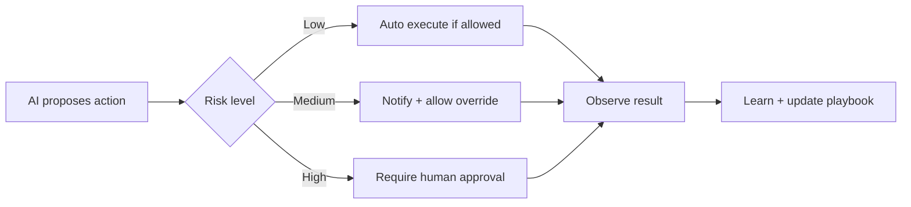

# DMOS Architecture

## Purpose

This document defines the self-contained architecture for the Digital Marketing Operating System (DMOS). It explains product boundaries, module responsibilities, runtime flows, integration patterns, data ownership, security, observability, and deployment assumptions.

## Architectural Goal

DMOS should be a production-grade product built on reusable Ghatana platform capabilities while keeping marketing-specific business logic inside the product boundary. Kernel and platform plugins provide generic infrastructure such as authorization, audit, approvals, feature flags, telemetry, policy, notification, and bridge ports. DMOS composes those capabilities to solve digital marketing workflows.

## Product Boundary

### DMOS owns

- Campaign, strategy, budget, content, AI-action, connector, analytics, market-research, agency, and marketing workflow logic.
- Digital-marketing domain models, commands, events, policies, and route semantics.
- Product-specific UI routes and user journeys.
- Product-specific OpenAPI contracts and DTOs.
- Product persistence schema and migrations.
- Connector adapters for marketing channels such as Google Ads.
- Product-level tests, release gates, runbooks, and operational dashboards.

### Kernel/platform owns

- Generic identity/context propagation.
- Generic capability and feature-flag evaluation.
- Generic audit/event bridge interfaces.
- Generic approval plugin contracts.
- Generic telemetry primitives.
- Generic notification plugin behavior.
- Generic compliance and policy execution primitives.

### Kernel/platform must not own

- DMOS campaign business rules.
- Marketing-specific budget recommendations.
- Google Ads-specific campaign workflow semantics.
- DMOS route names, UI rules, feature catalog, or personas.
- Product-specific compliance rules that belong to marketing policy packs.

## Module Architecture

| Module | Layer | Responsibility |
|---|---|---|
| `dm-core-contracts` | Contracts | Typed IDs, operation context, shared product contracts, context conversion |
| `dm-domain-packs` | Governance | Boundary policy rules, compliance packs, domain plugin manifests |
| `dm-kernel-bridge` | Platform adapter | Product-owned adapter over Kernel/plugin bridge ports |
| `dm-domain` | Domain | Aggregates, value objects, invariants, approval targets, AI action model |
| `dm-application` | Application | Use-case orchestration for campaign, strategy, budget, content, approvals, connectors |
| `dm-infra` | Local/dev infra | Test/local adapters only; not durable production persistence |
| `dm-persistence` | Persistence | PostgreSQL adapters, Flyway migrations, database constraints |
| `dm-connector-google-ads` | Connector | Google Ads OAuth, campaign execution, performance retrieval, retry contracts |
| `dm-api` | API | ActiveJ HTTP servlets, validation, auth context, headers, rate limiting, OpenAPI generation |
| `dm-integration-tests` | Test | Product integration and end-to-end test suites |
| `ui` | Frontend | React UI, route gating, dashboards, forms, AI transparency, approval UX |

## Dependency Rules

1. UI depends on API contracts and product route semantics, not backend internals.
2. API depends on application services and contract models.
3. Application depends on domain, persistence ports, connector ports, and bridge interfaces.
4. Domain depends only on contracts and pure domain primitives.
5. Persistence implements product repository ports and owns database mapping.
6. Connectors implement product connector ports and must not bypass application services.
7. Kernel bridge is consumed through product-owned adapters.
8. Product code must not introduce DMOS-specific logic into Kernel/platform modules.
9. No production code may depend on tests, seed-only data, Storybook fixtures, or local mocks.
10. Cycles across modules are forbidden.

## High-Level Runtime Flow

```text
User
  -> React UI route/page/component
  -> DMOS API client
  -> ActiveJ servlet in dm-api
  -> DmosHttpContextFactory / tenant and identity validation
  -> Application service
  -> Domain aggregate / policy validation
  -> Persistence repository and/or connector port
  -> Kernel bridge for audit, approval, feature flag, notification, telemetry
  -> API response
  -> UI state update and user-visible feedback
```

## Core Flows

### Campaign lifecycle

1. User creates or edits campaign from a workspace route.
2. API validates headers, authorization, idempotency, and request body.
3. Application service creates/updates campaign aggregate.
4. Domain validates lifecycle transition and invariants.
5. Persistence writes durable state.
6. Audit event records command, actor, tenant, workspace, and correlation ID.
7. UI refreshes campaign list/detail with real data.

### Approval workflow

1. Sensitive action creates an approval request.
2. Approval target includes snapshot, risk level, actor, subject, action, and metadata.
3. Authorized reviewer opens approval queue.
4. Reviewer approves or rejects.
5. Application records immutable decision.
6. If approved, downstream workflow resumes; if rejected, action is blocked.
7. Audit, notification, telemetry, and UI state are updated.

### Connector execution

1. A launch or external action creates an outbox command.
2. Feature flags and kill switches are checked before execution.
3. Connector adapter performs OAuth/token validation and external API call.
4. Retry/DLQ handles transient failures.
5. Idempotency prevents duplicate external execution.
6. Compensation/rollback is available for supported operations.
7. External IDs, results, and errors are persisted and audited.

### AI-assisted action

1. User requests or system proposes strategy, budget, content, or next-best action.
2. AI/model provider or deterministic rule generates candidate output.
3. DMOS stores prompt/input metadata, model/version, provider, confidence, rationale, and risk.
4. Content/policy validation runs.
5. Output is surfaced for review, approval, or rejection.
6. AI action log records what happened and why.

## Multi-Tenancy and Workspace Model

All product operations are scoped by:

- `tenantId`: top-level isolation boundary.
- `workspaceId`: product workspace/business context.
- `principalId`: authenticated actor.
- `sessionId`: request/session continuity.
- roles and permissions: server-derived authorization basis.
- optional client/account/campaign scope for agency or connector scenarios.

No API, repository, connector, analytics query, approval request, or AI log may operate without tenant and workspace context unless explicitly documented as a platform-level admin operation.

## Security Architecture

- Production identity is derived server-side from trusted token/session.
- Client-provided role or permission headers must not grant access in production.
- Missing tenant, principal, session, or authorization data fails closed.
- Write operations should require idempotency keys.
- Capability checks are enforced on the backend, not only in the UI.
- Feature-disabled routes must return explicit locked/forbidden states.
- PII and tokens must be redacted in logs, traces, and AI action records.
- Approval decisions and audit events must be immutable.

## Data Architecture

DMOS uses product-owned persistence for durable state. PostgreSQL is the production persistence target. In-memory adapters are allowed only for tests, local development, or explicitly guarded non-production modes.

Persistence must enforce:

- Tenant/workspace filters on every query.
- Required foreign keys or equivalent integrity checks.
- Unique constraints for idempotency and external IDs where applicable.
- Created/updated timestamps.
- Immutable audit/approval records.
- Retention/DSAR support for personal data.
- Indexes matching access patterns.

See `11-DATA_MODEL.md` for entities and invariants.

## API Architecture

The API layer is REST/HTTP through ActiveJ servlets. OpenAPI is the canonical API contract and should be generated from backend route definitions or validated against them. Every endpoint must define:

- Route and method.
- Required headers.
- Request schema.
- Response schema.
- Error envelope.
- Permission/capability requirement.
- Idempotency requirement for writes.
- Audit/telemetry behavior.

See `02-API_CONTRACTS.md`.

## UI Architecture

The UI is a React product app organized around workspace routes. The dashboard is the command center; feature pages are reachable only when backend capabilities allow them. UI route gating is supportive, not authoritative. Backend enforcement is mandatory.

UI patterns must be consistent:

- KPI/data strip first where useful.
- One primary action per workflow step.
- Clear loading, empty, error, unauthorized, disabled, and stale states.
- Explicit AI transparency panels.
- Approval and risk cues for sensitive operations.
- No fake metrics or static production dashboards.

See `03-UX_WORKFLOWS.md` and `10-DESIGN.md`.

## Observability Architecture

Every critical path must propagate or create a correlation ID and emit:

- Structured logs.
- Metrics.
- Traces/spans.
- Audit events for state-changing behavior.
- Connector execution events.
- AI action log entries where AI participates.

Telemetry must support debugging across UI, API, application services, persistence, connector calls, and plugin bridges.

## Deployment Architecture

DMOS is deployable as:

- Backend service modules built with Gradle.
- React UI built with Vite/pnpm.
- PostgreSQL persistence with Flyway migrations.
- Optional external connector credentials and runtime secrets.
- OpenTelemetry exporter configuration.
- Production bootstrap validation that fails closed for unsafe config.

Required environment categories:

- Identity provider and token verification.
- Database connection and migration configuration.
- Connector OAuth/client credentials.
- Feature flags and kill switches.
- PII HMAC/encryption keys.
- OTLP/telemetry endpoint.
- Rate limiting configuration.
- Retention/DSAR configuration.

## Architecture Acceptance Criteria

The architecture is acceptable only when:

- Product-specific marketing logic stays inside DMOS.
- Kernel is reused through stable, generic plugin interfaces.
- All core flows work UI -> API -> service -> domain -> persistence/connector -> audit/telemetry -> UI.
- All production adapters are real or fail closed.
- All test/local adapters are isolated from production builds.
- All data access is tenant/workspace scoped.
- All user-visible features have clear backend capabilities and production status.

## Recovered Canonical Architecture Additions

The deleted canonical architecture made several architecture decisions that must remain part of DMOS.

## Governed Event-Driven Growth Execution

DMOS must not be built as disconnected marketing agents. It must be a governed event-driven execution system:

```text
Agent recommendation
  -> policy/compliance check
  -> approval gate when needed
  -> durable command
  -> connector/service execution
  -> event publication
  -> analytics/learning feedback
  -> next-best action
```

Agents propose and optimize. Policies decide what is safe. Workflows execute durably. Humans approve meaningful risk. Every action is measurable, reversible where possible, and auditable.

## Bounded Contexts

| Context | Purpose |
|---|---|
| Customer | Organization, workspace, account, brand, product, offer, locations |
| Contact and Identity | PII-safe contacts, contact points, identity resolution |
| Market | Segments, personas, competitors, keywords, trends, channels |
| Strategy | Goals, KPIs, budgets, positioning, campaign plans |
| Campaign | Campaign definitions, channels, audiences, creatives, schedules |
| Content | Assets, landing pages, emails, templates, clauses, versions |
| Execution | Durable workflows, commands, approvals, jobs, rollback |
| Sales | Leads, opportunities, proposals, contracts, invoices |
| Analytics | Events, sessions, touchpoints, conversions, attribution, experiments |
| Governance | Consent, policies, claims, evidence, disclosures, audit, suppression |
| Learning | Playbooks, experiment results, recommendations, model feedback |
| Integration | External connections, connector accounts, external object mappings |
| Platform Binding | Boundary policy, compliance packs, plugin bindings, bridge adapters |

## Agent Architecture

Agents are product-level workers that use platform abstractions. They must not directly execute sensitive operations. They create recommendations or plans that become commands only after policy and approval checks.

| Agent | Responsibility | Type |
|---|---|---|
| Growth Strategist Agent | Strategy, positioning, budget plan | Planning |
| Market Research Agent | Competitors, keywords, trends, audience research | Hybrid |
| Brand Agent | Voice, style, approved language, claim rules | Deterministic |
| Creative Agent | Ads, emails, landing pages, social variants | Probabilistic |
| Media Buyer Agent | Paid campaign planning and optimization | Adaptive |
| SEO Agent | Topic clusters, technical SEO, content briefs | Hybrid |
| Lifecycle Agent | Email/SMS/customer journey automation | Deterministic |
| Sales Agent | Lead qualification, proposal follow-up | Planning |
| Contract Agent | SOW/MSA drafts from approved templates | Deterministic |
| Compliance Agent | Consent, claims, disclosures, regional rules | Deterministic |
| Analytics Agent | Performance measurement and explanation | Hybrid |
| Optimization Agent | Budget reallocation and experiment proposals | Adaptive |
| Customer Success Agent | Reports, renewal plans, upsells | Planning |

## Agent Contract Requirements

Every agent must define:

- Capabilities.
- Read/write permission scopes.
- Tenant/workspace/channel/budget boundaries.
- Confidence model.
- Evidence requirements.
- Tool allowlist.
- Budget authority and hard caps.
- Rollback support.
- Evaluation suite.
- Prompt/model version.
- Memory policy.
- Audit and telemetry behavior.

## Human Involvement Model



## Durable Workflow Architecture

Required workflow states:

- `PENDING`
- `RUNNING`
- `PAUSED`
- `COMPLETED`
- `FAILED`
- `ROLLED_BACK`
- `CANCELLED`

Required execution infrastructure:

- Workflow definition versioning.
- Workflow execution persistence.
- Command records.
- Command result records.
- Outbox pattern for event/external execution.
- Inbox pattern for idempotent event consumption.
- Exponential backoff retry policy.
- Dead-letter queue.
- Idempotency keys.
- Correlation and causation IDs.
- Rollback/compensation plans.
- Operator-visible execution status.

## Kill Switch Architecture

Kill switches must exist at four levels:

| Level | Scope |
|---|---|
| Campaign | Stop one campaign |
| Workspace | Stop all campaigns in one workspace |
| Tenant | Stop all marketing execution for one tenant |
| Global | Stop a connector, provider, or entire class of automation |

Kill switch triggers include:

- Manual operator action.
- Budget exhaustion.
- Compliance violation.
- Connector health failure.
- Rate-limit exhaustion.
- Security incident.
- Data quality incident.
- External provider policy risk.

## Domain Pack and Kernel Bridge Requirements

DMOS must implement product-owned packs and adapters:

### Boundary policy store

- Product rule prefix: `DM-`.
- Last rule must be default-deny.
- Sensitive reads require consent where applicable.
- Sensitive operations require audit.
- Product rules must not be embedded in Kernel/platform modules.

### Compliance rule pack

- Marketing-specific regulatory and policy rules belong in DMOS compliance packs.
- Generic compliance execution belongs in plugin/platform.
- Rule IDs use `DM-`.
- Rule packs are registered at product startup.

### Kernel bridge

Every bridge call must carry:

- `tenantId`
- `principalId`
- `correlationId`
- `idempotencyKey` for writes where applicable

Bridge adapters must:

- Require started state.
- Check authorization before sensitive operations.
- Execute with retry where safe.
- Redact sensitive metadata in logs.
- Emit audit and health information.

## Architecture Verification Matrix

| Architecture Concept | Required Verification |
|---|---|
| Platform Kernel | Confirm actual module/API names before implementation |
| Agent orchestration | Verify existing kernel/AEP abstractions or implement product adapter |
| Event bus | Verify current event publisher/inbox/outbox facilities |
| Consent plugin | Use generic consent lifecycle where available |
| Compliance plugin | Use generic rule execution; product rules stay in DMOS |
| Audit plugin | Use generic audit trail plugin |
| Human approval plugin | Use generic approval workflow; product routing rules stay in DMOS |
| Data Cloud adapter | Use only through stable product-owned bridge adapters |

No implementation should claim “deviation from generic patterns: none” until these mappings are verified against the current repository.
