# PHR Platform — Core Sequence Diagrams

**Version:** 2.0  
**Date:** 2026-01-19

| Field              | Value                                                                                                       |
| ------------------ | ----------------------------------------------------------------------------------------------------------- |
| **Document Owner** | PHR Platform Lead                                                                                           |
| **Classification** | Internal — Restricted                                                                                       |
| **Last Review**    | 2026-01-19                                                                                                  |
| **Companion Docs** | [Runtime Architecture](phr_runtime_architecture.md), [Error Model](phr_error_model_and_idempotency_spec.md) |

> **📌 What changed in v2.0:** Added Section 11 (Error Path Sequences — login failure, consent denied, eligibility timeout), Section 12 (Emergency QR Generation), Section 13 (Break-the-Glass Emergency Access), and error-handling notes for each existing diagram.

This document captures the primary end-to-end runtime sequences for Core MVP and the most important Phase 2 extension flows.

---

## 1. Login and session bootstrap

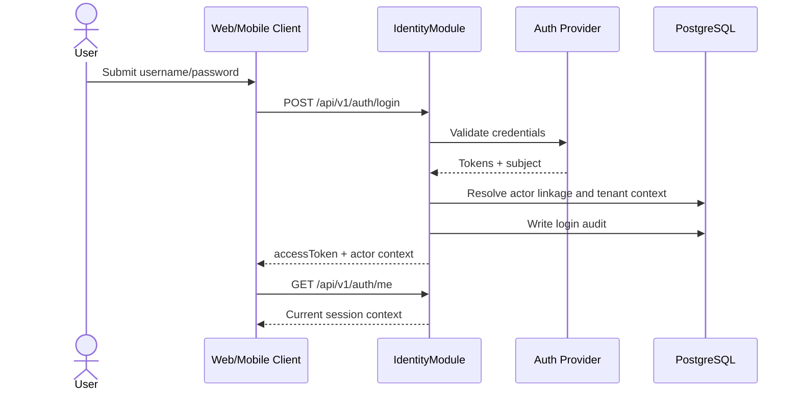

---

## 2. Patient registration

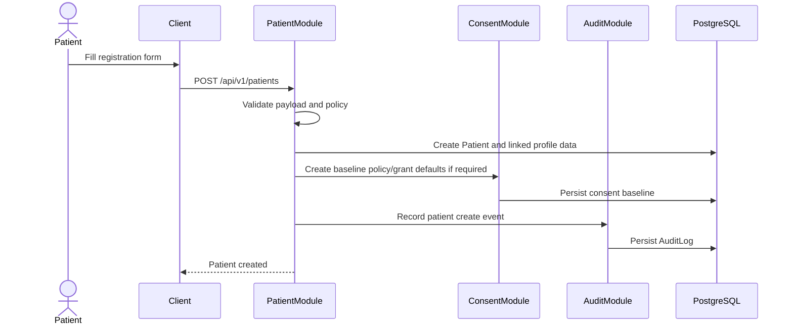

---

## 3. Timeline read

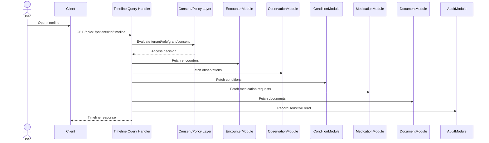

---

## 4. Appointment booking

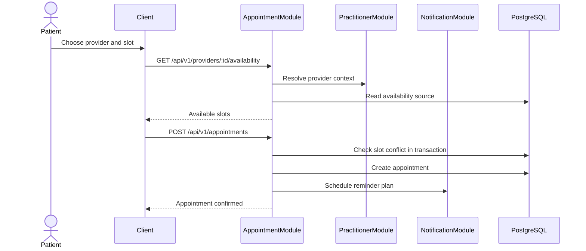

---

## 5. Document upload

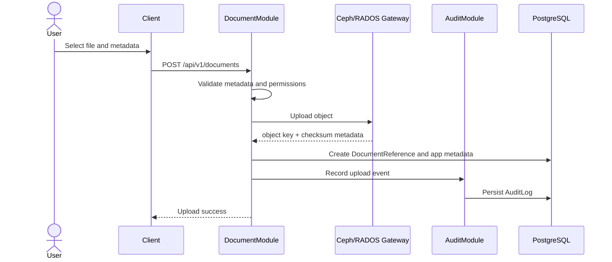

---

## 6. Access grant create and revoke

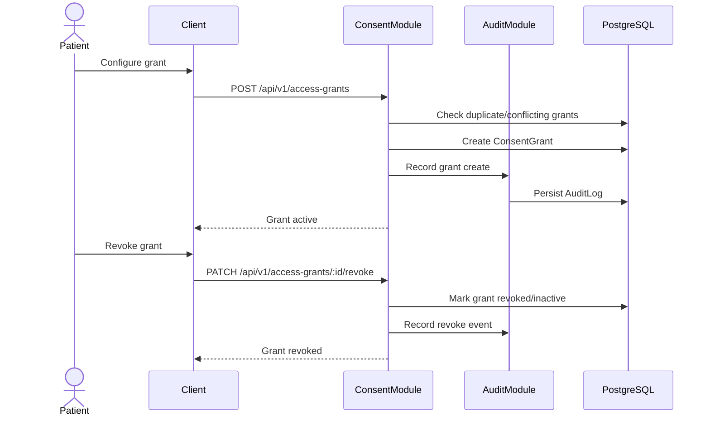

---

## 7. Coverage eligibility check

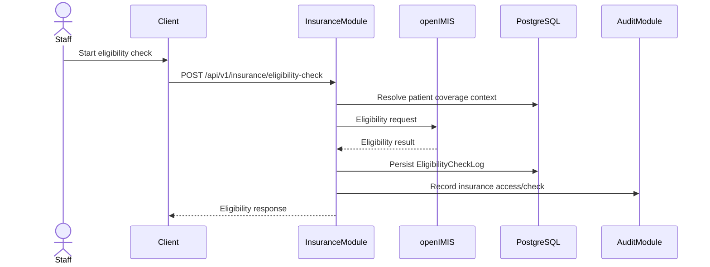

---

## 8. Core MVP OCR confirmation

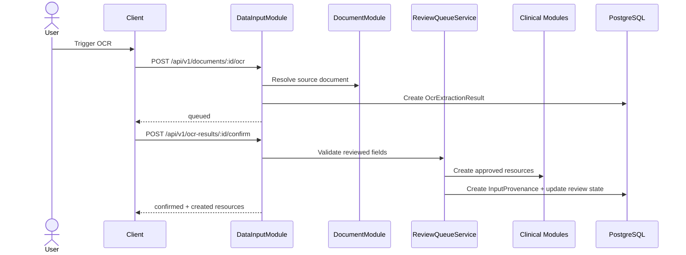

---

## 9. Phase 2 claim submission

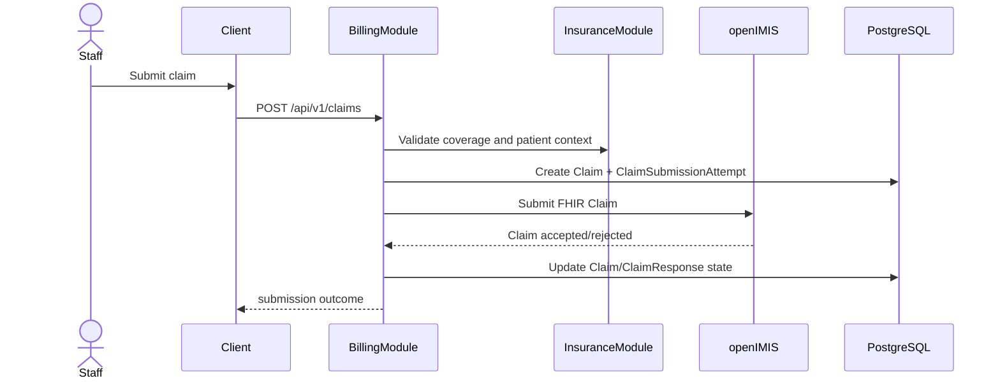

---

## 10. Usage note

These diagrams are the baseline sequences for:

- architecture review
- service design
- incident analysis
- test case decomposition

Any new workflow added to Core MVP or Phase 2 should be accompanied by an additional sequence diagram before implementation starts.

---

## 11. Error Path Sequences (Added in v2.0)

### 11.1 Login failure — account lockout

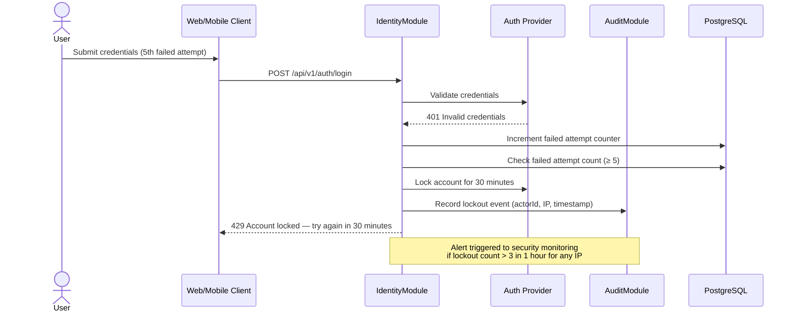

### 11.2 Timeline read — consent denied

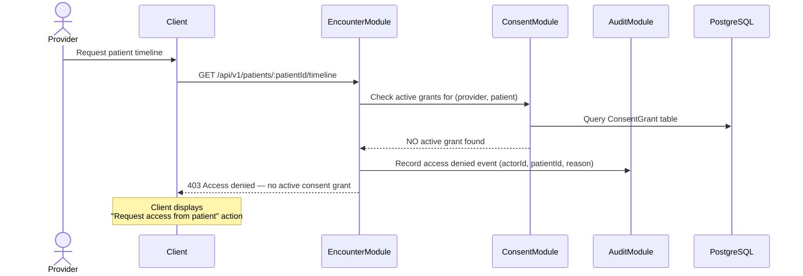

### 11.3 Eligibility check — openIMIS timeout with circuit breaker

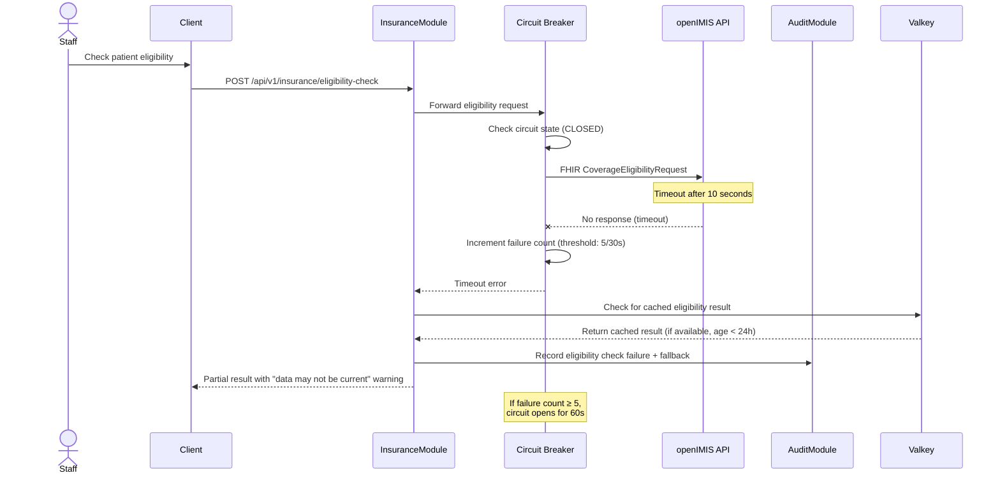

---

## 12. Emergency QR Generation (Added in v2.0)

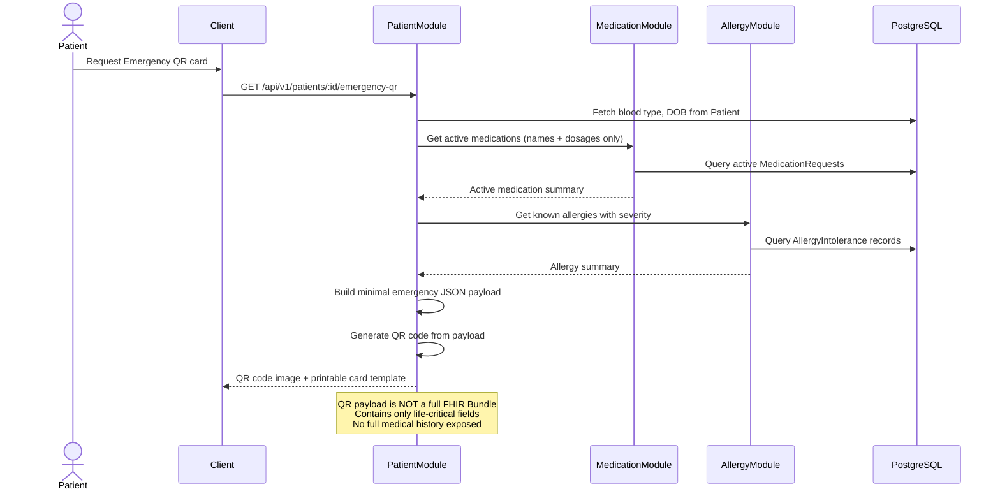

---

## 13. Break-the-Glass Emergency Access (Added in v2.0)

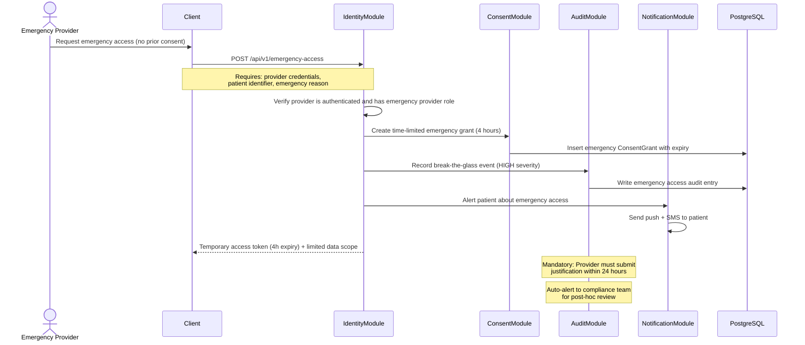
