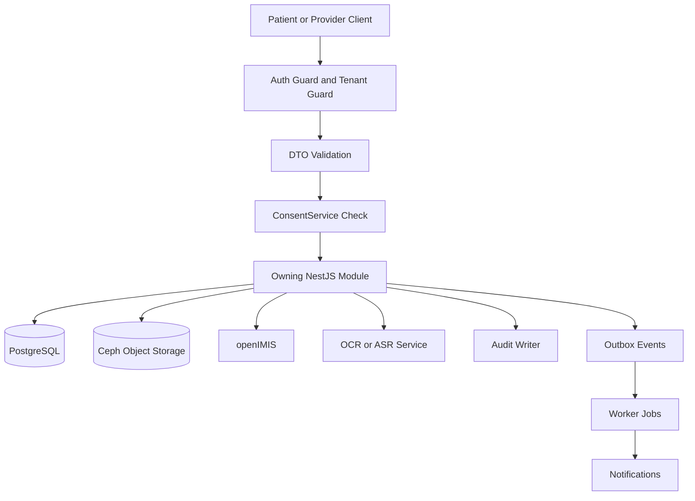

# PHR Platform — Global Data Flow Diagram

**Version:** 1.0  
**Date:** 2026-03-17  
**Last reviewed:** 2026-03-17  
**Document owner:** Architecture Lead  
**Approval status:** Draft  
**Classification:** Internal — Restricted

This document provides the end-to-end data flow that the refinement backlog requested for Core MVP implementation.

---

## 1. High-level flow

---

## 2. Detailed Core MVP flow

### 2.1 Registration to record creation

1. patient, provider, or FCHV submits registration payload
2. auth and tenant context are resolved
3. validation schema checks demographic and contact fields
4. patient create policy and consent rules run where applicable
5. `PatientModule` persists patient root data
6. audit event is written
7. dashboard and summary projections become available

### 2.2 Encounter and observation capture

1. provider opens patient summary
2. `ConsentService` verifies read and write scope
3. encounter or observation mutation executes inside tenant-scoped transaction
4. timeline read model becomes queryable
5. audit event and optional outbox event are written

### 2.3 Document upload and OCR

1. user uploads document metadata and file
2. document access is checked
3. file is stored in tenant-prefixed Ceph path
4. `StoredObject` and `DocumentVersion` metadata are persisted
5. OCR job is queued
6. OCR result and confidence scores are stored
7. low-confidence outputs route to review queue
8. confirmed output writes clinical data with `InputProvenance`

### 2.4 Timeline composition

1. patient or provider requests timeline
2. consent and tenancy are checked at patient boundary
3. aggregator queries encounter, observation, condition, medication, and document owners
4. results are merged into stable chronological response shape
5. read access is audited

### 2.5 Insurance eligibility

1. authorized actor triggers eligibility check
2. consent and patient scope are verified
3. request is normalized and sent to openIMIS through resilient adapter
4. adapter records durable request and response in `EligibilityCheckLog`
5. result is returned with degraded or fallback semantics if needed
6. audit entry is written

---

## 3. Cross-cutting constraints

- every data hop carries tenant id
- every sensitive read and write produces audit evidence
- every external integration has timeout and circuit breaker behavior
- every document and derived resource preserves provenance
- every patient-data path is consent-aware before repository access

This diagram should be used together with the module graph and tenancy spec during implementation sequencing.