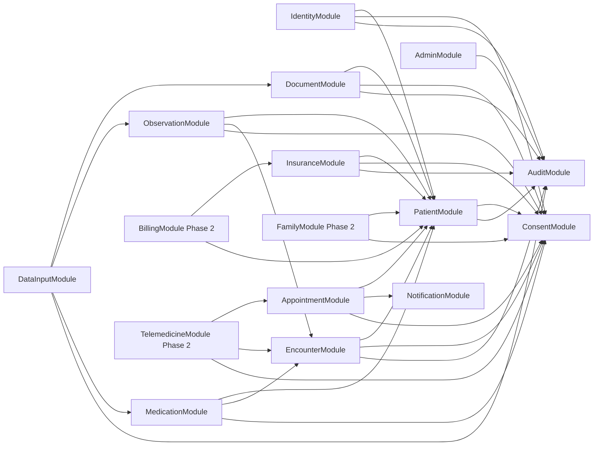

# PHR Platform — Module Interconnection Graph

**Version:** 1.0  
**Date:** 2026-03-17  
**Last reviewed:** 2026-03-17  
**Document owner:** Architecture Lead  
**Approval status:** Draft  
**Classification:** Internal — Restricted

This document defines the planned dependency DAG for the PHR NestJS module set. The purpose is to keep the modular monolith composable and prevent circular ownership.

---

## 1. Dependency graph

---

## 2. Dependency rules

- `IdentityModule`, `AuditModule`, and shared infrastructure packages are foundational.
- feature modules may depend on foundational modules and on upstream domain owners only.
- aggregators may read through exported services but may not write into foreign repositories.
- Phase 2 modules cannot become hard dependencies for Core MVP modules.

---

## 3. Core MVP module count

Planned active Core MVP modules:

1. `IdentityModule`
2. `PatientModule`
3. `ConsentModule`
4. `AuditModule`
5. `EncounterModule`
6. `ObservationModule`
7. `MedicationModule`
8. `AppointmentModule`
9. `DocumentModule`
10. `InsuranceModule`
11. `DataInputModule`
12. `NotificationModule`
13. `AdminModule`

Planned Phase 2 modules retained in the graph for forward planning:

1. `FamilyModule`
2. `BillingModule`
3. `TelemedicineModule`

---

## 4. Review checklist

- no circular dependency introduced
- no write path crosses module boundaries directly
- consent and audit remain reachable from all patient-data modules
- `DataInputModule` remains an enhancer, not the owner of clinical truth

This graph must be revisited whenever a new shared package or cross-module read model is introduced.