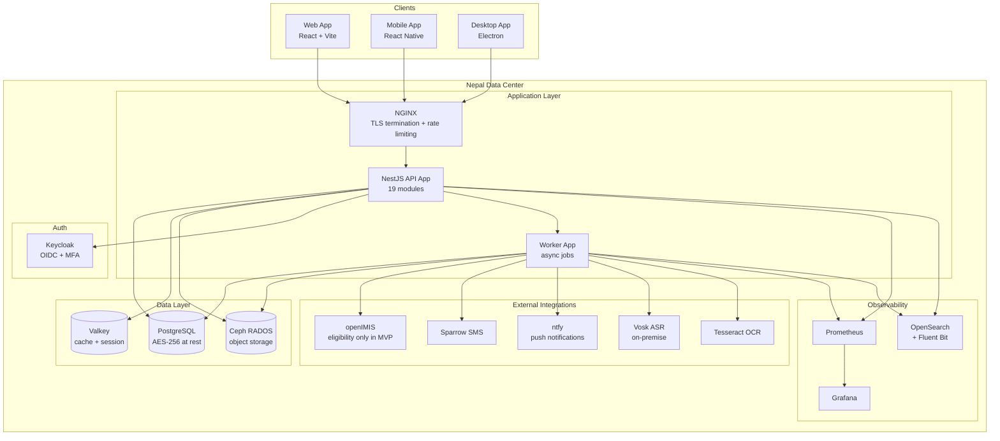

# PHR Platform — Runtime Architecture

**Version:** 2.0  
**Date:** 2026-01-19

| Field              | Value                                                                                                                                                                             |
| ------------------ | --------------------------------------------------------------------------------------------------------------------------------------------------------------------------------- |
| **Document Owner** | PHR Platform Lead                                                                                                                                                                 |
| **Classification** | Internal — Restricted                                                                                                                                                             |
| **Last Review**    | 2026-01-19                                                                                                                                                                        |
| **Next Review**    | 2026-04-19 (Quarterly)                                                                                                                                                            |
| **Companion Docs** | [NestJS Modules Architecture](phr_nestjs_modules_detailed_architecture.md), [Schema Delta](phr_core_schema_delta_spec.md), [Error Model](phr_error_model_and_idempotency_spec.md) |

> **📌 What changed in v2.0:** Added Section 14 (Multi-Tenancy Architecture), Section 15 (Caching Strategy), Section 16 (Resilience & Circuit Breaking), Section 17 (Deployment Architecture with Mermaid diagrams), hardened security context propagation, added encryption key management, enhanced runtime risks table.

This document formalizes the runtime architecture for the active PHR document set.

It covers:

- service boundaries
- request flow through the system
- cross-cutting runtime behaviors
- data ownership and integration paths

---

## 1. Architecture goals

- keep Core MVP as a modular monolith with explicit boundaries
- preserve module ownership across API, service, data, and audit layers
- make patient data access consent-aware and tenant-aware
- keep all primary storage and processing inside Nepal
- support phased activation for post-MVP capabilities without rewriting Core MVP

---

## 2. Runtime topology

```text
Clients
  Web app
  Mobile app
  Desktop app
    |
    v
API Gateway / NestJS API App
  IdentityModule
  PatientModule
  EncounterModule
  ObservationModule
  ConditionModule
  MedicationModule
  AppointmentModule
  DocumentModule
  InsuranceModule
  ConsentModule
  AuditModule
  AdminModule
  TelemedicineModule (Phase 2)
  DataInputModule
  BillingModule (Phase 2)
  FamilyModule (Phase 2)
    |
    +--> PostgreSQL
    +--> Ceph / RADOS Gateway
    +--> Auth provider
    +--> SMS / Email providers
    +--> openIMIS
    +--> ASR / OCR services
    |
    v
Worker App
  reminder planning
  import/export jobs
  audit export
  OCR/voice async work
```

---

## 3. Primary runtime components

### 3.1 Client applications

- web app for patient, provider, admin, and later caregiver flows
- mobile app for patient-first experiences
- desktop app shell for high-usage provider/admin and assisted-registration workflows
- all client apps consume shared route contracts and shared validation schemas

### 3.2 API application

Responsibilities:

- authentication and actor context resolution
- permission and consent evaluation
- module-level orchestration
- persistence writes and reads
- integration adapter invocation
- audit log generation

### 3.3 Worker application

Responsibilities:

- asynchronous reminder delivery planning
- background export/import jobs
- OCR and transcription processing coordination
- retry handling for external integrations

### 3.4 Data stores

- PostgreSQL for transactional truth
- Ceph for document and later OCR/audio source object storage
- optional cache layer for hot query paths

---

## 4. Request lifecycle

### 4.1 Standard request path

1. request enters `/api/v1`
2. auth guard resolves actor and tenant
3. policy layer resolves patient/provider/caregiver scope
4. request DTO and schema validation execute
5. owning module application service handles use case
6. owning module repository writes/reads PostgreSQL
7. if files are involved, object metadata is resolved against Ceph
8. audit event is written for sensitive actions
9. response is shaped into stable contract form

### 4.2 Cross-cutting checks

Every request that touches patient data must evaluate:

- tenant match
- actor role
- patient relationship
- consent or delegated grant
- facility scope where relevant

---

## 5. Ownership model

### 5.1 Single-writer rule

The owning module is the only module allowed to perform unrestricted writes to its primary tables.

### 5.2 Cross-module interaction rule

Cross-module interactions use:

- exported application services
- query services
- domain events

They do not use direct repository or table writes across modules.

### 5.3 Read composition rule

Composite views such as dashboard and timeline may assemble data from several modules, but:

- each source module remains the owner of its truth
- timeline/dashboard handlers do not bypass consent logic

---

## 6. Security and context propagation

### 6.1 Actor context

Resolved actor context must include:

- `actorId`
- `actorType`
- `tenantId`
- optional `patientId`
- optional `practitionerId`
- optional `organizationId`
- granted scopes

### 6.2 Request-scoped policy context

The policy layer should build a request-scoped authorization context containing:

- actor identity
- target patient
- target tenant
- grant or consent decision
- access reason where required

### 6.3 Sensitive actions requiring audit

- login and session bootstrap
- patient creation and profile update
- record read of sensitive health data
- access grant create/revoke
- document upload/download
- eligibility checks
- all OCR/voice, claim, and telemedicine actions

---

## 7. Data architecture

### 7.1 Transactional data

Stored in PostgreSQL:

- core FHIR-shaped tables
- app-owned operational tables
- audit logs
- integration attempt records

### 7.2 Object storage

Stored in Ceph:

- uploaded documents
- later claim attachments
- later telemedicine recordings
- OCR source images and audio assets if retained

### 7.3 JSONB usage

`resource` JSON should preserve FHIR fidelity, but operationally critical filters must remain relational:

- patient linkage
- status
- effective date/time
- encounter linkage
- ownership and tenant keys

---

## 8. Integration architecture

### 8.1 Auth

- external auth provider handles credentials and tokens
- local app tables handle actor-to-domain linkage and runtime role context

### 8.2 openIMIS

Core MVP:

- eligibility check only

Phase 2:

- claim submit
- claim status retrieval
- attachment mapping

### 8.3 Messaging providers

- SMS for reminders and alerts
- email for recovery and communications
- push support per platform

### 8.4 ASR/OCR integrations

- async OCR extraction
- streaming or batch transcription
- entity extraction and provenance linking

---

## 9. Eventing and async model

### 9.1 Internal events

Use internal domain/app events for:

- reminder planning
- audit export scheduling
- cache invalidation
- search projection sync
- later claim submission retry
- later OCR/transcription completion

### 9.2 Outbox requirement

Any event that leads to external side effects should be written through an outbox-safe pattern to avoid:

- lost notifications
- duplicate claim submission
- missing audit export actions

---

## 10. Observability

### 10.1 Required telemetry

- HTTP latency and error rates by route
- DB latency and connection health
- object storage operation success/failure
- external integration success/failure
- auth failures and lockouts
- audit write failure alerts

### 10.2 Correlation

Every request should carry:

- request id
- tenant id
- actor id where authenticated
- module/use-case name in structured logs

---

## 11. Deployment boundaries

### 11.1 Core MVP

- one API app
- one worker app
- shared PostgreSQL
- shared Ceph

### 11.2 Extraction candidates later

- telemedicine media/session services
- OCR/voice processing pipeline
- claims integration adapter
- analytics/search projection services

Extraction should happen only when operational load or isolation needs justify it.

---

## 12. Runtime risks and controls

| Risk                                              | Primary control                                                  | Severity | Detection                                                    |
| ------------------------------------------------- | ---------------------------------------------------------------- | -------- | ------------------------------------------------------------ |
| unauthorized patient data access                  | request-scoped consent and grant evaluation                      | Critical | Real-time auth failure alerting, audit log review            |
| cross-tenant data leakage                         | tenant-scoped DB queries + row-level security policies           | Critical | Automated cross-tenant access test suite                     |
| duplicate appointments                            | booking conflict checks plus transactional constraints           | High     | Idempotency key validation, conflict detection               |
| document/object mismatch                          | object metadata validation and checksum verification             | High     | Integrity check on upload/download                           |
| integration retries causing duplicates            | idempotency keys and submission attempt tables                   | High     | Outbox pattern, dead-letter queue monitoring                 |
| missing audits                                    | mandatory audit middleware/service wrapper for sensitive actions | Critical | Audit completeness checks, alert on write failures           |
| Phase 2 cross-module sprawl                       | single-writer rule and explicit workflow ownership               | Medium   | Architecture review, dependency graph analysis               |
| encryption key compromise                         | key rotation every 90 days, HSM for production keys              | Critical | Key usage monitoring, rotation alerts                        |
| cache poisoning / stale data in consent decisions | consent cache TTL ≤ 60s, cache-through on grant changes          | Critical | Cache hit/miss monitoring, consent change event invalidation |
| external provider outage (openIMIS, SMS)          | circuit breakers with fallback behavior                          | High     | Health check probes, circuit breaker state alerting          |

---

## 13. Final recommendation

Keep the runtime as a **well-bounded modular monolith** through Core MVP and most of Phase 2.
Formalize policy, audit, idempotency, and integration boundaries now so later expansion does not fragment the platform.

---

## 14. Multi-Tenancy Architecture (Added in v2.0)

### 14.1 Tenant Isolation Model

Nepal PHR uses a **shared database, tenant-scoped data** model:

- Every table containing patient or operational data includes a `tenantId` column
- PostgreSQL Row-Level Security (RLS) policies enforce tenant isolation at the database layer
- Application-layer tenant context is set from the authenticated JWT on every request
- No cross-tenant queries are permitted except through explicitly authorized admin operations

### 14.2 Tenant Context Propagation

```text
Request → JWT extraction → tenantId resolved → set in request context
  → all service calls receive tenantContext
  → all repository queries include tenantId WHERE clause
  → all audit entries include tenantId
  → all cache keys are tenant-scoped
```

### 14.3 Tenant Isolation Verification

- Automated test suite runs every query with a cross-tenant patient ID and verifies access denied
- RLS policies are tested independently from application-layer checks (defense in depth)
- Tenant isolation is part of the security audit scope (Directive 2081)

---

## 15. Caching Strategy (Added in v2.0)

### 15.1 Cache Tiers

| Tier                 | Technology                    | TTL               | Use Case                                                           |
| -------------------- | ----------------------------- | ----------------- | ------------------------------------------------------------------ |
| **L1 — In-process**  | Node.js in-memory (LRU)       | 30s               | Config, feature flags, non-sensitive reference data                |
| **L2 — Distributed** | Valkey (Redis-compatible)     | 60s–5min          | Session data, patient profile summaries, eligibility check results |
| **L3 — Database**    | PostgreSQL materialized views | On-demand refresh | Dashboard aggregations, analytics projections                      |

### 15.2 Cache Invalidation Rules

- **Consent changes** → immediate cache eviction for affected patient's access decisions
- **Patient profile updates** → evict patient summary cache
- **Grant create/revoke** → evict all cached access decisions for the patient+provider pair
- **Medication/allergy changes** → evict emergency QR data cache (triggers QR regeneration)

### 15.3 Cache Security

- All cached data inherits the data classification of the source (C1–C4)
- C4 (Restricted) clinical data is NOT cached in L1/L2; only cached in encrypted form
- Cache keys include tenantId to prevent cross-tenant cache pollution
- Cache entries containing PII expire and are not persisted to disk

---

## 16. Resilience & Circuit Breaking (Added in v2.0)

### 16.1 Circuit Breaker Configuration

| External Service           | Failure Threshold | Open Duration | Half-Open Requests | Fallback                                                                |
| -------------------------- | ----------------- | ------------- | ------------------ | ----------------------------------------------------------------------- |
| **openIMIS** (eligibility) | 5 failures / 30s  | 60s           | 2                  | Return cached eligibility if available; else "temporarily unavailable"  |
| **openIMIS** (claims)      | 3 failures / 30s  | 120s          | 1                  | Queue claim in outbox; retry when circuit closes                        |
| **SMS provider**           | 10 failures / 60s | 300s          | 3                  | Queue notification; retry; alert operations                             |
| **ASR (Vosk)**             | 5 failures / 30s  | 60s           | 2                  | "Voice input temporarily unavailable; use text entry"                   |
| **OCR (Tesseract)**        | 5 failures / 30s  | 60s           | 2                  | "OCR temporarily unavailable; please upload document for manual review" |

### 16.2 Retry Strategy

- **Idempotent operations** (GET, eligibility check): retry up to 3 times with exponential backoff (1s, 2s, 4s)
- **Non-idempotent operations** (POST claims, POST appointments): NO automatic retry; use outbox pattern
- **Async operations** (OCR, ASR, notifications): retry up to 5 times with backoff (5s, 15s, 30s, 60s, 300s)

### 16.3 Health Check Endpoints

```text
GET /health/live     → 200 OK if process is running
GET /health/ready    → 200 OK if all critical dependencies are reachable:
                        - PostgreSQL connection pool active
                        - Valkey connection active
                        - Ceph connection active
                        - Auth provider reachable
GET /health/startup  → 200 OK after schema migrations complete and initial config loaded
```

---

## 17. Deployment Architecture (Added in v2.0)

### 17.1 Core MVP Deployment Diagram



### 17.2 Network Security Zones

```text
Zone 1: DMZ (public-facing)
  - NGINX reverse proxy (TLS 1.3 only)
  - Rate limiting: 100 req/min per IP; 1000 req/min per authenticated user
  - WAF rules for common attack patterns

Zone 2: Application (internal)
  - NestJS API App
  - Worker App
  - Keycloak
  - NOT directly reachable from internet

Zone 3: Data (restricted)
  - PostgreSQL (encrypted at rest, AES-256)
  - Valkey (password-protected, TLS)
  - Ceph (internal-only access, encrypted)
  - NOT reachable from Zone 1

Zone 4: External Integrations (outbound-only)
  - openIMIS, SMS providers, payment gateways
  - Outbound-only; no inbound connections from external services
  - All external calls through integration adapter with circuit breakers
```

### 17.3 Capacity Baseline (Core MVP)

| Component      | Minimum Spec                | Target Spec               | Scale Trigger                    |
| -------------- | --------------------------- | ------------------------- | -------------------------------- |
| **API App**    | 2 vCPU, 4GB RAM             | 4 vCPU, 8GB RAM           | p95 latency > 300ms sustained    |
| **Worker App** | 2 vCPU, 4GB RAM             | 4 vCPU, 8GB RAM           | Job queue depth > 1000           |
| **PostgreSQL** | 4 vCPU, 16GB RAM, 500GB SSD | 8 vCPU, 32GB RAM, 1TB SSD | Connection pool saturation > 80% |
| **Valkey**     | 2 vCPU, 4GB RAM             | 2 vCPU, 8GB RAM           | Memory usage > 70%               |
| **Ceph**       | 3 nodes, 1TB each           | 3 nodes, 2TB each         | Storage utilization > 70%        |
| **Keycloak**   | 2 vCPU, 4GB RAM             | 4 vCPU, 8GB RAM           | Auth latency > 500ms             |

### 17.4 Disaster Recovery

| Metric                             | Target                                                                                   |
| ---------------------------------- | ---------------------------------------------------------------------------------------- |
| **RPO** (Recovery Point Objective) | ≤ 1 hour (continuous WAL archiving)                                                      |
| **RTO** (Recovery Time Objective)  | ≤ 4 hours                                                                                |
| **Backup frequency**               | PostgreSQL: continuous WAL + daily full backup; Ceph: daily snapshot; Valkey: hourly RDB |
| **Backup encryption**              | AES-256, separate key from production                                                    |
| **Backup location**                | Geographically separate Nepal data center                                                |
| **DR test frequency**              | Quarterly restore drill                                                                  |
