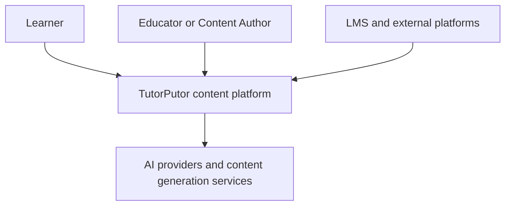
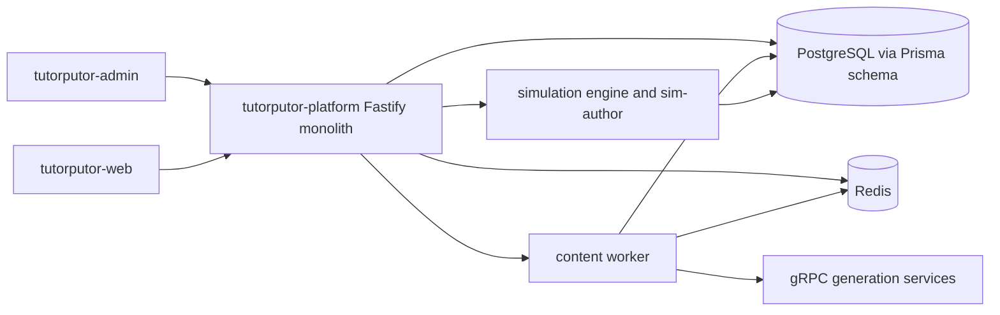
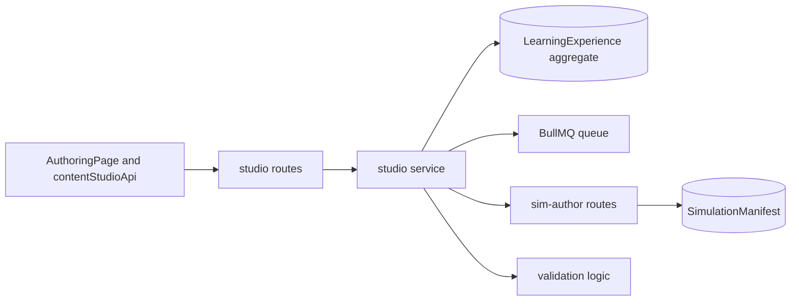
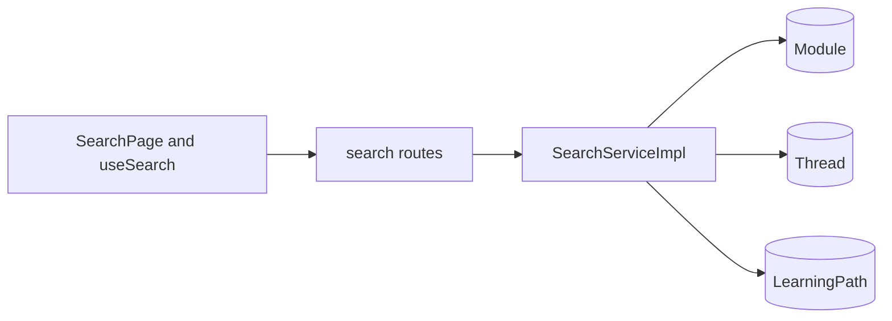
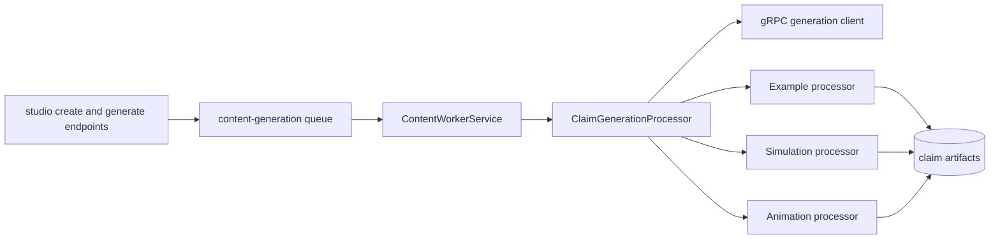
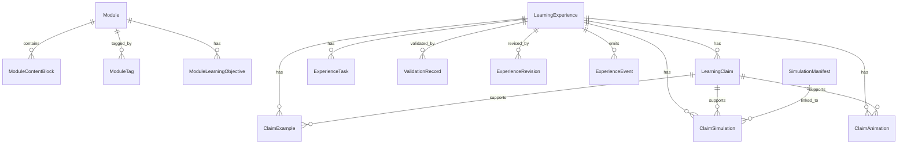

# TutorPutor Content Systems Reconstruction

> Document type: Reverse-engineered architecture and implementation reconstruction
> Scope date: 2026-03-25
> Scope: Content Studio, Content Explorer, Content Generation, and their supporting systems
> Method: Code-first reconstruction across routes, services, workers, schema, contracts, frontend routes, and product docs

## 1. Executive Summary

TutorPutor currently implements its content stack as a consolidated Node.js and Fastify modular monolith centered on `services/tutorputor-platform`, with React admin and learner clients layered on top, Prisma-backed persistence underneath, and a queue plus gRPC-assisted generation path for asynchronous AI content creation.

The real system differs materially from several higher-level product documents. The live implementation is not primarily a Java and ActiveJ runtime for these content flows. The active content authoring, search, and learner delivery paths are implemented in TypeScript across the platform service, admin app, learner web app, shared contracts, and Prisma schema. Java and Gradle assets exist for content agents and planned or partial subsystems, but the currently wired production path for the three requested systems is the Node and Fastify stack described in `CURRENT_STATE.md` and `setup.ts`.

The strongest subsystem today is Content Studio. It has real CRUD, validation, publish gating, claim and task management, artifact linkage, automation-rule CRUD, analytics read APIs, simulation authoring integration, and queue-backed AI claim generation. The weakest subsystem is Content Explorer. Backend search exists and is usable, but semantic search, recommendations, and pathway-aware discovery are not implemented as described in the target vision, and parts of the learner-facing explorer surface are still placeholder or legacy code. Content Generation sits in the middle: the queue, worker, and artifact processors are real, but orchestration quality, evaluation rigor, safety governance, semantic retrieval, and model specialization are still immature.

Production verdict: TutorPutor has a usable internal content-authoring backbone and a functional but shallow discovery layer. It is not yet a fully realized simulation-first, AI-governed, semantic content platform. The gap is not missing architecture alone. The deeper issue is architecture drift between intent, contracts, and implementation.

## 2. System Inventory

### 2.1 Runtime Containers

| Container                                                                                               | Technology                                  | Current role                                                                                                                | Reality status                                                           |
| ------------------------------------------------------------------------------------------------------- | ------------------------------------------- | --------------------------------------------------------------------------------------------------------------------------- | ------------------------------------------------------------------------ |
| `services/tutorputor-platform`                                                                          | Node.js, Fastify, Prisma, Redis, BullMQ     | Main API and orchestration runtime for studio, explorer, learning, AI, integration, notifications, and simulation authoring | Active implementation                                                    |
| `apps/tutorputor-admin`                                                                                 | React, TanStack Query, Jotai, design system | Content Studio authoring and admin workflows                                                                                | Active implementation                                                    |
| `apps/tutorputor-web`                                                                                   | React, TanStack Query                       | Learner UI, search, modules, pathways, AI tutor, marketplace, collaboration                                                 | Active implementation                                                    |
| `libs/tutorputor-core/prisma`                                                                           | Prisma schema and migrations                | Canonical persistence model for modules, experiences, claims, artifacts, analytics, reviews, purchases, tenants             | Active implementation                                                    |
| `services/tutorputor-platform/src/workers/content`                                                      | BullMQ worker + gRPC client                 | Async claim, example, simulation, animation, and validation processing                                                      | Active implementation                                                    |
| `libs/tutorputor-simulation` and related simulation packages                                            | TypeScript simulation engine                | Simulation authoring and manifest-backed runtime assets                                                                     | Active implementation                                                    |
| `libs/content-studio-agents`, `services/tutorputor-ai-agents`, `services/tutorputor-content-generation` | Java and Gradle services and libraries      | Intended or partial AI and generation infrastructure                                                                        | Present, but not the primary live request path for the examined features |

### 2.2 Module Map

| Subsystem                    | Primary backend modules                                                                                        | Primary frontend surfaces                                                                                    | Primary data models                                                                                                                                                                                               |
| ---------------------------- | -------------------------------------------------------------------------------------------------------------- | ------------------------------------------------------------------------------------------------------------ | ----------------------------------------------------------------------------------------------------------------------------------------------------------------------------------------------------------------- |
| Content Studio               | `modules/content/studio`, `modules/content/cms`, `modules/content/animation-integration`, `modules/simulation` | `apps/tutorputor-admin/src/pages/AuthoringPage.tsx`, content-studio components, `contentStudioApi.ts`        | `LearningExperience`, `LearningClaim`, `ExperienceTask`, `ClaimExample`, `ClaimSimulation`, `ClaimAnimation`, `ValidationRecord`, `ReviewQueue`, `ExperienceRevision`, `ExperienceEvent`                          |
| Content Explorer             | `modules/search`, `modules/content`, `modules/learning`, `modules/integration/marketplace`                     | `SearchResultsPage.tsx`, `SearchComponents.tsx`, `useSearch.ts`, `ModulePage.tsx`, dashboard recommendations | `Module`, `ModuleTag`, `ModuleLearningObjective`, `ModuleContentBlock`, `MarketplaceListing`, `Purchase`, `LearningPath`                                                                                          |
| Content Generation           | `modules/ai`, `workers/content`, `modules/content-needs`, `modules/auto-revision`, `modules/simulation`        | `ContentGenerationWizard`, `useContentGeneration.ts`, authoring simulation and animation editors, AI tutor   | `LearningExperience.promptHash`, `riskLevel`, `confidenceScore`, `AIGenerationLog`, `ExperienceAnalytics`, `ExperienceAutoRefinement`, `ABExperiment`, `DriftSignal`, `RegenerationInsight`, `SimulationManifest` |
| Supporting AI Engine         | `modules/ai`, `clients/ai-client.ts`, `clients/ai-registry.client.ts`, `OllamaAIProxyService.ts`               | AI tutor pages and authoring generation controls                                                             | `AIGenerationLog`, registry lookups, prompt-hash metadata                                                                                                                                                         |
| Supporting Simulation Engine | `modules/simulation/authoring-routes.ts`, simulation libs                                                      | `SimulationStudio`, manifest editors, claim-link flows                                                       | `SimulationManifest`, `ClaimSimulation`, `SimulationManifestVersion`                                                                                                                                              |
| Supporting Analytics         | `modules/learning/analytics-service.ts`, content-studio analytics endpoint, auto-revision service              | learner analytics page, admin analytics reads                                                                | `LearningEvent`, `ExperienceAnalytics`, `VRAnalyticsEvent`                                                                                                                                                        |
| Supporting Assessment        | `modules/learning/assessment-service.ts`, claim/task configs in studio                                         | assessments pages, module pages                                                                              | `Assessment`, `AssessmentAttempt`, `assessmentConfig`, task and evidence records                                                                                                                                  |

### 2.3 Critical Files

| Area                 | Critical files                                                                                                                             |
| -------------------- | ------------------------------------------------------------------------------------------------------------------------------------------ |
| Route registration   | `services/tutorputor-platform/src/setup.ts`                                                                                                |
| Studio APIs          | `services/tutorputor-platform/src/modules/content/studio/routes.ts`, `service.ts`                                                          |
| Explorer APIs        | `services/tutorputor-platform/src/modules/search/routes.ts`, `service.ts`                                                                  |
| Generation worker    | `services/tutorputor-platform/src/workers/content/index.ts`, `orchestrator.ts`, processor classes                                          |
| AI surface           | `services/tutorputor-platform/src/modules/ai/routes.ts`, `AIContentGenerationService.ts`, `OllamaAIProxyService.ts`                        |
| Simulation authoring | `services/tutorputor-platform/src/modules/simulation/authoring-routes.ts`                                                                  |
| Learner search UX    | `apps/tutorputor-web/src/router/routes.tsx`, `pages/SearchResultsPage.tsx`, `components/search/SearchComponents.tsx`, `hooks/useSearch.ts` |
| Authoring UX         | `apps/tutorputor-admin/src/pages/AuthoringPage.tsx`, `services/contentStudioApi.ts`                                                        |
| Persistence          | `libs/tutorputor-core/prisma/schema.prisma`, `contracts/v1/content-studio.ts`, `contracts/v1/telemetry-events.ts`                          |

## 3. Content Studio Analysis

### 3.1 Architecture

Content Studio is implemented as a tenant-aware authoring subsystem mounted under `/api/content-studio/*` and guarded by JWT-authenticated role checks for `admin`, `content_creator`, and `superadmin`. Its main route set covers:

- Experience CRUD
- Claim and task CRUD
- Claim generation and task retrieval
- Validation and publish flow
- Comprehensive artifact hydration
- Examples, simulations, and animations queries
- Review queue decisions
- Automation-rule CRUD
- Experience analytics read access

The service persists `LearningExperience` as the core authoring unit. Claims, evidences, tasks, examples, linked simulations, linked animations, revisions, events, analytics, reviews, and auto-refinement metadata all attach to that aggregate.

The authoring lifecycle in the code is:

`create experience -> enqueue claim generation -> edit claims/tasks/settings -> link artifacts -> validate -> publish`

The intended lifecycle in contracts is richer:

`draft -> validating -> review -> approved -> published -> archived`

The implemented persistence lifecycle is narrower:

`DRAFT -> REVIEW -> PUBLISHED -> ARCHIVED`

This is a concrete contract and schema drift, not a stylistic difference.

### 3.2 Design

The admin UX is centered on a unified authoring canvas rather than a wizard-only flow. `AuthoringPage.tsx` combines library browsing, editing, preview, AI co-pilot behaviors, animation authoring, simulation authoring, and live persistence. The API adapter intentionally routes all admin mutations through `/api/content-studio/*` and avoids production mocks.

This design is strong in one respect: it keeps authoring, artifact linking, and generation in one place. It is weaker in two respects:

- The page imports cross-app components directly from the learner web app, which increases coupling between admin and learner packages.
- Several route and service types still use `any`, which weakens a subsystem that is supposed to be the canonical source of high-integrity authored learning content.

### 3.3 Implementation

Implemented behaviors confirmed in code:

- Experience creation writes `LearningExperience` rows and immediately enqueues `generate-claims` jobs.
- Validation is evidence-based and computes educational, experiential, technical, safety, and accessibility scoring from claim coverage, task coverage, and artifact linkage.
- Publish is gated by validation and throws actionable errors when requirements are not met.
- Comprehensive experience reads hydrate linked examples, simulations with manifests, animations, and tasks.
- Simulation authoring is first-class through `/api/sim-author/*` and claim linking.
- Automation rules are persisted per tenant and per experience through `AutomationRule` CRUD.
- Review decisions can approve by publishing or reject by unpublishing back to review.

### 3.4 Deep Focus Findings

#### Simulation-first authoring

This is partially real, not fully dominant.

- Simulation manifests can be generated, stored, updated, and linked to claims.
- `ClaimSimulation` is a first-class relation and the authoring page exposes simulation tooling.
- The studio still stores the overall learning experience as the main aggregate. Simulations are linked artifacts, not the top-level modeling primitive.

#### ECD mapping: claims, evidence, tasks

This is meaningfully implemented.

- `LearningClaim`, `LearningEvidence`, and `ExperienceTask` capture a usable claim-evidence-task structure.
- Publish validation checks claims, task coverage, and artifact support.
- The schema and contracts clearly encode evidence-centered design concepts.

#### CBM and micro-viva linkage

This is only partially present.

- `assessmentConfig` exists on `LearningExperience` and docs emphasize CBM.
- Telemetry contracts include confidence submission events.
- The deep micro-viva and viva-engine loop is described in specs, but it is not present as a first-class live authoring workflow in the TypeScript implementation examined here.

#### Telemetry injection at authoring level

This is mostly missing.

- `ExperienceEvent` exists in schema.
- `ExperienceAnalytics` exists in schema and has a read endpoint.
- Searches across the platform code did not show actual `prisma.experienceEvent` writes in the authoring service, so authoring event instrumentation is defined but not materially wired.

### 3.5 Studio Verdict

Content Studio is the most mature of the three systems. The CRUD, validation, publishing, artifact hydration, simulation integration, and queue-backed generation flow are real. The main risks are contract drift, incomplete event instrumentation, broad use of JSON fields, and weakened type safety in route and service boundaries.

## 4. Content Explorer Analysis

### 4.1 Architecture

Content Explorer is split across several surfaces rather than expressed as a single coherent subsystem.

The real active learner discovery path is:

- `/search` route in the learner web app
- `SearchResultsPage.tsx`
- `SearchComponents.tsx`
- `useSearch.ts`
- `/api/v1/search` and `/api/v1/search/autocomplete`

The backend search module supports:

- Search across modules, threads, and learning paths
- Autocomplete
- Popular searches
- Similar modules

However, there are also legacy or placeholder explorer surfaces:

- `ContentExplore.tsx` is a placeholder page
- `ContentExplorer.tsx` is a placeholder page
- `routes/lazy.tsx` still references `/content` and `/content/explore`

This means discovery exists, but the explorer boundary is incoherent and still carries dead or incomplete route surfaces.

### 4.2 Design

The intended design in docs includes:

- semantic search
- recommendations
- context-aware discovery
- learning-style and goal personalization
- pathway engine integration

The implemented design is much narrower:

- query-string search
- simple type and price filters
- autocomplete by module title
- dashboard recommendations based on recent published modules
- path recommendations based on goal matching in pathway logic

This is functional discovery, not adaptive exploration.

### 4.3 Implementation

Confirmed implementation details:

- `SearchServiceImpl` uses Prisma lookups with `contains` on title and description.
- Ranking is rule-based string scoring with word-boundary and prefix bonuses.
- Facets are mostly thin and partially synthetic.
- Autocomplete only searches module titles.
- Similar modules are available, but the service is still text and metadata driven.
- There is no `pgvector`, embedding column, vector index, or vector-backed retrieval path in the live Prisma schema used by the active platform service.

### 4.4 Deep Focus Findings

#### Semantic search

Not implemented in the active runtime.

There are docs and dependency references discussing embeddings and pgvector, and Java-side content-generation assets reference embedding-related dependencies. None of that is wired into the live Fastify and Prisma explorer path.

#### Context-aware discovery

Partially implemented, but only at a coarse level.

- Tenant filtering is enforced.
- Search filters support type and price.
- Dashboard recommendations are simple published-module selections, not personalized intent-aware discovery.
- Pathway recommendation reasoning exists, but it is not a unified explorer engine.

#### Recommendation engine integration

Not implemented as a standalone engine.

- No collaborative filtering path was found.
- No content-based recommendation service was found.
- No explorer-specific recommendation API was found.
- Dashboard recommendations and pathway suggestions do not amount to a recommendation engine.

#### Navigation hierarchy and caching

Moderately implemented.

- Learner navigation has a clear `/search`, `/marketplace`, `/modules/:slug` route shape.
- TanStack Query provides basic query caching.
- Legacy lazy routes still advertise separate explorer pages that are not the active learner path.

### 4.5 Explorer Defects and Risks

The most concrete implementation defect in explorer is navigation identity mismatch.

- Search results navigate to `/modules/${result.id}`.
- The learner router expects `/modules/:slug`.
- The learner module page loads by slug and the module API is `/api/v1/modules/:slug`.

This creates a likely broken click-through path from search results to module detail when the returned id is not equal to the module slug.

### 4.6 Explorer Verdict

Content Explorer is implemented enough to search and browse, but not enough to satisfy the product’s intended semantic and adaptive discovery model. It is a thin text-search subsystem with UX drift, dead route surfaces, and at least one likely module-navigation defect.

## 5. Content Generation Analysis

### 5.1 Architecture

Content Generation has three distinct paths.

1. Synchronous AI tutor and utility endpoints under `/api/v1/ai/*`
2. Queue-backed authoring generation under BullMQ `content-generation`
3. Simulation-manifest generation under `/api/sim-author/*`

The queue-backed path is the most production-relevant generation architecture. It is composed of:

- `createExperience()` enqueueing `generate-claims`
- `ContentWorkerService` dispatching jobs by name
- `ClaimGenerationProcessor` generating claims and enqueueing follow-up jobs
- `ExampleGenerationProcessor`, `SimulationGenerationProcessor`, `AnimationGenerationProcessor`, `ContentValidationProcessor`
- `RealContentGenerationClient` coordinating with the gRPC generation service

This is a real multi-stage pipeline, not only a controller stub.

### 5.2 Design

The design intent is author-assisted AI that generates claims, examples, simulations, and animations while preserving human review and validation. That intent is visible in:

- queue separation
- review queues
- validation records
- risk and confidence metadata
- drift detection and auto-revision models

The actual design still overuses prompt-wrapped general tutoring for specialized tasks.

- `AIContentGenerationService` builds prompt strings and sends them through `handleTutorQuery()`.
- `OllamaAIProxyService` is a thin HTTP wrapper with soft failure responses and minimal specialization.

That means the architecture wants specialized generation services but often falls back to general-prompt behavior.

### 5.3 Implementation

Confirmed implementation details:

- Claim generation updates risk level, confidence score, and prompt hash on the experience.
- Claim generation persists `contentNeeds` JSON on claims.
- Follow-up jobs for examples, simulations, and animations are conditionally queued from claim content needs.
- Simulation generation persists `SimulationManifest` rows and links them to claims through `ClaimSimulation`.
- Auto-revision reads `ExperienceAnalytics` and creates drift signals and regeneration candidates.
- Test mode can disable the queue, which is practical for tests but means queue coverage is environment-sensitive.

### 5.4 Deep Focus Findings

#### Alignment with learning objectives

Partially implemented.

- Claims, evidence, tasks, and grade adaptation provide structure for objective alignment.
- Validation checks baseline pedagogical completeness.
- There is no strong evidence of a dedicated objective-alignment evaluator beyond those structural heuristics and the broader content-quality tooling.

#### Integration into CMS blocks

Partially implemented.

- Generation outputs attach cleanly to experiences and claims.
- Modules still separately use `ModuleContentBlock` and generic content blocks.
- There is no single normalized content-block model unifying modules, studio experiences, simulations, AI prompts, and assessments. The system uses linked entities and JSON payloads instead.

#### Feedback loop and learning-system improvement

Partially implemented.

- Learning events are persisted and streamed to Redis.
- Experience analytics exist.
- Auto-revision can detect drift and queue candidate regeneration.
- There is not yet a closed-loop, continuously learning model governance system where explorer and learner outcomes reliably improve future generation quality.

#### Cost and caching strategy

Partially implemented.

- Prompt hash, request hash, and AI cost tracking utilities exist.
- Queue deduplication and dead-letter handling exist.
- There is no strong evidence of semantic artifact caching, vector retrieval reuse, or model-tier routing based on cost and content criticality across the whole pipeline.

### 5.5 Safety and Guardrails

Guardrail intent is visible in schema and routes:

- risk levels
- confidence scores
- validation records
- review queue
- publish gating

Guardrail maturity is still moderate rather than strong.

- The synchronous AI proxy returns friendly fallback text on failure instead of strict typed failures in several cases.
- The specialized generation service still depends on generic prompt parsing for some tasks.
- Governance is stronger at the publish gate than at the model-orchestration layer.

### 5.6 Generation Verdict

Content Generation has a credible asynchronous architecture and real persistence, but its model-orchestration sophistication is below the product vision. It is operational generation infrastructure, not yet a mature AI content factory.

## 6. Cross-System Architecture

### 6.1 Real End-to-End Flow

```mermaid
flowchart LR
  A[Author in tutorputor-admin] --> B[/api/content-studio/experiences]
  B --> C[Content Studio Service]
  C --> D[(LearningExperience + claims/tasks/artifacts)]
  C --> E[BullMQ content-generation queue]
  E --> F[Content Worker]
  F --> G[gRPC content generation service]
  F --> D
  A --> H[/api/sim-author/*]
  H --> I[Simulation authoring service]
  I --> J[(SimulationManifest)]
  J --> D
  D --> K[/api/v1/search]
  L[Learner in tutorputor-web] --> K
  K --> M[Search service]
  M --> N[(Module + thread + learning path)]
  L --> O[/api/v1/modules/:slug]
  O --> P[Content module]
  P --> N
  L --> Q[/api/v1/learning/*]
  Q --> R[Learning + analytics services]
  R --> S[(LearningEvent + ExperienceAnalytics)]
  S --> T[Auto-revision service]
  T --> E
```

### 6.2 C4 Context Diagram



### 6.3 C4 Container Diagram



### 6.4 C4 Component Diagram by Subsystem

#### Content Studio



#### Content Explorer



#### Content Generation



### 6.5 Shared Schemas and Transitions

Shared schema anchors:

- `LearningExperience`
- `LearningClaim`
- `ExperienceTask`
- `SimulationManifest`
- `ClaimExample`
- `ClaimSimulation`
- `ClaimAnimation`
- `LearningEvent`
- `ExperienceAnalytics`

Real state transitions:

- Experience: `DRAFT -> REVIEW -> PUBLISHED -> ARCHIVED`
- Claim generation: `enqueued -> worker processed -> artifacts linked`
- Simulation linkage: `manifest created or updated -> claim linked`
- Explorer retrieval: `published module indexed only by live query, not by separate search index`
- Auto revision: `analytics read -> drift signals -> regeneration candidate -> optional experiment`

## 7. Data & Event Architecture

### 7.1 Data Architecture

| Entity                | Purpose                               | Storage pattern                        | Notes                                            |
| --------------------- | ------------------------------------- | -------------------------------------- | ------------------------------------------------ |
| `Module`              | Learner-visible content package       | normalized table + child relations     | Explorer depends on this more than studio does   |
| `ModuleContentBlock`  | Block-level module content            | JSON payload per ordered block         | This is the closest live content-block structure |
| `LearningExperience`  | Authoring aggregate                   | normalized core row + many JSON fields | Central to studio and generation                 |
| `LearningClaim`       | Outcome statements                    | normalized row + JSON `contentNeeds`   | Drives generation fan-out                        |
| `ExperienceTask`      | Evidence-producing activities         | normalized row + JSON `config`         | Core to publish readiness                        |
| `ClaimExample`        | Claim-linked example artifact         | normalized row + JSON `content`        | Real artifact store                              |
| `ClaimSimulation`     | Claim-linked simulation artifact      | normalized row + manifest relation     | Strongest simulation linkage                     |
| `ClaimAnimation`      | Claim-linked animation artifact       | normalized row + JSON `config`         | Export path still incomplete                     |
| `SimulationManifest`  | Saved simulation definition           | normalized row + JSON `manifest`       | Authoring and generation bridge                  |
| `ExperienceAnalytics` | Aggregated authored-content analytics | normalized row + JSON trends           | Consumed by auto-revision                        |
| `LearningEvent`       | Learner telemetry event log           | normalized row + JSON payload          | Actually instrumented                            |

Key storage observations:

- The system is hybrid relational plus JSON, not fully normalized.
- Authoring metadata such as misconceptions, target grades, curriculum alignment, grade adaptations, assessment configuration, task config, content needs, success criteria, and full simulation manifests are stored in Prisma `Json` fields.
- The design supports flexible content evolution, but it also increases schema drift risk and complicates precise querying.
- There is no live vector store or embedding column in the main active Prisma schema for explorer search.

### 7.2 Relationship Model



### 7.3 Event Architecture

There are two event stories, and they are not equally mature.

#### Learner telemetry and analytics events

This path is real.

- `learningEvent.create` persists events.
- events are streamed to Redis via `xadd` and `publish`.
- analytics summaries and advanced analytics are computed from persisted learner events.
- credentials and some learning flows also write learning events.

#### Authoring and content-lifecycle events

This path is mostly defined, not fully instrumented.

- `ExperienceEvent` exists in schema with types like `CREATED`, `UPDATED`, `VALIDATED`, `PUBLISHED`, and simulation-link events.
- `contracts/v1/telemetry-events.ts` defines learner-side xAPI-flavored contracts.
- Searches across the active platform code did not show material `ExperienceEvent` persistence in the studio service.

### 7.4 Analytics Pipeline

The analytics pipeline currently looks like this:

`learner action -> learning route -> LearningEvent persistence -> Redis stream and publish -> summary aggregation -> ExperienceAnalytics and dashboard analytics -> auto-revision drift detection`

What is missing is consistent authoring telemetry and a unified explorer-to-learning-to-regeneration event chain.

## 8. Evaluation Scorecard

### 8.1 Content Studio

| Dimension      | Score | Justification                                                                                        |
| -------------- | ----- | ---------------------------------------------------------------------------------------------------- |
| Architecture   | 8     | Clear modular boundary, strong aggregate model, real route and worker integration                    |
| Design         | 8     | Unified authoring canvas is coherent and efficient                                                   |
| Implementation | 8     | CRUD, validation, publish gating, artifact hydration, simulation linking are real                    |
| AI Integration | 7     | Queue-backed generation is real, but model specialization is limited                                 |
| Performance    | 7     | Async queue design is sound; heavy comprehensive queries and JSON usage remain risks                 |
| Extensibility  | 8     | Automation rules, linked artifacts, revisions, analytics, and manifests provide good extension seams |
| Consistency    | 6     | Contracts, schema, and runtime status model drift noticeably                                         |

### 8.2 Content Explorer

| Dimension      | Score | Justification                                                                                 |
| -------------- | ----- | --------------------------------------------------------------------------------------------- |
| Architecture   | 5     | Search exists, but explorer boundaries are fragmented and carry legacy surfaces               |
| Design         | 4     | Adaptive discovery vision is not realized in the actual learner flow                          |
| Implementation | 5     | Search, autocomplete, similar, and filters work, but the UI and routing are uneven            |
| AI Integration | 2     | No semantic retrieval or AI-driven recommendation path in the active stack                    |
| Performance    | 6     | Simple text search is cheap; lack of indexing sophistication will limit scale and relevance   |
| Extensibility  | 5     | Search service can grow, but current schema and UX do not yet support advanced discovery well |
| Consistency    | 4     | Placeholder pages, lazy-route drift, and id-vs-slug navigation mismatch reduce reliability    |

### 8.3 Content Generation

| Dimension      | Score | Justification                                                                        |
| -------------- | ----- | ------------------------------------------------------------------------------------ |
| Architecture   | 7     | Queue, worker, processor, gRPC, and persistence structure are credible               |
| Design         | 6     | Good human-in-the-loop intent, but specialization and governance are not deep enough |
| Implementation | 7     | Claims and artifacts generate through real processors and storage                    |
| AI Integration | 6     | AI is operational, but much of it is still prompt-wrapped general querying           |
| Performance    | 7     | Async fan-out and dedupe help; no strong semantic cache or cost-tier routing yet     |
| Extensibility  | 8     | Processors, content-needs analysis, and auto-revision provide strong future seams    |
| Consistency    | 5     | Docs promise more maturity than the implementation currently delivers                |

### 8.4 Overall System Average

| Dimension      | Score |
| -------------- | ----- |
| Architecture   | 6.7   |
| Design         | 6.0   |
| Implementation | 6.7   |
| AI Integration | 5.0   |
| Performance    | 6.7   |
| Extensibility  | 7.0   |
| Consistency    | 5.0   |

## 9. Gap & Risk Analysis

### 9.1 Functional Gaps

- Semantic search and pgvector-backed retrieval are absent from the active explorer path.
- No real explorer recommendation engine exists. Dashboard recommendations are not a substitute.
- Placeholder explorer pages still exist in the learner app and legacy lazy-route configuration.
- Search results appear to navigate by module id instead of module slug, which likely breaks module-detail navigation.
- Content Studio authoring events are modeled but not materially instrumented.
- Content-block unification across modules, experiences, simulations, AI prompts, and assessments is not implemented.
- Animation export remains placeholder for video and GIF encoding.
- Social follow graph endpoints explicitly return `501` and remain incomplete.

### 9.2 Architectural Issues

- Major architecture drift exists between README and product-spec claims and the actual active implementation.
- Contracts define richer experience workflow states than the schema and service actually persist.
- Studio contracts and validation language do not fully align with persisted validation records and route behavior.
- Admin and learner apps are coupled through cross-imported components in the authoring page.
- Heavy use of JSON fields makes the content model flexible but weakens queryability and relational clarity.
- Studio routes and service methods still contain `any` placeholders, which directly violates the stated type-safety standard.

### 9.3 AI Risks

- No live semantic retrieval loop supports generation or explorer discovery.
- Synchronous AI fallback behavior returns soft human-readable answers instead of strict failure modes.
- Prompt-wrapped tutoring is reused for specialized concept and simulation generation tasks.
- Evaluation and guardrail depth are stronger at publish time than at generation time.
- Queue-disabled test behavior is useful but can mask real distributed-failure modes if relied on too heavily.

### 9.4 UX Gaps

- Explorer UX is split between active search pages and placeholder content-explorer pages.
- Search filters are shallow relative to the product vision.
- Personalization controls and pathway-aware discovery are minimal in the actual search experience.
- Authoring is powerful, but the page has a high-complexity surface area and depends on implicit local storage and cross-app imports.

### 9.5 Operational Risks

- Generated content depends on multiple runtime services: Fastify app, Redis, worker, gRPC generation service, optional AI proxy.
- Observability for authored-content lifecycle events is incomplete.
- Architecture drift across docs increases onboarding cost and incident diagnosis time.

## 10. Improvement Roadmap

### 10.1 Immediate: 0 to 2 weeks

- Fix search result navigation to use module slug instead of module id.
- Remove or clearly isolate placeholder explorer pages and dead lazy-route surfaces.
- Replace `any` placeholders in studio routes and service boundaries with real contract types.
- Add `ExperienceEvent` writes for create, update, validate, publish, artifact link, and review decisions.
- Align experience status handling across contracts, schema, admin mapping, and service logic.
- Add a small explorer regression test suite covering search result click-through, filters, and autocomplete.

### 10.2 Mid-Term: 2 to 6 weeks

- Introduce a real explorer service boundary for discovery rather than scattered search utilities.
- Add embedding generation and vector-backed retrieval for semantic search, similar content, and generation context.
- Normalize the most important JSON-heavy fields that need querying, especially content-block and artifact metadata that drives explorer relevance.
- Separate admin-only authoring components from learner app components to reduce build and dependency coupling.
- Strengthen AI orchestration with explicit operation-specific clients instead of routing most generation through tutor-style prompts.
- Feed authored-content lifecycle events into analytics and auto-revision so the feedback loop is not learner-only.
- Keep Fastify as the public control plane, but move heavy generation, embedding, evaluation, and regeneration execution into the existing Java and gRPC content-generation services.

### 10.3 Long-Term: 6+ weeks

- Build a real recommendation engine combining collaborative, content-based, and pathway-aware ranking.
- Unify modules and learning experiences under a single content composition model with typed block kinds for text, simulation, AI prompts, assessment, and evidence.
- Add governed model routing, evaluation datasets, and release gates for generation quality.
- Close the loop from learner outcome analytics back into retrieval-augmented regeneration and recommendation ranking.
- Rationalize stale docs so product vision, contracts, and runtime architecture are consistent and auditable.
- Formalize a hybrid runtime where synchronous product APIs stay in Fastify while long-running and high-throughput content intelligence jobs run in Java 21 and ActiveJ services.

## 11. Final Production Verdict

TutorPutor already has a real content platform, but it is not yet the fully aligned platform described by its own aspirational documentation.

If the production bar is "can authors create and publish structured learning experiences with linked simulations and AI assistance," the answer is yes. If the bar is "does TutorPutor already deliver a unified simulation-first CMS, semantic explorer, and governed AI generation loop with strong feedback-based regeneration," the answer is no.

The production-ready core is Content Studio. The partially production-ready layer is Content Generation. The underpowered layer is Content Explorer.

The system should be treated as:

- operational for internal content-authoring workflows
- conditionally operational for learner discovery
- pre-maturity for adaptive semantic exploration and AI-governed generation

The likely target-state correction is hybrid rather than TypeScript-only: keep the current Fastify request layer, but use Java services for the heavy processing plane.

No implementation claims in this document are based on assumptions. Where documents described capabilities that were not substantiated by active route wiring, schema use, or frontend integration, those capabilities were treated as intended-only or partial, not real.

## 12. Backlog Link

Execution-ready backlog items derived from the reconstruction and target architecture are tracked in `CONTENT_INTELLIGENCE_BACKLOG.md`.

Use that backlog as the implementation source for:

- stabilization work
- canonical asset migration
- hybrid discovery
- Java heavy-processing adoption
- governed generation
- telemetry, regeneration, and final legacy removal
