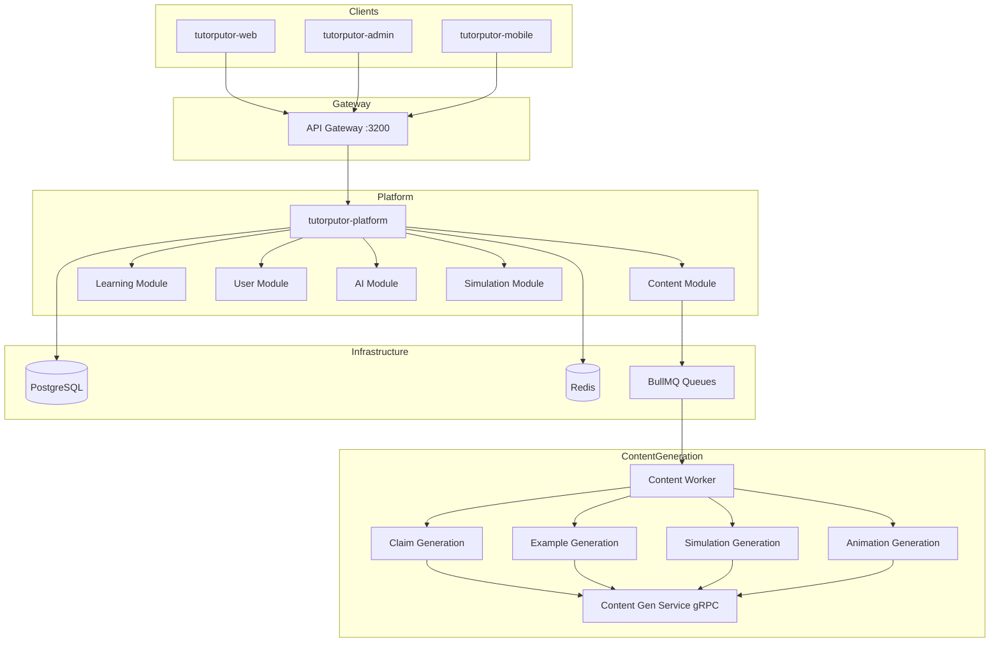

# TutorPutor Architecture

This page is an orientation guide, not the final product-truth document.

Use these as the authoritative high-level sources:

- [CURRENT_STATE.md](CURRENT_STATE.md) for what is implemented today
- [../audit/TUTORPUTOR_DEEP_PRODUCT_REALITY_AUDIT_2026-04-19.md](../audit/TUTORPUTOR_DEEP_PRODUCT_REALITY_AUDIT_2026-04-19.md) for the audit findings, gaps, and remediation priorities

## Overview

TutorPutor is an AI-powered adaptive learning platform built as a monorepo with:

- **Platform**: Fastify/Node.js backend (consolidated from 28 microservices)
- **Web**: React 19 student-facing SPA
- **Admin**: React admin dashboard for content authoring
- **Core**: Shared Prisma schema and generated client
- **Simulation**: Simulation engine library

## Architecture Principles

TutorPutor follows these key architectural principles:

- **Domain-Driven Design (DDD)**: Clear domain boundaries with bounded contexts for Content, Learning, User, AI, Simulation, and Integration modules
- **Layered Architecture**: Separation of concerns with distinct layers for presentation, application, domain, and infrastructure
- **Event-Driven Architecture**: Asynchronous communication using BullMQ for content generation and background processing
- **Microservices Pattern**: Service-oriented architecture with gRPC for inter-service communication
- **Separation of Concerns**: Clear boundaries between transport, domain logic, persistence, and infrastructure

## Current Delivery Posture

Current delivery posture:

- The learner and admin web apps are the supported product surfaces.
- The mobile workspace is a foundation area for offline and sync capabilities, not a production-ready learner app.
- VR APIs and schema support exist, but VR is still a scaffold/foundation area rather than a production-ready learner surface.

## System Architecture

### High-Level Flow



## Module Structure

| Module | Path | Responsibility |
|--------|------|----------------|
| Content | `services/tutorputor-platform/src/modules/content` | Content authoring, generation, manifests |
| Learning | `services/tutorputor-platform/src/modules/learning` | Learning experiences, pathways |
| User | `services/tutorputor-platform/src/modules/user` | Authentication, profiles, RBAC |
| AI | `services/tutorputor-platform/src/modules/ai` | AI orchestration, Ollama integration |
| Simulation | `services/tutorputor-platform/src/modules/simulation` | Simulation engine integration |
| Integration | `services/tutorputor-platform/src/modules/integration` | LTI, SSO, webhooks |

## Platform Status Notes

### Mobile App
The mobile application (`apps/tutorputor-mobile/`) is currently in development with offline-first architecture using React Native 0.85, SQLite, MMKV, and background sync services. Core screens and navigation are implemented, but full production deployment to app stores is pending.

### Offline Mode
Offline capabilities are specified in `architecture/specs/OFFLINE_MODE.md` but full implementation (IndexedDB, ServiceWorker, delta sync logic) is not yet complete. The current mobile app includes offline support with SQLite and background sync.

### Real-Time Collaboration
Real-time collaboration features are implemented using:
- **WebSockets** for real-time cursor tracking and presence
- **Redis pub/sub** for chat messaging (not Redis streams as previously documented)
- **Prisma/database** for Q&A threads, shared notes, and discussion boards

## Key Technologies

| Layer | Technology |
|-------|------------|
| Backend | Fastify, TypeScript, Prisma |
| Frontend | React 19, TypeScript |
| Database | PostgreSQL 15 |
| Cache | Redis 7 |
| Queue | BullMQ |
| gRPC | Connect, Protobuf |
| AI | Ollama, LangChain |
| Testing | Vitest, Playwright |

## API Routes

Tutorputor exposes root observability routes plus product APIs. Root routes are registered directly on the platform service:

- `/health` for deep health checks
- `/metrics` for Prometheus metrics

Product APIs are mounted under the following namespaces:

| Namespace | Module |
|-----------|--------|
| `/api/v1/modules` | Content |
| `/api/v1/learning` | Learning |
| `/api/v1/assessments` | Learning |
| `/api/v1/auth` | User |
| `/api/v1/ai` | AI |
| `/api/v1/integration` | Integration |
| `/api/sim-author` | Simulation |
| `/api/content-studio` | Content |

Module-scoped health routes live under their mounted prefixes, while the canonical product-wide probes stay at the root service level. The Prometheus metric definitions and registration live in `services/tutorputor-platform/src/core/observability/metrics.ts`.

## Development

Use the `ttr` command for all operations:

```bash
ttr dev         # Start development
ttr test        # Run tests
ttr doctor      # Health check
ttr migrate     # Run migrations
ttr logs        # View logs
```

See [bin/README.md](../../bin/README.md) for full command reference.

Supported local validation topology:

- Gateway: `http://127.0.0.1:3200`
- Learner app: `http://127.0.0.1:3201`
- Admin app: `http://127.0.0.1:3202`
- Direct platform service: `http://127.0.0.1:7105`

The learner and admin apps talk to the gateway on `3200`. The direct platform process on `7105` remains part of the supported local stack for backend validation, health checks, and focused service debugging.

## Documentation

- [CURRENT_STATE.md](CURRENT_STATE.md) - Current implementation status and the primary product-state source
- [../audit/TUTORPUTOR_DEEP_PRODUCT_REALITY_AUDIT_2026-04-19.md](../audit/TUTORPUTOR_DEEP_PRODUCT_REALITY_AUDIT_2026-04-19.md) - Audit source and remediation backlog
- [IMPLEMENTATION_PLAN.md](IMPLEMENTATION_PLAN.md) - Autonomous content roadmap
- [TUTORPUTOR_FLOW_MAP.md](TUTORPUTOR_FLOW_MAP.md) - Detailed flow diagrams
- [TUTORPUTOR_MODULE_INVENTORY.md](TUTORPUTOR_MODULE_INVENTORY.md) - Module catalog
- [specs/PRODUCT_SPEC.md](specs/PRODUCT_SPEC.md) - Product specification
