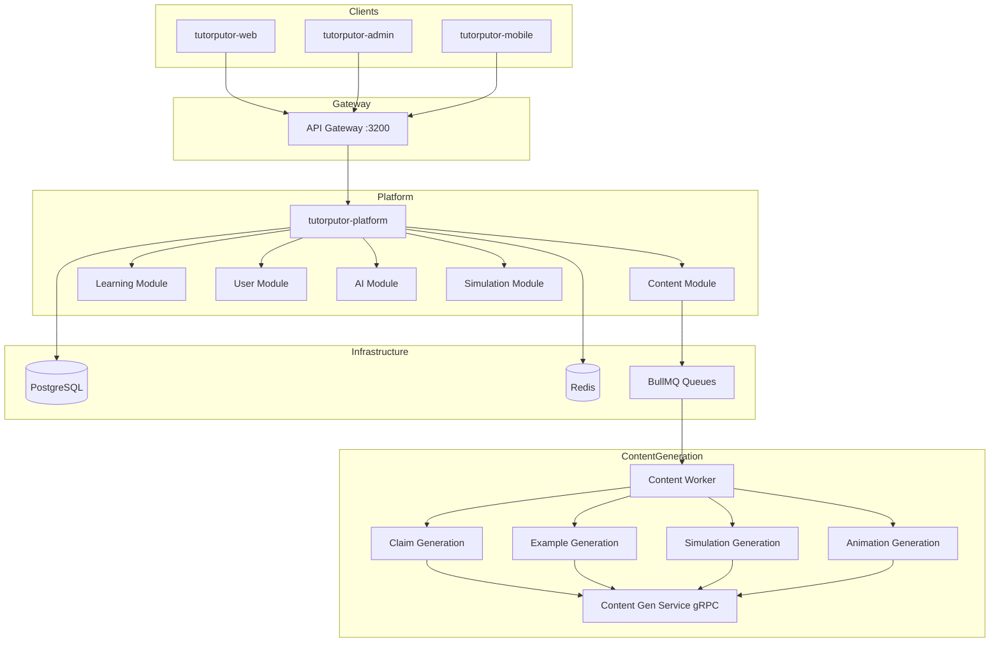

# TutorPutor Architecture

## Overview

TutorPutor is an AI-powered adaptive learning platform built as a monorepo with:

- **Platform**: Fastify/Node.js backend (consolidated from 28 microservices)
- **Web**: React 19 student-facing SPA
- **Admin**: React admin dashboard for content authoring
- **Core**: Shared Prisma schema and generated client
- **Simulation**: Simulation engine library

## System Architecture

### High-Level Flow



## Module Structure

| Module | Path | Responsibility |
|--------|------|----------------|
| Content | `services/tutorputor-platform/src/modules/content` | Content authoring, generation, manifests |
| Learning | `services/tutorputor-platform/src/modules/learning` | Learning experiences, pathways |
| User | `services/tutorputor-platform/src/modules/user` | Authentication, profiles, RBAC |
| AI | `services/tutorputor-platform/src/modules/ai` | AI orchestration, Ollama integration |
| Simulation | `services/tutorputor-platform/src/modules/simulation` | Simulation engine integration |
| Integration | `services/tutorputor-platform/src/modules/integration` | LTI, SSO, webhooks |

## Key Technologies

| Layer | Technology |
|-------|------------|
| Backend | Fastify, TypeScript, Prisma |
| Frontend | React 19, TypeScript |
| Database | PostgreSQL 15 |
| Cache | Redis 7 |
| Queue | BullMQ |
| gRPC | Connect, Protobuf |
| AI | Ollama, LangChain |
| Testing | Vitest, Playwright |

## API Routes

All routes under `/api/v1/`:

| Namespace | Module |
|-----------|--------|
| `/api/v1/modules` | Content |
| `/api/v1/learning` | Learning |
| `/api/v1/assessments` | Learning |
| `/api/v1/auth` | User |
| `/api/v1/ai` | AI |
| `/api/sim-author` | Simulation |
| `/api/content-studio` | Content |

## Development

Use the `ttr` command for all operations:

```bash
ttr dev         # Start development
ttr test        # Run tests
ttr doctor      # Health check
ttr migrate     # Run migrations
ttr logs        # View logs
```

See [bin/README.md](../../bin/README.md) for full command reference.

## Documentation

- [CURRENT_STATE.md](CURRENT_STATE.md) - Current implementation status
- [IMPLEMENTATION_PLAN.md](IMPLEMENTATION_PLAN.md) - Autonomous content roadmap
- [TUTORPUTOR_FLOW_MAP.md](TUTORPUTOR_FLOW_MAP.md) - Detailed flow diagrams
- [TUTORPUTOR_MODULE_INVENTORY.md](TUTORPUTOR_MODULE_INVENTORY.md) - Module catalog
- [specs/PRODUCT_SPEC.md](specs/PRODUCT_SPEC.md) - Product specification
