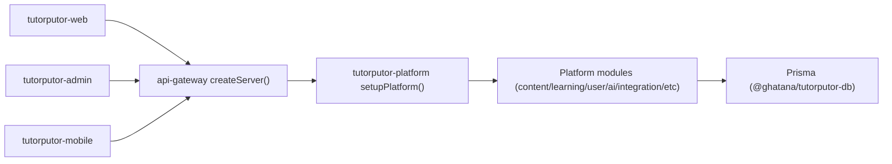
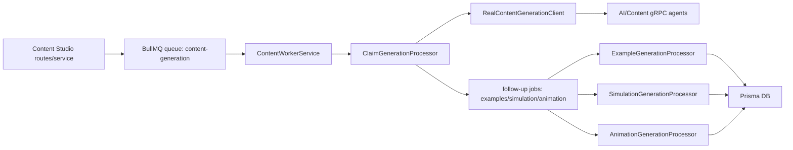
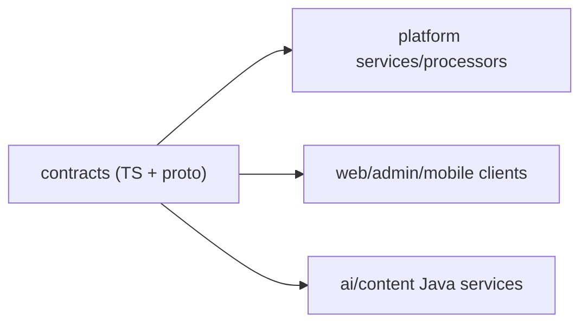
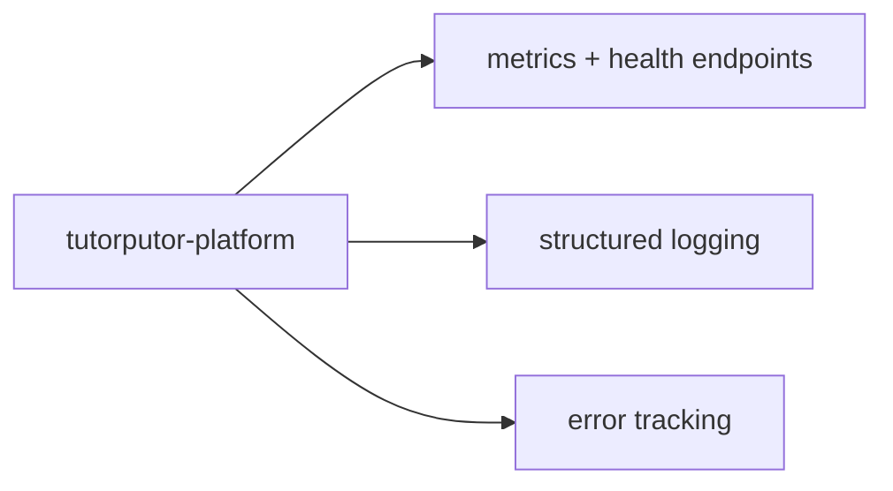

# TUTORPUTOR_FLOW_MAP

Last audit update: 2026-03-08

## 1) UI -> API -> Service -> DB

Validation evidence:
- `apps/api-gateway` targeted `build` + `test` PASS.
- Platform module-level tests partially pass (targeted worker/studio tests), but full platform gate is FAIL.

## 2) API -> Queue -> Worker -> DB / gRPC agents

Validation evidence:
- New automation PASS: `platform-content-worker-tests.log`.
- New automation PASS: `platform-content-studio-service-tests.log`.
- Open integration risk: content generation proto/service drift for `GenerateAnimation` (contract exists in one proto, backend implementation coverage incomplete).

## 3) Contract -> Implementation -> Consumer

Validation evidence:
- `contracts` build/test PASS.
- Multiple downstream type/build failures indicate unresolved contract drift in consumers.

## 4) Observability / Health / Ops

Validation evidence:
- Health/metrics routes present.
- Full reliability verification is FAIL due broad gate failures and incomplete integration execution (e2e, migration, security audit).

## Flow-level gaps requiring closure
1. `GenerateAnimation` end-to-end contract alignment across gRPC server/client implementations is incomplete.
2. Queue-backed flows are now fail-fast on enqueue errors (good), but full distributed integration test coverage is still not complete.
3. Several consumer modules fail type/build/test, so contract-to-consumer flow is not release-safe.
